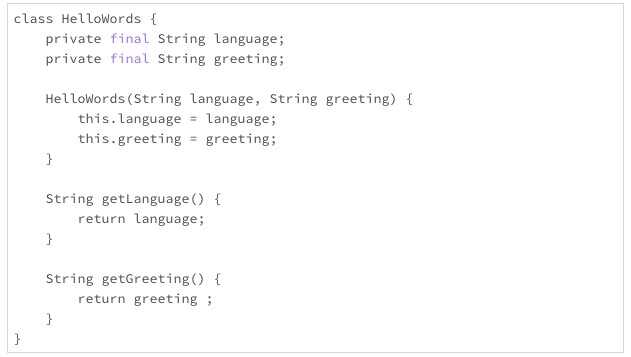
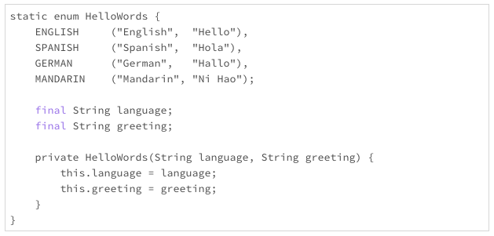
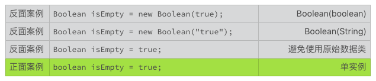
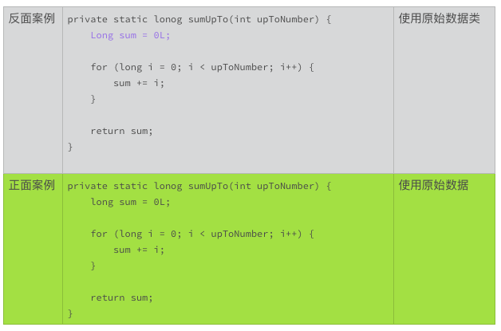

# 23 | 怎么减少内存使用，减轻内存管理负担？

管理内存，不管是什么编程语言，向来都是一个难题。Java 语言能够长期领先的一个重要原因，就是它拥有强大的内存管理能力，并且这种能力还在不断地进化。然而，只依靠 Java 内在的内存管理能力，是远远不够的。


2018 年 9 月，亚马逊向 OpenJDK 社区提交了一个改进请求。这个改进涉及到一个问题，如果一个服务的缓存数量巨大，比如说有 10 万个连接会话，Java 的垃圾处理器要停滞几分钟，才能清理完这么巨大的缓存。而这几分钟的停滞，是不可忍受的事故。


这是一个值得我们关注的细节。缓存的本意，就是为了提高效率。然而，拥有过多的用户，过多的缓存，反而会让效率变低。


随着大数据、云计算以及物联网的不断演进，很多技术都面临着巨大的挑战。七八年前（2010 年左右），能解决 C10K（同时处理 1 万个用户连接）问题，感觉就可以高枕无忧了。现在有不少应用，需要开始考虑 C10M（同时处理 1 千万个用户连接）问题，甚至是更多的用户连接，以便满足用户需求。很多以前不用担心的问题，也会冒出来算旧账。


要想让内存使用得更有效率，我们还需要掌握一些成熟的实践经验。

## 使用更少的内存

提高内存使用最有效率的办法，就是使用更少的内存。这听起来像是废话，却也是最简单直接、最有用的办法。减少内存的使用，意味着更少的内存分配、更少的内存填充、更少的内存释放、更轻量的垃圾回收。内存的使用减少一倍，代码的效率会成倍地提升，这不是简单的线性关系。


减少内存的使用，办法有且只有两个。第一个办法是减少实例的数量。第二个办法是减小实例的尺寸。

## 减少实例数量

还记得以前我们用到的，在不同的语言环境下，该怎么打招呼的代码吗？上一次，我们把它改成了不可变的类，避免了线程同步的问题。我把这段代码重新抄录在下面。



这段代码还有个问题，就是内存使用不够友好。对于汉语环境来说，打招呼用“你好”。如果使用上面的设计，那么每次使用汉语环境，调用构造方法，都产生一个不同的实例对象。


如果只实例化一次，当然没有什么问题。如果要实例化 10 次，100 次，1000 次，10000 次，而且每个实例都是固定的汉语加“你好”，这就是很大的浪费了。内存的使用，随着实例的数量线性增长，100 个实例，就要使用 100 倍的内存。即便实例的产生和废弃都非常迅速，在巨大的实例数量面前，Java 的垃圾处理器也会有很大的压力。

```java
HelloWords helloWords = new HelloWords("Chinese", "Ni Hao");
......
 
System.out.prinyln(
        "The hello words in Chinese: " + helloWords.getGreeting());
```

如果一种语言环境的打招呼的办法是固定不变的，而且语言环境的数量有限的话，我们就只有必要使用一个实例。


如果有了这个意识的话，那么对于这个打招呼的代码，我们就可以很自然地想到使用枚举类型，把它改进成下面的样子。



使用了枚举类型后，每一种语言就只有一个实例了。不管使用多少次，对内存的影响，对 Java 的垃圾处理器的影响，几乎可以忽略不计。


对于数量有限的对象，我们应该优先考虑使用枚举类型，比如交通标志，国家名称等等。其实，枚举类型就是一种常用的数据静态化的范例。我们还会在后面讨论其他类似的数据静态化的处理方式。

### 避免不必要的实例

Java 语言里，有一些历史遗留的接口设计问题，会无意中导致不必要的实例。我们下面来看看两个例子。


第一个例子是应用程序使用了不必要的构造函数。比如，使用 String 的构造函数实例化一串字符。


上面的反面实例，每次调用都会产生一个实例对象，而这个实例对象需要交给 Java 垃圾处理器管理。事实上，由于 String 是一个不可变的类，每次调用产生的实例没有任何的区别。如果这样的代码经常使用，比如说被调用了十万次，就会有十万个实例对象产生，Java 垃圾处理器就需要管理十万个实例。


这是一个很大的，不必要的开销。上面的两个正面案例，使用单实例的编码习惯，无论这段代码被调用了多少次，在 Java 的运行环境下，都只有一个实例。而且，相同的字符串，即使位于不同的代码空间里，在同一 Java 的运行环境下，也都只有一个实例。


String 类的这个构造函数，是一个接口设计的历史遗留问题，价值小，问题多。Java 基础类库里，还有一些类似的历史遗留问题，特别是原始数据类型（primitive type）对应的类。我们要避免使用它们的构造方法，甚至避免使用这些类。




幸运的是，这些原始数据类型对应类的构造方法，从 Java 9 开始，就已经被废弃了。但是这些方法依然存在，这些类依然存在。不论在哪里，如果你看到还有代码使用原始数据类型的构造函数，都可以提交一个问题报告。这样的更改，付出少，收益大。

### 避免使用原始数据类

通过上面的讨论，我们可以理解，为什么要避免使用原始数据类型的构造方法。可是为什么还要避免使用原始数据类呢？这里涉及到 Java 原始数据类型的自动装箱（boxing）与拆箱（unboxing）的类型转换。


比如说，下面的代码，就涉及到一个装箱的过程。整数 0 和 2 都要先被转换成一个 Long 类的实例，然后才执行赋值操作。

```java
Long sum = 0L;
sum += 2；
```

这个装箱的过程，就产生了不必要的实例。如果这样的转换数量巨大，就会有明显的性能影响。



### 使用单实例模式

由于 Java 内在的单实例模式，我们可以很方便地使用 Java 的原始数据类型，而不用担心实例数量的增长。对于复合的类，我们也可以自己设计单实例模式，从而减少多实例带来的不必要的开销。


比如，下面的代码，就是一个单实例模式例子。

```java
class HelloWords {
    private static final HelloWords ENGLISH =
        new HelloWords("English", "Hello");
    private static final HelloV/ords MANDARIN =
        new HelloWords("Mandarin", "Ni Hao");
    final String language;
    final String greeting;
    private HelloWords(String language, String greeting) {
        this.language = language;
        this.greeting = greeting;
    }
    public HelloWords getInstance(String language) {
        // snipped
    }
}
```

单实例的设计方法有很多种方式，也有很多小细节需要处理，限于篇幅，我们就不在这里讨论这些技术了。欢迎你在讨论区分享你的经验和想法，来丰富这一部分的内容。

## 减小实例的尺寸

减少内存的使用还有另外一个办法，就是减小实例的尺寸。所谓减少实例的尺寸，就是减少这个实例占用的内存空间。这个空间，不仅包括实例的变量标识符占用的空间，还包括标识符所包含对象的占用空间。


比如下面的例子中，使用了 String 构造方法的变量，就独占了包括“Java”这四个字符的 String 实例空间。而使用了字符串赋值的变量，就和其他代码一起共享“Java”这四个字符的缺省的实例空间。

| String programingLanguage = new String(“Java”); | 独占空间 |
| ----------------------------------------------- | -------- |
| String programingLanguage = “Java”;             | 共享实例 |

在减少变量数量这一方面，我们一般没有太多的自由空间。那么，在减少实例尺寸方面，我们能有所作为的，就是在标识符所指对象方面多费心思。简单地说，就是减少标识符所引用对象的尺寸。办法也有两个，第一个是尽量减少独占的空间；第二个是尽量使用共享的实例。


尽可能多地共享资源，这是一条提高效率的基本原则。在编写代码时，如果能够引用，就坚决不要拷贝；如果能够复用，就坚决不要新创。当然，资源的共享，除了上一次提到的线程同步问题，还有一个资源的维护问题。一个资源，如果不需要维护，那就太理想了。


有两类理想的共享资源，一类是一成不变（immutable）的资源，另一类是禁止修改（unmodifiable）的资源。

## 不可变的类

上一次，在讨论线程同步问题时，我们也讨论了不可变的类。由于不可变的类一旦实例化，就不再变化，我们可以放心地在不同的地方使用它的引用，而不用担心任何状态变化的问题。

## 无法修改的对象

还有一类对象，虽然不是不可变的类的实例，但是它的修改方法被禁止了。当我们使用这些对象的代码时，没有办法对它做出任何修改。这样，这些对象就有了和不可变的实例一样的优点，可以放心地引用。


从 Java 8 开始，Java 核心类库通过 Collections 类提供了一系列的生成不可更改的集合的方法。这些方法，极大地减轻了集合的共享和维护问题。


比如，下面的这个方法，就返回了一个不可更改的列表对象。这个对象，可以赋值给多个标识符，不需要列表的拷贝，也不用担心列表的维护问题。在合适的场景，考虑使用好不可更改的集合，是一个值得推荐的编码习惯。

```java
public List<byte[]> getStatusResponses() {
    List<byte[]> responses = new ArrayList<>();
    // snipped
 
    return Collections.unmodifiableList(responses);
}
```

毋庸置疑的是，我们不能总是使用不变的共享资源。可以变化的共享资源也有难以替代的作用。后面的章节，我们再接着讨论使用可变的共享资源的技巧。

## 小结

今天，我们主要讨论了怎么减少内存使用。基本的方向有两个，一个是减少实例数量，另一个是减少实例的尺寸。这两个方向看着都很简单，我们在编码时，要养成考虑这两个因素的习惯。想得多了，用得多了，你编写的代码对内存就会越来越友好，设计的接口也会越来越好用。


应用程序方面，内存使用的优化技术和实践有很多。欢迎你在留言区，讨论这些技术和经验，分享你使用这些技术的心得体会，我们一起来学习、精进。

## 一起来动手

我上面使用的一个例子，写得确实很丑陋。不过，当我想到，可以把它当作一个练手题的时候，我就稍微宽心了点。


你琢磨琢磨下面的这段代码，看看能不能实现 getInstance() 这个方法。该怎么修改，才能让这个方法更有效率？


另外，你能想明白为什么构造方法会设计成私有方法吗？变量为什么没有使用 private 关键字？这些小细节很有意思，如果你已经清楚了这些细节背后的原因，也欢迎你分享在讨论区。


欢迎你在留言区讨论上面的问题，也可以把这篇文章分享给你的朋友或者同事，我们一起来看看这个有点丑的代码，可以变得有多美。

```java
class HelloWords {
    private static final HelloWords ENGLISH =
        new HelloWords("English", "Hello");
    private static final HelloV/ords MANDARIN =
        new HelloWords("Mandarin", "Ni Hao");
    final String language;
    final String greeting;
    private HelloWords(String language, String greeting) {
        this.language = language;
        this.greeting = greeting;
    }
    public HelloWords getInstance(String language) {
        // snipped
    }
}
```


## 1716143665 拼课微信(10)

- 

  pyhhou

  2019-03-11

  **3

  仅仅在这个代码基础上改的话：

  ```java
  public HelloWords getInstance(String language) {
     if (language.equals(ENGLISH.language)) {
        return ENGLISH;
     }
     
     if (language.equals(MANDARIN.language)) {
        return MANDARIN;
     }
     
     throw IllegalArgumentException("This language doesn't exist");
  }
  ```

  用 private 来定义构造方法是为了防止类的使用者通过 new 的方式来产生新的对象，在这样的方式下，类的使用者只能通过类中的 static 对象中的 getInstance 方法来获取已经存在的对象，从而减轻了内存管理的负担

  不用 private 来定义变量是因为类的使用者通过 getInstance 方法只能获取类的实例，也就是对象，但是对于对象里面的内容（language、greeting）还需进一步的获取; 用 final 去定义这些变量是为了防止类的使用者更改 static 对象中的内容，因为更改后会导致内容发生全局性的改变，从而和对象本身不匹配

  但是个人认为这样的设计并没有很好的体现我们之前讲的 “简单直观” 的理念，首先这里存在着很深的嵌套，就是：类 -> static 对象 -> getInstance 方法 -> static 对象 -> 变量，这么分析看来设计并不直观，对于我来说，刚开始理解还比较的困难，所以可以考虑前面的将这里的 getInstance 方法改为 static 的方法，另外就是可以设一个 getGreeting 的方法去取得 instance 中的内容，用户通过函数 API 的方式获取内部信息而不是直接获取，在这种情况下我们可以将变量设为 private，这样比较好的隐藏内部实现，当然我们也可以使用之前提到的 enum 去实现:

  ```java
  static enum Hellowords {
     ENGLISH ("English", "Hello"),
     MANDARIN ("Ni Hao");
  
     final String language;
     final String greeting;
  
     private HelloWords(String language, String greeting) {
        this.language = language;
        this.greeting = greeting;
     }
  }
  ```

  

  展开**

  作者回复: 你的留言里，有大量的深入思考，要点赞！

- 

  轻歌赋

  2019-02-25

  **2

  因为这是final修饰的变量，又是string，属性不可改变
  可以考虑改成enum，或者是单例模式
  单例模式推荐内部静态类持有的方式，相对更简单
  如果使用容器化管理，例如spring，可以考虑注册成两个bean，通过规范约束不得创建，但是编程层面的约束力相对薄弱

  展开**

  作者回复: 嗯，可以考虑使用内部静态类持有的方式。

- 

  君不得闲

  2019-02-25

  **1

  public static HelloWords getInstance(String language){
      if ("English".equals(language)) {
        return ENGLISH;
      }

  ​    if ("Mandarin".equals(language)) {
  ​      return MANDARIN;
  ​    }

  ​    throw new IllegalStateException("This language is not supported");
    }

  构造方法没有实例化是为了避免使用者调用生成多实例，违背设计减少实例数量的初衷。
  至于变量为什么不使用private关键字百思不得其解。因为如果没有修饰符修饰就代表只要是相同包内都可以对该类生成的实例的变量进行直接修改，但是final关键字又对这种修改做了限制,说明这两个是不可修改的常量，因为没有static修饰，说明这个常量是实例私有的，个人想法是已经用final了就没有必要用private修饰的多此一举了，就像接口的方法不用特意声明public abstract一样。

  展开**

  作者回复: 异常类型使用IllegalArgumentException或者一个检查型异常，会好一点点。

- 

  往事随风，...

  2019-02-25

  **1

  构造器使用私有的，不允许实例化多个类，减少实例数量，变量没有私有化是因为string 不可变的类。

- 

  Sisyphus2...

  2019-05-23

  **

  内存管理这里说的大多是 Java 的语境，能够给一些通用的经验，如何在其他语言和框架下处理，而不是使用特定的包或者语言工具？

  作者回复: 这些原则同样适用于其他语言。你可以试试把它们运用到C++/C/GoLang等其他语言.

- 

  Geek_28d7f...

  2019-05-21

  **

  单例模式破坏类的封装，现在很多开源代码尽量避免使用单例，是不是能不用单例就不用单例

  作者回复: 很多场景下，单例模式是优先选择。 比如enum就是单例模式的典范。所以，要看具体的场景，具体的状况。

- 

  天佑

  2019-04-14

  **

  “在编写代码时，如果能够引用，就坚决不要拷贝”
  这里不适用公共接口设计场景吧，考虑可变量的危害。

  作者回复: 是的。这里我加了个限定词“如果能够引用”，读到后面的文章，就知道这个限定词的作用了。外部接口，可变量要遵循审慎的原则，尽量拷贝或者规范明确标明不拷贝；内部实现的代码，如果清楚可变量的传递和变化不会捣乱，使用引用就行。

- 

  天佑

  2019-03-11

  **

  在编写代码时，如果能够引用，就坚决不要拷贝，老师您好，这样子做不会出现安全问题么，那入参防御性复制的使用场景是什么，有点糊涂了，期待老师答疑。

  展开**

  作者回复: 有安全问题，就不算可以引用了。什么时候防御性复制，什么时候不用复制，我们在第三部分还会说这个问题。

- 

  徐题

  2019-03-06

  **

  final修饰的类，它的成员变量也是final的吗？

  展开**

  作者回复: 不是，除非成员变量使用了final修饰符。修饰符修饰什么，就对什么起作用，不要扩大范围。

- 

  草原上的奔...

  2019-03-02

  **

  单例模式用枚举来实现比较好，不用考虑多线程同步问题，JVM会处理好。关于类的成员变量没有限定修饰符，那就是包共享的，用final修饰，则初始化后不可更改，String又是一个immutable的类，则成员变量可以当成常量在包中共享，且无并发问题。