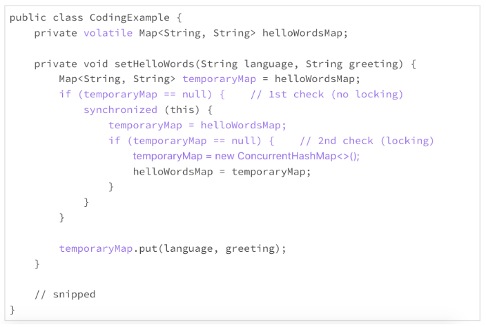

# 24 | 黑白灰，理解延迟分配的两面性

上一次，我们讨论了减少内存使用的两个大方向，减少实例数量和减少实例的尺寸。如果我们把时间的因素考虑在内，还有一些重要的技术，可以用来减少运行时的实例数量。其中，延迟分配是一个重要的思路。

## 延迟分配

在前面讨论怎么写声明的时候，为了避免初始化的遗漏或者不必要的代码重复，我们一般建议“声明时就初始化”。但是，如果初始化涉及的计算量比较大，占用的资源比较多或者占用的时间比较长，声明时就初始化的方案可能会占用不必要的资源，甚至成为软件的一个潜在安全问题。


这时候，我们就需要考虑延迟分配的方案了。也就是说，不到需要时候，不占用不必要的资源。


下面，我们通过一个例子来了解下什么是延迟分配，以及延迟分配的好处。


在 Java 核心类中，ArrayList 是一个可调整大小的列表，内部实现使用数组存储数据。它的优点是列表大小可调整，数组结构紧凑。列表大小可以预先确定，并且在大小不经常变化的情况下，ArrayList 要比 LinkedList 节省空间，所以是一个优先选项。


但是，一旦列表大小不能确定，或者列表大小经常变化，ArrayList 的内部数组就需要调整大小，这就需要内部分配新数组，废弃旧数组，并且把旧数组的数据拷贝到新数组。这时候，ArrayList 就不是一个好的选择了。


在 JDK 7 中，ArrayList 的实现可以用下面的一小段伪代码体现。你可以从代码中体会下内部数组调整带来的“酸辣”。

```java
package java.util;
 
public class ArrayList<E> extends AbstractList<E>
        implements List<E>, RandomAccess, Cloneable, java.io.Serializable {
 
    private transient Object[] elementData;
    private int size;
 
    public ArrayList() {
        this.elementData = new Object[10];
    }
 
    @Override
    public boolean add(E e) {
        ensureCapacity(size + 1);
        elementData[size++] = e;
 
        return true;
    }
 
    private void ensureCapacity(int minCapacity) {
        int oldCapacity = elementData.length;
 
        if (minCapacity > oldCapacity) {
            Object oldData[] = elementData;
            int newCapacity = (oldCapacity * 3) / 2 + 1;
            if (newCapacity < minCapacity) {
                newCapacity = minCapacity;
            }
 
            elementData = Arrays.copyOf(elementData, newCapacity);
        }
    }
}
```

这段代码里的缺省构造方法，分配了一个可以容纳 10 个对象的数组，不管这个大小合不合适，数组需不需要。这看似不起眼的大小为 10 的数组，在高频率的使用环境下，也是一个不小的负担。


在 JDK 8 中，ArrayList 的实现做了一个小变动。这个小变动，可以用下面的一小段伪代码体现。

```java
package java.util;
 
public class ArrayList<E> extends AbstractList<E>
        implements List<E>, RandomAccess, Cloneable, java.io.Serializable {
 
    private static final Object[] DEFAULTCAPACITY_EMPTY_ELEMENTDATA = {};
 
    private transient Object[] elementData;
    private int size;
 
    public ArrayList() {
        this.elementData = DEFAULTCAPACITY_EMPTY_ELEMENTDATA;
    }
 
    // snipped
}
```

改动后的缺省构造方法，不再分配内部数组，而是使用了一个空数组。要等到真正需要存储数据的时候，才为这个数组分配空间。这就是所谓的延迟初始化。


这么小的变动带来的好处到底有多大呢？这个改动的报告记录了一个性能测试结果，改动后的内存的使用减少了 13%，平均响应时间提高了 16%。


你是不是很吃惊这样的结果？这个小改动，看起来真的不起眼。代码的优化对于性能的影响，有时候真的是付出少、收益大。


从 ArrayList 的上面的改动，我们能够学习到什么东西呢？我学到的最重要的东西是，对于使用频率高的类的实现，微小的性能改进，都可以带来巨大的实用价值。


在前面讨论[怎么写声明](https://time.geekbang.org/column/article/78288)的时候，我们讨论到了“**局部变量需要时再声明**”这条原则。局部变量标识符的声明应该和它的使用尽可能地靠近。这样的规范，除了阅读方面的便利之外，还有效率方面的考虑。局部变量占用的资源，也应该需要时再分配，资源的分配和它的使用也要尽可能地靠近。

## 延迟初始化

延迟分配的思路，就是用到声明时再初始化，这就是延迟初始化。换句话说，不到需要的时候，就不进行初始化。


下面的这个例子，是我们经常使用的初始化方案，声明时就初始化。

```java
public class CodingExample {
    private final Map<String, String> helloWordsMap = new HashMap<>();
    
    private void setHelloWords(String language, String greeting) {
        helloWordsMap.put(language, greeting);
    }
    // snipped
}
```

声明时就初始化的好处是简单、直接、代码清晰、容易维护。但是，如果初始化占用的资源比较多或者占用的时间比较长，这个方案就有可能带来一些负面影响。我们就要慎重考虑了。


在 JDK 11 之前的 Java 版本中，按照 HashMap 类构造方法的内部实现，初始化的实例变量 helloWordsMap，要缺省地分配一个可以容纳 16 个对象的数组。这个缺省的数组尺寸，比 JDK 7 中的 ArrayList 缺省数组还要大。如果后来的方法使用不到这个实例变量，这个资源分配就完全浪费了；如果这个实例变量没有及时使用，这个资源的占用时间就拉长了。


这个时候是不是可以考虑延迟初始化？下面的例子，就是一种延迟初始化的实现方法。

```java
public class CodingExample {
    private Map<String, String> helloWordsMap;
 
    private void setHelloWords(String language, String greeting) {
        if (helloWordsMap == null) {
            helloWordsMap = new HashMap<>();
        }
        
        helloWordsMap.put(language, greeting);
    }
 
    // snipped
}
```

上面的例子中，实例变量 helloWordsMap 只有需要时才初始化。这的确可以避免内存资源的浪费，但代价是要使用更多的 CPU。检查实例变量是否已经能初始化，需要 CPU 的额外开销。这是一个内存和 CPU 效率的妥协与竞争。


而且，除非是静态变量，否则使用延迟初始化，一般也意味着放弃了使用不可变的类可能性。这就需要考虑多线程安全的问题。上面例子的实现，就不是多线程安全的。对于多线程环境下的计算，初始化时需要的线程同步也是一个不小的开销。


比如下面的代码，就是一个常见的解决延迟初始化的线程同步问题的模式。这个模式的效率，还算不错。但是里面的很多小细节都忽视不得，看起来都很头疼。我每次看到这样的模式，即便明白这样做的必要性，也恨不得先休息半天，再来啃这块硬骨头。

```java
public class CodingExample {
    private volatile Map<String, String> helloWordsMap;
 
    private void setHelloWords(String language, String greeting) {
        Map<String, String> temporaryMap = helloWordsMap;
        if (temporaryMap == null) {    // 1st check (no locking)
            synchronized (this) {
                temporaryMap = helloWordsMap;
                if (temporaryMap == null) {    // 2nd check (locking)
                    temporaryMap = new ConcurrentHashMap<>();
                    helloWordsMap = temporaryMap;
                }
            }
        }
        
        temporaryMap.put(language, greeting);
    }
 
    // snipped
}
```

延迟初始化到底好不好，要取决于具体的使用场景。一般情况下，由于规范性带来的明显优势，我们优先使用“声明时就初始化”这个方案。


所以，我们要再一次强调，只有初始化占用的资源比较多或者占用的时间比较长的时候，我们才开始考虑其他的方案。**复杂的方法，只有必要时才使用**。


※注：从 JDK 11 开始，HashMap 的实现做了改进，缺省的构造不再分配实质性的数组。以后我们写代码时，可以省点心了。

## 小结

今天，我们主要讨论了怎么通过延迟分配减少实例数量，从而降低内存使用。


对于局部变量，我们应该坚持“**需要时再声明，需要时再分配**”的原则。


对于类的变量，我们依然应该优先考虑“声明时就初始化”的方案。如果初始化涉及的计算量比较大，占用的资源比较多或者占用的时间比较长，我们可以根据具体情况，具体分析，采用延迟初始化是否可以提高效率，然后再决定使用这种方案是否划算。

## 一起来动手

我上面写的延迟初始化的同步的代码，其实是一个很固定的模式。对于 Java 初学者来说，理解这段代码可能需要费点功夫。评审代码的时候，每次遇到这个模式，我都要小心再小心，谨慎再谨慎，生怕漏掉了某个细节。


借着这个机会，我们一起来把这个模式理解透，搞清楚这段代码里每一个变量、每一个关键词扮演的角色。以后遇到它，我们也许可以和它把手言欢。


我把这段代码重新抄写在了下面，关键的地方加了颜色。我们在讨论区讨论下面这些问题：

1. helloWordsMap 变量为什么使用 volatile 限定词？
2. 为什么要 temporaryMap 变量？
3. temporaryMap 变量为什么要两次设置为 helloWordsMap？
4. 为什么要检查两次 temporaryMap 的值不等于空？
5. synchronized 为什么用在第一次检查之后？
6. 为什么使用 ConcurrentHashMap 而不是 HashMap？
7. 为什么使用 temporaryMap.put() 而不是 helloWordsMap.put()？

如果你有更多的问题，请公布在讨论区，也可以和你的朋友一起讨论。弄清楚了这些问题，我相信我们可以对 Java 语言的理解更深入一步。



## 精选留言(10)

- 

  yang

  2019-02-27

  **12

  1 通过采用java内存模型，保证多线程场景下共享资源的可见性
  2使用局部变量，可以减少主存与线程内存的拷贝次数
  3第一次是初始化，第二次是同步局部变量与属性变量的值，保持一致
  4第一次检查是为了快速获取对象，第二次检查是为了防止对象未初始化，就是标准的double check
  5是为了线程安全，同时高性能，锁范围更小化
  6前者是线程安全，后者是非线程安全
  7还是减少主存与线程内存值拷贝的开销
  个人理解，如有误，敬请指正

  展开**

  作者回复: volatile的使用，需要一定程度的同步，也就是你说的拷贝开销。减少volatile变量的引用，可以提高效率。

  恭喜你，这些Java的难点你掌握的很扎实！

- 

  梦醒时分

  2019-02-27

  **5

  我的思考：
  1.volatile是用来保证变量的可见性的，这样其他线程才能及时看到变量的修改
  2.为啥要使用temporaryMap变量，这里没有想明白
  3.两次设置temporaryMap变量，目的是双重检查，防止进入同步代码块中，变量已被赋值了
  4.同上
  5.synchronized的使用是影响性能的，所有在使用它之前，先校验下是否需要进入同步块中
  6.ConcurrentHashMap是线程安全的，而HashMap不是线程安全的
  7.为啥使用temporaryMap.put不太清楚

  展开**

  作者回复: 关于temporaryMap的使用，请参考@yang的留言。

- 

  唐名之

  2019-03-01

  **1

  @yang回到第二点 使用局部变量，可以减少主存与线程内存的拷贝次数 这个点还是有点不明白能解释下嘛？

- 

  Linuxer

  2019-02-28

  **1

  请问各位思考题中的volatile修饰后是不是就只能用concurrenthashmap?要不赋值给局部变量后主存和线程内存还是不同步

  作者回复: volatile修饰符和使用concurrent hash map关系不大。volatile修饰的是标志符，不是标志符指向的内容。

- 

  Jxin

  2019-05-28

  **

  1.类属性的调用和赋值全部走set和get方法。这种非静态且多次赋值的局部变量应该尽量避免。
  2.带锁初始化操作应该上移到get方法。至少从函数功能来看，我认为初始化应该是属于get的。
  3.我真不喜欢加锁和每次get都做判断，所以了解业务上下文，如果可以，我会直接给该属性做初始化。
  3.如果了解完上下文我对这个集合或则散列表的大小能有一定把我，我会尝试给定一个合适的初始化大小。

  展开**

  作者回复: 👍都是很好的实践经验！ 了解适用场景，是高效代码的关键。

- 

  拉可里啦

  2019-04-07

  **

  作为类的全局变量而非静态变量，只能被类的实例所拥有，那么只有一个对象再操作这个全局变量，单线程操作这个变量不会有线程安全问题，多个线程同时操作这个变量有线程安全问题，是以对象为单位的。不知道我这样理解对不对，还请老师指点指点。

  作者回复: 是的，是以对象为单位的。 所以，你看Java的代码里，synchronized(this), this指的就是一个具体的对象。同一个类，实例化的对象不同，也不需要同步。

- 

  aguan(^･...

  2019-03-07

  **

  恍然大悟，所以局部变量是解决双重检查重排序空指针问题的安全方法👍

  展开**

- 

  aguan(^･...

  2019-03-06

  **

  老师，我有一个疑问，思考题的代码，在多线程的情况下，如果第16行用tempHashmap.put，是会出现空指针的。因为cpu指令重排序，当线程1在执行new map的时候，可能cpu先给temp分配内存空间，对象还没实例化，这时候另外一个线程在第一个if的时候发现temp不为空（因为有地址，但地址里并没有实例化对象），接着去执行16行的代码，会出现空指针问题吧

  展开**

  作者回复: tempHashmap是一个局部变量，不跨越线程。

- 

  轻歌赋

  2019-03-02

  **

  1.双检锁在多CPU情况下存在内存语义bug，通过volatile实现其内存语义
  2.单线程内存一致性语义
  3.多线程并发，存在一个线程先于其他线程设置值的情况
  4.多线程并发，检查helloworldsmap是否被其他线程赋值
  5.提高并发度
  6.代码体现这是一个多CPU多线程的环境，存在map被并发修改的情况，concurrenthashmap是线程安全的，而hashmap是线程不安全的所以使用前者
  7.不知道，感觉像是逻辑上比较顺

  展开**

- 

  多拉格·fi...

  2019-02-27

  **

  这个就是类似于单例里边的双重检查写法吧

  展开**