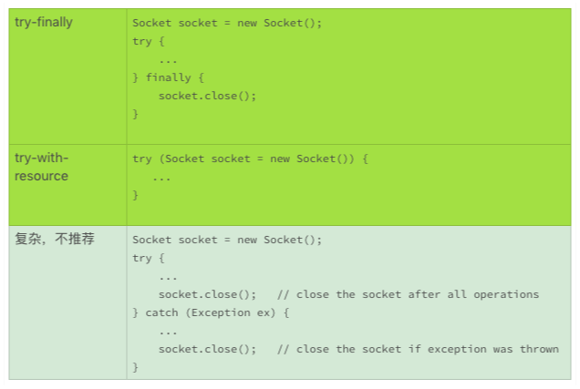
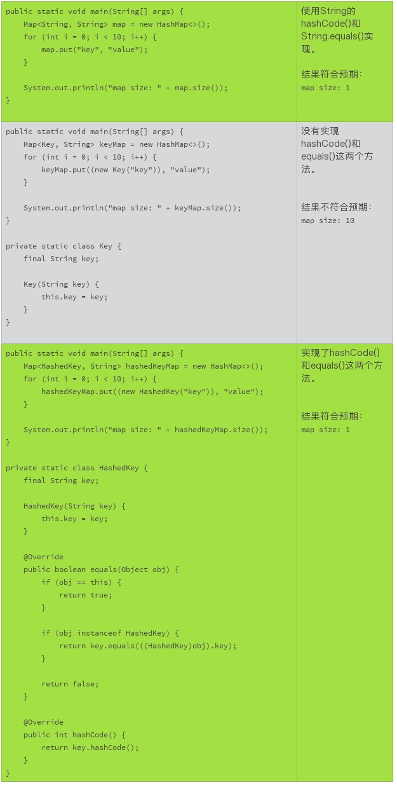

# 26 | 有哪些招惹麻烦的性能陷阱

前面，我们讨论了改善代码性能的最基本的办法。接下来，我们讨论一些最佳实践，让我们先从一些容易被忽略的性能陷阱开始。

## 使用性能测试工具

今天我们的讲解需要用到一个工具，它就是 JMH。JMH 是为 Java 语言或者其他基于 JVM 的编程语言设计的一个基准测试工具。这一节，我们会使用这个工具来分析一些性能的陷阱。这里我们简单地介绍下，这个工具该怎么使用。

第一步，使用 Maven 工具建立一个基准测试项目（需要使用 Maven 工具）：

```shell
$ mvn archetype:generate \
          -DinteractiveMode=false \
          -DarchetypeGroupId=org.openjdk.jmh \
          -DarchetypeArtifactId=jmh-java-benchmark-archetype \
          -DgroupId=com.example \
          -DartifactId=myJmh \
          -Dversion=1.0
```

这个命令行，会生成一个 myJmh 的工程目录，和一个基准测试模板文件（myJmh/src/main/java/com/example/MyBenchmark.java）。通过更改这个测试模板，就可以得到你想要的基准测试了。

比如，你可以使用后面我们用到的基准测试代码，替换掉模板中的基准测试方法（measureStringApend）。

```java
package com.example;
 
import org.openjdk.jmh.annotations.Benchmark;
 
public class MyBenchmark {
    @Benchmark
    public String measureStringApend() {
        String targetString = "";
        for (int i = 0; i < 10000; i++) {
            targetString += "hello";
        }
 
        return targetString;
    }
}
```

第二步，编译基准测试：

```shell
$ cd myJmh
$ mvn clean install
```

第三步，运行你的基准测试：

```shell
$ cd myJmh
$ Java -jar target/benchmarks.jar
```

稍微等待，基准测试结果就出来了。我们需要关注的是"Score"这一栏，它表示的是每秒钟可以执行的基准测试方法的次数。

```shell
Benchmark                Mode  Cnt     Score          Error  Units
MyBenchmark.testMethod  thrpt   25     35.945 ▒       0.694  ops/s
```

这是 JMH 工具基本的使用流程，有关这个工具更多的选项和更详细的使用，需要你参考 JMH 的相关文档。

下面，我们通过字符串连接操作和哈希值的例子，来谈论一下这个工具要怎么使用，以及对应的性能问题。同时，我们再看看其他影响性能的一些小陷阱，比如内存的泄露、未关闭的资源和遗漏的 hashCode。

## 字符串的操作

在 Java 的核心类库里，有三个字符串操作的类，分别问 String、StringBuilder 和 StringBuffer。通过下面的基准测试，我们来了解下这三种不同的字符串操作的性能差异。为了方便，我把 JMH 测试的数据，标注在每个基准测试的方法注释里了。

```java
// JMH throughput benchmark: about 32 operations per second
@Benchmark
public String measureStringApend() {
    String targetString = "";
    for (int i = 0; i < 10000; i++) {
        targetString += "hello";
    }

    return targetString;
}
```

```java
// JMH throughput benchmark: about 5,600 operations per second
@Benchmark
public String measureStringBufferApend() {
    StringBuffer buffer = new StringBuffer();
    for (int i = 0; i < 10000; i++) {
        buffer.append("hello");
    }

    return buffer.toString();
}
```

```java
// JMH throughput benchmark: about 21,000 operations per second
@Benchmark
public String measureStringBuilderApend() {
    StringBuilder builder = new StringBuilder();
    for (int i = 0; i < 10000; i++) {
        builder.append("hello");
    }

    return builder.toString();
}
```

对于字符串连接的操作，这个基准测试结果显示，使用 StringBuffer 的字符串连接操作，比使用 String 的操作快了近 200 倍；使用 StringBuilder 的字符串连接操作，比使用 String 的操作快了近 700 倍。

String 的字符串连接操作为什么慢呢？ 这是因为每一个字符串连接的操作（targetString += “hello”），都需要创建一个新的 String 对象，然后再销毁，再创建。这种模式对 CPU 和内存消耗都比较大。

StringBuilder 和 StringBuffer 为什么快呢？因为 StringBuilder 和 StringBuffer 的内部实现，预先分配了一定的内存。字符串操作时，只有预分配内存不足，才会扩展内存，这就大幅度减少了内存分配、拷贝和释放的频率。

StringBuilder 为什么比 StringBuffer 还要快呢？StringBuffer 的字符串操作是多线程安全的，而 StringBuilder 的操作就不是。如果我们看这两个方法的实现代码，除了线程安全的同步以外，几乎没有差别。

```java
public final class StringBuffer
    extends AbstractStringBuilder
    implements java.io.Serializable, Comparable<StringBuffer>, CharSequence {
    // snipped
 
    @Override
    @HotSpotIntrinsicCandidate
    public synchronized StringBuffer append(String str) {
        toStringCache = null;
        super.append(str);
        return this;
    }
 
    //  snipped
}
```

```java
public final class StringBuilder
    extends AbstractStringBuilder
    implements java.io.Serializable, Comparable<StringBuilder>, CharSequence {
    // snipped
 
    @Override
    @HotSpotIntrinsicCandidate
    public StringBuilder append(String str) {
        super.append(str);
        return this;
    }
 
    // snipped
}
```

JMH 的基准测试，并没有涉及到线程同步问题，难道使用 synchronized 关键字也会有性能损耗吗？

我们再来看看另外一个基准测试。这个基准测试，使用线程不安全的 StringBuilder 以及同步的字符串连接，部分模拟了线程安全的 StringBuffer.append() 方法的实现。为了方便你对比，我把没有使用同步的代码也拷贝在下面。

```java
// JMH throughput benchmark: about 21,000 operations per second
@Benchmark
public String measureStringBuilderApend() {
    StringBuilder builder = new StringBuilder();
    for (int i = 0; i < 10000; i++) {
        builder.append("hello");
    }

    return builder.toString();
} 
```

```java
// JMH throughput benchmark: about 16,000 operations per second
@Benchmark
public String measureStringBuilderSynchronizedApend() {
    StringBuilder builder = new StringBuilder();
    for (int i = 0; i < 10000; i++) {
        synchronized (this) {
            builder.append("hello");
        }
    }

    return builder.toString();
}
```

这个基准测试结果显示，虽然基准测试并没有使用多个线程，但是使用了线程同步的代码比不使用线程同步的代码慢。线程同步，就是 StringBuffer 比 StringBuilder 慢的原因之一。

通过上面的基准测试，我们可以得出这样的结论：

1. 频繁的对象创建、销毁，有损代码的效率；
2. 减少内存分配、拷贝、释放的频率，可以提高代码的效率；
3. 即使是单线程环境，使用线程同步依然有损代码的效率。

从上面的基准测试结果，是不是可以得出结论，我们应该使用 StringBuilder 来进行字符串操作呢？我们再来看几个基准测试的例子。

下面的例子，测试的是常量字符串的连接操作。从测试结果，我们可以看出，使用 String 的连接操作，要比使用 StringBuilder 的字符串连接快 5 万倍，这是一个让人惊讶的性能差异。

```java
// JMH throughput benchmark: about 1,440,000,000 operations per second
@Benchmark
public void measureSimpleStringApend() {
    for (int i = 0; i < 10000; i++) {
        String targetString = "Hello, " + "world!";
    }
}
```

```java
// JMH throughput benchmark: about 26,000 operations per second
@Benchmark
public void measureSimpleStringBuilderApend() {
    for (int i = 0; i < 10000; i++) {
        StringBuilder builder = new StringBuilder();
        builder.append("hello, ");
        builder.append("world!");
    }
}
```

这个巨大的差异，主要来自于 Java 编译器和 JVM 对字符串处理的优化。" Hello, " + " world! " 这样的表达式，并没有真正执行字符串连接。编译器会把它处理成一个连接好的常量字符串"Hello, world!"。这样，也就不存在反复的对象创建和销毁了，常量字符串的连接显示了超高的效率。

如果字符串的连接里，出现了变量，编译器和 JVM 就没有办法进行优化了。这时候，StringBuilder 的效率优势才能体现出来。下面的两个基准测试结果，就显示了变量对于字符长连接操作效率的影响。

```java
// JMH throughput benchmark: about 9,000 operations per second
@Benchmark
public void measureVariableStringApend() {
    for (int i = 0; i < 10000; i++) {
        String targetString = "Hello, " + getAppendix();
    }
}
```

```java
// JMH throughput benchmark: about 26,000 operations per second
@Benchmark
public void measureVariableStringBuilderApend() {
    for (int i = 0; i < 10000; i++) {
        StringBuilder builder = new StringBuilder();
        builder.append("hello, ");
        builder.append(getAppendix());
    }
}
```

```java
private String getAppendix() {
    return "World!";
}
```

通过上面的基准测试，我们可以总结出下面的几条最佳实践：

1. Java 的编译器会优化常量字符串的连接，我们可以放心地把长的字符串换成多行；
2. 带有变量的字符串连接，StringBuilder 效率更高。如果效率敏感的代码，建议使用 StringBuilder。String 的连接操作可读性更高，效率不敏感的代码可以使用，比如异常信息、调试日志、使用不频繁的代码；
3. 如果涉及大量的字符串操作，使用 StringBuilder 效率更高；
4. 除非有线程安全的需求，不推荐使用线程安全的 StringBuffer。

## 内存的泄露

内存泄漏是 C 语言的一个大问题。为了更好地管理内存，Java 提供了自动的内存管理和垃圾回收机制。但是，Java 依然会泄露内存。这种内存泄漏的主要表现是，如果一个对象不再有用处，而且它的引用还没有清零，垃圾回收器就意识不到这个对象需要及时回收，这时候就引发了内存泄露。

生命周期长的集合，是 Java 容易发生内存泄漏的地方。比如，可以扩张的静态的集合，或者存活时间长的缓存等。如果不能及时清理掉集合里没有用处的对象，就会造成内存的持续增加，引发内存泄漏问题。

比如下面这两个例子，就容易发生内存泄露。

静态的集合：

```java
static final List<Object>
         staticCachedObjects = new LinkedList<>();
 
// snipped
staticCachedObjects.add(...);
```

长寿的缓存：

```java
final List<Object>
        longLastingCache = new LinkedList<>();
 
// snipped
longLastingCache.add(...);
```

解决这个问题的办法通常是使用 SoftReference 和 WeakReference 来存储对象的引用，或者主动地定期清理。

静态的集合：

```java
static final List<WeakReference<Object>>
        staticCachedObjects = new LinkedList<>();
 
// snipped
staticCachedObjects.add(...);
```

长寿的缓存：

```java
final List<WeakReference<Object>>
        longLastingCache = new LinkedList<>();
 
// snipped
longLastingCache.add(...);
```

需要注意的是，缓存的处理是一个复杂的问题，使用 SoftReference 和 WeakReference 未必能够满足你的业务需求。更有效的缓存解决方案，依赖于具体的使用场景。

## 未关闭的资源

有很多系统资源，需要明确地关闭，要不然，占用的系统资源就不能有效地释放。比如说，数据库连接、套接字连接和 I/O 操作等。原则上，所有实现了 Closable 接口的对象，都应该调用 close() 操作；所有需要明确关闭的类，都应该实现 Closable 接口。

需要注意的是，close() 操作，一定要使用 try-finally 或者 try-with-resource 语句。要不然，关闭资源的代码可能很复杂。



如果一个类需要关闭，但是又没有实现 Closable 接口，就比较麻烦，比如 URLConnection. URLConnection.connect() 能够建立连接，该连接需要关闭，但是 URLConnection 没有实现 Closable 接口，关闭的办法只能是关闭对应的 I/O 接口，可是关闭 I/O 输入和输出接口中的一个，还不能保证整个连接会完全关闭。谨慎的代码，需要把 I/O 输入和输出都关闭掉，哪怕不需要输入或者输出。但是这样一来，我们的编码负担就会加重。所以最好的方法就是实现 Closable 接口。

双向关闭 I/O：

```java
URL url = new URL("http://www.google.com/");
URLConnection conn = url.openConnection();
conn.connect();
 
try (InputStream is = conn.getInputStream()) {
    // sinnped
}
 
try (OutputStream os = conn.getOutputStream()) {
    // sinnped
}
```

单向关闭 I/O：

```java
URL url = new URL("http://www.google.com/");
URLConnection conn = url.openConnection();
conn.connect();

try (InputStream is = conn.getInputStream()) {
    // sinnped
}

// The output strean is not close, the connection may be still alive.
```

## 遗漏的 hashCode

在使用 Hashtbale、HashMap、HashSet 这样的依赖哈希（hash）值的集合时，有时候我们会忘记要检查产生哈希值的对象，一定要实现 hashCode() 和 equals() 这两个方法。缺省的 hashCode() 实现，返回值是每一个对象都不同的数值。即使是相等的对象，不同的哈希值，使用基于哈希值的集合时，也会被看作不同的对象。这样的行为，可能不符合我们的预期。而且，使用没有实现 hashCode() 和 equals() 这两个方法的对象，可能会造成集合的尺寸持续增加，无端地占用内存，甚至会造成内存的泄漏。

所以，我们使用基于 hash 的集合时，一定要确保集合里的对象，都正确地实现了 hashCode() 和 equals() 这两个方法。



## 撞车的哈希值

实现 hashCode() 这个方法的，并没有要求不相等对象的返回值也必须是不相等的。但是如果返回的哈希值不同，对集合的性能就会有比较大的影响。

下面的两个基准测试结果显示，如果 10,000 个对象，只有 10 个不同的哈希值，它的集合运算的性能是令人担忧的。和使用了不用哈希值的实现相比，性能有几百倍的差异。

这种性能差异，主要是由基于哈希值的集合的实现方式决定的。哈希值如果相同，就要调用其他的方法来识别一个对象。哈希值如果不同，哈希值本身就可以确定一个对象的索引。如果哈希值撞车比例大，这种检索和计算的差距就会很大。

```java
// JMH throughput benchmark: about 5,000 operations per second
@Benchmark
public void measureHashMap() throws IOException {
    Map<HashedKey, String> map = new HashMap<>();
    for (int i = 0; i < 10000; i++) {
        map.put(new HashedKey(i), "value");
    }
}

private static class HashedKey {
    final int key;

    HashedKey(int key) {
        this.key = key;
    }

    @Override
    public boolean equals(Object obj) {
        if (obj == this) {
            return true;
        }

        if (obj instanceof HashedKey) {
            return key == ((HashedKey)obj).key;
        }

        return false;
    }

    @Override
    public int hashCode() {
        return key;
    }
}
```

```java
// JMH throughput benchmark: about 9.5 operations per second
@Benchmark
public void measureCollidedHashMap() throws IOException {
    Map<CollidedKey, String> map = new HashMap<>();
    for (int i = 0; i < 10000; i++) {
        map.put(new CollidedKey(i), "value");
    }
}

private static class CollidedKey {
    final int key;

    CollidedKey(int key) {
        this.key = key;
    }

    @Override
    public boolean equals(Object obj) {
        if (obj == this) {
            return true;
        }

        if (obj instanceof CollidedKey) {
            return key == ((CollidedKey)obj).key;
        }

        return false;
    }

    @Override
    public int hashCode() {
        return key % 10;
    }
}
```

## 小结

今天，我们主要讨论了一些容易被忽略的性能陷阱。比如，字符串怎么操作才是高效的；Java 常见的内存泄漏；资源关闭的正确方法以及集合的相关性能问题。

我们虽然使用了 Java 作为示例，但是像集合和字符串操作这样的性能问题，并不局限于特定的编程语言，你也可以看看你熟悉的编程语言有没有类似的问题。

## 一起来动手

这一次的练手题，我们来练习使用 JMH 工具，分析更多的性能问题。在“撞车的哈希值”这一小节，我们测试了 HashMap 的 put 方法，你能不能测试下其他方法以及其他基于哈希值的集合（HashSet，Hashtable）？我们测试的是 10,000 个对象，只有 10 个哈希值。如果 10,000 个对象，有 5,000 个哈希值，性能影响有多大？

下面的这段代码，你能够找到它的性能问题吗？

```java
package com.example;
 
import java.util.Arrays;
import java.util.Random;
 
public class UserId {
    private static final Random random = new Random();
 
    private final byte[] userId = new byte[32];
 
    public UserId() {
        random.nextBytes(userId);
    }
 
    @Override
    public boolean equals(Object obj) {
        if (obj == this) {
            return true;
        }
 
        if (obj instanceof UserId) {
            return Arrays.equals(this.userId, ((UserId)obj).userId);
        }
 
        return false;
    }
 
    @Override
    public int hashCode() {
        int retVal = 0;
 
        for (int i = 0; i < userId.length; i++) {
            retVal += userId[i];
        }
 
        return retVal;
    }
}
```

我们前面讨论了下面这段代码的性能问题，你能够使用 JMH 测试一个你的改进方案带来的效率提升吗？

```java
import java.util.HashMap;
import java.util.Map;
 
class Solution {
    /**
     * Given an array of integers, return indices of the two numbers
     * such that they add up to a specific target.
     */
    public int[] twoSum(int[] nums, int target) {
        Map<Integer, Integer> map = new HashMap<>();
        for (int i = 0; i < nums.length; i++) {
            int complement = target - nums[i];
            if (map.containsKey(complement)) {
                return new int[] { map.get(complement), i };
            }
            map.put(nums[i], i);
        }
        throw new IllegalArgumentException("No two sum solution");
    }
}
```

另外，你也可以检查一下你手头的代码，看看有没有踩到类似的坑。如果遇到类似的陷阱，看一看能不能改进。

容易被忽略的性能陷阱，有很多种。这些大大小小的经验，需要我们日复一日的积累。如果你有这方面的经验，或者看到这方面的技术，请你分享在留言区，我们一起来学习、积累这些经验。

也欢迎点击“请朋友读”，把这篇文章分享给你的朋友或者同事，一起交流一下。

## 精选留言(4)

- 

  夕夏洛克

  2019-03-06

  **3

  老师这是我用jmh 跑出的性能数据 为什么 string的性能是最好的呢
  MyBenchmark.stringMethod thrpt 25 15.036 ± 1.045 ops/s
  MyBenchmark.stringBufferMethod thrpt 25 7689.300 ± 367.812 ops/s
  MyBenchmark.stringBuilderMethod thrpt 25 7690.659 ± 251.793 ops/s

  作者回复: 首先要点赞动手使用JMH测试代码性能，这就迈开了步子，这一步最难的。

  测试代码什么样的？使用的是文章中的代码吗？数据是每秒执行操作数，越大越好。

- 

  小小

  2019-05-22

  **

  老师，能推荐JMH快速入门的博客吗？减少大家查找信息成本。

  展开**

  作者回复: 可以参考下面的链接。https://openjdk.java.net/projects/code-tools/jmh/
  http://tutorials.jenkov.com/java-performance/jmh.html
  https://blog.goyello.com/2017/06/19/testing-code-performance-jmh-tool/
  https://www.baeldung.com/java-microbenchmark-harness

  其中，第一个链接里，还可以深入看一下JMH官方的例子：
  https://hg.openjdk.java.net/code-tools/jmh/file/tip/jmh-samples/src/main/java/org/openjdk/jmh/samples/

  中文的，请参考：
  http://blog.dyngr.com/blog/2016/10/29/introduction-of-jmh/
  https://www.xncoding.com/2018/01/07/java/jmh.html

- 

  空知

  2019-03-07

  **

  @夕夏洛克 查了下 JMH有四种模式,Throughput是吞吐量,单位时间内处理请求数,越大越好, 注解@BenchmarkMode(Mode.Throughput)可以修改模式

- 

  往事随风，...

  2019-03-05

  **

  存在拆箱和装箱的转换问题，比较耗费资源

  展开**