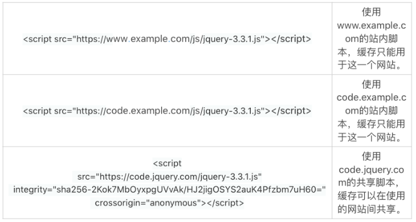

# 27 | 怎么编写可持续发展的代码？

成功的大公司，也是从小公司起步的。刚开始的时候，软件可能比较简单，用户也比较少，一台廉价的服务器，或者一个简单的虚拟机，甚至几个静态的页面就绰绰有余。


很快，辛苦的努力得到回报，产品传播速度远超预期，用户很喜欢公司的产品或者服务，数量大幅增加，需求越来越强劲。这时候也是公司最忙碌的时候，每个人眼里只有两个字：“增长”。用户规模增长随之带来的是软件规模增长，运维复杂度增长。这时候，廉价的服务器满足不了需求了，就需要更多的服务器，甚至是各种用途不一样的服务器，还需要使用更多的带宽、更多的内存、更多的 CPU，甚至更多的硬盘。


跟得上增长的公司，用户会越来越喜欢，就会脱颖而出，每一份辛苦都得到了优厚的回报；跟不上增长的，用户会越来越抱怨，公司会被迅速模仿，然后用户被抢走，公司被迅速甩开，每一份辛苦都成了一声叹息。

增

长对软件的要求，就是要有处理越来越多工作和越来越大规模的能力或者潜力。这种能力，通常称之为可伸缩性（Scalability）。


不过，要提醒的是，也有人使用“可扩展性”这个词表示规模的扩张能力。可扩展性这个词汇很多时候也用于表示功能的扩展（Extensibility）。这就容易混淆规模扩展和功能扩展这两个完全不一样的概念。如果有人使用了可扩展性这个概念，要弄清楚指的是规模还是功能。


为了方便理解，减少混淆，我们使用更通俗一点的词汇来表达这两个概念。这两个词汇就是规模扩张能力（Scalability）和功能扩展能力（Extensibility）。


规模扩张能力，是依赖于具体的代码的。不是所有的代码都能适应规模的扩张。这一次，我们就来讨论代码的规模扩张能力，以及一些常见的陷阱。

## 两种规模扩张方式

规模扩张主要有两种方式。一种方式是规模垂直扩张（scale in/out），另一种是规模水平扩张（scale up/down）。


规模垂直扩张，指的是提高同一个处理单元处理更多负载的能力。比如，硬件上，增加服务器的硬盘、内存和 CPU；软件上，优化算法、程序和硬件的使用等。


规模垂直扩张是传统的提高负载的方式，方式方法都比较直观，效果也立竿见影。但是，规模垂直扩张成本很高，而且是非线性的。比如说，4 倍的 CPU 可能只提高 2 倍的负载，而 8 倍的 CPU 可能只提高 2.5 倍的负载。


另外，规模垂直扩张是有上限的，一台服务器的处理能力不是可以无限扩展的。还有，硬件的规模扩张，可能要更换机器，停止软件运行。这种规模扩张方式，不太适用于可用性要求高的产品。比如我们常用的微信，出现 5 分钟的停机都是天大的事故。


规模水平扩张，指的是通过增加更多的处理单元，来处理更多的负载。我们常见的例子，就是增加服务器。分布式系统、负载均衡、集群系统这些技术，提供的就是规模水平扩张的能力。


优秀的规模水平扩张技术，可以使用很多廉价的机器，提供大规模的计算能力。一般情况下，规模水平扩张的成本要低于规模垂直扩张。而且，如果其中一个节点出了问题，只要其他节点还在正常工作，整个系统也可以照常运转。如果想要添加一个新节点，系统也不需要停顿。规模水平扩张技术的这些特点，非常适用于高可用性系统。


和规模垂直扩张相比，规模水平扩张的方式方法并不直观。支持规模水平扩张的代码要能够协调地运行在不同的机器上，也就是说要支持分布式计算。很多代码，不是天生就支持分布式计算的，而且修改起来也不容易。


我们常说的优化代码，一般指的是提高每一个处理单元的使用效率，也就是规模垂直扩张能力。其实，我们还要考虑代码是不是能够分布式运行，也就是规模水平扩张能力。

## 麻烦的状态数据

影响代码水平规模扩张的最重要的一个因素，就是用户的状态数据。比如，用户的登录状态，用户购物车里的商品信息，HTTP 连接里缓存的会话数据等。


如果用户访问一个服务节点时，在节点留下了状态。这个状态就要在多个节点间同步。否则，如果用户下一次访问被分配到不同的服务节点，这个状态就会消失不见。比方说吧，上午，我们在一个网站购物，把待选的商品放到购物车里。这个选择商品的过程，可能是由位于北京南城的数据中心的一台服务器处理的。下午，我们准备结账，重新访问这个购物网站。这时候，服务器可能是由位于贵州的数据中心提供的。如果上午访问和下午访问的服务器之间没有同步购物车数据，下午访问时，购物车里就没有我们想要的信息了。


购物车的状态同步，可以通过分布式数据库来解决。分布式数据库自动处理多个节点之间的数据同步。


现在的软件服务，大都是基于 HTTP 协议提供的 Web 服务。Web 服务本身就是一个无状态的协议。即使可以保持 HTTP 的连接，一般的服务框架也会考虑在连接不能保持情况下的会话管理，也就是保存用户状态。HTTP 协议层面的状态管理，也需要支持分布式计算。搭建支持规模水平扩张的 Web 服务时，要做好 Web 服务框架的选型。


如果我们的代码里，保存了状态数据，可能会影响规模水平扩张的能力。比如说下面的这个例子中的 sessionCache 这个静态变量，如果用来保存用户的会话，并且使用 SessionId 匹配用户行为，规模水平扩张时就会遇到麻烦。因为，这个变量内容的更改，只存在于运行它的节点里，不能在一个分布式系统的每个节点之间同步。

```java
private static final HashMap<SessionId, byte[]> sessionCache = new HashMap();
```

对于规模水平扩张的需求，状态数据是一个很麻烦的存在。甚至，一些基础的，需要保存状态数据的网络协议，在早期的版本中也没有考虑规模水平扩张的问题。这就给规模水平扩张带来了一定的困难。


所以，采用规模水平扩张时，一定要小心代码的状态数据能不能同步。另外，由于软件依赖的基础设施问题，还要测试软件的运行平台是否能够很好地支持规模水平扩张。

## 无状态数据

如果一个服务是无状态的，规模水平扩张就会非常顺利。比如说，静态的网页，静态的图片，静态的商品描述，静态的 JavaScript 和 CSS 文件等等。由于不需要在服务端保留状态，这些数据资源就不需要在不同的节点间实时同步。无状态的数据，可以降低规模水平扩张的技术复杂性，在技术上有了更多的改进空间。


比如说，现代的浏览器，都可以缓存静态数据，比如说静态的 JavaScript 和 CSS 文件。如果用户访问的两个不同网站，使用了相同的脚本文件。浏览器只需要下载一次脚本文件，就可以在两个网站使用。这样，缓存的脚本文件就可以加速网页的加载，减轻服务器的压力。



## 分离无状态数据

由于无状态数据有这么多的优点，把无状态数据分离出来，单独提供服务就成了一个常用的解决方案。独立的无状态数据服务，既没有规模水平扩张的羁绊，还能充分利用客户端的缓存。另外，无状态数据和状态数据的分离，可以让状态数据的处理集中资源，也能提高状态数据的处理能力。


比如说，一个网站如果使用了共享的 jquery.js 脚本，下载这个脚本，就不再占用这个网站的资源了。


所以，如果你要设计一个具有规模扩张能力的软件架构，分离无状态数据和状态数据，既可以提高规模水平能力，也可以提高规模垂直扩张能力。

## 使用用户资源

对静态数据进行缓存，是现代浏览器提高服务性能的一个重要办法。除此之外，浏览器还可以缓存动态数据，比如 HTTP 的 cookie 以及 HTTPS 的安全连接的参数。


鉴于无状态数据的诸多优点，一些协议设计开始考虑无状态的服务场景。比如，TLS 1.3 就加入了对无状态服务的支持。


无状态服务，并不一定都没有服务状态。一个典型的做法是，服务端通过一定的数据保护机制，把服务状态保护起来，发送到客户端。然后，客户端缓存封印的服务状态。下次连接时，客户端把封印的服务状态原封不动地送回到服务端。然后，服务端解封客户端发送的封印服务状态，就获得了需要处理的状态数据。这样，既有了无状态服务的便利，解除了规模水平扩张的限制，又解决了服务需要状态的客观需求。


遗憾的是，这种设计能够提供的服务状态数据尺寸比较有限，应用场景也比较苛刻，而且数据保护机制一般也比较复杂。所以，我们一般要在基础架构层面解决掉核心的问题（数据保护机制、服务状态封存机制、缓存机制等）。然后，在应用层面仅仅定制状态的内容，比如 HTTP 的 cookie 的格式和数据，就是可以定制的内容。而 HTTP 的 cookie 交换的机制，就由 HTTP 协议负责解决。

## 小结

如果把我们上面讨论的放到一起，就可以得到具有规模扩张能力的软件的一些最佳实践：

1. 把无状态数据分离出来，单独提供无状态服务；
2. 把最基本的服务状态封装起来，利用客户端的缓存，实现无状态服务；
3. 小心使用服务状态，编码时要考虑服务状态的规模水平扩张能力。

基于上述的原则，市场上有很多优秀的解决方案和成熟技术。欢迎你在留言区分享、讨论这些解决方案和技术。

## 一起来动手

这一次的练手题，我们要拆解一下 Web 页面。找一个你常用的 Web 服务，比如说 InfoQ 或者极客时间。使用浏览器的插件，阅读这个 HTML 页面，试着分析下，这个页面里哪些可能是动态数据，哪些可能是静态数据？这个页面是怎么处理这些数据的？使用我们今天讨论的基本原则，这个页面还有没有优化的空间？如果你侧重于服务端的编码，你想想服务器端该做什么样的调整？


欢迎你在留言区留言，分享你的看法。也欢迎点击“请朋友读”，把这篇文章分享给你的朋友或者同事，一起交流一下。

## 精选留言(5)

- 

  hua168

  2019-03-07

  **3

  怎么判断代码是否使用分布式？

  1.是不是看企业将来战略要求？
  他们一般都会说将来用户量大，但是开发人员就那么几个，是不是一开始就弄分布式，只不过放在一两台服务器上，当用户量增加再慢慢分离？

  2.看公司未来3年是否用户量增加到要代码拆分的程度？
   如果用到最好前期就开始做吗？

  
  像我们水平扩展，做分布式，前期java web比较多的组合是
  nginx+spring Boot+dubbo（spring cloud）+redis+mongoDB/mysql

  nginx：反代，主要是处理静态，分担tomcat压力，前期和spring Boot1台
  spring Boot+dubbo（spring cloud）:含tomcat，解决代码水平扩展，前期1台服务器
  redis：保存状态数据，一般是session比较多，前期做主从，前期一般2台
  mongoDB/mysql：数据库，只在数据，前期一般2台

  如果访问量过大：
   \1. 数据库方面：变成1主多从，如果压力大就分库，再大就分表做sharding
   \2. 前上面组合中前面添加多一个web代理，如nginx/haproxy，
     包含代码的web服务器复制几台现来，再做七层代理，如果一个七层代理不够，前面再加4层LVS
   \3. redis：做成群集

  展开**

  作者回复: 谢谢你的分享。这些是很好的经验！

  前期要考虑代码对分布式的支持，不一定真要做成分布式的。实际的分布式方案，最终还是取决于代码是什么样的。

  比方说我们文章中说到了，分离无状态数据，无状态服务。如果这些做好了，有状态服务可能只是很小的一块内容。这些早点做，可以提高系统的性能，延迟分布式的需求，简化分布式的实施。

- 

  轻歌赋

  2019-03-06

  **1

  所以一个web程序可以将信息简单分为三类
  \1. 静态数据，客户端缓存，主要思考方向在如何让客户端更多的缓存，并且服务端能够随时消除缓存
  \2. 无状态动态数据，可以考虑在单实例做缓存，提高效率，但是需要考虑如何通知清理缓存，怎么样设计缓存可以尽可能细粒度的清理缓存
  \3. 有状态数据，可以考虑在redis等系统级的缓存处缓存，考虑到系统的扩张，一台缓存可能不够用，需要算法层次考虑分散用户数据，确保一个用户只会进入一部分缓存

  对于3，之前看过对于用户的ID进行hash的方式，但是感觉当缓存实例数量变化的时候取模是个问题，请问老师，这点如何在算法上进行设计呢？

  展开**

  作者回复: 抱歉，我不了解redis。我猜测啊，模的值是不是可以等于缓存机器的数目？

  另外，等拿到用户ID的时候，已经进入应用层了，这时候连接可能已经建立，性能的瓶颈可能就是建立连接的前置的分配器。

- 

  hua168

  2019-03-07

  **

  老师，之后的会介绍一些简单的防攻击之类的吗？我觉得代码写的再好，如果很容易被入侵，那也是等于0，我前公司网站经常时不时被入侵还不知道怎么回事T_T，服务器安全没有什么问题。
  防攻击是靠java的安全框架，还是自己手工写的防攻击代码？还是直接加多一层专门用来做防攻击过滤？
  起码保证代码是安全的，如果是网络类有专业的防火墙，如DDOS防火墙。

  展开**

  作者回复: 安全漏洞大部分都是代码引起的，防火墙这些措施很重要，但是只能防范一部分攻击，价值最大的防范，要在代码层解决掉。我们第三部分会重点讲代码安全。

- 

  hua168

  2019-03-07

  **

  如果分布式前期已确定好（如：SpringBoot+redis+mysql）代码写好之后，如果再加多一些安全过滤来防攻击，是不是在直接在SpringBoot加多一层安全过滤？因为我在网上看到过这么一句话：

  Any problem in computer science can be solved by anther layer of indirection.
  计算机科学领域的任何问题都可以通过增加一个间接的中间层来解决。

  展开**

  作者回复: 接着的问题是，这个中间层会有多复杂呢，值不值得呢？

  对于安全来说，中间层解决不了所有问题。很快，我们就进入这个专栏的第三部分了，到时候我们再聊代码安全问题。

- 

  夜空中最亮...

  2019-03-06

  **

  有启发 有收获

  展开**