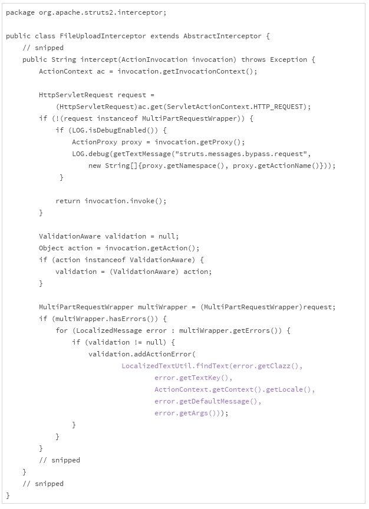
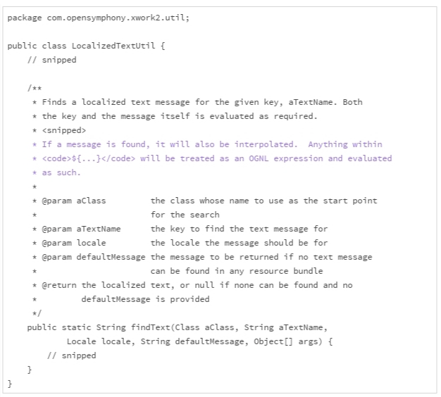

# 31 | 为什么安全的代码这么重要？

从今天开始，我们进入本专栏的“安全模块”。首先，我们通过一个具体的安全漏洞的案例，来感受下计算机代码是多么的脆弱，以及编写安全的代码为什么如此重要。

## 评审案例

在 Web 开发中，“multipart/form-data“类型经常被用来上传文件。比如下面这段描述表单的代码，就是使用 multipart/form-data 上传文件的一段 HTML 代码。

```html
 <FORM action="http://upload.example.com/"
       enctype="multipart/form-data"
       method="post">
   <P>
   Upload the file: <INPUT type="file" name="upload-file"><BR>
   <INPUT type="submit" value="Send">
 </FORM>
```

文件上传的操作，会被浏览器解析成类似下面的 HTTP 请求。

```http
Content-Type: multipart/form-data; boundary=AaB03x
 
--AaB03x
Content-Disposition: form-data; name="upload-file"; filename="myfile.txt"
Content-Type: text/plain
 
... contents of myfile.txt ...
--AaB03x--
```

Web 服务器接收后，会解析这段请求，然后执行相关的操作。下面的这段代码，是 2017 年 3 月之前 Apache Struts 2 解析“multipart”请求的实现。



其中，蓝色标注的代码，LocalizedTextUtil.findText()，用来查找错误的本地化信息。如果“multipart”请求解析出错，就会触发这个方法。它的规范大致如下：



对于 LocalizedTextUtil.findText() 的规范，我们要留意蓝色字体的部分。这一部分告诉我们，如果信息里包含了 OGNL（Object Graph Navigation Language）的表达式，表达式会被执行。


我们把上面的信息放到一块儿来看看：如果“multipart”请求解析出错，会调用 LocalizedTextUtil.findText() 来查找本地化的错误信息；如果错误包含 OGNL 表达式，表达式会被执行，以获取解释后的信息；本地化的错误信息会返回给请求者（比如浏览器）。


能不能构造一个包含 OGNL 表达式的“multipart”请求？对于熟悉 HTTP 协议和 OGNL 表达式的用户来说，这是一件轻而易举的事情。如果“multipart”请求不合法，OGNL 表达式会被执行，执行的结果以错误信息的形式返回给请求者。


通过“巧妙地”设计 OGNL 表达式，攻击者可以定制执行的指令，从而定制返回错误信息的内容。这样，攻击者几乎可以获得任何他想要的有价值的内部信息。这就是一个由代码引起的安全漏洞。这个安全漏洞的[危险等级是 10.0 分](https://www.first.org/cvss/calculator/3.0#CVSS:3.0/AV:N/AC:L/PR:N/UI:N/S:C/C:H/I:H/A:H)（请参见下一节“如何评估代码的安全缺陷”），是一个危险等级最高的漏洞。


我们回头看 FileUploadInterceptor.intercept() 的这段实现代码时，它的危险性其实很清楚，主要有两点：

1. 没有充分了解调用接口（LocalizedTextUtil.findText()）；
2. 允许执行远程请求的表达式（OGNL 表达式）。

这两点分别违反了下面的安全编码原则：

1. 清楚调用接口的行为；
2. 跨界的数据不可信任。

## 真正的威胁

我们一起来看看这个漏洞的几个关键时间点：

- 2017 年 1 月 29 日，NIST 的 NVD（National Vulnerability Database ）接收到了这个漏洞报告。
- 2017 年 3 月 6 日，GitHub 上出现了漏洞的描述和攻击示例。
- 2017 年 3 月 7 日，Apache Struts 发布了这个漏洞的修复版本，Struts 2.3.32 和 2.5.10.1。
- 2017 年 3 月 7 日以及随后的几天，出现了更多的攻击示例，很多媒体和专家开始分析这个漏洞，推荐可能的漏洞防范措施，提醒升级 Apache Struts 到安全的版本。

我们要特别留意两段时间，第一段时间是 1 月 29 日到 3 月 7 日。这一段时间，安全漏洞已经被发现，但是并没有被公开。这说明这个安全研究者极有专业素养。我猜想，这位名字叫“Nike Zheng”的研究者，在 2017 年 1 月 29 日之前，把他的研究成果通知了 Apache Struts。然后双方共同努力，将这个漏洞一直保密到 2017 年 3 月 7 日。这一段时间的保密工作非常重要，要不然漏洞修复之前，会有大批的应用暴露在黑客的攻击之下。


寻找并且通知受到安全漏洞影响的软件供应商，然后双方共同保密一段时间，给漏洞修复留出足够的时间，这是安全研究者的通常做法。**如果你认真学习了本专栏的“安全”模块，发现现存代码的安全问题，并且构造出可行的攻击方案，并不是一件特别困难的事情。如果以后你通过阅读代码，发现了一个漏洞，公布漏洞之前，请务必联系代码的维护者，做好漏洞的保密工作，并给他们预留充足的修复时间。**


第二段时间是 2017 年 3 月 7 日，这一天漏洞的修复版本发布，漏洞的补丁公之于众，漏洞的细节也就随之公开。专业的研究者和黑客会迅速地解剖漏洞，研究攻击方式。留给应用系统的时间并不多，一定要想方设法在最短的时间内，升级到修复版本。做到这一点并不容易。**大部分有效的安全攻击，都是发生在漏洞公布之后，修复版本升级之前。这一段时间，是最危险的一段时间。**

## Equifax 的教训

2017 年 9 月 7 日，美国最大的征信公司 Equifax 宣称，7 月 29 日公司发现遭遇黑客攻击，该攻击始于 5 月中旬，大约有 1.45 亿条信用记录被盗取，其中包括 20 多万用户的支付卡信息。在美国，包括社会保障号、出生日期在内的信用记录是高度敏感的信息。有了这些信用记录，一个人不用出面，甚至不需要支付一分钱，就可以买车、买房、申请信用卡。


果然，有人报告自己被冒名顶替买了车、买了宠物。对于一个依靠安全生存的公司，这种情况的发生无疑是令人沮丧的。随后的几天时间里，Equifax 的股票下跌超过了 30%，蒸发了折合大概 60 亿美元的市值。


是什么样的安全漏洞导致了这么大的损失？Equifax 公司后来确认，引起黑客攻击的漏洞，最主要的就是我们上面讨论过的 Apache Struts 漏洞。


Apache Struts 于 2017 年 3 月 7 日发布了针对该漏洞的修复版本。但是 Equifax 一直到 7 月底，都没有完成安全版本的升级，将自己敞露在风险之下。


从 3 月漏洞细节公布，到 5 月中旬，黑客用了两个月的时间，设计了攻击方案；然后，从 5 月中旬到 7 月底，又用了两个多月的时间，从容地获取了数亿条信用记录。


如果按照严重程度来算，这一次黑客攻击可以排进 21 世纪已知的重大信息安全事故的前三名。而且，这次安全事故的影响范围，远远超出 Equifax 公司本身。


人们对征信公司的信任，降低到了前所未有的程度，纷纷冻结自己的征信记录，不允许任何人查询；银行的信用部门，必须更加谨慎地防范信用欺诈，要投入更多的财力、人力。所有受到影响的用户，必须采取更加严格的措施保护自己在其他征信机构、金融机构、保险机构的信用状态。


所有的这些问题，归根到底，都是因为没有及时地完成安全修复版本的升级。这里面固然有技术的问题，但更多的是管理的问题。2017 年 9 月 15 日，Equifax 的首席信息官和首席安全官宣布退休。


五行不起眼的代码，酿造了一起损失数十亿美元的安全事故。受到影响的人群，也可能包括这个漏洞的研究者和修复者，系统的运营者，甚至是攻击者本人。这种不对称的破坏性让人唏嘘，这也正是我们为什么要重视代码安全的背后的原因。


Equifax 的教训给我们带来三点启示：

1. **不起眼的代码问题，也可以造成巨大的破坏**；
2. **安全修复版本，一定要第一时间更新**；
3. **安全漏洞的破坏性，我们很难预料，每个人都可能是安全漏洞的受害者**。

## 编写安全的代码

一般来说，安全的代码是能够抵御安全漏洞威胁的代码。


传统上，我们说到信息安全的时候，最常接触的概念是防火墙、防病毒、防攻击。其实，大部分的安全事故（80%-90%）是由软件的代码漏洞引起的。没有安全保障的代码，是随时都可以坍塌的空中楼阁。

## 小结

通过对这个案例的讨论，我想和你分享下面三点个人看法：

1. **不起眼的小问题，也会有巨大的安全缺陷，造成难以估量的损失**；
2. **编写安全的代码，是我们必须要掌握的基础技能**；
3. **安全问题，既是技术问题，也是管理问题**。

下一节，我们接着聊安全漏洞的威胁该怎么衡量。再接着，我们来讨论一些常见的编写安全代码的原则和实践。

## 一起来动手

Equifax 公司的问题之一，就是没有及时地更新安全修复。这一般不是疏漏的问题，而是没有充分认识到安全更新的重要性，或者没有把安全修复的计划执行到位。


要想升级到安全修复的版本，我们需要知道两件事：

1. 第一时间获知，某个依赖的软件有了安全更新；
2. 最快速地行动，升级到安全修复版本。


有时候，安全版本升级之前，安全漏洞的细节就已经暴露出来了。这时候，我们也要采取必要的措施：

1. 第一时间知道出现了安全漏洞；
2. 快速寻找、部署漏洞修复的临时方案。

人力总是有限的，我们接触到的信息也是非常有限的。上面的两种措施中，人工都没有办法做到第一点的，除非你使用的是一个完全封闭的系统（完全封闭的系统，一般也是漏洞更多的系统）；而第二点，或多或少的，都需要人工的参与。


我们利用讨论区，来讨论三个问题：


第一个问题是，你有没有使用最新版本软件的习惯？


第二个问题是，你的公司是如何获取安全漏洞信息和安全更新信息的？


第三个问题是，你的公司有没有安全更新的策略？如果有，又是怎么执行的，能不能执行到位？


欢迎你在留言区留言、讨论，我们一起来学习、思考这些老大难的问题！

如果你觉得这篇文章有所帮助，欢迎点击“请朋友读”，把它分享给你的朋友或者同事。

## 精选留言(4)

- 

  天佑

  2019-04-14

  **

  在美国，包括社会保障号、出生日期在内的信用记录是高度敏感的信息。有了这些信用记录，一个人不用出面，甚至不需要支付一分钱，就可以买车、买房、申请信用卡。
  老师这个属实吗，难道他们不核实下是否是本人?

  作者回复: 属实，美国高度依赖个人的敏感信息和信用记录。中国现在很多事情也可以靠验证类似的敏感信息完成，这就是互联网商业的基础之一啊。

- 

  hua168

  2019-03-18

  **

  如果升级是最简单，最基础的维护的话，那我只能怎么方便怎么来了，要不然我们一个月都是在升级了😂
  目前想到方法:
  \1. 能yum（centos）的绝不源安装！
    优点:升级快，缺点:版本不能退回，
    反正要保持最新，先测试好再升
  \2. 能有现成最新版本的docker就直接下，或者有多个客户环境相同的自己制作docker
  \3. 与开发沟通能不用插件尽量不用，能用常用的函数尽量用常用，这样就做到升级修改量小，运维升级也方便

  展开**

  作者回复: 这些都是好办法！ 怎么简单，怎么依赖少，怎么稳定就怎么来。

  

- 

  天佑

  2019-03-17

  **

  老师，有没有在打补丁的最佳实践，比如升级后的兼容性，可用性，性能方面的验证，这方面讲不清楚，就不敢打，阻力往往也在这块。

  作者回复: 是的，验证是最大的阻力。其实这类似于给代码打补丁，JDK的办法主要是依靠自动化的回归测试。

- 

  hua168

  2019-03-16

  **

  老师，像第三方源软件(linux系统)漏洞只能通过升级版本来解决吗？

  比如，我前公司客户是国企偏多，对方购买有安全评估系统，维护多了，就一条“要始终保持最新版本”，几乎每月都要升级nginx、redis、mysql、php等到最新版本，如果不升级对方直接服务器不用我们系统😂，版本跨度大还要重写代码😂调试，有些函数新版本放弃了！我们运维和开发都叫苦，国企钱不好赚…

  能有什么解决方案吗？比如
  1.能不对外开放就尽量不放开，像redis、mysql即使有严重bug，但我不对外，只能本机（再不行就局域网）能访问…
  2.必须对外开放的：统一在前面在一层安全层，访问网站后先统一做安全过滤，安全了再放行请求。

  展开**

  作者回复: 还有一种方式，是升级版本发布之前，就把漏洞解决掉，特别是已经披露尚未修复的漏洞。不过，这种方式需要更专业的知识，更复杂的操作。一般地，我们没有这个能力掌握这么多的技能。

  短期内，升级到最近的安全修复版就可以了。安全修复版一般会严格地考虑兼容性问题，升级的麻烦相对较小。

  长期看，要升级到最新的版本。 因为老版本的生命周期迟早要结束。早升级早受益，早升级麻烦少。 如果累计好几个版本再升级，那时候的麻烦事更多，更难缠。

  升级版本是最省事最简单的办法，其他的办法都比这个复杂。

  对外不开放看起来是个好思路，不过怎么定义和管理内外，是个天大的麻烦事。比如说，公司外面的人员算不算外？公司的合作伙伴算不算外？财务部算不算外？另外一个研发团队算不算外？一个研发团队里，小李算不算外？不联网的本机是一个独立的个体，可是操作机器的人算不算外？防内奸的复杂度，远远超出我们的想象。

  比如说，机器A不联网，只有公司CEO的账户可以操作机器A的特定功能。 机器A五年没有更新了。 由于机器A存在安全漏洞，几乎每个人都知道该怎么不使用CEO的账户，就可以获得CEO的权限。CEO也知道这个问题，但是就是不升级。有什么办法保持机器A可用还要防止别人使用吗（甚至还要防止CEO使用）？办法是有的。可是，很可能到最后，防内奸的管理制度可能搞得每个人都人心惶惶。一旦内奸没防住（当然防不住），人人都可能是受害者。

  前置一个安全层，能起到的作用很小。很多代码的错误，攻击可以通过正常的业务逻辑和数据进行，前置的安全层在理论上，是不可能阻断这样的攻击的。

  升级是最简单、最基本的运维，一定要做到，不要在这方面妥协。