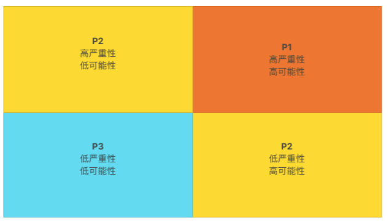
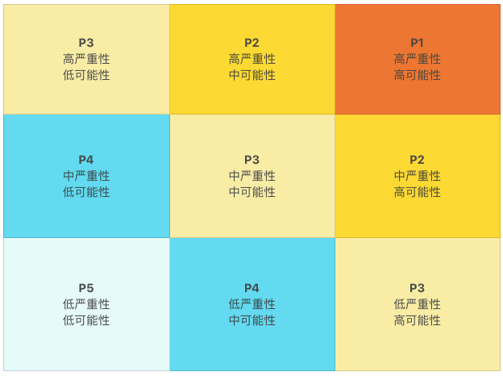
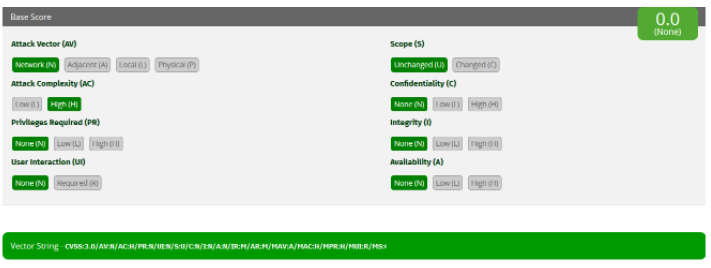
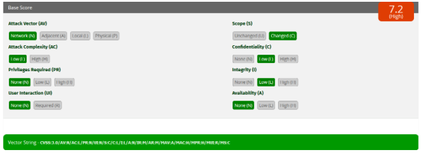

# 32 | 如何评估代码的安全缺陷？

我自己有一点小小的强迫症，遇到事情，喜欢自己动手整个清楚明白。我的大部分失眠，都要拜这点强迫症所赐。时间永远都不够用。如果上天给我一个机会，我是不是可以借上五百年？其实，借上五百年，时间一定还是不够用的。

我经常被问到三个问题：

1. 有什么事情是你必须要做的？
2. 哪些事情是只有你能做的?
3. 哪些事情是别人可以帮你做的？

这就是一种时间管理的思路，隐含的意思是：

1. 识别并且选择最重要的事情；
2. 确定自己最擅长的事情，全力以赴地做好；
3. 选择你的帮手，充分信任并授权。

评估软件的缺陷就是这个思路运用得最广泛的一个场景。作为程序员，我们需要了解软件存在的问题，以及问题的严重程度。那么，我们该如何评估软件存在的问题，以及代码的安全问题呢？

## 关注用户感受

软件缺陷的定义方式和衡量方式有很多种。**从用户感受的角度出发，定义和计量软件缺陷**，是其中一个比较好的、常用的软件缺陷评估体系。我个人比较倾向一种观点，**软件缺陷的严重程度应该和用户的痛苦程度成正比**。

从用户感受出发，衡量软件缺陷有两个最常用的指标：

1. **缺陷影响的深度**，软件缺陷带来的问题的严重性：软件缺陷导致的最严重的问题是什么？
2. **缺陷影响的广度**，软件缺陷带来问题的可能性：软件缺陷导致问题出现的频率是多大？

比如说，一个外卖系统只要订餐金额超过 32766 元就无法提交订单，因为软件系统允许的最大金额为 32766 元。这种事情 一旦发生，就是一个非常严重的错误（订单无法提交）（影响的深度）。但是，在外卖系统里，金额超过 3 万元的订单数量应该不多，该错误发生的几率并不大（影响的广度）。

如果我们把每个指标都划分高、低两种程度，就能得到如下四种情况：

1. 高严重性，高可能性；
2. 高严重性，低可能性；
3. 低严重性，高可能性；
4. 低严重性，低可能性。

依据这四种情况，我们就可以定义软件缺陷的优先等级了：

1. 高优先级 （P1）： 高严重性、高可能性；
2. 中优先级 （P2）： 高严重性、低可能性； 低严重性、高可能性；
3. 低优先级 （P3）： 低严重性、低可能性。

上述外卖系统的软件缺陷的优先级应该是中等优先级（P2，高严重性、低可能性）。

## 缺陷，需要从外向内看

假设这个外卖系统有一个 bug，订餐金额可以是 0 或者负数。如果订餐金额是负数，餐厅不仅需要送餐上门，还需要倒贴钱。这可是一个好玩的 bug，当然不能坐视不管。

过一段时间，bug 修好了。大部分餐厅都能接受新系统。可是有一个商家表达了不同意见。原来他们有一个“寻找美食家”的活动，餐厅不仅不要顾客的钱，还倒贴同等餐费，请客人品尝最新餐品。负数金额，正是他们倒贴钱的“定价”。 美其名曰“你尝，我负”。该商家声称，新系统存在一个严重的缺陷，定价无法使用负数，导致这个活动无法进行。

如果你是这个外卖系统的工程师，这个 bug 你修不修？

你是否认可和接受这个缺陷报告，背后反映的就是你看待这个软件缺陷的态度。如果从用户感受的角度出发，定义和计量软件缺陷，这就是一个符合条件的 bug。这个问题对该商家的影响非常大，无法开展正常的商业活动。但这个问题发生的可能性比较小，大概只有这么一个商家使用负数定价。那么这个软件缺陷的优先级是中等优先级（P2，高严重性、低可能性）。

你看， 这个外卖系统的代码变更本身并不存在真正的缺陷，但是，如果从用户角度来看，又的确存在一个中等优先级的缺陷。我们当然可以认为，这个缺陷应该在用户那里得到校正。但是有时候，用户并没有校正这种缺陷的机会和能力。

你会不会觉得这个例子有点离奇、离谱，甚至有点搞笑？其实处理这种事情，是我日常工作中非常重要的一部分。 一旦 Java 的接口规范和规范实现发布，我们并不知道在现实世界中，用户如何运用他们的聪明才智，发挥他们的创造性，灵活地使用这些接口和实现。而无论用户怎么使用，在软件升级变更中，我们都没有充分的理由打断用户的应用运转和商业运营。所以软件的升级或者变更，处处充满了乐趣和挑战，步步惊心。

**在一个好的软件缺陷评估体系中，不是只有代码错误才会被关注，没有错误的代码，也可能存在需要变更或者改进的“缺陷”**。这就是我们要强调的，从用户的感受出发，定义和计量软件缺陷。缺陷，需要从外向内看。

很多时候，程序员认为是严重的缺陷，用户可能一点儿都感受不到；程序员认为无关紧要的事情，放到了用户的使用场景中，可能就是非常严重的事故。从外向内看缺陷，要求我们站在用户的角度思考问题，看待缺陷。这是一个可以让我们深切关注用户感受的视角。**从用户视角出发的决策，可以让我们的时间使用得更有市场价值。**

## 细化的优先级

在一定程度上，作为软件的原作者或者维护者，我们被各种各样的软件缺陷包围着，永远存在修补不完的缺陷，永远存在无法修复的问题。上述软件缺陷的优先等级的定义，稍显粗糙。我们可能需要更细致一些的等级划分，以便更好地安排我们的时间和区分做事情的轻重缓急。

如果我们把每个指标都划分高、中、低三种程度，就可以得到九种情况，定义五种优先等级。五种等级，是一个常用的优先级数目。太少了，显得粗糙；太多了，容易迷糊。

1. 第一优先级 （P1）： 高严重性、高可能性；
2. 第二优先级 （P2）： 高严重性、中可能性；中严重性、高可能性；
3. 第三优先级 （P3）： 高严重性、低可能性；中严重性、中可能性；低严重性、高可能性；
4. 第四优先级 （P4）： 中严重性、低可能性；低严重性、中可能性；
5. 第五优先级 （P5）： 低严重性、低可能性。

你自己试试看，上面我们讨论过的外卖系统的软件缺陷属于第几优先级？

## 优先级的灵活性

**软件缺陷优先等级的定义是为了帮助我们更好地解用户的感受程度，以及安排时间和处理事情。**

由于时间和资源有限，在大多数情况下，特别是对于职业的程序员来说，并不能在一定时间内修复所有的缺陷，满足所有的变更要求。

实际工作中，我们有时候需要调节软件缺陷的优先等级，比如说：

1. 如果已经存在应对办法，优先等级可以下调；
2. 如果软件缺陷引起广泛的公开关注，优先等级应该上调；
3. 如果软件缺陷影响了重要的客户，优先等级应该上调；
4. 如果软件缺陷影响了重要的商业运营，优先等级应该上调。

对于一般的软件缺陷管理，五个等级是一个恰当的优先级分割。然而，除非特别注明，仅从优先级别来看，我们并不清楚 P3 缺陷的严重性是高是低，或者发生的可能性是高是低，而且问题的严重性在哪儿体现，可能性又是如何度量的？ 这些也都是模糊的地方，可能受主观影响比较大。但是有一些软件缺陷，需要对这些问题有一个更加清晰的认识和感受，比如软件安全漏洞。应该如何评估软件的安全漏洞？ 我们会在稍后的接着聊这个话题。

## 管理好自己的时间

好了，我们定义了软件缺陷的优先级，是时候看看如何使用它管理我们的时间了。还记得开头提到的三个问题吗？

- 有什么事情是你必须要做的？

  P1 的事情需要我们立即全力以赴、必须完成；P2 的事情需要我们协调资源，尽快完成；P3 的事情需要我们密切关注，尽量完成。

- 哪些事情是只有你能做的?

  只有你能够修复的 bug，你可以记到自己名下，负责修复这些缺陷。

- 哪些事情是别人可以帮你做的？

  适合别人修复的 bug，如果还没有记到别人名下，你可以琢磨下谁是最合适的人选，然后和他商量，看他有没有时间，愿不愿意负责这个缺陷。当然，别人也可能会问你愿不愿意修复另外一些缺陷。

相信我，大部分情况下，在得到足够的尊重以及有适当时间的前提下，人们愿意做些有意义的事情。

如果 P1、P2、P3 的问题修复完了，你就可以放心休假去了。休完假，充分从疲劳中恢复过来后，你就可以考虑，是不是可以看看 P4 和 P5 的问题了。

## 安全漏洞，需要大范围协作

在软件缺陷中，安全漏洞是一个奇异的存在。软件的安全漏洞，常常会导致非常严重的后果，以及恶劣的影响，甚至会直接导致一个公司的破产。

**由于编写安全代码本身的挑战性，以及消除安全漏洞的复杂性，业界通常需要进行大范围的合作，以便准确、快速、周全地解决安全缺陷问题。**大规模协作需要标准的描述语言，以及对安全问题的准确认知。[通用缺陷评分系统（CVSS）](https://www.first.org/cvss/)就是一种评判安全缺陷优先等级的标准。

对于安全缺陷，我们还可以使用上面提到过的严重性和可能性两种指标进行衡量。对这两种指标进行细化，才能更符合安全缺陷的特点。

对于安全缺陷的严重性，有四个互相独立的测量维度（量度）：

1. 对私密性的影响（Confidentiality）
2. 对完整性的影响（Integrity）
3. 对可用性的影响（Availability）
4. 对授权范围的影响（Authorization Scope）

> 题外话：
> 私密性、完整性以及可用性，是描述信息安全的最基本的三个元素。
> 私密性指的是数据未经授权，不得访问，解决的是“谁能看”的问题。
> 完整性指的是数据未经授权，不得更改，解决的是“谁能改”的问题。
> 可用性值得是数据经过授权，可以访问，解决的是“可以用”的问题。

对于安全缺陷的可能性，有四个互相独立的测量维度（量度）：

1. 安全攻击的路径（Attack Vector）
2. 安全攻击的复杂度（Attack Complexity）
3. 安全攻击需要的授权（Privileges Required）
4. 安全攻击是否需要用户参与（User Interaction）

由于这些测量维度都是相互独立的，二维的平面图已经不足以表示这么多维度了。通用缺陷评分系统使用了**标识符系统**和**计分系统**，通过标识符来标识测量维度的指标，通过十分制的计分来衡量安全问题的严重程度。由于测量维度的增多以及评分计算的复杂性，我们通常使用工具来记录和查看安全缺陷问题的等级。

比如，本文评审案例的那个缺陷，并不是一个安全问题。 如果我非要使用通用缺陷评分系统来描述它，这个计分应该是 0.0 分，[直观描述](https://www.first.org/cvss/calculator/3.0#CVSS:3.0/AV:N/AC:H/PR:N/UI:N/S:U/C:N/I:N/A:N)看起来如下图：

我们曾经谈到过"[goto fail](https://time.geekbang.org/column/article/77048)"这个安全问题，如果使用通用缺陷评分系统，计分是 7.2，[直观描述](https://www.first.org/cvss/calculator/3.0#CVSS:3.0/AV:N/AC:L/PR:N/UI:N/S:C/C:L/I:L/A:N)如下图所示：

今天我给你介绍了通用缺陷评分系统的一些最基本的概念，先帮你形成一个基本的印象，算是一块敲门砖。你可以进一步了解[通用缺陷评分系统](https://www.first.org/cvss/)的有关[规范](https://www.first.org/cvss/specification-document)和[工具](https://www.first.org/cvss/calculator/3.0)。

## 安全漏洞和软件缺陷优先级

为了方便管理，安全漏洞和软件缺陷通常使用同一个代码缺陷管理系统。我们要注意两点：第一点是安全漏洞细节不可泄露；第二点是和普通软件缺陷相比，安全漏洞要优先考虑。

### 安全漏洞细节不可泄漏

我们反复强调过，软件的安全漏洞常常会导致非常严重的后果，以及恶劣的影响。最糟糕的是，我们并不能总是预料到谁可以利用这些漏洞，以及由此带来的后果有多严重。所以处理安全漏洞的态度，一定要保守。

安全漏洞不能像普通的代码缺陷那样，可以公开细节、公开讨论。相反，安全漏洞的知情人员一定要控制在一个尽可能小的范围内，知道的人越少越好。如果安全漏洞和普通缺陷共享一个代码缺陷管理系统，一定要想办法做好安全漏洞信息的权限管理。

### 安全漏洞要优先修复

一旦发现一个安全漏洞，不管是来源于外部情报，还是内部发现，我们都要考虑最快地修复，不要等待，更不要拖沓。即使我们全力以赴地修复，在系统修复之前，安全攻击随时都有可能发生。我们能做的，就是尽最大努力，缩短这段时间。

所以，大部分的安全漏洞问题，都是属于 P1 级别的缺陷。有一小部分深度防御的安全问题，优先级可以是 P2。安全问题，不要使用 P3 及以下优先级。另外在所有的同级缺陷中，安全问题要优先考虑。

## 小结

今天，我们讨论了如何评估软件存在的问题。软件的缺陷问题，要考虑缺陷影响的深度（严重性）和广度（可能性）。为了更好地认识安全漏洞，我们还要了解安全缺陷的评价标准。

有了软件缺陷的优先级，我们就可以更好地管理我们的工作和时间。下面的三个问题可以帮助你做好安排：

1. 有什么事情是你必须要做的？
2. 哪些事情是只有你能做的?
3. 哪些事情是别人可以帮你做的？

## 一起来动手

我们要想掌握安全编码的技术，熟练修复软件漏洞的实践，需要先过三道关。

第一道关，是意识（Conscious）。也就是说，要意识到安全问题的重要性，以及意识到有哪些潜在的安全威胁。

第二道关，是知晓（Awareness）。要知道软件有没有安全问题，安全问题有多严重。

第三道关，是看到（Visible）。要了解是什么样的问题导致了安全漏洞，该怎么修复安全漏洞。

比如我们上一次谈到的 Equifax 公司的信用记录泄漏的安全问题，首席信息官和首席安全官之所以退休，我们从外部可以猜测到的原因，就是意识不够强烈，没有及时更新安全修复。之所以没有及时地更新，大概率是不知道有安全问题，或者不知道安全问题有多严重。

系统管理员，最少需要过两关（意识和知晓）；而软件开发工程师，需要过三关（意识、知晓和看到）。这三关并不容易过。

记得我们前面讨论的“安全漏洞细节不可泄漏”的实践吗？知道安全漏洞的人越少越好。这样保守的安全防范实践，和培养优秀的软件工程师所要求的实践，就成了悖论。

掌握编码安全技术，要培养意识，要知道得更多，要看到问题的细节。而“安全漏洞细节不可泄漏”的实践，却要求尽量不要公开安全细节。但是看不到细节的时候，我们就很难掌握这些技术，很难认识到威胁的严重性，从而阻碍了安全意识的培养。面对这一对几乎不可调和的矛盾，我们该怎么办？！

有数据披露，2019 和 2020 两年，全球信息安全专业人员的缺口会有 300 多万。资源不足，需求强劲，我们怎样才可以学好安全代码的编写技能，提升自己的价值？

欢迎你在留言区留言、讨论，分享你的经验。我们一起来学习、思考这些老难老难的现实问题！

如果你觉得这篇文章有所帮助，欢迎点击“请朋友读”，把它分享给你的朋友或者同事。

## 精选留言(5)

- 

  醉侠

  2019-03-19

  **1

  希望老师后面能多讲讲安全编码的例子或者推荐好的书籍，这块儿确实是很大的弱点

- 

  hua168

  2019-03-18

  **

  好的，谢谢…

  展开**

- 

  hua168

  2019-03-18

  **

  老师，开发懂安全方面小公司的都少，他们通用做法就是利用框架，做下简单的防SQL注入，防上传漏洞，没了……
  阿里云后台一提前攻击就让我们运维查他们是怎么进来的和解决方案，因为没有专业安全人员，最后背锅又是我们背锅侠运维，说我们“整天没什么事做，给你们这么高工资，这点事都做不好！”😂这是一点事吗？

  老师有什么安全方面的书推荐下么？有什么方法去分析别人入侵路径吗？我们只能做的监控，看文件修改时间判断，但是入侵路径真的不知道怎么搞😂
  如果提方案去购买阿里云企业级安全防护，上级直接拒绝😓，说白了就是嫌贵，还说我们能力low😂

  展开**

  作者回复: 安全最根本的就是普通的代码写好，我们这个专栏的三个部分，讲的就是怎么写好代码。建议给你们公司的人员看看。

  入侵路径这种说法，只对一部分，如果不是很小一部分，安全问题起作用，是类似于防火墙这些技术领域的名词。大部分安全问题，可以通过正常业务逻辑攻击，可以是正常路径。

  我们的编写安全的代码这一部分，刚来了个头，先把这一部分跟下来，看看能不能解决你的部分疑问。

  

- 

  天佑

  2019-03-18

  **

  我觉得漏洞被利用的可能性，很难评判，全靠主观，安全人员推动时就会没底气。

  作者回复: 有玩笑说，做安全的就像卖保险，没事时遭人白眼；还像是看门的，出事时要背锅。 问题就是，我们即使有能力知道漏洞，也没有能力知道攻击什么时候会来，后果会有多大。

  推动要看氛围和制度，有的公司甚至不会允许出现深度防御的安全问题（CVSS计分为0）。

- 

  hua168

  2019-03-18

  **

  像我们开发一般不用学安全吧？那不是有安全专业的人做吗？如果我们是小公司请不起安全专业人才，怎么办？像那种安全评估系统很贵老板也舍不得买呀……
  一被攻击我们运维就背锅，名曰“背锅侠”😂

  作者回复: 😄运维比窦娥还冤！

  开发要学编写安全的代码。大部分的漏洞都是代码问题，都是开发人员弄出来的，😂怎么能不学安全。

  有的公司的研发人员入职培训，就必须要通过安全编码的培训。