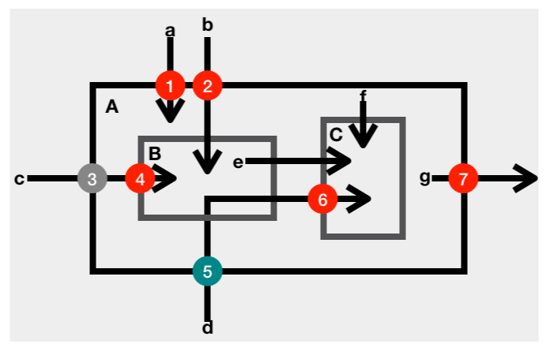

# 37 | 边界，信任的分水岭

边界是信息安全里一个重要的概念。如果不能清晰地界定信任的边界，并且有效地守护好这个边界，那么编写安全的代码几乎就是一项不可能完成的任务。

## 评审案例

计算机之间的通信，尤其是建立在非可靠连接之上的通信，如果我们能够知道对方是否处于活跃状态，会大幅度地提升通信效率。在传输层安全通信的场景下，这种检测对方活跃状态的协议，叫做心跳协议。

心跳协议的基本原理，就是发起方给对方发送一段检测数据，如果对方能原封不动地把检测数据都送回，就证明对方处于活跃状态。

下面的数据结构，定义的就是包含检测数据的通信消息。

```c
   struct {
      HeartbeatMessageType type;
      uint16 payload_length;
      opaque payload[HeartbeatMessage.payload_length];
      opaque padding[padding_length];
   } HeartbeatMessage;
```

其中，type 是一个字节，表明心跳检测的类型；payload_length 使用两个字节，定义的是检测数据的长度；payload 的字节数由 payload_length 确定，它携带的是检测数据；padding 是随机的填充数据，最少 16 个字节。

如果愿意回应心跳请求，接收方就拷贝检测数据（payload_length 和 payload），并把它封装在同样的数据结构里。

下面的这段代码（函数 process_heartbeat，为便于阅读，在源代码基础上有修改），就是接收方处理心跳请求的 C 语言代码。你能看出其中的问题吗？

```c
int process_heartbeat(
        unsigned char* request, unsigned int request_length) {
	unsigned char *p = request, *pl;
	unsigned short hbtype;
	unsigned int payload_length;
	unsigned int padding_length = 16; /* Use minimum padding */
 
	/* Read type and payload length first */
	hbtype = *p++;
	payload_length = ((unsigned int)(*p++)) << 8L |
	                 ((unsigned int)(*p++));
	pl = p;
 
    // produce response heaetbeat message
	unsigned char *response, *bp;
 
	/* Allocate memory for the response, size is 1 bytes
	 * message type, plus 2 bytes payload length, plus
	 * payload, plus padding
	 */
	response = malloc(1 + 2 + payload_length + padding_length);
	bp = response;
 
	/* Enter response type, length and copy payload */
	*bp++ = 1;  /* 1: response heartbeat type */
	*bp++ = (unsigned char)((payload_length >> 8L) & 0xff);
	*bp++ = (unsigned char)((payload_length      ) & 0xff);
	memcpy(bp, pl, payload_length);
	bp += payload_length;
 
    // snipped
 
	return 0;
}
```

上面这段代码，读取了请求的 payload_length 字段，然后按照 payload_length 的大小，分配了一段内存。然后，从请求数据的 payload 指针开始，拷贝了和 payload_length 一样大小的一段数据。这段数据，就是要回应给请求方的检测数据。 按照协议，这段数据应该和请求信息的检测数据一模一样。

比如说吧，如果心跳请求的数据是：

```c
type:           0x01
payload_length: 0x00, 0x05                       // 5
payload:        {0x68, 0x65, 0x6c, 0x6c, 0x6f};  // 'hello'
padding:        {0xCF, 0xED, ...};
```

按照协议和上面实现的代码，心跳请求的回应数据应该是：

```c
type:           0x01
payload_length: 0x00, 0x05                       // 5
payload:        {0x68, 0x65, 0x6c, 0x6c, 0x6f};  // 'hello'
padding:        {0x07, 0x91, ...};
```

这看起来很美好，是吧？ 可是，如果请求方心有图谋，在心跳请求数据上动了手脚，问题就来了。比如说吧，还是类似的心跳请求，但是 payload_length 的大小和真实的 payload 大小不相符合。下面的这段请求数据，检测数据还是只有 5 个字节，但是 payload_length 字段使用了一个大于 5 的数字。

```
type:           0x01
payload_length: 0x04, 0x00                       // 1024
payload:        {0x68, 0x65, 0x6c, 0x6c, 0x6f};  // hello
padding:        {0xCF, 0xED, ...};
```

按照协议的本意，这不是一个合法的心跳请求。上面处理心跳请求的代码，不能识别出这是一个不合法的请求，依旧完成了心跳请求的回应。

```c
type:           0x01
payload_length: 0x04, 0x00                       // 1024
payload:        {0x68, 0x65, 0x6c, 0x6c, 0x6f,   // 'hello
                 0xCF, 0xED, ...                 // request padding
                 0x70, 0x72, 0x69, 0x76, 0x69, 0x76, 0x61, 0x74,
                 0x65, 0x20, 0x6b, 0x65, 0x79, 0x20,
                  ... };  // private key "..."
padding:        {0x07, 0x91, ...};
```

心跳请求的真实检测数据只有 5 个字节，返回检测数据有 1024 个字节，这中间有 1019 个字节的差距。这 1019 个字节从哪儿来呢？由于代码使用了 memcpy() 函数，这 1019 个字节就是从 payload 指针（pl）后面的内存中被读取出来的。这些内存中可能包含很多敏感信息，比如密码的私钥，用户的社会保障号等等。

这就是著名的心脏滴血漏洞（Heartbleed），这个漏洞出现在 OpenSSL 的代码里。2014 年 4 月 7 日，OpenSSL 发布了这个漏洞的修复版。由于 OpenSSL 的广泛使用，有大批的产品和服务需要升级到修复版，而升级需要时间。修复版刚刚发布，像猎食者一样的黑客抢在产品和服务的升级完成之前，马上就展开了攻击。赛跑立即展开！仅隔一天，2014 年 4 月 8 日，加拿大税务局遭受了长达 6 个小时的攻击，大约有 900 人的社会保障号被泄漏。2014 年 4 月 14 日，英国育儿网站 Mumsnet 有几个用户帐户被劫持，其中包括了其首席执行官的账户。2014 年 8 月，一家世界 500 强医疗服务机构透露，心脏滴血漏洞公开一周后，他们的系统遭受攻击，导致四百五十万条医疗数据被泄漏。

## 案例分析

没有检查和拒绝不合法的请求，是心脏滴血漏洞出现的根本原因。这个漏洞的修复也很简单，增加检查心跳请求的数据结构是否合法的代码就行了。

下面的代码就是修复后的版本。修复后的代码，加入了对心跳请求 payload_length 的检查。

```c
int process_heartbeat(
        unsigned char* request, unsigned int request_length) {
	unsigned char *p = request, *pl;
	unsigned short hbtype;
	unsigned int payload_length;
	unsigned int padding_length = 16; /* Use minimum padding */
 
	/* Read type and payload length first */
	if (1 + 2 + 16 > request_length) {
        /* silently discard */
		return 0;
	}
 
	hbtype = *p++;
	payload_length = ((unsigned int)(*p++)) << 8L |
	                 ((unsigned int)(*p++));
 
	if (1 + 2 + payload_length + 16 > request_length) {
		/* silently discard */
		return 0;
	}
	pl = p;
 
    // produce response heaetbeat message
	unsigned char *response, *bp;
 
	/* Allocate memory for the response, size is 1 bytes
	 * message type, plus 2 bytes payload length, plus
	 * payload, plus padding
	 */
	response = malloc(1 + 2 + payload_length + padding_length);
	bp = response;
 
	/* Enter response type, length and copy payload */
	*bp++ = 1;  /* 1: response heartbeat type */
	*bp++ = (unsigned char)((payload_length >> 8L) & 0xff);
	*bp++ = (unsigned char)((payload_length      ) & 0xff);
	memcpy(bp, pl, payload_length);
	bp += payload_length;
 
    // snipped
 
    return 0;
}
```

如果比较下 process_heartbeat() 函数修复前后的实现代码，我们就会发现修复前的危险性主要来自于两点：

1. 没有检查外部数据的合法性（payload_length 和 payload）；
2. 内存的分配和拷贝依赖于外部的未校验数据（malloc 和 memcpy）。

这两点都违反了一条基本的安全编码原则，我们在前面提到过这条原则，那就是：[跨界的数据不可信任](https://time.geekbang.org/column/article/85968)。

## 信任的边界

不知道你有没有这样的疑问：类似于 memcpy() 函数，如果 process_heartbeat() 函数的传入参数 request_length 的数值，大于传入参数 request 实际拥有的数据量，这个函数不是还有内存泄漏问题吗？

如果独立地看上面的代码，这样的问题是有可能存在的。但是，process_heartbeat() 是 OpenSSL 的一个内部函数，它的调用代码，已经检查过 request 容量和 request_length 的匹配问题。所以，在 process_heartbeat() 的实现代码里，我们就不再操心这个匹配的问题了。

对一个函数来说，到底哪些传入参数应该检查，哪些传入参数不需要检查？这的确是一个让人头疼的问题。

一般来说，对于代码内部产生的数据，我们可以信任它们的合法性；而对于外部传入的数据，就不能信任它们的合法性了。外部数据，需要先检验，再使用。

**区分内部数据、外部数据的依据，就是数据的最原始来源，而不是数据在代码中的位置。**

比如下面的示意图，标明的就是一些典型的数据检查点。 其中小写字母代表数据，大写字母标示的方框代表函数或者方法，数字代表检查点，箭头代表数据流向。



1. 数据 a 是一个外部输入数据，函数 A 使用数据 a 之前，需要校验它的合法性（检查点 1）。
2. 数据 b 是一个外部输入数据，函数 A 使用数据 b 之前，完全校验了它的合法性（检查点 2）。函数 A 内部调用的函数 B 在使用数据 b 时，就不再需要检查它的合法性了。
3. 数据 c 是一个外部输入数据，函数 A 使用数据 c 之前，部分校验了它的合法性（检查点 3）。函数 A 只能使用校验了合法性的部分数据。函数 A 内部调用的函数 B 在使用数据 c 时，如果需要使用未被检验部分的数据，还要检查它的未被校验部分的合法性（检查点 4）。
4. 数据 d 是一个外部输入数据，函数 A 使用数据 d 之前，部分校验了它的合法性（检查点 5）。函数 A 内部调用的函数 B，没有使用该数据，但是把该数据传送给了函数 C。函数 C 在使用数据 d 时，如果需要使用未被检验部分的数据，还要检查它的未被校验部分的合法性（检查点 6）。
5. 数据 e 和 f 是一个内部数据，函数 C 使用内部数据时，不需要校验它的合法性。
6. 数据 g 是一个内部数据，由函数 A 产生，并且输出到外部。这时候，不需要检验数据 g 的合法性，但是需要防护输出数据的变化对内部函数 A 状态的影响（防护点 7）。

原则上，对于外部输入数据的合法性，我们要尽早校验，尽量全面校验。但是有时候，只有把数据分解到一定程度之后，我们才有可能完成对数据的全面校验，这时候就比较容易造成数据校验遗漏。

我们上面讨论过的心脏滴血漏洞，就有点像数据 d 的用例，调用关系多了几层，数据校验的遗漏就难以察觉了。

## 哪些是外部数据？

你是不是还有一个疑问：为什数据 e 和 f 对函数 C 来说，就不算是外部数据了？它们明明是函数 C 的外部输入数据呀！

当我们说跨界的数据时，这些数据指的是一个系统边界外部产生的数据。如果我们把函数 A、函数 B 和函数 C 看成一个系统，那么数据 e 和数据 f 就是这个系统边界内部产生的数据。内部产生的数据，一般是合法的，要不然就存在代码的逻辑错误；内部产生的数据，一般也是安全的，不会故意嵌入攻击性逻辑。所以，为了编码和运行的效率，我们一般会选择信任内部产生的数据。

一般的编码环境下，我们需要考量四类外部数据：

1. 用户输入数据（配置信息、命令行输入，用户界面输入等）；
2. I/O 输入数据（TCP/UDP 连接，文件 I/O）；
3. 公开接口输入数据；
4. 公开接口输出数据。

我想，前三类外部数据都容易理解。第四类公开接口输出数据，不是内部数据吗？怎么变成需要考量的外部数据了？我们在[前面的章节](https://time.geekbang.org/column/article/87077)讨论过这个问题。

公开接口的输出数据，其实是把内部数据外部化了。如果输出数据是共享的可变量（比如没有深拷贝的集合和数组），那么外部的代码就可以通过修改输出数据，进而影响原接口的行为。这也算是一种意料之外的“输入”。

需要注意的是，公开接口的规范，要标明可变量的处理方式。要不然，调用者就不清楚可不可以修改可变量。

让调用者猜测公开接口的行为，会埋下兼容性的祸根。

比如下面的例子，就是两个 Java 核心类库的公开方法。这两个方法，对于传入、传出的可变量（数组）都做了拷贝，并且在接口规范里声明了变量拷贝。

```java
package javax.net.ssl;
 
// snipped
public class SSLParameters {
    private String[] applicationProtocols = new String[0];
 
    // snipped
    /**
     * Returns a prioritized array of application-layer protocol names
     * that can be negotiated over the SSL/TLS/DTLS protocols.
     * <snipped>
     * This method will return a new array each time it is invoked.
     *
     * @return a non-null, possibly zero-length array of application
     *         protocol {@code String}s.  The array is ordered based
     *         on protocol preference, with {@code protocols[0]}
     *         being the most preferred.
     * @see #setApplicationProtocols
     * @since 9
     */
    public String[] getApplicationProtocols() {
        return applicationProtocols.clone();
    }
 
    /**
     * Sets the prioritized array of application-layer protocol names
     * that can be negotiated over the SSL/TLS/DTLS protocols.
     * <snipped>
     * @implSpec
     * This method will make a copy of the {@code protocols} array.
     * <snipped>
     * @see #getApplicationProtocols
     * @since 9
     */
    public void setApplicationProtocols(String[] protocols) {
        if (protocols == null) {
            throw new IllegalArgumentException("protocols was null");
        }
 
        String[] tempProtocols = protocols.clone();
        for (String p : tempProtocols) {
            if (p == null || p.isEmpty()) {
                throw new IllegalArgumentException(
                    "An element of protocols was null/empty");
            }
        }
 
        applicationProtocols = tempProtocols;
    }
}
```

从上面的例子中，我们也可以体会到，公开接口的编码要比内部接口的编码复杂得多。因为我们无法预料接口的使用者会怎么创造性地使用这些接口。公开接口的实现一般要慎重地考虑安全防护措施，这让公开接口的设计、规范和实现都变得很复杂。从这个意义上来说，我们也需要遵守在第二部分“经济的代码”里谈到的原则：[接口要简单直观](https://time.geekbang.org/column/article/82605)。

## 小结

通过对这个案例的讨论，我想和你分享下面两点个人看法。

1. **外部输入数据，需要检查数据的合法性；**
2. **公开接口的输入和输出数据，还要考虑可变量的传递带来的危害。**

## 一起来动手

外部数据的合法性问题，是信息安全里的一大类问题，也是安全攻击者经常利用的一类安全漏洞。

**区分内部数据、外部数据的依据，是数据的最原始来源，而不是数据在代码中的位置。**这一点让外部数据的识别变得有点艰难，特别是代码层数比较多的时候，我们可能没有办法识别一个传入参数，到底是内部数据还是外部数据。在这种情况下，我们需要采取比较保守的姿态，**无法识别来源的数据，不应该是可信任的数据。**

这一次的练习题，我们按照保守的姿态，来分析下面这段代码中的数据可信任性问题。

```java
import java.util.HashMap;
import java.util.Map;
 
public class Solution {
    /**
     * Given an array of integers, return indices of the two numbers
     * such that they add up to a specific target.
     */
    public int[] twoSum(int[] nums, int target) {
        Map<Integer, Integer> map = new HashMap<>();
        for (int i = 0; i < nums.length; i++) {
            int complement = target - nums[i];
            if (map.containsKey(complement)) {
                return new int[] { map.get(complement), i };
            }
            map.put(nums[i], i);
        }
        throw new IllegalArgumentException("No two sum solution");
    }
}
```

欢迎你把你的看法写在留言区，我们一起来学习、思考、精进！

如果你觉得这篇文章有所帮助，欢迎点击“请朋友读”，把它分享给你的朋友或者同事。

## 1716143665 拼课微信(4)

- 

  彩色的沙漠

  2019-06-04

  **

  malloc 开辟的空间可能包含释放了内存空间但是没有清除里面数据，所以里面的敏感信息有泄露的风险。释放内存空间的同时清空内存数据也是一个好习惯，避免很多不必要的麻烦

  展开**

  作者回复: 是的，一个完整的方案要做到两个方面：清空敏感数据以及防范内存泄漏。

- 

  天佑

  2019-04-14

  **

  老师，文件IO怎么也算外部数据呢？

  展开**

  作者回复: 文件修改不在代码可以控制的范围里呀。

- 

  空知

  2019-04-01

  **

  之前的整数溢出也算是边界问题的一种吧

  展开**

  作者回复: 是的。

- 

  天佑

  2019-03-29

  **

  我看防御式编程会在边界处，专门构建一些类进行外部输入过滤，穿越进边界内不，可以完全信任，这在实际场景当中可操作性更强些吧，避免个人开发的遗漏。
  另外，我看到有些例子对外部输入有标准化归一化处理，比如String normalized = Normalizer.normalize(xxx, Normalizer.Form.NFKC);道理也很好理解，觉得这样做会更好些，但是我咨询了开发，他们并不会经常用到，这是为什么，还是有特定场景才会使用？还有nfkc这玩意儿我一直没参透明白，希望老师解惑，谢谢。

  展开**

  作者回复: 专门有一个过滤层，这种办法也能有作用，但是局限性很大。个例还可以，不是一个普遍的解决方案。 因为，在边界处，如果处理了所有的数据，过滤层就和内部的代码没什么重大区别；如果处理不了所有的数据，遗漏的数据还是不可信任。 就像我们文中边界那一部分的数据d一样。另外，加一层做所有的过滤损害效率，增大代码复杂度，破坏代码逻辑。我很少看到这种用法。如果过滤层能想到检查，没有过滤层，常规代码里也能做到。先想到，才能做到；想到了，怎么做就有很多选择了。

  我也不懂NFKC是什么。