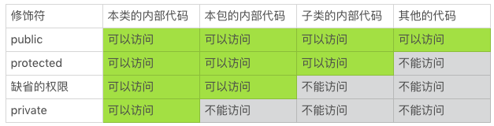

# 39 | 怎么控制好代码的权力？

在前面，我们讨论了“敏感信息经过授权才可以使用”的这样一条有关编码安全的实践。我们还可以把这个实践扩展到更大的范围：信息和资源，需经授权，方可使用。这个信息和资源，不仅仅包括用户数据这样的敏感信息，还包括计算机代码、产品和服务。


授权使用这些资源，需要遵循“最小授权”的原则。所授予的权力，能够让应用程序完成对应的任务就行，不要授予多余的权力。为了方便，我们可以把“最小授权”这个概念拆分成如下的两个部分来理解：

- 最小权力的设计
- 最小限度的授予

## 最小权力的设计

其实，不管使用什么编程语言，我们编写的代码都会涉及到代码权力的设计。最常见的设计，就是代码的访问控制权限的设计。


一段代码访问应用程序接口的过程，一般需要至少两个步骤，第一步是加载类库，第二步是调用接口。这两个步骤，都需要设计好访问控制权限。

### 模块的访问权限

下面的例子，就是一个 Java 模块的权限设计（module-info.java）。这个权限设计，定义了一个 example.coding 模块。这个模块允许外部代码使用它提供的 com.example.coding 内部接口。

```c
module example.coding {
    exports com.example.coding;
}
```

这个模块可能还包含其他的接口，比如位于 com.example.implement 包内的代码。由于模块的定义没有允许外部代码使用除了 com.example.coding 包空间以外的接口，那么 com.example.implement 包内的接口，即便是 public 接口，外部代码也不能直接访问了。


这个模块被加载时，它可以接受的访问控制权限也就相应地确定了。


我们在设计一个模块时，需要尽量把命名空间设计好，开放的接口放在一个开放的包里；内部接口或者代码实现，放在封闭的包里。把开放的部分和封闭的部分，分割开来。这样我们就设计了一道安全的边界，开放包里的代码，经过精心设计和耐心打磨，处理好潜在的安全问题。而封闭包里的代码编写就少了很多安全的顾虑，可以让编写更有效率。


这样的设计，也使得这个模块和外部的接触面更小。接触面越小，代码的安全问题就越少，代码的接口就越容易管理。


模块化是 JDK 9 引入的一个新特性。


在 JDK 9 之前，有很多声明为 public 的内部类，比如 com.sun.net.internal 包里的类。虽然这些内部的类声明为 public，但是它们的真实意图往往是方便内部不同包内的接口共享，而不是开放给外部的应用程序使用。所以，Java 的文档会一再强调，应用程序不要使用内部类，即使这些类声明为 public。因为这些内部类可能随时被改变，随时被删除。另外，内部类一般也没有规范的文档，实现的代码依赖内部假设，使用场景严格受限，这也让这些类的使用充满了陷阱。


然而，这些内部的 public 类毕竟有它们的价值和便利的地方，一些应用为了方便，使用了内部类。这不仅给内部类的修改带来了很大的困扰，也让应用程序面临不安定的兼容性和安全性问题。


Java 的模块化这个特性，通过增加一个访问控制边界，更好地区分开了开放和封闭的空间，提高了代码的安全性和可维护性。

### 接口的访问权限

Java 接口的访问控制权限，是由我们熟知的三个修饰符来定义的。这三个修饰符就是 public、 protected 和 private。如果三个修饰符都不使用，那就是缺省的访问控制权限。如果加上缺省的权限，那么 Java 的访问控制权限可以分为四类。


这四类权限定义接口的访问控制，具体可以参考下面的表格。



掌握这四类权限，是 Java 编码的基本功，我们都很熟悉，这里我们强调的，是它们的使用优先级。

在我们日常的编码中，需要遵循“优先最小权限”的原则。也就是说，应该优先使用权限最小的方案。按照这样的原则，Java 接口的访问控制权限的使用优先级，从高到低的顺序是：

1. private
2. 缺省的权限
3. protected
4. public

这需要我们养成一个习惯，遇到不是 private 的接口，我们一定要想一想：这个接口可以改成 private 接口吗？如果不能，接口需要的最小访问控制权限是什么？我们还可以做些什么事情，来降低这个接口的权限，减小接口的开放程度？


掌握 Java 接口的访问控制权限虽然是 Java 编码基本功之一，但要真的用好，落实到设计和编码上，也不是一件容易的事情。由于在编码过程中，我们往往会集中精力在代码的业务逻辑上，忽视了代码权限控制的概念。在 OpenJDK 的代码评审中，经常可以看到访问控制权限使用的疏忽。即使是对于资深的工程师而言，这也是一个常见的编码疏漏。


Java 接口的访问控制权限，是我们可以设置、使用的另外一道安全边界。这道边界，把类、包、子类以及外部代码区隔开来。**越开放的权限越需要控制，越封闭的权限越容易维护**。

### 修改的权限

还有一类权限，不太容易引起我们的注意。它就是修改的权限。在编程语言语法层面，Java 语言中，这个权限由 final 修饰符来定义，而 C 语言使用 const 关键字。


final 的类和方法，不允许被继承，阻断了代码实现的修改；final 的变量，不允许被修改，阻断了使用者带来的变更。我们前面讨论过可变量的威胁和继承的危害，限制修改权限，是规避这两类陷阱的最有效办法。

final 类：

```java
private final class Foo {
    // snipped
}
```

final 方法：

```java
private class Foo {
    // snipped
 
    final InputStream getInputStream() {
        // snipped
    }
}
```

final 变量：

```java
private final class Foo {
    private final Socket socket;
 
    // snipped
}
```

同样的，编码的时候，我们也要养成限制修改权限的习惯：能使用 final 修饰符的地方，就使用 final 修饰符；没有使用 final 修饰符的地方，可以想一想使用 final 修饰符能不能带来代码的改进；不能使用 final 修饰符的地方，想一想有没有可变量和继承的陷阱，如果存在这样的陷阱，就要考虑需不需要规避这些陷阱，以及该怎么规避这些陷阱。比如在前面的章节里，我们讨论了可以使用代理模式，当然还有其他的方法。

## 最小限度的授予

权力这东西，少了处处掣肘，多了飞扬跋扈，是一个很难平衡、很难设计的东西。一个操作系统，设计有只手遮天的 root 用户；一门编程语言，设计有无所不能的 AllPermission 和特权代码。


这些方式看似可以带来美好的绝对的权力，却恰恰是攻击者喜欢的命门。只要能够获得这绝对的权力，攻击者就可以为所欲为，轻而易举地跨过所有安全防线。只手遮天的权力，从来都是双刃剑！

我们前面讲过权限的三个要素：权限、权限的主体和权限的归属。

```c
grant Principal com.sun.security.auth.UnixPrincipal "duke" {
    permission java.io.FilePermission "/home/duke", "read, write";
};
```

要把这三个要素使用好，当然需要花费时间设计好这三个要素并且做好权限的分配。这多多少少有一点点麻烦。于是，就有人使用了无所不能的 AllPermission。


比如下面例子中的授权策略，就授予了 my.dirs 目录下的所有类库所有的权限。

```shell
grant codeBase "file:${my.dirs}}/*" {
    permission java.security.AllPermission;
};
```

这样的授权策略看着真是痛快、简单。其实，它的复杂性和由此带来的痛苦像是一座隐藏在水面下的冰山。


这个授权要想做到安全，至少需要做到两点。第一点就是 my.dirs 目录受到严格的保护，不能放入不被信任的代码。第二点就是 my.dirs 目录下的代码，没有安全漏洞可以泄漏这无所不能的权限。


要想做到第一点，技术本身已经不足以保证，还需要组织管理和规章制度的介入。但是管理和制度的介入，除了让系统维护人员更痛苦之外，还会让安全保障的强度大打折扣。


第二点提到的问题本身就是一个悖论，即使我们有良好的愿望以及强大的实力，也做不到代码没有安全漏洞。所以实际上，这只能是一个永远都不可企及的美好梦想而已。


安全策略的设计和实现，是一个很专业的技术。如果代码有需要，我们需要花点时间学好、用好这样的技术。

### 限制特权代码

类似于操作系统的 root 用户和安全策略的 AllPermission，还有一种获取绝对权力的方式，那就是使用特权代码。Java 中，特权代码的调用接口是 AccessController.doPrivileged() 方法。

AccessController.doPrivileged() 获取特权的方法有两种。第一种形式，是使用调用者的权力。如果调用者是一个绝对权力拥有者，这个方法就拥有绝对的权力。

```java
public static <T> T doPrivileged(PrivilegedAction<T> action)；
```

第二种形式，是在调用者权力许可的范围内，使用指定的权力。这种形式大幅度缩小了特权代码的权限范围，减轻了安全攻击的风险。

```java
public static <T> T doPrivileged(PrivilegedAction<T> action,
                                 AccessControlContext context,
                                 Permission... perms)；
```

如果你的代码需要使用特权代码，我建议优先考虑使用指定权力的接口。这会让你的代码避免一定的安全风险。

### 特权代码要短小

安全策略的设计和实现，以及特权代码的使用，都是很专业的内容。一般而言，我们应该优先考虑编写和使用无特权要求的代码，这样可以尽量规避掉一些不必要的安全风险和复杂性。


如果不能够避免特权代码的使用，那么特权代码的尺寸一定要短小，只使用它处理需要特权的流程，尽量别在特权代码里处理一般的用户数据和业务。

```java
AccessController.doPrivileged((PrivilegedAction<Void>)
    () -> {
        // Privileged code goes here.
        // The code should be short and simple.
 
        // snipped
 
        return null;
    }, ...);
```

## 小结

通过对最小授权的原则的讨论，我想和你分享两点个人看法：

1. 在编码的过程中，要考虑代码的权力；
2. 权力的设计和使用，要遵循“优先最小权限”的原则。

## 一起来动手

代码权力的设计，是我们容易忽视的一个问题。即便是熟知的 Java 修饰符，也不是每个人每次都能运用得恰如其分。如果你观察 OpenJDK 的代码评审，可能会发现，代码的权力是代码评审者关注的一个重要评审点。恰当运用 public、private 和 final 这些修饰符，可以有效地提高代码的安全性和可维护性。


这一次的练习题，我们换个角度，来分析下面这段代码中的权力设计问题。

```java
import java.util.HashMap;
import java.util.Map;
 
public class Solution {
    /**
     * Given an array of integers, return indices of the two numbers
     * such that they add up to a specific target.
     */
    public int[] twoSum(int[] nums, int target) {
        Map<Integer, Integer> map = new HashMap<>();
        for (int i = 0; i < nums.length; i++) {
            int complement = target - nums[i];
            if (map.containsKey(complement)) {
                return new int[] { map.get(complement), i };
            }
            map.put(nums[i], i);
        }
        throw new IllegalArgumentException("No two sum solution");
    }
}
```

欢迎你把你的看法写在留言区，我们一起来学习、思考、精进！


如果你觉得这篇文章有所帮助，欢迎点击“请朋友读”，把它分享给你的朋友或者同事。