# Dubbo入门介绍及学习笔记总结

[视频1](https://www.bilibili.com/video/BV1ns411c7jV?from=search&seid=10412979914972996053) 和 [视频2](https://www.bilibili.com/video/BV1ns411c7jV?p=11)。

[TOC]

## 一、分布式简要说明

**分布式系统是若干独立计算机的集合，这些计算机对于用户来说就像单个相关系统**。

老式单一应用架构系统就是把一个系统，统一放到一个服务器当中然后每一个服务器上放一个系统，如果要更新代码的话，每一个服务器上的系统都要重新去部署十分的麻烦。

而**分布式系统就是将一个完整的系统拆分成多个不同的服务，然后在将每一个服务单独的放到一个服务器当中**。

### （一）应用架构及发展演变

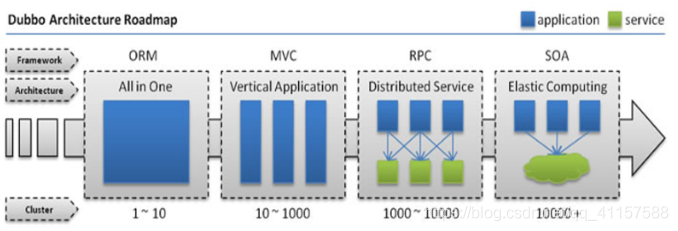

- ORM（Object Relational Mapping，对象关系映射）

    **单一应用架构**：每个服务器中部署一个项目，通过运行多个服务器实现运行多个项目的目的。

    

    缺点：
    - 如果要添加某一个功能的话就要把一个项目重新打包，在分别部署到每一个服务器当中去。
    - 如果后期项目越来越大的话单台服务器跑一个项目压力会很大的。会不利于维护，开发和程序的性能。

- MVC

    **垂直应用架构**：将应用切割成几个互不相干的小应用，在将每个小应用独立放到一个服务器上，如果某个应用的访问量较多，可以多部署服务器。

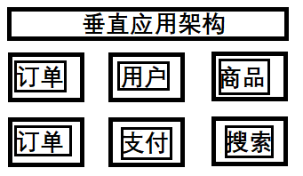

- 分布式服务架构

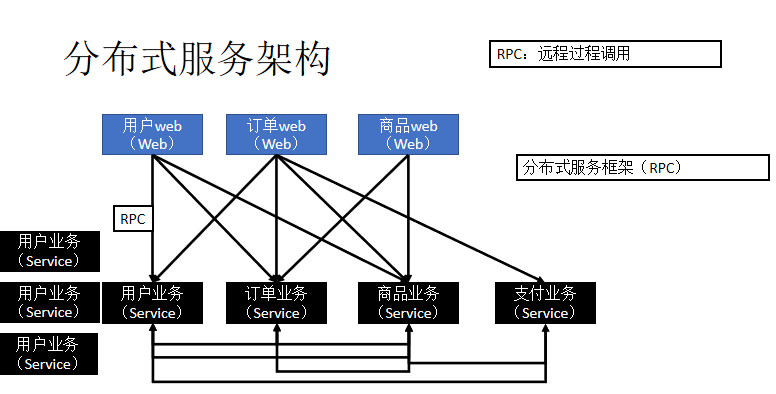


- SOA（Service-Oriented Architecture，面向服务的体系结构）

    **流动计算架构**：在分布式应用架构的基础上增加了一个**调度、治理中心**，基于访问压力实时管理集群容量、提高集群的利用率，用于提高机器利用率的资源调度和治理中心(SOA) 是关键 **(不浪费计算机资源)**

### （二）RPC  简介

**RPC（Remote Procedure Call，远程过程调用）**，是一种**进程**间通信方式，是一种**技术的思想**，而不是规范。它允许程序调用另一个地址空间（通常是共享网络的另一台机器上）的过程或函数，而不用程序员显式编码这个远程调用的细节。即程序员无论是调用本地的还是远程的函数，本质上编写的调用代码基本相同。

**分布式应用架构(远程过程调用)**：当垂直应用越来越多，应用之间交互不可避免，将核心业务抽取出来，作为独立的服务，逐渐形成稳定的服务中心，使前端应用能更快速的响应多变的市场需求。

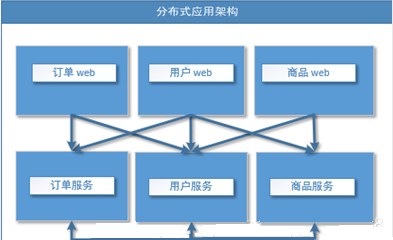

**RPC 调用分以下两种：**
**同步调用**：客户方等待调用执行完成并返回结果。
**异步调用**：客户方调用后不用等待执行结果返回，但依然可以通过回调通知等方式获取返回结果。若客户方不关心调用返回结果，则变成单向异步调用，单向调用不用返回结果。

### （三）RPC 工作原理

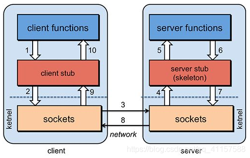

- Client 像调用本地服务似的调用远程服务；

- Client stub 接收到调用后，将方法、参数序列化

- 客户端通过 sockets 将消息发送到服务端

- Server stub 收到消息后进行解码（将消息对象反序列化）

- Server stub 根据解码结果调用本地的服务

- 本地服务执行(对于服务端来说是本地执行)并将结果返回给 Server stub

- Server stub 将返回结果打包成消息（将结果消息对象序列化）

- 服务端通过 sockets 将消息发送到客户端

- Client stub 接收到结果消息，并进行解码（将结果消息发序列化）

- 客户端得到最终结果。

```sequence
Title: 标题： RPC 调用步骤解析
Client->Client Stub: 1.客户端调用
Client Stub -> Client Stub: 2.序列化
Client Stub -> Server Stub: 3.发送消息
Server Stub -> Server Stub: 4.反序列化
Server Stub -> Server: 5.调用本地服务
Server -> Server: 6.服务处理
Server --> Server Stub: 7.返回处理结果
Server Stub --> Server Stub: 8.将结果序列化
Server Stub --> Client Stub: 9.返回消息
Client Stub --> Client Stub: 10.反序列化
Client Stub --> Client: 11.返回调用结果
```


### （三）Dubbo 和 SpringCloud 对比

| 项目         | Dubbo     | Spring Cloud |
| ------------ | --------- | ------------ |
| 服务注册中心 | Zookeeper | Eureka       |
| 服务调用方式 | RPC       | REST  API    |
| 服务网关     | 没有      | Zuul         |
| 断路器       | 不完善    | Hystrix      |
| 分布式配置   | 无        | Config       |
| 服务跟踪     | 无        | Sleuth       |
| 消息总线     | 无        | Bus          |
| 数据流       | 无        | Stream       |
| 批量任务     | 无        | Task         |

## 二、Dubbo 核心概念

Dubbo 是一款高性能、轻量级的开源 Java RPC 框架，它提供了三大核心能力：面向接口的远程方法调用，智能容错和负载均衡，服务自动注册和发现。

### （一）Dubbo 设计架构

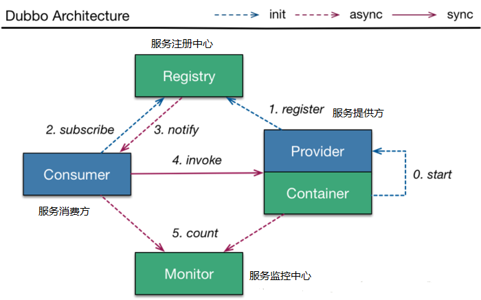

- **服务提供者（Provider）**：暴露服务的服务提供方，服务提供者在启动时，向注册中心注册自己提供的服务。
- **服务消费者（Consumer）**: 调用远程服务的服务消费方，服务消费者在启动时，向注册中心订阅自己所需的服务，服务消费者从提供者地址列表中，基于软负载均衡算法，选一台提供者进行调用，如果调用失败，再选另一台调用。
- **注册中心（Registry）**：注册中心返回服务提供者地址列表给消费者，如果有变更，注册中心将基于长连接推送变更数据给消费者。
- **监控中心（Monitor）**：服务消费者和提供者，在内存中累计调用次数和调用时间，定时每分钟发送一次统计数据到监控中心。

### （二）Dubbo 的特性

- 服务注册中心
  - 相比 Hessian 类 RPC 框架，Dubbo 有自己的服务中心，写好的服务可以注册到服务中心， 客户端从服务中心寻找服务，然后再到相应的服务提供者机器获取服务。通过服务中心可以实现集群、负载均衡、高可用(容错) 等重要功能。
  - 服务中心一般使用 Zookeeper 实现，也有 Redis 和其他一些方式。以使用 Zookeeper 作为服务中心为例，服务提供者启动后会在 Zookeeper 的 /dubbo 节点下创建提供的服务节点，包含服务提供者 ip、port 等信息。服务提供者关闭时会从 Zookeeper 中移除对应的服务。
  
- 负载均衡

  当在服务注册中心中，同一个服务有多个提供者在提供服务时，客户端通过以下几种方案来正确的选择提供者负载均衡。
  - random：随机选提供者，并可以给提供者设置权重。
  - roundrobin：轮询选择提供者
  - leastactive：最少活跃调用数，相同活跃数的随机，活跃数：指调用前后计数差。使慢的提供者收到更少请求，因为越慢的提供者的调用前后计数差会越大。
  - consistenthash：一致性hash，相同参数的请求发到同一台机器上。

- 简化测试，允许直连提供者
  在开发阶段为了方便测试，通常系统客户端能指定调用某个服务提供者，那么可以在引用服务时加一个 url 参数去指定服务提供者。 配置如下：` <dubbo:reference id="xxxService"interface="com.alibaba.xxx.XxxService"url="dubbo://localhost:20890"/>`

- 服务版本，服务分组
  在 Dubbo 配置文件中可以通过制定版本实现连接制定提供者，也就是通过服务版本可以控制服务的不兼容升级；当同一个服务有多种实现时，可以使用服务分组进行区分。

## 三、Dubbo 环境搭建  Zookeeper  注册中心

### 步骤一：搭建  zookeeper  注册中心环境

[Dubbo 官方文档]( http://dubbo.apache.org/en-us/docs/user/quick-start.html) 、官网下载安装 [Zookeeper](http://mirror.bit.edu.cn/apache/zookeeper/zookeeper-3.4.14/)。

> 在 bin 文件下，启动 zkServer.cmd 会有报错，处理需要在 condif 文件中将 `zoo_sample.cfg` 文件复制一份，将名字改为 `zoo.cfg`。

在 zookeeper 的文件夹下创建 data 文件夹，打开 zoo.cfg，修改 datadir，将 dataDir 数据保存为我们自定义的文件中(此步骤可省略) 。新增 `dataDir=../data`

配置完毕后，我们再次在 conf 下启动 zkServer.cmd，这次可以成功启动
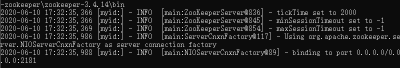
继续运行 zkCli.cmd，可以连接到 Zookeeper 的服务器。
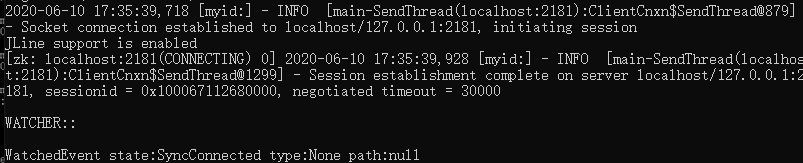

### 步骤二：Zookeeper 监控中心的配置

- 首先下载 dubbo-admin，[dubbo-admin下载地址](https://github.com/apache/dubbo-admin/tree/master)。

- 解压后进入目录修改指定 zookeeper 地址
  进入如下地址：`dubbo-admin-master\dubbo-admin\src\main\resources\application.properties"`
  将 zookeeper 的监控中心的地址配置为本地端口，增加如下配置即可

  ```properties
  #注册中心的地址
  dubbo.registry.address=zookeeper://127.0.0.1:2181
  ```

  配置完毕后，我们在 `dubo-zookeeper\dubbo-admin-master\dubbo-admin`文件夹下 cmd 中使用 `mvn clean package`打包测试下。

  在 target 文件中打包完成的 jar 包
  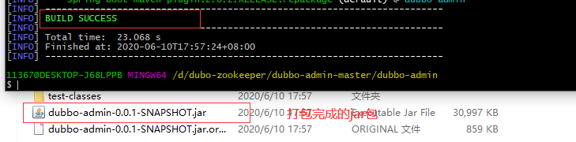
  cmd命令 `java -jar dubbo-admin-0.0.1-SNAPSHOT.jar`运行打包好的jar包
  启动成功后，可以看到一个7001的端口
  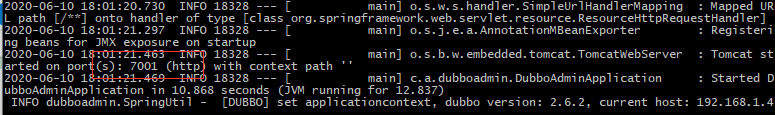

  此时我们的 zookeeper 的服务都为启动状态，在浏览器中访问 localhost:7001，访问到注册中心，输入账号密码 root。

  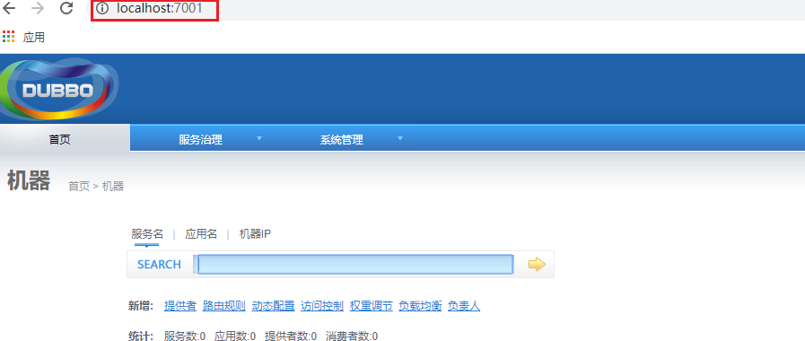

  此时，我们zookeeper监控中心的配置完成。注意，要访问到监控中心，一定要启动zookeeper注册中心的启动类

## 四、Dubbo 项目搭建

服务提供者和消费者模型：

服务模块 1：订单服务 web 模块，进行创建订单。服务模块 2：用户服务 service 模块，查询用户地址。服务 1 调用服务 2。即模块 1调用模块 2。


### （一）服务提供者和消费者接口搭建

- 服务提供者模块： `user-service-provider`

    ```java
    package com.gjxaiou;
    
    @NoArgsConstructor
    @AllArgsConstructor
    @Getter
    @Setter
    public class UserAddress implements Serializable {
        private Integer id;
        //用户地址
        private String userAddress;
        //用户id
        private String userId;
        //收货人
        private String consignee;
        //电话号码
        private String phoneNum;
        //是否为默认地址    Y-是     N-否
        private String isDefault;
    }
    
    ```
    
    服务提供接口和对应的实现类：UserService 和 UserServiceImpl

    ```java
    ////////////////////// UserService ////////////////////////////
    package com.gjxaiou.service;
    
    public interface UserService {
        /**
         * 按照用户id返回所有的收货地址
         */
        List<UserAddress> getUserAddressList(String userId);
    }
    
    /////////////////////// UserServiceImpl ///////////////////////
    package com.gjxaiou.service.impl;
    
    public class UserServiceImpl implements UserService {
        @Override
        public List<UserAddress> getUserAddressList(String userId) {
    
            UserAddress address1 = new UserAddress(1, "张三", "1", "安然", "15013x", "Y");
            UserAddress address2 = new UserAddress(2, "李四", "1", "情话", "1395x", "N");
    
            return Arrays.asList(address1, address2);
        }
    }
    ```
    
- 服务消费者模块： `order-service-consumer`

    服务消费者接口和其实现类：OrderService 和 OrderServiceImpl

    ```java
    /////////////////////// OrderService ///////////////////////
    public interface OrderService {
        /**
         * 初始化订单
         * @param userID
         */
        public void initOrder(String userID);
    }
    
    ///////////////////// OrderServiceImpl //////////////////////
    public class OrderServiceImpl implements OrderService {
        public UserService userService;
        public void initOrder(String userID) {
            //查询用户的收货地址
            List<UserAddress> userAddressList = userService.getUserAddressList(userID);
            System.out.println(userAddressList);
        }
    }
    ```

    **注意**：因为服务消费者要使用提供者的方法，因此将服务提供者中的实体类及 UserService 复制到当前消费者同级目录下。或者将提供者模块打包引入消费者的项目中。

    此时我们调用userservice肯定是要报错的。这种面向接口的方式，我们这里只是调到了接口，而接口实际是在另外一个项目中，如果我们两个项目工程都创建共同的实体类，太过于麻烦了，我们可以将服务接口，服务模型等单独放在一个项目中，更为方便调用。

- 抽象独立模块

    即单独创建一个模块，将上述的 UserAddress 和 OrderService 以及 UserService 移动该模块中（暂定名称为 gjxaiou-interface 模块）。

- 依赖服务

    把服务提供者和消费者项目中引入以下依赖，引入后项目不在报错。

    ```xml
    <dependency>
        <groupId>com.gjxaiou.dubbo</groupId>
        <artifactId>gjxaiou-interface</artifactId>
        <version>1.0-SNAPSHOT</version>
    </dependency>
    ```


### （二）服务提供者配置及测试

在 `user-service-provider` 服务提供者项目中引入依赖

```xml
<!--dubbo-->
<dependency>
    <groupId>com.alibaba</groupId>
    <artifactId>dubbo</artifactId>
    <version>2.6.2</version>
</dependency>
<!--注册中心是 zookeeper，引入zookeeper客户端，2.6 之前客户端对应为：zkclient-->
<dependency>
    <groupId>org.apache.curator</groupId>
    <artifactId>curator-framework</artifactId>
    <version>2.12.0</version>
</dependency>
```

在`resource`文件中创建`provider.xml`

```xml
<?xml version="1.0" encoding="UTF-8"?>
<beans xmlns="http://www.springframework.org/schema/beans"
       xmlns:xsi="http://www.w3.org/2001/XMLSchema-instance"
       xmlns:dubbo="http://code.alibabatech.com/schema/dubbo"
       xsi:schemaLocation="http://www.springframework.org/schema/beans http://www.springframework.org/schema/beans/spring-beans.xsd
		http://dubbo.apache.org/schema/dubbo http://dubbo.apache.org/schema/dubbo/dubbo.xsd
		http://code.alibabatech.com/schema/dubbo http://code.alibabatech.com/schema/dubbo/dubbo.xsd">
    <!--1、指定当前服务/应用的名字(同样的服务名字相同，不要和别的服务同名)-->
   <dubbo:application name="user-service-provider"></dubbo:application>
    <!--2、指定注册中心的位置-->
    <!--<dubbo:registry address="zookeeper://127.0.0.1:2181"></dubbo:registry>-->
    <dubbo:registry protocol="zookeeper" address="127.0.0.1:2181"></dubbo:registry>
    <!--3、指定通信规则（通信协议? 服务端口）-->
    <dubbo:protocol name="dubbo" port="20880"></dubbo:protocol>
    <!--4、暴露服务 让别人调用 ref指向服务的真正实现对象-->
    <dubbo:service interface="com.gjxaiou.dubbo.service.UserService" ref="userServiceImpl"></dubbo:service>

    <!--服务的实现-->
    <bean id="userServiceImpl" class="com.gjxiaou.dubbo.service.impl.UserServiceImpl"></bean>
</beans>
```

在提供模块中编写一个`ProviderApplication`启动类程序，运行测试配置

```java
public class MainApplication {
    public static void main(String[] args) throws IOException {
        ClassPathXmlApplicationContext applicationContext= new ClassPathXmlApplicationContext("provider.xml");
        applicationContext.start();
        // 不让程序终止
        System.in.read();
    }
}
```

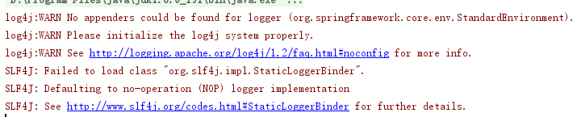

启动 zookeeper 注册中心的的 zkServer.cmd、和 zkCli.cmd 服务在 dubbo-admin target 中 cmd 运行 `java -jar dubbo-admin-0.0.1-SNAPSHOT.jar`再次启动项目，我们可以看到在zookeeper中已经发现服务提供者。
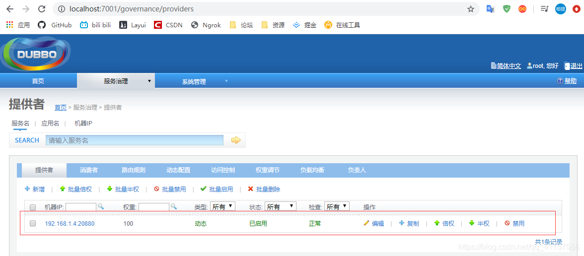

### （三）服务消费者配置及测试

在 `order-service-consumer` 服务消费者项目中引入依赖

```xml
<!--dubbo-->
<dependency>
    <groupId>com.alibaba</groupId>
    <artifactId>dubbo</artifactId>
    <version>2.6.2</version>
</dependency>
<!--注册中心是 zookeeper，引入zookeeper客户端-->
<dependency>
    <groupId>org.apache.curator</groupId>
    <artifactId>curator-framework</artifactId>
    <version>2.12.0</version>
</dependency>
```

创建`consumer.xml`

```xml
<?xml version="1.0" encoding="UTF-8"?>
<beans xmlns="http://www.springframework.org/schema/beans"
       xmlns:xsi="http://www.w3.org/2001/XMLSchema-instance"
       xmlns:dubbo="http://dubbo.apache.org/schema/dubbo"
       xmlns:context="http://www.springframework.org/schema/context"
       xsi:schemaLocation="http://www.springframework.org/schema/beans http://www.springframework.org/schema/beans/spring-beans.xsd
		http://www.springframework.org/schema/context http://www.springframework.org/schema/context/spring-context-4.3.xsd
		http://dubbo.apache.org/schema/dubbo http://dubbo.apache.org/schema/dubbo/dubbo.xsd
		http://code.alibabatech.com/schema/dubbo http://code.alibabatech.com/schema/dubbo/dubbo.xsd">
   <!--包扫描-->
    <context:component-scan base-package="com.gjxaiou.dubbo.service.impl"/>

    <!--指定当前服务/应用的名字(同样的服务名字相同，不要和别的服务同名)-->
    <dubbo:application name="order-service-consumer"></dubbo:application>
    <!--指定注册中心的位置-->
    <dubbo:registry address="zookeeper://127.0.0.1:2181"></dubbo:registry>

    <!--调用远程暴露的服务，生成远程服务代理-->
    <dubbo:reference interface="com.gjxaiou.d.service.UserService" id="userService"></dubbo:reference>
</beans>
```

把当前OrderServiceImpl实现类中加上注解

```java
@Service
public class OrderServiceImpl implements OrderService {
    @Autowired
    public UserService userService;
    public void initOrder(String userID) {
        //查询用户的收货地址
        List<UserAddress> userAddressList = userService.getUserAddressList(userID);
        
        //为了直观的看到得到的数据，以下内容也可不写
        System.out.println("当前接收到的userId=> "+userID);
        System.out.println("**********");
        System.out.println("查询到的所有地址为：");
        for (UserAddress userAddress : userAddressList) {
            //打印远程服务地址的信息
            System.out.println(userAddress.getUserAddress());
        }
        
    }
}
```

编写一个`ConsumerApplication`启动类程序，运行测试配置

```java
public class MainApplication {

    public static void main(String[] args) throws IOException {
        ClassPathXmlApplicationContext applicationContext = new ClassPathXmlApplicationContext(
                "consumer.xml");
        OrderService orderService = applicationContext.getBean(OrderService.class);

        //调用方法查询出数据
        orderService.initOrder("1");
        System.out.println("调用完成...");
        System.in.read();
    }
}
```

注意：消费者的运行测试需要先启动提供者。
启动服务提供者、消费者。及zookeeper的和dubbo-admin，查看监控信息。
localhost:7001


此时可以看到一个提供者，一个消费者的信息监控信息。

## dubbo-monitor-simple简易监控中心

进入dubbo-monitor-simple文件，执行cmd命令，mvn package打包成jar包
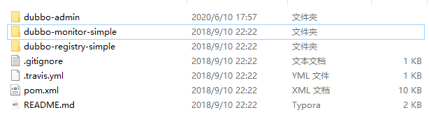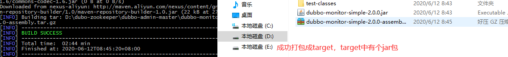将 `dubbo-monitor-simple-2.0.0-assembly.tar.gz` 压缩包解压至当前文件夹，解压后config文件查看properties的配置是否是本地的zookeeper。
打开解压后的 `assembly.bin` 文件，`start.bat` 启动`dubbo-monitor-simple监控中心`
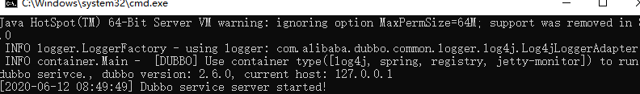在浏览器 `localhost:8080` ，可以看到一个监控中心。
在服务提供者和消费者的xml中配置以下内容，再次启动服务提供和消费者启动类。

```
    <!--dubbo-monitor-simple监控中心发现的配置-->
    <dubbo:monitor protocol="registry"></dubbo:monitor>
    <!--<dubbo:monitor address="127.0.0.1:7070"></dubbo:monitor>-->
123
```

可以看到，这个监控中心也捕获到了服务提供和消费者信息


## Dubbo与SpringBoot整合

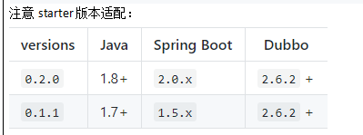

### boot-user-service-provider 服务提供者

**创建Maven项目 `boot-user-service-provider`** 服务提供者
导入以下依赖

```
<parent>
        <groupId>org.springframework.boot</groupId>
        <artifactId>spring-boot-starter-parent</artifactId>
        <version>2.0.4.RELEASE</version>
        <relativePath />
    </parent>

    <dependencies>
        <dependency>
            <groupId>com.lemon.gmail</groupId>
            <artifactId>gmail-interface</artifactId>
            <version>1.0-SNAPSHOT</version>
        </dependency>

        <dependency>
            <groupId>org.springframework.boot</groupId>
            <artifactId>spring-boot-starter</artifactId>
        </dependency>

        <dependency>
            <groupId>com.alibaba.boot</groupId>
            <artifactId>dubbo-spring-boot-starter</artifactId>
            <version>0.2.0</version>
        </dependency>
    </dependencies>

```

把 `user-service-provider` 中的service拿到此项目中。
注意，以此方法为返回的需要更改 interface包中的void为 List

```
@Service//dubbo的服务暴露
@Component
public class UserServiceImpl implements UserService {
	public List<UserAddress> getUserAddressList(String userId) {

		UserAddress address1 = new UserAddress(1, "河南省郑州巩义市宋陵大厦2F", "1", "安然", "150360313x", "Y");
		UserAddress address2 = new UserAddress(2, "北京市昌平区沙河镇沙阳路", "1", "情话", "1766666395x", "N");

		return Arrays.asList(address1,address2);
	}
}
1234567891011
```

配置 `application.properties`

```
dubbo.application.name=boot-user-service-provider
dubbo.registry.address=127.0.0.1:2181
dubbo.registry.protocol=zookeeper

dubbo.protocol.name=dubbo
dubbo.protocol.port=20880

#连接监控中心
dubbo.monitor.protocol=registry

```

BootProviderApplication 启动类配置

```
@EnableDubbo //开启基于注解的dubbo功能
@SpringBootApplication
public class BootProviderApplication {
    public static void main(String[] args) {
        SpringApplication.run(BootProviderApplication.class, args);
    }
}

```

启动注册中心，启动当前服务提供者，可以在浏览器看到一个服务提供者。

### boot-order-service-consumer 服务消费者

**创建Maven项目 `boot-order-service-consumer`** 服务消费者
导入以下依赖

```
<parent>
        <groupId>org.springframework.boot</groupId>
        <artifactId>spring-boot-starter-parent</artifactId>
        <version>2.0.4.RELEASE</version>
        <relativePath /> <!-- lookup parent from repository -->
    </parent>

    <dependencies>
        <dependency>
            <groupId>com.lemon.gmail</groupId>
            <artifactId>gmail-interface</artifactId>
            <version>1.0-SNAPSHOT</version>
        </dependency>

        <dependency>
            <groupId>org.springframework.boot</groupId>
            <artifactId>spring-boot-starter-web</artifactId>
        </dependency>

        <dependency>
            <groupId>com.alibaba.boot</groupId>
            <artifactId>dubbo-spring-boot-starter</artifactId>
            <version>0.2.0</version>
        </dependency>
    </dependencies>
12345678910111213141516171819202122232425
```

把order-service-consumer项目中的service复制到当前项目。

```
@Service
public class OrderServiceImpl implements OrderService {

    @Reference//引用远程提供者服务
    UserService userService;

    public List<UserAddress> initOrder(String userID) {
        //查询用户的收货地址
        List<UserAddress> userAddressList = userService.getUserAddressList(userID);

        System.out.println("当前接收到的userId=> "+userID);
        System.out.println("**********");
        System.out.println("查询到的所有地址为：");
        for (UserAddress userAddress : userAddressList) {
            //打印远程服务地址的信息
            System.out.println(userAddress.getUserAddress());
        }
        return userAddressList;
    }
}
1234567891011121314151617181920
```

创建 OrderController 控制器

```
@Controller
public class OrderController {
    @Autowired
    OrderService orderService;

    @RequestMapping("/initOrder")
    @ResponseBody
    public List<UserAddress> initOrder(@RequestParam("uid")String userId) {
        return orderService.initOrder(userId);
    }
}
1234567891011
```

创建application.properties 配置

```
server.port=8081
dubbo.application.name=boot-order-service-consumer
dubbo.registry.address=zookeeper://127.0.0.1:2181

#连接监控中心 注册中心协议
dubbo.monitor.protocol=registry
123456
```

**BootConsumerApplication** 启动类创建

```
@EnableDubbo //开启基于注解的dubbo功能
@SpringBootApplication
public class BootConsumerApplication {
    public static void main(String[] args){
        SpringApplication.run(BootConsumerApplication.class,args);
    }
}
1234567
```

配置完毕，此时启动zookeeper注册中心及监控。
启动springboot配置的服务提供者和消费者
在浏览器输入 localhost:7001 查看结果
http://localhost:8081/initOrder?uid=1 查询到地址信息
duboo的springboot整合配置完成。

## Dubbo配置

dubbo配置官网参考：http://dubbo.apache.org/zh-cn/docs/user/references/xml/dubbo-service.html
**1、配置原则**
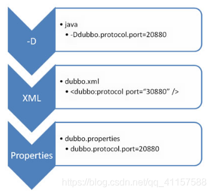
JVM 启动 -D 参数优先，这样可以使用户在部署和启动时进行参数重写，比如在启动时需改变协议的端口。
XML 次之，如果在 XML 中有配置，则 dubbo.properties 中的相应配置项无效。
Properties 最后，相当于缺省值，只有 XML 没有配置时，dubbo.properties 的相应配置项才会生效，通常用于共享公共配置，比如应用名。
**2、启动时检查**
Dubbo 缺省会在启动时检查依赖的服务是否可用，不可用时会抛出异常，阻止 Spring 初始化完成，以便上线时，能及早发现问题，默认 check=“true”。

可以通过 check=“false” 关闭检查，比如，测试时，有些服务不关心，或者出现了循环依赖，必须有一方先启动。

另外，如果你的 Spring 容器是懒加载的，或者通过 API 编程延迟引用服务，请关闭 check，否则服务临时不可用时，会抛出异常，拿到 null 引用，如果 check=“false”，总是会返回引用，当服务恢复时，能自动连上。

以`order-service-consumer`消费者为例，在consumer.xml中添加配置

```
<!--配置当前消费者的统一规则,当前所有的服务都不启动时检查-->
 <dubbo:consumer check="false"></dubbo:consumer>
12
```

添加后，即使服务提供者不启动，启动当前的消费者，也不会出现错误。
**3、全局超时配置**

```
全局超时配置
<dubbo:provider timeout="5000" />

指定接口以及特定方法超时配置
<dubbo:provider interface="com.foo.BarService" timeout="2000">
    <dubbo:method name="sayHello" timeout="3000" />
</dubbo:provider>
1234567
```

**配置原则**
dubbo推荐在Provider上尽量多配置Consumer端属性

```
1、作服务的提供者，比服务使用方更清楚服务性能参数，如调用的超时时间，合理的重试次数，等等
2、在Provider配置后，Consumer不配置则会使用Provider的配置值，即Provider配置可以作为Consumer的缺省值。否则，Consumer会使用Consumer端的全局设置，这对于Provider不可控的，并且往往是不合理的
12
```

配置的覆盖规则：

1. 方法级配置别优于接口级别，即小Scope优先
2. Consumer端配置 优于 Provider配置 优于 全局配置，
3. 最后是Dubbo Hard Code的配置值（见配置文档）
    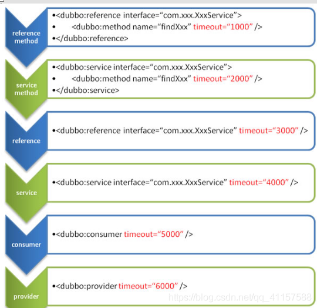**多版本控制**
    [
    http://dubbo.apache.org/zh-cn/docs/user/demos/multi-versions.html](http://dubbo.apache.org/zh-cn/docs/user/demos/multi-versions.html)
    在服务提供者中复制多个impl。起不同的名字

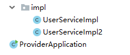
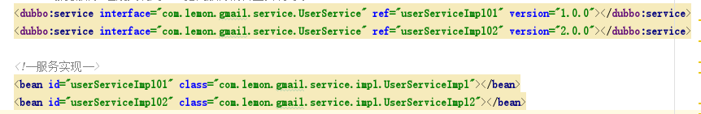配置多个文件的路径及信息。
服务消费者调用时，可自由配置版本
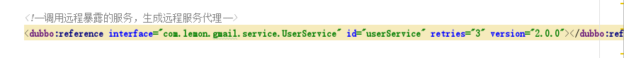

### dubbo与springboot整合的三种方式

1、将服务提供者注册到注册中心(如何暴露服务)
1.1导入Dubbo的依赖 和 zookeeper 客户端

2、让服务消费者去注册中心订阅服务提供者的服务地址
Springboot与Dubbo整合的三种方式
2.1导入dubbo-starter。在application.properties配置属性，使用@Service【暴露服务】，使用@Reference【引用服务】
2.2保留Dubbo 相关的xml配置文件
导入dubbo-starter，使用@ImportResource导入Dubbo的xml配置文件

3、使用 注解API的方式
将每一个组件手动配置到容器中,让dubbo来扫描其他的组件

## 高可用

zookeeper宕机与dubbo直连
现象：zookeeper注册中心宕机，还可以消费dubbo暴露的服务。
原因：

健壮性↓

- 监控中心宕掉不影响使用，只是丢失部分采样数据
- 数据库宕掉后，注册中心仍能通过缓存提供服务列表查询，但不能注册新服务
- 注册中心对等集群，任意一台宕掉后，将自动切换到另一台
- 注册中心全部宕掉后，服务提供者和服务消费者仍能通过本地缓存通讯
- 服务提供者无状态，任意一台宕掉后，不影响使用
- 服务提供者全部宕掉后，服务消费者应用将无法使用，并无限次重连等待服务提供者恢复
    高可用：通过设计，减少系统不能提供服务的时间；

### 集群下dubbo负载均衡配置

在集群负载均衡时，Dubbo 提供了多种均衡策略，缺省为 random 随机调用。

**负载均衡策略如下**

**Random LoadBalance 基于权重的随机负载均衡机制**
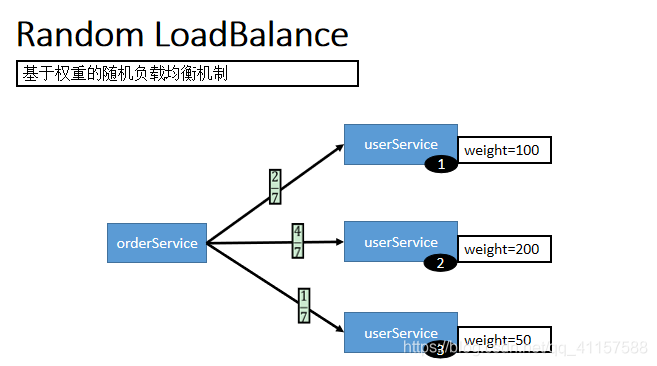
`随机，按权重设置随机概率。 在一个截面上碰撞的概率高，但调用量越大分布越均匀，而且按概率使用权重后也比较均匀，有利于动态调整提供者权重。`

**RoundRobin LoadBalance 基于权重的轮询负载均衡机制**
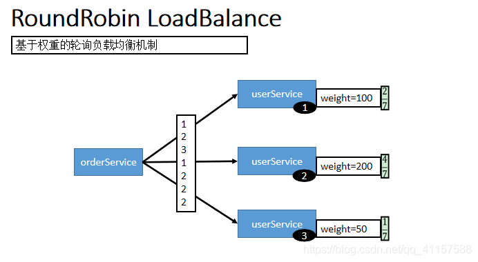
`轮循，按公约后的权重设置轮循比率。 存在慢的提供者累积请求的问题，比如：第二台机器很慢，但没挂，当请求调到第二台时就卡在那，久而久之，所有请求都卡在调到第二台上。`

**LeastActive LoadBalance最少活跃数负载均衡机制**
`最少活跃调用数，相同活跃数的随机，活跃数指调用前后计数差。 使慢的提供者收到更少请求，因为越慢的提供者的调用前后计数差会越大。`
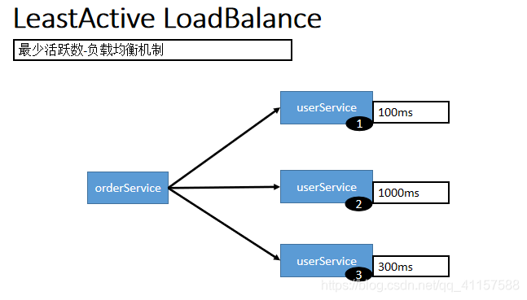
**ConsistentHash LoadBalance一致性hash 负载均衡机制**
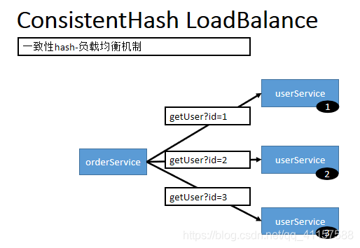
`一致性 Hash，相同参数的请求总是发到同一提供者。 当某一台提供者挂时，原本发往该提供者的请求，基于虚拟节点，平摊到其它提供者，不会引起剧烈变动。算法参见：http://en.wikipedia.org/wiki/Consistent_hashing 缺省只对第一个参数 Hash，如果要修改，请配置 <dubbo:parameter key="hash.arguments" value="0,1" /> 缺省用 160 份虚拟节点，如果要修改，请配置 <dubbo:parameter key="hash.nodes" value="320" />`

## 整合hystrix，服务熔断与降级处理

### 服务降级

**当服务器压力剧增的情况下，根据实际业务情况及流量，对一些服务和页面有策略的不处理或换种简单的方式处理，从而释放服务器资源以保证核心交易正常运作或高效运作。**
可以通过服务降级功能临时屏蔽某个出错的非关键服务，并定义降级后的返回策略。
向注册中心写入动态配置覆盖规则：

```
RegistryFactory registryFactory = ExtensionLoader.getExtensionLoader(RegistryFactory.class).getAdaptiveExtension();
Registry registry = registryFactory.getRegistry(URL.valueOf("zookeeper://10.20.153.10:2181"));
registry.register(URL.valueOf("override://0.0.0.0/com.foo.BarService?category=configurators&dynamic=false&application=foo&mock=force:return+null"));
123
```

**其中：**
mock=force:return+null 表示消费方对该服务的方法调用都直接返回 null 值，不发起远程调用。用来屏蔽不重要服务不可用时对调用方的影响。
还可以改为 mock=fail:return+null 表示消费方对该服务的方法调用在失败后，再返回 null 值，不抛异常。用来容忍不重要服务不稳定时对调用方的影响。

### 集群容错

在集群调用失败时，Dubbo 提供了多种容错方案，缺省为 failover 重试。
**集群容错模式**

**Failover Cluster**
失败自动切换，当出现失败，重试其它服务器。通常用于读操作，但重试会带来更长延迟。可通过 retries=“2” 来设置重试次数(不含第一次)。

重试次数配置如下：
<dubbo:service retries=“2” />
或
<dubbo:reference retries=“2” />
或
dubbo:reference
<dubbo:method name=“findFoo” retries=“2” />
</dubbo:reference>

**Failfast Cluster**
快速失败，只发起一次调用，失败立即报错。通常用于非幂等性的写操作，比如新增记录。

**Failsafe Cluster**
失败安全，出现异常时，直接忽略。通常用于写入审计日志等操作。

**Failback Cluster**
失败自动恢复，后台记录失败请求，定时重发。通常用于消息通知操作。

**Forking Cluster**
并行调用多个服务器，只要一个成功即返回。通常用于实时性要求较高的读操作，但需要浪费更多服务资源。可通过 forks=“2” 来设置最大并行数。

**Broadcast Cluster**
广播调用所有提供者，逐个调用，任意一台报错则报错 [2]。通常用于通知所有提供者更新缓存或日志等本地资源信息。

**集群模式配置**
按照以下示例在服务提供方和消费方配置集群模式
<dubbo:service cluster=“failsafe” />
或
<dubbo:reference cluster=“failsafe” />

### 整合hystrix

服务熔断错处理配置参考=> https://www.cnblogs.com/xc-xinxue/p/12459861.html

Hystrix 旨在通过控制那些访问远程系统、服务和第三方库的节点，从而对延迟和故障提供更强大的容错能力。Hystrix具备拥有回退机制和断路器功能的线程和信号隔离，请求缓存和请求打包，以及监控和配置等功能
**配置spring-cloud-starter-netflix-hystrix**
spring boot官方提供了对hystrix的集成，直接在pom.xml里加入依赖：

```
 <dependency>
     <groupId>org.springframework.cloud</groupId>
      <artifactId>spring-cloud-starter-netflix-hystrix</artifactId>
      <version>1.4.4.RELEASE</version>
</dependency>
12345
```

然后在Application类上增加@EnableHystrix来启用hystrix starter：

```
@SpringBootApplication
@EnableHystrix //开启服务容错功能
public class ProviderApplication {
	...启动方法
}
12345
```

**配置Provider端**
在Dubbo的Provider上增加@HystrixCommand配置，这样子调用就会经过Hystrix代理。

```
@Service(version = "1.0.0")
public class HelloServiceImpl implements HelloService {
    @HystrixCommand(commandProperties = {
     @HystrixProperty(name = "circuitBreaker.requestVolumeThreshold", value = "10"),
     @HystrixProperty(name = "execution.isolation.thread.timeoutInMilliseconds", value = "2000") })
    @Override
    public String sayHello(String name) {
        // System.out.println("async provider received: " + name);
        // return "annotation: hello, " + name;
        throw new RuntimeException("Exception to show hystrix enabled.");
    }
}
123456789101112
```

**配置Consumer端**
对于Consumer端，则可以增加一层method调用，并在method上配置@HystrixCommand。当调用出错时，会走到fallbackMethod = "reliable"的调用里。

```
@Reference(version = "1.0.0")
    private HelloService demoService;

    @HystrixCommand(fallbackMethod = "reliable")
    public String doSayHello(String name) {
        return demoService.sayHello(name);
    }
    public String reliable(String name) {
        return "hystrix fallback value";
    }
12345678910
```

## dubbo原理

### RPC原理

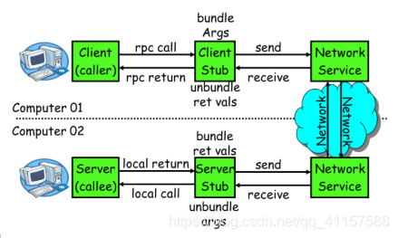
一次完整的RPC调用流程（同步调用，异步另说)如下：

1. **服务消费方（client）调用以本地调用方式调用服务；**
2. client stub接收到调用后负责将方法、参数等组装成能够进行网络传输的消息体；
3. client stub找到服务地址，并将消息发送到服务端；
4. server stub收到消息后进行解码；
5. server stub根据解码结果调用本地的服务；
6. 本地服务执行并将结果返回给server stub；
7. server stub将返回结果打包成消息并发送至消费方；
8. client stub接收到消息，并进行解码；
9. **服务消费方得到最终结果。**

dubbo只用了两步1和8，中间的过程是透明的看不到的。RPC框架的目标就是要2~8这些步骤都封装起来，这些细节对用户来说是透明的，不可见的。

## netty通信原理

Netty是一个异步事件驱动的网络应用程序框架， 用于快速开发可维护的高性能协议服务器和客户端。它极大地简化并简化了TCP和UDP套接字服务器等网络编程。
**BIO：(Blocking IO)**
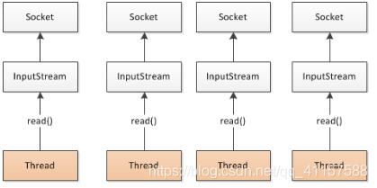NIO (Non-Blocking IO)
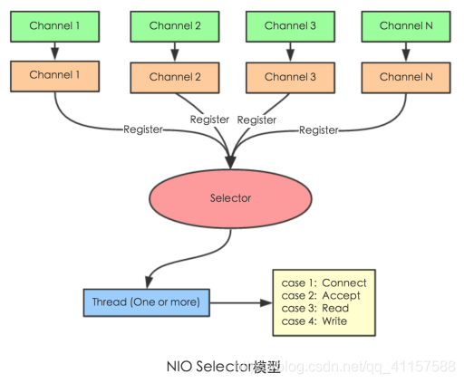Selector 一般称 为选择器 ，也可以翻译为 多路复用器，
Connect（连接就绪）、Accept（接受就绪）、Read（读就绪）、Write（写就绪)

**Netty基本原理：**
netty基本原理，可参考https://www.sohu.com/a/272879207_463994
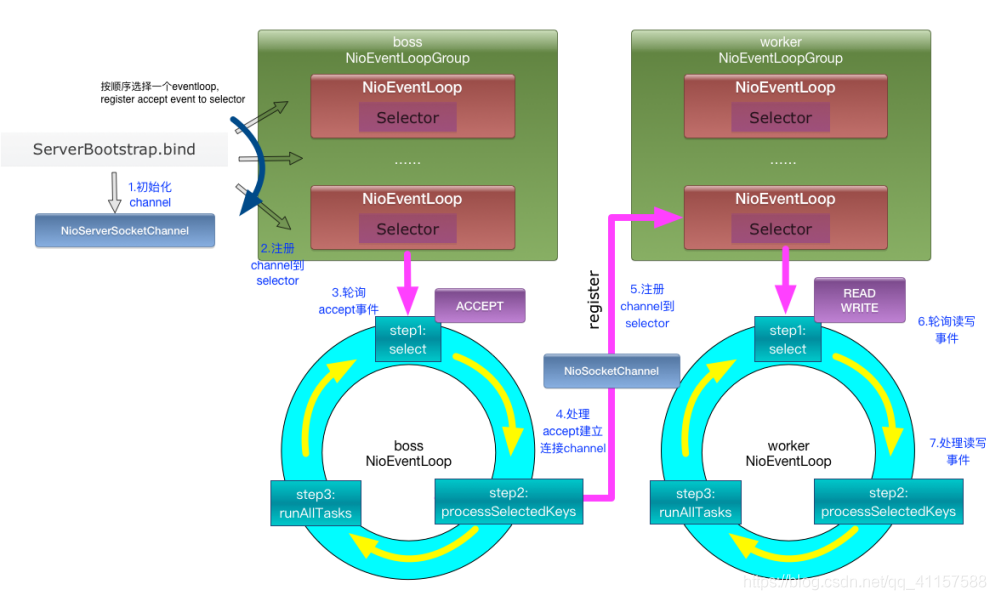

## dubbo原理

### 1.dubbo原理 -框架设计

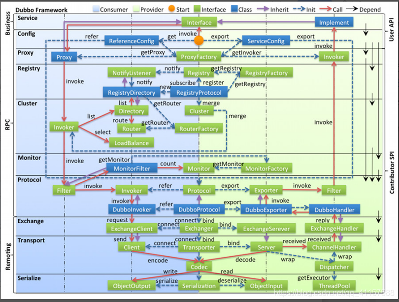

- config 配置层：对外配置接口，以 ServiceConfig, ReferenceConfig 为中心，可以直接初始化配置类，也可以通过 spring 解析配置生成配置类
- proxy 服务代理层：服务接口透明代理，生成服务的客户端 Stub 和服务器端 Skeleton, 以 ServiceProxy 为中心，扩展接口为 ProxyFactory
- registry 注册中心层：封装服务地址的注册与发现，以服务 URL 为中心，扩展接口为 RegistryFactory, Registry, RegistryService
- cluster 路由层：封装多个提供者的路由及负载均衡，并桥接注册中心，以 Invoker 为中心，扩展接口为 Cluster, Directory, Router, LoadBalance
- monitor 监控层：RPC 调用次数和调用时间监控，以 Statistics 为中心，扩展接口为 MonitorFactory, Monitor, MonitorService
- protocol 远程调用层：封装 RPC 调用，以 Invocation, Result 为中心，扩展接口为 Protocol, Invoker, Exporter
- exchange 信息交换层：封装请求响应模式，同步转异步，以 Request, Response 为中心，扩展接口为 Exchanger, ExchangeChannel, ExchangeClient, ExchangeServer
- transport 网络传输层：抽象 mina 和 netty 为统一接口，以 Message 为中心，扩展接口为 Channel, Transporter, Client, Server, Codec
- serialize 数据序列化层：可复用的一些工具，扩展接口为 Serialization, ObjectInput, ObjectOutput, ThreadPool

### 2.dubbo原理 -启动解析、加载配置信息

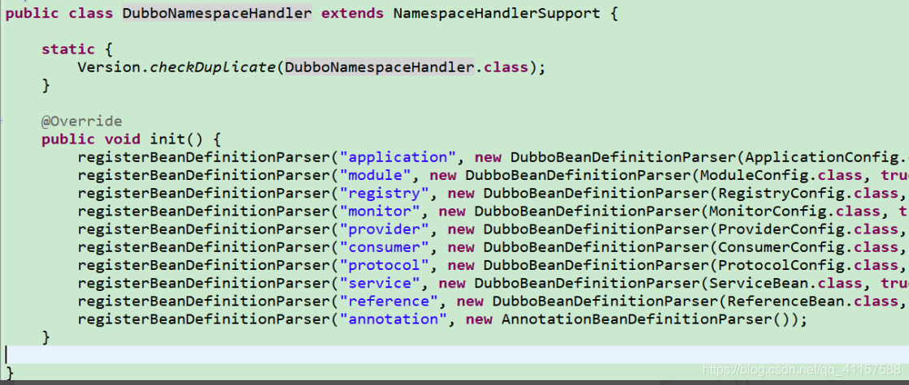

### 3.dubbo原理 -服务暴露

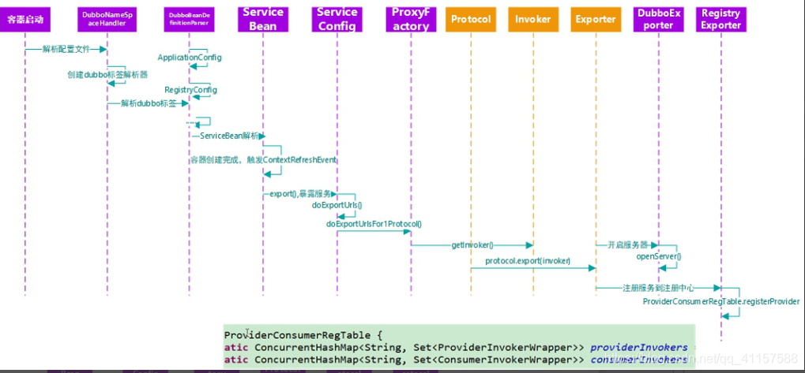

### 4.dubbo原理 -服务引用

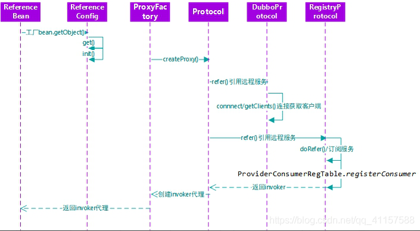

### 5.dubbo原理 -服务调用

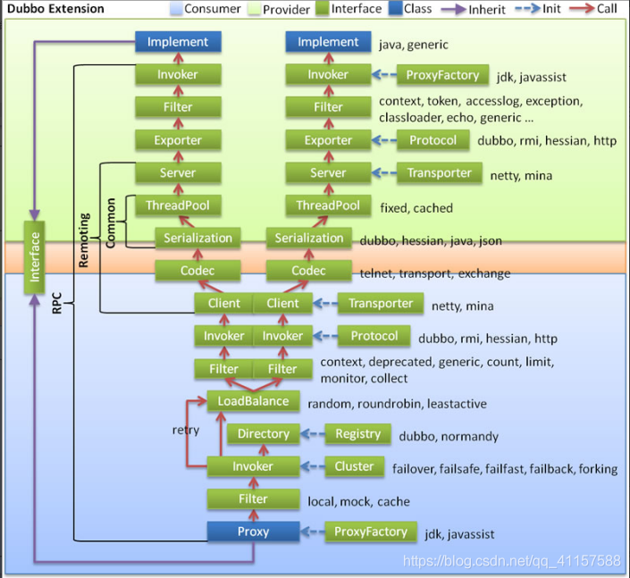