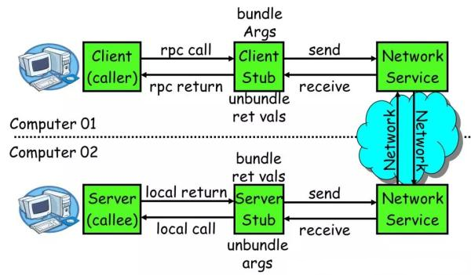
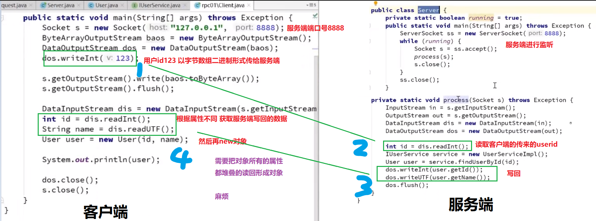
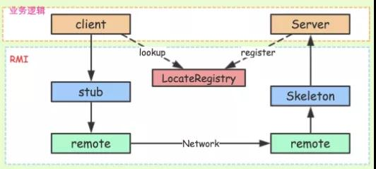
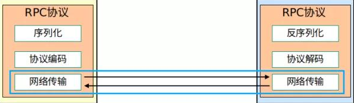
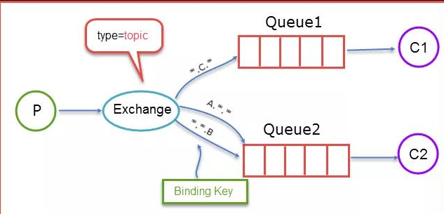
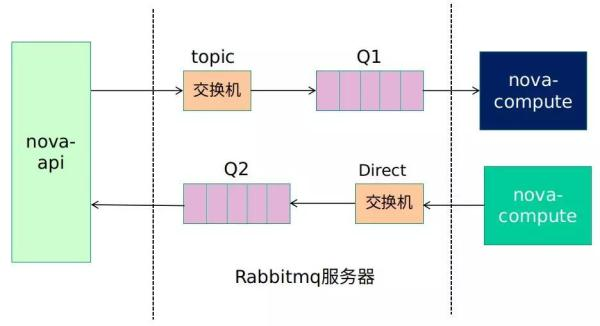
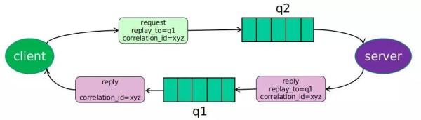
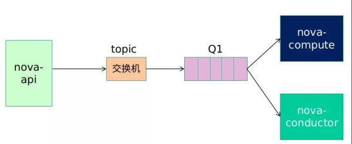
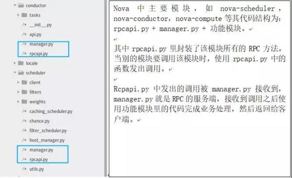

# RPC

[TOC]


## 零、前言

 RPC(Remote Procedure Call) 是一种概念，是一种远程通信方式、一种技术思想（不是一种规范或者协议），具体实现有很多种。它是一种通过网络从远程计算机程序上请求服务，而不需要了解底层网络技术的思想。

常见 RPC 技术和框架有：

- 应用级的服务框架：阿里的 Dubbo/Dubbox、Google gRPC、Spring Boot/Spring Cloud。
- 远程通信协议：RMI、Socket、SOAP(HTTP XML)、REST(HTTP + JSON)。
- 通信框架：MINA 和 Netty。

**完整的 RPC 框架**

<<<<<<< HEAD
在一个典型 RPC 的使用场景中，包含了服务发现、负载、容错、网络传输、序列化等组件，其中“RPC 协议”就指明了程序如何进行**网络传输和序列化**。
=======
在一个典型 RPC 的使用场景中，包含了服务发现、负载、容错、网络传输、序列化等组件，其中「RPC 协议」就指明了程序如何进行网络传输和序列化。
>>>>>>> 229de5e160c96bc1f13a0e1f2a39797e5a28df16

[](https://s3.51cto.com/oss/201906/17/fd5b5686336b0a1212398d8ea8fe6f66.jpg-wh_651x-s_3461264051.jpg)

## 一、名词解析

从单机走向分布式产生了很多分布式的通信方式

<<<<<<< HEAD
- 最古老也是最有效：TCP/UDP 的二进制传输。事实上所有的通信方式归根结底都是TCP/UDP。
=======
- 最古老有效的使用 TCP/UDP 的二进制传输。事实上所有的通信方式归根结底都是 TCP/UDP
>>>>>>> 229de5e160c96bc1f13a0e1f2a39797e5a28df16

- CORBA (Common Object Request Broker Architecture)。支持面向对象的通信协议（复杂）。

- Web Service(SOA SOAP RDDI WSDL…)

    基于 HTTP + XML 的标准化 Web API，服务端提供服务的接口是 XML 格式，并且该格式在 HTTP 上进行传输。因为 XML 本身大（纯文本）， HTTP 本身传输也是纯文本，所以慢。

- RestFul ( Representational State Transfer，表现层状态转换)

<<<<<<< HEAD
    回归简单化本源的 Web API 的事实标准：HTTP + JSON。
=======
    回归简单化本源的 Web API 的事实标准h ttp://mashibing.com/product/java，使用 HTTP + JSON

- RMI （Remote Method InvocationJava）
>>>>>>> 229de5e160c96bc1f13a0e1f2a39797e5a28df16

    内部的分布式通信协议，只支持 Java 语言，不能跨语言。

- JMS (Java Message Service)

<<<<<<< HEAD
    JavaEE 中的消息框架标准，为很多 MQ 所支持
=======
    JavaEE 中的消息框架标准,为很多 MQ 所支持
>>>>>>> 229de5e160c96bc1f13a0e1f2a39797e5a28df16

- RPC(Remote Procedure Call，远程过程调用) 

<<<<<<< HEAD
    远程过程调用，是一个统称，重点在于方法调用（不支持对象的概念），具体实现甚至可以用 RMI RestFul 等去实现,但一般不用.因为 RMI 不能跨语言.而 RestFul效率太低。多用于服务器集群间的通信,因此常使用更加高效短小精悍的传输模式以提高效率。

## 二、常见协议框架

**现实问题**：
Java 自带的 Serializable 只支持 Java 语言，同时效率低，并且转换的二进制长度也比较长。而 client 需要将所有服务、方法以及参数进行虚拟化之后传输，影响传输效率。

- 其他的 RPC 序列化框架：
    序列化就是将对象转换为二进制数组，其中 JSON 和 xml 就是先将对象转换为 JSON 或者 xml 格式，然后在转换为二进制
    - java.io.Serializable
    - Hessian
    - google protobuf
    - facebook Thrift
    - kyro
    - fst
    - Json 序列化框架
        - Jackson
        - Google Gson
        - Alibaba FastJson
    - xmlrpc(xstream)

-  RPC 通讯协议
    - HTTP
    - HTTP2.0(gRPC 用的就是2.0，因为 2.0 不仅可以传输文本，同时可以传输二进制)
    - TCP
       同步、异步  阻塞、非阻塞
    - WebService

## 三、RPC 组成 

一个 RPC 的核心功能主要有 5 个部分组成，分别是：客户端、客户端 Stub、网络传输模块、服务端 Stub、服务端等。


- 客户端(Client)：服务调用方。
- 客户端存根(Client Stub)：**存放服务端地址信息**，将客户端的请求参数数据信息打包成网络消息，再通过网络传输发送给服务端。
- 服务端存根(Server Stub)：接收客户端发送过来的请求消息并进行解包，然后再调用本地服务进行处理。
- 服务端(Server)：服务的真正提供者。
- Network Service：底层传输，可以是 TCP 或 HTTP。

## 四、项目搭建
=======
    这是一个统称，重点在于方法调用(不支持对象的概念)。多用于服务器集群间的通信。


## 二、常见协议框架

**问题**
首先 client 需要将所有服务、方法以及参数进行序列化之后传输，这里使用的 Java 自带的 Serializable，缺点：只支持 Java 语言，效率低，并且转换的二进制长度也比较长。

序列化：序列化就是将对象转换为二进制数组，其中 JSON 和 xml 就是先将对象转换为 JSON 或者 xml 格式，然后再转换为二进制。

RPC 序列化框架：

- java.io.Serializable
- Hessian
-  Protobuf（Google）
-  Thrift（Facebook）
- kyro
- fst
- JSON 序列化框架
    - Jackson
    - Gson（Google）
    -  FastJson（Alibaba）
- xmlrpc(xstream)

 RPC 通讯协议
- HTTP
- HTTP2.0(gRPC 用的就是2.0，因为 2.0 不仅可以传输文本，同时可以传输二进制)
- TCP
 同步、异步  阻塞、非阻塞
- WebService

## 三、RPC 组成结构

一个 RPC 的核心功能主要有 5 个部分组成，分别是：客户端、客户端 Stub、网络传输模块、服务端 Stub、服务端等。


下面分别介绍核心 RPC 框架的重要组成：
- 客户端(Client)：服务调用方。
- 客户端存根(Client Stub)：存放服务端地址信息，将客户端的请求参数数据信息打包成网络消息，再通过网络传输发送给服务端。
- 服务端存根(Server Stub)：接收客户端发送过来的请求消息并进行解包，然后再调用本地服务进行处理。
- 服务端(Server)：服务的真正提供者。
- Network Service：底层传输，可以是 TCP 或 HTTP。

### TCP/IP 模拟 RPC

由服务的调用方与服务的提供方建立 Socket 连接，并由服务的调用方通过 Socket 将需要调用的接口名称、方法名称和参数序列化后传递给服务的提供方，服务的提供方反序列化后再利用反射调用相关的方法。

***将结果返回给服务的调用方，整个基于 TCP 协议的 RPC 调用大致如此**。
>>>>>>> 229de5e160c96bc1f13a0e1f2a39797e5a28df16

### （一）TCP/IP 模拟 RPC

由服务的调用方与服务的提供方建立 Socket 连接，并由服务的调用方通过 Socket 将需要调用的接口名称、方法名称和参数序列化后传递给服务的提供方，服务的提供方反序列化后再利用反射调用相关的方法。

<<<<<<< HEAD
将结果返回给服务的调用方，整个基于 TCP 协议的 RPC 调用大致如此。
=======
## 四、项目搭建
>>>>>>> 229de5e160c96bc1f13a0e1f2a39797e5a28df16

### （二）基本包：common

主要包括**实体类** User、Product，用于后续传输，同时提供两个**接口**访问方法，就是通过 id 返回对象（这里 id 限定为 123）

- 实体类

    - User

        ```java
        package com.gjxaiou;
        
        import java.io.Serializable;
        
        public class User implements Serializable {
            private static final long serialVersionUID = 1L;
            int id;
            String name;
            // 省略构造方法、Getter、Setter 和 toString 方法。
        }
        ```

    - Product

        ```java
        package com.gjxaiou;
        
        import java.io.Serializable;
        
        public class Product implements Serializable {
            private static final long serialVersionUID = 1L;
            int id;
            String name;
            int count;
            // 省略构造方法、Getter、Setter 和 toString 方法。
        }
        ```

- 提供对外接口，获取这两个对象

    - IUserService

        ```java
        package com.gjxaiou;
        
        public interface IUserService {
            User findUserById(int id);
        }
        ```

    - IProductService

        ```java
        package com.gjxaiou;
        
        public interface IProductService {
            Product findProductByName(String name);
        }
        ```

### （三）最基础二进制传递

<<<<<<< HEAD
这个例子使用了最原始的客户端服务器交互方式，硬编码完成功能，非常紧耦合。
=======
该例使用了最原始的客户端服务器交互方式：硬编码完成功能，非常紧耦合。
**缺点**：需要对对象很了解，因为是对对象中所有属性都要传输接收，一旦更改属性，代码全部要变。同时传输过程和业务逻辑糅合在一起。
>>>>>>> 229de5e160c96bc1f13a0e1f2a39797e5a28df16

**过程**：client 端直接将对象中 id 属性通过网络传输给 server，然后 server 端生成一个接口实现类来处理，并且将生成的 User 对象中的所有属性通过网络传输给 client，最后 client 得到属性组装为一个 User 对象。

**缺点**：需要对对象中属性很了解，因为是对对象中所有属性都要传输接收，一旦更改属性，代码全部要变。同时传输过程和业务糅合在一起了。

- Client 端

    ```java
    package com.gjxaiou.rpc1;
    
    import com.gjxaiou.User;
    
    import java.io.*;
    import java.net.Socket;
    
    public class Client {
        public static void main(String[] args) throws Exception {
            Socket socket = new Socket("127.0.0.1", 8088);
            ByteArrayOutputStream baos = new ByteArrayOutputStream();
            DataOutputStream dos = new DataOutputStream(baos);
            /**
             * 因为无论是什么数据或者协议，最终在网络上传输的都是二进制
             * 注意这里是写死的，缺少灵活性，这里是将 123 通过 DataOutputStream 转换为二进制之后放入 ByteArrayOutputStream（就是一个 byte[] 数组），服务器端通过 DataInputStream 读取并通过后来的 readInt 方法转换为 int 类型。
             */
            dos.writeInt(123);
    
            // 发送出要查询的 id，写出去。
            socket.getOutputStream().write(baos.toByteArray());
            socket.getOutputStream().flush();
            
            // 服务端进行处理（具体见下面的服务端代码）
    
<<<<<<< HEAD
            
            //接收服务端返回的结果
=======
            // 接收服务端返回的结果
>>>>>>> 229de5e160c96bc1f13a0e1f2a39797e5a28df16
            DataInputStream dis = new DataInputStream(socket.getInputStream());
    
            // 读取各个属性再转换为对象
            int id = dis.readInt();
            String name = dis.readUTF();
            User user = new User(id, name);
            System.out.println(user);
            dos.close();
            socket.close();
        }
    }
    ```

- 对应的 server 端

    ```java
    package com.gjxaiou.rpc1;
    
    import com.gjxaiou.IUserService;
    
    import com.gjxaiou.User;
    
    import java.io.DataInputStream;
    import java.io.DataOutputStream;
    import java.net.ServerSocket;
    import java.net.Socket;
    
    public class Server {
        private static boolean running = true;
    
        public static void main(String[] args) throws Exception {
            // 对这个端口进行监听，别人可以通过这个端口连接我
            ServerSocket server = new ServerSocket(8088);
            while (running) {
                // 接收连接并对连接进行处理
                Socket client = server.accept();
                
                process(client);
                
                client.close();
            }
            server.close();
        }
    
        public static void process(Socket socket) throws Exception {
            DataInputStream dis = new DataInputStream(socket.getInputStream());
            DataOutputStream dos = new DataOutputStream(socket.getOutputStream());
    
            // 读
            int id = dis.readInt();
            // 新建接口实现类来处理这个请求
            IUserService service = new IUserServiceImpl();
            // 获取 user 对象
            User user = service.findUserById(id);
            // 写回去，这里直接将这个类的属性写出去了
            dos.writeInt(user.getId());
            dos.writeUTF(user.getName());
            dos.flush();
        }
    }
    ```

- 对应的接口实现类

    ```java
    package com.gjxaiou.rpc1;
    
    import com.gjxaiou.IUserService;
    import com.gjxaiou.User;
    
    public class IUserServiceImpl implements IUserService {
        //直接new模拟数据库查询
        @Override
        public User findUserById(int id) {
            return new User(id, "Alice");
        }
    }
    ```

- 结构图

    


### （四）简化客户端的流程 引入stub(客户端存根)

<<<<<<< HEAD
**改进**：通常客户端不需要知道网络连接的细节，只需要知道接口的用法就行，因此将网络部分进行封装。单独出来，可以认为是一个代理： Stub，屏蔽了网络的细节。
=======
客户端不需要知道网络连接的细节，只需要知道接口的用法就好了，即将网络部分进行封装。单独出来，可以认为是一个代理： Stub，屏蔽了网络的细节。
>>>>>>> 229de5e160c96bc1f13a0e1f2a39797e5a28df16
**缺点**： Stub 只能代理一个方法。

- Client 端

    ```java
    package com.gjxaiou.rpc2;
    
    import java.io.IOException;
    
    public class Client {
        public static void main(String[] args) throws IOException {
            Stub stub = new Stub();
            System.out.println(stub.findUserById(123));
        }
    }
    ```

- 通过 Sub 来屏蔽网络细节

    客户端存根(Client Stub)：存放服务端地址信息，将客户端的请求参数数据信息打包成网络消息，再通过网络传输发送给服务端。

    ```java
    package com.gjxaiou.rpc2;
    
    import com.gjxaiou.User;
    
    import java.io.ByteArrayOutputStream;
    import java.io.DataInputStream;
    import java.io.DataOutputStream;
    import java.io.IOException;
    import java.net.Socket;
    
    /**
     * 客户端代理
     * 作用：连接网络、把 Id 写出去，然后接受对象，最后关掉。
     */
    public class Stub {
        public User findUserById(int id) throws IOException {
            // 1.存放服务端地址信息
            Socket socket = new Socket("127.0.0.1", 8088);
            // 2.将客户端的请求信息打包成网络消息（二进制）
            ByteArrayOutputStream baos = new ByteArrayOutputStream();
            DataOutputStream dos = new DataOutputStream(baos);
            // 注意这里是写死的，缺少灵活性
            dos.writeInt(id);
    
            // 3.发送给服务器要查询的id
            socket.getOutputStream().write(baos.toByteArray());
            socket.getOutputStream().flush();
    
            // 4.接收服务端返回的结果，并组装成客户端想要的结果
            DataInputStream dis = new DataInputStream(socket.getInputStream());
            int idtmp = dis.readInt();
            if (idtmp != id) {
                System.out.println("error");
            }
            String name = dis.readUTF();
            User user = new User(id, name);
            return user;
        }
    }
    ```

- Server 没有改变

<<<<<<< HEAD
### （五）使用动态代理生成 service 类供客户端调用

**作用**：彻底隐藏所有网络细节

**改进**：改动客户端，在 rpc2 的基础上，把 stub 变成动态代理的形式，即 stub 不 是 new 出来的，而是使用它的静态方法 getStub 进行创建。

这个版本相对于上个版本的优点还不能直观显现，因为硬编码部分还没有改动完成，rpc4 中将通用化这个动态代理，就是不管调用什么版本，在 invoke 方法中的处理就是都是写入 123，对于 UserService 中暴露的其他方法没有处理。
=======
## 03 使用动态代理生成 service 类供客户端调用 彻底隐藏所有网络细节

**问题**：

首先使用一个类实现服务器端暴露的 service 接口，然后在这个实现类中添加网络访问的步骤。但是如果每次暴露一个接口就需要一个实现类，所以能不能动态的产生这个类。

- 在 02 的 client 中用 stub 调用方法，同时暴露了底层代码，希望用封装的 Service 调用而且可以隐藏底层细节，**于是引入动态代理 生成 service 类给 client 使用，在 stub 中也不用写每一个业务函数的细节**。
- 在 02 的 stub 中，随着业务的增多方法会越来越多，导致堆积很多函数，可以使用反射来使手写的函数减少，即当外部使用返回的动态代理对象去调用某个功能的时候，内部就会 method 反射。

**改动优化**：

客户端，在 rpc2 的基础上，把 stub 变成动态代理的形式，stub 不 是 new 出来的，而是使用它的静态方法getStub

这个版本相对于上个版本的优点还不能直观显现，因为硬编码部分还没有改动完成，rpc4 中将通用化这个动态代理。就是不管调用什么版本，在 invoke 方法中的处理就是都是写入 123，对于 UserService 中暴露的其他方法没有处理。
>>>>>>> 229de5e160c96bc1f13a0e1f2a39797e5a28df16

- Client 端

    ```java
    package com.gjxaiou.rpc3;
    
    import com.gjxaiou.IUserService;
    
    public class Client {
        public static void main(String[] args) {
            // 获取代理对象
            IUserService stub = Stub.getStub();
            System.out.println(stub.findUserById(123));
        }
    }
    ```

- Stub 端

    ```java
    package com.gjxaiou.rpc3;
    
    import com.gjxaiou.User;
    import com.gjxaiou.IUserService;
    
    import java.io.ByteArrayOutputStream;
    import java.io.DataInputStream;
    import java.io.DataOutputStream;
    import java.lang.reflect.InvocationHandler;
    import java.lang.reflect.Method;
    import java.lang.reflect.Proxy;
    import java.net.Socket;
    
    public class Stub {
        /**
         * 动态产生 IUserService 类。
         * 通过动态代理产生的是实现了 UserService 接口的新的类。
         */
        public static IUserService getStub() {
            /**
             * 方法调用处理器
             * 例如首先有一个接口 A，然后有一个实现了该接口 A 的类 B， B 类又是动态产生的，当调用动态产生类 B 里面的方法的时候如果想加一些内容，就是通过 InvovationHanlder 里面加进去的。因为调用该类 B 中的所有方法的时候，本质上都是调用自己写的 invoke 方法，
             */
            InvocationHandler h = new InvocationHandler() {
                /**
                 * @param proxy 代理的对象是谁：就是 B 类的对象
                 * @param method 正在调用哪个方法
                 * @param args 传入了那些参数
                 * @return 先把 123 往外写，然后获取结果构建一个对象返回
                 */
                @Override
                public Object invoke(Object proxy, Method method, Object[] args) throws Throwable {
                    Socket socket = new Socket("127.0.0.1", 8088);
                    ByteArrayOutputStream baos = new ByteArrayOutputStream();
                    DataOutputStream dos = new DataOutputStream(baos);
                    // 注意这里是写死的，缺少灵活性
                    dos.writeInt(123);
    
                    //发送出要查询的id
                    socket.getOutputStream().write(baos.toByteArray());
                    socket.getOutputStream().flush();
    
                    //接收服务端返回的结果
                    DataInputStream dis = new DataInputStream(socket.getInputStream());
                    int id = dis.readInt();
                    String name = dis.readUTF();
                    Object user = new User(id, name);
                    return user;
                }
            };
    
            /**
             * JDK 动态代理
             * 参数一：产生代理类的 classLoader，参数二：代理类实现了哪些接口，参数三：上面方法调用处理器返回的结果.
             * o 就是动态代理产生的新的对象。
             */
            Object o = Proxy.newProxyInstance(IUserService.class.getClassLoader(),
                    new Class[]{IUserService.class}, h);
            System.out.println(o.getClass().getName());
            System.out.println(o.getClass().getInterfaces()[0]);
            return (IUserService) o;
        }
    }
    ```
    
- Server 端没有改变

    

## （六）引入客户端存根的真正含义-支持多个方法的打包 服务端利用反射解析打包过来的消息并invoke执行

client 还是调用希望调用的函数，**stub 却对函数进行了规则化的传递，不在在自己这里处理了**。

该版本彻底改变了客户端和服务器的通信方式：

- 客户端不仅仅传递参数给服务器，还要传输调用的方法名字，参数类型；    因此可以适用不同方法的调用而不用改代码

- stub中使用反射拿到需要传递的上述信息， 因此 stub 对于不同的方法也不需要改动代码！

-  顺便这个版本改用了Object Input/Output Stream， 注意这个时候要确保传输的对象可序列化

总之这个版本在同一个服务类型（IUserService）之下，调用任何方法都不需要改动stub和服务端代码，只需要改动IUserService的接口

**缺点**：还不能实现对所有接口提供服务。

- Client 端不需要改动

- Stub 端更加的通用化。

    ```java
    package com.gjxaiou.rpc4;
    
    import com.gjxaiou.IUserService;
    import com.gjxaiou.User;
    
    import java.io.*;
    import java.lang.reflect.InvocationHandler;
    import java.lang.reflect.Method;
    import java.lang.reflect.Proxy;
    import java.net.Socket;
    
    public class Stub {
        static IUserService getStub() {
            InvocationHandler h = new InvocationHandler() {
                @Override
                public Object invoke(Object proxy, Method method, Object[] args) throws Throwable {
                    Socket socket = new Socket("127.0.0.1", 8088);
                    ObjectOutputStream oos = new ObjectOutputStream(socket.getOutputStream());
    
                    /**
                     * 通用化的改动！！！
                     * 直接将方法名称和方法参数，直接传输到服务器端就行，服务器就知道调用什么方法了，让服务器处理。
                     */
                    // 把方法名称写过去
                    oos.writeUTF(method.getName());
                    // 把方法参数类型也写过去，防止重载
                    oos.writeObject(method.getParameterTypes());
                    // 把方法参数写过去
                    oos.writeObject(args);
                    oos.flush();
    
                    //接收服务端返回的结果,object读入
                    ObjectInputStream ois = new ObjectInputStream(socket.getInputStream());
                    User user = (User) ois.readObject();
    
                    return user;
                }
            };
    
            Object o = Proxy.newProxyInstance(IUserService.class.getClassLoader(),
                    new Class[]{IUserService.class}, h);
            System.out.println(o.getClass().getName());
            System.out.println(o.getClass().getInterfaces()[0]);
            return (IUserService) o;
        }
    }
    ```

- Server 端

    ```java
    package com.gjxaiou.rpc4;
    
    import com.gjxaiou.IUserService;
    import com.gjxaiou.rpc1.IUserServiceImpl;
    import com.gjxaiou.User;
    
    import java.io.ObjectInputStream;
    import java.io.ObjectOutputStream;
    import java.lang.reflect.Method;
    import java.net.ServerSocket;
    import java.net.Socket;
    
    public class Server {
        private static boolean running = true;
    
        public static void main(String[] args) throws Exception {
            ServerSocket server = new ServerSocket(8088);
            while (running) {
                Socket client = server.accept();
                process(client);
                client.close();
            }
            server.close();
        }
    
        /**
         * 服务器端也要进行改进
         */
        public static void process(Socket socket) throws Exception {
            ObjectInputStream ois = new ObjectInputStream(socket.getInputStream());
            ObjectOutputStream oos = new ObjectOutputStream(socket.getOutputStream());
    
            // 为了适应客户端通用化而做的改动，读取方法名称，方法参数等等
            String methodName = ois.readUTF();
            Class[] parameterTypes = (Class[]) ois.readObject();
            Object[] parameters = (Object[]) ois.readObject();
    
            // 服务类型暂时还是写死的，不够灵活
            IUserService service = new IUserServiceImpl();
            // 通过反射方式找到这个方法。
            Method method = service.getClass().getMethod(methodName, parameterTypes);
            // 同时不再直接返回 Id,username 等等参数，而是直接构造好对象方法，防止这个对象 User里面参数和实现变化。
            User user = (User) method.invoke(service, parameters);
            oos.writeObject(user);
            oos.flush();
        }
    }
    ```

    现在支持不同功能的函数经过存根打包 在网络中传输给服务端 那服务端也要对相应的服务进行解析并且返回函数


### （七）服务端支持对不同类的不同函数、不同参数的结果返回

存根就是网络消息打包存放的地方
现在已经升级为通过动态代理支持所有的类的所有的函数并且根据类型和参数能够区别重写的函数
返回结果也支持所有的类型
目前就是客户端做调用 然后存根进行打包运输给服务端
服务端解析并且返回对象 存根再将对象写回

这个版本在之前通用化的基础上，连服务类型都要能改变，变成通用的，主要是**将服务类型作为参数**传入 getStub

为了验证server和stub的通用性，这里client调用了两个不同服务的不同的接口，都可以正常运行

获取服务器端暴露的任何接口，步骤为：

- 首先有一个 client 端，然后 server 端有很多接口 I1， I2、、
- 如果 client 端要调用服务，但是不想每次都写网络细节，就生成一个代理类，代理类是动态生成的。
    怎么生成：client 只要告诉工具类 stub，我要 I1 接口的 m1 方法，参数是 p1 ，然后就会生成一个代理类。
- 生成代理类之后，如果调用生成代理类里面的 m1 方法，代理类就会在 Invoker 中将上面信息传递到服务器，服务器读取到之后找到对应的 I1 实现类和对应的方法，执行完之后将结果写回来。
    这样无论 server 增加什么接口都行。

- Client 端

    ```java
    package com.gjxaiou.rpc5;
    
    import com.gjxaiou.IProductService;
    import com.gjxaiou.IUserService;
    
    
    public class Client {
        public static void main(String[] args) {
            // 告诉想获取实现 IUserService 类型的对象
            IUserService service = (IUserService) Stub.getStub(IUserService.class);
            // 告诉想获取实现 IProductService 类型的对象
            IProductService service2 = (IProductService)Stub.getStub(IProductService.class);
            System.out.println(service.findUserById(123));
            System.out.println(service2.findProductByName("Bob"));
        }
    }
    ```

- Stub 端

    ```java
    package com.gjxaiou.rpc5;
    
    import java.io.ObjectInputStream;
    import java.io.ObjectOutputStream;
    import java.lang.reflect.InvocationHandler;
    import java.lang.reflect.Method;
    import java.lang.reflect.Proxy;
    import java.net.Socket;
    
    public class Stub {
        // 返回值变成了 Object
        static Object getStub(Class clazz) {
            InvocationHandler h = new InvocationHandler() {
                @Override
                public Object invoke(Object proxy, Method method, Object[] args) throws Throwable {
                    Socket socket = new Socket("127.0.0.1", 8088);
                    ObjectOutputStream oos = new ObjectOutputStream(socket.getOutputStream());
    
                    //添加了服务类型的传输
                    oos.writeUTF(clazz.getName());//调用服务接口名称
                    oos.writeUTF(method.getName());//方法名
                    oos.writeObject(method.getParameterTypes());//方法参数类型
                    oos.writeObject(args);//方法参数
                    oos.flush();
    
                    //接收服务端返回的结果,object读入
                    ObjectInputStream ois = new ObjectInputStream(socket.getInputStream());
                    Object obj = ois.readObject();
    
                    return obj;//改为返回通用对象
                }
            };
    
            Object o = Proxy.newProxyInstance(clazz.getClassLoader(), new Class[]{clazz}, h);
            //这里要写成通用的c，而不是固定的接口
            System.out.println(o.getClass().getName());
            System.out.println(o.getClass().getInterfaces()[0]);
            return o;
        }
    }
    ```

- Server  端

    ```java
    package com.gjxaiou.rpc5;
    
    import com.gjxaiou.*;
    import com.gjxaiou.rpc1.IUserServiceImpl;
    
    import java.io.ObjectInputStream;
    import java.io.ObjectOutputStream;
    import java.lang.reflect.Method;
    import java.net.ServerSocket;
    import java.net.Socket;
    import java.util.HashMap;
    
    public class Server {
        private static boolean running = true;
        private static HashMap<String, Class> registerTable = new HashMap<>();
    
        static {
            registerTable.put(IUserService.class.getName(), IUserServiceImpl.class);//key类型是接口，value
            // 是具体实现类才能完成调用
            registerTable.put(IProductService.class.getName(), IProductServiceImpl.class);
        }
    
        public static void main(String[] args) throws Exception {
            ServerSocket server = new ServerSocket(8088);
            while (running) {
                Socket client = server.accept();
                process(client);
                client.close();
            }
            server.close();
        }
    
        public static void process(Socket socket) throws Exception {
            ObjectInputStream ois = new ObjectInputStream(socket.getInputStream());
            ObjectOutputStream oos = new ObjectOutputStream(socket.getOutputStream());
    
            //为了适应客户端通用化而做的改动
            // 首先获取服务接口名称，然后方法
            String clazzName = ois.readUTF();
            String methodName = ois.readUTF();
            Class[] parameterTypes = (Class[]) ois.readObject();
            Object[] parameters = (Object[]) ois.readObject();
    
            //IUserService service = new IUserServiceImpl();
            // 进化1：本来是硬编码new出来的，现在变成从注册表中查到服务类，如果使用spring甚至还可以直接根据配置注入bean然后根据bean查找。
    //        Class clazz = IUserServiceImpl.class;
    //        Method method = clazz.getMethod(methodName, parameterTypes);
    //        Object o = method.invoke(clazz.newInstance(), parameters);
    //
    //        oos.writeObject(o);
    //        oos.flush();
    
    
            Object service = registerTable.get(clazzName).newInstance();
            Method method = service.getClass().getMethod(methodName, parameterTypes);
            Object o = method.invoke(service, parameters);
            oos.writeObject(o);
            oos.flush();
        }
    }
    ```

- 附：IProductServiceImpl

    ```java
    package com.gjxaiou.rpc5;
    
    import com.gjxaiou.IProductService;
    import com.gjxaiou.Product;
    
    public class IProductServiceImpl implements IProductService {
        @Override
        public Product findProductByName(String name) {
            return new Product(1,name,1);
        }
    }
    ```

    


### 总结

一次 RPC 调用流程如下：

- 服务消费者(Client 客户端)通过本地调用的方式调用服务。
- 客户端存根(Client Stub)接收到调用请求后负责将方法、入参等信息序列化(组装)成能够进行**网络传输**的消息体。
- 客户端存根(Client Stub)找到远程的服务地址，并且将消息通过网络发送给服务端。
- 服务端存根(Server Stub)收到消息后进行解码(反序列化操作)。
- 服务端存根(Server Stub)根据解码结果调用本地的服务进行相关处理
    - 服务端(Server)本地服务业务处理。
    - 处理结果返回给服务端存根(Server Stub)。
    - 服务端存根(Server Stub)序列化结果。
- 服务端存根(Server Stub)将结果通过网络发送至消费方。
- 客户端存根(Client Stub)接收到消息，并进行解码(反序列化)。
- 服务消费方得到最终结果


最简单的实现 RPC 需要实现三个部分：服务寻址、数据流的序列化和反序列化、网络传输。

马老师讲的是本机的rpc调用 在微服务框架中微服务应用都是在不同的JVM、不同的内存中
这时候简单的动态代理和反射就可能调用到其他微服务的内存空间里了 甚至会造成并发的一个错乱
所以就引入了 相关的注册中心（Eureka zookeeper） 服务发现 根据ID

- 在 RPC 中，所有的函数都必须有自己的一个 ID。这个 ID 在所有进程中都是唯一确定的。客户端和服务端分别维护一个函数和Call ID的对应表。
- 客户端想要调用函数A 就查找自己所的对应表把A对应的ID通过存根传输 服务端根据ID在自己这边的表中找到函数 并执行
- 网络传输层需要把 Call ID 和序列化后的参数字节流传给服务端，然后再把序列化后的调用结果传回客户端。

## RPC 核心之功能实现

RPC 的核心功能主要由 5 个模块组成，如果想要自己实现一个 RPC，最简单的方式要实现三个技术点，分别是：

- 服务寻址
- 数据流的序列化和反序列化
- 网络传输

### 服务寻址

服务寻址可以使用 Call ID 映射。在本地调用中，函数体是直接通过函数指针来指定的，但是在远程调用中，函数指针是不行的，因为两个进程的地址空间是完全不一样的。

所以在 RPC 中，所有的函数都必须有自己的一个 ID。这个 ID 在所有进程中都是唯一确定的。

客户端在做远程过程调用时，必须附上这个 ID。然后我们还需要在客户端和服务端分别维护一个函数和Call ID的对应表。

当客户端需要进行远程调用时，它就查一下这个表，找出相应的 Call ID，然后把它传给服务端，服务端也通过查表，来确定客户端需要调用的函数，然后执行相应函数的代码。

实现方式：服务注册中心。

要调用服务，首先你需要一个服务注册中心去查询对方服务都有哪些实例。Dubbo 的服务注册中心是可以配置的，官方推荐使用 Zookeeper。

实现案例：RMI(Remote Method Invocation，远程方法调用)也就是 RPC 本身的实现方式。

[](https://s4.51cto.com/oss/201906/17/d72c4a9f518b3d75b256a50b48478614.jpg)

图 9：RMI 架构图

Registry(服务发现)：借助 JNDI 发布并调用了 RMI 服务。实际上，JNDI 就是一个注册表，服务端将服务对象放入到注册表中，客户端从注册表中获取服务对象。

RMI 服务在服务端实现之后需要注册到 RMI Server 上，然后客户端从指定的 RMI 地址上 Lookup 服务，调用该服务对应的方法即可完成远程方法调用。

Registry 是个很重要的功能，当服务端开发完服务之后，要对外暴露，如果没有服务注册，则客户端是无从调用的，即使服务端的服务就在那里。

### 序列化和反序列化

客户端怎么把参数值传给远程的函数呢?在本地调用中，我们只需要把参数压到栈里，然后让函数自己去栈里读就行。

但是在远程过程调用时，客户端跟服务端是不同的进程，不能通过内存来传递参数。

这时候就需要客户端把参数先转成一个字节流，传给服务端后，再把字节流转成自己能读取的格式。

只有二进制数据才能在网络中传输，序列化和反序列化的定义是：

- 将对象转换成二进制流的过程叫做序列化
- 将二进制流转换成对象的过程叫做反序列化

这个过程叫序列化和反序列化。同理，从服务端返回的值也需要序列化反序列化的过程。

### 网络传输

网络传输：远程调用往往用在网络上，客户端和服务端是通过网络连接的。

所有的数据都需要通过网络传输，因此就需要有一个网络传输层。网络传输层需要把 Call ID 和序列化后的参数字节流传给服务端，然后再把序列化后的调用结果传回客户端。

只要能完成这两者的，都可以作为传输层使用。因此，它所使用的协议其实是不限的，能完成传输就行。

尽管大部分 RPC 框架都使用 TCP 协议，但其实 UDP 也可以，而 gRPC 干脆就用了 HTTP2。

TCP 的连接是最常见的，简要分析基于 TCP 的连接：通常 TCP 连接可以是按需连接(需要调用的时候就先建立连接，调用结束后就立马断掉)，也可以是长连接(客户端和服务器建立起连接之后保持长期持有，不管此时有无数据包的发送，可以配合心跳检测机制定期检测建立的连接是否存活有效)，多个远程过程调用共享同一个连接。

所以，要实现一个 RPC 框架，只需要把以下三点实现了就基本完成了：

- Call ID 映射：可以直接使用函数字符串，也可以使用整数 ID。映射表一般就是一个哈希表。
- 序列化反序列化：可以自己写，也可以使用 Protobuf 或者 FlatBuffers 之类的。
- 网络传输库：可以自己写 Socket，或者用 Asio，ZeroMQ，Netty 之类。

### RPC 核心之网络传输协议

在第三节中说明了要实现一个 RPC，需要选择网络传输的方式。



在 RPC 中可选的网络传输方式有多种，可以选择 TCP 协议、UDP 协议、HTTP 协议。

每一种协议对整体的性能和效率都有不同的影响，如何选择一个正确的网络传输协议呢?首先要搞明白各种传输协议在 RPC 中的工作方式。

**基于 TCP 协议的 RPC 调用**（就是上面的代码）

由服务的调用方与服务的提供方建立 Socket 连接，并由服务的调用方通过 Socket 将需要调用的接口名称、方法名称和参数序列化后传递给服务的提供方，服务的提供方反序列化后再利用反射调用相关的方法。

将结果返回给服务的调用方，整个基于 TCP 协议的 RPC 调用大致如此。

但是在实例应用中则会进行一系列的封装，如 RMI 便是在 TCP 协议上传递可序列化的 Java 对象。

**基于 HTTP 协议的 RPC 调用**

该方法更像是访问网页一样，只是它的返回结果更加单一简单。

其大致流程为：由服务的调用者向服务的提供者发送请求，这种请求的方式可能是 GET、POST、PUT、DELETE 等中的一种，服务的提供者可能会根据不同的请求方式做出不同的处理，或者某个方法只允许某种请求方式。

而调用的具体方法则是根据 URL 进行方法调用，而方法所需要的参数可能是对服务调用方传输过去的 XML 数据或者 JSON 数据解析后的结果，***返回 JOSN 或者 XML 的数据结果。

由于目前有很多开源的 Web 服务器，如 Tomcat，所以其实现起来更加容易，就像做 Web 项目一样。

**两种方式对比**

基于 TCP 的协议实现的 RPC 调用，由于 TCP 协议处于协议栈的下层，能够更加灵活地对协议字段进行定制，减少网络开销，提高性能，实现更大的吞吐量和并发数。

但是需要更多关注底层复杂的细节，实现的代价更高。同时对不同平台，如安卓，iOS 等，需要重新开发出不同的工具包来进行请求发送和相应解析，工作量大，难以快速响应和满足用户需求。

基于 HTTP 协议实现的 RPC 则可以使用 JSON 和 XML 格式的请求或响应数据。

而 JSON 和 XML 作为通用的格式标准(使用 HTTP 协议也需要序列化和反序列化，不过这不是该协议下关心的内容，成熟的 Web 程序已经做好了序列化内容)，开源的解析工具已经相当成熟，在其上进行二次开发会非常便捷和简单。

但是由于 HTTP 协议是上层协议，发送包含同等内容的信息，使用 HTTP 协议传输所占用的字节数会比使用 TCP 协议传输所占用的字节数更高。

因此在同等网络下，通过 HTTP 协议传输相同内容，效率会比基于 TCP 协议的数据效率要低，信息传输所占用的时间也会更长，当然压缩数据，能够缩小这一差距。

**使用 RabbitMQ 的 RPC 架构**

在 OpenStack 中服务与服务之间使用 RESTful API 调用，而在服务内部则使用 RPC 调用各个功能模块。

正是由于使用了 RPC 来解耦服务内部功能模块，使得 OpenStack 的服务拥有扩展性强，耦合性低等优点。

OpenStack 的 RPC 架构中，加入了消息队列 RabbitMQ，这样做的目的是为了保证 RPC 在消息传递过程中的安全性和稳定性。

下面分析 OpenStack 中使用 RabbitMQ 如何实现 RPC 的调用。

**RabbitMQ 简介**

角色分担如下图：

[](https://s5.51cto.com/oss/201906/17/ababe901923446f86331282ccc82fe37.jpg-wh_600x-s_317456051.jpg)

图 11：RabbitMQ 在 RPC 中角色

使用 RabbitMQ 的好处：

- 同步变异步：可以使用线程池将同步变成异步，但是缺点是要自己实现线程池，并且强耦合。使用消息队列可以轻松将同步请求变成异步请求。
- 低内聚高耦合：解耦，减少强依赖。
- 流量削峰：通过消息队列设置请求***值，超过阀值的抛弃或者转到错误界面。
- 网络通信性能提高：TCP 的创建和销毁开销大，创建 3 次握手，销毁 4 次分手，高峰时成千上万条的链接会造成资源的巨大浪费，而且操作系统每秒处理 TCP 的数量也是有数量限制的，必定造成性能瓶颈。

RabbitMQ 采用信道通信，不采用 TCP 直接通信。一条线程一条信道，多条线程多条信道，公用一个 TCP 连接。

一条 TCP 连接可以容纳***条信道(硬盘容量足够的话)，不会造成性能瓶颈。

**RabbitMQ 的三种类型的交换器**

RabbitMQ 使用 Exchange(交换机)和 Queue(队列)来实现消息队列。

在 RabbitMQ 中一共有三种交换机类型，每一种交换机类型都有很鲜明的特征。

基于这三种交换机类型，OpenStack 完成两种 RPC 的调用方式。首先简单介绍三种交换机。

[](https://s4.51cto.com/oss/201906/17/76c9fc811719eb8ba9c56ad79309d25d.jpg-wh_600x-s_2543032175.jpg)

图 12：RabbitMQ 架构图

**①广播式交换器类型(Fanout)**

该类交换器不分析所接收到消息中的 Routing Key，默认将消息转发到所有与该交换器绑定的队列中去。

[](https://s2.51cto.com/oss/201906/17/cd4fd25348cacd56e9fce9c5777fe6c3.jpg)

图 13：广播式交换机

**②直接式交换器类型(Direct)**

该类交换器需要精确匹配 Routing Key 与 Binding Key，如消息的 Routing Key = Cloud，那么该条消息只能被转发至 Binding Key = Cloud 的消息队列中去。

[](https://s5.51cto.com/oss/201906/17/0fa575e412a23cec3b3fa22a6b7b97bb.jpg)

图 14：直接式交换机

**③主题式交换器(Topic Exchange)**

该类交换器通过消息的 Routing Key 与 Binding Key 的模式匹配，将消息转发至所有符合绑定规则的队列中。

Binding Key 支持通配符，其中“*”匹配一个词组，“#”匹配多个词组(包括零个)。



图 15：主题式交换机

当生产者发送消息 Routing Key=F.C.E 的时候，这时候只满足 Queue1，所以会被路由到 Queue 中。

如果 Routing Key=A.C.E 这时候会被同时路由到 Queue1 和 Queue2 中，如果 Routing Key=A.F.B 时，这里只会发送一条消息到 Queue2 中。

Nova 基于 RabbitMQ 实现两种 RPC 调用：

- **RPC.CALL(调用)**
- **RPC.CAST(通知)**

其中 RPC.CALL 基于请求与响应方式，RPC.CAST 只是提供单向请求，两种 RPC 调用方式在 Nova 中均有典型的应用场景。

**RPC.CALL**

RPC.CALL 是一种双向通信流程，即 RabbitMQ 接收消息生产者生成的系统请求消息，消息消费者经过处理之后将系统相应结果反馈给调用程序。

[](https://s2.51cto.com/oss/201906/17/06bf7f7efaac8fdf4015c093a73dc3b6.jpg-wh_600x-s_1451067491.jpg)

图 16：RPC.CALL 原理图

一个用户通过 Dashboard 创建一个虚拟机，界面经过消息封装后发送给 NOVA-API。

NOVA-API 作为消息生产者，将该消息以 RPC.CALL 方式通过 Topic 交换器转发至消息队列。

此时，Nova-Compute 作为消息消费者，接收该信息并通过底层虚拟化软件执行相应虚拟机的启动进程。

待用户虚拟机成功启动之后，Nova-Compute 作为消息生产者通过 Direct 交换器和响应的消息队列将虚拟机启动成功响应消息反馈给 Nova-API。

此时 Nova-API 作为消息消费者接收该消息并通知用户虚拟机启动成功。

Nova- Compute作为消费者将“虚拟机启动成功"的消息反馈给Nova-api,Nova-api怎么知道这个消息是哪个函数调用的?消息到了该返回给谁?

RPC.CALL 工作原理如下图：

[](https://s3.51cto.com/oss/201906/17/7a707824f90ab5369069164ac9af4096.jpg-wh_600x-s_1313714716.jpg)

图 17：RPC.CALL 具体实现图

工作流程：

- 客户端创建 Message 时指定 reply_to 队列名、correlation_id 标记调用者。
- 通过队列，服务端收到消息。调用函数处理，然后返回。
- 返回的队列是 reply_to 指定的队列，并携带 correlation_id。
- 返回消息到达客户端，客户端根据 correlation_id 判断是哪一个函数的调用返回。

如果有多个线程同时进行远程方法调用，这时建立在 Client Server 之间的 Socket 连接上会有很多双方发送的消息传递，前后顺序也可能是随机的。

Server 处理完结果后，将结果消息发送给 Client，Client 收到很多消息，怎么知道哪个消息结果是原先哪个线程调用的?

Client 线程每次通过 Socket 调用一次远程接口前，生成一个唯一的 ID，即 Request ID(Request ID必需保证在一个 Socket 连接里面是唯一的)，一般常常使用 AtomicLong 从 0 开始累计数字生成唯一 ID。

**RPC.CAST**

RPC.CAST 的远程调用流程与 RPC.CALL 类似，只是缺少了系统消息响应流程。

一个 Topic 消息生产者发送系统请求消息到 Topic 交换器，Topic 交换器根据消息的 Routing Key 将消息转发至共享消息队列。

与共享消息队列相连的所有 Topic 消费者接收该系统请求消息，并把它传递给响应的服务端进行处理。

其调用流程如图所示：

[](https://s5.51cto.com/oss/201906/17/bf1c03b9d95c226affa623ff729eb3f3.jpg-wh_600x-s_3941992913.jpg)

图 18：RPC.CAST 原理图

**连接设计**

RabbitMQ 实现的 RPC 对网络的一般设计思路：消费者是长连接，发送者是短连接。但可以自由控制长连接和短连接。

一般消费者是长连接，随时准备接收处理消息;而且涉及到 RabbitMQ Queues、Exchange 的 auto-deleted 等没特殊需求没必要做短连接。发送者可以使用短连接，不会长期占住端口号，节省端口资源。

Nova 中 RPC 代码设计：

[](https://s2.51cto.com/oss/201906/17/d0e57d66070d27e299d1fa81ef656e3d.jpg-wh_600x-s_1537685190.jpg)

**简单对比 RPC 和 Restful API**

**RESTful API 架构**

REST ***的几个特点为：资源、统一接口、URI 和无状态。

**①资源**

所谓"资源"，就是网络上的一个实体，或者说是网络上的一个具体信息。它可以是一段文本、一张图片、一首歌曲、一种服务，就是一个具体的实在。

**②统一接口**

RESTful 架构风格规定，数据的元操作，即 CRUD(Create，Read，Update 和 Delete，即数据的增删查改)操作，分别对应于 HTTP 方法：GET 用来获取资源，POST 用来新建资源(也可以用于更新资源)，PUT 用来更新资源，DELETE 用来删除资源，这样就统一了数据操作的接口，仅通过 HTTP 方法，就可以完成对数据的所有增删查改工作。

**③URL**

可以用一个 URI(统一资源定位符)指向资源，即每个 URI 都对应一个特定的资源。

要获取这个资源，访问它的 URI 就可以，因此 URI 就成了每一个资源的地址或识别符。

**④无状态**

所谓无状态的，即所有的资源，都可以通过 URI 定位，而且这个定位与其他资源无关，也不会因为其他资源的变化而改变。有状态和无状态的区别，举个简单的例子说明一下。

如查询员工的工资，如果查询工资是需要登录系统，进入查询工资的页面，执行相关操作后，获取工资的多少，则这种情况是有状态的。

因为查询工资的每一步操作都依赖于前一步操作，只要前置操作不成功，后续操作就无法执行。

如果输入一个 URI 即可得到指定员工的工资，则这种情况是无状态的，因为获取工资不依赖于其他资源或状态。

且这种情况下，员工工资是一个资源，由一个 URI 与之对应，可以通过 HTTP 中的 GET 方法得到资源，这是典型的 RESTful 风格。

**RPC 和 Restful API 对比**

面对对象不同：

- RPC 更侧重于动作。
- REST 的主体是资源。

RESTful 是面向资源的设计架构，但在系统中有很多对象不能抽象成资源，比如登录，修改密码等而 RPC 可以通过动作去操作资源。所以在操作的全面性上 RPC 大于 RESTful。

传输效率：

- RPC 效率更高。RPC，使用自定义的 TCP 协议，可以让请求报文体积更小，或者使用 HTTP2 协议，也可以很好的减少报文的体积，提高传输效率。

复杂度：

- RPC 实现复杂，流程繁琐。
- REST 调用及测试都很方便。

RPC 实现(参见***节)需要实现编码，序列化，网络传输等。而 RESTful 不要关注这些，RESTful 实现更简单。

灵活性：

- HTTP 相对更规范，更标准，更通用，无论哪种语言都支持 HTTP 协议。
- RPC 可以实现跨语言调用，但整体灵活性不如 RESTful。

**总结**

RPC 主要用于公司内部的服务调用，性能消耗低，传输效率高，实现复杂。

HTTP 主要用于对外的异构环境，浏览器接口调用，App 接口调用，第三方接口调用等。

RPC 使用场景(大型的网站，内部子系统较多、接口非常多的情况下适合使用 RPC)：

- 长链接。不必每次通信都要像 HTTP 一样去 3 次握手，减少了网络开销。
- 注册发布机制。RPC 框架一般都有注册中心，有丰富的监控管理;发布、下线接口、动态扩展等，对调用方来说是无感知、统一化的操作。
- 安全性，没有暴露资源操作。
- 微服务支持。就是最近流行的服务化架构、服务化治理，RPC 框架是一个强力的支撑。