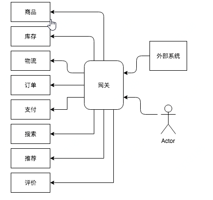
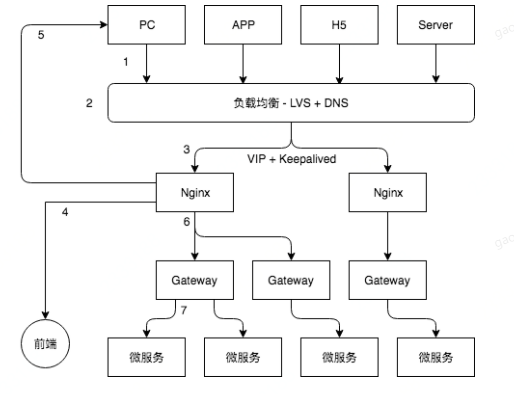

## 一、网关的作用

在微服务架构的原则下，根据业务内聚、康威法则、配合 DevOps 等，复杂庞大的单体应用逐渐被拆分为许多个体应用；

下图描述了这样一个简单的场景，商品销售网站系统被垂直拆分为诸如商品、库存等模块；

而对于一个系统外的用户，或者对于外部系统来说，当他们访问该网站提供的服务时，我们不希望对他们来暴露系统拆分这样的细节；网关的作用之一就是屏蔽功能。

## 二、网关常见的用途

网关在具体的系统中，扮演的角色和用途均不太一样，通常情况下，会被设计来做如下事情：

- 统一日志管控。可以对访问后端服务的所有请求，打统一的访问日志，实现对系统访问的集中管控，日志收集到一起也便于做统一分析。

- 反向路由。可以把具体的请求，按照预定的路由逻辑表，分发到目标服务上。

- 统一安全认证。将爬虫、攻击等非法请求拦截在服务之外，对于正常请求的权限管控，也可以统一收拢在网关

- 限流熔断。面对流量洪峰时，可以执行限流、熔断逻辑，可以基于服务响应时间，维护服务器的权重，减少问题服务导致雪崩的可能性

- 简化接入逻辑。服务拆分之后，可能会存在大量的微服务，网关可以收敛后端微服务于一点，方便外界系统的对接

## 三、网关在架构中的位置

下面以一个抽象的例子，描述一下 Gateway 在系统架构中所处的位置：

- 端发送请求到系统，端种类可以是 PC、APP、H5 或者其他外部系统 Server；

- 一般会有个负载均衡层，实现方式比较多，可以是硬件的 F5，也可以是软件的 LVS，因为 LVS 本身也存在单点，所以会配合 DNS 做高可用

- 负载均衡把请求转给 Nginx，为了 Nginx 层的高可用，通常会用 VIP 来部署多个，同时通过 Keepalived 做心跳监控

- 对于前端的请求，Nginx 可以转发到前端系统

- Nginx 作为 Http Server，也可以直接响应对于前端资源的访问

- 对于后端的请求，例如一些 API 访问，Nginx 统一转发到 Gateway

- Gateway 通过路由信息，将具体请求转发到具体的微服务上

 