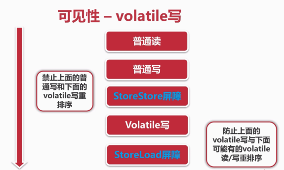
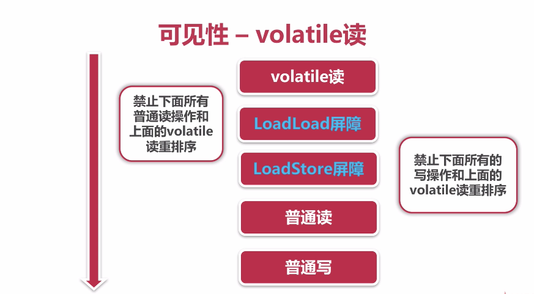
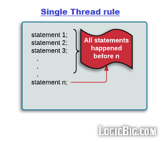
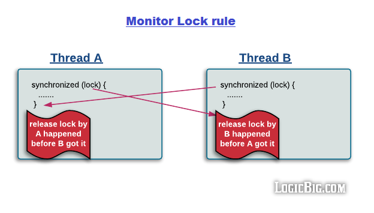
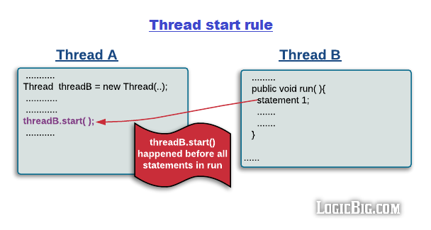
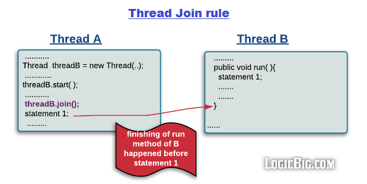

# 第四章 线程安全性

## 一、定义与特性

- **定义**：当多个线程访问某个类时，不管运行环境采用**何种调度方式**或者将这些进程如何交替执行，并且在主调代码中**不需要任何额外的同步或者协同**，这个类都表现出**正确的行为**，那么称这个类是线程安全的。

- 线程安全的三大特性：
    - 原子性: 原子性是指一个操作是**不可中断的，要么全部执行成功要么全部执行失败**。即使在多线程环境下提供了互斥访问，一个操作一旦开始就不能被其他线程干扰或中断。

    - 可见性：当一个线程修改了共享变量后，其他线程能够立即得知这个修改。

    - 有序性：程序在执行的时候，程序的代码执行顺序和语句的顺序是一致的。
>为了性能优化，编译器和处理器会进行指令重排序，由于指令重排序的存在，该观察结果一般杂乱无序。
Java程序天然的有序性可以总结为：**如果在本线程内观察，所有的操作都是有序的；如果在一个线程观察另一个线程，所有的操作都是无序的**。

## 二、原子性
**提供了互斥访问，同一时刻只能有一个线程来对它进行操作。**

### （一）CAS

- CAS (Compare And Swap)，即比较并交换。是**解决多线程并行情况下使用锁造成性能损耗的一种机制**。
- CAS 操作包含三个操作数——内存位置（V）、预期原值（A）和新值(B)。
    如果内存位置的值与**预期原值**相匹配，那么处理器会自动将该位置值更新为新值。否则，处理器不做任何操作。
    无论哪种情况，它都会在 CAS 指令之前返回该位置的值。
- CAS有效地说明了:**我认为位置V应该包含值A；如果包含该值，则将B放到这个位置；否则，不要更改该位置，只告诉我这个位置现在的值即可**。


### （二）原子性之 Atomic 包

#### 1.AtomicXXX

测试AtomicXXX：
```java
package com.gjxaiou.concurrency.example.count;

import com.gjxaiou.concurrency.annoations.ThreadSafe;
import lombok.extern.slf4j.Slf4j;

import java.util.concurrent.CountDownLatch;
import java.util.concurrent.ExecutorService;
import java.util.concurrent.Executors;
import java.util.concurrent.Semaphore;
import java.util.concurrent.atomic.AtomicInteger;

@Slf4j
@ThreadSafe
public class CountExample2 {

    // 请求总数
    public static int clientTotal = 5000;

    // 同时并发执行的线程数
    public static int threadTotal = 200;
    // java.util.concurrent.atomic.AtomicInteger;
    public static AtomicInteger count = new AtomicInteger(0);

    public static void main(String[] args) throws Exception {
        ExecutorService executorService = Executors.newCachedThreadPool();
        // Semaphore 和 CountDownLatch 模拟并发
        final Semaphore semaphore = new Semaphore(threadTotal);
        final CountDownLatch countDownLatch = new CountDownLatch(clientTotal);
        for (int i = 0; i < clientTotal ; i++) {
            executorService.execute(() -> {
                try {
                    semaphore.acquire();
                    add();
                    semaphore.release();
                } catch (Exception e) {
                    log.error("exception", e);
                }
                countDownLatch.countDown();
            });
        }
        countDownLatch.await();
        executorService.shutdown();
        log.info("count:{}", count.get());
    }

    private static void add() {
        // 下面两者区别为：先增加后获得和先获取后增加
        count.incrementAndGet();
        // count.getAndIncrement();
    }
}

```

程序运行结果：每次执行的结果都是一致的。

```java
14:22:10.042 [main] INFO com.gjxaiou.concurrency.example.count.CountExample2 - count:5000
```


分析：分析 `incrementAndGet()` 源码如下：位置：AtomicInteger.java

```java
public final int incrementAndGet() {
    return unsafe.getAndAddInt(this, valueOffset, 1) + 1;
}
```

然后点击 UNsafe 类，查看具体实现如下

```java
//Unsafe.class
// var1 为当前对象，这里为 count, var2 和 var4 为当前操作的值
public final int getAndAddInt(Object var1, long var2, int var4) {
    int var5;
    do {
        // 获取 var1 对象内部偏移量为 var2 对应的底层值 var5， var2 相当于在工作内存， var5 在主内存
        var5 = this.getIntVolatile(var1, var2);
        // 对于 var1 对应的 count 对象，如果当前值 var2 和底层的值 var5 相同，就执行后面 var5 + var4，如果不相同则说明有线程更改了当前的值，就不能进行后面的更新操作
    } while(!this.compareAndSwapInt(var1, var2, var5, var5 + var4));
    //  判断 this.compareAndSwapInt(var1, var2, var5, var5 + var4)
    // 这里直接第三个参数是 var5, 则会返回 true, 并且 var5=(var4+var5)。判断条件是 false,结束循环。
    return var5;
}

// 获取对象 var1 内部偏移量为 var2 的类型为 Int 的值
 public native int getIntVolatile(Object var1, long var2);

// 著名的 CAS
// var1 是比较值所属的对象，var2需要比较的值（但实际是使用地址偏移量来实现的），
// 如果 var1 对象中偏移量为 var2 处的值等于var4，那么将该处的值设置为 var5 并返回 true，如果不等于var4 则返回 false。
public final native boolean compareAndSwapInt(Object var1, long var2, int var4, int var5);
```

#### 2. AtomicLong 和 LongAdder

AtomicLong 是作用是对长整形进行原子操作，显而易见，在 java1.8 中新加入了一个新的原子类 LongAdder，该类也可以保证 Long 类型操作的原子性，相对于 AtomicLong，LongAdder 有着更高的性能和更好的表现。
**在 32 位操作系统中，64 位的 long 和 double 变量由于会被 JVM 当作两个分离的 32 位来进行操作，所以不具有原子性**。而使用 AtomicLong 能让 long 的操作保持原子型。

```java
package com.gjxaiou.concurrency.example.atomic;

import com.gjxaiou.concurrency.annoations.ThreadSafe;
import lombok.extern.slf4j.Slf4j;

import java.util.concurrent.CountDownLatch;
import java.util.concurrent.ExecutorService;
import java.util.concurrent.Executors;
import java.util.concurrent.Semaphore;
import java.util.concurrent.atomic.AtomicLong;

@Slf4j
@ThreadSafe
public class AtomicExample2 {

    // 请求总数
    public static int clientTotal = 5000;

    // 同时并发执行的线程数
    public static int threadTotal = 200;

    public static AtomicLong count = new AtomicLong(0);

    public static void main(String[] args) throws Exception {
        ExecutorService executorService = Executors.newCachedThreadPool();
        final Semaphore semaphore = new Semaphore(threadTotal);
        final CountDownLatch countDownLatch = new CountDownLatch(clientTotal);
        for (int i = 0; i < clientTotal ; i++) {
            executorService.execute(() -> {
                try {
                    semaphore.acquire();
                    add();
                    semaphore.release();
                } catch (Exception e) {
                    log.error("exception", e);
                }
                countDownLatch.countDown();
            });
        }
        countDownLatch.await();
        executorService.shutdown();
        log.info("count:{}", count.get());
    }

    private static void add() {
        count.incrementAndGet();
        // count.getAndIncrement();
    }
}

```

测试结果：

```java
14:27:39.607 [main] INFO com.gjxaiou.concurrency.example.atomic.AtomicExample2 - count:5000
```


>在java1.8中，LongAdder是把一个数拆成多个数的和，修改的时候只改其中一个数，这样冲突的概率减少很多。但可能技术结果不准确。

```java
package com.gjxaiou.concurrency.example.atomic;

import com.gjxaiou.concurrency.annoations.ThreadSafe;
import lombok.extern.slf4j.Slf4j;

import java.util.concurrent.CountDownLatch;
import java.util.concurrent.ExecutorService;
import java.util.concurrent.Executors;
import java.util.concurrent.Semaphore;
import java.util.concurrent.atomic.AtomicLong;
import java.util.concurrent.atomic.LongAdder;

@Slf4j
@ThreadSafe
public class AtomicExample3 {

    // 请求总数
    public static int clientTotal = 5000;

    // 同时并发执行的线程数
    public static int threadTotal = 200;

    public static LongAdder count = new LongAdder();

    public static void main(String[] args) throws Exception {
        ExecutorService executorService = Executors.newCachedThreadPool();
        final Semaphore semaphore = new Semaphore(threadTotal);
        final CountDownLatch countDownLatch = new CountDownLatch(clientTotal);
        for (int i = 0; i < clientTotal ; i++) {
            executorService.execute(() -> {
                try {
                    semaphore.acquire();
                    add();
                    semaphore.release();
                } catch (Exception e) {
                    log.error("exception", e);
                }
                countDownLatch.countDown();
            });
        }
        countDownLatch.await();
        executorService.shutdown();
        log.info("count:{}", count);
    }

    private static void add() {
        count.increment();
    }
}

```
程序运行结果：

```java
14:29:25.165 [main] INFO com.gjxaiou.concurrency.example.atomic.AtomicExample3 - count:5000
```


#### 3. AtomicReference 和 AtomicReferenceFieldUpdater

```java
package com.gjxaiou.concurrency.example.atomic;

import com.gjxaiou.concurrency.annoations.ThreadSafe;
import lombok.extern.slf4j.Slf4j;

import java.util.concurrent.atomic.AtomicReference;

@Slf4j
@ThreadSafe
public class AtomicExample4 {

    private static AtomicReference<Integer> count = new AtomicReference<>(0);

    public static void main(String[] args) {
        // 含义：如果期待的值为 2，则更新为 4
        count.compareAndSet(0, 2); // 2
        count.compareAndSet(0, 1); // no
        count.compareAndSet(1, 3); // no
        count.compareAndSet(2, 4); // 4
        count.compareAndSet(3, 5); // no
        log.info("count:{}", count.get());
    }
}

```
程序运行结果：

```java
14:33:42.516 [main] INFO com.gjxaiou.concurrency.example.atomic.AtomicExample4 - count:4
```


- AtomicReferenceFieldUpdater：

中间的 Reference 可以改变，下面例子中就改为了 Integer, 类的作用是原子性的更新某一个类的实例（这里就是 Code_03_AtomicReferenceFieldUpdaterDemo 类的 count 字段）

```java
package com.gjxaiou.concurrency.example.atomic;

import com.gjxaiou.concurrency.annoations.ThreadSafe;
import lombok.Getter;
import lombok.extern.slf4j.Slf4j;

import java.util.concurrent.atomic.AtomicIntegerFieldUpdater;
import java.util.concurrent.atomic.AtomicReference;

@Slf4j
@ThreadSafe
public class AtomicExample5 {

    private static AtomicIntegerFieldUpdater<AtomicExample5> updater =
            AtomicIntegerFieldUpdater.newUpdater(AtomicExample5.class, "count");

    @Getter
    // 更新的字段必须使用 volatile 和非 static 修饰
    public volatile int count = 100;

    public static void main(String[] args) {

        AtomicExample5 example5 = new AtomicExample5();
        // 如果当前对象中的 count 变量值为 100 则更新为 120
        if (updater.compareAndSet(example5, 100, 120)) {
            log.info("update success 1, {}", example5.getCount());
        }

        if (updater.compareAndSet(example5, 100, 120)) {
            log.info("update success 2, {}", example5.getCount());
        } else {
            log.info("update failed, {}", example5.getCount());
        }
    }
}

```
程序运行结果：

```java
14:37:08.591 [main] INFO com.gjxaiou.concurrency.example.atomic.AtomicExample5 - update success 1, 120
14:37:08.595 [main] INFO com.gjxaiou.concurrency.example.atomic.AtomicExample5 - update failed, 120
```


### （三）CAS 的 ABA 问题

**在 CAS 算法中，需要取出内存中某时刻的数据（由用户完成），在下一时刻比较并替换（由 CPU 完成，该操作是原子的），这个时间差中，会导致数据的变化。**

假设如下事件序列：

- 线程 1 从内存位置 V 中取出 A。

- 线程 2 从位置 V 中取出 A。

- 线程 2 进行了一些操作，将 B 写入位置 V。

- 线程 2 将 A 再次写入位置 V。

- 线程 1 进行 CAS 操作，发现位置 V 中仍然是 A，操作成功。

尽管线程 1 的 CAS 操作成功，但不代表这个过程没有问题——对于线程 1 ，线程 2 的修改已经丢失。

**使用 AtomicStampedReference 解决 ABA 问题**：

AtomicStampedReference 除了对象值，其内部还维护了一个“状态戳”（可以理解为版本号）。状态戳可类比为时间戳，是一个整数值，每一次修改对象值的同时，也要修改状态戳，从而区分相同对象值的不同状态。
当 AtomicStampedReference 设置对象值时，**对象值以及状态戳都必须满足期望值**，写入才会成功。

下面是来 AtomicStampedReferenct.java 类的比较重要的 compareAndSet 方法

```java
//比较设置 参数依次为：期望值 写入新值 期望时间戳 新时间戳
public boolean compareAndSet(V expectedReference, V newReference, 
    int expectedStamp, int newStamp)
//获得当前对象引用
public V getReference()
//获得当前时间戳
public int getStamp()
//设置当前对象引用和时间戳
public void set(V newReference, int newStamp)
    
        public boolean compareAndSet(V   expectedReference,
                                 V   newReference,
                                 int expectedStamp,
                                 int newStamp) {
        Pair<V> current = pair;
        return
            expectedReference == current.reference &&
            // 多了一个时间戳的比较
            expectedStamp == current.stamp &&
            ((newReference == current.reference &&
              newStamp == current.stamp) ||
             casPair(current, Pair.of(newReference, newStamp)));
    }
```
* AtomicBoolean
```java
package com.gjxaiou.concurrency.example.atomic;

import com.gjxaiou.concurrency.annoations.ThreadSafe;
import lombok.extern.slf4j.Slf4j;

import java.util.concurrent.CountDownLatch;
import java.util.concurrent.ExecutorService;
import java.util.concurrent.Executors;
import java.util.concurrent.Semaphore;
import java.util.concurrent.atomic.AtomicBoolean;

@Slf4j
@ThreadSafe
public class AtomicExample6 {

    private static AtomicBoolean isHappened = new AtomicBoolean(false);

    // 请求总数
    public static int clientTotal = 5000;

    // 同时并发执行的线程数
    public static int threadTotal = 200;

    public static void main(String[] args) throws Exception {
        ExecutorService executorService = Executors.newCachedThreadPool();
        final Semaphore semaphore = new Semaphore(threadTotal);
        final CountDownLatch countDownLatch = new CountDownLatch(clientTotal);
        for (int i = 0; i < clientTotal; i++) {
            executorService.execute(() -> {
                try {
                    semaphore.acquire();
                    test();
                    semaphore.release();
                } catch (Exception e) {
                    log.error("exception", e);
                }
                countDownLatch.countDown();
            });
        }
        countDownLatch.await();
        executorService.shutdown();
        log.info("isHappened:{}", isHappened.get());
    }

    private static void test() {
        // 如果是 false,就该为 true，然后执行下面语句
        if (isHappened.compareAndSet(false, true)) {
            log.info("execute");
        }
    }
}

// 虽然循环是 5000 次，但是结果为只执行 1 次，因为后面线程虽然可能将值从 true 由修改为 false，但是状态戳改变了，所以还是不满足条件。
```
## 二、原子性之锁

原子性提供了互斥访问，同一时刻只能有一个线程来操作，同样可以采用锁来实现

### （一）synchronized

依赖 JVM，是一种同步锁，修饰对象是以下四种：

* 修饰代码块：作用范围大括号括起来的代码，作用于**调用的对象**

* 修饰方法：作用范围是整个方法，作用于**调用的对象**

* 修饰静态方法：作用范围是整个静态方法，作用于**所有对象**

* 修饰类：作用范围括号括起来的部分，作用于**所有对象**

```java
package com.gjxaiou.concurrency.example.sync;

import lombok.extern.slf4j.Slf4j;

import java.util.concurrent.ExecutorService;
import java.util.concurrent.Executors;

@Slf4j
public class SynchronizedExample1 {

    // 修饰一个代码块
    public void test1(int j) {
        synchronized (this) {
            for (int i = 0; i < 10; i++) {
                log.info("test1 {} - {}", j, i);
            }
        }
    }

    // 修饰一个方法
    public synchronized void test2(int j) {
        for (int i = 0; i < 10; i++) {
            log.info("test2 {} - {}", j, i);
        }
    }

    public static void main(String[] args) {
        SynchronizedExample1 example1 = new SynchronizedExample1();
        SynchronizedExample1 example2 = new SynchronizedExample1();
        // 如果不使用线程池，则一个对象调用两次同一个方法就是同时执行的，线程池相当于创建两个线程来执行该方法
        ExecutorService executorService = Executors.newCachedThreadPool();
        /**
         executorService.execute(() -> {
         example1.test1(1);
         });
         executorService.execute(() -> {
         example1.test1(1);
         });
         */

        /**
         executorService.execute(() -> {
         example1.test2(1);
         });
         executorService.execute(() -> {
         example1.test2(1);
         });
         */

        /**
         // 两个对象几乎交叉执行，因为作用于同一个对象，两个对象之间不相关
         executorService.execute(() -> {
         example1.test1(1);
         });
         executorService.execute(() -> {
         example2.test2(2);
         });

         */

        // 几乎同上，作用于调用对象
        executorService.execute(() -> {
            example1.test2(1);
        });
        executorService.execute(() -> {
            example2.test2(2);
        });
    }
}

```
```java
package com.gjxaiou.concurrency.example.sync;

import lombok.extern.slf4j.Slf4j;

import java.util.concurrent.ExecutorService;
import java.util.concurrent.Executors;

@Slf4j
public class SynchronizedExample2 {

    // 修饰一个类
    public static void test1(int j) {
        synchronized (SynchronizedExample2.class) {
            for (int i = 0; i < 10; i++) {
                log.info("test1 {} - {}", j, i);
            }
        }
    }

    // 修饰一个静态方法
    public static synchronized void test2(int j) {
        for (int i = 0; i < 10; i++) {
            log.info("test2 {} - {}", j, i);
        }
    }

    public static void main(String[] args) {
        SynchronizedExample2 example1 = new SynchronizedExample2();
        SynchronizedExample2 example2 = new SynchronizedExample2();
        ExecutorService executorService = Executors.newCachedThreadPool();
        executorService.execute(() -> {
            example1.test1(1);
        });
        executorService.execute(() -> {
            example2.test1(2);
        });
    }
}

```

### （二）Lock

依赖特殊的CPU指令，代码实现，ReentrantLock

ReentrantLock 重入锁，是实现 Lock 接口的一个类，也是在实际编程中使用频率很高的一个锁，**支持重入性，表示能够对共享资源能够重复加锁，即当前线程获取该锁再次获取不会被阻塞**。在 java 关键字 synchronized 隐式支持重入性，synchronized 通过获取自增，释放自减的方式实现重入。与此同时，ReentrantLock 还支持**公平锁和非公平锁**两种方式。

```java
@ThreadSafe
public class Code_07_ReentrantLockDemo {
    private Lock lock = new ReentrantLock();

​    public void test1(int j) {
​        lock.lock();
​        try{
​            for (int i = 0; i < 10; i++) {
​                System.out.println("test1 {"+j+"} - {"+i+"}");
​            }
​        }finally {
​            lock.unlock();
​        }
​    }

​    public static void main(String[] args) {
​        Code_07_ReentrantLockDemo example1=new Code_07_ReentrantLockDemo();
​        Code_07_ReentrantLockDemo example2=new Code_07_ReentrantLockDemo();
​        ExecutorService executorService = Executors.newCachedThreadPool();

​        executorService.execute(new Runnable() {
​            @Override
​            public void run() {
​                example1.test1(1);
​            }
​        });
​        executorService.execute(new Runnable() {
​            @Override
​            public void run() {
​                example2.test1(2);
​            }
​        });
​    }
}
```


### （三）原子性三者对比
* synchronized：不可中断锁，适合竞争不激烈，可读性好

* Lock：可中断锁（使用 Unlock 即可），多样化同步，竞争激烈时能维持常态

* Atomic：竞争激烈时能维持常态，比Lock性能好；只能同步一个值

## 三、可见性
一个线程对主内存的修改可以及时的被其他线程观察到。

Java 内存模型是通过在变量修改后将新值同步回主内存，在变量读取前从主内存刷新变量值来实现可见性的。

**导致共享变量在线程中不可见的原因**:

- 线程交叉执行

- 重排序结合线程交叉执行

- 共享变量更新后的值没有在工作内存与主内存间及时更新

主要有三种实现可见性的方式：volatile、synchronized、final

### （一）volatile

* ==**通过加入内存屏障和禁止重排序优化来实现，即重排序时不能把后面的指令放到内存屏障之前**==

- 对 volatile 变量写操作时，会在写操作后加入一条 **store 屏障指令**，将本地内存中的共享变量值刷新到主内存

<div align="center"></div>
- 对 volatile 变量读操作时，会在读操作前加入一条 **load 屏障指令**，从主内存中读取共享变量

<div align="center"></div>
使用 volatile 修饰变量count，不能解决线程不安全问题，因为 volatile 并不能保证操作的原子性。

```java
public class Code_00_VolatileDemo {
    // 请求总数
    public static int clientTotal = 5000;

    // 同时并发执行的线程数
    public static int threadTotal = 200;

    public static volatile int count = 0;

    public static void main(String[] args) throws Exception {
        ExecutorService executorService = Executors.newCachedThreadPool();
        final Semaphore semaphore = new Semaphore(threadTotal);
        final CountDownLatch countDownLatch = new CountDownLatch(clientTotal);
        for (int i = 0; i < clientTotal ; i++) {
            executorService.execute(() -> {
                try {
                    semaphore.acquire();
                    add();
                    semaphore.release();
                } catch (Exception e) {
                    e.printStackTrace();
                }
                countDownLatch.countDown();
            });
        }
        countDownLatch.await();
        executorService.shutdown();
        System.out.println("count{"+count+"}");
    }

    private static void add() {
        count++;
        // 1、取出内存中 count
        // 2、+1
        // 3、count 写会主存
        // 如果两次同时获取到主存中的 count ，然后分别 +1 并且将值刷回主存，但是相当于丢失了一次 +1 操作
    }
}
//第一次输出结果：count{4992}
//第二次输出结果：count{4997}
//第三次输出结果：count{4997}
//第四次输出结果：count{4999}
```
#### 1.volatile 使用条件：

- 对变量写操作不依赖于当前值

- 该变量没有包含在具有其他变量的不必要的式子中

实际上，这些条件表明，可以被写入 volatile 变量的这些有效值独立于任何程序的状态，包括变量的当前状态。

#### 2.volatile 使用场景：

- 状态标志

实现 volatile 变量的规范使用仅仅是使用一个布尔状态标志，用于指示发生了一个重要的一次性事件，例如完成初始化或请求停机。
```java
private volatile boolean shutdownRequested;
 
//...
 
public void shutdown() { 
    shutdownRequested = true; 
}
 
public void doWork() { 
    while (!shutdownRequested) { 
        // do stuff
    }
}
```

- 一次性安全发布（one-time safe publication）

在缺乏同步的情况下，可能会遇到某个对象引用的更新值（由另一个线程写入）和该对象状态的旧值同时存在。
这就是造成著名的双重检查锁定（double-checked-locking）问题的根源。


下面代码中的  `unqieInstance=new Singleton();`这段代码分三步执行。

 * 1.分配内存空间
 * 2.初始化对象
 * 3.将 uniqueInstance 指向分配的内存地址

但是由于JVM具有指令重排的特行，有可能执行顺序变为了1-->3-->2,

这在单线程情况下自然是没有问题的。但如果是在多线程下，有可能获得的是因为还没有被初始化的实例，导致程序出错。
**使用 volatile 可禁止 JVM 指令重排，保证在多线程环境下也能正常运行**

```java

private volatile static Singleton instace;   
  
public static Singleton getInstance(){   
    //第一次null检查     
    if(instance == null){            
        synchronized(Singleton.class) {    //1     
            //第二次null检查       
            if(instance == null){          //2  
                instance = new Singleton();//3  
            }  
        }           
    }  
    return instance; 
}
```

### （二）synchronized

JMM 为确保可见性的两条规定：

- 线程解锁前，必须把共享变量的最新值刷新到主内存
  
- 线程加锁时，将清空工作内存中共享变量的值，从而使用共享变量时需要从主内存中重新读取最新的值
    （注意，加锁和解锁是同一把锁）

```java
public class Code_01_SynchronizedDemo {
    // 请求总数
    public static int clientTotal = 5000;

    // 同时并发执行的线程数
    public static int threadTotal = 200;

    public static int count = 0;

    public static void main(String[] args) throws Exception {
        ExecutorService executorService = Executors.newCachedThreadPool();
        final Semaphore semaphore = new Semaphore(threadTotal);
        final CountDownLatch countDownLatch = new CountDownLatch(clientTotal);
        for (int i = 0; i < clientTotal ; i++) {
            executorService.execute(() -> {
                try {
                    semaphore.acquire();
                    add();
                    semaphore.release();
                } catch (Exception e) {
                    e.printStackTrace();
                }
                countDownLatch.countDown();
            });
        }
        countDownLatch.await();
        executorService.shutdown();
        System.out.println("count{"+count+"}");
    }

   //通过以上两点规定，synchronized能够实现可见性。同时，由于synchronized具有同步锁，所以它也具有原子性
    private static synchronized void add() {
        count++;
    }
}
//执行结果:count{5000}
```


### （三）final

**被 final 关键字修饰的字段在构造器中一旦初始化完成，并且没有发生 this 逃逸（其它线程通过 this 引用访问到初始化了一半的对象），那么其它线程就能看见 final 字段的值**。


## 四、有序性

有序性是指：在本线程内观察，所有操作都是有序的。
在一个线程观察另一个线程，所有操作都是无序的，无序是因为发生了**指令重排序**。

在 Java 内存模型中，允许编译器和处理器对指令进行重排序，重排序过程不会影响到单线程程序的执行，却会影响到多线程并发执行的正确性。

volatile 关键字通过添加内存屏障的方式来禁止指令重排，即重排序时不能把后面的指令放到内存屏障之前。

也可以通过 synchronized 来保证有序性，它保证每个时刻只有一个线程执行同步代码，相当于是让线程顺序执行同步代码。

### （一）先行发生原则(Happens-Before原则)

上面提到了可以用 volatile 和 synchronized 来保证有序性。除此之外，JVM 还规定了先行发生原则，让一个操作无需控制就能先于另一个操作完成。先行发生原则共 8 条：

#### 1. 单一线程原则

> Single Thread rule

在一个线程内，在程序前面的操作先行发生于后面的操作。虽然虚拟机仍然会重排序，但是只会对没有数据依赖性的指令进行重排序。【只在单线程中有用】

<div align="center">  </div><br>
#### 2. 管程锁定规则

> Monitor Lock Rule

一个 unlock 操作先行发生于后面对同一个锁的 lock 操作。

<div align="center">  </div><br>
#### 3. volatile 变量规则

> Volatile Variable Rule

对一个 volatile 变量的写操作先行发生于后面对这个变量的读操作。

<div align="center">  </div><br>
#### 4. 线程启动规则

> Thread Start Rule

Thread 对象的 start() 方法调用先行发生于此线程的每一个动作。

<div align="center">  </div><br>
#### 5. 线程加入规则

> Thread Join Rule

Thread 对象的结束先行发生于 join() 方法返回。

<div align="center">  </div><br>
#### 6. 线程中断规则

> Thread Interruption Rule

对线程 interrupt() 方法的调用先行发生于被中断线程的代码检测到中断事件的发生，可以通过 interrupted() 方法检测到是否有中断发生。

#### 7. 对象终结规则

> Finalizer Rule

一个对象的初始化完成（构造函数执行结束）先行发生于它的 finalize() 方法的开始。


#### 8.传递规则

如果操作 A 先行发生于操作 B，而操作 B 又先行发生于操作 C，则可以得出操作 A 先行发生于操作 c 


## 五、volatile 和 synchronized 区别

Java 内存模型主要是围绕在并发过程中如何处理**原子性，可见性，有序性**这三个特征来建立的。

volatile 关键字可以保证线程间变量的可见性，还有包含了禁止指令重排序的语义，满足了有序性。

synchronized 关键字原子性（排它锁），可见性，有序性都可以满足。因此它们的区别就在于原子性了。

**PS：**

上述特性可以从先行发生 happens-before 原则在来解释一下。先行发生是 Java 内存模型中定义的两项操作的偏序关系。第三条，volatile 变量规则：对一个 volatile 变量的写操作先行发生于读操作，满足可见性。第二条，管程锁定原则：一个 unlock 先行发生于后面同一个锁的 lock，满足有序性。


## 六、synchronized 与 ReentrantLock 的区别

**相同点：**

原子性，可见性，有序性，可重入性


**不同点：**

1. synchronized 是非公平锁，ReentrantLock可以创建公平与非公平锁。
2. synchronized 无法中断一个正在等待获取锁的线程，ReentrantLock使用lockInterruptibly可以感知中断获取锁的操作。
3. ReentrantLock 可以实现非块结构的加锁。
4. ReentrantLock 使用 tryLock(time) 来实现定时锁，也可避免死锁。
5. 在实现生产者消费者模型时，synchronized加锁，只能唤醒所有等待锁的线程Object.notifyAll()。ReentrantLock可以使用condition减小等待锁的粒度，在唤醒线程时就可以针对条件队列来唤醒线程了Condition.signal()，提高效率。
6. 在等待锁时，使用 synchronized 的线程进入的是 BLOCKED 状态，使用 ReentrantLock 的线程进入的是WAITING状态。


**选择：**

1. ReentrantLock并不是一种替代内置锁的方法，而是当内置加锁机制不适用时，作为一种可选择的高级功能。
2. Java5时，ReentrantLock比内置锁可以提供更好的竞争性能，但在Java6后，使用了改善后的算法来管理内置锁，导致两者的差异越来越小，所以还是优先使用内置锁，仅当内置锁不能满足要求时，才可以考虑使用ReentrantLock。


**PS：**

1. 在公平的锁上，线程将按照它们发出请求的顺序来获得锁，但在非公平的锁上，则允许插队：当一个线程请求非公平锁时，如果在发出请求的同时该锁状态变为可用，那么这个线程将跳过队列中所有等待线程并获得这个锁。拿一个生活中的场景举例子，在我晚上经常去的一家肉饼店，肉饼出的很慢，我们都需要付钱拿号等待，结果有个顾客过来点餐，他正好点到肉饼的时候肉饼出锅了，如果是非公平的场景，店员无视我们前面等待的顾客，就直接把肉饼给这位顾客了。
2. **产生死锁的 4 个必要条件：互斥条件；请求与保持条件；不剥夺条件；循环等待条件**；tryLock 破坏了不剥夺条件。

