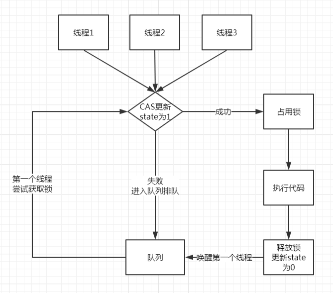

实现一个能正常加锁、解锁操作的锁。

## 分析

synchronized 的实现原理是更改对象头中的 MarkWord，标记为已加锁或未加锁。但是我们无法修改对象头信息，因此使用一个变量来代替：比如，这个变量的值为 1 的时候就说明已加锁，变量值为 0 的时候就说明未加锁。

其次，我们要保证多个线程对上面我们定义的变量的争用是可控的，所谓可控即同时只能有一个线程把它的值修改为 1，且当它的值为 1 的时候其它线程不能再修改它的值，即典型的 CAS 操作，所以我们需要使用Unsafe 这个类来做 CAS 操作。

然后，在多线程的环境下，多个线程对同一个锁的争用肯定只有一个能成功，那么，其它的线程就要排队，所以我们还需要一个队列。

最后，这些线程排队的时候不能再继续执行自己的程序，只能阻塞，阻塞完了当轮到这个线程的时候还要唤醒，所以我们还需要 Unsafe 这个类来阻塞（park）和唤醒（unpark）线程。

总结：一个变量、一个队列、执行 CAS/park/unpark 的 Unsafe 类。

大概的流程图如下图所示：



关于Unsafe类的相关讲解请参考彤哥之前发的文章：

【[死磕 java魔法类之Unsafe解析](https://mp.weixin.qq.com/s/0s-u-MysppIaIHVrshp9fA)】

## 解决

### 一个变量

这个变量只支持同时只有一个线程能把它修改为1，所以它修改完了一定要让其它线程可见，因此，这个变量需要使用volatile来修饰。

```java
private volatile int state;
```

### CAS

这个变量的修改必须是原子操作，所以我们需要CAS更新它，我们这里使用Unsafe来直接CAS更新int类型的state。

当然，这个变量如果直接使用AtomicInteger也是可以的，不过，既然我们学习了更底层的Unsafe类那就应该用（浪）起来。

```java
private boolean compareAndSetState(int expect, int update) {
    return unsafe.compareAndSwapInt(this, stateOffset, expect, update);
}
```

### 一个队列

队列的实现有很多，数组、链表都可以，我们这里采用链表，毕竟链表实现队列相对简单一些，不用考虑扩容等问题。

这个队列的操作很有特点：

放元素的时候都是放到尾部，且可能是多个线程一起放，所以对尾部的操作要CAS更新；

唤醒一个元素的时候从头部开始，但同时只有一个线程在操作，即获得了锁的那个线程，所以对头部的操作不需要CAS去更新。

```java
private static class Node {
    // 存储的元素为线程
    Thread thread;
    // 前一个节点（可以没有，但实现起来很困难）
    Node prev;
    // 后一个节点
    Node next;

    public Node() {
    }

    public Node(Thread thread, Node prev) {
        this.thread = thread;
        this.prev = prev;
    }
}
// 链表头
private volatile Node head;
// 链表尾
private volatile Node tail;
// 原子更新tail字段
private boolean compareAndSetTail(Node expect, Node update) {
    return unsafe.compareAndSwapObject(this, tailOffset, expect, update);
}
```

这个队列很简单，存储的元素是线程，需要有指向下一个待唤醒的节点，前一个节点可有可无，但是没有实现起来很困难，不信学完这篇文章你试试。

### 加锁

```java
public void lock() {
    // 尝试更新state字段，更新成功说明占有了锁
    if (compareAndSetState(0, 1)) {
        return;
    }
    // 未更新成功则入队
    Node node = enqueue();
    Node prev = node.prev;
    // 再次尝试获取锁，需要检测上一个节点是不是head，按入队顺序加锁
    while (node.prev != head || !compareAndSetState(0, 1)) {
        // 未获取到锁，阻塞
        unsafe.park(false, 0L);
    }
    // 下面不需要原子更新，因为同时只有一个线程访问到这里
    // 获取到锁了且上一个节点是head
    // head后移一位
    head = node;
    // 清空当前节点的内容，协助GC
    node.thread = null;
    // 将上一个节点从链表中剔除，协助GC
    node.prev = null;
    prev.next = null;
}
// 入队
private Node enqueue() {
    while (true) {
        // 获取尾节点
        Node t = tail;
        // 构造新节点
        Node node = new Node(Thread.currentThread(), t);
        // 不断尝试原子更新尾节点
        if (compareAndSetTail(t, node)) {
            // 更新尾节点成功了，让原尾节点的next指针指向当前节点
            t.next = node;
            return node;
        }
    }
}
```

（1）尝试获取锁，成功了就直接返回；

（2）未获取到锁，就进入队列排队；

（3）入队之后，再次尝试获取锁；

（4）如果不成功，就阻塞；

（5）如果成功了，就把头节点后移一位，并清空当前节点的内容，且与上一个节点断绝关系；

（6）加锁结束；

### 解锁

```java
// 解锁
public void unlock() {
    // 把state更新成0，这里不需要原子更新，因为同时只有一个线程访问到这里
    state = 0;
    // 下一个待唤醒的节点
    Node next = head.next;
    // 下一个节点不为空，就唤醒它
    if (next != null) {
        unsafe.unpark(next.thread);
    }
}
```

（1）把state改成0，这里不需要CAS更新，因为现在还在加锁中，只有一个线程去更新，在这句之后就释放了锁；

（2）如果有下一个节点就唤醒它；

（3）唤醒之后就会接着走上面lock()方法的while循环再去尝试获取锁；

（4）唤醒的线程不是百分之百能获取到锁的，因为这里state更新成0的时候就解锁了，之后可能就有线程去尝试加锁了。

### 测试

上面完整的锁的实现就完了，是不是很简单，但是它是不是真的可靠呢，敢不敢来试试？！

直接上测试代码：

```java
private static int count = 0;

public static void main(String[] args) throws InterruptedException {
    MyLock lock = new MyLock();

    CountDownLatch countDownLatch = new CountDownLatch(1000);

    IntStream.range(0, 1000).forEach(i -> new Thread(() -> {
        lock.lock();

        try {
            IntStream.range(0, 10000).forEach(j -> {
                count++;
            });
        } finally {
            lock.unlock();
        }
//            System.out.println(Thread.currentThread().getName());
        countDownLatch.countDown();
    }, "tt-" + i).start());

    countDownLatch.await();

    System.out.println(count);
}
```

运行这段代码的结果是总是打印出10000000（一千万），说明我们的锁是正确的、可靠的、完美的。

## 总结

（1）自己动手写一个锁需要做准备：一个变量、一个队列、Unsafe类。

（2）原子更新变量为1说明获得锁成功；

（3）原子更新变量为1失败说明获得锁失败，进入队列排队；

（4）更新队列尾节点的时候是多线程竞争的，所以要使用原子更新；

（5）更新队列头节点的时候只有一个线程，不存在竞争，所以不需要使用原子更新；

（6）队列节点中的前一个节点prev的使用很巧妙，没有它将很难实现一个锁，只有写过的人才明白，不信你试试^^

## 彩蛋

（1）我们实现的锁支持可重入吗？

答：不可重入，因为我们每次只把state更新为1。如果要支持可重入也很简单，获取锁时检测当前锁是不是当前线程占有着，如果是就把state的值加1，释放锁时每次减1即可，减为0时表示锁已释放。

（2）我们实现的锁是公平锁还是非公平锁？

答：非公平锁，因为获取锁的时候我们先尝试了一次，这里并不是严格的排队，所以是非公平锁。

*注：下一章我们将开始分析传说中的AQS，这章是基础，请各位老铁务必搞明白。*

