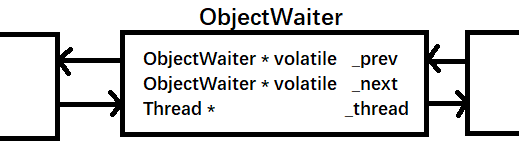
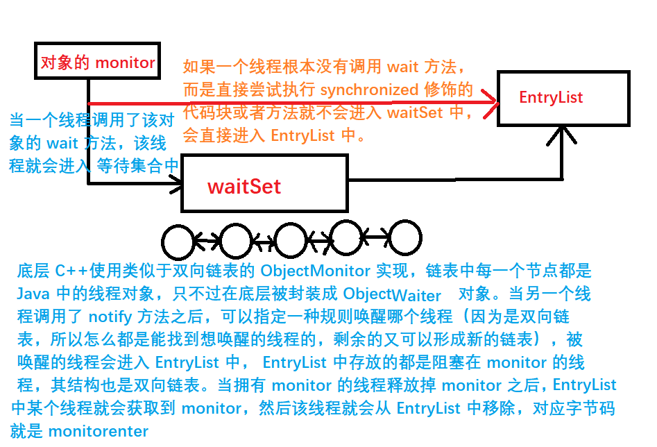
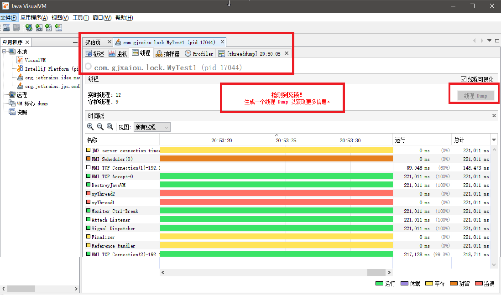
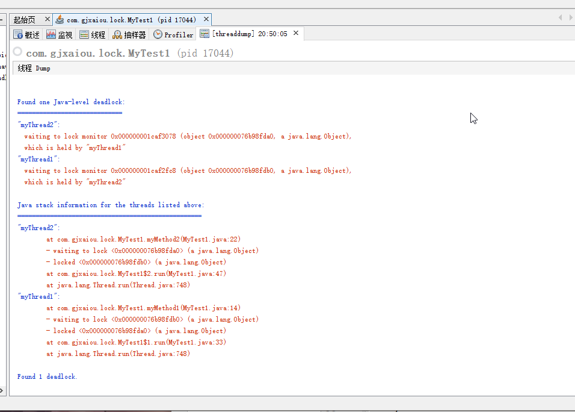

[TOC]


## Synchronized 关键字原理详解

### 一、引言

**关于 synchronized 的一道题目**

```java
public class Test{
    public synchronized void method1(){
    }
    
    public synchronized void method2(){
    }
}
// 当创建 Test 的唯一一个实例（对象）
Test test = new Test():
// 当一个线程执行这个对象的 method1 时候（还没有执行完），其他线程能不能执行该对象的 method2

```

【解答】不能，因为对于同一个对象来说，它的所有 synchronize 方法锁的对象是同一个东西，当一个线程正在执行其中的一个 synchronized 方法的时候，其他线程执行不了其他方法的，因为该 synchronized 方法已经被该线程进去了，已经获取该对象的锁了。

如果创建了两个对象就可以了，因为一个线程获取一个对象的锁并不妨碍另一个线程获取另一个对象的锁。

- 代码修改：

    ```java
    public class Test{
        public synchronized void method1(){
        }
        
        public static synchronized void method2(){
        }
    }
    // 当创建 Test 的唯一一个实例（对象）
    Test test = new Test():
    // 当一个线程执行这个对象的 method1 时候（还没有执行完），其他线程能不能执行该对象的 method2
    ```

    可以，因为第一个方法的 synchronized 关键字锁的是当前的  test 对象，而第二个 方法的synchronized 关键字锁的是当前 test 对象所对应的 Class 对象（因为本质上一个静态方法并不属于当前对象，属于当前对象所对应的 Class 对象），是两个独立的对象，两个对立的对象拥有各自独立的锁。

### 二、测试

#### 1.测试程序一：

```java
package com.gjxaiou;

/**
 * @Author GJXAIOU
 * @Date 2020/2/15 15:16
 */
public class MyThreadTest {
    public static void main(String[] args) {
        Runnable thread = new MyThread();
        // 因为创建线程 thread1 和 thread2 对象时候传入的是同一个 Runnable 实例对象
        Thread thread1 = new Thread(thread);
        Thread thread2 = new Thread(thread);
        // 因此当两个线程启动 start 方法时候都会去执行同一个 MyThread 对象里面的 run 方法
        thread1.start();
        thread2.start();
    }
}

// 该线程类实现了 Runnable 接口
class MyThread implements Runnable {
    // 共享的成员变量
    int x;

    public void run() {
        x = 0;
        while (true) {
            System.out.println("result:" + x++);

            try {
                Thread.sleep((long) (Math.random() * 1000));
            } catch (InterruptedException e) {
                e.printStackTrace();
            }

            if (x == 30) {
                break;
            }
        }
    }
}
```

程序执行结果：

```java
result:0
result:0
result:1
result:2
result:3
result:4
result:5
result:6
result:7
result:8
result:9
result:10
result:11
result:12
result:13
result:14
result:15
result:16
result:17
result:18
result:19
result:20
result:21
result:22
result:23
result:24
result:25
result:26
result:27
result:28
result:29

Process finished with exit code 0

```

通过下面一个小的框架示例来说明上面程序

```java
// struts2
public class LoginAction{
    private String username;
    private String password;
}
```

这两个成员变量分别对应着用户请求表单中对应的两个参数。参数的信息是以成员变量的形式放置到类中的，但是成员变量可能会被多线程修改的。所以 Struts 的 LoginAction 就是一个多实例的，就是用户每一次访问登录都会创建一个新的实例。这样只有一个线程会访问到同一个实例。

```java
public class LoginController{
	public void login(String username, String password){
	}
}
```

在 SpringMVC 中，当用户登录的时候，表单中的信息就会映射到方法的两个参数中，而对于一个方法而言，无论方法的参数还是方法内部代码声明的变量，都是局部变量。而局部变量是归一个线程所独有。所以在 Controller 中一般不会定义可以被修改的成员变量。一般都是放置只读的或者无状态的变量。

看一个对象中是否有可被修改的成员变量来判断该对象是有状态还是无状态的对象。

#### 2.测试程序二：

```java
package com.gjxaiou;

/**
 * @Author GJXAIOU
 * @Date 2020/2/15 16:00
 */
public class MyThreadTest2 {
    public static void main(String[] args) {
        // 使用此种方式输出为：hello,world
        MyClass myClass = new MyClass();
        Thread1 thread1 = new Thread1(myClass);
        Thread2 thread2 = new Thread2(myClass);

        // 测试方式二：
        // 如果使用以下代码代替上面代码，结果为 ：world,hello
//        MyClass myClass = new MyClass();
//        MyClass myClass1 = new MyClass();
//        Thread1 thread1 = new Thread1(myClass);
//        Thread2 thread2 = new Thread2(myClass1);

        thread1.start();
        // 休眠一段时间
        try {
            Thread.sleep(700);
        } catch (InterruptedException e) {
            e.printStackTrace();
        }
        thread2.start();
    }
}

class MyClass {
    public synchronized void hello() {
        // thread1 首先进入 hello 方法，即是下面休眠了，但是不会释放对 myClass 对象的锁
        // 所以即是上面主线程在 700 毫秒之后恢复了，接着 thread2 启动，然后访问 world 方法，因为这时候 myClass 对象的锁还在 thread1 中，所以不能访问。
        try {
            Thread.sleep(4000);
        } catch (InterruptedException e) {
            e.printStackTrace();
        }
        System.out.println("hello");
    }

    public synchronized void world() {
        System.out.println("world");
    }
}

// 定义两个线程类
class Thread1 extends Thread {
    private MyClass myClass;

    public Thread1(MyClass myClass) {
        this.myClass = myClass;
    }

    @Override
    public void run() {
        myClass.hello();
    }
}

class Thread2 extends Thread {
    private MyClass myClass;

    public Thread2(MyClass myClass) {
        
        
        this.myClass = myClass;
    }

    @Override
    public void run() {
        myClass.world();
    }
}
```

如果一个对象中含有若干个 synchronized 方法，那么在某一个时刻只能有唯一的线程进入到其中一个 synchronized 方法。其他线程即使想访问其他 synchronized 方法也要等待。因为当一个线程想要访问其中一个 synchronized 方法的时候，要尝试着获取当前对象的锁（而当前对象只有唯一的一把锁）。

### 三、透过字节码理解 synchronized 关键字

- synchronized 关键字一般用于修饰一个方法或者修饰一个代码块

    - 修饰方法

        方法可以是静态或者非静态的，如果是修饰实例方法（不加 static 关键字），当线程去访问的该方法的时候，是给当前对象上锁。如果是修饰静态方法，线程访问该方法的的时候是给该对象对应的类的 Class 对象上锁。

    - 修饰代码块：

        synchronized 关键字 后面会跟上一个对象的名字（引用的名字），加上具体执行的代码逻辑。


**总结**：当我们使用 synchronized 关键字来修饰代码块时候，字节码层面上是通过 monitorenter 和 monitorexit 指令来实现锁的获取与释放动作。

当线程进入到 monitorenter 指令后，线程将会持有被同步的对象（就是 synchronized 关键值后面括号中的对象）的 monitor 对象，当退出 monitorenter 指令之后（即执行 monitorexit 指令），线程将会释放该 monitor 对象。

#### 1. synchronized 关键字修饰代码块

**测试程序1：**

```java
package com.gjxaiou.synchronize;

/**
 * 测试 synchronized 用法
 *
 * @Author GJXAIOU
 * @Date 2020/2/16 21:51
 */
public class MyTest1 {
    // 同步代码块（因为一个方法中可能只有几行需要上锁，所以关键字即可）
    private Object object = new Object();

    public void method() {
        // 表示对 object 对象上锁，当执行到这里的时候该线程会尝试获取 object 对象的锁，如果获取到就就行执行，如果获取不到就阻塞了。
        synchronized (object) {
            System.out.println("hello world");
        }
    }
}
```

**反编译之后的结果** 更加具体的反编译：包括常量池信息

```java
E:\Program\Java\Project\JavaConcurrency\ProficientInJavaConcurrency\target\classes\com\gjxai
ou\synchronize>javap -v MyTest1.class
Classfile /E:/Program/Java/Project/JavaConcurrency/ProficientInJavaConcurrency/target/classe
s/com/gjxaiou/synchronize/MyTest1.class
  Last modified 2020-2-16; size 624 bytes
  MD5 checksum 1f26b481eb5d16a1179ccfb6138ef19e
  Compiled from "MyTest1.java"
public class com.gjxaiou.synchronize.MyTest1
  minor version: 0
  major version: 49
  flags: ACC_PUBLIC, ACC_SUPER
Constant pool:
   // 常量池省略
{
     // 编译器自动生成的构造方法
  public com.gjxaiou.synchronize.MyTest1();
   // 构造方法省略

  public void method();
    descriptor: ()V
    flags: ACC_PUBLIC
    Code:
      stack=2, locals=3, args_size=1 // 最大栈深度、局部变量表的数量和参数的数量（因为 Java 中任何实例方法的第一个参数都是 this(不是在定义或者声明该方法的时候显式指定的，而是编译器在程序编译完成之后动态传入的)，所以我们可以在方法中使用 this 关键字来引用当前对象的成员变量或者其他方法）
         0: aload_0
         1: getfield      #3                  // Field object:Ljava/lang/Object; // 表示获取当前对象的成员变量（因为 synchronized 要对 object 对象进行同步，所以要先获取该对象） 
         4: dup
         5: astore_1 
         6: monitorenter  // 执行完该行助记符之后就进入了同步方法里面了
         7: getstatic     #4   // Field java/lang/System.out:Ljava/io/PrintStream;
             // 首先要获取到 system.out 对象（该对象实际为一个 System 类中的静态变量，点进去看看，类型是 java.lang.PrintStream）
        10: ldc           #5                  // String hello world
        12: invokevirtual #6// Method java/io/PrintStream.println:(Ljava/lang /String;)V  // 调用了 out 对象中的 println 方法
        15: aload_1
        16: monitorexit  // 锁退出(正常退出）
        17: goto          25
        20: astore_2
        21: aload_1
        22: monitorexit  // 出现异常时候退出，保证该线程无论十分情况下都可以释放掉该对象的锁
        23: aload_2
        24: athrow
        25: return
      Exception table:
         from    to  target type
             7    17    20   any
            20    23    20   any
      LineNumberTable:
        line 15: 0
        line 16: 7
        line 17: 15
        line 18: 25
      LocalVariableTable:
        Start  Length  Slot  Name   Signature
            0      26     0  this   Lcom/gjxaiou/synchronize/MyTest1;
}
SourceFile: "MyTest1.java"
```

**测试程序 2**：如果两个方法中都含有 synchronized 修饰的代码块

```java
package com.gjxaiou.synchronize;

/**
 * 测试 synchronized 用法
 *
 * @Author GJXAIOU
 * @Date 2020/2/16 21:51
 */
public class MyTest1 {
    // 同步代码块（因为一个方法中可能只有几行需要上锁，所以关键字即可）
    private Object object = new Object();

    public void method() {
        // 表示对 object 对象上锁，当执行到这里的时候该线程会尝试获取 object 对象的锁，如果获取到就就行执行，如果获取不到就阻塞了。
        synchronized (object) {
            System.out.println("hello world");
        }
    }

    public void method2(){
        synchronized (object){
            System.out.println("welcome");
        }
    }
}

```

反编译之后的结果为：**每个方法都生成了一个 monitorenter 和 2 个 monitorexit**

```java
E:\Program\Java\Project\JavaConcurrency\ProficientInJavaConcurrency\target\classes\c
om\gjxaiou\synchronize>javap -v MyTest1.class
Classfile /E:/Program/Java/Project/JavaConcurrency/ProficientInJavaConcurrency/targe
t/classes/com/gjxaiou/synchronize/MyTest1.class
  Last modified 2020-2-17; size 757 bytes
  MD5 checksum 2908e6ef3bf3551cae84950f5a1bf947
  Compiled from "MyTest1.java"
public class com.gjxaiou.synchronize.MyTest1
  minor version: 0
  major version: 49
  flags: ACC_PUBLIC, ACC_SUPER
Constant pool:
// 常量池省略
{
  public com.gjxaiou.synchronize.MyTest1();
// 构造方法省略

  public void method();
    descriptor: ()V
    flags: ACC_PUBLIC
    Code:
      stack=2, locals=3, args_size=1
         0: aload_0
         1: getfield      #3                  // Field object:Ljava/lang/Object;
         4: dup
         5: astore_1
         6: monitorenter
         7: getstatic     #4                  // Field java/lang/System.out:Ljava/io
/PrintStream;
        10: ldc           #5                  // String hello world
        12: invokevirtual #6                  // Method java/io/PrintStream.println:
(Ljava/lang/String;)V
        15: aload_1
        16: monitorexit
        17: goto          25
        20: astore_2
        21: aload_1
        22: monitorexit
        23: aload_2
        24: athrow
        25: return
      Exception table:
         from    to  target type
             7    17    20   any
            20    23    20   any
      LineNumberTable:
        line 15: 0
        line 16: 7
        line 17: 15
        line 18: 25
      LocalVariableTable:
        Start  Length  Slot  Name   Signature
            0      26     0  this   Lcom/gjxaiou/synchronize/MyTest1;

  public void method2();
    descriptor: ()V
    flags: ACC_PUBLIC
    Code:
      stack=2, locals=3, args_size=1
         0: aload_0
         1: getfield      #3                  // Field object:Ljava/lang/Object;
         4: dup
         5: astore_1
         6: monitorenter
         7: getstatic     #4                  // Field java/lang/System.out:Ljava/io
/PrintStream;
        10: ldc           #7                  // String welcome
        12: invokevirtual #6                  // Method java/io/PrintStream.println:
(Ljava/lang/String;)V
        15: aload_1
        16: monitorexit
        17: goto          25
        20: astore_2
        21: aload_1
        22: monitorexit
        23: aload_2
        24: athrow
        25: return
      Exception table:
         from    to  target type
             7    17    20   any
            20    23    20   any
      LineNumberTable:
        line 21: 0
        line 22: 7
        line 23: 15
        line 24: 25
      LocalVariableTable:
        Start  Length  Slot  Name   Signature
            0      26     0  this   Lcom/gjxaiou/synchronize/MyTest1;
}
SourceFile: "MyTest1.java"

```

**测试程序 3：**在上面代码中增加了抛出异常，字节码对应几个 monitorenter  和 monitorexit

```java
package com.gjxaiou.synchronize;

/**
 * 测试 synchronized 用法
 *
 * @Author GJXAIOU
 * @Date 2020/2/16 21:51
 */
public class MyTest1 {
    // 同步代码块（因为一个方法中可能只有几行需要上锁，所以关键字即可）
    private Object object = new Object();

    public void method() {
        // 表示对 object 对象上锁，当执行到这里的时候该线程会尝试获取 object 对象的锁，如果获取到就就行执行，如果获取不到就阻塞了。
        synchronized (object) {
            System.out.println("hello world");
            throw new RuntimeException();
        }
    }

    public void method2(){
        synchronized (object){
            System.out.println("welcome"):;
        }
    }
}
 	
```

反编译之后结果为：

**method1 方法对应字节码**为什么只有一个 monitorexit，因为代码块中代码无论是 print 语句还是 throw 语句抛出异常，该代码块最后都是以异常结束的。最终异常抛出对应 27 行的 athrow 助记符（ 22 行的 athrow 对应于显式的 throw new runtimeXX 动作。

**method2 方法对应字节码**中仍然为两个 monitorexit，因为程序有可能正常结束，正常结束的时候程序就从 17 行 goto 到 25 行（跳过了中间异常退出）直接 return，如果要是抛出异常的话，会在想 22 行那样先释放锁，然后在 24 行抛出异常。

```java
E:\Program\Java\Project\JavaConcurrency\ProficientInJavaConcurrency\target\classes\com\gjxaiou\synchronize>javap -v MyTest1.class
Classfile /E:/Program/Java/Project/JavaConcurrency/ProficientInJavaConcurrency/target/classes/com/gjxaiou/synchronize/MyTest1.class
  Last modified 2020-2-17; size 788 bytes
  MD5 checksum b98e0d981195ca3814a94fc4872ecb95
  Compiled from "MyTest1.java"
public class com.gjxaiou.synchronize.MyTest1
  minor version: 0
  major version: 49
  flags: ACC_PUBLIC, ACC_SUPER
Constant pool:
 // 常量池省略
{
  public com.gjxaiou.synchronize.MyTest1();
   // 构造函数省略
  public void method();
    descriptor: ()V
    flags: ACC_PUBLIC
    Code:
      stack=2, locals=3, args_size=1
         0: aload_0
         1: getfield      #3                  // Field object:Ljava/lang/Object;
         4: dup
         5: astore_1
         6: monitorenter
         7: getstatic     #4                  // Field java/lang/System.out:Ljava/io/PrintStream;
        10: ldc           #5                  // String hello world
        12: invokevirtual #6                  // Method java/io/PrintStream.println:(Ljava/lang/String;)V
        15: new           #7                  // class java/lang/RuntimeException
        18: dup
        19: invokespecial #8  // 因为 new 出来一个 RuntimeException 实例，所以调用其的构造方法                // Method java/lang/RuntimeException."<init>":()V
        22: athrow
        23: astore_2
        24: aload_1
        25: monitorexit // 代码块执行结束释放锁
        26: aload_2
        27: athrow
      Exception table:
         from    to  target type
             7    26    23   any
      LineNumberTable:
        line 15: 0
        line 16: 7
        line 17: 15
        line 18: 23
      LocalVariableTable:
        Start  Length  Slot  Name   Signature
            0      28     0  this   Lcom/gjxaiou/synchronize/MyTest1;

  public void method2();
    descriptor: ()V
    flags: ACC_PUBLIC
    Code:
      stack=2, locals=3, args_size=1
         0: aload_0
         1: getfield      #3                  // Field object:Ljava/lang/Object;
         4: dup
         5: astore_1
         6: monitorenter
         7: getstatic     #4                  // Field java/lang/System.out:Ljava/io/PrintStream;
        10: ldc           #9                  // String welcome
        12: invokevirtual #6                  // Method java/io/PrintStream.println:(Ljava/lang/String;)V
        15: aload_1
        16: monitorexit
        17: goto          25
        20: astore_2
        21: aload_1
        22: monitorexit
        23: aload_2
        24: athrow
        25: return
      Exception table:
         from    to  target type
             7    17    20   any
            20    23    20   any
      LineNumberTable:
        line 22: 0
        line 23: 7
        line 24: 15
        line 25: 25
      LocalVariableTable:
        Start  Length  Slot  Name   Signature
            0      26     0  this   Lcom/gjxaiou/synchronize/MyTest1;
}
SourceFile: "MyTest1.java"
```


#### 2.synchronized 关键字修饰方法

**总结**：synchronized 关键字修饰方法的时候，并没有出现 monitorenter 和 monitorexit 指令，而是在 JVM 层面通过方法的标识（flags)来标识这个是否为一个同步方法。从字节码中可以看出对应于：`ACC_SYNCHRONIZED`，当线程去调用该方法的时候首先就会去检验该方法是否含有 `ACC_SYNCHRONIZED` 标志位，如果有的话会该执行线程尝试获取当前方法所在的对象的锁（即对象的 monitor 对象），获取到锁之后才会正常的执行方法体。在该方法执行期间，其他任何线程均无法再获取到这个 monitor 对象（锁），当线程执行完方法之后或者抛出异常，它会释放掉这个 monitor 对象。

**测试代码 1**：

```java
package com.gjxaiou.synchronize;

/**
 * @Author GJXAIOU
 * @Date 2020/2/17 20:51
 */
public class MyTest2 {
    public synchronized void method() {
        System.out.println("hello world");
    }
}
```

对应反编译结果

```java
E:\Program\Java\Project\JavaConcurrency\ProficientInJavaConcurrency\target\classes\com\gjxai
ou\synchronize>javap -v MyTest2.class
Classfile /E:/Program/Java/Project/JavaConcurrency/ProficientInJavaConcurrency/target/classe
s/com/gjxaiou/synchronize/MyTest2.class
  Last modified 2020-2-17; size 520 bytes
  MD5 checksum e31ae67e69b765315b9facb2b3d2e48d
  Compiled from "MyTest2.java"
public class com.gjxaiou.synchronize.MyTest2
  minor version: 0
  major version: 49
  flags: ACC_PUBLIC, ACC_SUPER
Constant pool:
// 常量池省略
{
  public com.gjxaiou.synchronize.MyTest2();
    descriptor: ()V
    flags: ACC_PUBLIC
    Code:
      stack=1, locals=1, args_size=1
         0: aload_0
         1: invokespecial #1                  // Method java/lang/Object."<init>":()V
         4: return
      LineNumberTable:
        line 7: 0
      LocalVariableTable:
        Start  Length  Slot  Name   Signature
            0       5     0  this   Lcom/gjxaiou/synchronize/MyTest2;

  public synchronized void method();
    descriptor: ()V
    flags: ACC_PUBLIC, ACC_SYNCHRONIZED  // 通过 ACC_SYNCHRONIZED 标识为一个同步方法
    Code:
      stack=2, locals=1, args_size=1
      0: getstatic     #2    // Field java/lang/System.out:Ljava/io/PrintStream;
      3: ldc           #3                  // String hello world
      5: invokevirtual #4 // Method java/io/PrintStream.println:(Ljava/lang/String;)V
      8: return
     LineNumberTable:
        line 9: 0
        line 10: 8
     LocalVariableTable:
        Start  Length  Slot  Name   Signature
            0       9     0  this   Lcom/gjxaiou/synchronize/MyTest2;
}
SourceFile: "MyTest2.java"

```


#### 3. synchronized 关键字修饰静态方法

同样通过 ACC_SYNCHRONIZED 标识

当线程去调用该方法的时候首先就会去检验该方法是否含有 `ACC_SYNCHRONIZED`  和 `ACC_STATIC`标志位，如果有的话会该执行线程尝试获取当前方法所在的类的对应 Class 对象的锁（即 Class 对象的 monitor 对象），获取到锁之后才会正常的执行方法体。在该方法执行期间，其他任何线程均无法再获取到这个 monitor 对象（锁），当线程执行完方法之后或者抛出异常，它会释放掉这个 monitor 对象。

**测试程序 1：**

```java
package com.gjxaiou.synchronize;

/**
 * @Author GJXAIOU
 * @Date 2020/2/17 21:12
 */
public class MyTest3 {
    public static synchronized void method() {
        System.out.println("hello world");
    }
}

```

对应的字节码为：

```java
E:\Program\Java\Project\JavaConcurrency\ProficientInJavaConcurrency\target\classes\com\gjxaiou\synchronize>javap -v MyTest3.class
Classfile /E:/Program/Java/Project/JavaConcurrency/ProficientInJavaConcurrency/target/classe
s/com/gjxaiou/synchronize/MyTest3.class
  Last modified 2020-2-17; size 502 bytes
  MD5 checksum 02b9ebc1b02bd60130e038ace131515a
  Compiled from "MyTest3.java"
public class com.gjxaiou.synchronize.MyTest3
  minor version: 0
  major version: 49
  flags: ACC_PUBLIC, ACC_SUPER
Constant pool:
   // 省略常量池
{
  public com.gjxaiou.synchronize.MyTest3();
    descriptor: ()V
    flags: ACC_PUBLIC
    Code:
      stack=1, locals=1, args_size=1
         0: aload_0
         1: invokespecial #1                  // Method java/lang/Object."<init>":()V
         4: return
      LineNumberTable:
        line 7: 0
      LocalVariableTable:
        Start  Length  Slot  Name   Signature
            0       5     0  this   Lcom/gjxaiou/synchronize/MyTest3;

  public static synchronized void method();
    descriptor: ()V
    flags: ACC_PUBLIC, ACC_STATIC, ACC_SYNCHRONIZED
    Code:
      // 这是显示方法参数个数为 0，因为该方法是静态方法，原则上这个方法并不属于 MyTest3 这个类（我们可以在没有生成 MyTest3 对象的情况下使用类名直接调用该方法），
      stack=2, locals=0, args_size=0
         0: getstatic     #2                  // Field java/lang/System.out:Ljava/io/PrintSt
ream;
         3: ldc           #3                  // String  hello world
         5: invokevirtual #4                  // Method java/io/PrintStream.println:(Ljava/l
ang/String;)V
         8: return
      LineNumberTable:
        line 9: 0
        line 10: 8
}
SourceFile: "MyTest3.java"
```


### 四、自旋对于 synchronized 关键字的底层意义与价值分析

> 注：一个线程调用了 wait 方法之后就会进入 waitset 中，当另一个线程调用了 notify/notifyAll 方法之后会将这个线程唤醒，唤醒之后争用锁，争到就执行，没争到就阻塞进入了 EntryList 中；阻塞的线程进入 EntryList 中。

JVM 中的同步是基于进入与退出监视器对象（即 Monitor 对象）（Monitor 也称为 **管程**）来实现的，每个对象实例都会有一个 Monitor 对象， Monitor 对象会和 Java 对象一同创建和销毁（当创建 Java 对象时候，JVM 会对应生成其 Monitor 对象，并将两者进行连接，实际上 Monitor 对象在 Java 对象头中）， Monitor 对象是由 C++ 来实现的。

当多个线程同时访问一段同步代码时，这些线程会被放入一个 EntryList 集合中，处于阻塞状态的线程都会被放到该列表当中，接下来，当线程获取到对象的 Monitor 时候， Monitor 是依赖于底层操作系统的 matex Lock 来实现互斥的，线程获取 mutex 成功，则会持有该 mutex，这时其他线程就无法在获取到该 mutex。

**所以 synchronized 底层是基于操作系统的互斥锁实现的**。

如果线程调用了 wait 方法，那么该线程就会释放掉所持有的 mutex，并且该线程会进入到 WaitSet （等待集合）中，等待下一次被其他线程调用 notify/notifyAll 唤醒，如果当初线程顺利的执行完毕方法，那么他也会释放所持有的 mutex。

当一个线程调用了 wait 方法，该线程就会进入 waitSet（等待集合）中，等待其他线程调用 notify 或者 notifyAll 方法来唤醒，如果被成功唤醒之后，就会尝试着获取对象的锁，如果成功获取了锁就拥有了该对象的 monitor 对象，然后正常执行。如果没有获得对象的锁，该线程就会进入到 EntryList 中（EntryList 中都是存放着被阻塞的线程，它们等待下次获取对象的 mutex）。

**总结**：同步锁在这种实现方式中，因为 monitor 是依赖于底层的操作系统实现，这样就存在用户态与内核态之间的切换（当线程真正执行业务代码的时候，是处于用户态的状态下，当没有获取到对象的锁而处于阻塞或者等待状态，因为 monitor 是由底层操作系统的 matex Lock 实现，所以就进入了内核态，如果该线程尝试获取对象的锁并且成功获取到的话就又转换为了用户态），所以会增加性能开销。通过对象互斥锁的概念来保证共享数据操作的完整性，每个对象都对应于一个可称为【互斥锁】的标记，这个标记用于保证在任何时刻，只能有一个线程访问该对象。

注：JVM 优化：当一个线程持有对象的锁并且正在执行相应的代码的时候，如果该线程发现该方法很快就执行完成，就不会让另一个等待线程进入内核态，而是让该线程进行自旋（空转等待正在执行的线程释放 monitor 对象）， 自旋占用 CPU 资源。因为该等待线程没有阻塞所有一直处于用户态，省去了用户态和内核态之间切换的时间。如果执行线程执行方法过长，等待线程自旋一段时间还是会转入内核态。

那些处于 EntryList 与 waitSet 中的线程均处于阻塞状态，阻塞操作是有操作系统来完成的，在 Linux 中是通过 `pthread_mutex_lock` 函数实现的。线程被阻塞之后就会进入到内核调度状态，这会导致系统在用户态和内核态之间来回切换，严重影响锁的性能。

解决上述问题的方法便是**自旋**（Spin）。其原理是：当发生对 monitor 的争用的时候，若锁的拥有者能够在很短的时间内释放掉锁，则那些正在争用的线程就可以稍微等待（即所谓的自旋），在拥有者线程释放锁之后，争用线程可能会立即获取到锁，从而避免了系统阻塞。如果拥有者运行的时间超过了临界值之后，争用线程自旋一段时间后依然无法获取到锁，这是争用线程就会停止自旋而进入阻塞状态，所有总体思想是：先自旋，不成功再进行阻塞，尽量降低阻塞的可能性，这对那些执行时间很短的代码块来说有极大的性能提升。显然，自旋在多处理器（多核心）上才有意义。


### 五、互斥锁属性详解与 Monitor 对象特性解说

互斥锁的属性（类型）：从操作系统级别看

- `PTHREAD_MUTEX_TIMED_NP`；这是缺省值（默认值），也就是普通锁，当一个线程加锁之后，其余请求该锁的线程会形成一个等待队列，并且在解锁之后按照优先级获取到锁。这种策略可以确保资源分配的公平性。
- `PTHREAD_MUTEX_RECURSIVE_NP`：嵌套锁（可重入锁），允许一个线程对同一个锁成功获取多次，并通过 unlock 解锁（锁多少次就要调用多少次 unlock 来解锁）。如果是不同线程请求，则在加锁线程解锁时候重新进行竞争。
- `PTHREAD_MUTEX_ERRORCHECK_NP`：检错锁，如果一个线程请求同一个锁，则返回 EDEADLK，否则与 `PTHREAD_MUTEX_TIMED_NP` 类型动作相同，这样就保证了当不允许多次加锁时候不会出现最简单情况下的死锁。
- `PTHREAD_MUTEX_ADAPTIVE_NP`：适应锁，是动作最简单的锁，仅仅等待解锁后所有线程公平竞争。

synchronized 是语言层面提供的一个关键字，从语言层面来解决并发问题。语言本身加上关键字之后，通过编译器编译之后遇到这个关键字就是生成对应的字节码指令（monitorenter、monitorexit、ACC_SYNCHROIZED 等），程序整整执行的时候是执行一条条的字节码，同时字节码最后映射落实到了操作系统层面的函数调用，例如上面阻塞操作是有操作系统来完成的，在 Linux 中是通过 pthread_mutex_lock 函数实现的。通过底层操作系统层面的函数调用来实现应用层面上的并发访问等功能。


### 六、通过 openjdk 源码分析 ObjectMonitor 底层实现

官网：openjdk.java.net，在左边栏选择 Mercurial （这是 openjdk 网站的版本管理工具），单击之后就可看到其所管理的所以项目代码，这里选择 jdk8u，选择其中之一然后选择 hotspot，然后选择左边的 browse 可以查看项目的整体架构。src/share/vm/runtime/objectMonitor.cpp（具体实现）和 objectMonitor.hpp（头文件）

[点击直达 	](http://hg.openjdk.java.net/jdk8u/jdk8u/hotspot/file/d975dfffada6/src/share/vm/runtime)

**首先 waitset 和 EntryList 关系**

在 hpp 头文件中：主要是变量和函数声明

```cpp
// ObjectWaiter serves as a "proxy" or surrogate thread.
// TODO-FIXME: Eliminate ObjectWaiter and use the thread-specific
// ParkEvent instead.  Beware, however, that the JVMTI code
// knows about ObjectWaiters, so we'll have to reconcile that code.
// See next_waiter(), first_waiter(), etc.

// ObjectWaiter 是对阻塞在对象锁上的线程的封装，因为下面有 Thread* _thread；和ObjectWaiter next/pre 表示前后等待的线程，所以整个应该类似于一种链表的结构
class ObjectWaiter : public StackObj {
 public:
  enum TStates { TS_UNDEF, TS_READY, TS_RUN, TS_WAIT, TS_ENTER, TS_CXQ } ;
  enum Sorted  { PREPEND, APPEND, SORTED } ;
  ObjectWaiter * volatile _next; // 采取的是一种链表的方式 下一个节点
  ObjectWaiter * volatile _prev; // 上一个节点
  Thread*       _thread;  // 指向当前线程的指针
  jlong         _notifier_tid;
  ParkEvent *   _event;
  volatile int  _notified ;
  volatile TStates TState ;
  Sorted        _Sorted ;           // List placement disposition
  bool          _active ;           // Contention monitoring is enabled
 public:
  ObjectWaiter(Thread* thread);

  void wait_reenter_begin(ObjectMonitor *mon);
  void wait_reenter_end(ObjectMonitor *mon);
};
```



同样上面的 Monitor 对象对应于底层 C++ 代码：ObjectMonitor

里面就有 waitset 和 EntryList 成员变量。

```java
// WARNING:
//   This is a very sensitive and fragile class. DO NOT make any
// change unless you are fully aware of the underlying semantics.

//   This class can not inherit from any other class, because I have
// to let the displaced header be the very first word. Otherwise I
// have to let markOop include this file, which would export the
// monitor data structure to everywhere.
//
// The ObjectMonitor class is used to implement JavaMonitors which have
// transformed from the lightweight structure of the thread stack to a
// heavy weight lock due to contention

// It is also used as RawMonitor by the JVMTI


class ObjectMonitor {
 public:
    // 关于系统状态或者异常的枚举值，Java 中异常都是由底层 C++ 对象抛出异常然后转换为 Java 的
  enum {
    OM_OK,                    // no error
    OM_SYSTEM_ERROR,          // operating system error
    OM_ILLEGAL_MONITOR_STATE, // IllegalMonitorStateException
    OM_INTERRUPTED,           // Thread.interrupt()
    OM_TIMED_OUT              // Object.wait() timed out
  };
    
 // 成员变量
  // initialize the monitor, exception the semaphore, all other fields
  // are simple integers or pointers
    // 初始化  monitor，除了 semaphore（信号量），其它所有变量都是整数或者指针。
  ObjectMonitor() {
    _header       = NULL;
    _count        = 0;
    _waiters      = 0,
      // 对应上面嵌套锁中的数量，进入一次加 1
    _recursions   = 0;
    _object       = NULL;
    _owner        = NULL;
      // -WaitSet 定义为  ObjectWaiter * volatile _WaitSet 
    _WaitSet      = NULL;
    _WaitSetLock  = 0 ;
    _Responsible  = NULL ;
    _succ         = NULL ;
    _cxq          = NULL ;
    FreeNext      = NULL ;
      // _EntryList 定义也一样
    _EntryList    = NULL ;
    _SpinFreq     = 0 ;
    _SpinClock    = 0 ;
    OwnerIsThread = 0 ;
    _previous_owner_tid = 0;
  }

  ~ObjectMonitor() {
   // TODO: Add asserts ...
   // _cxq == 0 _succ == NULL _owner == NULL _waiters == 0
   // _count == 0 _EntryList  == NULL etc
  }

private:
  void Recycle () {
    // TODO: add stronger asserts ...
    // _cxq == 0 _succ == NULL _owner == NULL _waiters == 0
    // _count == 0 EntryList  == NULL
    // _recursions == 0 _WaitSet == NULL
    // TODO: assert (is_busy()|_recursions) == 0
    _succ          = NULL ;
    _EntryList     = NULL ;
    _cxq           = NULL ;
    _WaitSet       = NULL ;
    _recursions    = 0 ;
    _SpinFreq      = 0 ;
    _SpinClock     = 0 ;
    OwnerIsThread  = 0 ;
  }

public:

  void*     object() const;
  void*     object_addr();
  void      set_object(void* obj);

  bool      check(TRAPS);       // true if the thread owns the monitor.
  void      check_slow(TRAPS);
  void      clear();
  static void sanity_checks();  // public for -XX:+ExecuteInternalVMTests
                                // in PRODUCT for -XX:SyncKnobs=Verbose=1
#ifndef PRODUCT
  void      verify();
  void      print();
#endif

  bool      try_enter (TRAPS) ;
  void      enter(TRAPS);
  void      exit(bool not_suspended, TRAPS);
  void      wait(jlong millis, bool interruptable, TRAPS);
  void      notify(TRAPS);
  void      notifyAll(TRAPS);

// Use the following at your own risk
  intptr_t  complete_exit(TRAPS);
  void      reenter(intptr_t recursions, TRAPS);

 private:
  void      AddWaiter (ObjectWaiter * waiter) ;
  static    void DeferredInitialize();

  ObjectWaiter * DequeueWaiter () ;
  void      DequeueSpecificWaiter (ObjectWaiter * waiter) ;
  void      EnterI (TRAPS) ;
  void      ReenterI (Thread * Self, ObjectWaiter * SelfNode) ;
  void      UnlinkAfterAcquire (Thread * Self, ObjectWaiter * SelfNode) ;
  int       TryLock (Thread * Self) ;
  int       NotRunnable (Thread * Self, Thread * Owner) ;
  int       TrySpin_Fixed (Thread * Self) ;
  int       TrySpin_VaryFrequency (Thread * Self) ;
  int       TrySpin_VaryDuration  (Thread * Self) ;
  void      ctAsserts () ;
  void      ExitEpilog (Thread * Self, ObjectWaiter * Wakee) ;
  bool      ExitSuspendEquivalent (JavaThread * Self) ;
  void      post_monitor_wait_event(EventJavaMonitorWait * event,
                                                   jlong notifier_tid,
                                                   jlong timeout,
                                                   bool timedout);

 private:
  friend class ObjectSynchronizer;
  friend class ObjectWaiter;
  friend class VMStructs; 
```

画图演示：




### 七、通过 openjdk 源码分析 wait 与 notify 方法的本地实现

objectMonitor.cpp 1459行

java 中 Object 类中的 wait 方法就是下面 ObjectMonitor 类中 wait方法的一个实现。

```cpp
// -----------------------------------------------------------------------------
// Wait/Notify/NotifyAll
//
// Note: a subset of changes to ObjectMonitor::wait()
// will need to be replicated in complete_exit above
// 对应 Java 中的  wait(long time) 方法
void ObjectMonitor::wait(jlong millis, bool interruptible, TRAPS) {
   Thread * const Self = THREAD ;
   assert(Self->is_Java_thread(), "Must be Java thread!");
   JavaThread *jt = (JavaThread *)THREAD;

   DeferredInitialize () ;

   // Throw IMSX or IEX.
   CHECK_OWNER();

   EventJavaMonitorWait event;

   // check for a pending interrupt
   if (interruptible && Thread::is_ interrupted(Self, true) && !HAS_PENDING_EXCEPTION) {
     // post monitor waited event.  Note that this is past-tense, we are done waiting.
     if (JvmtiExport::should_post_monitor_waited()) {
        // Note: 'false' parameter is passed here because the
        // wait was not timed out due to thread interrupt.
        JvmtiExport::post_monitor_waited(jt, this, false);

        // In this short circuit of the monitor wait protocol, the
        // current thread never drops ownership of the monitor and
        // never gets added to the wait queue so the current thread
        // cannot be made the successor. This means that the
        // JVMTI_EVENT_MONITOR_WAITED event handler cannot accidentally
        // consume an unpark() meant for the ParkEvent associated with
        // this ObjectMonitor.
     }
     if (event.should_commit()) {
       post_monitor_wait_event(&event, 0, millis, false);
     }
     TEVENT (Wait - Throw IEX) ;
     THROW(vmSymbols::java_lang_InterruptedException());
     return ;
   }

   TEVENT (Wait) ;

   assert (Self->_Stalled == 0, "invariant") ;
   Self->_Stalled = intptr_t(this) ;
   jt->set_current_waiting_monitor(this);

    // 作用：将当前正在执行的线程封装成 ObjectWaiter 类型的结点，然后将其放入队列，这里的 self 根据上面 Line7可以看出是一个线程对象 
   // create a node to be put into the queue
   // Critically, after we reset() the event but prior to park(), we must check
   // for a pending interrupt.
   ObjectWaiter node(Self);
    // 将节点的状态设置为等待状态
   node.TState = ObjectWaiter::TS_WAIT ;
   Self->_ParkEvent->reset() ;
   OrderAccess::fence();          // ST into Event; membar ; LD interrupted-flag
// 这个注释重要
   // Enter the waiting queue, which is a circular doubly linked list in this case
   // but it could be a priority queue or any data structure.
   // _WaitSetLock protects the wait queue.  Normally the wait queue is accessed only
   // by the the owner of the monitor *except* in the case where park()
   // returns because of a timeout of interrupt.  Contention is exceptionally rare
   // so we use a simple spin-lock instead of a heavier-weight blocking lock.

   Thread::SpinAcquire (&_WaitSetLock, "WaitSet - add") ;
    // 调用 AddWaiter 将封装后的该结点放入 waitSet 中
   AddWaiter (&node) ；
       // AddWaiter 具体实现为 L2328：从方法中可以看出就是修改一系列的双向链表的指针
       /**
        inline void ObjectMonitor::AddWaiter(ObjectWaiter* node) {
          assert(node != NULL, "should not dequeue NULL node");
          assert(node->_prev == NULL, "node already in list");
          assert(node->_next == NULL, "node already in list");
          // put node at end of queue (circular doubly linked list)
          if (_WaitSet == NULL) {
            _WaitSet = node;
            node->_prev = node;
            node->_next = node;
          } else {
            ObjectWaiter* head = _WaitSet ;
            ObjectWaiter* tail = head->_prev;
            assert(tail->_next == head, "invariant check");
            tail->_next = node;
            head->_prev = node;
            node->_next = head;
            node->_prev = tail;
          }
        }
*/
       
       
   Thread::SpinRelease (&_WaitSetLock) ;

   if ((SyncFlags & 4) == 0) {
      _Responsible = NULL ;
   }
   intptr_t save = _recursions; // record the old recursion count
   _waiters++;                  // increment the number of waiters
   _recursions = 0;             // set the recursion level to be 1
    // 退出 monitor，即释放了锁
   exit (true, Self) ;                    // exit the monitor
    // exit 具体实现方法见：L956
    /**
    void ATTR ObjectMonitor::exit(bool not_suspended, TRAPS) {
   Thread * Self = THREAD ;
   if (THREAD != _owner) {
     if (THREAD->is_lock_owned((address) _owner)) {
       // Transmute _owner from a BasicLock pointer to a Thread address.
       // We don't need to hold _mutex for this transition.
       // Non-null to Non-null is safe as long as all readers can
       // tolerate either flavor.
       assert (_recursions == 0, "invariant") ;
       _owner = THREAD ;
       _recursions = 0 ;
       OwnerIsThread = 1 ;
     } else {
       // NOTE: we need to handle unbalanced monitor enter/exit
       // in native code by throwing an exception.
       // TODO: Throw an IllegalMonitorStateException ?
       TEVENT (Exit - Throw IMSX) ;
       assert(false, "Non-balanced monitor enter/exit!");
       if (false) {
          THROW(vmSymbols::java_lang_IllegalMonitorStateException());
       }
       return;
     }
   }
   */
   guarantee (_owner != Self, "invariant") ;

   // The thread is on the WaitSet list - now park() it.
   // On MP systems it's conceivable that a brief spin before we park
   // could be profitable.
   //
   // TODO-FIXME: change the following logic to a loop of the form
   //   while (!timeout && !interrupted && _notified == 0) park()

   int ret = OS_OK ;
   int WasNotified = 0 ;
   { // State transition wrappers
     OSThread* osthread = Self->osthread();
     OSThreadWaitState osts(osthread, true);
     {
       ThreadBlockInVM tbivm(jt);
       // Thread is in thread_blocked state and oop access is unsafe.
       jt->set_suspend_equivalent();

       if (interruptible && (Thread::is_interrupted(THREAD, false) || HAS_PENDING_EXCEPTION)) {
           // Intentionally empty
       } else
       if (node._notified == 0) {
         if (millis <= 0) {
            Self->_ParkEvent->park () ;
         } else {
            ret = Self->_ParkEvent->park (millis) ;
         }
       }

       // were we externally suspended while we were waiting?
       if (ExitSuspendEquivalent (jt)) {
          // TODO-FIXME: add -- if succ == Self then succ = null.
          jt->java_suspend_self();
       }

     } // Exit thread safepoint: transition _thread_blocked -> _thread_in_vm
```

notify 从 waitset 中确定好唤醒哪一个之后，最终只会出来一个线程，不是都出来然后再选择。

**分析 notify 方法**

ObjectMonitor.cpp 中 L1698

```cpp
void ObjectMonitor::notify(TRAPS) {
  CHECK_OWNER();
    // 如果当前 waitSet 为 null，表示当前没有任何线程去调用了该对象的 wait 方法，直接返回了。
  if (_WaitSet == NULL) {
     TEVENT (Empty-Notify) ;
     return ;
  }
DTRACE_MONITOR_PROBE(notify, this, object(), THREAD);

  int Policy = Knob_MoveNotifyee ;

  Thread::SpinAcquire (&_WaitSetLock, "WaitSet - notify") ;
    // 如果 waitSet 不为空，通过 DequeueWaiter() 方法来唤醒线程
  ObjectWaiter * iterator = DequeueWaiter() ;
    // DequeueWaiter 方法的具体实现：L2348，它就是获取到 waitSet 集合中第一个对象
    /**
    inline ObjectWaiter* ObjectMonitor::DequeueWaiter() {
      // dequeue the very first waiter
      ObjectWaiter* waiter = _WaitSet;
      if (waiter) {
        DequeueSpecificWaiter(waiter);
      }
      return waiter;
    }
    */
    // 根据不同的调度策略，找到对应的要唤醒的线程对象，只会唤醒一个，不是将所有等待集合都唤醒然后竞争。具体唤醒是使用 L1793 的 unpark()；
  if (iterator != NULL) {
     TEVENT (Notify1 - Transfer) ;
     guarantee (iterator->TState == ObjectWaiter::TS_WAIT, "invariant") ;
     guarantee (iterator->_notified == 0, "invariant") ;
     if (Policy != 4) {
        iterator->TState = ObjectWaiter::TS_ENTER ;
     }
     iterator->_notified = 1 ;
     Thread * Self = THREAD;
     iterator->_notifier_tid = Self->osthread()->thread_id();

     ObjectWaiter * List = _EntryList ;
     if (List != NULL) {
        assert (List->_prev == NULL, "invariant") ;
        assert (List->TState == ObjectWaiter::TS_ENTER, "invariant") ;
        assert (List != iterator, "invariant") ;
     }

     if (Policy == 0) {       // prepend to EntryList
         if (List == NULL) {
             iterator->_next = iterator->_prev = NULL ;
             _EntryList = iterator ;
         } else {
             List->_prev = iterator ;
             iterator->_next = List ;
             iterator->_prev = NULL ;
             _EntryList = iterator ;
        }
     } else
     if (Policy == 1) {      // append to EntryList
         if (List == NULL) {
             iterator->_next = iterator->_prev = NULL ;
             _EntryList = iterator ;
         } else {
            // CONSIDER:  finding the tail currently requires a linear-time walk of
            // the EntryList.  We can make tail access constant-time by converting to
            // a CDLL instead of using our current DLL.
            ObjectWaiter * Tail ;
            for (Tail = List ; Tail->_next != NULL ; Tail = Tail->_next) ;
            assert (Tail != NULL && Tail->_next == NULL, "invariant") ;
            Tail->_next = iterator ;
            iterator->_prev = Tail ;
            iterator->_next = NULL ;
        }
     } else
     if (Policy == 2) {      // prepend to cxq
         // prepend to cxq
         if (List == NULL) {
             iterator->_next = iterator->_prev = NULL ;
             _EntryList = iterator ;
         } else {
            iterator->TState = ObjectWaiter::TS_CXQ ;
            for (;;) {
                ObjectWaiter * Front = _cxq ;
                iterator->_next = Front ;
                if (Atomic::cmpxchg_ptr (iterator, &_cxq, Front) == Front) {
                    break ;
                }
            }
         }
     } else
     if (Policy == 3) {      // append to cxq
        iterator->TState = ObjectWaiter::TS_CXQ ;
        for (;;) {
            ObjectWaiter * Tail ;
            Tail = _cxq ;
            if (Tail == NULL) {
                iterator->_next = NULL ;
                if (Atomic::cmpxchg_ptr (iterator, &_cxq, NULL) == NULL) {
                   break ;
                }
            } else {
                while (Tail->_next != NULL) Tail = Tail->_next ;
                Tail->_next = iterator ;
                iterator->_prev = Tail ;
                iterator->_next = NULL ;
                break ;
            }
        }
     } else {
        ParkEvent * ev = iterator->_event ;
        iterator->TState = ObjectWaiter::TS_RUN ;
        OrderAccess::fence() ;
        ev->unpark() ;
     }

     if (Policy < 4) {
       iterator->wait_reenter_begin(this);
     }

     // _WaitSetLock protects the wait queue, not the EntryList.  We could
     // move the add-to-EntryList operation, above, outside the critical section
     // protected by _WaitSetLock.  In practice that's not useful.  With the
     // exception of  wait() timeouts and interrupts the monitor owner
     // is the only thread that grabs _WaitSetLock.  There's almost no contention
     // on _WaitSetLock so it's not profitable to reduce the length of the
     // critical section.
  }

  Thread::SpinRelease (&_WaitSetLock) ;

  if (iterator != NULL && ObjectMonitor::_sync_Notifications != NULL) {
     ObjectMonitor::_sync_Notifications->inc() ;
  }
}
    
    
```


### 八、锁升级与偏向锁深入理解

**分析 synchronized 关键字底层**

在 JDK1.5 之前，我们若想实现线程同步，只能通过 synchronized 关键字这一种方式来实现；在底层 Java 也是通过 synchronized 关键字来做到数据的原子性维护（原子性维护是指该数据在同一时刻只能由一个线程来修改）的。synchronized 关键字是 JVM 实现的一种内置锁，从底层调度来说，这种锁的获取和释放都是有 JVM 帮助我们隐式实现的。

从 JDK1.5之后，并发包引入了 Lock 锁（位于 java.util.concurrent.locks 包下），Lock 这种同步锁是基于 Java 来实现的，因此锁的获取与释放都是通过 Java 代码（程序开发者）来实现与控制的。然而 synchronized 是基于底层操作系统的 Mutex Lock（互斥锁）来实现的，每次对锁的获取与释放动作都会带来用户态和内核态之间的切换，这种切换会极大的增加系统的负担。在并发量较高时，也就是说锁的竞争比较激烈时候，synchronized 锁在性能的表现就非常差。

synchronized 在 JDK1.6 之前都是重量级锁（需要用户态和内核态之间来回切换），从 JDK1.6 开始 synchronized 锁的实现上发生了极大的变化， JVM 引入了响应的优化手段来提升 synchronized  锁的性能，这种提升涉及到偏向锁，轻量级锁、重量级锁等，从而减少锁的竞争所带来的用户态与内核态之前的切换。这种锁的优化实际上是通过 Java 对象头中的一些标志位来实现的。对于锁的访问和改变，实际上都与 Java 对象息息相关。==> synchronized 的优化方向就是减少用户态和内核态之间切换

从 JDK1.6 开始，对象实例在堆当中会被划分为三个组成部分：对象头、实例数据（对象本身持有的数据）和对齐填充（确保数据长度的一致性）。

对象头主要由三块内容组成：

- mark word：标记词
- 指向类的指针：（因为对象一定是归属于某一个类的，该标志位指向该对象实例是从哪个类创建出来的）
- 数组长度

其中 MarkWord （它记录了对象、锁以及垃圾回收相关的信息，在 64 位的 JVM 中，其长度也是 64 bit）的位信息包括了以下组成部分：

- 无锁标记：当前对象没有被上锁
- 偏向锁标记
- 轻量级锁标记
- 重量级锁标记
- 垃圾回收标记

对于 synchronized 锁来说，锁的升级主要都是通过 Mark word 中的锁标志位与是否为偏向锁标志位来达成的； synchronized 关键字所对应的锁都是先从偏向锁开始，随着锁的竞争的不断升级，逐步演化为轻量级锁，最后则变成了重量级锁。所以对了锁的演化来说，一般会经历如下阶段（可以在 JVM 启动参数中显式指定从而跳过某些阶段）：无锁——》偏向锁-》轻量级锁-》重量级锁。其中上面的自旋（锁）属于轻量级锁的一种实现方式。

**偏向锁**：是针对一个线程来说的（只有一个线程的情况下），如果去执行 synchronized 修饰的代码块或者方法，首先（也肯定能，因为只有一个线程）要获取到对象的锁，这样就实际到用户态与内核态的切换。执行完成之后，如果其再次执行同样的代码块或者方法，原则上还要获取该对象的锁。偏向锁改进：当一个线程去访问一个 synchronized 方法（代码块）的时候，第一次访问的时候，作为锁的对象，它就会将偏向锁标记标记上（表明该对象有一把偏向锁）还有一个字段指向拥有这把锁的线程的 ID。当又一个线程来访问该 synchronized 方法（代码块）的时候，想获取该对象的锁的时候，就会去该同步对象的 MarkWord 中判断一下，发现该对象已经有了偏向锁，同时指向的线程 ID 和该线程的 ID 一致。说明两次访问中间没有其他线程访问该对象，就不再获取该对象的锁（monitor，因为获取对象的 monitor 肯定要进入内核态），直接进入该方法（代码块）中，这样线程就需要再次因为获取锁而在用户态和内核态之间切换，只在用户态运行。

**偏向锁总结**：它的作用就是优化同一个线程多次获取一个锁的情况；如果一个synchronized 方法（代码块）被一个线程访问，那么这个方法所在的对象就会在其 Mark Word 中将偏向锁进行标记，同时还会有一个字段来存储该线程的 ID，当这个线程再次访问同一个 synchronized 方法时候，它会检测这个对象的 Mark Word 的偏向锁标记以及是否指向了其线程 ID，如果是的话，那么该线程就无需再次进入管程（Monitor）了，而是直接进入到该方法体中。

如果是另外的一个线程访问了这个 synchronized 方法（代码块），这个偏向锁就会被取消掉，因为偏向指的是偏向于上一个访问该同步方法（代码块）的线程。这次是另一个线程，因此偏向就没有意义了。

当一个线程正在执行该 synchronized 方法（代码块） 还没有执行完的时候，其他线程来争抢该锁的时候（当然这时候抢不到）偏向锁会被取消掉，同时锁会升级为轻量级锁。如果已经执行执行完则同样取消偏向锁。因为锁的取消会带来更大的开销，所以大并发的时候可以配置 JVM 启动参数取消偏向锁的设定。


### 九、轻量级锁和重量级锁的变化深入理解

**轻量级锁**：如果第一个线程已经获取到了当前对象的锁，这时候第二个线程又开始尝试争抢该对象的锁，由于该对象的锁已经被第一个线程获取到，因此它是偏向锁，而第二个线程在争抢时候，会发现该对象头中的 Mark Word 已经是偏向锁，但是里面存储的线程 ID 并不是自己（是第一个线程），那么他就会进行 CAS（Compare and Swap），从而获取到锁。这里面存在两种情况。

- 获取锁成功：那么他就会直接将 Mark Word 中的线程 ID 由第一个线程变成自己（偏向锁的标记位不变），这样该对象依然会保持偏向锁的状态。
- 获取锁失败：则表示这时候可能会有多个线程同时在尝试争抢该对象的锁，~~这个线程获取锁失败~~，那么这时偏向锁就会进行升级，升级为轻量级锁。

轻量级锁适合两个线程轮流访问的情景，不适合很多线程同时竞争的情况。

**自旋锁**

如果自旋失败（依然无法获取到锁），那么锁就会升级为重量级锁，在这种情况下，无法获取到锁的线程就会进入 Monitor （即内核态）。

自旋最大的一个特点就是避免了线程从用户态进入内核态。

**重量级锁**

线程最终从用户态进入内核态。


### 十、锁粗化与锁消除技术实例演示与分析

编译器对于锁的优化措施：运行期优化，编译期形成的字节码还是没有改变。

- 优化一：锁消除

    JIT（Just In Time） 编译器（即时编译器）可以在动态编译同步代码时候，使用一种叫做逃逸分析的技术，通过该项技术判别程序中所使用的锁对象是否只被一个线程所使用，而没有散步到其他线程中；如果情况确实如此，那么 JIT 编译器在编译这个同步代码时就不会生成 synchronized 关键字所标识的锁的申请与释放**机器码**，从而消除了锁的使用流程。（反编译字节码含有 monitorenter 和 monitorexit，但是执行时候相当于没有）

    **示例程序**

    ```java
    package com.gjxaiou.synchronize;
    
    /**
     * @Author GJXAIOU
     * @Date 2020/2/20 21:30
     */
    public class MyTest4 {
        // 在 MyTest4 只有一个实例的情况下，这个实例的成员变量会被所有线程所共享
        // private Object object = new Object();
    
        public void method() {
            // 局部变量，每个线程都会有该 object 对象的引用，所以加不加 synchronized 没什么意义了
            Object object = new Object();
            synchronized (object) {
                System.out.println("hello world");
            }
        }
    }
    ```

    如上面这个程序中，本质上不需要上锁，所以执行的时候编译器进行了优化。

- 优化二：锁粗化

    JIT 编译器在执行动态编译的时候，如发现前后相邻的 synchronized 块使用的是同一个对象，那么就会把这几个 synchronized 块给合并为一个较大的同步块，这样做的好处在于线程在执行这些代码时候，就无须频繁的申请和释放锁了，从而达到申请与释放锁一次就可以执行完全部的同步代码块，从而提升了性能。

```java
package com.gjxaiou.synchronize;

/**
 * @Author GJXAIOU
 * @Date 2020/2/20 21:44
 */
public class MyTest5 {
    // 如果声明为成员变量,就被所有访问同一个 MyTest5 实例的线程所共享，所以同一时刻只有一个对象可以获取到 object 对象的锁。
    // 这种代码，各个 synchronized 锁的同一个对象，同时中间没有任何其它代码。每一个 synchronized 代码块线程都要争锁，浪费时间。
    Object object = new Object();

    public void method() {
        // 因为编译器使用 锁消除，相当于下面的 synchronized 关键字都不存在了，也就不需要锁获取与消除了，就是直接执行。（这里针对是锁消除的示例）
        // Object object = new Object();
        synchronized (object) {
            System.out.println("hello");
        }
        synchronized (object) {
            System.out.println("world");
        }
        synchronized (object) {
            System.out.println("person");
        }
    }
}
```


### 十一、小结：锁与底层内容阶段性回顾与总结

如果一个线程获取 Monitor 之后，进入 synchronized 方法，同时接下来调用了 wait 方法，则该线程进入 等待状态（waitSet），并且会释放掉该对象的锁。这样其它线程就可以争抢获取，获取到就可以进入该方法，。。。因此可能会出现多个线程同时等待的情况。


### 十二、死锁检测和相关工具详解

**死锁**：线程 1 等待线程 2 互斥持有的资源，而线程 2 也在等待线程 1 互斥持有的资源，两个线程都无法继续执行。

**活锁**：线程持续重试一个总是失败的操作，导致无法继续进行（针对一个线程）。 就是线程需要执行某个操作然后才能继续执行，但是该操作一直执行失败，所以一直无法进行。

**饿死**：线程一直被调度器延迟访问其赖以执行的资源，也许是调度器先于低优先级的线程而执行高优先级的线程，同时总是会有一个高优先级的线程可以执行，饿死也叫做无限延迟。    当然这是理论情况，虽然有些操作系统是按照优先级大小执行线程，但是其实一个线程延迟时间越长，系统就会越提高该线程的优先级，不会优先级一直不动。        

​                                              

**死锁示例**

```java
package com.gjxaiou.lock;

/**
 * @Author GJXAIOU
 * @Date 2020/2/21 20:37
 */
public class MyTest1 {
    // 两个资源使用两个对象的锁来代替
    private Object lock1 = new Object();
    private Object lock2 = new Object();

    public void myMethod1() {
        synchronized (lock1) {
            synchronized (lock2) {
                System.out.println("myMethod1 invoked");
            }
        }
    }

    public void myMethod2() {
        synchronized (lock2) {
            synchronized (lock1) {
                System.out.println("myMethod2 invoked");
            }
        }
    }
    
    // 创建两个线程

    public static void main(String[] args) {
        final MyTest1 myTest1 = new MyTest1();

        Runnable runnable1 = new Runnable() {
            public void run() {
                while (true) {
                    myTest1.myMethod1();
                    try {
                        Thread.sleep(100);
                    } catch (InterruptedException e) {
                        e.printStackTrace();
                    }
                }
            }
        };

        Thread thread1 = new Thread(runnable1, "myThread1");
        Runnable runnable2 = new Runnable() {
            public void run() {
                while (true) {
                    myTest1.myMethod2();
                    try {
                        Thread.sleep(250);
                    } catch (InterruptedException e) {
                        e.printStackTrace();
                    }
                }
            }
        };
        Thread thread2 = new Thread(runnable2, "myThread2");

        thread1.start();
        thread2.start();
    }
}

```

对于死锁的检测，我们除了从打印结果不在滚动可以看出之外，可以通过命令行或者 JVisualVM 来查看。

- 命令行查看

    运行程序之后，通过命令： `jps -l `查看当前 Java 进程以及进程 ID

    ```java
    C:\Users\gjx16>jps -l
    2592 com.gjxaiou.lock.MyTest1
    10788 org.jetbrains.jps.cmdline.Launcher
    5012 org.jetbrains.jps.cmdline.Launcher
    9620 org.jetbrains.idea.maven.server.RemoteMavenServer36
    5708
    5740 org/netbeans/Main
    6316 sun.tools.jps.Jps
    ```

    从中可以看出当前程序的进程 ID 为 2592。

    然后通过命令：`jstack 2592` 查看具体信息

    ```java
    C:\Users\gjx16>jstack 2592
    2020-02-21 20:56:57
    Full thread dump Java HotSpot(TM) 64-Bit Server VM (25.221-b11 mixed mode):
    
    "DestroyJavaVM" #14 prio=5 os_prio=0 tid=0x0000000003773800 nid=0x2f0c waiting on condition [0x0000000000000000]
       java.lang.Thread.State: RUNNABLE
    
    "myThread2" #13 prio=5 os_prio=0 tid=0x000000001ec6c800 nid=0xc30 waiting for monitor entry [0x000000002094f000]
       java.lang.Thread.State: BLOCKED (on object monitor)
            at com.gjxaiou.lock.MyTest1.myMethod2(MyTest1.java:22)
            - waiting to lock <0x000000076b98fda0> (a java.lang.Object)
            - locked <0x000000076b98fdb0> (a java.lang.Object)
            at com.gjxaiou.lock.MyTest1$2.run(MyTest1.java:47)
            at java.lang.Thread.run(Thread.java:748)
    
    "myThread1" #12 prio=5 os_prio=0 tid=0x000000001ec6b800 nid=0x1e6c waiting for monitor entry [0x000000002084e000]
       java.lang.Thread.State: BLOCKED (on object monitor)
            at com.gjxaiou.lock.MyTest1.myMethod1(MyTest1.java:14)
            - waiting to lock <0x000000076b98fdb0> (a java.lang.Object)
            - locked <0x000000076b98fda0> (a java.lang.Object)
            at com.gjxaiou.lock.MyTest1$1.run(MyTest1.java:33)
            at java.lang.Thread.run(Thread.java:748)
    
    "Service Thread" #11 daemon prio=9 os_prio=0 tid=0x000000001ec5a800 nid=0x7e0 runnable [0x0000000000000000]
       java.lang.Thread.State: RUNNABLE
    
    "C1 CompilerThread3" #10 daemon prio=9 os_prio=2 tid=0x000000001ebbd000 nid=0x4198 waiting on condition [0x0000000000000000]
       java.lang.Thread.State: RUNNABLE
    
    "C2 CompilerThread2" #9 daemon prio=9 os_prio=2 tid=0x000000001ebae000 nid=0x13c0 waiting on condition [0x0000000000000000]
       java.lang.Thread.State: RUNNABLE
    
    "C2 CompilerThread1" #8 daemon prio=9 os_prio=2 tid=0x000000001ebad000 nid=0x1788 waiting on condition [0x0000000000000000]
       java.lang.Thread.State: RUNNABLE
    
    "C2 CompilerThread0" #7 daemon prio=9 os_prio=2 tid=0x000000001eba8000 nid=0x528 waiting on condition [0x0000000000000000]
       java.lang.Thread.State: RUNNABLE
    
    "Monitor Ctrl-Break" #6 daemon prio=5 os_prio=0 tid=0x000000001eba3000 nid=0x1164 runnable [0x000000002014e000]
       java.lang.Thread.State: RUNNABLE
            at java.net.SocketInputStream.socketRead0(Native Method)
            at java.net.SocketInputStream.socketRead(SocketInputStream.java:116)
            at java.net.SocketInputStream.read(SocketInputStream.java:171)
            at java.net.SocketInputStream.read(SocketInputStream.java:141)
            at sun.nio.cs.StreamDecoder.readBytes(StreamDecoder.java:284)
            at sun.nio.cs.StreamDecoder.implRead(StreamDecoder.java:326)
            at sun.nio.cs.StreamDecoder.read(StreamDecoder.java:178)
            - locked <0x000000076b884838> (a java.io.InputStreamReader)
            at java.io.InputStreamReader.read(InputStreamReader.java:184)
            at java.io.BufferedReader.fill(BufferedReader.java:161)
            at java.io.BufferedReader.readLine(BufferedReader.java:324)
            - locked <0x000000076b884838> (a java.io.InputStreamReader)
            at java.io.BufferedReader.readLine(BufferedReader.java:389)
            at com.intellij.rt.execution.application.AppMainV2$1.run(AppMainV2.java:64)
    
    "Attach Listener" #5 daemon prio=5 os_prio=2 tid=0x000000001eb15000 nid=0x2310 waiting on condition [0x0000000000000000]
       java.lang.Thread.State: RUNNABLE
    
    "Signal Dispatcher" #4 daemon prio=9 os_prio=2 tid=0x000000001eb72000 nid=0x15f8 runnable [0x0000000000000000]
       java.lang.Thread.State: RUNNABLE
    
    "Finalizer" #3 daemon prio=8 os_prio=1 tid=0x000000000386d000 nid=0x1bb8 in Object.wait() [0x000000001fe4e000]
       java.lang.Thread.State: WAITING (on object monitor)
            at java.lang.Object.wait(Native Method)
            - waiting on <0x000000076b708ed8> (a java.lang.ref.ReferenceQueue$Lock)
            at java.lang.ref.ReferenceQueue.remove(ReferenceQueue.java:144)
            - locked <0x000000076b708ed8> (a java.lang.ref.ReferenceQueue$Lock)
            at java.lang.ref.ReferenceQueue.remove(ReferenceQueue.java:165)
            at java.lang.ref.Finalizer$FinalizerThread.run(Finalizer.java:216)
    
    "Reference Handler" #2 daemon prio=10 os_prio=2 tid=0x000000001d42d800 nid=0x9c0 in Object.wait() [0x000000001fd4f000]
       java.lang.Thread.State: WAITING (on object monitor)
            at java.lang.Object.wait(Native Method)
            - waiting on <0x000000076b706c00> (a java.lang.ref.Reference$Lock)
            at java.lang.Object.wait(Object.java:502)
            at java.lang.ref.Reference.tryHandlePending(Reference.java:191)
            - locked <0x000000076b706c00> (a java.lang.ref.Reference$Lock)
            at java.lang.ref.Reference$ReferenceHandler.run(Reference.java:153)
    
    "VM Thread" os_prio=2 tid=0x000000001d425800 nid=0x22fc runnable
    
    "GC task thread#0 (ParallelGC)" os_prio=0 tid=0x0000000003789000 nid=0xf70 runnable
    
    "GC task thread#1 (ParallelGC)" os_prio=0 tid=0x000000000378a800 nid=0x47c8 runnable
    
    "GC task thread#2 (ParallelGC)" os_prio=0 tid=0x000000000378c000 nid=0x38d8 runnable
    
    "GC task thread#3 (ParallelGC)" os_prio=0 tid=0x000000000378e000 nid=0x2930 runnable
    
    "GC task thread#4 (ParallelGC)" os_prio=0 tid=0x0000000003790000 nid=0x12d0 runnable
    
    "GC task thread#5 (ParallelGC)" os_prio=0 tid=0x0000000003792000 nid=0x3270 runnable
    
    "GC task thread#6 (ParallelGC)" os_prio=0 tid=0x0000000003795800 nid=0x998 runnable
    
    "GC task thread#7 (ParallelGC)" os_prio=0 tid=0x0000000003796800 nid=0xb28 runnable
    
    "GC task thread#8 (ParallelGC)" os_prio=0 tid=0x0000000003797800 nid=0x17d8 runnable
    
    "GC task thread#9 (ParallelGC)" os_prio=0 tid=0x0000000003799000 nid=0x3080 runnable
    
    "VM Periodic Task Thread" os_prio=2 tid=0x000000001eba8800 nid=0x433c waiting on condition
    
    JNI global references: 12
    
     //--------------主要看下面这里就可以看出，这里是总结------------------------
    
    Found one Java-level deadlock:
    =============================
    "myThread2":
      waiting to lock monitor 0x000000001d430c38 (object 0x000000076b98fda0, a java.lang.Object),
      which is held by "myThread1"
    "myThread1":
      waiting to lock monitor 0x000000001d433578 (object 0x000000076b98fdb0, a java.lang.Object),
      which is held by "myThread2"
    
    Java stack information for the threads listed above:
    ===================================================
    "myThread2":
            at com.gjxaiou.lock.MyTest1.myMethod2(MyTest1.java:22)
            - waiting to lock <0x000000076b98fda0> (a java.lang.Object)
            - locked <0x000000076b98fdb0> (a java.lang.Object)
            at com.gjxaiou.lock.MyTest1$2.run(MyTest1.java:47)
            at java.lang.Thread.run(Thread.java:748)
    "myThread1":
            at com.gjxaiou.lock.MyTest1.myMethod1(MyTest1.java:14)
            - waiting to lock <0x000000076b98fdb0> (a java.lang.Object)
            - locked <0x000000076b98fda0> (a java.lang.Object)
            at com.gjxaiou.lock.MyTest1$1.run(MyTest1.java:33)
            at java.lang.Thread.run(Thread.java:748)
    
    Found 1 deadlock.
    
    ```

- JVisualVM ：可以使用 JVisualVM 更加直观的显示

    运行程序之后，打开 JVisualVM 然后选择对应的线程，可以看出已经提示产生了死锁，同时根据提示点击右边的 Dump 具体信息，可以查看与上面相同的具体死锁信息

    




# java 中的锁 -- 偏向锁、轻量级锁、自旋锁、重量级锁

发表于 2017-04-21  |  分类于 [开发手册 ](http://www.ideabuffer.cn/categories/开发手册/)， [JVM ](http://www.ideabuffer.cn/categories/开发手册/JVM/) |  阅读次数 1895  |  5,035 字  |  18 min

原文出处：http://blog.csdn.net/zqz_zqz/article/details/70233767

## 理解锁的基础知识

如果想要透彻的理解java锁的来龙去脉，需要先了解以下基础知识。

### 基础知识之一：锁的类型

锁从宏观上分类，分为悲观锁与乐观锁。

#### 乐观锁

乐观锁是一种乐观思想，即认为读多写少，遇到并发写的可能性低，每次去拿数据的时候都认为别人不会修改，所以不会上锁，但是在更新的时候会判断一下在此期间别人有没有去更新这个数据，采取在写时先读出当前版本号，然后加锁操作（比较跟上一次的版本号，如果一样则更新），如果失败则要重复读-比较-写的操作。

java中的乐观锁基本都是通过CAS操作实现的，CAS是一种更新的原子操作，比较当前值跟传入值是否一样，一样则更新，否则失败。

#### 悲观锁

悲观锁是就是悲观思想，即认为写多，遇到并发写的可能性高，每次去拿数据的时候都认为别人会修改，所以每次在读写数据的时候都会上锁，这样别人想读写这个数据就会block直到拿到锁。java中的悲观锁就是Synchronized,AQS框架下的锁则是先尝试cas乐观锁去获取锁，获取不到，才会转换为悲观锁，如RetreenLock。


### 基础知识之二：java线程阻塞的代价

java的线程是映射到操作系统原生线程之上的，如果要阻塞或唤醒一个线程就需要操作系统介入，需要在户态与核心态之间切换，这种切换会消耗大量的系统资源，因为用户态与内核态都有各自专用的内存空间，专用的寄存器等，用户态切换至内核态需要传递给许多变量、参数给内核，内核也需要保护好用户态在切换时的一些寄存器值、变量等，以便内核态调用结束后切换回用户态继续工作。

1. 如果线程状态切换是一个高频操作时，这将会消耗很多CPU处理时间；
2. 如果对于那些需要同步的简单的代码块，获取锁挂起操作消耗的时间比用户代码执行的时间还要长，这种同步策略显然非常糟糕的。

synchronized会导致争用不到锁的线程进入阻塞状态，所以说它是java语言中一个重量级的同步操纵，被称为重量级锁，为了缓解上述性能问题，JVM从1.5开始，引入了轻量锁与偏向锁，默认启用了自旋锁，他们都属于乐观锁。

**明确java线程切换的代价，是理解java中各种锁的优缺点的基础之一。**

### 基础知识之三：markword

在介绍java锁之前，先说下什么是markword，markword是java对象数据结构中的一部分，要详细了解java对象的结构可以[点击这里](http://blog.csdn.net/zqz_zqz/article/details/70246212),这里只做markword的详细介绍，因为对象的markword和java各种类型的锁密切相关；

markword数据的长度在32位和64位的虚拟机（未开启压缩指针）中分别为32bit和64bit，它的**最后2bit是锁状态标志位**，用来标记当前对象的状态，对象的所处的状态，决定了markword存储的内容，如下表所示:

| 状态             | 标志位 | 存储内容                             |
| :--------------- | :----: | :----------------------------------- |
| 未锁定           |   01   | 对象哈希码、对象分代年龄             |
| 轻量级锁定       |   00   | 指向锁记录的指针                     |
| 膨胀(重量级锁定) |   10   | 执行重量级锁定的指针                 |
| GC标记           |   11   | 空(不需要记录信息)                   |
| 可偏向           |   01   | 偏向线程ID、偏向时间戳、对象分代年龄 |

32位虚拟机在不同状态下markword结构如下图所示：

[](http://img.blog.csdn.net/20170419215511634?watermark/2/text/aHR0cDovL2Jsb2cuY3Nkbi5uZXQvenF6X3pxeg==/font/5a6L5L2T/fontsize/400/fill/I0JBQkFCMA==/dissolve/70/gravity/SouthEast)

了解了markword结构，有助于后面了解java锁的加锁解锁过程；

### 小结

前面提到了java的4种锁，他们分别是重量级锁、自旋锁、轻量级锁和偏向锁，
不同的锁有不同特点，每种锁只有在其特定的场景下，才会有出色的表现，java中没有哪种锁能够在所有情况下都能有出色的效率，引入这么多锁的原因就是为了应对不同的情况；

前面讲到了重量级锁是悲观锁的一种，自旋锁、轻量级锁与偏向锁属于乐观锁，所以现在你就能够大致理解了他们的适用范围，但是具体如何使用这几种锁呢，就要看后面的具体分析他们的特性；

## java中的锁

### 自旋锁

自旋锁原理非常简单，如果持有锁的线程能在很短时间内释放锁资源，那么那些等待竞争锁的线程就不需要做内核态和用户态之间的切换进入阻塞挂起状态，它们只需要等一等（自旋），等持有锁的线程释放锁后即可立即获取锁，这样就**避免用户线程和内核的切换的消耗**。

但是线程自旋是需要消耗cup的，说白了就是让cup在做无用功，线程不能一直占用cup自旋做无用功，所以需要设定一个自旋等待的最大时间。

如果持有锁的线程执行的时间超过自旋等待的最大时间扔没有释放锁，就会导致其它争用锁的线程在最大等待时间内还是获取不到锁，这时争用线程会停止自旋进入阻塞状态。

#### 自旋锁的优缺点

自旋锁尽可能的减少线程的阻塞，这对于锁的竞争不激烈，且占用锁时间非常短的代码块来说性能能大幅度的提升，因为自旋的消耗会小于线程阻塞挂起操作的消耗！

但是如果锁的竞争激烈，或者持有锁的线程需要长时间占用锁执行同步块，这时候就不适合使用自旋锁了，因为自旋锁在获取锁前一直都是占用cpu做无用功，占着XX不XX，线程自旋的消耗大于线程阻塞挂起操作的消耗，其它需要cup的线程又不能获取到cpu，造成cpu的浪费。

#### 自旋锁时间阈值

自旋锁的目的是为了占着CPU的资源不释放，等到获取到锁立即进行处理。但是如何去选择自旋的执行时间呢？如果自旋执行时间太长，会有大量的线程处于自旋状态占用CPU资源，进而会影响整体系统的性能。因此自旋的周期选的额外重要！

JVM对于自旋周期的选择，jdk1.5这个限度是一定的写死的，在1.6引入了适应性自旋锁，适应性自旋锁意味着自旋的时间不在是固定的了，而是由前一次在同一个锁上的自旋时间以及锁的拥有者的状态来决定，基本认为一个线程上下文切换的时间是最佳的一个时间，同时JVM还针对当前CPU的负荷情况做了较多的优化

1. 如果平均负载小于CPUs则一直自旋
2. 如果有超过(CPUs/2)个线程正在自旋，则后来线程直接阻塞
3. 如果正在自旋的线程发现Owner发生了变化则延迟自旋时间（自旋计数）或进入阻塞
4. 如果CPU处于节电模式则停止自旋
5. 自旋时间的最坏情况是CPU的存储延迟（CPU A存储了一个数据，到CPU B得知这个数据直接的时间差）
6. 自旋时会适当放弃线程优先级之间的差异

#### 自旋锁的开启

- JDK1.6中-XX:+UseSpinning开启；
- JDK1.7后，去掉此参数，由jvm控制。

### 重量级锁Synchronized

#### Synchronized的作用

在JDK1.5之前都是使用synchronized关键字保证同步的，Synchronized的作用相信大家都已经非常熟悉了；

它可以把任意一个非NULL的对象当作锁。

1. 作用于方法时，锁住的是对象的实例(this)；
2. 当作用于静态方法时，锁住的是Class实例，又因为Class的相关数据存储在永久带PermGen（jdk1.8则是metaspace），永久带是全局共享的，因此静态方法锁相当于类的一个全局锁，会锁所有调用该方法的线程；
3. synchronized作用于一个对象实例时，锁住的是所有以该对象为锁的代码块。

#### Synchronized的实现

实现如下图所示；

[](http://img.blog.csdn.net/20170418221917277?watermark/2/text/aHR0cDovL2Jsb2cuY3Nkbi5uZXQvenF6X3pxeg==/font/5a6L5L2T/fontsize/400/fill/I0JBQkFCMA==/dissolve/70/gravity/SouthEast)

它有多个队列，当多个线程一起访问某个对象监视器的时候，对象监视器会将这些线程存储在不同的容器中。

1. Contention List：竞争队列，所有请求锁的线程首先被放在这个竞争队列中；
2. Entry List：Contention List中那些有资格成为候选资源的线程被移动到Entry List中；
3. Wait Set：哪些调用wait方法被阻塞的线程被放置在这里；
4. OnDeck：任意时刻，最多只有一个线程正在竞争锁资源，该线程被成为OnDeck；
5. Owner：当前已经获取到所资源的线程被称为Owner；
6. !Owner：当前释放锁的线程。

JVM每次从队列的尾部取出一个数据用于锁竞争候选者（OnDeck），但是并发情况下，ContentionList会被大量的并发线程进行CAS访问，为了降低对尾部元素的竞争，JVM会将一部分线程移动到EntryList中作为候选竞争线程。Owner线程会在unlock时，将ContentionList中的部分线程迁移到EntryList中，并指定EntryList中的某个线程为OnDeck线程（一般是最先进去的那个线程）。Owner线程并不直接把锁传递给OnDeck线程，而是把锁竞争的权利交给OnDeck，OnDeck需要重新竞争锁。这样虽然牺牲了一些公平性，但是能极大的提升系统的吞吐量，在JVM中，也把这种选择行为称之为“竞争切换”。

OnDeck线程获取到锁资源后会变为Owner线程，而没有得到锁资源的仍然停留在EntryList中。如果Owner线程被wait方法阻塞，则转移到WaitSet队列中，直到某个时刻通过notify或者notifyAll唤醒，会重新进去EntryList中。

处于ContentionList、EntryList、WaitSet中的线程都处于阻塞状态，该阻塞是由操作系统来完成的（Linux内核下采用pthread_mutex_lock内核函数实现的）。

**Synchronized是非公平锁。** Synchronized在线程进入ContentionList时，等待的线程会先尝试自旋获取锁，如果获取不到就进入ContentionList，这明显对于已经进入队列的线程是不公平的，还有一个不公平的事情就是自旋获取锁的线程还可能直接抢占OnDeck线程的锁资源。

### 偏向锁

Java偏向锁(Biased Locking)是Java6引入的一项多线程优化。
偏向锁，顾名思义，它会偏向于第一个访问锁的线程，如果在运行过程中，同步锁只有一个线程访问，不存在多线程争用的情况，则线程是不需要触发同步的，这种情况下，就会给线程加一个偏向锁。
如果在运行过程中，遇到了其他线程抢占锁，则持有偏向锁的线程会被挂起，JVM会消除它身上的偏向锁，将锁恢复到标准的轻量级锁。

> *它通过消除资源无竞争情况下的同步原语，进一步提高了程序的运行性能。*

#### 偏向锁的实现

##### 偏向锁获取过程：

1. 访问Mark Word中偏向锁的标识是否设置成1，锁标志位是否为01，确认为可偏向状态。
2. 如果为可偏向状态，则测试线程ID是否指向当前线程，如果是，进入步骤5，否则进入步骤3。
3. 如果线程ID并未指向当前线程，则通过CAS操作竞争锁。如果竞争成功，则将Mark Word中线程ID设置为当前线程ID，然后执行5；如果竞争失败，执行4。
4. 如果CAS获取偏向锁失败，则表示有竞争。当到达全局安全点（safepoint）时获得偏向锁的线程被挂起，偏向锁升级为轻量级锁，然后被阻塞在安全点的线程继续往下执行同步代码。（撤销偏向锁的时候会导致stop the word）
5. 执行同步代码。

> 注意：第四步中到达安全点safepoint会导致stop the word，时间很短。

##### 偏向锁的释放：

偏向锁的撤销在上述第四步骤中有提到。偏向锁只有遇到其他线程尝试竞争偏向锁时，持有偏向锁的线程才会释放锁，线程不会主动去释放偏向锁。偏向锁的撤销，需要等待全局安全点（在这个时间点上没有字节码正在执行），它会首先暂停拥有偏向锁的线程，判断锁对象是否处于被锁定状态，撤销偏向锁后恢复到未锁定（标志位为“01”）或轻量级锁（标志位为“00”）的状态。

#### 偏向锁的适用场景

始终只有一个线程在执行同步块，在它没有执行完释放锁之前，没有其它线程去执行同步块，在锁无竞争的情况下使用，一旦有了竞争就升级为轻量级锁，升级为轻量级锁的时候需要撤销偏向锁，撤销偏向锁的时候会导致stop the word操作；
在有锁的竞争时，偏向锁会多做很多额外操作，尤其是撤销偏向所的时候会导致stw，导致性能下降，这种情况下应当禁用；

通过设置JVM参数 -XX:+PrintGCApplicationStoppedTime 会打出系统停止的时间，添加-XX:+PrintSafepointStatistics -XX:PrintSafepointStatisticsCount=1 这两个参数会打印出详细信息，可以查看到使用偏向锁导致的停顿，时间非常短暂，但是争用严重的情况下，停顿次数也会非常多；

[](http://img.blog.csdn.net/20170420165422130?watermark/2/text/aHR0cDovL2Jsb2cuY3Nkbi5uZXQvenF6X3pxeg==/font/5a6L5L2T/fontsize/400/fill/I0JBQkFCMA==/dissolve/70/gravity/SouthEast)

此日志分两段，第一段是时间戳，VM Operation的类型，以及线程概况
total: 安全点里的总线程数
initially_running: 安全点时开始时正在运行状态的线程数
wait_to_block: 在VM Operation开始前需要等待其暂停的线程数

第二行是到达安全点时的各个阶段以及执行操作所花的时间，其中最重要的是vmop

- spin: 等待线程响应safepoint号召的时间；
- block: 暂停所有线程所用的时间；
- sync: 等于 spin+block，这是从开始到进入安全点所耗的时间，可用于判断进入安全点耗时；
- cleanup: 清理所用时间；
- vmop: 真正执行VM Operation的时间。

可见，那些很多但又很短的安全点，全都是RevokeBias， 高并发的应用会禁用掉偏向锁。

#### jvm开启/关闭偏向锁

- 开启偏向锁：-XX:+UseBiasedLocking -XX:BiasedLockingStartupDelay=0
- 关闭偏向锁：-XX:-UseBiasedLocking

### 轻量级锁

轻量级锁是由偏向所升级来的，偏向锁运行在一个线程进入同步块的情况下，当第二个线程加入锁争用的时候，偏向锁就会升级为轻量级锁；
轻量级锁的加锁过程：

1. 在代码进入同步块的时候，如果同步对象锁状态为无锁状态（锁标志位为“01”状态，是否为偏向锁为“0”），虚拟机首先将在当前线程的栈帧中建立一个名为锁记录（Lock Record）的空间，用于存储锁对象目前的Mark Word的拷贝，官方称之为 Displaced Mark Word。这时候线程堆栈与对象头的状态如图：
    　　[](http://img.blog.csdn.net/20170420102716139?watermark/2/text/aHR0cDovL2Jsb2cuY3Nkbi5uZXQvenF6X3pxeg==/font/5a6L5L2T/fontsize/400/fill/I0JBQkFCMA==/dissolve/70/gravity/SouthEast)所示。
2. 拷贝对象头中的Mark Word复制到锁记录中；
3. 拷贝成功后，虚拟机将使用CAS操作尝试将对象的Mark Word更新为指向Lock Record的指针，并将Lock record里的owner指针指向object mark word。如果更新成功，则执行步骤4，否则执行步骤5。
4. 如果这个更新动作成功了，那么这个线程就拥有了该对象的锁，并且对象Mark Word的锁标志位设置为“00”，即表示此对象处于轻量级锁定状态，这时候线程堆栈与对象头的状态如图所示。
    　　[](http://img.blog.csdn.net/20170420102754608?watermark/2/text/aHR0cDovL2Jsb2cuY3Nkbi5uZXQvenF6X3pxeg==/font/5a6L5L2T/fontsize/400/fill/I0JBQkFCMA==/dissolve/70/gravity/SouthEast)
5. 如果这个更新操作失败了，虚拟机首先会检查对象的Mark Word是否指向当前线程的栈帧，如果是就说明当前线程已经拥有了这个对象的锁，那就可以直接进入同步块继续执行。否则说明多个线程竞争锁，轻量级锁就要膨胀为重量级锁，锁标志的状态值变为“10”，Mark Word中存储的就是指向重量级锁（互斥量）的指针，后面等待锁的线程也要进入阻塞状态。 而当前线程便尝试使用自旋来获取锁，自旋就是为了不让线程阻塞，而采用循环去获取锁的过程。

#### 轻量级锁的释放

**释放锁线程视角**：由轻量锁切换到重量锁，是发生在轻量锁释放锁的期间，之前在获取锁的时候它拷贝了锁对象头的markword，在释放锁的时候如果它发现在它持有锁的期间有其他线程来尝试获取锁了，并且该线程对markword做了修改，两者比对发现不一致，则切换到重量锁。

因为重量级锁被修改了，所有display mark word和原来的markword不一样了。

怎么补救，就是进入mutex前，compare一下obj的markword状态。确认该markword是否被其他线程持有。

此时如果线程已经释放了markword，那么通过CAS后就可以直接进入线程，无需进入mutex，就这个作用。

**尝试获取锁线程视角**：如果线程尝试获取锁的时候，轻量锁正被其他线程占有，那么它就会修改markword，修改重量级锁，表示该进入重量锁了。

还有一个注意点：等待轻量锁的线程不会阻塞，它会一直自旋等待锁，并如上所说修改markword。

这就是自旋锁，尝试获取锁的线程，在没有获得锁的时候，不被挂起，而转而去执行一个空循环，即自旋。在若干个自旋后，如果还没有获得锁，则才被挂起，获得锁，则执行代码。

因为自旋会消耗CPU，为了避免无用的自旋（比如获得锁的线程被阻塞住了），一旦锁升级成重量级锁，就不会再恢复到轻量级锁状态。当锁处于这个状态下，其他线程试图获取锁时，都会被阻塞住，当持有锁的线程释放锁之后会唤醒这些线程，被唤醒的线程就会进行新一轮的夺锁之争。

## 总结

[](http://img.blog.csdn.net/20170420224430096?watermark/2/text/aHR0cDovL2Jsb2cuY3Nkbi5uZXQvenF6X3pxeg==/font/5a6L5L2T/fontsize/400/fill/I0JBQkFCMA==/dissolve/70/gravity/SouthEast)

上面几种锁都是JVM自己内部实现，当我们执行synchronized同步块的时候jvm会根据启用的锁和当前线程的争用情况，决定如何执行同步操作；

在所有的锁都启用的情况下线程进入临界区时会先去获取偏向锁，如果已经存在偏向锁了，则会尝试获取轻量级锁，如果以上两种都失败，则启用自旋锁，如果自旋也没有获取到锁，则使用重量级锁，使线程阻塞挂起；

如果线程争用激烈，那么应该禁用偏向锁。

[#Java](http://www.ideabuffer.cn/tags/Java/) [#JVM](http://www.ideabuffer.cn/tags/JVM/)

