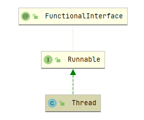
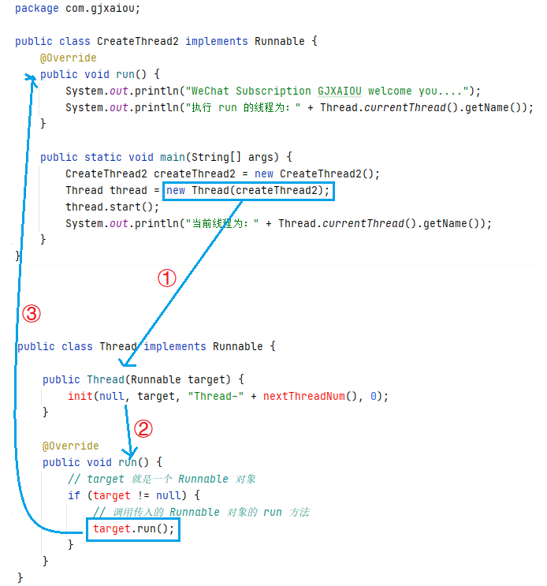

[TOC]

# 线程基本类 Thread 类与 Runnable 接口

在进入多线程学习之前，首先分析一下 Thread 类、Object 类中有关线程的基本方法。

> JDK 版本为：1.8.0_221
>
> Object 类：java.lang.Object
>
> Thread 类：java.lang.Thread
>
> Runnable 接口：java.lang.Runnable
>
> 文中涉及的翻译均为个人理解翻译，偏向于口语化，若想深究推荐阅读源码英文说明。
>
> 慢工出细活，不要急~

## 一、Thread 类

### （一）Thread  类和 Runnable 接口两者关系

从 UML 图中可以明显看出，Thread 类是继承自 Runnable 接口。从源码层面也能得到这一结论：

```java
public class Thread implements Runnable {
    // XXXX
}
```



### （二）Thread 类的 JavaDoc 文档阅读

首先完整的阅读分析一下 Thread 类的 JavaDoc 文档。【】内为自己注释文字，非原文翻译。

> 一个 Thread 是程序的一个执行线程，Java 虚拟机允许应用程序同时并发运行多个执行线程。
>
> **每个线程都有一个优先级，优先级较高的线程优先于优先级较低的线程执行**。每个线程也可以/不可以被标记为守护进程。当在某个线程中运行的代码创建一个新的 Thread 对象时，**新线程的优先级最初设置为等于创建线程的优先级**【即如果在一个线程中创建另一个线程，则被创建线程初始优先级和创建它的线程优先级相同】，**并且仅当创建线程是守护进程时，被创建的线程才是守护进程线程**。
>
> 当 Java 虚拟机启动时，通常只有一个非守护进程线程（它通常调用某些指定类的名为 main 的方法）【所以 main 方法是执行在线程上的】。Java 虚拟机会一直执行线程，直到发生以下任一情况：
>
> - Runtime 类的 exit() 方法被调用，并且类安全管理器允许退出操作发生；
>
> - 所有非守护进程的线程都已死亡，消亡原因可能是调用 run 方法返回了，或者抛出了超过 run 方法范围的异常。
>
> 有两种方法可以创建一个新的执行线程，**一种是将类声明为 Thread 类的子类。这个子类应该覆盖重写Thread 类的 run 方法**。然后可以分配并启动子类的实例。例如，计算大于指定值的素数的线程可以如下编写：
>
> ```java
> class PrimeThread extends Thread {
>    long minPrime;
>    PrimeThread(long minPrime) {
>        this.minPrime = minPrime;
>    }
>    public void run() {
>        // compute primes larger than minPrime
>        ...
>    }
> }
> ```
>
> 然后通过如下代码可以创建一个线程然后开始运行：
>
> ```java
> PrimeThread p = new PrimeThread(143);
> p.start();
> ```
>
> **创建线程的另一种方式是声明一个实现  Runnable 接口的类。然后，该类实现 run 方法。**然后可以分配类的实例【即可以创建该类的实例】，**在创建 Thread 时将该实例对象作为参数传递**，然后启动。其他样式中的相同示例如下所示：
>
> ```java
> class PrimeRun implements Runnable {
>     long minPrime;
>     PrimeRun(long minPrime) {
>         this.minPrime = minPrime;
>     }
> 
>     public void run() {
>         // compute primes larger than minPrime
>         ......
>     }
> }
> ```
>
> 然后创建线程对象，启动
>
> ```java
> PrimeRun p = new PrimeRun(143);
> new Thread(p).start();
> ```
>
> **每个线程都有一个用于标识的名称。多个线程可能具有相同的名称。如果在创建线程时未指定名称，则会为其生成新名称。**

**Thread 类的 JavaDoc 文档总结**：

- 每个线程都有一个优先级，高优先级的线程优于低优先级的线程执行，新创建线程的优先级等同于创建该线程的线程优先级。
- 只有创建线程为守护线程，其创建的线程才是守护线程。
- 创建线程有两种方式：
    - 继承 Thread 类，然后重写 run 方法；
    - 实现 Runnable 接口，然后实现 run 方法；
- 每个线程在创建时都可以设置名称，如未指定则会自动设置。并且多个线程可能具有相同的名称。

2.**然后在 Thread 类的代码中同样含有设置了线程优先级代码，代码如下：**

```java
/**
* The minimum priority that a thread can have.
* 一个线程可以使用的最小优先级
*/
public final static int MIN_PRIORITY = 1;

/**
* The default priority that is assigned to a thread.
* 分配给一个线程的默认优先级
*/
public final static int NORM_PRIORITY = 5;

/**
* The maximum priority that a thread can have.
* 一个线程可以使用的最大优先级
*/
public final static int MAX_PRIORITY = 10;
```

3.**被创建线程的优先级和创建该线程的线程优先级相同**

```java
package com.gjxaiou;

public class Demo extends Thread {
    @Override
    public void run() {
        System.out.println(Thread.currentThread().getName());
        System.out.println(Thread.currentThread().getPriority());
    }

    public static void main(String[] args) {
        System.out.println("main 方法中的线程 " + Thread.currentThread().getName());
        Thread.currentThread().setPriority(3);
        Demo demo = new Demo();
        demo.start();
    }
}
```

### （三）Thread 类的构造方法分析

Thread 类包括 8 个重载的构造方法，然后都调用 init 方法来实现线程的创建和初始化，示例如：

```java
public Thread() {
    init(null, null, "Thread-" + nextThreadNum(), 0);
}
public Thread(Runnable target) {
    init(null, target, "Thread-" + nextThreadNum(), 0);
}
```

其中 init 方法参数含义为：

```java
/**
  * @param g ：线程组
  * @param target ：被执行的目标
  * @param name ：线程名称
  * @param stackSize ：新线程期待栈的大小，或者值为 0， 0 表示该参数会被忽略。
  * @param acc ：访问控制
  */
private void init(ThreadGroup g, Runnable target, String name,
                  long stackSize, AccessControlContext acc) {
}
```

针对上述谈到的线程自动命名，在上述的 Thread 类的构造方法中，线程被命名为：`Thread- + nextThreadNum`，其中 nextThreadNum 为 Thread 类中的一个同步方法，源代码如下：

```java
/*
 * For autonumbering anonymous threads.
 * 用于自动为匿名线程编号
 */
private static int threadInitNumber;
private static synchronized int nextThreadNum() {
    return threadInitNumber++;
}
```

该方法主要功能就是将变量 threadInitNumber 加一，使用 synchronized 修饰该方法使得同一个时刻只能有一个线程进入该方法。而该变量使用 static 方法修饰，是为了保证所有的 Thread 类实例都能看到并修改的是同一个变量。其中 synchronized 使用后续会详细分析。

### （四）Thread 类的 start 方法分析

**1.首先阅读 JavaDoc 文档**

>**该方法会导致这个线程开始执行，Java 虚拟机会调用这个线程的 run() 方法。**
>
>执行的结果就是两个线程同时执行：当前线程（调用 start 方法返回的线程）和其他线程（执行其 run 方法的线程）。
>
>【因为调用 start 方法肯定是通过某个线程的对象来调用 start 方法，这是一个线程。 =》调用 start 方法的线程】
>
>【当调用 start 方法之后，JVM 又会调用该线程的 run 方法，这是在另一个线程中执行。=》调用 run 方法的线程】
>
>启动一个线程多次是不合法的，特别的，如果一个线程执行完成之后不会再被重启。

然后针对该方法进行源码分析：

```java
/*
 * Java 线程状态，已初始化以显示线程「尚未启动」
 */
// 这里 volatile 主要保证该变量的可见性。
private volatile int threadStatus = 0; 

public synchronized void start() {
    /**
     * 对于 VM（虚拟机）创建/设置的 main 方法或者 system 组线程，不会调用该方法，将来添加到该方法的任何新功能可能也必须添加到 VM 中。
     * 状态值 0 对应状态 「NEW」
     */
    // 如果该线程已经被启动了（变量值不为 0），则直接抛出 IllegalThreadStateException
    if (threadStatus != 0)
        throw new IllegalThreadStateException();

    /*
     *  通知线程组该线程即将启动，以便可以将其添加到组的线程列表中，并且可以减少组的未启动计数。
     */
    group.add(this);

    // started 表示线程的运行状态
    boolean started = false;
    try {
        // start0() 为 Native 方法，因此线程本质上是由操作系统创建执行的。源代码见：https://github.com/GJXAIOU/jdk/blob/master/src/hotspot/share/runtime/thread.cpp
        start0();
        started = true;
    } finally {
        try {
            if (!started) {
                group.threadStartFailed(this);
            }
        } catch (Throwable ignore) {
            /* do nothing. If start0 threw a Throwable then
                  it will be passed up the call stack */
        }
    }
}
```

### （五）Thread 类的 run  方法分析

**首先分析 run 方法的 JavaDoc 文档**：

>如果该线程是由一个单独的 Runnable 对象来构建，将会调用 Runnable 对象中的 run 方法，构造该方法不做任何事并且方法。**Thread 类的子类应该重写这个方法。**

源码分析为：

```java
@Override
public void run() {
    // target 就是一个 Runnable 对象
    if (target != null) {
        // 调用传入的 Runnable 对象的 run 方法
        target.run();
    }
}
```

### （六）Thread 类的 sleep 方法详解

**首先分析 JavaDoc 文档**

> 会导致当前正在执行的线程进入休眠状态（临时的停止执行一段特定时间的毫秒数），它会受到系统定时器和调度器的精度的影响。**线程并不会失去任何锁的所有权**。

```java
/* @param  millis： 睡眠的毫秒数
 * @throws  IllegalArgumentException：如果 millis 为负数就抛这个异常
 * @throws  InterruptedException：如果任何其它线程中断了当前线程， 当抛出这个异常中，当前线程的中断状态就被清空了。
  */
public static native void sleep(long millis) throws InterruptedException;

// 这是纳秒级别的重载方法
public static void sleep(long millis, int nanos){
  // XXXXXX 
}
```

## 二、Runnable 接口

**下面为 Runnable 接口的 JavaDoc 文档**

> `Runnable` 接口应该由其实例（要由线程执行的任何类）实现。该类必须定义一个没有参数的 run 方法。
>
> 此接口旨在为希望在活动时执行代码的对象提供通用协议。例如，Thread 类实现了 Runnable 接口。
>
> **处于活动状态只意味着线程已启动但尚未停止**。
>
> 此外，`Runnable` 提供了一种方法，使类在不子类化 `Thread` 类的情况下处于活动状态。实现 Runnable 接口的类可以通过实例化 Thread 实例并将其自身作为目标传入而运行，而无需子类化 Thread 类。在大多数情况下，**如果您只计划重写 run（）方法，而不打算重写其他 Thread 类的方法，则应使用  Runnable 接口**。这一点很重要，因为除非程序员打算修改或增强类的基本行为，否则不应该对类进行子类化（即不应该继承）。

```java
package java.lang;

/*
 * @FunctionalInterface 表示该接口为函数式接口
 */
@FunctionalInterface
public interface Runnable {
    // 当实现 Runnable 接口的对象被用于创建一个线程的时候，启动该线程的时候会导致该对象的 run 方法在独立执行的线程中被调用。
    public abstract void run();
}
```

> 函数式接口含义：当一个接口中有且只有一个抽象方法时候（可以有默认实现方法和静态方法以及重写 Object 类中的方法）可以使用 @FunctionalInterface，函数式接口的实例可以使用 Lambda 表达式、方法引用、构造方法引用等方式进行创建。

## 三、使用 Thread 类和 Runnable 接口创建线程分析

### （一）使用 Thread 类

首先创建一个类继承 Thread 类，然后重写其中的 run 方法，最终调用 start 方法启动该线程。当调用 start 方法启动该线程的时候，JVM 会将该线程放入就绪队列中等待被调度（不是调用 start 方法之后就一定马上执行的），当一个线程被调度的时候会执行该线程的 run 方法。run() 方法里面就是线程要执行的任务代码。

**示例代码**

```java
package com.gjxaiou;

public class CreateThread1 extends Thread {
    @Override
    public void run() {
        System.out.println("WeChat Subscription GJXAIOU welcome you....");
        System.out.println("执行 run 的线程为：" + Thread.currentThread().getName());
    }

    public static void main(String[] args) {
        CreateThread1 createThread1 = new CreateThread1();
        // 耗时比较大
        createThread1.start();
        // 耗时比较小
        System.out.println("当前线程为：" + Thread.currentThread().getName());
    }
}
```

执行结果为：

```java
当前线程为：main
WeChat Subscription GJXAIOU welcome you....
执行 run 的线程为：Thread-0
```

因为一个进程正在运行时至少会有一个线程正在运行，执行 main() 方法的线程是由 JVM 创建的，线程名称也为 main。

**执行流程**：

因为CreateThread1 类继承了 Thread 类并且重写了 run 方法，所以 Thread 类中的 run 方法被覆盖了。然后调用 start 方法之后启动该线程就会执行 run 方法中的内容。

**调用 start() 方法之后会启动一个线程，该线程启动之后会自动调用线程对象中的 run() 方法，run() 方法里面的代码就是线程对象要执行的任务，是线程执行任务的入口。**

因为 start()  方法执行了以下多个步骤，因此比较耗时：

- 通过 JVM 告诉操作系统创建 Thread。
- 操作系统开辟内存，并且使用系统 SDK  中的创建线程函数进行创建 Thread 线程对象。
- 操作系统对 Thread 对象进行调度，以确定执行时机。
- Thread 在操作系统中被成功执行。

main 线程执行 start() 方法时候不必等待四步都执行完毕，而是立即继续执行 start() 方法之后的代码，这四步和后面的代码将一同执行。但是，**线程执行的顺序具有随机性**，也可能在执行完成的 start() 方法的四步之后才输出下面的语句（极少情况，通常需要在 start() 方法调用处后面加上 Thread.sleep(XX) 才能看到）。

**但是，使用多线程时，代码的运行结果与代码的执行顺序或调用顺序无关**。

**线程调用随机性的展示**：

```java
package com.gjxaiou;

public class Demo2 extends Thread {
    @Override
    public void run() {
        for (int i = 0; i < 5; i++) {
            System.out.println(Thread.currentThread().getName() + " 正在执行");
        }
    }

    public static void main(String[] args) {
        Demo2 demo2 = new Demo2();
        demo2.setName("myThread");
        demo2.start();

        for (int i = 0; i < 5; i++) {
            System.out.println(Thread.currentThread().getName() + " 正在执行");
        }
    }
}
```

输出结果：

```java
main 正在执行
myThread 正在执行
main 正在执行
myThread 正在执行
myThread 正在执行
main 正在执行
main 正在执行
main 正在执行
myThread 正在执行
myThread 正在执行
```


### （二）使用 Runnable 接口

首先创建一个类实现 Runnable 接口，因为该接口中只有一个 run 方法，因此要在该新类中实现该 run 方法。

**示例代码**：

```java
package com.gjxaiou;

public class CreateThread2 implements Runnable {
    @Override
    public void run() {
        System.out.println("WeChat Subscription GJXAIOU welcome you....");
        System.out.println("执行 run 的线程为：" + Thread.currentThread().getName());
    }

    public static void main(String[] args) {
        CreateThread2 createThread2 = new CreateThread2();
        Thread thread = new Thread(createThread2);
        thread.start();
        System.out.println("当前线程为：" + Thread.currentThread().getName());
    }
}
```

执行结果为：

```java
当前线程为：main
WeChat Subscription GJXAIOU welcome you....
执行 run 的线程为：Thread-0
```

**执行流程**：

因为 CreateThread2 类实现了 Runnable 接口，而上文提到的 Thread 类的 8 个重构的构造方法中的第二个就是在构造 Thread 实例时候传入一个 Runnable 实例。因为没有覆盖 Thread 类中的 run 方法，因此 Thread 类中的 run 方法会执行，而上述 Thread 类的 run 方法中会调用 target 的 run 方法，这里就是调用 createThread2 的 run 方法完成执行。



### （三）两者分析

 **Runnable 接口作用**：将 `run()` 向上抽取，做成抽象方法，让实现类去重写

因为通过 start() 方法开启线程之后，都会调用 Thread 的 run()，只是该 run() 可能来自 Thread 类的子类（针对方式一），或者是 Thread 类自身（针对方式二）。因此 Thread 类（及其子类）是线程运行的入口。

#### 继承 Thread 类和实现 Runnable 接口比较

使用实现 Runnable 接口的方式：将线程执行的内容放置到了 Runnable 实现类中，使得执行者（线程）和被执行者（资源）进行分离解耦。【如果 Runnable 使用匿名对象进行构建，则同样无法实现资源共享】。同时如果同时使用多个 new Thread，传入同一个 Runnable 实例，然后使用 start() 方法进行执行会出现线程安全问题。

使用继承 Thread 类的方式：线程和代运行的代码放置在同一个类中，使得每个子类都有一份独立的 run()，资源没有独立也就无法共享。

