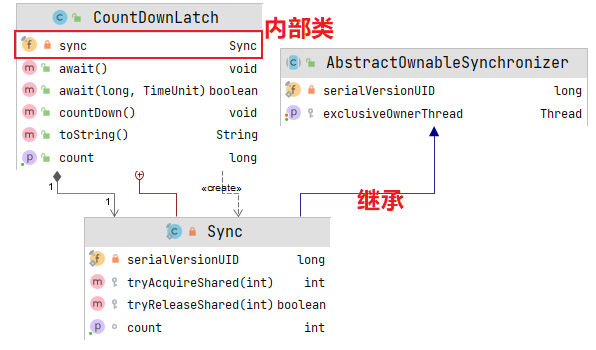

# CountDownLatch

[TOC]

## 一、前言

CountDownLatch 「倒计时锁」，是一种同步工具，允许一个或者多个线程等待一组在其它线程中执行的操作完成，通常是通过主线程创建几个子线程，然后对应的子线程任务都执行完毕之后，主线程才继续往下执行。

## 二、类结构



CountDownLatch 中只包含了 Sync 一个内部类，它没有公平/非公平模式，所以它算是一个比较简单的同步器。同时 CountDownLatch 没有实现 Serializable 接口，因此不可序列化。

Thread 类中的 join 方法在某种程度上实现：等另一个线程消亡之后该服务才进行执行，但是如果只想是：

> 目标：那个线程启动之后将主要内容都执行之后该主线程即启动，同时原来的线程可以继续往下执行。

## 三、源码分析

### （一）核心内部类 Sync

```java
private static final class Sync extends AbstractQueuedSynchronizer {
    private static final long serialVersionUID = 4982264981922014374L;

    // 传入初始次数
    Sync(int count) {
        setState(count);
    }

    // 获取还剩的次数，getState() 即获取计数器的值
    int getCount() {
        return getState();
    }

    // 尝试获取共享锁
    protected int tryAcquireShared(int acquires) {
        // 注意，这里 state 等于 0 的时候返回的是 1，也就是说 count 减为 0 的时候获取总是成功
        // state 不等于 0 的时候返回的是 -1，也就是 count 不为 0 的时候总是要排队
        return (getState() == 0) ? 1 : -1;
    }

    // 尝试释放锁
    protected boolean tryReleaseShared(int releases) {
        // 将计数器的值每次减一，当归零之后发出 signal
        for (; ; ) {
            // 获取计数器 state 的值
            int c = getState();
            // 等于 0 了，则无法再释放了
            if (c == 0)
                // 当前计数器已经归零了，不能再减了，直接返回
                return false;
            // 如果不为 0 则将 count 的值减 1
            int nextc = c - 1;
            // 原子更新 state 的值
            if (compareAndSetState(c, nextc))
                // 减为 0 的时候返回 true，这时会唤醒后面排队的线程
                return nextc == 0;
        }
    }
}
```

Sync 重写了 `tryAcquireShared()` 和 `tryReleaseShared()` 方法，并把 count 存到 state 变量中去。但是**两个方法中的参数都是没用的。**

### （二）构造方法

```java
// 传入初始次数 count
public CountDownLatch(int count) {
    if (count < 0) throw new IllegalArgumentException("count < 0");
    this.sync = new Sync(count);
}
```

### （三）await()方法

```java
// await 方法会导致当前线程进入等待状态，直到 latch 减到 0 或者线程被中断了。
public void await() throws InterruptedException {
    // 调用 AQS 的 acquireSharedInterruptibly 方法，其中 1 的值无所谓多少，只是为了适配 AQS 方法必须有参数。该方法实现会判断
		// if (tryAcquireShared(arg) < 0)，内部实现为
    sync.acquireSharedInterruptibly(1);
}

// ======= AbstractQueuedSynchronizer.acquireSharedInterruptibly()========
public final void acquireSharedInterruptibly(int arg) throws InterruptedException {
    if (Thread.interrupted())
        throw new InterruptedException();
    // 尝试获取锁，如果失败则排队
    if (tryAcquireShared(arg) < 0)
        doAcquireSharedInterruptibly(arg);
}
```

`await()` 方法是等待其它线程完成的方法，它会先尝试获取一下共享锁，如果失败则进入 AQS 的队列中排队等待被唤醒。

根据上面 Sync 的源码，我们知道，state 不等于 0 的时候 `tryAcquireShared()` 返回的是 -1，也就是说 count 未减到 0 的时候所有调用 `await()` 方法的线程都要排队。

## （四）countDown()方法

```java
// java.util.concurrent.CountDownLatch.countDown()
public void countDown() {
    // 调用 AQS 的释放共享锁方法
    sync.releaseShared(1);
}
// java.util.concurrent.locks.AbstractQueuedSynchronizer.releaseShared()
// 在共享的模式下进行释放，根据 tryReleaseShared 方法的返回取消一个或者多个线程的阻塞
public final boolean releaseShared(int arg) {
    // 尝试释放共享锁，如果成功了，就唤醒排队的线程
    if (tryReleaseShared(arg)) {
        // 唤醒等待的线程
        doReleaseShared();
        return true;
    }
    return false;
}
```

`countDown()` 方法，会释放一个共享锁，也就是 count 的次数会减 1。

根据上面 Sync 的源码，我们知道，`tryReleaseShared()` 每次会把 count 的次数减 1，当其减为 0 的时候返回 true，这时候才会唤醒等待的线程。

## 使用案例一

测试程序：

```java
package com.gjxaiou.countDownLatch;

import java.util.concurrent.CountDownLatch;
import java.util.stream.IntStream;

/**
 * 三个子任务都完成则主任务可以继续执行
 */
public class MyTest1 {
    public static void main(String[] args) {
        // 参数表示实际执行子任务的数量，该值传给了 countDownLatch 中的一个计数器
        CountDownLatch countDownLatch = new CountDownLatch(3);
        // 创建三个线程
        IntStream.range(0,3).forEach(i -> new Thread(() -> {
            try {
                Thread.sleep(2000);
                System.out.println("hello");
            }catch (InterruptedException ex){
                ex.printStackTrace();
            }finally {
                // 每执行一次 countDown() 方法，则 countDownLatch 中的计数器的值原子性减一
                // ☆☆☆如果放在 try 中，则如其他代码抛出异常则不再减一，导致所有调用 await 的方法的主线程一直处于等待状态无法执行
                countDownLatch.countDown();
            }
        }).start());

        System.out.println("启动子线程完毕");


        try {
            // 调用 await() 方法时会检查 countDownLatch 对象中的计数器值是否为 0，如果为 0 则 await 方法立刻返回。如果不为 0 则调用
            // await 方法的线程会进入阻塞队列中，等待计数器为 0 之后唤醒所有等待队列中的线程然后执行。
            countDownLatch.await();
        } catch (InterruptedException exception) {
            exception.printStackTrace();
        }

        System.out.println("主线程执行完毕");

    }

}
```

输出结果为：

```java
启动子线程完毕
hello
hello
hello
主线程执行完毕
```

## 使用示例二

这里我们模拟一个使用场景，我们有一个主线程和5个辅助线程，等待主线程准备就绪了，5个辅助线程开始运行，等待5个辅助线程运行完毕了，主线程继续往下运行，大致的流程图如下：


我们一起来看看这段代码应该怎么写：

```java
public class CountDownLatchTest {
    public static void main(String[] args) throws InterruptedException {
        CountDownLatch startSignal = new CountDownLatch(1);
        CountDownLatch doneSignal = new CountDownLatch(5);

        for (int i = 0; i < 5; i++) {
            new Thread(()->{
                try {
                    System.out.println("Aid thread is waiting for starting.");
                    startSignal.await();
                    // do sth
                    System.out.println("Aid thread is doing something.");
                    doneSignal.countDown();
                } catch (InterruptedException e) {
                    e.printStackTrace();
                }
            }).start();
        }

        // main thread do sth
        Thread.sleep(2000);
        System.out.println("Main thread is doing something.");
        startSignal.countDown();

        // main thread do sth else
        System.out.println("Main thread is waiting for aid threads finishing.");
        doneSignal.await();

        System.out.println("Main thread is doing something after all threads have finished.");

    }
}
```

输出结果：

```java
Aid thread is waiting for starting.
Aid thread is waiting for starting.
Aid thread is waiting for starting.
Aid thread is waiting for starting.
Aid thread is waiting for starting.
Main thread is doing something.
Main thread is waiting for aid threads finishing.
Aid thread is doing something.
Aid thread is doing something.
Aid thread is doing something.
Aid thread is doing something.
Aid thread is doing something.
Main thread is doing something after all threads have finished.
```

这段代码分成两段：

第一段，5个辅助线程等待开始的信号，信号由主线程发出，所以5个辅助线程调用startSignal.await()方法等待开始信号，当主线程的事儿干完了，调用startSignal.countDown()通知辅助线程开始干活。

第二段，主线程等待5个辅助线程完成的信号，信号由5个辅助线程发出，所以主线程调用doneSignal.await()方法等待完成信号，5个辅助线程干完自己的活儿的时候调用doneSignal.countDown()方法发出自己的完成的信号，当完成信号达到5个的时候，唤醒主线程继续执行后续的逻辑。

## 注意

- CountDownLatch 的初始次数不可以调整，因为类没有提供修改该参数 count 的方法，除非使用反射。

- CountDownLatch 使用共享锁原因：

    前面我们分析 ReentrantReadWriteLock 的时候学习过 AQS 的共享锁模式，比如当前锁是由一个线程获取为互斥锁，那么这时候所有需要获取共享锁的线程都要进入 AQS 队列中进行排队，当这个互斥锁释放的时候，会一个接着一个地唤醒这些连续的排队的等待获取共享锁的线程，注意，这里的用语是“一个接着一个地唤醒”，也就是说这些等待获取共享锁的线程不是一次性唤醒的。

    因为 CountDownLatch 的 await() 多个线程可以调用多次，当调用多次的时候这些线程都要进入 AQS 队列中排队，当 count 次数减为 0 的时候，它们都需要被唤醒，继续执行任务，如果使用互斥锁则不行，互斥锁在多个线程之间是互斥的，一次只能唤醒一个，不能保证当 count 减为 0 的时候这些调用了 await() 方法等待的线程都被唤醒。

- CountDownLatch 与 Thread.join() 区别

    Thread.join() 是在主线程中调用的，它只能等待被调用的线程结束了才会通知主线程，而 CountDownLatch 则不同，它的 countDown() 方法可以在线程执行的任意时刻调用，灵活性更大。


