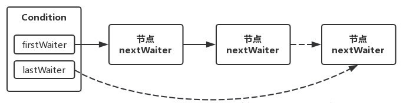
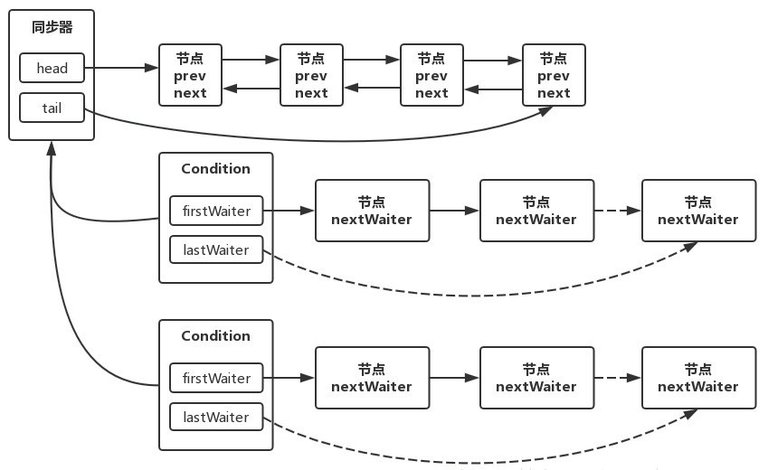
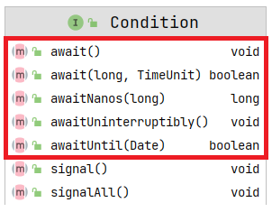
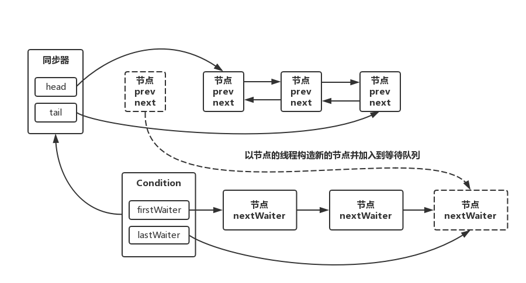
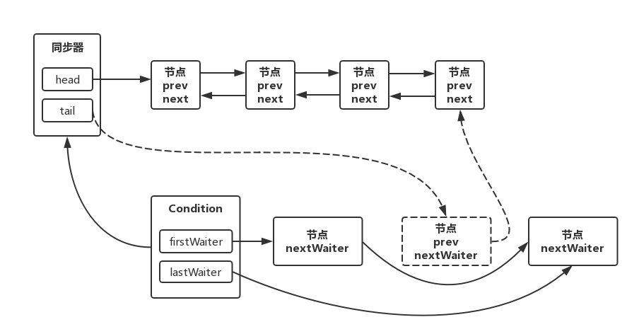

# Condition

[TOC]

## 一、Condition 简介

传统上，我们可以通过 synchronized 关键字 ＋ wait + notify/notifyAll 来实现多个线程之间的协调与通信，整个过程都是由 JVM 来帮助我们实现的，开发者无需(也无法)了解底层的实现细节。

从 JDK5 开始，并发包提供了 lock + Condition(主要是 await 与 signal/signalAll )来实现多个线程之间的协调与通信，整个过程都是由开发者来控制的，而且相比于传统方式更加灵活，功能也更加强大。**Condition 提供了一系列阻塞和唤醒线程的方法，和 Lock 结合实现等待/通知模式。**即 Condition 对象可以控制和处理线程的状态。

**Thread.sleep 与 await(或是 Object#wait() 方法)的区别**

 **sleep 方法本质上不会释放锁，而 await 会释放锁**，并且在 signal 后，还需要重新获得锁才能继续执行(该行为与 wait 方法完全一致)。

### Object 类监视器方法和 Condition 对比

| 对比项                                                   | Object 监视器方法         | Condition                                                    |
| -------------------------------------------------------- | ------------------------- | ------------------------------------------------------------ |
| 前置条件                                                 | 获取对象的监视器锁        | 调用 Lock.lock() 获取锁调用 Lock.newCondition() 获取 Condition 对象 |
| 调用方法                                                 | 直接调用如：object.wait() | 直接调用如：condition.await()                                |
| **等待队列个数**                                         | 一个                      | 多个                                                         |
| 当前线程释放锁并进入等待队列                             | 支持                      | 支持                                                         |
| 当前线程释放锁并进入等待队列，在等待状态中不**响应中断** | 不支持                    | 支持                                                         |
| 当前线程释放锁并进入超时等待状态                         | 支持                      | 支持                                                         |
| **当前线程释放锁并进入等待状态到将来的某个时间**         | 不支持                    | 支持：即 awaitUntil()                                        |
| 唤醒等待队列中的一个线程                                 | 支持                      | 支持                                                         |
| 唤醒等待队列中的全部线程                                 | 支持                      | 支持                                                         |

## 二、Condition 的 JavaDoc 分析

**Condition 相当于将 Object 类中的 monitor 方法（wait/notify/notifyAll）方法插入到不同对象中，以实现==让每个对象有多个等待集合== wait-sets 的效果**。通过任意一个 Lock 实现将他们组合起来，其中使用 Lock 替换掉 synchronized 修饰方法/代码块的使用，使用 Condition 替换掉 Object 中的那些监视器 monitor 方法。

> 传统方式是调用 wait 之后，所有线程都会进入该对象的唯一的一个等待集合中，但是 condition 可以将某几个线程放在一个等待集合中，另几个放在另一个等待集合。

Condition（也称之为条件队列/条件变量）提供了一种方式让线程挂起执行（类似于 wait）直到被另一个线程通知，这里的另一个线程满足某些状态条件变成了 true。由于在不同线程中发生这种共享状态信息的访问，因此其需要被保护，所以一个 lock 的某种形式需要关联到 condition 上。等待一个 condition 提供的关键属性是它以原子方式释放关联的锁并挂起当前线程，就像 Object 的 wait 方法。

**Condition 实例本质上绑定到 lock 实例上。使用 `Lock.newCondition()`可以获取特定 Lock 实例的 Condition 实例。**线程调用 Condition 中方法前需要首先获取到 Condition 对象关联的锁。

> 因此一个 lock 对象和 condition 对象是一对多的关系，因为每次通过 newCondition() 方法就获得一个 condition 对象，该方法在 Lock 接口的最后。

Condition 实现可以提供不同于 Object 监视方法的行为和语义，例如**保证通知的顺序，或者在执行通知时不需要持有锁。**

**Condition 实例只是普通对象，它们本身可以用作 synchronized 语句中的目标**，并且可以调用它们自己的监视器 `Object#wait()` 和  `Object#notify()` 方法。获取 Condition 实例的监视锁或使用其监视方法与获取与该 Condition}关联的 lock 或使用其 await 和 signal 方法没有指定的关系。**但是建议不要以这种方式使用 Condition实例**，除了它们自己的实现之外。

> 即 condition 也是一个普通的对象，其自身也是有 monitor 等，所以我们获取 condition 的 monitor 锁和使用 Condition 中的 wait/signal 方法没有任何关系。

**实施注意事项**

**在等待 Condition 时，通常允许发生虚假唤醒，作为对底层平台语义的让步。**但是因为 **Condition 应该始终在循环中等待**，因此本质上对大多数程序没有影响。

但建议应用程序程序员始终假设它们可以发生，因此始终在循环中等待。条件等待的三种形式（可中断、不可中断和定时）在某些平台上的易实现性和性能特征可能有所不同。尤其是，可能很难提供这些特性并维护特定的语义，例如排序保证。此外，中断线程的实际挂起的能力可能并不总是能够在所有平台上实现。

因此，实现不需要为所有三种形式的等待定义完全相同的保证或语义，也不需要支持中断线程的实际挂起。

一个实现需要清楚地记录每个等待方法提供的语义和保证，当一个实现确实支持线程挂起的中断时，它必须遵守这个接口中定义的中断语义。

由于中断通常意味着取消，并且对中断的检查通常不经常发生，所以**实现可能会倾向于响应中断而不是正常的方法返回**。即使可以显示中断发生在另一个可能已解除线程阻塞的操作之后，也是如此。实现应该记录这种行为。

**常用概念**：

- 等待队列是一个单向 FIFO 队列，队列每个节点都包含了一个线程引用，该线程是在 Condition 对象上等待的线程；该等待队列和 AQS 中的同步队列，都是采用 AQS#Node 静态内部类；
- 一个 ConditionObject 拥有首节点(fisrtWaiter)和尾节点(lastWaiter)；【ConditionObject 类是 Condition 接口在 AQS 中内部实现类】
- 如果一个线程调用了 Condition.await() 方法，那么该线程将会释放锁（从同步队列中移除），构造成节点加入等待队列，等待被唤醒；
- 如果一个线程调用了 Condition.signal() 方法，那么该线程将会被唤醒（从等待队列中移除），构造成节点加入同步队列，尝试重新获取同步状态；

## 三、Condition 的实现分析

### （一）获取 Condition 实例

获取 Condition 对象的唯一方式是通过 Lock 接口的 `newCondition()` 方法得到，同时因为 Lock 对于同步状态的实现都是通过内部的自定义同步器实现的，所以 Condition 接口的唯一实现类就是同步器 AQS 中的内部类 ConditionObject，同时因为 Condition 的操作需要获取到相关的锁，所以作为同步器的内部类也比较合理。每个 Condition 实例都能够访问同步器提供的方法，相当于每个 Condition 都拥有所属同步器的引用。该类定义如下：

`public class ConditionObject implements Condition, java.io.Serializable{}`

### （二）等待队列

每个 Condition 对象都包含着一个等待队列，该队列是 Condition 对象实现等待 / 通知功能的关键。

等待队列是一个 FIFO 队列，在队列中的每个节点都包含了一个线程引用，该线程就是在 Condition 对象上等待的线程，如果一个线程调用了 Condition.await() 方法，那么该线程将会释放锁、构造成节点加入等待队列并进入等待状态。事实上，节点的定义复用了 AQS 中 Node 节点的定义，也就是说，同步队列和等待队列中节点类型都是 AQS 的静态内部类 AbstractQueuedSynchronized.Node。

Node 里面的结构为：

```java
static final class Node {
	volatile Node prev;
	volatile Node next;
	volatile Thread thread;
	volatile int waitStatus;
	Node nextWaiter;
}
```

一个 Condition 包含一个等待队列，Condition 拥有首节点（firstWaiter）和尾节点（lastWaiter）。当前线程调用 `Condition.await()` 方法之后，将会以当前线程构造 Node 节点，并将节点从尾部加入等待队列，等待队列的基本结构如下图所示：

```java
public class ConditionObject implements Condition, java.io.Serializable {
    private transient Node firstWaiter;
    private transient Node lastWaiter;
    // XXXXX
}
```



Condition 拥有首尾节点的引用，而新增节点只需要将原来的尾节点 nextWaiter 指向它，并且更新尾节点即可。上述更新过程不需要 CAS 保证，原因在于调用 await() 方法的线程必定是获取了锁的线程，也就是说该过程是由锁来保证线程安全的。

在 **Object 的监视器模型上，一个对象拥有一个同步队列和等待队列**，而并发包中的 **Lock（更确切地说是同步器 AQS）拥有一个同步队列和多个等待队列**，其对应关系如下图所示：



> 同步队列：所有尝试获取该对象 Monitor 失败的线程，都加入同步队列排队获取锁，可以理解为同步队列上的线程都在争用锁对象。
>
> 等待队列：已经拿到锁的线程在等待其他资源时，主动释放锁，置入该对象等待队列中，等待被唤醒，当调用 notify（）会在等待队列中任意唤醒一个线程，将其置入同步队列的尾部，排队获取锁，可以理解为等待队列上的线程是主动暂时放弃争用锁。　　　　　　　　　　　　　　　　　　　　

## 四、主要方法分析【Condition 接口和 AQS 中 ConditionObject 类】



### （一）await() 方法

**该方法会导致当前线程处于等待状态，直到被调用 signal 或者该线程被中断了。**
**调用 await 之后，与此 Condition 关联的锁被原子释放，当前线程无法进行线程调度，并且处于休眠状态**，直到发生以下四种情况中的一种：

- 另一个线程调用当前 Condition 的 signal 方法，而当前线程恰好被选为要唤醒的线程； 
- 另一个线程为此 Condition 调用 signalAll 方法；   
- 另一个线程中断了当前线程，并中断线程支持暂停；


- 发生「虚假唤醒」。

如果当前线程：在进入此方法时设置了中断状态；或者在等待时被中断了，并且支持中断线程挂起，则抛出 InterruptedException ，并且当前线程的中断状态被清除。在第一种情况下，没有规定是否在锁定之前进行中断测试释放。

#### 具体实现分析

调用 Condition 的 await() 方法会使当前线程进入等待状态，当从 await() 方法返回时（继续往下执行），当前线程一定重新获取了与该 Condition 相关联的锁，即保证当前线程返回的时候持有该锁。

如果从队列（同步队列和等待队列）的角度看 await() 方法，**当调用 await() 方法时，相当于同步队列的首节点（获取了锁的节点）移动到 Condition 的等待队列中**。具体而言，**首先调用 await() 方法之前肯定是能获取到同步状态的线程，也就是同步队列中首节点，之后调用 await() 方法由将释放锁，进入等待队列**。

调用该方法的线程是成功获取了锁的线程，也就是同步队列中的首节点，该方法会将当前线程构造为 Node 节点并加入等待队列中，然后释放同步状态，唤醒同步队列中的后继节点，然后当前线程会进入等待状态。

```java
public final void await() throws InterruptedException {
    // 检测线程中断状态
    if (Thread.interrupted())
        throw new InterruptedException();
    /*
	 Node 实例中封装了当前的线程
	 addConditionWaiter() 就是往 Condition 的等待队列（条件队列）中增加一个等待者，因为条件队列本身也是关于 Node 的链表，这里就是将其加入条件队列的尾端。
	*/
    Node node = addConditionWaiter();
    // 调用 await() 方法后释放锁（同步状态）
    int savedState = fullyRelease(node);
    // 判断一些中断性，不重要
    int interruptMode = 0;
    // 检查该节点 node 是否在同步队列中，不是的话说明已经获取到锁【还是说该线程没有竞争锁的资格，继续等待？】
    //  LockSupport.unpark 唤醒线程后，从这里返回，此时已经在 SyncQueue 同步队列中，退出循环
    while (!isOnSyncQueue(node)) {
        // 阻塞挂起当前线程
        LockSupport.park(this);
        // 在调用signal前抛出中断异常，或者调用之后中断，都退出循环
        if ((interruptMode = checkInterruptWhileWaiting(node)) != 0)
            break;
    }
    // 竞争同步状态
    if (acquireQueued(node, savedState) && interruptMode != THROW_IE)
        interruptMode = REINTERRUPT;
    // 清理条件队列中不是在等待条件的节点
    if (node.nextWaiter != null) // clean up if cancelled
        unlinkCancelledWaiters();
    if (interruptMode != 0)
        reportInterruptAfterWait(interruptMode);
}
```

- 先判断当前线程的中断状态，如果为中断则抛出异常
- 如果不是中断状态，则调用 `addConditionWaiter()` 把当前节点加入Condition 等待队列中
- 调用 `fullyRelease()` 释放当前持有的锁，并记住当前 state 的值
- 会阻塞在判断当前节点是否在同步队列中，只有当执行了signal()，节点才会被添加回到同步队列中，如果不在队列中，则 park 当前线程
- 如果在同步队列中，则尝试从队列中获得锁（即使用 `acquireQueue()` 返回竞争同步状态）
- 获得锁之后，需要响应不同的中断模式

加入等待队列是通过 `addConditionWaiter()` 方法来完成的：

```java
// 向等待队列中添加一个新的节点，返回添加的新的节点
private Node addConditionWaiter() {
    // 保存等待队列中的尾节点
    Node t = lastWaiter;
    // 尾节点如果被取消（即不是 CONDITION 状态），则表示该节点不处于等待状态，需要清理节点
    if (t != null && t.waitStatus != Node.CONDITION) {
        unlinkCancelledWaiters();
        t = lastWaiter;
    }
    // 根据当前线程创建Node节点
    Node node = new Node(Thread.currentThread(), Node.CONDITION);
    // 将该节点加入等待队列的末尾
    if (t == null)
        firstWaiter = node;
    else
        t.nextWaiter = node;
    lastWaiter = node;
    return node;
}
```

- 获取当前 Condition 队列中的 lastWaiter 节点
- 判断 lastWaiter 是否为 CONDITION 状态
- 如果为 Cancelled 则处理当前 Condition 中的节点，清除为 Cancelled 的节点，并设置新的 lastWaiter
- 如果不为 Cancelled，则用当前线程新建一个状态为 Condition 的 Node 节点
- 判断尾结点 t 是否为 null，如果是则表示当前等待队列为空，直接将新建的 node 设置为头结点 firstWaiter。
- 如果尾结点 t 不为 null，则将新建的 Node 节点作为尾结点 t 的下一个节点。
- 以上两种情况最后都将 node  节点设置为尾结点 lastWaiter。

将当前线程加入到等待队列之后，需要释放同步状态，该操作通过 fullyRelease(Node) 方法来完成：

```java
final int fullyRelease(Node node) {
    boolean failed = true;
    try {
        // 获取同步状态
        int savedState = getState();
        // 释放锁
        if (release(savedState)) {
            failed = false;
            return savedState;
        } else {
            throw new IllegalMonitorStateException();
        }
    } finally {
        if (failed)
            node.waitStatus = Node.CANCELLED;
    }
}
```

线程释放锁之后，我们需要通过 isOnSyncQueue(Node) 方法不断自省地检查其对应节点是否在同步队列中：

```java
final boolean isOnSyncQueue(Node node) {
    // 节点状态为CONDITION，或者前驱节点为null，返回false
    if (node.waitStatus == Node.CONDITION || node.prev == null)
        return false;
    // 后继节点不为null，那么肯定在同步队列中
    if (node.next != null) // If has successor, it must be on queue
        return true;
    
    return findNodeFromTail(node);
}
```

若节点不在同步队列中，则挂起当前线程，若线程在同步队列中，且获取了同步状态，可能会调用 unlinkCancelledWaiters() 方法来清理等待队列中不为 CONDITION 状态的节点：

```java
private void unlinkCancelledWaiters() {
    Node t = firstWaiter;
    Node trail = null;
    while (t != null) {
        Node next = t.nextWaiter;
        if (t.waitStatus != Node.CONDITION) {
            t.nextWaiter = null;
            if (trail == null)
                firstWaiter = next;
            else
                trail.nextWaiter = next;
            if (next == null)
                lastWaiter = trail;
        }
        else
            trail = t;
        t = next;
    }
}
```

如果从队列的角度看，当前线程加入到 Condition 的等待队列，如下图所示：



### （二）awaitUninterruptibly()

相比上面的 await() 方法，该方法等待不可中断。

### （三）long awaitNanos(long nanosTimeout) throws InterruptedException;

该方法同样使当前线程等待，直到调用 signal 或中断，或者经过指定的等待时间。同时相比 `await()` 方法线程**被唤醒的情况增加一种：指定的等待时间已经过去了**

该方法会返回一个近似的纳秒时间，该时间是剩余的响应时间（如设定 500 纳秒，但是 200 纳秒之后就响应了，则返回值为 300）。如果返回值小于或者等于 0 则表示超时了。

###  （四）boolean await(long time, TimeUnit unit) throws InterruptedException;

同上，只是上面时间只能设定为纳秒而已。

###    （五）void signal();

该方法会唤醒**其中一个**等待线程。

如果有任何线程正在等待此条件，则会选择一个线程进行唤醒。然后该线程必须在从  await() 返回之前重新获取锁。

#### 具体实现

在 AQS 中的 ConditionObject 类的具体实现中，调用 `signal()`方法将会唤醒等待队列中**等待时间最长的节点（首节点）**，在唤醒节点之前，会将节点移动到同步队列中。具体而言，当前线程获取到了锁，接着获取等待队列的首节点，将其移动到同步队列中，并且唤醒节点中的线程。

```java
public final void signal() {
    // 判断当前线程是否持有获得锁
    if (!isHeldExclusively())
        throw new IllegalMonitorStateException();
    Node first = firstWaiter;
    if (first != null)
        // 移动到同步队列中，并且唤醒节点中的线程
        doSignal(first);
}
```

- 先判断当前线程是否为占有此锁的线程
- 获得此等待队列中第一个等待节点，如果此节点不为 null，则 doSignal 此节点

其中主要的 `doSignal()` 方法，实现了将头结点 firstWaiter 移动到同步队列中，并且唤醒节点中包裹的线程。

```java
private void doSignal(Node first) {
    do {
        // 如果等待队列中只有一个节点（即首节点），则唤醒首节点后 lastWaiter 置空
        if ( (firstWaiter = first.nextWaiter) == null)
            lastWaiter = null;
        // 否则获取等待队列中的首节点，即 next 域断开置空
        first.nextWaiter = null;
    } while (!transferForSignal(first) &&
             (first = firstWaiter) != null);
}
```

针对获取到的头结点 first，调用 `transferForSignal(Node node)`

doSignal(Node node)方法中调用transferForSignal(Node node)，通过调用enq(Node node)方法(这里其实就是同步队列的入队enq(Node node)方法)，等待队列中的头结点线程安全地移动到同步队列，当节点移动到同步队列后，当前线程将会被唤醒（LockSupport.unpark(node.thread)）。

```java
final boolean transferForSignal(Node node) {
    /*
         * If cannot change waitStatus, the node has been cancelled.
         */
    // 如果没有正确设置等待状态为初始状态准备加入同步队列中，则返回，当前节点状态为Node.CONDITION
    if (!compareAndSetWaitStatus(node, Node.CONDITION, 0))
        return false;
    // 将等待队列中的头结点移动到同步队列中, 返回已经加入的当前node在同步队列中前节点
    Node p = enq(node);
    int ws = p.waitStatus;
    if (ws > 0 || !compareAndSetWaitStatus(p, ws, Node.SIGNAL))
        // 唤醒当前node线程，返回while(isOnSynQueue(Node node))处，退出循环
        LockSupport.unpark(node.thread);
    return true;
}
```

- 先判断头结点的下一个节点是否为 null，如果为 null 的话，设置 lastWaiter 为 null
- 如果不为 null 的话，因为头节点已经获取出来了，自然要把他的 nextWaiter 设置为 null
- 根据当前节点是否可以从 Condition 状态设置到 0（node 的初始化状态），然后把当前节点通过 `enq()`转移到同步队列中去。
- 判断在同步队列中前节点的状态，判断是否要unpark()当前线程。当节点移动到同步队列之后，当前线程会通过 `LockSupport.unpark()` 进行唤醒。

节点从等待队列移动到同步队列的过程如下图所示：



被唤醒后的线程，将从 await() 方法中的 while 循环中退出（因为此时 isOnSyncQueue(Node) 方法返回 true），进而调用 acquireQueued() 方法加入到获取同步状态的竞争中。

成功获取了锁之后，被唤醒的线程将从先前调用的 await() 方法返回，此时，该线程已经成功获取了锁。

Condition 的 signalAll() 方法，相当于对等待队列的每个节点均执行一次 signal() 方法，效果就是将等待队列中的所有节点移动到同步队列中。

### （六）void signalAll();

**唤醒所有的等待线程**

**任何在该 condition 上等待的线程都会被唤醒**，每个线程在从 await 方法上返回前必须重新获取锁

> 即全部被唤醒之后，只有一个线程能获取锁，所以只有一个线程能从 await 上返回，其他线程还是处于等待状态。因此线程被唤醒和可以继续执行不是一回事。

## 五、Condition 使用样例

有一个支持 put 和  take 方法的有界缓冲区。如果在空缓冲区上尝试 take，则线程将阻塞，直到某个项变为可用；如果在满缓冲区上尝试 put，则线程将阻塞，直到某个空间变为可用。希望保持 put 线程和 take 线程在单独的等待集中等待，这样当缓冲区中的项或空间可用时，我们就可以使用只通知单个线程的优化。 这可以通过使用两个 Condition 实例来实现。【来自 JavaDoc 文档】

> 实例代码来自 JavaDoc 文档，java.util.concurrent.ArrayBlockingQueue 类提供了这些功能，因此实际上可以直接使用类而不是使用下面代码。【见 ArrayBlockingQueue 类源码分析】

```java
package com.gjxaiou.condition;

import java.util.concurrent.locks.Condition;
import java.util.concurrent.locks.Lock;
import java.util.concurrent.locks.ReentrantLock;

/**
 * @Author GJXAIOU
 * @Date 2021/3/19 20:15
 */
public class MyTest1 {

    final Lock lock = new ReentrantLock();
    // 调用同一个 lock 实例生成的两个 condition 对象。通常 Condition 都作为成员变量
    final Condition notFull = lock.newCondition();
    final Condition notEmpty = lock.newCondition();

    final Object[] items = new Object[100];
    int putptr, takeptr, count;

    public void put(Object x) throws InterruptedException {
        // 首先要获取锁
        lock.lock();
        try {
            while (count == items.length) {
           // 调用 await 进入等待状态，同时释放锁。同时放在 while 循环中，保证其它线程通过 signal
           // 方法唤醒该线程，则该线程需要和其他线程争抢说，争抢到了才能执行。
                notFull.await();
            }
            items[putptr] = x;
            if (++putptr == items.length) {
                putptr = 0;
            }
            ++count;
            // 通知另一个线程，可以取出了。
            notEmpty.signal();
        } finally {
            lock.unlock();
        }
    }

    public Object take() throws InterruptedException {
        lock.lock();
        try {
            while (count == 0) {
                notEmpty.await();
            }
            Object x = items[takeptr];
            if (++takeptr == items.length) {
                takeptr = 0;
            }
            --count;
            notFull.signal();
            return x;
        } finally {
            lock.unlock();
        }
    }
}
```

## 六、Condition 主要方法测试和应用场景

该类实现的例子的描述：实现对容器的放置和取出的操作，在这个操作过程中保证在某一个时刻只能有一个线程在进行使用和操作。

整体的过程就是在模拟synchronized关键字和wait方法以及notify方法（只不过上面是从字节码层面来解决这个问题）

该类实现的例子的描述：实现对容器元素的放置和取出的操作，在多个线程操作过程中保证在某一个时刻只能有一个线程在进行使用和操作。使用condition来实现操作（这个concurrentHashMap，以及使用Collections工具类来实现集合实现并发安全的操作）。

put 方法不断往后放置元素，take 方法不断往后取元素，然后置为 NULL，如果满了从头开始。如果整个数组全部满了之后则 put 线程需要等待 take 线程取出一个元素，反之一样。

=> 如果 put 线程数和 get 线程数相同，则最终结果均为 Null，如果数目不一致：如  10 个 put, 8 个 take，则最后两个有元素，如果 8 个 put，10 个 take，则最终结果全部为 null，但是程序无法退出，因为第九个/十个 take 线程都陷入 await 的循环中了。因为 8 个唤醒线程已经用完了，没有线程使用 signal 来唤醒了。

```java
package com.gjxaiou.condition;

import javax.lang.model.element.NestingKind;
import java.util.Arrays;
import java.util.concurrent.locks.Condition;
import java.util.concurrent.locks.Lock;
import java.util.concurrent.locks.ReentrantLock;
import java.util.stream.IntStream;

/**
 * @Author GJXAIOU
 * @Date 2021/3/20 12:52
 */
public class MyTest2 {

    public static void main(String[] args) {
        // 创建线程
        BoundedContainer boundedContainer = new BoundedContainer();

        IntStream.range(0, 10).forEach(i -> new Thread(() -> {
            try {
                boundedContainer.take();
            } catch (InterruptedException exception) {
                exception.printStackTrace();
            }
        }).start());
        
        IntStream.range(0, 10).forEach(i -> new Thread(() -> {
            try {
                boundedContainer.put("hello");
            } catch (InterruptedException exception) {
                exception.printStackTrace();
            }
        }).start());
    }
}

class BoundedContainer {

    // 定义一个有界数组存放元素
    private String[] elements = new String[10];

    // 定义一个  lock 对象，因为针对该数组不能有任意两个数组同时进行操作，无论是放放还是放拿还是拿拿都不行
    private Lock lock = new ReentrantLock();

    // 因为针对两个动作：拿和放都需要一定的条件，需要需要两个 condition
    // 全空的时候 拿线程不能进行，全满的时候放置线程不能进行
    private Condition notEmptyCondition = lock.newCondition();
    private Condition notFullCondition = lock.newCondition();

    // 判断数组元素是不是满了，该值表示数组中已有元素数量
    private int elementCount;

    // 接下来放置元素的位置和接下来取元素位置
    private int putIndex;
    private int takeIndex;


    public void put(String element) throws InterruptedException {
        // 禁止任意两个线程同时执行 put 方法，所以首先要获取锁
        this.lock.lock();

        try {
            // 首先如果数组满了就需要等待
            while (this.elementCount == this.elements.length) {
                // 被 signal 唤醒之后会再次判断，如果为真则表示有位子放置了
                notFullCondition.await();
            }
            elements[putIndex] = element;
            if (++putIndex == this.elements.length) {
                putIndex = 0;
            }
            ++elementCount;
            System.out.println("put method" + Arrays.toString(elements));

            // 通知取元素可以取了
            notEmptyCondition.signal();

        } finally {
            lock.unlock();
        }
    }

    public String take() throws InterruptedException {
        lock.lock();

        try {
            while (this.elementCount == 0) {
                notEmptyCondition.await();
            }
            String res = elements[takeIndex];
            elements[takeIndex] = null;
            if (++takeIndex == this.elements.length) {
                takeIndex = 0;
            }
            --elementCount;
            System.out.println("take method" + Arrays.toString(elements));

            // 通知放置元素线程
            notFullCondition.signal();
            return res;
        } finally {
            lock.unlock();
        }
    }
}
```

## 七、park 和 unPark

执行 `await()` 方法的线程会暂停运行，因为其本质上执行了 UnSafe 类中的 `public native void park(boolean isAbolute, long time);` 让线程呈暂停状态。源码中执行 `await()` 方法时调用的 `park()` 方法如下：

```java
// 直接调用的是 LockSupport 中的 park() 方法，进一步调用 UNSAFE 类的 park() 方法
public static void park(Object blocker) {
    Thread t = Thread.currentThread();
    setBlocker(t, blocker);
    UNSAFE.park(false, 0L);
    setBlocker(t, null);
}
```

其中 `park()` 方法的第一个参数表示是否为绝对时间，第二个参数表示时间值。如果第一个值为 true，则第二个参数 time 的时间单位为毫秒，如果为 false，则第二个时间单位为纳秒。
