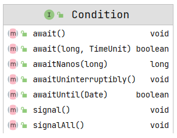

# Condition

[TOC]


### condition 详解及相比于传统线程并发模式的改进

传统上，我们可以通过 synchronized 关键字 ＋ wait + notify/notifyAll 来实现多个线程之间的协调与通信，整个过程都是由 JVM 来帮助我们实现的，开发者无需(也是无法)了解底层的实现细节。

从 JDK5 开始，并发包提供了 lock + Condition(主要是里面的 await 与 signal/signalAll )来实现多个线程之间的协调与通信，整个过程都是由开发者来控制的，而且相比于传统方式，更加灵活，功能也更加强大。

**Thread.sleep 与 await(或是 Object#wait() 方法)的本质区别**

 sleep 方法本质上不会释放锁，而 await 会释放锁，并且在 signal 后，还需要重新获得锁才能继续执行(该行为与 Object 的 wait 方法完全一致)。

### Condition 的 JavaDoc



**Condition 相当于将 Object 类中的 monitor 方法（wait/notify/notifyAll）方法插入到不同对象中，以实现让每个对象有多个等待集合 wait-sets 的效果**。 【传统方式是调用 wait 之后，所有线程都会进入该对象的唯一的一个等待集合中，但是 condition 可以将某几个线程放在一个等待集合中，另几个放在另一个等待集合】。通过任意一个 Lock 实现将他们组合起来，其中使用 Lock 替换掉 synchronized 修饰方法/代码块的使用，使用 Condition 替换掉 Object 中的那些监视器 monitor 方法。

Condition（也称之为条件队列/条件变量）提供了一种方式让线程挂起执行（类似于 wait）直到被另一个线程通知，这里的另一个线程满足某些状态条件变成了 true。由于在不同线程中发生这种共享状态信息的访问，因此其需要被保护，所以一个 lock 的某种形式需要关联到 condition 上。等待一个 condition 提供的关键属性是它以原子方式释放关联的锁并挂起当前线程，就想 Object 的 wait 方法。

**Condition 实例本质上绑定到 lock 上。要获取特定 Lock 实例的 Condition 实例，请使用 Lock 的newCondition() 方法。**【因此一个 lock 对象和 condition 对象是一对多的关系，因为每次通过 newCondition() 方法就获得一个 condition 对象】。

例如，假设我们有一个支持 put 和  take 方法的有界缓冲区。如果在空缓冲区上尝试 take，则线程将阻塞，直到某个项变为可用；如果在满缓冲区上尝试 put，则线程将阻塞，直到某个空间变为可用。我们希望保持 put 线程和 take 线程在单独的等待集中等待，这样当缓冲区中的项或空间可用时，我们就可以使用只通知单个线程的优化。 这可以通过使用两个 Condition 实例来实现。【见下面的代码】

（java.util.concurrent.ArrayBlockingQueue 类提供了这些功能，因此没有必要不使用类而像上面示例代码一样实现）

Condition 实现可以提供不同于 Object 监视方法的行为和语义，例如**保证通知的顺序，或者在执行通知时不需要持有锁。**如果一个实现提供了这种专门的语义，那么这个实现必须记录这些语义。

请注意，**Condition 实例只是普通对象，它们本身可以用作 synchronized 语句中的目标**，并且可以调用它们自己的监视器 Object#wait 和  Object#notify notification}方法。获取 Condition 实例的监视锁或使用其监视方法与获取与该 Condition}关联的 lock 或使用其 await 和 signal 方法没有指定的关系。为了避免混淆，**建议不要以这种方式使用 Condition实例**，除了它们自己的实现之外。【即 condition 也是一个普通的对象，其自身也是有 monitor 等，所以我们获取 condition 的 monitor 锁和使用 Condition 中的 wait/signal 方法没有任何关系】。

除非另有说明，否则为任何参数传递  null 值将导致抛出 NullPointerException。

**实施注意事项**

**在等待 Condition 时，通常允许发生虚假唤醒，作为对底层平台语义的让步。**

这对大多数应用程序几乎没有实际影响，因为 Condition 应该始终在循环中等待，测试正在等待的状态谓词。实现可以自由地消除虚假唤醒的可能性，

但建议应用程序程序员始终假设它们可以发生，因此始终在循环中等待。条件等待的三种形式（可中断、不可中断和定时）在某些平台上的易实现性和性能特征可能有所不同。尤其是，可能很难提供这些特性并维护特定的语义，例如排序保证。此外，中断线程的实际挂起的能力可能并不总是能够在所有平台上实现。

因此，实现不需要为所有三种形式的等待定义完全相同的保证或语义，也不需要支持中断线程的实际挂起。

一个实现需要清楚地记录每个等待方法提供的语义和保证，当一个实现确实支持线程挂起的中断时，它必须遵守这个接口中定义的中断语义。

由于中断通常意味着取消，并且对中断的检查通常不经常发生，所以实现可能会倾向于响应中断而不是正常的方法返回。即使可以显示中断发生在另一个可能已解除线程阻塞的操作之后，也是如此。实现应该记录这种行为。

### await() 方法

await() 方法包括 5 个相似的方法，首先分析无参的：

导致当前线程处于等待状态，直到被调用 signal 或者该线程被中断了。
调用 await 之后，与此 Condition 关联的锁被原子释放，当前线程无法进行线程调度，并且处于休眠状态，直到发生以下四种情况中的一种：

- 另一个线程调用当前 Condition 的 signal 方法，而当前线程恰好被选为要唤醒的线程； 
- 或者另一个线程为此 Condition 调用 signalAll方法；   
- 或者另一个线程中断了当前线程，并中断线程支持暂停；


- 或发生“虚假唤醒”。

在所有情况下，在该方法返回之前（继续往下执行），当前线程必须重新获取与该 Condition 相关联的锁。当线程返回时保证其持有此锁。    

如果当前线程：在进入此方法时设置了中断状态；或者在等待时被中断了，并且支持中断线程挂起，则抛出 InterruptedException ，并且当前线程的中断状态被清除。在第一种情况下，没有规定是否在锁定之前进行中断测试释放。
**实施注意事项**

调用此方法时，假定当前线程持有与此{@code Condition}关联的锁。这取决于执行情况，以确定是否是这种情况，如果不是，如何应对。通常，会抛出异常（例如 {@link IllegalMonitorStateException}），实现必须记录该事实。
与响应信号的正常方法返回相比，实现更倾向于响应中断。在这种情况下，实现必须确保信号被重定向到另一个等待线程（如果有）。

```java
package java.util.concurrent.locks;

import java.util.concurrent.TimeUnit;
import java.util.Date;


public interface Condition {
  
    void await() throws InterruptedException;

    /**
     * 等待不可中断
     * Causes the current thread to wait until it is signalled.
     *
     * <p>The lock associated with this condition is atomically
     * released and the current thread becomes disabled for thread scheduling
     * purposes and lies dormant until <em>one</em> of three things happens:
     * <ul>
     * <li>Some other thread invokes the {@link #signal} method for this
     * {@code Condition} and the current thread happens to be chosen as the
     * thread to be awakened; or
     * <li>Some other thread invokes the {@link #signalAll} method for this
     * {@code Condition}; or
     * <li>A &quot;<em>spurious wakeup</em>&quot; occurs.
     * </ul>
     *
     * <p>In all cases, before this method can return the current thread must
     * re-acquire the lock associated with this condition. When the
     * thread returns it is <em>guaranteed</em> to hold this lock.
     *
     * <p>If the current thread's interrupted status is set when it enters
     * this method, or it is {@linkplain Thread#interrupt interrupted}
     * while waiting, it will continue to wait until signalled. When it finally
     * returns from this method its interrupted status will still
     * be set.
     *
     * <p><b>Implementation Considerations</b>
     *
     * <p>The current thread is assumed to hold the lock associated with this
     * {@code Condition} when this method is called.
     * It is up to the implementation to determine if this is
     * the case and if not, how to respond. Typically, an exception will be
     * thrown (such as {@link IllegalMonitorStateException}) and the
     * implementation must document that fact.
     */
    void awaitUninterruptibly();

    /**
     * Causes the current thread to wait until it is signalled or interrupted,
     * or the specified waiting time elapses.
     *
     * <p>The lock associated with this condition is atomically
     * released and the current thread becomes disabled for thread scheduling
     * purposes and lies dormant until <em>one</em> of five things happens:
     * <ul>
     * <li>Some other thread invokes the {@link #signal} method for this
     * {@code Condition} and the current thread happens to be chosen as the
     * thread to be awakened; or
     * <li>Some other thread invokes the {@link #signalAll} method for this
     * {@code Condition}; or
     * <li>Some other thread {@linkplain Thread#interrupt interrupts} the
     * current thread, and interruption of thread suspension is supported; or
     * <li>The specified waiting time elapses; or   // 增加一个一种：指定的等待时间已经过去了
     * <li>A &quot;<em>spurious wakeup</em>&quot; occurs.
     * </ul>
     *
     * <p>In all cases, before this method can return the current thread must
     * re-acquire the lock associated with this condition. When the
     * thread returns it is <em>guaranteed</em> to hold this lock.
     *
     * <p>If the current thread:
     * <ul>
     * <li>has its interrupted status set on entry to this method; or
     * <li>is {@linkplain Thread#interrupt interrupted} while waiting
     * and interruption of thread suspension is supported,
     * </ul>
     * then {@link InterruptedException} is thrown and the current thread's
     * interrupted status is cleared. It is not specified, in the first
     * case, whether or not the test for interruption occurs before the lock
     * is released.
     *
     * 该方法会返回一个近似的纳秒时间，改时间是剩余的响应时间（如设定 500纳秒，但是 200 纳秒之后就相应了，则返回300）。如果返回值小于或者等于 0则表示超时了。
     * <p>The method returns an estimate of the number of nanoseconds
     * remaining to wait given the supplied {@code nanosTimeout}
     * value upon return, or a value less than or equal to zero if it
     * timed out. This value can be used to determine whether and how
     * long to re-wait in cases where the wait returns but an awaited
     * condition still does not hold. Typical uses of this method take
     * the following form:
     *
     *  <pre> {@code
     * boolean aMethod(long timeout, TimeUnit unit) {
     *   long nanos = unit.toNanos(timeout);
     *   lock.lock();
     *   try {
     *     while (!conditionBeingWaitedFor()) {
     *       if (nanos <= 0L)
     *         return false;
     *       nanos = theCondition.awaitNanos(nanos);
     *     }
     *     // ...
     *   } finally {
     *     lock.unlock();
     *   }
     * }}</pre>
     *
     * <p>Design note: This method requires a nanosecond argument so
     * as to avoid truncation errors in reporting remaining times.
     * Such precision loss would make it difficult for programmers to
     * ensure that total waiting times are not systematically shorter
     * than specified when re-waits occur.
     *
     * <p><b>Implementation Considerations</b>
     *
     * <p>The current thread is assumed to hold the lock associated with this
     * {@code Condition} when this method is called.
     * It is up to the implementation to determine if this is
     * the case and if not, how to respond. Typically, an exception will be
     * thrown (such as {@link IllegalMonitorStateException}) and the
     * implementation must document that fact.
     *
     * <p>An implementation can favor responding to an interrupt over normal
     * method return in response to a signal, or over indicating the elapse
     * of the specified waiting time. In either case the implementation
     * must ensure that the signal is redirected to another waiting thread, if
     * there is one.
     *
     * @param nanosTimeout the maximum time to wait, in nanoseconds
     * @return an estimate of the {@code nanosTimeout} value minus
     * the time spent waiting upon return from this method.
     * A positive value may be used as the argument to a
     * subsequent call to this method to finish waiting out
     * the desired time.  A value less than or equal to zero
     * indicates that no time remains.
     * @throws InterruptedException if the current thread is interrupted
     *                              (and interruption of thread suspension is supported)
     */
    long awaitNanos(long nanosTimeout) throws InterruptedException;

    /**
     * Causes the current thread to wait until it is signalled or interrupted,
     * or the specified waiting time elapses. This method is behaviorally
     * equivalent to:
     * <pre> {@code awaitNanos(unit.toNanos(time)) > 0}</pre>
     *
     * @param time the maximum time to wait
     * @param unit the time unit of the {@code time} argument
     * @return {@code false} if the waiting time detectably elapsed
     * before return from the method, else {@code true}
     * @throws InterruptedException if the current thread is interrupted
     *                              (and interruption of thread suspension is supported)
     */
    boolean await(long time, TimeUnit unit) throws InterruptedException;

    /**
     * Causes the current thread to wait until it is signalled or interrupted,
     * or the specified deadline elapses.
     *
     * <p>The lock associated with this condition is atomically
     * released and the current thread becomes disabled for thread scheduling
     * purposes and lies dormant until <em>one</em> of five things happens:
     * <ul>
     * <li>Some other thread invokes the {@link #signal} method for this
     * {@code Condition} and the current thread happens to be chosen as the
     * thread to be awakened; or
     * <li>Some other thread invokes the {@link #signalAll} method for this
     * {@code Condition}; or
     * <li>Some other thread {@linkplain Thread#interrupt interrupts} the
     * current thread, and interruption of thread suspension is supported; or
     * <li>The specified deadline elapses; or
     * <li>A &quot;<em>spurious wakeup</em>&quot; occurs.
     * </ul>
     *
     * <p>In all cases, before this method can return the current thread must
     * re-acquire the lock associated with this condition. When the
     * thread returns it is <em>guaranteed</em> to hold this lock.
     *
     *
     * <p>If the current thread:
     * <ul>
     * <li>has its interrupted status set on entry to this method; or
     * <li>is {@linkplain Thread#interrupt interrupted} while waiting
     * and interruption of thread suspension is supported,
     * </ul>
     * then {@link InterruptedException} is thrown and the current thread's
     * interrupted status is cleared. It is not specified, in the first
     * case, whether or not the test for interruption occurs before the lock
     * is released.
     *
     *
     * <p>The return value indicates whether the deadline has elapsed,
     * which can be used as follows:
     *  <pre> {@code
     * boolean aMethod(Date deadline) {
     *   boolean stillWaiting = true;
     *   lock.lock();
     *   try {
     *     while (!conditionBeingWaitedFor()) {
     *       if (!stillWaiting)
     *         return false;
     *       stillWaiting = theCondition.awaitUntil(deadline);
     *     }
     *     // ...
     *   } finally {
     *     lock.unlock();
     *   }
     * }}</pre>
     *
     * <p><b>Implementation Considerations</b>
     *
     * <p>The current thread is assumed to hold the lock associated with this
     * {@code Condition} when this method is called.
     * It is up to the implementation to determine if this is
     * the case and if not, how to respond. Typically, an exception will be
     * thrown (such as {@link IllegalMonitorStateException}) and the
     * implementation must document that fact.
     *
     * <p>An implementation can favor responding to an interrupt over normal
     * method return in response to a signal, or over indicating the passing
     * of the specified deadline. In either case the implementation
     * must ensure that the signal is redirected to another waiting thread, if
     * there is one.
     *
     * @param deadline the absolute time to wait until
     * @return {@code false} if the deadline has elapsed upon return, else
     * {@code true}
     * @throws InterruptedException if the current thread is interrupted
     *                              (and interruption of thread suspension is supported)
     */
    boolean awaitUntil(Date deadline) throws InterruptedException;

    /**
     * Wakes up one waiting thread.
     *
     * <p>If any threads are waiting on this condition then one
     * is selected for waking up. That thread must then re-acquire the
     * lock before returning from {@code await}.
     *
     * <p><b>Implementation Considerations</b>
     *
     * <p>An implementation may (and typically does) require that the
     * current thread hold the lock associated with this {@code
     * Condition} when this method is called. Implementations must
     * document this precondition and any actions taken if the lock is
     * not held. Typically, an exception such as {@link
     * IllegalMonitorStateException} will be thrown.
     */
    void signal();

    /**
     * 唤醒所有的等待线程
     * 任何在该 condition 上等待的线程都会被唤醒，每个线程在从 await 方法上返回前必须重新获取 锁（即全部被唤醒之后，只有一个线程能获取锁，所以只有一个线程能从
     * await 上返回，其他线程还是处于等待状态。因此线程被唤醒和可以继续执行不是一回事）
     * Wakes up all waiting threads.
     *
     * <p>If any threads are waiting on this condition then they are
     * all woken up. Each thread must re-acquire the lock before it can
     * return from {@code await}.
     *
     * <p><b>Implementation Considerations</b>
     *
     * <p>An implementation may (and typically does) require that the
     * current thread hold the lock associated with this {@code
     * Condition} when this method is called. Implementations must
     * document this precondition and any actions taken if the lock is
     * not held. Typically, an exception such as {@link
     * IllegalMonitorStateException} will be thrown.
     */
    void signalAll();
}
```

condition 使用标准示例（JavaDoc 文档中的）

```java
package com.gjxaiou.condition;

import java.util.concurrent.locks.Condition;
import java.util.concurrent.locks.Lock;
import java.util.concurrent.locks.ReentrantLock;

/**
 * @Author GJXAIOU
 * @Date 2021/3/19 20:15
 */
public class MyTest1 {

    final Lock lock = new ReentrantLock();
    // 调用同一个 lock 实例生成的两个 condition 对象。
    final Condition notFull = lock.newCondition();
    final Condition notEmpty = lock.newCondition();

    final Object[] items = new Object[100];
    int putptr, takeptr, count;

    public void put(Object x) throws InterruptedException {
        // 首先要获取锁
        lock.lock();
        try {
            while (count == items.length) {
                // 调用 await 进入等待状态，同时释放锁。同时放在 while 循环中，保证其它线程通过 signal
                //方法唤醒该线程，则该线程需要和其他线程争抢说，争抢到了才能执行。
                notFull.await();
            }
            items[putptr] = x;
            if (++putptr == items.length) {
                putptr = 0;
            }
            ++count;
            // 通知另一个线程，可以取出了。
            notEmpty.signal();
        } finally {
            lock.unlock();
        }
    }

    public Object take() throws InterruptedException {
        lock.lock();
        try {
            while (count == 0) {
                notEmpty.await();
            }
            Object x = items[takeptr];
            if (++takeptr == items.length) {
                takeptr = 0;
            }
            --count;
            notFull.signal();
            return x;
        } finally {
            lock.unlock();
        }
    }
}
```

### Condition 主要方法测试和应用场景

该类实现的例子的描述：实现对容器的放置和取出的操作，在这个操作过程中保证在某一个时刻只能有一个线程在进行使用和操作。

整体的过程就是在模拟synchronized关键字和wait方法以及notify方法（只不过上面是从字节码层面来解决这个问题）

该类实现的例子的描述：实现对容器元素的放置和取出的操作，在多个线程操作过程中保证在某一个时刻只能有一个线程在进行使用和操作。使用condition来实现操作（这个concurrentHashMap，以及使用Collections工具类来实现集合实现并发安全的操作）。

put 方法不断往后放置元素，take 方法不断往后取元素，然后置为 NULL，如果满了从头开始。如果整个数组全部满了之后则 put 线程需要等待 take 线程取出一个元素，反之一样。

=> 如果 put 线程数和 get 线程数相同，则最终结果均为 Null，如果数目不一致：如  10 个 put, 8 个 take，则最后两个有元素，如果 8 个 put，10 个 take，则最终结果全部为 null，但是程序无法退出，因为第九个/十个 take 线程都陷入 await 的循环中了。因为 8 个唤醒线程已经用完了，没有线程使用 signal 来唤醒了。

```java
package com.gjxaiou.condition;

import javax.lang.model.element.NestingKind;
import java.util.Arrays;
import java.util.concurrent.locks.Condition;
import java.util.concurrent.locks.Lock;
import java.util.concurrent.locks.ReentrantLock;
import java.util.stream.IntStream;

/**
 * @Author GJXAIOU
 * @Date 2021/3/20 12:52
 */
public class MyTest2 {

    public static void main(String[] args) {
        // 创建线程
        BoundedContainer boundedContainer = new BoundedContainer();

        IntStream.range(0, 10).forEach(i -> new Thread(() -> {
            try {
                boundedContainer.take();
            } catch (InterruptedException exception) {
                exception.printStackTrace();
            }
        }).start());
        
        IntStream.range(0, 10).forEach(i -> new Thread(() -> {
            try {
                boundedContainer.put("hello");
            } catch (InterruptedException exception) {
                exception.printStackTrace();
            }
        }).start());
    }
}

class BoundedContainer {

    // 定义一个有界数组存放元素
    private String[] elements = new String[10];

    // 定义一个  lock 对象，因为针对该数组不能有任意两个数组同时进行操作，无论是放放还是放拿还是拿拿都不行
    private Lock lock = new ReentrantLock();

    // 因为针对两个动作：拿和放都需要一定的条件，需要需要两个 condition
    // 全空的时候 拿线程不能进行，全满的时候放置线程不能进行
    private Condition notEmptyCondition = lock.newCondition();
    private Condition notFullCondition = lock.newCondition();

    // 判断数组元素是不是满了，该值表示数组中已有元素数量
    private int elementCount;

    // 接下来放置元素的位置和接下来取元素位置
    private int putIndex;
    private int takeIndex;


    public void put(String element) throws InterruptedException {
        // 禁止任意两个线程同时执行 put 方法，所以首先要获取锁
        this.lock.lock();

        try {
            // 首先如果数组满了就需要等待
            while (this.elementCount == this.elements.length) {
                // 被 signal 唤醒之后会再次判断，如果为真则表示有位子放置了
                notFullCondition.await();
            }
            elements[putIndex] = element;
            if (++putIndex == this.elements.length) {
                putIndex = 0;
            }
            ++elementCount;
            System.out.println("put method" + Arrays.toString(elements));

            // 通知取元素可以取了
            notEmptyCondition.signal();

        } finally {
            lock.unlock();
        }
    }

    public String take() throws InterruptedException {
        lock.lock();

        try {
            while (this.elementCount == 0) {
                notEmptyCondition.await();
            }
            String res = elements[takeIndex];
            elements[takeIndex] = null;
            if (++takeIndex == this.elements.length) {
                takeIndex = 0;
            }
            --elementCount;
            System.out.println("take method" + Arrays.toString(elements));

            // 通知放置元素线程
            notFullCondition.signal();
            return res;
        } finally {
            lock.unlock();
        }
    }
}
```

