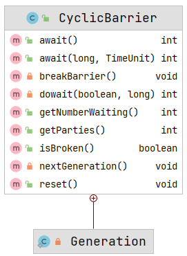
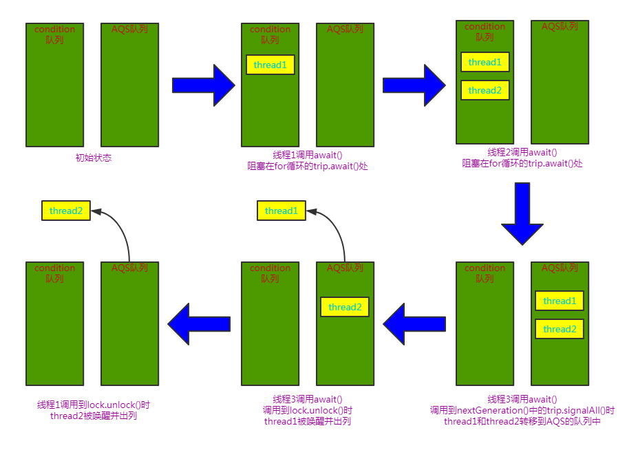

# CyclicBarrier

[TOC]

## 一、简介

CyclicBarrier「回环栅栏」，它会阻塞一组线程直到这些线程同时达到某个条件才继续执行。即若干个线程相互等待，都到达之后一起继续执行。各个线程之间没有主次之分。

**CyclicBarrier 和 CountDownLatch 区别**：

- CyclicBarrier 是可以重复使用的。因为 CountDownLatch 中的计数器归零之后就不动了，但是 CyclicBarrier 中的计数器每次满足数量的线程执行后，计数器会重置为原来状态，即可以实现**每**几个线程一起执行。
- 两者都能实现阻塞一组线程等待被唤醒；
- CyclicBarrier 是最后一个线程到达时自动唤醒；CountDownLatch 则需要显式的调用 `countDown()` 方法触发事件。
- CyclicBarrier 是通过重入锁及其条件锁实现的，后者是直接基于AQS实现的；
- CyclicBarrier 只能实现多个线程到达栅栏处一起运行，CountDownLatch 不仅可以实现多个线程等待一个线程条件成立，还能实现一个线程等待多个线程条件成立；

## 二、使用示例

**使用示例一**：

```java
package com.gjxaiou.cyclicBarrier;

import java.util.Random;
import java.util.concurrent.BrokenBarrierException;
import java.util.concurrent.CyclicBarrier;

public class MyTest1 {
    public static void main(String[] args) {

        // 参数表示参与方，即只有 3 个线程都到达了屏障才能继续往下执行
        CyclicBarrier cyclicBarrier = new CyclicBarrier(3);

        for (int i = 0; i < 3; i++) {
            new Thread(() -> {
                try {
                    // 每个线程随机睡眠一段时间
                    Thread.sleep((int) (Math.random() * 2000));

                    // 产生一个 0 ~ 500 之间的整数
                    int randomInt = new Random().nextInt(500);
                    System.out.println("hello" + randomInt);

                    // 检查一下是不是满足都到屏障了
                    // await 首先会等待屏障前是不是已经有三个线程了，如果没有则在屏障前等待。但是如果是第三个线程在调用 await 方法的一刹那会发现包括自己共有 3 个线程了则通知所有线程一起往下运行。当然唤醒的时候线程由先后顺序，所以每次执行 world + 随机数可能先后顺序都不一样。
                    cyclicBarrier.await();

                    System.out.println("world" + randomInt);

                } catch (InterruptedException | BrokenBarrierException exception) {
                    exception.printStackTrace();
                }
            }).start();
        }
    }
}
```

输出结果：

```java
hello423
hello403
hello143
world143
world423
world403
```

**示例程序二：**

使用 CyclicBarrier 使得三个线程保持同步，当三个线程同时到达`cyclicBarrier.await();`处大家再一起往下运行。

```java
package com.gjxaiou;

import java.util.concurrent.BrokenBarrierException;
import java.util.concurrent.CyclicBarrier;
import java.util.stream.IntStream;

public class CyclicBarrierTest {

	public static void main(String[] args) {
		CyclicBarrier cyclicBarrier = new CyclicBarrier(3);

		IntStream.range(0, 3).forEach(i ->
				new Thread(() -> {
					System.out.println(Thread.currentThread().getName() + "线程开始");
					try {
						cyclicBarrier.await();
					} catch (BrokenBarrierException e) {
					} catch (InterruptedException e) {
						e.printStackTrace();
					}
					System.out.println(Thread.currentThread().getName() + "线程结束");
				}).start());
	}
}
// output:
Thread-0线程开始
Thread-1线程开始
Thread-2线程开始
Thread-2线程结束
Thread-0线程结束
Thread-1线程结束
```

**CyclicBarrier 的重用性示例**：

共有两轮，然后每轮必须有 3 个线程到达屏障之后才能继续往下执行

```java
package com.gjxaiou.cyclicBarrier;

import java.util.Random;
import java.util.concurrent.BrokenBarrierException;
import java.util.concurrent.CyclicBarrier;

public class MyTest2 {

    public static void main(String[] args) {

        CyclicBarrier cyclicBarrier = new CyclicBarrier(3);
        for (int n = 0; n < 2; n++) {
            for (int i = 0; i < 3; i++) {
                new Thread(() -> {
                    try {
                        Thread.sleep((int) (Math.random() * 2000));
                        int randomInt = new Random().nextInt(500);
                        System.out.println("hello" + randomInt);

                        cyclicBarrier.await();

                        System.out.println("world" + randomInt);
                    } catch (InterruptedException | BrokenBarrierException exception) {
                        exception.printStackTrace();
                    }
                }).start();
            }
        }
    }
}
```

输出结果：每 6 个是一个阶段。

```java
hello169
hello351
hello328
world328
world169
world351
hello16
hello336
hello448
world448
world16
world336
```

CyclicBarrier 的另一个构造函数为：

```java
public CyclicBarrier(int parties, Runnable barrierAction) {
```

其中第二个参数是一个 Runnable 实例，即当 parties 中的最后一个线程到达屏障时候会触发一次该操作。例如将上述第一个代码的构造换为：

```java
 CyclicBarrier cyclicBarrier = new CyclicBarrier(3, () ->{
            System.out.println("hello  world  GJXAIOU");
        });
```

则输出结果为：

```java
hello427
hello296
hello241
hello  world  GJXAIOU
world241
world427
world296
```

**示例三**：

await 构造方法中设置超时时间：`public int await(long timeout, TimeUnit unit)`，即将每个线程的等待超时时间进行设置，示例如下：

```java
package com.gjxaiou.cyclicBarrier;

import java.util.Random;
import java.util.concurrent.BrokenBarrierException;
import java.util.concurrent.CyclicBarrier;
import java.util.concurrent.TimeUnit;
import java.util.concurrent.TimeoutException;

public class MyTest3 {

    public static void main(String[] args) {

        CyclicBarrier cyclicBarrier = new CyclicBarrier(3, () -> {
            System.out.println("hello  world  GJXAIOU");
        });
        for (int i = 0; i < 3; i++) {
            new Thread(() -> {
                try {
                    Thread.sleep((int) (Math.random() * 2000));
                    int randomInt = new Random().nextInt(500);
                    System.out.println("hello" + randomInt);

                    cyclicBarrier.await(20, TimeUnit.MILLISECONDS);

                    System.out.println("world" + randomInt);
                } catch (InterruptedException | BrokenBarrierException exception) {
                    exception.printStackTrace();
                } catch (TimeoutException e) {
                    e.printStackTrace();
                }
            }).start();
        }
    }
}
```

执行结果为：

```java
hello104
java.util.concurrent.TimeoutException
	at java.util.concurrent.CyclicBarrier.dowait(CyclicBarrier.java:257)
	at java.util.concurrent.CyclicBarrier.await(CyclicBarrier.java:435)
	at com.gjxaiou.cyclicBarrier.MyTest3.lambda$main$1(MyTest3.java:23)
	at java.lang.Thread.run(Thread.java:748)
hello475
java.util.concurrent.BrokenBarrierException
	at java.util.concurrent.CyclicBarrier.dowait(CyclicBarrier.java:207)
	at java.util.concurrent.CyclicBarrier.await(CyclicBarrier.java:435)
	at com.gjxaiou.cyclicBarrier.MyTest3.lambda$main$1(MyTest3.java:23)
	at java.lang.Thread.run(Thread.java:748)
hello272
java.util.concurrent.BrokenBarrierException
	at java.util.concurrent.CyclicBarrier.dowait(CyclicBarrier.java:207)
	at java.util.concurrent.CyclicBarrier.await(CyclicBarrier.java:435)
	at com.gjxaiou.cyclicBarrier.MyTest3.lambda$main$1(MyTest3.java:23)
	at java.lang.Thread.run(Thread.java:748)
```

具体异常原因可以看上面的 CyclicBarrier 中的 await 方法分析；

CountDownLatch 超时了则主线程正常执行，而 CyclicBarrier 会抛出异常，因为 CyclicBarrier 各个线程之间关系平等，一般都到达之后将他们的数据进行一个整合，有一个超时则这些线程汇聚的值就不准确了，本质上就没用了。

## 三、源码分析



### （一）主要内部类

Generation「代」，用于控制 CyclicBarrier 的循环使用，每次屏障被冲破之后就相当于进入了下一个 generation。比如，上面示例中的三个线程完成后进入下一代，继续等待三个线程达到栅栏处再一起执行，而 CountDownLatch 则做不到这一点，CountDownLatch 是一次性的，无法重置其次数。

```java
private static class Generation {
    boolean broken = false;
}
```

### （二）主要属性

```java
// 重入锁
private final ReentrantLock lock = new ReentrantLock();
// 条件锁，名称为 trip，绊倒的意思，可能是指线程来了先绊倒，等达到一定数量了再唤醒
private final Condition trip = lock.newCondition();
// 需要等待的线程数量
private final int parties;
// 当唤醒的时候执行的命令
private final Runnable barrierCommand;
// 代
private Generation generation = new Generation();
// 当前这一代还需要等待的线程数
private int count;
```

通过属性可以看到，CyclicBarrier 内部是通过重入锁的条件锁来实现的，假如初始时`count = parties = 3`，当第一个线程到达栅栏处，count 减 1，然后把它加入到 Condition 的队列中，第二个线程到达栅栏处也是如此，第三个线程到达栅栏处，count 减为 0，调用 Condition 的 signalAll() 通知另外两个线程，然后把它们加入到 AQS 的队列中，等待当前线程运行完毕，调用 lock.unlock() 的时候依次从 AQS 的队列中唤醒一个线程继续运行，也就是说实际上三个线程先依次（排队）到达栅栏处，再依次往下运行。

### （三）构造方法

```java
public CyclicBarrier(int parties, Runnable barrierAction) {
    if (parties <= 0) throw new IllegalArgumentException();
    // 初始化 parties，即参与的线程数目
    this.parties = parties;
     // count 为仍然在等待的参与方数量，扮演计数器的作用。当一个周期结束开始新的周期的时候，count 重新被赋值为 parties。parties 为 final 不可变，count 可变。
    this.count = parties;
    // 初始化都到达栅栏处执行的命令
    this.barrierCommand = barrierAction;
}

public CyclicBarrier(int parties) {
    this(parties, null);
}
```

### （四）await()方法

每个需要在栅栏处等待的线程都需要显式地调用 `await()`方法等待其它线程的到来。

等待，直到所有的参与方均在屏障前调用了 await 方法。 如果当前线程不是最后一个到达的，那么其不会被调度，直到下面情况之一发生： 

- 最后一个线程到达 
- 其它线程中断了当前线程 
- 其它线程中断了其中一个已经等待的线程 
- 其它线程上等待通过该屏障的等待时间过了
-  其它线程在该屏障上重置了

```java
// 当然还有一个带超时时间的 await()，如果发生超时时间，屏障 Barrier 就会被破坏，当 Barrier 被破坏就会触发下面 BrokenBarrierException 异常。
public int await() throws InterruptedException, BrokenBarrierException {
    try {
        // 调用 dowait 方法，不需要超时
        return dowait(false, 0L);
    } catch (TimeoutException toe) {
        throw new Error(toe); // cannot happen
    }
}


private int dowait(boolean timed, long nanos)
    throws InterruptedException, BrokenBarrierException,
           TimeoutException {
    final ReentrantLock lock = this.lock;
    // 加锁
    lock.lock();
    try {
        // 当前代
        final Generation g = generation;
        
        // 检查
        if (g.broken)
            throw new BrokenBarrierException();

        // 中断检查
        if (Thread.interrupted()) {
            breakBarrier();
            throw new InterruptedException();
        }
        
        // count 的值减 1
        int index = --count;
        // 如果数量减到 0 了，index 为 0 则所有线程都到达了屏障前面【最后一个线程走这里】
        if (index == 0) {  // tripped
            // 是否执行了后面的 Runnable 方法
            boolean ranAction = false;
            // 执行 Runnable 的调用
            try {
                // 如果初始化的时候传了命令，这里执行
                final Runnable command = barrierCommand;
                if (command != null)
                    command.run();
                ranAction = true;
                // 调用切换到下一代方法
                nextGeneration();
                return 0;
            } finally {
                if (!ranAction)
                    breakBarrier();
            }
        }

        // 这个循环只有非最后一个线程可以走到
        for (;;) {
            try {
                // 如果没有设置超时时间
                if (!timed)
                    // 调用 condition 的 await() 方法，trip 是 condition 的实例，等待条件变量 condition 发出 signal 或者 signalAll
                    trip.await();
                else if (nanos > 0L)
                    // 超时等待方法
                    nanos = trip.awaitNanos(nanos);
            } catch (InterruptedException ie) {
                if (g == generation && ! g.broken) {
                    breakBarrier();
                    throw ie;
                } else {
                    // We're about to finish waiting even if we had not
                    // been interrupted, so this interrupt is deemed to
                    // "belong" to subsequent execution.
                    Thread.currentThread().interrupt();
                }
            }
            
            // 检查
            if (g.broken)
                throw new BrokenBarrierException();

            // 正常来说这里肯定不相等
            // 因为上面打破栅栏的时候调用 nextGeneration() 方法时generation的引用已经变化了
            if (g != generation)
                return index;
            
            // 超时检查
            if (timed && nanos <= 0L) {
                breakBarrier();
                throw new TimeoutException();
            }
        }
    } finally {
        lock.unlock();
    }
}


private void nextGeneration() {
    // 调用 condition 的 signalAll() 将其队列中的等待者全部转移到 AQS 的队列中
    trip.signalAll();
    // 重置 count
    count = parties;
    // 进入下一代
    generation = new Generation();
}
```

`dowait()` 方法里的整个逻辑分成两部分：

- 最后一个线程走上面的逻辑，当 count 减为 0 的时候，打破栅栏，它调用 `nextGeneration()` 方法通知条件队列中的等待线程转移到 AQS 的队列中等待被唤醒，并进入下一代。
- 非最后一个线程走下面的 for 循环逻辑，这些线程会阻塞在 condition 的 await() 方法处，它们会加入到条件队列中，等待被通知，当它们唤醒的时候已经更新换“代”了，这时候返回。

## 图解



#### 关于cyclicBarrier的底层执行流程

- 初始化 CyclicBarrier 中的各种成员变量，包括 parties、 count 以及 Runnable (可选)

- 当调用await方法时，底层会先检查计数器是否已经归零，如果是的话，那么就首先执行可选的Runnable,接下来开始下一个generation;

- 在下一个分代中，将会重置count值为parties,并且创建新的Generation实例。

- 同时会调用 Condition 的 signalAll 方法，唤醒所有在屏障前面等待的线程，让其开始继续执行。

- 如果计数器没有归零，那么当前的调用线程将会通过 Condition 的 await 方法，在屏障前进行等待。

- 以上所有执行流程均在 lock 锁的控制范围内，不会出现并发情况。（公用的数据是 count，通过 lock 来实现和避免多线程的情况）。

## 总结

- CyclicBarrier 会使一组线程阻塞在 await() 处，当最后一个线程到达时唤醒（只是从条件队列转移到 AQS队列中）前面的线程大家再继续往下走；

- CyclicBarrier 不是直接使用 AQS 实现的一个同步器；

- CyclicBarrier 基于 ReentrantLock 及其 Condition 实现整个同步逻辑；