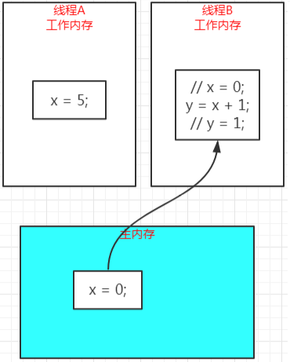

# Volatile

[TOC]

volatile 可以说是 Java 虚拟机提供的最轻量级的同步机制了。

## 一、volatile 关键字的作用

- 实现 long/double 类型变量的原子**写操作**

    因为 JVM 中的 long 和 double 都是占 64 位，针对 32 位机器，其可能分成低 32 位和高 32 位两个步骤进行分别填充赋值。导致其非原子性。

    

    正确使用示例：

    ```java
    // 使用 volatile 或者 atomicLong/Integer 保证原子性更新数据。
    volatile double a = 1.0;
    AtomicLong b = new AtomicLong(1);
    ```

    > 没有 AtomicFloat 和 AtomicDouble 的原因可以查看[stackoverflow](https://stackoverflow.com/questions/5505460/java-is-there-no-atomicfloat-or-atomicdouble)。

- 防止指令重排序

- 实现变量的可见性

    当使用 volatile 修饰变量时，应用就不会从寄存器中获取该变量的值，而是从内存（高速缓存）中获取。这样一个线程能立刻看到另一个线程更改的数据。

    > 因为程序在读取一个变量值的时候不会直接从内存中进行读取，而是从 CPU 中的寄存器中读取。当使用 volatile 修饰一个变量的时候，编译器就不会将该变量放置到寄存器中进行存储。对变量的访问和修改都需要访问内存。但是这样同样会带来一定程度上的性能的损失。

## 二、Java 内存模型(Java Memory Model, JMM) 

JMM 主要规定以下问题，但是最终实现需要各个 JVM 来自定义实现。下面提到的变量主要是成员变量或者静态变量，因为局部变量不存在这些问题。

- 变量的原子性问题

- 变量的可见性问题

- 变量修改的时序性问题。

### happen-before 重要规则

happen-before 定义在 JMM 规划中，在多核的场景下，某个处理器对某个变量的修改操作**最终**是可以被其它处理器所知晓的，但是没确定什么时候能获取到。不**保证实时一致性，只能保证最终一致性。**

happen-before 原则一方面具有传递性，同时除了第一个在单个线程内部，其它均是在多个线程之间。

- 顺序执行规则(限定在单个线程上的) ：该线程的每个动作都 happen-before 它的后面的动作。

    > 指令重排序和 happen-before 是不矛盾的，只要不违反 happen-before 原则是允许指令重排序的，比如一个线程执行 a/b/c 三条语句，则 a  happen-before b happen before c，但是并不表示 a 一定会在 b 之前执行，因为如果  a  和 b 之间操作的语句没有任何关系的话，JIT 编译器是允许他们进行指令重排序的。但是如果有有先后关系则不会进行指令重排序。

- 隐式锁(monitor) 规则：针对同一把锁 unlock happen- before lock, 之前的线程对于同步代码块的所有执行结果对于后续获取同一把锁的线程来说都是可见的。

- volatile读写规则：对于一个volatile变量的写操作一定会happen-before后续对该变量的读操作。

- 多线程的启动规则：Thread对象的start方法happen-before该线程run方法中的任何一个动作，包括在其中启动的任何子线程。 （可以在一个线程中启动另一个线程使其作为当前线程的子线程使用，即可以在父线程的 run 方法中启动另一个线程，则子线程在执行其 run 方法前可以看到父线程在执行 start 方法前的所有操作结果）保证父线程所作的一切对子线程都是可见的。

- 多线程的终正规则：一个线程启动了一个子线程，并且调用了子线程的join方法则该线程会等待其子线程结束，那么当子线程结束后，父线程的接下来的所有操作都可以看到子线程run方法中的执行结果。

- 线程的中断规则：可以调用 interrupt 方法来中断线程，这个调用 happen-before 对该线程中断的检查(isInterrupted) 。

##  三、使用方式

```java
volatile int a = b + 2;    // 错误示例，无法保证对 a 的原子性。这里的赋值包含两个步骤：首先实现 b + 2，然后将其结果赋值给了 a。因为第一个线程获取 b 进行了 + 2，第二个线程也获取了 b，则 b 的值都不一样。【b + 2，其实是两步，先读取 b 然后进行 + 2】因为这里是两条指令进行一个操作。

volatile int a = a++;     // 同样需要两条指令来完成相应的操作

volatile int count = 1;    // 正确示例

volatile boolean flag = false; // 正确示例

volatile Date date = new Date( );// 这个如果是多线程的话也可能出现问题，因为 new Date() 首先需要在堆上创建一个 Date 对象的存储并生成一些数据，然后返回一个引用给左侧的 date。加上 volatile 仅仅能保证将引用值赋值给 date 是一个原子操作。因为通常以上操作都是在一个方法中，只能被一个线程执行，所以没有问题。
```

如果要实现 volatile 写操作的原子性，那么在等号右侧的赋值变量中就不能出现被多线程所共享的变量，哪怕这个变量也是个 volatile 也不可以。

## 四、可见性

可见性是指当一个线程修改了共享变量的值，其它线程能立即感知到这种变化。

而普通变量无法做到立即感知这一点，变量的值在线程之间的传递均需要通过主内存来完成，比如，线程 A修改了一个普通变量的值，然后向主内存回写，另外一条线程 B 只有在线程 A 的回写完成之后再从主内存中读取变量的值，才能够读取到新变量的值，也就是新变量才能对线程 B 可见。

在这期间可能会出现不一致的情况，比如：

- 线程 A 并不是修改完成后立即回写；



（线路 A 修改了变量 x 的值为 5，但是还没有回写，线程 B 从主内存读取到的还旧值 0）

- 线程 B 还在用着自己工作内存中的值，而并不是立即从主内存读取值；

    线程 A 回写了变量 x 的值为 5 到主内存中，但是线程 B 还没有读取主内存的值，依旧在使用旧值 0 在进行运算。


基于以上两种情况，所以，普通变量都无法做到立即感知这一点。

volatile 可以保证可见性，java 内存模型规定，volatile 变量的每次修改都必须立即回写到主内存中，volatile变量的每次使用都必须从主内存刷新最新的值。


volatile 的可见性可以通过下面的示例体现：

```java
public class VolatileTest {
    // public static int finished = 0;
    public static volatile int finished = 0;

    private static void checkFinished() {
        while (finished == 0) {
            // do nothing
        }
        System.out.println("finished");
    }

    private static void finish() {
        finished = 1;
    }

    public static void main(String[] args) throws InterruptedException {
        // 起一个线程检测是否结束
        new Thread(() -> checkFinished()).start();

        Thread.sleep(100);

        // 主线程将 finished 标志置为1
        finish();

        System.out.println("main finished");

    }
}
```

在上面的代码中，针对 finished 变量，使用 volatile 修饰时这个程序可以正常结束，不使用则程序永不退出。**因为不使用 volatile 修饰时，checkFinished() 所在的线程每次都是读取的它自己工作内存中的变量的值，这个值一直为 0，所以一直都不会跳出 while 循环。**

使用 volatile 修饰时，`checkFinished()` 所在的线程每次都是从主内存中加载最新的值，当 finished 被主线程修改为 1 的时候，它会立即感知到，进而会跳出 while 循环。

**可见性测试二**

使用多线程可能出现死循环：

```java
package com.gjxaiou.volatileUse;

public class MyTest1 {
	public static void main(String[] args) {
		try {
			MyThread1 myThread1 = new MyThread1();
			myThread1.start();
			Thread.sleep(1000);
			myThread1.setRunning(false);
			System.out.println("已经设置为 false");
		} catch (InterruptedException e) {
			e.printStackTrace();
		}
	}
}

class MyThread1 extends Thread {
	// private volatile boolean isRunning = true;
	private boolean isRunning = true;


	public boolean isRunning() {
		return isRunning;
	}

	public void setRunning(boolean running) {
		isRunning = running;
	}

	@Override
	public void run() {
		System.out.println("进入 run 方法");
		// 里面不能有任何代码
		while (isRunning == true) {
		}
		System.out.println("线程被终止了");
	}
}
```

输出结果为：

```java
进入 run 方法
已经设置为 false
```

出现了死循环，并且线程并未销毁，同时程序一直处于执行状态。

在启动 MyThread1 线程时，变量 `private boolean isRunning = true;` 存在于**公共堆栈和线程的私有栈**中，线程运行后一直在线程的是由堆栈中取得的 isRunning 的值是 true，而代码 `myThread1.setRunning(false);`执行之后更新的是公共堆栈中的 isRunning 变量，修改为 false，操作的是两块内存地址中的数据，所以线程一直处于死循环中。


本质：私有堆栈中的值和公共堆栈中的值不同步造成的，通过在该变量前面加 volatile，是的当线程访问 isRunning 变量时，强制从公共堆栈中取值。该种线程停止的方式即：使用退出标志使得线程正常退出。加上之后的输出为：

```java
进入 run 方法
已经设置为 false
线程被终止了
```

方式二：使用 synchronized，因为 synchronized 可以使得多个线程访问同一个资源具有同步性，同时使线程工作内存中的私有变量和公共内存中的变量同步的可见性。主要修改 run 方法，返回结果如上：

```java
@Override
public void run() {
    String anyString = new String();
    System.out.println("进入 run 方法");
    // 里面不能有任何代码
    while (isRunning == true) {
        synchronized (anyString){
        }
    }
    System.out.println("线程被终止了");
}
```

## 五、禁止重排序

**Java 中的有序性：如果在本线程中观察，所有的操作都是有序的【线程内表现为串行的语义】；如果在另一个线程中观察，所有的操作都是无序的【指「指令重排序」和「工作内存和主内存同步延迟」现象】。**

普通变量仅仅会保证在该方法的执行过程中所有依赖赋值结果的地方都能获得正确的结果，而不能保证变量赋值操作的顺序与程序代码中的执行顺序一致，因为一个线程的方法执行过程中无法感知到这点，这就是「线程内表现为串行的语义」。

比如，下面的代码：

```java
// 两个操作在一个线程
int i = 0;
int j = 1;
```

上面两句话没有依赖关系，JVM 在执行的时候为了充分利用 CPU 的处理能力，可能会先执行`int j = 1;`这句，也就是重排序了，但是在线程内是无法感知的。单线程下重排序可能没有影响，但是多线程下会造成影响：

```java
public class VolatileTest3 {
    private static Config config = null;
    private static volatile boolean initialized = false;

    public static void main(String[] args) {
        // 线程 1 负责初始化配置信息
        new Thread(() -> {
            config = new Config();
            config.name = "config";
            initialized = true;
        }).start();

        // 线程 2 检测到配置初始化完成后，使用配置信息做一些操作
        new Thread(() -> {
            while (!initialized) {
                LockSupport.parkNanos(TimeUnit.MILLISECONDS.toNanos(100));
            }

            // do sth with config
            String name = config.name;
        }).start();
    }
}

class Config {
    String name;
}
```

在这个例子中，如果 initialized 不使用 volatile 来修饰，可能就会出现重排序，比如在初始化配置之前把initialized 的值设置为了 true，这样线程 2 读取到这个值为 true了，就去使用配置了，这时候可能就会出现错误。（此处这个例子只是用于说明重排序，实际运行时很难出现。）

**所以，重排序是站在另一个线程的视角的，因为在本线程中，是无法感知到重排序的影响的。**

而 volatile 变量是禁止重排序的，它能保证程序实际运行是按代码顺序执行的。

## 六、缺陷：无法保证原子性

```java
package com.gjxaiou.volatileUse;

import java.util.concurrent.CountDownLatch;
import java.util.stream.IntStream;

public class MyTest3 {
	public static volatile int counter = 0;

	public static void increment() {
		counter++;
	}

	public static void main(String[] args) throws InterruptedException {
		CountDownLatch countDownLatch = new CountDownLatch(100);
        // 启动 100 个线程分别对 counter 自增 1000 次
		IntStream.range(0, 100).forEach(i -> new Thread(() -> {
			IntStream.range(0, 1000).forEach(j -> increment());
			countDownLatch.countDown();
		}).start());
		countDownLatch.await();
		System.out.println(counter);
	}
}
```

执行结果如下，永远达不到 100000：

```java
91506
```

分析 `increment()` 字节码如下：

```java
public static void increment();
    Code:
       0: getstatic     #2                  // Field counter:I
       3: iconst_1
       4: iadd
       5: putstatic     #2                  // Field counter:I
       8: return
```

counter++ 被分解成了四条指令：

- getstatic：获取 counter 当前的值并入栈

- iconst_1：入栈 int 类型的值 1

- iadd：将栈顶的两个值相加

- putstatic：将相加的结果写回到 counter 中

由于 counter 是 volatile 修饰的，所以 `getstatic` 会从主内存刷新最新的值，`putstatic` 也会把修改的值立即同步到主内存。但是中间的两步 `iconst_1` 和 `iadd` 在执行的过程中，可能 counter 的值已经被修改了，这时并没有重新读取主内存中的最新值，所以 volatile 在 counter++ 这个场景中并不能保证其原子性。

volatile 关键字只能保证可见性和有序性，不能保证原子性，要解决原子性的问题，还是只能通过加锁或使用原子类的方式解决。

因此，volatile关键字使用的场景：

- 运算的结果并不依赖于变量的当前值，或者能够确保只有单一的线程修改变量的值；

- 变量不需要与其他状态变量共同参与不变约束。

说白了，就是 volatile 本身不保证原子性，那就要增加其它的约束条件来使其所在的场景本身就是原子的。

比如：

```java
private volatile int a = 0;

// 线程A
a = 1;

// 线程B
if (a == 1) {
    // do sth
}
```

`a = 1;`这个赋值操作本身就是原子的，所以可以使用 volatile 来修饰。

可以使用 Atomic 解决单个元素操作的原子性，但是在有逻辑性的情况下，原子类的输出结果具有随机性，例如下面的 `addAndGet()` 方法是原子性执行的，但是方法和方法之间的调用不是原子性的，只能通过同步解决。

```java
package com.gjxaiou.volatileUse;

import java.util.concurrent.atomic.AtomicLong;
import java.util.stream.IntStream;

public class MyTest2 {
	public static void main(String[] args) {
		try {
			MyService myService = new MyService();
			IntStream.range(0, 4).forEach(i -> new Thread(
					myService::addNum).start());
			Thread.sleep(1000);
			// 获取该 atomic 值的最终值
			System.out.println(myService.atomicValue.get());
		} catch (InterruptedException e) {
			e.printStackTrace();
		}
	}
}

class MyService {
	public AtomicLong atomicValue = new AtomicLong();

	public void addNum() {
		// 下面两个方法每个都能保证执行的原子性，但是两个之间无法保证同步性，只能通过在方法上加 synchronized 实现
		System.out.println(Thread.currentThread().getName() + " + 100: " + atomicValue.addAndGet(100));
		System.out.println(Thread.currentThread().getName() + " + 1  : " + atomicValue.addAndGet(1));
	}
}
```

输出结果为：

```java
Thread-0 + 100: 100
Thread-3 + 100: 400
Thread-1 + 100: 200
Thread-1 + 1  : 403
Thread-2 + 100: 300
Thread-2 + 1  : 404
Thread-3 + 1  : 402
Thread-0 + 1  : 401
404
```

## 七、实现原理

禁止指令重排序和实现变量的可见性都是通过内存屏障（Memory Barrier）进行实现的。

JIT 编译器将源代码生成字节码的过程中可能会进行指令的重排序以提升执行性能。在单线程问题下没有任何问题。Volatile 可以防止指令重排序，代码示例如下：

内存屏障有两个作用：

- 阻止屏障两侧的指令重排序；

- 强制把写缓冲区/高速缓存中的数据回写到主内存，让缓存中相应的数据失效；

关于“内存屏障”的知识点，各主要观点如下：

- Doug Lea的[《The JSR-133 Cookbook for Compiler Writers》](http://g.oswego.edu/dl/jmm/cookbook.html)

- Martin Thompson的[《Memory Barriers/Fences》](https://mechanical-sympathy.blogspot.com/2011/07/memory-barriersfences.html)

    Martin Thompson 专注于把性能提升到极致，专注于从硬件层面思考问题，比如如何避免伪共享等，大牛！

- Dennis Byrne的[《Memory Barriers and JVM Concurrency》](https://www.infoq.com/articles/memory_barriers_jvm_concurrency)

    该文章基本上综合了上面的两种观点，并从汇编层面分析了内存屏障的实现。

我们还是来看一个例子来理解内存屏障的影响：

```java
public class VolatileTest4 {
    // a 不使用 volatile 修饰
    public static long a = 0;
    // 消除缓存行的影响
    public static long p1, p2, p3, p4, p5, p6, p7;
    // b 使用 volatile 修饰
    public static volatile long b = 0;
    // 消除缓存行的影响
    public static long q1, q2, q3, q4, q5, q6, q7;
    // c 不使用 volatile 修饰
    public static long c = 0;

    public static void main(String[] args) throws InterruptedException {
        new Thread(()->{
            while (a == 0) {
                long x = b;
            }
            System.out.println("a=" + a);
        }).start();

        new Thread(()->{
            while (c == 0) {
                long x = b;
            }
            System.out.println("c=" + c);
        }).start();

        Thread.sleep(100);

        a = 1;
        b = 1;
        c = 1;
    }
}
```

这段代码中，a 和 c 不使用 volatile 修饰，b 使用 volatile 修饰，而且我们在 a/b、b/c 之间各加入 7 个 long 字段消除伪共享的影响。伪共享知识见【前言】。

在 a 和 c 的两个线程的 while 循环中我们获取一下 b，你猜怎样？如果把`long x = b;`这行去掉呢？运行试试吧。

结论：volatile变量的影响范围不仅仅只包含它自己，它会对其上下的变量值的读写都有影响。

### （一）volatile 修饰写入操作

```java
int a = 1;
String s = " hello" ;

内存屏障(Release Barrier，释放屏障) // 这是 JVM 底层自己加的，类似 monitorenter 和 monitorexist
    
volatile boolean v = false; // 这是一个写操作，看到 volatile 会在前后自动加上屏障

写入操作内存屏障(store Barrier，存储屏障)
```

- Release Barrier 实现两点作用
    - **防止下面的 volatile 与上面的所有操作的指令重排序**；
    - 让内存屏障前的所有读/写操作都能立刻发布到其它所有的线程中，使得其它线程可以看到修改结果。（为了防止重排序就把上面的代码给执行掉），保证在 volatile 的修改之前，前面所有的读/写操作都已经被提交了，当前线程在执行 volatile 写操作时候，其它线程都可以看到 volatile 前面的所有的修改，这样就保证了其他的读线程对于当前写线程在写入 volatile 变量之前对共享变量的所有更新变量的看到顺序与源代码顺序一致，即防止指令重排序。

- Store Barrier∶重要作用是刷新处理器缓存，结果是可以确保该存储屏障之前一切（包括 volatile 修饰和非 volatile 修饰）的操作所生成的结果对于其他处理器来说都立刻可见。

### （二）volatile 修饰读操作

```java
内存屏障(Load Barrier，加载屏障)
     
volatile boolean v1 = v;

内存屏障(Acquire Barrier，获取屏障)

int a = 1;
String s = "hello" ;
```

- Load Barrier：可以刷新处理器缓存，同步其他处理器对该 volatile 变量的修改结果到自己的缓存中。

- Acquire Barrier：可以防止上面的 volatile 读取操作与下面的所有操作语句的指令重排序。

 **总结**：

对于 volatile 关键字变量的读写操作，本质上都是通过内存屏障来执行的。内存屏障兼具了防止指令重排序和实现变量内存的可见性的能力。

- 对于读取操作来说，volatile 可以确保该操作与其后续的所有读写操作都不会进行指令重排序。

- 对于修改操作来说，volatile 可以确保该操作与其上面的所有读写操作都不会进行指令重排序。

volatile 只能修饰原生类型，不能修饰非原生类型，如 ArrayList(对于非原生类型，如果是赋值将具备原子性的操作，但是创建这个对象什么的不具备原子性)

## 八、volatile 与锁的异同

**相似点**：Volatile 和锁都可以确保变量的内存可见性和防止指令重排序。

以 synchroned 修饰代码块为例，其防止指令重排序也是使用内存屏障实现，在两个指令的前后的内存屏障如下所示：

```java
monitorenter

内存屏障(Acquire Barrier, 获取屏障)

。。。。。

内存屏障(Release Barrier,释放屏障)

monitorexit
```

**不同点**：

- volatile 可以保证其修饰变量写操作的原子性，但是不具备锁的排他性（互斥性）。

    原子性可以理解为就是一条 CPU 指令，不能在分割了。而排他性是指像 synchronized 那样同一时刻只能有一个线程操作，而 volatile 修饰的变量可能同时有多个线程对其进行写操作。

- 使用锁可能会导致线程的上下文切换(内核态与用户态之间的切换)，但使用 volatile 则可以保证一直在用户态。

## 九、总结

- volatile 关键字可以保证可见性、有序性，但不能保证原子性。

- volatile 关键字的底层主要是通过内存屏障来实现的；

- **volatile 关键字的使用场景必须是场景本身就是原子的；**

