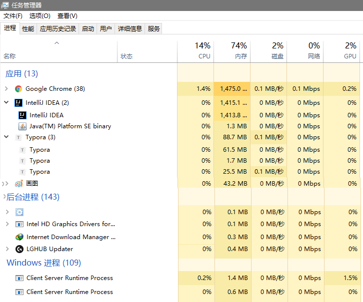
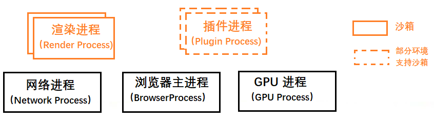
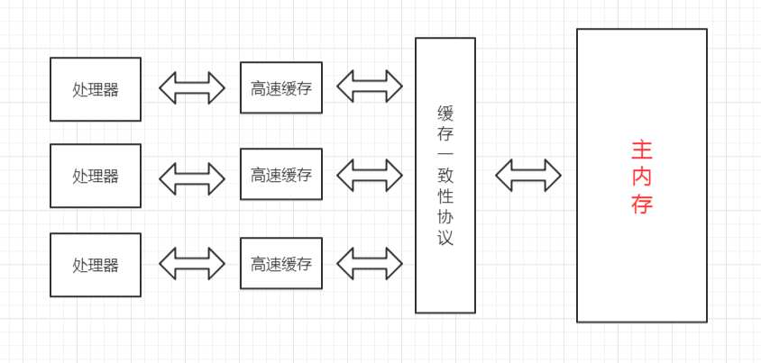
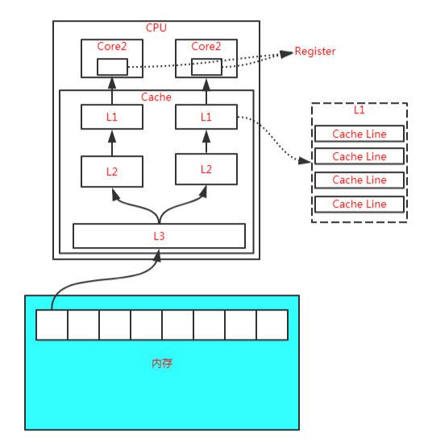

[TOC]

本质上线程是由操作系统帮助我们建立的，其是运行在 CPU 上（因为线程执行会占用 CPU 资源）。

并行处理：

并行处理就是同一时刻处理多个任务，如

任务1 计算 A = 1 + 1    任务 2 计算 B = 1 + 2     任务 3 计算 C  = 1 + 3     任务 4 显示最后的结果。

如果该程序使用单线程来执行，即将上述 4 个任务分为 4 步执行。如果采用多线程可以分为两步：第一步使用三个线程同时执行前三个任务，第二步执行第四个任务。并行处理提升了性能。

### 程序、进程和线程

程序本身只是指令、数据及其组织形式的描述，相当于一个名词。这些指令可以让 CPU 完成指定的任务。

进程是一次程序的执行，是程序（那些指令和数据）的真正运行实例。可以想像说是现在进行式。若干进程有可能与同一个程序相关系，且每个进程皆可以同步或异步的方式独立运行。现代计算机系统可在同一段时间内以进程的形式将多个程序加载到存储器中，并借由时间共享（或称时分复用），以在一个处理器上表现出同时运行的感觉。同样的，使用多线程技术（多线程即每一个线程都代表一个进程内的一个独立执行上下文）的操作系统或计算机体系结构，同样程序的**平行**线程，可在多CPU主机或网络上真正**同时**运行（在不同的CPU上）。**进程是系统进行资源分配和调度的一个独立单位，也是受操作系统管理的基本运行单元**。

用户下达运行程序的命令后，就会产生进程。同一程序可产生多个进程（一对多关系），以允许同时有多位用户运行同一程序，却不会相冲突。

进程需要一些资源才能完成工作，如CPU使用时间、存储器、文件以及  I/O 设备，且为依序逐一进行，也就是每个CPU核心任何时间内仅能运行一项进程。

进程与线程的区别：进程是计算机管理运行程序的一种方式，一个进程下可包含一个或者多个线程。线程可以理解为子进程。

多线程可以并行处理任务，但是线程不能单独存在，它是由进程来启动和管理的。而进程作为一个程序的运行实例。即启动一个程序的时候，操作系统会为该程序创建一块内存，用来存放代码、运行中的数据和一个执行任务的主线程，这样的一个运行环境称为：进程。

线程是依附于进程的，而进程中使用多线程并行处理能提升运算效率。两者之间的特点：

- 进程中任意一个线程执行出错，都会导致整个进程崩溃。
- 线程之间共享进程中的数据。
- 当一个进程关闭之后，操作系统会回收该进程所申请的所有资源。
- 进程之间相互隔离。（每个进程只能访问自己占有的数据，如果进程之间需要通信，使用进程间通信机制）。


如将 .java 程序编译之后形成 .class 文件， 操作系统启动一个  JVM 相当于创建了一个进程，在该虚拟机中加载 class 文件并且运行，在 class 文件中通过执行创建新线程的代码来执行具体任务。


**查看线程状态信息**：

- 方式一：使用  jps + jstack

    首先在 cmd 中输入 jps 可以查看当前 Java 进程（当前运行类对应的 Java 虚拟机进程）以及进程 id，然后使用 `jstack -l 进程id`  可以查看该进程下面线程状态。

- 方式二：jvisualvm 

    缺点：看不到线程运行的状态。

#### 详细理解

首先通过  `Ctrl + Alt + Delete` 可以查看电脑的任务管理器，然后点击「进程」选项。



可以看到名称为 `Google Chrome`共 38 个进程，为什么这么多

通过 Chrome 自带的任务管理器可以展示运行中 Chrome 使用的进程信息：`shift + Esc`


如果浏览器使用单进程，即浏览器的所有功能模块（包括网络、插件、JS 运行环境、渲染引擎和页面等）都运行在一个进程中，会导致浏览器不稳定、不流畅、不安全。

- 不稳定：某一个部分（插件、JS）崩溃会导致整个浏览器崩溃。
- 不流畅：如图所示，所有页面渲染、展示、JS 等都是运行在同一个线程中，即同一个时刻只能有一个模块可以执行。


目前 Chrome 进程架构



最新的 Chrome 浏览器包括：1 个浏览器（Browser）主进程、1 个 GPU 进程、1 个网络（NetWork）进程、多个渲染进程和多个插件进程。

**浏览器进程。**主要负责界面显示、用户交互、子进程管理，同时提供存储等功能。

**渲染进程。**核心任务是将 HTML、CSS 和 JavaScript 转换为用户可以与之交互的网页，排版引擎 Blink 和 JavaScript 引擎 V8 都是运行在该进程中，默认情况下，Chrome 会为每个 Tab 标签创建一个渲染进程。出于安全考虑，渲染进程都是运行在沙箱模式下。

**GPU 进程。**其实，Chrome 刚开始发布的时候是没有 GPU 进程的。而 GPU 的使用初衷是为了实现 3D CSS 的效果，只是随后网页、Chrome 的 UI 界面都选择采用 GPU 来绘制，这使得 GPU 成为浏览器普遍的需求。最后，Chrome 在其多进程架构上也引入了 GPU 进程。

**网络进程。**主要负责页面的网络资源加载，之前是作为一个模块运行在浏览器进程里面的，直至最近才独立出来，成为一个单独的进程。

**插件进程。**主要是负责插件的运行，因插件易崩溃，所以需要通过插件进程来隔离，以保证插件进程崩溃不会对浏览器和页面造成影响。

打开 1 个页面至少需要 1 个网络进程、1 个浏览器进程、1 个 GPU 进程以及 1 个渲染进程，共 4 个；如果打开的页面有运行插件的话，还需要再加上 1 个插件进程。

**问题**：

- 更高的资源占用：每个进程都包括公共基础结构的副本（如 JS 运行环境），消耗更多的内存资源。


## 一、基本概念

**并发**：同时拥有两个或者多个线程，如果程序在单核处理器上运行，多个线程将交替地换入或者换出内存，这些线程是同时“存在”的，每个线程都处于执行过程的某个状态，如果运行在多核处理器上，程序的每个线程都将分配到一个处理器核上，因此可以同时运行。

**高并发**：高并发（High Concurrency）是互联网分布式系统架构设计中必须考虑的因素之一，通常指通过设计保证系统能够**同时并行处理**很多请求。

**两者区别**

- 并发：多个线程操作相同的资源，保证线程安全，合理使用资源；
- 高并发：保证服务能够同时处理很多请求，提高程序性能。


## JMM 简介

Java 内存模型是在硬件内存模型上的更高层的抽象，它屏蔽了各种硬件和操作系统访问的差异性，保证了Java 程序在各种平台下对内存的访问都能达到一致的效果。

## 硬件内存模型

在正式讲解 Java 的内存模型之前，我们有必要先了解一下硬件层面的一些东西。

在现代计算机的硬件体系中，CPU 的运算速度是非常快的，远远高于它从存储介质读取数据的速度，这里的存储介质有很多，比如磁盘、光盘、网卡、内存等，这些存储介质有一个很明显的特点——距离 CPU 越近的存储介质往往越小越贵越快，距离 CPU 越远的存储介质往往越大越便宜越慢。

所以，在程序运行的过程中，**CPU 大部分时间都浪费在了磁盘IO、网络通讯、数据库访问上**，如果不想让 CPU 在那里白白等待，我们就必须想办法去把 CPU 的运算能力压榨出来，否则就会造成很大的浪费，而让CPU 同时去处理多项任务则是最容易想到的，也是被证明非常有效的压榨手段，这也就是我们常说的“并发执行”。

但是，让 CPU 并发地执行多项任务并不是那么容易实现的事，因为所有的运算都不可能只依靠 CPU 的计算就能完成，往往还需要跟内存进行交互，如读取运算数据、存储运算结果等。

前面我们也说过了，CPU 与内存的交互往往是很慢的，所以这就要求我们要想办法**在 CPU 和内存之间建立一种连接，使它们达到一种平衡，让运算能快速地进行，而这种连接就是我们常说的“高速缓存”。**

高速缓存的速度是非常接近 CPU 的，但是它的引入又带来了新的问题，现代的 CPU 往往是有多个核心的，每个核心都有自己的缓存，而多个核心之间是不存在时间片的竞争的，它们可以并行地执行，那么，怎么保证这些缓存与主内存中的数据的一致性就成为了一个难题。

**为了解决缓存一致性的问题，多个核心在访问缓存时要遵循一些协议，在读写操作时根据协议来操作，这些协议有MSI、MESI、MOSI等，它们定义了何时应该访问缓存中的数据、何时应该让缓存失效、何时应该访问主内存中的数据等基本原则。**



而随着 CPU 能力的不断提升，一层缓存就无法满足要求了，就逐渐衍生出了多级缓存。

按照数据读取顺序和 CPU 的紧密程度，CPU 的缓存可以分为一级缓存（L1）、二级缓存（L2）、三级缓存（L3），**每一级缓存存储的数据都是下一级的一部分**。

这三种缓存的技术难度和制作成本是相对递减的，容量也是相对递增的。

所以，在有了多级缓存后，程序的运行就变成了：

当 CPU 要读取一个数据的时候，先从一级缓存中查找，如果没找到再从二级缓存中查找，如果没找到再从三级缓存中查找，如果没找到再从主内存中查找，然后再把找到的数据依次加载到多级缓存中，下次再使用相关的数据直接从缓存中查找即可。

而加载到缓存中的数据也不是说用到哪个就加载哪个，而是**加载内存中连续的数据，一般来说是加载连续的64个字节**，因此，如果访问一个 long 类型的数组时，当数组中的一个值被加载到缓存中时，另外 7 个元素也会被加载到缓存中，这就是“缓存行”的概念。



缓存行虽然能极大地提高程序运行的效率，但是在多线程对共享变量的访问过程中又带来了新的问题，也就是非常著名的“伪共享”。

关于伪共享的问题，可以看下面关于伪共享的详解。

除此之外，为了使 CPU 中的运算单元能够充分地被利用，CPU 可能会对输入的代码进行乱序执行优化，然后在计算之后再将乱序执行的结果进行重组，保证该结果与顺序执行的结果一致，但并不保证程序中各个语句计算的先后顺序与代码的输入顺序一致，因此，如果一个计算任务依赖于另一个计算任务的结果，那么其顺序性并不能靠代码的先后顺序来保证。

**与 CPU 的乱序执行优化类似，Java 虚拟机的即时编译器也有类似的指令重排序优化**。

为了解决上面提到到多个缓存读写一致性以及乱序排序优化的问题，这就有了内存模型，它定义了共享内存系统中多线程读写操作行为的规范。

## Java 内存模型

Java 内存模型（Java Memory Model，JMM）是在硬件内存模型基础上更高层的抽象，它屏蔽了各种硬件和操作系统对内存访问的差异性，从而实现让Java程序在各种平台下都能达到一致的并发效果。

Java内存模型定义了程序中各个变量的访问规则，即在虚拟机中将变量存储到内存和从内存中取出这样的底层细节。这里所说的变量包括实例字段、静态字段，但不包括局部变量和方法参数，因为它们是线程私有的，它们不会被共享，自然不存在竞争问题。

为了获得更好的执行效能，Java内存模型并没有限制执行引擎使用处理器的特定寄存器或缓存来和主内存进行交互，也没有限制即时编译器调整代码的执行顺序等这类权利。

Java内存模型规定了所有的变量都存储在主内存中，这里的主内存跟介绍硬件时所用的名字一样，两者可以类比，但此处仅指虚拟机中内存的一部分。

除了主内存，每条线程还有自己的工作内存，此处可与CPU的高速缓存进行类比。工作内存中保存着该线程使用到的变量的主内存副本的拷贝，线程对变量的操作都必须在工作内存中进行，包括读取和赋值等，而不能直接读写主内存中的变量，不同的线程之间也无法直接访问对方工作内存中的变量，线程间变量值的传递必须通过主内存来完成。

线程、工作内存、主内存三者的关系如下图所示：


注意，这里所说的主内存、工作内存跟Java虚拟机内存区域划分中的堆、栈是不同层次的内存划分，如果两者一定要勉强对应起来，主内存主要对应于堆中对象的实例部分，而工作内存主要对应与虚拟机栈中的部分区域。

从更低层次来说，主内存主要对应于硬件内存部分，工作内存主要对应于CPU的高速缓存和寄存器部分，但也不是绝对的，主内存也可能存在于高速缓存和寄存器中，工作内存也可能存在于硬件内存中。


## 内存间的交互操作

关于主内存与工作内存之间具体的交互协议，Java内存模型定义了以下8种具体的操作来完成：

（1）lock，锁定，作用于主内存的变量，它把主内存中的变量标识为一条线程独占状态；

（2）unlock，解锁，作用于主内存的变量，它把锁定的变量释放出来，释放出来的变量才可以被其它线程锁定；

（3）read，读取，作用于主内存的变量，它把一个变量从主内存传输到工作内存中，以便后续的load操作使用；

（4）load，载入，作用于工作内存的变量，它把read操作从主内存得到的变量放入工作内存的变量副本中；

（5）use，使用，作用于工作内存的变量，它把工作内存中的一个变量传递给执行引擎，每当虚拟机遇到一个需要使用到变量的值的字节码指令时将会执行这个操作；

（6）assign，赋值，作用于工作内存的变量，它把一个从执行引擎接收到的变量赋值给工作内存的变量，每当虚拟机遇到一个给变量赋值的字节码指令时使用这个操作；

（7）store，存储，作用于工作内存的变量，它把工作内存中一个变量的值传递到主内存中，以便后续的write操作使用；

（8）write，写入，作用于主内存的变量，它把store操作从工作内存得到的变量的值放入到主内存的变量中；

如果要把一个变量从主内存复制到工作内存，那就要按顺序地执行read和load操作，同样地，如果要把一个变量从工作内存同步回主内存，就要按顺序地执行store和write操作。注意，这里只说明了要按顺序，并没有说一定要连续，也就是说可以在read与load之间、store与write之间插入其它操作。比如，对主内存中的变量a和b的访问，可以按照以下顺序执行：

read a -> read b -> load b -> load a。

另外，Java内存模型还定义了执行上述8种操作的基本规则：

（1）不允许read和load、store和write操作之一单独出现，即不允许出现从主内存读取了而工作内存不接受，或者从工作内存回写了但主内存不接受的情况出现；

（2）不允许一个线程丢弃它最近的assign操作，即变量在工作内存变化了必须把该变化同步回主内存；

（3）不允许一个线程无原因地（即未发生过assign操作）把一个变量从工作内存同步回主内存；

（4）一个新的变量必须在主内存中诞生，不允许工作内存中直接使用一个未被初始化（load或assign）过的变量，换句话说就是对一个变量的use和store操作之前必须执行过load和assign操作；

（5）一个变量同一时刻只允许一条线程对其进行lock操作，但lock操作可以被同一个线程执行多次，多次执行lock后，只有执行相同次数的unlock操作，变量才能被解锁。

（6）如果对一个变量执行lock操作，将会清空工作内存中此变量的值，在执行引擎使用这个变量前，需要重新执行load或assign操作初始化变量的值；

（7）如果一个变量没有被lock操作锁定，则不允许对其执行unlock操作，也不允许unlock一个其它线程锁定的变量；

（8）对一个变量执行unlock操作之前，必须先把此变量同步回主内存中，即执行store和write操作；

注意，这里的lock和unlock是实现synchronized的基础，Java并没有把lock和unlock操作直接开放给用户使用，但是却提供了两个更高层次的指令来隐式地使用这两个操作，即moniterenter和moniterexit。

## 原子性、可见性、有序性

Java内存模型就是为了解决多线程环境下共享变量的一致性问题，那么一致性包含哪些内容呢？

一致性主要包含三大特性：原子性、可见性、有序性，下面我们就来看看Java内存模型是怎么实现这三大特性的。

（1）原子性

原子性是指一段操作一旦开始就会一直运行到底，中间不会被其它线程打断，这段操作可以是一个操作，也可以是多个操作。

由Java内存模型来直接保证的原子性操作包括read、load、user、assign、store、write这两个操作，我们可以大致认为基本类型变量的读写是具备原子性的。

如果应用需要一个更大范围的原子性，Java内存模型还提供了lock和unlock这两个操作来满足这种需求，尽管不能直接使用这两个操作，但我们可以使用它们更具体的实现synchronized来实现。

因此，synchronized块之间的操作也是原子性的。

（2）可见性

可见性是指当一个线程修改了共享变量的值，其它线程能立即感知到这种变化。

Java内存模型是通过在变更修改后同步回主内存，在变量读取前从主内存刷新变量值来实现的，它是依赖主内存的，无论是普通变量还是volatile变量都是如此。

普通变量与volatile变量的主要区别是是否会在修改之后立即同步回主内存，以及是否在每次读取前立即从主内存刷新。因此我们可以说volatile变量保证了多线程环境下变量的可见性，但普通变量不能保证这一点。

除了volatile之外，还有两个关键字也可以保证可见性，它们是synchronized和final。

synchronized的可见性是由“对一个变量执行unlock操作之前，必须先把此变量同步回主内存中，即执行store和write操作”这条规则获取的。

final的可见性是指被final修饰的字段在构造器中一旦被初始化完成，那么其它线程中就能看见这个final字段了。

（3）有序性

Java程序中天然的有序性可以总结为一句话：如果在本线程中观察，所有的操作都是有序的；如果在另一个线程中观察，所有的操作都是无序的。

前半句是指线程内表现为串行的语义，后半句是指“指令重排序”现象和“工作内存和主内存同步延迟”现象。

Java中提供了volatile和synchronized两个关键字来保证有序性。

volatile天然就具有有序性，因为其禁止重排序。

synchronized的有序性是由“一个变量同一时刻只允许一条线程对其进行lock操作”这条规则获取的。

## 先行发生原则（Happens-Before）

如果Java内存模型的有序性都只依靠volatile和synchronized来完成，那么有一些操作就会变得很啰嗦，但是我们在编写Java并发代码时并没有感受到，这是因为Java语言天然定义了一个“先行发生”原则，这个原则非常重要，依靠这个原则我们可以很容易地判断在并发环境下两个操作是否可能存在竞争冲突问题。

先行发生，是指操作A先行发生于操作B，那么操作A产生的影响能够被操作B感知到，这种影响包括修改了共享内存中变量的值、发送了消息、调用了方法等。

下面我们看看Java内存模型定义的先行发生原则有哪些：

（1）程序次序原则

在一个线程内，按照程序书写的顺序执行，书写在前面的操作先行发生于书写在后面的操作，准确地讲是控制流顺序而不是代码顺序，因为要考虑分支、循环等情况。

（2）监视器锁定原则

一个unlock操作先行发生于后面对同一个锁的lock操作。

（3）volatile原则

对一个volatile变量的写操作先行发生于后面对该变量的读操作。

（4）线程启动原则

对线程的start()操作先行发生于线程内的任何操作。

（5）线程终止原则

线程中的所有操作先行发生于检测到线程终止，可以通过Thread.join()、Thread.isAlive()的返回值检测线程是否已经终止。

（6）线程中断原则

对线程的interrupt()的调用先行发生于线程的代码中检测到中断事件的发生，可以通过Thread.interrupted()方法检测是否发生中断。

（7）对象终结原则

一个对象的初始化完成（构造方法执行结束）先行发生于它的finalize()方法的开始。

（8）传递性原则

如果操作A先行发生于操作B，操作B先行发生于操作C，那么操作A先行发生于操作C。

这里说的“先行发生”与“时间上的先发生”没有必然的关系。

比如，下面的代码：

```java
int a = 0;

// 操作A：线程1对进行赋值操作
a = 1;

// 操作B：线程2获取a的值

int b = a;
```

如果线程1在时间顺序上先对a进行赋值，然后线程2再获取a的值，这能说明操作A先行发生于操作B吗？

显然不能，因为线程2可能读取的还是其工作内存中的值，或者说线程1并没有把a的值刷新回主内存呢，这时候线程2读取到的值可能还是0。

所以，“时间上的先发生”不一定“先行发生”。

再看一个例子：

```java
// 同一个线程中
int i = 1;

int j = 2;
```

根据第一条程序次序原则，`int i = 1;`先行发生于`int j = 2;`，但是由于处理器优化，可能导致`int j = 2;`先执行，但是这并不影响先行发生原则的正确性，因为我们在这个线程中并不会感知到这点。

所以，“先行发生”不一定“时间上先发生”。

## 总结

（1）硬件内存架构使得我们必须建立内存模型来保证多线程环境下对共享内存访问的正确性；

（2）Java内存模型定义了保证多线程环境下共享变量一致性的规则；

（3）Java内存模型提供了工作内存与主内存交互的8大操作：lock、unlock、read、load、use、assign、store、write；

（4）Java内存模型对原子性、可见性、有序性提供了一些实现；

（5）先行发生的8大原则：程序次序原则、监视器锁定原则、volatile原则、线程启动原则、线程终止原则、线程中断原则、对象终结原则、传递性原则；

（6）先行发生不等于时间上的先发生；


# 理解CPU Cache

发表于 2017-05-07  |  分类于 [开发手册 ](http://www.ideabuffer.cn/categories/开发手册/)， [JVM ](http://www.ideabuffer.cn/categories/开发手册/JVM/) |  阅读次数 765  |  1,518 字  |  6 min

## CPU Cache介绍

随着CPU频率的不断提升，内存的访问速度却并没有什么突破。所以，为了弥补内存访问速度慢的硬伤，便出现了CPU缓存。它的工作原理如下：

- 当CPU要读取一个数据时，首先从缓存中查找，如果找到就立即读取并送给CPU处理；
- 如果没有找到，就用相对慢的速度从内存中读取并送给CPU处理，同时把这个数据所在的数据块调入缓存中，可以使得以后对整块数据的读取都从缓存中进行，不必再调用内存。

为了充分发挥CPU的计算性能和吞吐量，现代CPU引入了一级缓存、二级缓存和三级缓存，结构如下图所示：

[](http://www.ideabuffer.cn/2017/05/07/理解CPU-Cache/CPU-Cache.jpg)

图中所示的是三级缓存的架构，可以看到，级别越小的缓存，越接近CPU，但访问速度也会越慢。

- L1 Cache分为D-Cache和I-Cache，D-Cache用来存储数据，I-Cache用来存放指令，一般L1 Cache的大小是32k；
- L2 Cache 更大一些,例如256K, 速度要慢一些, 一般情况下每个核上都有一个独立的L2 Cache；
- L3 Cache是三级缓存中最大的一级，例如12MB，同时也是最慢的一级，在同一个CPU插槽之间的核共享一个L3 Cache。

当CPU计算时，首先去L1去寻找需要的数据，如果没有则去L2寻找，接着从L3中寻找，如果都没有，则从内存中读取数据。所以，如果某些数据需要经常被访问，那么这些数据存放在L1中的效率会最高。

下面的列表表示了CPU到各缓存和内存之间的大概速度：

| 从CPU到  | 大约需要的CPU周期 | 大约需要的时间(单位ns) |
| :------- | :---------------- | :--------------------- |
| 寄存器   | 1 cycle           |                        |
| L1 Cache | ~3-4 cycles       | ~0.5-1 ns              |
| L2 Cache | ~10-20 cycles     | ~3-7 ns                |
| L3 Cache | ~40-45 cycles     | ~15 ns                 |
| 跨槽传输 | ~20 ns            |                        |
| 内存     | ~120-240 cycles   | ~60-120ns              |

在Linux中可以通过如下命令查看CPU Cache：

```
cat /sys/devices/system/cpu/cpu0/cache/index0/size
32K
cat /sys/devices/system/cpu/cpu0/cache/index1/size
32K
cat /sys/devices/system/cpu/cpu0/cache/index2/size
256K
cat /sys/devices/system/cpu/cpu0/cache/index3/size
20480K
cat /sys/devices/system/cpu/cpu0/cache/index0/type
Data
cat /sys/devices/system/cpu/cpu0/cache/index1/type
Instruction
```

这里的index0和index1对应着L1 D-Cache和L1 I-Cache。

## 缓存行Cache Line

缓存是由缓存行组成的。一般一行缓存行有64字节。CPU在操作缓存时是以缓存行为单位的，可以通过如下命令查看缓存行的大小：

```
cat /sys/devices/system/cpu/cpu0/cache/index0/coherency_line_size
64
```

由于CPU存取缓存都是按行为最小单位操作的。对于long类型来说，一个long类型的数据有64位，也就是8个字节，所以对于数组来说，由于数组中元素的地址是连续的，所以在加载数组中第一个元素的时候会把后面的元素也加载到缓存行中。

如果一个long类型的数组长度是8，那么也就是64个字节了，CPU这时操作该数组，会把数组中所有的元素都放入缓存行吗？答案是否定的，原因就是在Java中，对象在内存中的结构包含对象头，可以参考我的另一篇文章[Java对象内存布局](http://www.ideabuffer.cn/2017/05/06/Java对象内存布局/)来了解。

## 测试Cache Miss

下面的代码引用自http://coderplay.iteye.com/blog/1485760：

```
public class L1CacheMiss {
    private static final int RUNS = 10;
    private static final int DIMENSION_1 = 1024 * 1024;
    private static final int DIMENSION_2 = 62;

    private static long[][] longs;

    public static void main(String[] args) throws Exception {
        longs = new long[DIMENSION_1][];
        for (int i = 0; i < DIMENSION_1; i++) {
            longs[i] = new long[DIMENSION_2];
        }
        System.out.println("starting....");

        final long start = System.nanoTime();
        long sum = 0L;
        for (int r = 0; r < RUNS; r++) {
            // 1. slow
            for (int j = 0; j < DIMENSION_2; j++) {
                for (int i = 0; i < DIMENSION_1; i++) {
                    sum += longs[i][j];
                }
            }
            
            // 2. fast
//            for (int i = 0; i < DIMENSION_1; i++) {
//                for (int j = 0; j < DIMENSION_2; j++) {
//                    sum += longs[i][j];
//                }
//            }
        }
        System.out.println("duration = " + (System.nanoTime() - start));
    }
}
```

这里测试的环境是macOS 10.12.4，JDK 1.8，Java HotSpot(TM) 64-Bit Server VM (build 25.60-b23, mixed mode)。

这里定义了一个二维数组，第一维长度是1024*1024，第二维长度是62，这里遍历二维数组。由于二维数组中每一个数组对象的长度是62，那么根据上篇文章[Java对象内存布局](http://www.ideabuffer.cn/2017/05/06/Java对象内存布局/)的介绍，可以知道，long类型的数组对象头的大小是16字节（这里默认开启了指针压缩），每个long类型的数据大小是8字节，那么一个long类型的数组大小为16+8*62=512字节。先看一下第一种慢的方式运行的时间：

```
starting....
duration = 11883939677
```

运行时间是11秒多，再来看下快的方式：

```
starting....
duration = 888085368
```

运行时间是888毫秒，还不到1秒，为什么相差这么多？

首先来分析一下第一种情况，因为二维数组中的每一个数组对象占用的内存大小是512字节，而缓存行的大小是64字节，那么使用第一种遍历方式，假设当前遍历的数据是longs[i][j]，那么下一个遍历的数据是longs[i+1][j]，也就是说遍历的不是同一个数组对象，那么这两次遍历的数据肯定不在同一个缓存行内，也就是产生了Cache Miss；

在第二种情况中，假设当前遍历的数据是longs[i][j]，那么下一个遍历的数据是longs[i][j+1]，遍历的是同一个数组对象，所以当前的数据和下一个要遍历的数据可能都是在同一个缓存行中，这样发生Cache Miss的情况就大大减少了。

## 总结

一般来说，Cache Miss有三种情况：

1. 第一次访问数据时cache中不存在这条数据；
2. cache冲突；
3. cache已满。

这里的第二种情况也比较常见，同时会产生一个问题，就是伪共享，有时间会单独写一篇文章来介绍一下Java中对伪共享的处理方式。


## 伪共享问题

（1）什么是 CPU 缓存行？

（2）什么是内存屏障？

（3）什么是伪共享？

（4）如何避免伪共享？

### CPU缓存架构

CPU 是计算机的心脏，所有运算和程序最终都要由它来执行。

主内存（RAM）是数据存放的地方，CPU 和主内存之间有好几级缓存，因为即使直接访问主内存也是非常慢的。

如果对一块数据做相同的运算多次，那么在执行运算的时候把它加载到离 CPU 很近的地方就有意义了，比如一个循环计数，你不想每次循环都跑到主内存去取这个数据来增长它吧。


越靠近 CPU 的缓存越快也越小。

所以 L1 缓存很小但很快，并且紧靠着在使用它的 CPU 内核。

L2 大一些，也慢一些，并且仍然只能被一个单独的 CPU 核使用。

L3 在现代多核机器中更普遍，仍然更大，更慢，并且被单个插槽上的所有 CPU 核共享。

最后，主存保存着程序运行的所有数据，它更大，更慢，由全部插槽上的所有 CPU 核共享。

当 CPU 执行运算的时候，它先去 L1 查找所需的数据，再去 L2，然后是 L3，最后如果这些缓存中都没有，所需的数据就要去主内存拿。

走得越远，运算耗费的时间就越长。

所以如果进行一些很频繁的运算，要确保数据在 L1 缓存中。

### CPU缓存行

缓存是由缓存行组成的，通常是 64 字节（常用处理器的缓存行是 64 字节的，比较旧的处理器缓存行是 32 字节），并且它有效地引用主内存中的一块地址。

一个 Java 的 long 类型是 8 字节，因此在一个缓存行中可以存 8 个 long 类型的变量。


在程序运行的过程中，缓存每次更新都从主内存中加载连续的 64 个字节。因此，如果访问一个 long 类型的数组时，当数组中的一个值被加载到缓存中时，另外 7 个元素也会被加载到缓存中。

但是，如果使用的数据结构中的项在内存中不是彼此相邻的，比如链表，那么将得不到免费缓存加载带来的好处。

不过，这种免费加载也有一个坏处。设想如果我们有个 long 类型的变量 a，它不是数组的一部分，而是一个单独的变量，并且还有另外一个 long 类型的变量 b 紧挨着它，那么当加载 a 的时候将免费加载 b。

看起来似乎没有什么毛病，但是如果一个 CPU 核心的线程在对 a 进行修改，另一个 CPU 核心的线程却在对 b 进行读取。

当前者修改 a 时，会把 a 和 b 同时加载到前者核心的缓存行中，更新完 a 后其它所有包含 a 的缓存行都将失效，因为其它缓存中的 a 不是最新值了。

而当后者读取 b 时，发现这个缓存行已经失效了，需要从主内存中重新加载。

请记住，我们的缓存都是以缓存行作为一个单位来处理的，所以失效 a 的缓存的同时，也会把 b 失效，反之亦然。


这样就出现了一个问题，b 和 a 完全不相干，每次却要因为 a 的更新需要从主内存重新读取，它被缓存未命中给拖慢了。

这就是传说中的伪共享。

### 伪共享

好了，上面介绍完CPU的缓存架构及缓存行机制，下面进入我们的正题——伪共享。

当多线程修改互相独立的变量时，如果这些变量共享同一个缓存行，就会无意中影响彼此的性能，这就是伪共享。

我们来看看下面这个例子，充分说明了伪共享是怎么回事。

```java
public class FalseSharingTest {
    public static void main(String[] args) throws InterruptedException {
        testPointer(new Pointer());
    }

    private static void testPointer(Pointer pointer) throws InterruptedException {
        long start = System.currentTimeMillis();
        Thread t1 = new Thread(() -> {
            for (int i = 0; i < 100000000; i++) {
                pointer.x++;
            }
        });
        Thread t2 = new Thread(() -> {
            for (int i = 0; i < 100000000; i++) {
                pointer.y++;
            }
        });
        t1.start();
        t2.start();
        t1.join();
        t2.join();
        System.out.println(System.currentTimeMillis() - start);
        System.out.println(pointer);
    }
}

class Pointer {
    volatile long x;
    volatile long y;
}
```

这个例子中，我们声明了一个 Pointer 的类，它包含 x 和 y 两个变量（必须声明为volatile，保证可见性，关于内存屏障的东西我们后面再讲），一个线程对 x 进行自增1亿次，一个线程对 y 进行自增1亿次。

可以看到，x 和 y 完全没有任何关系，但是更新 x 的时候会把其它包含 x 的缓存行失效，同时也就失效了 y，运行这段程序输出的时间为 `3890ms`。

### 避免伪共享

伪共享的原理我们知道了，一个缓存行是 64 个字节，一个 long 类型是 8 个字节，所以避免伪共享也很简单，笔者总结了下大概有以下三种方式：

（1）在两个 long 类型的变量之间再加 7 个 long 类型

我们把上面的Pointer改成下面这个结构：

```java
class Pointer {
    volatile long x;
    long p1, p2, p3, p4, p5, p6, p7;
    volatile long y;
}
```

再次运行程序，会发现输出时间神奇的缩短为了 `695ms`。

（2）重新创建自己的 long 类型，而不是 java 自带的 long

修改Pointer如下：

```java
class Pointer {
    MyLong x = new MyLong();
    MyLong y = new MyLong();
}

class MyLong { q
    volatile long value;
    long p1, p2, p3, p4, p5, p6, p7;
}
```

同时把 `pointer.x++;` 修改为 `pointer.x.value++;`，把 `pointer.y++;` 修改为 `pointer.y.value++;`，再次运行程序发现时间是 `724ms`。

（3）使用 @sun.misc.Contended 注解（java8）

修改 MyLong 如下：

```java
@sun.misc.Contendedclass
    MyLong {
    volatile long value;
}
```

默认使用这个注解是无效的，需要在JVM启动参数加上 `-XX:-RestrictContended`才会生效，，再次运行程序发现时间是 `718ms`。

注意，以上三种方式中的前两种是通过加字段的形式实现的，加的字段又没有地方使用，可能会被jvm优化掉，所以建议使用第三种方式。

### 总结

（1）CPU具有多级缓存，越接近CPU的缓存越小也越快；

（2）CPU缓存中的数据是以缓存行为单位处理的；

（3）CPU缓存行能带来免费加载数据的好处，所以处理数组性能非常高；

（4）CPU缓存行也带来了弊端，多线程处理不相干的变量时会相互影响，也就是伪共享；

（5）避免伪共享的主要思路就是让不相干的变量不要出现在同一个缓存行中；

（6）一是每两个变量之间加七个 long 类型；

（7）二是创建自己的 long 类型，而不是用原生的；

（8）三是使用 java8 提供的注解；

### 彩蛋

java中有哪些类避免了伪共享的干扰呢？

还记得我们前面介绍过的 ConcurrentHashMap 的源码解析吗？

里面的 size() 方法使用的是分段的思想来构造的，每个段使用的类是 CounterCell，它的类上就有 @sun.misc.Contended 注解。

不知道的可以关注我的公众号“彤哥读源码”查看历史消息找到这篇文章看看。

除了这个类，java中还有个 LongAdder 也使用了这个注解避免伪共享，下一章我们将一起学习 LongAdder 的源码分析，敬请期待。

你还知道哪些避免伪共享的应用呢？