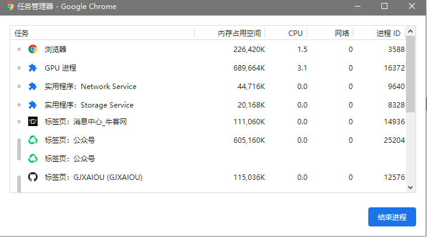
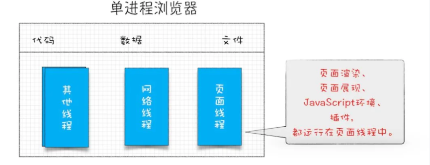

本质上线程是由操作系统帮助我们建立的，其是运行在 CPU 上（因为线程执行会占用 CPU 资源）。

并行处理：

并行处理就是同一时刻处理多个任务，如

任务1 计算 A = 1 + 1    任务 2 计算 B = 1 + 2     任务 3 计算 C  = 1 + 3     任务 4 显示最后的结果。

如果该程序使用单线程来执行，即将上述 4 个任务分为 4 步执行。如果采用多线程可以分为两步：第一步使用三个线程同时执行前三个任务，第二步执行第四个任务。并行处理提升了性能。

### 程序、进程和线程

程序本身只是指令、数据及其组织形式的描述，相当于一个名词。这些指令可以让 CPU 完成指定的任务。

进程是一次程序的执行，是程序（那些指令和数据）的真正运行实例。可以想像说是现在进行式。若干进程有可能与同一个程序相关系，且每个进程皆可以同步或异步的方式独立运行。现代计算机系统可在同一段时间内以进程的形式将多个程序加载到存储器中，并借由时间共享（或称时分复用），以在一个处理器上表现出同时运行的感觉。同样的，使用多线程技术（多线程即每一个线程都代表一个进程内的一个独立执行上下文）的操作系统或计算机体系结构，同样程序的**平行**线程，可在多CPU主机或网络上真正**同时**运行（在不同的CPU上）。**进程是系统进行资源分配和调度的一个独立单位，也是受操作系统管理的基本运行单元**。

用户下达运行程序的命令后，就会产生进程。同一程序可产生多个进程（一对多关系），以允许同时有多位用户运行同一程序，却不会相冲突。

进程需要一些资源才能完成工作，如CPU使用时间、存储器、文件以及  I/O 设备，且为依序逐一进行，也就是每个CPU核心任何时间内仅能运行一项进程。

进程与线程的区别：进程是计算机管理运行程序的一种方式，一个进程下可包含一个或者多个线程。线程可以理解为子进程。

多线程可以并行处理任务，但是线程不能单独存在，它是由进程来启动和管理的。而进程作为一个程序的运行实例。即启动一个程序的时候，操作系统会为该程序创建一块内存，用来存放代码、运行中的数据和一个执行任务的主线程，这样的一个运行环境称为：进程。

线程是依附于进程的，而进程中使用多线程并行处理能提升运算效率。两者之间的特点：

- 进程中任意一个线程执行出错，都会导致整个进程崩溃。
- 线程之间共享进程中的数据。
- 当一个进程关闭之后，操作系统会回收该进程所申请的所有资源。
- 进程之间相互隔离。（每个进程只能访问自己占有的数据，如果进程之间需要通信，使用进程间通信机制）。


如将 .java 程序编译之后形成 .class 文件， 操作系统启动一个  JVM 相当于创建了一个进程，在该虚拟机中加载 class 文件并且运行，在 class 文件中通过执行创建新线程的代码来执行具体任务。


**查看线程状态信息**：

- 方式一：使用  jps + jstack

    首先在 cmd 中输入 jps 可以查看当前 Java 进程（当前运行类对应的 Java 虚拟机进程）以及进程 id，然后使用 `jstack -l 进程id`  可以查看该进程下面线程状态。

- 方式二：jvisualvm 

    缺点：看不到线程运行的状态。

#### 详细理解

首先通过  `Ctrl + Alt + Delete` 可以查看电脑的任务管理器，然后点击「进程」选项。


可以看到名称为 `Google Chrome`共 38 个进程，为什么这么多

通过 Chrome 自带的任务管理器可以展示运行中 Chrome 使用的进程信息：`shift + Esc`



如果浏览器使用单进程，即浏览器的所有功能模块（包括网络、插件、JS 运行环境、渲染引擎和页面等）都运行在一个进程中，会导致浏览器不稳定、不流畅、不安全。

- 不稳定：某一个部分（插件、JS）崩溃会导致整个浏览器崩溃。
- 不流畅：如图所示，所有页面渲染、展示、JS 等都是运行在同一个线程中，即同一个时刻只能有一个模块可以执行。



目前 Chrome 进程架构


最新的 Chrome 浏览器包括：1 个浏览器（Browser）主进程、1 个 GPU 进程、1 个网络（NetWork）进程、多个渲染进程和多个插件进程。

**浏览器进程。**主要负责界面显示、用户交互、子进程管理，同时提供存储等功能。

**渲染进程。**核心任务是将 HTML、CSS 和 JavaScript 转换为用户可以与之交互的网页，排版引擎 Blink 和 JavaScript 引擎 V8 都是运行在该进程中，默认情况下，Chrome 会为每个 Tab 标签创建一个渲染进程。出于安全考虑，渲染进程都是运行在沙箱模式下。

**GPU 进程。**其实，Chrome 刚开始发布的时候是没有 GPU 进程的。而 GPU 的使用初衷是为了实现 3D CSS 的效果，只是随后网页、Chrome 的 UI 界面都选择采用 GPU 来绘制，这使得 GPU 成为浏览器普遍的需求。最后，Chrome 在其多进程架构上也引入了 GPU 进程。

**网络进程。**主要负责页面的网络资源加载，之前是作为一个模块运行在浏览器进程里面的，直至最近才独立出来，成为一个单独的进程。

**插件进程。**主要是负责插件的运行，因插件易崩溃，所以需要通过插件进程来隔离，以保证插件进程崩溃不会对浏览器和页面造成影响。

打开 1 个页面至少需要 1 个网络进程、1 个浏览器进程、1 个 GPU 进程以及 1 个渲染进程，共 4 个；如果打开的页面有运行插件的话，还需要再加上 1 个插件进程。

**问题**：

- 更高的资源占用：每个进程都包括公共基础结构的副本（如 JS 运行环境），消耗更多的内存资源。


## 一、基本概念

**并发**：同时拥有两个或者多个线程，如果程序在单核处理器上运行，多个线程将交替地换入或者换出内存，这些线程是同时“存在”的，每个线程都处于执行过程的某个状态，如果运行在多核处理器上，程序的每个线程都将分配到一个处理器核上，因此可以同时运行。

**高并发**：高并发（High Concurrency）是互联网分布式系统架构设计中必须考虑的因素之一，通常指通过设计保证系统能够**同时并行处理**很多请求。

**两者区别**

- 并发：多个线程操作相同的资源，保证线程安全，合理使用资源；
- 高并发：保证服务能够同时处理很多请求，提高程序性能。


# 理解CPU Cache

发表于 2017-05-07  |  分类于 [开发手册 ](http://www.ideabuffer.cn/categories/开发手册/)， [JVM ](http://www.ideabuffer.cn/categories/开发手册/JVM/) |  阅读次数 765  |  1,518 字  |  6 min

## CPU Cache介绍

随着CPU频率的不断提升，内存的访问速度却并没有什么突破。所以，为了弥补内存访问速度慢的硬伤，便出现了CPU缓存。它的工作原理如下：

- 当CPU要读取一个数据时，首先从缓存中查找，如果找到就立即读取并送给CPU处理；
- 如果没有找到，就用相对慢的速度从内存中读取并送给CPU处理，同时把这个数据所在的数据块调入缓存中，可以使得以后对整块数据的读取都从缓存中进行，不必再调用内存。

为了充分发挥CPU的计算性能和吞吐量，现代CPU引入了一级缓存、二级缓存和三级缓存，结构如下图所示：

[](http://www.ideabuffer.cn/2017/05/07/理解CPU-Cache/CPU-Cache.jpg)

图中所示的是三级缓存的架构，可以看到，级别越小的缓存，越接近CPU，但访问速度也会越慢。

- L1 Cache分为D-Cache和I-Cache，D-Cache用来存储数据，I-Cache用来存放指令，一般L1 Cache的大小是32k；
- L2 Cache 更大一些,例如256K, 速度要慢一些, 一般情况下每个核上都有一个独立的L2 Cache；
- L3 Cache是三级缓存中最大的一级，例如12MB，同时也是最慢的一级，在同一个CPU插槽之间的核共享一个L3 Cache。

当CPU计算时，首先去L1去寻找需要的数据，如果没有则去L2寻找，接着从L3中寻找，如果都没有，则从内存中读取数据。所以，如果某些数据需要经常被访问，那么这些数据存放在L1中的效率会最高。

下面的列表表示了CPU到各缓存和内存之间的大概速度：

| 从CPU到  | 大约需要的CPU周期 | 大约需要的时间(单位ns) |
| :------- | :---------------- | :--------------------- |
| 寄存器   | 1 cycle           |                        |
| L1 Cache | ~3-4 cycles       | ~0.5-1 ns              |
| L2 Cache | ~10-20 cycles     | ~3-7 ns                |
| L3 Cache | ~40-45 cycles     | ~15 ns                 |
| 跨槽传输 | ~20 ns            |                        |
| 内存     | ~120-240 cycles   | ~60-120ns              |

在Linux中可以通过如下命令查看CPU Cache：

```
cat /sys/devices/system/cpu/cpu0/cache/index0/size
32K
cat /sys/devices/system/cpu/cpu0/cache/index1/size
32K
cat /sys/devices/system/cpu/cpu0/cache/index2/size
256K
cat /sys/devices/system/cpu/cpu0/cache/index3/size
20480K
cat /sys/devices/system/cpu/cpu0/cache/index0/type
Data
cat /sys/devices/system/cpu/cpu0/cache/index1/type
Instruction
```

这里的index0和index1对应着L1 D-Cache和L1 I-Cache。

## 缓存行Cache Line

缓存是由缓存行组成的。一般一行缓存行有64字节。CPU在操作缓存时是以缓存行为单位的，可以通过如下命令查看缓存行的大小：

```
cat /sys/devices/system/cpu/cpu0/cache/index0/coherency_line_size
64
```

由于CPU存取缓存都是按行为最小单位操作的。对于long类型来说，一个long类型的数据有64位，也就是8个字节，所以对于数组来说，由于数组中元素的地址是连续的，所以在加载数组中第一个元素的时候会把后面的元素也加载到缓存行中。

如果一个long类型的数组长度是8，那么也就是64个字节了，CPU这时操作该数组，会把数组中所有的元素都放入缓存行吗？答案是否定的，原因就是在Java中，对象在内存中的结构包含对象头，可以参考我的另一篇文章[Java对象内存布局](http://www.ideabuffer.cn/2017/05/06/Java对象内存布局/)来了解。

## 测试Cache Miss

下面的代码引用自http://coderplay.iteye.com/blog/1485760：

```
public class L1CacheMiss {
    private static final int RUNS = 10;
    private static final int DIMENSION_1 = 1024 * 1024;
    private static final int DIMENSION_2 = 62;

    private static long[][] longs;

    public static void main(String[] args) throws Exception {
        longs = new long[DIMENSION_1][];
        for (int i = 0; i < DIMENSION_1; i++) {
            longs[i] = new long[DIMENSION_2];
        }
        System.out.println("starting....");

        final long start = System.nanoTime();
        long sum = 0L;
        for (int r = 0; r < RUNS; r++) {
            // 1. slow
            for (int j = 0; j < DIMENSION_2; j++) {
                for (int i = 0; i < DIMENSION_1; i++) {
                    sum += longs[i][j];
                }
            }
            
            // 2. fast
//            for (int i = 0; i < DIMENSION_1; i++) {
//                for (int j = 0; j < DIMENSION_2; j++) {
//                    sum += longs[i][j];
//                }
//            }
        }
        System.out.println("duration = " + (System.nanoTime() - start));
    }
}
```

这里测试的环境是macOS 10.12.4，JDK 1.8，Java HotSpot(TM) 64-Bit Server VM (build 25.60-b23, mixed mode)。

这里定义了一个二维数组，第一维长度是1024*1024，第二维长度是62，这里遍历二维数组。由于二维数组中每一个数组对象的长度是62，那么根据上篇文章[Java对象内存布局](http://www.ideabuffer.cn/2017/05/06/Java对象内存布局/)的介绍，可以知道，long类型的数组对象头的大小是16字节（这里默认开启了指针压缩），每个long类型的数据大小是8字节，那么一个long类型的数组大小为16+8*62=512字节。先看一下第一种慢的方式运行的时间：

```
starting....
duration = 11883939677
```

运行时间是11秒多，再来看下快的方式：

```
starting....
duration = 888085368
```

运行时间是888毫秒，还不到1秒，为什么相差这么多？

首先来分析一下第一种情况，因为二维数组中的每一个数组对象占用的内存大小是512字节，而缓存行的大小是64字节，那么使用第一种遍历方式，假设当前遍历的数据是longs[i][j]，那么下一个遍历的数据是longs[i+1][j]，也就是说遍历的不是同一个数组对象，那么这两次遍历的数据肯定不在同一个缓存行内，也就是产生了Cache Miss；

在第二种情况中，假设当前遍历的数据是longs[i][j]，那么下一个遍历的数据是longs[i][j+1]，遍历的是同一个数组对象，所以当前的数据和下一个要遍历的数据可能都是在同一个缓存行中，这样发生Cache Miss的情况就大大减少了。

## 总结

一般来说，Cache Miss有三种情况：

1. 第一次访问数据时cache中不存在这条数据；
2. cache冲突；
3. cache已满。

这里的第二种情况也比较常见，同时会产生一个问题，就是伪共享，有时间会单独写一篇文章来介绍一下Java中对伪共享的处理方式。


文章大纲

- Java 并发领域介绍
- volatile 关键字的应用场景与原理剖析
- synchronized 关键字的底层原理深入剖析
- Lock 原理深入解析
- 何为原子操作及原子操作的原理深入解析
- 锁与锁原理深入剖析
- 锁框架详解
- 读写锁与重入锁分析
- 内存屏障详解
- Completion Service 详解
- 重排序详解
- Fork-Join API 详解
- 一致性语义深入解读
- 资源死锁详解
- synchronized 与 ReentrantLock 详细对比
- happen-before 语义的含义详解
- Java 内存模型深入解读
- Executor 框架深入解读
- ThreadLocal 原理与底层源码深入解读
- Java concurrent 包重要且核心组件深入解读
- CountDownLatch 详解
- CyclicBarrier 解读
- 线程间通信方式详解
- CPU Cache 模型详解
- JMM 的有序性、可见性与原子性详解
- Java 线程池深入剖析与源码实现和分析
- Future 设计模式深入解读
- 何谓 CAS 及 CAS 深入剖析
- JVM 对 CAS 的支持深入剖析
- 其他并发分析工具详解