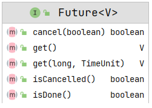

## Future

[TOC]

### 一、概述

简单来说就是一个线程来执行未来的任务，但是在使用 get 方法的时候主线程会出现阻塞的过程。

## 二、源码分析



```java

package java.util.concurrent;

/**
 * Future 表示异步计算的结果。提供了检查计算是否完成、是否等待其完成以及获取计算结果的方法。只有在计算完成时，才能使用方法 get
 *获取结果，必要时阻塞，直到它准备好为止。取消由{@code cancel}方法执行。提供了其他方法来确定任务是正常完成还是取消。一旦计算完成，就不能取消计算。如果为了可取消性而想使用
 * {@code Future}，但不提供可用的结果，那么可以使用{@code Future<？>}并返回{@code null}，作为基础任务的结果
 */

/**
 * A {@code Future} represents the result of an asynchronous
 * computation.  Methods are provided to check if the computation is
 * complete, to wait for its completion, and to retrieve the result of
 * the computation.  The result can only be retrieved using method
 * {@code get} when the computation has completed, blocking if
 * necessary until it is ready.  Cancellation is performed by the
 * {@code cancel} method.  Additional methods are provided to
 * determine if the task completed normally or was cancelled. Once a
 * computation has completed, the computation cannot be cancelled.
 * If you would like to use a {@code Future} for the sake
 * of cancellability but not provide a usable result, you can
 * declare types of the form {@code Future<?>} and
 * return {@code null} as a result of the underlying task.
 *
 * <p>
 * <b>Sample Usage</b> (Note that the following classes are all
 * made-up.)
 * <pre> {@code
 * interface ArchiveSearcher { String search(String target); }
 * class App {
 *   ExecutorService executor = ...
 *   ArchiveSearcher searcher = ...
 *   void showSearch(final String target)
 *       throws InterruptedException {
 *     Future<String> future
 *       = executor.submit(new Callable<String>() {
 *         public String call() {
 *             return searcher.search(target);
 *         }});
 *     displayOtherThings(); // do other things while searching
 *     try {
 *       displayText(future.get()); // use future
 *     } catch (ExecutionException ex) { cleanup(); return; }
 *   }
 * }}</pre>
 * <p>
 * The {@link FutureTask} class is an implementation of {@code Future} that
 * implements {@code Runnable}, and so may be executed by an {@code Executor}.
 * For example, the above construction with {@code submit} could be replaced by:
 * <pre> {@code
 * FutureTask<String> future =
 *   new FutureTask<String>(new Callable<String>() {
 *     public String call() {
 *       return searcher.search(target);
 *   }});
 * executor.execute(future);}</pre>
 *
 * <p>Memory consistency effects: Actions taken by the asynchronous computation
 * <a href="package-summary.html#MemoryVisibility"> <i>happen-before</i></a>
 * actions following the corresponding {@code Future.get()} in another thread.
 *
 * @param <V> The result type returned by this Future's {@code get} method
 * @author Doug Lea
 * @see FutureTask
 * @see Executor
 * @since 1.5
 */
public interface Future<V> {

    /**
     * Attempts to cancel execution of this task.  This attempt will
     * fail if the task has already completed, has already been cancelled,
     * or could not be cancelled for some other reason. If successful,
     * and this task has not started when {@code cancel} is called,
     * this task should never run.  If the task has already started,
     * then the {@code mayInterruptIfRunning} parameter determines
     * whether the thread executing this task should be interrupted in
     * an attempt to stop the task.
     *
     * <p>After this method returns, subsequent calls to {@link #isDone} will
     * always return {@code true}.  Subsequent calls to {@link #isCancelled}
     * will always return {@code true} if this method returned {@code true}.
     *
     * @param mayInterruptIfRunning {@code true} if the thread executing this
     *                              task should be interrupted; otherwise, in-progress tasks are
     *                              allowed
     *                              to complete
     * @return {@code false} if the task could not be cancelled,
     * typically because it has already completed normally;
     * {@code true} otherwise
     */
    boolean cancel(boolean mayInterruptIfRunning);

    /**
     * Returns {@code true} if this task was cancelled before it completed
     * normally.
     *
     * @return {@code true} if this task was cancelled before it completed
     */
    boolean isCancelled();

    /**
     * Returns {@code true} if this task completed.
     * <p>
     * Completion may be due to normal termination, an exception, or
     * cancellation -- in all of these cases, this method will return
     * {@code true}.
     *
     * @return {@code true} if this task completed
     */
    boolean isDone();

    /**
     * 当任务尚未完成，则 get 方法会一直等待
     * Waits if necessary for the computation to complete, and then
     * retrieves its result.
     *
     * @return the computed result
     * @throws CancellationException if the computation was cancelled
     * @throws ExecutionException    if the computation threw an
     *                               exception
     * @throws InterruptedException  if the current thread was interrupted
     *                               while waiting
     */
    V get() throws InterruptedException, ExecutionException;

    /**
     * Waits if necessary for at most the given time for the computation
     * to complete, and then retrieves its result, if available.
     *
     * @param timeout the maximum time to wait
     * @param unit    the time unit of the timeout argument
     * @return the computed result
     * @throws CancellationException if the computation was cancelled
     * @throws ExecutionException    if the computation threw an
     *                               exception
     * @throws InterruptedException  if the current thread was interrupted
     *                               while waiting
     * @throws TimeoutException      if the wait timed out
     */
    V get(long timeout, TimeUnit unit)
            throws InterruptedException, ExecutionException, TimeoutException;
}
```

该接口在使用过程中，常用的实现类为 FutureTask 类。


使用示例：

```java
package com.gjxaiou.future;

import java.util.Random;
import java.util.concurrent.Callable;
import java.util.concurrent.ExecutionException;
import java.util.concurrent.FutureTask;

/**
 * 需要 Callable 对象封装任务执行逻辑
 * 用 FutureTask 包装任务
 * 启动一个线程来执行包装后的任务
 * 从主程序中调用 FutureTask 中 get 方法获取执行结果
 */
public class MyTest1 {
    public static void main(String[] args) {
        Callable<Integer> callable = () -> {
            System.out.println("pre execution");
            // 子线程睡眠 5s
            Thread.sleep(5000);
            int randomNumber = new Random().nextInt(500);
            System.out.println("post execution");

            return randomNumber;
        };

        FutureTask futureTask = new FutureTask<Integer>(callable);

        new Thread(futureTask).start();

        System.out.println("thread has started");

        try {
            // 主线程睡眠 2s
            Thread.sleep(2000);
            System.out.println(futureTask.get());
        } catch (InterruptedException exception) {
            exception.printStackTrace();
        } catch (ExecutionException e) {
            e.printStackTrace();
        }
    }
}
```

首先线程启动之后，主流程开始执行，输出 `thread has started`，然后在调用 get  方法时候等待 callable 中执行完成。

```java
thread has started
pre execution   // 这个输出之后等待 3s 后面才出来，因为 2s 之后主线程醒来，执行 get 方法时候需要等待
post execution
43
```

如果将主线程的 get 方法换成带超时时间的，即：

```
// 主线程等待 1s
System.out.println(futureTask.get(1, TimeUnit.MILLISECONDS));
```

则执行结果为：

```java
thread has started
pre execution
java.util.concurrent.TimeoutException
	at java.util.concurrent.FutureTask.get(FutureTask.java:205)
	at com.gjxaiou.future.MyTest2.main(MyTest2.java:34)
post execution
```

主线程会抛出异常，但是不影响子线程正常执行。

### CompletableFuture

保证任务执行的异步性和获取结果的异步性。

这是对 Future 的增强。提供异步获取执行结果。测试代码

```java
package com.gjxaiou.completableFuture;

import java.time.temporal.ValueRange;
import java.util.concurrent.CompletableFuture;

public class MyTest1 {
    public static void main(String[] args) {
        // 体现 CompletableFuture 的 stage 功能  => 对结果进行转换
        String result =
                CompletableFuture.supplyAsync(() -> "hello").thenApplyAsync(value -> value +
                        " world").join();

        System.out.println(result);

        System.out.println("================");

        // 对结果进行消费
        CompletableFuture.supplyAsync(() -> "hello").thenAccept(value -> System.out.println(
                " welcome" + value));

        System.out.println("=================");

        // 两个操作都是异步的，相互独立执行，然后使用 thenCombine 将两个结果进行组合
        String result2 = CompletableFuture.supplyAsync(() -> {
            try {
                Thread.sleep(1000);
            } catch (InterruptedException exception) {
                exception.printStackTrace();
            }
            return "hello";
        }).thenCombine(CompletableFuture.supplyAsync(() -> {
            try {
                Thread.sleep(2000);
            } catch (InterruptedException exception) {
                exception.printStackTrace();
            }
            return "world";
            // thenCombine 第二个参数为 BiFunction,即输入两个，输出一个，对应下面的结构。本质上是对上面两个返回结果进行合并
        }), (s1, s2) -> s1 + " " + s2).join();

        System.out.println(result2);


        System.out.println("======重要重要========");
        /*
         首先会执行回调  completableFuture.whenComplete 但是因为该线程还在休眠中
         2s，并且该方法非阻塞，因此主线程会继续往下走，所以首先打印“主线程执行完毕”。
         然后主线程在 7s 那里进行了休眠。
         然后 2s 时间过了之后执行的任务执行完了，打印“task finished”
        然后 whenComplete 回调进行执行，打印“执行完成”
         */


        // get 不阻塞
        CompletableFuture completableFuture = CompletableFuture.runAsync(() -> {
            try {
                // 模拟这是一个相对耗时的任务，这里面就是真正要执行的任务
                Thread.sleep(2000);
            } catch (InterruptedException exception) {
                exception.printStackTrace();
            }
            System.out.println("task finished");
        });

        // 不阻塞主线程主线程。
        completableFuture.whenComplete((t, action) -> System.out.println("执行完成"));

        System.out.println("主线程执行完毕");
        try {
            Thread.sleep(7000);
        } catch (InterruptedException exception) {
            exception.printStackTrace();
        }
    }
}
```

执行结果为：

```java
hello world
================
 welcomehello
=================
hello world
======重要重要========
主线程执行完毕
task finished
执行完成
```

