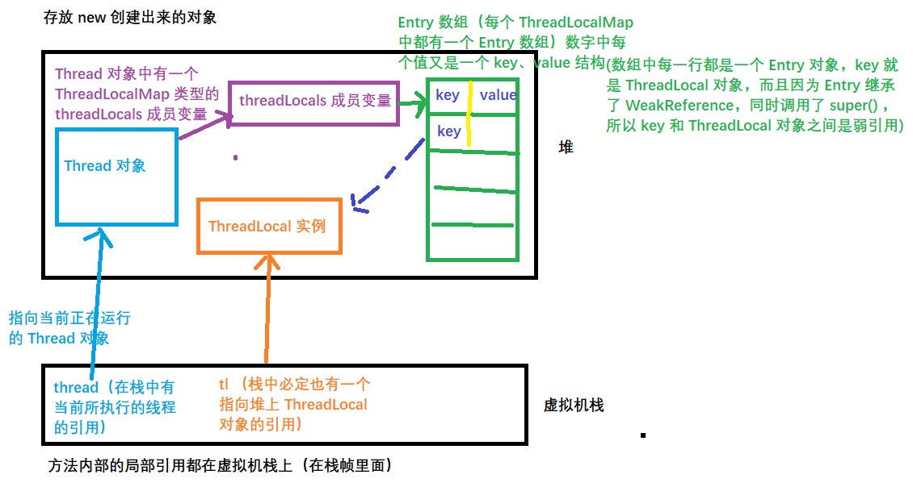

# ThreadLocal

[TOC]

### 一、前言

本质上，ThreadLocal 是通过空间换取时间，从而实现每个线程访问 ThreadLocal 中的变量都会有一个属于其自身的变量副本，这样每个线程就都会操作该副本，从而**完全规避了多线程的并发问题**。

使用场景：如 web 项目中，用户访问会经过 controller、service、dao 层，如果想实现三层之间的数据共享，一般就是将这个数据作为一个参数，在 controller 调用 service 时候传入，在 service 调用 dao 时候传入。也可以将该变量放入 ThreadLocal 中实现各个方法中的共享。因为 ThreadLocal 是和线程进行绑定的。

**ThreadLocal 本身并不持有数据，只是作为底层 Entry 对象的 key 而存在**。在 Thread 类中持有一个 ThreadLocalMap 的引用，该引用中存在一个 Entry 类型的数组，Entry 类型的数组中的每个 Entry 对象就是我们真正持有的信息，每个 Entry 对象的 key 就是一个对当前 ThreadLocal 对象的弱引用，value 就是通过 ThreadLocal 的 set 方法放入的值。

> ThreadLocal 提供了线程本地的实例。它与普通变量的区别在于，每个使用该变量的线程都会初始化一个完全独立的实例副本。ThreadLocal 变量通常被`private static`修饰。当一个线程结束时，它所使用的所有 ThreadLocal 相对的实例副本都可被回收。

总的来说，**ThreadLocal 适用于每个线程需要自己独立的实例且该实例需要在多个方法中被使用，也即变量在线程间隔离而在方法或类间共享的场景。**后文会通过实例详细阐述该观点。另外，该场景下，并非必须使用 ThreadLocal ，其它方式完全可以实现同样的效果，只是 ThreadLocal 使得实现更简洁。

### 二、使用示例

```java
package com.gjxaiou.threadLocal;

public class MyTest1 {
	public static void main(String[] args) {
		// 常用的 api 主要就是 get 和 set 方法
		ThreadLocal<String> threadLocal = new ThreadLocal<>();

		threadLocal.set("hello world");
		System.out.println(threadLocal.get());
		// 再次 set 会覆盖原有的值
		threadLocal.set("welcome");
		System.out.println(threadLocal.get());
	}
}
/**
 * output：
 * hello world
 * welcome
 */
```

原理解析：`threadLocal.set("hello world");` 不是将 `hello world` 放置到 ThreadLocal 中，而是以 ThreadLocal 对象为 key，`hello world` 为值放置到 ThreadLocalMap 的 Entry 数组中。

在线程类 Thread 类中有一个 threadLocals 属性，该属性为 `ThreadLocal.ThreadLocalMap` 类型，因此在 Thread 和 ThreadLocalMap 之间是通过静态内部类 ThreadLocalMap 来进行交互和数据传递。


### 三、引用分类

ThreadLocal 的内部类 ThreadLocalMap 的内部类 Entry 继承了  WeakReference（弱引用）。Java 中存在四种类型的引用：

- 强引用：如使用 new 方式：  `A a = new A();`

    将 `new A();` 创建的实例的引用赋值给了变量 a，则 a 就是对新创建对象的强引用。

- 软引用：

    垃圾回收时候会将软引用的对象清理。

- 弱引用

- 虚引用

除了强引用是通过 New 方式创建，其他三种引用都要继承抽象类 Reference，然后实现其中方法。

这里让 Entry 继承 WeakReference【是 Reference 其中一个实现类】 是为了防止内存泄露。但是即使继承如果代码写的有问题还是会发生内存泄露。



为什么是虚引用：

- 假设如果是强引用，则当持有 ThreadLocal 对象引用的对象不在需要 ThreadLocal 实例，如这个对象本身就被销毁了，则这个对象自身的所有成员变量也会消失，则栈中 tl 引用就为空，则 tl 指向堆中 ThreadLocal 实例的引用也就没有了。这个对象本身消亡了，则也会认为其引用的对象也都消亡了，则任务 ThreadLocal 实例也就没有了，然后因为某个 Entry 对象的 key 持有堆中该 ThreadLocal 实例的强引用， 则该 ThreadLocal 实例永远无法释放，对应着有这个引用的 Entry 对象永远无法释放，则 ThreadLocalMap 中的 Entry 数组会不断的增大，永远不会减小。同时因为栈中对该 ThreadLocal 实例的引用已经消亡，则该对象实例用于无法使用。导致内存泄露。
- 使用虚引用的话，针对上面的情况，因为下一次 GC 时候发现该 ThreadLocal 对象只被一个弱引用对象进行引用，则会将其回收该实例。

还有问题：当 ThreadLocal 实例被 GC 回收之后，Entry 中的 key 则指向了 null，则导致获取值获取不到，但是值又是存在的，使得 Entry 中存在很多 key 为 null 但是 value 存在的对象。则同样会造成内存泄露。ThreadLocal 在 get 和 set 方法中除了正常操作之外，还会将 Entry 数组中所有 key 为 null 的键值对 remove 掉。源码如下：

```java
private void set(ThreadLocal<?> key, Object value) {
    // XXXXX 
    for (Entry e = tab[i];
         //   XXXXXX
         if (k == null) {
             replaceStaleEntry(key, value, i);
             return;
         }
     }
         //  XXXXXX
}
```

最终使用的是 replaceStaleEntry 方法中的 expungeStaleEntry 方法的 expungeStaleEntry() 方法实现对所有键为 null 的Entry 对象清理。

**常规正确使用方式**：

```java
package com.gjxaiou.threadLocal;

public class MyTest2 {
    // static 保证 MyTest2 类的所有实例对象能共享该对象
    private static final ThreadLocal<String> th = new ThreadLocal<>();

    // 如果不需要 ThreadLocal 对象，需要在 finally 中显示调用 remove，调用 remove 操作：首先移除 ThreadLocal 对象，然后将 Entry 中
    // key 为 null 的对象也移除
    try{
        // 正常执行逻辑
    }finally{
        th.remove();
    }
}
```

### 四、ThreadLocal 原理

从 `Thread`类源代码入手。

```java
public class Thread implements Runnable {
 ......
//与此线程有关的ThreadLocal值。由ThreadLocal类维护
ThreadLocal.ThreadLocalMap threadLocals = null;

//与此线程有关的InheritableThreadLocal值。由InheritableThreadLocal类维护
ThreadLocal.ThreadLocalMap inheritableThreadLocals = null;
 ......
}
```

从上面`Thread`类 源代码可以看出`Thread` 类中有一个 `threadLocals` 和 一个  `inheritableThreadLocals` 变量，它们都是 `ThreadLocalMap`  类型的变量,我们可以把 `ThreadLocalMap`  理解为`ThreadLocal` 类实现的定制化的 `HashMap`。默认情况下这两个变量都是null，只有当前线程调用 `ThreadLocal` 类的 `set`或`get`方法时才创建它们，实际上调用这两个方法的时候，我们调用的是`ThreadLocalMap`类对应的 `get()`、`set() `方法。

`ThreadLocal`类的`set()`方法

```java
public void set(T value) {
    Thread t = Thread.currentThread();
    ThreadLocalMap map = getMap(t);
    if (map != null)
        map.set(this, value);
    else
        createMap(t, value);
}
ThreadLocalMap getMap(Thread t) {
    return t.threadLocals;
}
```

**最终的变量是放在了当前线程的 `ThreadLocalMap` 中，并不是存在 `ThreadLocal` 上，ThreadLocal 可以理解为只是ThreadLocalMap的封装，传递了变量值。**

**每个 Thread 中都具备一个 ThreadLocalMap，而 ThreadLocalMap 以存储以 ThreadLocal 为 key 的键值对。** 比如我们在同一个线程中声明了两个 `ThreadLocal` 对象的话，会使用 `Thread`内部都是使用仅有那个`ThreadLocalMap` 存放数据的，`ThreadLocalMap`的 key 就是 `ThreadLocal`对象，value 就是 `ThreadLocal` 对象调用`set`方法设置的值。`ThreadLocal` 是 map结构是为了让每个线程可以关联多个 `ThreadLocal`变量。这也就解释了 ThreadLocal 声明的变量为什么在每一个线程都有自己的专属本地变量。

### 五、ThreadLocal 内存泄露问题

`ThreadLocalMap` 中使用的 key 为 `ThreadLocal` 的弱引用,而 value 是强引用。所以，如果 `ThreadLocal` 没有被外部强引用的情况下，在垃圾回收的时候会 key 会被清理掉，而 value 不会被清理掉。这样一来，`ThreadLocalMap` 中就会出现key为null的Entry。假如我们不做任何措施的话，value 永远无法被GC 回收，这个时候就可能会产生内存泄露。ThreadLocalMap实现中已经考虑了这种情况，在调用 `set()`、`get()`、`remove()` 方法的时候，会清理掉 key 为 null 的记录。使用完 `ThreadLocal`方法后 最好手动调用`remove()`方法

```java
static class Entry extends WeakReference<ThreadLocal<?>> {
    /** The value associated with this ThreadLocal. */
    Object value;

    Entry(ThreadLocal<?> k, Object v) {
        super(k);
        value = v;
    }
}
```

