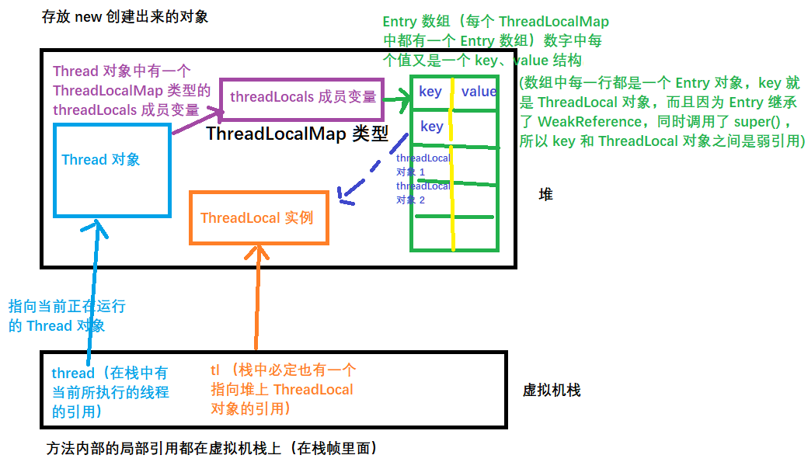

# ThreadLocal

[TOC]

### 一、前言

`public static 变量` 实现了变量值的共享，即所有的线程都使用同一个变量。

本质上，ThreadLocal 是通过空间换取时间，从而实现每个线程访问 ThreadLocal 中的变量都会有一个属于其自身的变量副本，这样每个线程就都会操作该副本，从而**完全规避了多线程的并发问题**。

使用场景：如 web 项目中，用户访问会经过 controller、service、dao 层，如果想实现三层之间的数据共享，一般就是将这个数据作为一个参数，在 controller 调用 service 时候传入，在 service 调用 dao 时候传入。也可以将该变量放入 ThreadLocal 中实现各个方法中的共享。因为 ThreadLocal 是和线程进行绑定的。

**ThreadLocal 本身并不持有数据，只是作为底层 Entry 对象的 key 而存在**。在 Thread 类中持有一个 ThreadLocalMap 的引用，该引用中存在一个 Entry 类型的数组，Entry 类型的数组中的每个 Entry 对象就是我们真正持有的信息，每个 Entry 对象的 key 就是一个对当前 ThreadLocal 对象的弱引用，value 就是通过 ThreadLocal 的 set 方法放入的值。

> ThreadLocal 提供了线程本地的实例。它与普通变量的区别在于，每个使用该变量的线程都会初始化一个完全独立的实例副本。ThreadLocal 变量通常被`private static`修饰。当一个线程结束时，它所使用的所有 ThreadLocal 相对的实例副本都可被回收。

总的来说，**ThreadLocal 适用于每个线程需要自己独立的实例且该实例需要在多个方法中被使用，也即变量在线程间隔离而在方法或类间共享的场景。**后文会通过实例详细阐述该观点。另外，该场景下，并非必须使用 ThreadLocal ，其它方式完全可以实现同样的效果，只是 ThreadLocal 使得实现更简洁。

### 二、使用示例

```java
package com.gjxaiou.threadLocal;

public class MyTest1 {
	public static void main(String[] args) {
		// 常用的 api 主要就是 get 和 set 方法
		ThreadLocal<String> threadLocal = new ThreadLocal<>();

		threadLocal.set("hello world");
		System.out.println(threadLocal.get());
		// 再次 set 会覆盖原有的值
		threadLocal.set("welcome");
		System.out.println(threadLocal.get());
	}
}
/**
 * output：
 * hello world
 * welcome
 */
```

原理解析：`threadLocal.set("hello world");` 不是将 `hello world` 放置到 ThreadLocal 中，而是以 ThreadLocal 对象为 key，`hello world` 为值放置到 ThreadLocalMap 的 Entry 数组中。

在线程类 Thread 类中有一个 threadLocals 属性，该属性为 `ThreadLocal.ThreadLocalMap` 类型，因此在 Thread 和 ThreadLocalMap 之间是通过静态内部类 ThreadLocalMap 来进行交互和数据传递。

### 验证线程变量的隔离性

验证通过 ThreadLocal 可向每个线程中存储自己的私有数据。

```java
package com.gjxaiou.threadLocal;

import java.util.stream.IntStream;

public class MyTest3 {
	public static void main(String[] args) {
		IntStream.range(0, 2).forEach(j -> {
			new Thread(() -> {
				try {
					for (int i = 0; i < 3; i++) {
						Tools.threadLocal.set(Thread.currentThread().getName() + " 设置：" + i);
						System.out.println(Thread.currentThread().getName() + " get  " + Tools.threadLocal.get());
						Thread.sleep((int) (Math.random() * 100));
					}
				} catch (InterruptedException e) {
					e.printStackTrace();
				}
			}).start();
		});

	}
}

class Tools {
	public static ThreadLocal threadLocal = new ThreadLocal();
}
```

输出结果为：

```java
Thread-0 get  Thread-0 设置：0
Thread-1 get  Thread-1 设置：0
Thread-1 get  Thread-1 设置：1
Thread-0 get  Thread-0 设置：1
Thread-1 get  Thread-1 设置：2
Thread-0 get  Thread-0 设置：2
```

多个线程向同一个 ThreadLocal 对象中设置值，但是每个线程都能取出自己的数据。

### 修改初始默认值

ThreadLocal 的 `initialValue()` 默认返回 null，使得第一次调用 ThreadLocal 类的 get() 返回时候返回 null，如果要第一调用返回值不为空，可以自定义类继承 ThreadLocal 然后重写该方法。

注意：该方法返回值也是线程隔离了，各个线程获取不一样，每个线程多次获取值一样。

### 三、引用分类

ThreadLocal 的内部类 ThreadLocalMap 的内部类 Entry 继承了  WeakReference（弱引用）。Java 中存在四种类型的引用：

- 强引用：如使用 new 方式：  `A a = new A();`

    将 `new A();` 创建的实例的引用赋值给了变量 a，则 a 就是对新创建对象的强引用。

- 软引用：

    垃圾回收时候会将软引用的对象清理。

- 弱引用

- 虚引用

除了强引用是通过 New 方式创建，其他三种引用都要继承抽象类 Reference，然后实现其中方法。

这里让 Entry 继承 WeakReference【是 Reference 其中一个实现类】 是为了防止内存泄露。但是即使继承如果代码写的有问题还是会发生内存泄露。



为什么是虚引用：

- 假设如果是强引用，则当持有 ThreadLocal 对象引用的对象不在需要 ThreadLocal 实例，如这个对象本身就被销毁了，则这个对象自身的所有成员变量也会消失，则栈中 tl 引用就为空，则 tl 指向堆中 ThreadLocal 实例的引用也就没有了。这个对象本身消亡了，则也会认为其引用的对象也都消亡了，则任务 ThreadLocal 实例也就没有了，然后因为某个 Entry 对象的 key 持有堆中该 ThreadLocal 实例的强引用， 则该 ThreadLocal 实例永远无法释放，对应着有这个引用的 Entry 对象永远无法释放，则 ThreadLocalMap 中的 Entry 数组会不断的增大，永远不会减小。同时因为栈中对该 ThreadLocal 实例的引用已经消亡，则该对象实例用于无法使用。导致内存泄露。
- 使用虚引用的话，针对上面的情况，因为下一次 GC 时候发现该 ThreadLocal 对象只被一个弱引用对象进行引用，则会将其回收该实例。

还有问题：当 ThreadLocal 实例被 GC 回收之后，Entry 中的 key 则指向了 null，则导致获取值获取不到，但是值又是存在的，使得 Entry 中存在很多 key 为 null 但是 value 存在的对象。则同样会造成内存泄露。ThreadLocal 在 get 和 set 方法中除了正常操作之外，还会将 Entry 数组中所有 key 为 null 的键值对 remove 掉。源码如下：

```java
private void set(ThreadLocal<?> key, Object value) {
    // XXXXX 
    for (Entry e = tab[i];
         //   XXXXXX
         if (k == null) {
             replaceStaleEntry(key, value, i);
             return;
         }
     }
         //  XXXXXX
}
```

最终使用的是 replaceStaleEntry 方法中的 expungeStaleEntry 方法的 expungeStaleEntry() 方法实现对所有键为 null 的Entry 对象清理。

**常规正确使用方式**：

```java
package com.gjxaiou.threadLocal;

public class MyTest2 {
    // static 保证 MyTest2 类的所有实例对象能共享该对象
    private static final ThreadLocal<String> th = new ThreadLocal<>();

    // 如果不需要 ThreadLocal 对象，需要在 finally 中显示调用 remove，调用 remove 操作：首先移除 ThreadLocal 对象，然后将 Entry 中
    // key 为 null 的对象也移除
    try{
        // 正常执行逻辑
    }finally{
        th.remove();
    }
}
```

### 四、ThreadLocal 原理

从 `Thread`类源代码入手。

```java
public class Thread implements Runnable {
 ......
//与此线程有关的ThreadLocal值。由ThreadLocal类维护
ThreadLocal.ThreadLocalMap threadLocals = null;

//与此线程有关的InheritableThreadLocal值。由InheritableThreadLocal类维护
ThreadLocal.ThreadLocalMap inheritableThreadLocals = null;
 ......
}
```

从上面`Thread`类 源代码可以看出`Thread` 类中有一个 `threadLocals` 和 一个  `inheritableThreadLocals` 变量，它们都是 `ThreadLocalMap`  类型的变量,我们可以把 `ThreadLocalMap`  理解为`ThreadLocal` 类实现的定制化的 `HashMap`。默认情况下这两个变量都是null，只有当前线程调用 `ThreadLocal` 类的 `set`或`get`方法时才创建它们，实际上调用这两个方法的时候，我们调用的是`ThreadLocalMap`类对应的 `get()`、`set() `方法。

`ThreadLocal`类的`set()`方法

```java
public void set(T value) {
    // 通过获取到的就是 main 线程
    Thread t = Thread.currentThread();
    // 从 main 线程中获取 ThreadLocalMap
    ThreadLocalMap map = getMap(t);
    // 不是第一次调用 set 方法，则 map 值不为 null
    if (map != null)
        // 将当前 ThreadLocal 对象作为一个 key
        map.set(this, value);
    else
        // 第一次调用 set 方法，执行 createMap() 方法
        createMap(t, value);
}

ThreadLocalMap getMap(Thread t) {
    // t 即是当前线程，返回当前线程中 threadLocals 变量对应的 ThreadLocalMap 对象
    return t.threadLocals;
}

///////////  Thread.java ///////仅此一个，其它都在 ThreadLocal 中///
public class Thread implements Runnable {
        /* ThreadLocal values pertaining to this thread. This map is maintained
     * by the ThreadLocal class. */
    ThreadLocal.ThreadLocalMap threadLocals = null;
}    

// 第一个放数据，创建 Map，this 即为当前 ThreadLocal 对象
void createMap(Thread t, T firstValue) {
    t.threadLocals = new ThreadLocalMap(this, firstValue);
}

```

**最终的变量是放在了当前线程的 `ThreadLocalMap` 中，并不是存在 `ThreadLocal` 上，ThreadLocal 可以理解为只是 ThreadLocalMap 的封装，传递了变量值。**

ThreadLocal 仅仅是数据和 Map 之间的桥梁，用于将数据放入 Map 中，执行流程如下：数据 -》 ThreadLocal -》 currentThread() -》Map。

**每个 Thread 中都具备一个 ThreadLocalMap，而 ThreadLocalMap 以存储以 ThreadLocal 为 key 的键值对。** 比如我们在同一个线程中声明了两个 `ThreadLocal` 对象的话，会使用 `Thread`内部都是使用仅有那个`ThreadLocalMap` 存放数据的，`ThreadLocalMap`的 key 就是 `ThreadLocal`对象，value 就是 `ThreadLocal` 对象调用`set`方法设置的值。`ThreadLocal` 是 map结构是为了让每个线程可以关联多个 `ThreadLocal`变量。这也就解释了 ThreadLocal 声明的变量为什么在每一个线程都有自己的专属本地变量。

### 五、ThreadLocal 内存泄露问题

`ThreadLocalMap` 中使用的 key 为 `ThreadLocal` 的弱引用,而 value 是强引用。所以，如果 `ThreadLocal` 没有被外部强引用的情况下，在垃圾回收的时候会 key 会被清理掉，而 value 不会被清理掉。这样一来，`ThreadLocalMap` 中就会出现key为null的Entry。假如我们不做任何措施的话，value 永远无法被GC 回收，这个时候就可能会产生内存泄露。ThreadLocalMap实现中已经考虑了这种情况，在调用 `set()`、`get()`、`remove()` 方法的时候，会清理掉 key 为 null 的记录。使用完 `ThreadLocal`方法后 最好手动调用`remove()`方法

```java
static class Entry extends WeakReference<ThreadLocal<?>> {
    /** The value associated with this ThreadLocal. */
    Object value;

    Entry(ThreadLocal<?> k, Object v) {
        super(k);
        value = v;
    }
}
```

## InheritableThreadLocal

ThreadLocal 的父子线程之间的值不能继承（在 X 线程中创建 Y 线程，则 X 为 Y 的父线程），但是 InheritableThreadLocal 可以实现。

```java
package com.gjxaiou.threadLocal;

public class MyTest4 {
	public static void main(String[] args) {
		try {
			for (int i = 0; i < 2; i++) {
				if (Tool.threadLocal.get() == null || Tool.inheritableThreadLocal.get() == null) {
					Tool.threadLocal.set("main 线程设置的值");
					Tool.inheritableThreadLocal.set("main 线程设置的值");
				}
				System.out.println("main 线程取值, TH: " + Tool.threadLocal.get() + "  inTH: " + Tool.inheritableThreadLocal.get());
				Thread.sleep(100);
			}

			new Thread(() -> {
				try {
					for (int i = 0; i < 2; i++) {
						System.out.println("子线程取值，TH： " + Tool.threadLocal.get() + " inTH: " + Tool.inheritableThreadLocal.get());
						Thread.sleep(100);
					}
				} catch (InterruptedException e) {
					e.printStackTrace();
				}
			}).start();
		} catch (InterruptedException e) {
			e.printStackTrace();
		}
	}


}

class Tool {
	public static ThreadLocal threadLocal = new ThreadLocal();
	public static InheritableThreadLocal inheritableThreadLocal = new InheritableThreadLocal();
}
```

程序输出结果为：

```java
main 线程取值, TH: main 线程设置的值  inTH: main 线程设置的值
main 线程取值, TH: main 线程设置的值  inTH: main 线程设置的值
子线程取值，TH： null inTH: main 线程设置的值
子线程取值，TH： null inTH: main 线程设置的值
```

可以父线程 main 设置的 ThreadLocal 值，子线程没有取到，设置的 InheritableThreadLocal 值子线程取到了。

### 源代码分析

InheritableThreadLocal 继承了 ThreadLocal，同时重写了父类的方法。

```java
package java.lang;
import java.lang.ref.*;

public class InheritableThreadLocal<T> extends ThreadLocal<T> {
	
	protected T childValue(T parentValue) {
		return parentValue;
	}

	ThreadLocalMap getMap(Thread t) {
		return t.inheritableThreadLocals;
	}

	void createMap(Thread t, T firstValue) {
		t.inheritableThreadLocals = new ThreadLocalMap(this, firstValue);
	}
}
```

上述代码中，当在 main  方法中使用 main 线程执行 InheritableThreadLocal.set() 方法时，本质上执行的就是 ThreadLocal 中的 set() 方法，因为 InheritableThreadLocal 并没有重写该方法，但是重写了 `set()` 方法里面调用的 `getMap()` 和 `createMap()`。重写之后最大区别就是向 Thread 类中的 inheritableThreadLocals 变量写数据，而不是 threadLocals 变量（两者都是 ThreadLocalMap 类型）。即最终 main 线程向 inheritableThreadLocal 对象中存入数据，子线程实现从父线程中的 inheritableThreadLocals 对象继承值的方式为：因为在创建子线程时，子线程主动引用父线程中的 inheritableThreadLocals 对象值。子线程获取的是创建线程自身时候父线程中 InheritableThreadLocals 中的值，后续父线程的改变和子线程的改变没有关系了。

```java
///////// ThreadLocal /////////
public T get() {
    Thread t = Thread.currentThread();
    ThreadLocalMap map = getMap(t);
    if (map != null) {
        ThreadLocalMap.Entry e = map.getEntry(this);
        if (e != null) {
            @SuppressWarnings("unchecked")
            T result = (T)e.value;
            return result;
        }
    }
    return setInitialValue();
}

///////// InheriableThreadLocal ///////////
ThreadLocalMap getMap(Thread t) {
    return t.inheritableThreadLocals;
}

void createMap(Thread t, T firstValue) {
    t.inheritableThreadLocals = new ThreadLocalMap(this, firstValue);
}

///////// Thread ///////////////////////
// 创建线程时，子线程主动引用父线程中的 inheritableThreadLocals 对象值
// 在通过 new Thread() 创建当前线程对象时候会自动调用 Thread 类中的 init() 方法，最完整的 init() 方法如下：
private void init(ThreadGroup g, Runnable target, String name,
                  long stackSize, AccessControlContext acc) {

    Thread parent = currentThread();
    // ...... 省略

    this.group = g;
    this.daemon = parent.isDaemon();
    this.priority = parent.getPriority();
    if (security == null || isCCLOverridden(parent.getClass()))
        this.contextClassLoader = parent.getContextClassLoader();
    else
        this.contextClassLoader = parent.contextClassLoader;
    this.inheritedAccessControlContext =
        acc != null ? acc : AccessController.getContext();
    this.target = target;
    // 当前线程的优先级设置为父线程的优先级
    setPriority(priority);
    // 此示例中，parent 即 main 线程，因为通过 main 线程对 inheritableThreadLocals 进行了赋值，所以此处不为空。然后执行对当前线程（this）的 inheritableThreadLocals 进行赋值，见下面：
    if (parent.inheritableThreadLocals != null)
        this.inheritableThreadLocals =
        ThreadLocal.createInheritedMap(parent.inheritableThreadLocals);
    /* Stash the specified stack size in case the VM cares */
    this.stackSize = stackSize;

    /* Set thread ID */
    tid = nextThreadID();
}

//////////// ThreadLocal 中 ///////////
// 创建一个新的 ThreadLocalMap 对象，然后赋值给新线程对象的 inheritableThreadLocals 变量
static ThreadLocalMap createInheritedMap(ThreadLocalMap parentMap) {
    return new ThreadLocalMap(parentMap);
}

// 在创建 Thread 类对象的时候，子线程将父线程的 table 数组复制到自身，所以子线程拥有了父线程中的旧数据，当主线程使用新数据时候，子线程中还是旧的数据。
private ThreadLocalMap(ThreadLocalMap parentMap) {
    Entry[] parentTable = parentMap.table;
    int len = parentTable.length;
    setThreshold(len);
    // 新建一个 Entry 数组
    table = new Entry[len];

    for (int j = 0; j < len; j++) {
        Entry e = parentTable[j];
        if (e != null) {
            @SuppressWarnings("unchecked")
            ThreadLocal<Object> key = (ThreadLocal<Object>) e.get();
            if (key != null) {
                Object value = key.childValue(e.value);
                Entry c = new Entry(key, value);
                // 实例化新的 Entry 对象
                int h = key.threadLocalHashCode & (len - 1);
                while (table[h] != null)
                    h = nextIndex(h, len);
                // 将父线程中的数据复制到新数组中
                table[h] = c;
                size++;
            }
        }
    }
}
```

如果父线程 inheritableThreadLocals 放入的是一个不可变对象（如 String），则在创建子线程继承父线程原有值之后两者完全隔离。但是如果放入的一个可变对象（如自定义类），则如果在父线程中修改了该类对象的属性，子类也可以获取到最新的值，但是必须自始至终为同一个对象，如果新建一个该类对象并对其属性进行修改之后放入 inheritableThreadLocals 则子类不会变化。

### 重新 childValue() 方法对继承的值进行加工

即在继承的同时通过重写 `childValue()` 可以对值进行进一步的加工，但是只能实现在创建子线程时候使得子线程获取最新的值，并且仅会执行一次。

```java
package com.gjxaiou.threadLocal;

import java.util.Date;

public class MyTest5 {
	public static void main(String[] args) {
		try {
			for (int i = 0; i < 10; i++) {
				System.out.println("   在Main线程中取值=" + ToolUtil.threadLocal.get());
				Thread.sleep(100);
			}
			Thread.sleep(5000);
			new ThreadA().start();
		} catch (InterruptedException e) {
			e.printStackTrace();
		}
	}
}

class InheritableThreadLocalExt extends InheritableThreadLocal {

	@Override
	protected Object initialValue() {
		return (new Date()).getTime();
	}

	@Override
	protected Object childValue(Object parentValue) {
		return parentValue + " 我在子线程加入的";
	}
}

class ToolUtil {
	public static InheritableThreadLocalExt threadLocal = new InheritableThreadLocalExt();
}

class ThreadA extends Thread {
	public void run() {
		try {
			for (int i = 0; i < 10; i++) {
				System.out.println("在ThreadA线程中取值=" + ToolUtil.threadLocal.get());
				Thread.sleep(100);
			}
		} catch (InterruptedException e) {
			e.printStackTrace();
		}
	}
}
```

输出结果为：

```java
   在Main线程中取值=1623372496810
   在Main线程中取值=1623372496810
   在Main线程中取值=1623372496810
   在Main线程中取值=1623372496810
   在Main线程中取值=1623372496810
   在Main线程中取值=1623372496810
   在Main线程中取值=1623372496810
   在Main线程中取值=1623372496810
   在Main线程中取值=1623372496810
   在Main线程中取值=1623372496810
在ThreadA线程中取值=1623372496810 我在子线程加入的
在ThreadA线程中取值=1623372496810 我在子线程加入的
在ThreadA线程中取值=1623372496810 我在子线程加入的
在ThreadA线程中取值=1623372496810 我在子线程加入的
在ThreadA线程中取值=1623372496810 我在子线程加入的
在ThreadA线程中取值=1623372496810 我在子线程加入的
在ThreadA线程中取值=1623372496810 我在子线程加入的
在ThreadA线程中取值=1623372496810 我在子线程加入的
在ThreadA线程中取值=1623372496810 我在子线程加入的
在ThreadA线程中取值=1623372496810 我在子线程加入的
```
