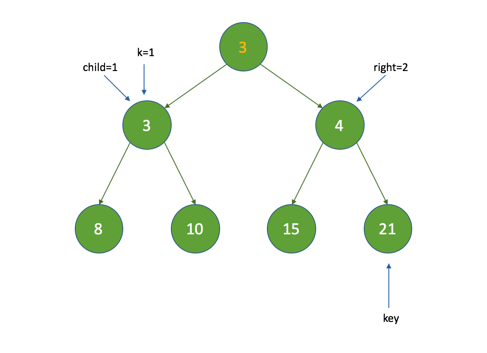

[TOC]

# 线程池

高并发情况下频繁的创建和销毁线程还是会消耗不少的系统资源。

**如果并发的请求数量非常多，但每个线程执行的时间很短，则会频繁的创建和销毁线程，从而降低系统的效率。可能出现服务器在为每个请求创建新线程和销毁线程上花费的时间和消耗的系统资源要比处理实际的用户请求的时间和资源更多。**

**针对：单个任务处理时间比较短，同时需要处理的任务数量很大时候推荐使用**。

**使用线程池的好处**

- 降低资源消耗。通过重复利用已创建的线程降低线程创建和销毁造成的消耗。
- 提高响应速度。当任务到达时，任务可以不需要的等到线程创建就能立即执行。
- 提高线程的可管理性。线程是稀缺资源，如果无限制的创建，不仅会消耗系统资源，还会降低系统的稳定性，使用线程池可以进行统一的分配，调优和监控。

先看一下线程池的类图：


## 一、Executor 框架接口

Executor 框架是一个根据一组执行策略调用，调度，执行和控制的异步任务的框架，提供一种将「任务提交」与「任务如何运行」分离开来的机制。

J.U.C 中有三个 Executor 接口：

- Executor：一个运行新任务的简单接口；
- ExecutorService：扩展了 Executor 接口，添加了一些用来管理执行器生命周期和任务生命周期的方法；
- ScheduledExecutorService：扩展了ExecutorService。支持Future和定期执行任务。

### （一）Executor接口

```java
public interface Executor {
    void execute(Runnable command);
}
```

Executor 接口只有一个 `execute()` 方法，用来替代通常创建或启动线程的方法。例如，使用 Thread 来创建并启动线程的代码如下：

```java
// 使用 Thread 创建并且启动线程
Thread t = new Thread();
t.start();

// 使用 Executor 创建和启动线程
Thread t = new Thread();
executor.execute(t);
```

对于不同的 Executor 实现，execute() 方法可能是创建一个新线程并立即启动，也有可能是使用已有的工作线程来运行传入的任务，也可能是根据设置线程池的容量或者阻塞队列的容量来决定是否要将传入的线程放入阻塞队列中或者拒绝接收传入的线程。

### （二）ExecutorService 接口

ExecutorService 接口继承自 Executor 接口，提供了管理终止的方法，以及可为跟踪一个或多个异步任务执行状况而生成 Future 的方法。增加了`shutDown()`，`shutDownNow()`，`invokeAll()`，`invokeAny()` 和 `submit()` 等方法。如果需要支持即时关闭，也就是 `shutDownNow()` 方法，则任务需要正确处理中断。

### （三）ScheduledExecutorService 接口

ScheduledExecutorService 扩展 ExecutorService 接口并增加了 schedule 方法。调用 schedule 方法可以在指定的延时后执行一个 Runnable 或者 Callable 任务。该接口还定义了按照指定时间间隔定期执行任务的`scheduleAtFixedRate()` 方法和 `scheduleWithFixedDelay()` 方法。

## 二、Excutor 接口

- 执行用户获取其它线程提交过来的任务。
- 将任务的提交和任务的执行进行解耦。

该接口的实现较多，其中比较重要的是 `ExecutorService`，该接口继承 Excutor 接口同时新增了一些方法。该接口的进一步抽象继承类为 AbstractExecutorService，对 ExecutorService 接口中部分方法进行了默认实现。进一步的最重要的实现类为 ThreadPoolExecutor 类。


**创建线程池示例**：Executors 的工厂方法

```java
package com.gjxaiou.threadPool;

import java.util.concurrent.ExecutorService;
import java.util.concurrent.Executors;
import java.util.stream.IntStream;

public class MyTest1 {
    public static void main(String[] args) {
        /**
         * 创建线程池
         * 方式一：直接 new ThreadPoolExecutor
         * 方式二：通过 Executors 创建
         */

        // 创建一个包括 3 个线程的固定大小的线程池
        ExecutorService executorService = Executors.newFixedThreadPool(3);

        // submit 中是待执行的任务
        executorService.submit(() -> {
            // 循环 5 次输出当前线程名称
            IntStream.range(0, 5).forEach(i -> {
                System.out.println(Thread.currentThread().getName());
            });
        });
        
        // 补充关闭线程池的地方
    }
}
```

执行结果为：

```java
pool-1-thread-1
pool-1-thread-1
pool-1-thread-1
pool-1-thread-1
pool-1-thread-1
```

输出以上结果之后，程序并没有停止，即 JVM 并没有退出。

因为线程池中创建的线程并不是守护线程，而是用户线程。JVM 退出需要在主线程执行完成并且没有任何的用户线程在执行。如果需要退出 JVM ，因此需要在执行完之后显式的关闭线程池：`executorService.shutdown();`

上面代码仅仅是向线程池中提交了一个任务，下面是多次提交任务。线程池中共 3 个线程，执行 5 个任务。

```java
package com.gjxaiou.threadPool;

import java.util.concurrent.ExecutorService;
import java.util.concurrent.Executors;
import java.util.stream.IntStream;

public class MyTest2 {
    public static void main(String[] args) {
        ExecutorService executorService = Executors.newFixedThreadPool(3);

        IntStream.range(0, 5).forEach(i -> {
            executorService.submit(() -> {
                IntStream.range(0, 2).forEach(j -> {
                    System.out.println(Thread.currentThread().getName());
                });
            });
        });
        executorService.shutdown();
    }
}
```

输出结果为：

```java
pool-1-thread-1
pool-1-thread-1
pool-1-thread-2
pool-1-thread-2
pool-1-thread-2
pool-1-thread-2
pool-1-thread-1
pool-1-thread-1
pool-1-thread-3
pool-1-thread-3
```

以上是通过工厂模式创建线程池，但是不推荐使用的原因如下：

因为 ThreadPoolExecutor 构造方法有很多参数，所有很多时候是根据具体业务需求进行定制的。比如阻塞队列使用 工厂模式来进行创建话默认是创建无限大小的阻塞队列（然后在高并发的情况下，很有可能会出现内存溢出的情况），还有就是其默认是使用的拒绝策略就是抛异常（即使不抛异常使用内置的四种拒绝方法依然不符合实际要求）

## 三、ThreadPoolExecutor 分析

### （一）构造方法中的参数分析

- `int  corePoolSize`：线程池中一直维护的线程数量，如果线程池处于任务空闲期间，那么该线程也并不会被回收掉；

- `int maximumPoolSize`：线程池中所维护的线程数的最大数量；

- `long keepAliveTime`：超过了 corePoolSize 的线程在经过 keepAliveTime 时间后如果一直处于空闲状态，那么超过的这部分线程将会被回收掉；

- `TimeUnit unit`： keepAliveTime 的时间单位；

- `BlockingQueue<Runnable> workQueue`：向线程池所提交的任务通过封装为 worker 对象位于的阻塞队列（BlockingQueue 接口有多种具体实现），主要包括：LinkedBlockingQueue 和 ArrayBlockingQueue； 

    保存等待执行的任务的阻塞队列，当提交一个新的任务到线程池以后, 线程池会根据当前线程池中正在运行着的线程的数量来决定对该任务的处理方式，主要有以下几种处理方式:

    1. **直接切换**：这种方式常用的队列是SynchronousQueue，但现在还没有研究过该队列，这里暂时还没法介绍；

    2. **使用无界队列**：一般使用基于链表的阻塞队列LinkedBlockingQueue。如果使用这种方式，那么线程池中能够创建的最大线程数就是corePoolSize，而maximumPoolSize就不会起作用了（后面也会说到）。当线程池中所有的核心线程都是RUNNING状态时，这时一个新的任务提交就会放入等待队列中。

    3. 使用有界队列

        一般使用ArrayBlockingQueue。使用该方式可以将线程池的最大线程数量限制为maximumPoolSize，这样能够降低资源的消耗，但同时这种方式也使得线程池对线程的调度变得更困难，因为线程池和队列的容量都是有限的值，所以要想使线程池处理任务的吞吐率达到一个相对合理的范围，又想使线程调度相对简单，并且还要尽可能的降低线程池对资源的消耗，就需要合理的设置这两个数量。

        - 如果要想降低系统资源的消耗（包括CPU的使用率，操作系统资源的消耗，上下文环境切换的开销等）, 可以设置较大的队列容量和较小的线程池容量, 但这样也会降低线程处理任务的吞吐量。
        - 如果提交的任务经常发生阻塞，那么可以考虑通过调用 setMaximumPoolSize() 方法来重新设定线程池的容量。
        - 如果队列的容量设置的较小，通常需要将线程池的容量设置大一点，这样CPU的使用率会相对的高一些。但如果线程池的容量设置的过大，则在提交的任务数量太多的情况下，并发量会增加，那么线程之间的调度就是一个要考虑的问题，因为这样反而有可能降低处理任务的吞吐量。

- `ThreadFactory  threadFactory`：线程工厂，用于创建新的线程并被线程池所管理，默认线程工厂所创建的线程都是用户线程且优先级为正常优先级。该接口的常用实现类为：Executors 类中的`DefaultThreadFactory` 类。

    ```java
      static class DefaultThreadFactory implements ThreadFactory {
            // 因为在系统中可能创建多个线程池，并且则多个线程池可能都是由 DefaultThreadFactory 来创建生成的，所以该变量设置为 static 之后，所有线程池都基于该变量进行增加。Pool-1
            private static final AtomicInteger poolNumber = new AtomicInteger(1);
            private final ThreadGroup group;
            // 线程是归属于线程池的，一个线程不可能归属多个线程池，所以一定是归属于某一个工厂对象的。
            private final AtomicInteger threadNumber = new AtomicInteger(1);
            private final String namePrefix;
    
            DefaultThreadFactory() {
                SecurityManager s = System.getSecurityManager();
                group = (s != null) ? s.getThreadGroup() :
                        Thread.currentThread().getThreadGroup();
                namePrefix = "pool-" +
                        poolNumber.getAndIncrement() +
                        "-thread-";
            }
    
            public Thread newThread(Runnable r) {
                Thread t = new Thread(group, r,
                        namePrefix + threadNumber.getAndIncrement(),
                        0);
                // 如果创建的线程是守护线程
                if (t.isDaemon())
                    // 将其变成用户线程
                    t.setDaemon(false);
                // 设置新建线程的优先级为默认优先级
                if (t.getPriority() != Thread.NORM_PRIORITY)
                    t.setPriority(Thread.NORM_PRIORITY);
                return t;
            }
        }
    ```
    
- `RejectedExecutionHandler  handler`：表示当线程池中的线程都在忙于执行任务且阻塞队列也已经满了的情况下，新到来的任务该如何被对待和处理。
    它有四种实现策略，对应该接口在 ThreadPoolExecutor 类中四个内部类：

1. - AbortPolicy：直接抛出一个运行期异常，抛给调用者。【默认】
    - DiscardPolicy：默默地丢弃掉提交的任务，什么都不做且不抛出任何异常；
    - DiscardoldestPolicy：丢弃掉阻塞队列中存放时间最久的任务(队头元素)，并且为当前所提交的任务留出一个队列中的空闲空间，以便将其放进到队列中（不一定能放入，因为可能刚刚丢弃其他线程就提交任务占据空闲空间了）；
    - CallerRunsPolicy：直接由提交任务的线程来运行这个提交的任务（不是使用线程池中线程）。


### （二）常见的线程池

- newFixedThreadPool 分析： 

    ```java
    public static ExecutorService newFixedThreadPool(int nThreads) {
        return new ThreadPoolExecutor(nThreads, nThreads,
                                      0L, TimeUnit.MILLISECONDS,
                                      new LinkedBlockingQueue<Runnable>());
    }
    ```

    提供一个无界队列（的阻塞队列），拒绝策略为 `defaultHandler`。即直接抛出异常的固定大小线程池。

- newSingleThreadExecutor（线程数固定为 1 的上述线程池）。 

    ```java
    public static ExecutorService newSingleThreadExecutor() {
        return new FinalizableDelegatedExecutorService
            (new ThreadPoolExecutor(1, 1,
                                    0L, TimeUnit.MILLISECONDS,
                                    new LinkedBlockingQueue<Runnable>()));
    }
    ```

- newCachedThreadPool，默认保持的线程数为 0，最多创建 Int 的最大值数目，拒绝策略也是 defaultHandler

    ```java
    public static ExecutorService newCachedThreadPool() {
        return new ThreadPoolExecutor(0, Integer.MAX_VALUE,
                                      60L, TimeUnit.SECONDS,
                                      new SynchronousQueue<Runnable>());
    }
    ```

    其中阻塞队列是 SynchronizedQueue，是一个同步队列【插入操作必须等移除操作完成才行，反之亦然】，该队列中只有一个元素。

**不推荐使用上述的三种工厂方法创建线程池的原因**：

- 所有的拒绝策略都是 `defaultHandler`，即都是抛出异常。
- 前两种的阻塞队列都是无界的 `LinkedBlockingQueue`，因此当并发大的情况下造成任务过多使得该阻塞队列不断的增大，从而会出现 OOM 问题。

**在线程池中，尽量将偏向锁的标记关闭（因为线程池本来就是用来处理多线程的）**


### （三）ThreadPoolExecutor 使用

示例一：

```java
package com.gjxaiou.threadPool;

import java.util.concurrent.ExecutorService;
import java.util.concurrent.LinkedBlockingQueue;
import java.util.concurrent.ThreadPoolExecutor;
import java.util.concurrent.TimeUnit;
import java.util.stream.IntStream;

public class MyTest3 {
    public static void main(String[] args) {
        // 核心线程数为 3，最大为 5， 等待时间为 0， 阻塞队列长度为 3， 拒绝策略是直接抛异常
        ExecutorService executorService = new ThreadPoolExecutor(3, 5, 0,
                TimeUnit.MILLISECONDS, new LinkedBlockingQueue<>(3),
                new ThreadPoolExecutor.AbortPolicy());

        // 向线程池提交 9 个任务
        IntStream.range(0, 9).forEach(i -> {
            executorService.submit(() -> {
                try {
                    Thread.sleep(100);
                } catch (InterruptedException exception) {
                    exception.printStackTrace();
                }

                IntStream.range(0, 2).forEach(j -> {
                    System.out.println(Thread.currentThread().getName());
                });
            });
        });

        // 关闭线程池
        executorService.shutdown();
    }
}
```

当向上述代码所示，向线程池提交 9 或以上任务时候，会抛出异常，如下所示：

```java
 Exception in thread "main" java.util.concurrent.RejectedExecutionException: Task java.util.concurrent.FutureTask@568db2f2 rejected from java.util.concurrent.ThreadPoolExecutor@378bf509[Running, pool size = 5, active threads = 5, queued tasks = 3, completed tasks = 0]
	at java.util.concurrent.ThreadPoolExecutor$AbortPolicy.rejectedExecution(ThreadPoolExecutor.java:2063)
	at java.util.concurrent.ThreadPoolExecutor.reject(ThreadPoolExecutor.java:830)
	at java.util.concurrent.ThreadPoolExecutor.execute(ThreadPoolExecutor.java:1379)
	at java.util.concurrent.AbstractExecutorService.submit(AbstractExecutorService.java:112)
	at com.gjxaiou.threadPool.MyTest3.lambda$main$2(MyTest3.java:18)
	at java.util.stream.Streams$RangeIntSpliterator.forEachRemaining(Streams.java:110)
	at java.util.stream.IntPipeline$Head.forEach(IntPipeline.java:559)
	at com.gjxaiou.threadPool.MyTest3.main(MyTest3.java:17)
pool-1-thread-2
pool-1-thread-2
pool-1-thread-3
pool-1-thread-3
pool-1-thread-1
pool-1-thread-1
pool-1-thread-4
pool-1-thread-4
pool-1-thread-5
pool-1-thread-5
pool-1-thread-3
pool-1-thread-3
pool-1-thread-2
pool-1-thread-2
pool-1-thread-1
pool-1-thread-1
```

如结果所示，已经创建了 5 个线程来执行任务。报错结果中信息为：`[Running, pool size = 5, active threads = 5, queued tasks = 3, completed tasks = 0]` 。因为最多创建  5 个线程，同时执行最多只能执行 5 个任务，然后阻塞队列大小为 3，即最多处理 8 个任务，现在出现 9 个任务，同时因为调用 sleep 则所有线程都在执行任务，所以针对第九个任务则需要使用拒绝策略，即直接抛出了异常。

如果将上述代码中的拒绝策略修改为：`DiscardPolicy()`。即

```java
 ExecutorService executorService = new ThreadPoolExecutor(3, 5, 0,
                TimeUnit.MILLISECONDS, new LinkedBlockingQueue<>(3),
                new ThreadPoolExecutor.DiscardPolicy());
```

输出结果为：将最后一个任务进行丢弃处理了。

```java
pool-1-thread-2
pool-1-thread-2
pool-1-thread-4
pool-1-thread-4
pool-1-thread-5
pool-1-thread-5
pool-1-thread-3
pool-1-thread-3
pool-1-thread-1
pool-1-thread-1
pool-1-thread-5
pool-1-thread-5
pool-1-thread-4
pool-1-thread-4
pool-1-thread-2
pool-1-thread-2
```

因为每个任务是输出两行，一共 16 行，即丢弃了一个任务。

如果拒绝策略为：`DiscardOldestPolicy()`。结果同样为 16 行，这里是将阻塞队列的第一个任务进行丢弃了。

如果拒绝策略为：`CallerRunsPolicy()`，执行结果为：

```java
pool-1-thread-5
pool-1-thread-5
pool-1-thread-2
pool-1-thread-2
pool-1-thread-3
pool-1-thread-3
pool-1-thread-1
pool-1-thread-1
pool-1-thread-4
pool-1-thread-4
main
main
pool-1-thread-3
pool-1-thread-3
pool-1-thread-5
pool-1-thread-5
pool-1-thread-2
pool-1-thread-2
```

最后一个任务无法放入线程池和阻塞队列，则该任务就由提交该任务的线程执行，这里就是 main 线程。（因为该任务是由 main() 方法提交，即由 main() 方法所在线程进行执行）。

### （四）线程池内部执行机理解读

最顶层的 Executor 只提供了 execute() 方法，里面接收的是 Runnable 实例。而其实现类 ExecutorService 中提供了一个 submit() 方法，接收的是 Callable 实例，可以有返回值。但是其实 submit() 方法有多个重载版本，既可以接收 Runnable 也可以接收 Callable 实例。同时 submit() 返回结果为 Future 类型（因为是异步执行的），通过 get() 方法获取结果【get 方法是一个阻塞方法，会等方法执行完才能拿到结果】，只不过如果接受 Callable 实例会获取结果，接受 Runnable  实例通过 get() 方法的返回值为 null。

```java
// 下面都在 ExecutorService 类中

// 提交一个拥有返回值的任务用于执行，并且返回一个 Future，该 Future 表示该任务的挂起结果，当成功执行的时候，Future 的 get 返回将返回执行结果。
<T> Future<T> submit(Callable<T> task);
// 提交一个 Runnable 类型任务去执行，并且返回一个 Future 代表这个任务，当执行成功之后 Future 的 get 返回 null
Future<?> submit(Runnable task);
// 提交一个 Runnable 类型任务进行执行，然后返回一个 Future 代表这个任务，当任务执行成功之后，Future 的 get 方法返回的是给定的 result 结果。
<T> Future<T> submit(Runnable task, T result);
```

**submit 和 execute 方法**

对于线程池来说，其提供了 execute 与 submit 两种方式来向线程池提交任务，但是总体来说，submit 方法是可以取代 execute 方法的，因为它既可以接收 Callable 任务, 也可以接收 Runnable任务。

### （五）关于线程池的总体执行策略:

- 如果线程池中正在执行的线程数 < corePoolSize，那么线程池就会优先选择创建新的线程而非将提交的任务加到阻塞队列中，即使线程池中其它线程为空闲状态。

- 如果线程池中正在执行的线程数 >= corePoolSize，那么线程池就会优先选择对提交的任务进行阻塞排队而非创建新的线程。

- 如果提交的任务无法加入到阻塞队列当中（阻塞队列已满），那么线程池就会创建新的线程；如果创建的线程数超过了maximumPoolSize，那么拒绝策略就会起作用。

### （六）对应 AbstractExecutorService 和 ThreadPoolExecutor 源码的流程分析：

首先向线程池提交任务可以分为两大类（四小种方法重构），即 submit 和 execute 方法。但是最终都要调用 execute  方法。

```java
// ============== AbstractExecutorService ===============
public <T> Future<T> submit(Runnable task, T result) {
    if (task == null) throw new NullPointerException();
    RunnableFuture<T> ftask = newTaskFor(task, result);
    execute(ftask);
    return ftask;
}

protected <T> RunnableFuture<T> newTaskFor(Runnable runnable, T value) {
    return new FutureTask<T>(runnable, value);
}

// ============ FutureTask ==========
// FutureTask 的构造方法
public FutureTask(Runnable runnable, V result) {
    this.callable = Executors.callable(runnable, result);
    this.state = NEW;       // ensure visibility of callable
}

// ============ Executors ===========
public static <T> Callable<T> callable(Runnable task, T result) {
    if (task == null)
        throw new NullPointerException();
    return new RunnableAdapter<T>(task, result);
}

static final class RunnableAdapter<T> implements Callable<T> {
    final Runnable task;
    final T result;
    RunnableAdapter(Runnable task, T result) {
        this.task = task;
        this.result = result;
    }
    public T call() {
        task.run();
        return result;
    }
}
```

其中 RunnableFuture 接口继承了 Runnable 和 Future，表示分别代表了任务本身和任务的执行结果两个组件，即本身又是任务也是任务的执行结果。

当 submit 方法传入 Runnable 实例的时候，`newTaskFor()` 方法会创建一个 FutureTask 对象，在创建对象的构造方法中会通过调用 `Executors.callable()`将 Runnable 转换为 Callable。

callable() 方法会创建一个 Runnable 适配器对象 RunnableAdapter 对象，执行流程为：

首先进行基本的赋值，然后 call 方法直接调用任务的 run() 方法，并且直接将 result 返回，该返回值就是 callable 的返回结果。

即无论是 Runnable 对象还是 Callable 对象，在线程池中都通过 RunnableAdapter 适配器都转换为了 Callable 对象，便于后续统一执行。

因为 submit() 方法中 ftask 为 RunnableFuture 类型，并且继承了 Runnable，所以其本身作为 Runnable 类型任务传入 Executor 接口的 executor() 方法中，而 Executor 接口的常用实现类 ThreadPoolExecutor 对于该方法的实现为：


#### 关于线程池任务提交的总结:

- 两种提交方式：submit 与 execute

- submit 有三种方式，无论哪种方式，最终都是将传递进来的任务转换为一个 callable 对象进行处理

- 当 callable 对象构造完毕后， 最终都会调用 Executor 接口中声明的 execute 方法进行统一的处理 ，执行的就是构造出来的 RunnableFuture 对象。

- 对于线程池来说，存在两个状态需要维护：体现在 ThreadPoolExecutor
    - 线程池本身的状态（runstate）：使用 32 位的 ct1 值的高 3 位（前 3 位）来表示
    - 线程池中所运行着的有效线程的数量（workerCount）：ct1 的其余 29 位来表示

     ```java
    // ctl 的值有两层含义：一是线程池本身的状态（用 32 位的 ctl 值的前 3 位表示），二是线程池中维护的线程个数（后面的 29 位）
        private final AtomicInteger ctl = new AtomicInteger(ctlOf(RUNNING, 0));
        // COUNT_BITS 值为 29
        private static final int COUNT_BITS = Integer.SIZE - 3;
        // CAPACITY 为 1 左移 29 位然后减一，即 workerCount 的最大值，大约为 5 亿。
        private static final int CAPACITY = (1 << COUNT_BITS) - 1;
    
        // runState is stored in the high-order bits
        private static final int RUNNING = -1 << COUNT_BITS;
        private static final int SHUTDOWN = 0 << COUNT_BITS;
        private static final int STOP = 1 << COUNT_BITS;
        private static final int TIDYING = 2 << COUNT_BITS;
        private static final int TERMINATED = 3 << COUNT_BITS;
    
        // Packing and unpacking ctl
        // 获取当前线程状态
        private static int runStateOf(int c) {
            return c & ~CAPACITY;
        }
    
        // 当前线程池中线程运行数量（活动线程数）
        private static int workerCountOf(int c) {
            return c & CAPACITY;
        }
    
        // 重新获取 ctl 值，即获取运行状态和活动线程数的值
        private static int ctlOf(int rs, int wc) {
            return rs | wc;
        }
     ```
    

#### 线程池的五种状态

- RUNNING: 线程池可以接收新的任务提交，并且还可以正常处理阻塞队列中的任务。刚刚创建时候的状态：

    ```java
    // ctl 开始处于 Running 状态，同时线程数为 0
    private final AtomicInteger ctl = new AtomicInteger(ctlOf(RUNNING, 0));
    ```

- SHUTDOWN：不再接收新的任务提交，不过线程池**可以继续处理阻塞队列中的任务**。

- STOP：不再接收新的任务，同时还会丢弃阻塞队列中的既有任务；此外，它还会中断正在处理中的任务。

- TIDYING：所有的任务都执行完毕后(线程池中的和阻塞队列中的任务)，当前线程池中的活动的有效线程数量 workerCount 降为 0。

- TERMINATED：线程池的终止状态，当 terminated 方法执行完毕后，线程池将会处于该状态之下。

    进入 TERMINATED 状态的条件：线程池不是 RUNNING、TIDYING 或者 TERMINATED 状态，即线程池是 SHUTDOWN 状态并且 workerQueue 为空，workerCount 为 0，并且设置 TIDYING 状态成功。

**线程池状态迁移**

- RUNNING -> SHUTDOWN：当调用了线程池的 shutdown() 方法时，或者当 Object 类的 finalize 方法被隐式调用后(该方法内部会调用 shutdown 方法) 

- RUNNING,SHUTDOWN -> STOP：当调用了线程池的 shutdownNow() 方法时 

- SHUTDOWN -> TIDYING：在线程池与阻塞队列均变为空时 

- STOP -> TIDYING：在线程池变为空时
- TIDYING -> TERMINATED：在 terminated() 方法被执行完毕时候


#### ThreadPoolExecutor 中的核心方法 execute() 执行逻辑

分三步进行：

- 步骤一：如果正在运行的线程少于 corePoolSize，请尝试以给定的命令作为其第一个任务来启动新线程。对addWorker 的调用以原子方式检查 runState 和 workerCount，因此可以通过返回 false 来防止错误警报，从而在不应该添加线程时添加线程。  

- 步骤二：如果一个任务可以成功地添加到队列中，那么我们仍然需要仔细检查是否应该添加一个线程（因为自从上次检查以来已有的线程已经死了），或者在进入这个方法之后池是否关闭了。因此，我们重新检查状态，如果有必要，在停止排队时回滚排队，如果没有，则启动一个新线程。  

- 步骤三：如果无法将任务排队，则尝试添加新线程。如果失败了，我们知道我们已经关闭或者饱和了，所以拒绝这个任务。

```java
/**
     * 将会在某个未来时间执行给定的任务（就是参数中的 command)，该任务可能由新创建的线程来执行，同时也可能有线程池中已有的线程来执行。
     * `execute()`方法用于提交不需要返回值的任务，所以无法判断任务是否被线程池执行成功。
     */
public void execute(Runnable command) {
    if (command == null)
        throw new NullPointerException();
    
       // 获取线程池状态 runState 和工作线程数 workerCount
		int c = ctl.get();
		// 线程池中正在执行的线程数量
		if (workerCountOf(c) < corePoolSize) {
			// 创建一个线程，同时将提交的 command 任务作为该线程的第一个任务进行执行
			if (addWorker(command, true))
				return;
			// 可能存在多处调用线程池，因此要获取新的线程池状态。
			c = ctl.get();
		}
		// 如果线程池是运行状态，并且任务添加到队列成功
		// offer 作用是将指定任务插入到队列中
		if (isRunning(c) && workQueue.offer(command)) {
			// 重新获取 ctl 值
			int recheck = ctl.get();
			// 再次判断线程池的运行状态，如果不是运行状态，由于之前已经把 command 添加到 workQueue 中了，此时需要移除该 command，执行过后通过 handler 使用拒绝策略对该任务进行处理，整个方法返回。
			// 相当于回滚
			if (!isRunning(recheck) && remove(command))
				reject(command);
				/*
				 * 获取线程池中的有效线程数，如果数量是0，则执行addWorker方法
				 * 这里传入的参数表示：
				 * 1. 第一个参数为null，表示在线程池中创建一个线程，但不去启动；
				 * 2. 第二个参数为false，将线程池的有限线程数量的上限设置为maximumPoolSize，添加线程时根据maximumPoolSize来判断；
				 * 如果判断workerCount大于0，则直接返回，在workQueue中新增的command会在将来的某个时刻被执行。
				 */
			else if (workerCountOf(recheck) == 0)
                /**
                 这里要注意一下addWorker(null, false); ，也就是创建一个线程，但并没
有传入任务，因为任务已经被添加到workQueue中了，所以worker在执行的时
候，会直接从workQueue中获取任务。所以，在workerCountOf(recheck)
== 0 时执行addWorker(null, false); 也是为了保证线程池在RUNNING状态
下必须要有一个线程来执行任务。
                 */
				addWorker(null, false);
			// 例如线程池被关闭了
			/*
			 * 如果执行到这里，有两种情况：
			 * 1. 线程池已经不是RUNNING状态；
			 * 2. 线程池是RUNNING状态，但workerCount >= corePoolSize并且workQueue已满。
			 * 这时，再次调用addWorker方法，但第二个参数传入为false，将线程池的有限线程数量的上限设置为maximumPoolSize；
			 * 如果失败则拒绝该任务
			 */
		} else if (!addWorker(command, false))
			reject(command);
}
```

简单来说，在执行execute()方法时如果状态一直是RUNNING时，的执行过程如下：

1. 如果`workerCount < corePoolSize`，则创建并启动一个线程来执行新提交的任务；
2. 如果`workerCount >= corePoolSize`，且线程池内的阻塞队列未满，则将任务添加到该阻塞队列中；
3. 如果`workerCount >= corePoolSize && workerCount < maximumPoolSize`，且线程池内的阻塞队列已满，则创建并启动一个线程来执行新提交的任务；
4. 如果`workerCount >= maximumPoolSize`，并且线程池内的阻塞队列已满, 则根据拒绝策略来处理该任务, 默认的处理方式是直接抛异常。


针对其中的 `addWorker`方法分析如下：

该方法用于在线程池中创建一个新的线程并执行。 

* 检查是否可以根据当前池状态和给定的绑定（核心或最大值）添加新的辅助进程。如果是这样，则相应地调整worker计数，如果可能，将创建并启动一个新的worker，并将 firstTask 作为其第一个任务运行。如果线程池已停止或有资格关闭，则此方法返回false。如果线程工厂在被请求时无法创建线程，它也会返回false。如果线程创建失败，或者是由于线程工厂返回 null，或者是由于异常（通常是线程.开始（）），我们干净利落地回滚。
* firstTask 是新创建的线程首先应该执行的任务（如果没有则为 null）。在方法 execute() 中 Workers 带着初始任务被创建，当总线程数小于核心线程数或者队列满了时候时候会绕过阻塞队列（即直接执行该任务），
* core 为一个状态值，如果为 true 则用 corePoolSize 作为判断边界，如果为 false 则用 maximumPoolSize  作为判断边界
* @return true if successful

```java
private boolean addWorker(Runnable firstTask, boolean core) {
    // 第一部分作用：通过 CAS 将线程池线程数目 + 1
    retry:
    for (; ; ) {
        int c = ctl.get();
        // rs 为运行状态
        int rs = runStateOf(c);

        // 首先判断应不应该创建线程
        /**
			 * 如果 rs >= SHUTDOWN，则表示此时不再接收新任务
			 * 如果以下三个条件中有一个不满足，则返回 false
			 * 1. rs == SHUTDOWN，此时表示关闭状态，不再接受新提交的任务，但可以继续处理阻塞队列中已保存的任务。
			 * 2. firstStack 为空。
			 * 3.阻塞队列不为空
			 * 首先考虑 rs == SHUTDOWN 情况，因为是关闭状态，所以不会接受新提交的任务，所以当 firstTask 不为空的时候返回 false。
			 * 然后如果 firstTask 为空，同时 workQueue 也为空，则因为队列中已经没有任务了，不需要再添加线程，所以返回 false。
			 */
        if (rs >= SHUTDOWN &&
            !(rs == SHUTDOWN &&
              firstTask == null &&
              !workQueue.isEmpty()))
            return false;

        for (; ; ) {
            // 获取工作线程数
            int wc = workerCountOf(c);
            // 当前线程池数量大于线程池中允许的最大数量或者判断边界，则不能再创建了
            if (wc >= CAPACITY ||
                wc >= (core ? corePoolSize : maximumPoolSize))
                return false;
            // CAS 增加一个线程数量，如果成功增加 workerCount 则跳出第一个循环
            if (compareAndIncrementWorkerCount(c))
                break retry;
            // 如果增加失败则重新获取 ctl 值。
            c = ctl.get();  // Re-read ctl
            // 不等则线程池状态已经变化了。如果两者相等则线程池状态没有改变只在下面 for 循环内部再次执行。如果不等则需要在外部 for 循环进行重复
            if (runStateOf(c) != rs)
                continue retry;
            // else CAS failed due to workerCount change; retry inner loop
        }
    }

    // 第二部分作用：创建线程并执行当前任务

    boolean workerStarted = false;
    boolean workerAdded = false;
    // Worker 就是待创建的线程，Worker 是 AQS 的子类并且实现 Runnable
    Worker w = null;
    try {
        // 创建一个 Worker 对象，通过线程工厂创建新的线程。同时将 AQS 中的 state 的值设置为 -1，表示不让线程创建好且执行前被中断。
        // 即根据 firstTask 来创建 Worker 对象，然后每一个 Worker 对象都会创建一个线程
        w = new Worker(firstTask);
        final Thread t = w.thread;
        if (t != null) {
            // 首先拿到互斥锁
            final ReentrantLock mainLock = this.mainLock;
            mainLock.lock();
            try {
                // Recheck while holding lock.
                // Back out on ThreadFactory failure or if
                // shut down before lock acquired.
                int rs = runStateOf(ctl.get());

                // 如果 rs < SHUTDOWN，即为 RUNNING 状态；
                // 如果 rs 为 RUNNING 或者 SHUTDOWN 状态，并且 firstTask 为空，向线程池中添加线程，因为 SHUTDOWN 
                // 状态虽然不会添加新的任务但是需要执行 workQueue 中的任务。
                if (rs < SHUTDOWN ||
                    (rs == SHUTDOWN && firstTask == null)) {
                    if (t.isAlive()) // precheck that t is startable
                        throw new IllegalThreadStateException();
                    // workers 是一个 Hashset，即线程池中的线程都封装为 worker 之后都放到 HashSET 中
                    workers.add(w);
                    int s = workers.size();
                    // largestPoolSize 记录最大线程数大小
                    if (s > largestPoolSize)
                        largestPoolSize = s;
                    workerAdded = true;
                }
            } finally {
                mainLock.unlock();
            }
            if (workerAdded) {
                // 具体执行调用 ThreadPoolExecutor 内部类 Worker 中的 runWorker 方法，同时 Worker 本身实现了 
                // Runnable 接口，所以 Worker 类型的对象也是一个线程。
                t.start();
                workerStarted = true;
            }
        }
    } finally {
        // 回滚操作：如果添加到 Workers 的 set 集合中就移除，并且数量减少，然后释放锁。
        if (!workerStarted)
            addWorkerFailed(w);
    }
    return workerStarted;
}
```

**针对 Worker 对象进行分析**

线程池中的每一个线程被封装为一个 Worker 对象，ThreadPool 维护的其实就是一组 Worker 对象。

Worker 对象即是一个 AQS 也是一个线程对象。

```java
private final class Worker extends AbstractQueuedSynchronizer
    implements Runnable {
    // 这个类永远不会被序列化，但是我们提供了 serialVersionUID 来抑制 javac 警告。
    private static final long serialVersionUID = 6138294804551838833L;

    // worker 正在运行中的 Thread，如果工厂失败则为 null，因为 thread 是在调用构造方法时通过 ThreadFactory
    // 来创建的线程，是用于处理任务的线程。
    final Thread thread;

    // 保存传入的任务，即要运行的初始任务，可能为 null
    Runnable firstTask;
    /**
		 * Per-thread task counter
		 */
    volatile long completedTasks;

    /**
		 * Creates with given first task and thread from ThreadFactory.
		 *
		 * @param firstTask the first task (null if none)
		 */
    Worker(Runnable firstTask) {
        setState(-1); // inhibit interrupts until runWorker
        this.firstTask = firstTask;
        this.thread = getThreadFactory().newThread(this);
    }

    /**
		 * Delegates main run loop to outer runWorker
		 */
    public void run() {
        runWorker(this);
    }

    /**
		 * 说明是排它锁(独占锁)
		 * 0 为未锁定状态，1 为锁定状态。
		 * @return
		 */
    protected boolean isHeldExclusively() {
        return getState() != 0;
    }

    protected boolean tryAcquire(int unused) {
        if (compareAndSetState(0, 1)) {
            setExclusiveOwnerThread(Thread.currentThread());
            return true;
        }
        return false;
    }

    protected boolean tryRelease(int unused) {
        setExclusiveOwnerThread(null);
        setState(0);
        return true;
    }

    public void lock() {
        acquire(1);
    }

    public boolean tryLock() {
        return tryAcquire(1);
    }

    public void unlock() {
        release(1);
    }

    public boolean isLocked() {
        return isHeldExclusively();
    }

    void interruptIfStarted() {
        Thread t;
        if (getState() >= 0 && (t = thread) != null && !t.isInterrupted()) {
            try {
                t.interrupt();
            } catch (SecurityException ignore) {
            }
        }
    }
}
```

Worker继承了AQS，使用AQS来实现独占锁的功能。为什么不使用ReentrantLock
来实现呢？可以看到tryAcquire方法，它是不允许重入的，而ReentrantLock是允
许重入的：
1. lock方法一旦获取了独占锁，表示当前线程正在执行任务中；
2. 如果正在执行任务，则不应该中断线程；
3. 如果该线程现在不是独占锁的状态，也就是空闲的状态，说明它没有在处理任务，这时可以对该线程进行中断；
4. 线程池在执行shutdown方法或tryTerminate方法时会调用 interruptIdleWorkers 方法来中断空闲的线程，interruptIdleWorkers方法会使
用tryLock方法来判断线程池中的线程是否是空闲状态；
5. 之所以设置为不可重入，是因为我们不希望任务在调用像setCorePoolSize 这样的线程池控制方法时重新获取锁。如果使用ReentrantLock，它是可重入的，这样如果在任务中调用了如setCorePoolSize这类线程池控制的方法，会中断正在运行的线程。
所以，Worker继承自AQS，用于判断线程是否空闲以及是否可以被中断。

此外，在构造方法中执行了setState(-1); ，把state变量设置为-1，为什么这么做呢？是因为AQS中默认的state是0，如果刚创建了一个Worker对象，还没有执行任务时，这时就不应该被中断，看一下tryAquire方法：
tryAcquire方法是根据state是否是0来判断的，所以， setState(-1); 将state设置为-1是为了禁止在执行任务前对线程进行中断。
正因为如此，在runWorker方法中会先调用Worker对象的unlock方法将state设置为0.

在 Worker 的构造函数中使用线程工厂 `getThreadFactory().newThread(this);`  来创建 Thread，传入的 Runnable 类型对象 this 就是当前的 Worker 实例对象。然后调用 start() 之后就会执行该 Runnable 类型的 Worker 实例的 run() 方法，而 run() 方法调用的是 runWorker(this) 方法，就是对线程任务的执行过程。即 runWorker() 方法代表线程池真正运行任务的 worker 线程所执行任务的逻辑。

```java
/**
     * 这里使用了模板方法模式，在父类中的 runWorker 定义了执行的逻辑，子类可以重写 beforeExecute() 和 afterExecute() 来自定义
     * @param w
     */
final void runWorker(Worker w) {
    Thread wt = Thread.currentThread();
    // 获取第一个任务
    Runnable task = w.firstTask;
    // 将 worker 里面的任务置为 null
    w.firstTask = null;
    /**
         * 针对 unlock() 分析：
         *   自身的 unlock() 方法调用 AQS 的 release(1)，然后调用 tryRelease()，这里调用了子类 ThreadPoolExecutor 重写的
         *   tryRelease() 方法，内容如下：
         *    protected boolean tryRelease(int unused) {
         *             // 将排它的线程设置为空，相当于释放锁
         *             setExclusiveOwnerThread(null);
         *             // 因为在创建 Worker 对象的时候显示的将 state 设置为 -1（因为 shutdown() 方法只会中断 state >= 0
         *             的线程，这里 -1 就是防止在启动之前就被 shutdown)，因此这里需要显示调用将其设置为
         *             0，表示没有任何线程持有锁，因为已经启动准备执行任务了，因此运行被 shutdown()）
         *             setState(0);
         *             return true;
         *    }
         *
         *    总结：作用一：将排它锁数量置为 0；作用二：该线程可被 shutdown 中断
         */
    w.unlock(); // 允许中断
    // 是否因为异常而退出循环
    boolean completedAbruptly = true;
    try {
        // task != null => 在向线程池提交任务时候，创建的 worker 线程的时候，将该任务传输给了 worker 线程
        // 如果 task == null，即传入的 firstTask 为空，则通过 getTask() 从阻塞队列中获取第一个任务
        while (task != null || (task = getTask()) != null) {
            // worker 对象本身为 AQS，调用其 lock() 进行加锁
            w.lock();
            // If pool is stopping, ensure thread is interrupted;
            // if not, ensure thread is not interrupted.  This
            // requires a recheck in second case to deal with
            // shutdownNow race while clearing interrupt
            // 判断线程池是不是处于 STOP 状态，如果是则当前线程应该处于中断状态
            if ((runStateAtLeast(ctl.get(), STOP) ||
                 (Thread.interrupted() &&
                  runStateAtLeast(ctl.get(), STOP))) &&
                !wt.isInterrupted())
                wt.interrupt();
            try {
                // 在执行任务之前可以预先执行一些逻辑，子类可以进行重新该方法
                beforeExecute(wt, task);
                Throwable thrown = null;
                try {
                    // 调用 run() 方法进行执行任务
                    task.run();
                } catch (RuntimeException x) {
                    thrown = x;
                    throw x;
                } catch (Error x) {
                    thrown = x;
                    throw x;
                } catch (Throwable x) {
                    thrown = x;
                    throw new Error(x);
                } finally {
                    // 在执行后做一些逻辑，子类可以进行重新该方法
                    afterExecute(task, thrown);
                }
            } finally {
                task = null;
                // 对于每个 worker 线程对象所完成的任务数目，用于统计作用
                w.completedTasks++;
                w.unlock();
            }
        }
        completedAbruptly = false;
    } finally {
        // 增加线程池总完成数目、从 worker 的 SET 集合中移除该 set，释放锁等操作
        processWorkerExit(w, completedAbruptly);
    }
}
```

这里说明一下第一个if判断，目的是：

- 如果线程池正在停止，那么要保证当前线程是中断状态；

- 如果不是的话，则要保证当前线程不是中断状态； 

这里要考虑在执行该if语句期间可能也执行了shutdownNow方法，shutdownNow
方法会把状态设置为STOP，回顾一下STOP状态：

> 不能接受新任务，也不处理队列中的任务，会中断正在处理任务的线程。
> 在线程池处于 RUNNING 或 SHUTDOWN 状态时，调用 shutdownNow() 方法
> 会使线程池进入到该状态。 

STOP状态要中断线程池中的所有线程，而这里使用Thread.interrupted() 来判断是否中断是为了确保在RUNNING或者SHUTDOWN状态时线程是非中断状态的，因为Thread.interrupted()方法会复位中断的状态。
总结一下runWorker方法的执行过程：
1. while循环不断地通过getTask()方法获取任务；
2. getTask()方法从阻塞队列中取任务；
3. 如果线程池正在停止，那么要保证当前线程是中断状态，否则要保证当前
线程不是中断状态；
4. 调用task.run() 执行任务；
5. 如果task为null则跳出循环，执行processWorkerExit()方法；
6. runWorker方法执行完毕，也代表着Worker中的run方法执行完毕，销毁线
程。

这里的beforeExecute方法和afterExecute方法在ThreadPoolExecutor类中是空的，留给子类来实现。
completedAbruptly变量来表示在执行任务过程中是否出现了异常，在 processWorkerExit 方法中会对该变量的值进行判断。

#### getTask方法

getTask方法用来从阻塞队列中取任务，代码如下：

```java
private Runnable getTask() {
    // timeOut变量的值表示上次从阻塞队列中取任务时是否超时
    boolean timedOut = false; // Did the last poll() time out?

    for (;;) {
        int c = ctl.get();
        int rs = runStateOf(c);

        // Check if queue empty only if necessary.
        /*
         * 如果线程池状态rs >= SHUTDOWN，也就是非RUNNING状态，再进行以下判断：
         * 1. rs >= STOP，线程池是否正在stop；
         * 2. 阻塞队列是否为空。
         * 如果以上条件满足，则将workerCount减1并返回null。
         * 因为如果当前线程池状态的值是SHUTDOWN或以上时，不允许再向阻塞队列中添加任务。
         */
        if (rs >= SHUTDOWN && (rs >= STOP || workQueue.isEmpty())) {
            decrementWorkerCount();
            return null;
        }

        int wc = workerCountOf(c);

        // Are workers subject to culling?
        // timed变量用于判断是否需要进行超时控制。
        // allowCoreThreadTimeOut默认是false，也就是核心线程不允许进行超时；
        // wc > corePoolSize，表示当前线程池中的线程数量大于核心线程数量；
        // 对于超过核心线程数量的这些线程，需要进行超时控制
        boolean timed = allowCoreThreadTimeOut || wc > corePoolSize;
        
        /*
         * wc > maximumPoolSize的情况是因为可能在此方法执行阶段同时执行了setMaximumPoolSize方法；
         * timed && timedOut 如果为true，表示当前操作需要进行超时控制，并且上次从阻塞队列中获取任务发生了超时
         * 接下来判断，如果有效线程数量大于1，或者阻塞队列是空的，那么尝试将workerCount减1；
         * 如果减1失败，则返回重试。
         * 如果wc == 1时，也就说明当前线程是线程池中唯一的一个线程了。
         */
        if ((wc > maximumPoolSize || (timed && timedOut))
            && (wc > 1 || workQueue.isEmpty())) {
            if (compareAndDecrementWorkerCount(c))
                return null;
            continue;
        }

        try {
            /*
             * 根据timed来判断，如果为true，则通过阻塞队列的poll方法进行超时控制，如果在keepAliveTime时间内没有获取到任务，则返回null；
             * 否则通过take方法，如果这时队列为空，则take方法会阻塞直到队列不为空。
             * 
             */
            Runnable r = timed ?
                workQueue.poll(keepAliveTime, TimeUnit.NANOSECONDS) :
                workQueue.take();
            if (r != null)
                return r;
            // 如果 r == null，说明已经超时，timedOut设置为true
            timedOut = true;
        } catch (InterruptedException retry) {
            // 如果获取任务时当前线程发生了中断，则设置timedOut为false并返回循环重试
            timedOut = false;
        }
    }
}
```

这里重要的地方是第二个if判断，目的是控制线程池的有效线程数量。由上文中的分析可以知道，在执行execute方法时，如果当前线程池的线程数量超过了corePoolSize且小于maximumPoolSize，并且workQueue已满时，则可以增加工作线程，但这时如果超时没有获取到任务，也就是timedOut为true的情况，说明workQueue已经为空了，也就说明了当前线程池中不需要那么多线程来执行任务了，可以把多于corePoolSize数量的线程销毁掉，保持线程数量在corePoolSize即可。

什么时候会销毁？当然是runWorker方法执行完之后，也就是Worker中的run方法执行完，由JVM自动回收。

getTask方法返回null时，在runWorker方法中会跳出while循环，然后会执行processWorkerExit方法。

#### processWorkerExit方法

```java
private void processWorkerExit(Worker w, boolean completedAbruptly) {
    // 如果completedAbruptly值为true，则说明线程执行时出现了异常，需要将workerCount减1；
    // 如果线程执行时没有出现异常，说明在getTask()方法中已经已经对workerCount进行了减1操作，这里就不必再减了。  
    if (completedAbruptly) // If abrupt, then workerCount wasn't adjusted
        decrementWorkerCount();

    final ReentrantLock mainLock = this.mainLock;
    mainLock.lock();
    try {
        //统计完成的任务数
        completedTaskCount += w.completedTasks;
        // 从workers中移除，也就表示着从线程池中移除了一个工作线程
        workers.remove(w);
    } finally {
        mainLock.unlock();
    }

    // 根据线程池状态进行判断是否结束线程池
    tryTerminate();

    int c = ctl.get();
    /*
     * 当线程池是RUNNING或SHUTDOWN状态时，如果worker是异常结束，那么会直接addWorker；
     * 如果allowCoreThreadTimeOut=true，并且等待队列有任务，至少保留一个worker；
     * 如果allowCoreThreadTimeOut=false，workerCount不少于corePoolSize。
     */
    if (runStateLessThan(c, STOP)) {
        if (!completedAbruptly) {
            int min = allowCoreThreadTimeOut ? 0 : corePoolSize;
            if (min == 0 && ! workQueue.isEmpty())
                min = 1;
            if (workerCountOf(c) >= min)
                return; // replacement not needed
        }
        addWorker(null, false);
    }
}
```

至此，processWorkerExit执行完之后，工作线程被销毁，以上就是整个工作线程的生命周期，从execute方法开始，Worker使用ThreadFactory创建新的工作线程，runWorker通过getTask获取任务，然后执行任务，如果getTask返回null，进入processWorkerExit方法，整个线程结束，如图所示：


#### tryTerminate方法

tryTerminate方法根据线程池状态进行判断是否结束线程池，代码如下：

```
final void tryTerminate() {
    for (;;) {
        int c = ctl.get();
        /*
         * 当前线程池的状态为以下几种情况时，直接返回：
         * 1. RUNNING，因为还在运行中，不能停止；
         * 2. TIDYING或TERMINATED，因为线程池中已经没有正在运行的线程了；
         * 3. SHUTDOWN并且等待队列非空，这时要执行完workQueue中的task；
         */
        if (isRunning(c) ||
            runStateAtLeast(c, TIDYING) ||
            (runStateOf(c) == SHUTDOWN && ! workQueue.isEmpty()))
            return;
        // 如果线程数量不为0，则中断一个空闲的工作线程，并返回
        if (workerCountOf(c) != 0) { // Eligible to terminate
            interruptIdleWorkers(ONLY_ONE);
            return;
        }

        final ReentrantLock mainLock = this.mainLock;
        mainLock.lock();
        try {
            // 这里尝试设置状态为TIDYING，如果设置成功，则调用terminated方法
            if (ctl.compareAndSet(c, ctlOf(TIDYING, 0))) {
                try {
                    // terminated方法默认什么都不做，留给子类实现
                    terminated();
                } finally {
                    // 设置状态为TERMINATED
                    ctl.set(ctlOf(TERMINATED, 0));
                    termination.signalAll();
                }
                return;
            }
        } finally {
            mainLock.unlock();
        }
        // else retry on failed CAS
    }
}
```

`interruptIdleWorkers(ONLY_ONE);`的作用是因为在getTask方法中执行`workQueue.take()`时，如果不执行中断会一直阻塞。在下面介绍的shutdown方法中，会中断所有空闲的工作线程，如果在执行shutdown时工作线程没有空闲，然后又去调用了getTask方法，这时如果workQueue中没有任务了，调用`workQueue.take()`时就会一直阻塞。所以每次在工作线程结束时调用tryTerminate方法来尝试中断一个空闲工作线程，避免在队列为空时取任务一直阻塞的情况。

线程池关闭：shutdown 和 shutdownNow

**首先针对 shutdown**：

shutdown() 方法要将线程池切换到 SHUTDOWN 状态，并且调用 interruptldleWorkers 方法请求中断所有空闲的 worker，最后调用 tryTerminate 尝试结束线程池。

```java
public void shutdown() {
    final ReentrantLock mainLock = this.mainLock;
    mainLock.lock();
    try {
        // 权限检查
        checkShutdownAccess();
        // 提前将线程池的运行状态设置为 shutdown
        advanceRunState(SHUTDOWN);
        // 中断空闲的(当前没有执行任务的) workers，正在执行任务的 workers 是不能中断的【主要通过 tryLock()
        // 判断是不是在执行任务，因为如果在执行任务，则锁已经被持有了，就获取不到了，则不会执行 Interrupt 方法。】
        interruptIdleWorkers();
        onShutdown(); // hook for ScheduledThreadPoolExecutor
    } finally {
        mainLock.unlock();
    }
    // 会调用 signalAll() 方法来唤醒曾经调用 awaitTermination() 方法而阻塞在当前 condition 对象上的所有线程。即尝试结束线程池。
    tryTerminate();
}
```

- 会拒绝新任务的提交
- 不会丢弃任务队列中已有的任务，一直等到所有的任务都执行完成，线程池才会进入关闭状态（Terminated 状态）。
- 该方法会**立刻返回**，即不会等待提交的任务执行完毕才返回（即调用完成之后往下执行，此时可能还在执行任务）

同时可以显式的调用  awaitTerminted(long timeout, TimeUnit  unit) 方法，并且设置超时时间，因为该方法是一个阻塞的方法，阻塞一直等到在调用 shutdown 之后所有的任务都执行完毕、或者超时、或者当前线程被中断了。该方法返回的  boolean 值的含义是：true 表示任务都执行完毕（线程池终止了）、false 表示超时了（任务还没执行完），如果被中断则会抛出 InterruptedException。

通过在 shutdown() 之后显示的调用 awaitTerminted() 方法并且设置相应的超时时间，这样就可以判断当前的线程池是不是已经关闭（任务是不是全部执行完成了）。

这里思考一个问题：在runWorker方法中，执行任务时对Worker对象w进行了lock操作，为什么要在执行任务的时候对每个工作线程都加锁呢？

下面仔细分析一下：

- 在getTask方法中，如果这时线程池的状态是SHUTDOWN并且workQueue为空，那么就应该返回null来结束这个工作线程，而使线程池进入SHUTDOWN状态需要调用shutdown方法；
- shutdown方法会调用interruptIdleWorkers来中断空闲的线程，interruptIdleWorkers持有mainLock，会遍历workers来逐个判断工作线程是否空闲。但getTask方法中没有mainLock；
- 在getTask中，如果判断当前线程池状态是RUNNING，并且阻塞队列为空，那么会调用`workQueue.take()`进行阻塞；
- 如果在判断当前线程池状态是RUNNING后，这时调用了shutdown方法把状态改为了SHUTDOWN，这时如果不进行中断，那么当前的工作线程在调用了`workQueue.take()`后会一直阻塞而不会被销毁，因为在SHUTDOWN状态下不允许再有新的任务添加到workQueue中，这样一来线程池永远都关闭不了了；
- 由上可知，shutdown方法与getTask方法（从队列中获取任务时）存在竞态条件；
- 解决这一问题就需要用到线程的中断，也就是为什么要用interruptIdleWorkers方法。在调用`workQueue.take()`时，如果发现当前线程在执行之前或者执行期间是中断状态，则会抛出InterruptedException，解除阻塞的状态；
- 但是要中断工作线程，还要判断工作线程是否是空闲的，如果工作线程正在处理任务，就不应该发生中断；
- 所以Worker继承自AQS，在工作线程处理任务时会进行lock，interruptIdleWorkers在进行中断时会使用tryLock来判断该工作线程是否正在处理任务，如果tryLock返回true，说明该工作线程当前未执行任务，这时才可以被中断。

下面就来分析一下interruptIdleWorkers方法。

#### interruptIdleWorkers方法

```java
private void interruptIdleWorkers() {
    interruptIdleWorkers(false);
}

private void interruptIdleWorkers(boolean onlyOne) {
    final ReentrantLock mainLock = this.mainLock;
    mainLock.lock();
    try {
        for (Worker w : workers) {
            Thread t = w.thread;
            if (!t.isInterrupted() && w.tryLock()) {
                try {
                    t.interrupt();
                } catch (SecurityException ignore) {
                } finally {
                    w.unlock();
                }
            }
            if (onlyOne)
                break;
        }
    } finally {
        mainLock.unlock();
    }
}
```

interruptIdleWorkers遍历workers中所有的工作线程，若线程没有被中断tryLock成功，就中断该线程。

为什么需要持有mainLock？因为workers是HashSet类型的，不能保证线程安全。

**针对 shutdownNow**：

```java
/**
     * 尝试停止所有正在执行的任务，停止正在等待的任务的处理，并返回正在等待执行的任务的列表。从该方法返回时，这些任务将从任务队列中排出（删除）。
     * 此方法不会等待主动执行的任务终止。使用{@link#awaitTermination}来完成。
     * 除了尽最大努力停止处理正在执行的任务之外，没有其他保证。此实现通过{@link Thread#interrupt}取消任务，因此任何未能响应中断的任务都可能永远不会终止。
     */
public List<Runnable> shutdownNow() {
    List<Runnable> tasks;
    final ReentrantLock mainLock = this.mainLock;
    mainLock.lock();
    try {
        checkShutdownAccess();
        // 直接设置为 STOP 状态
        advanceRunState(STOP);
        // 会中断所有任务的执行，即遍历所有的 worker 集合，然后使用 interruptIfStarted 即如果启动了就进行中断
        interruptWorkers();
        // 将阻塞队列中的任务放置如该 tasks 列表
        tasks = drainQueue();
    } finally {
        mainLock.unlock();
    }
    tryTerminate();
    return tasks;
}
```

- 会拒绝新任务的提交
- 会停止正在执行任务的线程，同时也不会再执行阻塞队列中的任务，并将这些任务作为 List 返回。

这里需要使用代码的截图来进行证实上面的观点。（基本的分析从submit->Executor->addworker->work->runwork（awaittermination，processworkExit，shutdown，shutdownnow））

**shutdownNow方法与shutdown方法类似，不同的地方在于：**

1. 设置状态为STOP；
2. 中断所有工作线程，无论是否是空闲的；
3. 取出阻塞队列中没有被执行的任务并返回。

shutdownNow方法执行完之后调用tryTerminate方法，该方法在上文已经分析过了，目的就是使线程池的状态设置为TERMINATED。

#### 修改线程池名称

因为实际项目中可能存在多个线程池，通过根据业务来自定义线程池的命名，这样在调试的时候可以快速的查看有问题的线程池。因为默认线程的构建是通过Executors 类内部的 defaultThreadFactory 类实现的，该类是接口 ThreadFactory 接口的默认实现，我们可以自定义该接口的实现类然后在创建线程时候使用。

主要将 namePrefix 可以作为构造方法的参数传入，这样就可以自定义了，示例如：

```java
package com.gjxaiou.threadPool;

import java.util.concurrent.ThreadFactory;
import java.util.concurrent.atomic.AtomicInteger;


public class MyThreadFactory implements ThreadFactory {
    // 因为在系统中可能创建多个线程池，并且则多个线程池可能都是由 DefaultThreadFactory 来创建生成的，所以该变量设置为 static
    // 之后，所有线程池都基于该变量进行增加。Pool-1
    private static final AtomicInteger poolNumber = new AtomicInteger(1);
    private ThreadGroup group;
    // 线程是归属于线程池的，一个线程不可能归属多个线程池，所以一定是归属于某一个工厂对象的。
    private final AtomicInteger threadNumber = new AtomicInteger(1);
    private String namePrefix;

    MyThreadFactory(String namePrefix) {
        SecurityManager s = System.getSecurityManager();
        group = (s != null) ? s.getThreadGroup() :
                Thread.currentThread().getThreadGroup();
        this.namePrefix = namePrefix;
    }

    public Thread newThread(Runnable r) {
        Thread t = new Thread(group, r,
                namePrefix + threadNumber.getAndIncrement(),
                0);
        // 如果创建的线程是守护线程
        if (t.isDaemon())
            // 将其变成用户线程
            t.setDaemon(false);
        // 设置新建线程的优先级为默认优先级
        if (t.getPriority() != Thread.NORM_PRIORITY)
            t.setPriority(Thread.NORM_PRIORITY);
        return t;
    }
}
```

在使用的时候，通过 ThreadPoolExecutor 构造线程池的时候，其中 ThreadFactory  既可以传入我们自定义的线程工厂对象。 


#### 针对拒绝策略：DiscardPolicy 和 DiscardOldest

当向线程池提交一个任务的之后，会执行 execute() 方法，该方法会调用 addWorker() 。但是如果我们提交通过 submit() 带返回值（Callable ） 进行任务提交。该方法的返回值是一个 Future 对象，因为该对象的 get 方法是一个受阻塞的方法，一直需要等待线程池中任务执行完毕之后才能返回，否则会一直等待。

submit() 方法中通过 newTaskFor() 方法创建了一个 FutureTask，而 FutureTask 是 RunnableTask 的一个实现，因为对于 FutureTask 是有状态的，在 FutureTask 的构造函数中直接将状态值设置为 NEW（值为 0， state 值共 7 种），当调用 get 方法时候需要判断该 task 是否执行完成，在 FutureTask 中是通过 state 状态值来判断任务是否完成的。

```java
// FutureTask 部分源代码

public class FutureTask<V> implements RunnableFuture<V> {
    /**
     * Possible state transitions:
     * NEW -> COMPLETING -> NORMAL
     * NEW -> COMPLETING -> EXCEPTIONAL
     * NEW -> CANCELLED
     * NEW -> INTERRUPTING -> INTERRUPTED
     */
    private volatile int state;
    private static final int NEW          = 0;
    private static final int COMPLETING   = 1;
    private static final int NORMAL       = 2;
    private static final int EXCEPTIONAL  = 3;
    private static final int CANCELLED    = 4;
    private static final int INTERRUPTING = 5;
    private static final int INTERRUPTED  = 6;

    /** The underlying callable; nulled out after running */
    private Callable<V> callable;
    /** The result to return or exception to throw from get() */
    private Object outcome; // non-volatile, protected by state reads/writes
    /** The thread running the callable; CASed during run() */
    private volatile Thread runner;
    /** Treiber stack of waiting threads */
    private volatile WaitNode waiters;

    public FutureTask(Callable<V> callable) {
        if (callable == null)
            throw new NullPointerException();
        this.callable = callable;
        this.state = NEW;       // ensure visibility of callable
    }

    public FutureTask(Runnable runnable, V result) {
        this.callable = Executors.callable(runnable, result);
        this.state = NEW;       // ensure visibility of callable
    }

    /**
     * @throws CancellationException {@inheritDoc}
     */
    public V get() throws InterruptedException, ExecutionException {
        int s = state;
        if (s <= COMPLETING)
            // 用于等待任务完成，任务完成之后就会修改 state 的值
            s = awaitDone(false, 0L);
        // 返回任务的执行结果
        return report(s);
    }
}
```

当我们将任务通过 submit 提交给线程池之后，会将任务创建为 FutureTask 对象，并且状态 state 设置为 New（0），当前任务刚刚创建出来，既没有放置到阻塞队列中也没有应用拒绝策略。然后 submit 会将任务转调给 execute()，在execute() 中会调用 addWorker() 要么将任务放置到阻塞队列中，要么执行。但是如果阻塞队列满了并且线程数达到最大设置值了，则该任务只能使用拒绝策略。而拒绝策略对任务没有任何的修改，会直接丢弃，所以丢弃的任务状态值仍然为 0，但是当通过 submit 将任务提交到线程池之后，会返回 Future 结果，如果提交之后就调用 get 方法，则获取不到值，因为该方法会一直阻塞，无法往下执行。

所以使用的时候使用带超时时间的 get 方法，这样如果超时会抛出 TimeoutException，然后继续往下执行。


### （七）线程池的监控

通过线程池提供的参数进行监控。线程池里有一些属性在监控线程池的时候可以使用

- **getTaskCount**：线程池已经执行的和未执行的任务总数；
- **getCompletedTaskCount**：线程池已完成的任务数量，该值小于等于taskCount；
- **getLargestPoolSize**：线程池曾经创建过的最大线程数量。通过这个数据可以知道线程池是否满过，也就是达到了maximumPoolSize；
- **getPoolSize**：线程池当前的线程数量；
- **getActiveCount**：当前线程池中正在执行任务的线程数量。

通过这些方法，可以对线程池进行监控，在ThreadPoolExecutor类中提供了几个空方法，如beforeExecute方法，afterExecute方法和terminated方法，可以扩展这些方法在执行前或执行后增加一些新的操作，例如统计线程池的执行任务的时间等，可以继承自ThreadPoolExecutor来进行扩展。

### （八）总结

本文比较详细的分析了线程池的工作流程，总体来说有如下几个内容：

- 分析了线程的创建，任务的提交，状态的转换以及线程池的关闭；
- 这里通过execute方法来展开线程池的工作流程，execute方法通过corePoolSize，maximumPoolSize以及阻塞队列的大小来判断决定传入的任务应该被立即执行，还是应该添加到阻塞队列中，还是应该拒绝任务。
- 介绍了线程池关闭时的过程，也分析了shutdown方法与getTask方法存在竞态条件；
- 在获取任务时，要通过线程池的状态来判断应该结束工作线程还是阻塞线程等待新的任务，也解释了为什么关闭线程池时要中断工作线程以及为什么每一个worker都需要lock。

在向线程池提交任务时，除了execute方法，还有一个submit方法，submit方法会返回一个Future对象用于获取返回值，有关Future和Callable请自行了解一下相关的文章，这里就不介绍了。

## 四、深入理解Java线程池：ScheduledThreadPoolExecutor

### （一）介绍

自JDK1.5开始，JDK提供了ScheduledThreadPoolExecutor类来支持周期性任务的调度。在这之前的实现需要依靠Timer和TimerTask或者其它第三方工具来完成。但Timer有不少的缺陷：

- Timer是单线程模式；
- 如果在执行任务期间某个TimerTask耗时较久，那么就会影响其它任务的调度；
- Timer的任务调度是基于绝对时间的，对系统时间敏感；
- Timer不会捕获执行TimerTask时所抛出的异常，由于Timer是单线程，所以一旦出现异常，则线程就会终止，其他任务也得不到执行。

ScheduledThreadPoolExecutor继承ThreadPoolExecutor来重用线程池的功能，它的实现方式如下：

- 将任务封装成ScheduledFutureTask对象，ScheduledFutureTask基于相对时间，不受系统时间的改变所影响；
- ScheduledFutureTask实现了`java.lang.Comparable`接口和`java.util.concurrent.Delayed`接口，所以有两个重要的方法：compareTo和getDelay。compareTo方法用于比较任务之间的优先级关系，如果距离下次执行的时间间隔较短，则优先级高；getDelay方法用于返回距离下次任务执行时间的时间间隔；
- ScheduledThreadPoolExecutor定义了一个DelayedWorkQueue，它是一个有序队列，会通过每个任务按照距离下次执行时间间隔的大小来排序；
- ScheduledFutureTask继承自FutureTask，可以通过返回Future对象来获取执行的结果。

通过如上的介绍，可以对比一下Timer和ScheduledThreadPoolExecutor：

| Timer                                            | ScheduledThreadPoolExecutor            |
| :----------------------------------------------- | :------------------------------------- |
| 单线程                                           | 多线程                                 |
| 单个任务执行时间影响其他任务调度                 | 多线程，不会影响                       |
| 基于绝对时间                                     | 基于相对时间                           |
| 一旦执行任务出现异常不会捕获，其他任务得不到执行 | 多线程，单个任务的执行不会影响其他线程 |

所以，在JDK1.5之后，应该没什么理由继续使用Timer进行任务调度了。


### （二）ScheduledThreadPoolExecutor 的使用

下面用一个具体的例子来说明ScheduledThreadPoolExecutor的使用：

```java
public class ScheduledThreadPoolTest {

    public static void main(String[] args) throws InterruptedException {
        // 创建大小为5的线程池
        ScheduledExecutorService scheduledThreadPool = Executors.newScheduledThreadPool(5);

        for (int i = 0; i < 3; i++) {
            Task worker = new Task("task-" + i);
            // 只执行一次
//          scheduledThreadPool.schedule(worker, 5, TimeUnit.SECONDS);
            // 周期性执行，每5秒执行一次
            scheduledThreadPool.scheduleAtFixedRate(worker, 0,5, TimeUnit.SECONDS);
        }

        Thread.sleep(10000);

        System.out.println("Shutting down executor...");
        // 关闭线程池
        scheduledThreadPool.shutdown();
        boolean isDone;
        // 等待线程池终止
        do {
            isDone = scheduledThreadPool.awaitTermination(1, TimeUnit.DAYS);
            System.out.println("awaitTermination...");
        } while(!isDone);

        System.out.println("Finished all threads");
    }


}


class Task implements Runnable {

    private String name;

    public Task(String name) {
        this.name = name;
    }

    @Override
    public void run() {
        System.out.println("name = " + name + ", startTime = " + new Date());
        try {
            Thread.sleep(1000);
        } catch (InterruptedException e) {
            e.printStackTrace();
        }
        System.out.println("name = " + name + ", endTime = " + new Date());
    }

}
```

下面就来具体分析一下ScheduledThreadPoolExecutor的实现过程。

### （三） ScheduledThreadPoolExecutor的实现

#### ScheduledThreadPoolExecutor的类结构

看下ScheduledThreadPoolExecutor内部的类图：

[](http://www.ideabuffer.cn/2017/04/14/深入理解Java线程池：ScheduledThreadPoolExecutor/QQ20170409-013110.png)

不要被这么多类吓到，这里只不过是为了更清楚的了解ScheduledThreadPoolExecutor有关调度和队列的接口。

ScheduledThreadPoolExecutor继承自ThreadPoolExecutor，实现了ScheduledExecutorService接口，该接口定义了schedule等任务调度的方法。

同时ScheduledThreadPoolExecutor有两个重要的内部类：DelayedWorkQueue和ScheduledFutureTask。可以看到，DelayeddWorkQueue是一个阻塞队列，而ScheduledFutureTask继承自FutureTask，并且实现了Delayed接口。有关FutureTask的介绍请参考另一篇文章：[FutureTask源码解析](http://www.ideabuffer.cn/2017/04/06/FutureTask源码解析/FutureTask源码解析/)。

#### ScheduledThreadPoolExecutor的构造方法

ScheduledThreadPoolExecutor有3中构造方法：

```java
public ScheduledThreadPoolExecutor(int corePoolSize,
                                    ThreadFactory threadFactory) {
    super(corePoolSize, Integer.MAX_VALUE, 0, NANOSECONDS,
          new DelayedWorkQueue(), threadFactory);
}

public ScheduledThreadPoolExecutor(int corePoolSize,
                                   RejectedExecutionHandler handler) {
    super(corePoolSize, Integer.MAX_VALUE, 0, NANOSECONDS,
          new DelayedWorkQueue(), handler);
}

public ScheduledThreadPoolExecutor(int corePoolSize,
                                   ThreadFactory threadFactory,
                                   RejectedExecutionHandler handler) {
    super(corePoolSize, Integer.MAX_VALUE, 0, NANOSECONDS,
          new DelayedWorkQueue(), threadFactory, handler);
}
```

因为ScheduledThreadPoolExecutor继承自ThreadPoolExecutor，所以这里都是调用的ThreadPoolExecutor类的构造方法。有关ThreadPoolExecutor可以参考[深入理解Java线程池：ThreadPoolExecutor](http://www.ideabuffer.cn/2017/04/04/深入理解Java线程池：ThreadPoolExecutor/)。

这里注意传入的阻塞队列是DelayedWorkQueue类型的对象。后面会详细介绍。

#### schedule方法

在上文的例子中，使用了schedule方法来进行任务调度，schedule方法的代码如下：

```java
public ScheduledFuture<?> schedule(Runnable command,
                                   long delay,
                                   TimeUnit unit) {
    if (command == null || unit == null)
        throw new NullPointerException();
    RunnableScheduledFuture<?> t = decorateTask(command,
        new ScheduledFutureTask<Void>(command, null,
                                      triggerTime(delay, unit)));
    delayedExecute(t);
    return t;
}


public <V> ScheduledFuture<V> schedule(Callable<V> callable,
                                       long delay,
                                       TimeUnit unit) {
    if (callable == null || unit == null)
        throw new NullPointerException();
    RunnableScheduledFuture<V> t = decorateTask(callable,
        new ScheduledFutureTask<V>(callable,
                                   triggerTime(delay, unit)));
    delayedExecute(t);
    return t;
}
```

首先，这里的两个重载的schedule方法只是传入的第一个参数不同，可以是Runnable对象或者Callable对象。会把传入的任务封装成一个RunnableScheduledFuture对象，其实也就是ScheduledFutureTask对象，decorateTask默认什么功能都没有做，子类可以重写该方法：

```java
/**
 * 修改或替换用于执行 runnable 的任务。此方法可重写用于管理内部任务的具体类。默认实现只返回给定任务。
 */
protected <V> RunnableScheduledFuture<V> decorateTask(
    Runnable runnable, RunnableScheduledFuture<V> task) {
    return task;
}

/**
 * 修改或替换用于执行 callable 的任务。此方法可重写用于管理内部任务的具体类。默认实现只返回给定任务。
 */
protected <V> RunnableScheduledFuture<V> decorateTask(
    Callable<V> callable, RunnableScheduledFuture<V> task) {
    return task;
}
```

然后，通过调用delayedExecute方法来延时执行任务。
最后，返回一个ScheduledFuture对象。

#### scheduleAtFixedRate方法

该方法设置了执行周期，下一次执行时间相当于是上一次的执行时间加上period，它是采用已固定的频率来执行任务：

```java
public ScheduledFuture<?> scheduleAtFixedRate(Runnable command,
                                              long initialDelay,
                                              long period,
                                              TimeUnit unit) {
    if (command == null || unit == null)
        throw new NullPointerException();
    if (period <= 0)
        throw new IllegalArgumentException();
    ScheduledFutureTask<Void> sft =
        new ScheduledFutureTask<Void>(command,
                                      null,
                                      triggerTime(initialDelay, unit),
                                      unit.toNanos(period));
    RunnableScheduledFuture<Void> t = decorateTask(command, sft);
    sft.outerTask = t;
    delayedExecute(t);
    return t;
}
```

#### scheduleWithFixedDelay方法

该方法设置了执行周期，与scheduleAtFixedRate方法不同的是，下一次执行时间是上一次任务执行完的系统时间加上period，因而具体执行时间不是固定的，但周期是固定的，是采用相对固定的延迟来执行任务：

```java
public ScheduledFuture<?> scheduleWithFixedDelay(Runnable command,
                                                 long initialDelay,
                                                 long delay,
                                                 TimeUnit unit) {
    if (command == null || unit == null)
        throw new NullPointerException();
    if (delay <= 0)
        throw new IllegalArgumentException();
    ScheduledFutureTask<Void> sft =
        new ScheduledFutureTask<Void>(command,
                                      null,
                                      triggerTime(initialDelay, unit),
                                      unit.toNanos(-delay));
    RunnableScheduledFuture<Void> t = decorateTask(command, sft);
    sft.outerTask = t;
    delayedExecute(t);
    return t;
}
```

注意这里的`unit.toNanos(-delay));`，这里把周期设置为负数来表示是相对固定的延迟执行。

scheduleAtFixedRate和scheduleWithFixedDelay的区别在setNextRunTime方法中就可以看出来：

```java
private void setNextRunTime() {
    long p = period;
    // 固定频率，上次执行时间加上周期时间
    if (p > 0)
        time += p;
    // 相对固定延迟执行，使用当前系统时间加上周期时间
    else
        time = triggerTime(-p);
}
```

setNextRunTime方法会在run方法中执行完任务后调用。

#### triggerTime方法

triggerTime方法用于获取下一次执行的具体时间：

```java
private long triggerTime(long delay, TimeUnit unit) {
    return triggerTime(unit.toNanos((delay < 0) ? 0 : delay));
}


long triggerTime(long delay) {
    return now() +
        ((delay < (Long.MAX_VALUE >> 1)) ? delay : overflowFree(delay));
}
```

这里的`delay < (Long.MAX_VALUE >> 1`是为了判断是否要防止Long类型溢出，如果delay的值小于Long类型最大值的一半，则直接返回delay，否则需要进行防止溢出处理。

#### overflowFree方法

该方法的作用是限制队列中所有节点的延迟时间在Long.MAX_VALUE之内，防止在compareTo方法中溢出。

```java
private long overflowFree(long delay) {
    // 获取队列中的第一个节点
    Delayed head = (Delayed) super.getQueue().peek();
    if (head != null) {
        // 获取延迟时间
        long headDelay = head.getDelay(NANOSECONDS);
        // 如果延迟时间小于0，并且 delay - headDelay 超过了Long.MAX_VALUE
        // 将delay设置为 Long.MAX_VALUE + headDelay 保证delay小于Long.MAX_VALUE
        if (headDelay < 0 && (delay - headDelay < 0))
            delay = Long.MAX_VALUE + headDelay;
    }
    return delay;
}
```

当一个任务已经可以执行出队操作，但还没有执行，可能由于线程池中的工作线程不是空闲的。具体分析一下这种情况：

- 为了方便说明，假设Long.MAX_VALUE=1023，也就是11位，并且当前的时间是100，调用triggerTime时并没有对delay进行判断，而是直接返回了`now() + delay`，也就是相当于`100 + 1023`，这肯定是溢出了，那么返回的时间是-925；
- 如果头节点已经可以出队但是还没有执行出队，那么头节点的执行时间应该是小于当前时间的，假设是95；
- 这时调用offer方法向队列中添加任务，在offer方法中会调用siftUp方法来排序，在siftUp方法执行时又会调用ScheduledFutureTask中的compareTo方法来比较执行时间；
- 这时如果执行到了compareTo方法中的`long diff = time - x.time;`时，那么计算后的结果就是`-925 - 95 = -1020`，那么将返回-1，而正常情况应该是返回1，因为新加入的任务的执行时间要比头结点的执行时间要晚，这就不是我们想要的结果了，这会导致队列中的顺序不正确。
- 同理也可以算一下在执行compareTo方法中的`long diff = getDelay(NANOSECONDS) - other.getDelay(NANOSECONDS);`时也会有这种情况；
- 所以在triggerTime方法中对delay的大小做了判断，就是为了防止这种情况发生。

如果执行了overflowFree方法呢，这时`headDelay = 95 - 100 = -5`，然后执行`delay = 1023 + (-5) = 1018`，那么triggerTime会返回`100 + 1018 = -930`，再执行compareTo方法中的`long diff = time - x.time;`时，`diff = -930 - 95 = -930 - 100 + 5 = 1018 + 5 = 1023`，没有溢出，符合正常的预期。

所以，overflowFree方法中把已经超时的部分时间给减去，就是为了避免在compareTo方法中出现溢出情况。

（说实话，这段代码看的很痛苦，一般情况下也不会发生这种情况，谁会传一个Long.MAX_VALUE呢。要知道Long.MAX_VALUE的纳秒数换算成年的话是292年，谁会这么无聊。。。）

#### ScheduledFutureTask的getDelay方法

```
public long getDelay(TimeUnit unit) {
    // 执行时间减去当前系统时间
    return unit.convert(time - now(), NANOSECONDS);
}
```

#### ScheduledFutureTask的构造方法

ScheduledFutureTask继承自FutureTask并实现了RunnableScheduledFuture接口，具体可以参考上文的类图，构造方法如下：

```java
ScheduledFutureTask(Runnable r, V result, long ns) {
    super(r, result);
    this.time = ns;
    this.period = 0;
    this.sequenceNumber = sequencer.getAndIncrement();
}

/**
 * Creates a periodic action with given nano time and period.
 */
ScheduledFutureTask(Runnable r, V result, long ns, long period) {
    super(r, result);
    this.time = ns;
    this.period = period;
    this.sequenceNumber = sequencer.getAndIncrement();
}

/**
 * Creates a one-shot action with given nanoTime-based trigger time.
 */
ScheduledFutureTask(Callable<V> callable, long ns) {
    super(callable);
    this.time = ns;
    this.period = 0;
    this.sequenceNumber = sequencer.getAndIncrement();
}
```

这里面有几个重要的属性，下面来解释一下：

- **time**：下次任务执行时的时间；
- **period**：执行周期；
- **sequenceNumber**：保存任务被添加到ScheduledThreadPoolExecutor中的序号。

在schedule方法中，创建完ScheduledFutureTask对象之后，会执行delayedExecute方法来执行任务。

#### delayedExecute方法

```java
private void delayedExecute(RunnableScheduledFuture<?> task) {
    // 如果线程池已经关闭，使用拒绝策略拒绝任务
    if (isShutdown())
        reject(task);
    else {
        // 添加到阻塞队列中
        super.getQueue().add(task);
        if (isShutdown() &&
            !canRunInCurrentRunState(task.isPeriodic()) &&
            remove(task))
            task.cancel(false);
        else
            // 确保线程池中至少有一个线程启动，即使corePoolSize为0
            // 该方法在ThreadPoolExecutor中实现
            ensurePrestart();
    }
}
```

说一下这里的第二个if判断：

1. 如果不是SHUTDOWN状态，执行else，否则执行步骤2；
2. 如果在当前线程池运行状态下可以执行任务，执行else，否则执行步骤3；
3. 从阻塞队列中删除任务，如果失败，执行else，否则执行步骤4；
4. 取消任务，但不中断执行中的任务。

对于步骤2，可以通过setContinueExistingPeriodicTasksAfterShutdownPolicy方法设置在线程池关闭时，周期任务继续执行，默认为false，也就是线程池关闭时，不再执行周期任务。

ensurePrestart方法在ThreadPoolExecutor中定义：

```
void ensurePrestart() {
    int wc = workerCountOf(ctl.get());
    if (wc < corePoolSize)
        addWorker(null, true);
    else if (wc == 0)
        addWorker(null, false);
}
```

调用了addWorker方法，可以在[深入理解Java线程池：ThreadPoolExecutor](http://www.ideabuffer.cn/2017/04/04/深入理解Java线程池：ThreadPoolExecutor/#addWorker方法)中查看addWorker方法的介绍，线程池中的工作线程是通过该方法来启动并执行任务的。

#### ScheduledFutureTask的run方法

回顾一下线程池的执行过程：当线程池中的工作线程启动时，不断地从阻塞队列中取出任务并执行，当然，取出的任务实现了Runnable接口，所以是通过调用任务的run方法来执行任务的。

这里的任务类型是ScheduledFutureTask，所以下面看一下ScheduledFutureTask的run方法：

```java
public void run() {
    // 是否是周期性任务
    boolean periodic = isPeriodic();
    // 当前线程池运行状态下如果不可以执行任务，取消该任务
    if (!canRunInCurrentRunState(periodic))
        cancel(false);
    // 如果不是周期性任务，调用FutureTask中的run方法执行
    else if (!periodic)
        ScheduledFutureTask.super.run();
    // 如果是周期性任务，调用FutureTask中的runAndReset方法执行
    // runAndReset方法不会设置执行结果，所以可以重复执行任务
    else if (ScheduledFutureTask.super.runAndReset()) {
        // 计算下次执行该任务的时间
        setNextRunTime();
        // 重复执行任务
        reExecutePeriodic(outerTask);
    }
}
```

有关FutureTask的run方法和runAndReset方法，可以参考[FutureTask源码解析](http://www.ideabuffer.cn/2017/04/06/FutureTask源码解析/FutureTask源码解析/)。

分析一下执行过程：

1. 如果当前线程池运行状态不可以执行任务，取消该任务，然后直接返回，否则执行步骤2；
2. 如果不是周期性任务，调用FutureTask中的run方法执行，会设置执行结果，然后直接返回，否则执行步骤3；
3. 如果是周期性任务，调用FutureTask中的runAndReset方法执行，不会设置执行结果，然后直接返回，否则执行步骤4和步骤5；
4. 计算下次执行该任务的具体时间；
5. 重复执行任务。

#### ScheduledFutureTask的reExecutePeriodic方法

```java
void reExecutePeriodic(RunnableScheduledFuture<?> task) {
    if (canRunInCurrentRunState(true)) {
        super.getQueue().add(task);
        if (!canRunInCurrentRunState(true) && remove(task))
            task.cancel(false);
        else
            ensurePrestart();
    }
}
```

该方法和delayedExecute方法类似，不同的是：

1. 由于调用reExecutePeriodic方法时已经执行过一次周期性任务了，所以不会reject当前任务；
2. 传入的任务一定是周期性任务。

#### onShutdown方法

onShutdown方法是ThreadPoolExecutor中的钩子方法，在ThreadPoolExecutor中什么都没有做，参考[深入理解Java线程池：ThreadPoolExecutor](http://www.ideabuffer.cn/2017/04/04/深入理解Java线程池：ThreadPoolExecutor/)，该方法是在执行shutdown方法时被调用：

```java
@Override void onShutdown() {
    BlockingQueue<Runnable> q = super.getQueue();
    // 获取在线程池已 shutdown 的情况下是否继续执行现有延迟任务
    boolean keepDelayed =
        getExecuteExistingDelayedTasksAfterShutdownPolicy();
    // 获取在线程池已 shutdown 的情况下是否继续执行现有定期任务
    boolean keepPeriodic =
        getContinueExistingPeriodicTasksAfterShutdownPolicy();
    // 如果在线程池已 shutdown 的情况下不继续执行延迟任务和定期任务
    // 则依次取消任务，否则则根据取消状态来判断
    if (!keepDelayed && !keepPeriodic) {
        for (Object e : q.toArray())
            if (e instanceof RunnableScheduledFuture<?>)
                ((RunnableScheduledFuture<?>) e).cancel(false);
        q.clear();
    }
    else {
        // Traverse snapshot to avoid iterator exceptions
        for (Object e : q.toArray()) {
            if (e instanceof RunnableScheduledFuture) {
                RunnableScheduledFuture<?> t =
                    (RunnableScheduledFuture<?>)e;
                // 如果有在 shutdown 后不继续的延迟任务或周期任务，则从队列中删除并取消任务
                if ((t.isPeriodic() ? !keepPeriodic : !keepDelayed) ||
                    t.isCancelled()) { // also remove if already cancelled
                    if (q.remove(t))
                        t.cancel(false);
                }
            }
        }
    }
    tryTerminate();
}
```

### （四）DelayedWorkQueue

ScheduledThreadPoolExecutor之所以要自己实现阻塞的工作队列，是因为ScheduledThreadPoolExecutor要求的工作队列有些特殊。

DelayedWorkQueue是一个基于堆的数据结构，类似于DelayQueue和PriorityQueue。在执行定时任务的时候，每个任务的执行时间都不同，所以DelayedWorkQueue的工作就是按照执行时间的升序来排列，执行时间距离当前时间越近的任务在队列的前面（**注意：这里的顺序并不是绝对的，堆中的排序只保证了子节点的下次执行时间要比父节点的下次执行时间要大，而叶子节点之间并不一定是顺序的，下文中会说明**）。

堆结构如下图所示：


可见，DelayedWorkQueue是一个基于最小堆结构的队列。堆结构可以使用数组表示，可以转换成如下的数组：


在这种结构中，可以发现有如下特性：

假设，索引值从0开始，子节点的索引值为k，父节点的索引值为p，则：

1. 一个节点的左子节点的索引为：k = p * 2 + 1；
2. 一个节点的右子节点的索引为：k = (p + 1) * 2；
3. 一个节点的父节点的索引为：p = (k - 1) / 2。

**为什么要使用DelayedWorkQueue呢？**

定时任务执行时需要取出最近要执行的任务，所以任务在队列中每次出队时一定要是当前队列中执行时间最靠前的，所以自然要使用优先级队列。

DelayedWorkQueue是一个优先级队列，它可以保证每次出队的任务都是当前队列中执行时间最靠前的，由于它是基于堆结构的队列，堆结构在执行插入和删除操作时的最坏时间复杂度是 *O(logN)*。

#### DelayedWorkQueue的属性

```
// 队列初始容量
private static final int INITIAL_CAPACITY = 16;
// 根据初始容量创建RunnableScheduledFuture类型的数组
private RunnableScheduledFuture<?>[] queue =
    new RunnableScheduledFuture<?>[INITIAL_CAPACITY];
private final ReentrantLock lock = new ReentrantLock();
private int size = 0;

// leader线程
private Thread leader = null;
// 当较新的任务在队列的头部可用时，或者新线程可能需要成为leader，则通过该条件发出信号
private final Condition available = lock.newCondition();
```

注意这里的leader，它是Leader-Follower模式的变体，用于减少不必要的定时等待。什么意思呢？对于多线程的网络模型来说：

> 所有线程会有三种身份中的一种：leader和follower，以及一个干活中的状态：proccesser。它的基本原则就是，永远最多只有一个leader。而所有follower都在等待成为leader。线程池启动时会自动产生一个Leader负责等待网络IO事件，当有一个事件产生时，Leader线程首先通知一个Follower线程将其提拔为新的Leader，然后自己就去干活了，去处理这个网络事件，处理完毕后加入Follower线程等待队列，等待下次成为Leader。这种方法可以增强CPU高速缓存相似性，及消除动态内存分配和线程间的数据交换。

*参考自：http://blog.csdn.net/goldlevi/article/details/7705180*

具体leader的作用在分析take方法时再详细介绍。

#### offer方法

既然是阻塞队列，入队的操作如add和put方法都调用了offer方法，下面查看一下offer方法：

```
public boolean offer(Runnable x) {
    if (x == null)
        throw new NullPointerException();
    RunnableScheduledFuture<?> e = (RunnableScheduledFuture<?>)x;
    final ReentrantLock lock = this.lock;
    lock.lock();
    try {
        int i = size;
        // queue是一个RunnableScheduledFuture类型的数组，如果容量不够需要扩容
        if (i >= queue.length)
            grow();
        size = i + 1;
        // i == 0 说明堆中还没有数据
        if (i == 0) {
            queue[0] = e;
            setIndex(e, 0);
        } else {
        // i != 0 时，需要对堆进行重新排序
            siftUp(i, e);
        }
        // 如果传入的任务已经是队列的第一个节点了，这时available需要发出信号
        if (queue[0] == e) {
            // leader设置为null为了使在take方法中的线程在通过available.signal();后会执行available.awaitNanos(delay);
            leader = null;
            available.signal();
        }
    } finally {
        lock.unlock();
    }
    return true;
}
```

有关Condition的介绍请参考[深入理解AbstractQueuedSynchronizer（三）](http://www.ideabuffer.cn/2017/03/20/深入理解AbstractQueuedSynchronizer（三）/)

这里的重点是siftUp方法。

#### siftUp方法

```
private void siftUp(int k, RunnableScheduledFuture<?> key) {
    while (k > 0) {
        // 找到父节点的索引
        int parent = (k - 1) >>> 1;
        // 获取父节点
        RunnableScheduledFuture<?> e = queue[parent];
        // 如果key节点的执行时间大于父节点的执行时间，不需要再排序了
        if (key.compareTo(e) >= 0)
            break;
        // 如果key.compareTo(e) < 0，说明key节点的执行时间小于父节点的执行时间，需要把父节点移到后面
        queue[k] = e;
        // 设置索引为k
        setIndex(e, k);
        k = parent;
    }
    // key设置为排序后的位置中
    queue[k] = key;
    setIndex(key, k);
}
```

代码很好理解，就是循环的根据key节点与它的父节点来判断，如果key节点的执行时间小于父节点，则将两个节点交换，使执行时间靠前的节点排列在队列的前面。

假设新入队的节点的延迟时间（调用getDelay()方法获得）是5，执行过程如下：

1. **先将新的节点添加到数组的尾部，这时新节点的索引k为7：**[](http://www.ideabuffer.cn/2017/04/14/深入理解Java线程池：ScheduledThreadPoolExecutor/siftup-1.png)
2. **计算新父节点的索引：parent = (k - 1) >>> 1，parent = 3，那么queue[3]的时间间隔值为8，因为 5 < 8 ，将执行queue[7] = queue[3]：**：[](http://www.ideabuffer.cn/2017/04/14/深入理解Java线程池：ScheduledThreadPoolExecutor/siftup-2.png)
3. **这时将k设置为3，继续循环，再次计算parent为1，queue[1]的时间间隔为3，因为 5 > 3 ，这时退出循环，最终k为3：**[](http://www.ideabuffer.cn/2017/04/14/深入理解Java线程池：ScheduledThreadPoolExecutor/siftup-3.png)

可见，每次新增节点时，只是根据父节点来判断，而不会影响兄弟节点。

另外，setIndex方法只是设置了ScheduledFutureTask中的heapIndex属性：

```
private void setIndex(RunnableScheduledFuture<?> f, int idx) {
    if (f instanceof ScheduledFutureTask)
        ((ScheduledFutureTask)f).heapIndex = idx;
}
```

#### take方法

```
public RunnableScheduledFuture<?> take() throws InterruptedException {
    final ReentrantLock lock = this.lock;
    lock.lockInterruptibly();
    try {
        for (;;) {
            RunnableScheduledFuture<?> first = queue[0];
            if (first == null)
                available.await();
            else {
                // 计算当前时间到执行时间的时间间隔
                long delay = first.getDelay(NANOSECONDS);
                if (delay <= 0)
                    return finishPoll(first);
                first = null; // don't retain ref while waiting
                // leader不为空，阻塞线程
                if (leader != null)
                    available.await();
                else {
                    // leader为空，则把leader设置为当前线程，
                    Thread thisThread = Thread.currentThread();
                    leader = thisThread;
                    try {
                        // 阻塞到执行时间
                        available.awaitNanos(delay);
                    } finally {
                        // 设置leader = null，让其他线程执行available.awaitNanos(delay);
                        if (leader == thisThread)
                            leader = null;
                    }
                }
            }
        }
    } finally {
        // 如果leader不为空，则说明leader的线程正在执行available.awaitNanos(delay);
        // 如果queue[0] == null，说明队列为空
        if (leader == null && queue[0] != null)
            available.signal();
        lock.unlock();
    }
}
```

take方法是什么时候调用的呢？在[深入理解Java线程池：ThreadPoolExecutor](http://www.ideabuffer.cn/2017/04/04/深入理解Java线程池：ThreadPoolExecutor/)中，介绍了getTask方法，工作线程会循环地从workQueue中取任务。但定时任务却不同，因为如果一旦getTask方法取出了任务就开始执行了，而这时可能还没有到执行的时间，所以在take方法中，要保证只有在到指定的执行时间的时候任务才可以被取走。

再来说一下leader的作用，这里的leader是为了减少不必要的定时等待，当一个线程成为leader时，它只等待下一个节点的时间间隔，但其它线程无限期等待。 leader线程必须在从take（）或poll（）返回之前signal其它线程，除非其他线程成为了leader。

举例来说，如果没有leader，那么在执行take时，都要执行`available.awaitNanos(delay)`，假设当前线程执行了该段代码，这时还没有signal，第二个线程也执行了该段代码，则第二个线程也要被阻塞。多个这时执行该段代码是没有作用的，因为只能有一个线程会从take中返回queue[0]（因为有lock），其他线程这时再返回for循环执行时取的queue[0]，已经不是之前的queue[0]了，然后又要继续阻塞。

所以，为了不让多个线程频繁的做无用的定时等待，这里增加了leader，如果leader不为空，则说明队列中第一个节点已经在等待出队，这时其它的线程会一直阻塞，减少了无用的阻塞（注意，在finally中调用了signal()来唤醒一个线程，而不是signalAll()）。

#### poll方法

下面看下poll方法，与take类似，但这里要提供超时功能：

```java
public RunnableScheduledFuture<?> poll(long timeout, TimeUnit unit)
    throws InterruptedException {
    long nanos = unit.toNanos(timeout);
    final ReentrantLock lock = this.lock;
    lock.lockInterruptibly();
    try {
        for (;;) {
            RunnableScheduledFuture<?> first = queue[0];
            if (first == null) {
                if (nanos <= 0)
                    return null;
                else
                    nanos = available.awaitNanos(nanos);
            } else {
                long delay = first.getDelay(NANOSECONDS);
                // 如果delay <= 0，说明已经到了任务执行的时间，返回。
                if (delay <= 0)
                    return finishPoll(first);
                // 如果nanos <= 0，说明已经超时，返回null
                if (nanos <= 0)
                    return null;
                first = null; // don't retain ref while waiting
                // nanos < delay 说明需要等待的时间小于任务要执行的延迟时间
                // leader != null 说明有其它线程正在对任务进行阻塞
                // 这时阻塞当前线程nanos纳秒
                if (nanos < delay || leader != null)
                    nanos = available.awaitNanos(nanos);
                else {
                    Thread thisThread = Thread.currentThread();
                    leader = thisThread;
                    try {
                        // 这里的timeLeft表示delay减去实际的等待时间
                        long timeLeft = available.awaitNanos(delay);
                        // 计算剩余的等待时间
                        nanos -= delay - timeLeft;
                    } finally {
                        if (leader == thisThread)
                            leader = null;
                    }
                }
            }
        }
    } finally {
        if (leader == null && queue[0] != null)
            available.signal();
        lock.unlock();
    }
}
```

#### finishPoll方法

当调用了take或者poll方法能够获取到任务时，会调用该方法进行返回：

```java
private RunnableScheduledFuture<?> finishPoll(RunnableScheduledFuture<?> f) {
    // 数组长度-1
    int s = --size;
    // 取出最后一个节点
    RunnableScheduledFuture<?> x = queue[s];
    queue[s] = null;
    // 长度不为0，则从第一个元素开始排序，目的是要把最后一个节点放到合适的位置上
    if (s != 0)
        siftDown(0, x);
    setIndex(f, -1);
    return f;
}
```

#### siftDown方法

siftDown方法使堆从k开始向下调整：

```java
private void siftDown(int k, RunnableScheduledFuture<?> key) {
    // 根据二叉树的特性，数组长度除以2，表示取有子节点的索引
    int half = size >>> 1;
    // 判断索引为k的节点是否有子节点
    while (k < half) {
        // 左子节点的索引
        int child = (k << 1) + 1;
        RunnableScheduledFuture<?> c = queue[child];
        // 右子节点的索引
        int right = child + 1;
        // 如果有右子节点并且左子节点的时间间隔大于右子节点，取时间间隔最小的节点
        if (right < size && c.compareTo(queue[right]) > 0)
            c = queue[child = right];
        // 如果key的时间间隔小于等于c的时间间隔，跳出循环
        if (key.compareTo(c) <= 0)
            break;
        // 设置要移除索引的节点为其子节点
        queue[k] = c;
        setIndex(c, k);
        k = child;
    }
    // 将key放入索引为k的位置
    queue[k] = key;
    setIndex(key, k);
}
```

siftDown方法执行时包含两种情况，一种是没有子节点，一种是有子节点（根据half判断）。例如：

**没有子节点的情况：**

假设初始的堆如下：


假设 k = 3 ，那么 k = half ，没有子节点，在执行siftDown方法时直接把索引为3的节点设置为数组的最后一个节点：


**有子节点的情况：**

假设 k = 0 ，那么执行以下步骤：

1. 获取左子节点，child = 1 ，获取右子节点， right = 2 ：
2. 由于 `right < size` ，这时比较左子节点和右子节点时间间隔的大小，这里 3 < 7 ，所以 c = queue[child] ；
3. 比较key的时间间隔是否小于c的时间间隔，这里不满足，继续执行，把索引为k的节点设置为c，然后将k设置为child，；
4. 因为 half = 3 ，k = 1 ，继续执行循环，这时的索引变为：
5. 这时再经过如上判断后，将k的值为3，最终的结果如下：
6. 最后，如果在finishPoll方法中调用的话，会把索引为0的节点的索引设置为-1，表示已经删除了该节点，并且size也减了1，最后的结果如下：

可见，siftdown方法在执行完并不是有序的，但可以发现，子节点的下次执行时间一定比父节点的下次执行时间要大，由于每次都会取左子节点和右子节点中下次执行时间最小的节点，所以还是可以保证在take和poll时出队是有序的。

#### remove方法

```java
public boolean remove(Object x) {
    final ReentrantLock lock = this.lock;
    lock.lock();
    try {
        int i = indexOf(x);
        if (i < 0)
            return false;

        setIndex(queue[i], -1);
        int s = --size;
        RunnableScheduledFuture<?> replacement = queue[s];
        queue[s] = null;
        if (s != i) {
            // 从i开始向下调整
            siftDown(i, replacement);
            // 如果queue[i] == replacement，说明i是叶子节点
            // 如果是这种情况，不能保证子节点的下次执行时间比父节点的大
            // 这时需要进行一次向上调整
            if (queue[i] == replacement)
                siftUp(i, replacement);
        }
        return true;
    } finally {
        lock.unlock();
    }
}
```

假设初始的堆结构如下：


这时要删除8的节点，那么这时 k = 1，key为最后一个节点：


这时通过上文对siftDown方法的分析，siftDown方法执行后的结果如下：


这时会发现，最后一个节点的值比父节点还要小，所以这里要执行一次siftUp方法来保证子节点的下次执行时间要比父节点的大，所以最终结果如下：


### （五）总结

本文详细分析了ScheduedThreadPoolExecutor的实现，主要介绍了以下方面：

- 与Timer执行定时任务的比较，相比Timer，ScheduedThreadPoolExecutor有什么优点；
- ScheduledThreadPoolExecutor继承自ThreadPoolExecutor，所以它也是一个线程池，也有coorPoolSize和workQueue，ScheduledThreadPoolExecutor特殊的地方在于，自己实现了优先工作队列DelayedWorkQueue；
- ScheduedThreadPoolExecutor实现了ScheduledExecutorService，所以就有了任务调度的方法，如schedule，scheduleAtFixedRate和scheduleWithFixedDelay，同时注意他们之间的区别；
- 内部类ScheduledFutureTask继承自FutureTask，实现了任务的异步执行并且可以获取返回结果。同时也实现了Delayed接口，可以通过getDelay方法获取将要执行的时间间隔；
- 周期任务的执行其实是调用了FutureTask类中的runAndReset方法，每次执行完不设置结果和状态。参考[FutureTask源码解析](http://www.ideabuffer.cn/2017/04/06/FutureTask源码解析/)；
- 详细分析了DelayedWorkQueue的数据结构，它是一个基于最小堆结构的优先队列，并且每次出队时能够保证取出的任务是当前队列中下次执行时间最小的任务。同时注意一下优先队列中堆的顺序，堆中的顺序并不是绝对的，但要保证子节点的值要比父节点的值要大，这样就不会影响出队的顺序。

总体来说，ScheduedThreadPoolExecutor的重点是要理解下次执行时间的计算，以及优先队列的出队、入队和删除的过程，这两个是理解ScheduedThreadPoolExecutor的关键。


## 五、ForkJoinPool 原理与构造方式

针对基本的线程池 ThreadPoolExecutor，因为每个任务都只能由一个线程来执行，如果任务大小不同，则线程在执行该任务时的时间也不同，可能出现某个线程一直处于执行状态，其它线程因为没有任务执行而一直空闲。

ForkJoin 利用分治思想，将一个比较大的任务拆分为小任务，拆分之后还可以通过判断来确定是否需要继续拆分，具体大小判断由开发人员决定。

因为切分任务会带来线程上下文的切换，会同样带来成本，因此如果使用需要进行测试看是否能够带来性能上的提升。主要适合 CPU 密集型的任务，如果是 IO 操作不会带来性能提升。

```java
package com.gjxaiou.forkJoinPool;

import java.util.concurrent.ForkJoinPool;
import java.util.concurrent.RecursiveTask;

/**
 * 计算 10 ~ 100 的和
 * 任务大小判断：任务两个值之间相差超过 5 就是大任务，需要进行划分
 * 因为该任务需要返回结果，因此任务需要继承 RecursiveTask
 */
public class MyTest {
    public static void main(String[] args) {
        ForkJoinPool forkJoinPool = new ForkJoinPool(2);
        MyTask myTask = new MyTask(10, 100);
        Integer result = forkJoinPool.invoke(myTask);

        System.out.println(result);

        forkJoinPool.shutdown();
    }
}

// 定义任务，需要返回值则继承 RecursiveTask，其中 <> 中为任务返回值类型
class MyTask extends RecursiveTask<Integer> {
    // 对于任务的基本属性设置

    // 如果两个数差值超过 limit 则需要进行拆解
    private int limit = 4;

    // 设置计算值的范围
    private int first;
    private int last;

    // 通构造方法传入
    MyTask(int first, int last) {
        this.first = first;
        this.last = last;
    }

    @Override
    protected Integer compute() {
        int result = 0;
        // 任务的实际差值
        int gap = last - first;
        boolean flag = gap <= limit;

        if (flag) {
            // 划分之后的可以执行的任务的线程
            System.out.println(Thread.currentThread().getName());
            for (int i = first; i <= last; i++) {
                result += i;
            }
        } else {
            // 任务进行拆分，可以拆分为多个，这个由开发者自行定义，这里是按照中点拆分为两个
            int middle = (first + last) / 2;
            // 拆分之后是两个小任务，因此还要构建 MyTasK 任务对象
            MyTask leftTask = new MyTask(first, middle);
            MyTask rightTask = new MyTask(middle + 1, last);

            // 进行合并并且递归：如果 A 线程调用了 invokeAll，则 A 线程会执行第一个任务，另一个任务会给其它线程执行
            invokeAll(leftTask, rightTask);

            int leftResult = leftTask.join();
            int rightResult = rightTask.join();

            result = leftResult + rightResult;
        }
        return result;
    }
}
```


## 六、CompletionService 源码详解

是对线程池的有益补充，是对于任务执行结果的一个封装完善。

源码分析见 JDK，同时该接口有唯一的实现类：ExecutorCompletionService，该实现类中包含阻塞队列属性：completionQueue，即提交到线程池中的任务执行完毕之后会将结果依次封装为 Future 对象然后放入该阻塞队列中，然后通过该实现类中的 get、poll 等方法进行取出。因此放入的元素数据是任务执行完毕的顺序而不一定是任务提交顺序。

示例代码：

```java
package com.gjxaiou.threadPool;

import java.util.concurrent.*;
import java.util.stream.IntStream;

public class MyTest4 {
    public static void main(String[] args) throws InterruptedException, ExecutionException {
        // 因为 ExecutorCompletionService 依赖于线程池，首先创建线程池对象
        ExecutorService threadPoolExecutor = new ThreadPoolExecutor(4, 10, 10,
                TimeUnit.SECONDS, new LinkedBlockingQueue<>(20),
                new ThreadPoolExecutor.AbortPolicy());

        CompletionService<Integer> completionService =
                new ExecutorCompletionService<>(threadPoolExecutor);

        // 向线程池提交任务，设置每个任务执行时间不同；任务是通过 CompletionService 通过 submit 向线程池提交任务
        IntStream.range(0, 10).forEach(i -> {
            completionService.submit(() -> {
                // 定义 Callable 实例
                Thread.sleep((long) (Math.random() * 1000));
                System.out.println(Thread.currentThread().getName());
                return i * i;
            });
        });

        // 获取结果
        for (int i = 0; i < 10; i++) {
            Integer result = completionService.take().get();
            System.out.println(result);
        }

        threadPoolExecutor.shutdown();
    }
}
```

结果：

```java
pool-1-thread-1
0
pool-1-thread-2
1
pool-1-thread-1
16
pool-1-thread-4
9
pool-1-thread-4
49
pool-1-thread-3
4
pool-1-thread-1
36
pool-1-thread-4
64
pool-1-thread-3
81
pool-1-thread-2
25
```

从结果可以看出，提交 i 分为 0， 1,2，3,4.。。。但是最终结果明显顺序不一样。