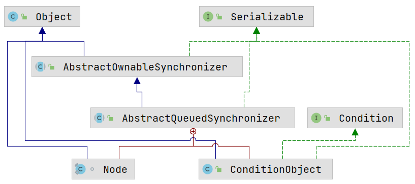
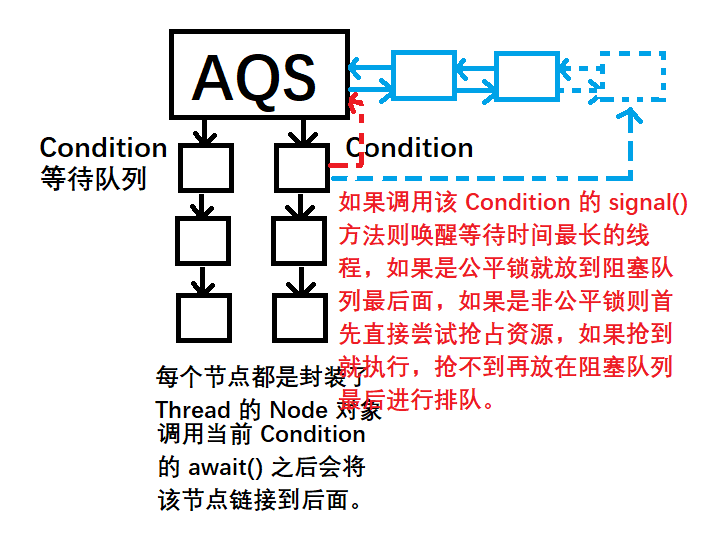

# AQS（AbstractQueueSynchronized）

[TOC]

## 零、前言

AQS 的设计思想几乎完全基于 synchronized 在 C++ 层面的实现，只是在此基础上进行了改良使得粒度更小。



该类中除了常规的成员方法之外还有两个子类：ConditionObject 和 Node。其中 ConditionObject 继承了 Condition。这些 Condition 是通过 AQS 中的 Lock 进行创建的，因为对于一个 Lock 而言，其 Condition 可以拥有多个。Node 是一个 FIFO 双向队列，该对象中的线程都处于被阻塞的状态，Node 中封装了 Thread 类。

示例代码验证 AQS 的执行逻辑：

```java
package com.gjxaiou.aqs;

import java.util.concurrent.locks.Lock;
import java.util.concurrent.locks.ReentrantLock;
import java.util.stream.IntStream;

public class MyTest1 {
    private Lock lock = new ReentrantLock();

    public void method() {
        try {
            lock.lock();

            try {
                Thread.sleep(1000);
            } catch (InterruptedException exception) {
                exception.printStackTrace();
            }
            System.out.println("method");
        } finally {
            lock.unlock();
        }
    }

    public static void main(String[] args) {
        // 创建 5 个线程执行上面方法
        MyTest1 myTest1 = new MyTest1();

        IntStream.range(0, 5).forEach(i -> {
            new Thread(() -> {
                myTest1.method();
            }).start();
        });
    }
}
```

执行结果为：

```java
method
method
method
method
method
```


### 可重入锁  ReentrantLock 是基于 AQS 实现的互斥锁

互斥锁即无论读写操作，只有一个线程可以获取锁。

在 Java 并发包中，凡是使用 AQS 实现的都会该当前类中封装一个属性 Sync，该类继承 AQS，同时复写 AQS 中的 Protected 修饰的方法。因为 AQS 本身为抽象类，因此无法直接使用，同时该抽象类中定义了若干 protected 修饰的方法，这些方法的具体执行应该取决于子类的业务场景和子类含义。

ReentrantLock 中的内部 Sync 类就实现了 `tryAcquired()` 和 `tryRelease()` 方法。ReentrantLock 通过构造方法传入的 boolean 类型变量来决定采用公平锁还是非公平锁，默认是非公平锁。

> 公平锁就是通过 signal 或者 signalAll 唤醒 Condition 中等待的线程之后，将该线程放入阻塞队列的最后面，会依次执行阻塞队列中的线程。非公平锁就是唤醒之后就会尝试抢占资源，如果抢到锁就直接执行，没有抢到则想上面一样排队执行。

### tryAcquired() 方法

因此 ReentrantLock 中的 Sync 类没有重写 AQS 中的 tryAcquired() 方法，而是使用 FairSync 和 NonFairSync  继承了 Sync 并且实现了不同的 tryAcquired() 方法。

```java
static final class FairSync extends Sync {
        private static final long serialVersionUID = -3000897897090466540L;

        final void lock() {
            acquire(1);
        }

        /**
         * Fair version of tryAcquire.  Don't grant access unless
         * recursive call or no waiters or is first.
         */
        protected final boolean tryAcquire(int acquires) {
            // 首先获取当前线程（该线程即尝试获取锁的线程）
            final Thread current = Thread.currentThread();
            // 获取成员变量 state 的值，在排它锁的语境下，该值表示已经持有锁的线程的个数
            int c = getState();
            // c = 0 表示当前没有任何线程获取到这把锁
            if (c == 0) {
                // hasQueue.. 就是判断阻塞队列中有没有等待的线程。然后 尝试用 CAS 模式将 0 变成传入进来的 acquires 值。
                if (!hasQueuedPredecessors() &&
                        compareAndSetState(0, acquires)) {
                    // 前面没有等待线程了并且通过 CAS 将 state 值替换成功了，则当前线程获取到锁了。
                    setExclusiveOwnerThread(current);
                    return true;
                }
                // 判断当前线程是不是排它锁的拥有者
            } else if (current == getExclusiveOwnerThread()) {
                // 如果 state 为 1，则 nextc 新该锁新的重入次数
                int nextc = c + acquires;
                if (nextc < 0)
                    throw new Error("Maximum lock count exceeded");
                setState(nextc);
                return true;
            }
            // 当前线程没有获取锁
            return false;
        }
    }
```

如果是非公平锁：

```java
final boolean nonfairTryAcquire(int acquires) {
    final Thread current = Thread.currentThread();
    int c = getState();
    // c = 0 表示当前没有任何线程持有锁
    if (c == 0) {
        // 非公平情况下则直接使用 CAS 替换 state 的值，然后设置当前线程拥有该锁；即直接尝试获取锁
        if (compareAndSetState(0, acquires)) {
            setExclusiveOwnerThread(current);
            return true;
        }
        // 重入性判断
    } else if (current == getExclusiveOwnerThread()) {
        int nextc = c + acquires;
        if (nextc < 0) // overflow
            throw new Error("Maximum lock count exceeded");
        setState(nextc);
        return true;
    }
    return false;
}
```

因为调用上面代码的 AQS  中方法结构为：

```java
public final void acquire(int arg) {
    // 首先执行 NonfairSync 的 tryAcquire，如果返回 false 即没有获取锁，则通过 acquireQueued 来放入后面的阻塞队列
    if (!tryAcquire(arg) &&
        acquireQueued(addWaiter(Node.EXCLUSIVE), arg))
        selfInterrupt();
}
```

**什么时候触发新的线程获取锁**：
只有调用 unlock 之后才可能触发阻塞队列中的线程去获取锁。

调用步骤为：`lock.unlock()`-> `Reentrant.unlock()` ->`sync.release(1);`-> `release()方法`

AQS 中的 release 方法为：

```java
public final boolean release(int arg) {
    // 首先通过  tryRelease，如果返回 true 则表示当前线程不管重入多少次都已经将该锁释放了。
    if (tryRelease(arg)) {
        Node h = head;
        if (h != null && h.waitStatus != 0)
            // 唤醒已经释放锁的线程后面的线程
            unparkSuccessor(h);
        return true;
    }
    return false;
}
```

ReentrantLock 的 tryRelease() 方法为：

```java
protected final boolean tryRelease(int releases) {
    // 首先将 state 值减一
    int c = getState() - releases;
    // 判断当前线程是不是获取该排它锁的线程，用于防止使用 A 线程的 lock，然后调用 B 线程的 unlock 进行上锁
    if (Thread.currentThread() != getExclusiveOwnerThread())
        throw new IllegalMonitorStateException();
    boolean free = false;
    // c 为 0 表示当前已经没有线程持有这把锁了
    if (c == 0) {
        // 将锁的状态 free 设置为真，同时将排它锁的线程持有者设置为 null，表示当前没有线程持有这个排它锁
        free = true;
        setExclusiveOwnerThread(null);
    }
    setState(c);
    // 如果 free 为 false，则表示 c 不为 0，则表示这把锁被重入了
    return free;
}
```

AQS 里面的  unparkSuccessor ()  方法为：

```java
private void unparkSuccessor(Node node) {
    int ws = node.waitStatus;
    if (ws < 0)
        compareAndSetWaitStatus(node, ws, 0);
    Node s = node.next;
    if (s == null || s.waitStatus > 0) {
        s = null;
        for (Node t = tail; t != null && t != node; t = t.prev)
            if (t.waitStatus <= 0)
                s = t;
    }
    // s 就是释放锁的线程后面的Node节点
    if (s != null)
        // 最后调用 LockSupport（Native 返回）的后面线程的 unpark 方法来唤醒。
        LockSupport.unpark(s.thread);
}
```


**总结： ReentrantLock 的执行逻辑**：

- 当前线程尝试获取对象的锁，如果是已拥有锁的线程则可以再次获取到锁（可重入），如果获取不到（意味着已经有其它线程持有了锁，并且尚未释放），那么当前线程会进入 AQS 的阻塞队列中。
- 如果获取到，那么根据锁是公平锁还是非公平锁来进行不同的处理。
    - 如果是公平锁，那么线程会直接放置到 AQS 阻塞队列的末尾；
    - 如果是非公平锁，那么线程会首先尝试进行 CAS 计算，如果成功则直接获取到锁；如果失败，这与公平锁的处理方式一致，被放到阻塞队列的末尾。
- 当锁被释放了（调用了 unlock 方法），那么底层会调用 release 方法对 state 成员变量值进行减一操作，如果减一后，state 值不为 0，那么 release 操作就执行完毕；如果减一操作后， state 值为 0（锁被释放了），则调用  LockSupport 的 unpark() 方法唤醒该线程后的等待队列中的第一个后继线程（底层 C++ 使用 pthread_mutex_unlock 方法），将其唤醒。使之能够获取到对象得到锁（release 时候，对于公平锁和非公平锁的处理逻辑是一致的）；之所以调用 release 方法之后state 的值可能不为 0， 原因在于 ReentrantLock 是可重入锁，表示线程可以可以多次调用 lock() 方法。导致每调用一次， state 值就会减一。

**上锁**：针对 Synchronized 上锁就是针对每个对象头中的 ObjectMonitor 进行标识。

针对 ReentrantLock 来说，所谓的上锁，本质上就是对 AQS 中的 state 成员变量的操作：对该成员变量 + 1，表示上锁；对该成员变量 -1，表示释放锁。


### ReadWriteLock  和 ReentrantReadWriteLock

示例代码：

```java
package com.gjxaiou.aqs;

import java.util.concurrent.locks.ReadWriteLock;
import java.util.concurrent.locks.ReentrantReadWriteLock;
import java.util.stream.IntStream;

/**
 * 验证使用 ReadWriteLock
 */
public class MyTest2 {
    private ReadWriteLock readWriteLock = new ReentrantReadWriteLock();

    public void method() {
        try {
            // 获取到对象里面的一把读锁，然后上锁
            readWriteLock.readLock().lock();

            try {
                Thread.sleep(1000);
            } catch (InterruptedException e) {
                e.printStackTrace();
            }
            System.out.println("method");
        } finally {
            readWriteLock.readLock().unlock();
        }
    }

    public static void main(String[] args) {
        MyTest2 myTest2 = new MyTest2();
        IntStream.range(0, 5).forEach(i -> new Thread(myTest2::method).start());
    }
}
```

结果为：

```java
method
method
method
method
method
```

输出的过程：大约等待 1s 之后，然后这 5 个语句几乎同时输出。

如果将上面的 ` readWriteLock.readLock()` 换成 `readWriteLock.writeLock()` 之后的执行效果类似于 ReentrantLock 的一秒输出一个。

因为读锁可以多次获取，获取完之后每个线程等待 1s 之后进行输出，但是写锁是严格互斥的，因此一个线程获取锁之后其它线程只能等待，直到原有线程将锁释放之后其它线程才能获取。


ReadWriteLock 接口比较简洁，主要关注其实现类 ReentrantReadWriteLock 

ReentrantReadWriteLock 默认也是非公平锁，和 ReentrantLock 一样通过构造方法实现公平与非公平锁。

`readWriteLock.readLock().lock()` 执行过程：

首先因为已经通过 `private ReadWriteLock readWriteLock = new ReentrantReadWriteLock();` 创建了一个 readWriteLock 对象，同时在创建时候同时创建了 ReadLock  和 WriteLock 对象。

```java
 public ReentrantReadWriteLock() {
        this(false);
    }

    public ReentrantReadWriteLock(boolean fair) {
        sync = fair ? new FairSync() : new NonfairSync();
        readerLock = new ReadLock(this);
        writerLock = new WriteLock(this);
    }
```

然后调用 lock() 方法，该方法对应的是 ReentrantReadWriteLock 类中的 ReadLock 类的 lock() 方法：

```java
public static class ReadLock implements Lock, java.io.Serializable {
    private static final long serialVersionUID = -5992448646407690164L;
    private final Sync sync;

    // 获取对象中的读锁，读锁是共享锁，即多个线程可以获取该锁
    public void lock() {
        sync.acquireShared(1);
    }
}
```

AQS 中的 `acquireShared()` 方法为：

```java
public final void acquireShared(int arg) {
    if (tryAcquireShared(arg) < 0)
        doAcquireShared(arg);
}
```

这里 AQS 中的 tryAcquiredShared() 方法是直接抛出异常，所以我们还是要看子类 ReentrantReadWriteLock 中的 Sync 类进行实现。

```java
protected final int tryAcquireShared(int unused) {

    // 获取当前线程对象和当前 state 值
    Thread current = Thread.currentThread();
    int c = getState();
    // exclusiveCount 返回低 16 位的值（记录写锁的持有数量）
    // !=0 表示当前有线程在持有写锁，并且持有的线程不是当前线程，返回 -1，如果是当前线程则可以重入的，所以两个判断都必不可少。
    if (exclusiveCount(c) != 0 &&
        getExclusiveOwnerThread() != current)
        return -1;
    // -----------------进入这里说明当前没有线程持有写锁，则可能获取读锁--------------------------
    // sharedCount 获取高 16 位值
    int r = sharedCount(c);
    // readerShouldBlock 的实现分为公平锁和非公平锁，针对公平锁：判断这个阻塞队列前面是不是有其他线程在等待。如果是非公平：是不是可以进行插入操作。
    // MAX_COUNT：读锁和写锁的上锁次数都是有上限的，
    if (!readerShouldBlock() &&
        r < MAX_COUNT &&
        compareAndSetState(c, c + SHARED_UNIT)) {
        // 如果共享锁的数量 r 为 0，说明之前之前并没有任何的读锁进行上锁
        if (r == 0) {
            // 当前线程为第一个读锁线程，并且读锁的数量为 1
            firstReader = current;
            firstReaderHoldCount = 1;
            // 如果已经有共享锁（可能为其他线程或者是该线程本身已经给这个对象上了一把读锁）。
        } else if (firstReader == current) {
            firstReaderHoldCount++;
        } else {
            HoldCounter rh = cachedHoldCounter;
            if (rh == null || rh.tid != getThreadId(current))
                cachedHoldCounter = rh = readHolds.get();
            else if (rh.count == 0)
                readHolds.set(rh);
            rh.count++;
        }
        return 1;
    }
    return fullTryAcquireShared(current);
}
```

**针对读锁的判断流程**：

首先进行判断当前对象有没有被上写锁，如果有并且当前已经上锁的线程和当前线程还不是同一个线程，则直接返回。然后即如果没有上写锁，则上读锁是一定可以成功的，如果之前没有线程给上读锁的话则上锁数量置为 1，如果有则上锁数量进行加一。


当使用 `readWriteLock.writeLock().lock()` 时候：

整体流程和上述类似，只是在调用 tryAcquire() 方法的时候，调用的是 ReentrantReadWriteLock 的内部类 Sync 的 tryAcquire() 方法。该方法逻辑为：

```java
protected final boolean tryAcquire(int acquires) {
    /*
             * Walkthrough:
             * 1. If read count nonzero or write count nonzero
             *    and owner is a different thread, fail.
             * 2. If count would saturate, fail. (This can only
             *    happen if count is already nonzero.)
             * 3. Otherwise, this thread is eligible for lock if
             *    it is either a reentrant acquire or
             *    queue policy allows it. If so, update state
             *    and set owner.
             */
    Thread current = Thread.currentThread();
    int c = getState();
    // 获取写锁的数量, c 不为 0 表示该对象的排它锁已经被某个线程持有了。
    int w = exclusiveCount(c);
    if (c != 0) {
        // (Note: if c != 0 and w == 0 then shared count != 0)
        if (w == 0 || current != getExclusiveOwnerThread())
            return false;
        if (w + exclusiveCount(acquires) > MAX_COUNT)
            throw new Error("Maximum lock count exceeded");
        // Reentrant acquire
        // 本身获取锁的线程就是当前线程，即将写锁又进行了重入
        setState(c + acquires);
        return true;
    }
    // c = 0 表示当前对象没有锁（既没有读锁，也没有写锁）
    // 尝试获取写锁，并且 CAS 操作失败（即当前有另一个线程和当前线程竞争写锁，并且当前线程没有竞争过，则返回 false）
    if (writerShouldBlock() ||
        !compareAndSetState(c, c + acquires))
        return false;
    // 获取成功
    setExclusiveOwnerThread(current);
    return true;
}
```


**总结：关于 ReentrantReadWriteLock 的 Lock 的操作逻辑**：

- 读锁：

    - 在获取读锁时，会尝试判断当前对象是否拥有了写锁，如果已经拥有则直接失败。
    - 如果没有写锁，就表示当前对象没有排它锁，则当前线程会尝试给对象加锁。
    - 如果当前线程已经持有了该对象的锁，那么直接将读锁的数量加一。

- 写锁：

    - 在获取写锁时，会尝试判断当前对象是否拥有了锁（读锁和写锁），如果已经拥有且持有的线程并非当前线程则直接失败。
    - 如果当前对象没有被加锁，那么写锁就会为当前对象上锁，并且将写锁的数量加一。
    - 将当前对象的排它锁线程持有者设为自己。

    

    

    - 如果读锁数量或者写锁数量非零并且拥有锁的线程不是当前对象，则直接报错。（因为写锁一定是互斥的，则在给当前对象加锁的时候，当前对象即不能有读锁，也不能有写锁）。

      ​    

##### 针对读写锁的 unlock() 方法执行流程

**首先针对 readLock**：

调用流程为：`readWriteLock.readLock().unlock()`，其中 `unlock()` 方法的实现为 ReentrantReadWriteLock 类中的 `unlock()` 方法，代码如下：

```java
public void unlock() {
    // 释放掉共享锁，即将计数器减一
    // 这里的 sync 是 ReadLock 里面的成员变量，但是同时通过 ReadLock 的构造方法使其关联到外部的 ReentrantReadWriteLock 的 sync
    sync.releaseShared(1);
}
```

其中 `releaseShared()` 方法是 AQS 中，具体为：

```java
public final boolean releaseShared(int arg) {
    // tryReleaseShared() 方法在 AQS 中的实现就是抛出异常，因此不同子类需要进行自定义
    if (tryReleaseShared(arg)) {
        doReleaseShared();
        return true;
    }
    return false;
}
```

tryReleaseShared() 方法在 ReentrantReadWriteLock  类的 Sync 类的实现为：

```java
protected final boolean tryReleaseShared(int unused) {
    Thread current = Thread.currentThread();
    // firstReader 是 ReentrantReadWriteLock 中定义的一个成员变量，表示已经获取到读锁的第一个线程
    if (firstReader == current) {
        // assert firstReaderHoldCount > 0;
        // firstXXcount 就是上面 firstReader 线程重入的次数
        if (firstReaderHoldCount == 1)
            // 如果为 1 则当下面减一之后就相当于没有任何读锁了，所以直接置为 null，表示没有读线程在持有这把锁。
            firstReader = null;
        else
            // 如果不为 1 则说明调用了多次 lock,则第一个读线程 firstReader 不变，但是因为调用了 unlock，所以重入次数减一
            firstReaderHoldCount--;
        // 当前的线程并不是第一个读的线程，因为读锁是共享锁，多个线程都可以获取
    } else {
        // HoldCounter 是持有锁的计数器对象，同时针对每个线程进行匹配。里面的 count 表示当前读线程持有锁的数量（重入次数），写线程没有，因为写线程是排它的
        // 每个线程都会对应一个 HoldCounter 实例，里面的变量 count 表示当前线程持有的读锁的数量，使用 ThreadLocal 实现。
        HoldCounter rh = cachedHoldCounter;
        if (rh == null || rh.tid != getThreadId(current))
            rh = readHolds.get();
        int count = rh.count;
        if (count <= 1) {
            readHolds.remove();
            if (count <= 0)
                throw unmatchedUnlockException();
        }
        // 持有的读锁的数量减一
        --rh.count;
    }

    for (;;) {
        int c = getState();
        // state 值减去读锁的高 16 位的值
        int nextc = c - SHARED_UNIT;
        if (compareAndSetState(c, nextc))
            // 释放读锁对读线程是没有任何影响的，但是可以让尝试获取写锁的线程继续执行，如果读锁和写锁的数量都是 0
            // Releasing the read lock has no effect on readers,
            // but it may allow waiting writers to proceed if
            // both read and write locks are now free.
            // 如果是 0 则写线程和读线程就可竞争获取锁了。
            return nextc == 0;
    }
}
```

如果上面的方法返回 true，则表示读锁都释放了，可以执行 AQS 中的 `doReleaseShared()`

```java
private void doReleaseShared() {
    for (; ; ) {
        Node h = head;
        // 判断阻塞链表是不是为空
        if (h != null && h != tail) {
            int ws = h.waitStatus;
            // 判断是不是该线程要获取到通知
            if (ws == Node.SIGNAL) {
                if (!compareAndSetWaitStatus(h, Node.SIGNAL, 0))
                    continue;            // loop to recheck cases
                // 唤醒后面一个线程。内部还是 LockSupport.unpark() 
                unparkSuccessor(h);
            } else if (ws == 0 &&
                       !compareAndSetWaitStatus(h, 0, Node.PROPAGATE))
                continue;                // loop on failed CAS
        }
        if (h == head)                   // loop if head changed
            break;
    }
}
```

**针对写锁 writeLock 的 unlock**：  => 排它锁的释放 

使用 `readWriteLock.writeLock().unlock();` 调用的 `unlock()` 方法，本质上是调用 ReentrantReadWriteLock 的内部类 WriteLock 的 `unlock()` 方法

```java
public void unlock() {
    sync.release(1);
}
```

其中进入 AQS 中的 `release()` 方法具体为：

```java
public final boolean release(int arg) {
    // 首先通过  tryRelease，如果返回 true 则表示当前线程不管重入多少次都已经将该锁释放了。后面线程可以尝试获取了
    if (tryRelease(arg)) {
        Node h = head;
        if (h != null && h.waitStatus != 0)
            // 唤醒已经释放锁的线程后面的线程
            unparkSuccessor(h);
        return true;
    }
    return false;
}
```

针对 `tryRelease()` 方法本质上在 AQS 仅仅是抛出一个异常，需要子类进行对应的实现。这里选择 ReentrantReadWriteLock 中的 Sync 的实现

```java
protected final boolean tryRelease(int releases) {
    // isHeldExclusively() 返回真表示当前锁为排它锁，否则为共享锁
    if (!isHeldExclusively())
        // 这里尝试进行写锁的释放，但是如果当前线程并不是拥有写锁的线程则直接抛出异常
        throw new IllegalMonitorStateException();
    int nextc = getState() - releases;
    // 减完之后获取当前排它锁的数量，是否为 0，如果为 0 则表示当前的排它锁不被任何线程锁持有。因为写锁也是可重入的，所以可能不为 0
    boolean free = exclusiveCount(nextc) == 0;
    if (free)
        // 当前获取排它锁的线程直接设置为 null，表示没有线程持有该排它锁
        setExclusiveOwnerThread(null);
    setState(nextc);
    return free;
}
```


**Condition 回顾**：

Condition 是通过生成的 Lock 对象调用 newCondition() 方法创建的，一个 Lock 可以创建多个 Condition 对象，各个 Condition 之间没有任何关系，只有每个 Condition 内部的各个等待线程之间可以相互进行唤醒，不同 Condition 之间的线程是没有任何关系的。

具体分析 AQS  中的 await() 方法的实现，

AQS 可以下挂多个 Condition 等待队列，每个 Condition 里面的节点都是 Node 类型，不断的往后追加。调用某一个 Condition 的 signal 或者 signalAll 方法会将该 Condition 中等待的线程进行唤醒。调用某个 condition 对象的 `await()` 方法之后所执行的逻辑为 AQS 子类 ConditionObject 的 `await()` 方法：

```java
public final void await() throws InterruptedException {
    if (Thread.interrupted())
        throw new InterruptedException();
    // Node 实例中是封装了当前的线程
    // addConditionWaiter 就是往 Condition 的等待队列（条件队列）中增加一个等待者，因为条件队列本身也是关于 Node
    // 的链表，这里就是将其加入条件队列的尾端。
    Node node = addConditionWaiter();
    int savedState = fullyRelease(node);
    // 判断一些中断性，不重要
    int interruptMode = 0;
    while (!isOnSyncQueue(node)) {
        LockSupport.park(this);
        if ((interruptMode = checkInterruptWhileWaiting(node)) != 0)
            break;
    }
    if (acquireQueued(node, savedState) && interruptMode != THROW_IE)
        interruptMode = REINTERRUPT;
    if (node.nextWaiter != null) // clean up if cancelled
        unlinkCancelledWaiters();
    if (interruptMode != 0)
        reportInterruptAfterWait(interruptMode);
}
```

针对AQS 中的 signal 方法

因为每个 Condition 队列都是先进先出的，signal 方法会将等待时间最长的线程移除出Condition 的等待队列，移动到拥有锁的等待队列中。这里移除之后如果是非公平锁，直接抢占，如果是非公平锁，则移动到阻塞队列的最后面。transferForSignal 实现将一个 Node 从一个 Condition 队列中移动到同步（阻塞）队列。

```java
// 将 Condition 中等待时间最长的线程移除并且放置到拥有锁的阻塞队列
public final void signal() {
    // 首先判断是不是排它锁
    if (!isHeldExclusively())
        throw new IllegalMonitorStateException();
    // 获取双向阻塞队列的第一个等待着
    Node first = firstWaiter;
    // 如果不为空，说明已经有线程（Node 节点）阻塞了
    if (first != null)
        // 进行节点移动
        doSignal(first);
}
```

其中 AQS 中的 `doSignal()` 方法为：

```java
private void doSignal(Node first) {
    do {
        if ((firstWaiter = first.nextWaiter) == null)
            lastWaiter = null;
        first.nextWaiter = null;
        // transferForSignal 实现将一个 Node 从一个 Condition 队列中移动到同步（阻塞）队列
    } while (!transferForSignal(first) &&
             (first = firstWaiter) != null);
}
```



#### AQS 和 Synchronized 关键字之间的关系

- Synchronized 关键字在底层的 C++ 实现中，存在两个重要的数据结构（集合）：WaitSet 和 EntryList
    - WaitSet 中存放的是调用了 Object 类的 wait 方法的线程对象（即被陷入等待状态的线程对象）（被封装成了 C++ 的 Node 对象）。
    - EntryList 中存放的是陷入到阻塞状态、需要获取 monitor 的线程对象。
    - 当一个线程被 notify 之后，它就会从 WaitSet 中移动到 EntryList 中。
    - 进入 EntryList 中后，该线程依然需要与其他陷入阻塞的线程争抢 monitor 对象
    - 如果争抢到，就表示该线程获取到了对象的锁，它就可以以排它的方式执行对应的同步代码。

- AQS 中存在两种队列，分别是 Condition 对象上的条件队列以及 AQS 本身的阻塞队列
    - 这两个队列中的每一个对象都是 Node 实例（里面封装了线程对象）
    - 当位于 Condition 条件队列中的线程被其他线程 signal 唤醒之后，该线程就会从条件队列中移动到 AQS 的阻塞队列中【针对公平锁】，如果是非公平锁着唤醒之后进行锁资源的争抢，抢到就执行，没抢到再进入阻塞队列。
    - 位于 AQS 阻塞队列中的 Node 对象本质上都是一个双向链表来构成的。
    - 在获取 AQS 锁时，这些进入到阻塞队列中的线程会按照在队列中的排序向后尝试获取。
    - 当 AQS 阻塞队列中的线程获取到锁后，就表示该线程可以正常执行了，没有获取到则还是需要等待
    - 陷入到阻塞状态的线程，依然需要进入到操作系统的内核态，进入阻塞（通过 park() 方法实现）。


AQS 比 synchronized 优势

- Synchronized 只有排它锁，但是 AQS 既有排它锁也有共享锁。
- synchronized 中只能调用一个对象的 wait() 和 notify() 来进行阻塞等待和唤醒，但是一个 AQS 对象上可以有多个 Condition 对象，即有多个条件。
- AQS 中的等待是以队列的形式来存储，但是 Synchronized 中底层是 EntryList 中。


# 深入理解AbstractQueuedSynchronizer（一）

## AbstractQueuedSynchronizer简介

AbstractQueuedSynchronizer提供了一个FIFO队列，可以看做是一个可以用来实现锁以及其他需要同步功能的框架。这里简称该类为AQS。AQS的使用依靠继承来完成，子类通过继承自AQS并实现所需的方法来管理同步状态。例如ReentrantLock，CountDownLatch等。

该类有许多实现类：

[](http://www.ideabuffer.cn/2017/03/15/深入理解AbstractQueuedSynchronizer（一）/QQ20170313-231557@2x.png)

其中，我们最常用的大概就是ReentrantLock和CountDownLatch了。ReentrantLock提供了对代码块的并发访问控制，也就是锁，说是锁，但其实并没有用到关键字`synchronized`，这么神奇？其实其内部就是基于同步器来实现的，本文结合ReentrantLock的使用来分析同步器独占锁的原理。

## AQS的两种功能

从使用上来说，AQS的功能可以分为两种：独占和共享。对于这两种功能，有一个很常用的类：ReentrantReadWriteLock，其就是通过两个内部类来分别实现了这两种功能，提供了读锁和写锁的功能。但子类实现时，只能实现其中的一种功能，即要么是独占功能，要么是共享功能。

对于独占功能，例如如下代码：

```
ReentrantLock lock = new ReentrantLock();
...

public void function(){
    
    lock.lock();
    try {
        
    // do something...
        
        
    } finally {
        lock.unlock();
    }
    
}
```

这个很好理解，通过ReentrantLock来保证在`lock.lock()`之后的代码在同一时刻只能有一个线程来执行，其余的线程将会被阻塞，直到该线程执行了`lock.unlock()`。这就是一个独占锁的功能。

对于共享功能，例如如下代码：

```
ReentrantReadWriteLock lock = new ReentrantReadWriteLock();
...

public void function(){
    
    lock.readLock().lock();
    try {
        
    // do something...
        
        
    } finally {
        lock.readLock().unlock();
    }
    
}
```

代码中的`lock`是`ReentrantReadWriteLock`类的实例，而`lock.readLock()`为获取其中的读锁，即共享锁，使用方式并无差别，但和独占锁是有区别的：

- 读锁与读锁可以共享
- 读锁与写锁不可以共享（排他）
- 写锁与写锁不可以共享（排他）

## AQS独占锁的内部实现

### AQS的主要数据结构

由于使用AQS可以实现锁的功能，那么下面就要分析一下究竟是如何实现的。

AQS内部维护着一个FIFO的队列，该队列就是用来实现线程的并发访问控制。队列中的元素是一个Node类型的节点，Node的主要属性如下：

```
static final class Node {
    int waitStatus;
    Node prev;
    Node next;
    Node nextWaiter;
    Thread thread;
}
```

- waitStatus

    ：表示节点的状态，其中包含的状态有：

    - *CANCELLED*：值为1，表示当前节点被取消；
    - *SIGNAL*：值为-1，表示当前节点的的后继节点将要或者已经被阻塞，在当前节点释放的时候需要unpark后继节点；
    - *CONDITION*：值为-2，表示当前节点在等待condition，即在condition队列中；
    - *PROPAGATE*：值为-3，表示releaseShared需要被传播给后续节点（仅在共享模式下使用）；
    - *0*：无状态，表示当前节点在队列中等待获取锁。

- *prev*：前继节点；

- *next*：后继节点；

- *nextWaiter*：存储condition队列中的后继节点；

- *thread*：当前线程。

其中，队列里还有一个`head`节点和一个`tail`节点，分别表示头结点和尾节点，其中头结点不存储Thread，仅保存next结点的引用。

AQS中有一个`state`变量，该变量对不同的子类实现具有不同的意义，对ReentrantLock来说，它表示加锁的状态：

- 无锁时state=0，有锁时state>0；
- 第一次加锁时，将state设置为1；
- 由于ReentrantLock是可重入锁，所以持有锁的线程可以多次加锁，经过判断加锁线程就是当前持有锁的线程时（即`exclusiveOwnerThread==Thread.currentThread()`），即可加锁，每次加锁都会将state的值+1，state等于几，就代表当前持有锁的线程加了几次锁;
- 解锁时每解一次锁就会将state减1，state减到0后，锁就被释放掉，这时其它线程可以加锁；
- 当持有锁的线程释放锁以后，如果是等待队列获取到了加锁权限，则会在等待队列头部取出第一个线程去获取锁，获取锁的线程会被移出队列；

`state`变量定义如下：

```
/**
 * The synchronization state.
 */
private volatile int state;
```

### ReentrantLock类的结构

下面通过ReentrantLock的实现进一步分析重入锁的实现。

首先看一下lock方法：

```
public void lock() {
    sync.lock();
}
```

该方法调用了`sync`实例的lock方法，这里要说明一下ReentrantLock中的几个内部类：

- Sync
- FairSync
- NonfairSync

对于ReentrantLock，有两种获取锁的模式：公平锁和非公平锁。所以对应有两个内部类，都继承自Sync。而Sync继承自AQS：

[](http://www.ideabuffer.cn/2017/03/15/深入理解AbstractQueuedSynchronizer（一）/QQ20170314-003640.png)

本文主要通过公平锁来介绍，看一下FairSync的定义：

```
/**
 * Sync object for fair locks
 */
static final class FairSync extends Sync {
    private static final long serialVersionUID = -3000897897090466540L;

    final void lock() {
        acquire(1);
    }

    /**
     * Fair version of tryAcquire.  Don't grant access unless
     * recursive call or no waiters or is first.
     */
    protected final boolean tryAcquire(int acquires) {
        final Thread current = Thread.currentThread();
        // 获取state
        int c = getState();
        // state=0表示当前队列中没有线程被加锁
        if (c == 0) {
            /*
             * 首先判断是否有前继结点，如果没有则当前队列中还没有其他线程；
             * 设置状态为acquires，即lock方法中写死的1（这里为什么不直接setState？因为可能同时有多个线程同时在执行到此处，所以用CAS来执行）；
             * 设置当前线程独占锁。
             */
            if (!hasQueuedPredecessors() &&
                compareAndSetState(0, acquires)) {
                setExclusiveOwnerThread(current);
                return true;
            }
        }
        /*
         * 如果state不为0，表示已经有线程独占锁了，这时还需要判断独占锁的线程是否是当前的线程，原因是由于ReentrantLock为可重入锁；
         * 如果独占锁的线程是当前线程，则将状态加1，并setState;
         * 这里为什么不用compareAndSetState？因为独占锁的线程已经是当前线程，不需要通过CAS来设置。
         */
        else if (current == getExclusiveOwnerThread()) {
            int nextc = c + acquires;
            if (nextc < 0)
                throw new Error("Maximum lock count exceeded");
            setState(nextc);
            return true;
        }
        return false;
    }
}
```

### AQS获取独占锁的实现

#### acquire方法

`acquire`是AQS中的方法，代码如下：

```
public final void acquire(int arg) {
    if (!tryAcquire(arg) &&
        acquireQueued(addWaiter(Node.EXCLUSIVE), arg))
        selfInterrupt();
}
```

该方法主要工作如下：

1. 尝试获取独占锁；
2. 获取成功则返回，否则执行步骤3;
3. addWaiter方法将当前线程封装成Node对象，并添加到队列尾部；
4. 自旋获取锁，并判断中断标志位。如果中断标志位为`true`，执行步骤5，否则返回；
5. 设置线程中断。

#### tryAcquire方法

`tryAcquire`方法在FairSync中已经说明，它重写了AQS中的方法，在AQS中它的定义如下：

```
protected boolean tryAcquire(int arg) {
    throw new UnsupportedOperationException();
}
```

既然该方法需要子类来实现，为什么不使用`abstract`来修饰呢？上文中提到过，AQS有两种功能：独占和共享，而且子类只能实现其一种功能，所以，如果使用`abstract`来修饰，那么每个子类都需要同时实现两种功能的方法，这对子类来说不太友好，所以没有使用`abstract`来修饰。

该方法是在ReentrantLock中的FairSync和NonfairSync的两个内部类来实现的，这里以FairSysc-公平锁来说明：

```
protected final boolean tryAcquire(int acquires) {
    final Thread current = Thread.currentThread();
    int c = getState();
    if (c == 0) {
        if (!hasQueuedPredecessors() &&
            compareAndSetState(0, acquires)) {
            setExclusiveOwnerThread(current);
            return true;
        }
    }
    else if (current == getExclusiveOwnerThread()) {
        int nextc = c + acquires;
        if (nextc < 0)
            throw new Error("Maximum lock count exceeded");
        setState(nextc);
        return true;
    }
    return false;
}
```

#### addWaiter方法

看下addWaiter方法的定义：

```
private Node addWaiter(Node mode) {
    // 根据当前线程创建一个Node对象
    Node node = new Node(Thread.currentThread(), mode);
    // Try the fast path of enq; backup to full enq on failure
    Node pred = tail;
    // 判断tail是否为空，如果为空表示队列是空的，直接enq
    if (pred != null) {
        node.prev = pred;
        // 这里尝试CAS来设置队尾，如果成功则将当前节点设置为tail，否则enq
        if (compareAndSetTail(pred, node)) {
            pred.next = node;
            return node;
        }
    }
    enq(node);
    return node;
}
```

该方法就是根据当前线程创建一个Node，然后添加到队列尾部。

#### enq方法

```
private Node enq(final Node node) {
    // 重复直到成功
    for (;;) {
        Node t = tail;
        // 如果tail为null，则必须创建一个Node节点并进行初始化
        if (t == null) { // Must initialize
            if (compareAndSetHead(new Node()))
                tail = head;
        } else {
            node.prev = t;
            // 尝试CAS来设置队尾
            if (compareAndSetTail(t, node)) {
                t.next = node;
                return t;
            }
        }
    }
}
```

#### acquireQueued方法

该方法的功能是循环的尝试获取锁，直到成功为止，最后返回中断标志位。

```
final boolean acquireQueued(final Node node, int arg) {
    boolean failed = true;
    try {
        // 中断标志位
        boolean interrupted = false;
        for (;;) {
            // 获取前继节点
            final Node p = node.predecessor();
            // 如果前继节点是head，则尝试获取
            if (p == head && tryAcquire(arg)) {
                // 设置head为当前节点（head中不包含thread）
                setHead(node);
                // 清除之前的head
                p.next = null; // help GC
                failed = false;
                return interrupted;
            }
            // 如果p不是head或者获取锁失败，判断是否需要进行park
            if (shouldParkAfterFailedAcquire(p, node) &&
                parkAndCheckInterrupt())
                interrupted = true;
        }
    } finally {
        if (failed)
            cancelAcquire(node);
    }
}
```

这里有几个问题很重要：

- 什么条件下需要park？
- 为什么要判断中断状态？
- 死循环不会引起CPU使用率飙升？

下面分别来分析一下。

**什么条件下需要park？**

看下`shouldParkAfterFailedAcquire`方法的代码：

```
private static boolean shouldParkAfterFailedAcquire(Node pred, Node node) {
    int ws = pred.waitStatus;
    if (ws == Node.SIGNAL)
        /*
         * This node has already set status asking a release
         * to signal it, so it can safely park.
         */
        return true;
    if (ws > 0) {
        /*
         * Predecessor was cancelled. Skip over predecessors and
         * indicate retry.
         */
        do {
            node.prev = pred = pred.prev;
        } while (pred.waitStatus > 0);
        pred.next = node;
    } else {
        /*
         * waitStatus must be 0 or PROPAGATE.  Indicate that we
         * need a signal, but don't park yet.  Caller will need to
         * retry to make sure it cannot acquire before parking.
         */
        compareAndSetWaitStatus(pred, ws, Node.SIGNAL);
    }
    return false;
}
```

- 如果前一个节点的状态是*SIGNAL*，则需要park；
- 如果`ws > 0`，表示已被取消，删除状态是已取消的节点；
- 其他情况，设置前继节点的状态为*SIGNAL*。

可见，只有在前继节点的状态是*SIGNAL*时，需要park。第二种情况稍后会详细介绍。

**为什么要判断中断状态？**

首先要知道，acquireQueued方法中获取锁的方式是死循环，判断是否中断是在parkAndCheckInterrupt方法中实现的，看下该方法的代码：

```
private final boolean parkAndCheckInterrupt() {
    LockSupport.park(this);
    return Thread.interrupted();
}
```

非常简单，阻塞当前线程，然后返回线程的中断状态并复位中断状态。

> 注意interrupted()方法的作用，该方法是获取线程的中断状态，并复位，也就是说，如果当前线程是中断状态，则第一次调用该方法获取的是`true`，第二次则是`false`。而isInterrupted()方法则只是返回线程的中断状态，不执行复位操作。

如果acquireQueued执行完毕，返回中断状态，回到acquire方法中，根据返回的中断状态判断是否需要执行`Thread.currentThread().interrupt()`。

为什么要多做这一步呢？先判断中断状态，然后复位，如果之前线程是中断状态，再进行中断？

这里就要介绍一下park方法了。park方法是Unsafe类中的方法，与之对应的是unpark方法。简单来说，当前线程如果执行了park方法，也就是阻塞了当前线程，反之，unpark就是唤醒一个线程。

具体的说明请参考http://blog.csdn.net/hengyunabc/article/details/28126139

park与wait的作用类似，但是对中断状态的处理并不相同。如果当前线程不是中断的状态，park与wait的效果是一样的；如果一个线程是中断的状态，这时执行wait方法会报`java.lang.IllegalMonitorStateException`，而执行park时并不会报异常，而是直接返回。

所以，知道了这一点，就可以知道为什么要进行中断状态的复位了：

- 如果当前线程是非中断状态，则在执行park时被阻塞，这是返回中断状态是`false`；
- 如果当前线程是中断状态，则park方法不起作用，会立即返回，然后parkAndCheckInterrupt方法会获取中断的状态，也就是`true`，并复位；
- 再次执行循环的时候，由于在前一步已经把该线程的中断状态进行了复位，则再次调用park方法时会阻塞。

所以，这里判断线程中断的状态实际上是为了不让循环一直执行，要让当前线程进入阻塞的状态。想象一下，如果不这样判断，前一个线程在获取锁之后执行了很耗时的操作，那么岂不是要一直执行该死循环？这样就造成了CPU使用率飙升，这是很严重的后果。

**死循环不会引起CPU使用率飙升？**

上面已经说明。

#### cancelAcquire方法

在acquireQueued方法的finally语句块中，如果在循环的过程中出现了异常，则执行cancelAcquire方法，用于将该节点标记为取消状态。该方法代码如下：

```
private void cancelAcquire(Node node) {
    // Ignore if node doesn't exist
    if (node == null)
        return;
    // 设置该节点不再关联任何线程
    node.thread = null;

    // Skip cancelled predecessors
    // 通过前继节点跳过取消状态的node
    Node pred = node.prev;
    while (pred.waitStatus > 0)
        node.prev = pred = pred.prev;

    // predNext is the apparent node to unsplice. CASes below will
    // fail if not, in which case, we lost race vs another cancel
    // or signal, so no further action is necessary.
    // 获取过滤后的前继节点的后继节点
    Node predNext = pred.next;

    // Can use unconditional write instead of CAS here.
    // After this atomic step, other Nodes can skip past us.
    // Before, we are free of interference from other threads.
    // 设置状态为取消状态
    node.waitStatus = Node.CANCELLED;

    /* 
     * If we are the tail, remove ourselves.
     * 1.如果当前节点是tail：
     * 尝试更新tail节点，设置tail为pred；
     * 更新失败则返回，成功则设置tail的后继节点为null
     */
    if (node == tail && compareAndSetTail(node, pred)) {
        compareAndSetNext(pred, predNext, null);
    } else {
        // If successor needs signal, try to set pred's next-link
        // so it will get one. Otherwise wake it up to propagate.
        int ws;
        /* 
         * 2.如果当前节点不是head的后继节点：
         * 判断当前节点的前继节点的状态是否是SIGNAL，如果不是则尝试设置前继节点的状态为SIGNAL；
         * 上面两个条件如果有一个返回true，则再判断前继节点的thread是否不为空；
         * 若满足以上条件，则尝试设置当前节点的前继节点的后继节点为当前节点的后继节点，也就是相当于将当前节点从队列中删除
         */
        if (pred != head &&
            ((ws = pred.waitStatus) == Node.SIGNAL ||
             (ws <= 0 && compareAndSetWaitStatus(pred, ws, Node.SIGNAL))) &&
            pred.thread != null) {
            Node next = node.next;
            if (next != null && next.waitStatus <= 0)
                compareAndSetNext(pred, predNext, next);
        } else {
            // 3.如果是head的后继节点或者状态判断或设置失败，则唤醒当前节点的后继节点
            unparkSuccessor(node);
        }

        node.next = node; // help GC
    }
}
```

该方法中执行的过程有些复杂，首先是要获取当前节点的前继节点，如果前继节点的状态不是取消状态（即`pred.waitStatus > 0`），则向前遍历队列，直到遇到第一个`waitStatus <= 0`的节点，并把当前节点的前继节点设置为该节点，然后设置当前节点的状态为取消状态。

接下来的工作可以分为3种情况：

- 当前节点是tail；
- 当前节点不是head的后继节点（即队列的第一个节点，不包括head），也不是tail；
- 当前节点是head的后继节点。

我们依次来分析一下：

**当前节点是tail**

这种情况很简单，因为tail是队列的最后一个节点，如果该节点需要取消，则直接把该节点的前继节点的next指向null，也就是把当前节点移除队列。出队的过程如下：

[](http://www.ideabuffer.cn/2017/03/15/深入理解AbstractQueuedSynchronizer（一）/QQ20170314-235854.png)

注意：经验证，这里并没有设置node的prev为null。

**当前节点不是head的后继节点，也不是tail**

[](http://www.ideabuffer.cn/2017/03/15/深入理解AbstractQueuedSynchronizer（一）/QQ20170315-014004.png)

这里将node的前继节点的next指向了node的后继节点，真正执行的代码就是如下一行：

```
compareAndSetNext(pred, predNext, next);
```

**当前节点是head的后继节点**

[](http://www.ideabuffer.cn/2017/03/15/深入理解AbstractQueuedSynchronizer（一）/QQ20170315-014948.png)

这里直接unpark后继节点的线程，然后将next指向了自己。

这里可能会有疑问，既然要删除节点，为什么都没有对prev进行操作，而仅仅是修改了next？

要明确的一点是，这里修改指针的操作都是CAS操作，在AQS中所有以`compareAndSet`开头的方法都是尝试更新，并不保证成功，图中所示的都是执行成功的情况。

那么在执行cancelAcquire方法时，当前节点的前继节点有可能已经执行完并移除队列了（参见`setHead`方法），所以在这里只能用CAS来尝试更新，而就算是尝试更新，也只能更新next，不能更新prev，因为prev是不确定的，否则有可能会导致整个队列的不完整，例如把prev指向一个已经移除队列的node。

什么时候修改prev呢？其实prev是由其他线程来修改的。回去看下shouldParkAfterFailedAcquire方法，该方法有这样一段代码：

```
do {
    node.prev = pred = pred.prev;
} while (pred.waitStatus > 0);
pred.next = node;
```

该段代码的作用就是通过prev遍历到第一个不是取消状态的node，并修改prev。

这里为什么可以更新prev？因为shouldParkAfterFailedAcquire方法是在获取锁失败的情况下才能执行，因此进入该方法时，说明已经有线程获得锁了，并且在执行该方法时，当前节点之前的节点不会变化（因为只有当下一个节点获得锁的时候才会设置head），所以这里可以更新prev，而且不必用CAS来更新。

### AQS释放独占锁的实现

释放通过unlock方法来实现：

```
public void unlock() {
    sync.release(1);
}
```

该方法调用了release方法，release是在AQS中定义的，看下release代码：

```
public final boolean release(int arg) {
    // 尝试释放锁
    if (tryRelease(arg)) {
        // 释放成功后unpark后继节点的线程
        Node h = head;
        if (h != null && h.waitStatus != 0)
            unparkSuccessor(h);
        return true;
    }
    return false;
}
```

这里首先尝试着去释放锁，成功了之后要去唤醒后继节点的线程，这样其他的线程才有机会去执行。

tryRelease代码如下：

```
protected boolean tryRelease(int arg) {
    throw new UnsupportedOperationException();
}
```

是不是和tryAcquire方法类似？该方法也需要被重写，在Sync类中的代码如下：

```
protected final boolean tryRelease(int releases) {
    // 这里是将锁的数量减1
    int c = getState() - releases;
    // 如果释放的线程和获取锁的线程不是同一个，抛出非法监视器状态异常
    if (Thread.currentThread() != getExclusiveOwnerThread())
        throw new IllegalMonitorStateException();
    boolean free = false;
    // 由于重入的关系，不是每次释放锁c都等于0，
    // 直到最后一次释放锁时，才会把当前线程释放
    if (c == 0) {
        free = true;
        setExclusiveOwnerThread(null);
    }
    // 记录锁的数量
    setState(c);
    return free;
}
```

当前线程被释放之后，需要唤醒下一个节点的线程，通过unparkSuccessor方法来实现：

```
private void unparkSuccessor(Node node) {
    /*
     * If status is negative (i.e., possibly needing signal) try
     * to clear in anticipation of signalling.  It is OK if this
     * fails or if status is changed by waiting thread.
     */
    int ws = node.waitStatus;
    if (ws < 0)
        compareAndSetWaitStatus(node, ws, 0);

    /*
     * Thread to unpark is held in successor, which is normally
     * just the next node.  But if cancelled or apparently null,
     * traverse backwards from tail to find the actual
     * non-cancelled successor.
     */
    Node s = node.next;
    if (s == null || s.waitStatus > 0) {
        s = null;
        for (Node t = tail; t != null && t != node; t = t.prev)
            if (t.waitStatus <= 0)
                s = t;
    }
    if (s != null)
        LockSupport.unpark(s.thread);
}
```

主要功能就是要唤醒下一个线程，这里`s == null || s.waitStatus > 0`判断后继节点是否为空或者是否是取消状态，然后从队列尾部向前遍历找到最前面的一个waitStatus小于0的节点，至于为什么从尾部开始向前遍历，回想一下cancelAcquire方法的处理过程，cancelAcquire只是设置了next的变化，没有设置prev的变化，在最后有这样一行代码：`node.next = node`，如果这时执行了unparkSuccessor方法，并且向后遍历的话，就成了死循环了，所以这时只有prev是稳定的。

到这里，通过ReentrantLock的lock和unlock来分析AQS独占锁的实现已经基本完成了，但ReentrantLock还有一个非公平锁NonfairSync。

其实NonfairSync和FairSync主要就是在获取锁的方式上不同，公平锁是按顺序去获取，而非公平锁是抢占式的获取，lock的时候先去尝试修改state变量，如果抢占成功，则获取到锁：

```
final void lock() {
    if (compareAndSetState(0, 1))
        setExclusiveOwnerThread(Thread.currentThread());
    else
        acquire(1);
}
```

非公平锁的tryAcquire方法调用了nonfairTryAcquire方法：

```
final boolean nonfairTryAcquire(int acquires) {
    final Thread current = Thread.currentThread();
    int c = getState();
    if (c == 0) {
        if (compareAndSetState(0, acquires)) {
            setExclusiveOwnerThread(current);
            return true;
        }
    }
    else if (current == getExclusiveOwnerThread()) {
        int nextc = c + acquires;
        if (nextc < 0) // overflow
            throw new Error("Maximum lock count exceeded");
        setState(nextc);
        return true;
    }
    return false;
}
```

该方法比公平锁的tryAcquire方法在第二个if判断中少了一个是否存在前继节点判断，FairSync中的tryAcquire代码中的这个if语句块如下：

```
if (!hasQueuedPredecessors() &&
    compareAndSetState(0, acquires)) {
    setExclusiveOwnerThread(current);
    return true;
}
```

## 总结

本文从ReentrantLock出发，比较完整的分析了AQS内部独占锁的实现，总体来说实现的思路很清晰，就是使用了标志位+队列的方式来处理锁的状态，包括锁的获取，锁的竞争以及锁的释放。在AQS中，state可以表示锁的数量，也可以表示其他状态，state的含义由子类去定义，自己只是提供了对state的维护。AQS通过state来实现线程对资源的访问控制，而state具体的含义要在子类中定义。

AQS在队列的维护上的实现比较复杂，尤其是节点取消时队列的维护，这里并不是通过一个线程来完成的。同时，AQS中大量的使用CAS来实现更新，这种更新能够保证状态和队列的完整性。


# 深入理解AbstractQueuedSynchronizer（二）

发表于 2017-03-19  |  分类于 [开发手册 ](http://www.ideabuffer.cn/categories/开发手册/)， [J.U.C ](http://www.ideabuffer.cn/categories/开发手册/J-U-C/) |  阅读次数 2054  |  3,285 字  |  14 min

在上篇文章[深入理解AbstractQueuedSynchronizer（一）](http://www.ideabuffer.cn/2017/03/15/深入理解AbstractQueuedSynchronizer（一）/)中，通过ReentrantLock详细介绍了AQS独占模式的实现，本文通过工具类CountDownLatch来分析一下共享功能的实现。

## CountDownLatch是什么

CountDownLatch是在java1.5被引入的，跟它一起被引入的并发工具类还有CyclicBarrier、Semaphore、ConcurrentHashMap和BlockingQueue，它们都存在于java.util.concurrent包下。CountDownLatch这个类能够使一个线程等待其他线程完成各自的工作后再执行。例如，应用程序的主线程希望在负责启动框架服务的线程已经启动所有的框架服务之后再执行。

CountDownLatch是通过一个计数器来实现的，计数器的初始值为线程的数量。每当一个线程完成了自己的任务后，计数器的值就会减1。当计数器值到达0时，它表示所有的线程已经完成了任务，然后在闭锁上等待的线程就可以恢复执行任务。

执行过程如下图所示：

[](http://www.ideabuffer.cn/2017/03/19/深入理解AbstractQueuedSynchronizer（二）/f65cc83b7b4664916fad5d1398a36005.png)

*参考自：http://www.importnew.com/15731.html*


## CountDownLatch的使用

下面通过一个例子来说明一下CountDownLatch的使用，代码如下：

```
public class CountDownTest {


    public static void main(String[] args) throws InterruptedException {

        CountDownLatch latch = new CountDownLatch(3);

        System.out.println("in " + Thread.currentThread().getName() + "...");
        System.out.println("before latch.await()...");

        for (int i = 1; i <= 3; i++) {
            new Thread("T" + i) {

                @Override
                public void run() {
                    System.out.println("enter Thread " + getName() + "...");
                    System.out.println("execute countdown...");
                    latch.countDown();
                    System.out.println("exit Thread" + getName() + ".");
                }

            }.start();
        }
        latch.await();

        System.out.println("in " + Thread.currentThread().getName() + "...");
        System.out.println("after latch.await()...");
    }

}
```

创建了一个初始值为3的CountDownLatch对象latch，然后创建了3个线程，每个线程执行时都会执行`latch.countDown()`使计数器的值减1，而主线程在执行到`latch.await()`时会等待直到计数器的值为0。输出的结果如下：

```
in main...
before latch.await()...
enter Thread T1...
enter Thread T2...
execute countdown...
execute countdown...
enter Thread T3...
execute countdown...
exit ThreadT2.
exit ThreadT1.
exit ThreadT3.
in main...
after latch.await()...
```

## AQS共享模式的实现

### CountDownLatch构造方法

CountDownLatch的构造方法如下：

```
public CountDownLatch(int count) {
    if (count < 0) throw new IllegalArgumentException("count < 0");
    this.sync = new Sync(count);
}
```

传入一个参数count，CountDownLatch也使用了内部类Sync来实现，Sync继承自AQS：

```
private static final class Sync extends AbstractQueuedSynchronizer {
    private static final long serialVersionUID = 4982264981922014374L;

    Sync(int count) {
        setState(count);
    }

    int getCount() {
        return getState();
    }

    protected int tryAcquireShared(int acquires) {
        return (getState() == 0) ? 1 : -1;
    }

    protected boolean tryReleaseShared(int releases) {
        // Decrement count; signal when transition to zero
        for (;;) {
            int c = getState();
            if (c == 0)
                return false;
            int nextc = c-1;
            if (compareAndSetState(c, nextc))
                return nextc == 0;
        }
    }
}
```

这里调用了AQS类中的setState方法来设置count，AQS的state属性在上篇文章已经提到，它是AQS中的状态标识，具体的含义由子类来定义，可见这里把state定义为数量。

### CountDownLatch的await方法

```
public void await() throws InterruptedException {
    sync.acquireSharedInterruptibly(1);
}
```

直接调用了AQS类中的acquireSharedInterruptibly方法。

### acquireSharedInterruptibly方法

```
public final void acquireSharedInterruptibly(int arg)
            throws InterruptedException {
    // 如果线程被中断则抛出异常
    if (Thread.interrupted())
        throw new InterruptedException();
    // 尝试获取共享锁，该方法在Sync类中实现
    if (tryAcquireShared(arg) < 0)
        // 如果获取失败，需要根据当前线程创建一个mode为SHARE的的Node放入队列中并循环获取
        doAcquireSharedInterruptibly(arg);
}
```

这里的tryAcquireShared方法在Sync中被重写。

### CountDownLatch的tryAcquireShared方法

```
protected int tryAcquireShared(int acquires) {
    return (getState() == 0) ? 1 : -1;
}
```

仅仅是根据状态来判断，如果state等于0的时候，说明计数器为0了，返回1表示成功，否则返回-1表示失败。

### doAcquireSharedInterruptibly方法

```
private void doAcquireSharedInterruptibly(int arg)
        throws InterruptedException {
    // 创建一个共享模式的节点
    final Node node = addWaiter(Node.SHARED);
    boolean failed = true;
    try {
        for (;;) {
            final Node p = node.predecessor();
            if (p == head) {
                // 如果 p == head 表示是队列的第一个节点，尝试获取
                int r = tryAcquireShared(arg);
                if (r >= 0) {
                    // 设置当前节点为head，并向后面的节点传播
                    setHeadAndPropagate(node, r);
                    p.next = null; // help GC
                    failed = false;
                    return;
                }
            }
            if (shouldParkAfterFailedAcquire(p, node) &&
                parkAndCheckInterrupt())
                throw new InterruptedException();
        }
    } finally {
        if (failed)
            cancelAcquire(node);
    }
}
```

这里的重点是setHeadAndPropagate方法。

### setHeadAndPropagate方法

```
private void setHeadAndPropagate(Node node, int propagate) {
    Node h = head; // Record old head for check below
    setHead(node);
    /*
     * Try to signal next queued node if:
     *   Propagation was indicated by caller,
     *     or was recorded (as h.waitStatus either before
     *     or after setHead) by a previous operation
     *     (note: this uses sign-check of waitStatus because
     *      PROPAGATE status may transition to SIGNAL.)
     * and
     *   The next node is waiting in shared mode,
     *     or we don't know, because it appears null
     *
     * The conservatism in both of these checks may cause
     * unnecessary wake-ups, but only when there are multiple
     * racing acquires/releases, so most need signals now or soon
     * anyway.
     */
    if (propagate > 0 || h == null || h.waitStatus < 0 ||
        (h = head) == null || h.waitStatus < 0) {
        Node s = node.next;
        if (s == null || s.isShared())
            doReleaseShared();
    }
}
```

首先先将之前的head记录一下，用于下面的判断；然后设置当前节点为头节点；最后在判断是否需要唤醒。这里的propagate值是根据tryAcquireShared方法的返回值传入的，所以对于CountDownLatch来说，如果获取成功，则应该是1。

这里的if判断条件比较多，这里用了之前保存的head节点变量h来进行判断，让我疑惑的地方是，什么时候h会等于null？这个地方目前还没想明白。

如果`h.waitStatus >= 0`，表示是初始状态或者是取消状态，那么当`propagate <= 0`时将不唤醒节点。

获取node的下一个节点s，如果`s == null || s.isShared()`则释放节点并唤醒。为什么下一个节点为null的时候也需要唤醒操作呢？仔细理解一下这句话：

> The conservatism in both of these checks may cause unnecessary wake-ups, but only when there are multiple racing acquires/releases, so most need signals now or soon anyway.

这种保守的检查方式可能会引起多次不必要的线程唤醒操作，但这些情况仅存在于多线程并发的acquires/releases操作，所以大多线程数需要立即或者很快地一个信号。这个信号就是执行unpark方法。因为LockSupport在unpark的时候，相当于给了一个信号，即使这时候没有线程在park状态，之后有线程执行park的时候也会读到这个信号就不会被挂起。

在简单点说，就是线程在执行时，如果之前没有unpark操作，在执行park时会阻塞该线程；但如果在park之前执行过一次或多次unpark（unpark调用多次和一次是一样的，结果不会累加）这时执行park时并不会阻塞该线程。

所以，如果在唤醒node的时候下一个节点刚好添加到队列中，就可能避免了一次阻塞的操作。

所以这里的propagate表示传播，传播的过程就是只要成功的获取到共享所就唤醒下一个节点。

### doReleaseShared方法

```
private void doReleaseShared() {
    /*
     * Ensure that a release propagates, even if there are other
     * in-progress acquires/releases.  This proceeds in the usual
     * way of trying to unparkSuccessor of head if it needs
     * signal. But if it does not, status is set to PROPAGATE to
     * ensure that upon release, propagation continues.
     * Additionally, we must loop in case a new node is added
     * while we are doing this. Also, unlike other uses of
     * unparkSuccessor, we need to know if CAS to reset status
     * fails, if so rechecking.
     */
    for (;;) {
        Node h = head;
        if (h != null && h != tail) {
            int ws = h.waitStatus;
            // 如果head的状态是SIGNAL，证明是等待一个信号，这时尝试将状态复位；
            // 如果复位成功，则唤醒下一节点，否则继续循环。
            if (ws == Node.SIGNAL) {
                if (!compareAndSetWaitStatus(h, Node.SIGNAL, 0))
                    continue;            // loop to recheck cases
                unparkSuccessor(h);
            }
            // 如果状态是0，尝试设置状态为传播状态，表示节点向后传播；
            // 如果不成功则继续循环。
            else if (ws == 0 &&
                     !compareAndSetWaitStatus(h, 0, Node.PROPAGATE))
                continue;                // loop on failed CAS
        }
        // 如果头节点有变化，则继续循环
        if (h == head)                   // loop if head changed
            break;
    }
}
```

什么时候状态会是SIGNAL呢？回顾一下shouldParkAfterFailedAcquire方法：

```
private static boolean shouldParkAfterFailedAcquire(Node pred, Node node) {
    int ws = pred.waitStatus;
    if (ws == Node.SIGNAL)
        /*
         * This node has already set status asking a release
         * to signal it, so it can safely park.
         */
        return true;
    if (ws > 0) {
        /*
         * Predecessor was cancelled. Skip over predecessors and
         * indicate retry.
         */
        do {
            node.prev = pred = pred.prev;
        } while (pred.waitStatus > 0);
        pred.next = node;
    } else {
        /*
         * waitStatus must be 0 or PROPAGATE.  Indicate that we
         * need a signal, but don't park yet.  Caller will need to
         * retry to make sure it cannot acquire before parking.
         */
        compareAndSetWaitStatus(pred, ws, Node.SIGNAL);
    }
    return false;
}
```

当状态不为CANCEL或者是SIGNAL时，为了保险起见，这里把状态都设置成了SIGNAL，然后会再次循环进行判断是否需要阻塞。

回到doReleaseShared方法，这里为什么不直接把SIGNAL设置为PROPAGATE，而是先把SIGNAL设置为0，然后再设置为PROPAGATE呢？

原因在于unparkSuccessor方法，该方法会判断当前节点的状态是否小于0，如果小于0则将h的状态设置为0，如果在这里直接设置为PROPAGATE状态的话，则相当于多做了一次CAS操作。unparkSuccessor中的代码如下：

```
int ws = node.waitStatus;
if (ws < 0)
    compareAndSetWaitStatus(node, ws, 0);
```

其实这里只判断状态为SIGNAL和0还有另一个原因，那就是当前执行doReleaseShared循环时的状态只可能为SIGNAL和0，因为如果这时没有后继节点的话，当前节点状态没有被修改，是初始的0；如果在执行setHead方法之前，这时刚好有后继节点被添加到队列中的话，因为这时后继节点判断`p == head`为false，所以会执行shouldParkAfterFailedAcquire方法，将当前节点的状态设置为SIGNAL。当状态为0时设置状态为PROPAGATE成功，则判断`h == head`结果为true，表示当前节点是队列中的唯一一个节点，所以直接就返回了；如果为false，则说明已经有后继节点的线程设置了head，这时不返回继续循环，但刚才获取的h已经用不到了，等待着被回收。

### CountDownLatch的countDown方法

```
public void countDown() {
    sync.releaseShared(1);
}
```

这里是调用了AQS中的releaseShared方法。

### releaseShared方法

```
public final boolean releaseShared(int arg) {
    // 尝试释放共享节点，如果成功则执行释放和唤醒操作
    if (tryReleaseShared(arg)) {
        doReleaseShared();
        return true;
    }
    return false;
}
```

这里调用的tryReleaseShared方法是在CountDownLatch中的Sync类重写的，而doReleaseShared方法已在上文中介绍过了。

### CountDownLatch中的tryReleaseShared方法

```
protected boolean tryReleaseShared(int releases) {
    // Decrement count; signal when transition to zero
    for (;;) {
        // 获取计数器数量
        int c = getState();
        // 为0是返回false表示不需要释放
        if (c == 0)
            return false;
        // 否则将计数器减1
        int nextc = c-1;
        if (compareAndSetState(c, nextc))
            return nextc == 0;
    }
}
```

这里设置state的操作需要循环来设置以确保成功。

### 超时控制的await方法

对应于上文中提到的doAcquireSharedInterruptibly方法，还有一个提供了超时控制的doAcquireSharedNanos方法，代码如下：

```
private boolean doAcquireSharedNanos(int arg, long nanosTimeout)
            throws InterruptedException {
	if (nanosTimeout <= 0L)
	    return false;
	final long deadline = System.nanoTime() + nanosTimeout;
	final Node node = addWaiter(Node.SHARED);
	boolean failed = true;
	try {
	    for (;;) {
	        final Node p = node.predecessor();
	        if (p == head) {
	            int r = tryAcquireShared(arg);
	            if (r >= 0) {
	                setHeadAndPropagate(node, r);
	                p.next = null; // help GC
	                failed = false;
	                return true;
	            }
	        }
	        nanosTimeout = deadline - System.nanoTime();
	        if (nanosTimeout <= 0L)
	            return false;
	        if (shouldParkAfterFailedAcquire(p, node) &&
	            nanosTimeout > spinForTimeoutThreshold)
	            LockSupport.parkNanos(this, nanosTimeout);
	        if (Thread.interrupted())
	            throw new InterruptedException();
	    }
	} finally {
	    if (failed)
	        cancelAcquire(node);
	}
}
```

与doAcquireSharedInterruptibly方法新增了以下功能：

- 增加了一个deadline变量表示超时的截止时间，根据当前时间与传入的nanosTimeout计算得出；
- 每次循环判断是否已经超出截止时间，即`deadline - System.nanoTime()`是否大于0，大于0表示已经超时，返回false，小于0表示还未超时；
- 如果未超时通过调用shouldParkAfterFailedAcquire方法判断是否需要park，如果返回true则再判断`nanosTimeout > spinForTimeoutThreshold`，spinForTimeoutThreshold是自旋的最小阈值，这里被Doug Lea设置成了1000，表示1000纳秒，也就是说如果剩余的时间不足1000纳秒，则不需要park。

## 总结

本文通过CountDownLatch来分析了AQS共享模式的实现，实现方式如下：

**调用await时**

- 共享锁获取失败（计数器还不为0），则将该线程封装为一个Node对象放入队列中，并阻塞该线程；
- 共享锁获取成功（计数器为0），则从第一个节点开始依次唤醒后继节点，实现共享状态的传播。

**调用countDown时**

- 如果计数器不为0，则不释放，继续阻塞，并把state的值减1；
- 如果计数器为0，则唤醒节点，解除线程的阻塞状态。

在这里再对比一下独占模式和共享模式的相同点和不同点：

**相同点**

- 锁的获取和释放的判断都是由子类来实现的。

**不同点**

- 独占功能在获取节点之后并且还未释放时，其他的节点会一直阻塞，直到第一个节点被释放才会唤醒；
- 共享功能在获取节点之后会立即唤醒队列中的后继节点，每一个节点都会唤醒自己的后继节点，这就是共享状态的传播。

根据以上的总结可以看出，AQS不关心state具体是什么，含义由子类去定义，子类则根据该变量来进行获取和释放的判断，AQS只是维护了该变量，并且实现了一系列用来判断资源是否可以访问的API，它提供了对线程的入队和出队的操作，它还负责处理线程对资源的访问方式，例如：什么时候可以对资源进行访问，什么时候阻塞线程，什么时候唤醒线程，线程被取消后如何处理等。而子类则用来实现资源是否可以被访问的判断。


# 深入理解AbstractQueuedSynchronizer（三）

发表于 2017-03-20  |  分类于 [开发手册 ](http://www.ideabuffer.cn/categories/开发手册/)， [J.U.C ](http://www.ideabuffer.cn/categories/开发手册/J-U-C/) |  阅读次数 2007  |  3,985 字  |  17 min

前两篇文章中分析了AQS的独占功能和共享功能，AQS中还实现了Condition的功能。本文将通过ReentrantLock来分析在AQS中Condition的实现。

## Condition介绍

Condition是在JDK1.5中才出现的，它可以替代传统的Object中的wait()、notify()和notifyAll()方法来实现线程间的通信，使线程间协作更加安全和高效。

Condition是一个接口，它的定义如下：

```
public interface Condition {

    void await() throws InterruptedException;
    
    void awaitUninterruptibly();
    
    long awaitNanos(long nanosTimeout) throws InterruptedException;
    
    boolean await(long time, TimeUnit unit) throws InterruptedException;
    
    boolean awaitUntil(Date deadline) throws InterruptedException;
    
    void signal();
    
    void signalAll();
}
```

常用的方法是await()、signal()和signalAll()，Condition与Object类中的方法对应如下：

|   Object    |  Condition  |
| :---------: | :---------: |
|   wait()    |   await()   |
|  notify()   |  signal()   |
| notifyAll() | signalAll() |


既然功能都一样，问什么还需要使用Condition呢？简单来说，Condition需要和Lock一起使用，在不使用Lock时，使用关键字`synchronized`时的代码如下：

```
synchronized(obj){ 
    obj.wait();
}
synchronized(obj){ 
    obj.notify();
}
```

使用Lock时的代码如下：

```
lock.lock(); 
condition.await(); 
lock.unlock();

lock.lock(); 
condition.signal(); 
lock.unlock();
```

从代码上可以看出，使用`synchronized`关键字时，所有没有获取锁的线程都会等待，这时相当于只有1个等待队列；而在实际应用中可能有时需要多个等待队列，比如ReadLock和WriteLock。Lock中的等待队列和Condition中的等待队列是分开的，例如在独占模式下，Lock的独占保证了在同一时刻只会有一个线程访问临界区，也就是lock()方法返回后，Condition中的等待队列保存着被阻塞的线程，也就是调用await()方法后阻塞的线程。所以使用lock比使用`synchronized`关键字更加灵活。

## Condition的使用

在Condition接口的javadoc中，有一个很好的例子来使用Condition，代码如下：

```
class BoundedBuffer {
    final Lock lock = new ReentrantLock();
    final Condition notFull  = lock.newCondition(); 
    final Condition notEmpty = lock.newCondition(); 
     
    final Object[] items = new Object[100];
    int putptr, takeptr, count;
     
    public void put(Object x) throws InterruptedException {
        lock.lock();
        try {
            while (count == items.length)
                notFull.await();
            items[putptr] = x;
            if (++putptr == items.length) putptr = 0;
            ++count;
            notEmpty.signal();
        } finally {
            lock.unlock();
        }
    }
     
    public Object take() throws InterruptedException {
        lock.lock();
        try {
            while (count == 0)
                notEmpty.await();
            Object x = items[takeptr];
            if (++takeptr == items.length) takeptr = 0;
            --count;
            notFull.signal();
            return x;
        } finally {
            lock.unlock();
        }
    }
}
```

代码很简单，定义了一个数组items，put用于向items中添加数据，take用于从items中取出数据，count代表当前items中存放了多少个对象，putptr表示下一个需要添加的索引，takeptr表示下一个需要取出的索引，这样就实现了数组的循环添加和取出数据的功能。put和take的具体功能如下：

- **put**
    1. 当count与items的长度相同时，表示数组已满，则调用`notFull.await()`来等待同时释放了当前线程的锁；
    2. 当线程被唤醒时，将x添加到putptr索引的位置；
    3. 如果当前putptr的位置是最后一个，则下一个索引的位置从0开始；
    4. 调用`notEmpty.signal();`通知其他线程可以从数组中取出数据了。
- **take**
    1. 当count为0时，表示数组是空的，则调用`notEmpty.await()`来等待同时释放了当前线程的锁；
    2. 当线程被唤醒时，将x添加到takeptr索引的位置；
    3. 如果当前takeptr的位置是最后一个，则下一个索引的位置从0开始；
    4. 调用`notFull.signal();`通知其他线程可以向数组中添加数据了。

## AQS中Condition的实现

本文还是通过ReentrantLock来分析。

Condition必须被绑定到一个独占锁上使用，在ReentrantLock中，有一个newCondition方法，该方法调用了Sync中的newCondition方法，看下Sync中newCondition的实现：

```
final ConditionObject newCondition() {
    return new ConditionObject();
}
```

ConditionObject是在AQS中定义的，它实现了Condition接口，自然也就实现了上述的Condition接口中的方法。该类有两个重要的变量：

```
/** First node of condition queue. */
private transient Node firstWaiter;
/** Last node of condition queue. */
private transient Node lastWaiter;
```

这里的firstWaiter和lastWaiter是不是和之前说过的head和tail有些类似，而且都是Node类型的。对于Condition来说，它是不与独占模式或共享模式使用相同的队列的，它有自己的队列，所以这两个变量表示了队列的头节点和尾节点。

### await方法

```
public final void await() throws InterruptedException {
    if (Thread.interrupted())
        throw new InterruptedException();
    // 根据当前线程创建一个Node添加到Condition队列中
    Node node = addConditionWaiter();
    // 释放当前线程的lock，从AQS的队列中移出
    int savedState = fullyRelease(node);
    int interruptMode = 0;
    // 循环判断当前线程的Node是否在Sync队列中，如果不在，则park
    while (!isOnSyncQueue(node)) {
        LockSupport.park(this);
        // checkInterruptWhileWaiting方法根据中断发生的时机返回后续需要处理这次中断的方式，如果发生中断，退出循环
        if ((interruptMode = checkInterruptWhileWaiting(node)) != 0)
            break;
    }
    // acquireQueued获取锁并返回线程是否中断
    // 如果线程被中断，并且中断的方式不是抛出异常，则设置中断后续的处理方式设置为REINTERRUPT
    if (acquireQueued(node, savedState) && interruptMode != THROW_IE)
        interruptMode = REINTERRUPT;
    // 从头到尾遍历Condition队列，移除被cancel的节点
    if (node.nextWaiter != null) // clean up if cancelled
        unlinkCancelledWaiters();
    // 如果线程已经被中断，则根据之前获取的interruptMode的值来判断是继续中断还是抛出异常
    if (interruptMode != 0)
        reportInterruptAfterWait(interruptMode);
}
```

await方法首先根据当前线程创建了一个Node，然后释放当前线程的独占锁。这里的savedState表示当前线程已经加锁的次数（ReentrantLock为重入锁）。while循环其实就是一直判断，当前的线程是否又被添加到了Sync队列中，如果已经在Sync队列中，则退出循环。

什么时候会把当前线程又加入到Sync队列中呢？当然是调用signal方法的时候，因为这里需要唤醒之前调用await方法的线程。

这里还需要注意的是，如果在park的状态下，这时线程中断了，park方法会返回，然后判断后续对此次中断的处理方式：抛出InterruptedException或者继续中断。

### addConditionWaiter方法

```
private Node addConditionWaiter() {
    Node t = lastWaiter;
    // If lastWaiter is cancelled, clean out.
    if (t != null && t.waitStatus != Node.CONDITION) {
        unlinkCancelledWaiters();
        t = lastWaiter;
    }
    Node node = new Node(Thread.currentThread(), Node.CONDITION);
    if (t == null)
        firstWaiter = node;
    else
        t.nextWaiter = node;
    lastWaiter = node;
    return node;
}
```

该方法将根据当前线程创建一个Node并添加到Condition队列中。如果尾节点被取消，调用unlinkCancelledWaiters方法删除Condition队列中被cancel的节点。然后将lastWaiter的nextWaiter设置为node，并将node设置为lastWaiter。

### fullyRelease方法

```
final int fullyRelease(Node node) {
    boolean failed = true;
    try {
        int savedState = getState();
        if (release(savedState)) {
            failed = false;
            return savedState;
        } else {
            throw new IllegalMonitorStateException();
        }
    } finally {
        if (failed)
            node.waitStatus = Node.CANCELLED;
    }
}
```

之前介绍过ReentrantLock的release方法，该方法在unlock方法中被调用：

```
public void unlock() {
    sync.release(1);
}
```

在unlock时传入的参数是1，因为是可重入的原因，只有在state为0的时候才会真的释放锁，所以在fullyRelease方法中，需要将之前加入的锁的次数全部释放，目的是将该线程从Sync队列中移出。

### isOnSyncQueue方法

```
final boolean isOnSyncQueue(Node node) {
    if (node.waitStatus == Node.CONDITION || node.prev == null)
        return false;
    if (node.next != null) // If has successor, it must be on queue
        return true;
    /*
     * node.prev can be non-null, but not yet on queue because
     * the CAS to place it on queue can fail. So we have to
     * traverse from tail to make sure it actually made it.  It
     * will always be near the tail in calls to this method, and
     * unless the CAS failed (which is unlikely), it will be
     * there, so we hardly ever traverse much.
     */
    return findNodeFromTail(node);
}
```

该方法判断当前线程的node是否在Sync队列中。

1. 如果当前线程node的状态是CONDITION或者node.prev为null时说明已经在Condition队列中了，所以返回false；
2. 如果node.next不为null，说明在Sync队列中，返回true；
3. 如果两个if都未返回时，可以断定node的prev一定不为null，next一定为null，这个时候可以认为node正处于放入Sync队列的执行CAS操作执行过程中。而这个CAS操作有可能失败，所以通过findNodeFromTail再尝试一次判断。

### findNodeFromTail方法

```
private boolean findNodeFromTail(Node node) {
    Node t = tail;
    for (;;) {
        if (t == node)
            return true;
        if (t == null)
            return false;
        t = t.prev;
    }
}
```

该方法就是从Sync队列尾部开始判断，因为在isOnSyncQueue方法调用该方法时，node.prev一定不为null。但这时的node可能还没有完全添加到Sync队列中（因为node.next是null），这时可能是在自旋中。记得之前说过的enq方法吗，signal的时候会调用这个方法：

```
private Node enq(final Node node) {
    for (;;) {
        Node t = tail;
        if (t == null) { // Must initialize
            if (compareAndSetHead(new Node()))
                tail = head;
        } else {
            node.prev = t;
            // 执行findNodeFromTail方法时可能一直在此自旋
            if (compareAndSetTail(t, node)) {
                t.next = node;
                return t;
            }
        }
    }
}
```

所以，这时如果CAS还未成功，那只好返回false了，

### checkInterruptWhileWaiting方法

```
private int checkInterruptWhileWaiting(Node node) {
    return Thread.interrupted() ?
        (transferAfterCancelledWait(node) ? THROW_IE : REINTERRUPT) :
        0;
}
```

如果当前线程被中断，则调用transferAfterCancelledWait方法判断后续的处理应该是抛出InterruptedException还是重新中断。

### transferAfterCancelledWait方法

```
final boolean transferAfterCancelledWait(Node node) {
    if (compareAndSetWaitStatus(node, Node.CONDITION, 0)) {
        enq(node);
        return true;
    }
    /*
     * If we lost out to a signal(), then we can't proceed
     * until it finishes its enq().  Cancelling during an
     * incomplete transfer is both rare and transient, so just
     * spin.
     */
    while (!isOnSyncQueue(node))
        Thread.yield();
    return false;
}
```

该方法是判断，在线程中断的时候，是否这时有signal方法的调用。

1. 如果`compareAndSetWaitStatus(node, Node.CONDITION, 0)`执行成功，则说明中断发生时，没有signal的调用，因为signal方法会将状态设置为0；
2. 如果第1步执行成功，则将node添加到Sync队列中，并返回true，表示中断在signal之前；
3. 如果第1步失败，则检查当前线程的node是否已经在Sync队列中了，如果不在Sync队列中，则让步给其他线程执行，直到当前的node已经被signal方法添加到Sync队列中；
4. 返回false。

这里需要注意的地方是，如果第一次CAS失败了，则不能判断当前线程是先进行了中断还是先进行了signal方法的调用，可能是先执行了signal然后中断，也可能是先执行了中断，后执行了signal，当然，这两个操作肯定是发生在CAS之前。这时需要做的就是等待当前线程的node被添加到Sync队列后，也就是enq方法返回后，返回false告诉checkInterruptWhileWaiting方法返回REINTERRUPT，后续进行重新中断。

简单来说，该方法的返回值代表当前线程是否在park的时候被中断唤醒，如果为true表示中断在signal调用之前，signal还未执行，否则表示signal已经执行过了。

根据await的语义，在await时遇到中断要抛出InterruptedException，返回true则使上层方法checkInterruptWhileWaiting返回THROW_IE，否则返回REINTERRUPT。

### unlinkCancelledWaiters方法

```
private void unlinkCancelledWaiters() {
    Node t = firstWaiter;
    Node trail = null;
    while (t != null) {
        Node next = t.nextWaiter;
        if (t.waitStatus != Node.CONDITION) {
            t.nextWaiter = null;
            if (trail == null)
                firstWaiter = next;
            else
                trail.nextWaiter = next;
            if (next == null)
                lastWaiter = trail;
        }
        else
            trail = t;
        t = next;
    }
}
```

该方法就是从头到尾遍历Condition队列，移除状态为非CONDITION的节点。因为在执行该方法时已经获取了独占锁，所以不需考虑多线程问题。

### reportInterruptAfterWait方法

如果当前线程被中断，则在await方法中调用reportInterruptAfterWait方法：

```
private void reportInterruptAfterWait(int interruptMode)
            throws InterruptedException {
    if (interruptMode == THROW_IE)
        throw new InterruptedException();
    else if (interruptMode == REINTERRUPT)
        selfInterrupt();
}
```

该方法根据interruptMode来确定是应该抛出InterruptedException还是继续中断。

### awaitNanos方法

```
public final long awaitNanos(long nanosTimeout)
                throws InterruptedException {
    if (Thread.interrupted())
        throw new InterruptedException();
    Node node = addConditionWaiter();
    int savedState = fullyRelease(node);
    final long deadline = System.nanoTime() + nanosTimeout;
    int interruptMode = 0;
    while (!isOnSyncQueue(node)) {
        if (nanosTimeout <= 0L) {
            transferAfterCancelledWait(node);
            break;
        }
        if (nanosTimeout >= spinForTimeoutThreshold)
            LockSupport.parkNanos(this, nanosTimeout);
        if ((interruptMode = checkInterruptWhileWaiting(node)) != 0)
            break;
        nanosTimeout = deadline - System.nanoTime();
    }
    if (acquireQueued(node, savedState) && interruptMode != THROW_IE)
        interruptMode = REINTERRUPT;
    if (node.nextWaiter != null)
        unlinkCancelledWaiters();
    if (interruptMode != 0)
        reportInterruptAfterWait(interruptMode);
    return deadline - System.nanoTime();
}
```

该方法进行超时控制，功能与await类似，不同在于该方法中每次park是有时间限制的，对于spinForTimeoutThreshold在[深入理解AbstractQueuedSynchronizer（二）](http://www.ideabuffer.cn/2017/03/19/深入理解AbstractQueuedSynchronizer（二）/)中的**超时控制的await方法**方法已经说明。

### signal方法

```
public final void signal() {
    if (!isHeldExclusively())
        throw new IllegalMonitorStateException();
    Node first = firstWaiter;
    if (first != null)
        doSignal(first);
}
```

在该方法中判断当前线程是否占有独占锁，然后通过firstWaiter依次唤醒Condition队列中的node，并把node添加到Sync队列中。

在await方法中可以知道添加到Condition队列中的node每次都是添加到队列的尾部，在signal方法中是从头开始唤醒的，所以Condition是公平的，signal是按顺序来进行唤醒的。

### doSignal方法

```
private void doSignal(Node first) {
    do {
        if ( (firstWaiter = first.nextWaiter) == null)
            lastWaiter = null;
        first.nextWaiter = null;
    } while (!transferForSignal(first) &&
             (first = firstWaiter) != null);
}
```

doSignal方法先将队列前面节点依次从队列中取出，然后调用transferForSignal方法去唤醒节点，这个方法有可能失败，因为等待线程可能已经到时或者被中断，因此while循环这个操作直到成功唤醒或队列为空。

### transferForSignal方法

```
final boolean transferForSignal(Node node) {
    /*
     * If cannot change waitStatus, the node has been cancelled.
     */
    if (!compareAndSetWaitStatus(node, Node.CONDITION, 0))
        return false;

    /*
     * Splice onto queue and try to set waitStatus of predecessor to
     * indicate that thread is (probably) waiting. If cancelled or
     * attempt to set waitStatus fails, wake up to resync (in which
     * case the waitStatus can be transiently and harmlessly wrong).
     */
    Node p = enq(node);
    int ws = p.waitStatus;
    if (ws > 0 || !compareAndSetWaitStatus(p, ws, Node.SIGNAL))
        LockSupport.unpark(node.thread);
    return true;
}
```

该方法首先尝试设置node的状态为0：

- 如果设置失败，说明已经被取消，没必要再进入Sync队列了，doSignal中的循环会找到一个node再次执行；
- 如果设置成功，但之后又被取消了呢？无所谓，虽然会进入到Sync队列，但在获取锁的时候会调用shouldParkAfterFailedAcquire方法，该方法中会移除此节点。

如果执行成功，则将node加入到Sync队列中，enq会返回node的前继节点p。这里的if判断只有在p节点是取消状态或者设置p节点的状态为SIGNAL失败的时候才会执行unpark。

什么时候compareAndSetWaitStatus(p, ws, Node.SIGNAL)会执行失败呢？如果p节点的线程在这时执行了unlock方法，就会调用unparkSuccessor方法，unparkSuccessor方法可能就将p的状态改为了0，那么执行就会失败。

到这里，signal方法已经完成了所有的工作，唤醒的线程已经成功加入Sync队列并已经参与锁的竞争了，返回true。

### signalAll方法

```
public final void signalAll() {
    if (!isHeldExclusively())
        throw new IllegalMonitorStateException();
    Node first = firstWaiter;
    if (first != null)
        doSignalAll(first);
}
```

还是判断当前线程是否占有独占锁，然后执行doSignalAll方法。

### doSignalAll方法

```
private void doSignalAll(Node first) {
    lastWaiter = firstWaiter = null;
    do {
        Node next = first.nextWaiter;
        first.nextWaiter = null;
        transferForSignal(first);
        first = next;
    } while (first != null);
}
```

可以与doSignal方法比较一下，doSignal方法只是唤醒了一个node并加入到Sync队列中，而doSignalAll方法唤醒了所有的Condition节点，并加入到Sync队列中。

## 总结

ConditionObject是AQS的内部类，它实现了Condition接口，提供了类似wait、notify和notifyAll类似的功能。

Condition必须与一个独占锁绑定使用，在await或signal之前必须现持有独占锁。Condition队列是一个单向链表，他是公平的，按照先进先出的顺序从队列中被唤醒并添加到Sync队列中，这时便恢复了参与竞争锁的资格。

Condition队列与Sync队列是不同的，Condition队列是单向的，队列的第一个节点firstWaiter中是可以绑定线程的；而Sync队列是双向的，队列的第一个节点head是不与线程进行绑定的。

Condition在设计时就充分考虑了Object中的监视器方法的缺陷，设计为一个lock可以对应多个Condition，从而可以使线程分散到多个等待队列中，使得应用更为灵活，并且在实现上使用了FIFO队列来保存等待线程，确保了可以做到使用signal按FIFO方式唤醒等待线程，避免每次唤醒所有线程导致数据竞争。

但这样也会导致Condition在使用上要比Object中的提供的监视器方法更为复杂，这时考虑使用Condition的数量、何时使用Condition以及使用哪个condition等等。由于Condition是结合Lock一起使用的，所以是否使用Condition需要和Lock一起进行综合的考虑。


## 问题

（1）AQS是什么？

（2）AQS的定位？

（3）AQS的实现原理？

（4）基于AQS实现自己的锁？

## 简介

AQS的全称是AbstractQueuedSynchronizer，它的定位是为Java中几乎所有的锁和同步器提供一个基础框架。

AQS是基于FIFO的队列实现的，并且内部维护了一个状态变量state，通过原子更新这个状态变量state即可以实现加锁解锁操作。

本章及后续章节的内容理解起来可能会比较晦涩，建议先阅读彤哥上一章的内容【[死磕 java同步系列之自己动手写一个锁Lock](https://mp.weixin.qq.com/s/1RU5jh7UcXGtKlae8tusVA)】。

## 核心源码

### 主要内部类

```java
static final class Node {
    // 标识一个节点是共享模式
    static final Node SHARED = new Node();
    // 标识一个节点是互斥模式
    static final Node EXCLUSIVE = null;

    // 标识线程已取消
    static final int CANCELLED =  1;
    // 标识后继节点需要唤醒
    static final int SIGNAL    = -1;
    // 标识线程等待在一个条件上
    static final int CONDITION = -2;
    // 标识后面的共享锁需要无条件的传播（共享锁需要连续唤醒读的线程）
    static final int PROPAGATE = -3;
    
    // 当前节点保存的线程对应的等待状态
    volatile int waitStatus;

    // 前一个节点
    volatile Node prev;
    
    // 后一个节点
    volatile Node next;

    // 当前节点保存的线程
    volatile Thread thread;

    // 下一个等待在条件上的节点（Condition锁时使用）
    Node nextWaiter;

    // 是否是共享模式
    final boolean isShared() {
        return nextWaiter == SHARED;
    }

    // 获取前一个节点
    final Node predecessor() throws NullPointerException {
        Node p = prev;
        if (p == null)
            throw new NullPointerException();
        else
            return p;
    }

    // 节点的构造方法
    Node() {    // Used to establish initial head or SHARED marker
    }

    // 节点的构造方法
    Node(Thread thread, Node mode) {     // Used by addWaiter
        // 把共享模式还是互斥模式存储到nextWaiter这个字段里面了
        this.nextWaiter = mode;
        this.thread = thread;
    }

    // 节点的构造方法
    Node(Thread thread, int waitStatus) { // Used by Condition
        // 等待的状态，在Condition中使用
        this.waitStatus = waitStatus;
        this.thread = thread;
    }
}
```

典型的双链表结构，节点中保存着当前线程、前一个节点、后一个节点以及线程的状态等信息。

### 主要属性

```java
// 队列的头节点
private transient volatile Node head;
// 队列的尾节点
private transient volatile Node tail;
// 控制加锁解锁的状态变量
private volatile int state;
```

定义了一个状态变量和一个队列，状态变量用来控制加锁解锁，队列用来放置等待的线程。

注意，这几个变量都要使用volatile关键字来修饰，因为是在多线程环境下操作，要保证它们的值修改之后对其它线程立即可见。

这几个变量的修改是直接使用的Unsafe这个类来操作的：

```java
// 获取Unsafe类的实例，注意这种方式仅限于jdk自己使用，普通用户是无法这样调用的
private static final Unsafe unsafe = Unsafe.getUnsafe();
// 状态变量state的偏移量
private static final long stateOffset;
// 头节点的偏移量
private static final long headOffset;
// 尾节点的偏移量
private static final long tailOffset;
// 等待状态的偏移量（Node的属性）
private static final long waitStatusOffset;
// 下一个节点的偏移量（Node的属性）
private static final long nextOffset;

static {
    try {
        // 获取state的偏移量
        stateOffset = unsafe.objectFieldOffset
            (AbstractQueuedSynchronizer.class.getDeclaredField("state"));
        // 获取head的偏移量
        headOffset = unsafe.objectFieldOffset
            (AbstractQueuedSynchronizer.class.getDeclaredField("head"));
        // 获取tail的偏移量
        tailOffset = unsafe.objectFieldOffset
            (AbstractQueuedSynchronizer.class.getDeclaredField("tail"));
        // 获取waitStatus的偏移量
        waitStatusOffset = unsafe.objectFieldOffset
            (Node.class.getDeclaredField("waitStatus"));
        // 获取next的偏移量
        nextOffset = unsafe.objectFieldOffset
            (Node.class.getDeclaredField("next"));

    } catch (Exception ex) { throw new Error(ex); }
}

// 调用Unsafe的方法原子更新state
protected final boolean compareAndSetState(int expect, int update) {
    return unsafe.compareAndSwapInt(this, stateOffset, expect, update);
}
```

关于Unsafe类的讲解请参考彤哥之前写的【[死磕 java魔法类之Unsafe解析](https://mp.weixin.qq.com/s/0s-u-MysppIaIHVrshp9fA)】。

### 子类需要实现的主要方法

我们可以看到AQS的全称是AbstractQueuedSynchronizer，它本质上是一个抽象类，说明它本质上应该是需要子类来实现的，那么子类实现一个同步器需要实现哪些方法呢？

```java
// 互斥模式下使用：尝试获取锁
protected boolean tryAcquire(int arg) {
    throw new UnsupportedOperationException();
}
// 互斥模式下使用：尝试释放锁
protected boolean tryRelease(int arg) {
    throw new UnsupportedOperationException();
}
// 共享模式下使用：尝试获取锁
protected int tryAcquireShared(int arg) {
    throw new UnsupportedOperationException();
}
// 共享模式下使用：尝试释放锁
protected boolean tryReleaseShared(int arg) {
    throw new UnsupportedOperationException();
}
// 如果当前线程独占着锁，返回true
protected boolean isHeldExclusively() {
    throw new UnsupportedOperationException();
}
```

问题：这几个方法为什么不直接定义成抽象方法呢？

因为子类只要实现这几个方法中的一部分就可以实现一个同步器了，所以不需要定义成抽象方法。

下面我们通过一个案例来介绍AQS中的部分方法。

### 基于AQS自己动手写一个锁

直接上代码：

```java
public class MyLockBaseOnAqs {

    // 定义一个同步器，实现AQS类
    private static class Sync extends AbstractQueuedSynchronizer {
        // 实现tryAcquire(acquires)方法
        @Override
        public boolean tryAcquire(int acquires) {
            if (compareAndSetState(0, 1)) {
                setExclusiveOwnerThread(Thread.currentThread());
                return true;
            }
            return false;
        }
        // 实现tryRelease(releases)方法
        @Override
        protected boolean tryRelease(int releases) {
            setExclusiveOwnerThread(null);
            setState(0);
            return true;
        }
    }

    // 声明同步器
    private final Sync sync = new Sync();

    // 加锁
    public void lock() {
        sync.acquire(1);
    }

    // 解锁
    public void unlock() {
        sync.release(1);
    }


    private static int count = 0;

    public static void main(String[] args) throws InterruptedException {
        MyLockBaseOnAqs lock = new MyLockBaseOnAqs();

        CountDownLatch countDownLatch = new CountDownLatch(1000);

        IntStream.range(0, 1000).forEach(i -> new Thread(() -> {
            lock.lock();

            try {
                IntStream.range(0, 10000).forEach(j -> {
                    count++;
                });
            } finally {
                lock.unlock();
            }
//            System.out.println(Thread.currentThread().getName());
            countDownLatch.countDown();
        }, "tt-" + i).start());

        countDownLatch.await();

        System.out.println(count);
    }
}
```

运行main()方法总是打印出10000000（一千万），说明这个锁也是可以直接使用的，当然这也是一个不可重入的锁。

是不是很简单，只需要简单地实现AQS的两个方法就完成了上一章彤哥自己动手实现的锁的功能。

它是怎么实现的呢？

我们这一章先不讲源码，后面学习了ReentrantLock自然就明白了。

## 总结

这一章就到此结束了，本篇没有去深入的解析AQS的源码，笔者认为这没有必要，因为对于从来都没有看过锁相关的源码的同学来说，一上来就讲AQS的源码肯定会一脸懵逼的，具体的源码我们穿插在后面的锁和同步器的部分来学习。

下面总结一下这一章的主要内容：

（1）AQS是Java中几乎所有锁和同步器的一个基础框架，这里说的是“几乎”，因为有极个别确实没有通过AQS来实现；

（2）AQS中维护了一个队列，这个队列使用双链表实现，用于保存等待锁排队的线程；

（3）AQS中维护了一个状态变量，控制这个状态变量就可以实现加锁解锁操作了；

（4）基于AQS自己动手写一个锁非常简单，只需要实现AQS的几个方法即可。

## 彩蛋

上一章彤哥自己动手写的锁，其实可以看成是AQS的一个缩影，看懂了那个基本上AQS可以看懂一半了，因为彤哥那个里面没有写Condition相关的内容，下一章ReentrantLock重入锁中我们将一起学习Condition相关的内容。

所以呢，还是建议大家去看看这篇文章，点击下面的推荐阅读可以直达。


## 问题

（1）AQS的定位？

（2）AQS的重要组成部分？

（3）AQS运用的设计模式？

（4）AQS的总体流程？

## 简介

AQS的全称是AbstractQueuedSynchronizer，它的定位是为Java中几乎所有的锁和同步器提供一个基础框架。

在之前的章节中，我们一起学习了ReentrantLock、ReentrantReadWriteLock、Semaphore、CountDownLatch的源码，今天我们一起来对AQS做个总结。

## 状态变量state

AQS中定义了一个状态变量state，它有以下两种使用方法：

（1）互斥锁

当AQS只实现为互斥锁的时候，每次只要原子更新state的值从0变为1成功了就获取了锁，可重入是通过不断把state原子更新加1实现的。

（2）互斥锁 + 共享锁

当AQS需要同时实现为互斥锁+共享锁的时候，低16位存储互斥锁的状态，高16位存储共享锁的状态，主要用于实现读写锁。

互斥锁是一种独占锁，每次只允许一个线程独占，且当一个线程独占时，其它线程将无法再获取互斥锁及共享锁，但是它自己可以获取共享锁。

共享锁同时允许多个线程占有，只要有一个线程占有了共享锁，所有线程（包括自己）都将无法再获取互斥锁，但是可以获取共享锁。

## AQS队列

AQS中维护了一个队列，获取锁失败（非tryLock()）的线程都将进入这个队列中排队，等待锁释放后唤醒下一个排队的线程（互斥锁模式下）。

## Condition队列

AQS中还有另一个非常重要的内部类ConditionObject，它实现了Condition接口，主要用于实现条件锁。

ConditionObject中也维护了一个队列，这个队列主要用于等待条件的成立，当条件成立时，其它线程将signal这个队列中的元素，将其移动到AQS的队列中，等待占有锁的线程释放锁后被唤醒。

Condition典型的运用场景是在BlockingQueue中的实现，当队列为空时，获取元素的线程阻塞在notEmpty条件上，一旦队列中添加了一个元素，将通知notEmpty条件，将其队列中的元素移动到AQS队列中等待被唤醒。

## 模板方法

AQS这个抽象类把模板方法设计模式运用地炉火纯青，它里面定义了一系列的模板方法，比如下面这些：

```java
// 获取互斥锁
public final void acquire(int arg) {
    // tryAcquire(arg)需要子类实现
    if (!tryAcquire(arg) &&
        acquireQueued(addWaiter(Node.EXCLUSIVE), arg))
        selfInterrupt();
}
// 获取互斥锁可中断
public final void acquireInterruptibly(int arg)
        throws InterruptedException {
    if (Thread.interrupted())
        throw new InterruptedException();
    // tryAcquire(arg)需要子类实现
    if (!tryAcquire(arg))
        doAcquireInterruptibly(arg);
}    
// 获取共享锁
public final void acquireShared(int arg) {
    // tryAcquireShared(arg)需要子类实现
    if (tryAcquireShared(arg) < 0)
     doAcquireShared(arg);
}
// 获取共享锁可中断
public final void acquireSharedInterruptibly(int arg)
        throws InterruptedException {
    if (Thread.interrupted())
        throw new InterruptedException();
    // tryAcquireShared(arg)需要子类实现
    if (tryAcquireShared(arg) < 0)
        doAcquireSharedInterruptibly(arg);
}
// 释放互斥锁
public final boolean release(int arg) {
    // tryRelease(arg)需要子类实现
    if (tryRelease(arg)) {
        Node h = head;
        if (h != null && h.waitStatus != 0)
            unparkSuccessor(h);
        return true;
    }
    return false;
}
// 释放共享锁
public final boolean releaseShared(int arg) {
    // tryReleaseShared(arg)需要子类实现
    if (tryReleaseShared(arg)) {
        doReleaseShared();
        return true;
    }
    return false;
}
```

获取锁、释放锁的这些方法基本上都穿插在ReentrantLock、ReentrantReadWriteLock、Semaphore、CountDownLatch的源码解析中了，现在看他们是不是舒服多了，如果一开始就看这些源码，难免会很晕。

### 需要子类实现的方法

上面一起学习了AQS中几个重要的模板方法，下面我们再一起学习下几个需要子类实现的方法：

```java
// 互斥模式下使用：尝试获取锁
protected boolean tryAcquire(int arg) {
    throw new UnsupportedOperationException();
}
// 互斥模式下使用：尝试释放锁
protected boolean tryRelease(int arg) {
    throw new UnsupportedOperationException();
}
// 共享模式下使用：尝试获取锁
protected int tryAcquireShared(int arg) {
    throw new UnsupportedOperationException();
}
// 共享模式下使用：尝试释放锁
protected boolean tryReleaseShared(int arg) {
    throw new UnsupportedOperationException();
}
// 如果当前线程独占着锁，返回true
protected boolean isHeldExclusively() {
    throw new UnsupportedOperationException();
}
```

这几个方法为什么不直接定义成抽象方法呢？

因为子类只要实现这几个方法中的一部分就可以实现一个同步器了，所以不需要定义成抽象方法。

## 总结

今天我们大概讲了下AQS中几个重要的组成部分，搞明白了这几个结构，AQS对你将没有任何秘密可言，当然面试的时候能把这几个点答清楚，面试官也会眼前一亮的。

（1）状态变量state；

（2）AQS队列；

（3）Condition队列；

（4）模板方法；

（5）需要子类实现的方法；