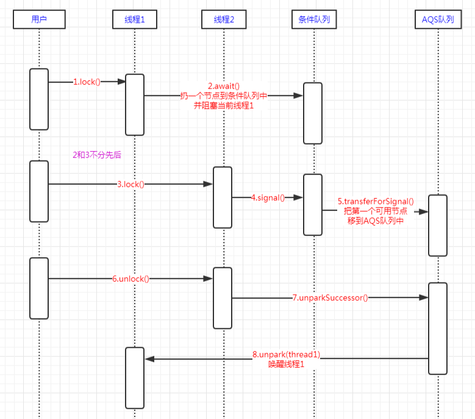
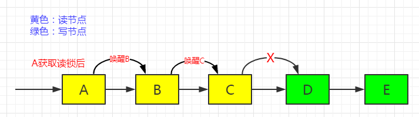
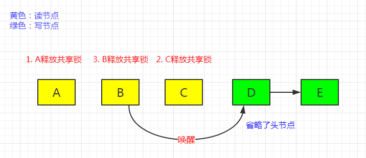

# Lock & ReentrantLock & ReentrantReadWriteLock

[TOC]

## 一、Lock 锁机制深入详解

JDK 1.5 之前对于对象同步只能使用 Synchronized 关键字，之后引入了 Lock 接口（java.util.concurrency.locks.Lock.java），可以实现对象同步。

**首先针对 Lock 类的 JavaDoc 进行分析**：

> Lock 实现提供了比使用 synchronized 方法和语句更广泛的锁定操作。它们允许更灵活的结构，可能具有完全不同的属性，并且可能**支持多个关联的 Condition 对象**（也在 locks 中，后面讲解）。
>
> **锁是一种工具，用于控制多个线程对共享资源的访问**。通常情况下，锁提供对共享资源的独占访问：一次只有一个线程可以获取锁，**对共享资源的所有访问都要求首先获取锁**。但是，有些锁可能允许并发访问共享资源，例如 ReadWriteLock 的读锁。
>
> > 注：通常情况下， Lock 是一种排他性的锁，即同一时刻只能有一个线程拥有这把锁，然后访问该锁控制的资源，如果有其它线程想访问该共享资源则只能等待持有该锁的线程执行完或者抛出异常从而释放该锁，然后去争抢这把锁。 当时这种方式对于共享资源划分力度不够，例如通常资源读的次数大于写次数，当多个线程对同一个资源都是读取，本质上都是不需要上锁的，所以通过 ReadWriteLock，读和写线程分别获取读锁和写锁。具体后续再分析。
>
> 使用 synchronized 方法或语句可以访问与每个对象关联的隐式监视锁，但会强制以块结构的方式获取和释放所有锁：当获取多个锁时，它们必须按相反的顺序释放，所有锁都必须在获得它们的相同词法（作用域）范围内释放。
>
> 虽然 synchronized 方法和语句的作用域机制使使用监视器锁编程更加容易，并有助于避免许多涉及锁的常见编程错误，但**有时需要以更灵活的方式使用锁**。例如，一些遍历并发访问数据结构的算法需要使用「head - over - head」或「链锁定」：先获取节点 A 的锁，然后获取节点 B，然后释放 A 和获取 C，然后释放 B 和获取 D，依此类推。 **Lock 接口的实现允许在不同的作用域中获取和释放一个锁，并允许以任何顺序获取和释放多个锁**，从而允许使用此类技术。
>
> 随着这种灵活性的增加，也带来了额外的责任。缺少块结构锁定将删除 synchronized 方法和语句所发生的锁的自动释放。在大多数情况下，应使用以下用法：
>
> ```java
> Lock l = ...;
> l.lock();
> // 即在 try 中访问锁保护的资源，并且在 finally 中释放锁
> try {
>    // access the resource protected by this lock
> } finally {
>    l.unlock();
> }
> ```
>
> **当锁定和解锁发生在不同的作用域中时，必须注意确保在锁定期间执行的所有代码都受到 try finally 或 try catch 的保护，以确保在必要时释放锁定。**
>
> **Lock 实现通过提供一个非阻塞的获取锁的尝试 `tryLock()`，一个获取可以中断的锁的尝试lockInterruptibly，以及试图获取可以超时的锁 `tryLock（long，TimeUnit)`**。
>
> Lock 类还可以提供与隐式监视锁完全不同的行为和语义，例如保证排序、不可重入使用或死锁检测。如果一个实现提供了这样的专门语义，那么该实现必须记录这些语义。
>
> 注意 **Lock 实例只是普通对象**，它们本身可以用作  synchronized 语句中的目标。**获取 lock 实例的监视器锁与调用该实例的任何 lock 方法都没有指定的关系**。建议您不要以这种方式使用 Lock 实例，除非在它们自己的实现中。
>
> 除非另有说明，否则为任何参数传递 null 值将导致引发 NullPointerException。
>
> <h4>内存同步</h4>
>
> 所有的 Lock实现都必须执行内置监视器锁提供的相同内存同步语义，如 [Java 语言规范（17.4内存模型）]( http://docs.oracle.com/javase/specs/jls/se7/html/jls-17.html )
>
> 成功的 lock 操作与成功的<em>lock</em>动作具有相同的内存同步效果。
>
> 成功的 unlock 操作与成功的<em>unlock</em>动作具有相同的内存同步效果。
>
> 不成功的锁定和解锁操作以及可重入的锁定/解锁动作不需要任何内存同步效果。
>
> <h4>实现上的注意事项</h4>
>
> 锁获取的三种形式（可中断、不可中断和定时）在性能特征、顺序保证或其他实现质量方面可能有所不同。此外，在给定的 lock 类中可能无法中断正在进行的获取锁的能力。因此，实现不需要为所有三种锁获取形式定义完全相同的保证或语义，也不需要支持正在进行的锁获取的中断。需要一个实现来清楚地记录每个锁定方法提供的语义和保证。它还必须遵守此接口中定义的中断语义，只要支持锁获取中断：要么完全中断，要么仅中断方法入口。
>
> 由于中断通常意味着取消，并且对中断的检查通常是不经常的，所以实现可能倾向于响应中断，而不是普通的方法返回。即使可以显示在另一个操作可能已解除阻止线程之后发生的中断，这也是正确的。实现应该记录此行为。

**JavaDoc 的总结**：

- Lock 支持关联多个 Condition
- 需要自行以反加锁的顺序释放锁；
- Lock 接口的实现允许在不同的作用域中获取和释放一个锁，并允许以任何顺序获取和释放多个锁；
- 当锁定和解锁发生在不同的作用域中时，必须注意确保在锁定期间执行的所有代码都受到 try finally 或 try catch 的保护，以确保在必要时释放锁定。
- Lock 实现通过提供一个非阻塞的获取锁的尝试 `tryLock()`，一个获取可以中断的锁的尝试`lockInterruptibly()`，以及试图获取可以超时的锁 `tryLock（long，TimeUnit)`

```java

public interface Lock {

    /**
     *  获取锁
     */
    void lock();

    /**
    获取锁（可中断）
    
    获取锁，除非当前线程被 interrupted。
	获取锁（如果可用）并立即返回。
	如果锁不可用，则当前线程将被禁用以进行线程调度，并处于休眠状态，直到发生以下两种情况之一：
	- 这个锁是由当前线程获取的；
	- 或者某些其他线程中断当前线程（的休眠状态），并且支持锁获取的中断。

	如果当前线程：
	- 在进入此方法时设置了中断状态；
	- 或者在获取锁时被 interrupted，并且支持中断获取锁，则抛出 InterruptedException，并清除当前线程的中断状态。

	实施注意事项

	在某些实现中中断锁获取的能力可能是不可能的，并且如果可能的话可能是一个昂贵的操作。程序员应该意识到情况可能是这样的。在这种情况下，实现应该记录下来。

	实现有利于响应中断，而不是普通的方法返回。

	{@code Lock}实现可能能够检测到锁的错误使用，例如可能导致死锁的调用，并且在这种情况下可能抛出（未检查的）异常。环境和异常类型必须由{@code Lock}实现记录。
     
     * @throws InterruptedException if the current thread is
     *         interrupted while acquiring the lock (and interruption
     *         of lock acquisition is supported)
     */
    void lockInterruptibly() throws InterruptedException;

    /**
    尝试获取锁，如果获取到返回 true，否则返回 false。
    
    只有在调用时锁是空闲的情况下才获取锁。
	获取锁（如果可用），并立即返回值 true。如果锁不可用，则此方法将立即返回值 false。
    该方法的典型使用示例：

     // 定义一个 lock 对象
      Lock lock = ...;
      if (lock.tryLock()) {
        try {
          // manipulate protected state
        } finally {
          lock.unlock();
        }
      } else {
        // perform alternative actions
      }}
     
     此用法确保在获取锁时将其解锁，并且在未获取锁时不会尝试解锁。因为if 之后在 finally 中解锁了。
     */
    boolean tryLock();

    /**
    尝试获取锁，如果没有获取到锁则等待一段时间，在等待时间之内还没有获取到锁则返回 false。
    
    如果锁在给定的等待时间内空闲并且当前线程未被终中断，则获取该锁。
    如果锁可用（获取到），则此方法立即返回值 true。
    如果锁不可用（没有获取到），则当前线程将被禁用以进行线程调度，并处于休眠状态，直到发生以下三种情况之一：
	- 锁由当前线程获取；
	- 另一个线程中断当前线程，并且支持锁获取中断；
	- 指定的等待时间已过

	如果获取了锁，则返回值 true。

	如果当前线程：在进入此方法时设置了中断状态；或在获取锁时是中断的，并且支持中断获取锁，然后 InterruptedException 被抛出，当前线程的中断状态被清除。

	如果指定的等待时间已过，则值返回 false

	如果时间小于或等于零，则该方法根本不会等待。

    实施考虑1
	在某些实现中中断锁获取的能力可能是不可能的，并且如果可能的话可能是一个昂贵的操作。
	程序员应该意识到情况可能是这样的。在这种情况下，实现应该记录下来。
	实现可以支持响应中断，而不是普通的方法返回，或者报告超时。
	Lock实现可能能够检测到锁的错误使用，例如可能导致死锁的调用，并且在这种情况下可能抛出（未检查的）异常。
	环境和异常类型必须由{@code Lock}实现记录。  
     */
    boolean tryLock(long time, TimeUnit unit) throws InterruptedException;


    /**
     释放锁
     */
    void unlock();

    /**
    返回一个 Condition 实例，该实例绑定到调用了 newCondition() 方法的 Lock 实例对象上。
	在等待 condition 之前，锁必须由当前线程持有。
    对 Condition 的 await（）方法的调用将会在等待之前自动释放锁，并在等待返回之前重新获取锁
	
	实施注意事项
    {@link Condition}实例的确切操作取决于{@code Lock}实现，并且必须由该实现记录。
    如果当前 Lock 实现不支持 conditions  则抛出 UnsupportedOperationException。
     */
    Condition newCondition();
}
```

## 二、ReentrantLock

是 Lock  接口下面最重要的实现，re 即再次，entrant 是进入，因此 **ReentrantLock 为可重入锁。即指一个线程获取锁之后再尝试获取锁时会自动获取锁。**


### （一）主要内部类

ReentrantLock 中主要定义了三个内部类：Sync、NonfairSync、FairSync。

```java
// 抽象类 Sync 实现了 AQS 的部分方法；
abstract static class Sync extends AbstractQueuedSynchronizer {}
// NonfairSync 实现了 Sync，主要用于非公平锁的获取；
static final class NonfairSync extends Sync {}
// FairSync 实现了 Sync，主要用于公平锁的获取。
static final class FairSync extends Sync {}
```

### （二）主要属性

```java
private final Sync sync;
```

主要属性就一个 sync，它在构造方法中初始化，决定使用公平锁还是非公平锁的方式获取锁。

### （三）主要构造方法

```java
// 默认构造方法，使用非公平锁
public ReentrantLock() {
    sync = new NonfairSync();
}
// 自主选择使用公平锁还是非公平锁
public ReentrantLock(boolean fair) {
    sync = fair ? new FairSync() : new NonfairSync();
}
```

### （四）lock()方法

#### 1.公平锁加锁过程

公平锁的 ReentrantLock 实例需要通过上述第二个构造方法进行创建：

```java
ReentrantLock reentrantLock = new ReentrantLock(true);
```

下面的是加锁的主要逻辑：

```java
// ReentrantLock.lock() ===========================
public void lock() {
    // 调用的 sync 属性的 lock() 方法，因为这里 sync 为公平锁，所以是 FairSync 的实例。
    sync.lock();
}

// ReentrantLock.FairSync.lock() ===========================
final void lock() {
    // 因为 Sync 继承了 AQS，这里调用 AQS 的 acquire() 方法获取锁，传入值为 1
    acquire(1);
}

// AbstractQueuedSynchronizer.acquire() ===========================
public final void acquire(int arg) {
    // 首先尝试通过 FairSync 的 tryAcquire() 获取锁，如果返回 false 即没有获取锁，则通过 acquireQueued 来放入后面的阻塞队列（排队） 
    if (!tryAcquire(arg) &&
        // 注意 addWaiter() 这里传入的节点模式为独占模式
        acquireQueued(addWaiter(Node.EXCLUSIVE), arg))
        selfInterrupt();
}

// ReentrantLock.FairSync.tryAcquire() ===========================
protected final boolean tryAcquire(int acquires) {
    // 首先获取当前线程（该线程即尝试获取锁的线程）
    final Thread current = Thread.currentThread();
    // 获取状态变量 state 的值，在排它锁的语境下，该值表示已经持有锁的线程的个数
    int c = getState();
    // c = 0 表示当前没有任何线程获取到这把锁
    if (c == 0) {
        // hasQueuedPredecessors() 就是判断阻塞队列中有没有等待的线程。如果没有则当前线程尝试用 CAS 模式将 state 的值 0 更新为传入的 acquires 值（值为 1）。如果更新成功则表示当前线程获取到了锁。
        if (!hasQueuedPredecessors() &&
            compareAndSetState(0, acquires)) {
            // 当前线程获取了锁，把自己设置到 exclusiveOwnerThread 变量中
            // exclusiveOwnerThread 是 AQS 的父类 AbstractOwnableSynchronizer 中提供的变量
            setExclusiveOwnerThread(current);
            // 返回 true 说明成功获取了锁
            return true;
        }
        
    } 
   // 判断当前线程是不是排它锁的拥有者，如果当前线程本身就占有着锁，现在又尝试获取锁，则直接让它获取锁并返回 true
    else if (current == getExclusiveOwnerThread()) {
        // 状态变量 state 的值加 1,即 nextc 为该锁新的重入次数，下面将 nextc 设置为 state 值。
        int nextc = c + acquires;
        // 如果溢出了，则报错
        if (nextc < 0)
            throw new Error("Maximum lock count exceeded");
        // 将 nextc 值（锁的重入次数）设置到 state 中
        // 这里不需要 CAS 更新 state，因为当前线程占有着锁，其它线程只会 CAS 把 state 从 0 更新成 1，是不会成功的，所以不存在竞争，自然不需要使用 CAS 来更新
        setState(nextc);
        // 当线程获取锁成功
        return true;
    }
    // 当前线程尝试获取锁失败
    return false;
}

// AbstractQueuedSynchronizer.addWaiter() ===========================
// 调用这个方法，说明上面尝试获取锁失败了
private Node addWaiter(Node mode) {
    // 新建一个节点（当前线程封装为一个节点）
    Node node = new Node(Thread.currentThread(), mode);
    // 这里先尝试把新节点加到尾节点后面，如果成功了就返回新节点，如果没成功再调用enq()方法不断尝试
    Node pred = tail;
    // 如果尾节点不为空
    if (pred != null) {
        // 设置新节点的前置节点为现在的尾节点
        node.prev = pred;
        // CAS 更新尾节点为新节点
        if (compareAndSetTail(pred, node)) {
            // 如果成功了，把旧尾节点的下一个节点指向新节点
            pred.next = node;
            // 并返回新节点
            return node;
        }
    }
    // 如果上面尝试入队新节点没成功，调用 enq()处理
    enq(node);
    return node;
}

// AbstractQueuedSynchronizer.enq() ===========================
private Node enq(final Node node) {
    // 自旋，不断尝试
    for (;;) {
        Node t = tail;
        // 如果尾节点为空，说明还未初始化
        if (t == null) { // Must initialize
            // 初始化头节点和尾节点
            if (compareAndSetHead(new Node()))
                tail = head;
        } else {
            // 如果尾节点不为空
            // 设置新节点的前一个节点为现在的尾节点
            node.prev = t;
            // CAS更新尾节点为新节点
            if (compareAndSetTail(t, node)) {
                // 成功了，则设置旧尾节点的下一个节点为新节点
                t.next = node;
                // 并返回旧尾节点
                return t;
            }
        }
    }
}

// AbstractQueuedSynchronizer.acquireQueued()===========================
// 调用上面的 addWaiter() 方法使得新节点已经成功入队了
// 这个方法是尝试让当前节点来获取锁的
final boolean acquireQueued(final Node node, int arg) {
    // 失败标记
    boolean failed = true;
    try {
        // 中断标记
        boolean interrupted = false;
        // 自旋
        for (;;) {
            // 当前节点的前一个节点
            final Node p = node.predecessor();
            // 如果当前节点的前一个节点为head节点，则说明轮到自己获取锁了
            // 调用ReentrantLock.FairSync.tryAcquire()方法再次尝试获取锁
            if (p == head && tryAcquire(arg)) {
                // 尝试获取锁成功
                // 这里同时只会有一个线程在执行，所以不需要用CAS更新
                // 把当前节点设置为新的头节点
                setHead(node);
                // 并把上一个节点从链表中删除
                p.next = null; // help GC
                // 未失败
                failed = false;
                return interrupted;
            }
            // 是否需要阻塞
            if (shouldParkAfterFailedAcquire(p, node) &&
                // 真正阻塞的方法
                parkAndCheckInterrupt())
                // 如果中断了
                interrupted = true;
        }
    } finally {
        // 如果失败了
        if (failed)
            // 取消获取锁
            cancelAcquire(node);
    }
}


// AbstractQueuedSynchronizer.shouldParkAfterFailedAcquire()=========================
// 这个方法是在上面的for()循环里面调用的
// 第一次调用会把前一个节点的等待状态设置为SIGNAL，并返回false
// 第二次调用才会返回true
private static boolean shouldParkAfterFailedAcquire(Node pred, Node node) {
    // 上一个节点的等待状态
    // 注意Node的waitStatus字段我们在上面创建Node的时候并没有指定
    // 也就是说使用的是默认值0
    // 这里把各种等待状态再贴出来
    //static final int CANCELLED =  1;
    //static final int SIGNAL    = -1;
    //static final int CONDITION = -2;
    //static final int PROPAGATE = -3;
    int ws = pred.waitStatus;
    // 如果等待状态为SIGNAL(等待唤醒)，直接返回true
    if (ws == Node.SIGNAL)
        return true;
    // 如果前一个节点的状态大于0，也就是已取消状态
    if (ws > 0) {
        // 把前面所有取消状态的节点都从链表中删除
        do {
            node.prev = pred = pred.prev;
        } while (pred.waitStatus > 0);
        pred.next = node;
    } else {
        // 如果前一个节点的状态小于等于0，则把其状态设置为等待唤醒
        // 这里可以简单地理解为把初始状态0设置为SIGNAL
        // CONDITION是条件锁的时候使用的
        // PROPAGATE是共享锁使用的
        compareAndSetWaitStatus(pred, ws, Node.SIGNAL);
    }
    return false;
}
// AbstractQueuedSynchronizer.parkAndCheckInterrupt()===========================
private final boolean parkAndCheckInterrupt() {
    // 阻塞当前线程
    // 底层调用的是Unsafe的park()方法
    LockSupport.park(this);
    // 返回是否已中断
    return Thread.interrupted();
}
```

下面我们看一下主要方法的调用关系，可以跟着我的 → 层级在脑海中大概过一遍每个方法的主要代码：

```java
ReentrantLock#lock()
->ReentrantLock.FairSync#lock() // 公平模式获取锁
  ->AbstractQueuedSynchronizer#acquire() // AQS的获取锁方法
    ->ReentrantLock.FairSync#tryAcquire() // 尝试获取锁
    ->AbstractQueuedSynchronizer#addWaiter()  // 添加到队列
	  ->AbstractQueuedSynchronizer#enq()  // 入队
    ->AbstractQueuedSynchronizer#acquireQueued() // 里面有个for()循环，唤醒后再次尝试获取锁
      ->AbstractQueuedSynchronizer#shouldParkAfterFailedAcquire() // 检查是否要阻塞
      ->AbstractQueuedSynchronizer#parkAndCheckInterrupt()  // 真正阻塞的地方
```

公平锁获取锁的主要过程大致如下：

- 步骤一：尝试获取锁，如果获取到了就直接返回了；
- 步骤二：尝试获取锁失败，再调用 `addWaiter()`构建新节点并把新节点入队；
- 步骤三：然后调用 `acquireQueued()` 再次尝试获取锁，如果成功了，直接返回；
- 步骤四：如果再次失败，再调用 `shouldParkAfterFailedAcquire()` 将节点的等待状态置为等待唤醒（SIGNAL）；

- 步骤五：调用 `parkAndCheckInterrupt()` 阻塞当前线程；
- 步骤六：如果被唤醒了，会继续在 `acquireQueued()` 的 for() 循环再次尝试获取锁，如果成功了就返回；
- 步骤七：如果不成功，再次阻塞，重复步骤三、四、五直到成功获取到锁。

#### 非公平锁加锁过程

构造方式分为：使用 ReentrantLock 的默认构造方法或者 `new ReentrantLock(false);`创建对象。

```java
// ReentrantLock.lock()===========================
public void lock() {
    sync.lock();
}

// ReentrantLock.NonfairSync.lock()===========================
final void lock() {
    // 直接尝试 CAS 更新状态变量，然后设置排它锁
    if (compareAndSetState(0, 1))
        // 如果更新成功，说明获取到锁，把当前线程设为独占线程
        setExclusiveOwnerThread(Thread.currentThread());
    else
        acquire(1);
}

// ReentrantLock.NonfairSync.tryAcquire()===========================
protected final boolean tryAcquire(int acquires) {
    // 调用父类的方法
    return nonfairTryAcquire(acquires);
}

// ReentrantLock.Sync.nonfairTryAcquire()===========================
final boolean nonfairTryAcquire(int acquires) {
    final Thread current = Thread.currentThread();
    int c = getState();
    if (c == 0) {
        // 如果状态变量的值为 0，再次尝试 CAS 更新状态变量的值
        // 相对于公平锁模式少了!hasQueuedPredecessors() 条件
        if (compareAndSetState(0, acquires)) {
            setExclusiveOwnerThread(current);
            return true;
        }
    }
    else if (current == getExclusiveOwnerThread()) {
        int nextc = c + acquires;
        if (nextc < 0) // overflow
            throw new Error("Maximum lock count exceeded");
        setState(nextc);
        return true;
    }
    return false;
}
```

相对于公平锁，非公平锁加锁的过程主要有两点不同：

- 一开始就尝试 CAS 更新状态变量 state 的值，如果成功了就获取到锁了；

- 在 tryAcquire() 的时候没有检查是否前面有排队的线程，直接上去获取锁才不管别人有没有排队呢；

总的来说，相对于公平锁，非公平锁在一开始就多了两次直接尝试获取锁的过程。

 .svg)

**公平锁和非公平锁的示例**：

公平锁：每次获取锁之前都会检查队列中有没有排队等待的线程，有就将当前线程追加到队列中，没有才会获取锁。

```java
package com.gjxaiou.lock;

import java.util.Arrays;
import java.util.concurrent.locks.Lock;
import java.util.concurrent.locks.ReentrantLock;

public class MyTest2 {
	public static void main(String[] args) throws InterruptedException {
		MyService myService = new MyService(true);
		// 非公平锁
		// MyService myService	 = new MyService(false);

		MyThread[] array1 = new MyThread[4];
		MyThread[] array2 = new MyThread[4];
		for (int i = 0; i < array1.length; i++) {
			array1[i] = new MyThread(myService);
			array1[i].setName("array1 -- " + (i + 1));
		}
		Arrays.stream(array1).forEach(myThread -> myThread.start());

		for (int i = 0; i < array2.length; i++) {
			array2[i] = new MyThread(myService);
			array2[i].setName("array2 -- " + (i + 1));
		}
		Thread.sleep(500);
		Arrays.stream(array2).forEach(myThread -> myThread.start());
	}
}

// 线程类
class MyThread extends Thread {
	private MyService myService;

	MyThread(MyService myService) {
		this.myService = myService;
	}

	@Override
	public void run() {
		myService.method();
	}
}

class MyService {
	public Lock lock;

	public MyService(boolean fair) {
		lock = new ReentrantLock(fair);
	}

	public void method() {
		lock.lock();
		System.out.println(Thread.currentThread().getName() + " 执行 method");
		try {
			// 配合 main 方法是，使得 array2 中线程有机会在非公平情况下获取锁
			Thread.sleep(500);
		} catch (InterruptedException e) {
			e.printStackTrace();
		} finally {
			lock.unlock();
		}
	}
}
```

输出结果为：

```java
array1 -- 1 执行 method
array1 -- 3 执行 method
array1 -- 2 执行 method
array1 -- 4 执行 method
array2 -- 1 执行 method
array2 -- 2 执行 method
array2 -- 3 执行 method
array2 -- 4 执行 method
```

如果传入 false 则构建了一个非公平锁：一个线程获取锁之前要先去尝试获取锁，如果获取锁成功则执行，不成功再将自身加入队列中等待。

使用非公平锁的执行结果为：后启动的线程可能先获得锁。

```java
array1 -- 1 执行 method
array2 -- 1 执行 method
array1 -- 2 执行 method
array1 -- 3 执行 method
array1 -- 4 执行 method
array2 -- 2 执行 method
array2 -- 4 执行 method
array2 -- 3 执行 method
```

### lockInterruptibly()方法

支持线程中断，它与 `lock()` 方法的主要区别在于 `lockInterruptibly()` 获取锁的时候如果线程中断了，会抛出一个 InterruptedException 异常，而 `lock()` 不会管线程是否中断都会一直尝试获取锁，获取锁之后把自己标记为已中断，继续执行自己的逻辑，后面也会正常释放锁。

> 线程中断：只是在线程上打一个中断标志，并不会对运行中的线程有什么影响，具体需要根据这个中断标志干些什么，用户自己去决定。
>
> 比如，如果用户在调用 lock() 获取锁后，发现线程中断了，就直接返回了，而导致没有释放锁，这也是允许的，但是会导致这个锁一直得不到释放，就出现了死锁。
>
> ```java
> lock.lock();
> 
> if (Thread.currentThread().interrupted()) {
>     return ;
> }
> 
> lock.unlock();
> ```
>
> 当然，这里只是举个例子，实际使用肯定是要把 `lock.lock()` 后面的代码都放在 `try...finally...` 里面的以保证锁始终会释放，这里主要是为了说明线程中断只是一个标志，至于要做什么完全由用户自己决定。

### tryLock()方法

尝试获取一次锁，成功了就返回 true，没成功就返回 false，不会继续尝试。

```java
// ReentrantLock.tryLock()
public boolean tryLock() {
    // 直接调用内部类 Sync 的 nonfairTryAcquire() 方法
    return sync.nonfairTryAcquire(1);
}

// ReentrantLock.Sync.nonfairTryAcquire()
final boolean nonfairTryAcquire(int acquires) {
    final Thread current = Thread.currentThread();
    int c = getState();
    if (c == 0) {
        if (compareAndSetState(0, acquires)) {
            setExclusiveOwnerThread(current);
            return true;
        }
    }
    else if (current == getExclusiveOwnerThread()) {
        int nextc = c + acquires;
        if (nextc < 0) // overflow
            throw new Error("Maximum lock count exceeded");
        setState(nextc);
        return true;
    }
    return false;
}
```

tryLock() 方法比较简单，直接以**非公平**的模式去尝试获取一次锁，获取到了或者锁本来就是当前线程占有着就返回 true，否则返回 false。

### tryLock(long time, TimeUnit unit)方法

尝试获取锁，并等待一段时间，如果在这段时间内都没有获取到锁，就返回false。

```java
// ReentrantLock.tryLock()
public boolean tryLock(long timeout, TimeUnit unit)
        throws InterruptedException {
    // 调用 AQS 中的方法（Sync 继承 AQS）
    return sync.tryAcquireNanos(1, unit.toNanos(timeout));
}


// AbstractQueuedSynchronizer.tryAcquireNanos()
public final boolean tryAcquireNanos(int arg, long nanosTimeout)
        throws InterruptedException {
    // 如果线程中断了，抛出异常
    if (Thread.interrupted())
        throw new InterruptedException();
    // 先尝试获取一次锁
    return tryAcquire(arg) ||
        doAcquireNanos(arg, nanosTimeout);
}


// AbstractQueuedSynchronizer.doAcquireNanos()
private boolean doAcquireNanos(int arg, long nanosTimeout)
        throws InterruptedException {
    // 如果时间已经到期了，直接返回 false
    if (nanosTimeout <= 0L)
        return false;
    // 到期时间
    final long deadline = System.nanoTime() + nanosTimeout;
    final Node node = addWaiter(Node.EXCLUSIVE);
    boolean failed = true;
    try {
        for (;;) {
            final Node p = node.predecessor();
            if (p == head && tryAcquire(arg)) {
                setHead(node);
                p.next = null; // help GC
                failed = false;
                return true;
            }
            nanosTimeout = deadline - System.nanoTime();
            // 如果到期了，就直接返回false
            if (nanosTimeout <= 0L)
                return false;
            // spinForTimeoutThreshold = 1000L;
            // 只有到期时间大于1000纳秒，才阻塞
            // 小于等于1000纳秒，直接自旋解决就得了
            if (shouldParkAfterFailedAcquire(p, node) &&
                nanosTimeout > spinForTimeoutThreshold)
                // 阻塞一段时间
                LockSupport.parkNanos(this, nanosTimeout);
            if (Thread.interrupted())
                throw new InterruptedException();
        }
    } finally {
        if (failed)
            cancelAcquire(node);
    }
}
```

`tryLock(long time, TimeUnit unit)` 方法在阻塞的时候加上阻塞时间，并且会随时检查是否到期，只要到期了没获取到锁就返回 false。

### unlock()方法

释放锁。

```java
// ReentrantLock.unlock()
public void unlock() {
    // 针对可重入锁，就是 -1
    sync.release(1);
}

// AbstractQueuedSynchronizer.release
public final boolean release(int arg) {
    // 调用 AQS 实现类(这里就是 Sync)的 tryRelease() 方法释放锁
    // 首先通过 tryRelease，如果返回 true 则表示当前线程不管重入多少次都已经将该锁释放了。后面线程可以尝试获取了
    if (tryRelease(arg)) {
        Node h = head;
        // 如果头节点不为空，且等待状态不是0，就唤醒下一个节点
        // 还记得waitStatus吗？
        // 在每个节点阻塞之前会把其上一个节点的等待状态设为SIGNAL（-1）
        // 所以，SIGNAL的准确理解应该是唤醒下一个等待的线程
        if (h != null && h.waitStatus != 0)
            unparkSuccessor(h);
        return true;
    }
    return false;
}

// ReentrantLock.Sync.tryRelease
protected final boolean tryRelease(int releases) {
    // 首先将 state 值减一
    int c = getState() - releases;
    // 判断当前线程是不是获取该排它锁的线程，用于防止使用 A 线程的 lock，然后调用 B 线程的 unlock 进行上锁。如果当前线程不是占有着锁的线程，抛出异常
    if (Thread.currentThread() != getExclusiveOwnerThread())
        throw new IllegalMonitorStateException();
    boolean free = false;
    // 如果状态变量的值为 0 了，说明完全释放了锁，即当前没有线程持有这把锁。
    // 这也就是为什么重入锁调用了多少次lock()就要调用多少次unlock()的原因
    // 如果不这样做，会导致锁不会完全释放，别的线程永远无法获取到锁
    if (c == 0) {
        // 将锁的状态 free 设置为 true，同时将排它锁的线程持有者设置为 null，表示当前没有线程持有这个排它锁
        free = true;
        // 清空占有线程
        setExclusiveOwnerThread(null);
    }
    // 设置状态变量的值
    setState(c);
    return free;
}

private void unparkSuccessor(Node node) {
    // 注意，这里的node是头节点
    
    // 如果头节点的等待状态小于0，就把它设置为0
    int ws = node.waitStatus;
    if (ws < 0)
        compareAndSetWaitStatus(node, ws, 0);

    // 头节点的下一个节点
    Node s = node.next;
    // 如果下一个节点为空，或者其等待状态大于0（实际为已取消）
    if (s == null || s.waitStatus > 0) {
        s = null;
        // 从尾节点向前遍历取到队列最前面的那个状态不是已取消状态的节点
        for (Node t = tail; t != null && t != node; t = t.prev)
            if (t.waitStatus <= 0)
                s = t;
    }
    // 如果下一个节点不为空，则唤醒它
    if (s != null)
        LockSupport.unpark(s.thread);
}
```

释放锁的过程大致为：

（1）将state的值减1；

（2）如果state减到了0，说明已经完全释放锁了，唤醒下一个等待着的节点；

**默认非公平模式的原因**：

非公平模式效率较高：因为非公平模式会在一开始就尝试两次获取锁，如果当时正好state的值为0，它就会成功获取到锁，少了排队导致的阻塞/唤醒过程，并且减少了线程频繁的切换带来的性能损耗。

非公平模式的弊端：非公平模式有可能会导致一开始排队的线程一直获取不到锁，导致线程饿死。

### getHoldCount() 方法

获取当前线程保持此锁定的个数，即调用 lock() 方法的次数。因为 ReentrantLock 是可重入锁。

```java
package com.gjxaiou.lock;

import java.util.concurrent.locks.ReentrantLock;

public class MyTest3 {
	public static void main(String[] args) {
		Service service = new Service();
		service.method1();
	}
}

class Service {
	private ReentrantLock lock = new ReentrantLock(true);

	public void method1() {
		System.out.println("A --" + lock.getHoldCount());
		lock.lock();
		System.out.println("B --" + lock.getHoldCount());
		method2();
		System.out.println("F --" + lock.getHoldCount());
		lock.unlock();
		System.out.println("G --" + lock.getHoldCount());
	}

	public void method2() {
		System.out.println("C --" + lock.getHoldCount());
		lock.lock();
		System.out.println("D --" + lock.getHoldCount());
		lock.unlock();
		System.out.println("E --" + lock.getHoldCount());
	}
}
```

程序输出结果为：

```java
A --0
B --1
C --1
D --2
E --1
F --1
G --0
```

但是实际通常仅仅用于在测试和调试场景下，如 如果某段代码不应该在锁已被持有的情况下输入，示例为：

```java
package com.gjxaiou.lock;

import java.util.concurrent.locks.ReentrantLock;

public class MyTest4 {
	ReentrantLock lock = new ReentrantLock();

	// ...
	public void m() {
		assert lock.getHoldCount() == 0;
		lock.lock();
		try {
			// ... method body
		} finally {
			lock.unlock();
		}
	}
}
```

### getQueueLength() 方法

返回正等待获取此锁的线程估计数。如共 5 个线程，其中 1 个线程长时间占用锁，则调用该 reentrantLock.getQueueLength() 返回 4，即有 4 个线程共同在等待锁的释放。

### getWaitQueueLength(Condition condition) 方法

返回等待与此锁相关的给定条件 Condition 的线程估计数，如 5 个线程对象都调用了同一个 Condition 对象的 `await()` 方法，则调用 `lock.getWaitQueueLength(该 condition 对象)` 方法，返回 5。

### hasQueuedThread(Thread thread) 方法

查询指定的线程是否正在等待获取此锁，即来判断参数中的线程是否在等待队列中。`lock.hasQueuedThread(Thread 对象)` 返回 true 或者 false。

### hasQueuedThreads() 方法

查询是否有线程正在等待获取此锁，即等待队列中是否有等待的线程。使用 `lock.hasQueuedThreads()` 返回 true 或者 false。

### hasWaiters(Condition condition) 方法

查询是否有线程正在等待与该锁有关的 condition 条件，即是否有线程执行了 condition 对象中的 await() 方法而呈现等待状态。使用 `lock.hasWaiter(condition 对象)` 返回 true 或者 false。

### isHeldByCurrentThread() 方法

查询当前线程是否保持此锁，使用 `lock.isHeldByCurrentThread()` 返回 true 或者 false。


## 第二部分：条件锁

条件锁，是指在获取锁之后发现当前业务场景自己无法处理，而需要等待某个条件的出现才可以继续处理时使用的一种锁。

比如，在阻塞队列中，当队列中没有元素的时候是无法弹出一个元素的，这时候就需要阻塞在条件notEmpty 上，等待其它线程往里面放入一个元素后，唤醒这个条件 notEmpty，当前线程才可以继续去做“弹出一个元素”的行为。

注意，这里的条件，必须是**在获取锁之后去等待**，对应到ReentrantLock的条件锁，就是获取锁之后才能调用condition.await()方法。

在java中，条件锁的实现都在AQS的ConditionObject类中，ConditionObject实现了Condition接口，下面我们通过一个例子来进入到条件锁的学习中。

## 使用示例

```java
public class ReentrantLockTest {
    public static void main(String[] args) throws InterruptedException {
        // 声明一个重入锁
        ReentrantLock lock = new ReentrantLock();
        // 声明一个条件锁
        Condition condition = lock.newCondition();

        new Thread(()->{
            try {
                lock.lock();  // 1
                try {
                    System.out.println("before await");  // 2
                    // 等待条件
                    condition.await();  // 3
                    System.out.println("after await");  // 10
                } finally {
                    lock.unlock();  // 11
                }
            } catch (InterruptedException e) {
                e.printStackTrace();
            }
        }).start();
        
        // 这里睡1000ms是为了让上面的线程先获取到锁
        Thread.sleep(1000);
        lock.lock();  // 4
        try {
            // 这里睡2000ms代表这个线程执行业务需要的时间
            Thread.sleep(2000);  // 5
            System.out.println("before signal");  // 6
            // 通知条件已成立
            condition.signal();  // 7
            System.out.println("after signal");  // 8
        } finally {
            lock.unlock();  // 9
        }
    }
}
```

上面的代码很简单，一个线程等待条件，另一个线程通知条件已成立，后面的数字代表代码实际运行的顺序，如果你能把这个顺序看懂基本条件锁掌握得差不多了。

## 源码分析

### ConditionObject的主要属性

```java
public class ConditionObject implements Condition, java.io.Serializable {
    /** First node of condition queue. */
    private transient Node firstWaiter;
    /** Last node of condition queue. */
    private transient Node lastWaiter;
}
```

可以看到条件锁中也维护了一个队列，为了和AQS的队列区分，我这里称为条件队列，firstWaiter是队列的头节点，lastWaiter是队列的尾节点，它们是干什么的呢？接着看。

### lock.newCondition()方法

新建一个条件锁。

```java
// ReentrantLock.newCondition()
public Condition newCondition() {
    return sync.newCondition();
}
// ReentrantLock.Sync.newCondition()
final ConditionObject newCondition() {
    return new ConditionObject();
}
// AbstractQueuedSynchronizer.ConditionObject.ConditionObject()
public ConditionObject() { }
```

新建一个条件锁最后就是调用的AQS中的ConditionObject类来实例化条件锁。

### condition.await()方法

condition.await()方法，表明现在要等待条件的出现。

```java
// AbstractQueuedSynchronizer.ConditionObject.await()
public final void await() throws InterruptedException {
    // 如果线程中断了，抛出异常
    if (Thread.interrupted())
        throw new InterruptedException();
    // 添加节点到Condition的队列中，并返回该节点
    Node node = addConditionWaiter();
    // 完全释放当前线程获取的锁
    // 因为锁是可重入的，所以这里要把获取的锁全部释放
    int savedState = fullyRelease(node);
    int interruptMode = 0;
    // 是否在同步队列中
    while (!isOnSyncQueue(node)) {
        // 阻塞当前线程
        LockSupport.park(this);
        
        // 上面部分是调用await()时释放自己占有的锁，并阻塞自己等待条件的出现
        // *************************分界线*************************  //
        // 下面部分是条件已经出现，尝试去获取锁
        
        if ((interruptMode = checkInterruptWhileWaiting(node)) != 0)
            break;
    }
    
    // 尝试获取锁，注意第二个参数，这是上一章分析过的方法
    // 如果没获取到会再次阻塞（这个方法这里就不贴出来了，有兴趣的翻翻上一章的内容）
    if (acquireQueued(node, savedState) && interruptMode != THROW_IE)
        interruptMode = REINTERRUPT;
    // 清除取消的节点
    if (node.nextWaiter != null) // clean up if cancelled
        unlinkCancelledWaiters();
    // 线程中断相关
    if (interruptMode != 0)
        reportInterruptAfterWait(interruptMode);
}
// AbstractQueuedSynchronizer.ConditionObject.addConditionWaiter
private Node addConditionWaiter() {
    Node t = lastWaiter;
    // 如果条件队列的尾节点已取消，从头节点开始清除所有已取消的节点
    if (t != null && t.waitStatus != Node.CONDITION) {
        unlinkCancelledWaiters();
        // 重新获取尾节点
        t = lastWaiter;
    }
    // 新建一个节点，它的等待状态是CONDITION
    Node node = new Node(Thread.currentThread(), Node.CONDITION);
    // 如果尾节点为空，则把新节点赋值给头节点（相当于初始化队列）
    // 否则把新节点赋值给尾节点的nextWaiter指针
    if (t == null)
        firstWaiter = node;
    else
        t.nextWaiter = node;
    // 尾节点指向新节点
    lastWaiter = node;
    // 返回新节点
    return node;
}
// AbstractQueuedSynchronizer.fullyRelease
final int fullyRelease(Node node) {
    boolean failed = true;
    try {
        // 获取状态变量的值，重复获取锁，这个值会一直累加
        // 所以这个值也代表着获取锁的次数
        int savedState = getState();
        // 一次性释放所有获得的锁
        if (release(savedState)) {
            failed = false;
            // 返回获取锁的次数
            return savedState;
        } else {
            throw new IllegalMonitorStateException();
        }
    } finally {
        if (failed)
            node.waitStatus = Node.CANCELLED;
    }
}
// AbstractQueuedSynchronizer.isOnSyncQueue
final boolean isOnSyncQueue(Node node) {
    // 如果等待状态是CONDITION，或者前一个指针为空，返回false
    // 说明还没有移到AQS的队列中
    if (node.waitStatus == Node.CONDITION || node.prev == null)
        return false;
    // 如果next指针有值，说明已经移到AQS的队列中了
    if (node.next != null) // If has successor, it must be on queue
        return true;
    // 从AQS的尾节点开始往前寻找看是否可以找到当前节点，找到了也说明已经在AQS的队列中了
    return findNodeFromTail(node);
}
```

这里有几个难理解的点：

（1）Condition的队列和AQS的队列不完全一样；

    AQS的队列头节点是不存在任何值的，是一个虚节点；
    
    Condition的队列头节点是存储着实实在在的元素值的，是真实节点。

（2）各种等待状态（waitStatus）的变化；

    首先，在条件队列中，新建节点的初始等待状态是CONDITION（-2）；
    
    其次，移到AQS的队列中时等待状态会更改为0（AQS队列节点的初始等待状态为0）；
    
    然后，在AQS的队列中如果需要阻塞，会把它上一个节点的等待状态设置为SIGNAL（-1）；
    
    最后，不管在Condition队列还是AQS队列中，已取消的节点的等待状态都会设置为CANCELLED（1）；
    
    另外，后面我们在共享锁的时候还会讲到另外一种等待状态叫PROPAGATE（-3）。

（3）相似的名称；

    AQS中下一个节点是next，上一个节点是prev；
    
    Condition中下一个节点是nextWaiter，没有上一个节点。

如果弄明白了这几个点，看懂上面的代码还是轻松加愉快的，如果没弄明白，彤哥这里指出来了，希望您回头再看看上面的代码。

下面总结一下await()方法的大致流程：

（1）新建一个节点加入到条件队列中去；

（2）完全释放当前线程占有的锁；

（3）阻塞当前线程，并等待条件的出现；

（4）条件已出现（此时节点已经移到AQS的队列中），尝试获取锁；

也就是说await()方法内部其实是`先释放锁->等待条件->再次获取锁`的过程。

### condition.signal()方法

condition.signal()方法通知条件已经出现。

```java
// AbstractQueuedSynchronizer.ConditionObject.signal
public final void signal() {
    // 如果不是当前线程占有着锁，调用这个方法抛出异常
    // 说明signal()也要在获取锁之后执行
    if (!isHeldExclusively())
        throw new IllegalMonitorStateException();
    // 条件队列的头节点
    Node first = firstWaiter;
    // 如果有等待条件的节点，则通知它条件已成立
    if (first != null)
        doSignal(first);
}
// AbstractQueuedSynchronizer.ConditionObject.doSignal
private void doSignal(Node first) {
    do {
        // 移到条件队列的头节点往后一位
        if ( (firstWaiter = first.nextWaiter) == null)
            lastWaiter = null;
        // 相当于把头节点从队列中出队
        first.nextWaiter = null;
        // 转移节点到AQS队列中
    } while (!transferForSignal(first) &&
             (first = firstWaiter) != null);
}
// AbstractQueuedSynchronizer.transferForSignal
final boolean transferForSignal(Node node) {
    // 把节点的状态更改为0，也就是说即将移到AQS队列中
    // 如果失败了，说明节点已经被改成取消状态了
    // 返回false，通过上面的循环可知会寻找下一个可用节点
    if (!compareAndSetWaitStatus(node, Node.CONDITION, 0))
        return false;

    // 调用AQS的入队方法把节点移到AQS的队列中
    // 注意，这里enq()的返回值是node的上一个节点，也就是旧尾节点
    Node p = enq(node);
    // 上一个节点的等待状态
    int ws = p.waitStatus;
    // 如果上一个节点已取消了，或者更新状态为SIGNAL失败（也是说明上一个节点已经取消了）
    // 则直接唤醒当前节点对应的线程
    if (ws > 0 || !compareAndSetWaitStatus(p, ws, Node.SIGNAL))
        LockSupport.unpark(node.thread);
    // 如果更新上一个节点的等待状态为SIGNAL成功了
    // 则返回true，这时上面的循环不成立了，退出循环，也就是只通知了一个节点
    // 此时当前节点还是阻塞状态
    // 也就是说调用signal()的时候并不会真正唤醒一个节点
    // 只是把节点从条件队列移到AQS队列中
    return true;
}
```

signal()方法的大致流程为：

（1）从条件队列的头节点开始寻找一个非取消状态的节点；

（2）把它从条件队列移到AQS队列；

（3）且只移动一个节点；

注意，这里调用signal()方法后并不会真正唤醒一个节点，那么，唤醒一个节点是在啥时候呢？

还记得开头例子吗？倒回去再好好看看，signal()方法后，最终会执行lock.unlock()方法，此时才会真正唤醒一个节点，唤醒的这个节点如果曾经是条件节点的话又会继续执行await()方法“分界线”下面的代码。

结束了，仔细体会下^^

如果非要用一个图来表示的话，我想下面这个图可以大致表示一下（这里是用时序图画的，但是实际并不能算作一个真正的时序图哈，了解就好）：



## 总结

（1）重入锁是指可重复获取的锁，即一个线程获取锁之后再尝试获取锁时会自动获取锁；

（2）在ReentrantLock中重入锁是通过不断累加state变量的值实现的；

（3）ReentrantLock的释放要跟获取匹配，即获取了几次也要释放几次；

（4）ReentrantLock默认是非公平模式，因为非公平模式效率更高；

（5）条件锁是指为了等待某个条件出现而使用的一种锁；

（6）条件锁比较经典的使用场景就是队列为空时阻塞在条件notEmpty上；

（7）ReentrantLock中的条件锁是通过AQS的ConditionObject内部类实现的；

（8）await()和signal()方法都必须在获取锁之后释放锁之前使用；

（9）await()方法会新建一个节点放到条件队列中，接着完全释放锁，然后阻塞当前线程并等待条件的出现；

（10）signal()方法会寻找条件队列中第一个可用节点移到AQS队列中；

（11）在调用signal()方法的线程调用unlock()方法才真正唤醒阻塞在条件上的节点（此时节点已经在AQS队列中）；

（12）之后该节点会再次尝试获取锁，后面的逻辑与lock()的逻辑基本一致了。


### ReentrantLock 使用示例

当第一个线程执行 Method1 ，首先获取锁之后进行输出，但是因为 lock.unlock(); 被注释了，所以锁并没有释放，这样当第二个线程尝试执行 method2 的时候，在 lock.lock() 时候获取不到锁，所以第二个线程进入睡眠状态，等待着获取这把锁，在等待的过程中，当第一个线程等待 2s 之后进入了下一个循环之中，然后又执行了 `myTest1.myMethod1()`，即执行了 myMethod1 方法，然后即执行其内部的 lock.lock()；因为该对象的锁已经被该线程持有了，因此该线程再次尝试获取该对象的锁的时候，因为是可重入锁所以是可以获取的。

```java
package com.gjxaiou.reentrantLock;

import java.util.concurrent.locks.Lock;
import java.util.concurrent.locks.ReentrantLock;

/**
 * @Author GJXAIOU
 * @Date 2021/3/19 15:38
 */
public class MyTest1 {

    // 先定义锁的对象实例
    public Lock lock = new ReentrantLock();

    public void myMethod1(){
        try {
            // 首先尝试获取锁
            lock.lock();
            System.out.println("myMethod1 invoked");
        } finally {
            // 如果注释该行代码，则只执行 method1，并且输出完之后 JVM 不退出
            lock.unlock();
        }
    }

    public void myMethod2(){
        try {
            // 首先尝试获取锁
            lock.lock();
            System.out.println("myMethod2 invoked");
        } finally {
            lock.unlock();
        }
    }

    public static void main(String[] args) {
         MyTest1 myTest1 = new MyTest1();
        // 分别构建两个线程对象，分别访问上面两个方法

        Thread t1 = new Thread(() -> {
            for (int i = 0; i < 10; i++) {
                myTest1.myMethod1();
                try {
                    Thread.sleep(2000);
                } catch (InterruptedException e) {
                    e.printStackTrace();
                }
            }
        });

        Thread t2 = new Thread(() -> {
            for (int i = 0; i < 10; i++) {
                myTest1.myMethod2();
                try {
                    Thread.sleep(300);
                } catch (InterruptedException e) {
                    e.printStackTrace();
                }
            }
        });

        t1.start();
        t2.start();

    }
}
```

执行结果为：每 2 秒输出一次 `myMethod1 invoked`，但是输出完之后 JVM 并没有退出。

```java
myMethod1 invoked
myMethod1 invoked
myMethod1 invoked
myMethod1 invoked
myMethod1 invoked
myMethod1 invoked
myMethod1 invoked
myMethod1 invoked
myMethod1 invoked
myMethod1 invoked
```

如果换成 tryLock，可以正常执行完，这也是比 syhchronized 的优势。

```java
package com.gjxaiou.reentrantLock;

import java.util.concurrent.TimeUnit;
import java.util.concurrent.locks.Lock;
import java.util.concurrent.locks.ReentrantLock;

/**
 * @Author GJXAIOU
 * @Date 2021/3/19 16:49
 */
public class MyTest2 {

    public Lock lock = new ReentrantLock();

    public void myMethod1() {
        try {
            lock.lock();
            System.out.println("myMethod1 invoked");
        } finally {
            // 取消对锁的释放
        }
    }

    public void myMethod2() {
        boolean result = false;
        try {
            result = lock.tryLock(800, TimeUnit.MILLISECONDS);
        } catch (InterruptedException e) {
            e.printStackTrace();
        }

        if (result) {
            System.out.println("get the lock");
        } else {
            System.out.println("can't get the lock");
        }
    }


    public static void main(String[] args) {
        MyTest2 myTest2 = new MyTest2();

        Thread t1 = new Thread(() -> {
            for (int i = 0; i < 10; i++) {
                myTest2.myMethod1();

                try {
                    Thread.sleep(2000);
                } catch (InterruptedException e) {
                    e.printStackTrace();
                }
            }
        });

        Thread t2 = new Thread(() -> {
            for (int i = 0; i < 10; i++) {
                myTest2.myMethod2();
                try {
                    Thread.sleep(800);
                } catch (InterruptedException e) {
                    e.printStackTrace();
                }
            }
        });

        t1.start();
        t2.start();

    }
}
```

输出结果为：正常结束

```java
myMethod1 invoked
can't get the lock
myMethod1 invoked
can't get the lock
myMethod1 invoked
can't get the lock
can't get the lock
myMethod1 invoked
can't get the lock
myMethod1 invoked
can't get the lock
myMethod1 invoked
can't get the lock
myMethod1 invoked
can't get the lock
can't get the lock
myMethod1 invoked
can't get the lock
myMethod1 invoked
myMethod1 invoked

Process finished with exit code 0
```

测试三：将线程中睡眠动作放入方法中，因为现在是每次方法执行完才睡眠，不会对 lock 产生影响。

```java
package com.gjxaiou.reentrantLock;

import java.util.concurrent.TimeUnit;
import java.util.concurrent.locks.Lock;
import java.util.concurrent.locks.ReentrantLock;

/**
 * @Author GJXAIOU
 * @Date 2021/3/19 16:59
 */
public class MyTest3 {

    public Lock lock = new ReentrantLock();

    public void myMethod1() {
        try {
            lock.lock();
            System.out.println("myMethod1 invoked");
            Thread.sleep(2000);
        } catch (InterruptedException e) {
            e.printStackTrace();

        } finally {
            lock.unlock();
        }
    }

    public void myMethod2() {
        boolean result = false;
        try {
            result = lock.tryLock(800, TimeUnit.MILLISECONDS);
        } catch (InterruptedException e) {
            e.printStackTrace();
        }

        if (result) {
            System.out.println("get the lock");
        } else {
            System.out.println("can't get the lock");
        }
    }

    public static void main(String[] args) {
        MyTest3 myTest3 = new MyTest3();
        Thread t1 = new Thread(() -> {
            for (int i = 0; i < 10; i++) {
                myTest3.myMethod1();
            }
        });

        Thread t2 = new Thread(() -> {
            for (int i = 0; i < 10; i++) {
                myTest3.myMethod2();
            }
        });

        t1.start();
        t2.start();

    }

}

```

当第一个线程执行 myMethod1 时候，通过 lock.lock() 获取锁之后进入睡眠状态，则第二个线程执行 myMethod2 的 lock.tryLock() 时可能获取到也可能获取不到。

如果第一个线程刚好执行 unlock() 之后，还没有获取到新的锁之后，第二个线程就可以获取到锁。如果第一个线程还处于睡眠状态，则该线程还没有执行完该方法体中的代码，则这个锁还没有释放，则第二个线程获取不到锁。

输出结果

```java
myMethod1 invoked
can't get the lock
can't get the lock
myMethod1 invoked
can't get the lock
can't get the lock
get the lock
get the lock
get the lock
get the lock
get the lock
get the lock
```

#### Lock 和 synchronized 的区别

- 锁的获取方式∶前者是通过程序代码的方式由开发者手工获取（通过 lock()/tryLock() 等方法），后者是通过JVM来获取（无需开发者干预) 

- 具体实现方式: 前者是通过Java代码的方式来实现，后者是通过JVM底层来实现(无需开发者关注) 

- 锁的释放方式: 前者务必通过unlock()方法在finally块中手工释放，后者是通过JVM来释放（无需开发者关注) 

- 锁的具体类型: 前者提供了多种，如公平锁、非公平锁，后者与前者均提供了可重入锁 

常用的实现类：ReentrantLock（可重入锁，可以重新获得的锁）


## ReentrantLock VS synchronized

synchronized 是 Java 原生提供的用于在多线程环境中保证同步的关键字，底层是通过修改对象头中的MarkWord 来实现的。

ReentrantLock 是 Java 语言层面提供的用于在多线程环境中保证同步的类，底层是通过原子更新状态变量state 来实现的。

| 功能                     | ReentrantLock                                                | synchronized                                          |
| ------------------------ | ------------------------------------------------------------ | ----------------------------------------------------- |
| 可重入                   | 支持                                                         | 支持                                                  |
| 非公平                   | 支持（默认）                                                 | 支持                                                  |
| 加锁/解锁方式            | 需要手动加锁、解锁，一般使用try..finally..保证锁能够释放     | 手动加锁，无需刻意解锁                                |
| 按key锁                  | 不支持，比如按用户id加锁                                     | 支持，synchronized加锁时需要传入一个对象              |
| 公平锁                   | 支持，new ReentrantLock(true)                                | 不支持                                                |
| 中断                     | 支持，lockInterruptibly()                                    | 不支持                                                |
| 尝试加锁                 | 支持，tryLock()                                              | 不支持                                                |
| 超时锁                   | 支持，tryLock(timeout, unit)                                 | 不支持                                                |
| 获取当前线程获取锁的次数 | 支持，getHoldCount()                                         | 不支持                                                |
| 获取等待的线程           | 支持，getWaitingThreads()                                    | 不支持                                                |
| 检测是否被当前线程占有   | 支持，isHeldByCurrentThread()                                | 不支持                                                |
| 检测是否被任意线程占有   | 支持，isLocked()                                             | 不支持                                                |
| 条件锁                   | 可支持多个条件，condition.await()，condition.signal()，condition.signalAll() | 只支持一个，obj.wait()，obj.notify()，obj.notifyAll() |

## 对比测试

在测试之前，我们先预想一下结果，随着线程数的不断增加，ReentrantLock（fair）、ReentrantLock（unfair）、synchronized三者的效率怎样呢？

我猜测应该是ReentrantLock（unfair）> synchronized > ReentrantLock（fair）。

到底是不是这样呢？

直接上测试代码：（为了全面对比，彤哥这里把AtomicInteger和LongAdder也拿来一起对比了）

```java
public class ReentrantLockVsSynchronizedTest {
    public static AtomicInteger a = new AtomicInteger(0);
    public static LongAdder b = new LongAdder();
    public static int c = 0;
    public static int d = 0;
    public static int e = 0;

    public static final ReentrantLock fairLock = new ReentrantLock(true);
    public static final ReentrantLock unfairLock = new ReentrantLock();


    public static void main(String[] args) throws InterruptedException {
        System.out.println("-------------------------------------");
        testAll(1, 100000);
        System.out.println("-------------------------------------");
        testAll(2, 100000);
        System.out.println("-------------------------------------");
        testAll(4, 100000);
        System.out.println("-------------------------------------");
        testAll(6, 100000);
        System.out.println("-------------------------------------");
        testAll(8, 100000);
        System.out.println("-------------------------------------");
        testAll(10, 100000);
        System.out.println("-------------------------------------");
        testAll(50, 100000);
        System.out.println("-------------------------------------");
        testAll(100, 100000);
        System.out.println("-------------------------------------");
        testAll(200, 100000);
        System.out.println("-------------------------------------");
        testAll(500, 100000);
        System.out.println("-------------------------------------");
//        testAll(1000, 1000000);
        System.out.println("-------------------------------------");
        testAll(500, 10000);
        System.out.println("-------------------------------------");
        testAll(500, 1000);
        System.out.println("-------------------------------------");
        testAll(500, 100);
        System.out.println("-------------------------------------");
        testAll(500, 10);
        System.out.println("-------------------------------------");
        testAll(500, 1);
        System.out.println("-------------------------------------");
    }

    public static void testAll(int threadCount, int loopCount) throws InterruptedException {
        testAtomicInteger(threadCount, loopCount);
        testLongAdder(threadCount, loopCount);
        testSynchronized(threadCount, loopCount);
        testReentrantLockUnfair(threadCount, loopCount);
//        testReentrantLockFair(threadCount, loopCount);
    }

    public static void testAtomicInteger(int threadCount, int loopCount) throws InterruptedException {
        long start = System.currentTimeMillis();

        CountDownLatch countDownLatch = new CountDownLatch(threadCount);
        for (int i = 0; i < threadCount; i++) {
            new Thread(() -> {
                for (int j = 0; j < loopCount; j++) {
                    a.incrementAndGet();
                }
                countDownLatch.countDown();
            }).start();
        }

        countDownLatch.await();

        System.out.println("testAtomicInteger: result=" + a.get() + ", threadCount=" + threadCount + ", loopCount=" + loopCount + ", elapse=" + (System.currentTimeMillis() - start));
    }

    public static void testLongAdder(int threadCount, int loopCount) throws InterruptedException {
        long start = System.currentTimeMillis();

        CountDownLatch countDownLatch = new CountDownLatch(threadCount);
        for (int i = 0; i < threadCount; i++) {
            new Thread(() -> {
                for (int j = 0; j < loopCount; j++) {
                    b.increment();
                }
                countDownLatch.countDown();
            }).start();
        }

        countDownLatch.await();

        System.out.println("testLongAdder: result=" + b.sum() + ", threadCount=" + threadCount + ", loopCount=" + loopCount + ", elapse=" + (System.currentTimeMillis() - start));
    }

    public static void testReentrantLockFair(int threadCount, int loopCount) throws InterruptedException {
        long start = System.currentTimeMillis();

        CountDownLatch countDownLatch = new CountDownLatch(threadCount);
        for (int i = 0; i < threadCount; i++) {
            new Thread(() -> {
                for (int j = 0; j < loopCount; j++) {
                    fairLock.lock();
                    // 消除try的性能影响
//                    try {
                        c++;
//                    } finally {
                        fairLock.unlock();
//                    }
                }
                countDownLatch.countDown();
            }).start();
        }

        countDownLatch.await();

        System.out.println("testReentrantLockFair: result=" + c + ", threadCount=" + threadCount + ", loopCount=" + loopCount + ", elapse=" + (System.currentTimeMillis() - start));
    }

    public static void testReentrantLockUnfair(int threadCount, int loopCount) throws InterruptedException {
        long start = System.currentTimeMillis();

        CountDownLatch countDownLatch = new CountDownLatch(threadCount);
        for (int i = 0; i < threadCount; i++) {
            new Thread(() -> {
                for (int j = 0; j < loopCount; j++) {
                    unfairLock.lock();
                    // 消除try的性能影响
//                    try {
                        d++;
//                    } finally {
                        unfairLock.unlock();
//                    }
                }
                countDownLatch.countDown();
            }).start();
        }

        countDownLatch.await();

        System.out.println("testReentrantLockUnfair: result=" + d + ", threadCount=" + threadCount + ", loopCount=" + loopCount + ", elapse=" + (System.currentTimeMillis() - start));
    }

    public static void testSynchronized(int threadCount, int loopCount) throws InterruptedException {
        long start = System.currentTimeMillis();

        CountDownLatch countDownLatch = new CountDownLatch(threadCount);
        for (int i = 0; i < threadCount; i++) {
            new Thread(() -> {
                for (int j = 0; j < loopCount; j++) {
                    synchronized (ReentrantLockVsSynchronizedTest.class) {
                        e++;
                    }
                }
                countDownLatch.countDown();
            }).start();
        }

        countDownLatch.await();

        System.out.println("testSynchronized: result=" + e + ", threadCount=" + threadCount + ", loopCount=" + loopCount + ", elapse=" + (System.currentTimeMillis() - start));
    }

}
```

运行这段代码，你会发现结果大大出乎意料，真的是不测不知道，一测吓一跳，运行后发现以下规律：

`随着线程数的不断增加，synchronized的效率竟然比ReentrantLock非公平模式要高！`

彤哥的电脑上大概是高3倍左右，我的运行环境是4核8G，java版本是8，请大家一定要在自己电脑上运行一下，并且最好能给我反馈一下。

彤哥又使用Java7及以下的版本运行了，发现在Java7及以下版本中synchronized的效率确实比ReentrantLock的效率低一些。

## 总结

（1）synchronized是Java原生关键字锁；

（2）ReentrantLock是Java语言层面提供的锁；

（3）ReentrantLock的功能非常丰富，解决了很多synchronized的局限性；

（4）至于在非公平模式下，ReentrantLock与synchronized的效率孰高孰低，彤哥给出的结论是随着Java版本的不断升级，synchronized的效率只会越来越高；

## 彩蛋

既然ReentrantLock的功能更丰富，而且效率也不低，我们是不是可以放弃使用synchronized了呢？

答：我认为不是。因为synchronized是Java原生支持的，随着Java版本的不断升级，Java团队也是在不断优化synchronized，所以我认为在功能相同的前提下，最好还是使用原生的synchronized关键字来加锁，这样我们就能获得Java版本升级带来的免费的性能提升的空间。

另外，在Java8的ConcurrentHashMap中已经把ReentrantLock换成了synchronized来分段加锁了，这也是Java版本不断升级带来的免费的synchronized的性能提升。

## 三、ReentrantReadWriteLock

### （一）简介

ReentrantLock 具有完全互斥排它的效果，同一时间只有一个线程在执行 `ReentrantLock.lock()` 之后的任务，保证了同时写实例对象的线程安全性，但是效率较为低下。

读写锁是一种特殊的锁，它把对共享资源的访问分为读访问和写访问，多个线程可以同时对共享资源进行读访问，但是同一时间只能有一个线程对共享资源进行写访问，使用读写锁可以极大地提高并发量。

### （二）特性

读写锁具有以下特性：

| 是否互斥 |  读  |  写  |
| :------: | :--: | :--: |
|    读    |  否  |  是  |
|    写    |  是  |  是  |

可以看到，读写锁除了读读不互斥，读写、写读、写写都是互斥的。

### （三）类结构

ReentrantReadWriteLock 类的主要结构。


ReentrantReadWriteLock 中的类分成三个部分：

（1）ReentrantReadWriteLock 本身实现了 ReadWriteLock 接口，这个接口只提供了两个方法`readLock()`和`writeLock()`；

（2）同步器，包含一个继承了 AQS 的 Sync 内部类，以及其两个子类 FairSync 和 NonfairSync；

（3）ReadLock 和 WriteLock两个内部类实现了 Lock 接口，它们具有锁的一些特性。

### （四）源码分析

#### 1.主要属性

```java
// 读锁
private final ReentrantReadWriteLock.ReadLock readerLock;
// 写锁
private final ReentrantReadWriteLock.WriteLock writerLock;
// 同步器
final Sync sync;
```

维护了读锁、写锁和同步器。

#### 2.主要构造方法

```java
// 默认构造方法
public ReentrantReadWriteLock() {
    this(false);
}
// 是否使用公平锁的构造方法
public ReentrantReadWriteLock(boolean fair) {
    sync = fair ? new FairSync() : new NonfairSync();
    readerLock = new ReadLock(this);
    writerLock = new WriteLock(this);
}
```

它提供了两个构造方法，默认构造方法使用的是非公平锁模式，在构造方法中初始化了读锁和写锁。

#### 3.获取读锁和写锁的方法

```java
public ReentrantReadWriteLock.WriteLock writeLock() { return writerLock; }
public ReentrantReadWriteLock.ReadLock  readLock()  { return readerLock; }
```

属性中的读锁和写锁是私有属性，通过这两个方法暴露出去。

下面我们主要分析读锁和写锁的加锁、解锁方法，且都是基于非公平模式的。

#### 4.ReadLock.lock()

```java
// ReentrantReadWriteLock.ReadLock.lock()
public void lock() {
    sync.acquireShared(1);
}
// AbstractQueuedSynchronizer.acquireShared()
public final void acquireShared(int arg) {
    // 尝试获取共享锁（返回1表示成功，返回-1表示失败）
    if (tryAcquireShared(arg) < 0)
        // 失败了就可能要排队
        doAcquireShared(arg);
}
// ReentrantReadWriteLock.Sync.tryAcquireShared()
protected final int tryAcquireShared(int unused) {
    Thread current = Thread.currentThread();
    // 状态变量的值
    // 在读写锁模式下，高16位存储的是共享锁（读锁）被获取的次数，低16位存储的是互斥锁（写锁）被获取的次数
    int c = getState();
    // 互斥锁的次数
    // 如果其它线程获得了写锁，直接返回-1
    if (exclusiveCount(c) != 0 &&
        getExclusiveOwnerThread() != current)
        return -1;
    // 读锁被获取的次数
    int r = sharedCount(c);
    
    // 下面说明此时还没有写锁，尝试去更新state的值获取读锁
    // 读者是否需要排队（是否是公平模式）
    if (!readerShouldBlock() &&
        r < MAX_COUNT &&
        compareAndSetState(c, c + SHARED_UNIT)) {
        // 获取读锁成功
        if (r == 0) {
            // 如果之前还没有线程获取读锁
            // 记录第一个读者为当前线程
            firstReader = current;
            // 第一个读者重入的次数为1
            firstReaderHoldCount = 1;
        } else if (firstReader == current) {
            // 如果有线程获取了读锁且是当前线程是第一个读者
            // 则把其重入次数加1
            firstReaderHoldCount++;
        } else {
            // 如果有线程获取了读锁且当前线程不是第一个读者
            // 则从缓存中获取重入次数保存器
            HoldCounter rh = cachedHoldCounter;
            // 如果缓存不属性当前线程
            // 再从ThreadLocal中获取
            // readHolds本身是一个ThreadLocal，里面存储的是HoldCounter
            if (rh == null || rh.tid != getThreadId(current))
                // get()的时候会初始化rh
                cachedHoldCounter = rh = readHolds.get();
            else if (rh.count == 0)
                // 如果rh的次数为0，把它放到ThreadLocal中去
                readHolds.set(rh);
            // 重入的次数加1（初始次数为0）
            rh.count++;
        }
        // 获取读锁成功，返回1
        return 1;
    }
    // 通过这个方法再去尝试获取读锁（如果之前其它线程获取了写锁，一样返回-1表示失败）
    return fullTryAcquireShared(current);
}
// AbstractQueuedSynchronizer.doAcquireShared()
private void doAcquireShared(int arg) {
    // 进入AQS的队列中
    final Node node = addWaiter(Node.SHARED);
    boolean failed = true;
    try {
        boolean interrupted = false;
        for (;;) {
            // 当前节点的前一个节点
            final Node p = node.predecessor();
            // 如果前一个节点是头节点（说明是第一个排队的节点）
            if (p == head) {
                // 再次尝试获取读锁
                int r = tryAcquireShared(arg);
                // 如果成功了
                if (r >= 0) {
                    // 头节点后移并传播
                    // 传播即唤醒后面连续的读节点
                    setHeadAndPropagate(node, r);
                    p.next = null; // help GC
                    if (interrupted)
                        selfInterrupt();
                    failed = false;
                    return;
                }
            }
            // 没获取到读锁，阻塞并等待被唤醒
            if (shouldParkAfterFailedAcquire(p, node) &&
                parkAndCheckInterrupt())
                interrupted = true;
        }
    } finally {
        if (failed)
            cancelAcquire(node);
    }
}
// AbstractQueuedSynchronizer.setHeadAndPropagate()
private void setHeadAndPropagate(Node node, int propagate) {
    // h为旧的头节点
    Node h = head;
    // 设置当前节点为新头节点
    setHead(node);
    
    // 如果旧的头节点或新的头节点为空或者其等待状态小于0（表示状态为SIGNAL/PROPAGATE）
    if (propagate > 0 || h == null || h.waitStatus < 0 ||
        (h = head) == null || h.waitStatus < 0) {
        // 需要传播
        // 取下一个节点
        Node s = node.next;
        // 如果下一个节点为空，或者是需要获取读锁的节点
        if (s == null || s.isShared())
            // 唤醒下一个节点
            doReleaseShared();
    }
}
// AbstractQueuedSynchronizer.doReleaseShared()
// 这个方法只会唤醒一个节点
private void doReleaseShared() {
    for (;;) {
        Node h = head;
        if (h != null && h != tail) {
            int ws = h.waitStatus;
            // 如果头节点状态为SIGNAL，说明要唤醒下一个节点
            if (ws == Node.SIGNAL) {
                if (!compareAndSetWaitStatus(h, Node.SIGNAL, 0))
                    continue;            // loop to recheck cases
                // 唤醒下一个节点
                unparkSuccessor(h);
            }
            else if (ws == 0 &&
                     // 把头节点的状态改为PROPAGATE成功才会跳到下面的if
                     !compareAndSetWaitStatus(h, 0, Node.PROPAGATE))
                continue;                // loop on failed CAS
        }
        // 如果唤醒后head没变，则跳出循环
        if (h == head)                   // loop if head changed
            break;
    }
}
```

我们来看看大致的逻辑：

（1）先尝试获取读锁；

（2）如果成功了直接结束；

（3）如果失败了，进入doAcquireShared()方法；

（4）doAcquireShared()方法中首先会生成一个新节点并进入AQS队列中；

（5）如果头节点正好是当前节点的上一个节点，再次尝试获取锁；

（6）如果成功了，则设置头节点为新节点，并传播；

（7）传播即唤醒下一个读节点（如果下一个节点是读节点的话）；

（8）如果头节点不是当前节点的上一个节点或者（5）失败，则阻塞当前线程等待被唤醒；

（9）唤醒之后继续走（5）的逻辑；

在整个逻辑中是在哪里连续唤醒读节点的呢？

答案是在doAcquireShared()方法中，在这里一个节点A获取了读锁后，会唤醒下一个读节点B，这时候B也会获取读锁，然后B继续唤醒C，依次往复，也就是说这里的节点是一个唤醒一个这样的形式，而不是一个节点获取了读锁后一次性唤醒后面所有的读节点。



#### 5.ReadLock.unlock()

```java
// java.util.concurrent.locks.ReentrantReadWriteLock.ReadLock.unlock
public void unlock() {
    sync.releaseShared(1);
}
// java.util.concurrent.locks.AbstractQueuedSynchronizer.releaseShared
public final boolean releaseShared(int arg) {
    // 如果尝试释放成功了，就唤醒下一个节点
    if (tryReleaseShared(arg)) {
        // 这个方法实际是唤醒下一个节点
        doReleaseShared();
        return true;
    }
    return false;
}
// java.util.concurrent.locks.ReentrantReadWriteLock.Sync.tryReleaseShared
protected final boolean tryReleaseShared(int unused) {
    Thread current = Thread.currentThread();
    if (firstReader == current) {
        // 如果第一个读者（读线程）是当前线程
        // 就把它重入的次数减1
        // 如果减到0了就把第一个读者置为空
        if (firstReaderHoldCount == 1)
            firstReader = null;
        else
            firstReaderHoldCount--;
    } else {
        // 如果第一个读者不是当前线程
        // 一样地，把它重入的次数减1
        HoldCounter rh = cachedHoldCounter;
        if (rh == null || rh.tid != getThreadId(current))
            rh = readHolds.get();
        int count = rh.count;
        if (count <= 1) {
            readHolds.remove();
            if (count <= 0)
                throw unmatchedUnlockException();
        }
        --rh.count;
    }
    for (;;) {
        // 共享锁获取的次数减1
        // 如果减为0了说明完全释放了，才返回true
        int c = getState();
        int nextc = c - SHARED_UNIT;
        if (compareAndSetState(c, nextc))
            return nextc == 0;
    }
}
// java.util.concurrent.locks.AbstractQueuedSynchronizer.doReleaseShared
// 行为跟方法名有点不符，实际是唤醒下一个节点
private void doReleaseShared() {
    for (;;) {
        Node h = head;
        if (h != null && h != tail) {
            int ws = h.waitStatus;
            // 如果头节点状态为SIGNAL，说明要唤醒下一个节点
            if (ws == Node.SIGNAL) {
                if (!compareAndSetWaitStatus(h, Node.SIGNAL, 0))
                    continue;            // loop to recheck cases
                // 唤醒下一个节点
                unparkSuccessor(h);
            }
            else if (ws == 0 &&
                     // 把头节点的状态改为PROPAGATE成功才会跳到下面的if
                     !compareAndSetWaitStatus(h, 0, Node.PROPAGATE))
                continue;                // loop on failed CAS
        }
        // 如果唤醒后head没变，则跳出循环
        if (h == head)                   // loop if head changed
            break;
    }
}
```

解锁的大致流程如下：

（1）将当前线程重入的次数减1；

（2）将共享锁总共被获取的次数减1；

（3）如果共享锁获取的次数减为0了，说明共享锁完全释放了，那就唤醒下一个节点；

如下图，ABC三个节点各获取了一次共享锁，三者释放的顺序分别为ACB，那么最后B释放共享锁的时候tryReleaseShared()才会返回true，进而才会唤醒下一个节点D。



#### 6.WriteLock.lock()

```java
// java.util.concurrent.locks.ReentrantReadWriteLock.WriteLock.lock()
public void lock() {
    sync.acquire(1);
}
// java.util.concurrent.locks.AbstractQueuedSynchronizer.acquire()
public final void acquire(int arg) {
    // 先尝试获取锁
    // 如果失败，则会进入队列中排队，后面的逻辑跟ReentrantLock一模一样了
    if (!tryAcquire(arg) &&
        acquireQueued(addWaiter(Node.EXCLUSIVE), arg))
        selfInterrupt();
}
// java.util.concurrent.locks.ReentrantReadWriteLock.Sync.tryAcquire()
protected final boolean tryAcquire(int acquires) {
    Thread current = Thread.currentThread();
    // 状态变量state的值
    int c = getState();
    // 互斥锁被获取的次数
    int w = exclusiveCount(c);
    if (c != 0) {
        // 如果c!=0且w==0，说明共享锁被获取的次数不为0
        // 这句话整个的意思就是
        // 如果共享锁被获取的次数不为0，或者被其它线程获取了互斥锁（写锁）
        // 那么就返回false，获取写锁失败
        if (w == 0 || current != getExclusiveOwnerThread())
            return false;
        // 溢出检测
        if (w + exclusiveCount(acquires) > MAX_COUNT)
            throw new Error("Maximum lock count exceeded");
        // 到这里说明当前线程已经获取过写锁，这里是重入了，直接把state加1即可
        setState(c + acquires);
        // 获取写锁成功
        return true;
    }
    // 如果c等于0，就尝试更新state的值（非公平模式writerShouldBlock()返回false）
    // 如果失败了，说明获取写锁失败，返回false
    // 如果成功了，说明获取写锁成功，把自己设置为占有者，并返回true
    if (writerShouldBlock() ||
        !compareAndSetState(c, c + acquires))
        return false;
    setExclusiveOwnerThread(current);
    return true;
}
// 获取写锁失败了后面的逻辑跟ReentrantLock是一致的，进入队列排队，这里就不列源码了
```

写锁获取的过程大致如下：

（1）尝试获取锁；

（2）如果有读者占有着读锁，尝试获取写锁失败；

（3）如果有其它线程占有着写锁，尝试获取写锁失败；

（4）如果是当前线程占有着写锁，尝试获取写锁成功，state值加1；

（5）如果没有线程占有着锁（state==0），当前线程尝试更新state的值，成功了表示尝试获取锁成功，否则失败；

（6）尝试获取锁失败以后，进入队列排队，等待被唤醒；

（7）后续逻辑跟ReentrantLock是一致；

#### 7.WriteLock.unlock()

```java
// java.util.concurrent.locks.ReentrantReadWriteLock.WriteLock.unlock()
public void unlock() {
    sync.release(1);
}
//java.util.concurrent.locks.AbstractQueuedSynchronizer.release()
public final boolean release(int arg) {
    // 如果尝试释放锁成功（完全释放锁）
    // 就尝试唤醒下一个节点
    if (tryRelease(arg)) {
        Node h = head;
        if (h != null && h.waitStatus != 0)
            unparkSuccessor(h);
        return true;
    }
    return false;
}
// java.util.concurrent.locks.ReentrantReadWriteLock.Sync.tryRelease()
protected final boolean tryRelease(int releases) {
    // 如果写锁不是当前线程占有着，抛出异常
    if (!isHeldExclusively())
        throw new IllegalMonitorStateException();
    // 状态变量的值减1
    int nextc = getState() - releases;
    // 是否完全释放锁
    boolean free = exclusiveCount(nextc) == 0;
    if (free)
        setExclusiveOwnerThread(null);
    // 设置状态变量的值
    setState(nextc);
    // 如果完全释放了写锁，返回true
    return free;
}
```

写锁释放的过程大致为：

（1）先尝试释放锁，即状态变量state的值减1；

（2）如果减为0了，说明完全释放了锁；

（3）完全释放了锁才唤醒下一个等待的节点；

### 总结

（1）ReentrantReadWriteLock采用读写锁的思想，能提高并发的吞吐量；

（2）读锁使用的是共享锁，多个读锁可以一起获取锁，互相不会影响，即读读不互斥；

（3）读写、写读和写写是会互斥的，前者占有着锁，后者需要进入AQS队列中排队；

（4）多个连续的读线程是一个接着一个被唤醒的，而不是一次性唤醒所有读线程；

（5）只有多个读锁都完全释放了才会唤醒下一个写线程；

（6）只有写锁完全释放了才会唤醒下一个等待者，这个等待者有可能是读线程，也可能是写线程；

### 彩蛋

（1）如果同一个线程先获取读锁，再获取写锁会怎样？


分析上图中的代码，在tryAcquire()方法中，如果读锁被获取的次数不为0（c != 0 && w == 0），返回false，返回之后外层方法会让当前线程阻塞。

可以通过下面的方法验证：

```java
readLock.lock();
writeLock.lock();
writeLock.unlock();
readLock.unlock();
```

运行程序后会发现代码停止在`writeLock.lock();`，当然，你也可以打个断点跟踪进去看看。

（2）如果同一个线程先获取写锁，再获取读锁会怎样？


分析上面的代码，在tryAcquireShared()方法中，第一个红框处并不会返回，因为不满足`getExclusiveOwnerThread() != current`；第二个红框处如果原子更新成功就说明获取了读锁，然后就会执行第三个红框处的代码把其重入次数更改为1。

可以通过下面的方法验证：

```java
writeLock.lock();
readLock.lock();
readLock.unlock();
writeLock.unlock();
```

你可以打个断点跟踪一下看看。

（3）死锁了么？

通过上面的两个例子，我们可以感受到同一个线程先读后写和先写后读是完全不一样的，为什么不一样呢？

先读后写，一个线程占有读锁后，其它线程还是可以占有读锁的，这时候如果在其它线程占有读锁之前让自己占有了写锁，其它线程又不能占有读锁了，这段程序会非常难实现，逻辑也很奇怪，所以，设计成只要一个线程占有了读锁，其它线程包括它自己都不能再获取写锁。

先写后读，一个线程占有写锁后，其它线程是不能占有任何锁的，这时候，即使自己占有一个读锁，对程序的逻辑也不会有任何影响，所以，一个线程占有写锁后是可以再占有读锁的，只是这个时候其它线程依然无法获取读锁。

如果你仔细思考上面的逻辑，你会发现一个线程先占有读锁后占有写锁，会有一个很大的问题——锁无法被释放也无法被获取了。这个线程先占有了读锁，然后自己再占有写锁的时候会阻塞，然后它就自己把自己搞死了，进而把其它线程也搞死了，它无法释放锁，其它线程也无法获得锁了。

这是死锁吗？似乎不是，死锁的定义是线程A占有着线程B需要的资源，线程B占有着线程A需要的资源，两个线程相互等待对方释放资源，经典的死锁例子如下：

```java
Object a = new Object();
Object b = new Object();

new Thread(()->{
    synchronized (a) {
        LockSupport.parkNanos(1000000);
        synchronized (b) {

        }
    }
}).start();

new Thread(()->{
    synchronized (b) {
        synchronized (a) {

        }
    }
}).start();
```

简单的死锁用jstack是可以看到的：

```java
"Thread-1":
        at com.coolcoding.code.synchronize.ReentrantReadWriteLockTest.lambda$main$1(ReentrantReadWriteLockTest.java:40)
        - waiting to lock <0x000000076baa9068> (a java.lang.Object)
        - locked <0x000000076baa9078> (a java.lang.Object)
        at com.coolcoding.code.synchronize.ReentrantReadWriteLockTest$$Lambda$2/1831932724.run(Unknown Source)
        at java.lang.Thread.run(Thread.java:748)
"Thread-0":
        at com.coolcoding.code.synchronize.ReentrantReadWriteLockTest.lambda$main$0(ReentrantReadWriteLockTest.java:32)
        - waiting to lock <0x000000076baa9078> (a java.lang.Object)
        - locked <0x000000076baa9068> (a java.lang.Object)
        at com.coolcoding.code.synchronize.ReentrantReadWriteLockTest$$Lambda$1/1096979270.run(Unknown Source)
        at java.lang.Thread.run(Thread.java:748)

Found 1 deadlock.
```

（4）如何使用ReentrantReadWriteLock实现一个高效安全的TreeMap？

```java
class SafeTreeMap {
    private final Map<String, Object> m = new TreeMap<String, Object>();
    private final ReentrantReadWriteLock lock = new ReentrantReadWriteLock();
    private final Lock readLock = lock.readLock();
    private final Lock writeLock = lock.writeLock();

    public Object get(String key) {
        readLock.lock();
        try {
            return m.get(key);
        } finally {
            readLock.unlock();
        }
    }

    public Object put(String key, Object value) {
        writeLock.lock();
        try {
            return m.put(key, value);
        } finally {
            writeLock.unlock();
        }
    }
}
```

## ReentrantReadWriteLock 使用

#### 读读共享（异步）

```java
package com.gjxaiou.reentrantLock;

import java.util.concurrent.locks.ReentrantReadWriteLock;

public class MyTest4 {
	public static void main(String[] args) {
		MyService myService = new MyService();
		new ThreadA(myService).start();
		new ThreadA(myService).start();
	}
}

class MyService {
	private ReentrantReadWriteLock lock = new ReentrantReadWriteLock();
	private String username = "abc";

	public void method() {
		try {
			lock.readLock().lock();
			System.out.println(Thread.currentThread().getName() + " begin act,time = " + System.currentTimeMillis());
			System.out.println("service act, username = " + username);
			Thread.sleep(4000);
			System.out.println(Thread.currentThread().getName() + " end act, time = " + System.currentTimeMillis());
			lock.readLock().unlock();
		} catch (InterruptedException e) {
			e.printStackTrace();
		}
	}
}

class ThreadA extends Thread {
	private MyService myService;

	public ThreadA(MyService myService) {
		this.myService = myService;
	}

	@Override
	public void run() {
		myService.method();
	}
}
```

输出结果为：

```java
Thread-0 begin act,time = 1623717653431
service act, username = abc
Thread-1 begin act,time = 1623717653447
service act, username = abc
Thread-0 end act, time = 1623717657464
Thread-1 end act, time = 1623717657464
```

两个线程几乎同时进入 `lock()` 方法后面的代码，每个线程执行大约都耗时 4s，因此使用 `lock.readLock()` 读锁可以提升效率，即允许多个线程同时执行 lock() 方法后面的代码。

**使用锁的原因**：此代码完全不使用锁也可以实现异步效果，但是使用锁是为了防止存在第三个执行写操作的线程，如果存在则两个线程的读操作都必须在写操作之后执行。

#### 写写互斥

```java
package com.gjxaiou.lock;

import java.util.concurrent.locks.ReentrantReadWriteLock;

public class MyTest5 {
	public static void main(String[] args) {
		WriteService writeService = new WriteService();
		new WriteThread(writeService).start();
		new WriteThread(writeService).start();
	}
}

class WriteService {
	private ReentrantReadWriteLock lock = new ReentrantReadWriteLock();

	public void write() {
		try {
			try {
				lock.writeLock().lock();
				System.out.println(Thread.currentThread().getName() + " acquire the lock,time = " + System.currentTimeMillis());
				Thread.sleep(5000);
			} finally {
				lock.writeLock().unlock();
			}
		} catch (InterruptedException e) {
			e.printStackTrace();
		}
	}
}

class WriteThread extends Thread {
	WriteService writeService ;

	WriteThread(WriteService writeService) {
		this.writeService = writeService;
	}

	@Override
	public void run() {
		writeService.write();
	}
}
```

输出结果为：

```java
Thread-0 acquire the lock,time = 1623768860478
Thread-1 acquire the lock,time = 1623768865492
```

时间相差为 5 秒，即同一时刻只允许一个线程执行 lock() 方法后面的代码。

#### 读写/写读互斥

```java
package com.gjxaiou.lock;

import java.util.concurrent.locks.ReentrantReadWriteLock;

public class MyTest6 {
	public static void main(String[] args) throws InterruptedException {
		ReadWriteService readWriteService = new ReadWriteService();
		// 调换两个顺序实现写读和读写
		new ReadThread(readWriteService).start();
		Thread.sleep(1000);
		new WriteThread(readWriteService).start();
	}
}

class ReadWriteService {
	private ReentrantReadWriteLock lock = new ReentrantReadWriteLock();

	public void read() {
		try {
			try {
				lock.readLock().lock();
				System.out.println(Thread.currentThread().getName() + " acquire read lock,time = " + System.currentTimeMillis());
				Thread.sleep(5000);
			} finally {
				lock.readLock().unlock();
			}
		} catch (InterruptedException e) {
			e.printStackTrace();
		}
	}

	public void write() {
		try {
			try {
				lock.writeLock().lock();
				System.out.println(Thread.currentThread().getName() + " acquire write lock,time " +
						"=" +
						" " + System.currentTimeMillis());
				Thread.sleep(5000);
			} finally {
				lock.writeLock().unlock();
			}
		} catch (InterruptedException e) {
			e.printStackTrace();
		}
	}

}

class ReadThread extends Thread {
	private ReadWriteService readWriteService;

	ReadThread(ReadWriteService readWriteService) {
		this.readWriteService = readWriteService;
	}

	@Override
	public void run() {
		readWriteService.read();
	}
}

class WriteThread extends Thread {
	private ReadWriteService readWriteService;

	WriteThread(ReadWriteService readWriteService) {
		this.readWriteService = readWriteService;
	}

	@Override
	public void run() {
		readWriteService.write();
	}
}
```

程序输出结果为：

```java
 Thread-0 acquire read lock,time = 1623769880625
Thread-1 acquire write lock,time = 1623769885629
```

