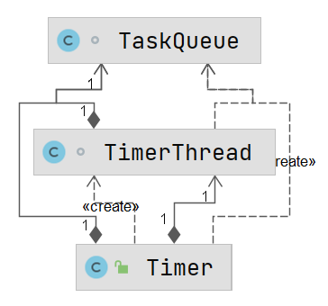
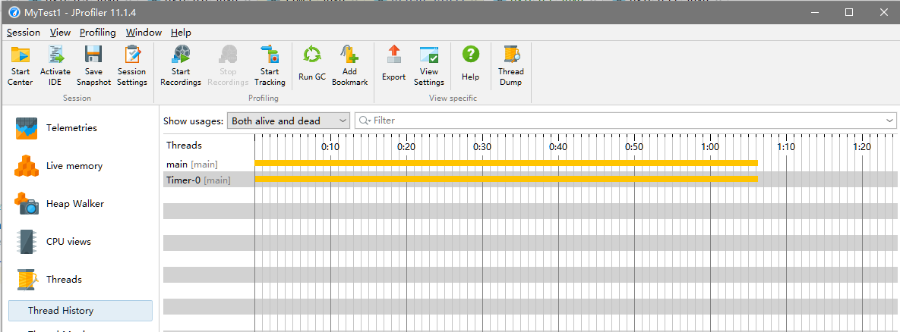
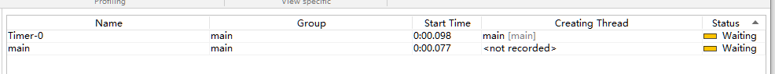
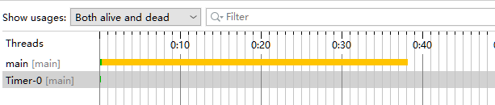

# 定时器 Timer



Timer 对象内部使用多线程的方式，可以实现按照**指定时间**或者**指定周期**的执行任务。其主要作用是设置计划任务，即在指定时间开始执行某一个任务。

TimerTask 抽象类的主要任务是**封装任务**，具体使用上通过继承其的子类来具体描述所要执行的计划任务。

## 一、主要方法

### schedule(TimerTask task, Data time)

用于在指定日期执行一个某个任务。当计划执行任务的时间晚于当前时间，即在未来执行，如果早于当前时间，则启动时立刻执行，

```java
package com.gjxaiou.timer;

import java.util.Date;
import java.util.Timer;
import java.util.TimerTask;

public class MyTest1 {
	public static void main(String[] args) throws InterruptedException {
		// 预定执行的时间
		System.out.println("当前时间为：" + System.currentTimeMillis());
		long earlyTime = System.currentTimeMillis() - 2000;
		long latterTime = System.currentTimeMillis() + 2000;

		Task task1 = new Task();
		Task task2 = new Task();
		Timer timer = new Timer();
		System.out.println("计划执行时间为：" + earlyTime);
		timer.schedule(task1, new Date(earlyTime));
		System.out.println("计划执行时间为：" + latterTime);
		timer.schedule(task2, new Date(latterTime));

		Thread.sleep(Integer.MAX_VALUE);
	}
}

// 封装要执行的任务
class Task extends TimerTask {
	@Override
	public void run() {
		try {
			System.out.println("开始执行任务啦，真正时间为：" + System.currentTimeMillis());
			Thread.sleep(4000);
			System.out.println("结束执行任务啦，真正时间为：" + System.currentTimeMillis());
		} catch (InterruptedException e) {
			e.printStackTrace();
		}
	}
}
```

程序输出结果为：

```java
当前时间为：1623856703842   ========》当前时间
计划执行时间为：1623856701843  =======》早于当前时间
计划执行时间为：1623856705843   =======》预计执行时间
开始执行任务啦，真正时间为：1623856703844  
结束执行任务啦，真正时间为：1623856707844
开始执行任务啦，真正时间为：1623856707844  ======》因为前一个任务延迟而实际执行的时间 
结束执行任务啦，真正时间为：1623856711844
```

因为 TimerTask 是以队列的方式按照顺序逐一执行，当前面任务执行延迟会造成后面的任务也延后，所以执行时间和预期的时间可能不一致。

任务执行完成之后，进程并没有销毁，按钮仍然呈现红色，即内部还有非守护线程在执行，通过下图可知程序运行完成之后， Timer-0 线程还在运行，并没有销毁。





因为在创建 Timer 对象时启动了一个新的非守护线程。

```java
// 创建 Timer() 的构造方法如下：    
public Timer() {
    this("Timer-" + serialNumber());
}
// this 调用的构造方法如下，创建一个 Timer 对象时内部就启动了一个新的线程，然后用该线程去执行计划任务。
private final TaskQueue queue = new TaskQueue();
private final TimerThread thread = new TimerThread(queue);
public Timer(String name) {
    thread.setName(name);
    thread.start();
}

// 其中 TimerThread 也在 Timer.java 中，是一个线程类。新启动的线程不是守护线程，而且一直运行，因为 run 方法中执行的是一个死循环的 mainLoop() 方法。
class TimerThread extends Thread {
    boolean newTasksMayBeScheduled = true;
    private TaskQueue queue;

    TimerThread(TaskQueue queue) {
        this.queue = queue;
    }

    public void run() {
        try {
            mainLoop();
        } finally {
            // Someone killed this Thread, behave as if Timer cancelled
            synchronized(queue) {
                newTasksMayBeScheduled = false;
                queue.clear();  // Eliminate obsolete references
            }
        }
    }

    private void mainLoop() {
        while (true) {
            try {
                TimerTask task;
                boolean taskFired;
                synchronized(queue) {
                    // Wait for queue to become non-empty
                    while (queue.isEmpty() && newTasksMayBeScheduled)
                        queue.wait();
                    if (queue.isEmpty())
                        break; // Queue is empty and will forever remain; die

                    // Queue nonempty; look at first evt and do the right thing
                    long currentTime, executionTime;
                    task = queue.getMin();
                    synchronized(task.lock) {
                        if (task.state == TimerTask.CANCELLED) {
                            queue.removeMin();
                            continue;  // No action required, poll queue again
                        }
                        currentTime = System.currentTimeMillis();
                        executionTime = task.nextExecutionTime;
                        if (taskFired = (executionTime<=currentTime)) {
                            if (task.period == 0) { // Non-repeating, remove
                                queue.removeMin();
                                task.state = TimerTask.EXECUTED;
                            } else { // Repeating task, reschedule
                                queue.rescheduleMin(
                                    task.period<0 ? currentTime   - task.period
                                    : executionTime + task.period);
                            }
                        }
                    }
                    if (!taskFired) // Task hasn't yet fired; wait
                        queue.wait(executionTime - currentTime);
                }
                if (taskFired)  // Task fired; run it, holding no locks
                    task.run();
            } catch(InterruptedException e) {
            }
        }
    }
}
```

`mainLoop()` 方法是一个 while(true) 的死循环，只有满足 `if(queue.isEmpty())` 时候才执行 break 退出循环，核心逻辑如下：

```java
// Wait for queue to become non-empty
while (queue.isEmpty() && newTasksMayBeScheduled)
    queue.wait();
if (queue.isEmpty())
    break; // Queue is empty and will forever remain; die
```

- 当队列为空，并且可能以后新的任务被执行时候，执行  wait() 方法使得当前线程暂停运行，等待被唤醒，当其它线程调用 `schedule(XXX) ` 方法的时候（即有新的任务需要执行）线程被唤醒，唤醒之后再次判断 while 中的条件，当为 true && false 时候执行 if 语句，同时可以执行 break 退出循环。

- 执行 `cancel()` 方法会使得 newTasksMayBeScheduled 值从 true 变为 false。不执行则该值一直为 true，使得进程一直呈死循环状态无法销毁。

    ```java
    public void cancel() {
        synchronized(queue) {
            thread.newTasksMayBeScheduled = false;
            queue.clear();
            queue.notify();  // In case queue was already empty.
        }
    }
    ```


#### cancel() 方法

该方法实现 TimerThread 线程销毁，即终止此计时器，会丢弃所有当前已安排的任务，但是不会干扰当前正在执行的任务（如果存在）。终止了计时器也会终止其执行线程，并且无法根据它安排更多的任务。**在此计时器调用的计时器任务的 run() 方法内调用该方法，可以确保正在执行的任务是该计时器所执行的最后一个任务**。重复调用该方法则除了第一次后续无效。

如果在上述示例代码的 `Thread.sleep(Integer.MAX_VALUE);` 前面加上 `timer.cancel();` 则会销毁 TimerThread，因为 main 线程一直睡眠，所以整个进程并没有停止。



#### schedule(TimerTask task, Date firstTime, long period) 方法

作用是：在指定日期之后按照指定的间隔周期无限循环的执行某个任务。 period 即每次间隔时间。该方法也会有上面的早于当前时间执行、延迟执行等问题，

### TimerTask#cancel()

作用是将自身从任务队列中清除。该方法会将当前 TimerTask 任务的 state 状态改为 CANCELLED（取消）。

```java
public boolean cancel() {
    synchronized(lock) {
        boolean result = (state == SCHEDULED);
        state = CANCELLED;
        return result;
    }
}
```

示例：

```java
package com.gjxaiou.timer;

import java.util.Date;
import java.util.Timer;
import java.util.TimerTask;

public class MyTest2 {
	public static void main(String[] args) {
		long now = System.currentTimeMillis();
		System.out.println("当前时间：" + now);
		MyTask1 myTask1 = new MyTask1();
		MyTask2 myTask2 = new MyTask2();
		Timer timer = new Timer();
		timer.schedule(myTask1, new Date(now), 4000);
		timer.schedule(myTask2, new Date(now), 4000);
	}
}

class MyTask1 extends TimerTask {
	@Override
	public void run() {
		System.out.println("MyTask1 开始执行，时间为：" + System.currentTimeMillis());
		this.cancel();
		System.out.println("MyTask1 任务自己移除自己");
	}
}

class MyTask2 extends TimerTask {
	@Override
	public void run() {
		System.out.println("MyTask2 开始执行，时间为：" + System.currentTimeMillis());
	}
}
```

输出结果为：

```java
当前时间：1623890010346
MyTask1 开始执行，时间为：1623890010348
MyTask1 任务自己移除自己
MyTask2 开始执行，时间为：1623890010348
MyTask2 开始执行，时间为：1623890014355
MyTask2 开始执行，时间为：1623890018370
MyTask2 开始执行，时间为：1623890022370
......    
```

向上面间隔执行 Task 任务的轮询方法，当队列中有多个任务时候，任务执行顺序是每次将最后一个任务放到队列头，再执行队列头中 Task 任务的 run() 方法，效果如：ABC =》 CAB  =》BCA 。。。

#### Timer#cancel() 方法

该方法作用是将任务队列中的全部任务清空。具体调用地方任意。

```java
public void cancel() {
    synchronized(queue) {
        thread.newTasksMayBeScheduled = false;
        queue.clear();
        queue.notify();  // In case queue was already empty.
    }
}
```

但是当竞争比较激烈时，Timer 类中的 cancel() 方法有时候没有争抢到 queue 锁，所有无法停止 TimerTask 类中的任务。

```java
package com.gjxaiou.timer;

import java.util.Date;
import java.util.Timer;
import java.util.TimerTask;

public class MyTest3 {
	public static void main(String[] args) {
		int i = 0;
		long currentTime = System.currentTimeMillis();
		System.out.println("当前时间即计划开始时间: " + currentTime);
		while (true) {
			i++;
			Timer timer = new Timer();
			MyTask myTask = new MyTask(i);
			timer.schedule(myTask, new Date(currentTime));
			timer.cancel();
		}
	}
}

class MyTask extends TimerTask {
	private int i;

	MyTask(int i) {
		this.i = i;
	}

	@Override
	public void run() {
		System.out.println("第 " + i + " 次没有被 cancel 取消");
	}
}
```

运行结果为：

```java
当前时间即计划开始时间: 1624071333331
第 12676 次没有被 cancel 取消
第 77427 次没有被 cancel 取消
```

#### schedule(TimerTask task,long delay)

以当前时间为参考时间，延迟指定的毫秒数之后**执行一次** TimerTask。

#### schedule(TimerTask task, long delay, long period)

以当前时间为参考时间，延迟指定的毫秒数之后开始执行 TimerTask，然后以指定的时间间隔不限次数的执行该任务。

如果任务执行的时间超过了周期间隔时间，则下一个周期任务的开始执行时间是上一个延迟任务的执行结束时间。

指定的延迟时间 delay 表示第一次执行时候相对当前时间的延迟，后面都是按照指定周期进行执行，和 delay 无关。

#### scheduleAtFixedRate(TimerTask task, Date firstTime, long period)

该方法和 schedule() 周期执行方法的区别在于：`scheduleAtFixedRate()` 方法具有追赶特性。主要用于当第一次的执行时间早于当前时间的情况。

```java
package com.gjxaiou.timer;

import java.util.Date;
import java.util.Timer;
import java.util.TimerTask;

public class MyTest4 {
	public static void main(String[] args) {
		long currentTime = System.currentTimeMillis();
		System.out.println("当前时间为：" + currentTime);
		long executeTime = currentTime - 2000;
		System.out.println("计划执行时间：" + executeTime);
		Timer timer = new Timer();
		MyTask3 myTask3 = new MyTask3();
		//	timer.schedule(myTask3, new Date(executeTime), 2000);
		timer.scheduleAtFixedRate(myTask3, new Date(executeTime), 2000);
	}
}

class MyTask3 extends TimerTask {
	@Override
	public void run() {
		try {
			System.out.println("begin time：" + System.currentTimeMillis());
			Thread.sleep(1000);
			System.out.println("end time: " + System.currentTimeMillis());
		} catch (InterruptedException e) {
			e.printStackTrace();
		}
	}
}
```

其中使用 `schedule()` 对应的执行结果为：

```java
当前时间为：1624073822605
计划执行时间：1624073820605   ====》比当前时间早 2s
begin time：1624073822607   ====》第一次任务在当前时间立即执行
end time: 1624073823620    =====》任务执行时间约为 1s
begin time：1624073824616  ======》任务执行周期为 2s,所以第二次开始时间为第一次开始的 2s 后
end time: 1624073825624
begin time：1624073826618
end time: 1624073827623
begin time：1624073828632
end time: 1624073829637
begin time：1624073830641
end time: 1624073831653
begin time：1624073832647
end time: 1624073833662
begin time：1624073834649
end time: 1624073835658
begin time：1624073836651
end time: 1624073837662
。。。。。。    
```

对应 `scheduleAtFixedRate()` 的执行结果为：

```java
当前时间为：1624073988347
计划执行时间：1624073986347     ====》计划执行时间比当前时间早 2s
begin time：1624073988349     ====》对流逝时间的任务追赶
end time: 1624073989351
begin time：1624073989351
end time: 1624073990351
begin time：1624073990351
end time: 1624073991356
begin time：1624073992352
end time: 1624073993357
begin time：1624073994352
end time: 1624073995365
begin time：1624073996362
end time: 1624073997368
。。。。。。   
```

将之前没有执行的任务追加执行，将比当前时间提早的 2s 之内执行任务的次数输出完，然后在按照周期执行任务。

将两个时间段内的时间说对应的 Task 任务将被「弥补」执行，即**在指定的时间段内的运行次数必须运行完整**。