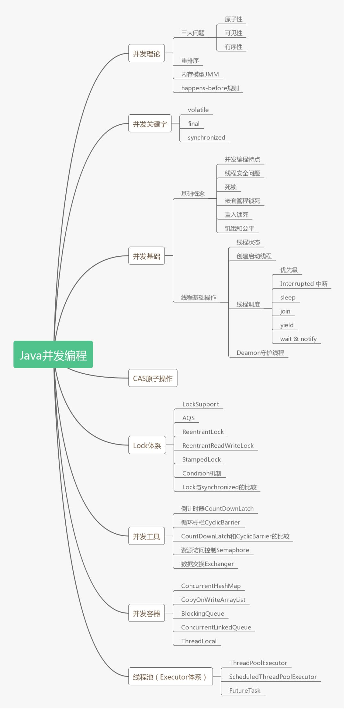

# 并发结构体系

## 名词解释

- 公平锁/非公平锁

    公平锁，是指按照线程申请的顺序获取锁。

    非公平锁，是指不是按照线程申请的顺序获取锁，有可能后申请的线程反而先获取到锁，假如先来的线程一直获取不到锁，会造成锁饥饿现象。

    ReentrantLock中可以通过构造方法指定是否为公平锁，默认为非公平锁，非公平锁的优点在于吞吐量大。

    synchronized无法指定为公平锁，一直都是非公平锁。

- 可重入锁

    可重入锁，是指一个线程获取锁之后再尝试获取锁时会自动获取锁，可重入锁的优点是避免死锁。

    ReentrantLock 和 synchronized 都是可重入锁。

- 独享锁/共享锁

    独享锁，是指锁一次只能被一个线程持有。

    共享锁，是指锁一次可以被多个线程持有。

    ReentrantLock 和 synchronized 都是独享锁，ReadWriteLock 的读锁是共享锁，写锁是独享锁。

- 互斥锁/读写锁

    与独享锁/共享锁的概念差不多，是独享锁/共享锁的具体实现。

    ReentrantLock 和 synchronized 都是互斥锁

    ReadWriteLock 是读写锁

- 乐观锁/悲观锁

    悲观锁，是指认为对于同一个数据的并发操作必然会发生修改，即使不会发生修改也这么认为，所以一定要加锁。

    乐观锁，是指认为对于同一个数据的并发操作不一定会发生修改，在更新数据的时候，尝试去更新数据，如果失败就不断尝试。

    悲观锁适用于写操作多的场景，乐观锁适用于读操作多的场景。

- 分段锁

    分段锁，是一种锁的设计思路，它细化了锁的粒度，主要运用在 ConcurrentHashMap 中，实现高效的并发操作，当操作不需要更新整个数组时，就只锁数组中的一项就可以了。

- 偏向锁/轻量级锁/重量级锁

    这三个锁主要是针对 synchronized 进行优化使用的，主要是通过对象监视器在对象头中的字段来表明的。

    偏向锁，是指一段同步代码一直被一个线程访问，那么这个线程会自动获取锁，降低获取锁的代价。

    轻量级锁，是指当锁是偏向锁时，被另一个线程所访问，偏向锁会升级为轻量级锁，这个线程会通过自旋的方式尝试获取锁，不会阻塞，提高性能。

    重量级锁，是指当锁是轻量级锁时，当自旋的线程自旋了一定的次数后，还没有获取到锁，就会进入阻塞状态，该锁升级为重量级锁，重量级锁会使其他线程阻塞，性能降低。

- 自旋锁

    自旋锁，是指尝试获取锁的线程不会阻塞，而是循环的方式不断尝试，这样的好处是减少线程的上下文切换带来的开锁，提高性能，缺点是循环会消耗 CPU。

- 监视器锁

    synchronized 的实现方式，使用 monitorenter 和 monitorexit 来实现。

- mutex 锁

    互斥锁，LockSupport.part()底层是通过mutex实现的。
