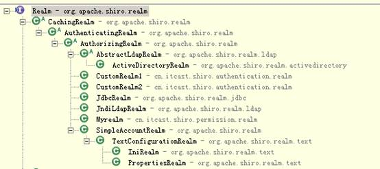

 

# 一、shiro介绍 

## （一）什么是shiro

Apache Shiro 是Java 的一个安全框架。Shiro 可以非常容易的开发出足够好的应用，其不仅可以用在JavaSE 环境，也可以用在JavaEE 环境。Shiro 可以帮助我们完成：**认证、授权、加密、会话管理、与****Web** **集成、缓存等**。

## （二）为什么要学shiro

- 既然shiro将安全认证相关的功能抽取出来组成一个框架，使用shiro就可以非常快速的完成认证、授权等功能的开发，降低系统成本。

- shiro使用广泛，shiro可以运行在web应用，非web应用，集群分布式应用中越来越多的用户开始使用shiro。

- java领域中spring security(原名Acegi)也是一个开源的权限管理框架，但是spring security依赖spring运行，而shiro就相对独立，最主要是因为shiro使用简单、灵活，所以现在越来越多的用户选择shiro。

## （三）基本功能

 

### Authentication

身份认证/登录，验证用户是不是拥有相应的身份；

### Authorization

授权，即权限验证，验证某个已认证的用户是否拥有某个权限；即判断用户是否能做事情，常见的如：验证某个用户是否拥有某个角色。或者细粒度的验证某个用户对某个资源是否具有某个权限；

### Session Manager

- 会话管理，即用户登录后就是一次会话，在没有退出之前，它的所有信息都在会话中；会话可以是普通JavaSE环境的，也可以是如Web环境的；

- **Cryptography**：加密，保护数据的安全性，如密码加密存储到数据库，而不是明文存储；

- **Web Support**：Web 支持，可以非常容易的集成到Web 环境；

- **Caching**：缓存，比如用户登录后，其用户信息、拥有的角色/权限不必每次去查，这样可以提高效率；

- **Concurrency**：shiro 支持多线程应用的并发验证，即如在一个线程中开启另一个线程，能把权限自动传播过去；

- **Testing**：提供测试支持；

- **Run As**：允许一个用户假装为另一个用户（如果他们允许）的身份进行访问；

- **Remember Me**：记住我，这个是非常常见的功能，即一次登录后，下次再来的话不用登录了。

  

  **Shiro** **不会去维护用户、维护权限；这些需要我们自己去设计/提供；然后通过**相应的接口注入给****Shiro即可。

 

## （四）Shiro架构

 

### Subject

​     Subject即主体，外部应用与subject进行交互，subject记录了当前操作用户，将用户的概念理解为当前操作的主体，可能是一个通过浏览器请求的用户，也可能是一个运行的程序。     Subject在shiro中是一个接口，接口中定义了很多认证授相关的方法，外部程序通过subject进行认证授，而subject是通过SecurityManager安全管理器进行认证授权

### SecurityManager 

​     SecurityManager即安全管理器，对全部的subject进行安全管理，它是shiro的核心，负责对所有的subject进行安全管理。通过SecurityManager可以完成subject的认证、授权等，实质上SecurityManager是通过Authenticator进行认证，通过Authorizer进行授权，通过SessionManager进行会话管理等。

​     SecurityManager是一个接口，继承了Authenticator, Authorizer, SessionManager这三个接口。

### Authenticator

​     Authenticator即认证器，对用户身份进行认证，Authenticator是一个接口，shiro提供ModularRealmAuthenticator实现类，通过ModularRealmAuthenticator基本上可以满足大多数需求，也可以自定义认证器。

### Authorizer

​     Authorizer即授权器，用户通过认证器认证通过，在访问功能时需要通过授权器判断用户是否有此功能的操作权限。

### 1.4.5 realm

​     Realm即领域，相当于datasource数据源，securityManager进行安全认证需要通过Realm获取用户权限数据，比如：如果用户身份数据在数据库那么realm就需要从数据库获取用户身份信息。

​     注意：不要把realm理解成只是从数据源取数据，在realm中还有认证授权校验的相关的代码。

### 1.4.6 sessionManager

sessionManager即会话管理，shiro框架定义了一套会话管理，它不依赖web容器的session，所以shiro可以使用在非web应用上，也可以将分布式应用的会话集中在一点管理，此特性可使它实现单点登录。

### 1.4.7 SessionDAO

SessionDAO即会话dao，是对session会话操作的一套接口，比如要将session存储到数据库，可以通过jdbc将会话存储到数据库。

### 1.4.8 CacheManager

CacheManager即缓存管理，将用户权限数据存储在缓存，这样可以提高性能。

### 1.4.9 Cryptography

​     Cryptography即密码管理，shiro提供了一套加密/解密的组件，方便开发。比如提供常用的散列、加/解密等功能。

 

# 2 认证

## 2.1 基本概念

### 2.1.1 身份验证

即在应用中谁能证明他就是他本人。一般提供如他们的身份ID 一些标识信息来

表明他就是他本人，如提供身份证，用户名/密码来证明。

在 shiro 中，用户需要提供principals （身份）和credentials（证明）给shiro，从而应用能

验证用户身份：

### 2.1.2 principals

身份，即主体的标识属性，可以是任何东西，如用户名、邮箱等，唯一即可。

一个主体可以有多个principals，但只有一个Primary principals，一般是用户名/密码/手机号。

### 2.1.3 credentials

证明/凭证，即只有主体知道的安全值，如密码/数字证书等。

最常见的principals和credentials组合就是用户名/密码了。接下来先进行一个基本的身份认证。

## 2.2 认证流程

## 2.3 入门程序（用户登陆和退出）

### 2.3.1创建java工程

### 2.3.2 加入相关jar包

commons-beanutils-1.9.2.jar

commons-logging-1.2.jar

junit-4.10.jar

shiro-all-1.2.3.jar

slf4j-api-1.7.7.jar

log4j-1.2.17.jar

slf4j-log4j12-1.7.5.jar

### 2.3.3 log4j.properties日志配置文件

 

### 2.3.4 配置shiro环境文件shiro.ini

通过Shiro.ini配置文件初始化SecurityManager环境。

 

### 2.3.5 代码实现

 

# 2.4 自定义Realm

Shiro默认使用自带的IniRealm，IniRealm从ini配置文件中读取用户的信息，大部分情况下需要从系统的数据库中读取用户信息，所以需要自定义realm。

 

### 2.4.1 Realm接口

最基础的是Realm接口，CachingRealm负责缓存处理，AuthenticationRealm负责认证，AuthorizingRealm负责授权，通常自定义的realm继承AuthorizingRealm。

### 2.4.2 自定义Realm实现

### 2.4.3 配置Realm

需要在shiro.ini配置realm注入到securityManager中。

 

### 2.4.4 测试

同上一样

## 2.5 散列算法

散列算法一般用于生成数据的摘要信息，是一种不可逆的算法，一般适合存储密码之类的数据，常见的散列算法如MD5、SHA等。一般进行散列时最好提供一个salt（盐），比如

加密密码“admin”，产生的散列值是“21232f297a57a5a743894a0e4a801fc3”，可以到一

些md5 解密网站很容易的通过散列值得到密码“admin”，即如果直接对密码进行散列相

对来说破解更容易，此时我们可以加一些只有系统知道的干扰数据，如用户名和ID（即盐）；

这样散列的对象是“密码+用户名+ID”，这样生成的散列值相对来说更难破解。

### 2.5.1 MD5算法

 

### 2.5.2 在自定义Realm中使用散列

Realm实现代码

 

### 2.5.3 Realm配置

Shiro.ini 在配置文件中，需指定凭证匹配器

 

### 2.5.4 测试

同上

# 3 授权

授权，也叫访问控制，即在应用中控制谁能访问哪些资源（如访问页面/编辑数据/页面操作

等）。在授权中需了解的几个关键对象：主体（Subject）、资源（Resource）、权限（Permission）、

角色（Role）。

## 3.1 关键对象介绍

**主体**

主体，即访问应用的用户，在Shiro中使用Subject代表该用户。用户只有授权后才允许访

问相应的资源。

**资源**

在应用中用户可以访问的任何东西，比如访问JSP 页面、查看/编辑某些数据、访问某个业

务方法、打印文本等等都是资源。用户只要授权后才能访问。

**权限**

安全策略中的原子授权单位，通过权限我们可以表示在应用中用户有没有操作某个资源的

权力。即权限表示在应用中用户能不能访问某个资源，如：访问用户列表页面查看/新增/修改/删除用户数据（即很多时候都是CRUD（增查改删）式权限控制）打印文档等等。。。

**角色**

角色代表了操作集合，可以理解为权限的集合，一般情况下我们会赋予用户角色而不是权

限，即这样用户可以拥有一组权限，赋予权限时比较方便。典型的如：项目经理、技术总

监、CTO、开发工程师等都是角色，不同的角色拥有一组不同的权限。

 

## 3.2 授权流程

流程如下：

1、首先调用Subject.isPermitted*/hasRole*接口，其会委托给SecurityManager，而

SecurityManager接着会委托给Authorizer；

2、Authorizer是真正的授权者，如果我们调用如isPermitted(“user:view”)，其首先会通过

PermissionResolver把字符串转换成相应的Permission实例；

3、在进行授权之前，其会调用相应的Realm获取Subject相应的角色/权限用于匹配传入的

角色/权限；

4、Authorizer会判断Realm的角色/权限是否和传入的匹配，如果有多个Realm，会委托给

ModularRealmAuthorizer 进行循环判断，如果匹配如isPermitted*/hasRole*会返回true，否

则返回false表示授权失败。

## 3.3 授权方式

Shiro 支持三种方式的授权：

编程式：通过写if/else 授权代码块完成：

注解式：通过在执行的Java方法上放置相应的注解完成：

没有权限将抛出相应的异常；

JSP/GSP 标签：在JSP/GSP 页面通过相应的标签完成：

 

## 3.4 授权实现

### 3.4.1在ini配置文件配置用户拥有的角色及角色-权限关系（shiro-permission.ini）

 

规则：“用户名=密码，角色1，角色2” “角色=权限1，权限2”，即首先根据用户名找

到角色，然后根据角色再找到权限；即角色是权限集合；Shiro 同样不进行权限的维护，需

要我们通过Realm返回相应的权限信息。只需要维护“用户——角色”之间的关系即可。

 

权限字符串的规则是：“资源标识符：操作：资源实例标识符”，意思是对哪个资源的哪个实例具有什么操作，“:”是资源/操作/实例的分割符，权限字符串也可以使用*通配符。

 

例子：

用户创建权限：user:create，或user:create:*

用户修改实例001的权限：user:update:001

用户实例001的所有权限：user：*：001

### 3.4.2 实现代码

 

## 3.5 自定义Realm实现授权

与上边认证自定义realm一样，大部分情况是要从数据库获取权限数据，这里直接实现基于资源的授权。

### 3.5.1 UserRealm实现代码

增加了红色部分代码

### 3.5.2 配置文件

### 3.5.3 测试代码

 

# 4 shiro与项目集成开发

## 4.1 完成springmvc+spring+mybatis整合

## 4.2 整合shiro

### 4.2.1 web.xml中配置shiro的filter

 

### 4.2.2 在spring中配置shiro

 

 

## 4.3 登录

### 4.3.1 原理

Shiro 内置了很多默认的过滤器，比如身份验证、授权等相关的。默认过滤器可以参考

org.apache.shiro.web.filter.mgt.DefaultFilter中的过滤器：

| 过滤器简称 | 对应的java类                                                 |
| ---------- | ------------------------------------------------------------ |
| anon       | org.apache.shiro.web.filter.authc.AnonymousFilter            |
| authc      | org.apache.shiro.web.filter.authc.FormAuthenticationFilter   |
| authcBasic | org.apache.shiro.web.filter.authc.BasicHttpAuthenticationFilter |
| perms      | org.apache.shiro.web.filter.authz.PermissionsAuthorizationFilter |
| port       | org.apache.shiro.web.filter.authz.PortFilter                 |
| rest       | org.apache.shiro.web.filter.authz.HttpMethodPermissionFilter |
| roles      | org.apache.shiro.web.filter.authz.RolesAuthorizationFilter   |
| ssl        | org.apache.shiro.web.filter.authz.SslFilter                  |
| user       | org.apache.shiro.web.filter.authc.UserFilter                 |
| logout     | org.apache.shiro.web.filter.authc.LogoutFilter               |

 

anon:例子/admins/**=anon 没有参数，表示可以匿名使用。

authc:例如/admins/user/**=authc表示需要认证(登录)才能使用，FormAuthenticationFilter是表单认证，没有参数

使用FormAuthenticationFilter过虑器实现 ，原理如下：

 

将用户没有认证时，请求loginurl进行认证，用户身份和用户密码提交数据到loginurl

FormAuthenticationFilter拦截住取出request中的username和password（两个参数名称是可以配置的）

FormAuthenticationFilter调用realm传入一个token（username和password）

realm认证时根据username查询用户信息（在Activeuser中存储，包括 userid、usercode、username、menus）。

如果查询不到，realm返回null，FormAuthenticationFilter向request域中填充一个参数（记录了异常信息）

### 4.3.2登陆页面

由于FormAuthenticationFilter的用户身份和密码的input的默认值（username和password），修改页面的账号和密码 的input的名称为username和password

 

### 4.3.3 代码实现

 

 