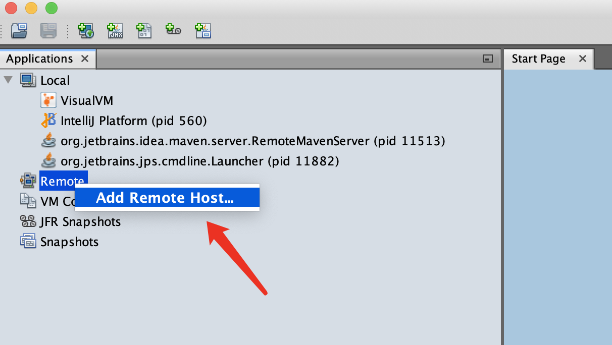
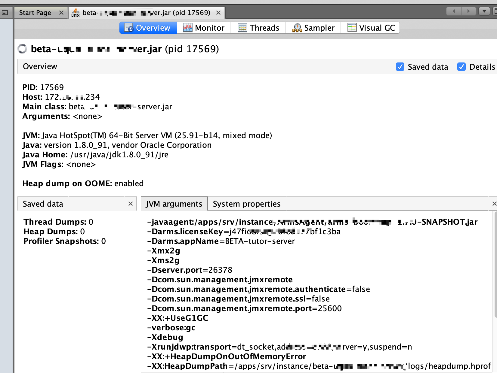
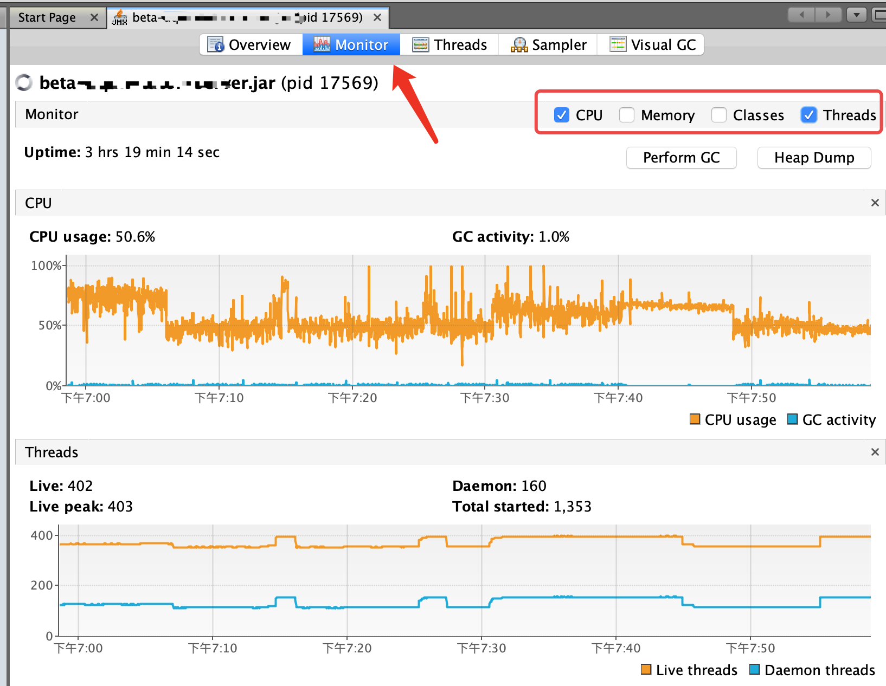
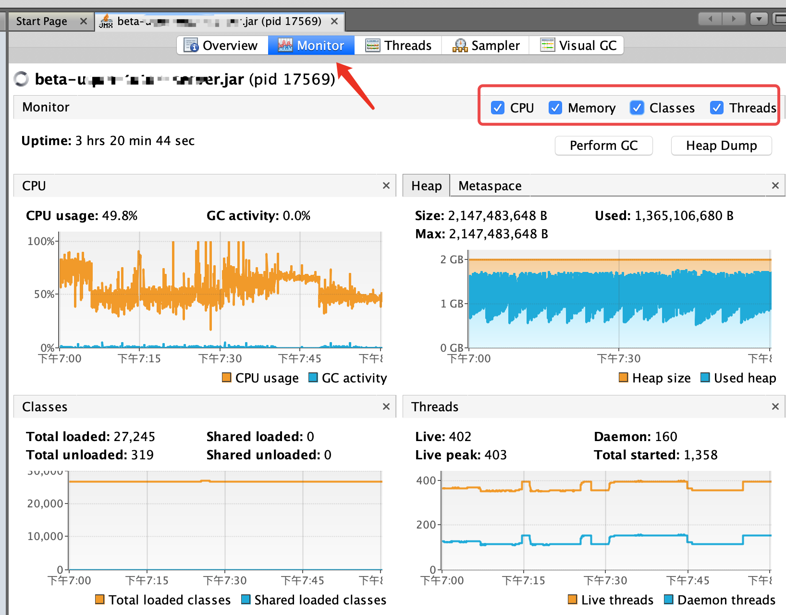
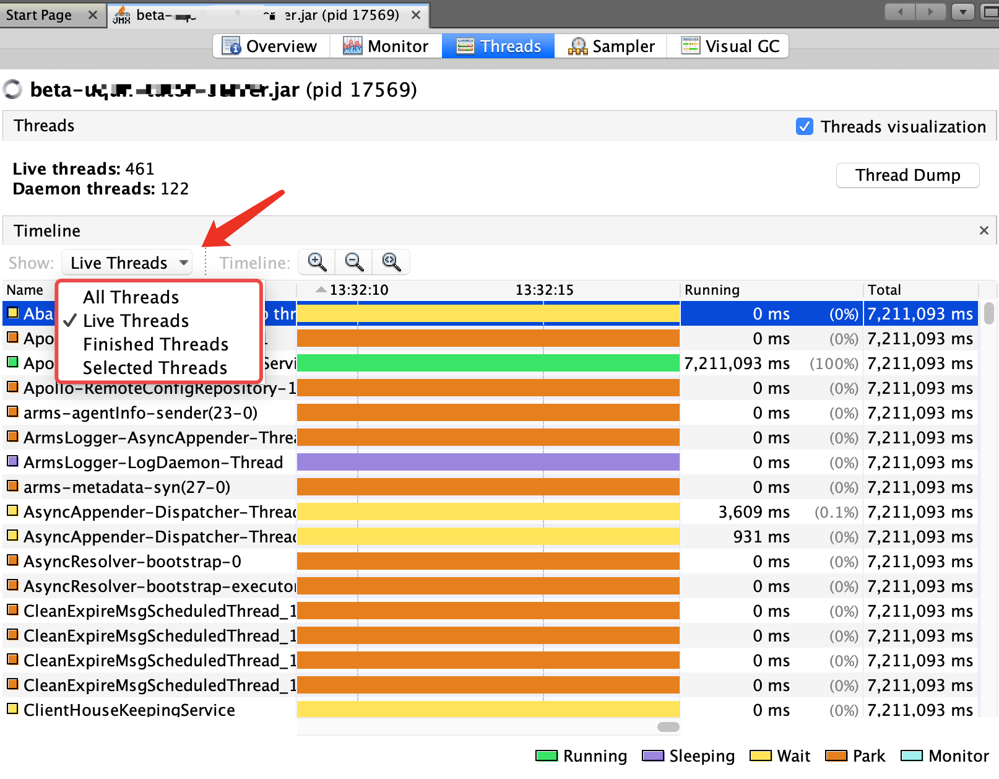
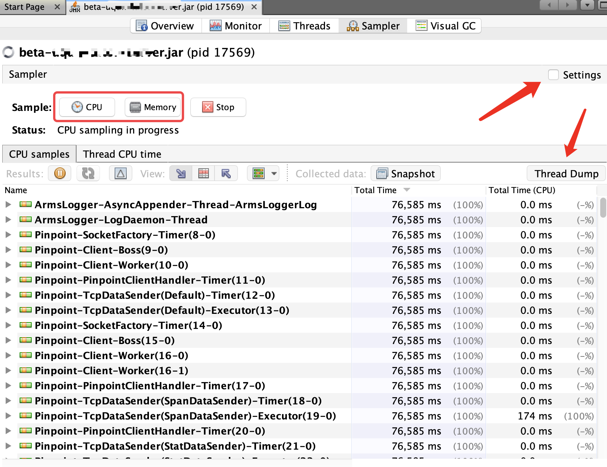
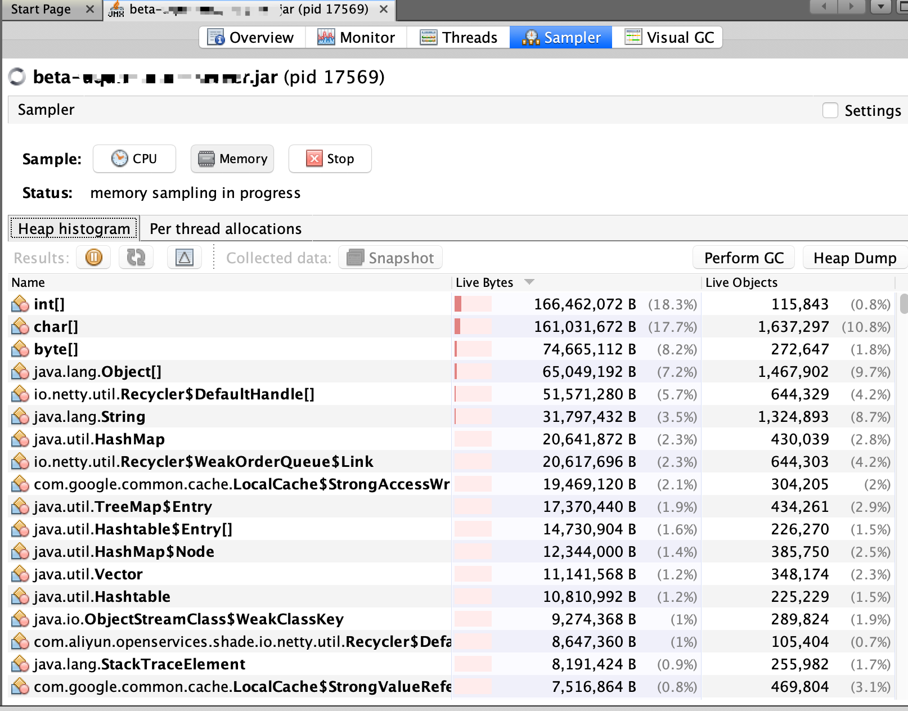

## 使用 VisualVM 和 JProfiler 进行性能分析及调优

## 概述

在我们开发大型 Java 应用程序的过程中，难免遇到内存泄露、性能瓶颈等问题，比如文件、网络、数据库的连接未释放，未优化的算法等。随着应用程序的持续运行，可能会造成整个系统运行效率下降，严重的则会造成系统崩溃。为了找出程序中隐藏的这些问题，在项目开发后期往往会使用性能分析工具来对应用程序的性能进行分析和优化。在本文中，我们主要介绍 VisualVM 和 JProfiler 这两款性能分析工具。

## 背景知识

#### 性能分析的主要方式

- 监视：监视是一种用来查看应用程序运行时行为的一般方法。通常会有多个视图（View）分别实时地显示 CPU 使用情况、内存使用情况、线程状态以及其他一些有用的信息，以便用户能很快地发现问题的关键所在。
- 转储：性能分析工具从内存中获得当前状态数据并存储到文件用于静态的性能分析。Java 程序是通过在启动 Java 程序时添加适当的条件参数来触发转储操作的。它包括以下三种：
    - 系统转储：JVM 生成的本地系统的转储，又称作核心转储。一般的，系统转储数据量大，需要平台相关的工具去分析，如 Windows 上的windbg和 Linux 上的gdb等。
    - Java 转储：JVM 内部生成的格式化后的数据，包括线程信息，类的加载信息以及堆的统计数据。通常也用于检测死锁。
    - 堆转储：JVM 将所有对象的堆内容存储到文件。
- 快照：应用程序启动后，性能分析工具开始收集各种运行时数据，其中一些数据直接显示在监视视图中，而另外大部分数据被保存在内部，直到用户要求获取快照，基于这些保存的数据的统计信息才被显示出来。快照包含了应用程序在一段时间内的执行信息，通常有 CPU 快照和内存快照两种类型。
    - CPU 快照：主要包含了应用程序中函数的调用关系及运行时间，这些信息通常可以在 CPU 快照视图中进行查看。
    - 内存快照：主要包含了内存的分配和使用情况、载入的所有类、存在的对象信息及对象间的引用关系等。这些信息通常可以在内存快照视图中进行查看。
- 性能分析：性能分析是通过收集程序运行时的执行数据来帮助开发人员定位程序需要被优化的部分，从而提高程序的运行速度或是内存使用效率，主要有以下三个方面：
    - CPU 性能分析：CPU 性能分析的主要目的是统计函数的调用情况及执行时间，或者更简单的情况就是统计应用程序的 CPU 使用情况。通常有 CPU 监视和 CPU 快照两种方式来显示 CPU 性能分析结果。
    - 内存性能分析：内存性能分析的主要目的是通过统计内存使用情况检测可能存在的内存泄露问题及确定优化内存使用的方向。通常有内存监视和内存快照两种方式来显示内存性能分析结果。
    - 线程性能分析：线程性能分析主要用于在多线程应用程序中确定内存的问题所在。一般包括线程的状态变化情况，死锁情况和某个线程在线程生命期内状态的分布情况等。

### VisualVM

VisualVM 是一款免费的性能分析工具。它通过 jvmstat、JMX、SA（Serviceability Agent）以及 Attach API 等多种方式从程序运行时获得实时数据，从而进行动态的性能分析。同时，它能自动选择更快更轻量级的技术尽量减少性能分析对应用程序造成的影响，提高性能分析的精度。

#### 安装方法

由于 VisualVM 已经被 Oracle 在 GitHub 上开源了。https://github.com/oracle/visualvm，通过 release 选项可以选择需要安装的版本。


#### 使用方法

如上图所示，以 Mac 为例，演示 VisualVM 2.0 版本的使用：



如上图所示，打开 VisualVM 之后，进入如上界面。主要关注Local 和 Remote，其中：

- Local，监控本地进程；

- Remote，监控远程进程。

默认情况下，启动 VisualVM 之后，就会自动监控本地的 Java 进程。但是，如果我们想要监控远程的 Java 进程，则需要进行配置。右键点击 `Remote` ，选择 `Add Remote Host`，进入如下页面：


如上图所示，在Host name框中输入我们想要监控的远程主机的 IP，如172.12.21.234；至于Display name，我们可以理解为别名或者昵称，自定义即可，完成后，点击OK按钮：


如上图所示，连接到指定的主机之后，我们还需要指定想要监控的端口。右键点击已连接的主机，选择 `Add JMX Connection`（JMX：Java Management Extensions），新增 Java 管理扩展连接，进入如下页面：


如上图所示，在Connection中默认会回显主机 IP，我们只需要**输入想要监控的端口即可**，点击OK按钮：


如上图所示，VisualVM 已经连接到我们指定的主机以及端口。其中，在上图的右侧部分，已经显示了进程的部分信息，如 PID、Host、Main class、Java 版本和 JVM 启动参数等。但是在这里，我们需要特别注意一点，那就是：**我们输入的25600端口是需要我们事先在启动脚本或者启动参数中配置的**。具体的配置示例，如下：

```java
-Dcom.sun.management.jmxremote \
-Dcom.sun.management.jmxremote.authenticate=false \
-Dcom.sun.management.jmxremote.ssl=false \
-Dcom.sun.management.jmxremote.port=25600 \
```

现在，我们已经监控到指定的**进程**了。接下来，我们一起来看看如何查看更为详细的监控信息。首先，我们右键点击已经连接的服务：


如上图所示，右键菜单中展示了 Open、Sample、Thread Dump 和 Head Dump 等功能，其中：

- Thread Dump，获取线程转储；
- Head Dump，获取堆转储；
- Application Snapshot，获取应用运行状态快照。

在这里，以Application Snapshot为例，点击之后，VisualVM 会生成一个应用当前运行状态的快照，并将其存储到Snapshats一栏，如上图左侧红色方框标记所示。点击生成的快照之后，会在右侧会显示快照信息。同样，点击Thread Dump和Head Dump之后，会生成对应的线程转储和堆转储，只不过存储的位置会略有不同。



如上图所示，我们看 VisualVM 的右侧页面，包括 Overview、Monitor、Threads、Sampler 和 Visual GC 等，其中：

- Overview，进程信息概览，包括 JDK 版本、JVM 启动参数和环境变量配置等信息；
- Monitor，图形化监控页面，包括 CPU、内存、类以及线程等信息，可以手动触发 GC 以及执行堆转储；
- Threads，线程信息，可以查询进程内线程活动情况，可以执行线程转储；
- Sampler，采样器，可以实时采集 CPU、内存等信息；
- Visual GC，监控垃圾收集情况，想要使用此功能需要我们事前在启动脚本或者启动命令中进行配置。

上图就是 Overview 页面的内容。接下来，我们再来看看 Monitor、Threads 以及 Sampler 的页面。

### Monitor



如上图所示，就是 Monitor 页面的内容，包括 CPU、Memory、Classes 和 Threads，其中：

- CPU，实时显示 CPU 使用率以及 GC 活动比例；
- Memory，实时显示堆使用情况，包括Metaspace，JDK 8 之前是PermGen；
- Classes，实时显示类加载情况；
- Threads，实时显示线程的数量，包括总线程数量以及守护线程数量。

在这里，我们可以通过勾选上面的选择框自定义显示样式，像上面就仅勾选了CPU和Threads。



如上图所示，勾选了CPU、Memory、Classes和Threads四个选项。同时，我们也可以点击Perform GC按钮，手动触发 GC；点击Heap Dump按钮，可以导出堆转储信息。

#### Threads



如上图所示，就是 Threads 页面的内容，显示了线程的活跃情况。同时，点击Thread Dump，可以导出线程转储信息

#### Sampler



如上图所示，就是 Sampler 页面的内容，可以采集 CPU 和内存的信息。当我们点击CPU或者Memory按钮之后，开始执行采样，点击Stop即可结束采样。上图为 CPU 采样的结果，显示了**各个线程占用 CPU 的情况**；点击Memory，可以切换到内存的采样结果：



如上图所示，就是内存的采样结果，显示各个类型对象占用的内存情况。

同样，在 Sampler 页面，我们也可以找到手动触发 GC、导出堆转储以及线程转储的按钮。

## JProfiler

JProfiler 是由 EJ 技术有限公司针对 Java 应用程序开发的性能监控工具，可以对 JVM 进行精确的监控，其中堆遍历、CPU 剖析、线程剖析是定位当前系统瓶颈的有效手段。与 Oracle 开源的 VisuaVM 相比，JProfiler 的功能更为强大，但 JProfiler 却是一个重量级的 JVM 监控工具，当启动 JProfiler 监控的时候，会使得 CPU 的使用率显著飙升。

### 安装方法

通过 [EJ 官网](https://www.ej-technologies.com/download/jprofiler/files) 下载安装即可，但是需要激活使用。


### 使用方法

Em…，网上有很多，我就先不写了，直接给出一些链接，大家跳过去参考下吧，捂脸！

性能诊断利器 JProfiler 快速入门和最佳实践:https://segmentfault.com/a/1190000017795841
Intellij IDEA 集成 JProfiler 性能分析神器:https://blog.csdn.net/wytocsdn/article/details/79258247
如上述链接所示，这是我感觉写的很不错的两篇文章，在此分享给大家。

