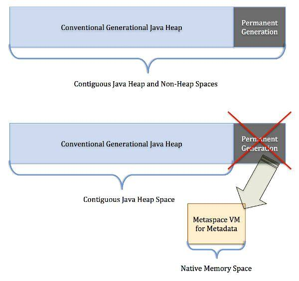

# Java 永久代去哪儿了

- Monica Beckwith

- 段建华

阅读数：180292015 年 8 月 17 日 19:55

在 Java 虚拟机（以下简称 JVM）中，类包含其对应的元数据，比如类的层级信息，方法数据和方法信息（如字节码，栈和变量大小），运行时常量池，已确定的符号引用和虚方法表。

在过去（当自定义类加载器使用不普遍的时候），类几乎是“静态的”并且很少被卸载和回收，因此类也可以被看成“永久的”。另外由于类作为 JVM 实现的一部分，它们不由程序来创建，因为它们也被认为是“非堆”的内存。

在 JDK8 之前的 HotSpot 虚拟机中，类的这些“永久的”数据存放在一个叫做永久代的区域。永久代一段连续的内存空间，我们在 JVM 启动之前可以通过设置 -XX:MaxPermSize 的值来控制永久代的大小，32 位机器默认的永久代的大小为 64M，64 位的机器则为 85M。永久代的垃圾回收和老年代的垃圾回收是绑定的，一旦其中一个区域被占满，这两个区都要进行垃圾回收。但是有一个明显的问题，由于我们可以通过‑XX:MaxPermSize 设置永久代的大小，一旦类的元数据超过了设定的大小，程序就会耗尽内存，并出现内存溢出错误 (OOM)。

**备注**：在 JDK7 之前的 HotSpot 虚拟机中，纳入字符串常量池的字符串被存储在永久代中，因此导致了一系列的性能问题和内存溢出错误。想要了解这些永久代移除这些字符串的信息，请访问[这里](http://bugs.java.com/view_bug.do?bug_id=6962931)查看。

## 辞永久代，迎元空间

随着 Java8 的到来，我们再也见不到永久代了。但是这并不意味着类的元数据信息也消失了。这些数据被移到了一个与堆不相连的本地内存区域，这个区域就是我们要提到的元空间。

这项改动是很有必要的，因为对永久代进行调优是很困难的。永久代中的元数据可能会随着每一次 Full GC 发生而进行移动。并且为永久代设置空间大小也是很难确定的，因为这其中有很多影响因素，比如类的总数，常量池的大小和方法数量等。

同时，HotSpot 虚拟机的每种类型的垃圾回收器都需要特殊处理永久代中的元数据。将元数据从永久代剥离出来，不仅实现了对元空间的无缝管理，还可以简化 Full GC 以及对以后的并发隔离类元数据等方面进行优化。



## 移除永久代的影响

由于类的元数据分配在本地内存中，元空间的最大可分配空间就是系统可用内存空间。因此，我们就不会遇到永久代存在时的内存溢出错误，也不会出现泄漏的数据移到交换区这样的事情。最终用户可以为元空间设置一个可用空间最大值，如果不进行设置，JVM 会自动根据类的元数据大小动态增加元空间的容量。

**注意**：永久代的移除并不代表自定义的类加载器泄露问题就解决了。因此，你还必须监控你的内存消耗情况，因为一旦发生泄漏，会占用你的大量本地内存，并且还可能导致交换区交换更加糟糕。

## 元空间内存管理

元空间的内存管理由元空间虚拟机来完成。先前，对于类的元数据我们需要不同的垃圾回收器进行处理，现在只需要执行元空间虚拟机的 C++ 代码即可完成。在元空间中，类和其元数据的生命周期和其对应的类加载器是相同的。话句话说，只要类加载器存活，其加载的类的元数据也是存活的，因而不会被回收掉。

我们从行文到现在提到的元空间稍微有点不严谨。准确的来说，每一个类加载器的存储区域都称作一个元空间，所有的元空间合在一起就是我们一直说的元空间。当一个类加载器被垃圾回收器标记为不再存活，其对应的元空间会被回收。在元空间的回收过程中没有重定位和压缩等操作。但是元空间内的元数据会进行扫描来确定 Java 引用。

元空间虚拟机负责元空间的分配，其采用的形式为组块分配。组块的大小因类加载器的类型而异。在元空间虚拟机中存在一个全局的空闲组块列表。当一个类加载器需要组块时，它就会从这个全局的组块列表中获取并维持一个自己的组块列表。当一个类加载器不再存活，那么其持有的组块将会被释放，并返回给全局组块列表。类加载器持有的组块又会被分成多个块，每一个块存储一个单元的元信息。组块中的块是线性分配（指针碰撞分配形式）。组块分配自内存映射区域。这些全局的虚拟内存映射区域以链表形式连接，一旦某个虚拟内存映射区域清空，这部分内存就会返回给操作系统。


上图展示的是虚拟内存映射区域如何进行元组块的分配。类加载器 1 和 3 表明使用了反射或者为匿名类加载器，他们使用了特定大小组块。 而类加载器 2 和 4 根据其内部条目的数量使用小型或者中型的组块。

## 元空间调优与工具

正如上面提到的，元空间虚拟机控制元空间的增长。但是有些时候我们想限制其增长，比如通过显式在命令行中设置 -XX:MaxMetaspaceSize。默认情况下，-XX:MaxMetaspaceSize 的值没有限制，因此元空间甚至可以延伸到交换区，但是这时候当我们进行本地内存分配时将会失败。

对于一个 64 位的服务器端 JVM 来说，其默认的–XX:MetaspaceSize 值为 21MB。这就是初始的高水位线。一旦触及到这个水位线，Full GC 将会被触发并卸载没有用的类（即这些类对应的类加载器不再存活），然后这个高水位线将会重置。新的高水位线的值取决于 GC 后释放了多少元空间。如果释放的空间不足，这个高水位线则上升。如果释放空间过多，则高水位线下降。如果初始化的高水位线设置过低，上述高水位线调整情况会发生很多次。通过垃圾回收器的日志我们可以观察到 Full GC 多次调用。为了避免频繁的 GC，建议将–XX:MetaspaceSize 设置为一个相对较高的值。

经过多次 GC 之后，元空间虚拟机自动调节高水位线，以此来推迟下一次垃圾回收到来。

有这样两个选项 ‑XX:MinMetaspaceFreeRatio 和‑XX:MaxMetaspaceFreeRatio，他们类似于 GC 的 FreeRatio 选项，用来设置元空间空闲比例的最大值和最小值。我们可以通过命令行对这两个选项设置对应的值。

下面是一些改进的工具，用来获取更多关于元空间的信息。

- jmap -clstats PID 打印类加载器数据。（-clstats 是 -permstat 的替代方案，在 JDK8 之前，-permstat 用来打印类加载器的数据）。下面的例子输出就是 DaCapo’s Avrora benchmark 程序的类加载器数据

    复制代码

    ```
    $ jmap -clstats 
    Attaching to process ID 6476, please wait...
    Debugger attached successfully.
    
    Server compiler detected.
    JVM version is 25.5-b02
    finding class loader instances ..done.
    computing per loader stat ..done.
    please wait.. computing liveness.liveness analysis may be inaccurate ...
    class_loader classes      bytes parent_loader     alive? type 
     
         655  1222734     null      live   
    0x000000074004a6c0    0    0    0x000000074004a708    dead      java/util/ResourceBundle$RBClassLoader@0x00000007c0053e20
    0x000000074004a760    0    0      null      dead      sun/misc/Launcher$ExtClassLoader@0x00000007c002d248
    0x00000007401189c8     1     1471 0x00000007400752f8    dead      sun/reflect/DelegatingClassLoader@0x00000007c0009870
    0x000000074004a708    116   316053    0x000000074004a760   dead      sun/misc/Launcher$AppClassLoader@0x00000007c0038190
    0x00000007400752f8    538  773854    0x000000074004a708   dead      org/dacapo/harness/DacapoClassLoader@0x00000007c00638b0
    total = 6      1310   2314112           N/A       alive=1, dead=5     N/A 
    ```

- jstat -gc LVMID

     

    用来打印元空间的信息，具体内容如下

    

- **jcmd PID GC.class_stats** 一个新的诊断命令，用来连接到运行的 JVM 并输出详尽的类元数据的柱状图。

**注意**：在 JDK 6 build 13 下，需要加上**‑XX:+UnlockDiagnosticVMOptions** 才能正确使用 jcmd 这个命令。

复制代码

```
$ jcmd  help GC.class_stats
9522:
GC.class_stats
Provide statistics about Java class meta data. Requires -XX:+UnlockDiagnosticVMOptions.
 
Impact: High: Depends on Java heap size and content. 
 
Syntax : GC.class_stats [options] [] 
 
Arguments:
     columns : [optional] Comma-separated list of all the columns to show. If not specified, the following columns are shown: InstBytes,KlassBytes,CpAll,annotations,MethodCount,Bytecodes,MethodAll,ROAll,RWAll,Total (STRING, no default value)
 
Options: (options must be specified using the  or = syntax)
     -all : [optional] Show all columns (BOOLEAN, false)
     -csv : [optional] Print in CSV (comma-separated values) format for spreadsheets (BOOLEAN, false)
     -help : [optional] Show meaning of all the columns (BOOLEAN, false)
```

**提示**：如果想了解字段的更多信息，请访问[这里](https://bugs.openjdk.java.net/secure/attachment/11600/ver_010_help.txt)

使用 jcmd 的示例输出:

复制代码

```
$ jcmd  GC.class_stats 

7140:
Index Super InstBytes KlassBytes annotations   CpAll MethodCount Bytecodes MethodAll   ROAll   RWAll   Total ClassName
    1    -1    426416        480           0       0           0         0         0      24     576     600 [C
    2    -1    290136        480           0       0           0         0         0      40     576     616 [Lavrora.arch.legacy.LegacyInstr;
    3    -1    269840        480           0       0           0         0         0      24     576     600 [B
    4    43    137856        648           0   19248         129      4886     25288   16368   30568   46936 java.lang.Class
    5    43    136968        624           0    8760          94      4570     33616   12072   32000   44072 java.lang.String
    6    43     75872        560           0    1296           7       149      1400     880    2680    3560 java.util.HashMap$Node
    7   836     57408        608           0     720           3        69      1480     528    2488    3016 avrora.sim.util.MulticastFSMProbe
    8    43     55488        504           0     680           1        31       440     280    1536    1816 avrora.sim.FiniteStateMachine$State
    9    -1     53712        480           0       0           0         0         0      24     576     600 [Ljava.lang.Object;
   10    -1     49424        480           0       0           0         0         0      24     576     600 [I
   11    -1     49248        480           0       0           0         0         0      24     576     600 [Lavrora.sim.platform.ExternalFlash$Page;
   12    -1     24400        480           0       0           0         0         0      32     576     608 [Ljava.util.HashMap$Node;
   13   394     21408        520           0     600           3        33      1216     432    2080    2512 avrora.sim.AtmelInterpreter$IORegBehavior
   14   727     19800        672           0     968           4        71      1240     664    2472    3136 avrora.arch.legacy.LegacyInstr$MOVW
…
…
1299  1300         0        608           0     256           1         5       152     104    1024    1128 sun.util.resources.LocaleNamesBundle
 1300  1098         0        608           0    1744          10       290      1808    1176    3208    4384 sun.util.resources.OpenListResourceBundle
 1301  1098         0        616           0    2184          12       395      2200    1480    3800    5280 sun.util.resources.ParallelListResourceBundle
              2244312     794288        2024 2260976       12801    561882   3135144 1906688 4684704 6591392 Total
                34.0%      12.1%        0.0%   34.3%           -      8.5%     47.6%   28.9%   71.1%  100.0%
Index Super InstBytes KlassBytes annotations   CpAll MethodCount Bytecodes MethodAll   ROAll   RWAll   Total ClassName
```

## 存在的问题

前面已经提到，元空间虚拟机采用了组块分配的形式，同时区块的大小由类加载器类型决定。类信息并不是固定大小，因此有可能分配的空闲区块和类需要的区块大小不同，这种情况下可能导致碎片存在。元空间虚拟机目前并不支持压缩操作，所以碎片化是目前最大的问题。

