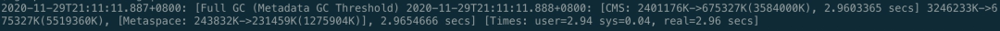

## 双12压测引出的线上Full GC排查

### 线上问题

双12之前压测的时候起了很小的量，直接触发了Full GC，吓尿了，因为马上双12大促预热就要开始了，这搞不好妥妥的3.25啦。


第一时间查看GC日志：



可以看到原因是超过了Metadata GC的阈值，触发了Full GC，Metaspace从243M 回收到231M，基本没怎么回收掉，所以稍微再来点量，很容易再次触发Metaspace 的回收。

### 知识储备

GC问题排查需要很多储备知识，最主要是JVM相关的，之前文章已经讲过一些了，这里主要讲Matespace是什么？后面讲怎么做的GC问题的排查。


这里有二个知识点：

- Matespace（元空间）是什么？在JVM中扮演什么角色，也就是存放什么的？
- Full GC跟Matespace 大小设置有什么关系？

Matespace叫做元空间，从JDK 8开始，永久代(PermGen)的概念被废弃掉了，取而代之的是一个称为Metaspace的存储空间。

Metaspace用来存放：Class文件在JVM 里的运行时数据结构；以及存Klass相关的其他的内容，比如Method，ConstantPool等。

Metaspace使用的是本地内存，而不是堆内存，也就是说在默认情况下Metaspace的大小只与本地内存大小有关。但是很容易有个**误区**是Matespace可以随便用，不管使用多少，只要不超本地内存就不会触发GC，这是错误的。

Matespace的设置方式是：-XX: MetaspaceSize=**M, 这个JVM参数的作用是让Matespace 达到MetaspaceSize时触发Full GC, 如果不设置Matespace, 默认值很小，也就 20M左右(不同系统会有一点差别)，如果程序Load Class比较多，很容易触发Full GC。这里要明白的是Class信息和加载Class 的ClassLoader 都存放在Metaspace，我们知道一个类是由这个类的类加载器加上全限定名（由包名&类名组成）确定唯一性的。

所以大家可以检查一下自己应用JVM Metaspace 设置的大小，如果没设置可以通过 -XX:+PrintFlagsInitial 查看一下默认值。

（之前文章发过GC日志的详细讲解以及JVM 参数的配置说明，如果有疑问的同学可以去看看历史文章。）

### 问题排查

刚开始看到 Full GC频繁，查看日志是由于Metaspace 空间不够造成的，第一反应是调整Metaspace 大小，把MetaspaceSize 从256M提高到了512M。但是发现Metaspace引发的Full GC还是没有消除。


立即dump了二台机器的日志，第一次分析GC 日志文件，没发现异常，这里有个注意的地方，大家dump文件时机很重要，有时候dump 的GC 日志没问题是因为刚好 Full GC完成之后dump的，内存回收的干干净净，有些内存缓慢增加的问题一定要在Full GC前dump。

期间我们还发现缓存相关的对象占用内存较高，但是经过分析，缓存对象生命周期本身就比较长，所以常驻在堆上，没有问题，继续看。

排查发现Metaspace内存占用是随着双12新接口压测流量的增长而增长，所以可以确定是新接口代码引入。


分析GC dump日志发现可疑点，同一个ClassCloader 加载了接近3000个，如下图所示，前面我们说过，ClassCloader 信息在Metaspace 区域。

破案了，fastjson使用不当引入了ASM Serializer的坑。

### 故障定位&修复

FastJson之所以快，原因就是使用asm字节码增强替代了反射。所以肯定是代码中应用了fastjson的ASM处理数据时造成的频繁加载同一个类，基本问题清楚了，那就是撸代码了，很快就定位了问题代码。

因为保密原因，不方便放原始代码，安琪拉撸了个类似逻辑的代码：

```
for(Item item -> arrays) {
  SerializeConfig serializeConfig = new SerializeConfig();
   serializeConfig.put(Custom.class, new CustomSerializer());
   jsonString = JSON.toJSONString(item, serializeConfig);
}
```

这段代码是自定义了一个序列化实现类CustomSerializer，在进行序列化时进行了一个类似AOP的切面处理，对所有Custom类型的字段进行统一自定义序列化（使用CustomSerializer）。

实现原理上是对需要序列化的Class使用asm动态生成了代理类，在这里就是Item类，使用SerializeConfig配置动态生成字节码代理类: com.alibaba.fastjson.serializer.ASMSerializer_1_Item，但是每次new SerializeConfig对象，会当作每次代理的目标是不一样的，导致每次会使用一个新的类加载器ASMClassLoader，所以Metaspace很快就满了，触发了频繁Full GC。

如果希望深入研究可以看下FastJson源码：

```
com.alibaba.fastjson.serializer.SerializeConfig#createASMSerializer
```

问题修复：

注册ObjectSerializer，让ObjectSerializer 成为全局唯一的，相当于是单例的。

```
SerializeConfig.getGlobalInstance().put(Character.class, new CharacterSerializer());
```

SerializeConfig 改成单例的后，每次序列化不用重复加载。

### 类似问题排查 & 调优

1. 如果dump 日志发现很多classloader 名称前缀相同，排查是否有这种动态代理技术的使用，可能在不断生成代理对象。
2. 发现内存缓慢增长，GC回收不掉，dump GC日志，查看是否有类被重复加载；
3. Metaspace调优，比如我们现在生产环境 Metaspace 基本会设置256M 或者512M，可以根据应用的类型和机器内存配置来决定，因素：1. 是否会加载比较多的类，2. 机器内存允许, 可以适当调大Metaspace。

以上就是双12压测GC问题完整的排查方法论、详细过程和解决方案。