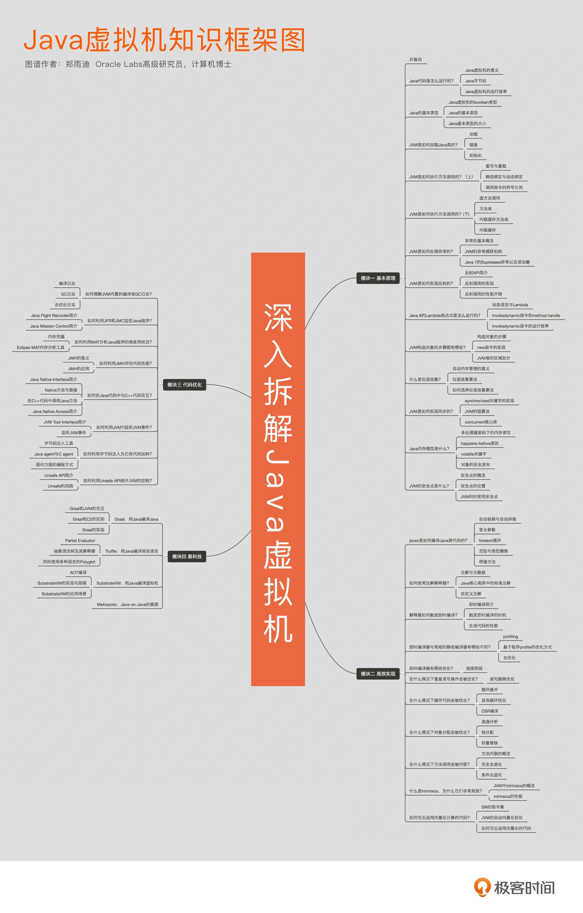
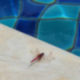
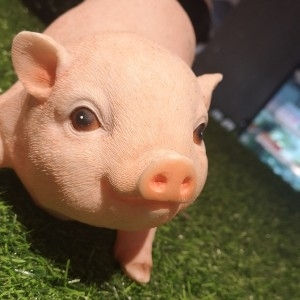
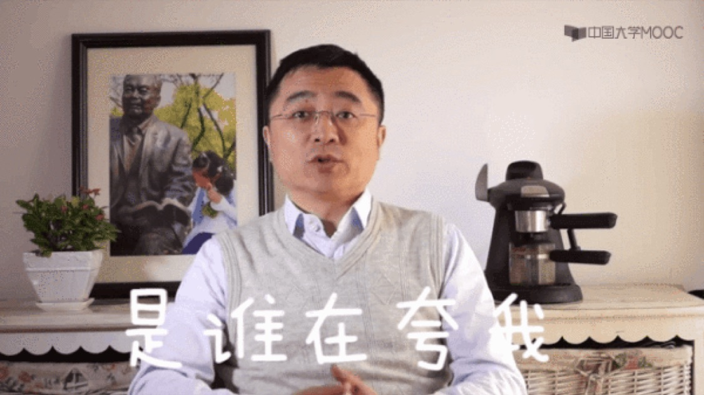
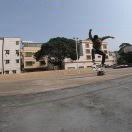
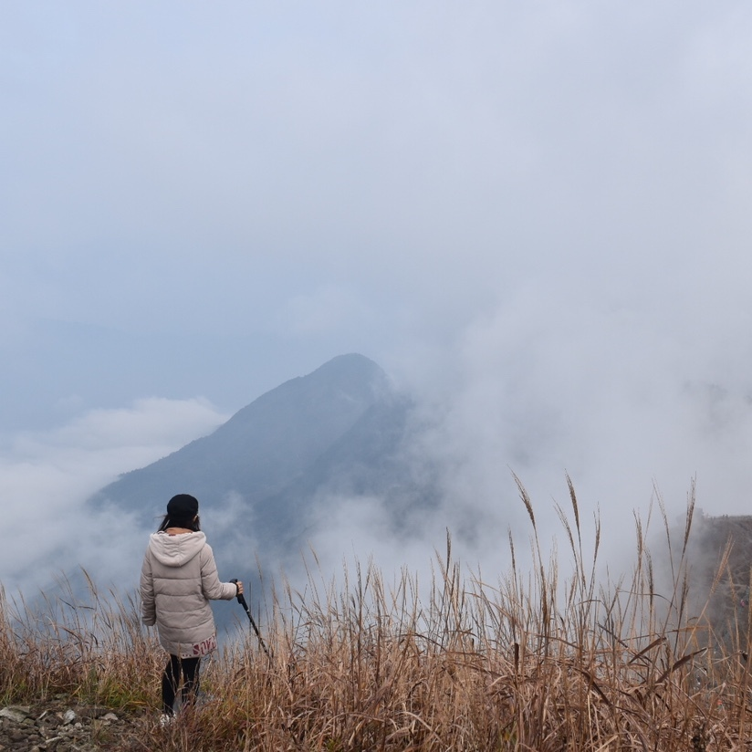
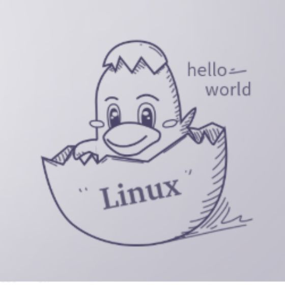

# 开篇词 | 为什么我们要学习Java虚拟机？

前不久我参加了一个国外程序员的讲座，讲座的副标题很有趣，叫做：“我如何学会停止恐惧，并且爱上 Java 虚拟机”。

这句话来自一部黑色幽默电影《奇爱博士》，电影描述了冷战时期剑拔弩张的氛围。

程序员之间的语言之争又未尝不是如此。写系统语言的鄙视托管语言低下的执行效率；写托管语言的则取笑系统语言需要手动管理内存；写动态语言的不屑于静态语言那冗余的类型系统；写静态语言的则嘲讽动态语言里面各种光怪陆离的运行时错误。

Java 作为应用最广的语言，自然吸引了不少的攻击，而身为 Java 程序员的你，或许在口水战中落了下风，忿忿于没有足够的知识武装自己；又或许想要深入学习 Java 语言，却又无从下手。甚至是在实践中被 Java 的启动性能、内存耗费所震惊，因此对 Java 语言本身产生了种种的怀疑与顾虑。

别担心，我就是来解答你对 Java 的种种疑虑的。“知其然”也要“知其所以然”，学习 Java 虚拟机的本质，更多是了解 Java 程序是如何被执行且优化的。这样一来，你才可以从内部入手，达到高效编程的目的。与此同时，你也可以为学习更深层级、更为核心的 Java 技术打好基础。

我相信在不少程序员的观念里，Java 虚拟机是透明的。在大家看来，我们仅需知道 Java 核心类库，以及第三方类库里 API 的用法，便可以专注于实现具体业务，并且依赖 Java 虚拟机自动执行乃至优化我们的应用程序。那么，我们还需要了解 Java 虚拟机吗？

我认为是非常有必要的。如果我们把核心类库的 API 比做数学公式的话，那么 Java 虚拟机的知识就好比公式的推导过程。掌握数学公式固然可以应付考试，但是了解背后的推导过程更加有助于记忆和理解。并且，在遇到那些没法套公式的情况下，我们也能知道如何解决。

具体来说，了解 Java 虚拟机有如下（但不限于）好处。

首先，Java 虚拟机提供了许多配置参数，用于满足不同应用场景下，对程序性能的需求。学习 Java 虚拟机，你可以针对自己的应用，最优化匹配运行参数。（你可以用下面这个例子看一下自己虚拟机的参数列表。）

```java

举例来说，macOS上的Java 10共有近千个配置参数：

$ java -XX:+PrintFlagsFinal -XX:+UnlockDiagnosticVMOptions -version | wc -l
java version "10" 2018-03-20
Java(TM) SE Runtime Environment 18.3 (build 10+46)
Java HotSpot(TM) 64-Bit Server VM 18.3 (build 10+46, mixed mode)
     812
```

其次，Java 虚拟机本身是一种工程产品，在实现过程中自然存在不少局限性。学习 Java 虚拟机，可以更好地规避它在使用中的 Bug，也可以更快地识别出 Java 虚拟机中的错误，

再次，Java 虚拟机拥有当前最前沿、最成熟的垃圾回收算法实现，以及即时编译器实现。学习 Java 虚拟机，我们可以了解背后的设计决策，今后再遇到其他代码托管技术也能触类旁通。

最后，Java 虚拟机发展到了今天，已经脱离 Java 语言，形成了一套相对独立的、高性能的执行方案。除了 Java 外，Scala、Clojure、Groovy，以及时下热门的 Kotlin，这些语言都可以运行在 Java 虚拟机之上。学习 Java 虚拟机，便可以了解这些语言的通用机制，甚至于让这些语言共享生态系统。

说起写作这个专栏的初心，与我个人的经历是分不开的，我现在是甲骨文实验室的高级研究员，工作主要是负责研究如何通过程序分析技术以及动态编译技术让程序语言跑得更快。明面上，我是 Graal 编译器的核心开发者之一，在为 HotSpot 虚拟机项目拧螺丝。

这里顺便说明一下，Graal 编译器是 Java 10 正式引入的实验性即时编译器，在国内同行口中被戏称为“甲骨文黑科技”。当然，在我看来，我们的工作同样也是分析应用程序的性能瓶颈，寻找优化空间，只不过我们的优化方式对自动化、通用性有更高的要求。

加入甲骨文之前，我在瑞士卢加诺大学攻读博士学位，研究如何更加精准地监控 Java 程序，以便做出更具针对性的优化。这些研究工作均已发表在程序语言方向的顶级会议上，并获得了不少同行的认可（OOPSLA 2015 最佳论文奖）。

在这 7 年的学习工作生涯中，我拜读过许多大神关于 Java 虚拟机的技术博客。在受益匪浅的同时，我发觉不少文章的门槛都比较高，而且过分注重实现细节，这并不是大多数的开发人员可以受益的调优方案。这么一来，许多原本对 Java 虚拟机感兴趣的同学， 也因为过高的门槛，以及短时间内看不到的收益，而放弃了对 Java 虚拟机的学习。

在收到极客时间的邀请后，我决定也挑战一下 Java 虚拟机的科普工作。和其他栏目一样，我会用简单通俗的语言，来介绍 Java 虚拟机的实现。具体到每篇文章，我将采用一个贯穿全文的案例来阐述知识点，并且给出相应的调优建议。在文章的末尾，我还将附上一个动手实践的环节，帮助你巩固对知识点的理解。

整个专栏将分为四大模块。

**基本原理**：剖析 Java 虚拟机的运行机制，逐一介绍 Java 虚拟机的设计决策以及工程实现；

**高效实现**：探索 Java 编译器，以及内嵌于 Java 虚拟机中的即时编译器，帮助你更好地理解 Java 语言特性，继而写出简洁高效的代码；

**代码优化**：介绍如何利用工具定位并解决代码中的问题，以及在已有工具不适用的情况下，如何打造专属轮子；

**虚拟机黑科技**：介绍甲骨文实验室近年来的前沿工作之一 GraalVM。包括如何在 JVM 上高效运行其他语言；如何混搭这些语言，实现 Polyglot；如何将这些语言事前编译（Ahead-Of-Time，AOT）成机器指令，单独运行甚至嵌入至数据库中运行。

我希望借由这四个模块 36 个案例，帮助你理解 Java 虚拟机的运行机制，掌握诊断手法和调优方式。最重要的，是激发你学习 Java 虚拟机乃至其他底层工作、前沿工作的热情。

## 知识框架图



## 精选留言(129)

- 

  钱

  置顶

  JVM 1:现在我的理解 1-1:三个英文单词的缩写，中文意思是Java虚拟机，作用是帮助执行Java字节码的，不同的平台有不同的JVM，这样java源代码经过编译为字节码之后就能在各种平台上运行了 1-2:JVM还有内存管理，垃圾回收等底层功能，这样程序员就不用太操心这些事情了 1-3:内存管理主要是将JVM的内存容量划分成不同的模块，使用不同的管理方式，核心目的是为了更少的内存使用更快的内存性能以及恰当的内存回收策略 1-4:垃圾回收之所以存在是因为JVM是运行在内存之中的，它的内存空间是有限的，当加载进内存的对象越来越多的时候，会影响JVM的运行性能，所以，要回收一些内存空间，垃圾回收的关键是识别出垃圾以及使用不影响JVM运行的回收策略 1-5:JVM是Java代码执行的地方，Java程序性能上出现了问题的时候，我们要从代码层面进行分析、定位、优化，但是我们怎么知道那段代码性能差哪？此时要看JVM中代码的执行情况，看看谁慢？为什么慢？这些我还不清楚咋快速定位，所以，我订阅了这个专栏 2我希望我能学到如下内容 2-1:Java源代码怎么变成Java字节码的？ 2-2:Java字节码怎么进入JVM的？ 2-3:Java 字节码进入JVM后是怎么放置的？ 2-4:JVM执行字节码的时候怎么定位的？他怎么知道该执行那句代码了？它怎么知道那句代码是什么意思？ 2-5:性能优化，我的理解是让干活快的干活，不让干的慢的干，如果做不到，就让干活快的多干，干的慢的少干？JVM的性能优化可能也类似，哪JVM怎么知道谁干的慢谁干的快？JVM在执行Java字节码的时候都是需要做什么事情呢？它怎么安排自己的工作的呢？ 2-6:实际开发工作中怎么监控JVM的工作情况哪？怎么定位那些懒蛋哪？定位到了怎么解决他们哪？

  2018-07-21

  **1

  **228

- 

  劳斯

  置顶

  JVM很有用，目测会是个不错的专栏，期待！

  2018-07-16

  **

  **41

- 

  木甘

  置顶

  是java10吗

  作者回复: 介绍的内容不局限于一个版本的。从8到11都会涉及到。

  2018-07-17

  **

  **18

- 

  未设置

  置顶

  看了知识框架图 可以说十分期待了

  2018-07-16

  **

  **16

- 

  沙漏人生

  置顶

  已购，看看作者大能如何把复杂的东西简单化。

  2018-07-16

  **

  **10

- 

  浮生老莫

  置顶

  期待老师后续的内容，刚想学JVM，就来了，再打磨打磨自己的技术

  2018-07-16

  **

  **8

- 

  lynd

  置顶

  能够对java虚拟机做分块的详细介绍不，最好能附上简短的代码介绍，谢谢！

  作者回复: 这个专栏会避免介绍具体的虚拟机代码。但我会在最后列举一些学习资料。

  2018-07-17

  **

  **7

- 

  zhenTomcat

  置顶

  期待

  2018-07-16

  **

  **3

- 

  Desperado

  置顶

  沙发期待中

  2018-07-18

  **

  **2

- 

  刘晓宇

  置顶

  希望不虚此行，希望有趣。

  2018-07-16

  **

  **2

- 

  李二木

  置顶

  很期待

  2018-07-16

  **

  **2

- 

  我的黄金时代

  置顶

  下面这个讲课的目录很给力

  2018-07-18

  **

  **1

- 

  云学

  提一个建议:  让读者看懂是第一位的。只要读者会java语法，就应该能让他看懂，谢谢

  2018-07-17

  **

  **17

- 

  苏忆

  看了下目录，介绍的比较笼统，希望讲解的时候比较深入并提供相关资料提供学习。谢谢，郑大，一起加油！

  2018-07-16

  **

  **12

- 

  小宝儿

  Android用户也可以长按保存

  2018-07-17

  **

  **10

- 

  Daph

  我最嫉妒那些长的比我帅还比我用功的人，期待+1

  2018-07-17

  **

  **10

- 

  猿人谷

  单纯根据目录看，介绍的还是比较泛，希望在文章中对核心点能进行深入的分析，期待精彩干货。

  2018-07-16

  **

  **7

- 

  Daniel

  果断学习了，站在巨人的肩膀上看世界，然后许下要让世界更加精彩的诺言

  2018-07-20

  **

  **5

- 

  黄朋飞

  已经拜读过jvm方面的书籍，但对于调优方面还是比较欠缺，希望能针对jvm线上问题能够学习到有效的解决方案，期待

  2018-07-17

  **

  **5

- 

  吴双

  已购买，期待后续文章啊

  2018-07-17

  **

  **4

- ![img](data:image/jpeg;base64,/9j/4QAYRXhpZgAASUkqAAgAAAAAAAAAAAAAAP/sABFEdWNreQABAAQAAABkAAD/4QN5aHR0cDovL25zLmFkb2JlLmNvbS94YXAvMS4wLwA8P3hwYWNrZXQgYmVnaW49Iu+7vyIgaWQ9Ilc1TTBNcENlaGlIenJlU3pOVGN6a2M5ZCI/PiA8eDp4bXBtZXRhIHhtbG5zOng9ImFkb2JlOm5zOm1ldGEvIiB4OnhtcHRrPSJBZG9iZSBYTVAgQ29yZSA1LjYtYzE0MCA3OS4xNjA0NTEsIDIwMTcvMDUvMDYtMDE6MDg6MjEgICAgICAgICI+IDxyZGY6UkRGIHhtbG5zOnJkZj0iaHR0cDovL3d3dy53My5vcmcvMTk5OS8wMi8yMi1yZGYtc3ludGF4LW5zIyI+IDxyZGY6RGVzY3JpcHRpb24gcmRmOmFib3V0PSIiIHhtbG5zOnhtcE1NPSJodHRwOi8vbnMuYWRvYmUuY29tL3hhcC8xLjAvbW0vIiB4bWxuczpzdFJlZj0iaHR0cDovL25zLmFkb2JlLmNvbS94YXAvMS4wL3NUeXBlL1Jlc291cmNlUmVmIyIgeG1sbnM6eG1wPSJodHRwOi8vbnMuYWRvYmUuY29tL3hhcC8xLjAvIiB4bXBNTTpPcmlnaW5hbERvY3VtZW50SUQ9InhtcC5kaWQ6YWE3YmZhMDItMzBhMC00MDg3LTg3MmYtOGMwMjMxNjNhZWRjIiB4bXBNTTpEb2N1bWVudElEPSJ4bXAuZGlkOjI2MTlEODM3NTgzMTExRTk5NDY4Qjk3QUFCNDFBN0QzIiB4bXBNTTpJbnN0YW5jZUlEPSJ4bXAuaWlkOjI2MTlEODM2NTgzMTExRTk5NDY4Qjk3QUFCNDFBN0QzIiB4bXA6Q3JlYXRvclRvb2w9IkFkb2JlIFBob3Rvc2hvcCBDQyAyMDE1IChNYWNpbnRvc2gpIj4gPHhtcE1NOkRlcml2ZWRGcm9tIHN0UmVmOmluc3RhbmNlSUQ9InhtcC5paWQ6OTYyRTNCMDNBREI4MTFFOEFFNTJDODlGREQ1OTUzMDMiIHN0UmVmOmRvY3VtZW50SUQ9InhtcC5kaWQ6OTYyRTNCMDRBREI4MTFFOEFFNTJDODlGREQ1OTUzMDMiLz4gPC9yZGY6RGVzY3JpcHRpb24+IDwvcmRmOlJERj4gPC94OnhtcG1ldGE+IDw/eHBhY2tldCBlbmQ9InIiPz7/7gAOQWRvYmUAZMAAAAAB/9sAhAABAQEBAQEBAQEBAQEBAQEBAQEBAQEBAQEBAQEBAQEBAQEBAQEBAQEBAQEBAgICAgICAgICAgIDAwMDAwMDAwMDAQEBAQEBAQIBAQICAgECAgMDAwMDAwMDAwMDAwMDAwMDAwMDAwMDAwMDAwMDAwMDAwMDAwMDAwMDAwMDAwMDAwP/wAARCADuAO4DAREAAhEBAxEB/8QAfAABAAICAwEBAAAAAAAAAAAAAAYHBAgBAwUCCgEBAAAAAAAAAAAAAAAAAAAAABAAAgIBAgIECwQJBQAAAAAAAAECAwQRBSEGMWESF0FRgVITk+MUVJTUIkJiB5EyhBVFhbXFNnFygqJTEQEAAAAAAAAAAAAAAAAAAAAA/9oADAMBAAIRAxEAPwD9vAAAAAAAAAAAAAAAAAAAAAAAAAAAAAAAAAAAAAAAAAAAAAAAAAAAAAAAAAAAAAAAAAAAAAAAAAAAAAAAAAAAAAAAAAAAAAAAAAAAAAAAAAAAAAAAAAAAAAAAAAAAAAAAAAAAAAAAAAAAAAAAAAAAAAAAAAAAAAAAAAAAAAAAAAAAAAAAAAAAAAAAAAAAAAAAAAAAAAAAAAAAAAAAAAAAAAAAAAAAAAAAAAAAAAAAAAAAAAAAAAAAAAAAAAAAAAAAAAAAAGHmbhg7fD0mbl4+LF69l32wrctPBCMmpTfUk2BG7ue+Wqm4rNsua6XTi5DWvVKyutPyaoDmnnrlq19l506W9NPTYuSk2/xQqnGPlaQElxM7Dzq/S4WVj5VfhlRbC1Rfil2G3GXU9GBlAAAAAAAAAAAAAAAAAAAAAAAAAAAA4bUU5SajGKblJtJJJattvgkkBVHMnP8AJSswtilHSLcLdxcVLV9DWHCWsdF/6ST1+6uiQFW35F+VbK/Jutvum9Z23WSssk/xTm3JgdIADvx8nIxLY34t9uPdD9W2myVc1412otPR6cV0MC1uWufvTTrwd8cITlpCrcYpQhKT4KOXBaQrbf346R8aXFgWmnrxXFPimvCAAAAAAAAAAAAAAAAAAAAAAAAAAFUfmBzHKLexYVjjrGMtxsg+LU12oYia6E4tSn400vOQFTAAAAAAAuDkDmSWRFbHm2OVtUHLb7ZvWU6oLWeK2+LdMV2ofgTX3UBaAAAAAAAAAAAAAAAAAAAAAAAABi52XDAwsvNs4wxce6+S10cvRQlNQX4ptaLrYGr+RfblX3ZN8nO7Itsutk/vWWSc5Pq4sDpAAAAAABlYWXbgZeNmUPS3Guruhx0TcJJ9mWnTGa4NeFMDaDGvrysejJqeteRTVfW/HC2EbI/9ZAdwAAAAAAAAAAAAAAAAAAAAAACJc8WurlncOzwdrxateqeVT2v0wTXlA18AAAAAAAAAbFcnXSu5a2mcnq402U/8cfJuoivJGtASYAAAAAAAAAAAAAAAAAAAAAABFOdqXdyzuSjxlWse7yVZVMp/or1YGvQAAAAAAAADY3lGiWPy3tNclo5Yzv8AF9nJusyYvyxtQEjAAAAAAAAAAAAAAAAAAAAAAAdGVj15eNkYty1qyaLaLF4exbCVctOvSXADWDNxLsDLycLIj2bsa6dM/E3B6KUfHCa0afhTAxQAAAAAAZ224Nu55+LgUp+kyboV6pa9iDetljXm1VpyfUgNnqaoUU1UVLs101wqrj4oVxUILyRQHYAAAAAAAAAAAAAAAAAAAAAAAAVrz5yzPNh++cGtzyaK1HNpgtZX0QX2bopcZW0R4NdLhp5ujCmQAAAAAAXbyLyzPbaXumdW4ZuVX2aKprSWNjS0bck+Mbr9FqumMeHS2gLDAAAAAAAAAAAAAAAAAAAAAAAAAACuOZOQ6c+dmbtDrxcubc7cWX2cbIm+LlW0n7vbLw8OxJ+bxbCpM7bM/bLXVn4l+NPVpekg1CenhrsWtdseuLaAwQAHo7ftO47raqsDEuyZapSlCOlVevhtul2aql/uaAt3lrkWjbJ15u5yry86Gk6qYrXFxpripfaSd90X0NpRi+hNpSAsIAAAAAAAAAAAAAAAAAAAAAAAAAAAAD4sqrug67a4W1y/WhZCM4P/AFjJNMDw7eVuXrm5T2jCTfT6Kr0C49VLrQHNPK/L1ElKvaMJtcU7alfo/Gle7FqB7cK4VQVdcIVwitIwhFQhFeJRikkgPsAAAAAAAAAAAAAAAAAAAAAAAAAY2XmYuBRPKzL68aiv9ay2XZjq+iKXTKcvBFJt+BARGf5g8uRk4q3LsSeinDFkoy60pyhPR9aQHz3h8u+dm/K+0Ad4fLvnZvyvtAHeHy752b8r7QB3h8u+dm/K+0Ad4fLvnZvyvtAHeHy752b8r7QB3h8u+dm/K+0Ad4fLvnZvyvtAMjG575cybY1PKtxnJpRnk0Trq1fglZHtxrXXLRLxgTCMozjGUZKUZJSjKLTjKLWqlFrVNNPgwOQAAAAAAAAAAAAAAAAAAAAUZ+YW43ZG9ywHOSx9vqpUa9fsu7IphkTta8MnCyMepLrYECAAAAAAAAAAAF0/lxuN2Tt+Zg2zlOO320uhyerhTlK1qpPzYWUSa8Xa06NALHAAAAAAAAAAAAAAAAAAAABr3zx/lO6fsX9OxAImAAAAAAAAAAALY/K/+Ofyz+4AWwAAAAAAAAAAAAAAAAAAAADXvnj/ACndP2L+nYgETAAAAAAAAAAAFsflf/HP5Z/cALYAAAAAAAAAAAAAAAAAAAABVvMfJG7bxvOZuONkbdCjI937Eb7cmNq9DiUUS7Ua8S2C1nU2tJPgB4fdrvvxe0+vzPoAHdrvvxe0+vzPoAHdrvvxe0+vzPoAHdrvvxe0+vzPoAHdrvvxe0+vzPoAHdrvvxe0+vzPoAHdrvvxe0+vzPoAHdrvvxe0+vzPoAHdrvvxe0+vzPoAHdrvvxe0+vzPoAJvyby1ncvfvH323Et989z9F7rZdPs+7+9dvt+loo019OtNNfD0ATcAAAAAAAAAAAAAAAAAAAAAAAAAAAAAAAAAAAAAAAAAAAAAAAAAAAAAAAAAAAAAAAAAAAAAAAAAAAAAAAAAAAAAAAAAAAAAAAAAAAAAAAAAAAAAAAAAAAAAAAAAAAAAAAAAAAAAAAAAAAAAAAAAAAAAAAAAAAAAAAAAAAAAAAAAAAAAAAAAAAAAAAAAAAAAAAAAAAAAAAAAAAAAAAAAAAAAAAAAAAAAAAAAAAAAAAAAAAAAAAAAAAAAAAAAAAAAAAAAAAAAAAAAAAAAAAAAAAAAAAAAAAAAAAAAA//Z)

  Knuthie

  与openjdk  open jvm的对比可以讲讲么？

  2018-07-19

  **

  **3

- 

  小猫也是老虎

  希望大佬能在以后更新快点，毕竟秋招要来了😁

  2018-07-19

  **

  **3

- 

  杨昌明

  居然亲自朗读

  2018-07-17

  **

  **3

- 

  Adele

  我业务+测试+部署，非开发，希望能和开发人员对上话，更好地优化我们的系统😃。

  2018-07-17

  **

  **3

- 

  iMARS

  从.net clr平台转到JAVA平台，深知了解语言运行时处理的重要性，无论是对代码撰写还是效能分析都非常有帮助。

  2018-07-17

  **

  **3

- 

  鸡肉饭饭

  希望前期能尽快更新…期待不已

  2018-07-16

  **

  **3

- 

  GL€

  能否分享一下如何编译hotspot?

  作者回复: 编译新版本的HotSpot都很简单了，configure脚本调一下，会告诉你缺哪些library，然后make images就可以了。如果第一步没错第二步出错了，可以去提交一下bug report

  2020-01-17

  **

  **2

- 

  Jerry银银

  这几天，我一直在思考，老师的课程为什么这么编排？如果想深入并且系统地研究Java虚拟机，有没有一个很好的学习主线？ 对于这个问题，我凭着我的认知，尝试来总结下： 	1. 首先，Java程序需要被编译成字节码； Java程序如何存储的？ Java编译器相关知识 字节码相关知识 编译Java程序，编译器又做了哪些优化？ AOT又是怎样的技术？ 	2. 然后，字节码被加载之后才能被执行 虚拟机是如何加载字节码的？ 字节码被加载到虚拟机哪个内存区域？ 虚拟机的内存布局又是怎么样的？ 从字节码被加载到执行，这中间虚拟机会做哪些事情？（加载、链接、初始化）  3. 字节码可以被解释执行，还能被即时编译（JIT）成机器码后，然后被执行。 解释执行的过程是怎么样的？ JIT具体的原理是？ 虚拟机是如何检测热点代码的？这中间做了哪些优化？ 字节码被执行起来后，对一些无用对象如何处理？——垃圾回收算法 

  2019-12-23

  **

  **3

- 

  Mr.钧👻

  我订阅这个专栏，是想学习到以下内容： 1.了解什么是JVM，组成部分 2.了解JVM为什么需要调优 3.了解JVM怎么调优

  2018-10-03

  **

  **2

- 

  徐东东

  今年的北京QCon大会就去听了你的演讲，正好这段时间自己也在学习虚拟机

  2018-07-31

  **

  **2

- 

  李小龙

  看目录还是比较全面的，非常期待

  2018-07-27

  **

  **2

- 

  陶家顺

  对jvm的系统学习已经饥渴难耐。

  2018-07-19

  **

  **2

- 

  cc

  很期待啊，大神求带

  2018-07-17

  **

  **2

- 

  佳佳

  迫不及待了

  2018-07-17

  **

  **2

- 

  劳斯

  JVM很有用，目测会是个不错的专栏，期待！

  2018-07-16

  **

  **2

- 

  iWill

  希望就jdk工具的使用，再开一门课程，gc日志的分析、调优；增加案例，发现这方面的资料少的可怜

  2018-10-03

  **

  **1

- 

  已昏懒人

  已购

  2018-08-29

  **

  **1

- 

  小当家

  希望老师能多推荐些自己研究方向最有用的书籍，补充原理

  作者回复: 我的研究方向主要是发掘更多编译器优化，对于应用层可能没啥用。

  2018-08-19

  **

  **1

- 

  宋青书

  老师，我想请问，我只学完JAVAse可以学吗？我已经买了课程了。能看懂吗

  2018-08-15

  **

  **1

- 

  bin

  点赞

  2018-07-26

  **

  **1

- 

  Pp、x

  小白，特别奇怪像我这种工作不到两年的人，需要打开知识的新世界。

  2018-07-19

  **

  **1

- 

  镰仓

  我是透过infoQ上文章决心买下来专栏。Graal黑科技有机会在接下来课程中学习到吗？另，我关注的实际是Dalvik/Art机制

  2018-07-19

  **

  **1

- 

  陶家顺

  jvm书籍已温习，结合书籍再次学习。乖巧，坐等雨神更新。

  2018-07-19

  **

  **1

- 

  上上簽

  期待后续

  2018-07-19

  **

  **1

- 

  kylin

  期待，

  2018-07-18

  **

  **1

- 

  给我一秒毁坏世界

  期待自己在JVM方面有所突破

  2018-07-18

  **

  **1

- 

  kmmshmily

  期待，JVM我了解过，但不够系统化，期待作者的精彩表现

  2018-07-18

  **

  **1

- 

  李小斌

  期待，正好最近在研究虚拟机

  2018-07-18

  **

  **1

- 

  自然

  看过好几本jvm书，每次实践都有都有收货。非常期待这一次。

  2018-07-18

  **

  **1

- 

  八戒

  期待

  2018-07-18

  **

  **1

- 

  八戒

  期待

  2018-07-18

  **

  **1

- 

  小样

  期待第一讲

  2018-07-18

  **

  **1

- 

  憨厚的小熊

  来咯

  2018-07-18

  **

  **1

- 

  码小呆

  jvm主要是面试都要问，真的卷，不过学学对自己也有好处

  2021-08-16

  **

  **

- 

  吃饭

  能出个怎么调试jvm的加餐吗老师

  2021-07-09

  **

  **

- 

  慎独明强

  收藏该专栏有一段时间，之前看过周志明的深入理解java虚拟机，也看过救火队长的jvm专栏，希望这个专栏能让自己有不一样的思考和收获

  2021-05-25

  **

  **

- 

  undefined

  我愿称你为奇异博士

  2021-03-16

  **

  **

- 

  付振南

  面试被虐了，回来重造了，希望能沉下心来阅读

  2020-07-15

  **

  **

- 

  遥远的救世主

  作为一名Android开发，原来总觉得JVM没什么用处，后来才发现只不是给自己画了一个圈，知其然也要知其所以然。

  2020-03-29

  **

  **

- 

  梦倚栏杆

  老师，我有一个问题想要请教： 背景：jvm在向出现系统申请内存时，出现了out of memory，然后系统把进程杀掉了。 问题：我该怎么解决： (1)调低jvm的最大使用内存 (2)配置swap or (3)内存升配。(3)一定可以解决，但是在资源有限的情况下，我怎么知道何种方式是最合适的，以及如何调整的好，调整到何种参数有什么参考依据吗？ 详情：项目开发使用的是spring boot框架，机器资源是1C2G(阿里云ECS)，机器上除了有一个java进程之外，还有nginx, 阿里云自带的系统监控，日志收集，consul agent等基础设施(消耗Cpu内存都比较小)。 jvm 参数目前配置的最小是1G内存，最大是2G内存。

  2020-03-29

  **

  **

- 

  GLS-GYJ

  期待

  2020-03-22

  **

  **

- 

  今天

  为什么要学习虚拟机

  2020-03-22

  **

  **

- 

  wakaka

  知识架构图画的很好，学习中。

  2020-01-19

  **

  **

- 

  Jerry银银

  老师，虚拟机有很多的知识点，对于我们想深入研究~  可能不仅限于这个专栏所覆盖的知识面。对于后续的学习，有么有好的建议？希望老师给出的一个好的学习主线！！

  2019-12-23

  **

  **

- 

  xfun

  大牛啊

  2019-11-30

  **

  **

- 

  xuwei

  正在看jvm相关，准备看第二遍

  2019-11-18

  **

  **

- 

  拯救地球好累

  学习目标： 1. 构建自己的JVM知识树 2. 能配置常用的JVM参数，可以按需求调参 3. 在定位bug时能考虑JVM层的动作 4. 理解JVM整体的设计和关键模块的设计（GC、JIT等） 额外学习目标： 1. 为上层特性找到JVM中对应的设计 2. 结合其他学习资料把握JVM整体架构代码和关键模块代码

  2019-09-06

  **

  **

- 

  Amelie

  要深入 jvm 

  2019-07-24

  **

  **

- 

  limbo

  期待

  2019-06-04

  **

  **

- 

  钢板

  请问下老师，怎么看待华为的方舟编译器。在只优化编译器的情况下，真的能提升运行效率吗。是否也只是做了下事前编译，提升了第一次使用时的效率？长期使用(已经全部编译为机器码后)的性能还是在于运行环境吧？安卓的运行环境没有变，只是改变编译器能提升执行效率吗？

  2019-04-30

  **

  **

- 

  Geek_987169

  老师，请教个问题，看parallel gc，开始说并行垃圾处理，暂停时间短，后面又说“此gc的所有阶段不能中断，所以并行gc停顿时间长”，这个暂停和停顿有啥区别啊？有啥区别啊？

  2019-04-18

  **

  **

- ![img](data:image/jpeg;base64,/9j/4QAYRXhpZgAASUkqAAgAAAAAAAAAAAAAAP/sABFEdWNreQABAAQAAABkAAD/4QN5aHR0cDovL25zLmFkb2JlLmNvbS94YXAvMS4wLwA8P3hwYWNrZXQgYmVnaW49Iu+7vyIgaWQ9Ilc1TTBNcENlaGlIenJlU3pOVGN6a2M5ZCI/PiA8eDp4bXBtZXRhIHhtbG5zOng9ImFkb2JlOm5zOm1ldGEvIiB4OnhtcHRrPSJBZG9iZSBYTVAgQ29yZSA1LjYtYzE0MCA3OS4xNjA0NTEsIDIwMTcvMDUvMDYtMDE6MDg6MjEgICAgICAgICI+IDxyZGY6UkRGIHhtbG5zOnJkZj0iaHR0cDovL3d3dy53My5vcmcvMTk5OS8wMi8yMi1yZGYtc3ludGF4LW5zIyI+IDxyZGY6RGVzY3JpcHRpb24gcmRmOmFib3V0PSIiIHhtbG5zOnhtcE1NPSJodHRwOi8vbnMuYWRvYmUuY29tL3hhcC8xLjAvbW0vIiB4bWxuczpzdFJlZj0iaHR0cDovL25zLmFkb2JlLmNvbS94YXAvMS4wL3NUeXBlL1Jlc291cmNlUmVmIyIgeG1sbnM6eG1wPSJodHRwOi8vbnMuYWRvYmUuY29tL3hhcC8xLjAvIiB4bXBNTTpPcmlnaW5hbERvY3VtZW50SUQ9InhtcC5kaWQ6YWE3YmZhMDItMzBhMC00MDg3LTg3MmYtOGMwMjMxNjNhZWRjIiB4bXBNTTpEb2N1bWVudElEPSJ4bXAuZGlkOjI2MTlEODM3NTgzMTExRTk5NDY4Qjk3QUFCNDFBN0QzIiB4bXBNTTpJbnN0YW5jZUlEPSJ4bXAuaWlkOjI2MTlEODM2NTgzMTExRTk5NDY4Qjk3QUFCNDFBN0QzIiB4bXA6Q3JlYXRvclRvb2w9IkFkb2JlIFBob3Rvc2hvcCBDQyAyMDE1IChNYWNpbnRvc2gpIj4gPHhtcE1NOkRlcml2ZWRGcm9tIHN0UmVmOmluc3RhbmNlSUQ9InhtcC5paWQ6OTYyRTNCMDNBREI4MTFFOEFFNTJDODlGREQ1OTUzMDMiIHN0UmVmOmRvY3VtZW50SUQ9InhtcC5kaWQ6OTYyRTNCMDRBREI4MTFFOEFFNTJDODlGREQ1OTUzMDMiLz4gPC9yZGY6RGVzY3JpcHRpb24+IDwvcmRmOlJERj4gPC94OnhtcG1ldGE+IDw/eHBhY2tldCBlbmQ9InIiPz7/7gAOQWRvYmUAZMAAAAAB/9sAhAABAQEBAQEBAQEBAQEBAQEBAQEBAQEBAQEBAQEBAQEBAQEBAQEBAQEBAQEBAgICAgICAgICAgIDAwMDAwMDAwMDAQEBAQEBAQIBAQICAgECAgMDAwMDAwMDAwMDAwMDAwMDAwMDAwMDAwMDAwMDAwMDAwMDAwMDAwMDAwMDAwMDAwP/wAARCADuAO4DAREAAhEBAxEB/8QAfAABAAICAwEBAAAAAAAAAAAAAAYHBAgBAwUCCgEBAAAAAAAAAAAAAAAAAAAAABAAAgIBAgIECwQJBQAAAAAAAAECAwQRBSEGMWESF0FRgVITk+MUVJTUIkJiB5EyhBVFhbXFNnFygqJTEQEAAAAAAAAAAAAAAAAAAAAA/9oADAMBAAIRAxEAPwD9vAAAAAAAAAAAAAAAAAAAAAAAAAAAAAAAAAAAAAAAAAAAAAAAAAAAAAAAAAAAAAAAAAAAAAAAAAAAAAAAAAAAAAAAAAAAAAAAAAAAAAAAAAAAAAAAAAAAAAAAAAAAAAAAAAAAAAAAAAAAAAAAAAAAAAAAAAAAAAAAAAAAAAAAAAAAAAAAAAAAAAAAAAAAAAAAAAAAAAAAAAAAAAAAAAAAAAAAAAAAAAAAAAAAAAAAAAAAAAAAAAAAAAAAAAAAAAAAAAAAAGHmbhg7fD0mbl4+LF69l32wrctPBCMmpTfUk2BG7ue+Wqm4rNsua6XTi5DWvVKyutPyaoDmnnrlq19l506W9NPTYuSk2/xQqnGPlaQElxM7Dzq/S4WVj5VfhlRbC1Rfil2G3GXU9GBlAAAAAAAAAAAAAAAAAAAAAAAAAAAA4bUU5SajGKblJtJJJattvgkkBVHMnP8AJSswtilHSLcLdxcVLV9DWHCWsdF/6ST1+6uiQFW35F+VbK/Jutvum9Z23WSssk/xTm3JgdIADvx8nIxLY34t9uPdD9W2myVc1412otPR6cV0MC1uWufvTTrwd8cITlpCrcYpQhKT4KOXBaQrbf346R8aXFgWmnrxXFPimvCAAAAAAAAAAAAAAAAAAAAAAAAAAFUfmBzHKLexYVjjrGMtxsg+LU12oYia6E4tSn400vOQFTAAAAAAAuDkDmSWRFbHm2OVtUHLb7ZvWU6oLWeK2+LdMV2ofgTX3UBaAAAAAAAAAAAAAAAAAAAAAAAABi52XDAwsvNs4wxce6+S10cvRQlNQX4ptaLrYGr+RfblX3ZN8nO7Itsutk/vWWSc5Pq4sDpAAAAAABlYWXbgZeNmUPS3Guruhx0TcJJ9mWnTGa4NeFMDaDGvrysejJqeteRTVfW/HC2EbI/9ZAdwAAAAAAAAAAAAAAAAAAAAAACJc8WurlncOzwdrxateqeVT2v0wTXlA18AAAAAAAAAbFcnXSu5a2mcnq402U/8cfJuoivJGtASYAAAAAAAAAAAAAAAAAAAAAABFOdqXdyzuSjxlWse7yVZVMp/or1YGvQAAAAAAAADY3lGiWPy3tNclo5Yzv8AF9nJusyYvyxtQEjAAAAAAAAAAAAAAAAAAAAAAAdGVj15eNkYty1qyaLaLF4exbCVctOvSXADWDNxLsDLycLIj2bsa6dM/E3B6KUfHCa0afhTAxQAAAAAAZ224Nu55+LgUp+kyboV6pa9iDetljXm1VpyfUgNnqaoUU1UVLs101wqrj4oVxUILyRQHYAAAAAAAAAAAAAAAAAAAAAAAAVrz5yzPNh++cGtzyaK1HNpgtZX0QX2bopcZW0R4NdLhp5ujCmQAAAAAAXbyLyzPbaXumdW4ZuVX2aKprSWNjS0bck+Mbr9FqumMeHS2gLDAAAAAAAAAAAAAAAAAAAAAAAAAACuOZOQ6c+dmbtDrxcubc7cWX2cbIm+LlW0n7vbLw8OxJ+bxbCpM7bM/bLXVn4l+NPVpekg1CenhrsWtdseuLaAwQAHo7ftO47raqsDEuyZapSlCOlVevhtul2aql/uaAt3lrkWjbJ15u5yry86Gk6qYrXFxpripfaSd90X0NpRi+hNpSAsIAAAAAAAAAAAAAAAAAAAAAAAAAAAAD4sqrug67a4W1y/WhZCM4P/AFjJNMDw7eVuXrm5T2jCTfT6Kr0C49VLrQHNPK/L1ElKvaMJtcU7alfo/Gle7FqB7cK4VQVdcIVwitIwhFQhFeJRikkgPsAAAAAAAAAAAAAAAAAAAAAAAAAY2XmYuBRPKzL68aiv9ay2XZjq+iKXTKcvBFJt+BARGf5g8uRk4q3LsSeinDFkoy60pyhPR9aQHz3h8u+dm/K+0Ad4fLvnZvyvtAHeHy752b8r7QB3h8u+dm/K+0Ad4fLvnZvyvtAHeHy752b8r7QB3h8u+dm/K+0Ad4fLvnZvyvtAMjG575cybY1PKtxnJpRnk0Trq1fglZHtxrXXLRLxgTCMozjGUZKUZJSjKLTjKLWqlFrVNNPgwOQAAAAAAAAAAAAAAAAAAAAUZ+YW43ZG9ywHOSx9vqpUa9fsu7IphkTta8MnCyMepLrYECAAAAAAAAAAAF0/lxuN2Tt+Zg2zlOO320uhyerhTlK1qpPzYWUSa8Xa06NALHAAAAAAAAAAAAAAAAAAAABr3zx/lO6fsX9OxAImAAAAAAAAAAALY/K/+Ofyz+4AWwAAAAAAAAAAAAAAAAAAAADXvnj/ACndP2L+nYgETAAAAAAAAAAAFsflf/HP5Z/cALYAAAAAAAAAAAAAAAAAAAABVvMfJG7bxvOZuONkbdCjI937Eb7cmNq9DiUUS7Ua8S2C1nU2tJPgB4fdrvvxe0+vzPoAHdrvvxe0+vzPoAHdrvvxe0+vzPoAHdrvvxe0+vzPoAHdrvvxe0+vzPoAHdrvvxe0+vzPoAHdrvvxe0+vzPoAHdrvvxe0+vzPoAHdrvvxe0+vzPoAHdrvvxe0+vzPoAJvyby1ncvfvH323Et989z9F7rZdPs+7+9dvt+loo019OtNNfD0ATcAAAAAAAAAAAAAAAAAAAAAAAAAAAAAAAAAAAAAAAAAAAAAAAAAAAAAAAAAAAAAAAAAAAAAAAAAAAAAAAAAAAAAAAAAAAAAAAAAAAAAAAAAAAAAAAAAAAAAAAAAAAAAAAAAAAAAAAAAAAAAAAAAAAAAAAAAAAAAAAAAAAAAAAAAAAAAAAAAAAAAAAAAAAAAAAAAAAAAAAAAAAAAAAAAAAAAAAAAAAAAAAAAAAAAAAAAAAAAAAAAAAAAAAAAAAAAAAAAAAAAAAAAAAAAAAAAAAAAAAAAAAAAAAAAA//Z)

  文刀山豆几

  老师您好，里面讲的知识可以实操吗

  2019-04-18

  **

  **

- 

  在路上

  看完目录心动了，给自己下一个目标。一定学习完这个系列。

  2019-04-04

  **

  **

- 

  刘胜

  哈哈，我又迟了。

  2019-03-22

  **

  **

- 

  InfoQ_686548eeb0d8

  面试的时候发现JVM和Linux两块有知识欠缺，现在来极客时间补上

  2019-03-20

  **

  **

- 

  谢特

  这框架图属实不错

  2019-03-14

  **

  **

- 

  bad kid

  什么时候来，都觉得不晚

  2019-02-15

  **

  **

- 

  飞

  希望通过学习，可以了解jvm运行机制，在异常场景中可以帮助自己快速排障

  2019-01-22

  **

  **

- 

  zeroxus

  没有丰富的知识武装，在口水仗中落败，很形象确实😂 

  2019-01-17

  **

  **

- 

  月伴沧海

  目前对JVM有一定的了解，但是底层实现以及各个原理还是模棱两可，通过订阅此栏目希望能彻底了解清楚

  2019-01-06

  **

  **

- 

  黄海峰

  结尾还有音乐听。。。

  2018-12-12

  **

  **

- 

  朱喆

  启程

  2018-12-03

  **

  **

- 

  朱喆

  立个flag，启程学习jvm之路

  2018-12-03

  **

  **

- 

  Jin

  期待能深入学习Java，懂一点性能优化！

  2018-11-20

  **

  **

- 

  是我

  面试路上的基石

  2018-11-10

  **

  **

- 

  ZJ

  期待大佬讲解通俗易懂，jvm对于我们普通程序员有些难度

  2018-10-18

  **

  **

- 

  周清华

  先mark一下

  2018-09-29

  **

  **

- 

  Mr.Lee

  希望有所收获，物有所值

  2018-09-26

  **

  **

- 

  Royal

  希望自己能坚持下来，学习熟悉jvm的思想为以后的技术框架添砖加瓦

  2018-09-21

  **

  **

- 

  rachel

  一直觉得不可能转java，纠结了很久，终于下定决心了。

  2018-09-13

  **

  **

- 

  威利旺卡

  刚刚从java36讲来！竟然不是主播腔朗读！真是把我惯坏了

  2018-08-27

  **

  **

- 

  雪粮

  郑老师果然是很有个性，每篇文章都自己配音，避免了外行配音容易发生的低级错误，赞一个！

  2018-07-31

  **

  **

- 

  xuanyuan

  求大神关于 Java 虚拟机的技术博客链接，谢谢

  2018-07-27

  **

  **

- 

  幻大米

  我是把这专栏当故事会看的，闲暇时间给大脑做个按摩，哈哈

  2018-07-27

  **

  **

- 

  Vance

  用Java开发Android好几年了，但是只是会用，不知道为什么，希望通过底层的理解来写出更高效的代码。期待ing...

  2018-07-26

  **

  **

- 

  落叶飞逝的恋

  非常期待内容分享，带领学习底层知识

  2018-07-20

  **

  **

- 

  涛涛

  抓紧更新呀！

  2018-07-18

  **

  **

- 

  文竹

  有Debug源代码的步骤么？在前一直想在windows中Debug JDK源码，尝试了几次，碰到了些问题就放弃了

  2018-07-18

  **

  **

- 

  特立独行的🐷

  快更快更

  2018-07-18

  **

  **

- 

  nino

  整个文章在小米mix2上只有开头第一张图，就没其他图了

  2018-07-18

  **

  **

- 

  冬冬

  最近看了周志明的《深入理解javs虚拟机》，对于里面关于编译期优化和运行时优化（JIT 即时编译）中的部分内容还是没理解，想了解一下编译期的语法糖优化的内部细节（或者说jvm是怎样一步一步处理的），对此很期待，希望能“知其所以然”。

  2018-07-18

  **

  **

- 

  dingwood

  老师先推荐一本简单易懂的书吧，想先预习一下

  2018-07-17

  **

  **

- 

  南琛一梦

  满满的期待

  2018-07-17

  **

  **

- 

  金蝉子

  期待大神深入浅出！可以打发班车时间了，👍

  2018-07-17

  **

  **

- 

  涛涛

  期待干货

  2018-07-17

  **

  **

- 

  夏小天

  来支持一下

  2018-07-17

  **

  **

- 

  zhneng

  能快点更新吗？迫不及待呀

  2018-07-17

  **

  **

- 

  黄廉温

  先买了再听，相信平台

  2018-07-17

  **

  **

- 

  Shayne Lau

  已经购买，期待大神讲解

  2018-07-17

  **

  **

- 

  晓亮

  希望能够提升自己，每次调优都不知道怎么下手，期待

  2018-07-17

  **

  **

- 

  Jecy-8

  期待

  2018-07-17

  **

  **

- 

  odinerd

  非常期待！

  2018-07-17

  **

  **

- 

  Shadow

  期待中

  2018-07-17

  **

  **

- 

  ℳ萬無禁忌

  作者读更加有效果  很好  

  2018-07-17

  **

  **

- 

  陶家顺

  期待ing，希望干货多多。

  2018-07-17

  **

  **

- 

  胡洋

  还没了解过JVM，很期待

  2018-07-17

  **

  **

- 

  Cactus

  期待

  2018-07-17

  **

  **

- 

  起

  语音如果可以和章节进行分段匹配，而且可以随机选段就更好了

  2018-07-17

  **

  **

- 

  Geek_3c4303

  从中级向高级进发，jvm是必须要学的，加油，一定要学会！

  2018-07-17

  **

  **

- 

  山菜

  最近在看《深入理解java虚拟机》这本书，对照视频来一起学习。

  2018-07-17

  **

  **

- 

  xingoo

  已购，等待更新

  2018-07-17

  **

  **

- 

  牛肉味鲜果橙

  修炼内功，给自己加油！

  2018-07-17

  **

  **

- 

  anginiit

  期待ing

  2018-07-17

  **

  **

- 

  丝竹悠扬

  期待

  2018-07-17

  **

  **

- 

  guodage

  专栏就像是jvm大门的钥匙，希望通过专栏窥其脉络

  2018-07-17

  **

  **

- 

  鸡肉饭饭

  希望前期能尽快更新…期待不已

  2018-07-16

  **

  **

- 

  Mark

  给自己加油💪

  2018-07-16

  **

  **

- 

  少爷脾气有点怪

  期待！希望有所收获

  2018-07-16

  **

  **

- 

  和🍀

  看目录有的主题不是一篇文章能覆盖并讲明白的，希望能有新鲜的内容。

  2018-07-16

  **

  **