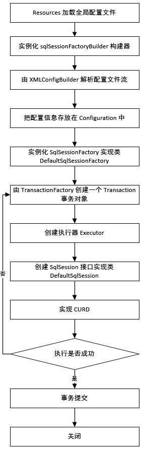

[TOC]

## 一、前言

### （一）MVC 开发模式

作用：视图和逻辑分离 

- Model，模型：实体类和业务和 dao

- view，视图：现在一般使用 .js

- Controller，控制器，现在使用 servlet


### （二）框架概述

- 框架：软件的半成品，为解决问题制定的一套约束，在提供功能基础上进行扩充。
- **框架中一些不能被封装的代码(变量)，需要使用框架者新建一个 XML文件，在文件中添加变量内容**。

  **需要建立特定位置和特定名称的配置文件，同样需要使用 XML 解析和反射技术**。

- MyBatis 是数据访问（DAO）层框架，底层是对 JDBC 的封装。在使用 MyBatis 时不需要编写实现类，只需要写执行的 SQL 语句，全称可以理解为：MyBatis SQL Mapper Framework for Java。


## 二、MyBatis 使用

### （一）环境搭建

- 步骤一：导入 jar

    ```java
    // 基本核心包
    mybatis.jar  // MyBatis 的核心包
    mysql-connector-java.jar   // MySQL 驱动包
    cglib.jar   // 动态代理包    
    asm.jar     // cglib 依赖包
    javassist-GA.jar   // cglib 依赖包（负责字节码解析的包）
        
    // 日志包    
    commons-logging.jar   // 日志包
    log4j.jar  // 日志包
    log4j-api.jar // 日志包
    log4j-core.jar // 日志包
    slf4j-api.jar // 日志包
    slf4j-log4j.jar // 日志包
    ```

- 步骤二：**在 src 下新建全局配置文件**
  - 没有名称和地址要求，示例名称为： mybatis.xml
  - **在全局配置文件中引入 DTD 或 schema**，然后配置 JDBC 的四个变量值。
  
  ```xml
  <?xml version="1.0" encoding="UTF-8"?>
  <!--注意这里是 configuration ，下面为 mybatis-3-config -->
  <!DOCTYPE configuration
    PUBLIC "-//mybatis.org//DTD Config 3.0//EN"
    "http://mybatis.org/dtd/mybatis-3-config.dtd">
    
  <configuration>
    <!-- default 为引用 environment 的 id，即当前所使用的环境 -->
    <environments default="default">
    	<!-- 声明可以使用的环境 -->
    	<environment id="default">
    		<!-- 使用原生 JDBC 事务 -->
    		<transactionManager type="JDBC"></transactionManager>
    		<dataSource type="POOLED">
        		  <property name="driver" value="com.mysql.cj.jdbc.Driver"/>
        	      <property name="url" value="jdbc:mysql://localhost:3306/数据库名"/>
        		  <property name="username" value="root"/>
        	      <property name="password" value="GJXAIOU"/>
    		</dataSource>
    	</environment>
    </environments>
    
    <mappers>
        <!-- 配置实体类 Mapper 文件，一般使用 package -->
    	<mapper resource="com/gjxaiou/mapper/FlowerMapper.xml"/>
    </mappers>
  </configuration>
  ```
  
  **全局配置文件中内容**
  
  - `<transactionManager/>` 中的 `type`属性可取值如下：
      - JDBC：事务管理使用 JDBC 原生事务管理方式；
      - MANAGED：把事务管理转交给其他容器，相当于设置原生 JDBC 事务`setAutoMapping(false)`；
  - `<dataSouce/>`中的 `type` 属性可取值如下：
      - POOLED：使用数据库连接池；
      - UNPOOLED：不使用数据库连接池，和直接使用 JDBC 一样；
      - JNDI：是 Java 命名目录接口技术；
  
  **注：** mybatis.xml 中的 `<mappers>`中配置的 resource 是整个项目中的所有其他 `实体类Mapper.xml` 文件；
  
  mappers 标签下有许多 mapper 标签，每一个 mapper 标签中配置的都是一个独立的映射配置文件的路径，配置方式有以下几种。
  
  - 第一种：使用**相对路径**进行配置。
  
      ```xml
      <mappers>
          <mapper resource="org/mybatis/mappers/UserMapper.xml"/>
          <mapper resource="org/mybatis/mappers/ProductMapper.xml"/>
      </mappers>
      ```
  
  - 第二种：使用**绝对路径**进行配置。
  
      ```xml
      <mappers>
          <mapper url="file:///var/mappers/UserMapper.xml"/>
          <mapper url="file:///var/mappers/ProductMapper.xml"/>
      </mappers>
      ```
  
  - 第三种：使用**接口信息**进行配置。
  
      ```xml
      <mappers>
          <mapper class="org.mybatis.mappers.UserMapper"/>
          <mapper class="org.mybatis.mappers.ProductMapper"/>
      </mappers>
      ```
  
  - 第四种：使用接口所在包进行配置。
  
      ```xml
      <mappers>
          <package name="org.mybatis.mappers"/>
      </mappers>
      ```
  
- 步骤三：新建以 mapper 结尾的包，在包下新建：`实体类名+Mapper.xml`

  该 XML 文件中编写需要执行的 SQL 命令，可以将其理解为 Mapper 接口的实现类。
  FlowerMapper.xml 文件内容为：【**注意抬头中的信息不同，将上面抬头中的 config 全部换为 mapper**】

  ```xml
  <?xml version="1.0" encoding="UTF-8"?>
  <!DOCTYPE mapper
    PUBLIC "-//mybatis.org//DTD Mapper 3.0//EN"
    "http://mybatis.org/dtd/mybatis-3-mapper.dtd">
  <!-- namespace:理解成实现类的全路径(包名+类名)，用于绑定 Dao 接口（即面向接口编程），使用 namespace 之后就不用写实现类，业务逻辑会直接通过这个绑定寻找到对应点的 SQL 语句进行对应的数据处理 -->
  <mapper namespace="a.b" >
  	<!-- 如果方法返回值是 list，在 resultType 中写 List 的泛型，因为 mybatis
  		对 jdbc 封装，一行一行读取数据-->
  	<!--id:表示方法名; parameterType:定义参数类型;resultType:返回值类型 -->
  	<select id="selAll" resultType="com.gjxaiou.pojo.Flower">
  		select * from flower
  	</select>
  </mapper>
  ```

- 步骤四：测试结果(只有在单独使用 mybatis 时使用，最后 ssm 整合时下面代码不需要编写)

    ```java
    import com.gjxaiou.pojo.Flower;
    
    public class Test {
    	public static void main(String[] args) throws IOException {
    		InputStream is = Resources.getResourceAsStream("mybatis.xml");
    		// 使用工厂设计模式
    		SqlSessionFactory factory = new SqlSessionFactoryBuilder().build(is);
    		// 生产 SqlSession
    		SqlSession session=factory.openSession();
    		
    		List<Flower> list = session.selectList("a.b.selAll");
    		for (Flower flower : list) {
    			System.out.println(flower.toString());
    		}
    		
    		session.close();
    	}
    }
    ```

## 四、数据库连接池

即在内存中开辟一块空间，数据库连接池中有很多连接，他们可能处于 Active 或者 Idle 等状态；
- 活跃状态（active）：当前连接对象被应用程序使用中
- 空闲状态（Idle）：等待应用程序使用

**实现 JDBC tomcat Pool 的步骤**

JDBC Tomcat Pool，直接由 tomcat 产生数据库连接池； 

- 在 web 项目的 META-INF 中存放 context.xml，在 context.xml 编写数据库连接池相关属性
- 把项目发布到 tomcat 中，则数据库连接池产生了

```xml
<?xml version="1.0" encoding="UTF-8"?>
<Context>
	<Resource
		driverClassName="com.mysql.jdbc.Driver"
		url="jdbc:mysql://localhost:3306/lianxi"
		username="root"
		password="gjxaiou"
		maxActive="50"
		maxIdle="20"
		name="test"
		auth="Container"
		maxWait="10000"
		type="javax.sql.DataSource"
	/>
</Context>
```

 - 可以在 Java 中使用 JNDI 获取数据库连接池中对象
  - Context:上下文接口.context.xml 文件对象类型；代码见下面
  - 当关闭连接对象时，把连接对象归还给数据库连接池，把状态改变成 Idle

```java
@WebServlet("/pool")
public class DemoServlet extends HttpServlet {
	@Override
	protected void service(HttpServletRequest req, HttpServletResponse res) throws ServletException, IOException {
  	  try {
  		Context cxt = new InitialContext();
  		DataSource ds = (DataSource) cxt.lookup("java:comp/env/test");
  		Connection conn = ds.getConnection();
  		PreparedStatement ps = conn.prepareStatement("select * from flower");
  		ResultSet rs = ps.executeQuery();
  		res.setContentType("text/html;charset=utf-8");
  		PrintWriter out = res.getWriter();
  		while(rs.next()){
  			out.print(rs.getInt(1)+"&nbsp;&nbsp;&nbsp;&nbsp;"+rs.getString(2)+"<br/>");
  		}
  		out.flush();
  		out.close();
  		rs.close();
  	} catch (NamingException e) {
  		e.printStackTrace();
  	} catch (SQLException e) {
  		e.printStackTrace();
  	}
  }
}
```


## 五、三种查询方式

- `selectList()`  返回值为 `List<resultType  属性控制>`
适用于查询结果都需要遍历的需求

- `selectOne()` 返回值 `Object`
适用于返回结果只是变量或一行数据时

- `selectMap()` 返回值 `Map<key，resultType  属性控制>`
  适用于需要在查询结果中通过某列的值取到这行数据的需求
```java
public class Test {
	public static void main(String[] args) throws IOException {
        /** MyBatis 默认不加载配置文件，因此需要先加载配置文件，返回整个配置文件的流对象；
        * 在数据访问层处理异常和在控制器中处理异常，一般在 service 中只抛出异常；
        */
		InputStream is = Resources.getResourceAsStream("mybatis.xml");
		// 使用工厂设计模式
		// 前面是工厂  实例化工厂对象时使用的是构建者设计模式   它的名称标志:后面有Builder 
		// 构建者设计模式意义: 简化对象实例化过程
		SqlSessionFactory factory = new SqlSessionFactoryBuilder().build(is);
		// 生产 SqlSession, 整个 sqlsession 就是 MyBatis 中 API 封装的对象，增删改查都在里面
		SqlSession session=factory.openSession();
		
		// selectList
		List<Flower> list = session.selectList("a.b.selAll");
		for (Flower flower : list) {
			System.out.println(flower.toString());
		}
		
		// selectOne
		int count = session.selectOne("a.b.selById");
		System.out.println(count);
		
		// selectMap
		// 把数据库中哪个列的值当作 map 的 key
		Map<Object, Object> map = session.selectMap("a.b.c", "name123");
		System.out.println(map);
		
		session.close();
	}
}
```

对应的 实体类 Mapper.xml 文件
```xml
<?xml version="1.0" encoding="UTF-8"?>
<!DOCTYPE mapper
  PUBLIC "-//mybatis.org//DTD Mapper 3.0//EN"
  "http://mybatis.org/dtd/mybatis-3-mapper.dtd">
  
<mapper namespace="a.b" >
	<select id="selAll" resultType="com.gjxaiou.pojo.Flower">
		select id,name name123,price,production from flower
	</select>
	
	// 这里的 int 相当于 Ingeter
	<select id="selById" resultType="int">
		select count(*) from flower
	</select>
	
	<select id="c" resultType="com.gjxaiou.pojo.Flower">
		select id,name name123,price,production from flower
	</select>
	
</mapper>
```


## 七、`<settings>`标签

在 mybatis 全局配置文件中通过 `<settings>` 标签控制 MyBatis 全局开关，**该标签必须位于所有配置的最前面**。

- 在 MyBatis 全局配置文件中开启 log4j 命令如下：

  前提是必须保证有 log4j.jar，且在 src 下有 log4j.properties

  ```xml
  <settings>
      <setting  name="logImpl"  value="LOG4J"/>
  </settings>
  ```

- log4j 中可以输出指定内容的日志(控制某个局部内容的日志级别) ：直接在 log4j.properties 中设置；
    -  命名级别(包级别): `<mapper>namespace 属性中除了最后一个类名`
      例如 `namespace=”com.gjxaiou.mapper.PeopleMapper”` 其中包级别为 `com.gjxaiou.mapper` ，需要在 `log4j.propeties` 中做两件事情  
      - 先在总体级别调成 Error，这样可以不输出无用信息
      -  在设置某个指定位置级别为 DEBUG
      
      ```properties
      ## -----log4j.properties--------
      log4j.rootCategory=ERROR
      log4j.logger.com.gjxaiou.mapper=DEBUG   ## 只有这个包输出是 Debug 级别，其它都是 Error 级别
      ```
      
    - 类级别

      namespace 属性值 ，相当于 namespace 类名

    - 方法级别

      使用 namespace 属性值+标签 id 属性值

## 八、 parameterType 属性

**传递多个参数时候，可以使用对象或者 map**。

- 在 XXXMapper.xml  中`<select>` `<delete>`等标签的 `parameterType` 可以控制参数类型。

- **SqlSession 的 `selectList()` 和 `selectOne()` 的第二个参数和 `selectMap()` 的第三个参数都表示方法的参数** 。

  ```java
  // 示例代码
  People  p  =  session.selectOne("a.b.selById",1);
  System.out.println(p);
  ```

  在实例名Mapper.xml  中可以通过`#{}`获取参数

  - `#{}`  获取参数内容
    
    - 使用索引：其中 `#{0}` 和 `#{param1}`都表示第一个参数（不推荐）。
    - 如果**只有一个参数（其参数应该是基本数据类型或 String）**，MyBatis 对 `#{}` 里面内容没有要求只要写内容即可。
    - 如果参数是对象：使用`#{属性名}` 获取属性值；
    -  如果参数是 Map 类型，使用`#{key}`获取对应值；
    
    ```xml
    <select id="selById"
      resultType="com.gjxaiou.pojo.People"  parameterType="int">
      select * from people where id=#{0}
    </select>
    ```

- `#{}` 和 `${}` 的区别

  - `#{}` 获取参数的内容，支持索引获取，或者使用 param1 获取指定位置参数，并且 SQL 使用 `?` 占位符
  - `${}` 字符串拼接，不使用?，默认找`${内容}`内容的 get/set 方法，如果写数字，就是一个数字

  ```xml
  <!------PeopleMapper.xml----->
  <select id="test" resultType="com.gjxaiou.pojo.People" parameterType="com.gjxaiou.pojo.People"> 
    select * from people where id =  ${id}
  </select>
  ```

  ```java
  // --------Test.java--------
  People peo =new People();
  peo.setId(1);
  People p = session.selectOne("a.b.selById",people);
  ```

- 如果在 XML 文件中出现`<`、`>`  或者 `""` 等特殊字符时可以使用 XML 自身的文件转义标签，格式为：`<![CDATA[ 内 容 ]]>`

## 九、MyBatis 中实现 MySQL 分页

原则上：不允许在关键字前后进行数学运算，需要在代码中计算完成后传递到 mapper.xml  中；

- Java 中代码为：

    ```java
    // 显示几个
    int pageSize = 2;
    // 第几页
    int pageIndex = 2;
    // 如果希望传递多个参数，可以使用对象或 map
    Map<String,Object> map = new HashMap<>();
    map.put("pageSize", pageSize);
    map.put("pageStart", pageSize*(pageIndex - 1));
    List<People> p = session.selectList("a.b.page",map);
    ```

- mapper.xml 中代码为：

    ```xml
    <select id="page" resultType="com.gjxaiou.pojo.People" parameterType="map">
        select * from people limit #{pageStart},#{pageSize}
    </select>
    ```

## 十、typeAliases 别名

**别名配置必须在 `<environments>`标签的前面**，分为系统内置别名、给某个类的别名、给某个包下所有类的别名。

- 系统内置别名：就是把类型全小写

- 给某个类起别名

    ```xml
    <!--在 MyBatis 配置文件 mybatis.xml 中使用 alias="XXX" 进行自定义-->
    <typeAliases>
        <typeAlias type="com.gjxaiou.pojo.People" alias="peo"/>
    </typeAliases>
    
    
    <!--在各个 mapper.xml 中可以引用，这里就是使用 peo 引用 People 类-->
    <select id="page" resultType="peo" parameterType="map">
        select * from people limit #{pageStart},#{pageSize}
    </select>
    ```

- 直接给某个包下所有类起别名，别名为类名，区分大小写

  ```xml
  <!--首先在 mybatis.xml 中进行配置-->
  <typeAliases>
      <package name="com.gjxaiou.pojo" />
  </typeAliases>
      
  <!--在各个 mapper.xml 中进行引用-->    
  <select id="page" resultType="People" parameterType="map">
      select * from people limit #{pageStart},#{pageSize}
  </select>    
  ```

## 十一、MyBatis 实现新增/修改/删除

- **MyBatis 中默认是关闭了 JDBC 的自动提交功能**，因此每一个 SqlSession 默认都是不自动提交事务。

  可以使用 `session.commit()` 提交事务，也可以使用 `openSession(true);` 自动提交底层为：`.setAutoCommit(true);`
- MyBatis 底层是对 JDBC 的封装

  JDBC 中 `executeUpdate()` 执行新增，删除，修改 SQL，方法的返回值 int，表示受影响的行数。**因此 MyBatis 中 `<insert> <delete> <update>` 标签没有 resultType 属性，认为返回值都是 int**。

- 在 `openSession()` 时 Mybatis 会创建 SqlSession 时同时创建一个 Transaction(事务对象)，同时 autoCommit 都为 false
- 如果出现异常，应该使用 `session.rollback()` 回滚事务.
### （一）实现新增的步骤

- 在 mapper.xml  中提供 `<insert>` 标签，标签没有返回值类型
- 通过 `session.insert()` 调用新增方法

```xml
<insert id="ins" parameterType="People">
    insert into people values(default,#{name},#{age})
</insert>
```

```java
int index1 = session.insert("a.b.ins", p);
if(index1>0){
   System.out.println("成功");
}else{
  System.out.println("失败");
}
```


### （二）实现修改的步骤

- 在 mapper.xml 中提供 `<update>` 标签
```java
<update id="upd" parameterType="People">
  update people set name = #{name} where id = #{id}
</update>
```
- 编写代码
```java
People peo = new People();
peo.setId(3);
peo.setName("王五");
int index = session.update("a.b.upd", peo);
if(index>0){
System.out.println("成功");
}else{
System.out.println("失败");
}
session.commit();
```


###  （三）实现删除步骤

- 在 mapper.xml  提供`<delete>` 标签
```xml
<delete id="del" parameterType="int">
    delete from people where id = #{0}
</delete>
```

- 编写代码
```java
 int  del  =  session.delete("a.b.del",3);

if(del>0){
   System.out.println("成功");
}else{
   System.out.println("失败");
}

session.commit();
```

## 十二、MyBatis 接口绑定方案及多参数传递

### （一）接口绑定

实现创建一个接口后把 mapper.xml  由 mybatis 生成接口的实现类，**通过调用接口对象就可以获取 mapper.xml 中编写的 SQL**。

**常用实现步骤**:

- 步骤一：创建一个接口 ：例如：`LogMapper`

    - **接口 Mapper 名和接口名与 mapper.xml  中`<mapper>`namespace 相同**
        目录示例：`com.gjxaiou.mapper`包下面包含一个接口：`LogMapper` 和 `LogMapper.xml`，然后 `LogMapper.xml` 中的`<mapper>`namespace 标签格式为：

        ```xml
        <mapper namespace = "com.gjxaiou.mapper.LogMapper">   
                             
        </mapper>
        ```

    - **接口中方法名和对应 mapper.xml  标签的 id 属性相同；**

- 在 MyBatis 全局配置文件中使用`<package>`进行扫描接口和接口对应的 mapper.xml。

**示例实现步骤**:

- 首先在全局配置文件 mybatis.xml 中的`<mappers>`下使用`<package>`

    ```xml
    <mappers>
         <package name="com.gjxaiou.mapper"/>
    </mappers>
    ```

- 然后在 `com.gjxaiou.mapper` 包下新建接口：`LogMapper`

    ```java
    public  interface  LogMapper  { 
        List<Log>  selAll();
    }
    ```

- 然后在 `com.gjxaiou.mapper` 中新建一个 `LogMapper.xml`
    其中 namespace 的值必须和接口全限定路径「包名 + 类名」一致，且使用的 id 值必须和接口中方法名相同。**同时如果接口中方法为多个参数,可以省略 parameterType**

    ```xml
    <mapper  namespace="com.gjxaiou.mapper.LogMapper">
      <select  id="selAll"  resultType="log"> 
          select  *  from  log
      </select>
    </mapper>
    ```

**绑定的使用：在其它 Java 类中**

```java
public class Test {
    public static void main(String[] args) throws IOException {
        InputStream is = Resources.getResourceAsStream("mybatis.xml");
        SqlSessionFactory factory = new SqlSessionFactoryBuilder().build(is);
        SqlSession session = factory.openSession();		

        LogMapper logMapper = session.getMapper(LogMapper.class);
        List<Log> list = logMapper.selAll();
        for (Log log : list) {
            System.out.println(log);
        }
    }
}
```

### （二）多参数实现方法

- 方法一：xml 中直接引用
    首先在在接口 `LogMapper` 中声明方法`List<Log> selByAccInAccout(String accin, String accout);`
    然后在 LogMapper.xml  中添加即可，`#{}`中可以使用 param1,param2
    
    ```xml
    <select id="selByAccInAccout" resultType="log">
         select * from log where accin=#{param1} and accout=#{param2}
    </select>
    ```
    
- 方法二：使用注解方式
    首先在接口中声明方法 

    ```java
    /**
     mybatis 把参数转换为 map 了,其中@Param("key")  参数内容就是 map 的 value
    */
    List<Log> selByAccInAccout(@Param("accin")  String accin123,@Param("accout")  String  accout335);
    ```

    然后在 mapper.xml  中添加

    ```xml
    <!-- 当多参数时,不需要写 parameterType -->
    <!-- #{} 里面写 @Param(“内容”) 参数中内容 -->
    <select  id="selByAccInAccout"  resultType="log"  > 
        SELECT * FROM log WHERE accin=#{accin} AND accout=#{accout}
    </select>
    ```

    **多参数的使用**
    当然 log 是存在数据库中的一个表中，同时要新建实体类的；
    
    ```java
    public class Test {
       public static void main(String[] args) throws IOException {
          InputStream is = Resources.getResourceAsStream("mybatis.xml");
          SqlSessionFactory factory = new SqlSessionFactoryBuilder().build(is);
          SqlSession session = factory.openSession();
    
          LogMapper logMapper = session.getMapper(LogMapper.class);
          List<Log> list = logMapper.selByAccInAccout("3", "1");
          for (Log log : list) {
              System.out.println(log);
          }
    
          session.close();
          System.out.println("程序执行结束");
        }
    }
    ```

## 十三、动态 SQL

动态 SQL：根据不同的条件需要执行不同的 SQL 命令，MyBatis 中动态 SQL 的实现是在 `实体类mapper.xml`  中添加逻辑判断即可。

### （一）if 使用

```xml
<select  id="selByAccinAccout"  resultType="log"> 
      select  *  from  log  where  1=1
<!--OGNL 表达式,直接写 key 或对象的属性，无需添加任何特殊符号，这里 and 执行的时候都会被转换为 & -->
      <if  test = "accin != null and accin != ''"> 
          and  accin = #{accin}
      </if>

      <if  test= "accout != null and accout != ''"> 
          and  accout=#{accout}
      </if>
</select>
```

### （二）where 使用

- 当编写 where 标签时，如果内容中第一个是 and 就会去掉第一个 and；
- 如果 `<where>` 中有内容会生成 where 关键字，如果没有内容不生成 where 关键字；

- 使用示例 ：效果：比直接使用 `<if>` 少写了  where 1 = 1;

```xml
<select  id="selByAccinAccout"  resultType="log"> 
    SELECT  *  FROM  log
  <where>
     <if  test="accin!=null  and  accin!=''"> 
         and  accin=#{accin}
     </if>
  
     <if  test="accout!=null  and  accout!=''"> 
         and  accout=#{accout}
     </if>
  </where>
</select>
```


### （三）choose、when、otherwise 使用

- **只要有一个成立，其他都不执行；**

- 代码示例
    如果 accin 和 accout 都不是 null 或不是””生成的 sql 中只有 where  accin=?

```xml
<select  id = "selByAccinAccout"  resultType = "log"> 
     select * from log
     <where>
        <choose>
            <when test = "accin != null and accin != ''">
                   and accin = #{accin}
            </when>

            <when test = "accout != null and accout != ''"> 
                   and accout = #{accout}
            </when>
       </choose>
    </where>
</select>
```

###  （四）set 使用

- 作用：去掉最后一个逗号
    `<set>`用在修改 SQL 中 set 从句，如果`<set>`里面有内容则生成 set 关键字，没有就不生成

- 示例
    其中：`id=#{id}` 目的防止`<set>`中没有内容，mybatis 不生成 set 关键字，如果修改中没有 set 从句 SQL 语法错误。

```xml
<update  id="upd"  parameterType="log"  > 
    update  log
    <set>
        id=#{id},
        <if  test="accIn!=null  and  accIn!=''"> 
            accin=#{accIn},
        </if>

        <if  test="accOut!=null  and  accOut!=''">
             accout=#{accOut},
        </if>
    </set>
    where id=#{id}
</update>
```

### （四） Trim 使用

里面的主要方法如下：

-  prefix：在前面添加内容
-  prefixOverrides：去掉前面内容
-  suffix：在后面添加内容
-  suffixOverrieds：去掉后面内容

-  执行顺序：首先去掉内容然后添加内容；

```xml
<update  id = "upd"  parameterType = "log"> 
    update  log
    <trim prefix = "set" suffixOverrides = ","> 
        a = a,
    </trim> 
    where  id=100
</update>
```

### （五）bind 使用

用于给参数重新赋值，主要用于以下场景：
-  模糊查询：就是在 SQL 语句中，将用户输入的数据前后加上 `%` 然后执行语句；
-  在原内容前或后添加内容 ：将用户输入的数据进行格式化之后存入数据库；

```xml
<select  id="selByLog"  parameterType="log" resultType="log">
    <bind  name="accin"  value="'%'+accin+'%'"/> 
        #{money}
</select>
```

###  （六）foreach 标签使用

- **用于循环参数内容，还具备在内容的前后添加内容，以及添加分隔符功能**；

- 适用场景：主要用于 `in` 查询以及批量新增中(但是 mybatis 中 foreach  效率比较低)

**批量新增操作：**

- 默认的批量新增的 SQL 语句为：`insert into log  VALUES (default,1,2,3),(default,2,3,4),(default,3,4,5)`

- 在执行批处理的时候，需要将 openSession()必须指定下面命令
    `factory.openSession(ExecutorType.BATCH);`，这里底层 是 JDBC 的 PreparedStatement.addBatch();

- foreach 元素含义：
    - `collection=””`：要遍历的集合
    - `item` ：迭代变量, 可以使用`#{迭代变量名}`获取内容
    - `open`：循环**后**左侧添加的内容
    - `close`：循环**后**右侧添加的内容
    - `separator`：每次循环时，元素之间的分隔符

```xml
<select  id="selIn"  parameterType="list" resultType="log">
    select  *  from  log  where  id  in
    <foreach  collection="list"  item="abc"  open="(" close=")" separator=",">
        #{abc}
     </foreach>
</select>
```

### （七）`<sql>` 和 `<include>` 搭配使用

- **某些 SQL 片段如果希望复用，可以使用 `<sql>` 定义这个片段**；

```xml
<sql  id="mysql"> 
    id,accin,accout,money
</sql>
```

- 可以在 `<select>` 或 `<delete>` 或 `<update>` 或 `<insert>` 中使用 `<include>` 引用

```xml
<select  id="">
    select  <include  refid="mysql"></include>
    from  log
</select>
```


## 十四、缓存

应用程序和数据库交互的过程是一个相对比较耗时的过程；缓存让应用程序减少对数据库的访问，提升程序运行效率；

**MyBatis 中默认开启 SqlSession 缓存**

- 同一个 SqlSession 对象调用同一个 `<select>` 时，只有第一次访问数据库，第一次之后把查询结果缓存到 SqlSession 缓存区(内存)中

- 缓存的是 statement  对象。

    在 MyBatis 中每个 `<select>` 对应一个 statement  对象

- 有效范围必须是同一个 SqlSession 对象

- 缓存流程

    - 步骤一：先去缓存区中找是否存在 statement
    - 步骤二：如果存在返回结果
    - 步骤三：如果没有缓存 statement  对象，去数据库获取数据
    - 步骤四：数据库返回查询结果
    - 步骤五：把查询结果放到对应的缓存区中

- SqlSessionFactory 缓存（二级缓存）
    - 有效范围：同一个 factory 内，哪个 SqlSession 都可以获取
    - **当数据频繁被使用，很少被修改的使用使用二级缓存**；
    - 使用二级缓存步骤
        - 在 mapper.xml  中添加
        - 如果不写 readOnly=”true”需要把实体类序列化；
            `<cache readOnly = "true"></cache>`
    - 当 SqlSession 对象 close()时或 commit() 时会把 SqlSession 缓存的数据刷 (flush) 到 SqlSessionFactory 缓存区中


## 十五、MyBatis 实现多表查询方式

- 方式一：业务装配：对两个表编写单表查询语句，在 service 业务层把查询的两个结果进行关联；
- 方式二：使用 Auto Mapping 特性，在实现两表联合查询时通过别名完成映射；
- 方式三：使用 MyBatis 的 `<resultMap>` 标签进行实现；

在进行多表查询时，类中包含另一个类的对象分为单个对象和集合对象。

## 十六、resultMap 标签

相当于现在直接设置映射关系，进行两者（SQL 查询结果和实体类之间）的匹配。

- `<resultMap>` 标签写在 `实体类Mapper.xml`  中，由程序员控制 SQL 查询结果与实体类的映射关系；

- 默认 MyBatis 使用 `Auto Mapping` 特性进行映射：即保持查询的数据库中的列名和实体类中的属性名相同即可；

- 使用 `<resultMap>`标签时，`<select>`标签不写 resultType  属性，而是使用 resultMap 属性来引用`<resultMap>` 标签。

### （一）使用 resultMap 实现单表映射关系

- 首先进行数据库设计
    示例：数据库表 teacher 中两个字段： id、name

- 然后进行实体类设计

    ```java
    public class Teacher{
       private int id1;
       private String name1;
    }
    ```

- 然后实现 TeacherMapper.xml  代码

    ```xml
    <!-- 其中 type 的值为返回值类型-->
    <resultMap type="com.gjxaiou.Teacher" id="mymap">
        <!-- 主键使用 id 标签配置映射关系-->
        <!-- column 值为数据库中列名； property 值为实体类中的属性名 -->
        <id column="id" property="id1" />
        <!-- 其他列使用 result 标签配置映射关系-->
        <result column="name" property="name1"/>
    </resultMap>
    
    <select id="selAll" resultMap="mymap">
          select * from teacher
    </select>
    ```

    上面代码如果使用原来的数据库中字段的名称和实体类相同的话，代码如下：

    ```xml
    <select id = "selAll" resultType = "teacher">
        select * from teacher
    </select>
    ```


###  （二）使用 resultMap 实现关联单个对象（N + 1 方式）

N+1 查询方式：先查询出某个表的全部信息，根据这个表的信息查询另一个表的信息；

**实现步骤**

- 首先在 Student 实体类中包含了一个 Teacher  对象

```java
public class Student {
    private int id;
    private String name;
    private int age;
    private int tid;
    private Teacher teacher;
    // 该 POJO 类中其他信息省略
}
```

- 然后在 TeacherMapper.xml  中提供一个查询

```xml
<select id="selById" resultType="teacher" parameterType="int">
      select * from teacher where id=#{0}
</select>
```

- 最后在下面的 StudentMapper.xml 中完成装配

- `<association>` 表示当装配一个对象时使用
- `property`: 是对象在类中的属性名
- `select`:通过哪个查询查询出这个对象的信息
- `column`: 把当前表的哪个列的值做为参数传递给另一个查询
- 大前提使用 N+1 方式时：**如果列名和属性名相同可以不配置**,使用 Auto  mapping 特性.但是 mybatis 默认只会给列装配一次

```xml
<resultMap type="student" id="stuMap">
    <id property="id" column="id"/>
    <result property="name" column="name"/>
    <result property="age" column="age"/>
    <result property="tid" column="tid"/>

<!-- 如果关联一个对象，使用 association 标签，调用 teacher 中的查询，如果关联多个对象，使用 collection 标签 -->
// 老师查询中需要一个 Int 类型的参数，这里要通过 column 告诉他传入哪一列的值
    <association property="teacher" select="com.gjxaiou.mapper.TeacherMapper.selById"  column="tid">
    </association>
</resultMap>

<select id="selAll" resultMap="stuMap">
      select * from student
</select>
```


- 因为这里属性名和字段名相同，因此可以把上面代码简化成

```xml
<resultMap type="student" id="stuMap">
    <result column="tid" property="tid"/>
    <!-- 如果关联一个对象-->
    <association property="teacher"
select="com.gjxaiou.mapper.TeacherMapper.selById"
column="tid"></association>
</resultMap>

<select id="selAll" resultMap="stuMap">
      select * from student
</select>
```


###  （三）使用 resultMap 实现关联单个对象(联合查询方式)

- 实现只需要编写一个 SQL,在 StudentMapper.xml 中添加下面效果
    -  `<association/>` 只要装配 一个对象就用这个标签
    -  此时把 `<association/>` 小的 `<resultMap>` 看待
    -  `javaType`  属性: `<association/>` 装配完后返回一个什么类型的对象.取值是一个类(或类的别名)

```xml
<resultMap type="Student" id="stuMap1">
    <id column="sid" property="id"/>
    <result column="sname" property="name"/>
    <result column="age" property="age"/>
    <result column="tid" property="tid"/>
    
    <association property="teacher" javaType="Teacher" >
    <id column="tid" property="id"/>
    <result column="tname" property="name"/>
    </association>
</resultMap>

<select id="selAll1" resultMap="stuMap1">
    select s.id sid,s.name sname,age age,t.id tid,t.name tname FROM student s left outer join teacher t on s.tid=t.id
</select>
```


###  （四）N+1 方式和联合查询方式对比

-  N+1：适用于需求不确定时；
-  联合查询：需求中确定查询时两个表一定都查询；

###  （五）N+1 名称由来

- 举例:学生中有 3 条数据
- 需求:查询所有学生信息及授课老师信息
- 需要执行的 SQL 命令
    - 查询全部学生信息：`select  *  from 学生`
    - 执行 3 遍： `select  *  from 老师 where  id=学生的外键`

- 使用多条 SQL 命令查询两表数据时,如果希望把需要的数据都查询出来,需要执行 N+1 条 SQL 才能把所有数据库查询出来；

- 缺点：效率低
- 优点：如果有的时候不需要查询学生是同时查询老师，只需要执行一个 `select  *  from  student;`

- 适用场景: 有的时候需要查询学生同时查询老师,有的时候只需要查询学生.

- 如果解决 N+1 查询带来的效率低的问题
    - 默认带的前提: 每次都是两个都查询；
    - 使用两表联合查询；

### （六）使用 `<resultMap>` 查询关联集合对象(N+1 方式)

 实现查询老师的时候，把关联的学生也查询出来
以为老师和学生是一对多的关系，因此查询结果是一个集合；

- 首先在 Teacher  实体类中添加 List<Student>

```java
public class Teacher {    private int id;    private String name;    private List<Student> list;    // 省略其他 get、set 方法}
```

- 然后在 StudentMapper.xml  中添加通过 tid 查询

```xml
<select id="selByTid" parameterType="int" resultType="student">      select * from student where tid=#{0}</select>
```


- 然后在 TeacherMapper.xml  中添加查询全部
    其中 `<collection/>` 是当属性是集合类型时使用的标签；

```xml
<resultMap type="teacher" id="mymap">    <id column="id" property="id"/>    <result column="name" property="name"/>    <collection property="list" select="com.gjxaiou.mapper.StudentMapper.selByTid" column="id">    </collection>    </resultMap><select id="selAll" resultMap="mymap">      select * from teacher</select>
```


### （七）使用 `<resultMap>` 实现加载集合数据(联合查询方式)

- 首先在 teacherMapper.xml 中添加
    mybatis 可以通过主键判断对象是否被加载过，因此不需要担心创建重复 Teacher

```xml
<resultMap type="teacher" id="mymap1">    <id column="tid" property="id"/>    <result column="tname" property="name"/>    <collection property="list" ofType="student" >        <id column="sid" property="id"/>        <result column="sname" property="name"/>        <result column="age" property="age"/>        <result column="tid" property="tid"/>    </collection></resultMap><select id="selAll1" resultMap="mymap1">    select t.id tid,t.name tname,s.id sid,s.name sname,age,tid from teacher t LEFT JOIN student s on t.id=s.tid;</select>
```


## 十七、使用 Auto Mapping 结合别名实现多表查询

只能查询对象，查询结合只能使用上面的方法

- 只能使用多表联合查询方式，不能使用 N+1 方式
- 要求：查询出的列名和属性名相同。

**实现方式**

因为`.`在 SQL 是关键字符，因此两侧添加反单引号；

```xml
<select id="selAll" resultType="student">    
    select t.id `teacher.id`, t.name `teacher.name`, s.id id, s.name name, age, tid from student s LEFT JOIN teacher t on t.id=s.tid</select>
```

## 十八、MyBatis 注解

**注解相当于将 「实体类 Mapper.xml」 中的内容直接在对应的接口中实现即可，简化了配置文件。**

- 如果涉及动态 SQL 依然使用 「实体类 Mapper.xml」，而且 mapper.xml  和注解可以共存。

- 使用注解时要在 mybatis.xml 中 `<mappers>` 标签中使用下面两种方式之一进行配置：
    - `<package/>`
    - `<mapper  class=””/>`

可以在测试的时候使用下面：因为是接口：

```java
TeacherMapper  tm = session.getMapper(TeachterMapper.class)List<Teacher> = tm.selAll(info)
```

### 具体的使用方式

下面语句直接在 TeacherMapper.java 接口中书写即可

- 实现查询

```java
@Select("select * from teacher")
List<Teacher> selAll();
```

- 实现新增

```java
@Insert("insert into teacher values(default,#{name})")
int insTeacher(Teacher teacher);
```

- 实现修改

```java
@Update("update teacher set name=#{name} where id=#{id}")
int updTeacher(Teacher teacher);
```

- 实现删除

```java
@Delete("delete from teacher where id=#{0}")
int delById(int id);
```

- 使用注解实现`<resultMap>`功能
    以 N+1 举例
    - 首先在 StudentMapper 接口添加查询

```java
@Select("select * from student where tid=#{0}")
List<Student> selByTid(int tid);
```

-  然后在 TeacherMapper  接口添加下面代码
    -  @Results() 相当于<resultMap>
    -  @Result() 相当于<id/>或<result/>
        -  @Result(id=true) 相当与<id/>
    -  @Many() 相当于<collection/>
    -  @One() 相当于<association/>

```java
@Results(value={
    @Result(id=true,property="id",column="id"),
    @Result(property="name",column="name"),
@Result(property="list",column="id",many=@Many(select="com.gjxaiou.mapper.StudentMapper.selByTid"))
    })
    @Select("select * from teacher")
    List<Teacher> selTeacher();
```


## 十九、运行原理

### （一）MyBatis 运行过程中涉及到的类

- `Resources`： MyBatis 中 IO 流的工具类

    作用是：加载配置文件

- `SqlSessionFactoryBuilder()` ： 构建器

    作用：创建 SqlSessionFactory 接口的实现类

- `XMLConfigBuilder` ： MyBatis 全局配置文件内容构建器类

    作用：负责读取流内容并转换为 JAVA  代码

- `Configuration`： 封装了全局配置文件所有配置信息

    全局配置文件内容存放在 Configuration 中

- `DefaultSqlSessionFactory` ： 是SqlSessionFactory 接口的实现类

- `Transaction` ： 事务类

    每一个 SqlSession 会带有一个 Transaction 对象.

- `TransactionFactory`： 事务工厂

    负责生产 Transaction

- `Executor` ： MyBatis 执行器

    作用是负责执行 SQL 命令，相当于 JDBC 中 statement  对象(或 PreparedStatement 或 CallableStatement），默认的执行器 SimpleExcutor，批量操作使用 BatchExcutor。通过 openSession(参数控制)

- `DefaultSqlSession` ：是 SqlSession 接口的实现类

- `ExceptionFactory` ：  MyBatis 中异常工厂

###  （二）流程图



### （三）文字解释

在 MyBatis 运行开始时需要先通过 Resources 加载全局配置文件，然后实例化 SqlSessionFactoryBuilder 构建器，帮助 SqlSessionFactory 接口实现类 DefaultSqlSessionFactory。

在实例化 DefaultSqlSessionFactory 之前需要先创建 XmlConfigBuilder 解析全局配置文件流，并把解析结果存放在 Configuration 中。之后把 Configuratin 传递给 DefaultSqlSessionFactory。到此 SqlSessionFactory 工厂创建成功.

由 SqlSessionFactory  工厂创建 SqlSession。

每次创建 SqlSession 时，都需要由 TransactionFactory  创建 Transaction 对象，同时还需要创建 SqlSession 的执行器 Excutor，最后实例化 DefaultSqlSession，传递给 SqlSession 接口。

根据项目需求使用 SqlSession 接口中的 API 完成具体的事务操作。如果事务执行失败，需要进行 rollback 回滚事务。

