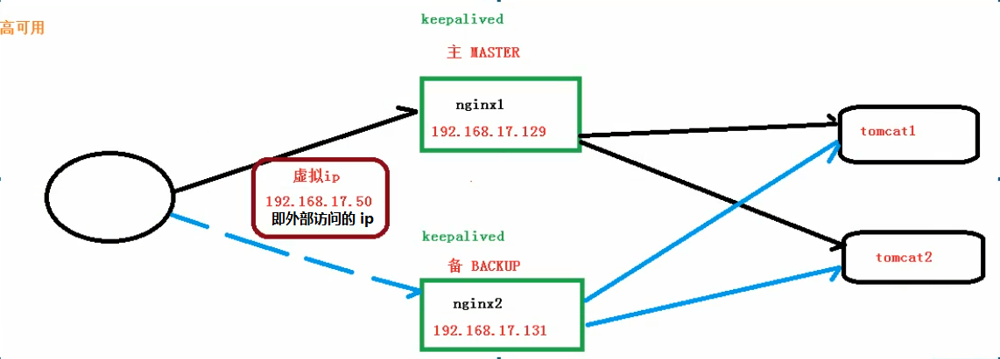

# Nginx笔记

[笔记结构对应的思维导图](https://besterwin.gitee.io/blogs/knowledge/middle/Nginx.html)

[TOC]

## 一、Nginx 简介

#### 1、概念

- Nginx ("engine x")是一个**高性能的 HTTP 和 反向代理 服务器**，特点是占有内存少，并发能力强。
- Nginx 专为性能优化而开发，性能是其最重要的考量，实现上非常注重效率，能经受高负载的考验，有报告表明能支持高达50000个并发连接数。

- Nginx 可以作为静态页面的 web 服务器，但是不支持 java  Java程序只能通过与  tomcat 配合完成。 

具体的介绍和优缺点 [请点击这里](https://www.lnmp.org/nginx.html)

#### 2、反向代理

**a. 正向代理**
需要在客户端(浏览器)配置代理服务器，然后通过代理服务器进行互联网访问


**b. 反向代理**
反向代理：客户端对代理是无感知的，因为**客户端不需要任何配置就可以访问**，我们只需要将请求发送到反向代理服务器，由反向代理服务器去选择目标服务器获取数据后,在返回给客户端，此时反向代理服务器和目标服务器对外就是一个服务器，暴露的是代理服务器地址，隐藏了真实服务器IP地址。


#### 3、负载均衡

通过增加服务器的数量，然后将请求分发到各个服务器上,将原先请求集中到单个服务器上的情况改为将请求分发到多个服务器上,将负载分发到不同的服务器，也就是我们所说的负载均衡


#### 4、动静分离

为了加快网站的解析速度，可以**把动态页面和静态页面由不同的服务器来解析**，加快解析速度。降低原来单个服务器的压力。


## 一、安装 Nginx

### （一）Docker 安装

```shell
# 搜索 Nginx 镜像
docker search nginx
# 拉取最新的镜像
docker pull nginx:latest
# 查看本地镜像
docker images
# 运行容器
# --name 自定义容器名称  -p 端口映射（本地 8080 映射到容器中的 80 端口）  -d 表示一直在后台运行  
docker run --name my_nginx -p 80:80 -d nginx
```

### （二）普通安装方式

```shell
#  联网下载 pcre 压缩文件依赖
wget http://downloads.sourceforge.net/project/pcre/pcre/8.37/pcre-8.37.tar.gz
# 解压压缩文件
tar –xvf pcre-8.37.tar.gz
# 进入解压之后的 ./configure 目录，然后回到 pcre 目录下执行 make，最后执行 make install
# 查看 pcre 依赖是否安装成功
pcre-config --version
# 安装 openssl 、zlib 、 gcc 依赖
yum -y install make zlib zlib-devel gcc-c++ libtool openssl openssl-devel

# 安装 Nginx，首先还是像上面一样下载解压，然后进入 ./configure 目录执行 make 和 make install
./configure
make && make install
# 进入目录 /usr/local/nginx/sbin/nginx 启动服务

# 关闭防火墙&&防火墙自启
systemctl stop firewalld && systemctl disable firewalld
# 安装Iptables管理工具&&启动Iptables&&设为Iptables开机自启&&清空Iptables规则&&保存Iptables默认规则
yum -y install iptables-services && systemctl start iptables && systemctl enable iptables&& iptables -F && service iptables save 

# 查看开放的端口
firewall-cmd --list-all
# 设置开放的端口号
firewall-cmd --add-service=http –permanent
firewall-cmd --add-port=80/tcp --permanent
# 设置之后需要重启防火墙
firewall-cmd --reload
```

### （三）测试方式

访问：`http://192.168.238.151:80` 或者 `http://192.168.238.151` 。如果看到 Nginx 的欢迎页面就 OK 了。


## 二、Nginx 常用命令

#### 使用 Docker 命令

https://juejin.cn/post/6844903841951907847

首先启动 docker 中的 Nginx。

```shell
# 看 docker 中的镜像
docker ps
# 进入对应的容器
docker exec -it 容器id bash
```

镜像中的 Nginx 的配置文件路径：

```shell
# 镜像中nginx.conf配置文件路径
/etc/nginx/nginx.conf
# default.conf配置文件的路径
/etc/nginx/conf.d/default.conf
# 默认首页文件夹html路径
/usr/share/nginx/html
# 日志文件路径
/var/log/nginx
```

使用 `exit` 退回到宿主机，这里的文件夹为：`/home/GJXAIOU/Docker/Nginx`

在该目录下批量新建挂载使用的文件夹：`mkdir -p {conf,conf.d,html,logs}`

然后将容器中的文件复制到主机中：

`docker cp 容器id:/etc/nginx/nginx.conf  conf/nginx.conf`

`docker cp 容器id:/etc/nginx/conf.d/default.conf  conf.d/default.conf`

然后关闭容器之后重新启动（也可以删除），需要使用 `-v` 进行挂载

`docker run --name mynginx -d -p 80:80 -v /nginx/html:/home/GJXAIOU/Docker/Nginx/html -v /nginx/conf/nginx.conf:/home/GJXAIOU/Docker/Nginx/conf/nginx.conf -v /nginx/conf.d/default.conf:/home/GJXAIOU/Docker/Nginx/conf.d/default.conf -v /nginx/logs:/home/GJXAIOU/Docker/Nginx/logs/nginx nginx`


#### 普通方法看配置文件

首先进入 nginx 目录中: `cd /usr/local/nginx/sbin`

- 查看 nginx 版本号：`./nginx -v`

- 启动 nginx：`./nginx`

- 查看是否启动成功：`ps -ef|grep nginx`


- 停止 nginx：`./nginx -s stop`

- 重新加载 nginx：`./nginx -s reload`

## 三、nginx.conf 配置文件

配置文件的位置：`vim /usr/local/nginx/conf/nginx.conf`，配置文件中的内容共包含三部分

- **全局块**：配置服务器整体运行的配置指令

    从配置文件开始到 events 块之间的内容，主要会设置一些影响 nginx 服务器整体运行的配置指令，主要包括配置运行 Nginx 服务器的用户（组）、允许生成的 worker process 数，进程 PID 存放路径、日志存放路径和类型以及配置文件的引入等。firewall-cmd --reload

    ```shell
    #user  nobody;
    # 这是 Nginx 服务器并发处理服务的关键配置，worker_processes 值越大，可以支持的并发处理量也越多，但是会受到硬件、软件等设备的制约
    worker_processes  1;
    
    #error_log  logs/error.log;
    #error_log  logs/error.log  notice;
    #error_log  logs/error.log  info;
    
    #pid        logs/nginx.pid;
    ```

- **events 块**：影响 Nginx 服务器与用户的网络连接

    events 块涉及的指令**主要影响 Nginx 服务器与用户的网络连接**，常用的设置包括是否开启对多 work process 下的网络连接进行序列化，是否允许同时接收多个网络连接，选取哪种事件驱动模型来处理连接请求，每个 word process 可以同时支持的最大连接数等。

    ```shell
    events {
        # 表示每个 worker_processes 支持的最大连接数是 1024.这部分的配置对 Nginx 的性能影响较大，在实际中应该灵活配置。
        worker_connections  1024;
    }
    ```

- **Http 块**

    是 Nginx 服务器配置中最频繁的部分，代理、缓存和日志定义等绝大多数功能和第三方模块的配置都在这里。需要注意的是：http 块也可以包括 http 全局块、server 块。

    ```shell
    http {
        include       mime.types;
        default_type  application/octet-stream;
    
        #log_format  main  '$remote_addr - $remote_user [$time_local] "$request" '
        #                  '$status $body_bytes_sent "$http_referer" '
        #                  '"$http_user_agent" "$http_x_forwarded_for"';
    
        #access_log  logs/access.log  main;
    
        sendfile        on;
        #tcp_nopush     on;
        #keepalive_timeout  0;
        keepalive_timeout  65;
        #gzip  on;
    
        server {
            listen       80;
            server_name  localhost;
    
            #charset koi8-r;
            #access_log  logs/host.access.log  main;
    
            location / {
                root   html;
                index  index.html index.htm;
            }
    
            #error_page  404              /404.html;
            # redirect server error pages to the static page /50x.html
            #
            error_page   500 502 503 504  /50x.html;
            location = /50x.html {
                root   html;
            }
        }
    }
    ```

    - http 全局块

        http 全局块配置的指令包括文件引入、MIME-TYPE 定义、日志自定义、连接超时时间、单链接请求数上限等。

         ```shell
         include       mime.types;
            default_type  application/octet-stream;
        
            #log_format  main  '$remote_addr - $remote_user [$time_local] "$request" '
            #                  '$status $body_bytes_sent "$http_referer" '
            #                  '"$http_user_agent" "$http_x_forwarded_for"';
        
            #access_log  logs/access.log  main;
        
            sendfile        on;
            #tcp_nopush     on;
        
            #keepalive_timeout  0;
            keepalive_timeout  65;
        
            #gzip  on;
         ```

    - server 块

        这块和虚拟主机有密切关系，虚拟主机从用户角度看，和一台独立的硬件主机是完全一样的，该技术的产生是为了节省互联网服务器硬件成本。

        每个 http 块可以包括多个 server 块，而每个 server 块就相当于一个虚拟主机。

        而每个 server 块也分为全局 server 块，以及可以同时包含多个 locaton 块。

         ```shell
         server {
                # Nginx 目前监听的端口号为 80
                listen       80;
                # 主机名称
                server_name  localhost;
        
                #charset koi8-r;
        
                #access_log  logs/host.access.log  main;
        
                location / {
                    root   html;
                    index  index.html index.htm;
                }
        
                #error_page  404              /404.html;
        
                # redirect server error pages to the static page /50x.html
                #
                error_page   500 502 503 504  /50x.html;
                location = /50x.html {
                    root   html;
                }
        
                # proxy the PHP scripts to Apache listening on 127.0.0.1:80
                #
                #location ~ \.php$ {
                #    proxy_pass   http://127.0.0.1;
                #}
        
                # pass the PHP scripts to FastCGI server listening on 127.0.0.1:9000
                #
                #location ~ \.php$ {
                #    root           html;
                #    fastcgi_pass   127.0.0.1:9000;
                #    fastcgi_index  index.php;
                #    fastcgi_param  SCRIPT_FILENAME  /scripts$fastcgi_script_name;
                #    include        fastcgi_params;
                #}
        
                # deny access to .htaccess files, if Apache's document root
                # concurs with nginx's one
                #
                #location ~ /\.ht {
                #    deny  all;
                #}
            }
         ```

        其中如上所示，Server 块分为全局 server 块和 location 块

        - 全局 server 块

            最常见的配置是本虚拟机主机的监听配置和本虚拟主机的名称或 IP 配置。

        - location 块

            一个 server 块可以配置多个 location 块。

            这块的主要作用是基于 Nginx 服务器接收到的请求字符串（例如 server_name/uri-string），对虚拟主机名称（也可以是 IP 别名）之外的字符串（例如 前面的 /uri-string）进行匹配，对特定的请求进行处理。地址定向、数据缓存和应答控制等功能，还有许多第三方模块的配置也在这里进行。

## 四、Nginx 反向代理实例 

### 1、实现效果

打开浏览器，在浏览器地址栏输入地址 www.123.com，跳转到 liunx 系统 tomcat 主页面中

### 2、准备工作

- 在 liunx 系统安装 tomcat，使用默认端口 8080

    - tomcat 安装文件放到 liunx 系统中，解压

    - 进入 tomcat 的 bin 目录中，./startup.sh 启动 tomcat 服务器

- 对外开放访问的端口

`firewall-cmd --add-port=8080/tcp --permanent`

`firewall-cmd –reload`

查看已经开放的端口号

`firewall-cmd --list-all`

- 在 windows 系统中通过浏览器访问 tomcat 服务器

### 3、访问过程的分析

 

### 4、具体配置

第一步 在 windows 系统的 host 文件进行域名和 ip 对应关系的配置，文件位置为：`c://Windows/System32/drivers/etc/HOSTS`

在 host 文件中添加如下记录：`192.168.238.151 www.123.com` 。

第二步 在 nginx 进行请求转发的配置（反向代理配置）

即如果访问 `192.168.238.151:80` 会转发到 `http://127.0.0.1:8080`

```shell
server{
	listen        80;
	server_name   192.168.238.151;

	location / {
		root         html;
		proxy_pass   http://127.0.0.1:8080;
		index        index.html  index.htm;
	}
}
```

### 5、最终测试

 


## 五、Nginx 反向代理实例 2

### 1、实现效果

使用 nginx 反向代理，根据访问的路径跳转到不同端口的服务中

nginx 监听端口为 9001，

访问 `http://192.168.17.129:9001/edu/` 直接跳转到 `127.0.0.1:8080`

访问`http:// 192.168.17.129:9001/vod/` 直接跳转到 `127.0.0.1:8081`

### 2、准备工作

（1）准备两个 tomcat 服务器，一个 8080 端口，一个 8081 端口，需要修改配置文件进行修改

（2）创建文件夹和测试页面

分别在 8080 的 tomcat 的服务器和 8081 的服务器的 webapps 目录下面新建文件夹 `edu` 和 `vod`，然后里面分别放上两个 HTML 页面。

### 3、具体配置

（1）找到 nginx 配置文件，进行反向代理配置

```shell
# 可以在配置文件中直接新增一个 server 配置
server{
	listen       9001;
	server_name  192.168.17.129;
	
	location ~ /edu/ {
		proxy_pass http://127.0.0.1:8080;
	}
	
	location ~ /vod/ {
		proxy_pass http://127.0.0.1:8081;
	}
}
```

（2）开放对外访问的端口号 9001 8080 8081

### 4、最终测试

 

 

 

## 六、Nginx 配置实例-负载均衡

### 1、实现效果

（1）浏览器地址栏输入地址 `http://192.168.17.129/edu/a.html`，负载均衡效果，平均 8080

和 8081 端口中

### 2、准备工作

（1）准备两台 tomcat 服务器，一台 8080，一台 8081

（2）在两台 tomcat 里面 webapps 目录中，都创建名称是 edu 文件夹，在 edu 文件夹中创建

页面 a.html，用于测试，都创建 vod 文件夹与对应的 HTML 文件

### 3、在 nginx 的配置文件中进行负载均衡的配置

```shell
http{
	# 原始配置省略
	# 新增以下配置
	upstream myserver{
		server 192.168.17.129:8080;
		server 192.168.17.129:8081;
	}
	
	# 可以新增一个 server 配置
	server{
		listen 80;
		server_name  192.168.17.129;
		
		location / {
			proxy_pass   http://myserver;
			root         html;
			index        index.html  index.htm;
		}
	}
}
```

### 4、nginx 分配服务器策略

#### 第一种 轮询（默认）

每个请求按时间顺序逐一分配到不同的后端服务器，如果后端服务器 down 掉，能自动剔除。

#### 第二种 weight

weight 代表权重默认为 1,权重越高被分配的客户端越多

```shell
upstream myserver{
	server 192.168.17.129 weight=10;
	server 192.168.17.131 weight=10;
}
```

#### 第三种 ip_hash

每个请求按访问 ip 的 hash 结果分配，这样每个访客固定访问一个后端服务器

```shell
upstream myserver{
	ip_hash;
	server 192.168.17.129:80;
	server 192.168.17.131:80;
}
```

#### 第四种 fair（第三方）

按后端服务器的响应时间来分配请求，响应时间短的优先分配。

```shell
upstream myserver{
	server 192.168.17.129:80;
	server 192.168.17.131:80;
	fair;
}
```

## 七、Nginx 配置实例-动静分离

### 1、什么是动静分离

 

Nginx 动静分离简单来说就是把**动态跟静态请求**分开，不能理解成只是单纯的把动态页面和

静态页面物理分离。严格意义上说应该是动态请求跟静态请求分开，可以理解成使用 Nginx

处理静态页面，Tomcat 处理动态页面。动静分离从目前实现角度来讲大致分为两种，

一种是纯粹把静态文件独立成单独的域名，放在独立的服务器上，也是目前主流推崇的方案；

另外一种方法就是动态跟静态文件混合在一起发布，通过 nginx 来分开。

 

通过 location 指定不同的后缀名实现不同的请求转发。通过 expires 参数设置，可以使浏

览器缓存过期时间，减少与服务器之前的请求和流量。具体 Expires 定义：是给一个资源

设定一个过期时间，也就是说无需去服务端验证，直接通过浏览器自身确认是否过期即可，

所以不会产生额外的流量。此种方法非常适合不经常变动的资源。（如果经常更新的文件，

不建议使用 Expires 来缓存），我这里设置 3d，表示在这 3 天之内访问这个 URL，发送一

个请求，比对服务器该文件最后更新时间没有变化，则不会从服务器抓取，返回状态码 304，

如果有修改，则直接从服务器重新下载，返回状态码 200。

### 2、准备工作

在 liunx 系统中准备静态资源，用于进行访问。这里是在根目录下面新建 data 文件夹。其中 www 中放入一个 HTML 文件，然后在 image 文件夹中放入图片资源。

 

### 3、具体配置

在 nginx 配置文件中进行配置

```shell
server{
	listen        80;
	server_name   192.168.17.129;
	
	location  /www/ {
		# 静态资源路径
		root   /data/;
		index  index.html index.htm;
	}
	
	location  /image/ {
		root  /data/;
		autoindex  on;
	}
}
```


### 4、最终测试

（1）浏览器中输入地址

http://192.168.17.129/image/01.jpg

 

因为配置文件 autoindex on

 

重点是添加 location，

最后检查 Nginx 配置是否正确即可，然后测试动静分离是否成功，之需要删除后端 tomcat

服务器上的某个静态文件，查看是否能访问，如果可以访问说明静态资源 nginx 直接返回

了，不走后端 tomcat 服务器


### 六、Nginx配置高可用集群

- 1、什么是nginx高可用



> (1) 需要两台 nginx 服务器。
> (2) 需要 keepalived
> (3) 需要虚拟 ip

- 2、配置高可用的准备工作

> (1) 需要两台服务器 192.168.17.129 和 192.168.17.131
> (2) 在两台服务器安装nginx.
> (3) 在两合服务器安装keepalived.

- 3、在两台服务器安装 keepalived
    使用yum命令进行安装

```shell
$ yum install keepalived
$ rpm -q -a keepalived    #查看是否已经安装上
```

默认安装路径: /etc/keepalived

安装之后，在etc里面生成目录keepalived, 有配置文件keepalived.conf

- 4、完成高可用配置(主从配置)

（1）修改keepalived的配置文件`keepalived.conf`为：

```shell
global_defs {
	notification_email {
	  acassen@firewall.loc
	  failover@firewall.loc
	  sysadmin@firewall.loc
	}
	notification_email_from Alexandre.Cassen@firewall.loc
	smtp_ server 192.168.17.129
	smtp_connect_timeout 30
	router_id LVS_DEVEL	# LVS_DEVEL 这字段在 /etc/hosts文件中看；通过它访问到主机。需要在 Linux 的 host 文件（vim /etc/hosts） 中指定 IP 地址和名称：127.0.0.1  LVS_DEVEL
}

vrrp_script chk_http_ port {
	script "/usr/local/src/nginx_check.sh"
	interval 2   # (检测脚本执行的间隔)2s
	weight 2  # 权重，如果这个脚本检测为真，当前服务器权重+2
}

vrrp_instance VI_1 {
	state BACKUP   # 设置该服务器是主还是备份服务器。备份服务器上将MASTER 改为BACKUP
	interface ens33 # 网卡名称，使用 ifconfig 查看
	virtual_router_id 51 # 主、备机的virtual_router_id必须相同
	priority 100   #主、备机取不同的优先级，主机值较大，备份机值较小
	advert_int 1	#每隔1s发送一次心跳
	authentication {	# 校验方式， 类型是密码，密码1111
        auth type PASS
        auth pass 1111
    }
	virtual_ipaddress { # 虛拟ip
		192.168.17.50  # VRRP H虛拟ip地址
	}
}
```

（2）在路径/usr/local/src/ 下新建检测脚本 nginx_check.sh

nginx_check.sh

```shell
#! /bin/bash
A=`ps -C nginx -no-header | wc - 1`
if [ $A -eq 0];then
	/usr/local/nginx/sbin/nginx
	sleep 2
	if [`ps -C nginx --no-header| wc -1` -eq 0 ];then
		killall keepalived
	fi
fi
```

(3) 把两台服务器上nginx和keepalived启动

```shell
$ systemctl start keepalived.service		#keepalived启动
$ ps -ef I grep keepalived		#查看keepalived是否启动
```

**5、最终测试**

(1) 在浏览器地址栏输入虚拟ip地址192.168.17.50

(2) 把主服务器(192.168.17.129) nginx和keealived停止，再输入192.168.17.50.

```shell
$ systemctl stop keepalived.service  #keepalived停止
```


## 八、nginx 原理

### 1、mater 和 worker

通过命令：`ps -ef | grep nginx` 查看 Nginx 进程

 

 

 

### 2、worker 如何进行工作的


### 3、一个 master 和多个 woker 有好处

（1）可以使用 nginx –s reload 热部署，利用 nginx 进行热部署操作

（2）每个 woker 是独立的进程，如果有其中的一个 woker 出现问题，其他 woker 独立的，继续进行争抢，实现请求过程，不会造成服务中断

### 4、设置多少个 woker 合适

worker 数和服务器的 cpu 数相等是最为适宜的

### 5、连接数 worker_connection

第一个：发送请求，占用了 woker 的几个连接数？

答案：2 或者 4 个

两个：如果访问的是静态资源，则只有请求和响应（直接从静态资源服务器中得到资源进行返回）

 

第二个：nginx 有一个 master，有四个 woker，每个 woker 支持最大的连接数 1024，支持的

最大并发数是多少？

- 普通的静态访问最大并发数是： worker_connections * worker_processes /2，

- 而如果是 HTTP 作 为反向代理来说，最大并发数量应该是 worker_connections *

worker_processes/4。


### 二、Nginx 安装

下面的操作是以Centos7为例

**1. 使用远程连接工具连接Centos7操作系统**
**2. 安装nginx相关依赖**

```
gcc
pcre
openssl
zlib
```

① 安装 nginx 需要先将官网下载的源码进行编译，编译依赖 gcc 环境，如果没有 gcc 环境，则需要安装：

```
$ yum install gcc-c++
```

② PCRE(Perl Compatible Regular Expressions) 是一个Perl库，包括 perl 兼容的正则表达式库。nginx 的 http 模块使用 pcre 来解析正则表达式，所以需要在 linux 上安装 pcre 库，pcre-devel 是使用 pcre 开发的一个二次开发库。nginx也需要此库。命令：

```
$ yum install -y pcre pcre-devel
```

③ zlib 库提供了很多种压缩和解压缩的方式， nginx 使用 zlib 对 http 包的内容进行 gzip ，所以需要在 Centos 上安装 zlib 库。

```
$ yum install -y zlib zlib-devel
```

④ OpenSSL 是一个强大的安全套接字层密码库，囊括主要的密码算法、常用的密钥和证书封装管理功能及 SSL 协议，并提供丰富的应用程序供测试或其它目的使用。
nginx 不仅支持 http 协议，还支持 https（即在ssl协议上传输http），所以需要在 Centos 安装 OpenSSL 库。

```
$ yum install -y openssl openssl-devel
```

**3. 安装Nginx**

① 下载nginx，两种方式

> a. 直接下载`.tar.gz`安装包，地址：https://nginx.org/en/download.html
>
> b. **使用`wget`命令下载（推荐）**。确保系统已经安装了wget，如果没有安装，执行 yum install wget 安装。

```
$ wget -c https://nginx.org/download/nginx-1.19.0.tar.gz
```

② 依然是直接命令：

```
$ tar -zxvf nginx-1.19.0.tar.gz
$ cd nginx-1.19.0
```

③ 配置：

其实在 nginx-1.12.0 版本中你就不需要去配置相关东西，默认就可以了。当然，如果你要自己配置目录也是可以的。
1.使用默认配置

```
$ ./configure
```

2.自定义配置（不推荐）

```
$ ./configure \
--prefix=/usr/local/nginx \
--conf-path=/usr/local/nginx/conf/nginx.conf \
--pid-path=/usr/local/nginx/conf/nginx.pid \
--lock-path=/var/lock/nginx.lock \
--error-log-path=/var/log/nginx/error.log \
--http-log-path=/var/log/nginx/access.log \
--with-http_gzip_static_module \
--http-client-body-temp-path=/var/temp/nginx/client \
--http-proxy-temp-path=/var/temp/nginx/proxy \
--http-fastcgi-temp-path=/var/temp/nginx/fastcgi \
--http-uwsgi-temp-path=/var/temp/nginx/uwsgi \
--http-scgi-temp-path=/var/temp/nginx/scgi
```

> 注：将临时文件目录指定为/var/temp/nginx，需要在/var下创建temp及nginx目录

④ 编辑安装

```
$ make && make install
```

查看版本号(`使用nginx操作命令前提条件:必须进入nginx的目录/usr/local/nginx/sbin`.)

```
$ ./nginx -v
```

查找安装路径：

```
$ whereis nginx
```

⑤ 启动，停止nginx

```
$ cd /usr/local/nginx/sbin/
$ ./nginx 
$ ./nginx -s stop
$ ./nginx -s quit
$ ./nginx -s reload
```

查询nginx进程：

```
$ ps aux|grep nginx
```

启动成功后，在浏览器可以看到这样的页面：


![安装成功} **可能遇到的问题： 远程访问服务器被拒绝** 可能是80端口被防火墙保护起来了，不让外界访问 查看开放的端口 <figure class=highlight shell><table><tr><td class=gutter><pre><span class=line>1</span><br></pre></td><td class=code><pre><span class=line><span class=meta>$</span><span class=bash> firewall-cmd --list-all</span></span><br></pre></td></tr></table></figure> 打开固定端口 使用如下命令打开80端口（其他端口类似） <figure class=highlight shell><table><tr><td class=gutter><pre><span class=line>1</span><br><span class=line>2</span><br></pre></td><td class=code><pre><span class=line><span class=meta>$</span><span class=bash> firewall-cmd --add-service=http --permanent</span></span><br><span class=line><span class=meta>$</span><span class=bash> firewall-cmd --permanent --add-port=80/tcp</span></span><br></pre></td></tr></table></figure> 注意这里需要声明tcp的方式，之后我们需要重新加载firewall的配置 <figure class=highlight shell><table><tr><td class=gutter><pre><span class=line>1</span><br></pre></td><td class=code><pre><span class=line><span class=meta>$</span><span class=bash> firewall-cmd --reload</span></span><br></pre></td></tr></table></figure> ⑥ 开机自启动 即在`rc.local`增加启动代码就可以了。 <figure class=highlight shell><table><tr><td class=gutter><pre><span class=line>1</span><br></pre></td><td class=code><pre><span class=line><span class=meta>$</span><span class=bash> vi /etc/rc.local</span></span><br></pre></td></tr></table></figure> 增加一行 `/usr/local/nginx/sbin/nginx` 设置执行权限： <figure class=highlight shell><table><tr><td class=gutter><pre><span class=line>1</span><br></pre></td><td class=code><pre><span class=line><span class=meta>$</span><span class=bash> chmod 755 rc.local</span></span><br></pre></td></tr></table></figure> #### Nginx配置文件结构 nginx配置文件地址 > /usr/local/nginx/conf/nginx.conf 下面是默认config <figure class=highlight plain><table><tr><td class=gutter><pre><span class=line>1</span><br><span class=line>2</span><br><span class=line>3</span><br><span class=line>4</span><br><span class=line>5</span><br><span class=line>6</span><br><span class=line>7</span><br><span class=line>8</span><br><span class=line>9</span><br><span class=line>10</span><br><span class=line>11</span><br><span class=line>12</span><br><span class=line>13</span><br><span class=line>14</span><br><span class=line>15</span><br><span class=line>16</span><br><span class=line>17</span><br><span class=line>18</span><br><span class=line>19</span><br><span class=line>20</span><br><span class=line>21</span><br><span class=line>22</span><br><span class=line>23</span><br><span class=line>24</span><br><span class=line>25</span><br><span class=line>26</span><br><span class=line>27</span><br><span class=line>28</span><br><span class=line>29</span><br><span class=line>30</span><br><span class=line>31</span><br><span class=line>32</span><br><span class=line>33</span><br><span class=line>34</span><br><span class=line>35</span><br><span class=line>36</span><br><span class=line>37</span><br><span class=line>38</span><br><span class=line>39</span><br><span class=line>40</span><br><span class=line>41</span><br><span class=line>42</span><br><span class=line>43</span><br><span class=line>44</span><br><span class=line>45</span><br><span class=line>46</span><br><span class=line>47</span><br><span class=line>48</span><br><span class=line>49</span><br><span class=line>50</span><br><span class=line>51</span><br><span class=line>52</span><br><span class=line>53</span><br><span class=line>54</span><br><span class=line>55</span><br><span class=line>56</span><br><span class=line>57</span><br><span class=line>58</span><br><span class=line>59</span><br><span class=line>60</span><br><span class=line>61</span><br><span class=line>62</span><br><span class=line>63</span><br><span class=line>64</span><br><span class=line>65</span><br><span class=line>66</span><br><span class=line>67</span><br><span class=line>68</span><br><span class=line>69</span><br><span class=line>70</span><br><span class=line>71</span><br><span class=line>72</span><br><span class=line>73</span><br><span class=line>74</span><br><span class=line>75</span><br><span class=line>76</span><br><span class=line>77</span><br><span class=line>78</span><br><span class=line>79</span><br><span class=line>80</span><br><span class=line>81</span><br><span class=line>82</span><br><span class=line>83</span><br><span class=line>84</span><br><span class=line>85</span><br><span class=line>86</span><br><span class=line>87</span><br><span class=line>88</span><br><span class=line>89</span><br><span class=line>90</span><br><span class=line>91</span><br><span class=line>92</span><br><span class=line>93</span><br><span class=line>94</span><br><span class=line>95</span><br><span class=line>96</span><br><span class=line>97</span><br><span class=line>98</span><br><span class=line>99</span><br><span class=line>100</span><br><span class=line>101</span><br><span class=line>102</span><br><span class=line>103</span><br><span class=line>104</span><br><span class=line>105</span><br><span class=line>106</span><br><span class=line>107</span><br><span class=line>108</span><br><span class=line>109</span><br><span class=line>110</span><br><span class=line>111</span><br><span class=line>112</span><br><span class=line>113</span><br><span class=line>114</span><br><span class=line>115</span><br><span class=line>116</span><br></pre></td><td class=code><pre><span class=line>#user nobody;</span><br><span class=line>worker_processes 1;</span><br><span class=line></span><br><span class=line>#error_log logs/error.log;</span><br><span class=line>#error_log logs/error.log notice;</span><br><span class=line>#error_log logs/error.log info;</span><br><span class=line></span><br><span class=line>#pid logs/nginx.pid;</span><br><span class=line></span><br><span class=line></span><br><span class=line>events &#123;</span><br><span class=line> worker_connections 1024;</span><br><span class=line>&#125;</span><br><span class=line></span><br><span class=line></span><br><span class=line>http &#123;</span><br><span class=line> include mime.types;</span><br><span class=line> default_type application/octet-stream;</span><br><span class=line></span><br><span class=line> #log_format main '$remote_addr - $remote_user [$time_local] "$request" '</span><br><span class=line> # '$status $body_bytes_sent "$http_referer" '</span><br><span class=line> # '"$http_user_agent" "$http_x_forwarded_for"';</span><br><span class=line></span><br><span class=line> #access_log logs/access.log main;</span><br><span class=line></span><br><span class=line> sendfile on;</span><br><span class=line> #tcp_nopush on;</span><br><span class=line></span><br><span class=line> #keepalive_timeout 0;</span><br><span class=line> keepalive_timeout 65;</span><br><span class=line></span><br><span class=line> #gzip on;</span><br><span class=line></span><br><span class=line> server &#123;</span><br><span class=line> listen 80;</span><br><span class=line> server_name localhost;</span><br><span class=line></span><br><span class=line> #charset koi8-r;</span><br><span class=line></span><br><span class=line> #access_log logs/host.access.log main;</span><br><span class=line></span><br><span class=line> location / &#123;</span><br><span class=line> root html;</span><br><span class=line> index index.html index.htm;</span><br><span class=line> &#125;</span><br><span class=line></span><br><span class=line> #error_page 404 /404.html;</span><br><span class=line></span><br><span class=line> # redirect server error pages to the static page /50x.html</span><br><span class=line> #</span><br><span class=line> error_page 500 502 503 504 /50x.html;</span><br><span class=line> location = /50x.html &#123;</span><br><span class=line> root html;</span><br><span class=line> &#125;</span><br><span class=line></span><br><span class=line> # proxy the PHP scripts to Apache listening on 127.0.0.1:80</span><br><span class=line> #</span><br><span class=line> #location ~ \.php$ &#123;</span><br><span class=line> # proxy_pass http://127.0.0.1;</span><br><span class=line> #&#125;</span><br><span class=line></span><br><span class=line> # pass the PHP scripts to FastCGI server listening on 127.0.0.1:9000</span><br><span class=line> #</span><br><span class=line> #location ~ \.php$ &#123;</span><br><span class=line> # root html;</span><br><span class=line> # fastcgi_pass 127.0.0.1:9000;</span><br><span class=line> # fastcgi_index index.php;</span><br><span class=line> # fastcgi_param SCRIPT_FILENAME /scripts$fastcgi_script_name;</span><br><span class=line> # include fastcgi_params;</span><br><span class=line> #&#125;</span><br><span class=line></span><br><span class=line> # deny access to .htaccess files, if Apache's document root</span><br><span class=line> # concurs with nginx's one</span><br><span class=line> #</span><br><span class=line> #location ~ /\.ht &#123;</span><br><span class=line> # deny all;</span><br><span class=line> #&#125;</span><br><span class=line> &#125;</span><br><span class=line></span><br><span class=line></span><br><span class=line> # another virtual host using mix of IP-, name-, and port-based configuration</span><br><span class=line> #</span><br><span class=line> #server &#123;</span><br><span class=line> # listen 8000;</span><br><span class=line> # listen somename:8080;</span><br><span class=line> # server_name somename alias another.alias;</span><br><span class=line></span><br><span class=line> # location / &#123;</span><br><span class=line> # root html;</span><br><span class=line> # index index.html index.htm;</span><br><span class=line> # &#125;</span><br><span class=line> #&#125;</span><br><span class=line></span><br><span class=line></span><br><span class=line> # HTTPS server</span><br><span class=line> #</span><br><span class=line> #server &#123;</span><br><span class=line> # listen 443 ssl;</span><br><span class=line> # server_name localhost;</span><br><span class=line></span><br><span class=line> # ssl_certificate cert.pem;</span><br><span class=line> # ssl_certificate_key cert.key;</span><br><span class=line></span><br><span class=line> # ssl_session_cache shared:SSL:1m;</span><br><span class=line> # ssl_session_timeout 5m;</span><br><span class=line></span><br><span class=line> # ssl_ciphers HIGH:!aNULL:!MD5;</span><br><span class=line> # ssl_prefer_server_ciphers on;</span><br><span class=line></span><br><span class=line> # location / &#123;</span><br><span class=line> # root html;</span><br><span class=line> # index index.html index.htm;</span><br><span class=line> # &#125;</span><br><span class=line> #&#125;</span><br><span class=line></span><br><span class=line>&#125;</span><br></pre></td></tr></table></figure> nginx文件结构 <figure class=highlight plain><table><tr><td class=gutter><pre><span class=line>1</span><br><span class=line>2</span><br><span class=line>3</span><br><span class=line>4</span><br><span class=line>5</span><br><span class=line>6</span><br><span class=line>7</span><br><span class=line>8</span><br><span class=line>9</span><br><span class=line>10</span><br><span class=line>11</span><br><span class=line>12</span><br><span class=line>13</span><br><span class=line>14</span><br><span class=line>15</span><br><span class=line>16</span><br><span class=line>17</span><br><span class=line>18</span><br><span class=line>19</span><br><span class=line>20</span><br><span class=line>21</span><br><span class=line>22</span><br><span class=line>23</span><br><span class=line>24</span><br><span class=line>25</span><br><span class=line>26</span><br><span class=line>27</span><br></pre></td><td class=code><pre><span class=line>... #全局块</span><br><span class=line></span><br><span class=line>events &#123; #events块</span><br><span class=line> ...</span><br><span class=line>&#125;</span><br><span class=line></span><br><span class=line>http #http块</span><br><span class=line>&#123;</span><br><span class=line> ... #http全局块</span><br><span class=line> server #server块</span><br><span class=line> &#123; </span><br><span class=line> ... #server全局块</span><br><span class=line> location [PATTERN] #location块</span><br><span class=line> &#123;</span><br><span class=line> ...</span><br><span class=line> &#125;</span><br><span class=line> location [PATTERN] </span><br><span class=line> &#123;</span><br><span class=line> ...</span><br><span class=line> &#125;</span><br><span class=line> &#125;</span><br><span class=line> server</span><br><span class=line> &#123;</span><br><span class=line> ...</span><br><span class=line> &#125;</span><br><span class=line> ... #http全局块</span><br><span class=line>&#125;</span><br></pre></td></tr></table></figure> >1、全局块：配置影响nginx全局的指令。一般有运行nginx服务器的用户组，nginx进程pid存放路径，日志存放路径，配置文件引入，允许生成worker process数等。 > >2、events块：配置影响nginx服务器或与用户的网络连接。有每个进程的最大连接数，选取哪种事件驱动模型处理连接请求，是否允许同时接受多个网路连接，开启多个网络连接序列化等。 > >3、http块：可以嵌套多个server，配置代理，缓存，日志定义等绝大多数功能和第三方模块的配置。如文件引入，mime-type定义，日志自定义，是否使用sendfile传输文件，连接超时时间，单连接请求数等。 > >4、server块：配置虚拟主机的相关参数，一个http中可以有多个server。 > >5、location块：配置请求的路由，以及各种页面的处理情况。 配置文件示例 <figure class=highlight plain><table><tr><td class=gutter><pre><span class=line>1</span><br><span class=line>2</span><br><span class=line>3</span><br><span class=line>4</span><br><span class=line>5</span><br><span class=line>6</span><br><span class=line>7</span><br><span class=line>8</span><br><span class=line>9</span><br><span class=line>10</span><br><span class=line>11</span><br><span class=line>12</span><br><span class=line>13</span><br><span class=line>14</span><br><span class=line>15</span><br><span class=line>16</span><br><span class=line>17</span><br><span class=line>18</span><br><span class=line>19</span><br><span class=line>20</span><br><span class=line>21</span><br><span class=line>22</span><br><span class=line>23</span><br><span class=line>24</span><br><span class=line>25</span><br><span class=line>26</span><br><span class=line>27</span><br><span class=line>28</span><br><span class=line>29</span><br><span class=line>30</span><br><span class=line>31</span><br><span class=line>32</span><br><span class=line>33</span><br><span class=line>34</span><br><span class=line>35</span><br><span class=line>36</span><br><span class=line>37</span><br><span class=line>38</span><br><span class=line>39</span><br></pre></td><td class=code><pre><span class=line>########### 每个指令必须有分号结束。#################</span><br><span class=line>#user administrator administrators; #配置用户或者组，默认为nobody nobody。</span><br><span class=line>#worker_processes 2; #允许生成的进程数，默认为1,这是Nginx服务器并发处理服务的关键配置, worker_processes值越大,可以支持的并发处理量也越多,但是会受到硬件、软件等设备的制约。</span><br><span class=line>#pid /nginx/pid/nginx.pid; #指定nginx进程运行文件存放地址</span><br><span class=line>error_log log/error.log debug; #制定日志路径，级别。这个设置可以放入全局块，http块，server块，级别以此为：debug|info|notice|warn|error|crit|alert|emerg</span><br><span class=line>events &#123;</span><br><span class=line> accept_mutex on; #设置网路连接序列化，防止惊群现象发生，默认为on</span><br><span class=line> multi_accept on; #设置一个进程是否同时接受多个网络连接，默认为off</span><br><span class=line> #use epoll; #事件驱动模型，select|poll|kqueue|epoll|resig|/dev/poll|eventport</span><br><span class=line> worker_connections 1024; #最大连接数，默认为512</span><br><span class=line>&#125;</span><br><span class=line>http &#123;</span><br><span class=line> include mime.types; #文件扩展名与文件类型映射表</span><br><span class=line> default_type application/octet-stream; #默认文件类型，默认为text/plain</span><br><span class=line> #access_log off; #取消服务日志 </span><br><span class=line> log_format myFormat '$remote_addr–$remote_user [$time_local] $request $status $body_bytes_sent $http_referer $http_user_agent $http_x_forwarded_for'; #自定义格式</span><br><span class=line> access_log log/access.log myFormat; #combined为日志格式的默认值</span><br><span class=line> sendfile on; #允许sendfile方式传输文件，默认为off，可以在http块，server块，location块。</span><br><span class=line> sendfile_max_chunk 100k; #每个进程每次调用传输数量不能大于设定的值，默认为0，即不设上限。</span><br><span class=line> keepalive_timeout 65; #连接超时时间，默认为75s，可以在http，server，location块。</span><br><span class=line></span><br><span class=line> upstream mysvr &#123; </span><br><span class=line> server 127.0.0.1:7878;</span><br><span class=line> server 192.168.10.121:3333 backup; #热备</span><br><span class=line> &#125;</span><br><span class=line> error_page 404 https://www.baidu.com; #错误页</span><br><span class=line> server &#123;</span><br><span class=line> keepalive_requests 120; #单连接请求上限次数。</span><br><span class=line> listen 4545; #监听端口</span><br><span class=line> server_name 127.0.0.1; #监听地址 </span><br><span class=line> location ~*^.+$ &#123; #请求的url过滤，正则匹配，~为区分大小写，~*为不区分大小写。</span><br><span class=line> #root path; #根目录</span><br><span class=line> #index vv.txt; #设置默认页</span><br><span class=line> proxy_pass http://mysvr; #请求转向mysvr 定义的服务器列表</span><br><span class=line> deny 127.0.0.1; #拒绝的ip</span><br><span class=line> allow 172.18.5.54; #允许的ip </span><br><span class=line> &#125; </span><br><span class=line> &#125;</span><br><span class=line>&#125;</span><br></pre></td></tr></table></figure> 上面是nginx的基本配置，需要注意的有以下几点： - 第一点 - $remote_addr 与$http_x_forwarded_for 用以记录客户端的ip地址； - $remote_user ：用来记录客户端用户名称； - $time_local ： 用来记录访问时间与时区； - $request ： 用来记录请求的url与http协议； - $status ： 用来记录请求状态；成功是200， - $body_bytes_s ent ：记录发送给客户端文件主体内容大小； - $http_referer ：用来记录从那个页面链接访问过来的； - $http_user_agent ：记录客户端浏览器的相关信息； - 惊群现象：一个网路连接到来，多个睡眠的进程被同事叫醒，但只有一个进程能获得链接，这样会影响系统性能。 - 每个指令必须有分号结束。 **安装部分参考博客：https://www.cnblogs.com/lumama520/p/11208860.html** ### 三、配置实例1 反向代理 #### 例1 反向代理 **1、实现效果** > 打开浏览器，在浏览器地址栏输入地址www.123.com, 跳转到liunx系统tomcat主页 > 面中。 **2、准备工作** > 在linux系统安装jdk(使用了openjdk)，tomcat依赖jdk，安装目录：/usr/lib/jvm/java-1.8.0-openjdk-xx > > 在liunx系统安装tomcat,使用默认端口8080，安装目录：/usr/src/apache-tomcat-8.5.55 <figure class=highlight shell><table><tr><td class=gutter><pre><span class=line>1</span><br><span class=line>2</span><br><span class=line>3</span><br><span class=line>4</span><br><span class=line>5</span><br><span class=line>6</span><br><span class=line>7</span><br></pre></td><td class=code><pre><span class=line><span class=meta>#</span><span class=bash> 启动tomcat</span></span><br><span class=line><span class=meta>$</span><span class=bash> ./usr/src/apache-tomcat-8.5.55/bin/start.sh</span></span><br><span class=line><span class=meta>#</span><span class=bash> 查看tomcat 日志</span></span><br><span class=line><span class=meta>$</span><span class=bash> tail -f ./usr/src/apache-tomcat-8.5.55/logs/catalina.out</span></span><br><span class=line><span class=meta>#</span><span class=bash> 开放8080端口</span></span><br><span class=line><span class=meta>$</span><span class=bash> firewall-cmd --permanent --add-port=8080/tcp</span></span><br><span class=line><span class=meta>$</span><span class=bash> firewall-cmd --reload</span></span><br></pre></td></tr></table></figure> 准备工作结束 {% asset_img image-20200607094155776.png 访问过程](https://nishigouzi.github.io/2020/06/07/Nginx%E7%AC%94%E8%AE%B0/image-20200606173451847.png)

**实现工作**

修改nginx配置文件, `nginx.conf`


#### 例2 反向代理

**1、实现效果**

> 使用nginx反向代理，根据访问的路径跳转到不同端口的服务中。
> nginx.监听端口为9001，。
> 访问http://127.0.0.1:9001/edu/ 直接跳转到127.0.0.1:8081
> 访问http://127.0.0.1:9001/vod/ 直接跳转到127.0.0.1:8082

**2、准备工作**

> (1) 准备两个tomcat服务器，一个8080端口，一个8081端口
>
> (2) 创建文件夹和测试页面。

**3、具体nginx配置**

```
$ vi /usr/local/nginx/conf/nginx.conf
```


> (1) 找到nginx配置文件，进行反向代理配置。
>
> (2) 开放对外访问的端口号9001
>
> (3) 重启nginx服务器，使配置文件生效

**4、最终测试**


**5、补充`location`部分**

location指令说明。
该指令用于匹配URL。。
语法如下:

```
location [ = | ~ | ~* | ^~] uri {

}
1、=: 用于不含正则表达式的uri前，要求请求字符串与uri严格匹配，如果匹配成功，
	就停止继续向下搜索并立即处理该请求
2、~: 用于表示uri包含正则表达式，并且区分大小写
3、~*: 用于表示uri包含正则表达式，并且不区分大小写
4、^~: 用于不含正则表达式的uri前，要求Nginx服务器找到标识uri和请求字
	符串匹配度最高的location后，立即使用此location处理请求，而不再使用location
	块中的正则uri和请求字符串做匹配
注意: 如果uri包含正则表达式，则必须要有~或者~*标识。
```

### 四、配置实例2 负载均衡

**1、实现效果**

> (1) 浏览器地址栏输入地址http://192.168.xxx.xxx/edu/index.html, 负载均衡效果，平均到8080
> 和8081端口中，

**2、准备工作**

> (1) 准备两台tomcat服务器，一 台8080， 一台8081
>
> (2) 在两台tomcat里面webapps目录中，创建名称是edu文件夹，在edu文件夹中创建
> 页面index.html,用于测试。

**3、在nginx的配置文件中进行负载均衡的配置**


**4、效果**

 

#### 负载分配策略

在linux下有Nginx、LVS、 Haproxy 等等服务可以提供负载均衡服务，而且Nginx提供了几种分配方式(策略):。

- **1、轮询(默认)**

    每个请求按时间顺序逐一分配到不 同的后端服务器，如果后端服务器down掉，能自动剔除

- **2、weight**
    weight代表权重默认为1,权重越高被分配的客户端越多。
    指定轮询几率，weight和访问比率成正比，用于后端服务器性能不均的情况。例如: 。

- **3、ip hash**

    每个请求按访问ip的hash结果分配, 这样每个访客固定访问一个后端服务器,可以解诀session的问题。例如:

    ```
    upstream server pool{
      ip_ hash
      server 192.168.5.21:80
      server 192.168.5.22:80
    }
    ```

- **4、fair (第三方)**
    按后端服务器的响应时间来分配请求，响应时间短的优先分配

    ```
    upstream server_pool 
    	server 192.168.5.21:80;
    	server 192.168.5.22:80;
    	fair;
    }
    ```

### 五、配置实例3 动静分离


```
通过location指定不同的后缀名实现不同的请求转发。通过expires参数设置，可以使浏
览器缓存过期时间，减少与服务器之前的请求和流量。具体Expires定义: 是给一个资源
设定一个过期时间，也就是说无需去服务端验证，直接通过浏览器自身确认是否过期即可，
所以不会产生额外的流量。此种方法非常适合不经常变动的资源。(如果经常更新的文件，
不建议使用Expires来缓存)，如果设置3d, 表示在这3天之内访问这个URL, 发送一
个请求，比对服务器该文件最后更新时间没有变化，则不会从服务器抓取，返回状态码304,
如果有修改，则直接从服务器重新下载，返回状态码200。。
```

**2、准备工作**

> (1) 在liunx系统中准备静态资源，用于进行访问
>
> /data/image 图片文件夹
>
> /data/www html文件夹

**3、具体配置**

> (1) 在nginx配置文件中进行配置


4、实际测试

```
http://192.168.1.112/www/index.html
http://192.168.1.112/image/1.jpg
```


上图是因为`autoindex on`这个设置生效的

### 六、Nginx配置高可用集群

**1、什么是nginx高可用**


> (1) 需要两台nginx服务器。
> (2) 需要keepalived
> (3) 需要虚拟ip

**2、配置高可用的准备工作**

> (1) 需要两台服务器192.168.17.129 和192.168.17.1314
> (2) 在两台服务器安装nginx.
> (3) 在两合服务器安装keepalived.

**3、在两台服务器安装keepalived**
使用yum命令进行安装

```
$ yum install keepalived
$ rpm -q -a keepalived    #查看是否已经安装上
```

默认安装路径: /etc/keepalived

安装之后，在etc里面生成目录keepalived, 有配置文件keepalived.conf

**4、完成高可用配置(主从配置)**

（1）修改keepalived的配置文件`keepalived.conf`为：

```
global_defs {
	notification_email {
	  acassen@firewall.loc
	  failover@firewall.loc
	  sysadmin@firewall.loc
	}
	notification_email_from Alexandre.Cassen@firewall.loc
	smtp_ server 192.168.17.129
	smtp_connect_timeout 30
	router_id LVS_DEVEL	# LVS_DEVEL这字段在/etc/hosts文件中看；通过它访问到主机
}

vrrp_script chk_http_ port {
	script "/usr/local/src/nginx_check.sh"
	interval 2   # (检测脚本执行的间隔)2s
	weight 2  #权重，如果这个脚本检测为真，服务器权重+2
}

vrrp_instance VI_1 {
	state BACKUP   # 备份服务器上将MASTER 改为BACKUP
	interface ens33 //网卡名称
	virtual_router_id 51 # 主、备机的virtual_router_id必须相同
	priority 100   #主、备机取不同的优先级，主机值较大，备份机值较小
	advert_int 1	#每隔1s发送一次心跳
	authentication {	# 校验方式， 类型是密码，密码1111
        auth type PASS
        auth pass 1111
    }
	virtual_ipaddress { # 虛拟ip
		192.168.17.50 // VRRP H虛拟ip地址
	}
}
```

（2）在路径/usr/local/src/ 下新建检测脚本 nginx_check.sh

nginx_check.sh

```
#! /bin/bash
A=`ps -C nginx -no-header | wc - 1`
if [ $A -eq 0];then
	/usr/local/nginx/sbin/nginx
	sleep 2
	if [`ps -C nginx --no-header| wc -1` -eq 0 ];then
		killall keepalived
	fi
fi
```

(3) 把两台服务器上nginx和keepalived启动

```
$ systemctl start keepalived.service		#keepalived启动
$ ps -ef I grep keepalived		#查看keepalived是否启动
```

**5、最终测试**

(1) 在浏览器地址栏输入虚拟ip地址192.168.17.50

(2) 把主服务器(192.168.17.129) nginx和keealived停止，再输入192.168.17.50.

```
$ systemctl stop keepalived.service  #keepalived停止
```

### 七、Nginx原理解析

**1、master和worker**


**2、worker如何进行工作的**


**3、一个master和多个woker的好处**
(1) 可以使用nginx -s reload热部署。

```
首先，对于每个worker进程来说，独立的进程，不需要加锁，所以省掉了锁带来的开销，
同时在编程以及问题查找时，也会方便很多。其次,采用独立的进程，可以让互相之间不会
影响，一个进程退出后，其它进程还在工作，服务不会中断，master进程则很快启动新的
worker进程。当然，worker进程的异常退出，肯定是程序有bug了，异常退出，会导致当
前worker.上的所有请求失败，不过不会影响到所有请求，所以降低了风险。
```

**4、设置多少个woker合适**

```
Nginx同redis类似都采用了io多路复用机制，每个worker都是一个独立的进程， 但每个进
程里只有一个主线程，通过异步非阻塞的方式来处理请求，即使是 千上万个请求也不在话
下。每个worker的线程可以把一个cpu的性能发挥到极致。所以worker数和服务器的cpu
数相等是最为适宜的。设少了会浪费cpu,设多了会造成cpu频繁切换上下文带来的损耗。
# 设置worker数量
worker.processes 4 

# work绑定cpu(4work绑定4cpu)
worker_cpu_affinity 0001 0010 0100 1000

# work绑定cpu (4work绑定8cpu中的4个)
worker_cpu_affinity 0000001 00000010 00000100 00001000
```

**5、连接数worker_ connection**

```
这个值是表示每个worker进程所能建立连接的最大值，所以，一个nginx 能建立的最大连接数，应该是worker.connections * worker processes。当然，这里说的是最大连接数，对于HTTP 请求本地资源来说，能够支持的最大并发数量是worker.connections * worker processes,如果是支持http1.1的浏览器每次访问要占两个连接，所以普通的静态访问最大并发数是: worker.connections * worker.processes / 2, 而如果是HTTP作为反向代理来说，最大并发数量应该是worker.connections * worker_proceses/4. 因为作为反向代理服务器，每个并发会建立与客户端的连接和与后端服务的连接，会占用两个连接.
```

> 第一个: 发送请求，占用了woker的几个连接数?
> 答案: 2或者4个。
>
> 第二个: nginx有一个master,有四个woker,每个woker支持最大的连接数1024,支持的最大并发数是多少?
> 答案：普通的静态访问最大并发数是: worker connections * worker processes /2，
> 而如果是HTTP作为反向代理来说，最大并发数量应该是worker connections * worker processes/4