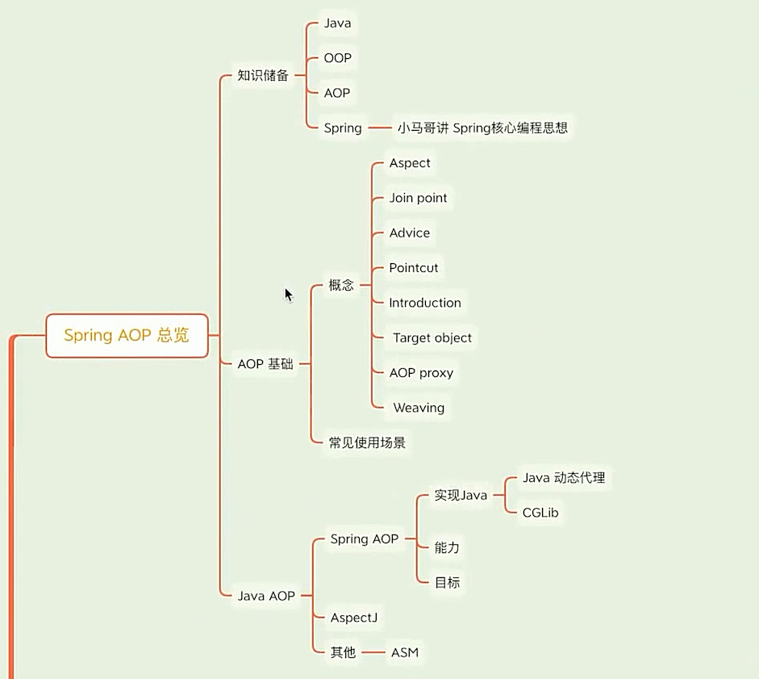
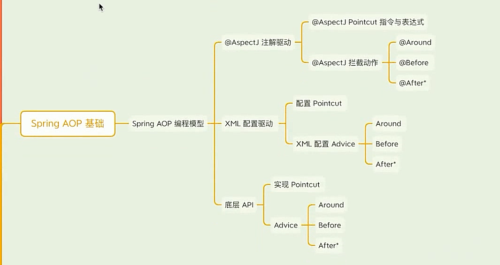
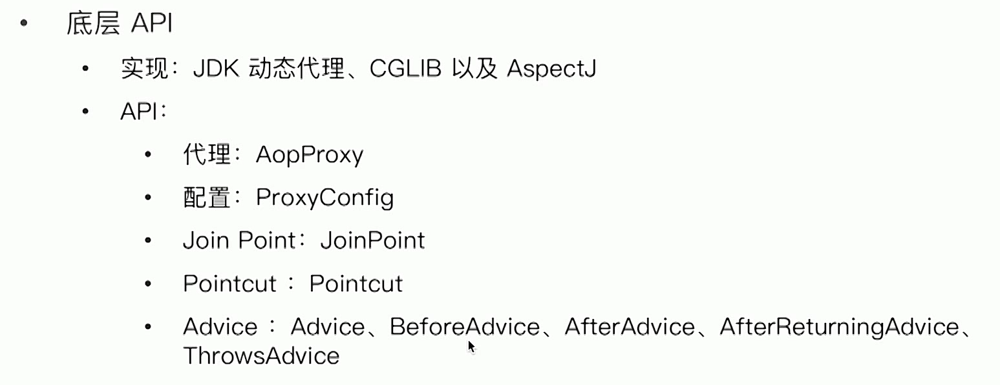
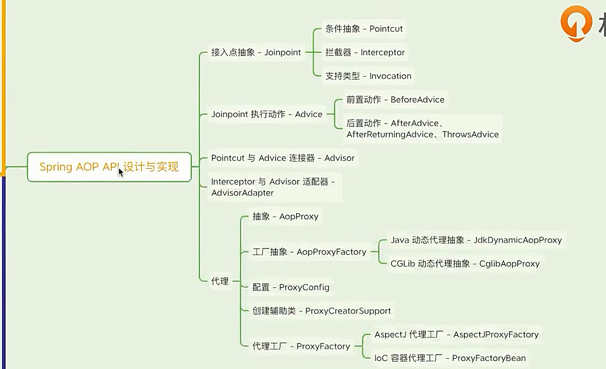
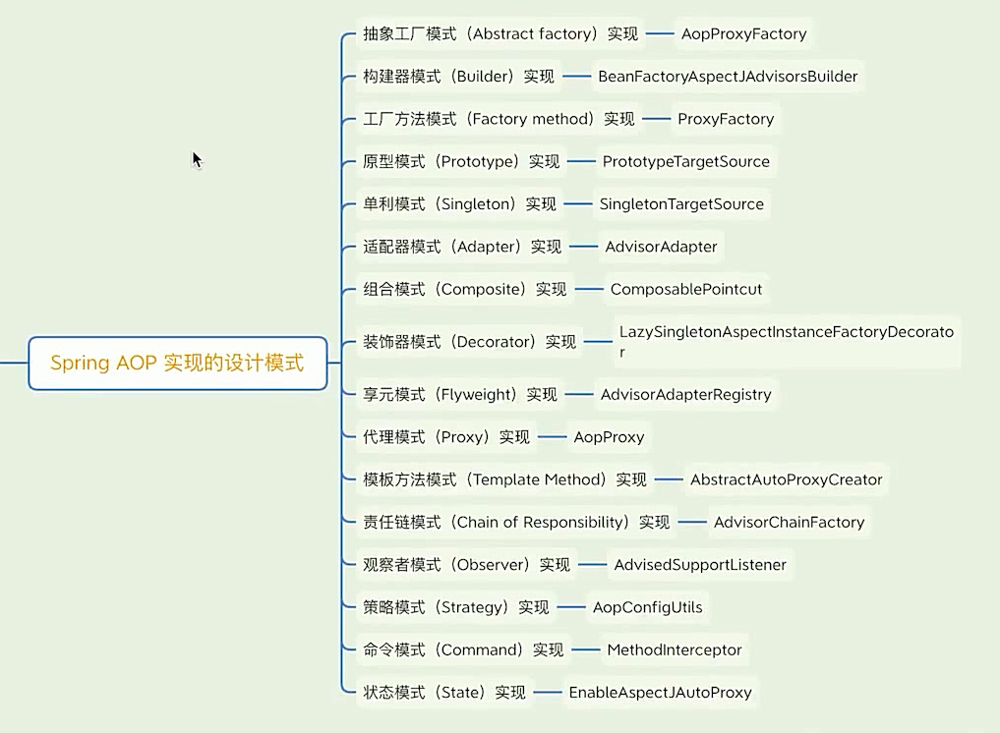
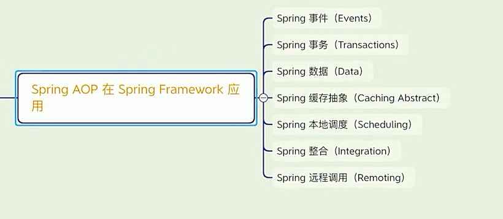

## Spring AOP 总览




## spring AOP 基础



- Java 基础：Java classLoading/java 动态代理/java反射、字节码框架（ASM、CGLib）；

    classLoader 接口通常实现方式是基于资源型 ClassLoader（URLClassLoader）

    ```java
    package com.gjxaiou;
    
    /**
     * 测试类加载
     */
    public class ClassLoadingDemo {
    
        public static void main(String[] args) {
            ClassLoader contextClassLoader = Thread.currentThread().getContextClassLoader();
            System.out.println(contextClassLoader);
        }
    }
    
    ```

    同时像 ASM 和 CGLIb，spring 都将其主要功能内联进来了；

    反射主要关注 Class.java 类即可；

- OOP 概念：封装、继承、多态；

- GOF23 中设计模式；

- Spring 核心基础：IOC 容器、Bean 生命周期、配置元信息、事件、注解；


### Java OOP 的局限性

- 静态化语言：类结构一旦定义，不容易被修改；
- 侵入性拓展：通过继承和组合组织新的类结构；

还是从 ClassLoder 来进行分析，首先加载的类信息都有序的存在 classes 字段中，然后以 URLClassLoader 为例，其中的 path 字段是 ArrayList 类型，是有序的存储需要加载的类路径，进行逐个遍历。同时主要方法包括 findClass，其中是找.class 结尾的类，然后使用 defineClass 方法解析 Class。

总结：之所以使用 AOP 是因为 Java 作为静态语言，其结构不容易变化；


### AOP 常见使用场景

- 日志场景
    - 诊断上下文，如 log4j 或者 logback 的 MDC（映射诊断上下文）
    - 辅助信息，如：方法执行时间

​			MDC 在 logback、log4j、slf4j 中都有，其本质上一个线程安全的 Map，会临时存储一些上下文的信息，例如打印日志的时候，需要传递如版本号信息，但是版本号会发生变化，就可以从上下文中获取，而不用直接代码写死；

- 统计场景
    - 方法调用次数
    - 执行异常次数
    - 数据抽样
    - 数值累加

- 安防场景
    - 熔断，如：Netflix  Hystrix
    - 限流和降级，如：Alibaba Sentinel
    - 认证和授权，如：Spring Security
    - 监控，如：JMX（Java Management Extension）

- 性能场景
    - 缓存，如 Spring Cache
    - 超时控制


### 常用概念

- AOP
- Aspect 切面
- Join point 连接点
- pointcut ===》用于筛选 joint point
- advice   ==》执行的行为动作
- Introduction 

###  AOP 设计模式

不等同于 GOF23 的设计模式，而是 AOP 设计的一些基本规范，主要以下三类：

- 代理模式：静态和动态代理
- 判断模式：类、方法、注解、参数、异常。。。
- 拦截模式：前置、后置、返回、异常

#### 代理模式

- Java 静态代理

    常用 OOP 继承和组合相结合

- Java 动态代理

    - JDK 动态代理
    - 字节码提升，如 CGLIB

静态代理实现

已经有一个 DefaultEchoServiceImpl 实现了，但是此时输出方法执行的时间，在不修改默认实现结构的基础上，可以使用静态代理的方式；

```java
package com.gjxaiou;

public interface EchoService {
    String echo(String message);
}
```

默认实现：

```java
package com.gjxaiou;

/**
 * 为 {@link EchoService} 默认实现
 */
public class DefaultEchoServiceImpl implements EchoService{
    @Override
    public String echo(String message) {
        return "echo " + message;
    }
}
```

使用代理来增强默认实现

```java
package com.gjxaiou;

/**
 * {@link EchoService} 的静态代理实现
 */

public class ProxyEchoServiceImpl implements EchoService{
    // 通过组合方式实现代理实现来增强老的实现

    // 使用注入方式，同时避免指定实现类
    private final EchoService echoService;

    public ProxyEchoServiceImpl(EchoService echoService) {
        this.echoService = echoService;
    }

    @Override
    public String echo(String message) {
        long startTime = System.currentTimeMillis();
        String result = echoService.echo(message);
        long costTime = System.currentTimeMillis() - startTime;
        System.out.println("执行时间 " + costTime);
        return  result;
    }
}
```

使用示例：

```java
package com.gjxaiou;

public class StaticProxyDemo {
    public static void main(String[] args) {
        EchoService echoService = new ProxyEchoServiceImpl(new DefaultEchoServiceImpl());
        echoService.echo("hello");
    }
}
```

输出为：

```java
执行时间 0
```

**动态代理**：

以 JDK 动态代理为例

```java
package com.gjxaiou;

import java.lang.reflect.InvocationHandler;
import java.lang.reflect.Method;
import java.lang.reflect.Proxy;

/**
 * JDK 动态代理示例
 */
public class JDKDynamicProxyDemo {

    public static void main(String[] args) {
        /**
         * classLoader：因为动态代理需要生成新的字节码的类，因为需要将该类转载到入参的 classLoader 中
         * 第三个是拦截器
         */
        ClassLoader classLoader = Thread.currentThread().getContextClassLoader();
        // 会生成一个代理对象 proxy
        Object proxy = Proxy.newProxyInstance(classLoader, new Class[]{EchoService.class},
                new InvocationHandler() {
                    @Override
                    public Object invoke(Object proxy, Method method, Object[] args) throws Throwable {
                        // 因为第二个参数是传入数组，所以代理可能是代理多个接口，所以执行方法前通常需要判断一下
                        if (EchoService.class.isAssignableFrom(method.getDeclaringClass())) {
                            ProxyEchoServiceImpl proxyEchoService =
                                    new ProxyEchoServiceImpl(new DefaultEchoServiceImpl());
                            return proxyEchoService.echo((String) args[0]);
                        }
                        return null;
                    }
                });

        EchoService proxy1 = (EchoService) proxy;
        proxy1.echo("hello world");
    }
}
```


#### 判断模式

通过 Java 的反射 API 来过滤目前对象的方法或者类；

示例如下：

```java
package com.gjxaiou;

import org.springframework.util.ReflectionUtils;

import java.lang.reflect.Method;

public class TargetFilterDemo {

    public static void main(String[] args) throws ClassNotFoundException {
        String targetClassName = "com.gjxaiou.EchoService";
        // 获取当前类加载器
        ClassLoader classLoader = Thread.currentThread().getContextClassLoader();
        // 获取目标类
        Class<?> targetClass = classLoader.loadClass(targetClassName);
        // 通过 Spring 的反射工具类来获取指定目标方法
        Method targetMethod = ReflectionUtils.findMethod(targetClass, "echo", String.class);
        // 输出找到的目标方法签名，如果没有找到则返回空
        System.out.println(targetMethod);

        // 同时可以查找抛出指定类型的方法，需要是非检查异常
        String targetClassName2 = "com.gjxaiou.ExceptionService";
        Class<?> class2 = classLoader.loadClass(targetClassName2);
        ReflectionUtils.doWithMethods(class2, new ReflectionUtils.MethodCallback() {
            @Override
            public void doWith(Method method) throws IllegalArgumentException,
                    IllegalAccessException {
                // 这里是 Callback，即执行动作，目前就是把这个方法名称输出
                System.out.println(method);
            }
        }, new ReflectionUtils.MethodFilter() {
            // 过滤操作
            @Override
            public boolean matches(Method method) {
                // 获取方法抛出的异常类型，如果要是获取参数类型，类似
                Class<?>[] exceptionTypes = method.getExceptionTypes();
                // 如果异常只有一个，并且为 NPE 则返回
                return exceptionTypes.length == 1 && NullPointerException.class.equals(exceptionTypes[0]);
            }
        });
    }
}
```

输出为：

```java
public abstract java.lang.String com.gjxaiou.EchoService.echo(java.lang.String)
public abstract java.lang.String com.gjxaiou.ExceptionService.hello(java.lang.String) throws java.lang.NullPointerException
```

#### 拦截模式

示例一：使用动态代理实现前置模式

```java
package com.gjxaiou;

import java.lang.reflect.InvocationHandler;
import java.lang.reflect.Method;
import java.lang.reflect.Proxy;

public class AOPInterceptorDemo {
    public static void main(String[] args) {
        ClassLoader contextClassLoader = Thread.currentThread().getContextClassLoader();
        Object proxyInstance = Proxy.newProxyInstance(contextClassLoader,
                new Class[]{EchoService.class},
                new InvocationHandler() {
                    @Override
                    public Object invoke(Object proxy, Method method, Object[] args) throws Throwable {
                        if (method.getDeclaringClass().equals(EchoService.class)) {
                            // 前置执行
                            long startTime = System.currentTimeMillis();
                            try {
                                DefaultEchoServiceImpl defaultEchoService =
                                        new DefaultEchoServiceImpl();
                                // 目标对象执行
                                return defaultEchoService.echo((String) args[0]);
                            } finally {
                                long costTime = System.currentTimeMillis() - startTime;
                                System.out.println("执行时间为：" + costTime);
                            }
                        }
                        return null;
                    }
                });

        EchoService ec = (EchoService) proxyInstance;
        ec.echo("hello world");
    }
}
```

执行结果：

```java
执行时间为：0
```

这里可以将 before 提取出来，然后进行抽象，同时增加后置操作来组合实现上述功能；

```java
package com.gjxaiou;

import java.lang.reflect.InvocationHandler;
import java.lang.reflect.Method;
import java.lang.reflect.Proxy;

public class AOPInterceptorDemo2 {
    public static void main(String[] args) {
        ClassLoader classLoader = Thread.currentThread().getContextClassLoader();
        Proxy.newProxyInstance(classLoader, new Class[]{EchoService.class},
                new InvocationHandler() {
            @Override
            public Object invoke(Object proxy, Method method, Object[] args) throws Throwable {
                if (method.getDeclaringClass().equals(EchoService.class)) {
                    // 前置的 beforeInterceptor 实现，可以在其他地方创建实现类，或者这里单独实现
                    BeforeInterceptor beforeInterceptor = new BeforeInterceptor() {
                        @Override
                        public Object before(Object proxy, Method method, Object[] args) {
                            return System.currentTimeMillis();
                        }
                    };

                    // 执行实现类中的 before 方法
                    Long startTime = (Long) beforeInterceptor.before(proxy, method, args);

                    // 目标对象执行
                    DefaultEchoServiceImpl defaultEchoService = new DefaultEchoServiceImpl();
                    String result = defaultEchoService.echo((String) args[0]);

                    // 方法执行后置拦截器
                    AfterReturnInterceptor afterReturnInterceptor = new AfterReturnInterceptor() {
                        @Override
                        public Object after(Object proxy, Method method, Object[] args,
                                            Object returnResult) {
                            return System.currentTimeMillis();
                        }
                    };
                    // 执行 after
                    Long endTime = (Long) afterReturnInterceptor.after(proxy, method, args, result);
                    // 计算方法执行时间
                    Long costTime = endTime - startTime;
                    System.out.println(costTime);
                }
                return null;
            }
        });
    }
}
```

但是没有结果输出，在找问题点；

同样可以使用 finally 进行后置拦截，和异常信息拦截；

```java
package com.gjxaiou;

import java.lang.reflect.InvocationHandler;
import java.lang.reflect.Method;
import java.lang.reflect.Proxy;

public class AOPInterceptorDemo3 {
    public static void main(String[] args) {
        ClassLoader classLoader = Thread.currentThread().getContextClassLoader();
        Proxy.newProxyInstance(classLoader, new Class[]{EchoService.class},
                new InvocationHandler() {
                    @Override
                    public Object invoke(Object proxy, Method method, Object[] args) throws Throwable {
                        if (method.getDeclaringClass().equals(EchoService.class)) {
                            // 前置的 beforeInterceptor 实现，可以在其他地方创建实现类，或者这里单独实现
                            BeforeInterceptor beforeInterceptor = new BeforeInterceptor() {
                                @Override
                                public Object before(Object proxy, Method method, Object[] args) {
                                    return System.currentTimeMillis();
                                }
                            };

                            Long startTime = 0L;
                            Long endTime = 0L;
                            String result = null;
                            try {
                                // 执行实现类中的 before 方法
                                startTime = (Long) beforeInterceptor.before(proxy, method, args);

                                // 目标对象执行
                                DefaultEchoServiceImpl defaultEchoService =
                                        new DefaultEchoServiceImpl();
                                result = defaultEchoService.echo((String) args[0]);

                                // 方法执行后置拦截器
                                AfterReturnInterceptor afterReturnInterceptor =
                                        new AfterReturnInterceptor() {
                                    @Override
                                    public Object after(Object proxy, Method method, Object[] args,
                                                        Object returnResult) {
                                        return System.currentTimeMillis();
                                    }
                                };
                                // 执行 after
                                endTime = (Long) afterReturnInterceptor.after(proxy, method, args
                                        , result);
                            } catch (Exception e) {
                                ExceptionInterceptor exceptionInterceptor = (proxy1, method1, args1,
                                                                             throwable) -> {
                                };
                                exceptionInterceptor.intercept(proxy, method, args, e);

                            } finally {
                                // finally 后置处理器
                                FinallyInterceptorImpl finallyInterceptor =
                                        new FinallyInterceptorImpl(startTime, endTime);
                                Long costTime = (Long) finallyInterceptor.finalize(proxy, method,
                                        args,
                                        result);
                                System.out.println("执行时间为：" + costTime);
                            }
                        }
                        return null;
                    }
                });
    }
}

// 实现 finallyInterceptor
class FinallyInterceptorImpl implements FinallyInterceptor {

    Long startTime;
    Long endTime;

    public FinallyInterceptorImpl(Long startTime, Long endTime) {
        this.startTime = startTime;
        this.endTime = endTime;
    }

    @Override
    public Object finalize(Object proxy, Method method, Object[] args, Object result) {
        return endTime - startTime;
    }
}
```

其中所有拦截接口为：

```java
package com.gjxaiou;

import java.lang.reflect.Method;

/**
 * 前置拦截器
 */
public interface BeforeInterceptor {
    /**
     * 前置执行
     * @param proxy 代理对象
     * @param method 目标方法
     * @param args 目标方法对应参数
     * @return
     */
    Object before(Object proxy, Method method,Object[] args);
}

package com.gjxaiou;

import java.lang.reflect.Method;

/**
 * （方法）后置处理器
 */
public interface AfterReturnInterceptor {
    /**
     * 后置执行
     * @param proxy
     * @param method
     * @param args
     * @param returnResult 执行方法返回结果
     * @return
     */
    Object after(Object proxy, Method method,Object[] args,Object returnResult);
}


package com.gjxaiou;

import java.lang.reflect.Method;

/**
 * 异常处理
 */
public interface ExceptionInterceptor {

    /**
     * @param proxy
     * @param method
     * @param args
     * @param throwable 异常信息
     */
    void intercept(Object proxy, Method method,Object[] args,Throwable throwable);
}


package com.gjxaiou;

import java.lang.reflect.Method;

/**
 * 最终执行后置处理器
 */
public interface FinallyInterceptor {
    /**
     * 最终执行
     * @param proxy
     * @param method
     * @param args
     * @param result 执行方法返回结果
     * @return
     */
    Object finalize(Object proxy, Method method,Object[] args,Object result);
}
```


#### Spring AOP 功能概述：

**核心特性	**：见官网文档

- 纯 Java 实现、无编译时特殊处理、不修改和控制 ClassLoader；
- 仅支持方法级别的 Join Points；
- 非完整 AOP 实现框架；
- 需要与 Spring IoC 容器整合；
- 与 AspectJ 注解驱动整合（非整合关系）；

**编程模型**：

- 注解驱动：
    - 实现：Enable 模块驱动，@EnableAspectJAutoProxy
    - 注解：
        - 激活 AspectJ 自动代理：@EnableAspectJAutoProxy
        - Aspect：@Aspect
        - Pointcut：@Pointcut
        - Advice：@Before、@AfterReturning、@AfterThrowing、@After、@Around
        - Introduction：@DeclareParents

- XML 配置驱动：
    - 实现：Spring Extensable XML Authoring
    - XML 元素
        - 激活 AspectJ 自动代理：`<aop:aspectj-autoproxy/>`
        - 配置：`<aop:config/>`
        - Aspect：`<aop:aspect/>`
        - Pointcut：`<aop:pointcut/>`
        - Advice：`<aop:around/>`/`<aop:before/>`/`<aop:after-returning/>`/`<aop:after-throwing/>`/`<aop:after/>`
        - Introduction：`<aop:declare-parents/>`
        - 代理 Scope：`<aop:scoped-proxy/>`

- 底层 API

    

### Spring  AOP Advice 类型

- 环绕（Around）

- 前置（Before）

    Spring 中的 BeforeAdvice 接口是一个具有标记性质的空接口，仅仅告知其有一个前置的拦截动作，但是没有告知拦截什么地方，具体的具象就是到 MethodBeforeAdvice；

- 后置（After）

    AfterAdvice 包括 AfterReturningAdvice 和 ThrowsAdvice，两者的具体实现为：ThrowsAdviceInterceptor

    - 方法执行
    - finally 执行

- 异常（Exception）

### Spring AOP 的实现

共有三种：

- JDK 的动态代理

    基于接口代理，主要通过 JdkDynamicAopProxy 类；

- CGlib 提升

    基于类代理（字节码提升），主要通过 CglibAopProxy 类实现；

- 与 AspectJ 的整合；

    主要通过  AspectJProxyFactory 类实现；


#### JDK 动态代理

为什么 Proxy.newProxyInstance 会生成新的字节码？


## spring AOP ApI设计与实现



## spring AOP 实现的设计模式




## spring AOP 在 Spring Framework 中应用

