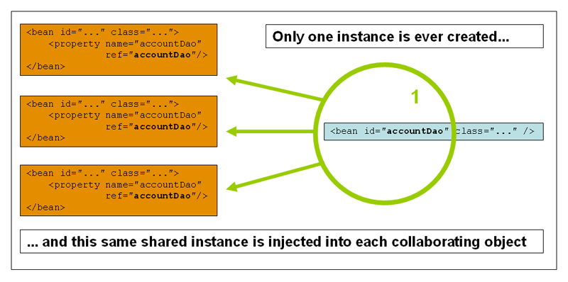

# Core Technologies

Version 5.3.13

This part of the reference documentation covers all the technologies that are absolutely integral to the Spring Framework.

Foremost amongst these is the Spring Framework’s Inversion of Control (IoC) container. A thorough treatment of the Spring Framework’s IoC container is closely followed by comprehensive coverage of Spring’s Aspect-Oriented Programming (AOP) technologies. The Spring Framework has its own AOP framework, which is conceptually easy to understand and which successfully addresses the 80% sweet spot of AOP requirements in Java enterprise programming.

Coverage of Spring’s integration with AspectJ (currently the richest — in terms of features — and certainly most mature AOP implementation in the Java enterprise space) is also provided.

参考文档的这一部分涵盖了Spring框架中绝对不可或缺的所有技术。

其中最重要的是 Spring 框架的控制反转（Inversion of Control，IoC）容器。在对Spring框架的IoC容器进行全面介绍之后，将全面介绍Spring的面向切面编程（AOP）技术。Spring框架有自己的AOP框架，在概念上很容易理解，它成功地解决了Java企业编程中80%的AOP需求。

Spring 与 AspectJ 集成的报道（目前最丰富 — 就特征而言 — 当然，也提供了Java企业空间中最成熟的AOP实现。

## 1. The IoC Container

## 1.IoC 容器

This chapter covers Spring’s Inversion of Control (IoC) container.

### 1.1. Introduction to the Spring IoC Container and Beans

### 1.1. Spring IoC 容器和 bean 简介

This chapter covers the Spring Framework implementation of the Inversion of Control (IoC) principle. IoC is also known as dependency injection (DI). It is a process whereby objects define their dependencies (that is, the other objects they work with) only through constructor arguments, arguments to a factory method, or properties that are set on the object instance after it is constructed or returned from a factory method. The container then injects those dependencies when it creates the bean. This process is fundamentally the inverse (hence the name, Inversion of Control) of the bean itself controlling the instantiation or location of its dependencies by using direct construction of classes or a mechanism such as the Service Locator pattern.

The `org.springframework.beans` and `org.springframework.context` packages are the basis for Spring Framework’s IoC container. The [`BeanFactory`](https://docs.spring.io/spring-framework/docs/5.3.13/javadoc-api/org/springframework/beans/factory/BeanFactory.html) interface provides an advanced configuration mechanism capable of managing any type of object. [`ApplicationContext`](https://docs.spring.io/spring-framework/docs/5.3.13/javadoc-api/org/springframework/context/ApplicationContext.html) is a sub-interface of `BeanFactory`. It adds:

- Easier integration with Spring’s AOP features
- Message resource handling (for use in internationalization)
- Event publication
- Application-layer specific contexts such as the `WebApplicationContext` for use in web applications.

In short, the `BeanFactory` provides the configuration framework and basic functionality, and the `ApplicationContext` adds more enterprise-specific functionality. The `ApplicationContext` is a complete superset of the `BeanFactory` and is used exclusively in this chapter in descriptions of Spring’s IoC container. For more information on using the `BeanFactory` instead of the `ApplicationContext,` see [The `BeanFactory`](https://docs.spring.io/spring-framework/docs/current/reference/html/core.html#beans-beanfactory).

In Spring, the objects that form the backbone of your application and that are managed by the Spring IoC container are called beans. A bean is an object that is instantiated, assembled, and managed by a Spring IoC container. Otherwise, a bean is simply one of many objects in your application. Beans, and the dependencies among them, are reflected in the configuration metadata used by a container.

本章介绍控制反转（IoC）原则在 Spring 框架中的实现。**IoC 也称为依赖注入（DI）**。**这是一个过程，对象仅通过构造函数参数、工厂方法的参数或在对象实例构造或从工厂方法返回后在对象实例上设置的属性来定义它们的依赖关系（即它们使用的其他对象）。然后，容器在创建bean时注入这些依赖项。这个过程基本上是 bean 本身的逆过程（因此称为控制反转），通过使用类的直接构造或服务定位器模式等机制来控制其依赖项的实例化或位置。**

`org.springframework.beans` 和 `org.springframework.context` 包是 Spring 框架的 IoC 容器的基础。[`BeanFactory`](https://docs.spring.io/spring-framework/docs/5.3.13/javadoc-api/org/springframework/beans/factory/BeanFactory.html)接口提供了一种高级配置机制，能够管理任何类型的对象。[`ApplicationContext`](https://docs.spring.io/spring-framework/docs/5.3.13/javadoc-api/org/springframework/context/ApplicationContext.html)是「BeanFactory」的子接口。它增加了以下功能：

- 更容易与Spring的AOP功能集成
- 消息资源处理（用于国际化）
- 事件发布
- 特定于应用层的上下文，如用于web应用程序的 `WebApplicationContext`。

简而言之，`BeanFactory`提供了配置框架和基本功能，`ApplicationContext`添加了更多特定于企业的功能。 **`ApplicationContext` 是 `BeanFactory` 的完整超集**，在本章中专门用于描述Spring的IoC容器。**有关使用 `BeanFactory` 而不是 `ApplicationContext` 的详细信息，请参见[BeanFactory](https://docs.spring.io/spring-framework/docs/current/reference/html/core.html#beans-beanfactory)。**

**在Spring中，构成应用程序主干并由 Spring IOC 容器管理的对象称为 beans。bean 是由 Spring IOC 容器实例化、组装和管理的对象**。否则，bean 只是应用程序中许多对象中的一个。**bean 以及它们之间的依赖关系反映在容器使用的配置元数据中**。

### 1.2. Container Overview

### 1.2. 容器概述

The `org.springframework.context.ApplicationContext` interface represents the Spring IoC container and is responsible for instantiating, configuring, and assembling the beans. The container gets its instructions on what objects to instantiate, configure, and assemble by reading configuration metadata. The configuration metadata is represented in XML, Java annotations, or Java code. It lets you express the objects that compose your application and the rich interdependencies between those objects.

Several implementations of the `ApplicationContext` interface are supplied with Spring. In stand-alone applications, it is common to create an instance of [`ClassPathXmlApplicationContext`](https://docs.spring.io/spring-framework/docs/5.3.13/javadoc-api/org/springframework/context/support/ClassPathXmlApplicationContext.html) or [`FileSystemXmlApplicationContext`](https://docs.spring.io/spring-framework/docs/5.3.13/javadoc-api/org/springframework/context/support/FileSystemXmlApplicationContext.html). While XML has been the traditional format for defining configuration metadata, you can instruct the container to use Java annotations or code as the metadata format by providing a small amount of XML configuration to declaratively enable support for these additional metadata formats.

In most application scenarios, explicit user code is not required to instantiate one or more instances of a Spring IoC container. For example, in a web application scenario, a simple eight (or so) lines of boilerplate web descriptor XML in the `web.xml` file of the application typically suffices (see [Convenient ApplicationContext Instantiation for Web Applications](https://docs.spring.io/spring-framework/docs/current/reference/html/core.html#context-create)). If you use the [Spring Tools for Eclipse](https://spring.io/tools) (an Eclipse-powered development environment), you can easily create this boilerplate configuration with a few mouse clicks or keystrokes.

The following diagram shows a high-level view of how Spring works. Your application classes are combined with configuration metadata so that, after the `ApplicationContext` is created and initialized, you have a fully configured and executable system or application.

`org.springframework.context.ApplicationContext`接口代表 Spring IOC 容器，负责实例化、配置和组装 bean。容器通过读取配置元数据获取关于实例化、配置和组装哪些对象的指令。配置元数据以 XML、Java 注释或 Java 代码表示，它允许您表达组成应用程序的对象以及这些对象之间丰富的相互依赖关系。

Spring 提供了`ApplicationContext`接口的几种实现。在单体应用程序中，通常会创建[ClassPathXmlApplicationContext](https://docs.spring.io/spring-framework/docs/5.3.13/javadoc-api/org/springframework/context/support/ClassPathXmlApplicationContext.html)的实例或[FileSystemXmlApplicationContext](https://docs.spring.io/spring-framework/docs/5.3.13/javadoc-api/org/springframework/context/support/FileSystemXmlApplicationContext.html)的实例。虽然 XML 一直是定义配置元数据的传统格式，但您可以指示容器使用 Java 注释或代码作为元数据格式，方法是提供少量 XML 配置，以声明方式支持这些附加元数据格式。

在大多数应用程序场景中，是不需要通过显式的用户代码来实例化 Spring IOC 容器的一个或多个实例。例如，在 web 应用程序场景中，`web.xml`中的一个简单的八行（大约）样板 web 描述符XML。应用程序的 XML文件通常就足够了（请参阅 [Web应用程序的便捷应用程序上下文实例化](https://docs.spring.io/spring-framework/docs/current/reference/html/core.html#context-create)）。如果您使用[Spring Tools for Eclipse](https://spring.io/tools)（一个支持Eclipse的开发环境），只需点击几下鼠标或按键，就可以轻松创建这个样板配置。

下图显示了 Spring 如何工作的高级视图。您的应用程序类与配置元数据相结合，这样，在创建并初始化  `ApplicationContext` 之后，您就拥有了一个完全配置且可执行的系统或应用程序。


Figure 1. The Spring IoC container

#### 1.2.1. Configuration Metadata

#### 1.2.1. 配置元数据

As the preceding diagram shows, the Spring IoC container consumes a form of configuration metadata. This configuration metadata represents how you, as an application developer, tell the Spring container to instantiate, configure, and assemble the objects in your application.

Configuration metadata is traditionally supplied in a simple and intuitive XML format, which is what most of this chapter uses to convey key concepts and features of the Spring IoC container.

> XML-based metadata is not the only allowed form of configuration metadata. The Spring IoC container itself is totally decoupled from the format in which this configuration metadata is actually written. These days, many developers choose [Java-based configuration](https://docs.spring.io/spring-framework/docs/current/reference/html/core.html#beans-java) for their Spring applications.

如上图所示，Spring IOC 容器使用一种形式的配置元数据。此配置元数据表示作为应用程序开发人员，您如何告知 Spring 容器实例化、配置和组装应用程序中的对象。

配置元数据传统上是以简单直观的 XML 格式提供的，这是本章大部分内容用来传达 Spring IOC 容器的关键概念和特性的。

>基于XML的元数据不是唯一允许的配置元数据形式。**Spring IOC 容器本身与实际写入此配置元数据的格式完全解耦**。如今，许多开发人员选择[基于Java的配置](https://docs.spring.io/spring-framework/docs/current/reference/html/core.html#beans-java)的 Spring 应用程序。

For information about using other forms of metadata with the Spring container, see:

- [Annotation-based configuration](https://docs.spring.io/spring-framework/docs/current/reference/html/core.html#beans-annotation-config): Spring 2.5 introduced support for annotation-based configuration metadata.
- [Java-based configuration](https://docs.spring.io/spring-framework/docs/current/reference/html/core.html#beans-java): Starting with Spring 3.0, many features provided by the Spring JavaConfig project became part of the core Spring Framework. Thus, you can define beans external to your application classes by using Java rather than XML files. To use these new features, see the [`@Configuration`](https://docs.spring.io/spring-framework/docs/current/javadoc-api/org/springframework/context/annotation/Configuration.html), [`@Bean`](https://docs.spring.io/spring-framework/docs/current/javadoc-api/org/springframework/context/annotation/Bean.html), [`@Import`](https://docs.spring.io/spring-framework/docs/current/javadoc-api/org/springframework/context/annotation/Import.html), and [`@DependsOn`](https://docs.spring.io/spring-framework/docs/current/javadoc-api/org/springframework/context/annotation/DependsOn.html) annotations.

Spring configuration consists of at least one and typically more than one bean definition that the container must manage. XML-based configuration metadata configures these beans as `<bean/>` elements inside a top-level `<beans/>` element. Java configuration typically uses `@Bean`-annotated methods within a `@Configuration` class.

These bean definitions correspond to the actual objects that make up your application. Typically, you define service layer objects, data access objects (DAOs), presentation objects such as Struts `Action` instances, infrastructure objects such as Hibernate `SessionFactories`, JMS `Queues`, and so forth. Typically, one does not configure fine-grained domain objects in the container, because it is usually the responsibility of DAOs and business logic to create and load domain objects. However, you can use Spring’s integration with AspectJ to configure objects that have been created outside the control of an IoC container. See [Using AspectJ to dependency-inject domain objects with Spring](https://docs.spring.io/spring-framework/docs/current/reference/html/core.html#aop-atconfigurable).

有关在 Spring 容器中使用其他形式元数据的信息，请参阅：

- [基于注释的配置](https://docs.spring.io/spring-framework/docs/current/reference/html/core.html#beans-annotation-config)：Spring 2.5 引入了对基于注释的配置元数据的支持。

- [基于Java的配置](https://docs.spring.io/spring-framework/docs/current/reference/html/core.html#beans-java)：从 Spring 3.0 开始，Spring Java Config 项目提供的许多特性成为核心 Spring 框架的一部分。因此，您可以使用 Java 而不是 XML 文件来**定义应用程序类外部的 bean**。要使用这些新功能，请参阅[`@Configuration`](https://docs.spring.io/spring-framework/docs/current/javadoc-api/org/springframework/context/annotation/Configuration.html)，[`@Bean`](https://docs.spring.io/spring-framework/docs/current/javadoc-api/org/springframework/context/annotation/Bean.html)，[`@Import`](https://docs.spring.io/spring-framework/docs/current/javadoc-api/org/springframework/context/annotation/Import.html)，和[`DependsOn`](https://docs.spring.io/spring-framework/docs/current/javadoc-api/org/springframework/context/annotation/DependsOn.html)注释。

Spring 配置由容器必须管理的至少一个且通常不止一个 bean 定义组成。基于 XML 的配置元数据将这些 bean 配置为顶级 `<beans/>`元素中的`<bean/>`元素。Java 配置通常在`@configuration`类中使用带 `@Bean` 注释的方法。

这些 bean 定义对应于构成应用程序的实际对象。通常，您定义服务层对象、数据访问对象（DAO）、展示对象（如Struts`Action`实例）、基础结构对象（如 Hibernate 的 `SessionFactorys`、JMS的`Queues`）等等。通常，不在容器中配置细粒度域对象，因为创建和加载域对象通常是 DAO 和业务逻辑的责任。但是，您**可以使用 Spring 与 AspectJ 的集成来配置在 IoC 容器控制之外创建的对象**。请参阅[使用AspectJ向Spring注入依赖项域对象](https://docs.spring.io/spring-framework/docs/current/reference/html/core.html#aop-atconfigurable)。

The following example shows the basic structure of XML-based configuration metadata:

以下示例显示了基于XML的配置元数据的基本结构：

```xml
<?xml version="1.0" encoding="UTF-8"?>
<beans xmlns="http://www.springframework.org/schema/beans"
    xmlns:xsi="http://www.w3.org/2001/XMLSchema-instance"
    xsi:schemaLocation="http://www.springframework.org/schema/beans
        https://www.springframework.org/schema/beans/spring-beans.xsd">

    <bean id="..." class="...">  <!--注解一/二-->
        <!-- collaborators and configuration for this bean go here -->
    </bean>

    <bean id="..." class="...">
        <!-- collaborators and configuration for this bean go here -->
    </bean>

    <!-- more bean definitions go here -->
</beans>
```

- 注解一：The `id` attribute is a string that identifies the individual bean definition.
- 注解二：The `class` attribute defines the type of the bean and uses the fully qualified classname.

The value of the `id` attribute refers to collaborating objects. The XML for referring to collaborating objects is not shown in this example. See [Dependencies](https://docs.spring.io/spring-framework/docs/current/reference/html/core.html#beans-dependencies) for more information.

- 注解一：`id` 属性是标识单个 bean 定义的字符串。

- 注解二：`class` 属性定义 bean 的类型并使用完全限定的类名。

`id` 属性的值引用协作对象。本例中未显示用于引用协作对象的 XML。参见[依赖关系](https://docs.spring.io/spring-framework/docs/current/reference/html/core.html#beans-dependencies)以获取更多信息。

#### 1.2.2. Instantiating a Container 

#### 1.2.2.实例化容器

The location path or paths supplied to an `ApplicationContext` constructor are resource strings that let the container load configuration metadata from a variety of external resources, such as the local file system, the Java `CLASSPATH`, and so on.

提供给`ApplicationContext`构造函数的一个或多个位置路径是资源字符串，允许容器从各种外部资源（如本地文件系统、Java`CLASSPATH`）加载配置元数据。

```java
ApplicationContext context = new ClassPathXmlApplicationContext("services.xml", "daos.xml");
```

>After you learn about Spring’s IoC container, you may want to know more about Spring’s `Resource` abstraction (as described in [Resources](https://docs.spring.io/spring-framework/docs/current/reference/html/core.html#resources)), which provides a convenient mechanism for reading an InputStream from locations defined in a URI syntax. In particular, `Resource` paths are used to construct applications contexts, as described in [Application Contexts and Resource Paths](https://docs.spring.io/spring-framework/docs/current/reference/html/core.html#resources-app-ctx).
>
>在了解了 Spring 的 IoC 容器之后，您可能想进一步了解 Spring 的`Resource`抽象（如[Resources](https://docs.spring.io/spring-framework/docs/current/reference/html/core.html#resources)中所述），它提供了一种方便的机制，用于从 URI 语法中定义的位置读取 InputStream。特别是，`Resource`路径用于构造应用程序上下文，如 [Application Contexts and Resource Paths](https://docs.spring.io/spring-framework/docs/current/reference/html/core.html#resources-app-ctx)中所述。

The following example shows the service layer objects `(services.xml)` configuration file:

以下示例显示服务层对象`（services.xml）`配置文件：

```xml
<?xml version="1.0" encoding="UTF-8"?>
<beans xmlns="http://www.springframework.org/schema/beans"
    xmlns:xsi="http://www.w3.org/2001/XMLSchema-instance"
    xsi:schemaLocation="http://www.springframework.org/schema/beans
        https://www.springframework.org/schema/beans/spring-beans.xsd">

    <!-- services -->

    <bean id="petStore" class="org.springframework.samples.jpetstore.services.PetStoreServiceImpl">
        <property name="accountDao" ref="accountDao"/>
        <property name="itemDao" ref="itemDao"/>
        <!-- additional collaborators and configuration for this bean go here -->
    </bean>

    <!-- more bean definitions for services go here -->
</beans>
```

The following example shows the data access objects `daos.xml` file:

下面的示例显示了数据访问对象的`daos.xml`文件：

```xml
<?xml version="1.0" encoding="UTF-8"?>
<beans xmlns="http://www.springframework.org/schema/beans"
    xmlns:xsi="http://www.w3.org/2001/XMLSchema-instance"
    xsi:schemaLocation="http://www.springframework.org/schema/beans
        https://www.springframework.org/schema/beans/spring-beans.xsd">

    <bean id="accountDao" class="org.springframework.samples.jpetstore.dao.jpa.JpaAccountDao">
        <!-- additional collaborators and configuration for this bean go here -->
    </bean>

    <bean id="itemDao" class="org.springframework.samples.jpetstore.dao.jpa.JpaItemDao">
        <!-- additional collaborators and configuration for this bean go here -->
    </bean>

    <!-- more bean definitions for data access objects go here -->
</beans>
```

In the preceding example, the service layer consists of the `PetStoreServiceImpl` class and two data access objects of the types `JpaAccountDao` and `JpaItemDao` (based on the JPA Object-Relational Mapping standard). The `property name` element refers to the name of the JavaBean property, and the `ref` element refers to the name of another bean definition. This linkage between `id` and `ref` elements expresses the dependency between collaborating objects. For details of configuring an object’s dependencies, see [Dependencies](https://docs.spring.io/spring-framework/docs/current/reference/html/core.html#beans-dependencies).

在前面的示例中，服务层由 `PetStoreServiceImpl` 类和两个类型为 `JPAAAccountDao` 和 `JpaItemDao` 的数据访问对象（基于 JPA 对象关系映射标准）组成。**`property name`元素引用 JavaBean 属性的名称，`ref` 元素引用另一个 bean 定义的名称。`id`和 `ref`元素之间的这种链接表示协作对象之间的依赖关系。有关配置对象依赖项的详细信息，**请参阅[Dependencies](https://docs.spring.io/spring-framework/docs/current/reference/html/core.html#beans-dependencies)。

##### Composing XML-based Configuration Metadata

##### 组合基于 XML 的配置元数据

It can be useful to have bean definitions span multiple XML files. Often, each individual XML configuration file represents a logical layer or module in your architecture.

You can use the application context constructor to load bean definitions from all these XML fragments. This constructor takes multiple `Resource` locations, as was shown in the [previous section](https://docs.spring.io/spring-framework/docs/current/reference/html/core.html#beans-factory-instantiation). Alternatively, use one or more occurrences of the `<import/>` element to load bean definitions from another file or files. The following example shows how to do so:

让 bean 定义跨越多个 XML 文件可能很有用。通常，每个单独的 XML 配置文件都表示体系结构中的一个逻辑层或模块。

您**可以使用应用程序上下文构造函数从所有这些 XML 片段加载 bean 定义。此构造函数接受多个`Resource`位置，如[上一节](https://docs.spring.io/spring-framework/docs/current/reference/html/core.html#beans-factory-instantiation)所示。或者，使用一个或多个出现的 `<import/>`元素从另一个或多个文件加载 bean 定义**。以下示例显示了如何执行此操作：

```xml
<beans>
    <import resource="services.xml"/>
    <import resource="resources/messageSource.xml"/>
    <import resource="/resources/themeSource.xml"/>

    <bean id="bean1" class="..."/>
    <bean id="bean2" class="..."/>
</beans>
```

In the preceding example, external bean definitions are loaded from three files: `services.xml`, `messageSource.xml`, and `themeSource.xml`. All location paths are relative to the definition file doing the importing, so `services.xml` must be in the same directory or classpath location as the file doing the importing, while `messageSource.xml` and `themeSource.xml` must be in a `resources` location below the location of the importing file. As you can see, a leading slash is ignored. However, given that these paths are relative, it is better form not to use the slash at all. The contents of the files being imported, including the top level `<beans/>` element, must be valid XML bean definitions, according to the Spring Schema.

在前面的示例中，外部 bean 定义是从三个文件加载的：`services.xml`，`messageSource.xml`，和`themeSource.xml`。**所有位置路径都是相对于执行导入的定义文件的**，因此`service.xml`必须与执行导入的文件位于同一目录或类路径位置，而`messageSource.xml`和`themeSource.xml`必须位于导入文件位置下方的 `resources` 位置。如您所见，前导斜杠被忽略。然而，**考虑到这些路径是相对的，最好不要使用斜杠**。根据 Spring 模式，要导入的文件的内容，包括顶级的 `<beans/>` 元素，必须是有效的 XML Bean 定义。

>  It is possible, but not recommended, to reference files in parent directories using a relative "../" path. Doing so creates a dependency on a file that is outside the current application. In particular, this reference is not recommended for `classpath:` URLs (for example, `classpath:../services.xml`), where the runtime resolution process chooses the “nearest” classpath root and then looks into its parent directory. Classpath configuration changes may lead to the choice of a different, incorrect directory.You can always use fully qualified resource locations instead of relative paths: for example, `file:C:/config/services.xml` or `classpath:/config/services.xml`. However, be aware that you are coupling your application’s configuration to specific absolute locations. It is generally preferable to keep an indirection for such absolute locations — for example, through "${…}" placeholders that are resolved against JVM system properties at runtime.
>
> 可以（但不建议）使用相对`./`路径引用父目录中的文件。这样做**会创建对当前应用程序之外的文件的依赖关系**。特别是，不建议对`classpath:`URL（例如，`classpath:../services.xml`）使用此引用，其中运行时解析过程选择“最近的”类路径根，然后查找其父目录。类路径配置更改可能会导致选择不同的、不正确的目录。您始终可以使用完全限定的资源位置而不是相对路径：例如，`file:C:/config/services。xml`或`classpath:/config/services。xml`。但是，请注意，您正在将应用程序的配置耦合到特定的绝对位置。通常，最好为此类绝对位置保留一个间接方向 — 例如，通过在运行时根据JVM系统属性解析的“${…}”占位符。

The namespace itself provides the import directive feature. Further configuration features beyond plain bean definitions are available in a selection of XML namespaces provided by Spring — for example, the `context` and `util` namespaces.

命名空间本身提供导入指令功能。Spring 提供的一系列 XML 命名空间中提供了普通 bean 定义之外的更多配置特性，例如，`context`和`util`命名空间。

##### The Groovy Bean Definition DSL

##### Groovy bean 定义 DSL

As a further example for externalized configuration metadata, bean definitions can also be expressed in Spring’s Groovy Bean Definition DSL, as known from the Grails framework. Typically, such configuration live in a ".groovy" file with the structure shown in the following example:

作为外部化配置元数据的另一个示例，bean 定义也可以在 Spring 的 Groovy bean 定义 DSL 中表示，正如 Grails 框架所知。通常，此类配置位于 `.groovy` 文件中，其结构如以下示例所示：

```groovy
beans {
    dataSource(BasicDataSource) {
        driverClassName = "org.hsqldb.jdbcDriver"
        url = "jdbc:hsqldb:mem:grailsDB"
        username = "sa"
        password = ""
        settings = [mynew:"setting"]
    }
    sessionFactory(SessionFactory) {
        dataSource = dataSource
    }
    myService(MyService) {
        nestedBean = { AnotherBean bean ->
            dataSource = dataSource
        }
    }
}
```

This configuration style is largely equivalent to XML bean definitions and even supports Spring’s XML configuration namespaces. It also allows for importing XML bean definition files through an `importBeans` directive.

这种配置风格在很大程度上等同于 XML Bean 定义，甚至支持 Spring 的 XML 配置名称空间。它还允许通过 `import Beans` 指令导入 XML Bean 定义文件。

#### 1.2.3. Using the Container

#### 1.2.3.使用容器

The `ApplicationContext` is the interface for an advanced factory capable of maintaining a registry of different beans and their dependencies. By using the method `T getBean(String name, Class<T> requiredType)`, you can retrieve instances of your beans.

The `ApplicationContext` lets you read bean definitions and access them, as the following example shows:

`ApplicationContext`是高级工厂的接口，能够维护不同 bean 及其依赖项的注册表。通过使用方法`T getBean(String name,Class<T> requiredType)`，您可以检索 bean 的实例。

`ApplicationContext`允许您读取 bean 定义并访问它们，如下例所示：

```java
// create and configure beans
ApplicationContext context = new ClassPathXmlApplicationContext("services.xml", "daos.xml");

// retrieve configured instance
PetStoreService service = context.getBean("petStore", PetStoreService.class);

// use configured instance
List<String> userList = service.getUsernameList();
```

With Groovy configuration, bootstrapping looks very similar. It has a different context implementation class which is Groovy-aware (but also understands XML bean definitions). The following example shows Groovy configuration:

对于 Groovy 配置，引导看起来非常相似。它有一个不同的上下文实现类，它是 Groovy 感知的（但也理解 XML Bean 定义）。以下示例显示 Groovy 配置：

```java
ApplicationContext context = new GenericGroovyApplicationContext("services.groovy", "daos.groovy");
```

The most flexible variant is `GenericApplicationContext` in combination with reader delegates — for example, with `XmlBeanDefinitionReader` for XML files, as the following example shows:

最灵活的变体是 `GenericApplicationContext`，它与读者委托相结合—例如，对于 XML 文件使用 `XmlBeanDefinitionReader`，如下例所示：

```java
GenericApplicationContext context = new GenericApplicationContext();
new XmlBeanDefinitionReader(context).loadBeanDefinitions("services.xml", "daos.xml");
context.refresh();
```

You can also use the `GroovyBeanDefinitionReader` for Groovy files, as the following example shows:

您还可以对 Groovy 文件使用 `GroovyBeanDefinitionReader`，如下例所示：

```java
GenericApplicationContext context = new GenericApplicationContext();
new GroovyBeanDefinitionReader(context).loadBeanDefinitions("services.groovy", "daos.groovy");
context.refresh();
```

You can mix and match such reader delegates on the same `ApplicationContext`, reading bean definitions from diverse configuration sources.

You can then use `getBean` to retrieve instances of your beans. The `ApplicationContext` interface has a few other methods for retrieving beans, but, ideally, your application code should never use them. Indeed, your application code should have no calls to the `getBean()` method at all and thus have no dependency on Spring APIs at all. For example, Spring’s integration with web frameworks provides dependency injection for various web framework components such as controllers and JSF-managed beans, letting you declare a dependency on a specific bean through metadata (such as an autowiring annotation).

**您可以在同一个 `ApplicationContext`上混合和匹配这样的读卡器委托，从不同的配置源读取 bean 定义**。

然后可以使用 `getBean` 检索 bean 的实例。`ApplicationContext` 接口有一些其他方法用于检索 bean，但理想情况下，应用程序代码不应使用它们。实际上，您的应用程序代码根本不应该调用`getBean()`方法，因此完全不依赖于Spring API。例如，Spring 与 web 框架的集成为各种 web 框架组件（如控制器和 JSF 托管 bean）提供了依赖项注入，允许您通过元数据（如自动装配注释）声明对特定bean的依赖项。

### 1.3. Bean Overview

### 1.3. Bean 概述

A Spring IoC container manages one or more beans. These beans are created with the configuration metadata that you supply to the container (for example, in the form of XML `<bean/>` definitions).

Within the container itself, these bean definitions are represented as `BeanDefinition` objects, which contain (among other information) the following metadata:

- A package-qualified class name: typically, the actual implementation class of the bean being defined.
- Bean behavioral configuration elements, which state how the bean should behave in the container (scope, lifecycle callbacks, and so forth).
- References to other beans that are needed for the bean to do its work. These references are also called collaborators or dependencies.
- Other configuration settings to set in the newly created object — for example, the size limit of the pool or the number of connections to use in a bean that manages a connection pool.

This metadata translates to a set of properties that make up each bean definition. The following table describes these properties:

Spring IOC 容器管理一个或多个 bean。这些 bean 是使用您提供给容器的配置元数据创建的（例如，以 XML`<bean/>`定义的形式）。

**在容器本身中，这些 bean 定义表示为 `BeanDefinition` 对象，其中包含（除其他信息外）以下元数据：**

- 包限定类名：通常是定义的 bean 的实际**实现类**。

- Bean 行为配置元素，它说明 Bean 在容器中的行为（范围、生命周期回调等）。

- 引用 bean 执行其工作所需的其他 bean。这些引用也称为协作者或依赖项。

- 要在新创建的对象中设置的其他配置设置 — 例如，池的大小限制或管理连接池的 bean 中要使用的连接数。

此元数据转换为组成每个 bean 定义的一组属性。下表介绍了这些属性：

| Property                 | Explained in…                                                |
| :----------------------- | :----------------------------------------------------------- |
| Class                    | [Instantiating Beans](https://docs.spring.io/spring-framework/docs/current/reference/html/core.html#beans-factory-class) |
| Name                     | [Naming Beans](https://docs.spring.io/spring-framework/docs/current/reference/html/core.html#beans-beanname) |
| Scope                    | [Bean Scopes](https://docs.spring.io/spring-framework/docs/current/reference/html/core.html#beans-factory-scopes) |
| Constructor arguments    | [Dependency Injection](https://docs.spring.io/spring-framework/docs/current/reference/html/core.html#beans-factory-collaborators) |
| Properties               | [Dependency Injection](https://docs.spring.io/spring-framework/docs/current/reference/html/core.html#beans-factory-collaborators) |
| Autowiring mode          | [Autowiring Collaborators](https://docs.spring.io/spring-framework/docs/current/reference/html/core.html#beans-factory-autowire) |
| Lazy initialization mode | [Lazy-initialized Beans](https://docs.spring.io/spring-framework/docs/current/reference/html/core.html#beans-factory-lazy-init) |
| Initialization method    | [Initialization Callbacks](https://docs.spring.io/spring-framework/docs/current/reference/html/core.html#beans-factory-lifecycle-initializingbean) |
| Destruction method       | [Destruction Callbacks](https://docs.spring.io/spring-framework/docs/current/reference/html/core.html#beans-factory-lifecycle-disposablebean) |

In addition to bean definitions that contain information on how to create a specific bean, the `ApplicationContext` implementations also permit the registration of existing objects that are created outside the container (by users). This is done by accessing the ApplicationContext’s BeanFactory through the `getBeanFactory()` method, which returns the BeanFactory `DefaultListableBeanFactory` implementation. `DefaultListableBeanFactory` supports this registration through the `registerSingleton(..)` and `registerBeanDefinition(..)` methods. However, typical applications work solely with beans defined through regular bean definition metadata.

除了包含关于如何创建特定 bean 的信息的 bean definitions 之外，`ApplicationContext`实现还允许注册（由用户）在容器外部创建的现有对象。这是通过`getBeanFactory()`方法访问 ApplicationContext 的 BeanFactory 来实现的，该方法返回BeanFactory 的`DefaultListableBeanFactory`实现，`DefaultListableBeanFactory`通过` registerSingleton(..)`支持此注册和 `registerBeanDefinition(..)` 方法。然而，典型的应用程序只使用通过常规 bean 定义元数据定义的 bean。

>Bean metadata and manually supplied singleton instances need to be registered as early as possible, in order for the container to properly reason about them during autowiring and other introspection steps. While overriding existing metadata and existing singleton instances is supported to some degree, the registration of new beans at runtime (concurrently with live access to the factory) is not officially supported and may lead to concurrent access exceptions, inconsistent state in the bean container, or both.
>
>Bean 元数据和手动提供的单例实例需要尽早注册，以便容器在自动装配和其他自省步骤中正确地对它们进行推理。**虽然在某种程度上支持覆盖现有元数据和现有单例实例，但官方不支持在运行时注册新 bean（与对工厂的实时访问同时进行），这可能导致并发访问异常、bean容器中的状态不一致，或两者兼而有之。**

#### 1.3.1. Naming Beans

#### 1.3.1. Beans 命名

Every bean has one or more identifiers. These identifiers must be unique within the container that hosts the bean. A bean usually has only one identifier. However, if it requires more than one, the extra ones can be considered aliases.

In XML-based configuration metadata, you use the `id` attribute, the `name` attribute, or both to specify the bean identifiers. The `id` attribute lets you specify exactly one id. Conventionally, these names are alphanumeric ('myBean', 'someService', etc.), but they can contain special characters as well. If you want to introduce other aliases for the bean, you can also specify them in the `name` attribute, separated by a comma (`,`), semicolon (`;`), or white space. As a historical note, in versions prior to Spring 3.1, the `id` attribute was defined as an `xsd:ID` type, which constrained possible characters. As of 3.1, it is defined as an `xsd:string` type. Note that bean `id` uniqueness is still enforced by the container, though no longer by XML parsers.

You are not required to supply a `name` or an `id` for a bean. If you do not supply a `name` or `id` explicitly, the container generates a unique name for that bean. However, if you want to refer to that bean by name, through the use of the `ref` element or a Service Locator style lookup, you must provide a name. Motivations for not supplying a name are related to using [inner beans](https://docs.spring.io/spring-framework/docs/current/reference/html/core.html#beans-inner-beans) and [autowiring collaborators](https://docs.spring.io/spring-framework/docs/current/reference/html/core.html#beans-factory-autowire).

**每个 bean 都有一个或多个标识符。这些标识符在承载 bean 的容器中必须是唯一的。一个 bean 通常只有一个标识符。 但是，如果它需要多个，则可以将多余的视为别名。**

在基于 XML 的配置元数据中，可以使用 `id`属性、`name`属性或两者来指定 bean 标识符。`id`属性允许您只指定一个 id。按照惯例，这些名称由字母数字组成（“myBean”、“someService”等），但也可以包含特殊字符。如果要为 bean 引入其他别名，还可以在`name`属性中指定它们，用逗号（`,`）、分号（`;`）或空格分隔。历史上，在 Spring 3.1 之前的版本中，`id` 属性被定义为 `xsd:ID` 类型，它限制了可能的字符。从 3.1 开始，它被定义为 `xsd:string`类型。注意，**bean `id` 唯一性仍然由容器强制执行，但不再由 XML 解析器强制执行。**

**您不需要为 bean 提供 `name` 或 `id`。如果不显式提供 `name` 或 `id`，容器将为该 bean 生成一个唯一的名称。但是，如果希望通过使用 `ref` 元素或服务定位器样式的查找按名称引用该 bean，则必须提供名称。**不提供名称的动机与使用[内部bean](https://docs.spring.io/spring-framework/docs/current/reference/html/core.html#beans-inner-beans)和[autowiring collaborators](https://docs.spring.io/spring-framework/docs/current/reference/html/core.html#beans-factory-autowire)有关。

> Bean Naming Conventions
>
> The convention is to use the standard Java convention for instance field names when naming beans. That is, bean names start with a lowercase letter and are camel-cased from there. Examples of such names include `accountManager`, `accountService`, `userDao`, `loginController`, and so forth.
>
> Naming beans consistently makes your configuration easier to read and understand. Also, if you use Spring AOP, it helps a lot when applying advice to a set of beans related by name.
>
> Bean 命名约定
>
> 约定是在命名 bean 时使用标准 Java 约定作为实例字段名。也就是说**，bean 名称以小写字母开头，然后用驼峰大小写**。此类名称的示例包括“accountManager”、“accountService”、“userDao”、“loginController”等。
>
> 命名 bean 会使您的配置更易于阅读和理解。此外，如果您使用 Spring AOP，那么在将建议应用于一组按名称相关的 bean时，它会有很大帮助。

> With component scanning in the classpath, Spring generates bean names for unnamed components, following the rules described earlier: essentially, taking the simple class name and turning its initial character to lower-case. However, in the (unusual) special case when there is more than one character and both the first and second characters are upper case, the original casing gets preserved. These are the same rules as defined by `java.beans.Introspector.decapitalize` (which Spring uses here).
>
> **通过类路径中的组件扫描，Spring 为未命名的组件生成 bean 名称，遵循前面描述的规则：本质上，采用简单的类名并将其初始字符转换为小写。但是，在（不常见的）特殊情况下，当有多个字符且第一个和第二个字符都是大写时，原始大小写将被保留。这些规则与 `java.beans.Introspector.decapitalize`（Spring在这里使用）定义的规则相同。**

##### Aliasing a Bean outside the Bean Definition

##### 在Bean定义之外给Bean添加别名

In a bean definition itself, you can supply more than one name for the bean, by using a combination of up to one name specified by the `id` attribute and any number of other names in the `name` attribute. These names can be equivalent aliases to the same bean and are useful for some situations, such as letting each component in an application refer to a common dependency by using a bean name that is specific to that component itself.

Specifying all aliases where the bean is actually defined is not always adequate, however. It is sometimes desirable to introduce an alias for a bean that is defined elsewhere. This is commonly the case in large systems where configuration is split amongst each subsystem, with each subsystem having its own set of object definitions. In XML-based configuration metadata, you can use the `<alias/>` element to accomplish this. The following example shows how to do so:

在 bean 定义本身中，您可以为 bean 提供多个名称，方法是使用 `id` 属性指定的最多一个名称和 `name`属性中任意数量的其他名称的组合。这些名称可以是同一 bean 的等效别名，在某些情况下非常有用，例如，通过使用特定于该组件本身的 bean 名称，让应用程序中的每个组件引用公共依赖项。

但是，指定实际定义 bean 的所有别名并不总是足够的。有时需要为在别处定义的 bean 引入别名。在大型系统中，配置通常在每个子系统之间分割，每个子系统都有自己的对象定义集。在基于 XML 的配置元数据中，可以使用`<alias/>`元素来完成这一任务。以下示例显示了如何执行此操作：

```xml
<alias name="fromName" alias="toName"/>
```

In this case, a bean (in the same container) named `fromName` may also, after the use of this alias definition, be referred to as `toName`.

For example, the configuration metadata for subsystem A may refer to a DataSource by the name of `subsystemA-dataSource`. The configuration metadata for subsystem B may refer to a DataSource by the name of `subsystemB-dataSource`. When composing the main application that uses both these subsystems, the main application refers to the DataSource by the name of `myApp-dataSource`. To have all three names refer to the same object, you can add the following alias definitions to the configuration metadata:

在这种情况下，在使用此别名定义后，名为 `fromName` 的 bean（在同一容器中）也可以称为 `toName`。

例如，子系统 A 的配置元数据可能引用名为 `subsystemA-dataSource`的数据源。子系统 B 的配置元数据可能引用名为`subsystemB-dataSource`的数据源。在编写使用这两个子系统的主应用程序时，主应用程序以 `myApp-DataSource`的名称引用数据源。**要使所有三个名称都引用同一对象，可以将以下别名定义添加到配置元数据中**：

```xml
<alias name="myApp-dataSource" alias="subsystemA-dataSource"/>
<alias name="myApp-dataSource" alias="subsystemB-dataSource"/>
```

Now each component and the main application can refer to the dataSource through a name that is unique and guaranteed not to clash with any other definition (effectively creating a namespace), yet they refer to the same bean.

现在，每个组件和主应用程序都可以通过一个唯一的名称引用数据源，并保证不会与任何其他定义冲突（有效地创建名称空间），但它们引用的是同一个 bean。

> Java-configuration
>
> If you use Javaconfiguration, the `@Bean` annotation can be used to provide aliases. See [Using the `@Bean` Annotation](https://docs.spring.io/spring-framework/docs/current/reference/html/core.html#beans-java-bean-annotation) for details.
>
> Java配置
>
> 如果使用Javaconfiguration，`@Bean`注释可用于提供别名。请参阅[使用`@Bean`注释](https://docs.spring.io/spring-framework/docs/current/reference/html/core.html#beans-java-bean-annotation)获取详细信息。

#### 1.3.2. Instantiating Beans

#### 1.3.2.实例化bean

A bean definition is essentially a recipe for creating one or more objects. The container looks at the recipe for a named bean when asked and uses the configuration metadata encapsulated by that bean definition to create (or acquire) an actual object.

If you use XML-based configuration metadata, you specify the type (or class) of object that is to be instantiated in the `class` attribute of the `<bean/>` element. This `class` attribute (which, internally, is a `Class` property on a `BeanDefinition` instance) is usually mandatory. (For exceptions, see [Instantiation by Using an Instance Factory Method](https://docs.spring.io/spring-framework/docs/current/reference/html/core.html#beans-factory-class-instance-factory-method) and [Bean Definition Inheritance](https://docs.spring.io/spring-framework/docs/current/reference/html/core.html#beans-child-bean-definitions).) You can use the `Class` property in one of two ways:

- Typically, to specify the bean class to be constructed in the case where the container itself directly creates the bean by calling its constructor reflectively, somewhat equivalent to Java code with the `new` operator.
- To specify the actual class containing the `static` factory method that is invoked to create the object, in the less common case where the container invokes a `static` factory method on a class to create the bean. The object type returned from the invocation of the `static` factory method may be the same class or another class entirely.

Nested class names

If you want to configure a bean definition for a nested class, you may use either the binary name or the source name of the nested class.

For example, if you have a class called `SomeThing` in the `com.example` package, and this `SomeThing` class has a `static` nested class called `OtherThing`, they can be separated by a dollar sign (`$`) or a dot (`.`). So the value of the `class` attribute in a bean definition would be `com.example.SomeThing$OtherThing` or `com.example.SomeThing.OtherThing`.

**bean 定义本质上是创建一个或多个对象的方法。容器在被询问时查看命名 bean 的配方，并使用该 bean 定义封装的配置元数据创建（或获取）实际对象。**

如果使用基于 XML 的配置元数据，则指定要在 `<bean/>`元素的 `class`属性中实例化的对象的类型（或类）。此 `class` 属性（在内部，它是 `BeanDefinition` 实例上的 `Class` 属性）通常是必需的。（有关例外情况，请参阅[使用实例工厂方法实例化](https://docs.spring.io/spring-framework/docs/current/reference/html/core.html#beans-factory-class-instance-factory-method)和[Bean定义继承](https://docs.spring.io/spring-framework/docs/current/reference/html/core.html#beans-child-bean-definitions)，你可以通过以下两种方式之一使用 `Class` 属性：

- **通常，在容器本身通过反射式调用其构造函数直接创建 bean 的情况下，指定要构造的 bean 类，这在某种程度上相当于带有 `new` 操作符的Java代码。**

- 指定包含被调用以创建对象的`static` 工厂方法的实际类，在不太常见的情况下，容器调用类上的 `static` 工厂方法以创建bean。调用 `static` 工厂方法返回的对象类型可能是同一个类，也可能是另一个类。

**嵌套类名**

如果要为嵌套类配置 bean 定义，可以使用嵌套类的二进制名称或源名称。

例如，如果在 `com.example` 包中有一个名`SomeThing`的类。而这个`SomeThing`类有一个名为`OtherThing`的`static`嵌套类，它们可以用一个美元符号（`$`）或一个点（`.`）分隔。因此，bean 定义中的 `class`属性的值应该是 `com.example.SomeThing$OtherThing`或者 `com.example.SomeThing.OtherThing`。

##### Instantiation with a Constructor

##### 用构造函数实例化

When you create a bean by the constructor approach, all normal classes are usable by and compatible with Spring. That is, the class being developed does not need to implement any specific interfaces or to be coded in a specific fashion. Simply specifying the bean class should suffice. However, depending on what type of IoC you use for that specific bean, you may need a default (empty) constructor.

The Spring IoC container can manage virtually any class you want it to manage. It is not limited to managing true JavaBeans. Most Spring users prefer actual JavaBeans with only a default (no-argument) constructor and appropriate setters and getters modeled after the properties in the container. You can also have more exotic non-bean-style classes in your container. If, for example, you need to use a legacy connection pool that absolutely does not adhere to the JavaBean specification, Spring can manage it as well.

With XML-based configuration metadata you can specify your bean class as follows:

当您通过构造函数方法创建 bean 时，所有普通类都可以由 Spring 使用，并且与 Spring 兼容。也就是说，正在开发的类不需要实现任何特定的接口，也不需要以特定的方式进行编码。只需指定 bean 类就足够了。但是，根据您对特定 bean 使用的 IoC 类型，您可能需要一个默认（空）构造函数。

Spring IOC 容器实际上可以管理您希望它管理的任何类。它不仅限于管理真正的 JavaBeans。大多数 Spring 用户更喜欢实际的JavaBean，它只有一个默认（无参数）构造函数，并根据容器中的属性建模适当的 setter 和 getter。您的容器中还可以有更多异国情调的非 bean 样式的类。例如，如果您需要使用一个完全不符合 JavaBean 规范的遗留连接池，Spring 也可以管理它。

使用基于 XML 的配置元数据，您可以按如下方式指定 bean 类：

```xml
<bean id="exampleBean" class="examples.ExampleBean"/>

<bean name="anotherExample" class="examples.ExampleBeanTwo"/>
```

For details about the mechanism for supplying arguments to the constructor (if required) and setting object instance properties after the object is constructed, see [Injecting Dependencies](https://docs.spring.io/spring-framework/docs/current/reference/html/core.html#beans-factory-collaborators).

有关构造对象后向构造函数提供参数（如果需要）和设置对象实例属性的机制的详细信息，请参阅[注入依赖项](https://docs.spring.io/spring-framework/docs/current/reference/html/core.html#beans-factory-collaborators)。

##### Instantiation with a Static Factory Method

##### 使用静态工厂方法进行实例化

When defining a bean that you create with a static factory method, use the `class` attribute to specify the class that contains the `static` factory method and an attribute named `factory-method` to specify the name of the factory method itself. You should be able to call this method (with optional arguments, as described later) and return a live object, which subsequently is treated as if it had been created through a constructor. One use for such a bean definition is to call `static` factories in legacy code.

The following bean definition specifies that the bean be created by calling a factory method. The definition does not specify the type (class) of the returned object, only the class containing the factory method. In this example, the `createInstance()` method must be a static method. The following example shows how to specify a factory method:

定义使用静态工厂方法创建的 bean 时，请使用 `class` 属性指定包含 `static` 工厂方法的类，并使用名为 `factory-method`的属性指定工厂方法本身的名称。您应该能够调用此方法（使用可选参数，如下文所述）并返回一个活动对象，该对象随后将被视为是通过构造函数创建的。这种 bean 定义的一个用途是在遗留代码中调用 `static`工厂。

**下面的 bean 定义指定通过调用工厂方法来创建 bean。该定义不指定返回对象的类型（类），只指定包含工厂方法的类。在本例中，`createInstance()`方法必须是静态方法。**以下示例显示如何指定工厂方法：

```xml
<bean id="clientService"
    class="examples.ClientService"
    factory-method="createInstance"/>
```

The following example shows a class that would work with the preceding bean definition:

以下示例显示了一个可与前面的 bean 定义一起使用的类：

```java
public class ClientService {
    private static ClientService clientService = new ClientService();
    private ClientService() {}

    public static ClientService createInstance() {
        return clientService;
    }
}
```

For details about the mechanism for supplying (optional) arguments to the factory method and setting object instance properties after the object is returned from the factory, see [Dependencies and Configuration in Detail](https://docs.spring.io/spring-framework/docs/current/reference/html/core.html#beans-factory-properties-detailed).

有关在对象从工厂返回后向工厂方法提供（可选）参数和设置对象实例属性的机制的详细信息，请参阅[依赖项和配置详细信息](https://docs.spring.io/spring-framework/docs/current/reference/html/core.html#beans-factory-properties-detailed)。

##### Instantiation by Using an Instance Factory Method

##### 使用实例工厂方法进行实例化

Similar to instantiation through a [static factory method](https://docs.spring.io/spring-framework/docs/current/reference/html/core.html#beans-factory-class-static-factory-method), instantiation with an instance factory method invokes a non-static method of an existing bean from the container to create a new bean. To use this mechanism, leave the `class` attribute empty and, in the `factory-bean` attribute, specify the name of a bean in the current (or parent or ancestor) container that contains the instance method that is to be invoked to create the object. Set the name of the factory method itself with the `factory-method` attribute. The following example shows how to configure such a bean:

类似于通过[静态工厂方法](https://docs.spring.io/spring-framework/docs/current/reference/html/core.html#beans-factory-class-static-factory-method)，使用实例工厂方法实例化从容器中调用现有 bean 的非静态方法来创建新 bean。要使用此机制，请将 `class` 属性保留为空，并在 `factory-bean` 属性中，指定当前（或父级或祖先级）容器中包含要调用以创建对象的实例方法的bean 的名称。使用 `factory-method`属性设置工厂方法本身的名称。下面的示例演示如何配置这样的 bean：

```xml
<!-- the factory bean, which contains a method called createInstance() -->
<bean id="serviceLocator" class="examples.DefaultServiceLocator">
    <!-- inject any dependencies required by this locator bean -->
</bean>

<!-- the bean to be created via the factory bean -->
<bean id="clientService"
    factory-bean="serviceLocator"
    factory-method="createClientServiceInstance"/>
```

The following example shows the corresponding class:

以下示例显示了相应的类：

```java
public class DefaultServiceLocator {

    private static ClientService clientService = new ClientServiceImpl();

    public ClientService createClientServiceInstance() {
        return clientService;
    }
}
```

One factory class can also hold more than one factory method, as the following example shows:

一个工厂类还可以包含多个工厂方法，如下例所示：

```xml
<bean id="serviceLocator" class="examples.DefaultServiceLocator">
    <!-- inject any dependencies required by this locator bean -->
</bean>

<bean id="clientService"
    factory-bean="serviceLocator"
    factory-method="createClientServiceInstance"/>

<bean id="accountService"
    factory-bean="serviceLocator"
    factory-method="createAccountServiceInstance"/>
```

The following example shows the corresponding class:

以下示例显示了相应的类：

```java
public class DefaultServiceLocator {

    private static ClientService clientService = new ClientServiceImpl();

    private static AccountService accountService = new AccountServiceImpl();

    public ClientService createClientServiceInstance() {
        return clientService;
    }

    public AccountService createAccountServiceInstance() {
        return accountService;
    }
}
```

This approach shows that the factory bean itself can be managed and configured through dependency injection (DI). See [Dependencies and Configuration in Detail](https://docs.spring.io/spring-framework/docs/current/reference/html/core.html#beans-factory-properties-detailed).

这种方法表明，工厂 bean 本身可以通过依赖注入（DI）进行管理和配置。请参阅[依赖项和配置详细信息](https://docs.spring.io/spring-framework/docs/current/reference/html/core.html#beans-factory-properties-detailed)。

> In Spring documentation, "factory bean" refers to a bean that is configured in the Spring container and that creates objects through an [instance](https://docs.spring.io/spring-framework/docs/current/reference/html/core.html#beans-factory-class-instance-factory-method) or [static](https://docs.spring.io/spring-framework/docs/current/reference/html/core.html#beans-factory-class-static-factory-method) factory method. By contrast, `FactoryBean` (notice the capitalization) refers to a Spring-specific [`FactoryBean`](https://docs.spring.io/spring-framework/docs/current/reference/html/core.html#beans-factory-extension-factorybean) implementation class.
>
> 在 Spring 文档中，“factory bean”指的是在 Spring 容器中配置的 bean，它通过[实例](https://docs.spring.io/spring-framework/docs/current/reference/html/core.html#beans-factory-class-instance-factory-method)或者[静态](https://docs.spring.io/spring-framework/docs/current/reference/html/core.html#beans-factory-class-static-factory-method) 工厂方法来创建对象。相比之下，`FactoryBean`（注意大写）指的是特定于Spring的[`FactoryBean`](https://docs.spring.io/spring-framework/docs/current/reference/html/core.html#beans-factory-extension-factorybean) 实现类。

##### Determining a Bean’s Runtime Type

##### 确定 Bean 的运行时类型

The runtime type of a specific bean is non-trivial to determine. A specified class in the bean metadata definition is just an initial class reference, potentially combined with a declared factory method or being a `FactoryBean` class which may lead to a different runtime type of the bean, or not being set at all in case of an instance-level factory method (which is resolved via the specified `factory-bean` name instead). Additionally, AOP proxying may wrap a bean instance with an interface-based proxy with limited exposure of the target bean’s actual type (just its implemented interfaces).

The recommended way to find out about the actual runtime type of a particular bean is a `BeanFactory.getType` call for the specified bean name. This takes all of the above cases into account and returns the type of object that a `BeanFactory.getBean` call is going to return for the same bean name.

特定 bean 的运行时类型很难确定。bean 元数据定义中的指定类只是一个初始类引用，可能与声明的工厂方法组合，或者 `FactoryBean` 类，这可能导致 bean 的不同运行时类型，或者在实例级工厂方法的情况下根本不设置（这是通过指定的 `factory- bean`名称来解决的）。此外，AOP 代理可以使用基于接口的代理来包装 bean 实例，并有限地公开目标 bean 的实际类型（仅其实现的接口）。

**查找特定 bean 的实际运行时类型的推荐方法是对指定的 bean 名称进行`BeanFactory.getType`调用。这将考虑上述所有情况，并返回`BeanFactory.getBean`调用将为相同的 bean 名称返回的对象类型。**

### 1.4. Dependencies

### 1.4. 依赖

A typical enterprise application does not consist of a single object (or bean in the Spring parlance). Even the simplest application has a few objects that work together to present what the end-user sees as a coherent application. This next section explains how you go from defining a number of bean definitions that stand alone to a fully realized application where objects collaborate to achieve a goal.

典型的企业应用程序不是由单个对象（或 Spring 术语中的 bean）组成的。即使是最简单的应用程序，也有几个对象一起工作，以呈现最终用户认为是一致的应用程序。下一节将解释如何从定义大量独立的 bean 定义过渡到一个完全实现的应用程序，在这个应用程序中，对象协作以实现一个目标。

#### 1.4.1. Dependency Injection

#### 1.4.1 依赖注入

Dependency injection (DI) is a process whereby objects define their dependencies (that is, the other objects with which they work) only through constructor arguments, arguments to a factory method, or properties that are set on the object instance after it is constructed or returned from a factory method. The container then injects those dependencies when it creates the bean. This process is fundamentally the inverse (hence the name, Inversion of Control) of the bean itself controlling the instantiation or location of its dependencies on its own by using direct construction of classes or the Service Locator pattern.

Code is cleaner with the DI principle, and decoupling is more effective when objects are provided with their dependencies. The object does not look up its dependencies and does not know the location or class of the dependencies. As a result, your classes become easier to test, particularly when the dependencies are on interfaces or abstract base classes, which allow for stub or mock implementations to be used in unit tests.

DI exists in two major variants: [Constructor-based dependency injection](https://docs.spring.io/spring-framework/docs/current/reference/html/core.html#beans-constructor-injection) and [Setter-based dependency injection](https://docs.spring.io/spring-framework/docs/current/reference/html/core.html#beans-setter-injection).

**依赖项注入（DI）是一个过程，对象仅通过构造函数参数、工厂方法的参数或在对象实例构造或从工厂方法返回后在对象实例上设置的属性来定义其依赖项（即与之一起工作的其他对象）。然后，容器在创建 bean 时注入这些依赖项。这个过程基本上是bean 本身的逆过程（因此称为控制反转），通过使用类的直接构造或服务定位器模式来控制其依赖项的实例化或位置。**

使用 DI 原则，代码更干净，当对象具有依赖关系时，解耦更有效。对象不查找其依赖项，也不知道依赖项的位置或类别。因此，您的类变得更容易测试，特别是当依赖项位于接口或抽象基类上时，这允许在单元测试中使用存根或模拟实现。

DI 存在于两个主要变体中：[基于构造函数的依赖项注入](https://docs.spring.io/spring-framework/docs/current/reference/html/core.html#beans-constructor-injection)和[基于Setter的依赖项注入](https://docs.spring.io/spring-framework/docs/current/reference/html/core.html#beans-setter-injection)。

##### Constructor-based Dependency Injection

##### 基于构造函数的依赖注入

Constructor-based DI is accomplished by the container invoking a constructor with a number of arguments, each representing a dependency. Calling a `static` factory method with specific arguments to construct the bean is nearly equivalent, and this discussion treats arguments to a constructor and to a `static` factory method similarly. The following example shows a class that can only be dependency-injected with constructor injection:

基于构造函数的 DI 是通过容器调用具有多个参数的构造函数来完成的，每个参数表示一个依赖项。调用带有特定参数的静态工厂方法来构造 bean 几乎是等效的，本讨论类似地处理构造函数和静态工厂方法的参数。以下示例显示了一个类，该类只能通过构造函数注入进行依赖项注入：

```java
public class SimpleMovieLister {

    // the SimpleMovieLister has a dependency on a MovieFinder
    private final MovieFinder movieFinder;

    // a constructor so that the Spring container can inject a MovieFinder
    public SimpleMovieLister(MovieFinder movieFinder) {
        this.movieFinder = movieFinder;
    }

    // business logic that actually uses the injected MovieFinder is omitted...
}
```

Notice that there is nothing special about this class. It is a POJO that has no dependencies on container specific interfaces, base classes, or annotations.

请注意，这个类没有什么特别之处。它是一个 POJO，不依赖于特定于容器的接口、基类或注释。

###### Constructor Argument Resolution

###### 构造函数参数解析

Constructor argument resolution matching occurs by using the argument’s type. If no potential ambiguity exists in the constructor arguments of a bean definition, the order in which the constructor arguments are defined in a bean definition is the order in which those arguments are supplied to the appropriate constructor when the bean is being instantiated. Consider the following class:

**构造函数参数解析匹配通过使用参数的类型进行。如果 bean 定义的构造函数参数中不存在潜在的歧义，那么在 bean 定义中定义构造函数参数的顺序就是在实例化 bean 时将这些参数提供给相应构造函数的顺序。**考虑下面的类：

```java
package x.y;

public class ThingOne {

    public ThingOne(ThingTwo thingTwo, ThingThree thingThree) {
        // ...
    }
}
```

Assuming that the `ThingTwo` and `ThingThree` classes are not related by inheritance, no potential ambiguity exists. Thus, the following configuration works fine, and you do not need to specify the constructor argument indexes or types explicitly in the `<constructor-arg/>` element.

假设 `ThingTwo` 和 ` ThingTree` 类没有继承关系，则不存在潜在的歧义。因此，以下配置工作正常，您不需要在`<constructor arg/>`元素中显式指定构造函数参数索引或类型。

```xml
<beans>
    <bean id="beanOne" class="x.y.ThingOne">
        <constructor-arg ref="beanTwo"/>
        <constructor-arg ref="beanThree"/>
    </bean>

    <bean id="beanTwo" class="x.y.ThingTwo"/>

    <bean id="beanThree" class="x.y.ThingThree"/>
</beans>
```

When another bean is referenced, the type is known, and matching can occur (as was the case with the preceding example). When a simple type is used, such as `<value>true</value>`, Spring cannot determine the type of the value, and so cannot match by type without help. Consider the following class:

当引用另一个 bean 时，类型是已知的，并且可以进行匹配（如前一个示例所示）。**当使用简单类型时，例如`<value>true</value>`，Spring 无法确定值的类型，因此在没有帮助的情况下无法按类型进行匹配**。考虑下面的类：

```java
package examples;

public class ExampleBean {

    // Number of years to calculate the Ultimate Answer
    private final int years;

    // The Answer to Life, the Universe, and Everything
    private final String ultimateAnswer;

    public ExampleBean(int years, String ultimateAnswer) {
        this.years = years;
        this.ultimateAnswer = ultimateAnswer;
    }
}
```

Constructor argument type matching

构造函数参数类型匹配

In the preceding scenario, the container can use type matching with simple types if you explicitly specify the type of the constructor argument by using the `type` attribute, as the following example shows:

在前面的场景中，**如果使用`type`属性显式指定构造函数参数的类型，则容器可以使用简单类型的类型匹配**，如下例所示：

```xml
<bean id="exampleBean" class="examples.ExampleBean">
    <constructor-arg type="int" value="7500000"/>
    <constructor-arg type="java.lang.String" value="42"/>
</bean>
```

Constructor argument index

构造函数参数索引

You can use the `index` attribute to specify explicitly the index of constructor arguments, as the following example shows:

**可以使用 `index`属性显式指定构造函数参数的索引**，如下例所示：

```xml
<bean id="exampleBean" class="examples.ExampleBean">
    <constructor-arg index="0" value="7500000"/>
    <constructor-arg index="1" value="42"/>
</bean>
```

In addition to resolving the ambiguity of multiple simple values, specifying an index resolves ambiguity where a constructor has two arguments of the same type.

**除了解决多个简单值的歧义外，如果构造函数有两个相同类型的参数，则指定索引可以解决歧义。**

> The index is 0-based.
>
> 该索引以 0 为基础。

Constructor argument name

构造函数参数名

You can also use the constructor parameter name for value disambiguation, as the following example shows:

您还可以使用构造函数参数名称来消除值歧义，如下例所示：

```xml
<bean id="exampleBean" class="examples.ExampleBean">
    <constructor-arg name="years" value="7500000"/>
    <constructor-arg name="ultimateAnswer" value="42"/>
</bean>
```

Keep in mind that, to make this work out of the box, your code must be compiled with the debug flag enabled so that Spring can look up the parameter name from the constructor. If you cannot or do not want to compile your code with the debug flag, you can use the [@ConstructorProperties](https://download.oracle.com/javase/8/docs/api/java/beans/ConstructorProperties.html) JDK annotation to explicitly name your constructor arguments. The sample class would then have to look as follows:

请记住，要使这项工作开箱即用，必须在编译代码时启用调试标志，以便 Spring 可以从构造函数中查找参数名。如果不能或不希望使用调试标志编译代码，则可以使用[@constructorproperty](https://download.oracle.com/javase/8/docs/api/java/beans/ConstructorProperties.html)JDK 注释来显式命名构造函数参数。然后，示例类必须如下所示：

```java
package examples;

public class ExampleBean {

    // Fields omitted

    @ConstructorProperties({"years", "ultimateAnswer"})
    public ExampleBean(int years, String ultimateAnswer) {
        this.years = years;
        this.ultimateAnswer = ultimateAnswer;
    }
}
```

##### Setter-based Dependency Injection

##### 基于 Setter 的依赖注入

Setter-based DI is accomplished by the container calling setter methods on your beans after invoking a no-argument constructor or a no-argument `static` factory method to instantiate your bean.

The following example shows a class that can only be dependency-injected by using pure setter injection. This class is conventional Java. It is a POJO that has no dependencies on container specific interfaces, base classes, or annotations.

**基于 Setter 的 DI 是由容器在调用无参数构造函数或无参数静态工厂方法实例化 bean 后，在 bean 上调用 Setter 方法来完成的。**

下面的示例显示了一个只能使用纯 setter 注入进行依赖注入的类。这个类是传统的 Java。它是一个 POJO，不依赖于特定于容器的接口、基类或注释。

```java
public class SimpleMovieLister {

    // the SimpleMovieLister has a dependency on the MovieFinder
    private MovieFinder movieFinder;

    // a setter method so that the Spring container can inject a MovieFinder
    public void setMovieFinder(MovieFinder movieFinder) {
        this.movieFinder = movieFinder;
    }

    // business logic that actually uses the injected MovieFinder is omitted...
}
```

The `ApplicationContext` supports constructor-based and setter-based DI for the beans it manages. It also supports setter-based DI after some dependencies have already been injected through the constructor approach. You configure the dependencies in the form of a `BeanDefinition`, which you use in conjunction with `PropertyEditor` instances to convert properties from one format to another. However, most Spring users do not work with these classes directly (that is, programmatically) but rather with XML `bean` definitions, annotated components (that is, classes annotated with `@Component`, `@Controller`, and so forth), or `@Bean` methods in Java-based `@Configuration` classes. These sources are then converted internally into instances of `BeanDefinition` and used to load an entire Spring IoC container instance.

`ApplicationContext`为其管理的 bean 支持基于构造函数和基于 setter 的 DI。在通过构造函数方法注入一些依赖项之后，它还支持基于 setter 的 DI。您可以以 `BeanDefinition` 的形式配置依赖项，将其与 `PropertyEditor` 实例结合使用，以将属性从一种格式转换为另一种格式。然而，大多数 Spring 用户并不直接使用这些类（即编程），而是使用 XML `bean`定义、带注释的组件（即，用`@Component`、`@Controller`等注释的类）或基于 Java 的`@Configuration`类中的`@bean`方法。然后将这些源在内部转换为 `BeanDefinition` 的实例，并用于加载整个 Spring IoC 容器实例。

> Constructor-based or setter-based DI?
>
> Since you can mix constructor-based and setter-based DI, it is a good rule of thumb to use constructors for mandatory dependencies and setter methods or configuration methods for optional dependencies. Note that use of the [@Required](https://docs.spring.io/spring-framework/docs/current/reference/html/core.html#beans-required-annotation) annotation on a setter method can be used to make the property be a required dependency; however, constructor injection with programmatic validation of arguments is preferable.
>
> The Spring team generally advocates constructor injection, as it lets you implement application components as immutable objects and ensures that required dependencies are not `null`. Furthermore, constructor-injected components are always returned to the client (calling) code in a fully initialized state. As a side note, a large number of constructor arguments is a bad code smell, implying that the class likely has too many responsibilities and should be refactored to better address proper separation of concerns.
>
> Setter injection should primarily only be used for optional dependencies that can be assigned reasonable default values within the class. Otherwise, not-null checks must be performed everywhere the code uses the dependency. One benefit of setter injection is that setter methods make objects of that class amenable to reconfiguration or re-injection later. Management through [JMX MBeans](https://docs.spring.io/spring-framework/docs/current/reference/html/integration.html#jmx) is therefore a compelling use case for setter injection.
>
> Use the DI style that makes the most sense for a particular class. Sometimes, when dealing with third-party classes for which you do not have the source, the choice is made for you. For example, if a third-party class does not expose any setter methods, then constructor injection may be the only available form of DI.
>
> 基于构造函数还是基于 setter 的 DI？
>
> **因为您可以混合使用基于构造函数和基于 setter 的 DI，所以对于强制依赖项使用构造函数，对于可选依赖项使用 setter 方法或配置方法是一个很好的经验法则**。请注意， setter方法上使用[@Required](https://docs.spring.io/spring-framework/docs/current/reference/html/core.html#beans-required-annotation)的注释可用于使属性成为必需的依赖项；但是，构造函数注入和参数的编程验证更可取。
>
> **Spring 团队通常提倡构造函数注入**，因为它允许您将应用程序组件实现为不可变对象，并确保所需的依赖项不为“null”。此外，构造函数注入的组件总是以完全初始化的状态返回给客户机（调用）代码。作为旁注，大量构造函数参数是一种糟糕的代码味道，这意味着类可能有太多的责任，应该进行重构以更好地解决问题的适当分离。
>
> **Setter 注入应该主要用于可选的依赖项，这些依赖项可以在类中分配合理的默认值**。否则，必须在代码使用依赖项的任何地方执行非空检查。setter注入的一个好处是setter方法使该类的对象易于以后重新配置或重新注入。通过[JMX MBeans](https://docs.spring.io/spring-framework/docs/current/reference/html/integration.html#jmx)进行管理，因此，是 setter 注入的一个引人注目的用例。
>
> 使用对特定类最有意义的 DI 样式。有时，在处理您没有源代码的第三方类时，会为您做出选择。例如，如果第三方类不公开任何setter方法，那么构造函数注入可能是唯一可用的DI形式。

##### Dependency Resolution Process

##### 依赖项解析过程

The container performs bean dependency resolution as follows:

- The `ApplicationContext` is created and initialized with configuration metadata that describes all the beans. Configuration metadata can be specified by XML, Java code, or annotations.
- For each bean, its dependencies are expressed in the form of properties, constructor arguments, or arguments to the static-factory method (if you use that instead of a normal constructor). These dependencies are provided to the bean, when the bean is actually created.
- Each property or constructor argument is an actual definition of the value to set, or a reference to another bean in the container.
- Each property or constructor argument that is a value is converted from its specified format to the actual type of that property or constructor argument. By default, Spring can convert a value supplied in string format to all built-in types, such as `int`, `long`, `String`, `boolean`, and so forth.

The Spring container validates the configuration of each bean as the container is created. However, the bean properties themselves are not set until the bean is actually created. Beans that are singleton-scoped and set to be pre-instantiated (the default) are created when the container is created. Scopes are defined in [Bean Scopes](https://docs.spring.io/spring-framework/docs/current/reference/html/core.html#beans-factory-scopes). Otherwise, the bean is created only when it is requested. Creation of a bean potentially causes a graph of beans to be created, as the bean’s dependencies and its dependencies' dependencies (and so on) are created and assigned. Note that resolution mismatches among those dependencies may show up late — that is, on first creation of the affected bean.

**容器执行 bean 依赖项解析，如下所示：**

- 使用描述所有 bean 的配置元数据创建并初始化 `ApplicationContext`。配置元数据可以由 XML、Java 代码或注释指定。
- 对于每个 bean，其依赖关系都以属性、构造函数参数或静态工厂方法的参数的形式表示（如果您使用静态工厂方法而不是普通构造函数）。这些依赖关系在 bean 实际创建时提供给 bean。
- 每个属性或构造函数参数都是要设置的值的实际定义，或者是对容器中另一个 bean 的引用。
- 作为值的每个属性或构造函数参数都将从其指定格式转换为该属性或构造函数参数的实际类型。默认情况下，Spring 可以将以字符串格式提供的值转换为所有内置类型，如“int”、“long”、“string”、“boolean”等。

**Spring 容器在创建容器时验证每个 bean 的配置。但是，在实际创建 bean 之前，不会设置 bean 属性本身**。**创建容器时，将创建单例作用域并设置为预实例化（默认）的 bean。作用域在[Bean作用域](https://docs.spring.io/spring-framework/docs/current/reference/html/core.html#beans-factory-scopes)中定义。否则，仅当请求时才创建 bean**。创建bean可能会导致创建 bean 图，因为 bean 的依赖项及其依赖项的依赖项（等等）是创建和分配的。请注意，这些依赖项之间的分辨率不匹配可能会延迟显示 — 也就是说，在第一次创建受影响的 bean 时。

> Circular dependencies
>
> 循环依赖
>
> If you use predominantly constructor injection, it is possible to create an unresolvable circular dependency scenario.
>
> For example: Class A requires an instance of class B through constructor injection, and class B requires an instance of class A through constructor injection. If you configure beans for classes A and B to be injected into each other, the Spring IoC container detects this circular reference at runtime, and throws a `BeanCurrentlyInCreationException`.
>
> One possible solution is to edit the source code of some classes to be configured by setters rather than constructors. Alternatively, avoid constructor injection and use setter injection only. In other words, although it is not recommended, you can configure circular dependencies with setter injection.
>
> Unlike the typical case (with no circular dependencies), a circular dependency between bean A and bean B forces one of the beans to be injected into the other prior to being fully initialized itself (a classic chicken-and-egg scenario).
>
> **如果主要使用构造函数注入，则有可能创建无法解决的循环依赖场景**。
>
> 例如：类 A 通过构造函数注入需要类 B 的实例，类 B 通过构造函数注入需要类 A 的实例。如果为类 A 和类 B 配置 bean 以相互注入，Spring IoC 容器将在运行时检测此循环引用，并抛出 `BeanCurrentlyIncrementationException`。
>
> **一种可能的解决方案是编辑某些类的源代码，由 setter 而不是构造函数进行配置。或者，避免构造函数注入，只使用 setter 注入。换句话说，虽然不推荐，但是可以使用 setter 注入来配置循环依赖项。**
>
> 与典型情况（没有循环依赖）不同，bean A 和 bean B 之间的循环依赖迫使一个 bean 在完全初始化之前注入另一个 bean（典型的鸡和蛋场景）。

You can generally trust Spring to do the right thing. It detects configuration problems, such as references to non-existent beans and circular dependencies, at container load-time. Spring sets properties and resolves dependencies as late as possible, when the bean is actually created. This means that a Spring container that has loaded correctly can later generate an exception when you request an object if there is a problem creating that object or one of its dependencies — for example, the bean throws an exception as a result of a missing or invalid property. This potentially delayed visibility of some configuration issues is why `ApplicationContext` implementations by default pre-instantiate singleton beans. At the cost of some upfront time and memory to create these beans before they are actually needed, you discover configuration issues when the `ApplicationContext` is created, not later. You can still override this default behavior so that singleton beans initialize lazily, rather than being eagerly pre-instantiated.

If no circular dependencies exist, when one or more collaborating beans are being injected into a dependent bean, each collaborating bean is totally configured prior to being injected into the dependent bean. This means that, if bean A has a dependency on bean B, the Spring IoC container completely configures bean B prior to invoking the setter method on bean A. In other words, the bean is instantiated (if it is not a pre-instantiated singleton), its dependencies are set, and the relevant lifecycle methods (such as a [configured init method](https://docs.spring.io/spring-framework/docs/current/reference/html/core.html#beans-factory-lifecycle-initializingbean) or the [InitializingBean callback method](https://docs.spring.io/spring-framework/docs/current/reference/html/core.html#beans-factory-lifecycle-initializingbean)) are invoked.

您通常可以相信 Spring 会做正确的事情。它在容器加载时检测配置问题，例如对不存在的 bean 的引用和循环依赖项。Spring 在bean 实际创建时尽可能晚地设置属性并解析依赖项。这意味着，如果创建对象或其依赖项时出现问题，则正确加载的 Spring 容器稍后可以在请求对象时生成异常 — 例如，bean由于缺少或无效属性而引发异常。这可能会延迟某些配置问题的可见性，这就是为什么默认情况下，`ApplicationContext`实现会预实例化单例 bean。在实际需要这些 bean 之前，您需要花费一些前期时间和内存来创建这些 bean，但在创建 `ApplicationContext`时，您会发现配置问题，而不是在以后。您仍然可以覆盖此默认行为，以便单例 bean 可以延迟初始化，而不是急切地预实例化。

如果不存在循环依赖关系，那么当一个或多个协作 bean 被注入到依赖 bean 中时，每个协作 bean 在被注入到依赖 bean 中之前都会被完全配置。这意味着，如果 bean A 对 bean B 有依赖关系，Spring IoC 容器在调用 bean A 上的 setter 方法之前完全配置 bean B。换句话说，bean 被实例化（如果它不是预实例化的单例），它的依赖项被设置，相关的生命周期方法（例如[configured init method](https://docs.spring.io/spring-framework/docs/current/reference/html/core.html#beans-factory-lifecycle-initializingbean) 或[InitializingBean callback method](https://docs.spring.io/spring-framework/docs/current/reference/html/core.html#beans-factory-lifecycle-initializingbean)）被调用。

##### Examples of Dependency Injection

##### 依赖注入示例

The following example uses XML-based configuration metadata for setter-based DI. A small part of a Spring XML configuration file specifies some bean definitions as follows:

以下示例将基于 XML 的配置元数据用于**基于 setter 的 DI**。Spring XML 配置文件的一小部分指定了一些 bean 定义，如下所示：

```xml
<bean id="exampleBean" class="examples.ExampleBean">
    <!-- setter injection using the nested ref element -->
    <property name="beanOne">
        <ref bean="anotherExampleBean"/>
    </property>

    <!-- setter injection using the neater ref attribute -->
    <property name="beanTwo" ref="yetAnotherBean"/>
    <!--注意这里的属性名称不为 i-->
    <property name="integerProperty" value="1"/>
</bean>

<bean id="anotherExampleBean" class="examples.AnotherBean"/>
<bean id="yetAnotherBean" class="examples.YetAnotherBean"/>
```

The following example shows the corresponding `ExampleBean` class:

以下示例显示了相应的 `ExampleBean` 类：

```java
public class ExampleBean {

    private AnotherBean beanOne;

    private YetAnotherBean beanTwo;

    private int i;

    public void setBeanOne(AnotherBean beanOne) {
        this.beanOne = beanOne;
    }

    public void setBeanTwo(YetAnotherBean beanTwo) {
        this.beanTwo = beanTwo;
    }

    public void setIntegerProperty(int i) {
        this.i = i;
    }
}
```

In the preceding example, setters are declared to match against the properties specified in the XML file. The following example uses constructor-based DI:

在前面的示例中，setter 被声明为与 XML 文件中指定的属性相匹配。以下示例使用**基于构造函数的 DI**：

```xml
<bean id="exampleBean" class="examples.ExampleBean">
    <!-- constructor injection using the nested ref element -->
    <constructor-arg>
        <ref bean="anotherExampleBean"/>
    </constructor-arg>

    <!-- constructor injection using the neater ref attribute -->
    <constructor-arg ref="yetAnotherBean"/>

    <constructor-arg type="int" value="1"/>
</bean>

<bean id="anotherExampleBean" class="examples.AnotherBean"/>
<bean id="yetAnotherBean" class="examples.YetAnotherBean"/>
```

The following example shows the corresponding `ExampleBean` class:

以下示例显示了相应的 `ExampleBean` 类：

```java
public class ExampleBean {

    private AnotherBean beanOne;

    private YetAnotherBean beanTwo;

    private int i;

    public ExampleBean(
        AnotherBean anotherBean, YetAnotherBean yetAnotherBean, int i) {
        this.beanOne = anotherBean;
        this.beanTwo = yetAnotherBean;
        this.i = i;
    }
}
```

The constructor arguments specified in the bean definition are used as arguments to the constructor of the `ExampleBean`.

Now consider a variant of this example, where, instead of using a constructor, Spring is told to call a `static` factory method to return an instance of the object:

bean 定义中指定的构造函数参数用作`ExampleBean`构造函数的参数。
现在考虑这个例子的一个变体，在这里，Spring 不是使用构造函数，而是调用一个静态工厂方法来返回对象的实例：

```xml
<bean id="exampleBean" class="examples.ExampleBean" factory-method="createInstance">
    <constructor-arg ref="anotherExampleBean"/>
    <constructor-arg ref="yetAnotherBean"/>
    <constructor-arg value="1"/>
</bean>

<bean id="anotherExampleBean" class="examples.AnotherBean"/>
<bean id="yetAnotherBean" class="examples.YetAnotherBean"/>
```

The following example shows the corresponding `ExampleBean` class:

以下示例显示了相应的 `ExampleBean` 类：

```java
public class ExampleBean {

    // a private constructor
    private ExampleBean(...) {
        ...
    }

    // a static factory method; the arguments to this method can be
    // considered the dependencies of the bean that is returned,
    // regardless of how those arguments are actually used.
    public static ExampleBean createInstance (
        AnotherBean anotherBean, YetAnotherBean yetAnotherBean, int i) {

        ExampleBean eb = new ExampleBean (...);
        // some other operations...
        return eb;
    }
}
```

Arguments to the `static` factory method are supplied by `<constructor-arg/>` elements, exactly the same as if a constructor had actually been used. The type of the class being returned by the factory method does not have to be of the same type as the class that contains the `static` factory method (although, in this example, it is). An instance (non-static) factory method can be used in an essentially identical fashion (aside from the use of the `factory-bean` attribute instead of the `class` attribute), so we do not discuss those details here.

静态工厂方法的参数由`<constructor-arg/>`元素提供，与实际使用的构造函数完全相同。工厂方法返回的类的类型不必与包含静态工厂方法的类的类型相同（尽管在本例中是这样）。实例（非静态）工厂方法可以以基本相同的方式使用（除了使用 `factory-bean`属性而不是 `class` 属性之外），因此我们在这里不讨论这些细节。

#### 1.4.2. Dependencies and Configuration in Detail

#### 1.4.2.详细的依赖关系和配置

As mentioned in the [previous section](https://docs.spring.io/spring-framework/docs/current/reference/html/core.html#beans-factory-collaborators), you can define bean properties and constructor arguments as references to other managed beans (collaborators) or as values defined inline. Spring’s XML-based configuration metadata supports sub-element types within its `<property/>` and `<constructor-arg/>` elements for this purpose.

如[上一节](https://docs.spring.io/spring-framework/docs/current/reference/html/core.html#beans-factory-collaborators)所述，您可以将 bean 属性和构造函数参数定义为对其他托管 bean（协作者）的引用或内联定义的值。为此，Spring 基于 XML 的配置元数据支持其`<property/>`和`<constructor-arg/>`元素中的子元素类型。

##### Straight Values (Primitives, Strings, and so on)

##### 直线值（基本体、字符串等）

The `value` attribute of the `<property/>` element specifies a property or constructor argument as a human-readable string representation. Spring’s [conversion service](https://docs.spring.io/spring-framework/docs/current/reference/html/core.html#core-convert-ConversionService-API) is used to convert these values from a `String` to the actual type of the property or argument. The following example shows various values being set:

`<property/>`元素的 `value` 属性将属性或构造函数参数指定为人类可读的字符串表示形式。Spring的[转换服务](https://docs.spring.io/spring-framework/docs/current/reference/html/core.html#core-convert-ConversionService-API)用于将这些值从`String`转换为属性或参数的实际类型。以下示例显示了正在设置的各种值：

```xml
<bean id="myDataSource" class="org.apache.commons.dbcp.BasicDataSource" destroy-method="close">
    <!-- results in a setDriverClassName(String) call -->
    <property name="driverClassName" value="com.mysql.jdbc.Driver"/>
    <property name="url" value="jdbc:mysql://localhost:3306/mydb"/>
    <property name="username" value="root"/>
    <property name="password" value="misterkaoli"/>
</bean>
```

The following example uses the [p-namespace](https://docs.spring.io/spring-framework/docs/current/reference/html/core.html#beans-p-namespace) for even more succinct XML configuration:

下面的示例使用[p-命名空间](https://docs.spring.io/spring-framework/docs/current/reference/html/core.html#beans-p-namespace) 更简洁的XML配置：

```xml
<beans xmlns="http://www.springframework.org/schema/beans"
    xmlns:xsi="http://www.w3.org/2001/XMLSchema-instance"
    xmlns:p="http://www.springframework.org/schema/p"
    xsi:schemaLocation="http://www.springframework.org/schema/beans
    https://www.springframework.org/schema/beans/spring-beans.xsd">

    <bean id="myDataSource" class="org.apache.commons.dbcp.BasicDataSource"
        destroy-method="close"
        p:driverClassName="com.mysql.jdbc.Driver"
        p:url="jdbc:mysql://localhost:3306/mydb"
        p:username="root"
        p:password="misterkaoli"/>

</beans>
```

The preceding XML is more succinct. However, typos are discovered at runtime rather than design time, unless you use an IDE (such as [IntelliJ IDEA](https://www.jetbrains.com/idea/) or the [Spring Tools for Eclipse](https://spring.io/tools)) that supports automatic property completion when you create bean definitions. Such IDE assistance is highly recommended.

You can also configure a `java.util.Properties` instance, as follows:

前面的 XML 更简洁。但是，除非您使用 IDE（如[IntelliJ IDEA](https://www.jetbrains.com/idea/) 或 [Spring Tools for Eclipse](https://spring.io/tools)），否则打字错误是在运行时而不是在设计时发现的，它支持在创建bean定义时自动完成属性。强烈建议您提供此类 IDE 帮助。
您还可以配置一个`java.util.Properties`属性实例，如下所示：

```xml
<bean id="mappings"
    class="org.springframework.context.support.PropertySourcesPlaceholderConfigurer">

    <!-- typed as a java.util.Properties -->
    <property name="properties">
        <value>
            jdbc.driver.className=com.mysql.jdbc.Driver
            jdbc.url=jdbc:mysql://localhost:3306/mydb
        </value>
    </property>
</bean>
```

The Spring container converts the text inside the `<value/>` element into a `java.util.Properties` instance by using the JavaBeans `PropertyEditor` mechanism. This is a nice shortcut, and is one of a few places where the Spring team do favor the use of the nested `<value/>` element over the `value` attribute style.

**Spring 容器使用 JavaBeans 的 `PropertyEdit` 机制将 `<value/>` 元素中的文本转换为 `java.util.Properties` 实例**。这是一个很好的快捷方式，也是 Spring 团队支持使用嵌套的 `<value/>` 元素而不是 `value` 属性样式的少数地方之一。

###### The `idref` element

###### `idref` 元素

The `idref` element is simply an error-proof way to pass the `id` (a string value - not a reference) of another bean in the container to a `<constructor-arg/>` or `<property/>` element. The following example shows how to use it:

`idref` 元素只是一种防错的方法，用于将容器中另一个 bean 的 `id`（字符串值-不是引用）传递给 `<constructor arg/>` 或 `<property/>` 元素。以下示例显示了如何使用它：

```xml
<bean id="theTargetBean" class="..."/>

<bean id="theClientBean" class="...">
    <property name="targetName">
        <idref bean="theTargetBean"/>
    </property>
</bean>
```

The preceding bean definition snippet is exactly equivalent (at runtime) to the following snippet:

前面的 bean 定义片段（在运行时）与下面的片段完全等效：

```xml
<bean id="theTargetBean" class="..." />

<bean id="client" class="...">
    <property name="targetName" value="theTargetBean"/>
</bean>
```

The first form is preferable to the second, because using the `idref` tag lets the container validate at deployment time that the referenced, named bean actually exists. In the second variation, no validation is performed on the value that is passed to the `targetName` property of the `client` bean. Typos are only discovered (with most likely fatal results) when the `client` bean is actually instantiated. If the `client` bean is a [prototype](https://docs.spring.io/spring-framework/docs/current/reference/html/core.html#beans-factory-scopes) bean, this typo and the resulting exception may only be discovered long after the container is deployed.

第一种形式比第二种形式更可取，因为**使用`idref`标记可以让容器在部署时验证引用的命名 bean 是否确实存在**。在第二个变体中，没有对传递给`client`bean的`targetName`属性的值执行任何验证。只有在实际实例化`client` bean 时，才会发现输入错误（很可能是致命的结果）。如果`client` bean是[原型](https://docs.spring.io/spring-framework/docs/current/reference/html/core.html#beans-factory-scopes) bean，只有在部署容器后很长一段时间才能发现此输入错误和由此产生的异常。

> The `local` attribute on the `idref` element is no longer supported in the 4.0 beans XSD, since it does not provide value over a regular `bean` reference any more. Change your existing `idref local` references to `idref bean` when upgrading to the 4.0 schema.
>
> 4.0 beans XSD中不再支持'idref'元素上的'local'属性，因为它不再提供常规'bean'引用上的值。升级到4.0架构时，将现有的“idref local”引用更改为“idref bean”。

A common place (at least in versions earlier than Spring 2.0) where the `<idref/>` element brings value is in the configuration of [AOP interceptors](https://docs.spring.io/spring-framework/docs/current/reference/html/core.html#aop-pfb-1) in a `ProxyFactoryBean` bean definition. Using `<idref/>` elements when you specify the interceptor names prevents you from misspelling an interceptor ID.
`<idref/>`元素带来价值的一个常见位置（至少在 Spring 2.0 之前的版本中）是在 `ProxyFactoryBean` bean 定义中的 [AOP拦截器](https://docs.spring.io/spring-framework/docs/current/reference/html/core.html#aop-pfb-1)配置中。在指定拦截器名称时使用`<idref/>`元素可以防止拼写错误拦截器 ID。

##### References to Other Beans (Collaborators)

##### 对其他 bean（协作者）的引用

The `ref` element is the final element inside a `<constructor-arg/>` or `<property/>` definition element. Here, you set the value of the specified property of a bean to be a reference to another bean (a collaborator) managed by the container. The referenced bean is a dependency of the bean whose property is to be set, and it is initialized on demand as needed before the property is set. (If the collaborator is a singleton bean, it may already be initialized by the container.) All references are ultimately a reference to another object. Scoping and validation depend on whether you specify the ID or name of the other object through the `bean` or `parent` attribute.

Specifying the target bean through the `bean` attribute of the `<ref/>` tag is the most general form and allows creation of a reference to any bean in the same container or parent container, regardless of whether it is in the same XML file. The value of the `bean` attribute may be the same as the `id` attribute of the target bean or be the same as one of the values in the `name` attribute of the target bean. The following example shows how to use a `ref` element:

`ref`元素是`<constructor arg/>`或 `<property/>`定义元素中的最后一个元素。这里，您将 bean 的指定属性的值设置为对容器管理的另一个 bean（协作者）的引用。被引用的 bean 是要设置其属性的 bean 的依赖项，并且在设置属性之前根据需要对其进行初始化。（如果协作者是单例 bean，那么它可能已经被容器初始化了。）所有引用最终都是对另一个对象的引用。作用域和验证取决于是否通过 `bean` 或 `parent`属性指定其他对象的 ID 或名称。

通过 `<ref/>` 标记的 `bean` 属性指定目标 bean 是最通用的形式，它**允许创建对同一容器或父容器中任何 bean 的引用**，而不管它是否在同一 XML 文件中。`bean` 属性的值可能与目标 bean 的 `id` 属性相同，或者与目标 bean 的 `name`属性中的一个值相同。以下示例显示如何使用 `ref`  元素：

```xml
<ref bean="someBean"/>
```

Specifying the target bean through the `parent` attribute creates a reference to a bean that is in a parent container of the current container. The value of the `parent` attribute may be the same as either the `id` attribute of the target bean or one of the values in the `name` attribute of the target bean. The target bean must be in a parent container of the current one. You should use this bean reference variant mainly when you have a hierarchy of containers and you want to wrap an existing bean in a parent container with a proxy that has the same name as the parent bean. The following pair of listings shows how to use the `parent` attribute:

通过 `parent` 属性指定目标 bean 将创建对当前容器的父容器中的 bean 的引用。`parent` 属性的值可以与目标 bean 的 `id` 属性相同，也可以与目标 bean 的 `name` 属性中的一个值相同。目标 bean 必须位于当前 bean 的父容器中。当您有容器的层次结构，并且希望使用与父 bean 同名的代理将现有 bean 包装到父容器中时，应该主要使用这个 bean 引用变量。以下两个清单显示了如何使用 `parent`属性：

```xml
<!-- in the parent context -->
<bean id="accountService" class="com.something.SimpleAccountService">
    <!-- insert dependencies as required here -->
</bean>

<!-- in the child (descendant) context -->
<bean id="accountService" <!-- bean name is the same as the parent bean -->
    class="org.springframework.aop.framework.ProxyFactoryBean">
    <property name="target">
        <ref parent="accountService"/> <!-- notice how we refer to the parent bean -->
    </property>
    <!-- insert other configuration and dependencies as required here -->
</bean>
```

> The `local` attribute on the `ref` element is no longer supported in the 4.0 beans XSD, since it does not provide value over a regular `bean` reference any more. Change your existing `ref local` references to `ref bean` when upgrading to the 4.0 schema.
>
> 4.0 beans XSD不再支持'ref'元素上的'local'属性，因为它不再提供常规'bean'引用上的值。升级到4.0架构时，将现有的“ref local”引用更改为“ref bean”。

##### Inner Beans

##### 内部 Bean

A `<bean/>` element inside the `<property/>` or `<constructor-arg/>` elements defines an inner bean, as the following example shows:

`<property/>` 或 `<constructor arg/>` 元素中的 `<bean/>` 元素定义了一个内部 bean，如下例所示：

```xml
<bean id="outer" class="...">
    <!-- instead of using a reference to a target bean, simply define the target bean inline -->
    <property name="target">
        <bean class="com.example.Person"> <!-- this is the inner bean -->
            <property name="name" value="Fiona Apple"/>
            <property name="age" value="25"/>
        </bean>
    </property>
</bean>
```

An inner bean definition does not require a defined ID or name. If specified, the container does not use such a value as an identifier. The container also ignores the `scope` flag on creation, because inner beans are always anonymous and are always created with the outer bean. It is not possible to access inner beans independently or to inject them into collaborating beans other than into the enclosing bean.

As a corner case, it is possible to receive destruction callbacks from a custom scope — for example, for a request-scoped inner bean contained within a singleton bean. The creation of the inner bean instance is tied to its containing bean, but destruction callbacks let it participate in the request scope’s lifecycle. This is not a common scenario. Inner beans typically simply share their containing bean’s scope.

**内部 bean 定义不需要定义的 ID 或名称**。如果指定，则容器不使用此类值作为标识符。容器在创建时也会忽略 `scope` 标志，因为内部 bean 总是匿名的，并且总是使用外部 bean 创建的。不可能单独访问内部 bean，也不可能将它们注入到协作 bean 中，而不是封闭 bean 中。
作为一种特殊情况，可以从自定义范围接收销毁回调 — 例如，对于单例 bean 中包含的请求范围的内部 bean。内部 bean 实例的创建与其包含的 bean 相关联，但销毁回调允许它参与请求范围的生命周期。这不是常见的情况。内部 bean 通常只是共享其包含bean 的范围。

##### Collections

##### 集合

The `<list/>`, `<set/>`, `<map/>`, and `<props/>` elements set the properties and arguments of the Java `Collection` types `List`, `Set`, `Map`, and `Properties`, respectively. The following example shows how to use them:

`<list/>`、`<set/>`、`<map/>`和 `<props/>` 元素分别设置Java `Collection` 类型 `list`、`set`、`map`和`properties`的属性和参数。以下示例显示了如何使用它们：

```xml
<bean id="moreComplexObject" class="example.ComplexObject">
    <!-- results in a setAdminEmails(java.util.Properties) call -->
    <property name="adminEmails">
        <props>
            <prop key="administrator">administrator@example.org</prop>
            <prop key="support">support@example.org</prop>
            <prop key="development">development@example.org</prop>
        </props>
    </property>
    <!-- results in a setSomeList(java.util.List) call -->
    <property name="someList">
        <list>
            <value>a list element followed by a reference</value>
            <ref bean="myDataSource" />
        </list>
    </property>
    <!-- results in a setSomeMap(java.util.Map) call -->
    <property name="someMap">
        <map>
            <entry key="an entry" value="just some string"/>
            <entry key="a ref" value-ref="myDataSource"/>
        </map>
    </property>
    <!-- results in a setSomeSet(java.util.Set) call -->
    <property name="someSet">
        <set>
            <value>just some string</value>
            <ref bean="myDataSource" />
        </set>
    </property>
</bean>
```

The value of a map key or value, or a set value, can also be any of the following elements:

映射键或值或集合值的值也可以是以下任意元素：

```xml
bean | ref | idref | list | set | map | props | value | null
```

###### Collection Merging

###### 集合合并

The Spring container also supports merging collections. An application developer can define a parent <list/>, <map/>, <set/> or <props/> element and have child <list/>, <map/>, <set/> or <props/> elements inherit and override values from the parent collection. That is, the child collection’s values are the result of merging the elements of the parent and child collections, with the child’s collection elements overriding values specified in the parent collection.

This section on merging discusses the parent-child bean mechanism. Readers unfamiliar with parent and child bean definitions may wish to read the [relevant section](https://docs.spring.io/spring-framework/docs/current/reference/html/core.html#beans-child-bean-definitions) before continuing.

The following example demonstrates collection merging:

Spring容器还支持合并集合。应用程序开发人员可以定义父级 `<list/>`、`<map/>`、`<set/>` 或 `<props/>` 元素，并让子级`<list/>`、`<map/>`、`<set/>` 或 `<props/>` 元素继承和重写父集合中的值。也就是说，**子集合的值是合并父集合和子集合的元素的结果，子集合的元素覆盖父集合中指定的值。**
关于合并的这一节讨论父子 bean 机制。不熟悉父bean和子bean定义的读者可能希望阅读[相关部分](https://docs.spring.io/spring-framework/docs/current/reference/html/core.html#beans-child-bean-definitions) ，然后继续。
以下示例演示集合合并：

```xml
<beans>
    <bean id="parent" abstract="true" class="example.ComplexObject">
        <property name="adminEmails">
            <props>
                <prop key="administrator">administrator@example.com</prop>
                <prop key="support">support@example.com</prop>
            </props>
        </property>
    </bean>
    <bean id="child" parent="parent">
        <property name="adminEmails">
            <!-- the merge is specified on the child collection definition -->
            <props merge="true">
                <prop key="sales">sales@example.com</prop>
                <prop key="support">support@example.co.uk</prop>
            </props>
        </property>
    </bean>
<beans>
```

Notice the use of the `merge=true` attribute on the `<props/>` element of the `adminEmails` property of the `child` bean definition. When the `child` bean is resolved and instantiated by the container, the resulting instance has an `adminEmails` `Properties` collection that contains the result of merging the child’s `adminEmails` collection with the parent’s `adminEmails` collection. The following listing shows the result:

注意，在`child`bean定义的`adminEmails`属性的`<props/>`元素上使用了`merge=true`属性。当容器解析并实例化 `child` bean 时，生成的实例具有一个 `adminEmails Properties`集合，该集合包含将子级的 `adminEmails`集合与父级的 `adminEmails` 集合合并的结果。下面的列表显示了结果：

```
administrator=administrator@example.com
sales=sales@example.com
support=support@example.co.uk
```

The child `Properties` collection’s value set inherits all property elements from the parent `<props/>`, and the child’s value for the `support` value overrides the value in the parent collection.

This merging behavior applies similarly to the `<list/>`, `<map/>`, and `<set/>` collection types. In the specific case of the `<list/>` element, the semantics associated with the `List` collection type (that is, the notion of an `ordered` collection of values) is maintained. The parent’s values precede all of the child list’s values. In the case of the `Map`, `Set`, and `Properties` collection types, no ordering exists. Hence, no ordering semantics are in effect for the collection types that underlie the associated `Map`, `Set`, and `Properties` implementation types that the container uses internally.

子 `Properties` 集合的值集继承父`<props/>` 集合中的所有属性元素，`support`值的子值覆盖父集合中的值。
此合并行为类似于`<list/>`、`<map/>`和`<set/>`集合类型。在`<list/>`元素的特定情况下，与 `List`集合类型相关联的语义（即值的“有序”集合的概念）将得到维护。**父列表的值位于子列表的所有值之前**。对于 `Map`、`Set` 和 `Properties` 集合类型，不存在排序。因此，对于容器内部使用的关联 `Map`、`Set`和 `Properties`实现类型下的集合类型，没有有效的排序语义。

###### Limitations of Collection Merging

###### 集合合并的局限性

You cannot merge different collection types (such as a `Map` and a `List`). If you do attempt to do so, an appropriate `Exception` is thrown. The `merge` attribute must be specified on the lower, inherited, child definition. Specifying the `merge` attribute on a parent collection definition is redundant and does not result in the desired merging.

不能合并不同的集合类型（例如 `Map`和 `List`）。如果您确实尝试这样做，将抛出一个适当的异常。**必须在较低的继承子定义上指定 `merge`属性。在父集合定义上指定 `merge` 属性是多余的，不会导致所需的合并**。

###### Strongly-typed collection

###### 强类型集合

With the introduction of generic types in Java 5, you can use strongly typed collections. That is, it is possible to declare a `Collection` type such that it can only contain (for example) `String` elements. If you use Spring to dependency-inject a strongly-typed `Collection` into a bean, you can take advantage of Spring’s type-conversion support such that the elements of your strongly-typed `Collection` instances are converted to the appropriate type prior to being added to the `Collection`. The following Java class and bean definition show how to do so:

随着 Java5 中泛型类型的引入，您可以使用强类型集合。也就是说，可以声明一个`Collection`类型，使其只能包含（例如）`String`元素。如果使用 Spring 将强类型的 `Collection` 依赖项注入 bean 中，那么可以利用 Spring 的类型转换支持，以便在将强类型的 `Collection` 实例的元素添加到 `Collection` 之前将其转换为适当的类型。以下 Java 类和 bean 定义说明了如何执行此操作：

```java
public class SomeClass {

    private Map<String, Float> accounts;

    public void setAccounts(Map<String, Float> accounts) {
        this.accounts = accounts;
    }
}
```

```xml
<beans>
    <bean id="something" class="x.y.SomeClass">
        <property name="accounts">
            <map>
                <entry key="one" value="9.99"/>
                <entry key="two" value="2.75"/>
                <entry key="six" value="3.99"/>
            </map>
        </property>
    </bean>
</beans>
```

When the `accounts` property of the `something` bean is prepared for injection, the generics information about the element type of the strongly-typed `Map<String, Float>` is available by reflection. Thus, Spring’s type conversion infrastructure recognizes the various value elements as being of type `Float`, and the string values (`9.99`, `2.75`, and `3.99`) are converted into an actual `Float` type.

当 `something` bean 的 `accounts` 属性准备好注入时，关于强类型 `Map<String，Float>`的元素类型的泛型信息可以通过反射获得。因此，Spring 的类型转换基础结构将各种值元素识别为 `Float` 类型，字符串值（`9.99`、`2.75`、`3.99`）被转换为实际的 `Float` 类型。

##### Null and Empty String Values

##### Null 值和空字符串值

Spring treats empty arguments for properties and the like as empty `Strings`. The following XML-based configuration metadata snippet sets the `email` property to the empty `String` value ("").

Spring 将属性等的空参数视为空的“字符串”。以下基于 XML 的配置元数据片段将 `email` 属性设置为空的 `String`值("")。

```xml
<bean class="ExampleBean">
    <property name="email" value=""/>
</bean>
```

The preceding example is equivalent to the following Java code:

前面的示例相当于以下 Java 代码：

```java
exampleBean.setEmail("");
```

The `<null/>` element handles `null` values. The following listing shows an example:

`<null/>`元素处理`null`值。下面的列表显示了一个示例：

```xml
<bean class="ExampleBean">
    <property name="email">
        <null/>
    </property>
</bean>
```

The preceding configuration is equivalent to the following Java code:

上述配置相当于以下 Java 代码：

```java
exampleBean.setEmail(null);
```

##### XML Shortcut with the p-namespace

##### 带有 p-命名空间的 XML 快捷方式

The p-namespace lets you use the `bean` element’s attributes (instead of nested `<property/>` elements) to describe your property values collaborating beans, or both.

Spring supports extensible configuration formats [with namespaces](https://docs.spring.io/spring-framework/docs/current/reference/html/core.html#xsd-schemas), which are based on an XML Schema definition. The `beans` configuration format discussed in this chapter is defined in an XML Schema document. However, the p-namespace is not defined in an XSD file and exists only in the core of Spring.

The following example shows two XML snippets (the first uses standard XML format and the second uses the p-namespace) that resolve to the same result:

p-命名空间 允许您使用 `bean` 元素的属性（而不是嵌套的`<property/>`元素）来描述您的属性值，或者**同时使用这两种属性**。
Spring 支持可扩展配置格式[使用名称空间](https://docs.spring.io/spring-framework/docs/current/reference/html/core.html#xsd-schemas)，它们基于 XML 模式定义。本章讨论的 `beans` 配置格式是在 XML 模式文档中定义的。但是，**p-命名空间没有在 XSD 文件中定义，只存在于 Spring 的核心中**。
以下示例显示了两个解析为相同结果的 XML 片段（第一个使用标准 XML 格式，第二个使用 p-命名空间）：

```xml
<beans xmlns="http://www.springframework.org/schema/beans"
    xmlns:xsi="http://www.w3.org/2001/XMLSchema-instance"
    xmlns:p="http://www.springframework.org/schema/p"
    xsi:schemaLocation="http://www.springframework.org/schema/beans
        https://www.springframework.org/schema/beans/spring-beans.xsd">

    <bean name="classic" class="com.example.ExampleBean">
        <property name="email" value="someone@somewhere.com"/>
    </bean>

    <bean name="p-namespace" class="com.example.ExampleBean"
        p:email="someone@somewhere.com"/>
</beans>
```

The example shows an attribute in the p-namespace called `email` in the bean definition. This tells Spring to include a property declaration. As previously mentioned, the p-namespace does not have a schema definition, so you can set the name of the attribute to the property name.

This next example includes two more bean definitions that both have a reference to another bean:

该示例显示了 bean 定义中名为 `email` 的 p-名称空间中的一个属性。这告诉 Spring 包含一个属性声明。如前所述，p-namespace没有模式定义，因此可以将属性名设置为属性名。
下一个示例包括另外两个 bean 定义，它们都引用了另一个 bean：

```xml
<beans xmlns="http://www.springframework.org/schema/beans"
    xmlns:xsi="http://www.w3.org/2001/XMLSchema-instance"
    xmlns:p="http://www.springframework.org/schema/p"
    xsi:schemaLocation="http://www.springframework.org/schema/beans
        https://www.springframework.org/schema/beans/spring-beans.xsd">

    <bean name="john-classic" class="com.example.Person">
        <property name="name" value="John Doe"/>
        <property name="spouse" ref="jane"/>
    </bean>

    <bean name="john-modern"
        class="com.example.Person"
        p:name="John Doe"
        p:spouse-ref="jane"/>

    <bean name="jane" class="com.example.Person">
        <property name="name" value="Jane Doe"/>
    </bean>
</beans>
```

This example includes not only a property value using the p-namespace but also uses a special format to declare property references. Whereas the first bean definition uses `<property name="spouse" ref="jane"/>` to create a reference from bean `john` to bean `jane`, the second bean definition uses `p:spouse-ref="jane"` as an attribute to do the exact same thing. In this case, `spouse` is the property name, whereas the `-ref` part indicates that this is not a straight value but rather a reference to another bean.

此示例不仅包括**使用 p-命名空间的属性值，还使用特殊格式声明属性引用**。第一个 bean 定义使用 `<property name=“party”ref=“jane”/>` 来创建从 bean`john`到bean`jane`的引用，而第二个 bean 定义使用 `p:spouse-ref=“jane”`作为属性来完成完全相同的操作。在本例中，`party`是属性名，`-ref`部分表示这不是一个直接值，而是对另一个 bean 的引用。

> The p-namespace is not as flexible as the standard XML format. For example, the format for declaring property references clashes with properties that end in `Ref`, whereas the standard XML format does not. We recommend that you choose your approach carefully and communicate this to your team members to avoid producing XML documents that use all three approaches at the same time.
>
> **p命名空间不如标准XML格式灵活。例如，用于声明属性引用的格式与以“Ref”结尾的属性冲突，而标准XML格式则不冲突。我们建议您仔细选择您的方法，并将此告知您的团队成员，以避免生成同时使用这三种方法的XML文档。**

##### XML Shortcut with the c-namespace

##### 带有 c-名称空间的 XML 快捷方式

Similar to the [XML Shortcut with the p-namespace](https://docs.spring.io/spring-framework/docs/current/reference/html/core.html#beans-p-namespace), the c-namespace, introduced in Spring 3.1, allows inlined attributes for configuring the constructor arguments rather then nested `constructor-arg` elements.

The following example uses the `c:` namespace to do the same thing as the from [Constructor-based Dependency Injection](https://docs.spring.io/spring-framework/docs/current/reference/html/core.html#beans-constructor-injection):

类似于[p-名称空间的XML快捷方式](https://docs.spring.io/spring-framework/docs/current/reference/html/core.html#beans-p-namespace)，Spring 3.1中引入的 c-命名空间 允许内联属性来配置构造函数参数，而不是嵌套的 `constructor-arg` 元素。
下面的示例使用`c:`名称空间执行与 [Constructor-based-Dependency-Injection](https://docs.spring.io/spring-framework/docs/current/reference/html/core.html#beans-constructor-injection)相同的操作：

```xml
<beans xmlns="http://www.springframework.org/schema/beans"
    xmlns:xsi="http://www.w3.org/2001/XMLSchema-instance"
    xmlns:c="http://www.springframework.org/schema/c"
    xsi:schemaLocation="http://www.springframework.org/schema/beans
        https://www.springframework.org/schema/beans/spring-beans.xsd">

    <bean id="beanTwo" class="x.y.ThingTwo"/>
    <bean id="beanThree" class="x.y.ThingThree"/>

    <!-- traditional declaration with optional argument names -->
    <bean id="beanOne" class="x.y.ThingOne">
        <constructor-arg name="thingTwo" ref="beanTwo"/>
        <constructor-arg name="thingThree" ref="beanThree"/>
        <constructor-arg name="email" value="something@somewhere.com"/>
    </bean>

    <!-- c-namespace declaration with argument names -->
    <bean id="beanOne" class="x.y.ThingOne" 
        c:thingTwo-ref="beanTwo"
        c:thingThree-ref="beanThree" 
        c:email="something@somewhere.com"
    />

</beans>
```

The `c:` namespace uses the same conventions as the `p:` one (a trailing `-ref` for bean references) for setting the constructor arguments by their names. Similarly, it needs to be declared in the XML file even though it is not defined in an XSD schema (it exists inside the Spring core).

For the rare cases where the constructor argument names are not available (usually if the bytecode was compiled without debugging information), you can use fallback to the argument indexes, as follows:

`c:`名称空间使用与`p:`one（bean 引用的尾部'-ref'）相同的约定来按名称设置构造函数参数。类似地，它需要在 XML 文件中声明，即使它没有在 XSD 模式中定义（它存在于Spring内核中）。
**对于构造函数参数名称不可用的罕见情况（通常是在字节码编译时没有调试信息），可以使用参数索引的回退**，如下所示：

```xml
<!-- c-namespace index declaration -->
<bean id="beanOne" class="x.y.ThingOne" 
      c:_0-ref="beanTwo" 
      c:_1-ref="beanThree"
      `c:_2="something@somewhere.com"/>
```

> Due to the XML grammar, the index notation requires the presence of the leading `_`, as XML attribute names cannot start with a number (even though some IDEs allow it). A corresponding index notation is also available for `<constructor-arg>` elements but not commonly used since the plain order of declaration is usually sufficient there.
>
> 由于 XML 语法的原因，索引表示法要求出现前导的`_`，因为 XML 属性名不能以数字开头（即使某些 IDE 允许）。对于`<constructor-arg>`元素也有相应的索引表示法，但并不常用，因为声明的简单顺序通常就足够了。

In practice, the constructor resolution [mechanism](https://docs.spring.io/spring-framework/docs/current/reference/html/core.html#beans-factory-ctor-arguments-resolution) is quite efficient in matching arguments, so unless you really need to, we recommend using the name notation throughout your configuration.

实际上，构造函数解析[机制](https://docs.spring.io/spring-framework/docs/current/reference/html/core.html#beans-factory-ctor-arguments-resolution)在匹配参数方面非常有效，因此除非您确实需要，否则我们建议在整个配置中使用名称表示法。

##### Compound Property Names

##### 复合属性名

You can use compound or nested property names when you set bean properties, as long as all components of the path except the final property name are not `null`. Consider the following bean definition:

设置 bean 属性时，可以使用复合属性名或嵌套属性名，**只要路径的所有组件（最终属性名除外）都不为 `null`**。考虑下面的bean 定义：

```xml
<bean id="something" class="things.ThingOne">
    <property name="fred.bob.sammy" value="123" />
</bean>
```

The `something` bean has a `fred` property, which has a `bob` property, which has a `sammy` property, and that final `sammy` property is being set to a value of `123`. In order for this to work, the `fred` property of `something` and the `bob` property of `fred` must not be `null` after the bean is constructed. Otherwise, a `NullPointerException` is thrown.

`something` bean 有一个 `fred` 属性，它有一个 `bob`属性，它有一个`sammy` 属性，最后的 `sammy` 属性被设置为值 `123`。为了使其工作，`something` 的 `fred` 属性和 `fred` 的 `bob` 属性在构造 bean 后不能为 `null`。否则，将抛出 `NullPointerException`。

#### 1.4.3. Using `depends-on`

#### 1.4.3 使用 `depends-on`

If a bean is a dependency of another bean, that usually means that one bean is set as a property of another. Typically you accomplish this with the [`<ref/> element`](https://docs.spring.io/spring-framework/docs/current/reference/html/core.html#beans-ref-element) in XML-based configuration metadata. However, sometimes dependencies between beans are less direct. An example is when a static initializer in a class needs to be triggered, such as for database driver registration. The `depends-on` attribute can explicitly force one or more beans to be initialized before the bean using this element is initialized. The following example uses the `depends-on` attribute to express a dependency on a single bean:

如果一个 bean 是另一个 bean 的依赖项，这通常意味着一个 bean 被设置为另一个 bean 的属性。通常使用[`<ref/> element`](https://docs.spring.io/spring-framework/docs/current/reference/html/core.html#beans-ref-element)来完成此操作，在基于 XML 的配置元数据中。然而，有时候 bean 之间的依赖关系不那么直接。例如，需要触发类中的静态初始值设定项，例如数据库驱动程序注册。**`depends-on` 属性可以显式地强制在初始化使用此元素的 bean 之前初始化一个或多个bean**。以下示例使用 `depends-on` 属性表示对单个 bean 的依赖关系：

```xml
<bean id="beanOne" class="ExampleBean" depends-on="manager"/>
<bean id="manager" class="ManagerBean" />
```

To express a dependency on multiple beans, supply a list of bean names as the value of the `depends-on` attribute (commas, whitespace, and semicolons are valid delimiters):

**要表示对多个 bean 的依赖关系，请提供一个 bean 名称列表，作为`depends-on`属性的值（逗号、空格和分号是有效的分隔符）**：

```xml
<bean id="beanOne" class="ExampleBean" depends-on="manager,accountDao">
    <property name="manager" ref="manager" />
</bean>

<bean id="manager" class="ManagerBean" />
<bean id="accountDao" class="x.y.jdbc.JdbcAccountDao" />
```

> The `depends-on` attribute can specify both an initialization-time dependency and, in the case of [singleton](https://docs.spring.io/spring-framework/docs/current/reference/html/core.html#beans-factory-scopes-singleton) beans only, a corresponding destruction-time dependency. Dependent beans that define a `depends-on` relationship with a given bean are destroyed first, prior to the given bean itself being destroyed. Thus, `depends-on` can also control shutdown order.
>
> `depends-on` 属性既可以指定初始化时间依赖，也可以指定对应的销毁时间依赖（仅在[singleton](https://docs.spring.io/spring-framework/docs/current/reference/html/core.html#beans-factory-scopes-singleton) bean 的情况下）。在销毁给定 bean 之前，首先销毁定义与给定 bean 的 `dependen-on` 关系的依赖 bean。因此，`dependen`也可以控制关机顺序。

#### 1.4.4. Lazy-initialized Beans

#### 1.4.4. 延迟初始化 Bean

By default, `ApplicationContext` implementations eagerly create and configure all [singleton](https://docs.spring.io/spring-framework/docs/current/reference/html/core.html#beans-factory-scopes-singleton) beans as part of the initialization process. Generally, this pre-instantiation is desirable, because errors in the configuration or surrounding environment are discovered immediately, as opposed to hours or even days later. When this behavior is not desirable, you can prevent pre-instantiation of a singleton bean by marking the bean definition as being lazy-initialized. A lazy-initialized bean tells the IoC container to create a bean instance when it is first requested, rather than at startup.

In XML, this behavior is controlled by the `lazy-init` attribute on the `<bean/>` element, as the following example shows:

默认情况下，`ApplicationContext`实现在初始化过程中急切地创建和配置所有[singleton](https://docs.spring.io/spring-framework/docs/current/reference/html/core.html#beans-factory-scopes-singleton) bean。通常，这种预实例化是可取的，因为配置或周围环境中的错误会立即被发现，而不是数小时甚至数天之后。当这种行为不可取时，可以通过将 bean 定义标记为延迟初始化来防止单例 bean 的预实例化。**延迟初始化 bean 告诉 IoC 容器在第一次请求时而不是在启动时创建 bean 实例**。

在 XML 中，此行为由 `<bean/>` 元素上的 `lazy-init` 属性控制，如下例所示：

```xml
<bean id="lazy" class="com.something.ExpensiveToCreateBean" lazy-init="true"/>
<bean name="not.lazy" class="com.something.AnotherBean"/>
```

When the preceding configuration is consumed by an `ApplicationContext`, the `lazy` bean is not eagerly pre-instantiated when the `ApplicationContext` starts, whereas the `not.lazy` bean is eagerly pre-instantiated.

However, when a lazy-initialized bean is a dependency of a singleton bean that is not lazy-initialized, the `ApplicationContext` creates the lazy-initialized bean at startup, because it must satisfy the singleton’s dependencies. The lazy-initialized bean is injected into a singleton bean elsewhere that is not lazy-initialized.

You can also control lazy-initialization at the container level by using the `default-lazy-init` attribute on the `<beans/>` element, as the following example shows:

当前面的配置被 `ApplicationContext` 使用时，`lazy` bean 不会在 `ApplicationContext` 启动时被急切地预实例化，而`not.lazy`bean 会急切地被预先实例化。

**但是，当延迟初始化 bean 是未延迟初始化的单例 bean 的依赖项时，`ApplicationContext`在启动时会创建延迟初始化bean，因为它必须满足单例的依赖项。延迟初始化 bean 被注入到非延迟初始化的其他地方的单例 bean 中。**

您还可以在`<beans/>`元素上使用`default-lazy-init`属性在容器级别控制延迟初始化，如下例所示：

```xml
<beans default-lazy-init="true">
    <!-- no beans will be pre-instantiated... -->
</beans>
```

#### 1.4.5. Autowiring Collaborators

#### 1.4.5 自动装配集合

The Spring container can autowire relationships between collaborating beans. You can let Spring resolve collaborators (other beans) automatically for your bean by inspecting the contents of the `ApplicationContext`. Autowiring has the following advantages:

- Autowiring can significantly reduce the need to specify properties or constructor arguments. (Other mechanisms such as a bean template [discussed elsewhere in this chapter](https://docs.spring.io/spring-framework/docs/current/reference/html/core.html#beans-child-bean-definitions) are also valuable in this regard.)
- Autowiring can update a configuration as your objects evolve. For example, if you need to add a dependency to a class, that dependency can be satisfied automatically without you needing to modify the configuration. Thus autowiring can be especially useful during development, without negating the option of switching to explicit wiring when the code base becomes more stable.

When using XML-based configuration metadata (see [Dependency Injection](https://docs.spring.io/spring-framework/docs/current/reference/html/core.html#beans-factory-collaborators)), you can specify the autowire mode for a bean definition with the `autowire` attribute of the `<bean/>` element. The autowiring functionality has four modes. You specify autowiring per bean and can thus choose which ones to autowire. The following table describes the four autowiring modes:

Spring 容器可以自动装配协作 bean 之间的关系。通过检查 `ApplicationContext` 的内容，您可以让 Spring 为您的 bean 自动解析协作者（其他 bean）。自动装配具有以下优点：

- 自动装配可以显著减少指定属性或构造函数参数的需要。（在这方面，其他机制（如 bean 模板[在本章其他部分讨论](https://docs.spring.io/spring-framework/docs/current/reference/html/core.html#beans-child-bean-definitions)也很有价值。）
- **自动装配可以随着对象的发展而更新配置**。例如，如果您需要向类添加依赖项，则可以自动满足该依赖项，而无需修改配置。因此，在开发过程中，自动装配特别有用，而不会在代码库变得更稳定时取消切换到显式连接的选项。

使用基于 XML 的配置元数据时（请参阅[依赖项注入](https://docs.spring.io/spring-framework/docs/current/reference/html/core.html#beans-factory-collaborators)），您可以使用`<bean/>`元素的`autowire`属性为 bean 定义指定 autowire 模式。自动装配功能有四种模式。您可以为每个 bean 指定自动装配，从而可以选择要自动装配的 bean。下表介绍了四种自动装配模式：

| Mode          | Explanation                                                  |
| :------------ | :----------------------------------------------------------- |
| `no`          | (Default) No autowiring. Bean references must be defined by `ref` elements. Changing the default setting is not recommended for larger deployments, because specifying collaborators explicitly gives greater control and clarity. To some extent, it documents the structure of a system.<br />（默认）无自动装配。Bean 引用必须由 `ref` 元素定义。**对于较大的部署，不建议更改默认设置，因为明确指定协作者可以提供更大的控制和清晰度。在某种程度上，它记录了一个系统的结构。** |
| `byName`      | Autowiring by property name. Spring looks for a bean with the same name as the property that needs to be autowired. For example, if a bean definition is set to autowire by name and it contains a `master` property (that is, it has a `setMaster(..)` method), Spring looks for a bean definition named `master` and uses it to set the property.<br />按属性名称自动装配。Spring 查找与需要自动装配的属性同名的 bean。例如，如果一个 bean 定义按名称设置为 autowire，并且它包含一个`master`属性（即，它有一个`setMaster(..)`方法），Spring 查找名为 `master` 的 bean 定义并使用它设置属性。 |
| `byType`      | Lets a property be autowired if exactly one bean of the property type exists in the container. If more than one exists, a fatal exception is thrown, which indicates that you may not use `byType` autowiring for that bean. If there are no matching beans, nothing happens (the property is not set).<br />如果容器中正好存在一个属性类型的 bean，则允许自动装配属性。如果存在多个，将抛出一个致命异常，这表示您可能不会对该 bean 使用 `byType` 自动装配。**如果没有匹配的 bean，则不会发生任何事情（未设置属性）。** |
| `constructor` | Analogous to `byType` but applies to constructor arguments. If there is not exactly one bean of the constructor argument type in the container, a fatal error is raised.<br />类似于 `byType`，但适用于构造函数参数。如果容器中没有一个构造函数参数类型的 bean，则会引发致命错误。 |

With `byType` or `constructor` autowiring mode, you can wire arrays and typed collections. In such cases, all autowire candidates within the container that match the expected type are provided to satisfy the dependency. You can autowire strongly-typed `Map` instances if the expected key type is `String`. An autowired `Map` instance’s values consist of all bean instances that match the expected type, and the `Map` instance’s keys contain the corresponding bean names.

使用 `byType` 或 `constructor` 自动配置模式，可以连接数组和类型化集合。在这种情况下，将提供容器中与预期类型匹配的所有 autowire 候选项以满足依赖关系。如果所需的键类型为“String”，则可以自动关联强类型的“Map”实例。自动连线的'Map'实例的值由与预期类型匹配的所有bean实例组成，'Map'实例的键包含相应的bean名称。

##### Limitations and Disadvantages of Autowiring

##### 自动装配的局限性和缺点

Autowiring works best when it is used consistently across a project. If autowiring is not used in general, it might be confusing to developers to use it to wire only one or two bean definitions.

Consider the limitations and disadvantages of autowiring:

- Explicit dependencies in `property` and `constructor-arg` settings always override autowiring. You cannot autowire simple properties such as primitives, `Strings`, and `Classes` (and arrays of such simple properties). This limitation is by-design.
- Autowiring is less exact than explicit wiring. Although, as noted in the earlier table, Spring is careful to avoid guessing in case of ambiguity that might have unexpected results. The relationships between your Spring-managed objects are no longer documented explicitly.
- Wiring information may not be available to tools that may generate documentation from a Spring container.
- Multiple bean definitions within the container may match the type specified by the setter method or constructor argument to be autowired. For arrays, collections, or `Map` instances, this is not necessarily a problem. However, for dependencies that expect a single value, this ambiguity is not arbitrarily resolved. If no unique bean definition is available, an exception is thrown.

In the latter scenario, you have several options:

- Abandon autowiring in favor of explicit wiring.
- Avoid autowiring for a bean definition by setting its `autowire-candidate` attributes to `false`, as described in the [next section](https://docs.spring.io/spring-framework/docs/current/reference/html/core.html#beans-factory-autowire-candidate).
- Designate a single bean definition as the primary candidate by setting the `primary` attribute of its `<bean/>` element to `true`.
- Implement the more fine-grained control available with annotation-based configuration, as described in [Annotation-based Container Configuration](https://docs.spring.io/spring-framework/docs/current/reference/html/core.html#beans-annotation-config).

自动装配在整个项目中一致使用时效果最佳。如果通常不使用自动装配，那么使用它仅连接一个或两个 bean 定义可能会让开发人员感到困惑。
考虑自动装配的局限性和缺点：

- `property` 和 `constructor-arg`设置中的显式依赖项始终覆盖自动关联。**您不能自动关联简单属性**，如基本数据类型、`Strings`和`Classes`（以及此类简单属性的数组）。这一限制是故意造成的。
- 自动装配不如显式装配精确。尽管如此，如前表所述，Spring 小心避免在可能产生意外结果的歧义情况下进行猜测。Spring 托管对象之间的关系不再明确记录。
- 装配信息可能不适用于可能从 Spring 容器生成文档的工具。
- 容器中的多个 bean 定义可能与要自动装配的 setter 方法或构造函数参数指定的类型匹配。对于数组、集合或“Map”实例，这不一定是问题。然而，对于期望单个值的依赖项，这种模糊性并不是任意解决的。如果没有唯一的 bean 定义可用，将引发异常。

在后一种情况下，您有几个选项：

- 放弃自动装配，支持显式装配。
- 如[下一节](https://docs.spring.io/spring-framework/docs/current/reference/html/core.html#beans-factory-autowire-candidate)中所述，通过将 bean 定义的 `autowire-candidate` 属性设置为 `false`，避免 bean 定义的自动关联。
- 通过将其`<bean/>`元素的`primary`属性设置为`true`，将单个 bean 定义指定为主要候选项。
- 如[annotation-based Container configuration](https://docs.spring.io/spring-framework/docs/current/reference/html/core.html#beans-annotation-config)中所述，使用基于注释的配置实现更细粒度的控制。

##### Excluding a Bean from Autowiring

##### 从自动装配中排除 Bean

On a per-bean basis, you can exclude a bean from autowiring. In Spring’s XML format, set the `autowire-candidate` attribute of the `<bean/>` element to `false`. The container makes that specific bean definition unavailable to the autowiring infrastructure (including annotation style configurations such as [`@Autowired`](https://docs.spring.io/spring-framework/docs/current/reference/html/core.html#beans-autowired-annotation)).

在每个 bean 的基础上，您可以将bean从自动装配中排除。在 Spring 的 XML 格式中，将`<bean/>`元素的`autowire-candidate`属性设置为`false`。该容器使特定的 bean 定义对自动装配基础结构不可用（包括注释样式配置，如[`@Autowired`](https://docs.spring.io/spring-framework/docs/current/reference/html/core.html#beans-autowired-annotation)）。

> The `autowire-candidate` attribute is designed to only affect type-based autowiring. It does not affect explicit references by name, which get resolved even if the specified bean is not marked as an autowire candidate. As a consequence, autowiring by name nevertheless injects a bean if the name matches.
>
> **`autowire-candidate`  属性设计为仅影响基于类型的自动关联。它不会按名称影响显式引用**，即使指定的bean未标记为autowire候选，也会解析显式引用。因此，如果名称匹配，按名称自动匹配将注入 bean。

You can also limit autowire candidates based on pattern-matching against bean names. The top-level `<beans/>` element accepts one or more patterns within its `default-autowire-candidates` attribute. For example, to limit autowire candidate status to any bean whose name ends with `Repository`, provide a value of `*Repository`. To provide multiple patterns, define them in a comma-separated list. An explicit value of `true` or `false` for a bean definition’s `autowire-candidate` attribute always takes precedence. For such beans, the pattern matching rules do not apply.

These techniques are useful for beans that you never want to be injected into other beans by autowiring. It does not mean that an excluded bean cannot itself be configured by using autowiring. Rather, the bean itself is not a candidate for autowiring other beans.

**您还可以基于对 bean 名称的模式匹配来限制自动装配候选项**。顶级 `<beans/>` 元素在其 `default-autowire-candidates`属性中接受一个或多个模式。例如，要将 autowire 候选状态限制为名称以 `Repository` 结尾的任何 bean，请提供值 `*Repository`。要提供多个模式，请在逗号分隔的列表中定义它们。bean 定义的 `autowire-candidate` 属性的显式值 `true` 或 `false`始终优先。对于这样的 bean，模式匹配规则不适用。
这些技术对于您永远不希望通过自动装配注入其他 bean 的 bean 非常有用。这并不意味着排除的 bean 本身不能通过使用自动装配进行配置。相反，bean 本身不是自动装配其他 bean 的候选对象。

#### 1.4.6. Method Injection

#### 1.4.6.方法注入

In most application scenarios, most beans in the container are [singletons](https://docs.spring.io/spring-framework/docs/current/reference/html/core.html#beans-factory-scopes-singleton). When a singleton bean needs to collaborate with another singleton bean or a non-singleton bean needs to collaborate with another non-singleton bean, you typically handle the dependency by defining one bean as a property of the other. A problem arises when the bean lifecycles are different. Suppose singleton bean A needs to use non-singleton (prototype) bean B, perhaps on each method invocation on A. The container creates the singleton bean A only once, and thus only gets one opportunity to set the properties. The container cannot provide bean A with a new instance of bean B every time one is needed.

A solution is to forego some inversion of control. You can [make bean A aware of the container](https://docs.spring.io/spring-framework/docs/current/reference/html/core.html#beans-factory-aware) by implementing the `ApplicationContextAware` interface, and by [making a `getBean("B")` call to the container](https://docs.spring.io/spring-framework/docs/current/reference/html/core.html#beans-factory-client) ask for (a typically new) bean B instance every time bean A needs it. The following example shows this approach:

在大多数应用程序场景中，容器中的大多数 bean 都是单例的。当一个单例 bean 需要与另一个单例 bean 协作，或者一个非单例 bean 需要与另一个非单例 bean 协作时，通常通过将一个 bean 定义为另一个 bean的 属性来处理依赖关系。**当 bean 的生命周期不同时，就会出现问题**。假设单例 bean A 需要使用非单例（原型）bean B，可能是在A上的每个方法调用上。容器只创建单例bean A一次，因此只有一次机会设置属性。容器不能在每次需要时为bean A提供bean B的新实例。
一个解决办法是放弃一些控制反转。您可以通过实现`ApplicationContextAware`接口[使bean A意识到容器]，并通过[使`getBean（“B”）`调用容器]在每次bean A需要时请求（通常是新的）bean B实例。以下示例显示了此方法：

```java
// a class that uses a stateful Command-style class to perform some processing
package fiona.apple;

// Spring-API imports
import org.springframework.beans.BeansException;
import org.springframework.context.ApplicationContext;
import org.springframework.context.ApplicationContextAware;

public class CommandManager implements ApplicationContextAware {

    private ApplicationContext applicationContext;

    public Object process(Map commandState) {
        // grab a new instance of the appropriate Command
        Command command = createCommand();
        // set the state on the (hopefully brand new) Command instance
        command.setState(commandState);
        return command.execute();
    }

    protected Command createCommand() {
        // notice the Spring API dependency!
        return this.applicationContext.getBean("command", Command.class);
    }

    public void setApplicationContext(
            ApplicationContext applicationContext) throws BeansException {
        this.applicationContext = applicationContext;
    }
}
```

The preceding is not desirable, because the business code is aware of and coupled to the Spring Framework. Method Injection, a somewhat advanced feature of the Spring IoC container, lets you handle this use case cleanly.

You can read more about the motivation for Method Injection in [this blog entry](https://spring.io/blog/2004/08/06/method-injection/).

前面的内容是不可取的，因为业务代码知道Spring框架并与之耦合。方法注入是SpringIoC容器的一个稍微高级的特性，它允许您干净地处理这个用例。
你可以在[这篇博客文章]中阅读更多关于方法注入动机的信息(https://spring.io/blog/2004/08/06/method-injection/).

##### Lookup Method Injection

Lookup method injection is the ability of the container to override methods on container-managed beans and return the lookup result for another named bean in the container. The lookup typically involves a prototype bean, as in the scenario described in [the preceding section](https://docs.spring.io/spring-framework/docs/current/reference/html/core.html#beans-factory-method-injection). The Spring Framework implements this method injection by using bytecode generation from the CGLIB library to dynamically generate a subclass that overrides the method.

查找方法注入是容器重写容器管理bean上的方法并返回容器中另一个命名bean的查找结果的能力。查找通常涉及一个原型bean，如[上一节]中描述的场景。Spring框架通过使用CGLIB库中的字节码生成来动态生成重写该方法的子类，从而实现这种方法注入。

> - For this dynamic subclassing to work, the class that the Spring bean container subclasses cannot be `final`, and the method to be overridden cannot be `final`, either.
> - Unit-testing a class that has an `abstract` method requires you to subclass the class yourself and to supply a stub implementation of the `abstract` method.
> - Concrete methods are also necessary for component scanning, which requires concrete classes to pick up.
> - A further key limitation is that lookup methods do not work with factory methods and in particular not with `@Bean` methods in configuration classes, since, in that case, the container is not in charge of creating the instance and therefore cannot create a runtime-generated subclass on the fly.
>
> - 为了使这个动态子类能够工作，springbean容器子类的类不能是'final'，要重写的方法也不能是'final'。
> - 对具有“abstract”方法的类进行单元测试需要您自己对该类进行子类化，并提供“abstract”方法的存根实现。
> - 组件扫描还需要具体的方法，这需要具体的类来拾取。
> - 另一个关键限制是，查找方法不适用于工厂方法，特别是配置类中的“@Bean”方法，因为在这种情况下，容器不负责创建实例，因此无法动态创建运行时生成的子类。

In the case of the `CommandManager` class in the previous code snippet, the Spring container dynamically overrides the implementation of the `createCommand()` method. The `CommandManager` class does not have any Spring dependencies, as the reworked example shows:

对于前面代码段中的`CommandManager`类，Spring容器动态重写`createCommand（）`方法的实现。“CommandManager”类没有任何Spring依赖项，如修改后的示例所示：

```java
package fiona.apple;

// no more Spring imports!

public abstract class CommandManager {

    public Object process(Object commandState) {
        // grab a new instance of the appropriate Command interface
        Command command = createCommand();
        // set the state on the (hopefully brand new) Command instance
        command.setState(commandState);
        return command.execute();
    }

    // okay... but where is the implementation of this method?
    protected abstract Command createCommand();
}
```

In the client class that contains the method to be injected (the `CommandManager` in this case), the method to be injected requires a signature of the following form:

在包含要注入的方法的客户端类（本例中为“CommandManager”）中，要注入的方法需要以下形式的签名：

```xml
<public|protected> [abstract] <return-type> theMethodName(no-arguments);
```

If the method is `abstract`, the dynamically-generated subclass implements the method. Otherwise, the dynamically-generated subclass overrides the concrete method defined in the original class. Consider the following example:

如果方法为“抽象”，则动态生成的子类将实现该方法。否则，动态生成的子类将重写在原始类中定义的具体方法。考虑下面的例子：

```xml
<!-- a stateful bean deployed as a prototype (non-singleton) -->
<bean id="myCommand" class="fiona.apple.AsyncCommand" scope="prototype">
    <!-- inject dependencies here as required -->
</bean>

<!-- commandProcessor uses statefulCommandHelper -->
<bean id="commandManager" class="fiona.apple.CommandManager">
    <lookup-method name="createCommand" bean="myCommand"/>
</bean>
```

The bean identified as `commandManager` calls its own `createCommand()` method whenever it needs a new instance of the `myCommand` bean. You must be careful to deploy the `myCommand` bean as a prototype if that is actually what is needed. If it is a [singleton](https://docs.spring.io/spring-framework/docs/current/reference/html/core.html#beans-factory-scopes-singleton), the same instance of the `myCommand` bean is returned each time.

Alternatively, within the annotation-based component model, you can declare a lookup method through the `@Lookup` annotation, as the following example shows:

标识为`commandManager`的bean在需要`myCommand` bean的新实例时调用自己的`createCommand（）`方法。如果实际需要的话，您必须小心地将'myCommand'bean部署为原型。如果它是一个[单身](https://docs.spring.io/spring-framework/docs/current/reference/html/core.html#beans-工厂作用域（单例），每次都返回相同的'myCommand'bean实例。
或者，在基于注释的组件模型中，可以通过“@lookup”注释声明查找方法，如下例所示：

```java
public abstract class CommandManager {

    public Object process(Object commandState) {
        Command command = createCommand();
        command.setState(commandState);
        return command.execute();
    }

    @Lookup("myCommand")
    protected abstract Command createCommand();
}
```

Or, more idiomatically, you can rely on the target bean getting resolved against the declared return type of the lookup method:

或者，更习惯地说，您可以依靠目标bean根据查找方法的声明返回类型进行解析：

```java
public abstract class CommandManager {

    public Object process(Object commandState) {
        Command command = createCommand();
        command.setState(commandState);
        return command.execute();
    }

    @Lookup
    protected abstract Command createCommand();
}
```

Note that you should typically declare such annotated lookup methods with a concrete stub implementation, in order for them to be compatible with Spring’s component scanning rules where abstract classes get ignored by default. This limitation does not apply to explicitly registered or explicitly imported bean classes.

请注意，您通常应该使用具体的存根实现声明此类带注释的查找方法，以便它们与Spring的组件扫描规则兼容，默认情况下抽象类会被忽略。此限制不适用于显式注册或显式导入的bean类。

>   Another way of accessing differently scoped target beans is an `ObjectFactory`/ `Provider` injection point. See [Scoped Beans as Dependencies](https://docs.spring.io/spring-framework/docs/current/reference/html/core.html#beans-factory-scopes-other-injection).You may also find the `ServiceLocatorFactoryBean` (in the `org.springframework.beans.factory.config` package) to be useful.
>
>   访问不同范围的目标bean的另一种方法是`ObjectFactory`/`Provider`注入点。请参阅[作用域bean作为依赖项](https://docs.spring.io/spring-framework/docs/current/reference/html/core.html#beans-工厂范围（其他注射）。您可能还会发现“ServiceLocatoryFactoryBean”（在“org.springframework.beans.factory.config”包中）很有用。

##### Arbitrary Method Replacement

A less useful form of method injection than lookup method injection is the ability to replace arbitrary methods in a managed bean with another method implementation. You can safely skip the rest of this section until you actually need this functionality.

With XML-based configuration metadata, you can use the `replaced-method` element to replace an existing method implementation with another, for a deployed bean. Consider the following class, which has a method called `computeValue` that we want to override:

与查找方法注入相比，方法注入的一种不太有用的形式是能够用另一种方法实现替换托管bean中的任意方法。在实际需要此功能之前，您可以安全地跳过本节的其余部分。
对于基于XML的配置元数据，您可以使用'replaced method'元素将已部署bean的现有方法实现替换为另一个方法实现。考虑下面的类，它有一个我们想重写的叫做“CtudioValueValue:”的方法：

```java
public class MyValueCalculator {

    public String computeValue(String input) {
        // some real code...
    }

    // some other methods...
}
```

A class that implements the `org.springframework.beans.factory.support.MethodReplacer` interface provides the new method definition, as the following example shows:

实现 `org.springframework.beans.factory.support.MethodReplacer`接口的类提供了新的方法定义，如下例所示：

```java
/**
 * meant to be used to override the existing computeValue(String)
 * implementation in MyValueCalculator
 */
public class ReplacementComputeValue implements MethodReplacer {

    public Object reimplement(Object o, Method m, Object[] args) throws Throwable {
        // get the input value, work with it, and return a computed result
        String input = (String) args[0];
        ...
        return ...;
    }
}
```

The bean definition to deploy the original class and specify the method override would resemble the following example:

部署原始类并指定方法重写的bean定义类似于以下示例：

```xml
<bean id="myValueCalculator" class="x.y.z.MyValueCalculator">
    <!-- arbitrary method replacement -->
    <replaced-method name="computeValue" replacer="replacementComputeValue">
        <arg-type>String</arg-type>
    </replaced-method>
</bean>

<bean id="replacementComputeValue" class="a.b.c.ReplacementComputeValue"/>
```

You can use one or more `<arg-type/>` elements within the `<replaced-method/>` element to indicate the method signature of the method being overridden. The signature for the arguments is necessary only if the method is overloaded and multiple variants exist within the class. For convenience, the type string for an argument may be a substring of the fully qualified type name. For example, the following all match `java.lang.String`:

您可以在`<replaced method/>`元素中使用一个或多个`<arg type/>`元素来指示要重写的方法的方法签名。只有当方法重载且类中存在多个变量时，才需要参数的签名。为方便起见，参数的类型字符串可以是完全限定类型名称的子字符串。例如，下面的所有匹配项都是`java。lang.String`:

```java
java.lang.String
String
Str
```

Because the number of arguments is often enough to distinguish between each possible choice, this shortcut can save a lot of typing, by letting you type only the shortest string that matches an argument type.

由于参数的数量通常足以区分每个可能的选择，因此此快捷方式可以通过只允许键入与参数类型匹配的最短字符串来节省大量键入。

### 1.5. Bean Scopes

When you create a bean definition, you create a recipe for creating actual instances of the class defined by that bean definition. The idea that a bean definition is a recipe is important, because it means that, as with a class, you can create many object instances from a single recipe.

You can control not only the various dependencies and configuration values that are to be plugged into an object that is created from a particular bean definition but also control the scope of the objects created from a particular bean definition. This approach is powerful and flexible, because you can choose the scope of the objects you create through configuration instead of having to bake in the scope of an object at the Java class level. Beans can be defined to be deployed in one of a number of scopes. The Spring Framework supports six scopes, four of which are available only if you use a web-aware `ApplicationContext`. You can also create [a custom scope.](https://docs.spring.io/spring-framework/docs/current/reference/html/core.html#beans-factory-scopes-custom)

The following table describes the supported scopes:

当您创建一个bean定义时，您创建了一个菜谱，用于创建由该bean定义定义的类的实际实例。bean定义是一个菜谱的想法很重要，因为这意味着，与类一样，可以从一个菜谱创建多个对象实例。
您不仅可以控制要插入到从特定bean定义创建的对象中的各种依赖项和配置值，还可以控制从特定bean定义创建的对象的范围。这种方法功能强大且灵活，因为您可以选择通过配置创建的对象的范围，而不必在Java类级别烘焙对象的范围。可以将bean定义为部署在多个作用域中的一个。Spring框架支持六个作用域，其中四个只有在使用web感知的“ApplicationContext”时才可用。您还可以创建[自定义范围。]
下表描述了支持的作用域：

| Scope                                                        | Description                                                  |
| :----------------------------------------------------------- | :----------------------------------------------------------- |
| [singleton](https://docs.spring.io/spring-framework/docs/current/reference/html/core.html#beans-factory-scopes-singleton) | (Default) Scopes a single bean definition to a single object instance for each Spring IoC container. |
| [prototype](https://docs.spring.io/spring-framework/docs/current/reference/html/core.html#beans-factory-scopes-prototype) | Scopes a single bean definition to any number of object instances. |
| [request](https://docs.spring.io/spring-framework/docs/current/reference/html/core.html#beans-factory-scopes-request) | Scopes a single bean definition to the lifecycle of a single HTTP request. That is, each HTTP request has its own instance of a bean created off the back of a single bean definition. Only valid in the context of a web-aware Spring `ApplicationContext`. |
| [session](https://docs.spring.io/spring-framework/docs/current/reference/html/core.html#beans-factory-scopes-session) | Scopes a single bean definition to the lifecycle of an HTTP `Session`. Only valid in the context of a web-aware Spring `ApplicationContext`. |
| [application](https://docs.spring.io/spring-framework/docs/current/reference/html/core.html#beans-factory-scopes-application) | Scopes a single bean definition to the lifecycle of a `ServletContext`. Only valid in the context of a web-aware Spring `ApplicationContext`. |
| [websocket](https://docs.spring.io/spring-framework/docs/current/reference/html/web.html#websocket-stomp-websocket-scope) | Scopes a single bean definition to the lifecycle of a `WebSocket`. Only valid in the context of a web-aware Spring `ApplicationContext`. |

> As of Spring 3.0, a thread scope is available but is not registered by default. For more information, see the documentation for [`SimpleThreadScope`](https://docs.spring.io/spring-framework/docs/5.3.13/javadoc-api/org/springframework/context/support/SimpleThreadScope.html). For instructions on how to register this or any other custom scope, see [Using a Custom Scope](https://docs.spring.io/spring-framework/docs/current/reference/html/core.html#beans-factory-scopes-custom-using).
>
> 从Spring3.0开始，线程作用域可用，但默认情况下未注册。有关详细信息，请参阅[`SimpleThreadScope`]的文档。有关如何注册此自定义作用域或任何其他自定义作用域的说明，请参阅[使用自定义作用域]。

#### 1.5.1. The Singleton Scope

Only one shared instance of a singleton bean is managed, and all requests for beans with an ID or IDs that match that bean definition result in that one specific bean instance being returned by the Spring container.

To put it another way, when you define a bean definition and it is scoped as a singleton, the Spring IoC container creates exactly one instance of the object defined by that bean definition. This single instance is stored in a cache of such singleton beans, and all subsequent requests and references for that named bean return the cached object. The following image shows how the singleton scope works:

只管理一个单例bean的一个共享实例，对ID与该bean定义匹配的bean的所有请求都会导致Spring容器返回该特定bean实例。
换句话说，当您定义一个bean定义并将其范围限定为一个单例时，SpringIOC容器只创建该bean定义定义的对象的一个实例。这个实例存储在这样的单例bean的缓存中，该命名bean的所有后续请求和引用都返回缓存对象。下图显示了singleton作用域的工作原理：



Spring’s concept of a singleton bean differs from the singleton pattern as defined in the Gang of Four (GoF) patterns book. The GoF singleton hard-codes the scope of an object such that one and only one instance of a particular class is created per ClassLoader. The scope of the Spring singleton is best described as being per-container and per-bean. This means that, if you define one bean for a particular class in a single Spring container, the Spring container creates one and only one instance of the class defined by that bean definition. The singleton scope is the default scope in Spring. To define a bean as a singleton in XML, you can define a bean as shown in the following example:

Spring的单例bean概念不同于四人组（GangofFour，GoF）模式书中定义的单例模式。GoF单例硬编码对象的作用域，这样每个类加载器只创建一个特定类的实例。Spring单例的范围最好描述为每个容器和每个bean。这意味着，如果在单个Spring容器中为特定类定义一个bean，Spring容器将创建该bean定义的类的一个且仅一个实例。单例作用域是Spring中的默认作用域。要将bean定义为XML中的单例，可以定义bean，如下例所示：

```xml
<bean id="accountService" class="com.something.DefaultAccountService"/>

<!-- the following is equivalent, though redundant (singleton scope is the default) -->
<bean id="accountService" class="com.something.DefaultAccountService" scope="singleton"/>
```

#### 1.5.2. The Prototype Scope

The non-singleton prototype scope of bean deployment results in the creation of a new bean instance every time a request for that specific bean is made. That is, the bean is injected into another bean or you request it through a `getBean()` method call on the container. As a rule, you should use the prototype scope for all stateful beans and the singleton scope for stateless beans.

The following diagram illustrates the Spring prototype scope:

bean部署的非单例原型范围导致每次对特定bean发出请求时都创建一个新的bean实例。也就是说，该bean被注入到另一个bean中，或者通过容器上的`getBean（）`方法调用来请求它。通常，所有有状态bean都应该使用prototype作用域，无状态bean应该使用singleton作用域。
下图说明了Spring原型的范围：


(A data access object (DAO) is not typically configured as a prototype, because a typical DAO does not hold any conversational state. It was easier for us to reuse the core of the singleton diagram.)

The following example defines a bean as a prototype in XML:

（数据访问对象（DAO）通常不配置为原型，因为典型的DAO不包含任何会话状态。我们更容易重用单例图的核心。）
以下示例将bean定义为XML中的原型：

```xml
<bean id="accountService" class="com.something.DefaultAccountService" scope="prototype"/>
```

In contrast to the other scopes, Spring does not manage the complete lifecycle of a prototype bean. The container instantiates, configures, and otherwise assembles a prototype object and hands it to the client, with no further record of that prototype instance. Thus, although initialization lifecycle callback methods are called on all objects regardless of scope, in the case of prototypes, configured destruction lifecycle callbacks are not called. The client code must clean up prototype-scoped objects and release expensive resources that the prototype beans hold. To get the Spring container to release resources held by prototype-scoped beans, try using a custom [bean post-processor](https://docs.spring.io/spring-framework/docs/current/reference/html/core.html#beans-factory-extension-bpp), which holds a reference to beans that need to be cleaned up.

In some respects, the Spring container’s role in regard to a prototype-scoped bean is a replacement for the Java `new` operator. All lifecycle management past that point must be handled by the client. (For details on the lifecycle of a bean in the Spring container, see [Lifecycle Callbacks](https://docs.spring.io/spring-framework/docs/current/reference/html/core.html#beans-factory-lifecycle).)

与其他作用域不同，Spring并不管理原型bean的整个生命周期。容器实例化、配置和以其他方式组装原型对象并将其交给客户机，而不再记录该原型实例。因此，尽管对所有对象调用初始化生命周期回调方法，而不考虑范围，但对于原型，不会调用配置的销毁生命周期回调。客户机代码必须清理原型范围的对象，并释放原型bean所持有的昂贵资源。为了让Spring容器释放原型范围的bean所持有的资源，请尝试使用自定义的[bean post processor]，它持有对需要清理的bean的引用。

在某些方面，Spring容器在原型作用域bean中的角色是Java`new`操作符的替代品。所有超过该点的生命周期管理都必须由客户机处理。（有关Spring容器中bean生命周期的详细信息，请参阅[生命周期回调]。）

#### 1.5.3. Singleton Beans with Prototype-bean Dependencies

When you use singleton-scoped beans with dependencies on prototype beans, be aware that dependencies are resolved at instantiation time. Thus, if you dependency-inject a prototype-scoped bean into a singleton-scoped bean, a new prototype bean is instantiated and then dependency-injected into the singleton bean. The prototype instance is the sole instance that is ever supplied to the singleton-scoped bean.

However, suppose you want the singleton-scoped bean to acquire a new instance of the prototype-scoped bean repeatedly at runtime. You cannot dependency-inject a prototype-scoped bean into your singleton bean, because that injection occurs only once, when the Spring container instantiates the singleton bean and resolves and injects its dependencies. If you need a new instance of a prototype bean at runtime more than once, see [Method Injection](https://docs.spring.io/spring-framework/docs/current/reference/html/core.html#beans-factory-method-injection).

当您将单例范围的bean与原型bean的依赖项一起使用时，请注意，依赖项是在实例化时解析的。因此，如果依赖项将原型范围的bean注入到单例范围的bean中，那么将实例化一个新的原型bean，然后将依赖项注入到单例bean中。原型实例是唯一一个提供给单例作用域bean的实例。
但是，假设您希望单例作用域bean在运行时重复获取原型作用域bean的新实例。您不能将依赖项注入原型范围的bean到您的单例bean中，因为当Spring容器实例化单例bean并解析和注入其依赖项时，注入只发生一次。如果您在运行时多次需要原型bean的新实例，请参阅[方法注入]。

#### 1.5.4. Request, Session, Application, and WebSocket Scopes

The `request`, `session`, `application`, and `websocket` scopes are available only if you use a web-aware Spring `ApplicationContext` implementation (such as `XmlWebApplicationContext`). If you use these scopes with regular Spring IoC containers, such as the `ClassPathXmlApplicationContext`, an `IllegalStateException` that complains about an unknown bean scope is thrown.

“请求”、“会话”、“应用程序”和“websocket”作用域只有在使用支持web的Spring“ApplicationContext”实现（例如“XmlWebApplicationContext”）时才可用。如果将这些作用域与常规Spring IoC容器（如“ClassPathXmlApplicationContext”）一起使用，则会抛出一个“IllegalStateException”，该异常抱怨未知的bean作用域。

##### Initial Web Configuration

To support the scoping of beans at the `request`, `session`, `application`, and `websocket` levels (web-scoped beans), some minor initial configuration is required before you define your beans. (This initial setup is not required for the standard scopes: `singleton` and `prototype`.)

How you accomplish this initial setup depends on your particular Servlet environment.

If you access scoped beans within Spring Web MVC, in effect, within a request that is processed by the Spring `DispatcherServlet`, no special setup is necessary. `DispatcherServlet` already exposes all relevant state.

If you use a Servlet 2.5 web container, with requests processed outside of Spring’s `DispatcherServlet` (for example, when using JSF or Struts), you need to register the `org.springframework.web.context.request.RequestContextListener` `ServletRequestListener`. For Servlet 3.0+, this can be done programmatically by using the `WebApplicationInitializer` interface. Alternatively, or for older containers, add the following declaration to your web application’s `web.xml` file:

为了支持在'request'、'session'、'application'和'websocket'级别（web范围的bean）对bean进行范围界定，在定义bean之前需要进行一些较小的初始配置。（标准作用域“singleton”和“prototype”不需要此初始设置。）
如何完成初始设置取决于特定的Servlet环境。
如果您在SpringWebMVC中访问作用域bean，实际上是在由Spring'DispatcherServlet'处理的请求中，则无需特殊设置`DispatcherServlet`已公开所有相关状态。
如果使用Servlet2.5Web容器，并且请求在Spring的“DispatcherServlet”之外处理（例如，在使用JSF或Struts时），则需要注册“org”。springframework。网状物上下文要求RequestContextListener``ServletRequestListener`。对于Servlet 3.0+，这可以通过使用“WebApplicationInitializer”接口以编程方式完成。或者，对于较旧的容器，将以下声明添加到web应用程序的“web”。xml`文件：

```xml
<web-app>
    ...
    <listener>
        <listener-class>
            org.springframework.web.context.request.RequestContextListener
        </listener-class>
    </listener>
    ...
</web-app>
```

Alternatively, if there are issues with your listener setup, consider using Spring’s `RequestContextFilter`. The filter mapping depends on the surrounding web application configuration, so you have to change it as appropriate. The following listing shows the filter part of a web application:

或者，如果您的侦听器设置存在问题，请考虑使用Spring的“RealestCutExter筛选器”。过滤器映射取决于周围的web应用程序配置，因此必须根据需要进行更改。以下列表显示了web应用程序的筛选器部分：

```xml
<web-app>
    ...
    <filter>
        <filter-name>requestContextFilter</filter-name>
        <filter-class>org.springframework.web.filter.RequestContextFilter</filter-class>
    </filter>
    <filter-mapping>
        <filter-name>requestContextFilter</filter-name>
        <url-pattern>/*</url-pattern>
    </filter-mapping>
    ...
</web-app>
```

`DispatcherServlet`, `RequestContextListener`, and `RequestContextFilter` all do exactly the same thing, namely bind the HTTP request object to the `Thread` that is servicing that request. This makes beans that are request- and session-scoped available further down the call chain.

`DispatcherServlet`、`RequestContextListener`和`RequestContextFilter`都执行完全相同的操作，即将HTTP请求对象绑定到为该请求提供服务的`Thread`。这使得请求和会话作用域的bean在调用链的更下游可用。

##### Request scope

Consider the following XML configuration for a bean definition:

为bean定义考虑以下XML配置：

```xml
<bean id="loginAction" class="com.something.LoginAction" scope="request"/>
```

The Spring container creates a new instance of the `LoginAction` bean by using the `loginAction` bean definition for each and every HTTP request. That is, the `loginAction` bean is scoped at the HTTP request level. You can change the internal state of the instance that is created as much as you want, because other instances created from the same `loginAction` bean definition do not see these changes in state. They are particular to an individual request. When the request completes processing, the bean that is scoped to the request is discarded.

When using annotation-driven components or Java configuration, the `@RequestScope` annotation can be used to assign a component to the `request` scope. The following example shows how to do so:

Spring容器通过为每个HTTP请求使用“LoginAction”bean定义来创建“LoginAction”bean的新实例。也就是说，“loginAction”bean的作用域是HTTP请求级别。您可以随意更改创建的实例的内部状态，因为从同一`loginAction`bean定义创建的其他实例在状态中看不到这些更改。它们是特定于个人请求的。当请求完成处理时，作用域为请求的bean将被丢弃。
使用注释驱动的组件或Java配置时，`@RequestScope`注释可用于将组件分配给`request`范围。以下示例显示了如何执行此操作：

```java
@RequestScope
@Component
public class LoginAction {
    // ...
}
```

##### Session Scope

Consider the following XML configuration for a bean definition:

为bean定义考虑以下XML配置：

```xml
<bean id="userPreferences" class="com.something.UserPreferences" scope="session"/>
```

The Spring container creates a new instance of the `UserPreferences` bean by using the `userPreferences` bean definition for the lifetime of a single HTTP `Session`. In other words, the `userPreferences` bean is effectively scoped at the HTTP `Session` level. As with request-scoped beans, you can change the internal state of the instance that is created as much as you want, knowing that other HTTP `Session` instances that are also using instances created from the same `userPreferences` bean definition do not see these changes in state, because they are particular to an individual HTTP `Session`. When the HTTP `Session` is eventually discarded, the bean that is scoped to that particular HTTP `Session` is also discarded.

When using annotation-driven components or Java configuration, you can use the `@SessionScope` annotation to assign a component to the `session` scope.

Spring容器通过在单个HTTP“会话”的生存期内使用“UserPreferences”bean定义来创建“UserPreferences”bean的新实例。换句话说，`userPreferences` bean有效地限定了HTTP`Session`级别的作用域。与请求范围的bean一样，您可以随意更改创建的实例的内部状态，因为您知道其他HTTP`Session`实例也使用从同一`userPreferences`bean定义创建的实例，它们在状态中看不到这些更改，因为它们是特定于单个HTTP`Session`的。当HTTP`Session`最终被丢弃时，作用于该特定HTTP`Session`的bean也被丢弃。

使用注释驱动的组件或Java配置时，可以使用`@SessionScope`注释将组件分配给`会话'范围。

```java
@SessionScope
@Component
public class UserPreferences {
    // ...
}
```

##### Application Scope

Consider the following XML configuration for a bean definition:

为bean定义考虑以下XML配置：

```xml
<bean id="appPreferences" class="com.something.AppPreferences" scope="application"/>
```

The Spring container creates a new instance of the `AppPreferences` bean by using the `appPreferences` bean definition once for the entire web application. That is, the `appPreferences` bean is scoped at the `ServletContext` level and stored as a regular `ServletContext` attribute. This is somewhat similar to a Spring singleton bean but differs in two important ways: It is a singleton per `ServletContext`, not per Spring `ApplicationContext` (for which there may be several in any given web application), and it is actually exposed and therefore visible as a `ServletContext` attribute.

When using annotation-driven components or Java configuration, you can use the `@ApplicationScope` annotation to assign a component to the `application` scope. The following example shows how to do so:

Spring容器通过为整个web应用程序使用一次“AppPreferences”bean定义来创建“AppPreferences”bean的新实例。也就是说，`appPreferences` bean的作用域为`ServletContext`级别，并存储为常规的`ServletContext`属性。这有点类似于Spring单例bean，但在两个重要方面有所不同：它是每个“ServletContext”的单例bean，而不是每个Spring“ApplicationContext”（在任何给定的web应用程序中可能有多个），它实际上是公开的，因此作为“ServletContext”属性可见。

使用注释驱动的组件或Java配置时，可以使用`@ApplicationScope`注释将组件分配给`应用'范围。以下示例显示了如何执行此操作：

```java
@ApplicationScope
@Component
public class AppPreferences {
    // ...
}
```

##### Scoped Beans as Dependencies

The Spring IoC container manages not only the instantiation of your objects (beans), but also the wiring up of collaborators (or dependencies). If you want to inject (for example) an HTTP request-scoped bean into another bean of a longer-lived scope, you may choose to inject an AOP proxy in place of the scoped bean. That is, you need to inject a proxy object that exposes the same public interface as the scoped object but that can also retrieve the real target object from the relevant scope (such as an HTTP request) and delegate method calls onto the real object.

SpringIOC容器不仅管理对象（bean）的实例化，还管理协作者（或依赖项）的连接。如果您想要（例如）将HTTP请求范围的bean注入到另一个更长寿命范围的bean中，您可以选择注入AOP代理来代替范围bean。也就是说，您需要注入一个代理对象，该代理对象公开与作用域对象相同的公共接口，但也可以从相关作用域（如HTTP请求）检索真实目标对象，并将方法调用委托给真实对象。

> You may also use `<aop:scoped-proxy/>` between beans that are scoped as `singleton`, with the reference then going through an intermediate proxy that is serializable and therefore able to re-obtain the target singleton bean on deserialization.When declaring `<aop:scoped-proxy/>` against a bean of scope `prototype`, every method call on the shared proxy leads to the creation of a new target instance to which the call is then being forwarded.Also, scoped proxies are not the only way to access beans from shorter scopes in a lifecycle-safe fashion. You may also declare your injection point (that is, the constructor or setter argument or autowired field) as `ObjectFactory<MyTargetBean>`, allowing for a `getObject()` call to retrieve the current instance on demand every time it is needed — without holding on to the instance or storing it separately.As an extended variant, you may declare `ObjectProvider<MyTargetBean>` which delivers several additional access variants, including `getIfAvailable` and `getIfUnique`.The JSR-330 variant of this is called `Provider` and is used with a `Provider<MyTargetBean>` declaration and a corresponding `get()` call for every retrieval attempt. See [here](https://docs.spring.io/spring-framework/docs/current/reference/html/core.html#beans-standard-annotations) for more details on JSR-330 overall.
>
> 您还可以在作用域为“singleton”的bean之间使用“<aop:scoped proxy/>”，然后引用将通过可序列化的中间代理，从而能够在反序列化时重新获取目标singleton bean。当针对作用域“prototype”的bean声明“<aop:scoped proxy/>”时，对共享代理的每个方法调用都会导致创建一个新的目标实例，然后将调用转发到该实例。此外，作用域代理并不是以生命周期安全的方式从较短作用域访问bean的唯一方法。您还可以将注入点（即构造函数或setter参数或autowired字段）声明为`ObjectFactory<MyTargetBean>`，从而允许每次需要时通过`getObject（）`调用按需检索当前实例 — 无需保留实例或单独存储它。作为扩展变量，您可以声明'ObjectProvider<MyTargetBean>'，它提供了几个额外的访问变量，包括'getIfAvailable'和'getIfUnique'。它的JSR-330变体称为“Provider”，并与“Provider<MyTargetBean>”声明以及每次检索尝试的相应“get（）”调用一起使用。有关JSR-330的更多详细信息，请参见[此处]。

The configuration in the following example is only one line, but it is important to understand the “why” as well as the “how” behind it:

以下示例中的配置仅为一行，但了解其背后的“为什么”和“如何”很重要：

```xml
<?xml version="1.0" encoding="UTF-8"?>
<beans xmlns="http://www.springframework.org/schema/beans"
    xmlns:xsi="http://www.w3.org/2001/XMLSchema-instance"
    xmlns:aop="http://www.springframework.org/schema/aop"
    xsi:schemaLocation="http://www.springframework.org/schema/beans
        https://www.springframework.org/schema/beans/spring-beans.xsd
        http://www.springframework.org/schema/aop
        https://www.springframework.org/schema/aop/spring-aop.xsd">

    <!-- an HTTP Session-scoped bean exposed as a proxy -->
    <bean id="userPreferences" class="com.something.UserPreferences" scope="session">
        <!-- instructs the container to proxy the surrounding bean -->
        <aop:scoped-proxy/>   <!--注释一-->
    </bean>

    <!-- a singleton-scoped bean injected with a proxy to the above bean -->
    <bean id="userService" class="com.something.SimpleUserService">
        <!-- a reference to the proxied userPreferences bean -->
        <property name="userPreferences" ref="userPreferences"/>
    </bean>
</beans>
```

注释一：The line that defines the proxy.定义代理的行。

To create such a proxy, you insert a child `<aop:scoped-proxy/>` element into a scoped bean definition (see [Choosing the Type of Proxy to Create](https://docs.spring.io/spring-framework/docs/current/reference/html/core.html#beans-factory-scopes-other-injection-proxies) and [XML Schema-based configuration](https://docs.spring.io/spring-framework/docs/current/reference/html/core.html#xsd-schemas)). Why do definitions of beans scoped at the `request`, `session` and custom-scope levels require the `<aop:scoped-proxy/>` element? Consider the following singleton bean definition and contrast it with what you need to define for the aforementioned scopes (note that the following `userPreferences` bean definition as it stands is incomplete):

要创建这样一个代理，您需要将子“<aop:scoped proxy/>”元素插入到作用域bean定义中（请参见[选择要创建的代理类型]和[基于XML模式的配置]）。为什么在`request`、`session`和自定义作用域级别定义作用域的bean需要`aop:scoped proxy/>`元素？考虑下面的单点bean定义并将其与前面所定义的范围进行比较（注意，下面的“用户偏好”bean定义是不完整的）：

```xml
<bean id="userPreferences" class="com.something.UserPreferences" scope="session"/>

<bean id="userManager" class="com.something.UserManager">
    <property name="userPreferences" ref="userPreferences"/>
</bean>
```

In the preceding example, the singleton bean (`userManager`) is injected with a reference to the HTTP `Session`-scoped bean (`userPreferences`). The salient point here is that the `userManager` bean is a singleton: it is instantiated exactly once per container, and its dependencies (in this case only one, the `userPreferences` bean) are also injected only once. This means that the `userManager` bean operates only on the exact same `userPreferences` object (that is, the one with which it was originally injected).

This is not the behavior you want when injecting a shorter-lived scoped bean into a longer-lived scoped bean (for example, injecting an HTTP `Session`-scoped collaborating bean as a dependency into singleton bean). Rather, you need a single `userManager` object, and, for the lifetime of an HTTP `Session`, you need a `userPreferences` object that is specific to the HTTP `Session`. Thus, the container creates an object that exposes the exact same public interface as the `UserPreferences` class (ideally an object that is a `UserPreferences` instance), which can fetch the real `UserPreferences` object from the scoping mechanism (HTTP request, `Session`, and so forth). The container injects this proxy object into the `userManager` bean, which is unaware that this `UserPreferences` reference is a proxy. In this example, when a `UserManager` instance invokes a method on the dependency-injected `UserPreferences` object, it is actually invoking a method on the proxy. The proxy then fetches the real `UserPreferences` object from (in this case) the HTTP `Session` and delegates the method invocation onto the retrieved real `UserPreferences` object.

Thus, you need the following (correct and complete) configuration when injecting `request-` and `session-scoped` beans into collaborating objects, as the following example shows:

在前面的示例中，单例bean（`userManager`）被注入了对HTTP`Session`-作用域bean（`userPreferences`）的引用。这里最突出的一点是，`userManager` bean是一个单例：每个容器只实例化一次，它的依赖项（在本例中只有一个，`userPreferences` bean）也只注入一次。这意味着“userManager”bean只对完全相同的“userPreferences”对象（即最初注入它的对象）进行操作。

这不是您在将一个寿命较短的作用域bean注入一个寿命较长的作用域bean时想要的行为（例如，将一个HTTP`Session`-作用域的协作bean作为依赖项注入到单例bean中）。相反，您需要一个“userManager”对象，并且在HTTP“会话”的生存期内，您需要一个特定于HTTP“会话”的“userPreferences”对象。因此，容器创建了一个对象，该对象公开了与“UserPreferences”类完全相同的公共接口（理想情况下是一个“UserPreferences”实例的对象），该对象可以从作用域机制（HTTP请求、“Session”等）获取真正的“UserPreferences”对象。容器将此代理对象注入到“userManager”bean中，该bean不知道此“UserPreferences”引用是代理。在本例中，“UserManager”实例调用依赖注入的“UserPreferences”对象上的方法时，实际上是在调用代理上的方法。然后，代理从HTTP`Session`获取真实的`UserPreferences`对象（在本例中为该对象），并将方法调用委托给检索到的真实`UserPreferences`对象。

因此，在将'request-'和'session scoped'bean注入协作对象时，需要以下（正确且完整的）配置，如下例所示：

```xml
<bean id="userPreferences" class="com.something.UserPreferences" scope="session">
    <aop:scoped-proxy/>
</bean>

<bean id="userManager" class="com.something.UserManager">
    <property name="userPreferences" ref="userPreferences"/>
</bean>
```

###### Choosing the Type of Proxy to Create

###### 选择要创建的代理的类型

By default, when the Spring container creates a proxy for a bean that is marked up with the `<aop:scoped-proxy/>` element, a CGLIB-based class proxy is created.

默认情况下，当Spring容器为标记有“<aop:scoped proxy/>”元素的bean创建代理时，将创建基于CGLIB的类代理。

> CGLIB proxies intercept only public method calls! Do not call non-public methods on such a proxy. They are not delegated to the actual scoped target object.
>
> CGLIB代理只截获公共方法调用！不要在这样的代理上调用非公共方法。它们不会委托给实际的作用域目标对象。

Alternatively, you can configure the Spring container to create standard JDK interface-based proxies for such scoped beans, by specifying `false` for the value of the `proxy-target-class` attribute of the `<aop:scoped-proxy/>` element. Using JDK interface-based proxies means that you do not need additional libraries in your application classpath to affect such proxying. However, it also means that the class of the scoped bean must implement at least one interface and that all collaborators into which the scoped bean is injected must reference the bean through one of its interfaces. The following example shows a proxy based on an interface:

或者，您可以配置Spring容器，通过为“<aop:scoped proxy/>”元素的“proxy target class”属性的值指定“false”，为此类作用域bean创建基于JDK接口的标准代理。使用基于JDK接口的代理意味着您不需要在应用程序类路径中使用额外的库来影响这种代理。然而，这也意味着作用域bean的类必须实现至少一个接口，并且所有注入作用域bean的协作者必须通过其接口之一引用bean。以下示例显示了基于接口的代理：

```xml
<!-- DefaultUserPreferences implements the UserPreferences interface -->
<bean id="userPreferences" class="com.stuff.DefaultUserPreferences" scope="session">
    <aop:scoped-proxy proxy-target-class="false"/>
</bean>

<bean id="userManager" class="com.stuff.UserManager">
    <property name="userPreferences" ref="userPreferences"/>
</bean>
```

For more detailed information about choosing class-based or interface-based proxying, see [Proxying Mechanisms](https://docs.spring.io/spring-framework/docs/current/reference/html/core.html#aop-proxying).

有关选择基于类或基于接口的代理的更多详细信息，请参阅[代理机制](https://docs.spring.io/spring-framework/docs/current/reference/html/core.html#aop-代理）。

#### 1.5.5. Custom Scopes

The bean scoping mechanism is extensible. You can define your own scopes or even redefine existing scopes, although the latter is considered bad practice and you cannot override the built-in `singleton` and `prototype` scopes.

bean作用域机制是可扩展的。您可以定义自己的作用域，甚至可以重新定义现有的作用域，尽管后者被认为是不好的做法，并且您不能覆盖内置的“singleton”和“prototype”作用域。

##### Creating a Custom Scope

##### 创建自定义范围

To integrate your custom scopes into the Spring container, you need to implement the `org.springframework.beans.factory.config.Scope` interface, which is described in this section. For an idea of how to implement your own scopes, see the `Scope` implementations that are supplied with the Spring Framework itself and the [`Scope`](https://docs.spring.io/spring-framework/docs/5.3.13/javadoc-api/org/springframework/beans/factory/config/Scope.html) javadoc, which explains the methods you need to implement in more detail.

The `Scope` interface has four methods to get objects from the scope, remove them from the scope, and let them be destroyed.

The session scope implementation, for example, returns the session-scoped bean (if it does not exist, the method returns a new instance of the bean, after having bound it to the session for future reference). The following method returns the object from the underlying scope:

要将自定义作用域集成到Spring容器中，您需要实现“org”。springframework。豆。工厂配置。Scope`接口，本节将对此进行描述。要了解如何实现自己的作用域，请参阅Spring框架本身提供的“作用域”实现和[`Scope`]javadoc，其中更详细地解释了需要实现的方法。
“Scope”接口有四种方法可用于从作用域中获取对象、从作用域中删除对象以及销毁对象。
例如，会话作用域实现返回会话作用域bean（如果它不存在，则在将bean绑定到会话以供将来引用后，该方法返回bean的新实例）。以下方法从基础作用域返回对象：

```java
Object get(String name, ObjectFactory<?> objectFactory)
```

The session scope implementation, for example, removes the session-scoped bean from the underlying session. The object should be returned, but you can return `null` if the object with the specified name is not found. The following method removes the object from the underlying scope:

例如，会话作用域实现从底层会话中删除会话作用域bean。应该返回该对象，但如果找不到具有指定名称的对象，则可以返回'null'。以下方法从基础作用域中删除对象：

```java
Object remove(String name)
```

The following method registers a callback that the scope should invoke when it is destroyed or when the specified object in the scope is destroyed:

以下方法注册一个回调，当作用域被销毁或作用域中的指定对象被销毁时，该回调应被调用：

```java
void registerDestructionCallback(String name, Runnable destructionCallback)
```

See the [javadoc](https://docs.spring.io/spring-framework/docs/5.3.13/javadoc-api/org/springframework/beans/factory/config/Scope.html#registerDestructionCallback) or a Spring scope implementation for more information on destruction callbacks.

The following method obtains the conversation identifier for the underlying scope:

参见[javadoc](https://docs.spring.io/spring-framework/docs/5.3.13/javadoc-api/org/springframework/beans/factory/config/Scope.html#registerDestructionCallback)或Spring范围实现，以获取有关销毁回调的更多信息。
以下方法获取基础作用域的对话标识符：

```java
String getConversationId()
```

This identifier is different for each scope. For a session scoped implementation, this identifier can be the session identifier.

此标识符对于每个作用域都是不同的。对于会话范围的实现，此标识符可以是会话标识符。

##### Using a Custom Scope

##### 使用自定义作用域

After you write and test one or more custom `Scope` implementations, you need to make the Spring container aware of your new scopes. The following method is the central method to register a new `Scope` with the Spring container:

在编写和测试一个或多个自定义“Scope”实现之后，您需要让Spring容器知道您的新作用域。以下方法是向Spring容器注册新“Scope”的中心方法：

```java
void registerScope(String scopeName, Scope scope);
```

This method is declared on the `ConfigurableBeanFactory` interface, which is available through the `BeanFactory` property on most of the concrete `ApplicationContext` implementations that ship with Spring.

The first argument to the `registerScope(..)` method is the unique name associated with a scope. Examples of such names in the Spring container itself are `singleton` and `prototype`. The second argument to the `registerScope(..)` method is an actual instance of the custom `Scope` implementation that you wish to register and use.

Suppose that you write your custom `Scope` implementation, and then register it as shown in the next example.

此方法在`ConfigurableBeanFactory`接口上声明，该接口可通过Spring附带的大多数具体`ApplicationContext`实现的`BeanFactory`属性获得。

“registerScope（…）”的第一个参数方法是与作用域关联的唯一名称。Spring容器本身中此类名称的示例有“singleton”和“prototype”。“registerScope（…）”的第二个参数方法是要注册和使用的自定义“Scope”实现的实际实例。

假设您编写自定义的“Scope”实现，然后注册它，如下一个示例所示。

> The next example uses `SimpleThreadScope`, which is included with Spring but is not registered by default. The instructions would be the same for your own custom `Scope` implementations.
>
> 下一个示例使用“SimpleThreadScope”，它包含在Spring中，但默认情况下未注册。对于您自己的自定义“Scope”实现，说明将是相同的。

```java
Scope threadScope = new SimpleThreadScope();
beanFactory.registerScope("thread", threadScope);
```

You can then create bean definitions that adhere to the scoping rules of your custom `Scope`, as follows:

然后，您可以创建符合自定义“Scope”的作用域规则的bean定义，如下所示：

```xml
<bean id="..." class="..." scope="thread">
```

With a custom `Scope` implementation, you are not limited to programmatic registration of the scope. You can also do the `Scope` registration declaratively, by using the `CustomScopeConfigurer` class, as the following example shows:

使用自定义的“Scope”实现，您不仅限于对作用域进行编程注册。您还可以使用“CustomScopeConfigurer”类声明性地进行“Scope”注册，如下例所示：

```xml
<?xml version="1.0" encoding="UTF-8"?>
<beans xmlns="http://www.springframework.org/schema/beans"
    xmlns:xsi="http://www.w3.org/2001/XMLSchema-instance"
    xmlns:aop="http://www.springframework.org/schema/aop"
    xsi:schemaLocation="http://www.springframework.org/schema/beans
        https://www.springframework.org/schema/beans/spring-beans.xsd
        http://www.springframework.org/schema/aop
        https://www.springframework.org/schema/aop/spring-aop.xsd">

    <bean class="org.springframework.beans.factory.config.CustomScopeConfigurer">
        <property name="scopes">
            <map>
                <entry key="thread">
                    <bean class="org.springframework.context.support.SimpleThreadScope"/>
                </entry>
            </map>
        </property>
    </bean>

    <bean id="thing2" class="x.y.Thing2" scope="thread">
        <property name="name" value="Rick"/>
        <aop:scoped-proxy/>
    </bean>

    <bean id="thing1" class="x.y.Thing1">
        <property name="thing2" ref="thing2"/>
    </bean>

</beans>
```

> When you place `<aop:scoped-proxy/>` within a `<bean>` declaration for a `FactoryBean` implementation, it is the factory bean itself that is scoped, not the object returned from `getObject()`.
>
> 当您将`<aop:scoped proxy/>放在`FactoryBean`实现的`<bean>`声明中时，作用域是工厂bean本身，而不是从`getObject（）`返回的对象。

### 1.6. Customizing the Nature of a Bean

### 1.6. 自定义Bean的性质

The Spring Framework provides a number of interfaces you can use to customize the nature of a bean. This section groups them as follows:

- [Lifecycle Callbacks](https://docs.spring.io/spring-framework/docs/current/reference/html/core.html#beans-factory-lifecycle)
- [`ApplicationContextAware` and `BeanNameAware`](https://docs.spring.io/spring-framework/docs/current/reference/html/core.html#beans-factory-aware)
- [Other `Aware` Interfaces](https://docs.spring.io/spring-framework/docs/current/reference/html/core.html#aware-list)

Spring 框架提供了许多接口，您可以使用这些接口来定制bean的性质。本节将其分组如下：

- [生命周期回调]
- [`ApplicationContextAware`和`BeanNameWare`]
- [其他`感知'接口]

#### 1.6.1. Lifecycle Callbacks

To interact with the container’s management of the bean lifecycle, you can implement the Spring `InitializingBean` and `DisposableBean` interfaces. The container calls `afterPropertiesSet()` for the former and `destroy()` for the latter to let the bean perform certain actions upon initialization and destruction of your beans.

为了与容器对bean生命周期的管理进行交互，可以实现Spring`initializebean`和`DisposableBean`接口。容器对前者调用'AfterPropertieSet（）'，对后者调用'destroy（）'，以便bean在初始化和销毁bean时执行某些操作。

> The JSR-250 `@PostConstruct` and `@PreDestroy` annotations are generally considered best practice for receiving lifecycle callbacks in a modern Spring application. Using these annotations means that your beans are not coupled to Spring-specific interfaces. For details, see [Using `@PostConstruct` and `@PreDestroy`](https://docs.spring.io/spring-framework/docs/current/reference/html/core.html#beans-postconstruct-and-predestroy-annotations).If you do not want to use the JSR-250 annotations but you still want to remove coupling, consider `init-method` and `destroy-method` bean definition metadata.
>
> JSR-250“@PostConstruct”和“@PreDestroy”注释通常被认为是在现代Spring应用程序中接收生命周期回调的最佳实践。使用这些注释意味着您的bean没有耦合到特定于Spring的接口。有关详细信息，请参见[使用“@PostConstruct”和“@PreDestroy”。如果您不想使用JSR-250注释，但仍希望删除耦合，请考虑“init方法”和“销毁方法”bean定义元数据。

Internally, the Spring Framework uses `BeanPostProcessor` implementations to process any callback interfaces it can find and call the appropriate methods. If you need custom features or other lifecycle behavior Spring does not by default offer, you can implement a `BeanPostProcessor` yourself. For more information, see [Container Extension Points](https://docs.spring.io/spring-framework/docs/current/reference/html/core.html#beans-factory-extension).

In addition to the initialization and destruction callbacks, Spring-managed objects may also implement the `Lifecycle` interface so that those objects can participate in the startup and shutdown process, as driven by the container’s own lifecycle.

The lifecycle callback interfaces are described in this section.

在内部，Spring框架使用“BeanPostProcessor”实现来处理它可以找到的任何回调接口，并调用适当的方法。如果您需要定制功能或Spring默认不提供的其他生命周期行为，您可以自己实现一个“BeanPostProcessor”。有关详细信息，请参见[容器扩展点]。

除了初始化和销毁回调之外，Spring托管对象还可以实现“Lifecycle”接口，以便这些对象可以参与启动和关闭过程，这是由容器自身的生命周期驱动的。

本节介绍了生命周期回调接口。

##### Initialization Callbacks

The `org.springframework.beans.factory.InitializingBean` interface lets a bean perform initialization work after the container has set all necessary properties on the bean. The `InitializingBean` interface specifies a single method:

`org.springframework.beans.factory.InitializingBean` 接口允许bean在容器对bean设置了所有必要的属性之后执行初始化工作。'InitializingBean'接口指定一个方法：

```java
void afterPropertiesSet() throws Exception;
```

We recommend that you do not use the `InitializingBean` interface, because it unnecessarily couples the code to Spring. Alternatively, we suggest using the [`@PostConstruct`](https://docs.spring.io/spring-framework/docs/current/reference/html/core.html#beans-postconstruct-and-predestroy-annotations) annotation or specifying a POJO initialization method. In the case of XML-based configuration metadata, you can use the `init-method` attribute to specify the name of the method that has a void no-argument signature. With Java configuration, you can use the `initMethod` attribute of `@Bean`. See [Receiving Lifecycle Callbacks](https://docs.spring.io/spring-framework/docs/current/reference/html/core.html#beans-java-lifecycle-callbacks). Consider the following example:

我们建议您不要使用'InitializingBean'接口，因为它不必要地将代码耦合到Spring。或者，我们建议使用[`@PostConstruct`]注释或指定POJO初始化方法。对于基于XML的配置元数据，可以使用`init method`属性指定具有无效无参数签名的方法的名称。通过Java配置，您可以使用“@Bean”的“initMethod”属性。请参阅[接收生命周期回调]。考虑下面的例子：

```xml
<bean id="exampleInitBean" class="examples.ExampleBean" init-method="init"/>
```


```java
public class ExampleBean {

    public void init() {
        // do some initialization work
    }
}
```

The preceding example has almost exactly the same effect as the following example (which consists of two listings):

前面的示例与下面的示例（由两个列表组成）具有几乎完全相同的效果：

```xml
<bean id="exampleInitBean" class="examples.AnotherExampleBean"/>
```


```java
public class AnotherExampleBean implements InitializingBean {

    @Override
    public void afterPropertiesSet() {
        // do some initialization work
    }
}
```

However, the first of the two preceding examples does not couple the code to Spring.

前面的示例与下面的示例（由两个列表组成）具有几乎完全相同的效果：

##### Destruction Callbacks

Implementing the `org.springframework.beans.factory.DisposableBean` interface lets a bean get a callback when the container that contains it is destroyed. The `DisposableBean` interface specifies a single method:

```java
void destroy() throws Exception;
```

We recommend that you do not use the `DisposableBean` callback interface, because it unnecessarily couples the code to Spring. Alternatively, we suggest using the [`@PreDestroy`](https://docs.spring.io/spring-framework/docs/current/reference/html/core.html#beans-postconstruct-and-predestroy-annotations) annotation or specifying a generic method that is supported by bean definitions. With XML-based configuration metadata, you can use the `destroy-method` attribute on the `<bean/>`. With Java configuration, you can use the `destroyMethod` attribute of `@Bean`. See [Receiving Lifecycle Callbacks](https://docs.spring.io/spring-framework/docs/current/reference/html/core.html#beans-java-lifecycle-callbacks). Consider the following definition:

```xml
<bean id="exampleInitBean" class="examples.ExampleBean" destroy-method="cleanup"/>
```


```java
public class ExampleBean {

    public void cleanup() {
        // do some destruction work (like releasing pooled connections)
    }
}
```

The preceding definition has almost exactly the same effect as the following definition:

```xml
<bean id="exampleInitBean" class="examples.AnotherExampleBean"/>
```

Java

Kotlin

```java
public class AnotherExampleBean implements DisposableBean {

    @Override
    public void destroy() {
        // do some destruction work (like releasing pooled connections)
    }
}
```

However, the first of the two preceding definitions does not couple the code to Spring.

|      | You can assign the `destroy-method` attribute of a `<bean>` element a special `(inferred)` value, which instructs Spring to automatically detect a public `close` or `shutdown` method on the specific bean class. (Any class that implements `java.lang.AutoCloseable` or `java.io.Closeable` would therefore match.) You can also set this special `(inferred)` value on the `default-destroy-method` attribute of a `<beans>` element to apply this behavior to an entire set of beans (see [Default Initialization and Destroy Methods](https://docs.spring.io/spring-framework/docs/current/reference/html/core.html#beans-factory-lifecycle-default-init-destroy-methods)). Note that this is the default behavior with Java configuration. |
| ---- | ------------------------------------------------------------ |
|      |                                                              |

##### Default Initialization and Destroy Methods

When you write initialization and destroy method callbacks that do not use the Spring-specific `InitializingBean` and `DisposableBean` callback interfaces, you typically write methods with names such as `init()`, `initialize()`, `dispose()`, and so on. Ideally, the names of such lifecycle callback methods are standardized across a project so that all developers use the same method names and ensure consistency.

You can configure the Spring container to “look” for named initialization and destroy callback method names on every bean. This means that you, as an application developer, can write your application classes and use an initialization callback called `init()`, without having to configure an `init-method="init"` attribute with each bean definition. The Spring IoC container calls that method when the bean is created (and in accordance with the standard lifecycle callback contract [described previously](https://docs.spring.io/spring-framework/docs/current/reference/html/core.html#beans-factory-lifecycle)). This feature also enforces a consistent naming convention for initialization and destroy method callbacks.

Suppose that your initialization callback methods are named `init()` and your destroy callback methods are named `destroy()`. Your class then resembles the class in the following example:

Java

Kotlin

```java
public class DefaultBlogService implements BlogService {

    private BlogDao blogDao;

    public void setBlogDao(BlogDao blogDao) {
        this.blogDao = blogDao;
    }

    // this is (unsurprisingly) the initialization callback method
    public void init() {
        if (this.blogDao == null) {
            throw new IllegalStateException("The [blogDao] property must be set.");
        }
    }
}
```

You could then use that class in a bean resembling the following:

```xml
<beans default-init-method="init">

    <bean id="blogService" class="com.something.DefaultBlogService">
        <property name="blogDao" ref="blogDao" />
    </bean>

</beans>
```

The presence of the `default-init-method` attribute on the top-level `<beans/>` element attribute causes the Spring IoC container to recognize a method called `init` on the bean class as the initialization method callback. When a bean is created and assembled, if the bean class has such a method, it is invoked at the appropriate time.

You can configure destroy method callbacks similarly (in XML, that is) by using the `default-destroy-method` attribute on the top-level `<beans/>` element.

Where existing bean classes already have callback methods that are named at variance with the convention, you can override the default by specifying (in XML, that is) the method name by using the `init-method` and `destroy-method` attributes of the `<bean/>` itself.

The Spring container guarantees that a configured initialization callback is called immediately after a bean is supplied with all dependencies. Thus, the initialization callback is called on the raw bean reference, which means that AOP interceptors and so forth are not yet applied to the bean. A target bean is fully created first and then an AOP proxy (for example) with its interceptor chain is applied. If the target bean and the proxy are defined separately, your code can even interact with the raw target bean, bypassing the proxy. Hence, it would be inconsistent to apply the interceptors to the `init` method, because doing so would couple the lifecycle of the target bean to its proxy or interceptors and leave strange semantics when your code interacts directly with the raw target bean.

##### Combining Lifecycle Mechanisms

As of Spring 2.5, you have three options for controlling bean lifecycle behavior:

- The [`InitializingBean`](https://docs.spring.io/spring-framework/docs/current/reference/html/core.html#beans-factory-lifecycle-initializingbean) and [`DisposableBean`](https://docs.spring.io/spring-framework/docs/current/reference/html/core.html#beans-factory-lifecycle-disposablebean) callback interfaces
- Custom `init()` and `destroy()` methods
- The [`@PostConstruct` and `@PreDestroy` annotations](https://docs.spring.io/spring-framework/docs/current/reference/html/core.html#beans-postconstruct-and-predestroy-annotations). You can combine these mechanisms to control a given bean.

|      | If multiple lifecycle mechanisms are configured for a bean and each mechanism is configured with a different method name, then each configured method is run in the order listed after this note. However, if the same method name is configured — for example, `init()` for an initialization method — for more than one of these lifecycle mechanisms, that method is run once, as explained in the [preceding section](https://docs.spring.io/spring-framework/docs/current/reference/html/core.html#beans-factory-lifecycle-default-init-destroy-methods). |
| ---- | ------------------------------------------------------------ |
|      |                                                              |

Multiple lifecycle mechanisms configured for the same bean, with different initialization methods, are called as follows:

1. Methods annotated with `@PostConstruct`
2. `afterPropertiesSet()` as defined by the `InitializingBean` callback interface
3. A custom configured `init()` method

Destroy methods are called in the same order:

1. Methods annotated with `@PreDestroy`
2. `destroy()` as defined by the `DisposableBean` callback interface
3. A custom configured `destroy()` method

##### Startup and Shutdown Callbacks

The `Lifecycle` interface defines the essential methods for any object that has its own lifecycle requirements (such as starting and stopping some background process):

```java
public interface Lifecycle {

    void start();

    void stop();

    boolean isRunning();
}
```

Any Spring-managed object may implement the `Lifecycle` interface. Then, when the `ApplicationContext` itself receives start and stop signals (for example, for a stop/restart scenario at runtime), it cascades those calls to all `Lifecycle` implementations defined within that context. It does this by delegating to a `LifecycleProcessor`, shown in the following listing:

```java
public interface LifecycleProcessor extends Lifecycle {

    void onRefresh();

    void onClose();
}
```

Notice that the `LifecycleProcessor` is itself an extension of the `Lifecycle` interface. It also adds two other methods for reacting to the context being refreshed and closed.

|      | Note that the regular `org.springframework.context.Lifecycle` interface is a plain contract for explicit start and stop notifications and does not imply auto-startup at context refresh time. For fine-grained control over auto-startup of a specific bean (including startup phases), consider implementing `org.springframework.context.SmartLifecycle` instead.Also, please note that stop notifications are not guaranteed to come before destruction. On regular shutdown, all `Lifecycle` beans first receive a stop notification before the general destruction callbacks are being propagated. However, on hot refresh during a context’s lifetime or on stopped refresh attempts, only destroy methods are called. |
| ---- | ------------------------------------------------------------ |
|      |                                                              |

The order of startup and shutdown invocations can be important. If a “depends-on” relationship exists between any two objects, the dependent side starts after its dependency, and it stops before its dependency. However, at times, the direct dependencies are unknown. You may only know that objects of a certain type should start prior to objects of another type. In those cases, the `SmartLifecycle` interface defines another option, namely the `getPhase()` method as defined on its super-interface, `Phased`. The following listing shows the definition of the `Phased` interface:

```java
public interface Phased {

    int getPhase();
}
```

The following listing shows the definition of the `SmartLifecycle` interface:

```java
public interface SmartLifecycle extends Lifecycle, Phased {

    boolean isAutoStartup();

    void stop(Runnable callback);
}
```

When starting, the objects with the lowest phase start first. When stopping, the reverse order is followed. Therefore, an object that implements `SmartLifecycle` and whose `getPhase()` method returns `Integer.MIN_VALUE` would be among the first to start and the last to stop. At the other end of the spectrum, a phase value of `Integer.MAX_VALUE` would indicate that the object should be started last and stopped first (likely because it depends on other processes to be running). When considering the phase value, it is also important to know that the default phase for any “normal” `Lifecycle` object that does not implement `SmartLifecycle` is `0`. Therefore, any negative phase value indicates that an object should start before those standard components (and stop after them). The reverse is true for any positive phase value.

The stop method defined by `SmartLifecycle` accepts a callback. Any implementation must invoke that callback’s `run()` method after that implementation’s shutdown process is complete. That enables asynchronous shutdown where necessary, since the default implementation of the `LifecycleProcessor` interface, `DefaultLifecycleProcessor`, waits up to its timeout value for the group of objects within each phase to invoke that callback. The default per-phase timeout is 30 seconds. You can override the default lifecycle processor instance by defining a bean named `lifecycleProcessor` within the context. If you want only to modify the timeout, defining the following would suffice:

```xml
<bean id="lifecycleProcessor" class="org.springframework.context.support.DefaultLifecycleProcessor">
    <!-- timeout value in milliseconds -->
    <property name="timeoutPerShutdownPhase" value="10000"/>
</bean>
```

As mentioned earlier, the `LifecycleProcessor` interface defines callback methods for the refreshing and closing of the context as well. The latter drives the shutdown process as if `stop()` had been called explicitly, but it happens when the context is closing. The 'refresh' callback, on the other hand, enables another feature of `SmartLifecycle` beans. When the context is refreshed (after all objects have been instantiated and initialized), that callback is invoked. At that point, the default lifecycle processor checks the boolean value returned by each `SmartLifecycle` object’s `isAutoStartup()` method. If `true`, that object is started at that point rather than waiting for an explicit invocation of the context’s or its own `start()` method (unlike the context refresh, the context start does not happen automatically for a standard context implementation). The `phase` value and any “depends-on” relationships determine the startup order as described earlier.

##### Shutting Down the Spring IoC Container Gracefully in Non-Web Applications

|      | This section applies only to non-web applications. Spring’s web-based `ApplicationContext` implementations already have code in place to gracefully shut down the Spring IoC container when the relevant web application is shut down. |
| ---- | ------------------------------------------------------------ |
|      |                                                              |

If you use Spring’s IoC container in a non-web application environment (for example, in a rich client desktop environment), register a shutdown hook with the JVM. Doing so ensures a graceful shutdown and calls the relevant destroy methods on your singleton beans so that all resources are released. You must still configure and implement these destroy callbacks correctly.

To register a shutdown hook, call the `registerShutdownHook()` method that is declared on the `ConfigurableApplicationContext` interface, as the following example shows:

Java

Kotlin

```java
import org.springframework.context.ConfigurableApplicationContext;
import org.springframework.context.support.ClassPathXmlApplicationContext;

public final class Boot {

    public static void main(final String[] args) throws Exception {
        ConfigurableApplicationContext ctx = new ClassPathXmlApplicationContext("beans.xml");

        // add a shutdown hook for the above context...
        ctx.registerShutdownHook();

        // app runs here...

        // main method exits, hook is called prior to the app shutting down...
    }
}
```

#### 1.6.2. `ApplicationContextAware` and `BeanNameAware`

When an `ApplicationContext` creates an object instance that implements the `org.springframework.context.ApplicationContextAware` interface, the instance is provided with a reference to that `ApplicationContext`. The following listing shows the definition of the `ApplicationContextAware` interface:

```java
public interface ApplicationContextAware {

    void setApplicationContext(ApplicationContext applicationContext) throws BeansException;
}
```

Thus, beans can programmatically manipulate the `ApplicationContext` that created them, through the `ApplicationContext` interface or by casting the reference to a known subclass of this interface (such as `ConfigurableApplicationContext`, which exposes additional functionality). One use would be the programmatic retrieval of other beans. Sometimes this capability is useful. However, in general, you should avoid it, because it couples the code to Spring and does not follow the Inversion of Control style, where collaborators are provided to beans as properties. Other methods of the `ApplicationContext` provide access to file resources, publishing application events, and accessing a `MessageSource`. These additional features are described in [Additional Capabilities of the `ApplicationContext`](https://docs.spring.io/spring-framework/docs/current/reference/html/core.html#context-introduction).

Autowiring is another alternative to obtain a reference to the `ApplicationContext`. The *traditional* `constructor` and `byType` autowiring modes (as described in [Autowiring Collaborators](https://docs.spring.io/spring-framework/docs/current/reference/html/core.html#beans-factory-autowire)) can provide a dependency of type `ApplicationContext` for a constructor argument or a setter method parameter, respectively. For more flexibility, including the ability to autowire fields and multiple parameter methods, use the annotation-based autowiring features. If you do, the `ApplicationContext` is autowired into a field, constructor argument, or method parameter that expects the `ApplicationContext` type if the field, constructor, or method in question carries the `@Autowired` annotation. For more information, see [Using `@Autowired`](https://docs.spring.io/spring-framework/docs/current/reference/html/core.html#beans-autowired-annotation).

When an `ApplicationContext` creates a class that implements the `org.springframework.beans.factory.BeanNameAware` interface, the class is provided with a reference to the name defined in its associated object definition. The following listing shows the definition of the BeanNameAware interface:

```java
public interface BeanNameAware {

    void setBeanName(String name) throws BeansException;
}
```

The callback is invoked after population of normal bean properties but before an initialization callback such as `InitializingBean.afterPropertiesSet()` or a custom init-method.

#### 1.6.3. Other `Aware` Interfaces

Besides `ApplicationContextAware` and `BeanNameAware` (discussed [earlier](https://docs.spring.io/spring-framework/docs/current/reference/html/core.html#beans-factory-aware)), Spring offers a wide range of `Aware` callback interfaces that let beans indicate to the container that they require a certain infrastructure dependency. As a general rule, the name indicates the dependency type. The following table summarizes the most important `Aware` interfaces:

| Name                             | Injected Dependency                                          | Explained in…                                                |
| :------------------------------- | :----------------------------------------------------------- | :----------------------------------------------------------- |
| `ApplicationContextAware`        | Declaring `ApplicationContext`.                              | [`ApplicationContextAware` and `BeanNameAware`](https://docs.spring.io/spring-framework/docs/current/reference/html/core.html#beans-factory-aware) |
| `ApplicationEventPublisherAware` | Event publisher of the enclosing `ApplicationContext`.       | [Additional Capabilities of the `ApplicationContext`](https://docs.spring.io/spring-framework/docs/current/reference/html/core.html#context-introduction) |
| `BeanClassLoaderAware`           | Class loader used to load the bean classes.                  | [Instantiating Beans](https://docs.spring.io/spring-framework/docs/current/reference/html/core.html#beans-factory-class) |
| `BeanFactoryAware`               | Declaring `BeanFactory`.                                     | [The `BeanFactory`](https://docs.spring.io/spring-framework/docs/current/reference/html/core.html#beans-beanfactory) |
| `BeanNameAware`                  | Name of the declaring bean.                                  | [`ApplicationContextAware` and `BeanNameAware`](https://docs.spring.io/spring-framework/docs/current/reference/html/core.html#beans-factory-aware) |
| `LoadTimeWeaverAware`            | Defined weaver for processing class definition at load time. | [Load-time Weaving with AspectJ in the Spring Framework](https://docs.spring.io/spring-framework/docs/current/reference/html/core.html#aop-aj-ltw) |
| `MessageSourceAware`             | Configured strategy for resolving messages (with support for parametrization and internationalization). | [Additional Capabilities of the `ApplicationContext`](https://docs.spring.io/spring-framework/docs/current/reference/html/core.html#context-introduction) |
| `NotificationPublisherAware`     | Spring JMX notification publisher.                           | [Notifications](https://docs.spring.io/spring-framework/docs/current/reference/html/integration.html#jmx-notifications) |
| `ResourceLoaderAware`            | Configured loader for low-level access to resources.         | [Resources](https://docs.spring.io/spring-framework/docs/current/reference/html/core.html#resources) |
| `ServletConfigAware`             | Current `ServletConfig` the container runs in. Valid only in a web-aware Spring `ApplicationContext`. | [Spring MVC](https://docs.spring.io/spring-framework/docs/current/reference/html/web.html#mvc) |
| `ServletContextAware`            | Current `ServletContext` the container runs in. Valid only in a web-aware Spring `ApplicationContext`. | [Spring MVC](https://docs.spring.io/spring-framework/docs/current/reference/html/web.html#mvc) |

Note again that using these interfaces ties your code to the Spring API and does not follow the Inversion of Control style. As a result, we recommend them for infrastructure beans that require programmatic access to the container.

### 1.7. Bean Definition Inheritance

A bean definition can contain a lot of configuration information, including constructor arguments, property values, and container-specific information, such as the initialization method, a static factory method name, and so on. A child bean definition inherits configuration data from a parent definition. The child definition can override some values or add others as needed. Using parent and child bean definitions can save a lot of typing. Effectively, this is a form of templating.

If you work with an `ApplicationContext` interface programmatically, child bean definitions are represented by the `ChildBeanDefinition` class. Most users do not work with them on this level. Instead, they configure bean definitions declaratively in a class such as the `ClassPathXmlApplicationContext`. When you use XML-based configuration metadata, you can indicate a child bean definition by using the `parent` attribute, specifying the parent bean as the value of this attribute. The following example shows how to do so:

```xml
<bean id="inheritedTestBean" abstract="true"
        class="org.springframework.beans.TestBean">
    <property name="name" value="parent"/>
    <property name="age" value="1"/>
</bean>

<bean id="inheritsWithDifferentClass"
        class="org.springframework.beans.DerivedTestBean"
        parent="inheritedTestBean" init-method="initialize">  
    <property name="name" value="override"/>
    <!-- the age property value of 1 will be inherited from parent -->
</bean>
```

|      | Note the `parent` attribute. |
| ---- | ---------------------------- |
|      |                              |

A child bean definition uses the bean class from the parent definition if none is specified but can also override it. In the latter case, the child bean class must be compatible with the parent (that is, it must accept the parent’s property values).

A child bean definition inherits scope, constructor argument values, property values, and method overrides from the parent, with the option to add new values. Any scope, initialization method, destroy method, or `static` factory method settings that you specify override the corresponding parent settings.

The remaining settings are always taken from the child definition: depends on, autowire mode, dependency check, singleton, and lazy init.

The preceding example explicitly marks the parent bean definition as abstract by using the `abstract` attribute. If the parent definition does not specify a class, explicitly marking the parent bean definition as `abstract` is required, as the following example shows:

```xml
<bean id="inheritedTestBeanWithoutClass" abstract="true">
    <property name="name" value="parent"/>
    <property name="age" value="1"/>
</bean>

<bean id="inheritsWithClass" class="org.springframework.beans.DerivedTestBean"
        parent="inheritedTestBeanWithoutClass" init-method="initialize">
    <property name="name" value="override"/>
    <!-- age will inherit the value of 1 from the parent bean definition-->
</bean>
```

The parent bean cannot be instantiated on its own because it is incomplete, and it is also explicitly marked as `abstract`. When a definition is `abstract`, it is usable only as a pure template bean definition that serves as a parent definition for child definitions. Trying to use such an `abstract` parent bean on its own, by referring to it as a ref property of another bean or doing an explicit `getBean()` call with the parent bean ID returns an error. Similarly, the container’s internal `preInstantiateSingletons()` method ignores bean definitions that are defined as abstract.

|      | `ApplicationContext` pre-instantiates all singletons by default. Therefore, it is important (at least for singleton beans) that if you have a (parent) bean definition which you intend to use only as a template, and this definition specifies a class, you must make sure to set the *abstract* attribute to *true*, otherwise the application context will actually (attempt to) pre-instantiate the `abstract` bean. |
| ---- | ------------------------------------------------------------ |
|      |                                                              |

### 1.8. Container Extension Points

Typically, an application developer does not need to subclass `ApplicationContext` implementation classes. Instead, the Spring IoC container can be extended by plugging in implementations of special integration interfaces. The next few sections describe these integration interfaces.

#### 1.8.1. Customizing Beans by Using a `BeanPostProcessor`

The `BeanPostProcessor` interface defines callback methods that you can implement to provide your own (or override the container’s default) instantiation logic, dependency resolution logic, and so forth. If you want to implement some custom logic after the Spring container finishes instantiating, configuring, and initializing a bean, you can plug in one or more custom `BeanPostProcessor` implementations.

You can configure multiple `BeanPostProcessor` instances, and you can control the order in which these `BeanPostProcessor` instances run by setting the `order` property. You can set this property only if the `BeanPostProcessor` implements the `Ordered` interface. If you write your own `BeanPostProcessor`, you should consider implementing the `Ordered` interface, too. For further details, see the javadoc of the [`BeanPostProcessor`](https://docs.spring.io/spring-framework/docs/5.3.13/javadoc-api/org/springframework/beans/factory/config/BeanPostProcessor.html) and [`Ordered`](https://docs.spring.io/spring-framework/docs/5.3.13/javadoc-api/org/springframework/core/Ordered.html) interfaces. See also the note on [programmatic registration of `BeanPostProcessor` instances](https://docs.spring.io/spring-framework/docs/current/reference/html/core.html#beans-factory-programmatically-registering-beanpostprocessors).

|      | `BeanPostProcessor` instances operate on bean (or object) instances. That is, the Spring IoC container instantiates a bean instance and then `BeanPostProcessor` instances do their work.`BeanPostProcessor` instances are scoped per-container. This is relevant only if you use container hierarchies. If you define a `BeanPostProcessor` in one container, it post-processes only the beans in that container. In other words, beans that are defined in one container are not post-processed by a `BeanPostProcessor` defined in another container, even if both containers are part of the same hierarchy.To change the actual bean definition (that is, the blueprint that defines the bean), you instead need to use a `BeanFactoryPostProcessor`, as described in [Customizing Configuration Metadata with a `BeanFactoryPostProcessor`](https://docs.spring.io/spring-framework/docs/current/reference/html/core.html#beans-factory-extension-factory-postprocessors). |
| ---- | ------------------------------------------------------------ |
|      |                                                              |

The `org.springframework.beans.factory.config.BeanPostProcessor` interface consists of exactly two callback methods. When such a class is registered as a post-processor with the container, for each bean instance that is created by the container, the post-processor gets a callback from the container both before container initialization methods (such as `InitializingBean.afterPropertiesSet()` or any declared `init` method) are called, and after any bean initialization callbacks. The post-processor can take any action with the bean instance, including ignoring the callback completely. A bean post-processor typically checks for callback interfaces, or it may wrap a bean with a proxy. Some Spring AOP infrastructure classes are implemented as bean post-processors in order to provide proxy-wrapping logic.

An `ApplicationContext` automatically detects any beans that are defined in the configuration metadata that implement the `BeanPostProcessor` interface. The `ApplicationContext` registers these beans as post-processors so that they can be called later, upon bean creation. Bean post-processors can be deployed in the container in the same fashion as any other beans.

Note that, when declaring a `BeanPostProcessor` by using an `@Bean` factory method on a configuration class, the return type of the factory method should be the implementation class itself or at least the `org.springframework.beans.factory.config.BeanPostProcessor` interface, clearly indicating the post-processor nature of that bean. Otherwise, the `ApplicationContext` cannot autodetect it by type before fully creating it. Since a `BeanPostProcessor` needs to be instantiated early in order to apply to the initialization of other beans in the context, this early type detection is critical.

|      | Programmatically registering `BeanPostProcessor` instancesWhile the recommended approach for `BeanPostProcessor` registration is through `ApplicationContext` auto-detection (as described earlier), you can register them programmatically against a `ConfigurableBeanFactory` by using the `addBeanPostProcessor` method. This can be useful when you need to evaluate conditional logic before registration or even for copying bean post processors across contexts in a hierarchy. Note, however, that `BeanPostProcessor` instances added programmatically do not respect the `Ordered` interface. Here, it is the order of registration that dictates the order of execution. Note also that `BeanPostProcessor` instances registered programmatically are always processed before those registered through auto-detection, regardless of any explicit ordering. |
| ---- | ------------------------------------------------------------ |
|      |                                                              |

|      | `BeanPostProcessor` instances and AOP auto-proxyingClasses that implement the `BeanPostProcessor` interface are special and are treated differently by the container. All `BeanPostProcessor` instances and beans that they directly reference are instantiated on startup, as part of the special startup phase of the `ApplicationContext`. Next, all `BeanPostProcessor` instances are registered in a sorted fashion and applied to all further beans in the container. Because AOP auto-proxying is implemented as a `BeanPostProcessor` itself, neither `BeanPostProcessor` instances nor the beans they directly reference are eligible for auto-proxying and, thus, do not have aspects woven into them.For any such bean, you should see an informational log message: `Bean someBean is not eligible for getting processed by all BeanPostProcessor interfaces (for example: not eligible for auto-proxying)`.If you have beans wired into your `BeanPostProcessor` by using autowiring or `@Resource` (which may fall back to autowiring), Spring might access unexpected beans when searching for type-matching dependency candidates and, therefore, make them ineligible for auto-proxying or other kinds of bean post-processing. For example, if you have a dependency annotated with `@Resource` where the field or setter name does not directly correspond to the declared name of a bean and no name attribute is used, Spring accesses other beans for matching them by type. |
| ---- | ------------------------------------------------------------ |
|      |                                                              |

The following examples show how to write, register, and use `BeanPostProcessor` instances in an `ApplicationContext`.

##### Example: Hello World, `BeanPostProcessor`-style

This first example illustrates basic usage. The example shows a custom `BeanPostProcessor` implementation that invokes the `toString()` method of each bean as it is created by the container and prints the resulting string to the system console.

The following listing shows the custom `BeanPostProcessor` implementation class definition:

Java

Kotlin

```java
package scripting;

import org.springframework.beans.factory.config.BeanPostProcessor;

public class InstantiationTracingBeanPostProcessor implements BeanPostProcessor {

    // simply return the instantiated bean as-is
    public Object postProcessBeforeInitialization(Object bean, String beanName) {
        return bean; // we could potentially return any object reference here...
    }

    public Object postProcessAfterInitialization(Object bean, String beanName) {
        System.out.println("Bean '" + beanName + "' created : " + bean.toString());
        return bean;
    }
}
```

The following `beans` element uses the `InstantiationTracingBeanPostProcessor`:

```xml
<?xml version="1.0" encoding="UTF-8"?>
<beans xmlns="http://www.springframework.org/schema/beans"
    xmlns:xsi="http://www.w3.org/2001/XMLSchema-instance"
    xmlns:lang="http://www.springframework.org/schema/lang"
    xsi:schemaLocation="http://www.springframework.org/schema/beans
        https://www.springframework.org/schema/beans/spring-beans.xsd
        http://www.springframework.org/schema/lang
        https://www.springframework.org/schema/lang/spring-lang.xsd">

    <lang:groovy id="messenger"
            script-source="classpath:org/springframework/scripting/groovy/Messenger.groovy">
        <lang:property name="message" value="Fiona Apple Is Just So Dreamy."/>
    </lang:groovy>

    <!--
    when the above bean (messenger) is instantiated, this custom
    BeanPostProcessor implementation will output the fact to the system console
    -->
    <bean class="scripting.InstantiationTracingBeanPostProcessor"/>

</beans>
```

Notice how the `InstantiationTracingBeanPostProcessor` is merely defined. It does not even have a name, and, because it is a bean, it can be dependency-injected as you would any other bean. (The preceding configuration also defines a bean that is backed by a Groovy script. The Spring dynamic language support is detailed in the chapter entitled [Dynamic Language Support](https://docs.spring.io/spring-framework/docs/current/reference/html/languages.html#dynamic-language).)

The following Java application runs the preceding code and configuration:

Java

Kotlin

```java
import org.springframework.context.ApplicationContext;
import org.springframework.context.support.ClassPathXmlApplicationContext;
import org.springframework.scripting.Messenger;

public final class Boot {

    public static void main(final String[] args) throws Exception {
        ApplicationContext ctx = new ClassPathXmlApplicationContext("scripting/beans.xml");
        Messenger messenger = ctx.getBean("messenger", Messenger.class);
        System.out.println(messenger);
    }

}
```

The output of the preceding application resembles the following:

```
Bean 'messenger' created : org.springframework.scripting.groovy.GroovyMessenger@272961
org.springframework.scripting.groovy.GroovyMessenger@272961
```

##### Example: The `AutowiredAnnotationBeanPostProcessor`

Using callback interfaces or annotations in conjunction with a custom `BeanPostProcessor` implementation is a common means of extending the Spring IoC container. An example is Spring’s `AutowiredAnnotationBeanPostProcessor` — a `BeanPostProcessor` implementation that ships with the Spring distribution and autowires annotated fields, setter methods, and arbitrary config methods.

#### 1.8.2. Customizing Configuration Metadata with a `BeanFactoryPostProcessor`

The next extension point that we look at is the `org.springframework.beans.factory.config.BeanFactoryPostProcessor`. The semantics of this interface are similar to those of the `BeanPostProcessor`, with one major difference: `BeanFactoryPostProcessor` operates on the bean configuration metadata. That is, the Spring IoC container lets a `BeanFactoryPostProcessor` read the configuration metadata and potentially change it *before* the container instantiates any beans other than `BeanFactoryPostProcessor` instances.

You can configure multiple `BeanFactoryPostProcessor` instances, and you can control the order in which these `BeanFactoryPostProcessor` instances run by setting the `order` property. However, you can only set this property if the `BeanFactoryPostProcessor` implements the `Ordered` interface. If you write your own `BeanFactoryPostProcessor`, you should consider implementing the `Ordered` interface, too. See the javadoc of the [`BeanFactoryPostProcessor`](https://docs.spring.io/spring-framework/docs/5.3.13/javadoc-api/org/springframework/beans/factory/config/BeanFactoryPostProcessor.html) and [`Ordered`](https://docs.spring.io/spring-framework/docs/5.3.13/javadoc-api/org/springframework/core/Ordered.html) interfaces for more details.

|      | If you want to change the actual bean instances (that is, the objects that are created from the configuration metadata), then you instead need to use a `BeanPostProcessor` (described earlier in [Customizing Beans by Using a `BeanPostProcessor`](https://docs.spring.io/spring-framework/docs/current/reference/html/core.html#beans-factory-extension-bpp)). While it is technically possible to work with bean instances within a `BeanFactoryPostProcessor` (for example, by using `BeanFactory.getBean()`), doing so causes premature bean instantiation, violating the standard container lifecycle. This may cause negative side effects, such as bypassing bean post processing.Also, `BeanFactoryPostProcessor` instances are scoped per-container. This is only relevant if you use container hierarchies. If you define a `BeanFactoryPostProcessor` in one container, it is applied only to the bean definitions in that container. Bean definitions in one container are not post-processed by `BeanFactoryPostProcessor` instances in another container, even if both containers are part of the same hierarchy. |
| ---- | ------------------------------------------------------------ |
|      |                                                              |

A bean factory post-processor is automatically run when it is declared inside an `ApplicationContext`, in order to apply changes to the configuration metadata that define the container. Spring includes a number of predefined bean factory post-processors, such as `PropertyOverrideConfigurer` and `PropertySourcesPlaceholderConfigurer`. You can also use a custom `BeanFactoryPostProcessor` — for example, to register custom property editors.

An `ApplicationContext` automatically detects any beans that are deployed into it that implement the `BeanFactoryPostProcessor` interface. It uses these beans as bean factory post-processors, at the appropriate time. You can deploy these post-processor beans as you would any other bean.

|      | As with `BeanPostProcessor`s , you typically do not want to configure `BeanFactoryPostProcessor`s for lazy initialization. If no other bean references a `Bean(Factory)PostProcessor`, that post-processor will not get instantiated at all. Thus, marking it for lazy initialization will be ignored, and the `Bean(Factory)PostProcessor` will be instantiated eagerly even if you set the `default-lazy-init` attribute to `true` on the declaration of your `<beans />` element. |
| ---- | ------------------------------------------------------------ |
|      |                                                              |

##### Example: The Class Name Substitution `PropertySourcesPlaceholderConfigurer`

You can use the `PropertySourcesPlaceholderConfigurer` to externalize property values from a bean definition in a separate file by using the standard Java `Properties` format. Doing so enables the person deploying an application to customize environment-specific properties, such as database URLs and passwords, without the complexity or risk of modifying the main XML definition file or files for the container.

Consider the following XML-based configuration metadata fragment, where a `DataSource` with placeholder values is defined:

```xml
<bean class="org.springframework.context.support.PropertySourcesPlaceholderConfigurer">
    <property name="locations" value="classpath:com/something/jdbc.properties"/>
</bean>

<bean id="dataSource" destroy-method="close"
        class="org.apache.commons.dbcp.BasicDataSource">
    <property name="driverClassName" value="${jdbc.driverClassName}"/>
    <property name="url" value="${jdbc.url}"/>
    <property name="username" value="${jdbc.username}"/>
    <property name="password" value="${jdbc.password}"/>
</bean>
```

The example shows properties configured from an external `Properties` file. At runtime, a `PropertySourcesPlaceholderConfigurer` is applied to the metadata that replaces some properties of the DataSource. The values to replace are specified as placeholders of the form `${property-name}`, which follows the Ant and log4j and JSP EL style.

The actual values come from another file in the standard Java `Properties` format:

```
jdbc.driverClassName=org.hsqldb.jdbcDriver
jdbc.url=jdbc:hsqldb:hsql://production:9002
jdbc.username=sa
jdbc.password=root
```

Therefore, the `${jdbc.username}` string is replaced at runtime with the value, 'sa', and the same applies for other placeholder values that match keys in the properties file. The `PropertySourcesPlaceholderConfigurer` checks for placeholders in most properties and attributes of a bean definition. Furthermore, you can customize the placeholder prefix and suffix.

With the `context` namespace introduced in Spring 2.5, you can configure property placeholders with a dedicated configuration element. You can provide one or more locations as a comma-separated list in the `location` attribute, as the following example shows:

```xml
<context:property-placeholder location="classpath:com/something/jdbc.properties"/>
```

The `PropertySourcesPlaceholderConfigurer` not only looks for properties in the `Properties` file you specify. By default, if it cannot find a property in the specified properties files, it checks against Spring `Environment` properties and regular Java `System` properties.

|      | You can use the `PropertySourcesPlaceholderConfigurer` to substitute class names, which is sometimes useful when you have to pick a particular implementation class at runtime. The following example shows how to do so:`<bean class="org.springframework.beans.factory.config.PropertySourcesPlaceholderConfigurer">    <property name="locations">        <value>classpath:com/something/strategy.properties</value>    </property>    <property name="properties">        <value>custom.strategy.class=com.something.DefaultStrategy</value>    </property> </bean> <bean id="serviceStrategy" class="${custom.strategy.class}"/>`If the class cannot be resolved at runtime to a valid class, resolution of the bean fails when it is about to be created, which is during the `preInstantiateSingletons()` phase of an `ApplicationContext` for a non-lazy-init bean. |
| ---- | ------------------------------------------------------------ |
|      |                                                              |

##### Example: The `PropertyOverrideConfigurer`

The `PropertyOverrideConfigurer`, another bean factory post-processor, resembles the `PropertySourcesPlaceholderConfigurer`, but unlike the latter, the original definitions can have default values or no values at all for bean properties. If an overriding `Properties` file does not have an entry for a certain bean property, the default context definition is used.

Note that the bean definition is not aware of being overridden, so it is not immediately obvious from the XML definition file that the override configurer is being used. In case of multiple `PropertyOverrideConfigurer` instances that define different values for the same bean property, the last one wins, due to the overriding mechanism.

Properties file configuration lines take the following format:

```
beanName.property=value
```

The following listing shows an example of the format:

```
dataSource.driverClassName=com.mysql.jdbc.Driver
dataSource.url=jdbc:mysql:mydb
```

This example file can be used with a container definition that contains a bean called `dataSource` that has `driver` and `url` properties.

Compound property names are also supported, as long as every component of the path except the final property being overridden is already non-null (presumably initialized by the constructors). In the following example, the `sammy` property of the `bob` property of the `fred` property of the `tom` bean is set to the scalar value `123`:

```
tom.fred.bob.sammy=123
```

|      | Specified override values are always literal values. They are not translated into bean references. This convention also applies when the original value in the XML bean definition specifies a bean reference. |
| ---- | ------------------------------------------------------------ |
|      |                                                              |

With the `context` namespace introduced in Spring 2.5, it is possible to configure property overriding with a dedicated configuration element, as the following example shows:

```xml
<context:property-override location="classpath:override.properties"/>
```

#### 1.8.3. Customizing Instantiation Logic with a `FactoryBean`

You can implement the `org.springframework.beans.factory.FactoryBean` interface for objects that are themselves factories.

The `FactoryBean` interface is a point of pluggability into the Spring IoC container’s instantiation logic. If you have complex initialization code that is better expressed in Java as opposed to a (potentially) verbose amount of XML, you can create your own `FactoryBean`, write the complex initialization inside that class, and then plug your custom `FactoryBean` into the container.

The `FactoryBean<T>` interface provides three methods:

- `T getObject()`: Returns an instance of the object this factory creates. The instance can possibly be shared, depending on whether this factory returns singletons or prototypes.
- `boolean isSingleton()`: Returns `true` if this `FactoryBean` returns singletons or `false` otherwise. The default implementation of this method returns `true`.
- `Class<?> getObjectType()`: Returns the object type returned by the `getObject()` method or `null` if the type is not known in advance.

The `FactoryBean` concept and interface are used in a number of places within the Spring Framework. More than 50 implementations of the `FactoryBean` interface ship with Spring itself.

When you need to ask a container for an actual `FactoryBean` instance itself instead of the bean it produces, prefix the bean’s `id` with the ampersand symbol (`&`) when calling the `getBean()` method of the `ApplicationContext`. So, for a given `FactoryBean` with an `id` of `myBean`, invoking `getBean("myBean")` on the container returns the product of the `FactoryBean`, whereas invoking `getBean("&myBean")` returns the `FactoryBean` instance itself.

### 1.9. Annotation-based Container Configuration

Are annotations better than XML for configuring Spring?

The introduction of annotation-based configuration raised the question of whether this approach is “better” than XML. The short answer is “it depends.” The long answer is that each approach has its pros and cons, and, usually, it is up to the developer to decide which strategy suits them better. Due to the way they are defined, annotations provide a lot of context in their declaration, leading to shorter and more concise configuration. However, XML excels at wiring up components without touching their source code or recompiling them. Some developers prefer having the wiring close to the source while others argue that annotated classes are no longer POJOs and, furthermore, that the configuration becomes decentralized and harder to control.

No matter the choice, Spring can accommodate both styles and even mix them together. It is worth pointing out that through its [JavaConfig](https://docs.spring.io/spring-framework/docs/current/reference/html/core.html#beans-java) option, Spring lets annotations be used in a non-invasive way, without touching the target components source code and that, in terms of tooling, all configuration styles are supported by the [Spring Tools for Eclipse](https://spring.io/tools).

An alternative to XML setup is provided by annotation-based configuration, which relies on the bytecode metadata for wiring up components instead of angle-bracket declarations. Instead of using XML to describe a bean wiring, the developer moves the configuration into the component class itself by using annotations on the relevant class, method, or field declaration. As mentioned in [Example: The `AutowiredAnnotationBeanPostProcessor`](https://docs.spring.io/spring-framework/docs/current/reference/html/core.html#beans-factory-extension-bpp-examples-aabpp), using a `BeanPostProcessor` in conjunction with annotations is a common means of extending the Spring IoC container. For example, Spring 2.0 introduced the possibility of enforcing required properties with the [`@Required`](https://docs.spring.io/spring-framework/docs/current/reference/html/core.html#beans-required-annotation) annotation. Spring 2.5 made it possible to follow that same general approach to drive Spring’s dependency injection. Essentially, the `@Autowired` annotation provides the same capabilities as described in [Autowiring Collaborators](https://docs.spring.io/spring-framework/docs/current/reference/html/core.html#beans-factory-autowire) but with more fine-grained control and wider applicability. Spring 2.5 also added support for JSR-250 annotations, such as `@PostConstruct` and `@PreDestroy`. Spring 3.0 added support for JSR-330 (Dependency Injection for Java) annotations contained in the `javax.inject` package such as `@Inject` and `@Named`. Details about those annotations can be found in the [relevant section](https://docs.spring.io/spring-framework/docs/current/reference/html/core.html#beans-standard-annotations).

|      | Annotation injection is performed before XML injection. Thus, the XML configuration overrides the annotations for properties wired through both approaches. |
| ---- | ------------------------------------------------------------ |
|      |                                                              |

As always, you can register the post-processors as individual bean definitions, but they can also be implicitly registered by including the following tag in an XML-based Spring configuration (notice the inclusion of the `context` namespace):

```xml
<?xml version="1.0" encoding="UTF-8"?>
<beans xmlns="http://www.springframework.org/schema/beans"
    xmlns:xsi="http://www.w3.org/2001/XMLSchema-instance"
    xmlns:context="http://www.springframework.org/schema/context"
    xsi:schemaLocation="http://www.springframework.org/schema/beans
        https://www.springframework.org/schema/beans/spring-beans.xsd
        http://www.springframework.org/schema/context
        https://www.springframework.org/schema/context/spring-context.xsd">

    <context:annotation-config/>

</beans>
```

The `<context:annotation-config/>` element implicitly registers the following post-processors:

- [`ConfigurationClassPostProcessor`](https://docs.spring.io/spring-framework/docs/5.3.13/javadoc-api/org/springframework/context/annotation/ConfigurationClassPostProcessor.html)
- [`AutowiredAnnotationBeanPostProcessor`](https://docs.spring.io/spring-framework/docs/5.3.13/javadoc-api/org/springframework/beans/factory/annotation/AutowiredAnnotationBeanPostProcessor.html)
- [`CommonAnnotationBeanPostProcessor`](https://docs.spring.io/spring-framework/docs/5.3.13/javadoc-api/org/springframework/context/annotation/CommonAnnotationBeanPostProcessor.html)
- [`PersistenceAnnotationBeanPostProcessor`](https://docs.spring.io/spring-framework/docs/5.3.13/javadoc-api/org/springframework/orm/jpa/support/PersistenceAnnotationBeanPostProcessor.html)
- [`EventListenerMethodProcessor`](https://docs.spring.io/spring-framework/docs/5.3.13/javadoc-api/org/springframework/context/event/EventListenerMethodProcessor.html)

|      | `<context:annotation-config/>` only looks for annotations on beans in the same application context in which it is defined. This means that, if you put `<context:annotation-config/>` in a `WebApplicationContext` for a `DispatcherServlet`, it only checks for `@Autowired` beans in your controllers, and not your services. See [The DispatcherServlet](https://docs.spring.io/spring-framework/docs/current/reference/html/web.html#mvc-servlet) for more information. |
| ---- | ------------------------------------------------------------ |
|      |                                                              |

#### 1.9.1. @Required

The `@Required` annotation applies to bean property setter methods, as in the following example:

Java

Kotlin

```java
public class SimpleMovieLister {

    private MovieFinder movieFinder;

    @Required
    public void setMovieFinder(MovieFinder movieFinder) {
        this.movieFinder = movieFinder;
    }

    // ...
}
```

This annotation indicates that the affected bean property must be populated at configuration time, through an explicit property value in a bean definition or through autowiring. The container throws an exception if the affected bean property has not been populated. This allows for eager and explicit failure, avoiding `NullPointerException` instances or the like later on. We still recommend that you put assertions into the bean class itself (for example, into an init method). Doing so enforces those required references and values even when you use the class outside of a container.

|      | The [`RequiredAnnotationBeanPostProcessor`](https://docs.spring.io/spring-framework/docs/5.3.13/javadoc-api/org/springframework/beans/factory/annotation/RequiredAnnotationBeanPostProcessor.html) must be registered as a bean to enable support for the `@Required` annotation. |
| ---- | ------------------------------------------------------------ |
|      |                                                              |

|      | The `@Required` annotation and `RequiredAnnotationBeanPostProcessor` are formally deprecated as of Spring Framework 5.1, in favor of using constructor injection for required settings (or a custom implementation of `InitializingBean.afterPropertiesSet()` or a custom `@PostConstruct` method along with bean property setter methods). |
| ---- | ------------------------------------------------------------ |
|      |                                                              |

#### 1.9.2. Using `@Autowired`

|      | JSR 330’s `@Inject` annotation can be used in place of Spring’s `@Autowired` annotation in the examples included in this section. See [here](https://docs.spring.io/spring-framework/docs/current/reference/html/core.html#beans-standard-annotations) for more details. |
| ---- | ------------------------------------------------------------ |
|      |                                                              |

You can apply the `@Autowired` annotation to constructors, as the following example shows:

Java

Kotlin

```java
public class MovieRecommender {

    private final CustomerPreferenceDao customerPreferenceDao;

    @Autowired
    public MovieRecommender(CustomerPreferenceDao customerPreferenceDao) {
        this.customerPreferenceDao = customerPreferenceDao;
    }

    // ...
}
```

|      | As of Spring Framework 4.3, an `@Autowired` annotation on such a constructor is no longer necessary if the target bean defines only one constructor to begin with. However, if several constructors are available and there is no primary/default constructor, at least one of the constructors must be annotated with `@Autowired` in order to instruct the container which one to use. See the discussion on [constructor resolution](https://docs.spring.io/spring-framework/docs/current/reference/html/core.html#beans-autowired-annotation-constructor-resolution) for details. |
| ---- | ------------------------------------------------------------ |
|      |                                                              |

You can also apply the `@Autowired` annotation to *traditional* setter methods, as the following example shows:

Java

Kotlin

```java
public class SimpleMovieLister {

    private MovieFinder movieFinder;

    @Autowired
    public void setMovieFinder(MovieFinder movieFinder) {
        this.movieFinder = movieFinder;
    }

    // ...
}
```

You can also apply the annotation to methods with arbitrary names and multiple arguments, as the following example shows:

Java

Kotlin

```java
public class MovieRecommender {

    private MovieCatalog movieCatalog;

    private CustomerPreferenceDao customerPreferenceDao;

    @Autowired
    public void prepare(MovieCatalog movieCatalog,
            CustomerPreferenceDao customerPreferenceDao) {
        this.movieCatalog = movieCatalog;
        this.customerPreferenceDao = customerPreferenceDao;
    }

    // ...
}
```

You can apply `@Autowired` to fields as well and even mix it with constructors, as the following example shows:

Java

Kotlin

```java
public class MovieRecommender {

    private final CustomerPreferenceDao customerPreferenceDao;

    @Autowired
    private MovieCatalog movieCatalog;

    @Autowired
    public MovieRecommender(CustomerPreferenceDao customerPreferenceDao) {
        this.customerPreferenceDao = customerPreferenceDao;
    }

    // ...
}
```

|      | Make sure that your target components (for example, `MovieCatalog` or `CustomerPreferenceDao`) are consistently declared by the type that you use for your `@Autowired`-annotated injection points. Otherwise, injection may fail due to a "no type match found" error at runtime.For XML-defined beans or component classes found via classpath scanning, the container usually knows the concrete type up front. However, for `@Bean` factory methods, you need to make sure that the declared return type is sufficiently expressive. For components that implement several interfaces or for components potentially referred to by their implementation type, consider declaring the most specific return type on your factory method (at least as specific as required by the injection points referring to your bean). |
| ---- | ------------------------------------------------------------ |
|      |                                                              |

You can also instruct Spring to provide all beans of a particular type from the `ApplicationContext` by adding the `@Autowired` annotation to a field or method that expects an array of that type, as the following example shows:

Java

Kotlin

```java
public class MovieRecommender {

    @Autowired
    private MovieCatalog[] movieCatalogs;

    // ...
}
```

The same applies for typed collections, as the following example shows:

Java

Kotlin

```java
public class MovieRecommender {

    private Set<MovieCatalog> movieCatalogs;

    @Autowired
    public void setMovieCatalogs(Set<MovieCatalog> movieCatalogs) {
        this.movieCatalogs = movieCatalogs;
    }

    // ...
}
```

|      | Your target beans can implement the `org.springframework.core.Ordered` interface or use the `@Order` or standard `@Priority` annotation if you want items in the array or list to be sorted in a specific order. Otherwise, their order follows the registration order of the corresponding target bean definitions in the container.You can declare the `@Order` annotation at the target class level and on `@Bean` methods, potentially for individual bean definitions (in case of multiple definitions that use the same bean class). `@Order` values may influence priorities at injection points, but be aware that they do not influence singleton startup order, which is an orthogonal concern determined by dependency relationships and `@DependsOn` declarations.Note that the standard `javax.annotation.Priority` annotation is not available at the `@Bean` level, since it cannot be declared on methods. Its semantics can be modeled through `@Order` values in combination with `@Primary` on a single bean for each type. |
| ---- | ------------------------------------------------------------ |
|      |                                                              |

Even typed `Map` instances can be autowired as long as the expected key type is `String`. The map values contain all beans of the expected type, and the keys contain the corresponding bean names, as the following example shows:

Java

Kotlin

```java
public class MovieRecommender {

    private Map<String, MovieCatalog> movieCatalogs;

    @Autowired
    public void setMovieCatalogs(Map<String, MovieCatalog> movieCatalogs) {
        this.movieCatalogs = movieCatalogs;
    }

    // ...
}
```

By default, autowiring fails when no matching candidate beans are available for a given injection point. In the case of a declared array, collection, or map, at least one matching element is expected.

The default behavior is to treat annotated methods and fields as indicating required dependencies. You can change this behavior as demonstrated in the following example, enabling the framework to skip a non-satisfiable injection point through marking it as non-required (i.e., by setting the `required` attribute in `@Autowired` to `false`):

Java

Kotlin

```java
public class SimpleMovieLister {

    private MovieFinder movieFinder;

    @Autowired(required = false)
    public void setMovieFinder(MovieFinder movieFinder) {
        this.movieFinder = movieFinder;
    }

    // ...
}
```

A non-required method will not be called at all if its dependency (or one of its dependencies, in case of multiple arguments) is not available. A non-required field will not get populated at all in such cases, leaving its default value in place.

Injected constructor and factory method arguments are a special case since the `required` attribute in `@Autowired` has a somewhat different meaning due to Spring’s constructor resolution algorithm that may potentially deal with multiple constructors. Constructor and factory method arguments are effectively required by default but with a few special rules in a single-constructor scenario, such as multi-element injection points (arrays, collections, maps) resolving to empty instances if no matching beans are available. This allows for a common implementation pattern where all dependencies can be declared in a unique multi-argument constructor — for example, declared as a single public constructor without an `@Autowired` annotation.

|      | Only one constructor of any given bean class may declare `@Autowired` with the `required` attribute set to `true`, indicating *the* constructor to autowire when used as a Spring bean. As a consequence, if the `required` attribute is left at its default value `true`, only a single constructor may be annotated with `@Autowired`. If multiple constructors declare the annotation, they will all have to declare `required=false` in order to be considered as candidates for autowiring (analogous to `autowire=constructor` in XML). The constructor with the greatest number of dependencies that can be satisfied by matching beans in the Spring container will be chosen. If none of the candidates can be satisfied, then a primary/default constructor (if present) will be used. Similarly, if a class declares multiple constructors but none of them is annotated with `@Autowired`, then a primary/default constructor (if present) will be used. If a class only declares a single constructor to begin with, it will always be used, even if not annotated. Note that an annotated constructor does not have to be public.The `required` attribute of `@Autowired` is recommended over the deprecated `@Required` annotation on setter methods. Setting the `required` attribute to `false` indicates that the property is not required for autowiring purposes, and the property is ignored if it cannot be autowired. `@Required`, on the other hand, is stronger in that it enforces the property to be set by any means supported by the container, and if no value is defined, a corresponding exception is raised. |
| ---- | ------------------------------------------------------------ |
|      |                                                              |

Alternatively, you can express the non-required nature of a particular dependency through Java 8’s `java.util.Optional`, as the following example shows:

```java
public class SimpleMovieLister {

    @Autowired
    public void setMovieFinder(Optional<MovieFinder> movieFinder) {
        ...
    }
}
```

As of Spring Framework 5.0, you can also use a `@Nullable` annotation (of any kind in any package — for example, `javax.annotation.Nullable` from JSR-305) or just leverage Kotlin builtin null-safety support:

Java

Kotlin

```java
public class SimpleMovieLister {

    @Autowired
    public void setMovieFinder(@Nullable MovieFinder movieFinder) {
        ...
    }
}
```

You can also use `@Autowired` for interfaces that are well-known resolvable dependencies: `BeanFactory`, `ApplicationContext`, `Environment`, `ResourceLoader`, `ApplicationEventPublisher`, and `MessageSource`. These interfaces and their extended interfaces, such as `ConfigurableApplicationContext` or `ResourcePatternResolver`, are automatically resolved, with no special setup necessary. The following example autowires an `ApplicationContext` object:

Java

Kotlin

```java
public class MovieRecommender {

    @Autowired
    private ApplicationContext context;

    public MovieRecommender() {
    }

    // ...
}
```

|      | The `@Autowired`, `@Inject`, `@Value`, and `@Resource` annotations are handled by Spring `BeanPostProcessor` implementations. This means that you cannot apply these annotations within your own `BeanPostProcessor` or `BeanFactoryPostProcessor` types (if any). These types must be 'wired up' explicitly by using XML or a Spring `@Bean` method. |
| ---- | ------------------------------------------------------------ |
|      |                                                              |

#### 1.9.3. Fine-tuning Annotation-based Autowiring with `@Primary`

Because autowiring by type may lead to multiple candidates, it is often necessary to have more control over the selection process. One way to accomplish this is with Spring’s `@Primary` annotation. `@Primary` indicates that a particular bean should be given preference when multiple beans are candidates to be autowired to a single-valued dependency. If exactly one primary bean exists among the candidates, it becomes the autowired value.

Consider the following configuration that defines `firstMovieCatalog` as the primary `MovieCatalog`:

Java

Kotlin

```java
@Configuration
public class MovieConfiguration {

    @Bean
    @Primary
    public MovieCatalog firstMovieCatalog() { ... }

    @Bean
    public MovieCatalog secondMovieCatalog() { ... }

    // ...
}
```

With the preceding configuration, the following `MovieRecommender` is autowired with the `firstMovieCatalog`:

Java

Kotlin

```java
public class MovieRecommender {

    @Autowired
    private MovieCatalog movieCatalog;

    // ...
}
```

The corresponding bean definitions follow:

```xml
<?xml version="1.0" encoding="UTF-8"?>
<beans xmlns="http://www.springframework.org/schema/beans"
    xmlns:xsi="http://www.w3.org/2001/XMLSchema-instance"
    xmlns:context="http://www.springframework.org/schema/context"
    xsi:schemaLocation="http://www.springframework.org/schema/beans
        https://www.springframework.org/schema/beans/spring-beans.xsd
        http://www.springframework.org/schema/context
        https://www.springframework.org/schema/context/spring-context.xsd">

    <context:annotation-config/>

    <bean class="example.SimpleMovieCatalog" primary="true">
        <!-- inject any dependencies required by this bean -->
    </bean>

    <bean class="example.SimpleMovieCatalog">
        <!-- inject any dependencies required by this bean -->
    </bean>

    <bean id="movieRecommender" class="example.MovieRecommender"/>

</beans>
```

#### 1.9.4. Fine-tuning Annotation-based Autowiring with Qualifiers

`@Primary` is an effective way to use autowiring by type with several instances when one primary candidate can be determined. When you need more control over the selection process, you can use Spring’s `@Qualifier` annotation. You can associate qualifier values with specific arguments, narrowing the set of type matches so that a specific bean is chosen for each argument. In the simplest case, this can be a plain descriptive value, as shown in the following example:

Java

Kotlin

```java
public class MovieRecommender {

    @Autowired
    @Qualifier("main")
    private MovieCatalog movieCatalog;

    // ...
}
```

You can also specify the `@Qualifier` annotation on individual constructor arguments or method parameters, as shown in the following example:

Java

Kotlin

```java
public class MovieRecommender {

    private MovieCatalog movieCatalog;

    private CustomerPreferenceDao customerPreferenceDao;

    @Autowired
    public void prepare(@Qualifier("main") MovieCatalog movieCatalog,
            CustomerPreferenceDao customerPreferenceDao) {
        this.movieCatalog = movieCatalog;
        this.customerPreferenceDao = customerPreferenceDao;
    }

    // ...
}
```

The following example shows corresponding bean definitions.

```xml
<?xml version="1.0" encoding="UTF-8"?>
<beans xmlns="http://www.springframework.org/schema/beans"
    xmlns:xsi="http://www.w3.org/2001/XMLSchema-instance"
    xmlns:context="http://www.springframework.org/schema/context"
    xsi:schemaLocation="http://www.springframework.org/schema/beans
        https://www.springframework.org/schema/beans/spring-beans.xsd
        http://www.springframework.org/schema/context
        https://www.springframework.org/schema/context/spring-context.xsd">

    <context:annotation-config/>

    <bean class="example.SimpleMovieCatalog">
        <qualifier value="main"/> 

        <!-- inject any dependencies required by this bean -->
    </bean>

    <bean class="example.SimpleMovieCatalog">
        <qualifier value="action"/> 

        <!-- inject any dependencies required by this bean -->
    </bean>

    <bean id="movieRecommender" class="example.MovieRecommender"/>

</beans>
```

|      | The bean with the `main` qualifier value is wired with the constructor argument that is qualified with the same value. |
| ---- | ------------------------------------------------------------ |
|      | The bean with the `action` qualifier value is wired with the constructor argument that is qualified with the same value. |

For a fallback match, the bean name is considered a default qualifier value. Thus, you can define the bean with an `id` of `main` instead of the nested qualifier element, leading to the same matching result. However, although you can use this convention to refer to specific beans by name, `@Autowired` is fundamentally about type-driven injection with optional semantic qualifiers. This means that qualifier values, even with the bean name fallback, always have narrowing semantics within the set of type matches. They do not semantically express a reference to a unique bean `id`. Good qualifier values are `main` or `EMEA` or `persistent`, expressing characteristics of a specific component that are independent from the bean `id`, which may be auto-generated in case of an anonymous bean definition such as the one in the preceding example.

Qualifiers also apply to typed collections, as discussed earlier — for example, to `Set<MovieCatalog>`. In this case, all matching beans, according to the declared qualifiers, are injected as a collection. This implies that qualifiers do not have to be unique. Rather, they constitute filtering criteria. For example, you can define multiple `MovieCatalog` beans with the same qualifier value “action”, all of which are injected into a `Set<MovieCatalog>` annotated with `@Qualifier("action")`.

|      | Letting qualifier values select against target bean names, within the type-matching candidates, does not require a `@Qualifier` annotation at the injection point. If there is no other resolution indicator (such as a qualifier or a primary marker), for a non-unique dependency situation, Spring matches the injection point name (that is, the field name or parameter name) against the target bean names and chooses the same-named candidate, if any. |
| ---- | ------------------------------------------------------------ |
|      |                                                              |

That said, if you intend to express annotation-driven injection by name, do not primarily use `@Autowired`, even if it is capable of selecting by bean name among type-matching candidates. Instead, use the JSR-250 `@Resource` annotation, which is semantically defined to identify a specific target component by its unique name, with the declared type being irrelevant for the matching process. `@Autowired` has rather different semantics: After selecting candidate beans by type, the specified `String` qualifier value is considered within those type-selected candidates only (for example, matching an `account` qualifier against beans marked with the same qualifier label).

For beans that are themselves defined as a collection, `Map`, or array type, `@Resource` is a fine solution, referring to the specific collection or array bean by unique name. That said, as of 4.3, you can match collection, `Map`, and array types through Spring’s `@Autowired` type matching algorithm as well, as long as the element type information is preserved in `@Bean` return type signatures or collection inheritance hierarchies. In this case, you can use qualifier values to select among same-typed collections, as outlined in the previous paragraph.

As of 4.3, `@Autowired` also considers self references for injection (that is, references back to the bean that is currently injected). Note that self injection is a fallback. Regular dependencies on other components always have precedence. In that sense, self references do not participate in regular candidate selection and are therefore in particular never primary. On the contrary, they always end up as lowest precedence. In practice, you should use self references as a last resort only (for example, for calling other methods on the same instance through the bean’s transactional proxy). Consider factoring out the affected methods to a separate delegate bean in such a scenario. Alternatively, you can use `@Resource`, which may obtain a proxy back to the current bean by its unique name.

|      | Trying to inject the results from `@Bean` methods on the same configuration class is effectively a self-reference scenario as well. Either lazily resolve such references in the method signature where it is actually needed (as opposed to an autowired field in the configuration class) or declare the affected `@Bean` methods as `static`, decoupling them from the containing configuration class instance and its lifecycle. Otherwise, such beans are only considered in the fallback phase, with matching beans on other configuration classes selected as primary candidates instead (if available). |
| ---- | ------------------------------------------------------------ |
|      |                                                              |

`@Autowired` applies to fields, constructors, and multi-argument methods, allowing for narrowing through qualifier annotations at the parameter level. In contrast, `@Resource` is supported only for fields and bean property setter methods with a single argument. As a consequence, you should stick with qualifiers if your injection target is a constructor or a multi-argument method.

You can create your own custom qualifier annotations. To do so, define an annotation and provide the `@Qualifier` annotation within your definition, as the following example shows:

Java

Kotlin

```java
@Target({ElementType.FIELD, ElementType.PARAMETER})
@Retention(RetentionPolicy.RUNTIME)
@Qualifier
public @interface Genre {

    String value();
}
```

Then you can provide the custom qualifier on autowired fields and parameters, as the following example shows:

Java

Kotlin

```java
public class MovieRecommender {

    @Autowired
    @Genre("Action")
    private MovieCatalog actionCatalog;

    private MovieCatalog comedyCatalog;

    @Autowired
    public void setComedyCatalog(@Genre("Comedy") MovieCatalog comedyCatalog) {
        this.comedyCatalog = comedyCatalog;
    }

    // ...
}
```

Next, you can provide the information for the candidate bean definitions. You can add `<qualifier/>` tags as sub-elements of the `<bean/>` tag and then specify the `type` and `value` to match your custom qualifier annotations. The type is matched against the fully-qualified class name of the annotation. Alternately, as a convenience if no risk of conflicting names exists, you can use the short class name. The following example demonstrates both approaches:

```xml
<?xml version="1.0" encoding="UTF-8"?>
<beans xmlns="http://www.springframework.org/schema/beans"
    xmlns:xsi="http://www.w3.org/2001/XMLSchema-instance"
    xmlns:context="http://www.springframework.org/schema/context"
    xsi:schemaLocation="http://www.springframework.org/schema/beans
        https://www.springframework.org/schema/beans/spring-beans.xsd
        http://www.springframework.org/schema/context
        https://www.springframework.org/schema/context/spring-context.xsd">

    <context:annotation-config/>

    <bean class="example.SimpleMovieCatalog">
        <qualifier type="Genre" value="Action"/>
        <!-- inject any dependencies required by this bean -->
    </bean>

    <bean class="example.SimpleMovieCatalog">
        <qualifier type="example.Genre" value="Comedy"/>
        <!-- inject any dependencies required by this bean -->
    </bean>

    <bean id="movieRecommender" class="example.MovieRecommender"/>

</beans>
```

In [Classpath Scanning and Managed Components](https://docs.spring.io/spring-framework/docs/current/reference/html/core.html#beans-classpath-scanning), you can see an annotation-based alternative to providing the qualifier metadata in XML. Specifically, see [Providing Qualifier Metadata with Annotations](https://docs.spring.io/spring-framework/docs/current/reference/html/core.html#beans-scanning-qualifiers).

In some cases, using an annotation without a value may suffice. This can be useful when the annotation serves a more generic purpose and can be applied across several different types of dependencies. For example, you may provide an offline catalog that can be searched when no Internet connection is available. First, define the simple annotation, as the following example shows:

Java

Kotlin

```java
@Target({ElementType.FIELD, ElementType.PARAMETER})
@Retention(RetentionPolicy.RUNTIME)
@Qualifier
public @interface Offline {

}
```

Then add the annotation to the field or property to be autowired, as shown in the following example:

Java

Kotlin

```java
public class MovieRecommender {

    @Autowired
    @Offline 
    private MovieCatalog offlineCatalog;

    // ...
}
```

|      | This line adds the `@Offline` annotation. |
| ---- | ----------------------------------------- |
|      |                                           |

Now the bean definition only needs a qualifier `type`, as shown in the following example:

```xml
<bean class="example.SimpleMovieCatalog">
    <qualifier type="Offline"/> 
    <!-- inject any dependencies required by this bean -->
</bean>
```

|      | This element specifies the qualifier. |
| ---- | ------------------------------------- |
|      |                                       |

You can also define custom qualifier annotations that accept named attributes in addition to or instead of the simple `value` attribute. If multiple attribute values are then specified on a field or parameter to be autowired, a bean definition must match all such attribute values to be considered an autowire candidate. As an example, consider the following annotation definition:

Java

Kotlin

```java
@Target({ElementType.FIELD, ElementType.PARAMETER})
@Retention(RetentionPolicy.RUNTIME)
@Qualifier
public @interface MovieQualifier {

    String genre();

    Format format();
}
```

In this case `Format` is an enum, defined as follows:

Java

Kotlin

```java
public enum Format {
    VHS, DVD, BLURAY
}
```

The fields to be autowired are annotated with the custom qualifier and include values for both attributes: `genre` and `format`, as the following example shows:

Java

Kotlin

```java
public class MovieRecommender {

    @Autowired
    @MovieQualifier(format=Format.VHS, genre="Action")
    private MovieCatalog actionVhsCatalog;

    @Autowired
    @MovieQualifier(format=Format.VHS, genre="Comedy")
    private MovieCatalog comedyVhsCatalog;

    @Autowired
    @MovieQualifier(format=Format.DVD, genre="Action")
    private MovieCatalog actionDvdCatalog;

    @Autowired
    @MovieQualifier(format=Format.BLURAY, genre="Comedy")
    private MovieCatalog comedyBluRayCatalog;

    // ...
}
```

Finally, the bean definitions should contain matching qualifier values. This example also demonstrates that you can use bean meta attributes instead of the `<qualifier/>` elements. If available, the `<qualifier/>` element and its attributes take precedence, but the autowiring mechanism falls back on the values provided within the `<meta/>` tags if no such qualifier is present, as in the last two bean definitions in the following example:

```xml
<?xml version="1.0" encoding="UTF-8"?>
<beans xmlns="http://www.springframework.org/schema/beans"
    xmlns:xsi="http://www.w3.org/2001/XMLSchema-instance"
    xmlns:context="http://www.springframework.org/schema/context"
    xsi:schemaLocation="http://www.springframework.org/schema/beans
        https://www.springframework.org/schema/beans/spring-beans.xsd
        http://www.springframework.org/schema/context
        https://www.springframework.org/schema/context/spring-context.xsd">

    <context:annotation-config/>

    <bean class="example.SimpleMovieCatalog">
        <qualifier type="MovieQualifier">
            <attribute key="format" value="VHS"/>
            <attribute key="genre" value="Action"/>
        </qualifier>
        <!-- inject any dependencies required by this bean -->
    </bean>

    <bean class="example.SimpleMovieCatalog">
        <qualifier type="MovieQualifier">
            <attribute key="format" value="VHS"/>
            <attribute key="genre" value="Comedy"/>
        </qualifier>
        <!-- inject any dependencies required by this bean -->
    </bean>

    <bean class="example.SimpleMovieCatalog">
        <meta key="format" value="DVD"/>
        <meta key="genre" value="Action"/>
        <!-- inject any dependencies required by this bean -->
    </bean>

    <bean class="example.SimpleMovieCatalog">
        <meta key="format" value="BLURAY"/>
        <meta key="genre" value="Comedy"/>
        <!-- inject any dependencies required by this bean -->
    </bean>

</beans>
```

#### 1.9.5. Using Generics as Autowiring Qualifiers

In addition to the `@Qualifier` annotation, you can use Java generic types as an implicit form of qualification. For example, suppose you have the following configuration:

Java

Kotlin

```java
@Configuration
public class MyConfiguration {

    @Bean
    public StringStore stringStore() {
        return new StringStore();
    }

    @Bean
    public IntegerStore integerStore() {
        return new IntegerStore();
    }
}
```

Assuming that the preceding beans implement a generic interface, (that is, `Store<String>` and `Store<Integer>`), you can `@Autowire` the `Store` interface and the generic is used as a qualifier, as the following example shows:

Java

Kotlin

```java
@Autowired
private Store<String> s1; // <String> qualifier, injects the stringStore bean

@Autowired
private Store<Integer> s2; // <Integer> qualifier, injects the integerStore bean
```

Generic qualifiers also apply when autowiring lists, `Map` instances and arrays. The following example autowires a generic `List`:

Java

Kotlin

```java
// Inject all Store beans as long as they have an <Integer> generic
// Store<String> beans will not appear in this list
@Autowired
private List<Store<Integer>> s;
```

#### 1.9.6. Using `CustomAutowireConfigurer`

[`CustomAutowireConfigurer`](https://docs.spring.io/spring-framework/docs/5.3.13/javadoc-api/org/springframework/beans/factory/annotation/CustomAutowireConfigurer.html) is a `BeanFactoryPostProcessor` that lets you register your own custom qualifier annotation types, even if they are not annotated with Spring’s `@Qualifier` annotation. The following example shows how to use `CustomAutowireConfigurer`:

```xml
<bean id="customAutowireConfigurer"
        class="org.springframework.beans.factory.annotation.CustomAutowireConfigurer">
    <property name="customQualifierTypes">
        <set>
            <value>example.CustomQualifier</value>
        </set>
    </property>
</bean>
```

The `AutowireCandidateResolver` determines autowire candidates by:

- The `autowire-candidate` value of each bean definition
- Any `default-autowire-candidates` patterns available on the `<beans/>` element
- The presence of `@Qualifier` annotations and any custom annotations registered with the `CustomAutowireConfigurer`

When multiple beans qualify as autowire candidates, the determination of a “primary” is as follows: If exactly one bean definition among the candidates has a `primary` attribute set to `true`, it is selected.

#### 1.9.7. Injection with `@Resource`

Spring also supports injection by using the JSR-250 `@Resource` annotation (`javax.annotation.Resource`) on fields or bean property setter methods. This is a common pattern in Java EE: for example, in JSF-managed beans and JAX-WS endpoints. Spring supports this pattern for Spring-managed objects as well.

`@Resource` takes a name attribute. By default, Spring interprets that value as the bean name to be injected. In other words, it follows by-name semantics, as demonstrated in the following example:

Java

Kotlin

```java
public class SimpleMovieLister {

    private MovieFinder movieFinder;

    @Resource(name="myMovieFinder") 
    public void setMovieFinder(MovieFinder movieFinder) {
        this.movieFinder = movieFinder;
    }
}
```

|      | This line injects a `@Resource`. |
| ---- | -------------------------------- |
|      |                                  |

If no name is explicitly specified, the default name is derived from the field name or setter method. In case of a field, it takes the field name. In case of a setter method, it takes the bean property name. The following example is going to have the bean named `movieFinder` injected into its setter method:

Java

Kotlin

```java
public class SimpleMovieLister {

    private MovieFinder movieFinder;

    @Resource
    public void setMovieFinder(MovieFinder movieFinder) {
        this.movieFinder = movieFinder;
    }
}
```

|      | The name provided with the annotation is resolved as a bean name by the `ApplicationContext` of which the `CommonAnnotationBeanPostProcessor` is aware. The names can be resolved through JNDI if you configure Spring’s [`SimpleJndiBeanFactory`](https://docs.spring.io/spring-framework/docs/5.3.13/javadoc-api/org/springframework/jndi/support/SimpleJndiBeanFactory.html) explicitly. However, we recommend that you rely on the default behavior and use Spring’s JNDI lookup capabilities to preserve the level of indirection. |
| ---- | ------------------------------------------------------------ |
|      |                                                              |

In the exclusive case of `@Resource` usage with no explicit name specified, and similar to `@Autowired`, `@Resource` finds a primary type match instead of a specific named bean and resolves well known resolvable dependencies: the `BeanFactory`, `ApplicationContext`, `ResourceLoader`, `ApplicationEventPublisher`, and `MessageSource` interfaces.

Thus, in the following example, the `customerPreferenceDao` field first looks for a bean named "customerPreferenceDao" and then falls back to a primary type match for the type `CustomerPreferenceDao`:

Java

Kotlin

```java
public class MovieRecommender {

    @Resource
    private CustomerPreferenceDao customerPreferenceDao;

    @Resource
    private ApplicationContext context; 

    public MovieRecommender() {
    }

    // ...
}
```

|      | The `context` field is injected based on the known resolvable dependency type: `ApplicationContext`. |
| ---- | ------------------------------------------------------------ |
|      |                                                              |

#### 1.9.8. Using `@Value`

`@Value` is typically used to inject externalized properties:

Java

Kotlin

```java
@Component
public class MovieRecommender {

    private final String catalog;

    public MovieRecommender(@Value("${catalog.name}") String catalog) {
        this.catalog = catalog;
    }
}
```

With the following configuration:

Java

Kotlin

```java
@Configuration
@PropertySource("classpath:application.properties")
public class AppConfig { }
```

And the following `application.properties` file:

```java
catalog.name=MovieCatalog
```

In that case, the `catalog` parameter and field will be equal to the `MovieCatalog` value.

A default lenient embedded value resolver is provided by Spring. It will try to resolve the property value and if it cannot be resolved, the property name (for example `${catalog.name}`) will be injected as the value. If you want to maintain strict control over nonexistent values, you should declare a `PropertySourcesPlaceholderConfigurer` bean, as the following example shows:

Java

Kotlin

```java
@Configuration
public class AppConfig {

    @Bean
    public static PropertySourcesPlaceholderConfigurer propertyPlaceholderConfigurer() {
        return new PropertySourcesPlaceholderConfigurer();
    }
}
```

|      | When configuring a `PropertySourcesPlaceholderConfigurer` using JavaConfig, the `@Bean` method must be `static`. |
| ---- | ------------------------------------------------------------ |
|      |                                                              |

Using the above configuration ensures Spring initialization failure if any `${}` placeholder could not be resolved. It is also possible to use methods like `setPlaceholderPrefix`, `setPlaceholderSuffix`, or `setValueSeparator` to customize placeholders.

|      | Spring Boot configures by default a `PropertySourcesPlaceholderConfigurer` bean that will get properties from `application.properties` and `application.yml` files. |
| ---- | ------------------------------------------------------------ |
|      |                                                              |

Built-in converter support provided by Spring allows simple type conversion (to `Integer` or `int` for example) to be automatically handled. Multiple comma-separated values can be automatically converted to `String` array without extra effort.

It is possible to provide a default value as following:

Java

Kotlin

```java
@Component
public class MovieRecommender {

    private final String catalog;

    public MovieRecommender(@Value("${catalog.name:defaultCatalog}") String catalog) {
        this.catalog = catalog;
    }
}
```

A Spring `BeanPostProcessor` uses a `ConversionService` behind the scenes to handle the process for converting the `String` value in `@Value` to the target type. If you want to provide conversion support for your own custom type, you can provide your own `ConversionService` bean instance as the following example shows:

Java

Kotlin

```java
@Configuration
public class AppConfig {

    @Bean
    public ConversionService conversionService() {
        DefaultFormattingConversionService conversionService = new DefaultFormattingConversionService();
        conversionService.addConverter(new MyCustomConverter());
        return conversionService;
    }
}
```

When `@Value` contains a [`SpEL` expression](https://docs.spring.io/spring-framework/docs/current/reference/html/core.html#expressions) the value will be dynamically computed at runtime as the following example shows:

Java

Kotlin

```java
@Component
public class MovieRecommender {

    private final String catalog;

    public MovieRecommender(@Value("#{systemProperties['user.catalog'] + 'Catalog' }") String catalog) {
        this.catalog = catalog;
    }
}
```

SpEL also enables the use of more complex data structures:

Java

Kotlin

```java
@Component
public class MovieRecommender {

    private final Map<String, Integer> countOfMoviesPerCatalog;

    public MovieRecommender(
            @Value("#{{'Thriller': 100, 'Comedy': 300}}") Map<String, Integer> countOfMoviesPerCatalog) {
        this.countOfMoviesPerCatalog = countOfMoviesPerCatalog;
    }
}
```

#### 1.9.9. Using `@PostConstruct` and `@PreDestroy`

The `CommonAnnotationBeanPostProcessor` not only recognizes the `@Resource` annotation but also the JSR-250 lifecycle annotations: `javax.annotation.PostConstruct` and `javax.annotation.PreDestroy`. Introduced in Spring 2.5, the support for these annotations offers an alternative to the lifecycle callback mechanism described in [initialization callbacks](https://docs.spring.io/spring-framework/docs/current/reference/html/core.html#beans-factory-lifecycle-initializingbean) and [destruction callbacks](https://docs.spring.io/spring-framework/docs/current/reference/html/core.html#beans-factory-lifecycle-disposablebean). Provided that the `CommonAnnotationBeanPostProcessor` is registered within the Spring `ApplicationContext`, a method carrying one of these annotations is invoked at the same point in the lifecycle as the corresponding Spring lifecycle interface method or explicitly declared callback method. In the following example, the cache is pre-populated upon initialization and cleared upon destruction:

Java

Kotlin

```java
public class CachingMovieLister {

    @PostConstruct
    public void populateMovieCache() {
        // populates the movie cache upon initialization...
    }

    @PreDestroy
    public void clearMovieCache() {
        // clears the movie cache upon destruction...
    }
}
```

For details about the effects of combining various lifecycle mechanisms, see [Combining Lifecycle Mechanisms](https://docs.spring.io/spring-framework/docs/current/reference/html/core.html#beans-factory-lifecycle-combined-effects).

|      | Like `@Resource`, the `@PostConstruct` and `@PreDestroy` annotation types were a part of the standard Java libraries from JDK 6 to 8. However, the entire `javax.annotation` package got separated from the core Java modules in JDK 9 and eventually removed in JDK 11. If needed, the `javax.annotation-api` artifact needs to be obtained via Maven Central now, simply to be added to the application’s classpath like any other library. |
| ---- | ------------------------------------------------------------ |
|      |                                                              |

### 1.10. Classpath Scanning and Managed Components

Most examples in this chapter use XML to specify the configuration metadata that produces each `BeanDefinition` within the Spring container. The previous section ([Annotation-based Container Configuration](https://docs.spring.io/spring-framework/docs/current/reference/html/core.html#beans-annotation-config)) demonstrates how to provide a lot of the configuration metadata through source-level annotations. Even in those examples, however, the “base” bean definitions are explicitly defined in the XML file, while the annotations drive only the dependency injection. This section describes an option for implicitly detecting the candidate components by scanning the classpath. Candidate components are classes that match against a filter criteria and have a corresponding bean definition registered with the container. This removes the need to use XML to perform bean registration. Instead, you can use annotations (for example, `@Component`), AspectJ type expressions, or your own custom filter criteria to select which classes have bean definitions registered with the container.

|      | Starting with Spring 3.0, many features provided by the Spring JavaConfig project are part of the core Spring Framework. This allows you to define beans using Java rather than using the traditional XML files. Take a look at the `@Configuration`, `@Bean`, `@Import`, and `@DependsOn` annotations for examples of how to use these new features. |
| ---- | ------------------------------------------------------------ |
|      |                                                              |

#### 1.10.1. `@Component` and Further Stereotype Annotations

The `@Repository` annotation is a marker for any class that fulfills the role or stereotype of a repository (also known as Data Access Object or DAO). Among the uses of this marker is the automatic translation of exceptions, as described in [Exception Translation](https://docs.spring.io/spring-framework/docs/current/reference/html/data-access.html#orm-exception-translation).

Spring provides further stereotype annotations: `@Component`, `@Service`, and `@Controller`. `@Component` is a generic stereotype for any Spring-managed component. `@Repository`, `@Service`, and `@Controller` are specializations of `@Component` for more specific use cases (in the persistence, service, and presentation layers, respectively). Therefore, you can annotate your component classes with `@Component`, but, by annotating them with `@Repository`, `@Service`, or `@Controller` instead, your classes are more properly suited for processing by tools or associating with aspects. For example, these stereotype annotations make ideal targets for pointcuts. `@Repository`, `@Service`, and `@Controller` can also carry additional semantics in future releases of the Spring Framework. Thus, if you are choosing between using `@Component` or `@Service` for your service layer, `@Service` is clearly the better choice. Similarly, as stated earlier, `@Repository` is already supported as a marker for automatic exception translation in your persistence layer.

#### 1.10.2. Using Meta-annotations and Composed Annotations

Many of the annotations provided by Spring can be used as meta-annotations in your own code. A meta-annotation is an annotation that can be applied to another annotation. For example, the `@Service` annotation mentioned [earlier](https://docs.spring.io/spring-framework/docs/current/reference/html/core.html#beans-stereotype-annotations) is meta-annotated with `@Component`, as the following example shows:

Java

Kotlin

```java
@Target(ElementType.TYPE)
@Retention(RetentionPolicy.RUNTIME)
@Documented
@Component 
public @interface Service {

    // ...
}
```

|      | The `@Component` causes `@Service` to be treated in the same way as `@Component`. |
| ---- | ------------------------------------------------------------ |
|      |                                                              |

You can also combine meta-annotations to create “composed annotations”. For example, the `@RestController` annotation from Spring MVC is composed of `@Controller` and `@ResponseBody`.

In addition, composed annotations can optionally redeclare attributes from meta-annotations to allow customization. This can be particularly useful when you want to only expose a subset of the meta-annotation’s attributes. For example, Spring’s `@SessionScope` annotation hardcodes the scope name to `session` but still allows customization of the `proxyMode`. The following listing shows the definition of the `SessionScope` annotation:

Java

Kotlin

```java
@Target({ElementType.TYPE, ElementType.METHOD})
@Retention(RetentionPolicy.RUNTIME)
@Documented
@Scope(WebApplicationContext.SCOPE_SESSION)
public @interface SessionScope {

    /**
     * Alias for {@link Scope#proxyMode}.
     * <p>Defaults to {@link ScopedProxyMode#TARGET_CLASS}.
     */
    @AliasFor(annotation = Scope.class)
    ScopedProxyMode proxyMode() default ScopedProxyMode.TARGET_CLASS;

}
```

You can then use `@SessionScope` without declaring the `proxyMode` as follows:

Java

Kotlin

```java
@Service
@SessionScope
public class SessionScopedService {
    // ...
}
```

You can also override the value for the `proxyMode`, as the following example shows:

Java

Kotlin

```java
@Service
@SessionScope(proxyMode = ScopedProxyMode.INTERFACES)
public class SessionScopedUserService implements UserService {
    // ...
}
```

For further details, see the [Spring Annotation Programming Model](https://github.com/spring-projects/spring-framework/wiki/Spring-Annotation-Programming-Model) wiki page.

#### 1.10.3. Automatically Detecting Classes and Registering Bean Definitions

Spring can automatically detect stereotyped classes and register corresponding `BeanDefinition` instances with the `ApplicationContext`. For example, the following two classes are eligible for such autodetection:

Java

Kotlin

```java
@Service
public class SimpleMovieLister {

    private MovieFinder movieFinder;

    public SimpleMovieLister(MovieFinder movieFinder) {
        this.movieFinder = movieFinder;
    }
}
```

Java

Kotlin

```java
@Repository
public class JpaMovieFinder implements MovieFinder {
    // implementation elided for clarity
}
```

To autodetect these classes and register the corresponding beans, you need to add `@ComponentScan` to your `@Configuration` class, where the `basePackages` attribute is a common parent package for the two classes. (Alternatively, you can specify a comma- or semicolon- or space-separated list that includes the parent package of each class.)

Java

Kotlin

```java
@Configuration
@ComponentScan(basePackages = "org.example")
public class AppConfig  {
    // ...
}
```

|      | For brevity, the preceding example could have used the `value` attribute of the annotation (that is, `@ComponentScan("org.example")`). |
| ---- | ------------------------------------------------------------ |
|      |                                                              |

The following alternative uses XML:

```xml
<?xml version="1.0" encoding="UTF-8"?>
<beans xmlns="http://www.springframework.org/schema/beans"
    xmlns:xsi="http://www.w3.org/2001/XMLSchema-instance"
    xmlns:context="http://www.springframework.org/schema/context"
    xsi:schemaLocation="http://www.springframework.org/schema/beans
        https://www.springframework.org/schema/beans/spring-beans.xsd
        http://www.springframework.org/schema/context
        https://www.springframework.org/schema/context/spring-context.xsd">

    <context:component-scan base-package="org.example"/>

</beans>
```

|      | The use of `<context:component-scan>` implicitly enables the functionality of `<context:annotation-config>`. There is usually no need to include the `<context:annotation-config>` element when using `<context:component-scan>`. |
| ---- | ------------------------------------------------------------ |
|      |                                                              |

|      | The scanning of classpath packages requires the presence of corresponding directory entries in the classpath. When you build JARs with Ant, make sure that you do not activate the files-only switch of the JAR task. Also, classpath directories may not be exposed based on security policies in some environments — for example, standalone apps on JDK 1.7.0_45 and higher (which requires 'Trusted-Library' setup in your manifests — see https://stackoverflow.com/questions/19394570/java-jre-7u45-breaks-classloader-getresources).On JDK 9’s module path (Jigsaw), Spring’s classpath scanning generally works as expected. However, make sure that your component classes are exported in your `module-info` descriptors. If you expect Spring to invoke non-public members of your classes, make sure that they are 'opened' (that is, that they use an `opens` declaration instead of an `exports` declaration in your `module-info` descriptor). |
| ---- | ------------------------------------------------------------ |
|      |                                                              |

Furthermore, the `AutowiredAnnotationBeanPostProcessor` and `CommonAnnotationBeanPostProcessor` are both implicitly included when you use the component-scan element. That means that the two components are autodetected and wired together — all without any bean configuration metadata provided in XML.

|      | You can disable the registration of `AutowiredAnnotationBeanPostProcessor` and `CommonAnnotationBeanPostProcessor` by including the `annotation-config` attribute with a value of `false`. |
| ---- | ------------------------------------------------------------ |
|      |                                                              |

#### 1.10.4. Using Filters to Customize Scanning

By default, classes annotated with `@Component`, `@Repository`, `@Service`, `@Controller`, `@Configuration`, or a custom annotation that itself is annotated with `@Component` are the only detected candidate components. However, you can modify and extend this behavior by applying custom filters. Add them as `includeFilters` or `excludeFilters` attributes of the `@ComponentScan` annotation (or as `<context:include-filter />` or `<context:exclude-filter />` child elements of the `<context:component-scan>` element in XML configuration). Each filter element requires the `type` and `expression` attributes. The following table describes the filtering options:

| Filter Type          | Example Expression           | Description                                                  |
| :------------------- | :--------------------------- | :----------------------------------------------------------- |
| annotation (default) | `org.example.SomeAnnotation` | An annotation to be *present* or *meta-present* at the type level in target components. |
| assignable           | `org.example.SomeClass`      | A class (or interface) that the target components are assignable to (extend or implement). |
| aspectj              | `org.example..*Service+`     | An AspectJ type expression to be matched by the target components. |
| regex                | `org\.example\.Default.*`    | A regex expression to be matched by the target components' class names. |
| custom               | `org.example.MyTypeFilter`   | A custom implementation of the `org.springframework.core.type.TypeFilter` interface. |

The following example shows the configuration ignoring all `@Repository` annotations and using “stub” repositories instead:

Java

Kotlin

```java
@Configuration
@ComponentScan(basePackages = "org.example",
        includeFilters = @Filter(type = FilterType.REGEX, pattern = ".*Stub.*Repository"),
        excludeFilters = @Filter(Repository.class))
public class AppConfig {
    // ...
}
```

The following listing shows the equivalent XML:

```xml
<beans>
    <context:component-scan base-package="org.example">
        <context:include-filter type="regex"
                expression=".*Stub.*Repository"/>
        <context:exclude-filter type="annotation"
                expression="org.springframework.stereotype.Repository"/>
    </context:component-scan>
</beans>
```

|      | You can also disable the default filters by setting `useDefaultFilters=false` on the annotation or by providing `use-default-filters="false"` as an attribute of the `<component-scan/>` element. This effectively disables automatic detection of classes annotated or meta-annotated with `@Component`, `@Repository`, `@Service`, `@Controller`, `@RestController`, or `@Configuration`. |
| ---- | ------------------------------------------------------------ |
|      |                                                              |

#### 1.10.5. Defining Bean Metadata within Components

Spring components can also contribute bean definition metadata to the container. You can do this with the same `@Bean` annotation used to define bean metadata within `@Configuration` annotated classes. The following example shows how to do so:

Java

Kotlin

```java
@Component
public class FactoryMethodComponent {

    @Bean
    @Qualifier("public")
    public TestBean publicInstance() {
        return new TestBean("publicInstance");
    }

    public void doWork() {
        // Component method implementation omitted
    }
}
```

The preceding class is a Spring component that has application-specific code in its `doWork()` method. However, it also contributes a bean definition that has a factory method referring to the method `publicInstance()`. The `@Bean` annotation identifies the factory method and other bean definition properties, such as a qualifier value through the `@Qualifier` annotation. Other method-level annotations that can be specified are `@Scope`, `@Lazy`, and custom qualifier annotations.

|      | In addition to its role for component initialization, you can also place the `@Lazy` annotation on injection points marked with `@Autowired` or `@Inject`. In this context, it leads to the injection of a lazy-resolution proxy. However, such a proxy approach is rather limited. For sophisticated lazy interactions, in particular in combination with optional dependencies, we recommend `ObjectProvider<MyTargetBean>` instead. |
| ---- | ------------------------------------------------------------ |
|      |                                                              |

Autowired fields and methods are supported, as previously discussed, with additional support for autowiring of `@Bean` methods. The following example shows how to do so:

Java

Kotlin

```java
@Component
public class FactoryMethodComponent {

    private static int i;

    @Bean
    @Qualifier("public")
    public TestBean publicInstance() {
        return new TestBean("publicInstance");
    }

    // use of a custom qualifier and autowiring of method parameters
    @Bean
    protected TestBean protectedInstance(
            @Qualifier("public") TestBean spouse,
            @Value("#{privateInstance.age}") String country) {
        TestBean tb = new TestBean("protectedInstance", 1);
        tb.setSpouse(spouse);
        tb.setCountry(country);
        return tb;
    }

    @Bean
    private TestBean privateInstance() {
        return new TestBean("privateInstance", i++);
    }

    @Bean
    @RequestScope
    public TestBean requestScopedInstance() {
        return new TestBean("requestScopedInstance", 3);
    }
}
```

The example autowires the `String` method parameter `country` to the value of the `age` property on another bean named `privateInstance`. A Spring Expression Language element defines the value of the property through the notation `#{ <expression> }`. For `@Value` annotations, an expression resolver is preconfigured to look for bean names when resolving expression text.

As of Spring Framework 4.3, you may also declare a factory method parameter of type `InjectionPoint` (or its more specific subclass: `DependencyDescriptor`) to access the requesting injection point that triggers the creation of the current bean. Note that this applies only to the actual creation of bean instances, not to the injection of existing instances. As a consequence, this feature makes most sense for beans of prototype scope. For other scopes, the factory method only ever sees the injection point that triggered the creation of a new bean instance in the given scope (for example, the dependency that triggered the creation of a lazy singleton bean). You can use the provided injection point metadata with semantic care in such scenarios. The following example shows how to use `InjectionPoint`:

Java

Kotlin

```java
@Component
public class FactoryMethodComponent {

    @Bean @Scope("prototype")
    public TestBean prototypeInstance(InjectionPoint injectionPoint) {
        return new TestBean("prototypeInstance for " + injectionPoint.getMember());
    }
}
```

The `@Bean` methods in a regular Spring component are processed differently than their counterparts inside a Spring `@Configuration` class. The difference is that `@Component` classes are not enhanced with CGLIB to intercept the invocation of methods and fields. CGLIB proxying is the means by which invoking methods or fields within `@Bean` methods in `@Configuration` classes creates bean metadata references to collaborating objects. Such methods are not invoked with normal Java semantics but rather go through the container in order to provide the usual lifecycle management and proxying of Spring beans, even when referring to other beans through programmatic calls to `@Bean` methods. In contrast, invoking a method or field in a `@Bean` method within a plain `@Component` class has standard Java semantics, with no special CGLIB processing or other constraints applying.

|      | You may declare `@Bean` methods as `static`, allowing for them to be called without creating their containing configuration class as an instance. This makes particular sense when defining post-processor beans (for example, of type `BeanFactoryPostProcessor` or `BeanPostProcessor`), since such beans get initialized early in the container lifecycle and should avoid triggering other parts of the configuration at that point.Calls to static `@Bean` methods never get intercepted by the container, not even within `@Configuration` classes (as described earlier in this section), due to technical limitations: CGLIB subclassing can override only non-static methods. As a consequence, a direct call to another `@Bean` method has standard Java semantics, resulting in an independent instance being returned straight from the factory method itself.The Java language visibility of `@Bean` methods does not have an immediate impact on the resulting bean definition in Spring’s container. You can freely declare your factory methods as you see fit in non-`@Configuration` classes and also for static methods anywhere. However, regular `@Bean` methods in `@Configuration` classes need to be overridable — that is, they must not be declared as `private` or `final`.`@Bean` methods are also discovered on base classes of a given component or configuration class, as well as on Java 8 default methods declared in interfaces implemented by the component or configuration class. This allows for a lot of flexibility in composing complex configuration arrangements, with even multiple inheritance being possible through Java 8 default methods as of Spring 4.2.Finally, a single class may hold multiple `@Bean` methods for the same bean, as an arrangement of multiple factory methods to use depending on available dependencies at runtime. This is the same algorithm as for choosing the “greediest” constructor or factory method in other configuration scenarios: The variant with the largest number of satisfiable dependencies is picked at construction time, analogous to how the container selects between multiple `@Autowired` constructors. |
| ---- | ------------------------------------------------------------ |
|      |                                                              |

#### 1.10.6. Naming Autodetected Components

When a component is autodetected as part of the scanning process, its bean name is generated by the `BeanNameGenerator` strategy known to that scanner. By default, any Spring stereotype annotation (`@Component`, `@Repository`, `@Service`, and `@Controller`) that contains a name `value` thereby provides that name to the corresponding bean definition.

If such an annotation contains no name `value` or for any other detected component (such as those discovered by custom filters), the default bean name generator returns the uncapitalized non-qualified class name. For example, if the following component classes were detected, the names would be `myMovieLister` and `movieFinderImpl`:

Java

Kotlin

```java
@Service("myMovieLister")
public class SimpleMovieLister {
    // ...
}
```

Java

Kotlin

```java
@Repository
public class MovieFinderImpl implements MovieFinder {
    // ...
}
```

If you do not want to rely on the default bean-naming strategy, you can provide a custom bean-naming strategy. First, implement the [`BeanNameGenerator`](https://docs.spring.io/spring-framework/docs/5.3.13/javadoc-api/org/springframework/beans/factory/support/BeanNameGenerator.html) interface, and be sure to include a default no-arg constructor. Then, provide the fully qualified class name when configuring the scanner, as the following example annotation and bean definition show.

|      | If you run into naming conflicts due to multiple autodetected components having the same non-qualified class name (i.e., classes with identical names but residing in different packages), you may need to configure a `BeanNameGenerator` that defaults to the fully qualified class name for the generated bean name. As of Spring Framework 5.2.3, the `FullyQualifiedAnnotationBeanNameGenerator` located in package `org.springframework.context.annotation` can be used for such purposes. |
| ---- | ------------------------------------------------------------ |
|      |                                                              |

Java

Kotlin

```java
@Configuration
@ComponentScan(basePackages = "org.example", nameGenerator = MyNameGenerator.class)
public class AppConfig {
    // ...
}
<beans>
    <context:component-scan base-package="org.example"
        name-generator="org.example.MyNameGenerator" />
</beans>
```

As a general rule, consider specifying the name with the annotation whenever other components may be making explicit references to it. On the other hand, the auto-generated names are adequate whenever the container is responsible for wiring.

#### 1.10.7. Providing a Scope for Autodetected Components

As with Spring-managed components in general, the default and most common scope for autodetected components is `singleton`. However, sometimes you need a different scope that can be specified by the `@Scope` annotation. You can provide the name of the scope within the annotation, as the following example shows:

Java

Kotlin

```java
@Scope("prototype")
@Repository
public class MovieFinderImpl implements MovieFinder {
    // ...
}
```

|      | `@Scope` annotations are only introspected on the concrete bean class (for annotated components) or the factory method (for `@Bean` methods). In contrast to XML bean definitions, there is no notion of bean definition inheritance, and inheritance hierarchies at the class level are irrelevant for metadata purposes. |
| ---- | ------------------------------------------------------------ |
|      |                                                              |

For details on web-specific scopes such as “request” or “session” in a Spring context, see [Request, Session, Application, and WebSocket Scopes](https://docs.spring.io/spring-framework/docs/current/reference/html/core.html#beans-factory-scopes-other). As with the pre-built annotations for those scopes, you may also compose your own scoping annotations by using Spring’s meta-annotation approach: for example, a custom annotation meta-annotated with `@Scope("prototype")`, possibly also declaring a custom scoped-proxy mode.

|      | To provide a custom strategy for scope resolution rather than relying on the annotation-based approach, you can implement the [`ScopeMetadataResolver`](https://docs.spring.io/spring-framework/docs/5.3.13/javadoc-api/org/springframework/context/annotation/ScopeMetadataResolver.html) interface. Be sure to include a default no-arg constructor. Then you can provide the fully qualified class name when configuring the scanner, as the following example of both an annotation and a bean definition shows: |
| ---- | ------------------------------------------------------------ |
|      |                                                              |

Java

Kotlin

```java
@Configuration
@ComponentScan(basePackages = "org.example", scopeResolver = MyScopeResolver.class)
public class AppConfig {
    // ...
}
<beans>
    <context:component-scan base-package="org.example" scope-resolver="org.example.MyScopeResolver"/>
</beans>
```

When using certain non-singleton scopes, it may be necessary to generate proxies for the scoped objects. The reasoning is described in [Scoped Beans as Dependencies](https://docs.spring.io/spring-framework/docs/current/reference/html/core.html#beans-factory-scopes-other-injection). For this purpose, a scoped-proxy attribute is available on the component-scan element. The three possible values are: `no`, `interfaces`, and `targetClass`. For example, the following configuration results in standard JDK dynamic proxies:

Java

Kotlin

```java
@Configuration
@ComponentScan(basePackages = "org.example", scopedProxy = ScopedProxyMode.INTERFACES)
public class AppConfig {
    // ...
}
<beans>
    <context:component-scan base-package="org.example" scoped-proxy="interfaces"/>
</beans>
```

#### 1.10.8. Providing Qualifier Metadata with Annotations

The `@Qualifier` annotation is discussed in [Fine-tuning Annotation-based Autowiring with Qualifiers](https://docs.spring.io/spring-framework/docs/current/reference/html/core.html#beans-autowired-annotation-qualifiers). The examples in that section demonstrate the use of the `@Qualifier` annotation and custom qualifier annotations to provide fine-grained control when you resolve autowire candidates. Because those examples were based on XML bean definitions, the qualifier metadata was provided on the candidate bean definitions by using the `qualifier` or `meta` child elements of the `bean` element in the XML. When relying upon classpath scanning for auto-detection of components, you can provide the qualifier metadata with type-level annotations on the candidate class. The following three examples demonstrate this technique:

Java

Kotlin

```java
@Component
@Qualifier("Action")
public class ActionMovieCatalog implements MovieCatalog {
    // ...
}
```

Java

Kotlin

```java
@Component
@Genre("Action")
public class ActionMovieCatalog implements MovieCatalog {
    // ...
}
```

Java

Kotlin

```java
@Component
@Offline
public class CachingMovieCatalog implements MovieCatalog {
    // ...
}
```

|      | As with most annotation-based alternatives, keep in mind that the annotation metadata is bound to the class definition itself, while the use of XML allows for multiple beans of the same type to provide variations in their qualifier metadata, because that metadata is provided per-instance rather than per-class. |
| ---- | ------------------------------------------------------------ |
|      |                                                              |

#### 1.10.9. Generating an Index of Candidate Components

While classpath scanning is very fast, it is possible to improve the startup performance of large applications by creating a static list of candidates at compilation time. In this mode, all modules that are targets of component scanning must use this mechanism.

|      | Your existing `@ComponentScan` or `<context:component-scan/>` directives must remain unchanged to request the context to scan candidates in certain packages. When the `ApplicationContext` detects such an index, it automatically uses it rather than scanning the classpath. |
| ---- | ------------------------------------------------------------ |
|      |                                                              |

To generate the index, add an additional dependency to each module that contains components that are targets for component scan directives. The following example shows how to do so with Maven:

```xml
<dependencies>
    <dependency>
        <groupId>org.springframework</groupId>
        <artifactId>spring-context-indexer</artifactId>
        <version>5.3.13</version>
        <optional>true</optional>
    </dependency>
</dependencies>
```

With Gradle 4.5 and earlier, the dependency should be declared in the `compileOnly` configuration, as shown in the following example:

```groovy
dependencies {
    compileOnly "org.springframework:spring-context-indexer:5.3.13"
}
```

With Gradle 4.6 and later, the dependency should be declared in the `annotationProcessor` configuration, as shown in the following example:

```groovy
dependencies {
    annotationProcessor "org.springframework:spring-context-indexer:5.3.13"
}
```

The `spring-context-indexer` artifact generates a `META-INF/spring.components` file that is included in the jar file.

|      | When working with this mode in your IDE, the `spring-context-indexer` must be registered as an annotation processor to make sure the index is up-to-date when candidate components are updated. |
| ---- | ------------------------------------------------------------ |
|      |                                                              |

|      | The index is enabled automatically when a `META-INF/spring.components` file is found on the classpath. If an index is partially available for some libraries (or use cases) but could not be built for the whole application, you can fall back to a regular classpath arrangement (as though no index were present at all) by setting `spring.index.ignore` to `true`, either as a JVM system property or via the [`SpringProperties`](https://docs.spring.io/spring-framework/docs/current/reference/html/appendix.html#appendix-spring-properties) mechanism. |
| ---- | ------------------------------------------------------------ |
|      |                                                              |

### 1.11. Using JSR 330 Standard Annotations

Starting with Spring 3.0, Spring offers support for JSR-330 standard annotations (Dependency Injection). Those annotations are scanned in the same way as the Spring annotations. To use them, you need to have the relevant jars in your classpath.

|      | If you use Maven, the `javax.inject` artifact is available in the standard Maven repository ( https://repo1.maven.org/maven2/javax/inject/javax.inject/1/). You can add the following dependency to your file pom.xml:`<dependency>    <groupId>javax.inject</groupId>    <artifactId>javax.inject</artifactId>    <version>1</version> </dependency>` |
| ---- | ------------------------------------------------------------ |
|      |                                                              |

#### 1.11.1. Dependency Injection with `@Inject` and `@Named`

Instead of `@Autowired`, you can use `@javax.inject.Inject` as follows:

Java

Kotlin

```java
import javax.inject.Inject;

public class SimpleMovieLister {

    private MovieFinder movieFinder;

    @Inject
    public void setMovieFinder(MovieFinder movieFinder) {
        this.movieFinder = movieFinder;
    }

    public void listMovies() {
        this.movieFinder.findMovies(...);
        // ...
    }
}
```

As with `@Autowired`, you can use `@Inject` at the field level, method level and constructor-argument level. Furthermore, you may declare your injection point as a `Provider`, allowing for on-demand access to beans of shorter scopes or lazy access to other beans through a `Provider.get()` call. The following example offers a variant of the preceding example:

Java

Kotlin

```java
import javax.inject.Inject;
import javax.inject.Provider;

public class SimpleMovieLister {

    private Provider<MovieFinder> movieFinder;

    @Inject
    public void setMovieFinder(Provider<MovieFinder> movieFinder) {
        this.movieFinder = movieFinder;
    }

    public void listMovies() {
        this.movieFinder.get().findMovies(...);
        // ...
    }
}
```

If you would like to use a qualified name for the dependency that should be injected, you should use the `@Named` annotation, as the following example shows:

Java

Kotlin

```java
import javax.inject.Inject;
import javax.inject.Named;

public class SimpleMovieLister {

    private MovieFinder movieFinder;

    @Inject
    public void setMovieFinder(@Named("main") MovieFinder movieFinder) {
        this.movieFinder = movieFinder;
    }

    // ...
}
```

As with `@Autowired`, `@Inject` can also be used with `java.util.Optional` or `@Nullable`. This is even more applicable here, since `@Inject` does not have a `required` attribute. The following pair of examples show how to use `@Inject` and `@Nullable`:

```java
public class SimpleMovieLister {

    @Inject
    public void setMovieFinder(Optional<MovieFinder> movieFinder) {
        // ...
    }
}
```

Java

Kotlin

```java
public class SimpleMovieLister {

    @Inject
    public void setMovieFinder(@Nullable MovieFinder movieFinder) {
        // ...
    }
}
```

#### 1.11.2. `@Named` and `@ManagedBean`: Standard Equivalents to the `@Component` Annotation

Instead of `@Component`, you can use `@javax.inject.Named` or `javax.annotation.ManagedBean`, as the following example shows:

Java

Kotlin

```java
import javax.inject.Inject;
import javax.inject.Named;

@Named("movieListener")  // @ManagedBean("movieListener") could be used as well
public class SimpleMovieLister {

    private MovieFinder movieFinder;

    @Inject
    public void setMovieFinder(MovieFinder movieFinder) {
        this.movieFinder = movieFinder;
    }

    // ...
}
```

It is very common to use `@Component` without specifying a name for the component. `@Named` can be used in a similar fashion, as the following example shows:

Java

Kotlin

```java
import javax.inject.Inject;
import javax.inject.Named;

@Named
public class SimpleMovieLister {

    private MovieFinder movieFinder;

    @Inject
    public void setMovieFinder(MovieFinder movieFinder) {
        this.movieFinder = movieFinder;
    }

    // ...
}
```

When you use `@Named` or `@ManagedBean`, you can use component scanning in the exact same way as when you use Spring annotations, as the following example shows:

Java

Kotlin

```java
@Configuration
@ComponentScan(basePackages = "org.example")
public class AppConfig  {
    // ...
}
```

|      | In contrast to `@Component`, the JSR-330 `@Named` and the JSR-250 `ManagedBean` annotations are not composable. You should use Spring’s stereotype model for building custom component annotations. |
| ---- | ------------------------------------------------------------ |
|      |                                                              |

#### 1.11.3. Limitations of JSR-330 Standard Annotations

When you work with standard annotations, you should know that some significant features are not available, as the following table shows:

| Spring              | javax.inject.*        | javax.inject restrictions / comments                         |
| :------------------ | :-------------------- | :----------------------------------------------------------- |
| @Autowired          | @Inject               | `@Inject` has no 'required' attribute. Can be used with Java 8’s `Optional` instead. |
| @Component          | @Named / @ManagedBean | JSR-330 does not provide a composable model, only a way to identify named components. |
| @Scope("singleton") | @Singleton            | The JSR-330 default scope is like Spring’s `prototype`. However, in order to keep it consistent with Spring’s general defaults, a JSR-330 bean declared in the Spring container is a `singleton` by default. In order to use a scope other than `singleton`, you should use Spring’s `@Scope` annotation. `javax.inject` also provides a [@Scope](https://download.oracle.com/javaee/6/api/javax/inject/Scope.html) annotation. Nevertheless, this one is only intended to be used for creating your own annotations. |
| @Qualifier          | @Qualifier / @Named   | `javax.inject.Qualifier` is just a meta-annotation for building custom qualifiers. Concrete `String` qualifiers (like Spring’s `@Qualifier` with a value) can be associated through `javax.inject.Named`. |
| @Value              | -                     | no equivalent                                                |
| @Required           | -                     | no equivalent                                                |
| @Lazy               | -                     | no equivalent                                                |
| ObjectFactory       | Provider              | `javax.inject.Provider` is a direct alternative to Spring’s `ObjectFactory`, only with a shorter `get()` method name. It can also be used in combination with Spring’s `@Autowired` or with non-annotated constructors and setter methods. |

### 1.12. Java-based Container Configuration

This section covers how to use annotations in your Java code to configure the Spring container. It includes the following topics:

- [Basic Concepts: `@Bean` and `@Configuration`](https://docs.spring.io/spring-framework/docs/current/reference/html/core.html#beans-java-basic-concepts)
- [Instantiating the Spring Container by Using `AnnotationConfigApplicationContext`](https://docs.spring.io/spring-framework/docs/current/reference/html/core.html#beans-java-instantiating-container)
- [Using the `@Bean` Annotation](https://docs.spring.io/spring-framework/docs/current/reference/html/core.html#beans-java-bean-annotation)
- [Using the `@Configuration` annotation](https://docs.spring.io/spring-framework/docs/current/reference/html/core.html#beans-java-configuration-annotation)
- [Composing Java-based Configurations](https://docs.spring.io/spring-framework/docs/current/reference/html/core.html#beans-java-composing-configuration-classes)
- [Bean Definition Profiles](https://docs.spring.io/spring-framework/docs/current/reference/html/core.html#beans-definition-profiles)
- [`PropertySource` Abstraction](https://docs.spring.io/spring-framework/docs/current/reference/html/core.html#beans-property-source-abstraction)
- [Using `@PropertySource`](https://docs.spring.io/spring-framework/docs/current/reference/html/core.html#beans-using-propertysource)
- [Placeholder Resolution in Statements](https://docs.spring.io/spring-framework/docs/current/reference/html/core.html#beans-placeholder-resolution-in-statements)

#### 1.12.1. Basic Concepts: `@Bean` and `@Configuration`

The central artifacts in Spring’s new Java-configuration support are `@Configuration`-annotated classes and `@Bean`-annotated methods.

The `@Bean` annotation is used to indicate that a method instantiates, configures, and initializes a new object to be managed by the Spring IoC container. For those familiar with Spring’s `<beans/>` XML configuration, the `@Bean` annotation plays the same role as the `<bean/>` element. You can use `@Bean`-annotated methods with any Spring `@Component`. However, they are most often used with `@Configuration` beans.

Annotating a class with `@Configuration` indicates that its primary purpose is as a source of bean definitions. Furthermore, `@Configuration` classes let inter-bean dependencies be defined by calling other `@Bean` methods in the same class. The simplest possible `@Configuration` class reads as follows:

Java

Kotlin

```java
@Configuration
public class AppConfig {

    @Bean
    public MyService myService() {
        return new MyServiceImpl();
    }
}
```

The preceding `AppConfig` class is equivalent to the following Spring `<beans/>` XML:

```xml
<beans>
    <bean id="myService" class="com.acme.services.MyServiceImpl"/>
</beans>
```

Full @Configuration vs “lite” @Bean mode?

When `@Bean` methods are declared within classes that are not annotated with `@Configuration`, they are referred to as being processed in a “lite” mode. Bean methods declared in a `@Component` or even in a plain old class are considered to be “lite”, with a different primary purpose of the containing class and a `@Bean` method being a sort of bonus there. For example, service components may expose management views to the container through an additional `@Bean` method on each applicable component class. In such scenarios, `@Bean` methods are a general-purpose factory method mechanism.

Unlike full `@Configuration`, lite `@Bean` methods cannot declare inter-bean dependencies. Instead, they operate on their containing component’s internal state and, optionally, on arguments that they may declare. Such a `@Bean` method should therefore not invoke other `@Bean` methods. Each such method is literally only a factory method for a particular bean reference, without any special runtime semantics. The positive side-effect here is that no CGLIB subclassing has to be applied at runtime, so there are no limitations in terms of class design (that is, the containing class may be `final` and so forth).

In common scenarios, `@Bean` methods are to be declared within `@Configuration` classes, ensuring that “full” mode is always used and that cross-method references therefore get redirected to the container’s lifecycle management. This prevents the same `@Bean` method from accidentally being invoked through a regular Java call, which helps to reduce subtle bugs that can be hard to track down when operating in “lite” mode.

The `@Bean` and `@Configuration` annotations are discussed in depth in the following sections. First, however, we cover the various ways of creating a spring container by using Java-based configuration.

#### 1.12.2. Instantiating the Spring Container by Using `AnnotationConfigApplicationContext`

The following sections document Spring’s `AnnotationConfigApplicationContext`, introduced in Spring 3.0. This versatile `ApplicationContext` implementation is capable of accepting not only `@Configuration` classes as input but also plain `@Component` classes and classes annotated with JSR-330 metadata.

When `@Configuration` classes are provided as input, the `@Configuration` class itself is registered as a bean definition and all declared `@Bean` methods within the class are also registered as bean definitions.

When `@Component` and JSR-330 classes are provided, they are registered as bean definitions, and it is assumed that DI metadata such as `@Autowired` or `@Inject` are used within those classes where necessary.

##### Simple Construction

In much the same way that Spring XML files are used as input when instantiating a `ClassPathXmlApplicationContext`, you can use `@Configuration` classes as input when instantiating an `AnnotationConfigApplicationContext`. This allows for completely XML-free usage of the Spring container, as the following example shows:

Java

Kotlin

```java
public static void main(String[] args) {
    ApplicationContext ctx = new AnnotationConfigApplicationContext(AppConfig.class);
    MyService myService = ctx.getBean(MyService.class);
    myService.doStuff();
}
```

As mentioned earlier, `AnnotationConfigApplicationContext` is not limited to working only with `@Configuration` classes. Any `@Component` or JSR-330 annotated class may be supplied as input to the constructor, as the following example shows:

Java

Kotlin

```java
public static void main(String[] args) {
    ApplicationContext ctx = new AnnotationConfigApplicationContext(MyServiceImpl.class, Dependency1.class, Dependency2.class);
    MyService myService = ctx.getBean(MyService.class);
    myService.doStuff();
}
```

The preceding example assumes that `MyServiceImpl`, `Dependency1`, and `Dependency2` use Spring dependency injection annotations such as `@Autowired`.

##### Building the Container Programmatically by Using `register(Class<?>…)`

You can instantiate an `AnnotationConfigApplicationContext` by using a no-arg constructor and then configure it by using the `register()` method. This approach is particularly useful when programmatically building an `AnnotationConfigApplicationContext`. The following example shows how to do so:

Java

Kotlin

```java
public static void main(String[] args) {
    AnnotationConfigApplicationContext ctx = new AnnotationConfigApplicationContext();
    ctx.register(AppConfig.class, OtherConfig.class);
    ctx.register(AdditionalConfig.class);
    ctx.refresh();
    MyService myService = ctx.getBean(MyService.class);
    myService.doStuff();
}
```

##### Enabling Component Scanning with `scan(String…)`

To enable component scanning, you can annotate your `@Configuration` class as follows:

Java

Kotlin

```java
@Configuration
@ComponentScan(basePackages = "com.acme") 
public class AppConfig  {
    // ...
}
```

|      | This annotation enables component scanning. |
| ---- | ------------------------------------------- |
|      |                                             |

|      | Experienced Spring users may be familiar with the XML declaration equivalent from Spring’s `context:` namespace, shown in the following example:`<beans>    <context:component-scan base-package="com.acme"/> </beans>` |
| ---- | ------------------------------------------------------------ |
|      |                                                              |

In the preceding example, the `com.acme` package is scanned to look for any `@Component`-annotated classes, and those classes are registered as Spring bean definitions within the container. `AnnotationConfigApplicationContext` exposes the `scan(String…)` method to allow for the same component-scanning functionality, as the following example shows:

Java

Kotlin

```java
public static void main(String[] args) {
    AnnotationConfigApplicationContext ctx = new AnnotationConfigApplicationContext();
    ctx.scan("com.acme");
    ctx.refresh();
    MyService myService = ctx.getBean(MyService.class);
}
```

|      | Remember that `@Configuration` classes are [meta-annotated](https://docs.spring.io/spring-framework/docs/current/reference/html/core.html#beans-meta-annotations) with `@Component`, so they are candidates for component-scanning. In the preceding example, assuming that `AppConfig` is declared within the `com.acme` package (or any package underneath), it is picked up during the call to `scan()`. Upon `refresh()`, all its `@Bean` methods are processed and registered as bean definitions within the container. |
| ---- | ------------------------------------------------------------ |
|      |                                                              |

##### Support for Web Applications with `AnnotationConfigWebApplicationContext`

A `WebApplicationContext` variant of `AnnotationConfigApplicationContext` is available with `AnnotationConfigWebApplicationContext`. You can use this implementation when configuring the Spring `ContextLoaderListener` servlet listener, Spring MVC `DispatcherServlet`, and so forth. The following `web.xml` snippet configures a typical Spring MVC web application (note the use of the `contextClass` context-param and init-param):

```xml
<web-app>
    <!-- Configure ContextLoaderListener to use AnnotationConfigWebApplicationContext
        instead of the default XmlWebApplicationContext -->
    <context-param>
        <param-name>contextClass</param-name>
        <param-value>
            org.springframework.web.context.support.AnnotationConfigWebApplicationContext
        </param-value>
    </context-param>

    <!-- Configuration locations must consist of one or more comma- or space-delimited
        fully-qualified @Configuration classes. Fully-qualified packages may also be
        specified for component-scanning -->
    <context-param>
        <param-name>contextConfigLocation</param-name>
        <param-value>com.acme.AppConfig</param-value>
    </context-param>

    <!-- Bootstrap the root application context as usual using ContextLoaderListener -->
    <listener>
        <listener-class>org.springframework.web.context.ContextLoaderListener</listener-class>
    </listener>

    <!-- Declare a Spring MVC DispatcherServlet as usual -->
    <servlet>
        <servlet-name>dispatcher</servlet-name>
        <servlet-class>org.springframework.web.servlet.DispatcherServlet</servlet-class>
        <!-- Configure DispatcherServlet to use AnnotationConfigWebApplicationContext
            instead of the default XmlWebApplicationContext -->
        <init-param>
            <param-name>contextClass</param-name>
            <param-value>
                org.springframework.web.context.support.AnnotationConfigWebApplicationContext
            </param-value>
        </init-param>
        <!-- Again, config locations must consist of one or more comma- or space-delimited
            and fully-qualified @Configuration classes -->
        <init-param>
            <param-name>contextConfigLocation</param-name>
            <param-value>com.acme.web.MvcConfig</param-value>
        </init-param>
    </servlet>

    <!-- map all requests for /app/* to the dispatcher servlet -->
    <servlet-mapping>
        <servlet-name>dispatcher</servlet-name>
        <url-pattern>/app/*</url-pattern>
    </servlet-mapping>
</web-app>
```

#### 1.12.3. Using the `@Bean` Annotation

`@Bean` is a method-level annotation and a direct analog of the XML `<bean/>` element. The annotation supports some of the attributes offered by `<bean/>`, such as:

- [init-method](https://docs.spring.io/spring-framework/docs/current/reference/html/core.html#beans-factory-lifecycle-initializingbean)
- [destroy-method](https://docs.spring.io/spring-framework/docs/current/reference/html/core.html#beans-factory-lifecycle-disposablebean)
- [autowiring](https://docs.spring.io/spring-framework/docs/current/reference/html/core.html#beans-factory-autowire)
- `name`.

You can use the `@Bean` annotation in a `@Configuration`-annotated or in a `@Component`-annotated class.

##### Declaring a Bean

To declare a bean, you can annotate a method with the `@Bean` annotation. You use this method to register a bean definition within an `ApplicationContext` of the type specified as the method’s return value. By default, the bean name is the same as the method name. The following example shows a `@Bean` method declaration:

Java

Kotlin

```java
@Configuration
public class AppConfig {

    @Bean
    public TransferServiceImpl transferService() {
        return new TransferServiceImpl();
    }
}
```

The preceding configuration is exactly equivalent to the following Spring XML:

```xml
<beans>
    <bean id="transferService" class="com.acme.TransferServiceImpl"/>
</beans>
```

Both declarations make a bean named `transferService` available in the `ApplicationContext`, bound to an object instance of type `TransferServiceImpl`, as the following text image shows:

```
transferService -> com.acme.TransferServiceImpl
```

You can also declare your `@Bean` method with an interface (or base class) return type, as the following example shows:

Java

Kotlin

```java
@Configuration
public class AppConfig {

    @Bean
    public TransferService transferService() {
        return new TransferServiceImpl();
    }
}
```

However, this limits the visibility for advance type prediction to the specified interface type (`TransferService`). Then, with the full type (`TransferServiceImpl`) known to the container only once the affected singleton bean has been instantiated. Non-lazy singleton beans get instantiated according to their declaration order, so you may see different type matching results depending on when another component tries to match by a non-declared type (such as `@Autowired TransferServiceImpl`, which resolves only once the `transferService` bean has been instantiated).

|      | If you consistently refer to your types by a declared service interface, your `@Bean` return types may safely join that design decision. However, for components that implement several interfaces or for components potentially referred to by their implementation type, it is safer to declare the most specific return type possible (at least as specific as required by the injection points that refer to your bean). |
| ---- | ------------------------------------------------------------ |
|      |                                                              |

##### Bean Dependencies

A `@Bean`-annotated method can have an arbitrary number of parameters that describe the dependencies required to build that bean. For instance, if our `TransferService` requires an `AccountRepository`, we can materialize that dependency with a method parameter, as the following example shows:

Java

Kotlin

```java
@Configuration
public class AppConfig {

    @Bean
    public TransferService transferService(AccountRepository accountRepository) {
        return new TransferServiceImpl(accountRepository);
    }
}
```

The resolution mechanism is pretty much identical to constructor-based dependency injection. See [the relevant section](https://docs.spring.io/spring-framework/docs/current/reference/html/core.html#beans-constructor-injection) for more details.

##### Receiving Lifecycle Callbacks

Any classes defined with the `@Bean` annotation support the regular lifecycle callbacks and can use the `@PostConstruct` and `@PreDestroy` annotations from JSR-250. See [JSR-250 annotations](https://docs.spring.io/spring-framework/docs/current/reference/html/core.html#beans-postconstruct-and-predestroy-annotations) for further details.

The regular Spring [lifecycle](https://docs.spring.io/spring-framework/docs/current/reference/html/core.html#beans-factory-nature) callbacks are fully supported as well. If a bean implements `InitializingBean`, `DisposableBean`, or `Lifecycle`, their respective methods are called by the container.

The standard set of `*Aware` interfaces (such as [BeanFactoryAware](https://docs.spring.io/spring-framework/docs/current/reference/html/core.html#beans-beanfactory), [BeanNameAware](https://docs.spring.io/spring-framework/docs/current/reference/html/core.html#beans-factory-aware), [MessageSourceAware](https://docs.spring.io/spring-framework/docs/current/reference/html/core.html#context-functionality-messagesource), [ApplicationContextAware](https://docs.spring.io/spring-framework/docs/current/reference/html/core.html#beans-factory-aware), and so on) are also fully supported.

The `@Bean` annotation supports specifying arbitrary initialization and destruction callback methods, much like Spring XML’s `init-method` and `destroy-method` attributes on the `bean` element, as the following example shows:

Java

Kotlin

```java
public class BeanOne {

    public void init() {
        // initialization logic
    }
}

public class BeanTwo {

    public void cleanup() {
        // destruction logic
    }
}

@Configuration
public class AppConfig {

    @Bean(initMethod = "init")
    public BeanOne beanOne() {
        return new BeanOne();
    }

    @Bean(destroyMethod = "cleanup")
    public BeanTwo beanTwo() {
        return new BeanTwo();
    }
}
```

|      | By default, beans defined with Java configuration that have a public `close` or `shutdown` method are automatically enlisted with a destruction callback. If you have a public `close` or `shutdown` method and you do not wish for it to be called when the container shuts down, you can add `@Bean(destroyMethod="")` to your bean definition to disable the default `(inferred)` mode.You may want to do that by default for a resource that you acquire with JNDI, as its lifecycle is managed outside the application. In particular, make sure to always do it for a `DataSource`, as it is known to be problematic on Java EE application servers.The following example shows how to prevent an automatic destruction callback for a `DataSource`:JavaKotlin`@Bean(destroyMethod="") public DataSource dataSource() throws NamingException {    return (DataSource) jndiTemplate.lookup("MyDS"); }`Also, with `@Bean` methods, you typically use programmatic JNDI lookups, either by using Spring’s `JndiTemplate` or `JndiLocatorDelegate` helpers or straight JNDI `InitialContext` usage but not the `JndiObjectFactoryBean` variant (which would force you to declare the return type as the `FactoryBean` type instead of the actual target type, making it harder to use for cross-reference calls in other `@Bean` methods that intend to refer to the provided resource here). |
| ---- | ------------------------------------------------------------ |
|      |                                                              |

In the case of `BeanOne` from the example above the preceding note, it would be equally valid to call the `init()` method directly during construction, as the following example shows:

Java

Kotlin

```java
@Configuration
public class AppConfig {

    @Bean
    public BeanOne beanOne() {
        BeanOne beanOne = new BeanOne();
        beanOne.init();
        return beanOne;
    }

    // ...
}
```

|      | When you work directly in Java, you can do anything you like with your objects and do not always need to rely on the container lifecycle. |
| ---- | ------------------------------------------------------------ |
|      |                                                              |

##### Specifying Bean Scope

Spring includes the `@Scope` annotation so that you can specify the scope of a bean.

###### Using the `@Scope` Annotation

You can specify that your beans defined with the `@Bean` annotation should have a specific scope. You can use any of the standard scopes specified in the [Bean Scopes](https://docs.spring.io/spring-framework/docs/current/reference/html/core.html#beans-factory-scopes) section.

The default scope is `singleton`, but you can override this with the `@Scope` annotation, as the following example shows:

Java

Kotlin

```java
@Configuration
public class MyConfiguration {

    @Bean
    @Scope("prototype")
    public Encryptor encryptor() {
        // ...
    }
}
```

###### `@Scope` and `scoped-proxy`

Spring offers a convenient way of working with scoped dependencies through [scoped proxies](https://docs.spring.io/spring-framework/docs/current/reference/html/core.html#beans-factory-scopes-other-injection). The easiest way to create such a proxy when using the XML configuration is the `<aop:scoped-proxy/>` element. Configuring your beans in Java with a `@Scope` annotation offers equivalent support with the `proxyMode` attribute. The default is `ScopedProxyMode.DEFAULT`, which typically indicates that no scoped proxy should be created unless a different default has been configured at the component-scan instruction level. You can specify `ScopedProxyMode.TARGET_CLASS`, `ScopedProxyMode.INTERFACES` or `ScopedProxyMode.NO`.

If you port the scoped proxy example from the XML reference documentation (see [scoped proxies](https://docs.spring.io/spring-framework/docs/current/reference/html/core.html#beans-factory-scopes-other-injection)) to our `@Bean` using Java, it resembles the following:

Java

Kotlin

```java
// an HTTP Session-scoped bean exposed as a proxy
@Bean
@SessionScope
public UserPreferences userPreferences() {
    return new UserPreferences();
}

@Bean
public Service userService() {
    UserService service = new SimpleUserService();
    // a reference to the proxied userPreferences bean
    service.setUserPreferences(userPreferences());
    return service;
}
```

##### Customizing Bean Naming

By default, configuration classes use a `@Bean` method’s name as the name of the resulting bean. This functionality can be overridden, however, with the `name` attribute, as the following example shows:

Java

Kotlin

```java
@Configuration
public class AppConfig {

    @Bean("myThing")
    public Thing thing() {
        return new Thing();
    }
}
```

##### Bean Aliasing

As discussed in [Naming Beans](https://docs.spring.io/spring-framework/docs/current/reference/html/core.html#beans-beanname), it is sometimes desirable to give a single bean multiple names, otherwise known as bean aliasing. The `name` attribute of the `@Bean` annotation accepts a String array for this purpose. The following example shows how to set a number of aliases for a bean:

Java

Kotlin

```java
@Configuration
public class AppConfig {

    @Bean({"dataSource", "subsystemA-dataSource", "subsystemB-dataSource"})
    public DataSource dataSource() {
        // instantiate, configure and return DataSource bean...
    }
}
```

##### Bean Description

Sometimes, it is helpful to provide a more detailed textual description of a bean. This can be particularly useful when beans are exposed (perhaps through JMX) for monitoring purposes.

To add a description to a `@Bean`, you can use the [`@Description`](https://docs.spring.io/spring-framework/docs/5.3.13/javadoc-api/org/springframework/context/annotation/Description.html) annotation, as the following example shows:

Java

Kotlin

```java
@Configuration
public class AppConfig {

    @Bean
    @Description("Provides a basic example of a bean")
    public Thing thing() {
        return new Thing();
    }
}
```

#### 1.12.4. Using the `@Configuration` annotation

`@Configuration` is a class-level annotation indicating that an object is a source of bean definitions. `@Configuration` classes declare beans through `@Bean`-annotated methods. Calls to `@Bean` methods on `@Configuration` classes can also be used to define inter-bean dependencies. See [Basic Concepts: `@Bean` and `@Configuration`](https://docs.spring.io/spring-framework/docs/current/reference/html/core.html#beans-java-basic-concepts) for a general introduction.

##### Injecting Inter-bean Dependencies

When beans have dependencies on one another, expressing that dependency is as simple as having one bean method call another, as the following example shows:

Java

Kotlin

```java
@Configuration
public class AppConfig {

    @Bean
    public BeanOne beanOne() {
        return new BeanOne(beanTwo());
    }

    @Bean
    public BeanTwo beanTwo() {
        return new BeanTwo();
    }
}
```

In the preceding example, `beanOne` receives a reference to `beanTwo` through constructor injection.

|      | This method of declaring inter-bean dependencies works only when the `@Bean` method is declared within a `@Configuration` class. You cannot declare inter-bean dependencies by using plain `@Component` classes. |
| ---- | ------------------------------------------------------------ |
|      |                                                              |

##### Lookup Method Injection

As noted earlier, [lookup method injection](https://docs.spring.io/spring-framework/docs/current/reference/html/core.html#beans-factory-method-injection) is an advanced feature that you should use rarely. It is useful in cases where a singleton-scoped bean has a dependency on a prototype-scoped bean. Using Java for this type of configuration provides a natural means for implementing this pattern. The following example shows how to use lookup method injection:

Java

Kotlin

```java
public abstract class CommandManager {
    public Object process(Object commandState) {
        // grab a new instance of the appropriate Command interface
        Command command = createCommand();
        // set the state on the (hopefully brand new) Command instance
        command.setState(commandState);
        return command.execute();
    }

    // okay... but where is the implementation of this method?
    protected abstract Command createCommand();
}
```

By using Java configuration, you can create a subclass of `CommandManager` where the abstract `createCommand()` method is overridden in such a way that it looks up a new (prototype) command object. The following example shows how to do so:

Java

Kotlin

```java
@Bean
@Scope("prototype")
public AsyncCommand asyncCommand() {
    AsyncCommand command = new AsyncCommand();
    // inject dependencies here as required
    return command;
}

@Bean
public CommandManager commandManager() {
    // return new anonymous implementation of CommandManager with createCommand()
    // overridden to return a new prototype Command object
    return new CommandManager() {
        protected Command createCommand() {
            return asyncCommand();
        }
    }
}
```

##### Further Information About How Java-based Configuration Works Internally

Consider the following example, which shows a `@Bean` annotated method being called twice:

Java

Kotlin

```java
@Configuration
public class AppConfig {

    @Bean
    public ClientService clientService1() {
        ClientServiceImpl clientService = new ClientServiceImpl();
        clientService.setClientDao(clientDao());
        return clientService;
    }

    @Bean
    public ClientService clientService2() {
        ClientServiceImpl clientService = new ClientServiceImpl();
        clientService.setClientDao(clientDao());
        return clientService;
    }

    @Bean
    public ClientDao clientDao() {
        return new ClientDaoImpl();
    }
}
```

`clientDao()` has been called once in `clientService1()` and once in `clientService2()`. Since this method creates a new instance of `ClientDaoImpl` and returns it, you would normally expect to have two instances (one for each service). That definitely would be problematic: In Spring, instantiated beans have a `singleton` scope by default. This is where the magic comes in: All `@Configuration` classes are subclassed at startup-time with `CGLIB`. In the subclass, the child method checks the container first for any cached (scoped) beans before it calls the parent method and creates a new instance.

|      | The behavior could be different according to the scope of your bean. We are talking about singletons here. |
| ---- | ------------------------------------------------------------ |
|      |                                                              |

|      | As of Spring 3.2, it is no longer necessary to add CGLIB to your classpath because CGLIB classes have been repackaged under `org.springframework.cglib` and included directly within the spring-core JAR. |
| ---- | ------------------------------------------------------------ |
|      |                                                              |

|      | There are a few restrictions due to the fact that CGLIB dynamically adds features at startup-time. In particular, configuration classes must not be final. However, as of 4.3, any constructors are allowed on configuration classes, including the use of `@Autowired` or a single non-default constructor declaration for default injection.If you prefer to avoid any CGLIB-imposed limitations, consider declaring your `@Bean` methods on non-`@Configuration` classes (for example, on plain `@Component` classes instead). Cross-method calls between `@Bean` methods are not then intercepted, so you have to exclusively rely on dependency injection at the constructor or method level there. |
| ---- | ------------------------------------------------------------ |
|      |                                                              |

#### 1.12.5. Composing Java-based Configurations

Spring’s Java-based configuration feature lets you compose annotations, which can reduce the complexity of your configuration.

##### Using the `@Import` Annotation

Much as the `<import/>` element is used within Spring XML files to aid in modularizing configurations, the `@Import` annotation allows for loading `@Bean` definitions from another configuration class, as the following example shows:

Java

Kotlin

```java
@Configuration
public class ConfigA {

    @Bean
    public A a() {
        return new A();
    }
}

@Configuration
@Import(ConfigA.class)
public class ConfigB {

    @Bean
    public B b() {
        return new B();
    }
}
```

Now, rather than needing to specify both `ConfigA.class` and `ConfigB.class` when instantiating the context, only `ConfigB` needs to be supplied explicitly, as the following example shows:

Java

Kotlin

```java
public static void main(String[] args) {
    ApplicationContext ctx = new AnnotationConfigApplicationContext(ConfigB.class);

    // now both beans A and B will be available...
    A a = ctx.getBean(A.class);
    B b = ctx.getBean(B.class);
}
```

This approach simplifies container instantiation, as only one class needs to be dealt with, rather than requiring you to remember a potentially large number of `@Configuration` classes during construction.

|      | As of Spring Framework 4.2, `@Import` also supports references to regular component classes, analogous to the `AnnotationConfigApplicationContext.register` method. This is particularly useful if you want to avoid component scanning, by using a few configuration classes as entry points to explicitly define all your components. |
| ---- | ------------------------------------------------------------ |
|      |                                                              |

###### Injecting Dependencies on Imported `@Bean` Definitions

The preceding example works but is simplistic. In most practical scenarios, beans have dependencies on one another across configuration classes. When using XML, this is not an issue, because no compiler is involved, and you can declare `ref="someBean"` and trust Spring to work it out during container initialization. When using `@Configuration` classes, the Java compiler places constraints on the configuration model, in that references to other beans must be valid Java syntax.

Fortunately, solving this problem is simple. As [we already discussed](https://docs.spring.io/spring-framework/docs/current/reference/html/core.html#beans-java-dependencies), a `@Bean` method can have an arbitrary number of parameters that describe the bean dependencies. Consider the following more real-world scenario with several `@Configuration` classes, each depending on beans declared in the others:

Java

Kotlin

```java
@Configuration
public class ServiceConfig {

    @Bean
    public TransferService transferService(AccountRepository accountRepository) {
        return new TransferServiceImpl(accountRepository);
    }
}

@Configuration
public class RepositoryConfig {

    @Bean
    public AccountRepository accountRepository(DataSource dataSource) {
        return new JdbcAccountRepository(dataSource);
    }
}

@Configuration
@Import({ServiceConfig.class, RepositoryConfig.class})
public class SystemTestConfig {

    @Bean
    public DataSource dataSource() {
        // return new DataSource
    }
}

public static void main(String[] args) {
    ApplicationContext ctx = new AnnotationConfigApplicationContext(SystemTestConfig.class);
    // everything wires up across configuration classes...
    TransferService transferService = ctx.getBean(TransferService.class);
    transferService.transfer(100.00, "A123", "C456");
}
```

There is another way to achieve the same result. Remember that `@Configuration` classes are ultimately only another bean in the container: This means that they can take advantage of `@Autowired` and `@Value` injection and other features the same as any other bean.

|      | Make sure that the dependencies you inject that way are of the simplest kind only. `@Configuration` classes are processed quite early during the initialization of the context, and forcing a dependency to be injected this way may lead to unexpected early initialization. Whenever possible, resort to parameter-based injection, as in the preceding example.Also, be particularly careful with `BeanPostProcessor` and `BeanFactoryPostProcessor` definitions through `@Bean`. Those should usually be declared as `static @Bean` methods, not triggering the instantiation of their containing configuration class. Otherwise, `@Autowired` and `@Value` may not work on the configuration class itself, since it is possible to create it as a bean instance earlier than [`AutowiredAnnotationBeanPostProcessor`](https://docs.spring.io/spring-framework/docs/5.3.13/javadoc-api/org/springframework/beans/factory/annotation/AutowiredAnnotationBeanPostProcessor.html). |
| ---- | ------------------------------------------------------------ |
|      |                                                              |

The following example shows how one bean can be autowired to another bean:

Java

Kotlin

```java
@Configuration
public class ServiceConfig {

    @Autowired
    private AccountRepository accountRepository;

    @Bean
    public TransferService transferService() {
        return new TransferServiceImpl(accountRepository);
    }
}

@Configuration
public class RepositoryConfig {

    private final DataSource dataSource;

    public RepositoryConfig(DataSource dataSource) {
        this.dataSource = dataSource;
    }

    @Bean
    public AccountRepository accountRepository() {
        return new JdbcAccountRepository(dataSource);
    }
}

@Configuration
@Import({ServiceConfig.class, RepositoryConfig.class})
public class SystemTestConfig {

    @Bean
    public DataSource dataSource() {
        // return new DataSource
    }
}

public static void main(String[] args) {
    ApplicationContext ctx = new AnnotationConfigApplicationContext(SystemTestConfig.class);
    // everything wires up across configuration classes...
    TransferService transferService = ctx.getBean(TransferService.class);
    transferService.transfer(100.00, "A123", "C456");
}
```

|      | Constructor injection in `@Configuration` classes is only supported as of Spring Framework 4.3. Note also that there is no need to specify `@Autowired` if the target bean defines only one constructor. |
| ---- | ------------------------------------------------------------ |
|      |                                                              |

Fully-qualifying imported beans for ease of navigation

In the preceding scenario, using `@Autowired` works well and provides the desired modularity, but determining exactly where the autowired bean definitions are declared is still somewhat ambiguous. For example, as a developer looking at `ServiceConfig`, how do you know exactly where the `@Autowired AccountRepository` bean is declared? It is not explicit in the code, and this may be just fine. Remember that the [Spring Tools for Eclipse](https://spring.io/tools) provides tooling that can render graphs showing how everything is wired, which may be all you need. Also, your Java IDE can easily find all declarations and uses of the `AccountRepository` type and quickly show you the location of `@Bean` methods that return that type.

In cases where this ambiguity is not acceptable and you wish to have direct navigation from within your IDE from one `@Configuration` class to another, consider autowiring the configuration classes themselves. The following example shows how to do so:

Java

Kotlin

```java
@Configuration
public class ServiceConfig {

    @Autowired
    private RepositoryConfig repositoryConfig;

    @Bean
    public TransferService transferService() {
        // navigate 'through' the config class to the @Bean method!
        return new TransferServiceImpl(repositoryConfig.accountRepository());
    }
}
```

In the preceding situation, where `AccountRepository` is defined is completely explicit. However, `ServiceConfig` is now tightly coupled to `RepositoryConfig`. That is the tradeoff. This tight coupling can be somewhat mitigated by using interface-based or abstract class-based `@Configuration` classes. Consider the following example:

Java

Kotlin

```java
@Configuration
public class ServiceConfig {

    @Autowired
    private RepositoryConfig repositoryConfig;

    @Bean
    public TransferService transferService() {
        return new TransferServiceImpl(repositoryConfig.accountRepository());
    }
}

@Configuration
public interface RepositoryConfig {

    @Bean
    AccountRepository accountRepository();
}

@Configuration
public class DefaultRepositoryConfig implements RepositoryConfig {

    @Bean
    public AccountRepository accountRepository() {
        return new JdbcAccountRepository(...);
    }
}

@Configuration
@Import({ServiceConfig.class, DefaultRepositoryConfig.class})  // import the concrete config!
public class SystemTestConfig {

    @Bean
    public DataSource dataSource() {
        // return DataSource
    }

}

public static void main(String[] args) {
    ApplicationContext ctx = new AnnotationConfigApplicationContext(SystemTestConfig.class);
    TransferService transferService = ctx.getBean(TransferService.class);
    transferService.transfer(100.00, "A123", "C456");
}
```

Now `ServiceConfig` is loosely coupled with respect to the concrete `DefaultRepositoryConfig`, and built-in IDE tooling is still useful: You can easily get a type hierarchy of `RepositoryConfig` implementations. In this way, navigating `@Configuration` classes and their dependencies becomes no different than the usual process of navigating interface-based code.

|      | If you want to influence the startup creation order of certain beans, consider declaring some of them as `@Lazy` (for creation on first access instead of on startup) or as `@DependsOn` certain other beans (making sure that specific other beans are created before the current bean, beyond what the latter’s direct dependencies imply). |
| ---- | ------------------------------------------------------------ |
|      |                                                              |

##### Conditionally Include `@Configuration` Classes or `@Bean` Methods

It is often useful to conditionally enable or disable a complete `@Configuration` class or even individual `@Bean` methods, based on some arbitrary system state. One common example of this is to use the `@Profile` annotation to activate beans only when a specific profile has been enabled in the Spring `Environment` (see [Bean Definition Profiles](https://docs.spring.io/spring-framework/docs/current/reference/html/core.html#beans-definition-profiles) for details).

The `@Profile` annotation is actually implemented by using a much more flexible annotation called [`@Conditional`](https://docs.spring.io/spring-framework/docs/5.3.13/javadoc-api/org/springframework/context/annotation/Conditional.html). The `@Conditional` annotation indicates specific `org.springframework.context.annotation.Condition` implementations that should be consulted before a `@Bean` is registered.

Implementations of the `Condition` interface provide a `matches(…)` method that returns `true` or `false`. For example, the following listing shows the actual `Condition` implementation used for `@Profile`:

Java

Kotlin

```java
@Override
public boolean matches(ConditionContext context, AnnotatedTypeMetadata metadata) {
    // Read the @Profile annotation attributes
    MultiValueMap<String, Object> attrs = metadata.getAllAnnotationAttributes(Profile.class.getName());
    if (attrs != null) {
        for (Object value : attrs.get("value")) {
            if (context.getEnvironment().acceptsProfiles(((String[]) value))) {
                return true;
            }
        }
        return false;
    }
    return true;
}
```

See the [`@Conditional`](https://docs.spring.io/spring-framework/docs/5.3.13/javadoc-api/org/springframework/context/annotation/Conditional.html) javadoc for more detail.

##### Combining Java and XML Configuration

Spring’s `@Configuration` class support does not aim to be a 100% complete replacement for Spring XML. Some facilities, such as Spring XML namespaces, remain an ideal way to configure the container. In cases where XML is convenient or necessary, you have a choice: either instantiate the container in an “XML-centric” way by using, for example, `ClassPathXmlApplicationContext`, or instantiate it in a “Java-centric” way by using `AnnotationConfigApplicationContext` and the `@ImportResource` annotation to import XML as needed.

###### XML-centric Use of `@Configuration` Classes

It may be preferable to bootstrap the Spring container from XML and include `@Configuration` classes in an ad-hoc fashion. For example, in a large existing codebase that uses Spring XML, it is easier to create `@Configuration` classes on an as-needed basis and include them from the existing XML files. Later in this section, we cover the options for using `@Configuration` classes in this kind of “XML-centric” situation.

Declaring `@Configuration` classes as plain Spring `<bean/>` elements

Remember that `@Configuration` classes are ultimately bean definitions in the container. In this series examples, we create a `@Configuration` class named `AppConfig` and include it within `system-test-config.xml` as a `<bean/>` definition. Because `<context:annotation-config/>` is switched on, the container recognizes the `@Configuration` annotation and processes the `@Bean` methods declared in `AppConfig` properly.

The following example shows an ordinary configuration class in Java:

Java

Kotlin

```java
@Configuration
public class AppConfig {

    @Autowired
    private DataSource dataSource;

    @Bean
    public AccountRepository accountRepository() {
        return new JdbcAccountRepository(dataSource);
    }

    @Bean
    public TransferService transferService() {
        return new TransferService(accountRepository());
    }
}
```

The following example shows part of a sample `system-test-config.xml` file:

```xml
<beans>
    <!-- enable processing of annotations such as @Autowired and @Configuration -->
    <context:annotation-config/>
    <context:property-placeholder location="classpath:/com/acme/jdbc.properties"/>

    <bean class="com.acme.AppConfig"/>

    <bean class="org.springframework.jdbc.datasource.DriverManagerDataSource">
        <property name="url" value="${jdbc.url}"/>
        <property name="username" value="${jdbc.username}"/>
        <property name="password" value="${jdbc.password}"/>
    </bean>
</beans>
```

The following example shows a possible `jdbc.properties` file:

```
jdbc.url=jdbc:hsqldb:hsql://localhost/xdb
jdbc.username=sa
jdbc.password=
```

Java

Kotlin

```java
public static void main(String[] args) {
    ApplicationContext ctx = new ClassPathXmlApplicationContext("classpath:/com/acme/system-test-config.xml");
    TransferService transferService = ctx.getBean(TransferService.class);
    // ...
}
```

|      | In `system-test-config.xml` file, the `AppConfig` `<bean/>` does not declare an `id` element. While it would be acceptable to do so, it is unnecessary, given that no other bean ever refers to it, and it is unlikely to be explicitly fetched from the container by name. Similarly, the `DataSource` bean is only ever autowired by type, so an explicit bean `id` is not strictly required. |
| ---- | ------------------------------------------------------------ |
|      |                                                              |

Using <context:component-scan/> to pick up `@Configuration` classes

Because `@Configuration` is meta-annotated with `@Component`, `@Configuration`-annotated classes are automatically candidates for component scanning. Using the same scenario as describe in the previous example, we can redefine `system-test-config.xml` to take advantage of component-scanning. Note that, in this case, we need not explicitly declare `<context:annotation-config/>`, because `<context:component-scan/>` enables the same functionality.

The following example shows the modified `system-test-config.xml` file:

```xml
<beans>
    <!-- picks up and registers AppConfig as a bean definition -->
    <context:component-scan base-package="com.acme"/>
    <context:property-placeholder location="classpath:/com/acme/jdbc.properties"/>

    <bean class="org.springframework.jdbc.datasource.DriverManagerDataSource">
        <property name="url" value="${jdbc.url}"/>
        <property name="username" value="${jdbc.username}"/>
        <property name="password" value="${jdbc.password}"/>
    </bean>
</beans>
```

###### `@Configuration` Class-centric Use of XML with `@ImportResource`

In applications where `@Configuration` classes are the primary mechanism for configuring the container, it is still likely necessary to use at least some XML. In these scenarios, you can use `@ImportResource` and define only as much XML as you need. Doing so achieves a “Java-centric” approach to configuring the container and keeps XML to a bare minimum. The following example (which includes a configuration class, an XML file that defines a bean, a properties file, and the `main` class) shows how to use the `@ImportResource` annotation to achieve “Java-centric” configuration that uses XML as needed:

Java

Kotlin

```java
@Configuration
@ImportResource("classpath:/com/acme/properties-config.xml")
public class AppConfig {

    @Value("${jdbc.url}")
    private String url;

    @Value("${jdbc.username}")
    private String username;

    @Value("${jdbc.password}")
    private String password;

    @Bean
    public DataSource dataSource() {
        return new DriverManagerDataSource(url, username, password);
    }
}
properties-config.xml
<beans>
    <context:property-placeholder location="classpath:/com/acme/jdbc.properties"/>
</beans>
jdbc.properties
jdbc.url=jdbc:hsqldb:hsql://localhost/xdb
jdbc.username=sa
jdbc.password=
```

Java

Kotlin

```java
public static void main(String[] args) {
    ApplicationContext ctx = new AnnotationConfigApplicationContext(AppConfig.class);
    TransferService transferService = ctx.getBean(TransferService.class);
    // ...
}
```

### 1.13. Environment Abstraction

The [`Environment`](https://docs.spring.io/spring-framework/docs/5.3.13/javadoc-api/org/springframework/core/env/Environment.html) interface is an abstraction integrated in the container that models two key aspects of the application environment: [profiles](https://docs.spring.io/spring-framework/docs/current/reference/html/core.html#beans-definition-profiles) and [properties](https://docs.spring.io/spring-framework/docs/current/reference/html/core.html#beans-property-source-abstraction).

A profile is a named, logical group of bean definitions to be registered with the container only if the given profile is active. Beans may be assigned to a profile whether defined in XML or with annotations. The role of the `Environment` object with relation to profiles is in determining which profiles (if any) are currently active, and which profiles (if any) should be active by default.

Properties play an important role in almost all applications and may originate from a variety of sources: properties files, JVM system properties, system environment variables, JNDI, servlet context parameters, ad-hoc `Properties` objects, `Map` objects, and so on. The role of the `Environment` object with relation to properties is to provide the user with a convenient service interface for configuring property sources and resolving properties from them.

#### 1.13.1. Bean Definition Profiles

Bean definition profiles provide a mechanism in the core container that allows for registration of different beans in different environments. The word, “environment,” can mean different things to different users, and this feature can help with many use cases, including:

- Working against an in-memory datasource in development versus looking up that same datasource from JNDI when in QA or production.
- Registering monitoring infrastructure only when deploying an application into a performance environment.
- Registering customized implementations of beans for customer A versus customer B deployments.

Consider the first use case in a practical application that requires a `DataSource`. In a test environment, the configuration might resemble the following:

Java

Kotlin

```java
@Bean
public DataSource dataSource() {
    return new EmbeddedDatabaseBuilder()
        .setType(EmbeddedDatabaseType.HSQL)
        .addScript("my-schema.sql")
        .addScript("my-test-data.sql")
        .build();
}
```

Now consider how this application can be deployed into a QA or production environment, assuming that the datasource for the application is registered with the production application server’s JNDI directory. Our `dataSource` bean now looks like the following listing:

Java

Kotlin

```java
@Bean(destroyMethod="")
public DataSource dataSource() throws Exception {
    Context ctx = new InitialContext();
    return (DataSource) ctx.lookup("java:comp/env/jdbc/datasource");
}
```

The problem is how to switch between using these two variations based on the current environment. Over time, Spring users have devised a number of ways to get this done, usually relying on a combination of system environment variables and XML `<import/>` statements containing `${placeholder}` tokens that resolve to the correct configuration file path depending on the value of an environment variable. Bean definition profiles is a core container feature that provides a solution to this problem.

If we generalize the use case shown in the preceding example of environment-specific bean definitions, we end up with the need to register certain bean definitions in certain contexts but not in others. You could say that you want to register a certain profile of bean definitions in situation A and a different profile in situation B. We start by updating our configuration to reflect this need.

##### Using `@Profile`

The [`@Profile`](https://docs.spring.io/spring-framework/docs/5.3.13/javadoc-api/org/springframework/context/annotation/Profile.html) annotation lets you indicate that a component is eligible for registration when one or more specified profiles are active. Using our preceding example, we can rewrite the `dataSource` configuration as follows:

Java

Kotlin

```java
@Configuration
@Profile("development")
public class StandaloneDataConfig {

    @Bean
    public DataSource dataSource() {
        return new EmbeddedDatabaseBuilder()
            .setType(EmbeddedDatabaseType.HSQL)
            .addScript("classpath:com/bank/config/sql/schema.sql")
            .addScript("classpath:com/bank/config/sql/test-data.sql")
            .build();
    }
}
```

Java

Kotlin

```java
@Configuration
@Profile("production")
public class JndiDataConfig {

    @Bean(destroyMethod="")
    public DataSource dataSource() throws Exception {
        Context ctx = new InitialContext();
        return (DataSource) ctx.lookup("java:comp/env/jdbc/datasource");
    }
}
```

|      | As mentioned earlier, with `@Bean` methods, you typically choose to use programmatic JNDI lookups, by using either Spring’s `JndiTemplate`/`JndiLocatorDelegate` helpers or the straight JNDI `InitialContext` usage shown earlier but not the `JndiObjectFactoryBean` variant, which would force you to declare the return type as the `FactoryBean` type. |
| ---- | ------------------------------------------------------------ |
|      |                                                              |

The profile string may contain a simple profile name (for example, `production`) or a profile expression. A profile expression allows for more complicated profile logic to be expressed (for example, `production & us-east`). The following operators are supported in profile expressions:

- `!`: A logical “not” of the profile
- `&`: A logical “and” of the profiles
- `|`: A logical “or” of the profiles

|      | You cannot mix the `&` and `|` operators without using parentheses. For example, `production & us-east | eu-central` is not a valid expression. It must be expressed as `production & (us-east | eu-central)`. |
| ---- | ------------------------------------------------------------ |
|      |                                                              |

You can use `@Profile` as a [meta-annotation](https://docs.spring.io/spring-framework/docs/current/reference/html/core.html#beans-meta-annotations) for the purpose of creating a custom composed annotation. The following example defines a custom `@Production` annotation that you can use as a drop-in replacement for `@Profile("production")`:

Java

Kotlin

```java
@Target(ElementType.TYPE)
@Retention(RetentionPolicy.RUNTIME)
@Profile("production")
public @interface Production {
}
```

|      | If a `@Configuration` class is marked with `@Profile`, all of the `@Bean` methods and `@Import` annotations associated with that class are bypassed unless one or more of the specified profiles are active. If a `@Component` or `@Configuration` class is marked with `@Profile({"p1", "p2"})`, that class is not registered or processed unless profiles 'p1' or 'p2' have been activated. If a given profile is prefixed with the NOT operator (`!`), the annotated element is registered only if the profile is not active. For example, given `@Profile({"p1", "!p2"})`, registration will occur if profile 'p1' is active or if profile 'p2' is not active. |
| ---- | ------------------------------------------------------------ |
|      |                                                              |

`@Profile` can also be declared at the method level to include only one particular bean of a configuration class (for example, for alternative variants of a particular bean), as the following example shows:

Java

Kotlin

```java
@Configuration
public class AppConfig {

    @Bean("dataSource")
    @Profile("development") 
    public DataSource standaloneDataSource() {
        return new EmbeddedDatabaseBuilder()
            .setType(EmbeddedDatabaseType.HSQL)
            .addScript("classpath:com/bank/config/sql/schema.sql")
            .addScript("classpath:com/bank/config/sql/test-data.sql")
            .build();
    }

    @Bean("dataSource")
    @Profile("production") 
    public DataSource jndiDataSource() throws Exception {
        Context ctx = new InitialContext();
        return (DataSource) ctx.lookup("java:comp/env/jdbc/datasource");
    }
}
```

|      | The `standaloneDataSource` method is available only in the `development` profile. |
| ---- | ------------------------------------------------------------ |
|      | The `jndiDataSource` method is available only in the `production` profile. |

|      | With `@Profile` on `@Bean` methods, a special scenario may apply: In the case of overloaded `@Bean` methods of the same Java method name (analogous to constructor overloading), a `@Profile` condition needs to be consistently declared on all overloaded methods. If the conditions are inconsistent, only the condition on the first declaration among the overloaded methods matters. Therefore, `@Profile` can not be used to select an overloaded method with a particular argument signature over another. Resolution between all factory methods for the same bean follows Spring’s constructor resolution algorithm at creation time.If you want to define alternative beans with different profile conditions, use distinct Java method names that point to the same bean name by using the `@Bean` name attribute, as shown in the preceding example. If the argument signatures are all the same (for example, all of the variants have no-arg factory methods), this is the only way to represent such an arrangement in a valid Java class in the first place (since there can only be one method of a particular name and argument signature). |
| ---- | ------------------------------------------------------------ |
|      |                                                              |

##### XML Bean Definition Profiles

The XML counterpart is the `profile` attribute of the `<beans>` element. Our preceding sample configuration can be rewritten in two XML files, as follows:

```xml
<beans profile="development"
    xmlns="http://www.springframework.org/schema/beans"
    xmlns:xsi="http://www.w3.org/2001/XMLSchema-instance"
    xmlns:jdbc="http://www.springframework.org/schema/jdbc"
    xsi:schemaLocation="...">

    <jdbc:embedded-database id="dataSource">
        <jdbc:script location="classpath:com/bank/config/sql/schema.sql"/>
        <jdbc:script location="classpath:com/bank/config/sql/test-data.sql"/>
    </jdbc:embedded-database>
</beans>
<beans profile="production"
    xmlns="http://www.springframework.org/schema/beans"
    xmlns:xsi="http://www.w3.org/2001/XMLSchema-instance"
    xmlns:jee="http://www.springframework.org/schema/jee"
    xsi:schemaLocation="...">

    <jee:jndi-lookup id="dataSource" jndi-name="java:comp/env/jdbc/datasource"/>
</beans>
```

It is also possible to avoid that split and nest `<beans/>` elements within the same file, as the following example shows:

```xml
<beans xmlns="http://www.springframework.org/schema/beans"
    xmlns:xsi="http://www.w3.org/2001/XMLSchema-instance"
    xmlns:jdbc="http://www.springframework.org/schema/jdbc"
    xmlns:jee="http://www.springframework.org/schema/jee"
    xsi:schemaLocation="...">

    <!-- other bean definitions -->

    <beans profile="development">
        <jdbc:embedded-database id="dataSource">
            <jdbc:script location="classpath:com/bank/config/sql/schema.sql"/>
            <jdbc:script location="classpath:com/bank/config/sql/test-data.sql"/>
        </jdbc:embedded-database>
    </beans>

    <beans profile="production">
        <jee:jndi-lookup id="dataSource" jndi-name="java:comp/env/jdbc/datasource"/>
    </beans>
</beans>
```

The `spring-bean.xsd` has been constrained to allow such elements only as the last ones in the file. This should help provide flexibility without incurring clutter in the XML files.

|      | The XML counterpart does not support the profile expressions described earlier. It is possible, however, to negate a profile by using the `!` operator. It is also possible to apply a logical “and” by nesting the profiles, as the following example shows:`<beans xmlns="http://www.springframework.org/schema/beans"    xmlns:xsi="http://www.w3.org/2001/XMLSchema-instance"    xmlns:jdbc="http://www.springframework.org/schema/jdbc"    xmlns:jee="http://www.springframework.org/schema/jee"    xsi:schemaLocation="...">     <!-- other bean definitions -->     <beans profile="production">        <beans profile="us-east">            <jee:jndi-lookup id="dataSource" jndi-name="java:comp/env/jdbc/datasource"/>        </beans>    </beans> </beans>`In the preceding example, the `dataSource` bean is exposed if both the `production` and `us-east` profiles are active. |
| ---- | ------------------------------------------------------------ |
|      |                                                              |

##### Activating a Profile

Now that we have updated our configuration, we still need to instruct Spring which profile is active. If we started our sample application right now, we would see a `NoSuchBeanDefinitionException` thrown, because the container could not find the Spring bean named `dataSource`.

Activating a profile can be done in several ways, but the most straightforward is to do it programmatically against the `Environment` API which is available through an `ApplicationContext`. The following example shows how to do so:

Java

Kotlin

```java
AnnotationConfigApplicationContext ctx = new AnnotationConfigApplicationContext();
ctx.getEnvironment().setActiveProfiles("development");
ctx.register(SomeConfig.class, StandaloneDataConfig.class, JndiDataConfig.class);
ctx.refresh();
```

In addition, you can also declaratively activate profiles through the `spring.profiles.active` property, which may be specified through system environment variables, JVM system properties, servlet context parameters in `web.xml`, or even as an entry in JNDI (see [`PropertySource` Abstraction](https://docs.spring.io/spring-framework/docs/current/reference/html/core.html#beans-property-source-abstraction)). In integration tests, active profiles can be declared by using the `@ActiveProfiles` annotation in the `spring-test` module (see [context configuration with environment profiles](https://docs.spring.io/spring-framework/docs/current/reference/html/testing.html#testcontext-ctx-management-env-profiles)).

Note that profiles are not an “either-or” proposition. You can activate multiple profiles at once. Programmatically, you can provide multiple profile names to the `setActiveProfiles()` method, which accepts `String…` varargs. The following example activates multiple profiles:

Java

Kotlin

```java
ctx.getEnvironment().setActiveProfiles("profile1", "profile2");
```

Declaratively, `spring.profiles.active` may accept a comma-separated list of profile names, as the following example shows:

```
    -Dspring.profiles.active="profile1,profile2"
```

##### Default Profile

The default profile represents the profile that is enabled by default. Consider the following example:

Java

Kotlin

```java
@Configuration
@Profile("default")
public class DefaultDataConfig {

    @Bean
    public DataSource dataSource() {
        return new EmbeddedDatabaseBuilder()
            .setType(EmbeddedDatabaseType.HSQL)
            .addScript("classpath:com/bank/config/sql/schema.sql")
            .build();
    }
}
```

If no profile is active, the `dataSource` is created. You can see this as a way to provide a default definition for one or more beans. If any profile is enabled, the default profile does not apply.

You can change the name of the default profile by using `setDefaultProfiles()` on the `Environment` or, declaratively, by using the `spring.profiles.default` property.

#### 1.13.2. `PropertySource` Abstraction

Spring’s `Environment` abstraction provides search operations over a configurable hierarchy of property sources. Consider the following listing:

Java

Kotlin

```java
ApplicationContext ctx = new GenericApplicationContext();
Environment env = ctx.getEnvironment();
boolean containsMyProperty = env.containsProperty("my-property");
System.out.println("Does my environment contain the 'my-property' property? " + containsMyProperty);
```

In the preceding snippet, we see a high-level way of asking Spring whether the `my-property` property is defined for the current environment. To answer this question, the `Environment` object performs a search over a set of [`PropertySource`](https://docs.spring.io/spring-framework/docs/5.3.13/javadoc-api/org/springframework/core/env/PropertySource.html) objects. A `PropertySource` is a simple abstraction over any source of key-value pairs, and Spring’s [`StandardEnvironment`](https://docs.spring.io/spring-framework/docs/5.3.13/javadoc-api/org/springframework/core/env/StandardEnvironment.html) is configured with two PropertySource objects — one representing the set of JVM system properties (`System.getProperties()`) and one representing the set of system environment variables (`System.getenv()`).

|      | These default property sources are present for `StandardEnvironment`, for use in standalone applications. [`StandardServletEnvironment`](https://docs.spring.io/spring-framework/docs/5.3.13/javadoc-api/org/springframework/web/context/support/StandardServletEnvironment.html) is populated with additional default property sources including servlet config and servlet context parameters. It can optionally enable a [`JndiPropertySource`](https://docs.spring.io/spring-framework/docs/5.3.13/javadoc-api/org/springframework/jndi/JndiPropertySource.html). See the javadoc for details. |
| ---- | ------------------------------------------------------------ |
|      |                                                              |

Concretely, when you use the `StandardEnvironment`, the call to `env.containsProperty("my-property")` returns true if a `my-property` system property or `my-property` environment variable is present at runtime.

|      | The search performed is hierarchical. By default, system properties have precedence over environment variables. So, if the `my-property` property happens to be set in both places during a call to `env.getProperty("my-property")`, the system property value “wins” and is returned. Note that property values are not merged but rather completely overridden by a preceding entry.For a common `StandardServletEnvironment`, the full hierarchy is as follows, with the highest-precedence entries at the top:ServletConfig parameters (if applicable — for example, in case of a `DispatcherServlet` context)ServletContext parameters (web.xml context-param entries)JNDI environment variables (`java:comp/env/` entries)JVM system properties (`-D` command-line arguments)JVM system environment (operating system environment variables) |
| ---- | ------------------------------------------------------------ |
|      |                                                              |

Most importantly, the entire mechanism is configurable. Perhaps you have a custom source of properties that you want to integrate into this search. To do so, implement and instantiate your own `PropertySource` and add it to the set of `PropertySources` for the current `Environment`. The following example shows how to do so:

Java

Kotlin

```java
ConfigurableApplicationContext ctx = new GenericApplicationContext();
MutablePropertySources sources = ctx.getEnvironment().getPropertySources();
sources.addFirst(new MyPropertySource());
```

In the preceding code, `MyPropertySource` has been added with highest precedence in the search. If it contains a `my-property` property, the property is detected and returned, in favor of any `my-property` property in any other `PropertySource`. The [`MutablePropertySources`](https://docs.spring.io/spring-framework/docs/5.3.13/javadoc-api/org/springframework/core/env/MutablePropertySources.html) API exposes a number of methods that allow for precise manipulation of the set of property sources.

#### 1.13.3. Using `@PropertySource`

The [`@PropertySource`](https://docs.spring.io/spring-framework/docs/5.3.13/javadoc-api/org/springframework/context/annotation/PropertySource.html) annotation provides a convenient and declarative mechanism for adding a `PropertySource` to Spring’s `Environment`.

Given a file called `app.properties` that contains the key-value pair `testbean.name=myTestBean`, the following `@Configuration` class uses `@PropertySource` in such a way that a call to `testBean.getName()` returns `myTestBean`:

Java

Kotlin

```java
@Configuration
@PropertySource("classpath:/com/myco/app.properties")
public class AppConfig {

    @Autowired
    Environment env;

    @Bean
    public TestBean testBean() {
        TestBean testBean = new TestBean();
        testBean.setName(env.getProperty("testbean.name"));
        return testBean;
    }
}
```

Any `${…}` placeholders present in a `@PropertySource` resource location are resolved against the set of property sources already registered against the environment, as the following example shows:

Java

Kotlin

```java
@Configuration
@PropertySource("classpath:/com/${my.placeholder:default/path}/app.properties")
public class AppConfig {

    @Autowired
    Environment env;

    @Bean
    public TestBean testBean() {
        TestBean testBean = new TestBean();
        testBean.setName(env.getProperty("testbean.name"));
        return testBean;
    }
}
```

Assuming that `my.placeholder` is present in one of the property sources already registered (for example, system properties or environment variables), the placeholder is resolved to the corresponding value. If not, then `default/path` is used as a default. If no default is specified and a property cannot be resolved, an `IllegalArgumentException` is thrown.

|      | The `@PropertySource` annotation is repeatable, according to Java 8 conventions. However, all such `@PropertySource` annotations need to be declared at the same level, either directly on the configuration class or as meta-annotations within the same custom annotation. Mixing direct annotations and meta-annotations is not recommended, since direct annotations effectively override meta-annotations. |
| ---- | ------------------------------------------------------------ |
|      |                                                              |

#### 1.13.4. Placeholder Resolution in Statements

Historically, the value of placeholders in elements could be resolved only against JVM system properties or environment variables. This is no longer the case. Because the `Environment` abstraction is integrated throughout the container, it is easy to route resolution of placeholders through it. This means that you may configure the resolution process in any way you like. You can change the precedence of searching through system properties and environment variables or remove them entirely. You can also add your own property sources to the mix, as appropriate.

Concretely, the following statement works regardless of where the `customer` property is defined, as long as it is available in the `Environment`:

```xml
<beans>
    <import resource="com/bank/service/${customer}-config.xml"/>
</beans>
```

### 1.14. Registering a `LoadTimeWeaver`

The `LoadTimeWeaver` is used by Spring to dynamically transform classes as they are loaded into the Java virtual machine (JVM).

To enable load-time weaving, you can add the `@EnableLoadTimeWeaving` to one of your `@Configuration` classes, as the following example shows:

Java

Kotlin

```java
@Configuration
@EnableLoadTimeWeaving
public class AppConfig {
}
```

Alternatively, for XML configuration, you can use the `context:load-time-weaver` element:

```xml
<beans>
    <context:load-time-weaver/>
</beans>
```

Once configured for the `ApplicationContext`, any bean within that `ApplicationContext` may implement `LoadTimeWeaverAware`, thereby receiving a reference to the load-time weaver instance. This is particularly useful in combination with [Spring’s JPA support](https://docs.spring.io/spring-framework/docs/current/reference/html/data-access.html#orm-jpa) where load-time weaving may be necessary for JPA class transformation. Consult the [`LocalContainerEntityManagerFactoryBean`](https://docs.spring.io/spring-framework/docs/5.3.13/javadoc-api/org/springframework/orm/jpa/LocalContainerEntityManagerFactoryBean.html) javadoc for more detail. For more on AspectJ load-time weaving, see [Load-time Weaving with AspectJ in the Spring Framework](https://docs.spring.io/spring-framework/docs/current/reference/html/core.html#aop-aj-ltw).

### 1.15. Additional Capabilities of the `ApplicationContext`

As discussed in the [chapter introduction](https://docs.spring.io/spring-framework/docs/current/reference/html/core.html#beans), the `org.springframework.beans.factory` package provides basic functionality for managing and manipulating beans, including in a programmatic way. The `org.springframework.context` package adds the [`ApplicationContext`](https://docs.spring.io/spring-framework/docs/5.3.13/javadoc-api/org/springframework/context/ApplicationContext.html) interface, which extends the `BeanFactory` interface, in addition to extending other interfaces to provide additional functionality in a more application framework-oriented style. Many people use the `ApplicationContext` in a completely declarative fashion, not even creating it programmatically, but instead relying on support classes such as `ContextLoader` to automatically instantiate an `ApplicationContext` as part of the normal startup process of a Java EE web application.

To enhance `BeanFactory` functionality in a more framework-oriented style, the context package also provides the following functionality:

- Access to messages in i18n-style, through the `MessageSource` interface.
- Access to resources, such as URLs and files, through the `ResourceLoader` interface.
- Event publication, namely to beans that implement the `ApplicationListener` interface, through the use of the `ApplicationEventPublisher` interface.
- Loading of multiple (hierarchical) contexts, letting each be focused on one particular layer, such as the web layer of an application, through the `HierarchicalBeanFactory` interface.

#### 1.15.1. Internationalization using `MessageSource`

The `ApplicationContext` interface extends an interface called `MessageSource` and, therefore, provides internationalization (“i18n”) functionality. Spring also provides the `HierarchicalMessageSource` interface, which can resolve messages hierarchically. Together, these interfaces provide the foundation upon which Spring effects message resolution. The methods defined on these interfaces include:

- `String getMessage(String code, Object[] args, String default, Locale loc)`: The basic method used to retrieve a message from the `MessageSource`. When no message is found for the specified locale, the default message is used. Any arguments passed in become replacement values, using the `MessageFormat` functionality provided by the standard library.
- `String getMessage(String code, Object[] args, Locale loc)`: Essentially the same as the previous method but with one difference: No default message can be specified. If the message cannot be found, a `NoSuchMessageException` is thrown.
- `String getMessage(MessageSourceResolvable resolvable, Locale locale)`: All properties used in the preceding methods are also wrapped in a class named `MessageSourceResolvable`, which you can use with this method.

When an `ApplicationContext` is loaded, it automatically searches for a `MessageSource` bean defined in the context. The bean must have the name `messageSource`. If such a bean is found, all calls to the preceding methods are delegated to the message source. If no message source is found, the `ApplicationContext` attempts to find a parent containing a bean with the same name. If it does, it uses that bean as the `MessageSource`. If the `ApplicationContext` cannot find any source for messages, an empty `DelegatingMessageSource` is instantiated in order to be able to accept calls to the methods defined above.

Spring provides three `MessageSource` implementations, `ResourceBundleMessageSource`, `ReloadableResourceBundleMessageSource` and `StaticMessageSource`. All of them implement `HierarchicalMessageSource` in order to do nested messaging. The `StaticMessageSource` is rarely used but provides programmatic ways to add messages to the source. The following example shows `ResourceBundleMessageSource`:

```xml
<beans>
    <bean id="messageSource"
            class="org.springframework.context.support.ResourceBundleMessageSource">
        <property name="basenames">
            <list>
                <value>format</value>
                <value>exceptions</value>
                <value>windows</value>
            </list>
        </property>
    </bean>
</beans>
```

The example assumes that you have three resource bundles called `format`, `exceptions` and `windows` defined in your classpath. Any request to resolve a message is handled in the JDK-standard way of resolving messages through `ResourceBundle` objects. For the purposes of the example, assume the contents of two of the above resource bundle files are as follows:

```
    # in format.properties
    message=Alligators rock!
    # in exceptions.properties
    argument.required=The {0} argument is required.
```

The next example shows a program to run the `MessageSource` functionality. Remember that all `ApplicationContext` implementations are also `MessageSource` implementations and so can be cast to the `MessageSource` interface.

Java

Kotlin

```java
public static void main(String[] args) {
    MessageSource resources = new ClassPathXmlApplicationContext("beans.xml");
    String message = resources.getMessage("message", null, "Default", Locale.ENGLISH);
    System.out.println(message);
}
```

The resulting output from the above program is as follows:

```
Alligators rock!
```

To summarize, the `MessageSource` is defined in a file called `beans.xml`, which exists at the root of your classpath. The `messageSource` bean definition refers to a number of resource bundles through its `basenames` property. The three files that are passed in the list to the `basenames` property exist as files at the root of your classpath and are called `format.properties`, `exceptions.properties`, and `windows.properties`, respectively.

The next example shows arguments passed to the message lookup. These arguments are converted into `String` objects and inserted into placeholders in the lookup message.

```xml
<beans>

    <!-- this MessageSource is being used in a web application -->
    <bean id="messageSource" class="org.springframework.context.support.ResourceBundleMessageSource">
        <property name="basename" value="exceptions"/>
    </bean>

    <!-- lets inject the above MessageSource into this POJO -->
    <bean id="example" class="com.something.Example">
        <property name="messages" ref="messageSource"/>
    </bean>

</beans>
```

Java

Kotlin

```java
public class Example {

    private MessageSource messages;

    public void setMessages(MessageSource messages) {
        this.messages = messages;
    }

    public void execute() {
        String message = this.messages.getMessage("argument.required",
            new Object [] {"userDao"}, "Required", Locale.ENGLISH);
        System.out.println(message);
    }
}
```

The resulting output from the invocation of the `execute()` method is as follows:

```
The userDao argument is required.
```

With regard to internationalization (“i18n”), Spring’s various `MessageSource` implementations follow the same locale resolution and fallback rules as the standard JDK `ResourceBundle`. In short, and continuing with the example `messageSource` defined previously, if you want to resolve messages against the British (`en-GB`) locale, you would create files called `format_en_GB.properties`, `exceptions_en_GB.properties`, and `windows_en_GB.properties`, respectively.

Typically, locale resolution is managed by the surrounding environment of the application. In the following example, the locale against which (British) messages are resolved is specified manually:

```
# in exceptions_en_GB.properties
argument.required=Ebagum lad, the ''{0}'' argument is required, I say, required.
```

Java

Kotlin

```java
public static void main(final String[] args) {
    MessageSource resources = new ClassPathXmlApplicationContext("beans.xml");
    String message = resources.getMessage("argument.required",
        new Object [] {"userDao"}, "Required", Locale.UK);
    System.out.println(message);
}
```

The resulting output from the running of the above program is as follows:

```
Ebagum lad, the 'userDao' argument is required, I say, required.
```

You can also use the `MessageSourceAware` interface to acquire a reference to any `MessageSource` that has been defined. Any bean that is defined in an `ApplicationContext` that implements the `MessageSourceAware` interface is injected with the application context’s `MessageSource` when the bean is created and configured.

|      | Because Spring’s `MessageSource` is based on Java’s `ResourceBundle`, it does not merge bundles with the same base name, but will only use the first bundle found. Subsequent message bundles with the same base name are ignored. |
| ---- | ------------------------------------------------------------ |
|      |                                                              |

|      | As an alternative to `ResourceBundleMessageSource`, Spring provides a `ReloadableResourceBundleMessageSource` class. This variant supports the same bundle file format but is more flexible than the standard JDK based `ResourceBundleMessageSource` implementation. In particular, it allows for reading files from any Spring resource location (not only from the classpath) and supports hot reloading of bundle property files (while efficiently caching them in between). See the [`ReloadableResourceBundleMessageSource`](https://docs.spring.io/spring-framework/docs/5.3.13/javadoc-api/org/springframework/context/support/ReloadableResourceBundleMessageSource.html) javadoc for details. |
| ---- | ------------------------------------------------------------ |
|      |                                                              |

#### 1.15.2. Standard and Custom Events

Event handling in the `ApplicationContext` is provided through the `ApplicationEvent` class and the `ApplicationListener` interface. If a bean that implements the `ApplicationListener` interface is deployed into the context, every time an `ApplicationEvent` gets published to the `ApplicationContext`, that bean is notified. Essentially, this is the standard Observer design pattern.

|      | As of Spring 4.2, the event infrastructure has been significantly improved and offers an [annotation-based model](https://docs.spring.io/spring-framework/docs/current/reference/html/core.html#context-functionality-events-annotation) as well as the ability to publish any arbitrary event (that is, an object that does not necessarily extend from `ApplicationEvent`). When such an object is published, we wrap it in an event for you. |
| ---- | ------------------------------------------------------------ |
|      |                                                              |

The following table describes the standard events that Spring provides:

| Event                        | Explanation                                                  |
| :--------------------------- | :----------------------------------------------------------- |
| `ContextRefreshedEvent`      | Published when the `ApplicationContext` is initialized or refreshed (for example, by using the `refresh()` method on the `ConfigurableApplicationContext` interface). Here, “initialized” means that all beans are loaded, post-processor beans are detected and activated, singletons are pre-instantiated, and the `ApplicationContext` object is ready for use. As long as the context has not been closed, a refresh can be triggered multiple times, provided that the chosen `ApplicationContext` actually supports such “hot” refreshes. For example, `XmlWebApplicationContext` supports hot refreshes, but `GenericApplicationContext` does not. |
| `ContextStartedEvent`        | Published when the `ApplicationContext` is started by using the `start()` method on the `ConfigurableApplicationContext` interface. Here, “started” means that all `Lifecycle` beans receive an explicit start signal. Typically, this signal is used to restart beans after an explicit stop, but it may also be used to start components that have not been configured for autostart (for example, components that have not already started on initialization). |
| `ContextStoppedEvent`        | Published when the `ApplicationContext` is stopped by using the `stop()` method on the `ConfigurableApplicationContext` interface. Here, “stopped” means that all `Lifecycle` beans receive an explicit stop signal. A stopped context may be restarted through a `start()` call. |
| `ContextClosedEvent`         | Published when the `ApplicationContext` is being closed by using the `close()` method on the `ConfigurableApplicationContext` interface or via a JVM shutdown hook. Here, "closed" means that all singleton beans will be destroyed. Once the context is closed, it reaches its end of life and cannot be refreshed or restarted. |
| `RequestHandledEvent`        | A web-specific event telling all beans that an HTTP request has been serviced. This event is published after the request is complete. This event is only applicable to web applications that use Spring’s `DispatcherServlet`. |
| `ServletRequestHandledEvent` | A subclass of `RequestHandledEvent` that adds Servlet-specific context information. |

You can also create and publish your own custom events. The following example shows a simple class that extends Spring’s `ApplicationEvent` base class:

Java

Kotlin

```java
public class BlockedListEvent extends ApplicationEvent {

    private final String address;
    private final String content;

    public BlockedListEvent(Object source, String address, String content) {
        super(source);
        this.address = address;
        this.content = content;
    }

    // accessor and other methods...
}
```

To publish a custom `ApplicationEvent`, call the `publishEvent()` method on an `ApplicationEventPublisher`. Typically, this is done by creating a class that implements `ApplicationEventPublisherAware` and registering it as a Spring bean. The following example shows such a class:

Java

Kotlin

```java
public class EmailService implements ApplicationEventPublisherAware {

    private List<String> blockedList;
    private ApplicationEventPublisher publisher;

    public void setBlockedList(List<String> blockedList) {
        this.blockedList = blockedList;
    }

    public void setApplicationEventPublisher(ApplicationEventPublisher publisher) {
        this.publisher = publisher;
    }

    public void sendEmail(String address, String content) {
        if (blockedList.contains(address)) {
            publisher.publishEvent(new BlockedListEvent(this, address, content));
            return;
        }
        // send email...
    }
}
```

At configuration time, the Spring container detects that `EmailService` implements `ApplicationEventPublisherAware` and automatically calls `setApplicationEventPublisher()`. In reality, the parameter passed in is the Spring container itself. You are interacting with the application context through its `ApplicationEventPublisher` interface.

To receive the custom `ApplicationEvent`, you can create a class that implements `ApplicationListener` and register it as a Spring bean. The following example shows such a class:

Java

Kotlin

```java
public class BlockedListNotifier implements ApplicationListener<BlockedListEvent> {

    private String notificationAddress;

    public void setNotificationAddress(String notificationAddress) {
        this.notificationAddress = notificationAddress;
    }

    public void onApplicationEvent(BlockedListEvent event) {
        // notify appropriate parties via notificationAddress...
    }
}
```

Notice that `ApplicationListener` is generically parameterized with the type of your custom event (`BlockedListEvent` in the preceding example). This means that the `onApplicationEvent()` method can remain type-safe, avoiding any need for downcasting. You can register as many event listeners as you wish, but note that, by default, event listeners receive events synchronously. This means that the `publishEvent()` method blocks until all listeners have finished processing the event. One advantage of this synchronous and single-threaded approach is that, when a listener receives an event, it operates inside the transaction context of the publisher if a transaction context is available. If another strategy for event publication becomes necessary, see the javadoc for Spring’s [`ApplicationEventMulticaster`](https://docs.spring.io/spring-framework/docs/5.3.13/javadoc-api/org/springframework/context/event/ApplicationEventMulticaster.html) interface and [`SimpleApplicationEventMulticaster`](https://docs.spring.io/spring-framework/docs/5.3.13/javadoc-api/org/springframework/context/event/SimpleApplicationEventMulticaster.html) implementation for configuration options.

The following example shows the bean definitions used to register and configure each of the classes above:

```xml
<bean id="emailService" class="example.EmailService">
    <property name="blockedList">
        <list>
            <value>known.spammer@example.org</value>
            <value>known.hacker@example.org</value>
            <value>john.doe@example.org</value>
        </list>
    </property>
</bean>

<bean id="blockedListNotifier" class="example.BlockedListNotifier">
    <property name="notificationAddress" value="blockedlist@example.org"/>
</bean>
```

Putting it all together, when the `sendEmail()` method of the `emailService` bean is called, if there are any email messages that should be blocked, a custom event of type `BlockedListEvent` is published. The `blockedListNotifier` bean is registered as an `ApplicationListener` and receives the `BlockedListEvent`, at which point it can notify appropriate parties.

|      | Spring’s eventing mechanism is designed for simple communication between Spring beans within the same application context. However, for more sophisticated enterprise integration needs, the separately maintained [Spring Integration](https://projects.spring.io/spring-integration/) project provides complete support for building lightweight, [pattern-oriented](https://www.enterpriseintegrationpatterns.com/), event-driven architectures that build upon the well-known Spring programming model. |
| ---- | ------------------------------------------------------------ |
|      |                                                              |

##### Annotation-based Event Listeners

You can register an event listener on any method of a managed bean by using the `@EventListener` annotation. The `BlockedListNotifier` can be rewritten as follows:

Java

Kotlin

```java
public class BlockedListNotifier {

    private String notificationAddress;

    public void setNotificationAddress(String notificationAddress) {
        this.notificationAddress = notificationAddress;
    }

    @EventListener
    public void processBlockedListEvent(BlockedListEvent event) {
        // notify appropriate parties via notificationAddress...
    }
}
```

The method signature once again declares the event type to which it listens, but, this time, with a flexible name and without implementing a specific listener interface. The event type can also be narrowed through generics as long as the actual event type resolves your generic parameter in its implementation hierarchy.

If your method should listen to several events or if you want to define it with no parameter at all, the event types can also be specified on the annotation itself. The following example shows how to do so:

Java

Kotlin

```java
@EventListener({ContextStartedEvent.class, ContextRefreshedEvent.class})
public void handleContextStart() {
    // ...
}
```

It is also possible to add additional runtime filtering by using the `condition` attribute of the annotation that defines a [`SpEL` expression](https://docs.spring.io/spring-framework/docs/current/reference/html/core.html#expressions), which should match to actually invoke the method for a particular event.

The following example shows how our notifier can be rewritten to be invoked only if the `content` attribute of the event is equal to `my-event`:

Java

Kotlin

```java
@EventListener(condition = "#blEvent.content == 'my-event'")
public void processBlockedListEvent(BlockedListEvent blEvent) {
    // notify appropriate parties via notificationAddress...
}
```

Each `SpEL` expression evaluates against a dedicated context. The following table lists the items made available to the context so that you can use them for conditional event processing:

| Name            | Location           | Description                                                  | Example                                                      |
| :-------------- | :----------------- | :----------------------------------------------------------- | :----------------------------------------------------------- |
| Event           | root object        | The actual `ApplicationEvent`.                               | `#root.event` or `event`                                     |
| Arguments array | root object        | The arguments (as an object array) used to invoke the method. | `#root.args` or `args`; `args[0]` to access the first argument, etc. |
| *Argument name* | evaluation context | The name of any of the method arguments. If, for some reason, the names are not available (for example, because there is no debug information in the compiled byte code), individual arguments are also available using the `#a<#arg>` syntax where `<#arg>` stands for the argument index (starting from 0). | `#blEvent` or `#a0` (you can also use `#p0` or `#p<#arg>` parameter notation as an alias) |

Note that `#root.event` gives you access to the underlying event, even if your method signature actually refers to an arbitrary object that was published.

If you need to publish an event as the result of processing another event, you can change the method signature to return the event that should be published, as the following example shows:

Java

Kotlin

```java
@EventListener
public ListUpdateEvent handleBlockedListEvent(BlockedListEvent event) {
    // notify appropriate parties via notificationAddress and
    // then publish a ListUpdateEvent...
}
```

|      | This feature is not supported for [asynchronous listeners](https://docs.spring.io/spring-framework/docs/current/reference/html/core.html#context-functionality-events-async). |
| ---- | ------------------------------------------------------------ |
|      |                                                              |

The `handleBlockedListEvent()` method publishes a new `ListUpdateEvent` for every `BlockedListEvent` that it handles. If you need to publish several events, you can return a `Collection` or an array of events instead.

##### Asynchronous Listeners

If you want a particular listener to process events asynchronously, you can reuse the [regular `@Async` support](https://docs.spring.io/spring-framework/docs/current/reference/html/integration.html#scheduling-annotation-support-async). The following example shows how to do so:

Java

Kotlin

```java
@EventListener
@Async
public void processBlockedListEvent(BlockedListEvent event) {
    // BlockedListEvent is processed in a separate thread
}
```

Be aware of the following limitations when using asynchronous events:

- If an asynchronous event listener throws an `Exception`, it is not propagated to the caller. See [`AsyncUncaughtExceptionHandler`](https://docs.spring.io/spring-framework/docs/5.3.13/javadoc-api/org/springframework/aop/interceptor/AsyncUncaughtExceptionHandler.html) for more details.
- Asynchronous event listener methods cannot publish a subsequent event by returning a value. If you need to publish another event as the result of the processing, inject an [`ApplicationEventPublisher`](https://docs.spring.io/spring-framework/docs/5.3.13/javadoc-api/org/springframework/context/ApplicationEventPublisher.html) to publish the event manually.

##### Ordering Listeners

If you need one listener to be invoked before another one, you can add the `@Order` annotation to the method declaration, as the following example shows:

Java

Kotlin

```java
@EventListener
@Order(42)
public void processBlockedListEvent(BlockedListEvent event) {
    // notify appropriate parties via notificationAddress...
}
```

##### Generic Events

You can also use generics to further define the structure of your event. Consider using an `EntityCreatedEvent<T>` where `T` is the type of the actual entity that got created. For example, you can create the following listener definition to receive only `EntityCreatedEvent` for a `Person`:

Java

Kotlin

```java
@EventListener
public void onPersonCreated(EntityCreatedEvent<Person> event) {
    // ...
}
```

Due to type erasure, this works only if the event that is fired resolves the generic parameters on which the event listener filters (that is, something like `class PersonCreatedEvent extends EntityCreatedEvent<Person> { … }`).

In certain circumstances, this may become quite tedious if all events follow the same structure (as should be the case for the event in the preceding example). In such a case, you can implement `ResolvableTypeProvider` to guide the framework beyond what the runtime environment provides. The following event shows how to do so:

Java

Kotlin

```java
public class EntityCreatedEvent<T> extends ApplicationEvent implements ResolvableTypeProvider {

    public EntityCreatedEvent(T entity) {
        super(entity);
    }

    @Override
    public ResolvableType getResolvableType() {
        return ResolvableType.forClassWithGenerics(getClass(), ResolvableType.forInstance(getSource()));
    }
}
```

|      | This works not only for `ApplicationEvent` but any arbitrary object that you send as an event. |
| ---- | ------------------------------------------------------------ |
|      |                                                              |

#### 1.15.3. Convenient Access to Low-level Resources

For optimal usage and understanding of application contexts, you should familiarize yourself with Spring’s `Resource` abstraction, as described in [Resources](https://docs.spring.io/spring-framework/docs/current/reference/html/core.html#resources).

An application context is a `ResourceLoader`, which can be used to load `Resource` objects. A `Resource` is essentially a more feature rich version of the JDK `java.net.URL` class. In fact, the implementations of the `Resource` wrap an instance of `java.net.URL`, where appropriate. A `Resource` can obtain low-level resources from almost any location in a transparent fashion, including from the classpath, a filesystem location, anywhere describable with a standard URL, and some other variations. If the resource location string is a simple path without any special prefixes, where those resources come from is specific and appropriate to the actual application context type.

You can configure a bean deployed into the application context to implement the special callback interface, `ResourceLoaderAware`, to be automatically called back at initialization time with the application context itself passed in as the `ResourceLoader`. You can also expose properties of type `Resource`, to be used to access static resources. They are injected into it like any other properties. You can specify those `Resource` properties as simple `String` paths and rely on automatic conversion from those text strings to actual `Resource` objects when the bean is deployed.

The location path or paths supplied to an `ApplicationContext` constructor are actually resource strings and, in simple form, are treated appropriately according to the specific context implementation. For example `ClassPathXmlApplicationContext` treats a simple location path as a classpath location. You can also use location paths (resource strings) with special prefixes to force loading of definitions from the classpath or a URL, regardless of the actual context type.

#### 1.15.4. Application Startup Tracking

The `ApplicationContext` manages the lifecycle of Spring applications and provides a rich programming model around components. As a result, complex applications can have equally complex component graphs and startup phases.

Tracking the application startup steps with specific metrics can help understand where time is being spent during the startup phase, but it can also be used as a way to better understand the context lifecycle as a whole.

The `AbstractApplicationContext` (and its subclasses) is instrumented with an `ApplicationStartup`, which collects `StartupStep` data about various startup phases:

- application context lifecycle (base packages scanning, config classes management)
- beans lifecycle (instantiation, smart initialization, post processing)
- application events processing

Here is an example of instrumentation in the `AnnotationConfigApplicationContext`:

Java

Kotlin

```java
// create a startup step and start recording
StartupStep scanPackages = this.getApplicationStartup().start("spring.context.base-packages.scan");
// add tagging information to the current step
scanPackages.tag("packages", () -> Arrays.toString(basePackages));
// perform the actual phase we're instrumenting
this.scanner.scan(basePackages);
// end the current step
scanPackages.end();
```

The application context is already instrumented with multiple steps. Once recorded, these startup steps can be collected, displayed and analyzed with specific tools. For a complete list of existing startup steps, you can check out the [dedicated appendix section](https://docs.spring.io/spring-framework/docs/current/reference/html/core.html#application-startup-steps).

The default `ApplicationStartup` implementation is a no-op variant, for minimal overhead. This means no metrics will be collected during application startup by default. Spring Framework ships with an implementation for tracking startup steps with Java Flight Recorder: `FlightRecorderApplicationStartup`. To use this variant, you must configure an instance of it to the `ApplicationContext` as soon as it’s been created.

Developers can also use the `ApplicationStartup` infrastructure if they’re providing their own `AbstractApplicationContext` subclass, or if they wish to collect more precise data.

|      | `ApplicationStartup` is meant to be only used during application startup and for the core container; this is by no means a replacement for Java profilers or metrics libraries like [Micrometer](https://micrometer.io/). |
| ---- | ------------------------------------------------------------ |
|      |                                                              |

To start collecting custom `StartupStep`, components can either get the `ApplicationStartup` instance from the application context directly, make their component implement `ApplicationStartupAware`, or ask for the `ApplicationStartup` type on any injection point.

|      | Developers should not use the `"spring.*"` namespace when creating custom startup steps. This namespace is reserved for internal Spring usage and is subject to change. |
| ---- | ------------------------------------------------------------ |
|      |                                                              |

#### 1.15.5. Convenient ApplicationContext Instantiation for Web Applications

You can create `ApplicationContext` instances declaratively by using, for example, a `ContextLoader`. Of course, you can also create `ApplicationContext` instances programmatically by using one of the `ApplicationContext` implementations.

You can register an `ApplicationContext` by using the `ContextLoaderListener`, as the following example shows:

```xml
<context-param>
    <param-name>contextConfigLocation</param-name>
    <param-value>/WEB-INF/daoContext.xml /WEB-INF/applicationContext.xml</param-value>
</context-param>

<listener>
    <listener-class>org.springframework.web.context.ContextLoaderListener</listener-class>
</listener>
```

The listener inspects the `contextConfigLocation` parameter. If the parameter does not exist, the listener uses `/WEB-INF/applicationContext.xml` as a default. When the parameter does exist, the listener separates the `String` by using predefined delimiters (comma, semicolon, and whitespace) and uses the values as locations where application contexts are searched. Ant-style path patterns are supported as well. Examples are `/WEB-INF/*Context.xml` (for all files with names that end with `Context.xml` and that reside in the `WEB-INF` directory) and `/WEB-INF/**/*Context.xml` (for all such files in any subdirectory of `WEB-INF`).

#### 1.15.6. Deploying a Spring `ApplicationContext` as a Java EE RAR File

It is possible to deploy a Spring `ApplicationContext` as a RAR file, encapsulating the context and all of its required bean classes and library JARs in a Java EE RAR deployment unit. This is the equivalent of bootstrapping a stand-alone `ApplicationContext` (only hosted in Java EE environment) being able to access the Java EE servers facilities. RAR deployment is a more natural alternative to a scenario of deploying a headless WAR file — in effect, a WAR file without any HTTP entry points that is used only for bootstrapping a Spring `ApplicationContext` in a Java EE environment.

RAR deployment is ideal for application contexts that do not need HTTP entry points but rather consist only of message endpoints and scheduled jobs. Beans in such a context can use application server resources such as the JTA transaction manager and JNDI-bound JDBC `DataSource` instances and JMS `ConnectionFactory` instances and can also register with the platform’s JMX server — all through Spring’s standard transaction management and JNDI and JMX support facilities. Application components can also interact with the application server’s JCA `WorkManager` through Spring’s `TaskExecutor` abstraction.

See the javadoc of the [`SpringContextResourceAdapter`](https://docs.spring.io/spring-framework/docs/5.3.13/javadoc-api/org/springframework/jca/context/SpringContextResourceAdapter.html) class for the configuration details involved in RAR deployment.

For a simple deployment of a Spring ApplicationContext as a Java EE RAR file:

1. Package all application classes into a RAR file (which is a standard JAR file with a different file extension).
2. Add all required library JARs into the root of the RAR archive.
3. Add a `META-INF/ra.xml` deployment descriptor (as shown in the [javadoc for `SpringContextResourceAdapter`](https://docs.spring.io/spring-framework/docs/5.3.13/javadoc-api/org/springframework/jca/context/SpringContextResourceAdapter.html)) and the corresponding Spring XML bean definition file(s) (typically `META-INF/applicationContext.xml`).
4. Drop the resulting RAR file into your application server’s deployment directory.

|      | Such RAR deployment units are usually self-contained. They do not expose components to the outside world, not even to other modules of the same application. Interaction with a RAR-based `ApplicationContext` usually occurs through JMS destinations that it shares with other modules. A RAR-based `ApplicationContext` may also, for example, schedule some jobs or react to new files in the file system (or the like). If it needs to allow synchronous access from the outside, it could (for example) export RMI endpoints, which may be used by other application modules on the same machine. |
| ---- | ------------------------------------------------------------ |
|      |                                                              |

### 1.16. The `BeanFactory`

The `BeanFactory` API provides the underlying basis for Spring’s IoC functionality. Its specific contracts are mostly used in integration with other parts of Spring and related third-party frameworks, and its `DefaultListableBeanFactory` implementation is a key delegate within the higher-level `GenericApplicationContext` container.

`BeanFactory` and related interfaces (such as `BeanFactoryAware`, `InitializingBean`, `DisposableBean`) are important integration points for other framework components. By not requiring any annotations or even reflection, they allow for very efficient interaction between the container and its components. Application-level beans may use the same callback interfaces but typically prefer declarative dependency injection instead, either through annotations or through programmatic configuration.

Note that the core `BeanFactory` API level and its `DefaultListableBeanFactory` implementation do not make assumptions about the configuration format or any component annotations to be used. All of these flavors come in through extensions (such as `XmlBeanDefinitionReader` and `AutowiredAnnotationBeanPostProcessor`) and operate on shared `BeanDefinition` objects as a core metadata representation. This is the essence of what makes Spring’s container so flexible and extensible.

#### 1.16.1. `BeanFactory` or `ApplicationContext`?

This section explains the differences between the `BeanFactory` and `ApplicationContext` container levels and the implications on bootstrapping.

You should use an `ApplicationContext` unless you have a good reason for not doing so, with `GenericApplicationContext` and its subclass `AnnotationConfigApplicationContext` as the common implementations for custom bootstrapping. These are the primary entry points to Spring’s core container for all common purposes: loading of configuration files, triggering a classpath scan, programmatically registering bean definitions and annotated classes, and (as of 5.0) registering functional bean definitions.

Because an `ApplicationContext` includes all the functionality of a `BeanFactory`, it is generally recommended over a plain `BeanFactory`, except for scenarios where full control over bean processing is needed. Within an `ApplicationContext` (such as the `GenericApplicationContext` implementation), several kinds of beans are detected by convention (that is, by bean name or by bean type — in particular, post-processors), while a plain `DefaultListableBeanFactory` is agnostic about any special beans.

For many extended container features, such as annotation processing and AOP proxying, the [`BeanPostProcessor` extension point](https://docs.spring.io/spring-framework/docs/current/reference/html/core.html#beans-factory-extension-bpp) is essential. If you use only a plain `DefaultListableBeanFactory`, such post-processors do not get detected and activated by default. This situation could be confusing, because nothing is actually wrong with your bean configuration. Rather, in such a scenario, the container needs to be fully bootstrapped through additional setup.

The following table lists features provided by the `BeanFactory` and `ApplicationContext` interfaces and implementations.

| Feature                                                      | `BeanFactory` | `ApplicationContext` |
| :----------------------------------------------------------- | :------------ | :------------------- |
| Bean instantiation/wiring                                    | Yes           | Yes                  |
| Integrated lifecycle management                              | No            | Yes                  |
| Automatic `BeanPostProcessor` registration                   | No            | Yes                  |
| Automatic `BeanFactoryPostProcessor` registration            | No            | Yes                  |
| Convenient `MessageSource` access (for internationalization) | No            | Yes                  |
| Built-in `ApplicationEvent` publication mechanism            | No            | Yes                  |

To explicitly register a bean post-processor with a `DefaultListableBeanFactory`, you need to programmatically call `addBeanPostProcessor`, as the following example shows:

Java

Kotlin

```java
DefaultListableBeanFactory factory = new DefaultListableBeanFactory();
// populate the factory with bean definitions

// now register any needed BeanPostProcessor instances
factory.addBeanPostProcessor(new AutowiredAnnotationBeanPostProcessor());
factory.addBeanPostProcessor(new MyBeanPostProcessor());

// now start using the factory
```

To apply a `BeanFactoryPostProcessor` to a plain `DefaultListableBeanFactory`, you need to call its `postProcessBeanFactory` method, as the following example shows:

Java

Kotlin

```java
DefaultListableBeanFactory factory = new DefaultListableBeanFactory();
XmlBeanDefinitionReader reader = new XmlBeanDefinitionReader(factory);
reader.loadBeanDefinitions(new FileSystemResource("beans.xml"));

// bring in some property values from a Properties file
PropertySourcesPlaceholderConfigurer cfg = new PropertySourcesPlaceholderConfigurer();
cfg.setLocation(new FileSystemResource("jdbc.properties"));

// now actually do the replacement
cfg.postProcessBeanFactory(factory);
```

In both cases, the explicit registration steps are inconvenient, which is why the various `ApplicationContext` variants are preferred over a plain `DefaultListableBeanFactory` in Spring-backed applications, especially when relying on `BeanFactoryPostProcessor` and `BeanPostProcessor` instances for extended container functionality in a typical enterprise setup.

|      | An `AnnotationConfigApplicationContext` has all common annotation post-processors registered and may bring in additional processors underneath the covers through configuration annotations, such as `@EnableTransactionManagement`. At the abstraction level of Spring’s annotation-based configuration model, the notion of bean post-processors becomes a mere internal container detail. |
| ---- | ------------------------------------------------------------ |
|      |                                                              |

## 2. Resources

This chapter covers how Spring handles resources and how you can work with resources in Spring. It includes the following topics:

- [Introduction](https://docs.spring.io/spring-framework/docs/current/reference/html/core.html#resources-introduction)
- [The `Resource` Interface](https://docs.spring.io/spring-framework/docs/current/reference/html/core.html#resources-resource)
- [Built-in `Resource` Implementations](https://docs.spring.io/spring-framework/docs/current/reference/html/core.html#resources-implementations)
- [The `ResourceLoader` Interface](https://docs.spring.io/spring-framework/docs/current/reference/html/core.html#resources-resourceloader)
- [The `ResourcePatternResolver` Interface](https://docs.spring.io/spring-framework/docs/current/reference/html/core.html#resources-resourcepatternresolver)
- [The `ResourceLoaderAware` Interface](https://docs.spring.io/spring-framework/docs/current/reference/html/core.html#resources-resourceloaderaware)
- [Resources as Dependencies](https://docs.spring.io/spring-framework/docs/current/reference/html/core.html#resources-as-dependencies)
- [Application Contexts and Resource Paths](https://docs.spring.io/spring-framework/docs/current/reference/html/core.html#resources-app-ctx)

### 2.1. Introduction

Java’s standard `java.net.URL` class and standard handlers for various URL prefixes, unfortunately, are not quite adequate enough for all access to low-level resources. For example, there is no standardized `URL` implementation that may be used to access a resource that needs to be obtained from the classpath or relative to a `ServletContext`. While it is possible to register new handlers for specialized `URL` prefixes (similar to existing handlers for prefixes such as `http:`), this is generally quite complicated, and the `URL` interface still lacks some desirable functionality, such as a method to check for the existence of the resource being pointed to.

### 2.2. The `Resource` Interface

Spring’s `Resource` interface located in the `org.springframework.core.io.` package is meant to be a more capable interface for abstracting access to low-level resources. The following listing provides an overview of the `Resource` interface. See the [`Resource`](https://docs.spring.io/spring-framework/docs/5.3.13/javadoc-api/org/springframework/core/io/Resource.html) javadoc for further details.

```java
public interface Resource extends InputStreamSource {

    boolean exists();

    boolean isReadable();

    boolean isOpen();

    boolean isFile();

    URL getURL() throws IOException;

    URI getURI() throws IOException;

    File getFile() throws IOException;

    ReadableByteChannel readableChannel() throws IOException;

    long contentLength() throws IOException;

    long lastModified() throws IOException;

    Resource createRelative(String relativePath) throws IOException;

    String getFilename();

    String getDescription();
}
```

As the definition of the `Resource` interface shows, it extends the `InputStreamSource` interface. The following listing shows the definition of the `InputStreamSource` interface:

```java
public interface InputStreamSource {

    InputStream getInputStream() throws IOException;
}
```

Some of the most important methods from the `Resource` interface are:

- `getInputStream()`: Locates and opens the resource, returning an `InputStream` for reading from the resource. It is expected that each invocation returns a fresh `InputStream`. It is the responsibility of the caller to close the stream.
- `exists()`: Returns a `boolean` indicating whether this resource actually exists in physical form.
- `isOpen()`: Returns a `boolean` indicating whether this resource represents a handle with an open stream. If `true`, the `InputStream` cannot be read multiple times and must be read once only and then closed to avoid resource leaks. Returns `false` for all usual resource implementations, with the exception of `InputStreamResource`.
- `getDescription()`: Returns a description for this resource, to be used for error output when working with the resource. This is often the fully qualified file name or the actual URL of the resource.

Other methods let you obtain an actual `URL` or `File` object representing the resource (if the underlying implementation is compatible and supports that functionality).

Some implementations of the `Resource` interface also implement the extended [`WritableResource`](https://docs.spring.io/spring-framework/docs/5.3.13/javadoc-api/org/springframework/core/io/WritableResource.html) interface for a resource that supports writing to it.

Spring itself uses the `Resource` abstraction extensively, as an argument type in many method signatures when a resource is needed. Other methods in some Spring APIs (such as the constructors to various `ApplicationContext` implementations) take a `String` which in unadorned or simple form is used to create a `Resource` appropriate to that context implementation or, via special prefixes on the `String` path, let the caller specify that a specific `Resource` implementation must be created and used.

While the `Resource` interface is used a lot with Spring and by Spring, it is actually very convenient to use as a general utility class by itself in your own code, for access to resources, even when your code does not know or care about any other parts of Spring. While this couples your code to Spring, it really only couples it to this small set of utility classes, which serves as a more capable replacement for `URL` and can be considered equivalent to any other library you would use for this purpose.

|      | The `Resource` abstraction does not replace functionality. It wraps it where possible. For example, a `UrlResource` wraps a URL and uses the wrapped `URL` to do its work. |
| ---- | ------------------------------------------------------------ |
|      |                                                              |

### 2.3. Built-in `Resource` Implementations

Spring includes several built-in `Resource` implementations:

- [`UrlResource`](https://docs.spring.io/spring-framework/docs/current/reference/html/core.html#resources-implementations-urlresource)
- [`ClassPathResource`](https://docs.spring.io/spring-framework/docs/current/reference/html/core.html#resources-implementations-classpathresource)
- [`FileSystemResource`](https://docs.spring.io/spring-framework/docs/current/reference/html/core.html#resources-implementations-filesystemresource)
- [`PathResource`](https://docs.spring.io/spring-framework/docs/current/reference/html/core.html#resources-implementations-pathresource)
- [`ServletContextResource`](https://docs.spring.io/spring-framework/docs/current/reference/html/core.html#resources-implementations-servletcontextresource)
- [`InputStreamResource`](https://docs.spring.io/spring-framework/docs/current/reference/html/core.html#resources-implementations-inputstreamresource)
- [`ByteArrayResource`](https://docs.spring.io/spring-framework/docs/current/reference/html/core.html#resources-implementations-bytearrayresource)

For a complete list of `Resource` implementations available in Spring, consult the "All Known Implementing Classes" section of the [`Resource`](https://docs.spring.io/spring-framework/docs/5.3.13/javadoc-api/org/springframework/core/io/Resource.html) javadoc.

#### 2.3.1. `UrlResource`

`UrlResource` wraps a `java.net.URL` and can be used to access any object that is normally accessible with a URL, such as files, an HTTPS target, an FTP target, and others. All URLs have a standardized `String` representation, such that appropriate standardized prefixes are used to indicate one URL type from another. This includes `file:` for accessing filesystem paths, `https:` for accessing resources through the HTTPS protocol, `ftp:` for accessing resources through FTP, and others.

A `UrlResource` is created by Java code by explicitly using the `UrlResource` constructor but is often created implicitly when you call an API method that takes a `String` argument meant to represent a path. For the latter case, a JavaBeans `PropertyEditor` ultimately decides which type of `Resource` to create. If the path string contains a well-known (to property editor, that is) prefix (such as `classpath:`), it creates an appropriate specialized `Resource` for that prefix. However, if it does not recognize the prefix, it assumes the string is a standard URL string and creates a `UrlResource`.

#### 2.3.2. `ClassPathResource`

This class represents a resource that should be obtained from the classpath. It uses either the thread context class loader, a given class loader, or a given class for loading resources.

This `Resource` implementation supports resolution as a `java.io.File` if the class path resource resides in the file system but not for classpath resources that reside in a jar and have not been expanded (by the servlet engine or whatever the environment is) to the filesystem. To address this, the various `Resource` implementations always support resolution as a `java.net.URL`.

A `ClassPathResource` is created by Java code by explicitly using the `ClassPathResource` constructor but is often created implicitly when you call an API method that takes a `String` argument meant to represent a path. For the latter case, a JavaBeans `PropertyEditor` recognizes the special prefix, `classpath:`, on the string path and creates a `ClassPathResource` in that case.

#### 2.3.3. `FileSystemResource`

This is a `Resource` implementation for `java.io.File` handles. It also supports `java.nio.file.Path` handles, applying Spring’s standard String-based path transformations but performing all operations via the `java.nio.file.Files` API. For pure `java.nio.path.Path` based support use a `PathResource` instead. `FileSystemResource` supports resolution as a `File` and as a `URL`.

#### 2.3.4. `PathResource`

This is a `Resource` implementation for `java.nio.file.Path` handles, performing all operations and transformations via the `Path` API. It supports resolution as a `File` and as a `URL` and also implements the extended `WritableResource` interface. `PathResource` is effectively a pure `java.nio.path.Path` based alternative to `FileSystemResource` with different `createRelative` behavior.

#### 2.3.5. `ServletContextResource`

This is a `Resource` implementation for `ServletContext` resources that interprets relative paths within the relevant web application’s root directory.

It always supports stream access and URL access but allows `java.io.File` access only when the web application archive is expanded and the resource is physically on the filesystem. Whether or not it is expanded and on the filesystem or accessed directly from the JAR or somewhere else like a database (which is conceivable) is actually dependent on the Servlet container.

#### 2.3.6. `InputStreamResource`

An `InputStreamResource` is a `Resource` implementation for a given `InputStream`. It should be used only if no specific `Resource` implementation is applicable. In particular, prefer `ByteArrayResource` or any of the file-based `Resource` implementations where possible.

In contrast to other `Resource` implementations, this is a descriptor for an already-opened resource. Therefore, it returns `true` from `isOpen()`. Do not use it if you need to keep the resource descriptor somewhere or if you need to read a stream multiple times.

#### 2.3.7. `ByteArrayResource`

This is a `Resource` implementation for a given byte array. It creates a `ByteArrayInputStream` for the given byte array.

It is useful for loading content from any given byte array without having to resort to a single-use `InputStreamResource`.

### 2.4. The `ResourceLoader` Interface

The `ResourceLoader` interface is meant to be implemented by objects that can return (that is, load) `Resource` instances. The following listing shows the `ResourceLoader` interface definition:

```java
public interface ResourceLoader {

    Resource getResource(String location);

    ClassLoader getClassLoader();
}
```

All application contexts implement the `ResourceLoader` interface. Therefore, all application contexts may be used to obtain `Resource` instances.

When you call `getResource()` on a specific application context, and the location path specified doesn’t have a specific prefix, you get back a `Resource` type that is appropriate to that particular application context. For example, assume the following snippet of code was run against a `ClassPathXmlApplicationContext` instance:

Java

Kotlin

```java
Resource template = ctx.getResource("some/resource/path/myTemplate.txt");
```

Against a `ClassPathXmlApplicationContext`, that code returns a `ClassPathResource`. If the same method were run against a `FileSystemXmlApplicationContext` instance, it would return a `FileSystemResource`. For a `WebApplicationContext`, it would return a `ServletContextResource`. It would similarly return appropriate objects for each context.

As a result, you can load resources in a fashion appropriate to the particular application context.

On the other hand, you may also force `ClassPathResource` to be used, regardless of the application context type, by specifying the special `classpath:` prefix, as the following example shows:

Java

Kotlin

```java
Resource template = ctx.getResource("classpath:some/resource/path/myTemplate.txt");
```

Similarly, you can force a `UrlResource` to be used by specifying any of the standard `java.net.URL` prefixes. The following examples use the `file` and `https` prefixes:

Java

Kotlin

```java
Resource template = ctx.getResource("file:///some/resource/path/myTemplate.txt");
```

Java

Kotlin

```java
Resource template = ctx.getResource("https://myhost.com/resource/path/myTemplate.txt");
```

The following table summarizes the strategy for converting `String` objects to `Resource` objects:

| Prefix     | Example                          | Explanation                                                  |
| :--------- | :------------------------------- | :----------------------------------------------------------- |
| classpath: | `classpath:com/myapp/config.xml` | Loaded from the classpath.                                   |
| file:      | `file:///data/config.xml`        | Loaded as a `URL` from the filesystem. See also [`FileSystemResource` Caveats](https://docs.spring.io/spring-framework/docs/current/reference/html/core.html#resources-filesystemresource-caveats). |
| https:     | `https://myserver/logo.png`      | Loaded as a `URL`.                                           |
| (none)     | `/data/config.xml`               | Depends on the underlying `ApplicationContext`.              |

### 2.5. The `ResourcePatternResolver` Interface

The `ResourcePatternResolver` interface is an extension to the `ResourceLoader` interface which defines a strategy for resolving a location pattern (for example, an Ant-style path pattern) into `Resource` objects.

```java
public interface ResourcePatternResolver extends ResourceLoader {

    String CLASSPATH_ALL_URL_PREFIX = "classpath*:";

    Resource[] getResources(String locationPattern) throws IOException;
}
```

As can be seen above, this interface also defines a special `classpath*:` resource prefix for all matching resources from the class path. Note that the resource location is expected to be a path without placeholders in this case — for example, `classpath*:/config/beans.xml`. JAR files or different directories in the class path can contain multiple files with the same path and the same name. See [Wildcards in Application Context Constructor Resource Paths](https://docs.spring.io/spring-framework/docs/current/reference/html/core.html#resources-app-ctx-wildcards-in-resource-paths) and its subsections for further details on wildcard support with the `classpath*:` resource prefix.

A passed-in `ResourceLoader` (for example, one supplied via [`ResourceLoaderAware`](https://docs.spring.io/spring-framework/docs/current/reference/html/core.html#resources-resourceloaderaware) semantics) can be checked whether it implements this extended interface too.

`PathMatchingResourcePatternResolver` is a standalone implementation that is usable outside an `ApplicationContext` and is also used by `ResourceArrayPropertyEditor` for populating `Resource[]` bean properties. `PathMatchingResourcePatternResolver` is able to resolve a specified resource location path into one or more matching `Resource` objects. The source path may be a simple path which has a one-to-one mapping to a target `Resource`, or alternatively may contain the special `classpath*:` prefix and/or internal Ant-style regular expressions (matched using Spring’s `org.springframework.util.AntPathMatcher` utility). Both of the latter are effectively wildcards.

|      | The default `ResourceLoader` in any standard `ApplicationContext` is in fact an instance of `PathMatchingResourcePatternResolver` which implements the `ResourcePatternResolver` interface. The same is true for the `ApplicationContext` instance itself which also implements the `ResourcePatternResolver` interface and delegates to the default `PathMatchingResourcePatternResolver`. |
| ---- | ------------------------------------------------------------ |
|      |                                                              |

### 2.6. The `ResourceLoaderAware` Interface

The `ResourceLoaderAware` interface is a special callback interface which identifies components that expect to be provided a `ResourceLoader` reference. The following listing shows the definition of the `ResourceLoaderAware` interface:

```java
public interface ResourceLoaderAware {

    void setResourceLoader(ResourceLoader resourceLoader);
}
```

When a class implements `ResourceLoaderAware` and is deployed into an application context (as a Spring-managed bean), it is recognized as `ResourceLoaderAware` by the application context. The application context then invokes `setResourceLoader(ResourceLoader)`, supplying itself as the argument (remember, all application contexts in Spring implement the `ResourceLoader` interface).

Since an `ApplicationContext` is a `ResourceLoader`, the bean could also implement the `ApplicationContextAware` interface and use the supplied application context directly to load resources. However, in general, it is better to use the specialized `ResourceLoader` interface if that is all you need. The code would be coupled only to the resource loading interface (which can be considered a utility interface) and not to the whole Spring `ApplicationContext` interface.

In application components, you may also rely upon autowiring of the `ResourceLoader` as an alternative to implementing the `ResourceLoaderAware` interface. The *traditional* `constructor` and `byType` autowiring modes (as described in [Autowiring Collaborators](https://docs.spring.io/spring-framework/docs/current/reference/html/core.html#beans-factory-autowire)) are capable of providing a `ResourceLoader` for either a constructor argument or a setter method parameter, respectively. For more flexibility (including the ability to autowire fields and multiple parameter methods), consider using the annotation-based autowiring features. In that case, the `ResourceLoader` is autowired into a field, constructor argument, or method parameter that expects the `ResourceLoader` type as long as the field, constructor, or method in question carries the `@Autowired` annotation. For more information, see [Using `@Autowired`](https://docs.spring.io/spring-framework/docs/current/reference/html/core.html#beans-autowired-annotation).

|      | To load one or more `Resource` objects for a resource path that contains wildcards or makes use of the special `classpath*:` resource prefix, consider having an instance of [`ResourcePatternResolver`](https://docs.spring.io/spring-framework/docs/current/reference/html/core.html#resources-resourcepatternresolver) autowired into your application components instead of `ResourceLoader`. |
| ---- | ------------------------------------------------------------ |
|      |                                                              |

### 2.7. Resources as Dependencies

If the bean itself is going to determine and supply the resource path through some sort of dynamic process, it probably makes sense for the bean to use the `ResourceLoader` or `ResourcePatternResolver` interface to load resources. For example, consider the loading of a template of some sort, where the specific resource that is needed depends on the role of the user. If the resources are static, it makes sense to eliminate the use of the `ResourceLoader` interface (or `ResourcePatternResolver` interface) completely, have the bean expose the `Resource` properties it needs, and expect them to be injected into it.

What makes it trivial to then inject these properties is that all application contexts register and use a special JavaBeans `PropertyEditor`, which can convert `String` paths to `Resource` objects. For example, the following `MyBean` class has a `template` property of type `Resource`.

Java

Kotlin

```java
package example;

public class MyBean {

    private Resource template;

    public setTemplate(Resource template) {
        this.template = template;
    }

    // ...
}
```

In an XML configuration file, the `template` property can be configured with a simple string for that resource, as the following example shows:

```xml
<bean id="myBean" class="example.MyBean">
    <property name="template" value="some/resource/path/myTemplate.txt"/>
</bean>
```

Note that the resource path has no prefix. Consequently, because the application context itself is going to be used as the `ResourceLoader`, the resource is loaded through a `ClassPathResource`, a `FileSystemResource`, or a `ServletContextResource`, depending on the exact type of the application context.

If you need to force a specific `Resource` type to be used, you can use a prefix. The following two examples show how to force a `ClassPathResource` and a `UrlResource` (the latter being used to access a file in the filesystem):

```xml
<property name="template" value="classpath:some/resource/path/myTemplate.txt">
<property name="template" value="file:///some/resource/path/myTemplate.txt"/>
```

If the `MyBean` class is refactored for use with annotation-driven configuration, the path to `myTemplate.txt` can be stored under a key named `template.path` — for example, in a properties file made available to the Spring `Environment` (see [Environment Abstraction](https://docs.spring.io/spring-framework/docs/current/reference/html/core.html#beans-environment)). The template path can then be referenced via the `@Value` annotation using a property placeholder (see [Using `@Value`](https://docs.spring.io/spring-framework/docs/current/reference/html/core.html#beans-value-annotations)). Spring will retrieve the value of the template path as a string, and a special `PropertyEditor` will convert the string to a `Resource` object to be injected into the `MyBean` constructor. The following example demonstrates how to achieve this.

Java

Kotlin

```java
@Component
public class MyBean {

    private final Resource template;

    public MyBean(@Value("${template.path}") Resource template) {
        this.template = template;
    }

    // ...
}
```

If we want to support multiple templates discovered under the same path in multiple locations in the classpath — for example, in multiple jars in the classpath — we can use the special `classpath*:` prefix and wildcarding to define a `templates.path` key as `classpath*:/config/templates/*.txt`. If we redefine the `MyBean` class as follows, Spring will convert the template path pattern into an array of `Resource` objects that can be injected into the `MyBean` constructor.

Java

Kotlin

```java
@Component
public class MyBean {

    private final Resource[] templates;

    public MyBean(@Value("${templates.path}") Resource[] templates) {
        this.templates = templates;
    }

    // ...
}
```

### 2.8. Application Contexts and Resource Paths

This section covers how to create application contexts with resources, including shortcuts that work with XML, how to use wildcards, and other details.

#### 2.8.1. Constructing Application Contexts

An application context constructor (for a specific application context type) generally takes a string or array of strings as the location paths of the resources, such as XML files that make up the definition of the context.

When such a location path does not have a prefix, the specific `Resource` type built from that path and used to load the bean definitions depends on and is appropriate to the specific application context. For example, consider the following example, which creates a `ClassPathXmlApplicationContext`:

Java

Kotlin

```java
ApplicationContext ctx = new ClassPathXmlApplicationContext("conf/appContext.xml");
```

The bean definitions are loaded from the classpath, because a `ClassPathResource` is used. However, consider the following example, which creates a `FileSystemXmlApplicationContext`:

Java

Kotlin

```java
ApplicationContext ctx =
    new FileSystemXmlApplicationContext("conf/appContext.xml");
```

Now the bean definitions are loaded from a filesystem location (in this case, relative to the current working directory).

Note that the use of the special `classpath` prefix or a standard URL prefix on the location path overrides the default type of `Resource` created to load the bean definitions. Consider the following example:

Java

Kotlin

```java
ApplicationContext ctx =
    new FileSystemXmlApplicationContext("classpath:conf/appContext.xml");
```

Using `FileSystemXmlApplicationContext` loads the bean definitions from the classpath. However, it is still a `FileSystemXmlApplicationContext`. If it is subsequently used as a `ResourceLoader`, any unprefixed paths are still treated as filesystem paths.

##### Constructing `ClassPathXmlApplicationContext` Instances — Shortcuts

The `ClassPathXmlApplicationContext` exposes a number of constructors to enable convenient instantiation. The basic idea is that you can supply merely a string array that contains only the filenames of the XML files themselves (without the leading path information) and also supply a `Class`. The `ClassPathXmlApplicationContext` then derives the path information from the supplied class.

Consider the following directory layout:

```
com/
  example/
    services.xml
    repositories.xml
    MessengerService.class
```

The following example shows how a `ClassPathXmlApplicationContext` instance composed of the beans defined in files named `services.xml` and `repositories.xml` (which are on the classpath) can be instantiated:

Java

Kotlin

```java
ApplicationContext ctx = new ClassPathXmlApplicationContext(
    new String[] {"services.xml", "repositories.xml"}, MessengerService.class);
```

See the [`ClassPathXmlApplicationContext`](https://docs.spring.io/spring-framework/docs/5.3.13/javadoc-api/org/springframework/context/support/ClassPathXmlApplicationContext.html) javadoc for details on the various constructors.

#### 2.8.2. Wildcards in Application Context Constructor Resource Paths

The resource paths in application context constructor values may be simple paths (as shown earlier), each of which has a one-to-one mapping to a target `Resource` or, alternately, may contain the special `classpath*:` prefix or internal Ant-style patterns (matched by using Spring’s `PathMatcher` utility). Both of the latter are effectively wildcards.

One use for this mechanism is when you need to do component-style application assembly. All components can *publish* context definition fragments to a well-known location path, and, when the final application context is created using the same path prefixed with `classpath*:`, all component fragments are automatically picked up.

Note that this wildcarding is specific to the use of resource paths in application context constructors (or when you use the `PathMatcher` utility class hierarchy directly) and is resolved at construction time. It has nothing to do with the `Resource` type itself. You cannot use the `classpath*:` prefix to construct an actual `Resource`, as a resource points to just one resource at a time.

##### Ant-style Patterns

Path locations can contain Ant-style patterns, as the following example shows:

```
/WEB-INF/*-context.xml
com/mycompany/**/applicationContext.xml
file:C:/some/path/*-context.xml
classpath:com/mycompany/**/applicationContext.xml
```

When the path location contains an Ant-style pattern, the resolver follows a more complex procedure to try to resolve the wildcard. It produces a `Resource` for the path up to the last non-wildcard segment and obtains a URL from it. If this URL is not a `jar:` URL or container-specific variant (such as `zip:` in WebLogic, `wsjar` in WebSphere, and so on), a `java.io.File` is obtained from it and used to resolve the wildcard by traversing the filesystem. In the case of a jar URL, the resolver either gets a `java.net.JarURLConnection` from it or manually parses the jar URL and then traverses the contents of the jar file to resolve the wildcards.

###### Implications on Portability

If the specified path is already a `file` URL (either implicitly because the base `ResourceLoader` is a filesystem one or explicitly), wildcarding is guaranteed to work in a completely portable fashion.

If the specified path is a `classpath` location, the resolver must obtain the last non-wildcard path segment URL by making a `Classloader.getResource()` call. Since this is just a node of the path (not the file at the end), it is actually undefined (in the `ClassLoader` javadoc) exactly what sort of a URL is returned in this case. In practice, it is always a `java.io.File` representing the directory (where the classpath resource resolves to a filesystem location) or a jar URL of some sort (where the classpath resource resolves to a jar location). Still, there is a portability concern on this operation.

If a jar URL is obtained for the last non-wildcard segment, the resolver must be able to get a `java.net.JarURLConnection` from it or manually parse the jar URL, to be able to walk the contents of the jar and resolve the wildcard. This does work in most environments but fails in others, and we strongly recommend that the wildcard resolution of resources coming from jars be thoroughly tested in your specific environment before you rely on it.

##### The `classpath*:` Prefix

When constructing an XML-based application context, a location string may use the special `classpath*:` prefix, as the following example shows:

Java

Kotlin

```java
ApplicationContext ctx =
    new ClassPathXmlApplicationContext("classpath*:conf/appContext.xml");
```

This special prefix specifies that all classpath resources that match the given name must be obtained (internally, this essentially happens through a call to `ClassLoader.getResources(…)`) and then merged to form the final application context definition.

|      | The wildcard classpath relies on the `getResources()` method of the underlying `ClassLoader`. As most application servers nowadays supply their own `ClassLoader` implementation, the behavior might differ, especially when dealing with jar files. A simple test to check if `classpath*` works is to use the `ClassLoader` to load a file from within a jar on the classpath: `getClass().getClassLoader().getResources("<someFileInsideTheJar>")`. Try this test with files that have the same name but reside in two different locations — for example, files with the same name and same path but in different jars on the classpath. In case an inappropriate result is returned, check the application server documentation for settings that might affect the `ClassLoader` behavior. |
| ---- | ------------------------------------------------------------ |
|      |                                                              |

You can also combine the `classpath*:` prefix with a `PathMatcher` pattern in the rest of the location path (for example, `classpath*:META-INF/*-beans.xml`). In this case, the resolution strategy is fairly simple: A `ClassLoader.getResources()` call is used on the last non-wildcard path segment to get all the matching resources in the class loader hierarchy and then, off each resource, the same `PathMatcher` resolution strategy described earlier is used for the wildcard subpath.

##### Other Notes Relating to Wildcards

Note that `classpath*:`, when combined with Ant-style patterns, only works reliably with at least one root directory before the pattern starts, unless the actual target files reside in the file system. This means that a pattern such as `classpath*:*.xml` might not retrieve files from the root of jar files but rather only from the root of expanded directories.

Spring’s ability to retrieve classpath entries originates from the JDK’s `ClassLoader.getResources()` method, which only returns file system locations for an empty string (indicating potential roots to search). Spring evaluates `URLClassLoader` runtime configuration and the `java.class.path` manifest in jar files as well, but this is not guaranteed to lead to portable behavior.

|      | The scanning of classpath packages requires the presence of corresponding directory entries in the classpath. When you build JARs with Ant, do not activate the `files-only` switch of the JAR task. Also, classpath directories may not get exposed based on security policies in some environments — for example, stand-alone applications on JDK 1.7.0_45 and higher (which requires 'Trusted-Library' to be set up in your manifests. See https://stackoverflow.com/questions/19394570/java-jre-7u45-breaks-classloader-getresources).On JDK 9’s module path (Jigsaw), Spring’s classpath scanning generally works as expected. Putting resources into a dedicated directory is highly recommendable here as well, avoiding the aforementioned portability problems with searching the jar file root level. |
| ---- | ------------------------------------------------------------ |
|      |                                                              |

Ant-style patterns with `classpath:` resources are not guaranteed to find matching resources if the root package to search is available in multiple classpath locations. Consider the following example of a resource location:

```
com/mycompany/package1/service-context.xml
```

Now consider an Ant-style path that someone might use to try to find that file:

```
classpath:com/mycompany/**/service-context.xml
```

Such a resource may exist in only one location in the classpath, but when a path such as the preceding example is used to try to resolve it, the resolver works off the (first) URL returned by `getResource("com/mycompany");`. If this base package node exists in multiple `ClassLoader` locations, the desired resource may not exist in the first location found. Therefore, in such cases you should prefer using `classpath*:` with the same Ant-style pattern, which searches all classpath locations that contain the `com.mycompany` base package: `classpath*:com/mycompany/**/service-context.xml`.

#### 2.8.3. `FileSystemResource` Caveats

A `FileSystemResource` that is not attached to a `FileSystemApplicationContext` (that is, when a `FileSystemApplicationContext` is not the actual `ResourceLoader`) treats absolute and relative paths as you would expect. Relative paths are relative to the current working directory, while absolute paths are relative to the root of the filesystem.

For backwards compatibility (historical) reasons however, this changes when the `FileSystemApplicationContext` is the `ResourceLoader`. The `FileSystemApplicationContext` forces all attached `FileSystemResource` instances to treat all location paths as relative, whether they start with a leading slash or not. In practice, this means the following examples are equivalent:

Java

Kotlin

```java
ApplicationContext ctx =
    new FileSystemXmlApplicationContext("conf/context.xml");
```

Java

Kotlin

```java
ApplicationContext ctx =
    new FileSystemXmlApplicationContext("/conf/context.xml");
```

The following examples are also equivalent (even though it would make sense for them to be different, as one case is relative and the other absolute):

Java

Kotlin

```java
FileSystemXmlApplicationContext ctx = ...;
ctx.getResource("some/resource/path/myTemplate.txt");
```

Java

Kotlin

```java
FileSystemXmlApplicationContext ctx = ...;
ctx.getResource("/some/resource/path/myTemplate.txt");
```

In practice, if you need true absolute filesystem paths, you should avoid using absolute paths with `FileSystemResource` or `FileSystemXmlApplicationContext` and force the use of a `UrlResource` by using the `file:` URL prefix. The following examples show how to do so:

Java

Kotlin

```java
// actual context type doesn't matter, the Resource will always be UrlResource
ctx.getResource("file:///some/resource/path/myTemplate.txt");
```

Java

Kotlin

```java
// force this FileSystemXmlApplicationContext to load its definition via a UrlResource
ApplicationContext ctx =
    new FileSystemXmlApplicationContext("file:///conf/context.xml");
```

## 3. Validation, Data Binding, and Type Conversion

There are pros and cons for considering validation as business logic, and Spring offers a design for validation (and data binding) that does not exclude either one of them. Specifically, validation should not be tied to the web tier and should be easy to localize, and it should be possible to plug in any available validator. Considering these concerns, Spring provides a `Validator` contract that is both basic and eminently usable in every layer of an application.

Data binding is useful for letting user input be dynamically bound to the domain model of an application (or whatever objects you use to process user input). Spring provides the aptly named `DataBinder` to do exactly that. The `Validator` and the `DataBinder` make up the `validation` package, which is primarily used in but not limited to the web layer.

The `BeanWrapper` is a fundamental concept in the Spring Framework and is used in a lot of places. However, you probably do not need to use the `BeanWrapper` directly. Because this is reference documentation, however, we felt that some explanation might be in order. We explain the `BeanWrapper` in this chapter, since, if you are going to use it at all, you are most likely do so when trying to bind data to objects.

Spring’s `DataBinder` and the lower-level `BeanWrapper` both use `PropertyEditorSupport` implementations to parse and format property values. The `PropertyEditor` and `PropertyEditorSupport` types are part of the JavaBeans specification and are also explained in this chapter. Spring 3 introduced a `core.convert` package that provides a general type conversion facility, as well as a higher-level “format” package for formatting UI field values. You can use these packages as simpler alternatives to `PropertyEditorSupport` implementations. They are also discussed in this chapter.

Spring supports Java Bean Validation through setup infrastructure and an adaptor to Spring’s own `Validator` contract. Applications can enable Bean Validation once globally, as described in [Java Bean Validation](https://docs.spring.io/spring-framework/docs/current/reference/html/core.html#validation-beanvalidation), and use it exclusively for all validation needs. In the web layer, applications can further register controller-local Spring `Validator` instances per `DataBinder`, as described in [Configuring a `DataBinder`](https://docs.spring.io/spring-framework/docs/current/reference/html/core.html#validation-binder), which can be useful for plugging in custom validation logic.

### 3.1. Validation by Using Spring’s Validator Interface

Spring features a `Validator` interface that you can use to validate objects. The `Validator` interface works by using an `Errors` object so that, while validating, validators can report validation failures to the `Errors` object.

Consider the following example of a small data object:

Java

Kotlin

```java
public class Person {

    private String name;
    private int age;

    // the usual getters and setters...
}
```

The next example provides validation behavior for the `Person` class by implementing the following two methods of the `org.springframework.validation.Validator` interface:

- `supports(Class)`: Can this `Validator` validate instances of the supplied `Class`?
- `validate(Object, org.springframework.validation.Errors)`: Validates the given object and, in case of validation errors, registers those with the given `Errors` object.

Implementing a `Validator` is fairly straightforward, especially when you know of the `ValidationUtils` helper class that the Spring Framework also provides. The following example implements `Validator` for `Person` instances:

Java

Kotlin

```java
public class PersonValidator implements Validator {

    /**
     * This Validator validates only Person instances
     */
    public boolean supports(Class clazz) {
        return Person.class.equals(clazz);
    }

    public void validate(Object obj, Errors e) {
        ValidationUtils.rejectIfEmpty(e, "name", "name.empty");
        Person p = (Person) obj;
        if (p.getAge() < 0) {
            e.rejectValue("age", "negativevalue");
        } else if (p.getAge() > 110) {
            e.rejectValue("age", "too.darn.old");
        }
    }
}
```

The `static` `rejectIfEmpty(..)` method on the `ValidationUtils` class is used to reject the `name` property if it is `null` or the empty string. Have a look at the [`ValidationUtils`](https://docs.spring.io/spring-framework/docs/5.3.13/javadoc-api/org/springframework/validation/ValidationUtils.html) javadoc to see what functionality it provides besides the example shown previously.

While it is certainly possible to implement a single `Validator` class to validate each of the nested objects in a rich object, it may be better to encapsulate the validation logic for each nested class of object in its own `Validator` implementation. A simple example of a “rich” object would be a `Customer` that is composed of two `String` properties (a first and a second name) and a complex `Address` object. `Address` objects may be used independently of `Customer` objects, so a distinct `AddressValidator` has been implemented. If you want your `CustomerValidator` to reuse the logic contained within the `AddressValidator` class without resorting to copy-and-paste, you can dependency-inject or instantiate an `AddressValidator` within your `CustomerValidator`, as the following example shows:

Java

Kotlin

```java
public class CustomerValidator implements Validator {

    private final Validator addressValidator;

    public CustomerValidator(Validator addressValidator) {
        if (addressValidator == null) {
            throw new IllegalArgumentException("The supplied [Validator] is " +
                "required and must not be null.");
        }
        if (!addressValidator.supports(Address.class)) {
            throw new IllegalArgumentException("The supplied [Validator] must " +
                "support the validation of [Address] instances.");
        }
        this.addressValidator = addressValidator;
    }

    /**
     * This Validator validates Customer instances, and any subclasses of Customer too
     */
    public boolean supports(Class clazz) {
        return Customer.class.isAssignableFrom(clazz);
    }

    public void validate(Object target, Errors errors) {
        ValidationUtils.rejectIfEmptyOrWhitespace(errors, "firstName", "field.required");
        ValidationUtils.rejectIfEmptyOrWhitespace(errors, "surname", "field.required");
        Customer customer = (Customer) target;
        try {
            errors.pushNestedPath("address");
            ValidationUtils.invokeValidator(this.addressValidator, customer.getAddress(), errors);
        } finally {
            errors.popNestedPath();
        }
    }
}
```

Validation errors are reported to the `Errors` object passed to the validator. In the case of Spring Web MVC, you can use the `<spring:bind/>` tag to inspect the error messages, but you can also inspect the `Errors` object yourself. More information about the methods it offers can be found in the [javadoc](https://docs.spring.io/spring-framework/docs/5.3.13/javadoc-api/org/springframework/validation/Errors.html).

### 3.2. Resolving Codes to Error Messages

We covered databinding and validation. This section covers outputting messages that correspond to validation errors. In the example shown in the [preceding section](https://docs.spring.io/spring-framework/docs/current/reference/html/core.html#validator), we rejected the `name` and `age` fields. If we want to output the error messages by using a `MessageSource`, we can do so using the error code we provide when rejecting the field ('name' and 'age' in this case). When you call (either directly, or indirectly, by using, for example, the `ValidationUtils` class) `rejectValue` or one of the other `reject` methods from the `Errors` interface, the underlying implementation not only registers the code you passed in but also registers a number of additional error codes. The `MessageCodesResolver` determines which error codes the `Errors` interface registers. By default, the `DefaultMessageCodesResolver` is used, which (for example) not only registers a message with the code you gave but also registers messages that include the field name you passed to the reject method. So, if you reject a field by using `rejectValue("age", "too.darn.old")`, apart from the `too.darn.old` code, Spring also registers `too.darn.old.age` and `too.darn.old.age.int` (the first includes the field name and the second includes the type of the field). This is done as a convenience to aid developers when targeting error messages.

More information on the `MessageCodesResolver` and the default strategy can be found in the javadoc of [`MessageCodesResolver`](https://docs.spring.io/spring-framework/docs/5.3.13/javadoc-api/org/springframework/validation/MessageCodesResolver.html) and [`DefaultMessageCodesResolver`](https://docs.spring.io/spring-framework/docs/5.3.13/javadoc-api/org/springframework/validation/DefaultMessageCodesResolver.html), respectively.

### 3.3. Bean Manipulation and the `BeanWrapper`

The `org.springframework.beans` package adheres to the JavaBeans standard. A JavaBean is a class with a default no-argument constructor and that follows a naming convention where (for example) a property named `bingoMadness` would have a setter method `setBingoMadness(..)` and a getter method `getBingoMadness()`. For more information about JavaBeans and the specification, see [javabeans](https://docs.oracle.com/javase/8/docs/api/java/beans/package-summary.html).

One quite important class in the beans package is the `BeanWrapper` interface and its corresponding implementation (`BeanWrapperImpl`). As quoted from the javadoc, the `BeanWrapper` offers functionality to set and get property values (individually or in bulk), get property descriptors, and query properties to determine if they are readable or writable. Also, the `BeanWrapper` offers support for nested properties, enabling the setting of properties on sub-properties to an unlimited depth. The `BeanWrapper` also supports the ability to add standard JavaBeans `PropertyChangeListeners` and `VetoableChangeListeners`, without the need for supporting code in the target class. Last but not least, the `BeanWrapper` provides support for setting indexed properties. The `BeanWrapper` usually is not used by application code directly but is used by the `DataBinder` and the `BeanFactory`.

The way the `BeanWrapper` works is partly indicated by its name: it wraps a bean to perform actions on that bean, such as setting and retrieving properties.

#### 3.3.1. Setting and Getting Basic and Nested Properties

Setting and getting properties is done through the `setPropertyValue` and `getPropertyValue` overloaded method variants of `BeanWrapper`. See their Javadoc for details. The below table shows some examples of these conventions:

| Expression             | Explanation                                                  |
| :--------------------- | :----------------------------------------------------------- |
| `name`                 | Indicates the property `name` that corresponds to the `getName()` or `isName()` and `setName(..)` methods. |
| `account.name`         | Indicates the nested property `name` of the property `account` that corresponds to (for example) the `getAccount().setName()` or `getAccount().getName()` methods. |
| `account[2]`           | Indicates the *third* element of the indexed property `account`. Indexed properties can be of type `array`, `list`, or other naturally ordered collection. |
| `account[COMPANYNAME]` | Indicates the value of the map entry indexed by the `COMPANYNAME` key of the `account` `Map` property. |

(This next section is not vitally important to you if you do not plan to work with the `BeanWrapper` directly. If you use only the `DataBinder` and the `BeanFactory` and their default implementations, you should skip ahead to the [section on `PropertyEditors`](https://docs.spring.io/spring-framework/docs/current/reference/html/core.html#beans-beans-conversion).)

The following two example classes use the `BeanWrapper` to get and set properties:

Java

Kotlin

```java
public class Company {

    private String name;
    private Employee managingDirector;

    public String getName() {
        return this.name;
    }

    public void setName(String name) {
        this.name = name;
    }

    public Employee getManagingDirector() {
        return this.managingDirector;
    }

    public void setManagingDirector(Employee managingDirector) {
        this.managingDirector = managingDirector;
    }
}
```

Java

Kotlin

```java
public class Employee {

    private String name;

    private float salary;

    public String getName() {
        return this.name;
    }

    public void setName(String name) {
        this.name = name;
    }

    public float getSalary() {
        return salary;
    }

    public void setSalary(float salary) {
        this.salary = salary;
    }
}
```

The following code snippets show some examples of how to retrieve and manipulate some of the properties of instantiated `Company`s and `Employee`s:

Java

Kotlin

```java
BeanWrapper company = new BeanWrapperImpl(new Company());
// setting the company name..
company.setPropertyValue("name", "Some Company Inc.");
// ... can also be done like this:
PropertyValue value = new PropertyValue("name", "Some Company Inc.");
company.setPropertyValue(value);

// ok, let's create the director and tie it to the company:
BeanWrapper jim = new BeanWrapperImpl(new Employee());
jim.setPropertyValue("name", "Jim Stravinsky");
company.setPropertyValue("managingDirector", jim.getWrappedInstance());

// retrieving the salary of the managingDirector through the company
Float salary = (Float) company.getPropertyValue("managingDirector.salary");
```

#### 3.3.2. Built-in `PropertyEditor` Implementations

Spring uses the concept of a `PropertyEditor` to effect the conversion between an `Object` and a `String`. It can be handy to represent properties in a different way than the object itself. For example, a `Date` can be represented in a human readable way (as the `String`: `'2007-14-09'`), while we can still convert the human readable form back to the original date (or, even better, convert any date entered in a human readable form back to `Date` objects). This behavior can be achieved by registering custom editors of type `java.beans.PropertyEditor`. Registering custom editors on a `BeanWrapper` or, alternatively, in a specific IoC container (as mentioned in the previous chapter), gives it the knowledge of how to convert properties to the desired type. For more about `PropertyEditor`, see [the javadoc of the `java.beans` package from Oracle](https://docs.oracle.com/javase/8/docs/api/java/beans/package-summary.html).

A couple of examples where property editing is used in Spring:

- Setting properties on beans is done by using `PropertyEditor` implementations. When you use `String` as the value of a property of some bean that you declare in an XML file, Spring (if the setter of the corresponding property has a `Class` parameter) uses `ClassEditor` to try to resolve the parameter to a `Class` object.
- Parsing HTTP request parameters in Spring’s MVC framework is done by using all kinds of `PropertyEditor` implementations that you can manually bind in all subclasses of the `CommandController`.

Spring has a number of built-in `PropertyEditor` implementations to make life easy. They are all located in the `org.springframework.beans.propertyeditors` package. Most, (but not all, as indicated in the following table) are, by default, registered by `BeanWrapperImpl`. Where the property editor is configurable in some fashion, you can still register your own variant to override the default one. The following table describes the various `PropertyEditor` implementations that Spring provides:

| Class                     | Explanation                                                  |
| :------------------------ | :----------------------------------------------------------- |
| `ByteArrayPropertyEditor` | Editor for byte arrays. Converts strings to their corresponding byte representations. Registered by default by `BeanWrapperImpl`. |
| `ClassEditor`             | Parses Strings that represent classes to actual classes and vice-versa. When a class is not found, an `IllegalArgumentException` is thrown. By default, registered by `BeanWrapperImpl`. |
| `CustomBooleanEditor`     | Customizable property editor for `Boolean` properties. By default, registered by `BeanWrapperImpl` but can be overridden by registering a custom instance of it as a custom editor. |
| `CustomCollectionEditor`  | Property editor for collections, converting any source `Collection` to a given target `Collection` type. |
| `CustomDateEditor`        | Customizable property editor for `java.util.Date`, supporting a custom `DateFormat`. NOT registered by default. Must be user-registered with the appropriate format as needed. |
| `CustomNumberEditor`      | Customizable property editor for any `Number` subclass, such as `Integer`, `Long`, `Float`, or `Double`. By default, registered by `BeanWrapperImpl` but can be overridden by registering a custom instance of it as a custom editor. |
| `FileEditor`              | Resolves strings to `java.io.File` objects. By default, registered by `BeanWrapperImpl`. |
| `InputStreamEditor`       | One-way property editor that can take a string and produce (through an intermediate `ResourceEditor` and `Resource`) an `InputStream` so that `InputStream` properties may be directly set as strings. Note that the default usage does not close the `InputStream` for you. By default, registered by `BeanWrapperImpl`. |
| `LocaleEditor`            | Can resolve strings to `Locale` objects and vice-versa (the string format is `[language]_[country]_[variant]`, same as the `toString()` method of `Locale`). Also accepts spaces as separators, as an alternative to underscores. By default, registered by `BeanWrapperImpl`. |
| `PatternEditor`           | Can resolve strings to `java.util.regex.Pattern` objects and vice-versa. |
| `PropertiesEditor`        | Can convert strings (formatted with the format defined in the javadoc of the `java.util.Properties` class) to `Properties` objects. By default, registered by `BeanWrapperImpl`. |
| `StringTrimmerEditor`     | Property editor that trims strings. Optionally allows transforming an empty string into a `null` value. NOT registered by default — must be user-registered. |
| `URLEditor`               | Can resolve a string representation of a URL to an actual `URL` object. By default, registered by `BeanWrapperImpl`. |

Spring uses the `java.beans.PropertyEditorManager` to set the search path for property editors that might be needed. The search path also includes `sun.bean.editors`, which includes `PropertyEditor` implementations for types such as `Font`, `Color`, and most of the primitive types. Note also that the standard JavaBeans infrastructure automatically discovers `PropertyEditor` classes (without you having to register them explicitly) if they are in the same package as the class they handle and have the same name as that class, with `Editor` appended. For example, one could have the following class and package structure, which would be sufficient for the `SomethingEditor` class to be recognized and used as the `PropertyEditor` for `Something`-typed properties.

```
com
  chank
    pop
      Something
      SomethingEditor // the PropertyEditor for the Something class
```

Note that you can also use the standard `BeanInfo` JavaBeans mechanism here as well (described to some extent [here](https://docs.oracle.com/javase/tutorial/javabeans/advanced/customization.html)). The following example uses the `BeanInfo` mechanism to explicitly register one or more `PropertyEditor` instances with the properties of an associated class:

```
com
  chank
    pop
      Something
      SomethingBeanInfo // the BeanInfo for the Something class
```

The following Java source code for the referenced `SomethingBeanInfo` class associates a `CustomNumberEditor` with the `age` property of the `Something` class:

Java

Kotlin

```java
public class SomethingBeanInfo extends SimpleBeanInfo {

    public PropertyDescriptor[] getPropertyDescriptors() {
        try {
            final PropertyEditor numberPE = new CustomNumberEditor(Integer.class, true);
            PropertyDescriptor ageDescriptor = new PropertyDescriptor("age", Something.class) {
                @Override
                public PropertyEditor createPropertyEditor(Object bean) {
                    return numberPE;
                }
            };
            return new PropertyDescriptor[] { ageDescriptor };
        }
        catch (IntrospectionException ex) {
            throw new Error(ex.toString());
        }
    }
}
```

##### Registering Additional Custom `PropertyEditor` Implementations

When setting bean properties as string values, a Spring IoC container ultimately uses standard JavaBeans `PropertyEditor` implementations to convert these strings to the complex type of the property. Spring pre-registers a number of custom `PropertyEditor` implementations (for example, to convert a class name expressed as a string into a `Class` object). Additionally, Java’s standard JavaBeans `PropertyEditor` lookup mechanism lets a `PropertyEditor` for a class be named appropriately and placed in the same package as the class for which it provides support, so that it can be found automatically.

If there is a need to register other custom `PropertyEditors`, several mechanisms are available. The most manual approach, which is not normally convenient or recommended, is to use the `registerCustomEditor()` method of the `ConfigurableBeanFactory` interface, assuming you have a `BeanFactory` reference. Another (slightly more convenient) mechanism is to use a special bean factory post-processor called `CustomEditorConfigurer`. Although you can use bean factory post-processors with `BeanFactory` implementations, the `CustomEditorConfigurer` has a nested property setup, so we strongly recommend that you use it with the `ApplicationContext`, where you can deploy it in similar fashion to any other bean and where it can be automatically detected and applied.

Note that all bean factories and application contexts automatically use a number of built-in property editors, through their use of a `BeanWrapper` to handle property conversions. The standard property editors that the `BeanWrapper` registers are listed in the [previous section](https://docs.spring.io/spring-framework/docs/current/reference/html/core.html#beans-beans-conversion). Additionally, `ApplicationContext`s also override or add additional editors to handle resource lookups in a manner appropriate to the specific application context type.

Standard JavaBeans `PropertyEditor` instances are used to convert property values expressed as strings to the actual complex type of the property. You can use `CustomEditorConfigurer`, a bean factory post-processor, to conveniently add support for additional `PropertyEditor` instances to an `ApplicationContext`.

Consider the following example, which defines a user class called `ExoticType` and another class called `DependsOnExoticType`, which needs `ExoticType` set as a property:

Java

Kotlin

```java
package example;

public class ExoticType {

    private String name;

    public ExoticType(String name) {
        this.name = name;
    }
}

public class DependsOnExoticType {

    private ExoticType type;

    public void setType(ExoticType type) {
        this.type = type;
    }
}
```

When things are properly set up, we want to be able to assign the type property as a string, which a `PropertyEditor` converts into an actual `ExoticType` instance. The following bean definition shows how to set up this relationship:

```xml
<bean id="sample" class="example.DependsOnExoticType">
    <property name="type" value="aNameForExoticType"/>
</bean>
```

The `PropertyEditor` implementation could look similar to the following:

Java

Kotlin

```java
// converts string representation to ExoticType object
package example;

public class ExoticTypeEditor extends PropertyEditorSupport {

    public void setAsText(String text) {
        setValue(new ExoticType(text.toUpperCase()));
    }
}
```

Finally, the following example shows how to use `CustomEditorConfigurer` to register the new `PropertyEditor` with the `ApplicationContext`, which will then be able to use it as needed:

```xml
<bean class="org.springframework.beans.factory.config.CustomEditorConfigurer">
    <property name="customEditors">
        <map>
            <entry key="example.ExoticType" value="example.ExoticTypeEditor"/>
        </map>
    </property>
</bean>
```

###### Using `PropertyEditorRegistrar`

Another mechanism for registering property editors with the Spring container is to create and use a `PropertyEditorRegistrar`. This interface is particularly useful when you need to use the same set of property editors in several different situations. You can write a corresponding registrar and reuse it in each case. `PropertyEditorRegistrar` instances work in conjunction with an interface called `PropertyEditorRegistry`, an interface that is implemented by the Spring `BeanWrapper` (and `DataBinder`). `PropertyEditorRegistrar` instances are particularly convenient when used in conjunction with `CustomEditorConfigurer` (described [here](https://docs.spring.io/spring-framework/docs/current/reference/html/core.html#beans-beans-conversion-customeditor-registration)), which exposes a property called `setPropertyEditorRegistrars(..)`. `PropertyEditorRegistrar` instances added to a `CustomEditorConfigurer` in this fashion can easily be shared with `DataBinder` and Spring MVC controllers. Furthermore, it avoids the need for synchronization on custom editors: A `PropertyEditorRegistrar` is expected to create fresh `PropertyEditor` instances for each bean creation attempt.

The following example shows how to create your own `PropertyEditorRegistrar` implementation:

Java

Kotlin

```java
package com.foo.editors.spring;

public final class CustomPropertyEditorRegistrar implements PropertyEditorRegistrar {

    public void registerCustomEditors(PropertyEditorRegistry registry) {

        // it is expected that new PropertyEditor instances are created
        registry.registerCustomEditor(ExoticType.class, new ExoticTypeEditor());

        // you could register as many custom property editors as are required here...
    }
}
```

See also the `org.springframework.beans.support.ResourceEditorRegistrar` for an example `PropertyEditorRegistrar` implementation. Notice how in its implementation of the `registerCustomEditors(..)` method, it creates new instances of each property editor.

The next example shows how to configure a `CustomEditorConfigurer` and inject an instance of our `CustomPropertyEditorRegistrar` into it:

```xml
<bean class="org.springframework.beans.factory.config.CustomEditorConfigurer">
    <property name="propertyEditorRegistrars">
        <list>
            <ref bean="customPropertyEditorRegistrar"/>
        </list>
    </property>
</bean>

<bean id="customPropertyEditorRegistrar"
    class="com.foo.editors.spring.CustomPropertyEditorRegistrar"/>
```

Finally (and in a bit of a departure from the focus of this chapter for those of you using [Spring’s MVC web framework](https://docs.spring.io/spring-framework/docs/current/reference/html/web.html#mvc)), using `PropertyEditorRegistrars` in conjunction with data-binding `Controllers` (such as `SimpleFormController`) can be very convenient. The following example uses a `PropertyEditorRegistrar` in the implementation of an `initBinder(..)` method:

Java

Kotlin

```java
public final class RegisterUserController extends SimpleFormController {

    private final PropertyEditorRegistrar customPropertyEditorRegistrar;

    public RegisterUserController(PropertyEditorRegistrar propertyEditorRegistrar) {
        this.customPropertyEditorRegistrar = propertyEditorRegistrar;
    }

    protected void initBinder(HttpServletRequest request,
            ServletRequestDataBinder binder) throws Exception {
        this.customPropertyEditorRegistrar.registerCustomEditors(binder);
    }

    // other methods to do with registering a User
}
```

This style of `PropertyEditor` registration can lead to concise code (the implementation of `initBinder(..)` is only one line long) and lets common `PropertyEditor` registration code be encapsulated in a class and then shared amongst as many `Controllers` as needed.

### 3.4. Spring Type Conversion

Spring 3 introduced a `core.convert` package that provides a general type conversion system. The system defines an SPI to implement type conversion logic and an API to perform type conversions at runtime. Within a Spring container, you can use this system as an alternative to `PropertyEditor` implementations to convert externalized bean property value strings to the required property types. You can also use the public API anywhere in your application where type conversion is needed.

#### 3.4.1. Converter SPI

The SPI to implement type conversion logic is simple and strongly typed, as the following interface definition shows:

```java
package org.springframework.core.convert.converter;

public interface Converter<S, T> {

    T convert(S source);
}
```

To create your own converter, implement the `Converter` interface and parameterize `S` as the type you are converting from and `T` as the type you are converting to. You can also transparently apply such a converter if a collection or array of `S` needs to be converted to an array or collection of `T`, provided that a delegating array or collection converter has been registered as well (which `DefaultConversionService` does by default).

For each call to `convert(S)`, the source argument is guaranteed to not be null. Your `Converter` may throw any unchecked exception if conversion fails. Specifically, it should throw an `IllegalArgumentException` to report an invalid source value. Take care to ensure that your `Converter` implementation is thread-safe.

Several converter implementations are provided in the `core.convert.support` package as a convenience. These include converters from strings to numbers and other common types. The following listing shows the `StringToInteger` class, which is a typical `Converter` implementation:

```java
package org.springframework.core.convert.support;

final class StringToInteger implements Converter<String, Integer> {

    public Integer convert(String source) {
        return Integer.valueOf(source);
    }
}
```

#### 3.4.2. Using `ConverterFactory`

When you need to centralize the conversion logic for an entire class hierarchy (for example, when converting from `String` to `Enum` objects), you can implement `ConverterFactory`, as the following example shows:

```java
package org.springframework.core.convert.converter;

public interface ConverterFactory<S, R> {

    <T extends R> Converter<S, T> getConverter(Class<T> targetType);
}
```

Parameterize S to be the type you are converting from and R to be the base type defining the *range* of classes you can convert to. Then implement `getConverter(Class<T>)`, where T is a subclass of R.

Consider the `StringToEnumConverterFactory` as an example:

```java
package org.springframework.core.convert.support;

final class StringToEnumConverterFactory implements ConverterFactory<String, Enum> {

    public <T extends Enum> Converter<String, T> getConverter(Class<T> targetType) {
        return new StringToEnumConverter(targetType);
    }

    private final class StringToEnumConverter<T extends Enum> implements Converter<String, T> {

        private Class<T> enumType;

        public StringToEnumConverter(Class<T> enumType) {
            this.enumType = enumType;
        }

        public T convert(String source) {
            return (T) Enum.valueOf(this.enumType, source.trim());
        }
    }
}
```

#### 3.4.3. Using `GenericConverter`

When you require a sophisticated `Converter` implementation, consider using the `GenericConverter` interface. With a more flexible but less strongly typed signature than `Converter`, a `GenericConverter` supports converting between multiple source and target types. In addition, a `GenericConverter` makes available source and target field context that you can use when you implement your conversion logic. Such context lets a type conversion be driven by a field annotation or by generic information declared on a field signature. The following listing shows the interface definition of `GenericConverter`:

```java
package org.springframework.core.convert.converter;

public interface GenericConverter {

    public Set<ConvertiblePair> getConvertibleTypes();

    Object convert(Object source, TypeDescriptor sourceType, TypeDescriptor targetType);
}
```

To implement a `GenericConverter`, have `getConvertibleTypes()` return the supported source→target type pairs. Then implement `convert(Object, TypeDescriptor, TypeDescriptor)` to contain your conversion logic. The source `TypeDescriptor` provides access to the source field that holds the value being converted. The target `TypeDescriptor` provides access to the target field where the converted value is to be set.

A good example of a `GenericConverter` is a converter that converts between a Java array and a collection. Such an `ArrayToCollectionConverter` introspects the field that declares the target collection type to resolve the collection’s element type. This lets each element in the source array be converted to the collection element type before the collection is set on the target field.

|      | Because `GenericConverter` is a more complex SPI interface, you should use it only when you need it. Favor `Converter` or `ConverterFactory` for basic type conversion needs. |
| ---- | ------------------------------------------------------------ |
|      |                                                              |

##### Using `ConditionalGenericConverter`

Sometimes, you want a `Converter` to run only if a specific condition holds true. For example, you might want to run a `Converter` only if a specific annotation is present on the target field, or you might want to run a `Converter` only if a specific method (such as a `static valueOf` method) is defined on the target class. `ConditionalGenericConverter` is the union of the `GenericConverter` and `ConditionalConverter` interfaces that lets you define such custom matching criteria:

```java
public interface ConditionalConverter {

    boolean matches(TypeDescriptor sourceType, TypeDescriptor targetType);
}

public interface ConditionalGenericConverter extends GenericConverter, ConditionalConverter {
}
```

A good example of a `ConditionalGenericConverter` is an `IdToEntityConverter` that converts between a persistent entity identifier and an entity reference. Such an `IdToEntityConverter` might match only if the target entity type declares a static finder method (for example, `findAccount(Long)`). You might perform such a finder method check in the implementation of `matches(TypeDescriptor, TypeDescriptor)`.

#### 3.4.4. The `ConversionService` API

`ConversionService` defines a unified API for executing type conversion logic at runtime. Converters are often run behind the following facade interface:

```java
package org.springframework.core.convert;

public interface ConversionService {

    boolean canConvert(Class<?> sourceType, Class<?> targetType);

    <T> T convert(Object source, Class<T> targetType);

    boolean canConvert(TypeDescriptor sourceType, TypeDescriptor targetType);

    Object convert(Object source, TypeDescriptor sourceType, TypeDescriptor targetType);
}
```

Most `ConversionService` implementations also implement `ConverterRegistry`, which provides an SPI for registering converters. Internally, a `ConversionService` implementation delegates to its registered converters to carry out type conversion logic.

A robust `ConversionService` implementation is provided in the `core.convert.support` package. `GenericConversionService` is the general-purpose implementation suitable for use in most environments. `ConversionServiceFactory` provides a convenient factory for creating common `ConversionService` configurations.

#### 3.4.5. Configuring a `ConversionService`

A `ConversionService` is a stateless object designed to be instantiated at application startup and then shared between multiple threads. In a Spring application, you typically configure a `ConversionService` instance for each Spring container (or `ApplicationContext`). Spring picks up that `ConversionService` and uses it whenever a type conversion needs to be performed by the framework. You can also inject this `ConversionService` into any of your beans and invoke it directly.

|      | If no `ConversionService` is registered with Spring, the original `PropertyEditor`-based system is used. |
| ---- | ------------------------------------------------------------ |
|      |                                                              |

To register a default `ConversionService` with Spring, add the following bean definition with an `id` of `conversionService`:

```xml
<bean id="conversionService"
    class="org.springframework.context.support.ConversionServiceFactoryBean"/>
```

A default `ConversionService` can convert between strings, numbers, enums, collections, maps, and other common types. To supplement or override the default converters with your own custom converters, set the `converters` property. Property values can implement any of the `Converter`, `ConverterFactory`, or `GenericConverter` interfaces.

```xml
<bean id="conversionService"
        class="org.springframework.context.support.ConversionServiceFactoryBean">
    <property name="converters">
        <set>
            <bean class="example.MyCustomConverter"/>
        </set>
    </property>
</bean>
```

It is also common to use a `ConversionService` within a Spring MVC application. See [Conversion and Formatting](https://docs.spring.io/spring-framework/docs/current/reference/html/web.html#mvc-config-conversion) in the Spring MVC chapter.

In certain situations, you may wish to apply formatting during conversion. See [The `FormatterRegistry` SPI](https://docs.spring.io/spring-framework/docs/current/reference/html/core.html#format-FormatterRegistry-SPI) for details on using `FormattingConversionServiceFactoryBean`.

#### 3.4.6. Using a `ConversionService` Programmatically

To work with a `ConversionService` instance programmatically, you can inject a reference to it like you would for any other bean. The following example shows how to do so:

Java

Kotlin

```java
@Service
public class MyService {

    public MyService(ConversionService conversionService) {
        this.conversionService = conversionService;
    }

    public void doIt() {
        this.conversionService.convert(...)
    }
}
```

For most use cases, you can use the `convert` method that specifies the `targetType`, but it does not work with more complex types, such as a collection of a parameterized element. For example, if you want to convert a `List` of `Integer` to a `List` of `String` programmatically, you need to provide a formal definition of the source and target types.

Fortunately, `TypeDescriptor` provides various options to make doing so straightforward, as the following example shows:

Java

Kotlin

```java
DefaultConversionService cs = new DefaultConversionService();

List<Integer> input = ...
cs.convert(input,
    TypeDescriptor.forObject(input), // List<Integer> type descriptor
    TypeDescriptor.collection(List.class, TypeDescriptor.valueOf(String.class)));
```

Note that `DefaultConversionService` automatically registers converters that are appropriate for most environments. This includes collection converters, scalar converters, and basic `Object`-to-`String` converters. You can register the same converters with any `ConverterRegistry` by using the static `addDefaultConverters` method on the `DefaultConversionService` class.

Converters for value types are reused for arrays and collections, so there is no need to create a specific converter to convert from a `Collection` of `S` to a `Collection` of `T`, assuming that standard collection handling is appropriate.

### 3.5. Spring Field Formatting

As discussed in the previous section, [`core.convert`](https://docs.spring.io/spring-framework/docs/current/reference/html/core.html#core-convert) is a general-purpose type conversion system. It provides a unified `ConversionService` API as well as a strongly typed `Converter` SPI for implementing conversion logic from one type to another. A Spring container uses this system to bind bean property values. In addition, both the Spring Expression Language (SpEL) and `DataBinder` use this system to bind field values. For example, when SpEL needs to coerce a `Short` to a `Long` to complete an `expression.setValue(Object bean, Object value)` attempt, the `core.convert` system performs the coercion.

Now consider the type conversion requirements of a typical client environment, such as a web or desktop application. In such environments, you typically convert from `String` to support the client postback process, as well as back to `String` to support the view rendering process. In addition, you often need to localize `String` values. The more general `core.convert` `Converter` SPI does not address such formatting requirements directly. To directly address them, Spring 3 introduced a convenient `Formatter` SPI that provides a simple and robust alternative to `PropertyEditor` implementations for client environments.

In general, you can use the `Converter` SPI when you need to implement general-purpose type conversion logic — for example, for converting between a `java.util.Date` and a `Long`. You can use the `Formatter` SPI when you work in a client environment (such as a web application) and need to parse and print localized field values. The `ConversionService` provides a unified type conversion API for both SPIs.

#### 3.5.1. The `Formatter` SPI

The `Formatter` SPI to implement field formatting logic is simple and strongly typed. The following listing shows the `Formatter` interface definition:

```java
package org.springframework.format;

public interface Formatter<T> extends Printer<T>, Parser<T> {
}
```

`Formatter` extends from the `Printer` and `Parser` building-block interfaces. The following listing shows the definitions of those two interfaces:

```java
public interface Printer<T> {

    String print(T fieldValue, Locale locale);
}
import java.text.ParseException;

public interface Parser<T> {

    T parse(String clientValue, Locale locale) throws ParseException;
}
```

To create your own `Formatter`, implement the `Formatter` interface shown earlier. Parameterize `T` to be the type of object you wish to format — for example, `java.util.Date`. Implement the `print()` operation to print an instance of `T` for display in the client locale. Implement the `parse()` operation to parse an instance of `T` from the formatted representation returned from the client locale. Your `Formatter` should throw a `ParseException` or an `IllegalArgumentException` if a parse attempt fails. Take care to ensure that your `Formatter` implementation is thread-safe.

The `format` subpackages provide several `Formatter` implementations as a convenience. The `number` package provides `NumberStyleFormatter`, `CurrencyStyleFormatter`, and `PercentStyleFormatter` to format `Number` objects that use a `java.text.NumberFormat`. The `datetime` package provides a `DateFormatter` to format `java.util.Date` objects with a `java.text.DateFormat`.

The following `DateFormatter` is an example `Formatter` implementation:

Java

Kotlin

```java
package org.springframework.format.datetime;

public final class DateFormatter implements Formatter<Date> {

    private String pattern;

    public DateFormatter(String pattern) {
        this.pattern = pattern;
    }

    public String print(Date date, Locale locale) {
        if (date == null) {
            return "";
        }
        return getDateFormat(locale).format(date);
    }

    public Date parse(String formatted, Locale locale) throws ParseException {
        if (formatted.length() == 0) {
            return null;
        }
        return getDateFormat(locale).parse(formatted);
    }

    protected DateFormat getDateFormat(Locale locale) {
        DateFormat dateFormat = new SimpleDateFormat(this.pattern, locale);
        dateFormat.setLenient(false);
        return dateFormat;
    }
}
```

The Spring team welcomes community-driven `Formatter` contributions. See [GitHub Issues](https://github.com/spring-projects/spring-framework/issues) to contribute.

#### 3.5.2. Annotation-driven Formatting

Field formatting can be configured by field type or annotation. To bind an annotation to a `Formatter`, implement `AnnotationFormatterFactory`. The following listing shows the definition of the `AnnotationFormatterFactory` interface:

```java
package org.springframework.format;

public interface AnnotationFormatterFactory<A extends Annotation> {

    Set<Class<?>> getFieldTypes();

    Printer<?> getPrinter(A annotation, Class<?> fieldType);

    Parser<?> getParser(A annotation, Class<?> fieldType);
}
```

To create an implementation:

1. Parameterize A to be the field `annotationType` with which you wish to associate formatting logic — for example `org.springframework.format.annotation.DateTimeFormat`.
2. Have `getFieldTypes()` return the types of fields on which the annotation can be used.
3. Have `getPrinter()` return a `Printer` to print the value of an annotated field.
4. Have `getParser()` return a `Parser` to parse a `clientValue` for an annotated field.

The following example `AnnotationFormatterFactory` implementation binds the `@NumberFormat` annotation to a formatter to let a number style or pattern be specified:

Java

Kotlin

```java
public final class NumberFormatAnnotationFormatterFactory
        implements AnnotationFormatterFactory<NumberFormat> {

    public Set<Class<?>> getFieldTypes() {
        return new HashSet<Class<?>>(asList(new Class<?>[] {
            Short.class, Integer.class, Long.class, Float.class,
            Double.class, BigDecimal.class, BigInteger.class }));
    }

    public Printer<Number> getPrinter(NumberFormat annotation, Class<?> fieldType) {
        return configureFormatterFrom(annotation, fieldType);
    }

    public Parser<Number> getParser(NumberFormat annotation, Class<?> fieldType) {
        return configureFormatterFrom(annotation, fieldType);
    }

    private Formatter<Number> configureFormatterFrom(NumberFormat annotation, Class<?> fieldType) {
        if (!annotation.pattern().isEmpty()) {
            return new NumberStyleFormatter(annotation.pattern());
        } else {
            Style style = annotation.style();
            if (style == Style.PERCENT) {
                return new PercentStyleFormatter();
            } else if (style == Style.CURRENCY) {
                return new CurrencyStyleFormatter();
            } else {
                return new NumberStyleFormatter();
            }
        }
    }
}
```

To trigger formatting, you can annotate fields with @NumberFormat, as the following example shows:

Java

Kotlin

```java
public class MyModel {

    @NumberFormat(style=Style.CURRENCY)
    private BigDecimal decimal;
}
```

##### Format Annotation API

A portable format annotation API exists in the `org.springframework.format.annotation` package. You can use `@NumberFormat` to format `Number` fields such as `Double` and `Long`, and `@DateTimeFormat` to format `java.util.Date`, `java.util.Calendar`, `Long` (for millisecond timestamps) as well as JSR-310 `java.time`.

The following example uses `@DateTimeFormat` to format a `java.util.Date` as an ISO Date (yyyy-MM-dd):

Java

Kotlin

```java
public class MyModel {

    @DateTimeFormat(iso=ISO.DATE)
    private Date date;
}
```

#### 3.5.3. The `FormatterRegistry` SPI

The `FormatterRegistry` is an SPI for registering formatters and converters. `FormattingConversionService` is an implementation of `FormatterRegistry` suitable for most environments. You can programmatically or declaratively configure this variant as a Spring bean, e.g. by using `FormattingConversionServiceFactoryBean`. Because this implementation also implements `ConversionService`, you can directly configure it for use with Spring’s `DataBinder` and the Spring Expression Language (SpEL).

The following listing shows the `FormatterRegistry` SPI:

```java
package org.springframework.format;

public interface FormatterRegistry extends ConverterRegistry {

    void addPrinter(Printer<?> printer);

    void addParser(Parser<?> parser);

    void addFormatter(Formatter<?> formatter);

    void addFormatterForFieldType(Class<?> fieldType, Formatter<?> formatter);

    void addFormatterForFieldType(Class<?> fieldType, Printer<?> printer, Parser<?> parser);

    void addFormatterForFieldAnnotation(AnnotationFormatterFactory<? extends Annotation> annotationFormatterFactory);
}
```

As shown in the preceding listing, you can register formatters by field type or by annotation.

The `FormatterRegistry` SPI lets you configure formatting rules centrally, instead of duplicating such configuration across your controllers. For example, you might want to enforce that all date fields are formatted a certain way or that fields with a specific annotation are formatted in a certain way. With a shared `FormatterRegistry`, you define these rules once, and they are applied whenever formatting is needed.

#### 3.5.4. The `FormatterRegistrar` SPI

`FormatterRegistrar` is an SPI for registering formatters and converters through the FormatterRegistry. The following listing shows its interface definition:

```java
package org.springframework.format;

public interface FormatterRegistrar {

    void registerFormatters(FormatterRegistry registry);
}
```

A `FormatterRegistrar` is useful when registering multiple related converters and formatters for a given formatting category, such as date formatting. It can also be useful where declarative registration is insufficient — for example, when a formatter needs to be indexed under a specific field type different from its own `<T>` or when registering a `Printer`/`Parser` pair. The next section provides more information on converter and formatter registration.

#### 3.5.5. Configuring Formatting in Spring MVC

See [Conversion and Formatting](https://docs.spring.io/spring-framework/docs/current/reference/html/web.html#mvc-config-conversion) in the Spring MVC chapter.

### 3.6. Configuring a Global Date and Time Format

By default, date and time fields not annotated with `@DateTimeFormat` are converted from strings by using the `DateFormat.SHORT` style. If you prefer, you can change this by defining your own global format.

To do that, ensure that Spring does not register default formatters. Instead, register formatters manually with the help of:

- `org.springframework.format.datetime.standard.DateTimeFormatterRegistrar`
- `org.springframework.format.datetime.DateFormatterRegistrar`

For example, the following Java configuration registers a global `yyyyMMdd` format:

Java

Kotlin

```java
@Configuration
public class AppConfig {

    @Bean
    public FormattingConversionService conversionService() {

        // Use the DefaultFormattingConversionService but do not register defaults
        DefaultFormattingConversionService conversionService = new DefaultFormattingConversionService(false);

        // Ensure @NumberFormat is still supported
        conversionService.addFormatterForFieldAnnotation(new NumberFormatAnnotationFormatterFactory());

        // Register JSR-310 date conversion with a specific global format
        DateTimeFormatterRegistrar registrar = new DateTimeFormatterRegistrar();
        registrar.setDateFormatter(DateTimeFormatter.ofPattern("yyyyMMdd"));
        registrar.registerFormatters(conversionService);

        // Register date conversion with a specific global format
        DateFormatterRegistrar registrar = new DateFormatterRegistrar();
        registrar.setFormatter(new DateFormatter("yyyyMMdd"));
        registrar.registerFormatters(conversionService);

        return conversionService;
    }
}
```

If you prefer XML-based configuration, you can use a `FormattingConversionServiceFactoryBean`. The following example shows how to do so:

```xml
<?xml version="1.0" encoding="UTF-8"?>
<beans xmlns="http://www.springframework.org/schema/beans"
    xmlns:xsi="http://www.w3.org/2001/XMLSchema-instance"
    xsi:schemaLocation="
        http://www.springframework.org/schema/beans
        https://www.springframework.org/schema/beans/spring-beans.xsd>

    <bean id="conversionService" class="org.springframework.format.support.FormattingConversionServiceFactoryBean">
        <property name="registerDefaultFormatters" value="false" />
        <property name="formatters">
            <set>
                <bean class="org.springframework.format.number.NumberFormatAnnotationFormatterFactory" />
            </set>
        </property>
        <property name="formatterRegistrars">
            <set>
                <bean class="org.springframework.format.datetime.standard.DateTimeFormatterRegistrar">
                    <property name="dateFormatter">
                        <bean class="org.springframework.format.datetime.standard.DateTimeFormatterFactoryBean">
                            <property name="pattern" value="yyyyMMdd"/>
                        </bean>
                    </property>
                </bean>
            </set>
        </property>
    </bean>
</beans>
```

Note there are extra considerations when configuring date and time formats in web applications. Please see [WebMVC Conversion and Formatting](https://docs.spring.io/spring-framework/docs/current/reference/html/web.html#mvc-config-conversion) or [WebFlux Conversion and Formatting](https://docs.spring.io/spring-framework/docs/current/reference/html/web-reactive.html#webflux-config-conversion).

### 3.7. Java Bean Validation

The Spring Framework provides support for the [Java Bean Validation](https://beanvalidation.org/) API.

#### 3.7.1. Overview of Bean Validation

Bean Validation provides a common way of validation through constraint declaration and metadata for Java applications. To use it, you annotate domain model properties with declarative validation constraints which are then enforced by the runtime. There are built-in constraints, and you can also define your own custom constraints.

Consider the following example, which shows a simple `PersonForm` model with two properties:

Java

Kotlin

```java
public class PersonForm {
    private String name;
    private int age;
}
```

Bean Validation lets you declare constraints as the following example shows:

Java

Kotlin

```java
public class PersonForm {

    @NotNull
    @Size(max=64)
    private String name;

    @Min(0)
    private int age;
}
```

A Bean Validation validator then validates instances of this class based on the declared constraints. See [Bean Validation](https://beanvalidation.org/) for general information about the API. See the [Hibernate Validator](https://hibernate.org/validator/) documentation for specific constraints. To learn how to set up a bean validation provider as a Spring bean, keep reading.

#### 3.7.2. Configuring a Bean Validation Provider

Spring provides full support for the Bean Validation API including the bootstrapping of a Bean Validation provider as a Spring bean. This lets you inject a `javax.validation.ValidatorFactory` or `javax.validation.Validator` wherever validation is needed in your application.

You can use the `LocalValidatorFactoryBean` to configure a default Validator as a Spring bean, as the following example shows:

Java

XML

```java
import org.springframework.validation.beanvalidation.LocalValidatorFactoryBean;

@Configuration
public class AppConfig {

    @Bean
    public LocalValidatorFactoryBean validator() {
        return new LocalValidatorFactoryBean();
    }
}
```

The basic configuration in the preceding example triggers bean validation to initialize by using its default bootstrap mechanism. A Bean Validation provider, such as the Hibernate Validator, is expected to be present in the classpath and is automatically detected.

##### Injecting a Validator

`LocalValidatorFactoryBean` implements both `javax.validation.ValidatorFactory` and `javax.validation.Validator`, as well as Spring’s `org.springframework.validation.Validator`. You can inject a reference to either of these interfaces into beans that need to invoke validation logic.

You can inject a reference to `javax.validation.Validator` if you prefer to work with the Bean Validation API directly, as the following example shows:

Java

Kotlin

```java
import javax.validation.Validator;

@Service
public class MyService {

    @Autowired
    private Validator validator;
}
```

You can inject a reference to `org.springframework.validation.Validator` if your bean requires the Spring Validation API, as the following example shows:

Java

Kotlin

```java
import org.springframework.validation.Validator;

@Service
public class MyService {

    @Autowired
    private Validator validator;
}
```

##### Configuring Custom Constraints

Each bean validation constraint consists of two parts:

- A `@Constraint` annotation that declares the constraint and its configurable properties.
- An implementation of the `javax.validation.ConstraintValidator` interface that implements the constraint’s behavior.

To associate a declaration with an implementation, each `@Constraint` annotation references a corresponding `ConstraintValidator` implementation class. At runtime, a `ConstraintValidatorFactory` instantiates the referenced implementation when the constraint annotation is encountered in your domain model.

By default, the `LocalValidatorFactoryBean` configures a `SpringConstraintValidatorFactory` that uses Spring to create `ConstraintValidator` instances. This lets your custom `ConstraintValidators` benefit from dependency injection like any other Spring bean.

The following example shows a custom `@Constraint` declaration followed by an associated `ConstraintValidator` implementation that uses Spring for dependency injection:

Java

Kotlin

```java
@Target({ElementType.METHOD, ElementType.FIELD})
@Retention(RetentionPolicy.RUNTIME)
@Constraint(validatedBy=MyConstraintValidator.class)
public @interface MyConstraint {
}
```

Java

Kotlin

```java
import javax.validation.ConstraintValidator;

public class MyConstraintValidator implements ConstraintValidator {

    @Autowired;
    private Foo aDependency;

    // ...
}
```

As the preceding example shows, a `ConstraintValidator` implementation can have its dependencies `@Autowired` as any other Spring bean.

##### Spring-driven Method Validation

You can integrate the method validation feature supported by Bean Validation 1.1 (and, as a custom extension, also by Hibernate Validator 4.3) into a Spring context through a `MethodValidationPostProcessor` bean definition:

Java

XML

```java
import org.springframework.validation.beanvalidation.MethodValidationPostProcessor;

@Configuration
public class AppConfig {

    @Bean
    public MethodValidationPostProcessor validationPostProcessor() {
        return new MethodValidationPostProcessor();
    }
}
```

To be eligible for Spring-driven method validation, all target classes need to be annotated with Spring’s `@Validated` annotation, which can optionally also declare the validation groups to use. See [`MethodValidationPostProcessor`](https://docs.spring.io/spring-framework/docs/5.3.13/javadoc-api/org/springframework/validation/beanvalidation/MethodValidationPostProcessor.html) for setup details with the Hibernate Validator and Bean Validation 1.1 providers.

|      | Method validation relies on [AOP Proxies](https://docs.spring.io/spring-framework/docs/current/reference/html/core.html#aop-introduction-proxies) around the target classes, either JDK dynamic proxies for methods on interfaces or CGLIB proxies. There are certain limitations with the use of proxies, some of which are described in [Understanding AOP Proxies](https://docs.spring.io/spring-framework/docs/current/reference/html/core.html#aop-understanding-aop-proxies). In addition remember to always use methods and accessors on proxied classes; direct field access will not work. |
| ---- | ------------------------------------------------------------ |
|      |                                                              |

##### Additional Configuration Options

The default `LocalValidatorFactoryBean` configuration suffices for most cases. There are a number of configuration options for various Bean Validation constructs, from message interpolation to traversal resolution. See the [`LocalValidatorFactoryBean`](https://docs.spring.io/spring-framework/docs/5.3.13/javadoc-api/org/springframework/validation/beanvalidation/LocalValidatorFactoryBean.html) javadoc for more information on these options.

#### 3.7.3. Configuring a `DataBinder`

Since Spring 3, you can configure a `DataBinder` instance with a `Validator`. Once configured, you can invoke the `Validator` by calling `binder.validate()`. Any validation `Errors` are automatically added to the binder’s `BindingResult`.

The following example shows how to use a `DataBinder` programmatically to invoke validation logic after binding to a target object:

Java

Kotlin

```java
Foo target = new Foo();
DataBinder binder = new DataBinder(target);
binder.setValidator(new FooValidator());

// bind to the target object
binder.bind(propertyValues);

// validate the target object
binder.validate();

// get BindingResult that includes any validation errors
BindingResult results = binder.getBindingResult();
```

You can also configure a `DataBinder` with multiple `Validator` instances through `dataBinder.addValidators` and `dataBinder.replaceValidators`. This is useful when combining globally configured bean validation with a Spring `Validator` configured locally on a DataBinder instance. See [Spring MVC Validation Configuration](https://docs.spring.io/spring-framework/docs/current/reference/html/web.html#mvc-config-validation).

#### 3.7.4. Spring MVC 3 Validation

See [Validation](https://docs.spring.io/spring-framework/docs/current/reference/html/web.html#mvc-config-validation) in the Spring MVC chapter.

## 4. Spring Expression Language (SpEL)

The Spring Expression Language (“SpEL” for short) is a powerful expression language that supports querying and manipulating an object graph at runtime. The language syntax is similar to Unified EL but offers additional features, most notably method invocation and basic string templating functionality.

While there are several other Java expression languages available — OGNL, MVEL, and JBoss EL, to name a few — the Spring Expression Language was created to provide the Spring community with a single well supported expression language that can be used across all the products in the Spring portfolio. Its language features are driven by the requirements of the projects in the Spring portfolio, including tooling requirements for code completion support within the [Spring Tools for Eclipse](https://spring.io/tools). That said, SpEL is based on a technology-agnostic API that lets other expression language implementations be integrated, should the need arise.

While SpEL serves as the foundation for expression evaluation within the Spring portfolio, it is not directly tied to Spring and can be used independently. To be self contained, many of the examples in this chapter use SpEL as if it were an independent expression language. This requires creating a few bootstrapping infrastructure classes, such as the parser. Most Spring users need not deal with this infrastructure and can, instead, author only expression strings for evaluation. An example of this typical use is the integration of SpEL into creating XML or annotation-based bean definitions, as shown in [Expression support for defining bean definitions](https://docs.spring.io/spring-framework/docs/current/reference/html/core.html#expressions-beandef).

This chapter covers the features of the expression language, its API, and its language syntax. In several places, `Inventor` and `Society` classes are used as the target objects for expression evaluation. These class declarations and the data used to populate them are listed at the end of the chapter.

The expression language supports the following functionality:

- Literal expressions
- Boolean and relational operators
- Regular expressions
- Class expressions
- Accessing properties, arrays, lists, and maps
- Method invocation
- Relational operators
- Assignment
- Calling constructors
- Bean references
- Array construction
- Inline lists
- Inline maps
- Ternary operator
- Variables
- User-defined functions
- Collection projection
- Collection selection
- Templated expressions

### 4.1. Evaluation

This section introduces the simple use of SpEL interfaces and its expression language. The complete language reference can be found in [Language Reference](https://docs.spring.io/spring-framework/docs/current/reference/html/core.html#expressions-language-ref).

The following code introduces the SpEL API to evaluate the literal string expression, `Hello World`.

Java

Kotlin

```java
ExpressionParser parser = new SpelExpressionParser();
Expression exp = parser.parseExpression("'Hello World'"); 
String message = (String) exp.getValue();
```

|      | The value of the message variable is `'Hello World'`. |
| ---- | ----------------------------------------------------- |
|      |                                                       |

The SpEL classes and interfaces you are most likely to use are located in the `org.springframework.expression` package and its sub-packages, such as `spel.support`.

The `ExpressionParser` interface is responsible for parsing an expression string. In the preceding example, the expression string is a string literal denoted by the surrounding single quotation marks. The `Expression` interface is responsible for evaluating the previously defined expression string. Two exceptions that can be thrown, `ParseException` and `EvaluationException`, when calling `parser.parseExpression` and `exp.getValue`, respectively.

SpEL supports a wide range of features, such as calling methods, accessing properties, and calling constructors.

In the following example of method invocation, we call the `concat` method on the string literal:

Java

Kotlin

```java
ExpressionParser parser = new SpelExpressionParser();
Expression exp = parser.parseExpression("'Hello World'.concat('!')"); 
String message = (String) exp.getValue();
```

|      | The value of `message` is now 'Hello World!'. |
| ---- | --------------------------------------------- |
|      |                                               |

The following example of calling a JavaBean property calls the `String` property `Bytes`:

Java

Kotlin

```java
ExpressionParser parser = new SpelExpressionParser();

// invokes 'getBytes()'
Expression exp = parser.parseExpression("'Hello World'.bytes"); 
byte[] bytes = (byte[]) exp.getValue();
```

|      | This line converts the literal to a byte array. |
| ---- | ----------------------------------------------- |
|      |                                                 |

SpEL also supports nested properties by using the standard dot notation (such as `prop1.prop2.prop3`) and also the corresponding setting of property values. Public fields may also be accessed.

The following example shows how to use dot notation to get the length of a literal:

Java

Kotlin

```java
ExpressionParser parser = new SpelExpressionParser();

// invokes 'getBytes().length'
Expression exp = parser.parseExpression("'Hello World'.bytes.length"); 
int length = (Integer) exp.getValue();
```

|      | `'Hello World'.bytes.length` gives the length of the literal. |
| ---- | ------------------------------------------------------------ |
|      |                                                              |

The String’s constructor can be called instead of using a string literal, as the following example shows:

Java

Kotlin

```java
ExpressionParser parser = new SpelExpressionParser();
Expression exp = parser.parseExpression("new String('hello world').toUpperCase()"); 
String message = exp.getValue(String.class);
```

|      | Construct a new `String` from the literal and make it be upper case. |
| ---- | ------------------------------------------------------------ |
|      |                                                              |

Note the use of the generic method: `public <T> T getValue(Class<T> desiredResultType)`. Using this method removes the need to cast the value of the expression to the desired result type. An `EvaluationException` is thrown if the value cannot be cast to the type `T` or converted by using the registered type converter.

The more common usage of SpEL is to provide an expression string that is evaluated against a specific object instance (called the root object). The following example shows how to retrieve the `name` property from an instance of the `Inventor` class or create a boolean condition:

Java

Kotlin

```java
// Create and set a calendar
GregorianCalendar c = new GregorianCalendar();
c.set(1856, 7, 9);

// The constructor arguments are name, birthday, and nationality.
Inventor tesla = new Inventor("Nikola Tesla", c.getTime(), "Serbian");

ExpressionParser parser = new SpelExpressionParser();

Expression exp = parser.parseExpression("name"); // Parse name as an expression
String name = (String) exp.getValue(tesla);
// name == "Nikola Tesla"

exp = parser.parseExpression("name == 'Nikola Tesla'");
boolean result = exp.getValue(tesla, Boolean.class);
// result == true
```

#### 4.1.1. Understanding `EvaluationContext`

The `EvaluationContext` interface is used when evaluating an expression to resolve properties, methods, or fields and to help perform type conversion. Spring provides two implementations.

- `SimpleEvaluationContext`: Exposes a subset of essential SpEL language features and configuration options, for categories of expressions that do not require the full extent of the SpEL language syntax and should be meaningfully restricted. Examples include but are not limited to data binding expressions and property-based filters.
- `StandardEvaluationContext`: Exposes the full set of SpEL language features and configuration options. You can use it to specify a default root object and to configure every available evaluation-related strategy.

`SimpleEvaluationContext` is designed to support only a subset of the SpEL language syntax. It excludes Java type references, constructors, and bean references. It also requires you to explicitly choose the level of support for properties and methods in expressions. By default, the `create()` static factory method enables only read access to properties. You can also obtain a builder to configure the exact level of support needed, targeting one or some combination of the following:

- Custom `PropertyAccessor` only (no reflection)
- Data binding properties for read-only access
- Data binding properties for read and write

##### Type Conversion

By default, SpEL uses the conversion service available in Spring core (`org.springframework.core.convert.ConversionService`). This conversion service comes with many built-in converters for common conversions but is also fully extensible so that you can add custom conversions between types. Additionally, it is generics-aware. This means that, when you work with generic types in expressions, SpEL attempts conversions to maintain type correctness for any objects it encounters.

What does this mean in practice? Suppose assignment, using `setValue()`, is being used to set a `List` property. The type of the property is actually `List<Boolean>`. SpEL recognizes that the elements of the list need to be converted to `Boolean` before being placed in it. The following example shows how to do so:

Java

Kotlin

```java
class Simple {
    public List<Boolean> booleanList = new ArrayList<Boolean>();
}

Simple simple = new Simple();
simple.booleanList.add(true);

EvaluationContext context = SimpleEvaluationContext.forReadOnlyDataBinding().build();

// "false" is passed in here as a String. SpEL and the conversion service
// will recognize that it needs to be a Boolean and convert it accordingly.
parser.parseExpression("booleanList[0]").setValue(context, simple, "false");

// b is false
Boolean b = simple.booleanList.get(0);
```

#### 4.1.2. Parser Configuration

It is possible to configure the SpEL expression parser by using a parser configuration object (`org.springframework.expression.spel.SpelParserConfiguration`). The configuration object controls the behavior of some of the expression components. For example, if you index into an array or collection and the element at the specified index is `null`, SpEL can automatically create the element. This is useful when using expressions made up of a chain of property references. If you index into an array or list and specify an index that is beyond the end of the current size of the array or list, SpEL can automatically grow the array or list to accommodate that index. In order to add an element at the specified index, SpEL will try to create the element using the element type’s default constructor before setting the specified value. If the element type does not have a default constructor, `null` will be added to the array or list. If there is no built-in or custom converter that knows how to set the value, `null` will remain in the array or list at the specified index. The following example demonstrates how to automatically grow the list:

Java

Kotlin

```java
class Demo {
    public List<String> list;
}

// Turn on:
// - auto null reference initialization
// - auto collection growing
SpelParserConfiguration config = new SpelParserConfiguration(true, true);

ExpressionParser parser = new SpelExpressionParser(config);

Expression expression = parser.parseExpression("list[3]");

Demo demo = new Demo();

Object o = expression.getValue(demo);

// demo.list will now be a real collection of 4 entries
// Each entry is a new empty String
```

#### 4.1.3. SpEL Compilation

Spring Framework 4.1 includes a basic expression compiler. Expressions are usually interpreted, which provides a lot of dynamic flexibility during evaluation but does not provide optimum performance. For occasional expression usage, this is fine, but, when used by other components such as Spring Integration, performance can be very important, and there is no real need for the dynamism.

The SpEL compiler is intended to address this need. During evaluation, the compiler generates a Java class that embodies the expression behavior at runtime and uses that class to achieve much faster expression evaluation. Due to the lack of typing around expressions, the compiler uses information gathered during the interpreted evaluations of an expression when performing compilation. For example, it does not know the type of a property reference purely from the expression, but during the first interpreted evaluation, it finds out what it is. Of course, basing compilation on such derived information can cause trouble later if the types of the various expression elements change over time. For this reason, compilation is best suited to expressions whose type information is not going to change on repeated evaluations.

Consider the following basic expression:

```
someArray[0].someProperty.someOtherProperty < 0.1
```

Because the preceding expression involves array access, some property de-referencing, and numeric operations, the performance gain can be very noticeable. In an example micro benchmark run of 50000 iterations, it took 75ms to evaluate by using the interpreter and only 3ms using the compiled version of the expression.

##### Compiler Configuration

The compiler is not turned on by default, but you can turn it on in either of two different ways. You can turn it on by using the parser configuration process ([discussed earlier](https://docs.spring.io/spring-framework/docs/current/reference/html/core.html#expressions-parser-configuration)) or by using a Spring property when SpEL usage is embedded inside another component. This section discusses both of these options.

The compiler can operate in one of three modes, which are captured in the `org.springframework.expression.spel.SpelCompilerMode` enum. The modes are as follows:

- `OFF` (default): The compiler is switched off.
- `IMMEDIATE`: In immediate mode, the expressions are compiled as soon as possible. This is typically after the first interpreted evaluation. If the compiled expression fails (typically due to a type changing, as described earlier), the caller of the expression evaluation receives an exception.
- `MIXED`: In mixed mode, the expressions silently switch between interpreted and compiled mode over time. After some number of interpreted runs, they switch to compiled form and, if something goes wrong with the compiled form (such as a type changing, as described earlier), the expression automatically switches back to interpreted form again. Sometime later, it may generate another compiled form and switch to it. Basically, the exception that the user gets in `IMMEDIATE` mode is instead handled internally.

`IMMEDIATE` mode exists because `MIXED` mode could cause issues for expressions that have side effects. If a compiled expression blows up after partially succeeding, it may have already done something that has affected the state of the system. If this has happened, the caller may not want it to silently re-run in interpreted mode, since part of the expression may be running twice.

After selecting a mode, use the `SpelParserConfiguration` to configure the parser. The following example shows how to do so:

Java

Kotlin

```java
SpelParserConfiguration config = new SpelParserConfiguration(SpelCompilerMode.IMMEDIATE,
        this.getClass().getClassLoader());

SpelExpressionParser parser = new SpelExpressionParser(config);

Expression expr = parser.parseExpression("payload");

MyMessage message = new MyMessage();

Object payload = expr.getValue(message);
```

When you specify the compiler mode, you can also specify a classloader (passing null is allowed). Compiled expressions are defined in a child classloader created under any that is supplied. It is important to ensure that, if a classloader is specified, it can see all the types involved in the expression evaluation process. If you do not specify a classloader, a default classloader is used (typically the context classloader for the thread that is running during expression evaluation).

The second way to configure the compiler is for use when SpEL is embedded inside some other component and it may not be possible to configure it through a configuration object. In these cases, it is possible to set the `spring.expression.compiler.mode` property via a JVM system property (or via the [`SpringProperties`](https://docs.spring.io/spring-framework/docs/current/reference/html/appendix.html#appendix-spring-properties) mechanism) to one of the `SpelCompilerMode` enum values (`off`, `immediate`, or `mixed`).

##### Compiler Limitations

Since Spring Framework 4.1, the basic compilation framework is in place. However, the framework does not yet support compiling every kind of expression. The initial focus has been on the common expressions that are likely to be used in performance-critical contexts. The following kinds of expression cannot be compiled at the moment:

- Expressions involving assignment
- Expressions relying on the conversion service
- Expressions using custom resolvers or accessors
- Expressions using selection or projection

More types of expressions will be compilable in the future.

### 4.2. Expressions in Bean Definitions

You can use SpEL expressions with XML-based or annotation-based configuration metadata for defining `BeanDefinition` instances. In both cases, the syntax to define the expression is of the form `#{ <expression string> }`.

#### 4.2.1. XML Configuration

A property or constructor argument value can be set by using expressions, as the following example shows:

```xml
<bean id="numberGuess" class="org.spring.samples.NumberGuess">
    <property name="randomNumber" value="#{ T(java.lang.Math).random() * 100.0 }"/>

    <!-- other properties -->
</bean>
```

All beans in the application context are available as predefined variables with their common bean name. This includes standard context beans such as `environment` (of type `org.springframework.core.env.Environment`) as well as `systemProperties` and `systemEnvironment` (of type `Map<String, Object>`) for access to the runtime environment.

The following example shows access to the `systemProperties` bean as a SpEL variable:

```xml
<bean id="taxCalculator" class="org.spring.samples.TaxCalculator">
    <property name="defaultLocale" value="#{ systemProperties['user.region'] }"/>

    <!-- other properties -->
</bean>
```

Note that you do not have to prefix the predefined variable with the `#` symbol here.

You can also refer to other bean properties by name, as the following example shows:

```xml
<bean id="numberGuess" class="org.spring.samples.NumberGuess">
    <property name="randomNumber" value="#{ T(java.lang.Math).random() * 100.0 }"/>

    <!-- other properties -->
</bean>

<bean id="shapeGuess" class="org.spring.samples.ShapeGuess">
    <property name="initialShapeSeed" value="#{ numberGuess.randomNumber }"/>

    <!-- other properties -->
</bean>
```

#### 4.2.2. Annotation Configuration

To specify a default value, you can place the `@Value` annotation on fields, methods, and method or constructor parameters.

The following example sets the default value of a field:

Java

Kotlin

```java
public class FieldValueTestBean {

    @Value("#{ systemProperties['user.region'] }")
    private String defaultLocale;

    public void setDefaultLocale(String defaultLocale) {
        this.defaultLocale = defaultLocale;
    }

    public String getDefaultLocale() {
        return this.defaultLocale;
    }
}
```

The following example shows the equivalent but on a property setter method:

Java

Kotlin

```java
public class PropertyValueTestBean {

    private String defaultLocale;

    @Value("#{ systemProperties['user.region'] }")
    public void setDefaultLocale(String defaultLocale) {
        this.defaultLocale = defaultLocale;
    }

    public String getDefaultLocale() {
        return this.defaultLocale;
    }
}
```

Autowired methods and constructors can also use the `@Value` annotation, as the following examples show:

Java

Kotlin

```java
public class SimpleMovieLister {

    private MovieFinder movieFinder;
    private String defaultLocale;

    @Autowired
    public void configure(MovieFinder movieFinder,
            @Value("#{ systemProperties['user.region'] }") String defaultLocale) {
        this.movieFinder = movieFinder;
        this.defaultLocale = defaultLocale;
    }

    // ...
}
```

Java

Kotlin

```java
public class MovieRecommender {

    private String defaultLocale;

    private CustomerPreferenceDao customerPreferenceDao;

    public MovieRecommender(CustomerPreferenceDao customerPreferenceDao,
            @Value("#{systemProperties['user.country']}") String defaultLocale) {
        this.customerPreferenceDao = customerPreferenceDao;
        this.defaultLocale = defaultLocale;
    }

    // ...
}
```

### 4.3. Language Reference

This section describes how the Spring Expression Language works. It covers the following topics:

- [Literal Expressions](https://docs.spring.io/spring-framework/docs/current/reference/html/core.html#expressions-ref-literal)
- [Properties, Arrays, Lists, Maps, and Indexers](https://docs.spring.io/spring-framework/docs/current/reference/html/core.html#expressions-properties-arrays)
- [Inline Lists](https://docs.spring.io/spring-framework/docs/current/reference/html/core.html#expressions-inline-lists)
- [Inline Maps](https://docs.spring.io/spring-framework/docs/current/reference/html/core.html#expressions-inline-maps)
- [Array Construction](https://docs.spring.io/spring-framework/docs/current/reference/html/core.html#expressions-array-construction)
- [Methods](https://docs.spring.io/spring-framework/docs/current/reference/html/core.html#expressions-methods)
- [Operators](https://docs.spring.io/spring-framework/docs/current/reference/html/core.html#expressions-operators)
- [Types](https://docs.spring.io/spring-framework/docs/current/reference/html/core.html#expressions-types)
- [Constructors](https://docs.spring.io/spring-framework/docs/current/reference/html/core.html#expressions-constructors)
- [Variables](https://docs.spring.io/spring-framework/docs/current/reference/html/core.html#expressions-ref-variables)
- [Functions](https://docs.spring.io/spring-framework/docs/current/reference/html/core.html#expressions-ref-functions)
- [Bean References](https://docs.spring.io/spring-framework/docs/current/reference/html/core.html#expressions-bean-references)
- [Ternary Operator (If-Then-Else)](https://docs.spring.io/spring-framework/docs/current/reference/html/core.html#expressions-operator-ternary)
- [The Elvis Operator](https://docs.spring.io/spring-framework/docs/current/reference/html/core.html#expressions-operator-elvis)
- [Safe Navigation Operator](https://docs.spring.io/spring-framework/docs/current/reference/html/core.html#expressions-operator-safe-navigation)

#### 4.3.1. Literal Expressions

The types of literal expressions supported are strings, numeric values (int, real, hex), boolean, and null. Strings are delimited by single quotation marks. To put a single quotation mark itself in a string, use two single quotation mark characters.

The following listing shows simple usage of literals. Typically, they are not used in isolation like this but, rather, as part of a more complex expression — for example, using a literal on one side of a logical comparison operator.

Java

Kotlin

```java
ExpressionParser parser = new SpelExpressionParser();

// evals to "Hello World"
String helloWorld = (String) parser.parseExpression("'Hello World'").getValue();

double avogadrosNumber = (Double) parser.parseExpression("6.0221415E+23").getValue();

// evals to 2147483647
int maxValue = (Integer) parser.parseExpression("0x7FFFFFFF").getValue();

boolean trueValue = (Boolean) parser.parseExpression("true").getValue();

Object nullValue = parser.parseExpression("null").getValue();
```

Numbers support the use of the negative sign, exponential notation, and decimal points. By default, real numbers are parsed by using `Double.parseDouble()`.

#### 4.3.2. Properties, Arrays, Lists, Maps, and Indexers

Navigating with property references is easy. To do so, use a period to indicate a nested property value. The instances of the `Inventor` class, `pupin` and `tesla`, were populated with data listed in the [Classes used in the examples](https://docs.spring.io/spring-framework/docs/current/reference/html/core.html#expressions-example-classes) section. To navigate "down" the object graph and get Tesla’s year of birth and Pupin’s city of birth, we use the following expressions:

Java

Kotlin

```java
// evals to 1856
int year = (Integer) parser.parseExpression("birthdate.year + 1900").getValue(context);

String city = (String) parser.parseExpression("placeOfBirth.city").getValue(context);
```

|      | Case insensitivity is allowed for the first letter of property names. Thus, the expressions in the above example may be written as `Birthdate.Year + 1900` and `PlaceOfBirth.City`, respectively. In addition, properties may optionally be accessed via method invocations — for example, `getPlaceOfBirth().getCity()` instead of `placeOfBirth.city`. |
| ---- | ------------------------------------------------------------ |
|      |                                                              |

The contents of arrays and lists are obtained by using square bracket notation, as the following example shows:

Java

Kotlin

```java
ExpressionParser parser = new SpelExpressionParser();
EvaluationContext context = SimpleEvaluationContext.forReadOnlyDataBinding().build();

// Inventions Array

// evaluates to "Induction motor"
String invention = parser.parseExpression("inventions[3]").getValue(
        context, tesla, String.class);

// Members List

// evaluates to "Nikola Tesla"
String name = parser.parseExpression("members[0].name").getValue(
        context, ieee, String.class);

// List and Array navigation
// evaluates to "Wireless communication"
String invention = parser.parseExpression("members[0].inventions[6]").getValue(
        context, ieee, String.class);
```

The contents of maps are obtained by specifying the literal key value within the brackets. In the following example, because keys for the `officers` map are strings, we can specify string literals:

Java

Kotlin

```java
// Officer's Dictionary

Inventor pupin = parser.parseExpression("officers['president']").getValue(
        societyContext, Inventor.class);

// evaluates to "Idvor"
String city = parser.parseExpression("officers['president'].placeOfBirth.city").getValue(
        societyContext, String.class);

// setting values
parser.parseExpression("officers['advisors'][0].placeOfBirth.country").setValue(
        societyContext, "Croatia");
```

#### 4.3.3. Inline Lists

You can directly express lists in an expression by using `{}` notation.

Java

Kotlin

```java
// evaluates to a Java list containing the four numbers
List numbers = (List) parser.parseExpression("{1,2,3,4}").getValue(context);

List listOfLists = (List) parser.parseExpression("{{'a','b'},{'x','y'}}").getValue(context);
```

`{}` by itself means an empty list. For performance reasons, if the list is itself entirely composed of fixed literals, a constant list is created to represent the expression (rather than building a new list on each evaluation).

#### 4.3.4. Inline Maps

You can also directly express maps in an expression by using `{key:value}` notation. The following example shows how to do so:

Java

Kotlin

```java
// evaluates to a Java map containing the two entries
Map inventorInfo = (Map) parser.parseExpression("{name:'Nikola',dob:'10-July-1856'}").getValue(context);

Map mapOfMaps = (Map) parser.parseExpression("{name:{first:'Nikola',last:'Tesla'},dob:{day:10,month:'July',year:1856}}").getValue(context);
```

`{:}` by itself means an empty map. For performance reasons, if the map is itself composed of fixed literals or other nested constant structures (lists or maps), a constant map is created to represent the expression (rather than building a new map on each evaluation). Quoting of the map keys is optional (unless the key contains a period (`.`)). The examples above do not use quoted keys.

#### 4.3.5. Array Construction

You can build arrays by using the familiar Java syntax, optionally supplying an initializer to have the array populated at construction time. The following example shows how to do so:

Java

Kotlin

```java
int[] numbers1 = (int[]) parser.parseExpression("new int[4]").getValue(context);

// Array with initializer
int[] numbers2 = (int[]) parser.parseExpression("new int[]{1,2,3}").getValue(context);

// Multi dimensional array
int[][] numbers3 = (int[][]) parser.parseExpression("new int[4][5]").getValue(context);
```

You cannot currently supply an initializer when you construct a multi-dimensional array.

#### 4.3.6. Methods

You can invoke methods by using typical Java programming syntax. You can also invoke methods on literals. Variable arguments are also supported. The following examples show how to invoke methods:

Java

Kotlin

```java
// string literal, evaluates to "bc"
String bc = parser.parseExpression("'abc'.substring(1, 3)").getValue(String.class);

// evaluates to true
boolean isMember = parser.parseExpression("isMember('Mihajlo Pupin')").getValue(
        societyContext, Boolean.class);
```

#### 4.3.7. Operators

The Spring Expression Language supports the following kinds of operators:

- [Relational Operators](https://docs.spring.io/spring-framework/docs/current/reference/html/core.html#expressions-operators-relational)
- [Logical Operators](https://docs.spring.io/spring-framework/docs/current/reference/html/core.html#expressions-operators-logical)
- [Mathematical Operators](https://docs.spring.io/spring-framework/docs/current/reference/html/core.html#expressions-operators-mathematical)
- [The Assignment Operator](https://docs.spring.io/spring-framework/docs/current/reference/html/core.html#expressions-assignment)

##### Relational Operators

The relational operators (equal, not equal, less than, less than or equal, greater than, and greater than or equal) are supported by using standard operator notation. The following listing shows a few examples of operators:

Java

Kotlin

```java
// evaluates to true
boolean trueValue = parser.parseExpression("2 == 2").getValue(Boolean.class);

// evaluates to false
boolean falseValue = parser.parseExpression("2 < -5.0").getValue(Boolean.class);

// evaluates to true
boolean trueValue = parser.parseExpression("'black' < 'block'").getValue(Boolean.class);
```

|      | Greater-than and less-than comparisons against `null` follow a simple rule: `null` is treated as nothing (that is NOT as zero). As a consequence, any other value is always greater than `null` (`X > null` is always `true`) and no other value is ever less than nothing (`X < null` is always `false`).If you prefer numeric comparisons instead, avoid number-based `null` comparisons in favor of comparisons against zero (for example, `X > 0` or `X < 0`). |
| ---- | ------------------------------------------------------------ |
|      |                                                              |

In addition to the standard relational operators, SpEL supports the `instanceof` and regular expression-based `matches` operator. The following listing shows examples of both:

Java

Kotlin

```java
// evaluates to false
boolean falseValue = parser.parseExpression(
        "'xyz' instanceof T(Integer)").getValue(Boolean.class);

// evaluates to true
boolean trueValue = parser.parseExpression(
        "'5.00' matches '^-?\\d+(\\.\\d{2})?$'").getValue(Boolean.class);

// evaluates to false
boolean falseValue = parser.parseExpression(
        "'5.0067' matches '^-?\\d+(\\.\\d{2})?$'").getValue(Boolean.class);
```

|      | Be careful with primitive types, as they are immediately boxed up to their wrapper types. For example, `1 instanceof T(int)` evaluates to `false`, while `1 instanceof T(Integer)` evaluates to `true`, as expected. |
| ---- | ------------------------------------------------------------ |
|      |                                                              |

Each symbolic operator can also be specified as a purely alphabetic equivalent. This avoids problems where the symbols used have special meaning for the document type in which the expression is embedded (such as in an XML document). The textual equivalents are:

- `lt` (`<`)
- `gt` (`>`)
- `le` (`<=`)
- `ge` (`>=`)
- `eq` (`==`)
- `ne` (`!=`)
- `div` (`/`)
- `mod` (`%`)
- `not` (`!`).

All of the textual operators are case-insensitive.

##### Logical Operators

SpEL supports the following logical operators:

- `and` (`&&`)
- `or` (`||`)
- `not` (`!`)

The following example shows how to use the logical operators:

Java

Kotlin

```java
// -- AND --

// evaluates to false
boolean falseValue = parser.parseExpression("true and false").getValue(Boolean.class);

// evaluates to true
String expression = "isMember('Nikola Tesla') and isMember('Mihajlo Pupin')";
boolean trueValue = parser.parseExpression(expression).getValue(societyContext, Boolean.class);

// -- OR --

// evaluates to true
boolean trueValue = parser.parseExpression("true or false").getValue(Boolean.class);

// evaluates to true
String expression = "isMember('Nikola Tesla') or isMember('Albert Einstein')";
boolean trueValue = parser.parseExpression(expression).getValue(societyContext, Boolean.class);

// -- NOT --

// evaluates to false
boolean falseValue = parser.parseExpression("!true").getValue(Boolean.class);

// -- AND and NOT --
String expression = "isMember('Nikola Tesla') and !isMember('Mihajlo Pupin')";
boolean falseValue = parser.parseExpression(expression).getValue(societyContext, Boolean.class);
```

##### Mathematical Operators

You can use the addition operator (`+`) on both numbers and strings. You can use the subtraction (`-`), multiplication (`*`), and division (`/`) operators only on numbers. You can also use the modulus (`%`) and exponential power (`^`) operators on numbers. Standard operator precedence is enforced. The following example shows the mathematical operators in use:

Java

Kotlin

```java
// Addition
int two = parser.parseExpression("1 + 1").getValue(Integer.class);  // 2

String testString = parser.parseExpression(
        "'test' + ' ' + 'string'").getValue(String.class);  // 'test string'

// Subtraction
int four = parser.parseExpression("1 - -3").getValue(Integer.class);  // 4

double d = parser.parseExpression("1000.00 - 1e4").getValue(Double.class);  // -9000

// Multiplication
int six = parser.parseExpression("-2 * -3").getValue(Integer.class);  // 6

double twentyFour = parser.parseExpression("2.0 * 3e0 * 4").getValue(Double.class);  // 24.0

// Division
int minusTwo = parser.parseExpression("6 / -3").getValue(Integer.class);  // -2

double one = parser.parseExpression("8.0 / 4e0 / 2").getValue(Double.class);  // 1.0

// Modulus
int three = parser.parseExpression("7 % 4").getValue(Integer.class);  // 3

int one = parser.parseExpression("8 / 5 % 2").getValue(Integer.class);  // 1

// Operator precedence
int minusTwentyOne = parser.parseExpression("1+2-3*8").getValue(Integer.class);  // -21
```

##### The Assignment Operator

To set a property, use the assignment operator (`=`). This is typically done within a call to `setValue` but can also be done inside a call to `getValue`. The following listing shows both ways to use the assignment operator:

Java

Kotlin

```java
Inventor inventor = new Inventor();
EvaluationContext context = SimpleEvaluationContext.forReadWriteDataBinding().build();

parser.parseExpression("name").setValue(context, inventor, "Aleksandar Seovic");

// alternatively
String aleks = parser.parseExpression(
        "name = 'Aleksandar Seovic'").getValue(context, inventor, String.class);
```

#### 4.3.8. Types

You can use the special `T` operator to specify an instance of `java.lang.Class` (the type). Static methods are invoked by using this operator as well. The `StandardEvaluationContext` uses a `TypeLocator` to find types, and the `StandardTypeLocator` (which can be replaced) is built with an understanding of the `java.lang` package. This means that `T()` references to types within the `java.lang` package do not need to be fully qualified, but all other type references must be. The following example shows how to use the `T` operator:

Java

Kotlin

```java
Class dateClass = parser.parseExpression("T(java.util.Date)").getValue(Class.class);

Class stringClass = parser.parseExpression("T(String)").getValue(Class.class);

boolean trueValue = parser.parseExpression(
        "T(java.math.RoundingMode).CEILING < T(java.math.RoundingMode).FLOOR")
        .getValue(Boolean.class);
```

#### 4.3.9. Constructors

You can invoke constructors by using the `new` operator. You should use the fully qualified class name for all types except those located in the `java.lang` package (`Integer`, `Float`, `String`, and so on). The following example shows how to use the `new` operator to invoke constructors:

Java

Kotlin

```java
Inventor einstein = p.parseExpression(
        "new org.spring.samples.spel.inventor.Inventor('Albert Einstein', 'German')")
        .getValue(Inventor.class);

// create new Inventor instance within the add() method of List
p.parseExpression(
        "Members.add(new org.spring.samples.spel.inventor.Inventor(
            'Albert Einstein', 'German'))").getValue(societyContext);
```

#### 4.3.10. Variables

You can reference variables in the expression by using the `#variableName` syntax. Variables are set by using the `setVariable` method on `EvaluationContext` implementations.

|      | Valid variable names must be composed of one or more of the following supported characters.letters: `A` to `Z` and `a` to `z`digits: `0` to `9`underscore: `_`dollar sign: `$` |
| ---- | ------------------------------------------------------------ |
|      |                                                              |

The following example shows how to use variables.

Java

Kotlin

```java
Inventor tesla = new Inventor("Nikola Tesla", "Serbian");

EvaluationContext context = SimpleEvaluationContext.forReadWriteDataBinding().build();
context.setVariable("newName", "Mike Tesla");

parser.parseExpression("name = #newName").getValue(context, tesla);
System.out.println(tesla.getName())  // "Mike Tesla"
```

##### The `#this` and `#root` Variables

The `#this` variable is always defined and refers to the current evaluation object (against which unqualified references are resolved). The `#root` variable is always defined and refers to the root context object. Although `#this` may vary as components of an expression are evaluated, `#root` always refers to the root. The following examples show how to use the `#this` and `#root` variables:

Java

Kotlin

```java
// create an array of integers
List<Integer> primes = new ArrayList<Integer>();
primes.addAll(Arrays.asList(2,3,5,7,11,13,17));

// create parser and set variable 'primes' as the array of integers
ExpressionParser parser = new SpelExpressionParser();
EvaluationContext context = SimpleEvaluationContext.forReadOnlyDataAccess();
context.setVariable("primes", primes);

// all prime numbers > 10 from the list (using selection ?{...})
// evaluates to [11, 13, 17]
List<Integer> primesGreaterThanTen = (List<Integer>) parser.parseExpression(
        "#primes.?[#this>10]").getValue(context);
```

#### 4.3.11. Functions

You can extend SpEL by registering user-defined functions that can be called within the expression string. The function is registered through the `EvaluationContext`. The following example shows how to register a user-defined function:

Java

Kotlin

```java
Method method = ...;

EvaluationContext context = SimpleEvaluationContext.forReadOnlyDataBinding().build();
context.setVariable("myFunction", method);
```

For example, consider the following utility method that reverses a string:

Java

Kotlin

```java
public abstract class StringUtils {

    public static String reverseString(String input) {
        StringBuilder backwards = new StringBuilder(input.length());
        for (int i = 0; i < input.length(); i++) {
            backwards.append(input.charAt(input.length() - 1 - i));
        }
        return backwards.toString();
    }
}
```

You can then register and use the preceding method, as the following example shows:

Java

Kotlin

```java
ExpressionParser parser = new SpelExpressionParser();

EvaluationContext context = SimpleEvaluationContext.forReadOnlyDataBinding().build();
context.setVariable("reverseString",
        StringUtils.class.getDeclaredMethod("reverseString", String.class));

String helloWorldReversed = parser.parseExpression(
        "#reverseString('hello')").getValue(context, String.class);
```

#### 4.3.12. Bean References

If the evaluation context has been configured with a bean resolver, you can look up beans from an expression by using the `@` symbol. The following example shows how to do so:

Java

Kotlin

```java
ExpressionParser parser = new SpelExpressionParser();
StandardEvaluationContext context = new StandardEvaluationContext();
context.setBeanResolver(new MyBeanResolver());

// This will end up calling resolve(context,"something") on MyBeanResolver during evaluation
Object bean = parser.parseExpression("@something").getValue(context);
```

To access a factory bean itself, you should instead prefix the bean name with an `&` symbol. The following example shows how to do so:

Java

Kotlin

```java
ExpressionParser parser = new SpelExpressionParser();
StandardEvaluationContext context = new StandardEvaluationContext();
context.setBeanResolver(new MyBeanResolver());

// This will end up calling resolve(context,"&foo") on MyBeanResolver during evaluation
Object bean = parser.parseExpression("&foo").getValue(context);
```

#### 4.3.13. Ternary Operator (If-Then-Else)

You can use the ternary operator for performing if-then-else conditional logic inside the expression. The following listing shows a minimal example:

Java

Kotlin

```java
String falseString = parser.parseExpression(
        "false ? 'trueExp' : 'falseExp'").getValue(String.class);
```

In this case, the boolean `false` results in returning the string value `'falseExp'`. A more realistic example follows:

Java

Kotlin

```java
parser.parseExpression("name").setValue(societyContext, "IEEE");
societyContext.setVariable("queryName", "Nikola Tesla");

expression = "isMember(#queryName)? #queryName + ' is a member of the ' " +
        "+ Name + ' Society' : #queryName + ' is not a member of the ' + Name + ' Society'";

String queryResultString = parser.parseExpression(expression)
        .getValue(societyContext, String.class);
// queryResultString = "Nikola Tesla is a member of the IEEE Society"
```

See the next section on the Elvis operator for an even shorter syntax for the ternary operator.

#### 4.3.14. The Elvis Operator

The Elvis operator is a shortening of the ternary operator syntax and is used in the [Groovy](http://www.groovy-lang.org/operators.html#_elvis_operator) language. With the ternary operator syntax, you usually have to repeat a variable twice, as the following example shows:

```groovy
String name = "Elvis Presley";
String displayName = (name != null ? name : "Unknown");
```

Instead, you can use the Elvis operator (named for the resemblance to Elvis' hair style). The following example shows how to use the Elvis operator:

Java

Kotlin

```java
ExpressionParser parser = new SpelExpressionParser();

String name = parser.parseExpression("name?:'Unknown'").getValue(new Inventor(), String.class);
System.out.println(name);  // 'Unknown'
```

The following listing shows a more complex example:

Java

Kotlin

```java
ExpressionParser parser = new SpelExpressionParser();
EvaluationContext context = SimpleEvaluationContext.forReadOnlyDataBinding().build();

Inventor tesla = new Inventor("Nikola Tesla", "Serbian");
String name = parser.parseExpression("name?:'Elvis Presley'").getValue(context, tesla, String.class);
System.out.println(name);  // Nikola Tesla

tesla.setName(null);
name = parser.parseExpression("name?:'Elvis Presley'").getValue(context, tesla, String.class);
System.out.println(name);  // Elvis Presley
```

|      | You can use the Elvis operator to apply default values in expressions. The following example shows how to use the Elvis operator in a `@Value` expression:`@Value("#{systemProperties['pop3.port'] ?: 25}")`This will inject a system property `pop3.port` if it is defined or 25 if not. |
| ---- | ------------------------------------------------------------ |
|      |                                                              |

#### 4.3.15. Safe Navigation Operator

The safe navigation operator is used to avoid a `NullPointerException` and comes from the [Groovy](http://www.groovy-lang.org/operators.html#_safe_navigation_operator) language. Typically, when you have a reference to an object, you might need to verify that it is not null before accessing methods or properties of the object. To avoid this, the safe navigation operator returns null instead of throwing an exception. The following example shows how to use the safe navigation operator:

Java

Kotlin

```java
ExpressionParser parser = new SpelExpressionParser();
EvaluationContext context = SimpleEvaluationContext.forReadOnlyDataBinding().build();

Inventor tesla = new Inventor("Nikola Tesla", "Serbian");
tesla.setPlaceOfBirth(new PlaceOfBirth("Smiljan"));

String city = parser.parseExpression("placeOfBirth?.city").getValue(context, tesla, String.class);
System.out.println(city);  // Smiljan

tesla.setPlaceOfBirth(null);
city = parser.parseExpression("placeOfBirth?.city").getValue(context, tesla, String.class);
System.out.println(city);  // null - does not throw NullPointerException!!!
```

#### 4.3.16. Collection Selection

Selection is a powerful expression language feature that lets you transform a source collection into another collection by selecting from its entries.

Selection uses a syntax of `.?[selectionExpression]`. It filters the collection and returns a new collection that contains a subset of the original elements. For example, selection lets us easily get a list of Serbian inventors, as the following example shows:

Java

Kotlin

```java
List<Inventor> list = (List<Inventor>) parser.parseExpression(
        "members.?[nationality == 'Serbian']").getValue(societyContext);
```

Selection is supported for arrays and anything that implements `java.lang.Iterable` or `java.util.Map`. For a list or array, the selection criteria is evaluated against each individual element. Against a map, the selection criteria is evaluated against each map entry (objects of the Java type `Map.Entry`). Each map entry has its `key` and `value` accessible as properties for use in the selection.

The following expression returns a new map that consists of those elements of the original map where the entry’s value is less than 27:

Java

Kotlin

```java
Map newMap = parser.parseExpression("map.?[value<27]").getValue();
```

In addition to returning all the selected elements, you can retrieve only the first or the last element. To obtain the first element matching the selection, the syntax is `.^[selectionExpression]`. To obtain the last matching selection, the syntax is `.$[selectionExpression]`.

#### 4.3.17. Collection Projection

Projection lets a collection drive the evaluation of a sub-expression, and the result is a new collection. The syntax for projection is `.![projectionExpression]`. For example, suppose we have a list of inventors but want the list of cities where they were born. Effectively, we want to evaluate 'placeOfBirth.city' for every entry in the inventor list. The following example uses projection to do so:

Java

Kotlin

```java
// returns ['Smiljan', 'Idvor' ]
List placesOfBirth = (List)parser.parseExpression("members.![placeOfBirth.city]");
```

Projection is supported for arrays and anything that implements `java.lang.Iterable` or `java.util.Map`. When using a map to drive projection, the projection expression is evaluated against each entry in the map (represented as a Java `Map.Entry`). The result of a projection across a map is a list that consists of the evaluation of the projection expression against each map entry.

#### 4.3.18. Expression templating

Expression templates allow mixing literal text with one or more evaluation blocks. Each evaluation block is delimited with prefix and suffix characters that you can define. A common choice is to use `#{ }` as the delimiters, as the following example shows:

Java

Kotlin

```java
String randomPhrase = parser.parseExpression(
        "random number is #{T(java.lang.Math).random()}",
        new TemplateParserContext()).getValue(String.class);

// evaluates to "random number is 0.7038186818312008"
```

The string is evaluated by concatenating the literal text `'random number is '` with the result of evaluating the expression inside the `#{ }` delimiter (in this case, the result of calling that `random()` method). The second argument to the `parseExpression()` method is of the type `ParserContext`. The `ParserContext` interface is used to influence how the expression is parsed in order to support the expression templating functionality. The definition of `TemplateParserContext` follows:

Java

Kotlin

```java
public class TemplateParserContext implements ParserContext {

    public String getExpressionPrefix() {
        return "#{";
    }

    public String getExpressionSuffix() {
        return "}";
    }

    public boolean isTemplate() {
        return true;
    }
}
```

### 4.4. Classes Used in the Examples

This section lists the classes used in the examples throughout this chapter.

Inventor.Java

Inventor.kt

```java
package org.spring.samples.spel.inventor;

import java.util.Date;
import java.util.GregorianCalendar;

public class Inventor {

    private String name;
    private String nationality;
    private String[] inventions;
    private Date birthdate;
    private PlaceOfBirth placeOfBirth;

    public Inventor(String name, String nationality) {
        GregorianCalendar c= new GregorianCalendar();
        this.name = name;
        this.nationality = nationality;
        this.birthdate = c.getTime();
    }

    public Inventor(String name, Date birthdate, String nationality) {
        this.name = name;
        this.nationality = nationality;
        this.birthdate = birthdate;
    }

    public Inventor() {
    }

    public String getName() {
        return name;
    }

    public void setName(String name) {
        this.name = name;
    }

    public String getNationality() {
        return nationality;
    }

    public void setNationality(String nationality) {
        this.nationality = nationality;
    }

    public Date getBirthdate() {
        return birthdate;
    }

    public void setBirthdate(Date birthdate) {
        this.birthdate = birthdate;
    }

    public PlaceOfBirth getPlaceOfBirth() {
        return placeOfBirth;
    }

    public void setPlaceOfBirth(PlaceOfBirth placeOfBirth) {
        this.placeOfBirth = placeOfBirth;
    }

    public void setInventions(String[] inventions) {
        this.inventions = inventions;
    }

    public String[] getInventions() {
        return inventions;
    }
}
```

PlaceOfBirth.java

PlaceOfBirth.kt

```java
package org.spring.samples.spel.inventor;

public class PlaceOfBirth {

    private String city;
    private String country;

    public PlaceOfBirth(String city) {
        this.city=city;
    }

    public PlaceOfBirth(String city, String country) {
        this(city);
        this.country = country;
    }

    public String getCity() {
        return city;
    }

    public void setCity(String s) {
        this.city = s;
    }

    public String getCountry() {
        return country;
    }

    public void setCountry(String country) {
        this.country = country;
    }
}
```

Society.java

Society.kt

```java
package org.spring.samples.spel.inventor;

import java.util.*;

public class Society {

    private String name;

    public static String Advisors = "advisors";
    public static String President = "president";

    private List<Inventor> members = new ArrayList<Inventor>();
    private Map officers = new HashMap();

    public List getMembers() {
        return members;
    }

    public Map getOfficers() {
        return officers;
    }

    public String getName() {
        return name;
    }

    public void setName(String name) {
        this.name = name;
    }

    public boolean isMember(String name) {
        for (Inventor inventor : members) {
            if (inventor.getName().equals(name)) {
                return true;
            }
        }
        return false;
    }
}
```

## 5. Aspect Oriented Programming with Spring

Aspect-oriented Programming (AOP) complements Object-oriented Programming (OOP) by providing another way of thinking about program structure. The key unit of modularity in OOP is the class, whereas in AOP the unit of modularity is the aspect. Aspects enable the modularization of concerns (such as transaction management) that cut across multiple types and objects. (Such concerns are often termed “crosscutting” concerns in AOP literature.)

One of the key components of Spring is the AOP framework. While the Spring IoC container does not depend on AOP (meaning you do not need to use AOP if you don’t want to), AOP complements Spring IoC to provide a very capable middleware solution.

Spring AOP with AspectJ pointcuts

Spring provides simple and powerful ways of writing custom aspects by using either a [schema-based approach](https://docs.spring.io/spring-framework/docs/current/reference/html/core.html#aop-schema) or the [@AspectJ annotation style](https://docs.spring.io/spring-framework/docs/current/reference/html/core.html#aop-ataspectj). Both of these styles offer fully typed advice and use of the AspectJ pointcut language while still using Spring AOP for weaving.

This chapter discusses the schema- and @AspectJ-based AOP support. The lower-level AOP support is discussed in [the following chapter](https://docs.spring.io/spring-framework/docs/current/reference/html/core.html#aop-api).

AOP is used in the Spring Framework to:

- Provide declarative enterprise services. The most important such service is [declarative transaction management](https://docs.spring.io/spring-framework/docs/current/reference/html/data-access.html#transaction-declarative).
- Let users implement custom aspects, complementing their use of OOP with AOP.

|      | If you are interested only in generic declarative services or other pre-packaged declarative middleware services such as pooling, you do not need to work directly with Spring AOP, and can skip most of this chapter. |
| ---- | ------------------------------------------------------------ |
|      |                                                              |

### 5.1. AOP Concepts

Let us begin by defining some central AOP concepts and terminology. These terms are not Spring-specific. Unfortunately, AOP terminology is not particularly intuitive. However, it would be even more confusing if Spring used its own terminology.

- Aspect: A modularization of a concern that cuts across multiple classes. Transaction management is a good example of a crosscutting concern in enterprise Java applications. In Spring AOP, aspects are implemented by using regular classes (the [schema-based approach](https://docs.spring.io/spring-framework/docs/current/reference/html/core.html#aop-schema)) or regular classes annotated with the `@Aspect` annotation (the [@AspectJ style](https://docs.spring.io/spring-framework/docs/current/reference/html/core.html#aop-ataspectj)).
- Join point: A point during the execution of a program, such as the execution of a method or the handling of an exception. In Spring AOP, a join point always represents a method execution.
- Advice: Action taken by an aspect at a particular join point. Different types of advice include “around”, “before” and “after” advice. (Advice types are discussed later.) Many AOP frameworks, including Spring, model an advice as an interceptor and maintain a chain of interceptors around the join point.
- Pointcut: A predicate that matches join points. Advice is associated with a pointcut expression and runs at any join point matched by the pointcut (for example, the execution of a method with a certain name). The concept of join points as matched by pointcut expressions is central to AOP, and Spring uses the AspectJ pointcut expression language by default.
- Introduction: Declaring additional methods or fields on behalf of a type. Spring AOP lets you introduce new interfaces (and a corresponding implementation) to any advised object. For example, you could use an introduction to make a bean implement an `IsModified` interface, to simplify caching. (An introduction is known as an inter-type declaration in the AspectJ community.)
- Target object: An object being advised by one or more aspects. Also referred to as the “advised object”. Since Spring AOP is implemented by using runtime proxies, this object is always a proxied object.
- AOP proxy: An object created by the AOP framework in order to implement the aspect contracts (advise method executions and so on). In the Spring Framework, an AOP proxy is a JDK dynamic proxy or a CGLIB proxy.
- Weaving: linking aspects with other application types or objects to create an advised object. This can be done at compile time (using the AspectJ compiler, for example), load time, or at runtime. Spring AOP, like other pure Java AOP frameworks, performs weaving at runtime.

Spring AOP includes the following types of advice:

- Before advice: Advice that runs before a join point but that does not have the ability to prevent execution flow proceeding to the join point (unless it throws an exception).
- After returning advice: Advice to be run after a join point completes normally (for example, if a method returns without throwing an exception).
- After throwing advice: Advice to be run if a method exits by throwing an exception.
- After (finally) advice: Advice to be run regardless of the means by which a join point exits (normal or exceptional return).
- Around advice: Advice that surrounds a join point such as a method invocation. This is the most powerful kind of advice. Around advice can perform custom behavior before and after the method invocation. It is also responsible for choosing whether to proceed to the join point or to shortcut the advised method execution by returning its own return value or throwing an exception.

Around advice is the most general kind of advice. Since Spring AOP, like AspectJ, provides a full range of advice types, we recommend that you use the least powerful advice type that can implement the required behavior. For example, if you need only to update a cache with the return value of a method, you are better off implementing an after returning advice than an around advice, although an around advice can accomplish the same thing. Using the most specific advice type provides a simpler programming model with less potential for errors. For example, you do not need to invoke the `proceed()` method on the `JoinPoint` used for around advice, and, hence, you cannot fail to invoke it.

All advice parameters are statically typed so that you work with advice parameters of the appropriate type (e.g. the type of the return value from a method execution) rather than `Object` arrays.

The concept of join points matched by pointcuts is the key to AOP, which distinguishes it from older technologies offering only interception. Pointcuts enable advice to be targeted independently of the object-oriented hierarchy. For example, you can apply an around advice providing declarative transaction management to a set of methods that span multiple objects (such as all business operations in the service layer).

### 5.2. Spring AOP Capabilities and Goals

Spring AOP is implemented in pure Java. There is no need for a special compilation process. Spring AOP does not need to control the class loader hierarchy and is thus suitable for use in a servlet container or application server.

Spring AOP currently supports only method execution join points (advising the execution of methods on Spring beans). Field interception is not implemented, although support for field interception could be added without breaking the core Spring AOP APIs. If you need to advise field access and update join points, consider a language such as AspectJ.

Spring AOP’s approach to AOP differs from that of most other AOP frameworks. The aim is not to provide the most complete AOP implementation (although Spring AOP is quite capable). Rather, the aim is to provide a close integration between AOP implementation and Spring IoC, to help solve common problems in enterprise applications.

Thus, for example, the Spring Framework’s AOP functionality is normally used in conjunction with the Spring IoC container. Aspects are configured by using normal bean definition syntax (although this allows powerful “auto-proxying” capabilities). This is a crucial difference from other AOP implementations. You cannot do some things easily or efficiently with Spring AOP, such as advise very fine-grained objects (typically, domain objects). AspectJ is the best choice in such cases. However, our experience is that Spring AOP provides an excellent solution to most problems in enterprise Java applications that are amenable to AOP.

Spring AOP never strives to compete with AspectJ to provide a comprehensive AOP solution. We believe that both proxy-based frameworks such as Spring AOP and full-blown frameworks such as AspectJ are valuable and that they are complementary, rather than in competition. Spring seamlessly integrates Spring AOP and IoC with AspectJ, to enable all uses of AOP within a consistent Spring-based application architecture. This integration does not affect the Spring AOP API or the AOP Alliance API. Spring AOP remains backward-compatible. See [the following chapter](https://docs.spring.io/spring-framework/docs/current/reference/html/core.html#aop-api) for a discussion of the Spring AOP APIs.

|      | One of the central tenets of the Spring Framework is that of non-invasiveness. This is the idea that you should not be forced to introduce framework-specific classes and interfaces into your business or domain model. However, in some places, the Spring Framework does give you the option to introduce Spring Framework-specific dependencies into your codebase. The rationale in giving you such options is because, in certain scenarios, it might be just plain easier to read or code some specific piece of functionality in such a way. However, the Spring Framework (almost) always offers you the choice: You have the freedom to make an informed decision as to which option best suits your particular use case or scenario.One such choice that is relevant to this chapter is that of which AOP framework (and which AOP style) to choose. You have the choice of AspectJ, Spring AOP, or both. You also have the choice of either the @AspectJ annotation-style approach or the Spring XML configuration-style approach. The fact that this chapter chooses to introduce the @AspectJ-style approach first should not be taken as an indication that the Spring team favors the @AspectJ annotation-style approach over the Spring XML configuration-style.See [Choosing which AOP Declaration Style to Use](https://docs.spring.io/spring-framework/docs/current/reference/html/core.html#aop-choosing) for a more complete discussion of the “whys and wherefores” of each style. |
| ---- | ------------------------------------------------------------ |
|      |                                                              |

### 5.3. AOP Proxies

Spring AOP defaults to using standard JDK dynamic proxies for AOP proxies. This enables any interface (or set of interfaces) to be proxied.

Spring AOP can also use CGLIB proxies. This is necessary to proxy classes rather than interfaces. By default, CGLIB is used if a business object does not implement an interface. As it is good practice to program to interfaces rather than classes, business classes normally implement one or more business interfaces. It is possible to [force the use of CGLIB](https://docs.spring.io/spring-framework/docs/current/reference/html/core.html#aop-proxying), in those (hopefully rare) cases where you need to advise a method that is not declared on an interface or where you need to pass a proxied object to a method as a concrete type.

It is important to grasp the fact that Spring AOP is proxy-based. See [Understanding AOP Proxies](https://docs.spring.io/spring-framework/docs/current/reference/html/core.html#aop-understanding-aop-proxies) for a thorough examination of exactly what this implementation detail actually means.

### 5.4. @AspectJ support

@AspectJ refers to a style of declaring aspects as regular Java classes annotated with annotations. The @AspectJ style was introduced by the [AspectJ project](https://www.eclipse.org/aspectj) as part of the AspectJ 5 release. Spring interprets the same annotations as AspectJ 5, using a library supplied by AspectJ for pointcut parsing and matching. The AOP runtime is still pure Spring AOP, though, and there is no dependency on the AspectJ compiler or weaver.

|      | Using the AspectJ compiler and weaver enables use of the full AspectJ language and is discussed in [Using AspectJ with Spring Applications](https://docs.spring.io/spring-framework/docs/current/reference/html/core.html#aop-using-aspectj). |
| ---- | ------------------------------------------------------------ |
|      |                                                              |

#### 5.4.1. Enabling @AspectJ Support

To use @AspectJ aspects in a Spring configuration, you need to enable Spring support for configuring Spring AOP based on @AspectJ aspects and auto-proxying beans based on whether or not they are advised by those aspects. By auto-proxying, we mean that, if Spring determines that a bean is advised by one or more aspects, it automatically generates a proxy for that bean to intercept method invocations and ensures that advice is run as needed.

The @AspectJ support can be enabled with XML- or Java-style configuration. In either case, you also need to ensure that AspectJ’s `aspectjweaver.jar` library is on the classpath of your application (version 1.8 or later). This library is available in the `lib` directory of an AspectJ distribution or from the Maven Central repository.

##### Enabling @AspectJ Support with Java Configuration

To enable @AspectJ support with Java `@Configuration`, add the `@EnableAspectJAutoProxy` annotation, as the following example shows:

Java

Kotlin

```java
@Configuration
@EnableAspectJAutoProxy
public class AppConfig {

}
```

##### Enabling @AspectJ Support with XML Configuration

To enable @AspectJ support with XML-based configuration, use the `aop:aspectj-autoproxy` element, as the following example shows:

```xml
<aop:aspectj-autoproxy/>
```

This assumes that you use schema support as described in [XML Schema-based configuration](https://docs.spring.io/spring-framework/docs/current/reference/html/core.html#xsd-schemas). See [the AOP schema](https://docs.spring.io/spring-framework/docs/current/reference/html/core.html#xsd-schemas-aop) for how to import the tags in the `aop` namespace.

#### 5.4.2. Declaring an Aspect

With @AspectJ support enabled, any bean defined in your application context with a class that is an @AspectJ aspect (has the `@Aspect` annotation) is automatically detected by Spring and used to configure Spring AOP. The next two examples show the minimal definition required for a not-very-useful aspect.

The first of the two example shows a regular bean definition in the application context that points to a bean class that has the `@Aspect` annotation:

```xml
<bean id="myAspect" class="org.xyz.NotVeryUsefulAspect">
    <!-- configure properties of the aspect here -->
</bean>
```

The second of the two examples shows the `NotVeryUsefulAspect` class definition, which is annotated with the `org.aspectj.lang.annotation.Aspect` annotation;

Java

Kotlin

```java
package org.xyz;
import org.aspectj.lang.annotation.Aspect;

@Aspect
public class NotVeryUsefulAspect {

}
```

Aspects (classes annotated with `@Aspect`) can have methods and fields, the same as any other class. They can also contain pointcut, advice, and introduction (inter-type) declarations.

|      | Autodetecting aspects through component scanningYou can register aspect classes as regular beans in your Spring XML configuration, via `@Bean` methods in `@Configuration` classes, or have Spring autodetect them through classpath scanning — the same as any other Spring-managed bean. However, note that the `@Aspect` annotation is not sufficient for autodetection in the classpath. For that purpose, you need to add a separate `@Component` annotation (or, alternatively, a custom stereotype annotation that qualifies, as per the rules of Spring’s component scanner). |
| ---- | ------------------------------------------------------------ |
|      |                                                              |

|      | Advising aspects with other aspects?In Spring AOP, aspects themselves cannot be the targets of advice from other aspects. The `@Aspect` annotation on a class marks it as an aspect and, hence, excludes it from auto-proxying. |
| ---- | ------------------------------------------------------------ |
|      |                                                              |

#### 5.4.3. Declaring a Pointcut

Pointcuts determine join points of interest and thus enable us to control when advice runs. Spring AOP only supports method execution join points for Spring beans, so you can think of a pointcut as matching the execution of methods on Spring beans. A pointcut declaration has two parts: a signature comprising a name and any parameters and a pointcut expression that determines exactly which method executions we are interested in. In the @AspectJ annotation-style of AOP, a pointcut signature is provided by a regular method definition, and the pointcut expression is indicated by using the `@Pointcut` annotation (the method serving as the pointcut signature must have a `void` return type).

An example may help make this distinction between a pointcut signature and a pointcut expression clear. The following example defines a pointcut named `anyOldTransfer` that matches the execution of any method named `transfer`:

Java

Kotlin

```java
@Pointcut("execution(* transfer(..))") // the pointcut expression
private void anyOldTransfer() {} // the pointcut signature
```

The pointcut expression that forms the value of the `@Pointcut` annotation is a regular AspectJ pointcut expression. For a full discussion of AspectJ’s pointcut language, see the [AspectJ Programming Guide](https://www.eclipse.org/aspectj/doc/released/progguide/index.html) (and, for extensions, the [AspectJ 5 Developer’s Notebook](https://www.eclipse.org/aspectj/doc/released/adk15notebook/index.html)) or one of the books on AspectJ (such as *Eclipse AspectJ*, by Colyer et al., or *AspectJ in Action*, by Ramnivas Laddad).

##### Supported Pointcut Designators

Spring AOP supports the following AspectJ pointcut designators (PCD) for use in pointcut expressions:

- `execution`: For matching method execution join points. This is the primary pointcut designator to use when working with Spring AOP.
- `within`: Limits matching to join points within certain types (the execution of a method declared within a matching type when using Spring AOP).
- `this`: Limits matching to join points (the execution of methods when using Spring AOP) where the bean reference (Spring AOP proxy) is an instance of the given type.
- `target`: Limits matching to join points (the execution of methods when using Spring AOP) where the target object (application object being proxied) is an instance of the given type.
- `args`: Limits matching to join points (the execution of methods when using Spring AOP) where the arguments are instances of the given types.
- `@target`: Limits matching to join points (the execution of methods when using Spring AOP) where the class of the executing object has an annotation of the given type.
- `@args`: Limits matching to join points (the execution of methods when using Spring AOP) where the runtime type of the actual arguments passed have annotations of the given types.
- `@within`: Limits matching to join points within types that have the given annotation (the execution of methods declared in types with the given annotation when using Spring AOP).
- `@annotation`: Limits matching to join points where the subject of the join point (the method being run in Spring AOP) has the given annotation.

Other pointcut types

The full AspectJ pointcut language supports additional pointcut designators that are not supported in Spring: `call`, `get`, `set`, `preinitialization`, `staticinitialization`, `initialization`, `handler`, `adviceexecution`, `withincode`, `cflow`, `cflowbelow`, `if`, `@this`, and `@withincode`. Use of these pointcut designators in pointcut expressions interpreted by Spring AOP results in an `IllegalArgumentException` being thrown.

The set of pointcut designators supported by Spring AOP may be extended in future releases to support more of the AspectJ pointcut designators.

Because Spring AOP limits matching to only method execution join points, the preceding discussion of the pointcut designators gives a narrower definition than you can find in the AspectJ programming guide. In addition, AspectJ itself has type-based semantics and, at an execution join point, both `this` and `target` refer to the same object: the object executing the method. Spring AOP is a proxy-based system and differentiates between the proxy object itself (which is bound to `this`) and the target object behind the proxy (which is bound to `target`).

|      | Due to the proxy-based nature of Spring’s AOP framework, calls within the target object are, by definition, not intercepted. For JDK proxies, only public interface method calls on the proxy can be intercepted. With CGLIB, public and protected method calls on the proxy are intercepted (and even package-visible methods, if necessary). However, common interactions through proxies should always be designed through public signatures.Note that pointcut definitions are generally matched against any intercepted method. If a pointcut is strictly meant to be public-only, even in a CGLIB proxy scenario with potential non-public interactions through proxies, it needs to be defined accordingly.If your interception needs include method calls or even constructors within the target class, consider the use of Spring-driven [native AspectJ weaving](https://docs.spring.io/spring-framework/docs/current/reference/html/core.html#aop-aj-ltw) instead of Spring’s proxy-based AOP framework. This constitutes a different mode of AOP usage with different characteristics, so be sure to make yourself familiar with weaving before making a decision. |
| ---- | ------------------------------------------------------------ |
|      |                                                              |

Spring AOP also supports an additional PCD named `bean`. This PCD lets you limit the matching of join points to a particular named Spring bean or to a set of named Spring beans (when using wildcards). The `bean` PCD has the following form:

Java

Kotlin

```java
bean(idOrNameOfBean)
```

The `idOrNameOfBean` token can be the name of any Spring bean. Limited wildcard support that uses the `*` character is provided, so, if you establish some naming conventions for your Spring beans, you can write a `bean` PCD expression to select them. As is the case with other pointcut designators, the `bean` PCD can be used with the `&&` (and), `||` (or), and `!` (negation) operators, too.

|      | The `bean` PCD is supported only in Spring AOP and not in native AspectJ weaving. It is a Spring-specific extension to the standard PCDs that AspectJ defines and is, therefore, not available for aspects declared in the `@Aspect` model.The `bean` PCD operates at the instance level (building on the Spring bean name concept) rather than at the type level only (to which weaving-based AOP is limited). Instance-based pointcut designators are a special capability of Spring’s proxy-based AOP framework and its close integration with the Spring bean factory, where it is natural and straightforward to identify specific beans by name. |
| ---- | ------------------------------------------------------------ |
|      |                                                              |

##### Combining Pointcut Expressions

You can combine pointcut expressions by using `&&,` `||` and `!`. You can also refer to pointcut expressions by name. The following example shows three pointcut expressions:

Java

Kotlin

```java
@Pointcut("execution(public * *(..))")
private void anyPublicOperation() {} 

@Pointcut("within(com.xyz.myapp.trading..*)")
private void inTrading() {} 

@Pointcut("anyPublicOperation() && inTrading()")
private void tradingOperation() {} 
```

|      | `anyPublicOperation` matches if a method execution join point represents the execution of any public method. |
| ---- | ------------------------------------------------------------ |
|      | `inTrading` matches if a method execution is in the trading module. |
|      | `tradingOperation` matches if a method execution represents any public method in the trading module. |

It is a best practice to build more complex pointcut expressions out of smaller named components, as shown earlier. When referring to pointcuts by name, normal Java visibility rules apply (you can see private pointcuts in the same type, protected pointcuts in the hierarchy, public pointcuts anywhere, and so on). Visibility does not affect pointcut matching.

##### Sharing Common Pointcut Definitions

When working with enterprise applications, developers often want to refer to modules of the application and particular sets of operations from within several aspects. We recommend defining a `CommonPointcuts` aspect that captures common pointcut expressions for this purpose. Such an aspect typically resembles the following example:

Java

Kotlin

```java
package com.xyz.myapp;

import org.aspectj.lang.annotation.Aspect;
import org.aspectj.lang.annotation.Pointcut;

@Aspect
public class CommonPointcuts {

    /**
     * A join point is in the web layer if the method is defined
     * in a type in the com.xyz.myapp.web package or any sub-package
     * under that.
     */
    @Pointcut("within(com.xyz.myapp.web..*)")
    public void inWebLayer() {}

    /**
     * A join point is in the service layer if the method is defined
     * in a type in the com.xyz.myapp.service package or any sub-package
     * under that.
     */
    @Pointcut("within(com.xyz.myapp.service..*)")
    public void inServiceLayer() {}

    /**
     * A join point is in the data access layer if the method is defined
     * in a type in the com.xyz.myapp.dao package or any sub-package
     * under that.
     */
    @Pointcut("within(com.xyz.myapp.dao..*)")
    public void inDataAccessLayer() {}

    /**
     * A business service is the execution of any method defined on a service
     * interface. This definition assumes that interfaces are placed in the
     * "service" package, and that implementation types are in sub-packages.
     *
     * If you group service interfaces by functional area (for example,
     * in packages com.xyz.myapp.abc.service and com.xyz.myapp.def.service) then
     * the pointcut expression "execution(* com.xyz.myapp..service.*.*(..))"
     * could be used instead.
     *
     * Alternatively, you can write the expression using the 'bean'
     * PCD, like so "bean(*Service)". (This assumes that you have
     * named your Spring service beans in a consistent fashion.)
     */
    @Pointcut("execution(* com.xyz.myapp..service.*.*(..))")
    public void businessService() {}

    /**
     * A data access operation is the execution of any method defined on a
     * dao interface. This definition assumes that interfaces are placed in the
     * "dao" package, and that implementation types are in sub-packages.
     */
    @Pointcut("execution(* com.xyz.myapp.dao.*.*(..))")
    public void dataAccessOperation() {}

}
```

You can refer to the pointcuts defined in such an aspect anywhere you need a pointcut expression. For example, to make the service layer transactional, you could write the following:

```xml
<aop:config>
    <aop:advisor
        pointcut="com.xyz.myapp.CommonPointcuts.businessService()"
        advice-ref="tx-advice"/>
</aop:config>

<tx:advice id="tx-advice">
    <tx:attributes>
        <tx:method name="*" propagation="REQUIRED"/>
    </tx:attributes>
</tx:advice>
```

The `<aop:config>` and `<aop:advisor>` elements are discussed in [Schema-based AOP Support](https://docs.spring.io/spring-framework/docs/current/reference/html/core.html#aop-schema). The transaction elements are discussed in [Transaction Management](https://docs.spring.io/spring-framework/docs/current/reference/html/data-access.html#transaction).

##### Examples

Spring AOP users are likely to use the `execution` pointcut designator the most often. The format of an execution expression follows:

```
    execution(modifiers-pattern? ret-type-pattern declaring-type-pattern?name-pattern(param-pattern)
                throws-pattern?)
```

All parts except the returning type pattern (`ret-type-pattern` in the preceding snippet), the name pattern, and the parameters pattern are optional. The returning type pattern determines what the return type of the method must be in order for a join point to be matched. `*` is most frequently used as the returning type pattern. It matches any return type. A fully-qualified type name matches only when the method returns the given type. The name pattern matches the method name. You can use the `*` wildcard as all or part of a name pattern. If you specify a declaring type pattern, include a trailing `.` to join it to the name pattern component. The parameters pattern is slightly more complex: `()` matches a method that takes no parameters, whereas `(..)` matches any number (zero or more) of parameters. The `(*)` pattern matches a method that takes one parameter of any type. `(*,String)` matches a method that takes two parameters. The first can be of any type, while the second must be a `String`. Consult the [Language Semantics](https://www.eclipse.org/aspectj/doc/released/progguide/semantics-pointcuts.html) section of the AspectJ Programming Guide for more information.

The following examples show some common pointcut expressions:

- The execution of any public method:

    ```
        execution(public * *(..))
    ```

- The execution of any method with a name that begins with `set`:

    ```
        execution(* set*(..))
    ```

- The execution of any method defined by the `AccountService` interface:

    ```
        execution(* com.xyz.service.AccountService.*(..))
    ```

- The execution of any method defined in the `service` package:

    ```
        execution(* com.xyz.service.*.*(..))
    ```

- The execution of any method defined in the service package or one of its sub-packages:

    ```
        execution(* com.xyz.service..*.*(..))
    ```

- Any join point (method execution only in Spring AOP) within the service package:

    ```
        within(com.xyz.service.*)
    ```

- Any join point (method execution only in Spring AOP) within the service package or one of its sub-packages:

    ```
        within(com.xyz.service..*)
    ```

- Any join point (method execution only in Spring AOP) where the proxy implements the `AccountService` interface:

    ```
        this(com.xyz.service.AccountService)
    ```

    |      | 'this' is more commonly used in a binding form. See the section on [Declaring Advice](https://docs.spring.io/spring-framework/docs/current/reference/html/core.html#aop-advice) for how to make the proxy object available in the advice body. |
    | ---- | ------------------------------------------------------------ |
    |      |                                                              |

- Any join point (method execution only in Spring AOP) where the target object implements the `AccountService` interface:

    ```
        target(com.xyz.service.AccountService)
    ```

    |      | 'target' is more commonly used in a binding form. See the [Declaring Advice](https://docs.spring.io/spring-framework/docs/current/reference/html/core.html#aop-advice) section for how to make the target object available in the advice body. |
    | ---- | ------------------------------------------------------------ |
    |      |                                                              |

- Any join point (method execution only in Spring AOP) that takes a single parameter and where the argument passed at runtime is `Serializable`:

    ```
        args(java.io.Serializable)
    ```

    |      | 'args' is more commonly used in a binding form. See the [Declaring Advice](https://docs.spring.io/spring-framework/docs/current/reference/html/core.html#aop-advice) section for how to make the method arguments available in the advice body. |
    | ---- | ------------------------------------------------------------ |
    |      |                                                              |

    Note that the pointcut given in this example is different from `execution(* *(java.io.Serializable))`. The args version matches if the argument passed at runtime is `Serializable`, and the execution version matches if the method signature declares a single parameter of type `Serializable`.

- Any join point (method execution only in Spring AOP) where the target object has a `@Transactional` annotation:

    ```
        @target(org.springframework.transaction.annotation.Transactional)
    ```

    |      | You can also use '@target' in a binding form. See the [Declaring Advice](https://docs.spring.io/spring-framework/docs/current/reference/html/core.html#aop-advice) section for how to make the annotation object available in the advice body. |
    | ---- | ------------------------------------------------------------ |
    |      |                                                              |

- Any join point (method execution only in Spring AOP) where the declared type of the target object has an `@Transactional` annotation:

    ```
        @within(org.springframework.transaction.annotation.Transactional)
    ```

    |      | You can also use '@within' in a binding form. See the [Declaring Advice](https://docs.spring.io/spring-framework/docs/current/reference/html/core.html#aop-advice) section for how to make the annotation object available in the advice body. |
    | ---- | ------------------------------------------------------------ |
    |      |                                                              |

- Any join point (method execution only in Spring AOP) where the executing method has an `@Transactional` annotation:

    ```
        @annotation(org.springframework.transaction.annotation.Transactional)
    ```

    |      | You can also use '@annotation' in a binding form. See the [Declaring Advice](https://docs.spring.io/spring-framework/docs/current/reference/html/core.html#aop-advice) section for how to make the annotation object available in the advice body. |
    | ---- | ------------------------------------------------------------ |
    |      |                                                              |

- Any join point (method execution only in Spring AOP) which takes a single parameter, and where the runtime type of the argument passed has the `@Classified` annotation:

    ```
        @args(com.xyz.security.Classified)
    ```

    |      | You can also use '@args' in a binding form. See the [Declaring Advice](https://docs.spring.io/spring-framework/docs/current/reference/html/core.html#aop-advice) section how to make the annotation object(s) available in the advice body. |
    | ---- | ------------------------------------------------------------ |
    |      |                                                              |

- Any join point (method execution only in Spring AOP) on a Spring bean named `tradeService`:

    ```
        bean(tradeService)
    ```

- Any join point (method execution only in Spring AOP) on Spring beans having names that match the wildcard expression `*Service`:

    ```
        bean(*Service)
    ```

##### Writing Good Pointcuts

During compilation, AspectJ processes pointcuts in order to optimize matching performance. Examining code and determining if each join point matches (statically or dynamically) a given pointcut is a costly process. (A dynamic match means the match cannot be fully determined from static analysis and that a test is placed in the code to determine if there is an actual match when the code is running). On first encountering a pointcut declaration, AspectJ rewrites it into an optimal form for the matching process. What does this mean? Basically, pointcuts are rewritten in DNF (Disjunctive Normal Form) and the components of the pointcut are sorted such that those components that are cheaper to evaluate are checked first. This means you do not have to worry about understanding the performance of various pointcut designators and may supply them in any order in a pointcut declaration.

However, AspectJ can work only with what it is told. For optimal performance of matching, you should think about what they are trying to achieve and narrow the search space for matches as much as possible in the definition. The existing designators naturally fall into one of three groups: kinded, scoping, and contextual:

- Kinded designators select a particular kind of join point: `execution`, `get`, `set`, `call`, and `handler`.
- Scoping designators select a group of join points of interest (probably of many kinds): `within` and `withincode`
- Contextual designators match (and optionally bind) based on context: `this`, `target`, and `@annotation`

A well written pointcut should include at least the first two types (kinded and scoping). You can include the contextual designators to match based on join point context or bind that context for use in the advice. Supplying only a kinded designator or only a contextual designator works but could affect weaving performance (time and memory used), due to extra processing and analysis. Scoping designators are very fast to match, and using them means AspectJ can very quickly dismiss groups of join points that should not be further processed. A good pointcut should always include one if possible.

#### 5.4.4. Declaring Advice

Advice is associated with a pointcut expression and runs before, after, or around method executions matched by the pointcut. The pointcut expression may be either a simple reference to a named pointcut or a pointcut expression declared in place.

##### Before Advice

You can declare before advice in an aspect by using the `@Before` annotation:

Java

Kotlin

```java
import org.aspectj.lang.annotation.Aspect;
import org.aspectj.lang.annotation.Before;

@Aspect
public class BeforeExample {

    @Before("com.xyz.myapp.CommonPointcuts.dataAccessOperation()")
    public void doAccessCheck() {
        // ...
    }
}
```

If we use an in-place pointcut expression, we could rewrite the preceding example as the following example:

Java

Kotlin

```java
import org.aspectj.lang.annotation.Aspect;
import org.aspectj.lang.annotation.Before;

@Aspect
public class BeforeExample {

    @Before("execution(* com.xyz.myapp.dao.*.*(..))")
    public void doAccessCheck() {
        // ...
    }
}
```

##### After Returning Advice

After returning advice runs when a matched method execution returns normally. You can declare it by using the `@AfterReturning` annotation:

Java

Kotlin

```java
import org.aspectj.lang.annotation.Aspect;
import org.aspectj.lang.annotation.AfterReturning;

@Aspect
public class AfterReturningExample {

    @AfterReturning("com.xyz.myapp.CommonPointcuts.dataAccessOperation()")
    public void doAccessCheck() {
        // ...
    }
}
```

|      | You can have multiple advice declarations (and other members as well), all inside the same aspect. We show only a single advice declaration in these examples to focus the effect of each one. |
| ---- | ------------------------------------------------------------ |
|      |                                                              |

Sometimes, you need access in the advice body to the actual value that was returned. You can use the form of `@AfterReturning` that binds the return value to get that access, as the following example shows:

Java

Kotlin

```java
import org.aspectj.lang.annotation.Aspect;
import org.aspectj.lang.annotation.AfterReturning;

@Aspect
public class AfterReturningExample {

    @AfterReturning(
        pointcut="com.xyz.myapp.CommonPointcuts.dataAccessOperation()",
        returning="retVal")
    public void doAccessCheck(Object retVal) {
        // ...
    }
}
```

The name used in the `returning` attribute must correspond to the name of a parameter in the advice method. When a method execution returns, the return value is passed to the advice method as the corresponding argument value. A `returning` clause also restricts matching to only those method executions that return a value of the specified type (in this case, `Object`, which matches any return value).

Please note that it is not possible to return a totally different reference when using after returning advice.

##### After Throwing Advice

After throwing advice runs when a matched method execution exits by throwing an exception. You can declare it by using the `@AfterThrowing` annotation, as the following example shows:

Java

Kotlin

```java
import org.aspectj.lang.annotation.Aspect;
import org.aspectj.lang.annotation.AfterThrowing;

@Aspect
public class AfterThrowingExample {

    @AfterThrowing("com.xyz.myapp.CommonPointcuts.dataAccessOperation()")
    public void doRecoveryActions() {
        // ...
    }
}
```

Often, you want the advice to run only when exceptions of a given type are thrown, and you also often need access to the thrown exception in the advice body. You can use the `throwing` attribute to both restrict matching (if desired — use `Throwable` as the exception type otherwise) and bind the thrown exception to an advice parameter. The following example shows how to do so:

Java

Kotlin

```java
import org.aspectj.lang.annotation.Aspect;
import org.aspectj.lang.annotation.AfterThrowing;

@Aspect
public class AfterThrowingExample {

    @AfterThrowing(
        pointcut="com.xyz.myapp.CommonPointcuts.dataAccessOperation()",
        throwing="ex")
    public void doRecoveryActions(DataAccessException ex) {
        // ...
    }
}
```

The name used in the `throwing` attribute must correspond to the name of a parameter in the advice method. When a method execution exits by throwing an exception, the exception is passed to the advice method as the corresponding argument value. A `throwing` clause also restricts matching to only those method executions that throw an exception of the specified type (`DataAccessException`, in this case).

|      | Note that `@AfterThrowing` does not indicate a general exception handling callback. Specifically, an `@AfterThrowing` advice method is only supposed to receive exceptions from the join point (user-declared target method) itself but not from an accompanying `@After`/`@AfterReturning` method. |
| ---- | ------------------------------------------------------------ |
|      |                                                              |

##### After (Finally) Advice

After (finally) advice runs when a matched method execution exits. It is declared by using the `@After` annotation. After advice must be prepared to handle both normal and exception return conditions. It is typically used for releasing resources and similar purposes. The following example shows how to use after finally advice:

Java

Kotlin

```java
import org.aspectj.lang.annotation.Aspect;
import org.aspectj.lang.annotation.After;

@Aspect
public class AfterFinallyExample {

    @After("com.xyz.myapp.CommonPointcuts.dataAccessOperation()")
    public void doReleaseLock() {
        // ...
    }
}
```

|      | Note that `@After` advice in AspectJ is defined as "after finally advice", analogous to a finally block in a try-catch statement. It will be invoked for any outcome, normal return or exception thrown from the join point (user-declared target method), in contrast to `@AfterReturning` which only applies to successful normal returns. |
| ---- | ------------------------------------------------------------ |
|      |                                                              |

##### Around Advice

The last kind of advice is around advice. Around advice runs “around” a matched method’s execution. It has the opportunity to do work both before and after the method runs and to determine when, how, and even if the method actually gets to run at all. Around advice is often used if you need to share state before and after a method execution in a thread-safe manner (starting and stopping a timer, for example). Always use the least powerful form of advice that meets your requirements (that is, do not use around advice if before advice would do).

Around advice is declared by using the `@Around` annotation. The first parameter of the advice method must be of type `ProceedingJoinPoint`. Within the body of the advice, calling `proceed()` on the `ProceedingJoinPoint` causes the underlying method to run. The `proceed` method can also pass in an `Object[]`. The values in the array are used as the arguments to the method execution when it proceeds.

|      | The behavior of `proceed` when called with an `Object[]` is a little different than the behavior of `proceed` for around advice compiled by the AspectJ compiler. For around advice written using the traditional AspectJ language, the number of arguments passed to `proceed` must match the number of arguments passed to the around advice (not the number of arguments taken by the underlying join point), and the value passed to proceed in a given argument position supplants the original value at the join point for the entity the value was bound to (do not worry if this does not make sense right now). The approach taken by Spring is simpler and a better match to its proxy-based, execution-only semantics. You only need to be aware of this difference if you compile @AspectJ aspects written for Spring and use `proceed` with arguments with the AspectJ compiler and weaver. There is a way to write such aspects that is 100% compatible across both Spring AOP and AspectJ, and this is discussed in the [following section on advice parameters](https://docs.spring.io/spring-framework/docs/current/reference/html/core.html#aop-ataspectj-advice-params). |
| ---- | ------------------------------------------------------------ |
|      |                                                              |

The following example shows how to use around advice:

Java

Kotlin

```java
import org.aspectj.lang.annotation.Aspect;
import org.aspectj.lang.annotation.Around;
import org.aspectj.lang.ProceedingJoinPoint;

@Aspect
public class AroundExample {

    @Around("com.xyz.myapp.CommonPointcuts.businessService()")
    public Object doBasicProfiling(ProceedingJoinPoint pjp) throws Throwable {
        // start stopwatch
        Object retVal = pjp.proceed();
        // stop stopwatch
        return retVal;
    }
}
```

The value returned by the around advice is the return value seen by the caller of the method. For example, a simple caching aspect could return a value from a cache if it has one and invoke `proceed()` if it does not. Note that `proceed` may be invoked once, many times, or not at all within the body of the around advice. All of these are legal.

##### Advice Parameters

Spring offers fully typed advice, meaning that you declare the parameters you need in the advice signature (as we saw earlier for the returning and throwing examples) rather than work with `Object[]` arrays all the time. We see how to make argument and other contextual values available to the advice body later in this section. First, we take a look at how to write generic advice that can find out about the method the advice is currently advising.

###### Access to the Current `JoinPoint`

Any advice method may declare, as its first parameter, a parameter of type `org.aspectj.lang.JoinPoint` (note that around advice is required to declare a first parameter of type `ProceedingJoinPoint`, which is a subclass of `JoinPoint`. The `JoinPoint` interface provides a number of useful methods:

- `getArgs()`: Returns the method arguments.
- `getThis()`: Returns the proxy object.
- `getTarget()`: Returns the target object.
- `getSignature()`: Returns a description of the method that is being advised.
- `toString()`: Prints a useful description of the method being advised.

See the [javadoc](https://www.eclipse.org/aspectj/doc/released/runtime-api/org/aspectj/lang/JoinPoint.html) for more detail.

###### Passing Parameters to Advice

We have already seen how to bind the returned value or exception value (using after returning and after throwing advice). To make argument values available to the advice body, you can use the binding form of `args`. If you use a parameter name in place of a type name in an args expression, the value of the corresponding argument is passed as the parameter value when the advice is invoked. An example should make this clearer. Suppose you want to advise the execution of DAO operations that take an `Account` object as the first parameter, and you need access to the account in the advice body. You could write the following:

Java

Kotlin

```java
@Before("com.xyz.myapp.CommonPointcuts.dataAccessOperation() && args(account,..)")
public void validateAccount(Account account) {
    // ...
}
```

The `args(account,..)` part of the pointcut expression serves two purposes. First, it restricts matching to only those method executions where the method takes at least one parameter, and the argument passed to that parameter is an instance of `Account`. Second, it makes the actual `Account` object available to the advice through the `account` parameter.

Another way of writing this is to declare a pointcut that “provides” the `Account` object value when it matches a join point, and then refer to the named pointcut from the advice. This would look as follows:

Java

Kotlin

```java
@Pointcut("com.xyz.myapp.CommonPointcuts.dataAccessOperation() && args(account,..)")
private void accountDataAccessOperation(Account account) {}

@Before("accountDataAccessOperation(account)")
public void validateAccount(Account account) {
    // ...
}
```

See the AspectJ programming guide for more details.

The proxy object ( `this`), target object ( `target`), and annotations ( `@within`, `@target`, `@annotation`, and `@args`) can all be bound in a similar fashion. The next two examples show how to match the execution of methods annotated with an `@Auditable` annotation and extract the audit code:

The first of the two examples shows the definition of the `@Auditable` annotation:

Java

Kotlin

```java
@Retention(RetentionPolicy.RUNTIME)
@Target(ElementType.METHOD)
public @interface Auditable {
    AuditCode value();
}
```

The second of the two examples shows the advice that matches the execution of `@Auditable` methods:

Java

Kotlin

```java
@Before("com.xyz.lib.Pointcuts.anyPublicMethod() && @annotation(auditable)")
public void audit(Auditable auditable) {
    AuditCode code = auditable.value();
    // ...
}
```

###### Advice Parameters and Generics

Spring AOP can handle generics used in class declarations and method parameters. Suppose you have a generic type like the following:

Java

Kotlin

```java
public interface Sample<T> {
    void sampleGenericMethod(T param);
    void sampleGenericCollectionMethod(Collection<T> param);
}
```

You can restrict interception of method types to certain parameter types by typing the advice parameter to the parameter type for which you want to intercept the method:

Java

Kotlin

```java
@Before("execution(* ..Sample+.sampleGenericMethod(*)) && args(param)")
public void beforeSampleMethod(MyType param) {
    // Advice implementation
}
```

This approach does not work for generic collections. So you cannot define a pointcut as follows:

Java

Kotlin

```java
@Before("execution(* ..Sample+.sampleGenericCollectionMethod(*)) && args(param)")
public void beforeSampleMethod(Collection<MyType> param) {
    // Advice implementation
}
```

To make this work, we would have to inspect every element of the collection, which is not reasonable, as we also cannot decide how to treat `null` values in general. To achieve something similar to this, you have to type the parameter to `Collection<?>` and manually check the type of the elements.

###### Determining Argument Names

The parameter binding in advice invocations relies on matching names used in pointcut expressions to declared parameter names in advice and pointcut method signatures. Parameter names are not available through Java reflection, so Spring AOP uses the following strategy to determine parameter names:

- If the parameter names have been explicitly specified by the user, the specified parameter names are used. Both the advice and the pointcut annotations have an optional `argNames` attribute that you can use to specify the argument names of the annotated method. These argument names are available at runtime. The following example shows how to use the `argNames` attribute:

Java

Kotlin

```java
@Before(value="com.xyz.lib.Pointcuts.anyPublicMethod() && target(bean) && @annotation(auditable)",
        argNames="bean,auditable")
public void audit(Object bean, Auditable auditable) {
    AuditCode code = auditable.value();
    // ... use code and bean
}
```

If the first parameter is of the `JoinPoint`, `ProceedingJoinPoint`, or `JoinPoint.StaticPart` type, you can leave out the name of the parameter from the value of the `argNames` attribute. For example, if you modify the preceding advice to receive the join point object, the `argNames` attribute need not include it:

Java

Kotlin

```java
@Before(value="com.xyz.lib.Pointcuts.anyPublicMethod() && target(bean) && @annotation(auditable)",
        argNames="bean,auditable")
public void audit(JoinPoint jp, Object bean, Auditable auditable) {
    AuditCode code = auditable.value();
    // ... use code, bean, and jp
}
```

The special treatment given to the first parameter of the `JoinPoint`, `ProceedingJoinPoint`, and `JoinPoint.StaticPart` types is particularly convenient for advice instances that do not collect any other join point context. In such situations, you may omit the `argNames` attribute. For example, the following advice need not declare the `argNames` attribute:

Java

Kotlin

```java
@Before("com.xyz.lib.Pointcuts.anyPublicMethod()")
public void audit(JoinPoint jp) {
    // ... use jp
}
```

- Using the `'argNames'` attribute is a little clumsy, so if the `'argNames'` attribute has not been specified, Spring AOP looks at the debug information for the class and tries to determine the parameter names from the local variable table. This information is present as long as the classes have been compiled with debug information ( `'-g:vars'` at a minimum). The consequences of compiling with this flag on are: (1) your code is slightly easier to understand (reverse engineer), (2) the class file sizes are very slightly bigger (typically inconsequential), (3) the optimization to remove unused local variables is not applied by your compiler. In other words, you should encounter no difficulties by building with this flag on.

    |      | If an @AspectJ aspect has been compiled by the AspectJ compiler (ajc) even without the debug information, you need not add the `argNames` attribute, as the compiler retain the needed information. |
    | ---- | ------------------------------------------------------------ |
    |      |                                                              |

- If the code has been compiled without the necessary debug information, Spring AOP tries to deduce the pairing of binding variables to parameters (for example, if only one variable is bound in the pointcut expression, and the advice method takes only one parameter, the pairing is obvious). If the binding of variables is ambiguous given the available information, an `AmbiguousBindingException` is thrown.

- If all of the above strategies fail, an `IllegalArgumentException` is thrown.

###### Proceeding with Arguments

We remarked earlier that we would describe how to write a `proceed` call with arguments that works consistently across Spring AOP and AspectJ. The solution is to ensure that the advice signature binds each of the method parameters in order. The following example shows how to do so:

Java

Kotlin

```java
@Around("execution(List<Account> find*(..)) && " +
        "com.xyz.myapp.CommonPointcuts.inDataAccessLayer() && " +
        "args(accountHolderNamePattern)")
public Object preProcessQueryPattern(ProceedingJoinPoint pjp,
        String accountHolderNamePattern) throws Throwable {
    String newPattern = preProcess(accountHolderNamePattern);
    return pjp.proceed(new Object[] {newPattern});
}
```

In many cases, you do this binding anyway (as in the preceding example).

##### Advice Ordering

What happens when multiple pieces of advice all want to run at the same join point? Spring AOP follows the same precedence rules as AspectJ to determine the order of advice execution. The highest precedence advice runs first "on the way in" (so, given two pieces of before advice, the one with highest precedence runs first). "On the way out" from a join point, the highest precedence advice runs last (so, given two pieces of after advice, the one with the highest precedence will run second).

When two pieces of advice defined in different aspects both need to run at the same join point, unless you specify otherwise, the order of execution is undefined. You can control the order of execution by specifying precedence. This is done in the normal Spring way by either implementing the `org.springframework.core.Ordered` interface in the aspect class or annotating it with the `@Order` annotation. Given two aspects, the aspect returning the lower value from `Ordered.getOrder()` (or the annotation value) has the higher precedence.

|      | Each of the distinct advice types of a particular aspect is conceptually meant to apply to the join point directly. As a consequence, an `@AfterThrowing` advice method is not supposed to receive an exception from an accompanying `@After`/`@AfterReturning` method.As of Spring Framework 5.2.7, advice methods defined in the same `@Aspect` class that need to run at the same join point are assigned precedence based on their advice type in the following order, from highest to lowest precedence: `@Around`, `@Before`, `@After`, `@AfterReturning`, `@AfterThrowing`. Note, however, that an `@After` advice method will effectively be invoked after any `@AfterReturning` or `@AfterThrowing` advice methods in the same aspect, following AspectJ’s "after finally advice" semantics for `@After`.When two pieces of the same type of advice (for example, two `@After` advice methods) defined in the same `@Aspect` class both need to run at the same join point, the ordering is undefined (since there is no way to retrieve the source code declaration order through reflection for javac-compiled classes). Consider collapsing such advice methods into one advice method per join point in each `@Aspect` class or refactor the pieces of advice into separate `@Aspect` classes that you can order at the aspect level via `Ordered` or `@Order`. |
| ---- | ------------------------------------------------------------ |
|      |                                                              |

#### 5.4.5. Introductions

Introductions (known as inter-type declarations in AspectJ) enable an aspect to declare that advised objects implement a given interface, and to provide an implementation of that interface on behalf of those objects.

You can make an introduction by using the `@DeclareParents` annotation. This annotation is used to declare that matching types have a new parent (hence the name). For example, given an interface named `UsageTracked` and an implementation of that interface named `DefaultUsageTracked`, the following aspect declares that all implementors of service interfaces also implement the `UsageTracked` interface (e.g. for statistics via JMX):

Java

Kotlin

```java
@Aspect
public class UsageTracking {

    @DeclareParents(value="com.xzy.myapp.service.*+", defaultImpl=DefaultUsageTracked.class)
    public static UsageTracked mixin;

    @Before("com.xyz.myapp.CommonPointcuts.businessService() && this(usageTracked)")
    public void recordUsage(UsageTracked usageTracked) {
        usageTracked.incrementUseCount();
    }

}
```

The interface to be implemented is determined by the type of the annotated field. The `value` attribute of the `@DeclareParents` annotation is an AspectJ type pattern. Any bean of a matching type implements the `UsageTracked` interface. Note that, in the before advice of the preceding example, service beans can be directly used as implementations of the `UsageTracked` interface. If accessing a bean programmatically, you would write the following:

Java

Kotlin

```java
UsageTracked usageTracked = (UsageTracked) context.getBean("myService");
```

#### 5.4.6. Aspect Instantiation Models

|      | This is an advanced topic. If you are just starting out with AOP, you can safely skip it until later. |
| ---- | ------------------------------------------------------------ |
|      |                                                              |

By default, there is a single instance of each aspect within the application context. AspectJ calls this the singleton instantiation model. It is possible to define aspects with alternate lifecycles. Spring supports AspectJ’s `perthis` and `pertarget` instantiation models; `percflow`, `percflowbelow`, and `pertypewithin` are not currently supported.

You can declare a `perthis` aspect by specifying a `perthis` clause in the `@Aspect` annotation. Consider the following example:

Java

Kotlin

```java
@Aspect("perthis(com.xyz.myapp.CommonPointcuts.businessService())")
public class MyAspect {

    private int someState;

    @Before("com.xyz.myapp.CommonPointcuts.businessService()")
    public void recordServiceUsage() {
        // ...
    }
}
```

In the preceding example, the effect of the `perthis` clause is that one aspect instance is created for each unique service object that performs a business service (each unique object bound to `this` at join points matched by the pointcut expression). The aspect instance is created the first time that a method is invoked on the service object. The aspect goes out of scope when the service object goes out of scope. Before the aspect instance is created, none of the advice within it runs. As soon as the aspect instance has been created, the advice declared within it runs at matched join points, but only when the service object is the one with which this aspect is associated. See the AspectJ Programming Guide for more information on `per` clauses.

The `pertarget` instantiation model works in exactly the same way as `perthis`, but it creates one aspect instance for each unique target object at matched join points.

#### 5.4.7. An AOP Example

Now that you have seen how all the constituent parts work, we can put them together to do something useful.

The execution of business services can sometimes fail due to concurrency issues (for example, a deadlock loser). If the operation is retried, it is likely to succeed on the next try. For business services where it is appropriate to retry in such conditions (idempotent operations that do not need to go back to the user for conflict resolution), we want to transparently retry the operation to avoid the client seeing a `PessimisticLockingFailureException`. This is a requirement that clearly cuts across multiple services in the service layer and, hence, is ideal for implementing through an aspect.

Because we want to retry the operation, we need to use around advice so that we can call `proceed` multiple times. The following listing shows the basic aspect implementation:

Java

Kotlin

```java
@Aspect
public class ConcurrentOperationExecutor implements Ordered {

    private static final int DEFAULT_MAX_RETRIES = 2;

    private int maxRetries = DEFAULT_MAX_RETRIES;
    private int order = 1;

    public void setMaxRetries(int maxRetries) {
        this.maxRetries = maxRetries;
    }

    public int getOrder() {
        return this.order;
    }

    public void setOrder(int order) {
        this.order = order;
    }

    @Around("com.xyz.myapp.CommonPointcuts.businessService()")
    public Object doConcurrentOperation(ProceedingJoinPoint pjp) throws Throwable {
        int numAttempts = 0;
        PessimisticLockingFailureException lockFailureException;
        do {
            numAttempts++;
            try {
                return pjp.proceed();
            }
            catch(PessimisticLockingFailureException ex) {
                lockFailureException = ex;
            }
        } while(numAttempts <= this.maxRetries);
        throw lockFailureException;
    }
}
```

Note that the aspect implements the `Ordered` interface so that we can set the precedence of the aspect higher than the transaction advice (we want a fresh transaction each time we retry). The `maxRetries` and `order` properties are both configured by Spring. The main action happens in the `doConcurrentOperation` around advice. Notice that, for the moment, we apply the retry logic to each `businessService()`. We try to proceed, and if we fail with a `PessimisticLockingFailureException`, we try again, unless we have exhausted all of our retry attempts.

The corresponding Spring configuration follows:

```xml
<aop:aspectj-autoproxy/>

<bean id="concurrentOperationExecutor" class="com.xyz.myapp.service.impl.ConcurrentOperationExecutor">
    <property name="maxRetries" value="3"/>
    <property name="order" value="100"/>
</bean>
```

To refine the aspect so that it retries only idempotent operations, we might define the following `Idempotent` annotation:

Java

Kotlin

```java
@Retention(RetentionPolicy.RUNTIME)
public @interface Idempotent {
    // marker annotation
}
```

We can then use the annotation to annotate the implementation of service operations. The change to the aspect to retry only idempotent operations involves refining the pointcut expression so that only `@Idempotent` operations match, as follows:

Java

Kotlin

```java
@Around("com.xyz.myapp.CommonPointcuts.businessService() && " +
        "@annotation(com.xyz.myapp.service.Idempotent)")
public Object doConcurrentOperation(ProceedingJoinPoint pjp) throws Throwable {
    // ...
}
```

### 5.5. Schema-based AOP Support

If you prefer an XML-based format, Spring also offers support for defining aspects using the `aop` namespace tags. The exact same pointcut expressions and advice kinds as when using the @AspectJ style are supported. Hence, in this section we focus on that syntax and refer the reader to the discussion in the previous section ([@AspectJ support](https://docs.spring.io/spring-framework/docs/current/reference/html/core.html#aop-ataspectj)) for an understanding of writing pointcut expressions and the binding of advice parameters.

To use the aop namespace tags described in this section, you need to import the `spring-aop` schema, as described in [XML Schema-based configuration](https://docs.spring.io/spring-framework/docs/current/reference/html/core.html#xsd-schemas). See [the AOP schema](https://docs.spring.io/spring-framework/docs/current/reference/html/core.html#xsd-schemas-aop) for how to import the tags in the `aop` namespace.

Within your Spring configurations, all aspect and advisor elements must be placed within an `<aop:config>` element (you can have more than one `<aop:config>` element in an application context configuration). An `<aop:config>` element can contain pointcut, advisor, and aspect elements (note that these must be declared in that order).

|      | The `<aop:config>` style of configuration makes heavy use of Spring’s [auto-proxying](https://docs.spring.io/spring-framework/docs/current/reference/html/core.html#aop-autoproxy) mechanism. This can cause issues (such as advice not being woven) if you already use explicit auto-proxying through the use of `BeanNameAutoProxyCreator` or something similar. The recommended usage pattern is to use either only the `<aop:config>` style or only the `AutoProxyCreator` style and never mix them. |
| ---- | ------------------------------------------------------------ |
|      |                                                              |

#### 5.5.1. Declaring an Aspect

When you use the schema support, an aspect is a regular Java object defined as a bean in your Spring application context. The state and behavior are captured in the fields and methods of the object, and the pointcut and advice information are captured in the XML.

You can declare an aspect by using the `<aop:aspect>` element, and reference the backing bean by using the `ref` attribute, as the following example shows:

```xml
<aop:config>
    <aop:aspect id="myAspect" ref="aBean">
        ...
    </aop:aspect>
</aop:config>

<bean id="aBean" class="...">
    ...
</bean>
```

The bean that backs the aspect (`aBean` in this case) can of course be configured and dependency injected just like any other Spring bean.

#### 5.5.2. Declaring a Pointcut

You can declare a named pointcut inside an `<aop:config>` element, letting the pointcut definition be shared across several aspects and advisors.

A pointcut that represents the execution of any business service in the service layer can be defined as follows:

```xml
<aop:config>

    <aop:pointcut id="businessService"
        expression="execution(* com.xyz.myapp.service.*.*(..))"/>

</aop:config>
```

Note that the pointcut expression itself is using the same AspectJ pointcut expression language as described in [@AspectJ support](https://docs.spring.io/spring-framework/docs/current/reference/html/core.html#aop-ataspectj). If you use the schema based declaration style, you can refer to named pointcuts defined in types (@Aspects) within the pointcut expression. Another way of defining the above pointcut would be as follows:

```xml
<aop:config>

    <aop:pointcut id="businessService"
        expression="com.xyz.myapp.CommonPointcuts.businessService()"/>

</aop:config>
```

Assume that you have a `CommonPointcuts` aspect as described in [Sharing Common Pointcut Definitions](https://docs.spring.io/spring-framework/docs/current/reference/html/core.html#aop-common-pointcuts).

Then declaring a pointcut inside an aspect is very similar to declaring a top-level pointcut, as the following example shows:

```xml
<aop:config>

    <aop:aspect id="myAspect" ref="aBean">

        <aop:pointcut id="businessService"
            expression="execution(* com.xyz.myapp.service.*.*(..))"/>

        ...
    </aop:aspect>

</aop:config>
```

In much the same way as an @AspectJ aspect, pointcuts declared by using the schema based definition style can collect join point context. For example, the following pointcut collects the `this` object as the join point context and passes it to the advice:

```xml
<aop:config>

    <aop:aspect id="myAspect" ref="aBean">

        <aop:pointcut id="businessService"
            expression="execution(* com.xyz.myapp.service.*.*(..)) &amp;&amp; this(service)"/>

        <aop:before pointcut-ref="businessService" method="monitor"/>

        ...
    </aop:aspect>

</aop:config>
```

The advice must be declared to receive the collected join point context by including parameters of the matching names, as follows:

Java

Kotlin

```java
public void monitor(Object service) {
    // ...
}
```

When combining pointcut sub-expressions, `&&` is awkward within an XML document, so you can use the `and`, `or`, and `not` keywords in place of `&&`, `||`, and `!`, respectively. For example, the previous pointcut can be better written as follows:

```xml
<aop:config>

    <aop:aspect id="myAspect" ref="aBean">

        <aop:pointcut id="businessService"
            expression="execution(* com.xyz.myapp.service.*.*(..)) and this(service)"/>

        <aop:before pointcut-ref="businessService" method="monitor"/>

        ...
    </aop:aspect>
</aop:config>
```

Note that pointcuts defined in this way are referred to by their XML `id` and cannot be used as named pointcuts to form composite pointcuts. The named pointcut support in the schema-based definition style is thus more limited than that offered by the @AspectJ style.

#### 5.5.3. Declaring Advice

The schema-based AOP support uses the same five kinds of advice as the @AspectJ style, and they have exactly the same semantics.

##### Before Advice

Before advice runs before a matched method execution. It is declared inside an `<aop:aspect>` by using the `<aop:before>` element, as the following example shows:

```xml
<aop:aspect id="beforeExample" ref="aBean">

    <aop:before
        pointcut-ref="dataAccessOperation"
        method="doAccessCheck"/>

    ...

</aop:aspect>
```

Here, `dataAccessOperation` is the `id` of a pointcut defined at the top (`<aop:config>`) level. To define the pointcut inline instead, replace the `pointcut-ref` attribute with a `pointcut` attribute, as follows:

```xml
<aop:aspect id="beforeExample" ref="aBean">

    <aop:before
        pointcut="execution(* com.xyz.myapp.dao.*.*(..))"
        method="doAccessCheck"/>

    ...
</aop:aspect>
```

As we noted in the discussion of the @AspectJ style, using named pointcuts can significantly improve the readability of your code.

The `method` attribute identifies a method (`doAccessCheck`) that provides the body of the advice. This method must be defined for the bean referenced by the aspect element that contains the advice. Before a data access operation is performed (a method execution join point matched by the pointcut expression), the `doAccessCheck` method on the aspect bean is invoked.

##### After Returning Advice

After returning advice runs when a matched method execution completes normally. It is declared inside an `<aop:aspect>` in the same way as before advice. The following example shows how to declare it:

```xml
<aop:aspect id="afterReturningExample" ref="aBean">

    <aop:after-returning
        pointcut-ref="dataAccessOperation"
        method="doAccessCheck"/>

    ...
</aop:aspect>
```

As in the @AspectJ style, you can get the return value within the advice body. To do so, use the `returning` attribute to specify the name of the parameter to which the return value should be passed, as the following example shows:

```xml
<aop:aspect id="afterReturningExample" ref="aBean">

    <aop:after-returning
        pointcut-ref="dataAccessOperation"
        returning="retVal"
        method="doAccessCheck"/>

    ...
</aop:aspect>
```

The `doAccessCheck` method must declare a parameter named `retVal`. The type of this parameter constrains matching in the same way as described for `@AfterReturning`. For example, you can declare the method signature as follows:

Java

Kotlin

```java
public void doAccessCheck(Object retVal) {...
```

##### After Throwing Advice

After throwing advice runs when a matched method execution exits by throwing an exception. It is declared inside an `<aop:aspect>` by using the `after-throwing` element, as the following example shows:

```xml
<aop:aspect id="afterThrowingExample" ref="aBean">

    <aop:after-throwing
        pointcut-ref="dataAccessOperation"
        method="doRecoveryActions"/>

    ...
</aop:aspect>
```

As in the @AspectJ style, you can get the thrown exception within the advice body. To do so, use the `throwing` attribute to specify the name of the parameter to which the exception should be passed as the following example shows:

```xml
<aop:aspect id="afterThrowingExample" ref="aBean">

    <aop:after-throwing
        pointcut-ref="dataAccessOperation"
        throwing="dataAccessEx"
        method="doRecoveryActions"/>

    ...
</aop:aspect>
```

The `doRecoveryActions` method must declare a parameter named `dataAccessEx`. The type of this parameter constrains matching in the same way as described for `@AfterThrowing`. For example, the method signature may be declared as follows:

Java

Kotlin

```java
public void doRecoveryActions(DataAccessException dataAccessEx) {...
```

##### After (Finally) Advice

After (finally) advice runs no matter how a matched method execution exits. You can declare it by using the `after` element, as the following example shows:

```xml
<aop:aspect id="afterFinallyExample" ref="aBean">

    <aop:after
        pointcut-ref="dataAccessOperation"
        method="doReleaseLock"/>

    ...
</aop:aspect>
```

##### Around Advice

The last kind of advice is around advice. Around advice runs "around" a matched method execution. It has the opportunity to do work both before and after the method runs and to determine when, how, and even if the method actually gets to run at all. Around advice is often used to share state before and after a method execution in a thread-safe manner (starting and stopping a timer, for example). Always use the least powerful form of advice that meets your requirements. Do not use around advice if before advice can do the job.

You can declare around advice by using the `aop:around` element. The first parameter of the advice method must be of type `ProceedingJoinPoint`. Within the body of the advice, calling `proceed()` on the `ProceedingJoinPoint` causes the underlying method to run. The `proceed` method may also be called with an `Object[]`. The values in the array are used as the arguments to the method execution when it proceeds. See [Around Advice](https://docs.spring.io/spring-framework/docs/current/reference/html/core.html#aop-ataspectj-around-advice) for notes on calling `proceed` with an `Object[]`. The following example shows how to declare around advice in XML:

```xml
<aop:aspect id="aroundExample" ref="aBean">

    <aop:around
        pointcut-ref="businessService"
        method="doBasicProfiling"/>

    ...
</aop:aspect>
```

The implementation of the `doBasicProfiling` advice can be exactly the same as in the @AspectJ example (minus the annotation, of course), as the following example shows:

Java

Kotlin

```java
public Object doBasicProfiling(ProceedingJoinPoint pjp) throws Throwable {
    // start stopwatch
    Object retVal = pjp.proceed();
    // stop stopwatch
    return retVal;
}
```

##### Advice Parameters

The schema-based declaration style supports fully typed advice in the same way as described for the @AspectJ support — by matching pointcut parameters by name against advice method parameters. See [Advice Parameters](https://docs.spring.io/spring-framework/docs/current/reference/html/core.html#aop-ataspectj-advice-params) for details. If you wish to explicitly specify argument names for the advice methods (not relying on the detection strategies previously described), you can do so by using the `arg-names` attribute of the advice element, which is treated in the same manner as the `argNames` attribute in an advice annotation (as described in [Determining Argument Names](https://docs.spring.io/spring-framework/docs/current/reference/html/core.html#aop-ataspectj-advice-params-names)). The following example shows how to specify an argument name in XML:

```xml
<aop:before
    pointcut="com.xyz.lib.Pointcuts.anyPublicMethod() and @annotation(auditable)"
    method="audit"
    arg-names="auditable"/>
```

The `arg-names` attribute accepts a comma-delimited list of parameter names.

The following slightly more involved example of the XSD-based approach shows some around advice used in conjunction with a number of strongly typed parameters:

Java

Kotlin

```java
package x.y.service;

public interface PersonService {

    Person getPerson(String personName, int age);
}

public class DefaultPersonService implements PersonService {

    public Person getPerson(String name, int age) {
        return new Person(name, age);
    }
}
```

Next up is the aspect. Notice the fact that the `profile(..)` method accepts a number of strongly-typed parameters, the first of which happens to be the join point used to proceed with the method call. The presence of this parameter is an indication that the `profile(..)` is to be used as `around` advice, as the following example shows:

Java

Kotlin

```java
package x.y;

import org.aspectj.lang.ProceedingJoinPoint;
import org.springframework.util.StopWatch;

public class SimpleProfiler {

    public Object profile(ProceedingJoinPoint call, String name, int age) throws Throwable {
        StopWatch clock = new StopWatch("Profiling for '" + name + "' and '" + age + "'");
        try {
            clock.start(call.toShortString());
            return call.proceed();
        } finally {
            clock.stop();
            System.out.println(clock.prettyPrint());
        }
    }
}
```

Finally, the following example XML configuration effects the execution of the preceding advice for a particular join point:

```xml
<beans xmlns="http://www.springframework.org/schema/beans"
    xmlns:xsi="http://www.w3.org/2001/XMLSchema-instance"
    xmlns:aop="http://www.springframework.org/schema/aop"
    xsi:schemaLocation="
        http://www.springframework.org/schema/beans https://www.springframework.org/schema/beans/spring-beans.xsd
        http://www.springframework.org/schema/aop https://www.springframework.org/schema/aop/spring-aop.xsd">

    <!-- this is the object that will be proxied by Spring's AOP infrastructure -->
    <bean id="personService" class="x.y.service.DefaultPersonService"/>

    <!-- this is the actual advice itself -->
    <bean id="profiler" class="x.y.SimpleProfiler"/>

    <aop:config>
        <aop:aspect ref="profiler">

            <aop:pointcut id="theExecutionOfSomePersonServiceMethod"
                expression="execution(* x.y.service.PersonService.getPerson(String,int))
                and args(name, age)"/>

            <aop:around pointcut-ref="theExecutionOfSomePersonServiceMethod"
                method="profile"/>

        </aop:aspect>
    </aop:config>

</beans>
```

Consider the following driver script:

Java

Kotlin

```java
import org.springframework.beans.factory.BeanFactory;
import org.springframework.context.support.ClassPathXmlApplicationContext;
import x.y.service.PersonService;

public final class Boot {

    public static void main(final String[] args) throws Exception {
        BeanFactory ctx = new ClassPathXmlApplicationContext("x/y/plain.xml");
        PersonService person = (PersonService) ctx.getBean("personService");
        person.getPerson("Pengo", 12);
    }
}
```

With such a Boot class, we would get output similar to the following on standard output:

```
StopWatch 'Profiling for 'Pengo' and '12'': running time (millis) = 0
-----------------------------------------
ms     %     Task name
-----------------------------------------
00000  ?  execution(getFoo)
```

##### Advice Ordering

When multiple pieces of advice need to run at the same join point (executing method) the ordering rules are as described in [Advice Ordering](https://docs.spring.io/spring-framework/docs/current/reference/html/core.html#aop-ataspectj-advice-ordering). The precedence between aspects is determined via the `order` attribute in the `<aop:aspect>` element or by either adding the `@Order` annotation to the bean that backs the aspect or by having the bean implement the `Ordered` interface.

|      | In contrast to the precedence rules for advice methods defined in the same `@Aspect` class, when two pieces of advice defined in the same `<aop:aspect>` element both need to run at the same join point, the precedence is determined by the order in which the advice elements are declared within the enclosing `<aop:aspect>` element, from highest to lowest precedence.For example, given an `around` advice and a `before` advice defined in the same `<aop:aspect>` element that apply to the same join point, to ensure that the `around` advice has higher precedence than the `before` advice, the `<aop:around>` element must be declared before the `<aop:before>` element.As a general rule of thumb, if you find that you have multiple pieces of advice defined in the same `<aop:aspect>` element that apply to the same join point, consider collapsing such advice methods into one advice method per join point in each `<aop:aspect>` element or refactor the pieces of advice into separate `<aop:aspect>` elements that you can order at the aspect level. |
| ---- | ------------------------------------------------------------ |
|      |                                                              |

#### 5.5.4. Introductions

Introductions (known as inter-type declarations in AspectJ) let an aspect declare that advised objects implement a given interface and provide an implementation of that interface on behalf of those objects.

You can make an introduction by using the `aop:declare-parents` element inside an `aop:aspect`. You can use the `aop:declare-parents` element to declare that matching types have a new parent (hence the name). For example, given an interface named `UsageTracked` and an implementation of that interface named `DefaultUsageTracked`, the following aspect declares that all implementors of service interfaces also implement the `UsageTracked` interface. (In order to expose statistics through JMX for example.)

```xml
<aop:aspect id="usageTrackerAspect" ref="usageTracking">

    <aop:declare-parents
        types-matching="com.xzy.myapp.service.*+"
        implement-interface="com.xyz.myapp.service.tracking.UsageTracked"
        default-impl="com.xyz.myapp.service.tracking.DefaultUsageTracked"/>

    <aop:before
        pointcut="com.xyz.myapp.CommonPointcuts.businessService()
            and this(usageTracked)"
            method="recordUsage"/>

</aop:aspect>
```

The class that backs the `usageTracking` bean would then contain the following method:

Java

Kotlin

```java
public void recordUsage(UsageTracked usageTracked) {
    usageTracked.incrementUseCount();
}
```

The interface to be implemented is determined by the `implement-interface` attribute. The value of the `types-matching` attribute is an AspectJ type pattern. Any bean of a matching type implements the `UsageTracked` interface. Note that, in the before advice of the preceding example, service beans can be directly used as implementations of the `UsageTracked` interface. To access a bean programmatically, you could write the following:

Java

Kotlin

```java
UsageTracked usageTracked = (UsageTracked) context.getBean("myService");
```

#### 5.5.5. Aspect Instantiation Models

The only supported instantiation model for schema-defined aspects is the singleton model. Other instantiation models may be supported in future releases.

#### 5.5.6. Advisors

The concept of “advisors” comes from the AOP support defined in Spring and does not have a direct equivalent in AspectJ. An advisor is like a small self-contained aspect that has a single piece of advice. The advice itself is represented by a bean and must implement one of the advice interfaces described in [Advice Types in Spring](https://docs.spring.io/spring-framework/docs/current/reference/html/core.html#aop-api-advice-types). Advisors can take advantage of AspectJ pointcut expressions.

Spring supports the advisor concept with the `<aop:advisor>` element. You most commonly see it used in conjunction with transactional advice, which also has its own namespace support in Spring. The following example shows an advisor:

```xml
<aop:config>

    <aop:pointcut id="businessService"
        expression="execution(* com.xyz.myapp.service.*.*(..))"/>

    <aop:advisor
        pointcut-ref="businessService"
        advice-ref="tx-advice"/>

</aop:config>

<tx:advice id="tx-advice">
    <tx:attributes>
        <tx:method name="*" propagation="REQUIRED"/>
    </tx:attributes>
</tx:advice>
```

As well as the `pointcut-ref` attribute used in the preceding example, you can also use the `pointcut` attribute to define a pointcut expression inline.

To define the precedence of an advisor so that the advice can participate in ordering, use the `order` attribute to define the `Ordered` value of the advisor.

#### 5.5.7. An AOP Schema Example

This section shows how the concurrent locking failure retry example from [An AOP Example](https://docs.spring.io/spring-framework/docs/current/reference/html/core.html#aop-ataspectj-example) looks when rewritten with the schema support.

The execution of business services can sometimes fail due to concurrency issues (for example, a deadlock loser). If the operation is retried, it is likely to succeed on the next try. For business services where it is appropriate to retry in such conditions (idempotent operations that do not need to go back to the user for conflict resolution), we want to transparently retry the operation to avoid the client seeing a `PessimisticLockingFailureException`. This is a requirement that clearly cuts across multiple services in the service layer and, hence, is ideal for implementing through an aspect.

Because we want to retry the operation, we need to use around advice so that we can call `proceed` multiple times. The following listing shows the basic aspect implementation (which is a regular Java class that uses the schema support):

Java

Kotlin

```java
public class ConcurrentOperationExecutor implements Ordered {

    private static final int DEFAULT_MAX_RETRIES = 2;

    private int maxRetries = DEFAULT_MAX_RETRIES;
    private int order = 1;

    public void setMaxRetries(int maxRetries) {
        this.maxRetries = maxRetries;
    }

    public int getOrder() {
        return this.order;
    }

    public void setOrder(int order) {
        this.order = order;
    }

    public Object doConcurrentOperation(ProceedingJoinPoint pjp) throws Throwable {
        int numAttempts = 0;
        PessimisticLockingFailureException lockFailureException;
        do {
            numAttempts++;
            try {
                return pjp.proceed();
            }
            catch(PessimisticLockingFailureException ex) {
                lockFailureException = ex;
            }
        } while(numAttempts <= this.maxRetries);
        throw lockFailureException;
    }
}
```

Note that the aspect implements the `Ordered` interface so that we can set the precedence of the aspect higher than the transaction advice (we want a fresh transaction each time we retry). The `maxRetries` and `order` properties are both configured by Spring. The main action happens in the `doConcurrentOperation` around advice method. We try to proceed. If we fail with a `PessimisticLockingFailureException`, we try again, unless we have exhausted all of our retry attempts.

|      | This class is identical to the one used in the @AspectJ example, but with the annotations removed. |
| ---- | ------------------------------------------------------------ |
|      |                                                              |

The corresponding Spring configuration is as follows:

```xml
<aop:config>

    <aop:aspect id="concurrentOperationRetry" ref="concurrentOperationExecutor">

        <aop:pointcut id="idempotentOperation"
            expression="execution(* com.xyz.myapp.service.*.*(..))"/>

        <aop:around
            pointcut-ref="idempotentOperation"
            method="doConcurrentOperation"/>

    </aop:aspect>

</aop:config>

<bean id="concurrentOperationExecutor"
    class="com.xyz.myapp.service.impl.ConcurrentOperationExecutor">
        <property name="maxRetries" value="3"/>
        <property name="order" value="100"/>
</bean>
```

Notice that, for the time being, we assume that all business services are idempotent. If this is not the case, we can refine the aspect so that it retries only genuinely idempotent operations, by introducing an `Idempotent` annotation and using the annotation to annotate the implementation of service operations, as the following example shows:

Java

Kotlin

```java
@Retention(RetentionPolicy.RUNTIME)
public @interface Idempotent {
    // marker annotation
}
```

The change to the aspect to retry only idempotent operations involves refining the pointcut expression so that only `@Idempotent` operations match, as follows:

```xml
<aop:pointcut id="idempotentOperation"
        expression="execution(* com.xyz.myapp.service.*.*(..)) and
        @annotation(com.xyz.myapp.service.Idempotent)"/>
```

### 5.6. Choosing which AOP Declaration Style to Use

Once you have decided that an aspect is the best approach for implementing a given requirement, how do you decide between using Spring AOP or AspectJ and between the Aspect language (code) style, the @AspectJ annotation style, or the Spring XML style? These decisions are influenced by a number of factors including application requirements, development tools, and team familiarity with AOP.

#### 5.6.1. Spring AOP or Full AspectJ?

Use the simplest thing that can work. Spring AOP is simpler than using full AspectJ, as there is no requirement to introduce the AspectJ compiler / weaver into your development and build processes. If you only need to advise the execution of operations on Spring beans, Spring AOP is the right choice. If you need to advise objects not managed by the Spring container (such as domain objects, typically), you need to use AspectJ. You also need to use AspectJ if you wish to advise join points other than simple method executions (for example, field get or set join points and so on).

When you use AspectJ, you have the choice of the AspectJ language syntax (also known as the “code style”) or the @AspectJ annotation style. Clearly, if you do not use Java 5+, the choice has been made for you: Use the code style. If aspects play a large role in your design, and you are able to use the [AspectJ Development Tools (AJDT)](https://www.eclipse.org/ajdt/) plugin for Eclipse, the AspectJ language syntax is the preferred option. It is cleaner and simpler because the language was purposefully designed for writing aspects. If you do not use Eclipse or have only a few aspects that do not play a major role in your application, you may want to consider using the @AspectJ style, sticking with regular Java compilation in your IDE, and adding an aspect weaving phase to your build script.

#### 5.6.2. @AspectJ or XML for Spring AOP?

If you have chosen to use Spring AOP, you have a choice of @AspectJ or XML style. There are various tradeoffs to consider.

The XML style may be most familiar to existing Spring users, and it is backed by genuine POJOs. When using AOP as a tool to configure enterprise services, XML can be a good choice (a good test is whether you consider the pointcut expression to be a part of your configuration that you might want to change independently). With the XML style, it is arguably clearer from your configuration which aspects are present in the system.

The XML style has two disadvantages. First, it does not fully encapsulate the implementation of the requirement it addresses in a single place. The DRY principle says that there should be a single, unambiguous, authoritative representation of any piece of knowledge within a system. When using the XML style, the knowledge of how a requirement is implemented is split across the declaration of the backing bean class and the XML in the configuration file. When you use the @AspectJ style, this information is encapsulated in a single module: the aspect. Secondly, the XML style is slightly more limited in what it can express than the @AspectJ style: Only the “singleton” aspect instantiation model is supported, and it is not possible to combine named pointcuts declared in XML. For example, in the @AspectJ style you can write something like the following:

Java

Kotlin

```java
@Pointcut("execution(* get*())")
public void propertyAccess() {}

@Pointcut("execution(org.xyz.Account+ *(..))")
public void operationReturningAnAccount() {}

@Pointcut("propertyAccess() && operationReturningAnAccount()")
public void accountPropertyAccess() {}
```

In the XML style you can declare the first two pointcuts:

```xml
<aop:pointcut id="propertyAccess"
        expression="execution(* get*())"/>

<aop:pointcut id="operationReturningAnAccount"
        expression="execution(org.xyz.Account+ *(..))"/>
```

The downside of the XML approach is that you cannot define the `accountPropertyAccess` pointcut by combining these definitions.

The @AspectJ style supports additional instantiation models and richer pointcut composition. It has the advantage of keeping the aspect as a modular unit. It also has the advantage that the @AspectJ aspects can be understood (and thus consumed) both by Spring AOP and by AspectJ. So, if you later decide you need the capabilities of AspectJ to implement additional requirements, you can easily migrate to a classic AspectJ setup. On balance, the Spring team prefers the @AspectJ style for custom aspects beyond simple configuration of enterprise services.

### 5.7. Mixing Aspect Types

It is perfectly possible to mix @AspectJ style aspects by using the auto-proxying support, schema-defined `<aop:aspect>` aspects, `<aop:advisor>` declared advisors, and even proxies and interceptors in other styles in the same configuration. All of these are implemented by using the same underlying support mechanism and can co-exist without any difficulty.

### 5.8. Proxying Mechanisms

Spring AOP uses either JDK dynamic proxies or CGLIB to create the proxy for a given target object. JDK dynamic proxies are built into the JDK, whereas CGLIB is a common open-source class definition library (repackaged into `spring-core`).

If the target object to be proxied implements at least one interface, a JDK dynamic proxy is used. All of the interfaces implemented by the target type are proxied. If the target object does not implement any interfaces, a CGLIB proxy is created.

If you want to force the use of CGLIB proxying (for example, to proxy every method defined for the target object, not only those implemented by its interfaces), you can do so. However, you should consider the following issues:

- With CGLIB, `final` methods cannot be advised, as they cannot be overridden in runtime-generated subclasses.
- As of Spring 4.0, the constructor of your proxied object is NOT called twice anymore, since the CGLIB proxy instance is created through Objenesis. Only if your JVM does not allow for constructor bypassing, you might see double invocations and corresponding debug log entries from Spring’s AOP support.

To force the use of CGLIB proxies, set the value of the `proxy-target-class` attribute of the `<aop:config>` element to true, as follows:

```xml
<aop:config proxy-target-class="true">
    <!-- other beans defined here... -->
</aop:config>
```

To force CGLIB proxying when you use the @AspectJ auto-proxy support, set the `proxy-target-class` attribute of the `<aop:aspectj-autoproxy>` element to `true`, as follows:

```xml
<aop:aspectj-autoproxy proxy-target-class="true"/>
```

|      | Multiple `<aop:config/>` sections are collapsed into a single unified auto-proxy creator at runtime, which applies the *strongest* proxy settings that any of the `<aop:config/>` sections (typically from different XML bean definition files) specified. This also applies to the `<tx:annotation-driven/>` and `<aop:aspectj-autoproxy/>` elements.To be clear, using `proxy-target-class="true"` on `<tx:annotation-driven/>`, `<aop:aspectj-autoproxy/>`, or `<aop:config/>` elements forces the use of CGLIB proxies *for all three of them*. |
| ---- | ------------------------------------------------------------ |
|      |                                                              |

#### 5.8.1. Understanding AOP Proxies

Spring AOP is proxy-based. It is vitally important that you grasp the semantics of what that last statement actually means before you write your own aspects or use any of the Spring AOP-based aspects supplied with the Spring Framework.

Consider first the scenario where you have a plain-vanilla, un-proxied, nothing-special-about-it, straight object reference, as the following code snippet shows:

Java

Kotlin

```java
public class SimplePojo implements Pojo {

    public void foo() {
        // this next method invocation is a direct call on the 'this' reference
        this.bar();
    }

    public void bar() {
        // some logic...
    }
}
```

If you invoke a method on an object reference, the method is invoked directly on that object reference, as the following image and listing show:


Java

Kotlin

```java
public class Main {

    public static void main(String[] args) {
        Pojo pojo = new SimplePojo();
        // this is a direct method call on the 'pojo' reference
        pojo.foo();
    }
}
```

Things change slightly when the reference that client code has is a proxy. Consider the following diagram and code snippet:


Java

Kotlin

```java
public class Main {

    public static void main(String[] args) {
        ProxyFactory factory = new ProxyFactory(new SimplePojo());
        factory.addInterface(Pojo.class);
        factory.addAdvice(new RetryAdvice());

        Pojo pojo = (Pojo) factory.getProxy();
        // this is a method call on the proxy!
        pojo.foo();
    }
}
```

The key thing to understand here is that the client code inside the `main(..)` method of the `Main` class has a reference to the proxy. This means that method calls on that object reference are calls on the proxy. As a result, the proxy can delegate to all of the interceptors (advice) that are relevant to that particular method call. However, once the call has finally reached the target object (the `SimplePojo` reference in this case), any method calls that it may make on itself, such as `this.bar()` or `this.foo()`, are going to be invoked against the `this` reference, and not the proxy. This has important implications. It means that self-invocation is not going to result in the advice associated with a method invocation getting a chance to run.

Okay, so what is to be done about this? The best approach (the term "best" is used loosely here) is to refactor your code such that the self-invocation does not happen. This does entail some work on your part, but it is the best, least-invasive approach. The next approach is absolutely horrendous, and we hesitate to point it out, precisely because it is so horrendous. You can (painful as it is to us) totally tie the logic within your class to Spring AOP, as the following example shows:

Java

Kotlin

```java
public class SimplePojo implements Pojo {

    public void foo() {
        // this works, but... gah!
        ((Pojo) AopContext.currentProxy()).bar();
    }

    public void bar() {
        // some logic...
    }
}
```

This totally couples your code to Spring AOP, and it makes the class itself aware of the fact that it is being used in an AOP context, which flies in the face of AOP. It also requires some additional configuration when the proxy is being created, as the following example shows:

Java

Kotlin

```java
public class Main {

    public static void main(String[] args) {
        ProxyFactory factory = new ProxyFactory(new SimplePojo());
        factory.addInterface(Pojo.class);
        factory.addAdvice(new RetryAdvice());
        factory.setExposeProxy(true);

        Pojo pojo = (Pojo) factory.getProxy();
        // this is a method call on the proxy!
        pojo.foo();
    }
}
```

Finally, it must be noted that AspectJ does not have this self-invocation issue because it is not a proxy-based AOP framework.

### 5.9. Programmatic Creation of @AspectJ Proxies

In addition to declaring aspects in your configuration by using either `<aop:config>` or `<aop:aspectj-autoproxy>`, it is also possible to programmatically create proxies that advise target objects. For the full details of Spring’s AOP API, see the [next chapter](https://docs.spring.io/spring-framework/docs/current/reference/html/core.html#aop-api). Here, we want to focus on the ability to automatically create proxies by using @AspectJ aspects.

You can use the `org.springframework.aop.aspectj.annotation.AspectJProxyFactory` class to create a proxy for a target object that is advised by one or more @AspectJ aspects. The basic usage for this class is very simple, as the following example shows:

Java

Kotlin

```java
// create a factory that can generate a proxy for the given target object
AspectJProxyFactory factory = new AspectJProxyFactory(targetObject);

// add an aspect, the class must be an @AspectJ aspect
// you can call this as many times as you need with different aspects
factory.addAspect(SecurityManager.class);

// you can also add existing aspect instances, the type of the object supplied must be an @AspectJ aspect
factory.addAspect(usageTracker);

// now get the proxy object...
MyInterfaceType proxy = factory.getProxy();
```

See the [javadoc](https://docs.spring.io/spring-framework/docs/5.3.13/javadoc-api/org/springframework/aop/aspectj/annotation/AspectJProxyFactory.html) for more information.

### 5.10. Using AspectJ with Spring Applications

Everything we have covered so far in this chapter is pure Spring AOP. In this section, we look at how you can use the AspectJ compiler or weaver instead of or in addition to Spring AOP if your needs go beyond the facilities offered by Spring AOP alone.

Spring ships with a small AspectJ aspect library, which is available stand-alone in your distribution as `spring-aspects.jar`. You need to add this to your classpath in order to use the aspects in it. [Using AspectJ to Dependency Inject Domain Objects with Spring](https://docs.spring.io/spring-framework/docs/current/reference/html/core.html#aop-atconfigurable) and [Other Spring aspects for AspectJ](https://docs.spring.io/spring-framework/docs/current/reference/html/core.html#aop-ajlib-other) discuss the content of this library and how you can use it. [Configuring AspectJ Aspects by Using Spring IoC](https://docs.spring.io/spring-framework/docs/current/reference/html/core.html#aop-aj-configure) discusses how to dependency inject AspectJ aspects that are woven using the AspectJ compiler. Finally, [Load-time Weaving with AspectJ in the Spring Framework](https://docs.spring.io/spring-framework/docs/current/reference/html/core.html#aop-aj-ltw) provides an introduction to load-time weaving for Spring applications that use AspectJ.

#### 5.10.1. Using AspectJ to Dependency Inject Domain Objects with Spring

The Spring container instantiates and configures beans defined in your application context. It is also possible to ask a bean factory to configure a pre-existing object, given the name of a bean definition that contains the configuration to be applied. `spring-aspects.jar` contains an annotation-driven aspect that exploits this capability to allow dependency injection of any object. The support is intended to be used for objects created outside of the control of any container. Domain objects often fall into this category because they are often created programmatically with the `new` operator or by an ORM tool as a result of a database query.

The `@Configurable` annotation marks a class as being eligible for Spring-driven configuration. In the simplest case, you can use purely it as a marker annotation, as the following example shows:

Java

Kotlin

```java
package com.xyz.myapp.domain;

import org.springframework.beans.factory.annotation.Configurable;

@Configurable
public class Account {
    // ...
}
```

When used as a marker interface in this way, Spring configures new instances of the annotated type (`Account`, in this case) by using a bean definition (typically prototype-scoped) with the same name as the fully-qualified type name (`com.xyz.myapp.domain.Account`). Since the default name for a bean is the fully-qualified name of its type, a convenient way to declare the prototype definition is to omit the `id` attribute, as the following example shows:

```xml
<bean class="com.xyz.myapp.domain.Account" scope="prototype">
    <property name="fundsTransferService" ref="fundsTransferService"/>
</bean>
```

If you want to explicitly specify the name of the prototype bean definition to use, you can do so directly in the annotation, as the following example shows:

Java

Kotlin

```java
package com.xyz.myapp.domain;

import org.springframework.beans.factory.annotation.Configurable;

@Configurable("account")
public class Account {
    // ...
}
```

Spring now looks for a bean definition named `account` and uses that as the definition to configure new `Account` instances.

You can also use autowiring to avoid having to specify a dedicated bean definition at all. To have Spring apply autowiring, use the `autowire` property of the `@Configurable` annotation. You can specify either `@Configurable(autowire=Autowire.BY_TYPE)` or `@Configurable(autowire=Autowire.BY_NAME)` for autowiring by type or by name, respectively. As an alternative, it is preferable to specify explicit, annotation-driven dependency injection for your `@Configurable` beans through `@Autowired` or `@Inject` at the field or method level (see [Annotation-based Container Configuration](https://docs.spring.io/spring-framework/docs/current/reference/html/core.html#beans-annotation-config) for further details).

Finally, you can enable Spring dependency checking for the object references in the newly created and configured object by using the `dependencyCheck` attribute (for example, `@Configurable(autowire=Autowire.BY_NAME,dependencyCheck=true)`). If this attribute is set to `true`, Spring validates after configuration that all properties (which are not primitives or collections) have been set.

Note that using the annotation on its own does nothing. It is the `AnnotationBeanConfigurerAspect` in `spring-aspects.jar` that acts on the presence of the annotation. In essence, the aspect says, “after returning from the initialization of a new object of a type annotated with `@Configurable`, configure the newly created object using Spring in accordance with the properties of the annotation”. In this context, “initialization” refers to newly instantiated objects (for example, objects instantiated with the `new` operator) as well as to `Serializable` objects that are undergoing deserialization (for example, through [readResolve()](https://docs.oracle.com/javase/8/docs/api/java/io/Serializable.html)).

|      | One of the key phrases in the above paragraph is “in essence”. For most cases, the exact semantics of “after returning from the initialization of a new object” are fine. In this context, “after initialization” means that the dependencies are injected after the object has been constructed. This means that the dependencies are not available for use in the constructor bodies of the class. If you want the dependencies to be injected before the constructor bodies run and thus be available for use in the body of the constructors, you need to define this on the `@Configurable` declaration, as follows:JavaKotlin`@Configurable(preConstruction = true)`You can find more information about the language semantics of the various pointcut types in AspectJ [in this appendix](https://www.eclipse.org/aspectj/doc/next/progguide/semantics-joinPoints.html) of the [AspectJ Programming Guide](https://www.eclipse.org/aspectj/doc/next/progguide/index.html). |
| ---- | ------------------------------------------------------------ |
|      |                                                              |

For this to work, the annotated types must be woven with the AspectJ weaver. You can either use a build-time Ant or Maven task to do this (see, for example, the [AspectJ Development Environment Guide](https://www.eclipse.org/aspectj/doc/released/devguide/antTasks.html)) or load-time weaving (see [Load-time Weaving with AspectJ in the Spring Framework](https://docs.spring.io/spring-framework/docs/current/reference/html/core.html#aop-aj-ltw)). The `AnnotationBeanConfigurerAspect` itself needs to be configured by Spring (in order to obtain a reference to the bean factory that is to be used to configure new objects). If you use Java-based configuration, you can add `@EnableSpringConfigured` to any `@Configuration` class, as follows:

Java

Kotlin

```java
@Configuration
@EnableSpringConfigured
public class AppConfig {
}
```

If you prefer XML based configuration, the Spring [`context` namespace](https://docs.spring.io/spring-framework/docs/current/reference/html/core.html#xsd-schemas-context) defines a convenient `context:spring-configured` element, which you can use as follows:

```xml
<context:spring-configured/>
```

Instances of `@Configurable` objects created before the aspect has been configured result in a message being issued to the debug log and no configuration of the object taking place. An example might be a bean in the Spring configuration that creates domain objects when it is initialized by Spring. In this case, you can use the `depends-on` bean attribute to manually specify that the bean depends on the configuration aspect. The following example shows how to use the `depends-on` attribute:

```xml
<bean id="myService"
        class="com.xzy.myapp.service.MyService"
        depends-on="org.springframework.beans.factory.aspectj.AnnotationBeanConfigurerAspect">

    <!-- ... -->

</bean>
```

|      | Do not activate `@Configurable` processing through the bean configurer aspect unless you really mean to rely on its semantics at runtime. In particular, make sure that you do not use `@Configurable` on bean classes that are registered as regular Spring beans with the container. Doing so results in double initialization, once through the container and once through the aspect. |
| ---- | ------------------------------------------------------------ |
|      |                                                              |

##### Unit Testing `@Configurable` Objects

One of the goals of the `@Configurable` support is to enable independent unit testing of domain objects without the difficulties associated with hard-coded lookups. If `@Configurable` types have not been woven by AspectJ, the annotation has no affect during unit testing. You can set mock or stub property references in the object under test and proceed as normal. If `@Configurable` types have been woven by AspectJ, you can still unit test outside of the container as normal, but you see a warning message each time that you construct a `@Configurable` object indicating that it has not been configured by Spring.

##### Working with Multiple Application Contexts

The `AnnotationBeanConfigurerAspect` that is used to implement the `@Configurable` support is an AspectJ singleton aspect. The scope of a singleton aspect is the same as the scope of `static` members: There is one aspect instance per classloader that defines the type. This means that, if you define multiple application contexts within the same classloader hierarchy, you need to consider where to define the `@EnableSpringConfigured` bean and where to place `spring-aspects.jar` on the classpath.

Consider a typical Spring web application configuration that has a shared parent application context that defines common business services, everything needed to support those services, and one child application context for each servlet (which contains definitions particular to that servlet). All of these contexts co-exist within the same classloader hierarchy, and so the `AnnotationBeanConfigurerAspect` can hold a reference to only one of them. In this case, we recommend defining the `@EnableSpringConfigured` bean in the shared (parent) application context. This defines the services that you are likely to want to inject into domain objects. A consequence is that you cannot configure domain objects with references to beans defined in the child (servlet-specific) contexts by using the @Configurable mechanism (which is probably not something you want to do anyway).

When deploying multiple web applications within the same container, ensure that each web application loads the types in `spring-aspects.jar` by using its own classloader (for example, by placing `spring-aspects.jar` in `'WEB-INF/lib'`). If `spring-aspects.jar` is added only to the container-wide classpath (and hence loaded by the shared parent classloader), all web applications share the same aspect instance (which is probably not what you want).

#### 5.10.2. Other Spring aspects for AspectJ

In addition to the `@Configurable` aspect, `spring-aspects.jar` contains an AspectJ aspect that you can use to drive Spring’s transaction management for types and methods annotated with the `@Transactional` annotation. This is primarily intended for users who want to use the Spring Framework’s transaction support outside of the Spring container.

The aspect that interprets `@Transactional` annotations is the `AnnotationTransactionAspect`. When you use this aspect, you must annotate the implementation class (or methods within that class or both), not the interface (if any) that the class implements. AspectJ follows Java’s rule that annotations on interfaces are not inherited.

A `@Transactional` annotation on a class specifies the default transaction semantics for the execution of any public operation in the class.

A `@Transactional` annotation on a method within the class overrides the default transaction semantics given by the class annotation (if present). Methods of any visibility may be annotated, including private methods. Annotating non-public methods directly is the only way to get transaction demarcation for the execution of such methods.

|      | Since Spring Framework 4.2, `spring-aspects` provides a similar aspect that offers the exact same features for the standard `javax.transaction.Transactional` annotation. Check `JtaAnnotationTransactionAspect` for more details. |
| ---- | ------------------------------------------------------------ |
|      |                                                              |

For AspectJ programmers who want to use the Spring configuration and transaction management support but do not want to (or cannot) use annotations, `spring-aspects.jar` also contains `abstract` aspects you can extend to provide your own pointcut definitions. See the sources for the `AbstractBeanConfigurerAspect` and `AbstractTransactionAspect` aspects for more information. As an example, the following excerpt shows how you could write an aspect to configure all instances of objects defined in the domain model by using prototype bean definitions that match the fully qualified class names:

```java
public aspect DomainObjectConfiguration extends AbstractBeanConfigurerAspect {

    public DomainObjectConfiguration() {
        setBeanWiringInfoResolver(new ClassNameBeanWiringInfoResolver());
    }

    // the creation of a new bean (any object in the domain model)
    protected pointcut beanCreation(Object beanInstance) :
        initialization(new(..)) &&
        CommonPointcuts.inDomainModel() &&
        this(beanInstance);
}
```

#### 5.10.3. Configuring AspectJ Aspects by Using Spring IoC

When you use AspectJ aspects with Spring applications, it is natural to both want and expect to be able to configure such aspects with Spring. The AspectJ runtime itself is responsible for aspect creation, and the means of configuring the AspectJ-created aspects through Spring depends on the AspectJ instantiation model (the `per-xxx` clause) used by the aspect.

The majority of AspectJ aspects are singleton aspects. Configuration of these aspects is easy. You can create a bean definition that references the aspect type as normal and include the `factory-method="aspectOf"` bean attribute. This ensures that Spring obtains the aspect instance by asking AspectJ for it rather than trying to create an instance itself. The following example shows how to use the `factory-method="aspectOf"` attribute:

```xml
<bean id="profiler" class="com.xyz.profiler.Profiler"
        factory-method="aspectOf"> 

    <property name="profilingStrategy" ref="jamonProfilingStrategy"/>
</bean>
```

|      | Note the `factory-method="aspectOf"` attribute |
| ---- | ---------------------------------------------- |
|      |                                                |

Non-singleton aspects are harder to configure. However, it is possible to do so by creating prototype bean definitions and using the `@Configurable` support from `spring-aspects.jar` to configure the aspect instances once they have bean created by the AspectJ runtime.

If you have some @AspectJ aspects that you want to weave with AspectJ (for example, using load-time weaving for domain model types) and other @AspectJ aspects that you want to use with Spring AOP, and these aspects are all configured in Spring, you need to tell the Spring AOP @AspectJ auto-proxying support which exact subset of the @AspectJ aspects defined in the configuration should be used for auto-proxying. You can do this by using one or more `<include/>` elements inside the `<aop:aspectj-autoproxy/>` declaration. Each `<include/>` element specifies a name pattern, and only beans with names matched by at least one of the patterns are used for Spring AOP auto-proxy configuration. The following example shows how to use `<include/>` elements:

```xml
<aop:aspectj-autoproxy>
    <aop:include name="thisBean"/>
    <aop:include name="thatBean"/>
</aop:aspectj-autoproxy>
```

|      | Do not be misled by the name of the `<aop:aspectj-autoproxy/>` element. Using it results in the creation of Spring AOP proxies. The @AspectJ style of aspect declaration is being used here, but the AspectJ runtime is not involved. |
| ---- | ------------------------------------------------------------ |
|      |                                                              |

#### 5.10.4. Load-time Weaving with AspectJ in the Spring Framework

Load-time weaving (LTW) refers to the process of weaving AspectJ aspects into an application’s class files as they are being loaded into the Java virtual machine (JVM). The focus of this section is on configuring and using LTW in the specific context of the Spring Framework. This section is not a general introduction to LTW. For full details on the specifics of LTW and configuring LTW with only AspectJ (with Spring not being involved at all), see the [LTW section of the AspectJ Development Environment Guide](https://www.eclipse.org/aspectj/doc/released/devguide/ltw.html).

The value that the Spring Framework brings to AspectJ LTW is in enabling much finer-grained control over the weaving process. 'Vanilla' AspectJ LTW is effected by using a Java (5+) agent, which is switched on by specifying a VM argument when starting up a JVM. It is, thus, a JVM-wide setting, which may be fine in some situations but is often a little too coarse. Spring-enabled LTW lets you switch on LTW on a per-`ClassLoader` basis, which is more fine-grained and which can make more sense in a 'single-JVM-multiple-application' environment (such as is found in a typical application server environment).

Further, [in certain environments](https://docs.spring.io/spring-framework/docs/current/reference/html/core.html#aop-aj-ltw-environments), this support enables load-time weaving without making any modifications to the application server’s launch script that is needed to add `-javaagent:path/to/aspectjweaver.jar` or (as we describe later in this section) `-javaagent:path/to/spring-instrument.jar`. Developers configure the application context to enable load-time weaving instead of relying on administrators who typically are in charge of the deployment configuration, such as the launch script.

Now that the sales pitch is over, let us first walk through a quick example of AspectJ LTW that uses Spring, followed by detailed specifics about elements introduced in the example. For a complete example, see the [Petclinic sample application](https://github.com/spring-projects/spring-petclinic).

##### A First Example

Assume that you are an application developer who has been tasked with diagnosing the cause of some performance problems in a system. Rather than break out a profiling tool, we are going to switch on a simple profiling aspect that lets us quickly get some performance metrics. We can then apply a finer-grained profiling tool to that specific area immediately afterwards.

|      | The example presented here uses XML configuration. You can also configure and use @AspectJ with [Java configuration](https://docs.spring.io/spring-framework/docs/current/reference/html/core.html#beans-java). Specifically, you can use the `@EnableLoadTimeWeaving` annotation as an alternative to `<context:load-time-weaver/>` (see [below](https://docs.spring.io/spring-framework/docs/current/reference/html/core.html#aop-aj-ltw-spring) for details). |
| ---- | ------------------------------------------------------------ |
|      |                                                              |

The following example shows the profiling aspect, which is not fancy. It is a time-based profiler that uses the @AspectJ-style of aspect declaration:

Java

Kotlin

```java
package foo;

import org.aspectj.lang.ProceedingJoinPoint;
import org.aspectj.lang.annotation.Aspect;
import org.aspectj.lang.annotation.Around;
import org.aspectj.lang.annotation.Pointcut;
import org.springframework.util.StopWatch;
import org.springframework.core.annotation.Order;

@Aspect
public class ProfilingAspect {

    @Around("methodsToBeProfiled()")
    public Object profile(ProceedingJoinPoint pjp) throws Throwable {
        StopWatch sw = new StopWatch(getClass().getSimpleName());
        try {
            sw.start(pjp.getSignature().getName());
            return pjp.proceed();
        } finally {
            sw.stop();
            System.out.println(sw.prettyPrint());
        }
    }

    @Pointcut("execution(public * foo..*.*(..))")
    public void methodsToBeProfiled(){}
}
```

We also need to create an `META-INF/aop.xml` file, to inform the AspectJ weaver that we want to weave our `ProfilingAspect` into our classes. This file convention, namely the presence of a file (or files) on the Java classpath called `META-INF/aop.xml` is standard AspectJ. The following example shows the `aop.xml` file:

```xml
<!DOCTYPE aspectj PUBLIC "-//AspectJ//DTD//EN" "https://www.eclipse.org/aspectj/dtd/aspectj.dtd">
<aspectj>

    <weaver>
        <!-- only weave classes in our application-specific packages -->
        <include within="foo.*"/>
    </weaver>

    <aspects>
        <!-- weave in just this aspect -->
        <aspect name="foo.ProfilingAspect"/>
    </aspects>

</aspectj>
```

Now we can move on to the Spring-specific portion of the configuration. We need to configure a `LoadTimeWeaver` (explained later). This load-time weaver is the essential component responsible for weaving the aspect configuration in one or more `META-INF/aop.xml` files into the classes in your application. The good thing is that it does not require a lot of configuration (there are some more options that you can specify, but these are detailed later), as can be seen in the following example:

```xml
<?xml version="1.0" encoding="UTF-8"?>
<beans xmlns="http://www.springframework.org/schema/beans"
    xmlns:xsi="http://www.w3.org/2001/XMLSchema-instance"
    xmlns:context="http://www.springframework.org/schema/context"
    xsi:schemaLocation="
        http://www.springframework.org/schema/beans
        https://www.springframework.org/schema/beans/spring-beans.xsd
        http://www.springframework.org/schema/context
        https://www.springframework.org/schema/context/spring-context.xsd">

    <!-- a service object; we will be profiling its methods -->
    <bean id="entitlementCalculationService"
            class="foo.StubEntitlementCalculationService"/>

    <!-- this switches on the load-time weaving -->
    <context:load-time-weaver/>
</beans>
```

Now that all the required artifacts (the aspect, the `META-INF/aop.xml` file, and the Spring configuration) are in place, we can create the following driver class with a `main(..)` method to demonstrate the LTW in action:

Java

Kotlin

```java
package foo;

import org.springframework.context.support.ClassPathXmlApplicationContext;

public final class Main {

    public static void main(String[] args) {
        ApplicationContext ctx = new ClassPathXmlApplicationContext("beans.xml", Main.class);

        EntitlementCalculationService entitlementCalculationService =
                (EntitlementCalculationService) ctx.getBean("entitlementCalculationService");

        // the profiling aspect is 'woven' around this method execution
        entitlementCalculationService.calculateEntitlement();
    }
}
```

We have one last thing to do. The introduction to this section did say that one could switch on LTW selectively on a per-`ClassLoader` basis with Spring, and this is true. However, for this example, we use a Java agent (supplied with Spring) to switch on LTW. We use the following command to run the `Main` class shown earlier:

```
java -javaagent:C:/projects/foo/lib/global/spring-instrument.jar foo.Main
```

The `-javaagent` is a flag for specifying and enabling [agents to instrument programs that run on the JVM](https://docs.oracle.com/javase/8/docs/api/java/lang/instrument/package-summary.html). The Spring Framework ships with such an agent, the `InstrumentationSavingAgent`, which is packaged in the `spring-instrument.jar` that was supplied as the value of the `-javaagent` argument in the preceding example.

The output from the execution of the `Main` program looks something like the next example. (I have introduced a `Thread.sleep(..)` statement into the `calculateEntitlement()` implementation so that the profiler actually captures something other than 0 milliseconds (the `01234` milliseconds is not an overhead introduced by the AOP). The following listing shows the output we got when we ran our profiler:

```
Calculating entitlement

StopWatch 'ProfilingAspect': running time (millis) = 1234
------ ----- ----------------------------
ms     %     Task name
------ ----- ----------------------------
01234  100%  calculateEntitlement
```

Since this LTW is effected by using full-blown AspectJ, we are not limited only to advising Spring beans. The following slight variation on the `Main` program yields the same result:

Java

Kotlin

```java
package foo;

import org.springframework.context.support.ClassPathXmlApplicationContext;

public final class Main {

    public static void main(String[] args) {
        new ClassPathXmlApplicationContext("beans.xml", Main.class);

        EntitlementCalculationService entitlementCalculationService =
                new StubEntitlementCalculationService();

        // the profiling aspect will be 'woven' around this method execution
        entitlementCalculationService.calculateEntitlement();
    }
}
```

Notice how, in the preceding program, we bootstrap the Spring container and then create a new instance of the `StubEntitlementCalculationService` totally outside the context of Spring. The profiling advice still gets woven in.

Admittedly, the example is simplistic. However, the basics of the LTW support in Spring have all been introduced in the earlier example, and the rest of this section explains the “why” behind each bit of configuration and usage in detail.

|      | The `ProfilingAspect` used in this example may be basic, but it is quite useful. It is a nice example of a development-time aspect that developers can use during development and then easily exclude from builds of the application being deployed into UAT or production. |
| ---- | ------------------------------------------------------------ |
|      |                                                              |

##### Aspects

The aspects that you use in LTW have to be AspectJ aspects. You can write them in either the AspectJ language itself, or you can write your aspects in the @AspectJ-style. Your aspects are then both valid AspectJ and Spring AOP aspects. Furthermore, the compiled aspect classes need to be available on the classpath.

##### 'META-INF/aop.xml'

The AspectJ LTW infrastructure is configured by using one or more `META-INF/aop.xml` files that are on the Java classpath (either directly or, more typically, in jar files).

The structure and contents of this file is detailed in the LTW part of the [AspectJ reference documentation](https://www.eclipse.org/aspectj/doc/released/devguide/ltw-configuration.html). Because the `aop.xml` file is 100% AspectJ, we do not describe it further here.

##### Required libraries (JARS)

At minimum, you need the following libraries to use the Spring Framework’s support for AspectJ LTW:

- `spring-aop.jar`
- `aspectjweaver.jar`

If you use the [Spring-provided agent to enable instrumentation](https://docs.spring.io/spring-framework/docs/current/reference/html/core.html#aop-aj-ltw-environments-generic), you also need:

- `spring-instrument.jar`

##### Spring Configuration

The key component in Spring’s LTW support is the `LoadTimeWeaver` interface (in the `org.springframework.instrument.classloading` package), and the numerous implementations of it that ship with the Spring distribution. A `LoadTimeWeaver` is responsible for adding one or more `java.lang.instrument.ClassFileTransformers` to a `ClassLoader` at runtime, which opens the door to all manner of interesting applications, one of which happens to be the LTW of aspects.

|      | If you are unfamiliar with the idea of runtime class file transformation, see the javadoc API documentation for the `java.lang.instrument` package before continuing. While that documentation is not comprehensive, at least you can see the key interfaces and classes (for reference as you read through this section). |
| ---- | ------------------------------------------------------------ |
|      |                                                              |

Configuring a `LoadTimeWeaver` for a particular `ApplicationContext` can be as easy as adding one line. (Note that you almost certainly need to use an `ApplicationContext` as your Spring container — typically, a `BeanFactory` is not enough because the LTW support uses `BeanFactoryPostProcessors`.)

To enable the Spring Framework’s LTW support, you need to configure a `LoadTimeWeaver`, which typically is done by using the `@EnableLoadTimeWeaving` annotation, as follows:

Java

Kotlin

```java
@Configuration
@EnableLoadTimeWeaving
public class AppConfig {
}
```

Alternatively, if you prefer XML-based configuration, use the `<context:load-time-weaver/>` element. Note that the element is defined in the `context` namespace. The following example shows how to use `<context:load-time-weaver/>`:

```xml
<?xml version="1.0" encoding="UTF-8"?>
<beans xmlns="http://www.springframework.org/schema/beans"
    xmlns:xsi="http://www.w3.org/2001/XMLSchema-instance"
    xmlns:context="http://www.springframework.org/schema/context"
    xsi:schemaLocation="
        http://www.springframework.org/schema/beans
        https://www.springframework.org/schema/beans/spring-beans.xsd
        http://www.springframework.org/schema/context
        https://www.springframework.org/schema/context/spring-context.xsd">

    <context:load-time-weaver/>

</beans>
```

The preceding configuration automatically defines and registers a number of LTW-specific infrastructure beans, such as a `LoadTimeWeaver` and an `AspectJWeavingEnabler`, for you. The default `LoadTimeWeaver` is the `DefaultContextLoadTimeWeaver` class, which attempts to decorate an automatically detected `LoadTimeWeaver`. The exact type of `LoadTimeWeaver` that is “automatically detected” is dependent upon your runtime environment. The following table summarizes various `LoadTimeWeaver` implementations:

| Runtime Environment                                          | `LoadTimeWeaver` implementation |
| :----------------------------------------------------------- | :------------------------------ |
| Running in [Apache Tomcat](https://tomcat.apache.org/)       | `TomcatLoadTimeWeaver`          |
| Running in [GlassFish](https://eclipse-ee4j.github.io/glassfish/) (limited to EAR deployments) | `GlassFishLoadTimeWeaver`       |
| Running in Red Hat’s [JBoss AS](https://www.jboss.org/jbossas/) or [WildFly](https://www.wildfly.org/) | `JBossLoadTimeWeaver`           |
| Running in IBM’s [WebSphere](https://www-01.ibm.com/software/webservers/appserv/was/) | `WebSphereLoadTimeWeaver`       |
| Running in Oracle’s [WebLogic](https://www.oracle.com/technetwork/middleware/weblogic/overview/index-085209.html) | `WebLogicLoadTimeWeaver`        |
| JVM started with Spring `InstrumentationSavingAgent` (`java -javaagent:path/to/spring-instrument.jar`) | `InstrumentationLoadTimeWeaver` |
| Fallback, expecting the underlying ClassLoader to follow common conventions (namely `addTransformer` and optionally a `getThrowawayClassLoader` method) | `ReflectiveLoadTimeWeaver`      |

Note that the table lists only the `LoadTimeWeavers` that are autodetected when you use the `DefaultContextLoadTimeWeaver`. You can specify exactly which `LoadTimeWeaver` implementation to use.

To specify a specific `LoadTimeWeaver` with Java configuration, implement the `LoadTimeWeavingConfigurer` interface and override the `getLoadTimeWeaver()` method. The following example specifies a `ReflectiveLoadTimeWeaver`:

Java

Kotlin

```java
@Configuration
@EnableLoadTimeWeaving
public class AppConfig implements LoadTimeWeavingConfigurer {

    @Override
    public LoadTimeWeaver getLoadTimeWeaver() {
        return new ReflectiveLoadTimeWeaver();
    }
}
```

If you use XML-based configuration, you can specify the fully qualified classname as the value of the `weaver-class` attribute on the `<context:load-time-weaver/>` element. Again, the following example specifies a `ReflectiveLoadTimeWeaver`:

```xml
<?xml version="1.0" encoding="UTF-8"?>
<beans xmlns="http://www.springframework.org/schema/beans"
    xmlns:xsi="http://www.w3.org/2001/XMLSchema-instance"
    xmlns:context="http://www.springframework.org/schema/context"
    xsi:schemaLocation="
        http://www.springframework.org/schema/beans
        https://www.springframework.org/schema/beans/spring-beans.xsd
        http://www.springframework.org/schema/context
        https://www.springframework.org/schema/context/spring-context.xsd">

    <context:load-time-weaver
            weaver-class="org.springframework.instrument.classloading.ReflectiveLoadTimeWeaver"/>

</beans>
```

The `LoadTimeWeaver` that is defined and registered by the configuration can be later retrieved from the Spring container by using the well known name, `loadTimeWeaver`. Remember that the `LoadTimeWeaver` exists only as a mechanism for Spring’s LTW infrastructure to add one or more `ClassFileTransformers`. The actual `ClassFileTransformer` that does the LTW is the `ClassPreProcessorAgentAdapter` (from the `org.aspectj.weaver.loadtime` package) class. See the class-level javadoc of the `ClassPreProcessorAgentAdapter` class for further details, because the specifics of how the weaving is actually effected is beyond the scope of this document.

There is one final attribute of the configuration left to discuss: the `aspectjWeaving` attribute (or `aspectj-weaving` if you use XML). This attribute controls whether LTW is enabled or not. It accepts one of three possible values, with the default value being `autodetect` if the attribute is not present. The following table summarizes the three possible values:

| Annotation Value | XML Value    | Explanation                                                  |
| :--------------- | :----------- | :----------------------------------------------------------- |
| `ENABLED`        | `on`         | AspectJ weaving is on, and aspects are woven at load-time as appropriate. |
| `DISABLED`       | `off`        | LTW is off. No aspect is woven at load-time.                 |
| `AUTODETECT`     | `autodetect` | If the Spring LTW infrastructure can find at least one `META-INF/aop.xml` file, then AspectJ weaving is on. Otherwise, it is off. This is the default value. |

##### Environment-specific Configuration

This last section contains any additional settings and configuration that you need when you use Spring’s LTW support in environments such as application servers and web containers.

###### Tomcat, JBoss, WebSphere, WebLogic

Tomcat, JBoss/WildFly, IBM WebSphere Application Server and Oracle WebLogic Server all provide a general app `ClassLoader` that is capable of local instrumentation. Spring’s native LTW may leverage those ClassLoader implementations to provide AspectJ weaving. You can simply enable load-time weaving, as [described earlier](https://docs.spring.io/spring-framework/docs/current/reference/html/core.html#aop-using-aspectj). Specifically, you do not need to modify the JVM launch script to add `-javaagent:path/to/spring-instrument.jar`.

Note that on JBoss, you may need to disable the app server scanning to prevent it from loading the classes before the application actually starts. A quick workaround is to add to your artifact a file named `WEB-INF/jboss-scanning.xml` with the following content:

```xml
<scanning xmlns="urn:jboss:scanning:1.0"/>
```

###### Generic Java Applications

When class instrumentation is required in environments that are not supported by specific `LoadTimeWeaver` implementations, a JVM agent is the general solution. For such cases, Spring provides `InstrumentationLoadTimeWeaver` which requires a Spring-specific (but very general) JVM agent, `spring-instrument.jar`, autodetected by common `@EnableLoadTimeWeaving` and `<context:load-time-weaver/>` setups.

To use it, you must start the virtual machine with the Spring agent by supplying the following JVM options:

```
-javaagent:/path/to/spring-instrument.jar
```

Note that this requires modification of the JVM launch script, which may prevent you from using this in application server environments (depending on your server and your operation policies). That said, for one-app-per-JVM deployments such as standalone Spring Boot applications, you typically control the entire JVM setup in any case.

### 5.11. Further Resources

More information on AspectJ can be found on the [AspectJ website](https://www.eclipse.org/aspectj).

*Eclipse AspectJ* by Adrian Colyer et. al. (Addison-Wesley, 2005) provides a comprehensive introduction and reference for the AspectJ language.

*AspectJ in Action*, Second Edition by Ramnivas Laddad (Manning, 2009) comes highly recommended. The focus of the book is on AspectJ, but a lot of general AOP themes are explored (in some depth).

## 6. Spring AOP APIs

The previous chapter described the Spring’s support for AOP with @AspectJ and schema-based aspect definitions. In this chapter, we discuss the lower-level Spring AOP APIs. For common applications, we recommend the use of Spring AOP with AspectJ pointcuts as described in the previous chapter.

### 6.1. Pointcut API in Spring

This section describes how Spring handles the crucial pointcut concept.

#### 6.1.1. Concepts

Spring’s pointcut model enables pointcut reuse independent of advice types. You can target different advice with the same pointcut.

The `org.springframework.aop.Pointcut` interface is the central interface, used to target advices to particular classes and methods. The complete interface follows:

```java
public interface Pointcut {

    ClassFilter getClassFilter();

    MethodMatcher getMethodMatcher();
}
```

Splitting the `Pointcut` interface into two parts allows reuse of class and method matching parts and fine-grained composition operations (such as performing a “union” with another method matcher).

The `ClassFilter` interface is used to restrict the pointcut to a given set of target classes. If the `matches()` method always returns true, all target classes are matched. The following listing shows the `ClassFilter` interface definition:

```java
public interface ClassFilter {

    boolean matches(Class clazz);
}
```

The `MethodMatcher` interface is normally more important. The complete interface follows:

```java
public interface MethodMatcher {

    boolean matches(Method m, Class<?> targetClass);

    boolean isRuntime();

    boolean matches(Method m, Class<?> targetClass, Object... args);
}
```

The `matches(Method, Class)` method is used to test whether this pointcut ever matches a given method on a target class. This evaluation can be performed when an AOP proxy is created to avoid the need for a test on every method invocation. If the two-argument `matches` method returns `true` for a given method, and the `isRuntime()` method for the MethodMatcher returns `true`, the three-argument matches method is invoked on every method invocation. This lets a pointcut look at the arguments passed to the method invocation immediately before the target advice starts.

Most `MethodMatcher` implementations are static, meaning that their `isRuntime()` method returns `false`. In this case, the three-argument `matches` method is never invoked.

|      | If possible, try to make pointcuts static, allowing the AOP framework to cache the results of pointcut evaluation when an AOP proxy is created. |
| ---- | ------------------------------------------------------------ |
|      |                                                              |

#### 6.1.2. Operations on Pointcuts

Spring supports operations (notably, union and intersection) on pointcuts.

Union means the methods that either pointcut matches. Intersection means the methods that both pointcuts match. Union is usually more useful. You can compose pointcuts by using the static methods in the `org.springframework.aop.support.Pointcuts` class or by using the `ComposablePointcut` class in the same package. However, using AspectJ pointcut expressions is usually a simpler approach.

#### 6.1.3. AspectJ Expression Pointcuts

Since 2.0, the most important type of pointcut used by Spring is `org.springframework.aop.aspectj.AspectJExpressionPointcut`. This is a pointcut that uses an AspectJ-supplied library to parse an AspectJ pointcut expression string.

See the [previous chapter](https://docs.spring.io/spring-framework/docs/current/reference/html/core.html#aop) for a discussion of supported AspectJ pointcut primitives.

#### 6.1.4. Convenience Pointcut Implementations

Spring provides several convenient pointcut implementations. You can use some of them directly; others are intended to be subclassed in application-specific pointcuts.

##### Static Pointcuts

Static pointcuts are based on the method and the target class and cannot take into account the method’s arguments. Static pointcuts suffice — and are best — for most usages. Spring can evaluate a static pointcut only once, when a method is first invoked. After that, there is no need to evaluate the pointcut again with each method invocation.

The rest of this section describes some of the static pointcut implementations that are included with Spring.

###### Regular Expression Pointcuts

One obvious way to specify static pointcuts is regular expressions. Several AOP frameworks besides Spring make this possible. `org.springframework.aop.support.JdkRegexpMethodPointcut` is a generic regular expression pointcut that uses the regular expression support in the JDK.

With the `JdkRegexpMethodPointcut` class, you can provide a list of pattern strings. If any of these is a match, the pointcut evaluates to `true`. (As a consequence, the resulting pointcut is effectively the union of the specified patterns.)

The following example shows how to use `JdkRegexpMethodPointcut`:

```xml
<bean id="settersAndAbsquatulatePointcut"
        class="org.springframework.aop.support.JdkRegexpMethodPointcut">
    <property name="patterns">
        <list>
            <value>.*set.*</value>
            <value>.*absquatulate</value>
        </list>
    </property>
</bean>
```

Spring provides a convenience class named `RegexpMethodPointcutAdvisor`, which lets us also reference an `Advice` (remember that an `Advice` can be an interceptor, before advice, throws advice, and others). Behind the scenes, Spring uses a `JdkRegexpMethodPointcut`. Using `RegexpMethodPointcutAdvisor` simplifies wiring, as the one bean encapsulates both pointcut and advice, as the following example shows:

```xml
<bean id="settersAndAbsquatulateAdvisor"
        class="org.springframework.aop.support.RegexpMethodPointcutAdvisor">
    <property name="advice">
        <ref bean="beanNameOfAopAllianceInterceptor"/>
    </property>
    <property name="patterns">
        <list>
            <value>.*set.*</value>
            <value>.*absquatulate</value>
        </list>
    </property>
</bean>
```

You can use `RegexpMethodPointcutAdvisor` with any `Advice` type.

###### Attribute-driven Pointcuts

An important type of static pointcut is a metadata-driven pointcut. This uses the values of metadata attributes (typically, source-level metadata).

##### Dynamic pointcuts

Dynamic pointcuts are costlier to evaluate than static pointcuts. They take into account method arguments as well as static information. This means that they must be evaluated with every method invocation and that the result cannot be cached, as arguments will vary.

The main example is the `control flow` pointcut.

###### Control Flow Pointcuts

Spring control flow pointcuts are conceptually similar to AspectJ `cflow` pointcuts, although less powerful. (There is currently no way to specify that a pointcut runs below a join point matched by another pointcut.) A control flow pointcut matches the current call stack. For example, it might fire if the join point was invoked by a method in the `com.mycompany.web` package or by the `SomeCaller` class. Control flow pointcuts are specified by using the `org.springframework.aop.support.ControlFlowPointcut` class.

|      | Control flow pointcuts are significantly more expensive to evaluate at runtime than even other dynamic pointcuts. In Java 1.4, the cost is about five times that of other dynamic pointcuts. |
| ---- | ------------------------------------------------------------ |
|      |                                                              |

#### 6.1.5. Pointcut Superclasses

Spring provides useful pointcut superclasses to help you to implement your own pointcuts.

Because static pointcuts are most useful, you should probably subclass `StaticMethodMatcherPointcut`. This requires implementing only one abstract method (although you can override other methods to customize behavior). The following example shows how to subclass `StaticMethodMatcherPointcut`:

Java

Kotlin

```java
class TestStaticPointcut extends StaticMethodMatcherPointcut {

    public boolean matches(Method m, Class targetClass) {
        // return true if custom criteria match
    }
}
```

There are also superclasses for dynamic pointcuts. You can use custom pointcuts with any advice type.

#### 6.1.6. Custom Pointcuts

Because pointcuts in Spring AOP are Java classes rather than language features (as in AspectJ), you can declare custom pointcuts, whether static or dynamic. Custom pointcuts in Spring can be arbitrarily complex. However, we recommend using the AspectJ pointcut expression language, if you can.

|      | Later versions of Spring may offer support for “semantic pointcuts” as offered by JAC — for example, “all methods that change instance variables in the target object.” |
| ---- | ------------------------------------------------------------ |
|      |                                                              |

### 6.2. Advice API in Spring

Now we can examine how Spring AOP handles advice.

#### 6.2.1. Advice Lifecycles

Each advice is a Spring bean. An advice instance can be shared across all advised objects or be unique to each advised object. This corresponds to per-class or per-instance advice.

Per-class advice is used most often. It is appropriate for generic advice, such as transaction advisors. These do not depend on the state of the proxied object or add new state. They merely act on the method and arguments.

Per-instance advice is appropriate for introductions, to support mixins. In this case, the advice adds state to the proxied object.

You can use a mix of shared and per-instance advice in the same AOP proxy.

#### 6.2.2. Advice Types in Spring

Spring provides several advice types and is extensible to support arbitrary advice types. This section describes the basic concepts and standard advice types.

##### Interception Around Advice

The most fundamental advice type in Spring is interception around advice.

Spring is compliant with the AOP `Alliance` interface for around advice that uses method interception. Classes that implement `MethodInterceptor` and that implement around advice should also implement the following interface:

```java
public interface MethodInterceptor extends Interceptor {

    Object invoke(MethodInvocation invocation) throws Throwable;
}
```

The `MethodInvocation` argument to the `invoke()` method exposes the method being invoked, the target join point, the AOP proxy, and the arguments to the method. The `invoke()` method should return the invocation’s result: the return value of the join point.

The following example shows a simple `MethodInterceptor` implementation:

Java

Kotlin

```java
public class DebugInterceptor implements MethodInterceptor {

    public Object invoke(MethodInvocation invocation) throws Throwable {
        System.out.println("Before: invocation=[" + invocation + "]");
        Object rval = invocation.proceed();
        System.out.println("Invocation returned");
        return rval;
    }
}
```

Note the call to the `proceed()` method of `MethodInvocation`. This proceeds down the interceptor chain towards the join point. Most interceptors invoke this method and return its return value. However, a `MethodInterceptor`, like any around advice, can return a different value or throw an exception rather than invoke the proceed method. However, you do not want to do this without good reason.

|      | `MethodInterceptor` implementations offer interoperability with other AOP Alliance-compliant AOP implementations. The other advice types discussed in the remainder of this section implement common AOP concepts but in a Spring-specific way. While there is an advantage in using the most specific advice type, stick with `MethodInterceptor` around advice if you are likely to want to run the aspect in another AOP framework. Note that pointcuts are not currently interoperable between frameworks, and the AOP Alliance does not currently define pointcut interfaces. |
| ---- | ------------------------------------------------------------ |
|      |                                                              |

##### Before Advice

A simpler advice type is a before advice. This does not need a `MethodInvocation` object, since it is called only before entering the method.

The main advantage of a before advice is that there is no need to invoke the `proceed()` method and, therefore, no possibility of inadvertently failing to proceed down the interceptor chain.

The following listing shows the `MethodBeforeAdvice` interface:

```java
public interface MethodBeforeAdvice extends BeforeAdvice {

    void before(Method m, Object[] args, Object target) throws Throwable;
}
```

(Spring’s API design would allow for field before advice, although the usual objects apply to field interception and it is unlikely for Spring to ever implement it.)

Note that the return type is `void`. Before advice can insert custom behavior before the join point runs but cannot change the return value. If a before advice throws an exception, it stops further execution of the interceptor chain. The exception propagates back up the interceptor chain. If it is unchecked or on the signature of the invoked method, it is passed directly to the client. Otherwise, it is wrapped in an unchecked exception by the AOP proxy.

The following example shows a before advice in Spring, which counts all method invocations:

Java

Kotlin

```java
public class CountingBeforeAdvice implements MethodBeforeAdvice {

    private int count;

    public void before(Method m, Object[] args, Object target) throws Throwable {
        ++count;
    }

    public int getCount() {
        return count;
    }
}
```

|      | Before advice can be used with any pointcut. |
| ---- | -------------------------------------------- |
|      |                                              |

##### Throws Advice

Throws advice is invoked after the return of the join point if the join point threw an exception. Spring offers typed throws advice. Note that this means that the `org.springframework.aop.ThrowsAdvice` interface does not contain any methods. It is a tag interface identifying that the given object implements one or more typed throws advice methods. These should be in the following form:

```java
afterThrowing([Method, args, target], subclassOfThrowable)
```

Only the last argument is required. The method signatures may have either one or four arguments, depending on whether the advice method is interested in the method and arguments. The next two listing show classes that are examples of throws advice.

The following advice is invoked if a `RemoteException` is thrown (including from subclasses):

Java

Kotlin

```java
public class RemoteThrowsAdvice implements ThrowsAdvice {

    public void afterThrowing(RemoteException ex) throws Throwable {
        // Do something with remote exception
    }
}
```

Unlike the preceding advice, the next example declares four arguments, so that it has access to the invoked method, method arguments, and target object. The following advice is invoked if a `ServletException` is thrown:

Java

Kotlin

```java
public class ServletThrowsAdviceWithArguments implements ThrowsAdvice {

    public void afterThrowing(Method m, Object[] args, Object target, ServletException ex) {
        // Do something with all arguments
    }
}
```

The final example illustrates how these two methods could be used in a single class that handles both `RemoteException` and `ServletException`. Any number of throws advice methods can be combined in a single class. The following listing shows the final example:

Java

Kotlin

```java
public static class CombinedThrowsAdvice implements ThrowsAdvice {

    public void afterThrowing(RemoteException ex) throws Throwable {
        // Do something with remote exception
    }

    public void afterThrowing(Method m, Object[] args, Object target, ServletException ex) {
        // Do something with all arguments
    }
}
```

|      | If a throws-advice method throws an exception itself, it overrides the original exception (that is, it changes the exception thrown to the user). The overriding exception is typically a RuntimeException, which is compatible with any method signature. However, if a throws-advice method throws a checked exception, it must match the declared exceptions of the target method and is, hence, to some degree coupled to specific target method signatures. *Do not throw an undeclared checked exception that is incompatible with the target method’s signature!* |
| ---- | ------------------------------------------------------------ |
|      |                                                              |

|      | Throws advice can be used with any pointcut. |
| ---- | -------------------------------------------- |
|      |                                              |

##### After Returning Advice

An after returning advice in Spring must implement the `org.springframework.aop.AfterReturningAdvice` interface, which the following listing shows:

```java
public interface AfterReturningAdvice extends Advice {

    void afterReturning(Object returnValue, Method m, Object[] args, Object target)
            throws Throwable;
}
```

An after returning advice has access to the return value (which it cannot modify), the invoked method, the method’s arguments, and the target.

The following after returning advice counts all successful method invocations that have not thrown exceptions:

Java

Kotlin

```java
public class CountingAfterReturningAdvice implements AfterReturningAdvice {

    private int count;

    public void afterReturning(Object returnValue, Method m, Object[] args, Object target)
            throws Throwable {
        ++count;
    }

    public int getCount() {
        return count;
    }
}
```

This advice does not change the execution path. If it throws an exception, it is thrown up the interceptor chain instead of the return value.

|      | After returning advice can be used with any pointcut. |
| ---- | ----------------------------------------------------- |
|      |                                                       |

##### Introduction Advice

Spring treats introduction advice as a special kind of interception advice.

Introduction requires an `IntroductionAdvisor` and an `IntroductionInterceptor` that implement the following interface:

```java
public interface IntroductionInterceptor extends MethodInterceptor {

    boolean implementsInterface(Class intf);
}
```

The `invoke()` method inherited from the AOP Alliance `MethodInterceptor` interface must implement the introduction. That is, if the invoked method is on an introduced interface, the introduction interceptor is responsible for handling the method call — it cannot invoke `proceed()`.

Introduction advice cannot be used with any pointcut, as it applies only at the class, rather than the method, level. You can only use introduction advice with the `IntroductionAdvisor`, which has the following methods:

```java
public interface IntroductionAdvisor extends Advisor, IntroductionInfo {

    ClassFilter getClassFilter();

    void validateInterfaces() throws IllegalArgumentException;
}

public interface IntroductionInfo {

    Class<?>[] getInterfaces();
}
```

There is no `MethodMatcher` and, hence, no `Pointcut` associated with introduction advice. Only class filtering is logical.

The `getInterfaces()` method returns the interfaces introduced by this advisor.

The `validateInterfaces()` method is used internally to see whether or not the introduced interfaces can be implemented by the configured `IntroductionInterceptor`.

Consider an example from the Spring test suite and suppose we want to introduce the following interface to one or more objects:

Java

Kotlin

```java
public interface Lockable {
    void lock();
    void unlock();
    boolean locked();
}
```

This illustrates a mixin. We want to be able to cast advised objects to `Lockable`, whatever their type and call lock and unlock methods. If we call the `lock()` method, we want all setter methods to throw a `LockedException`. Thus, we can add an aspect that provides the ability to make objects immutable without them having any knowledge of it: a good example of AOP.

First, we need an `IntroductionInterceptor` that does the heavy lifting. In this case, we extend the `org.springframework.aop.support.DelegatingIntroductionInterceptor` convenience class. We could implement `IntroductionInterceptor` directly, but using `DelegatingIntroductionInterceptor` is best for most cases.

The `DelegatingIntroductionInterceptor` is designed to delegate an introduction to an actual implementation of the introduced interfaces, concealing the use of interception to do so. You can set the delegate to any object using a constructor argument. The default delegate (when the no-argument constructor is used) is `this`. Thus, in the next example, the delegate is the `LockMixin` subclass of `DelegatingIntroductionInterceptor`. Given a delegate (by default, itself), a `DelegatingIntroductionInterceptor` instance looks for all interfaces implemented by the delegate (other than `IntroductionInterceptor`) and supports introductions against any of them. Subclasses such as `LockMixin` can call the `suppressInterface(Class intf)` method to suppress interfaces that should not be exposed. However, no matter how many interfaces an `IntroductionInterceptor` is prepared to support, the `IntroductionAdvisor` used controls which interfaces are actually exposed. An introduced interface conceals any implementation of the same interface by the target.

Thus, `LockMixin` extends `DelegatingIntroductionInterceptor` and implements `Lockable` itself. The superclass automatically picks up that `Lockable` can be supported for introduction, so we do not need to specify that. We could introduce any number of interfaces in this way.

Note the use of the `locked` instance variable. This effectively adds additional state to that held in the target object.

The following example shows the example `LockMixin` class:

Java

Kotlin

```java
public class LockMixin extends DelegatingIntroductionInterceptor implements Lockable {

    private boolean locked;

    public void lock() {
        this.locked = true;
    }

    public void unlock() {
        this.locked = false;
    }

    public boolean locked() {
        return this.locked;
    }

    public Object invoke(MethodInvocation invocation) throws Throwable {
        if (locked() && invocation.getMethod().getName().indexOf("set") == 0) {
            throw new LockedException();
        }
        return super.invoke(invocation);
    }

}
```

Often, you need not override the `invoke()` method. The `DelegatingIntroductionInterceptor` implementation (which calls the `delegate` method if the method is introduced, otherwise proceeds towards the join point) usually suffices. In the present case, we need to add a check: no setter method can be invoked if in locked mode.

The required introduction only needs to hold a distinct `LockMixin` instance and specify the introduced interfaces (in this case, only `Lockable`). A more complex example might take a reference to the introduction interceptor (which would be defined as a prototype). In this case, there is no configuration relevant for a `LockMixin`, so we create it by using `new`. The following example shows our `LockMixinAdvisor` class:

Java

Kotlin

```java
public class LockMixinAdvisor extends DefaultIntroductionAdvisor {

    public LockMixinAdvisor() {
        super(new LockMixin(), Lockable.class);
    }
}
```

We can apply this advisor very simply, because it requires no configuration. (However, it is impossible to use an `IntroductionInterceptor` without an `IntroductionAdvisor`.) As usual with introductions, the advisor must be per-instance, as it is stateful. We need a different instance of `LockMixinAdvisor`, and hence `LockMixin`, for each advised object. The advisor comprises part of the advised object’s state.

We can apply this advisor programmatically by using the `Advised.addAdvisor()` method or (the recommended way) in XML configuration, as any other advisor. All proxy creation choices discussed below, including “auto proxy creators,” correctly handle introductions and stateful mixins.

### 6.3. The Advisor API in Spring

In Spring, an Advisor is an aspect that contains only a single advice object associated with a pointcut expression.

Apart from the special case of introductions, any advisor can be used with any advice. `org.springframework.aop.support.DefaultPointcutAdvisor` is the most commonly used advisor class. It can be used with a `MethodInterceptor`, `BeforeAdvice`, or `ThrowsAdvice`.

It is possible to mix advisor and advice types in Spring in the same AOP proxy. For example, you could use an interception around advice, throws advice, and before advice in one proxy configuration. Spring automatically creates the necessary interceptor chain.

### 6.4. Using the `ProxyFactoryBean` to Create AOP Proxies

If you use the Spring IoC container (an `ApplicationContext` or `BeanFactory`) for your business objects (and you should be!), you want to use one of Spring’s AOP `FactoryBean` implementations. (Remember that a factory bean introduces a layer of indirection, letting it create objects of a different type.)

|      | The Spring AOP support also uses factory beans under the covers. |
| ---- | ------------------------------------------------------------ |
|      |                                                              |

The basic way to create an AOP proxy in Spring is to use the `org.springframework.aop.framework.ProxyFactoryBean`. This gives complete control over the pointcuts, any advice that applies, and their ordering. However, there are simpler options that are preferable if you do not need such control.

#### 6.4.1. Basics

The `ProxyFactoryBean`, like other Spring `FactoryBean` implementations, introduces a level of indirection. If you define a `ProxyFactoryBean` named `foo`, objects that reference `foo` do not see the `ProxyFactoryBean` instance itself but an object created by the implementation of the `getObject()` method in the `ProxyFactoryBean` . This method creates an AOP proxy that wraps a target object.

One of the most important benefits of using a `ProxyFactoryBean` or another IoC-aware class to create AOP proxies is that advices and pointcuts can also be managed by IoC. This is a powerful feature, enabling certain approaches that are hard to achieve with other AOP frameworks. For example, an advice may itself reference application objects (besides the target, which should be available in any AOP framework), benefiting from all the pluggability provided by Dependency Injection.

#### 6.4.2. JavaBean Properties

In common with most `FactoryBean` implementations provided with Spring, the `ProxyFactoryBean` class is itself a JavaBean. Its properties are used to:

- Specify the target you want to proxy.
- Specify whether to use CGLIB (described later and see also [JDK- and CGLIB-based proxies](https://docs.spring.io/spring-framework/docs/current/reference/html/core.html#aop-pfb-proxy-types)).

Some key properties are inherited from `org.springframework.aop.framework.ProxyConfig` (the superclass for all AOP proxy factories in Spring). These key properties include the following:

- `proxyTargetClass`: `true` if the target class is to be proxied, rather than the target class’s interfaces. If this property value is set to `true`, then CGLIB proxies are created (but see also [JDK- and CGLIB-based proxies](https://docs.spring.io/spring-framework/docs/current/reference/html/core.html#aop-pfb-proxy-types)).
- `optimize`: Controls whether or not aggressive optimizations are applied to proxies created through CGLIB. You should not blithely use this setting unless you fully understand how the relevant AOP proxy handles optimization. This is currently used only for CGLIB proxies. It has no effect with JDK dynamic proxies.
- `frozen`: If a proxy configuration is `frozen`, changes to the configuration are no longer allowed. This is useful both as a slight optimization and for those cases when you do not want callers to be able to manipulate the proxy (through the `Advised` interface) after the proxy has been created. The default value of this property is `false`, so changes (such as adding additional advice) are allowed.
- `exposeProxy`: Determines whether or not the current proxy should be exposed in a `ThreadLocal` so that it can be accessed by the target. If a target needs to obtain the proxy and the `exposeProxy` property is set to `true`, the target can use the `AopContext.currentProxy()` method.

Other properties specific to `ProxyFactoryBean` include the following:

- `proxyInterfaces`: An array of `String` interface names. If this is not supplied, a CGLIB proxy for the target class is used (but see also [JDK- and CGLIB-based proxies](https://docs.spring.io/spring-framework/docs/current/reference/html/core.html#aop-pfb-proxy-types)).

- `interceptorNames`: A `String` array of `Advisor`, interceptor, or other advice names to apply. Ordering is significant, on a first come-first served basis. That is to say that the first interceptor in the list is the first to be able to intercept the invocation.

    The names are bean names in the current factory, including bean names from ancestor factories. You cannot mention bean references here, since doing so results in the `ProxyFactoryBean` ignoring the singleton setting of the advice.

    You can append an interceptor name with an asterisk (`*`). Doing so results in the application of all advisor beans with names that start with the part before the asterisk to be applied. You can find an example of using this feature in [Using “Global” Advisors](https://docs.spring.io/spring-framework/docs/current/reference/html/core.html#aop-global-advisors).

- singleton: Whether or not the factory should return a single object, no matter how often the `getObject()` method is called. Several `FactoryBean` implementations offer such a method. The default value is `true`. If you want to use stateful advice - for example, for stateful mixins - use prototype advices along with a singleton value of `false`.

#### 6.4.3. JDK- and CGLIB-based proxies

This section serves as the definitive documentation on how the `ProxyFactoryBean` chooses to create either a JDK-based proxy or a CGLIB-based proxy for a particular target object (which is to be proxied).

|      | The behavior of the `ProxyFactoryBean` with regard to creating JDK- or CGLIB-based proxies changed between versions 1.2.x and 2.0 of Spring. The `ProxyFactoryBean` now exhibits similar semantics with regard to auto-detecting interfaces as those of the `TransactionProxyFactoryBean` class. |
| ---- | ------------------------------------------------------------ |
|      |                                                              |

If the class of a target object that is to be proxied (hereafter simply referred to as the target class) does not implement any interfaces, a CGLIB-based proxy is created. This is the easiest scenario, because JDK proxies are interface-based, and no interfaces means JDK proxying is not even possible. You can plug in the target bean and specify the list of interceptors by setting the `interceptorNames` property. Note that a CGLIB-based proxy is created even if the `proxyTargetClass` property of the `ProxyFactoryBean` has been set to `false`. (Doing so makes no sense and is best removed from the bean definition, because it is, at best, redundant, and, at worst confusing.)

If the target class implements one (or more) interfaces, the type of proxy that is created depends on the configuration of the `ProxyFactoryBean`.

If the `proxyTargetClass` property of the `ProxyFactoryBean` has been set to `true`, a CGLIB-based proxy is created. This makes sense and is in keeping with the principle of least surprise. Even if the `proxyInterfaces` property of the `ProxyFactoryBean` has been set to one or more fully qualified interface names, the fact that the `proxyTargetClass` property is set to `true` causes CGLIB-based proxying to be in effect.

If the `proxyInterfaces` property of the `ProxyFactoryBean` has been set to one or more fully qualified interface names, a JDK-based proxy is created. The created proxy implements all of the interfaces that were specified in the `proxyInterfaces` property. If the target class happens to implement a whole lot more interfaces than those specified in the `proxyInterfaces` property, that is all well and good, but those additional interfaces are not implemented by the returned proxy.

If the `proxyInterfaces` property of the `ProxyFactoryBean` has not been set, but the target class does implement one (or more) interfaces, the `ProxyFactoryBean` auto-detects the fact that the target class does actually implement at least one interface, and a JDK-based proxy is created. The interfaces that are actually proxied are all of the interfaces that the target class implements. In effect, this is the same as supplying a list of each and every interface that the target class implements to the `proxyInterfaces` property. However, it is significantly less work and less prone to typographical errors.

#### 6.4.4. Proxying Interfaces

Consider a simple example of `ProxyFactoryBean` in action. This example involves:

- A target bean that is proxied. This is the `personTarget` bean definition in the example.
- An `Advisor` and an `Interceptor` used to provide advice.
- An AOP proxy bean definition to specify the target object (the `personTarget` bean), the interfaces to proxy, and the advices to apply.

The following listing shows the example:

```xml
<bean id="personTarget" class="com.mycompany.PersonImpl">
    <property name="name" value="Tony"/>
    <property name="age" value="51"/>
</bean>

<bean id="myAdvisor" class="com.mycompany.MyAdvisor">
    <property name="someProperty" value="Custom string property value"/>
</bean>

<bean id="debugInterceptor" class="org.springframework.aop.interceptor.DebugInterceptor">
</bean>

<bean id="person"
    class="org.springframework.aop.framework.ProxyFactoryBean">
    <property name="proxyInterfaces" value="com.mycompany.Person"/>

    <property name="target" ref="personTarget"/>
    <property name="interceptorNames">
        <list>
            <value>myAdvisor</value>
            <value>debugInterceptor</value>
        </list>
    </property>
</bean>
```

Note that the `interceptorNames` property takes a list of `String`, which holds the bean names of the interceptors or advisors in the current factory. You can use advisors, interceptors, before, after returning, and throws advice objects. The ordering of advisors is significant.

|      | You might be wondering why the list does not hold bean references. The reason for this is that, if the singleton property of the `ProxyFactoryBean` is set to `false`, it must be able to return independent proxy instances. If any of the advisors is itself a prototype, an independent instance would need to be returned, so it is necessary to be able to obtain an instance of the prototype from the factory. Holding a reference is not sufficient. |
| ---- | ------------------------------------------------------------ |
|      |                                                              |

The `person` bean definition shown earlier can be used in place of a `Person` implementation, as follows:

Java

Kotlin

```java
Person person = (Person) factory.getBean("person");
```

Other beans in the same IoC context can express a strongly typed dependency on it, as with an ordinary Java object. The following example shows how to do so:

```xml
<bean id="personUser" class="com.mycompany.PersonUser">
    <property name="person"><ref bean="person"/></property>
</bean>
```

The `PersonUser` class in this example exposes a property of type `Person`. As far as it is concerned, the AOP proxy can be used transparently in place of a “real” person implementation. However, its class would be a dynamic proxy class. It would be possible to cast it to the `Advised` interface (discussed later).

You can conceal the distinction between target and proxy by using an anonymous inner bean. Only the `ProxyFactoryBean` definition is different. The advice is included only for completeness. The following example shows how to use an anonymous inner bean:

```xml
<bean id="myAdvisor" class="com.mycompany.MyAdvisor">
    <property name="someProperty" value="Custom string property value"/>
</bean>

<bean id="debugInterceptor" class="org.springframework.aop.interceptor.DebugInterceptor"/>

<bean id="person" class="org.springframework.aop.framework.ProxyFactoryBean">
    <property name="proxyInterfaces" value="com.mycompany.Person"/>
    <!-- Use inner bean, not local reference to target -->
    <property name="target">
        <bean class="com.mycompany.PersonImpl">
            <property name="name" value="Tony"/>
            <property name="age" value="51"/>
        </bean>
    </property>
    <property name="interceptorNames">
        <list>
            <value>myAdvisor</value>
            <value>debugInterceptor</value>
        </list>
    </property>
</bean>
```

Using an anonymous inner bean has the advantage that there is only one object of type `Person`. This is useful if we want to prevent users of the application context from obtaining a reference to the un-advised object or need to avoid any ambiguity with Spring IoC autowiring. There is also, arguably, an advantage in that the `ProxyFactoryBean` definition is self-contained. However, there are times when being able to obtain the un-advised target from the factory might actually be an advantage (for example, in certain test scenarios).

#### 6.4.5. Proxying Classes

What if you need to proxy a class, rather than one or more interfaces?

Imagine that in our earlier example, there was no `Person` interface. We needed to advise a class called `Person` that did not implement any business interface. In this case, you can configure Spring to use CGLIB proxying rather than dynamic proxies. To do so, set the `proxyTargetClass` property on the `ProxyFactoryBean` shown earlier to `true`. While it is best to program to interfaces rather than classes, the ability to advise classes that do not implement interfaces can be useful when working with legacy code. (In general, Spring is not prescriptive. While it makes it easy to apply good practices, it avoids forcing a particular approach.)

If you want to, you can force the use of CGLIB in any case, even if you do have interfaces.

CGLIB proxying works by generating a subclass of the target class at runtime. Spring configures this generated subclass to delegate method calls to the original target. The subclass is used to implement the Decorator pattern, weaving in the advice.

CGLIB proxying should generally be transparent to users. However, there are some issues to consider:

- `Final` methods cannot be advised, as they cannot be overridden.
- There is no need to add CGLIB to your classpath. As of Spring 3.2, CGLIB is repackaged and included in the spring-core JAR. In other words, CGLIB-based AOP works “out of the box”, as do JDK dynamic proxies.

There is little performance difference between CGLIB proxying and dynamic proxies. Performance should not be a decisive consideration in this case.

#### 6.4.6. Using “Global” Advisors

By appending an asterisk to an interceptor name, all advisors with bean names that match the part before the asterisk are added to the advisor chain. This can come in handy if you need to add a standard set of “global” advisors. The following example defines two global advisors:

```xml
<bean id="proxy" class="org.springframework.aop.framework.ProxyFactoryBean">
    <property name="target" ref="service"/>
    <property name="interceptorNames">
        <list>
            <value>global*</value>
        </list>
    </property>
</bean>

<bean id="global_debug" class="org.springframework.aop.interceptor.DebugInterceptor"/>
<bean id="global_performance" class="org.springframework.aop.interceptor.PerformanceMonitorInterceptor"/>
```

### 6.5. Concise Proxy Definitions

Especially when defining transactional proxies, you may end up with many similar proxy definitions. The use of parent and child bean definitions, along with inner bean definitions, can result in much cleaner and more concise proxy definitions.

First, we create a parent, template, bean definition for the proxy, as follows:

```xml
<bean id="txProxyTemplate" abstract="true"
        class="org.springframework.transaction.interceptor.TransactionProxyFactoryBean">
    <property name="transactionManager" ref="transactionManager"/>
    <property name="transactionAttributes">
        <props>
            <prop key="*">PROPAGATION_REQUIRED</prop>
        </props>
    </property>
</bean>
```

This is never instantiated itself, so it can actually be incomplete. Then, each proxy that needs to be created is a child bean definition, which wraps the target of the proxy as an inner bean definition, since the target is never used on its own anyway. The following example shows such a child bean:

```xml
<bean id="myService" parent="txProxyTemplate">
    <property name="target">
        <bean class="org.springframework.samples.MyServiceImpl">
        </bean>
    </property>
</bean>
```

You can override properties from the parent template. In the following example, we override the transaction propagation settings:

```xml
<bean id="mySpecialService" parent="txProxyTemplate">
    <property name="target">
        <bean class="org.springframework.samples.MySpecialServiceImpl">
        </bean>
    </property>
    <property name="transactionAttributes">
        <props>
            <prop key="get*">PROPAGATION_REQUIRED,readOnly</prop>
            <prop key="find*">PROPAGATION_REQUIRED,readOnly</prop>
            <prop key="load*">PROPAGATION_REQUIRED,readOnly</prop>
            <prop key="store*">PROPAGATION_REQUIRED</prop>
        </props>
    </property>
</bean>
```

Note that in the parent bean example, we explicitly marked the parent bean definition as being abstract by setting the `abstract` attribute to `true`, as described [previously](https://docs.spring.io/spring-framework/docs/current/reference/html/core.html#beans-child-bean-definitions), so that it may not actually ever be instantiated. Application contexts (but not simple bean factories), by default, pre-instantiate all singletons. Therefore, it is important (at least for singleton beans) that, if you have a (parent) bean definition that you intend to use only as a template, and this definition specifies a class, you must make sure to set the `abstract` attribute to `true`. Otherwise, the application context actually tries to pre-instantiate it.

### 6.6. Creating AOP Proxies Programmatically with the `ProxyFactory`

It is easy to create AOP proxies programmatically with Spring. This lets you use Spring AOP without dependency on Spring IoC.

The interfaces implemented by the target object are automatically proxied. The following listing shows creation of a proxy for a target object, with one interceptor and one advisor:

Java

Kotlin

```java
ProxyFactory factory = new ProxyFactory(myBusinessInterfaceImpl);
factory.addAdvice(myMethodInterceptor);
factory.addAdvisor(myAdvisor);
MyBusinessInterface tb = (MyBusinessInterface) factory.getProxy();
```

The first step is to construct an object of type `org.springframework.aop.framework.ProxyFactory`. You can create this with a target object, as in the preceding example, or specify the interfaces to be proxied in an alternate constructor.

You can add advices (with interceptors as a specialized kind of advice), advisors, or both and manipulate them for the life of the `ProxyFactory`. If you add an `IntroductionInterceptionAroundAdvisor`, you can cause the proxy to implement additional interfaces.

There are also convenience methods on `ProxyFactory` (inherited from `AdvisedSupport`) that let you add other advice types, such as before and throws advice. `AdvisedSupport` is the superclass of both `ProxyFactory` and `ProxyFactoryBean`.

|      | Integrating AOP proxy creation with the IoC framework is best practice in most applications. We recommend that you externalize configuration from Java code with AOP, as you should in general. |
| ---- | ------------------------------------------------------------ |
|      |                                                              |

### 6.7. Manipulating Advised Objects

However you create AOP proxies, you can manipulate them BY using the `org.springframework.aop.framework.Advised` interface. Any AOP proxy can be cast to this interface, no matter which other interfaces it implements. This interface includes the following methods:

Java

Kotlin

```java
Advisor[] getAdvisors();

void addAdvice(Advice advice) throws AopConfigException;

void addAdvice(int pos, Advice advice) throws AopConfigException;

void addAdvisor(Advisor advisor) throws AopConfigException;

void addAdvisor(int pos, Advisor advisor) throws AopConfigException;

int indexOf(Advisor advisor);

boolean removeAdvisor(Advisor advisor) throws AopConfigException;

void removeAdvisor(int index) throws AopConfigException;

boolean replaceAdvisor(Advisor a, Advisor b) throws AopConfigException;

boolean isFrozen();
```

The `getAdvisors()` method returns an `Advisor` for every advisor, interceptor, or other advice type that has been added to the factory. If you added an `Advisor`, the returned advisor at this index is the object that you added. If you added an interceptor or other advice type, Spring wrapped this in an advisor with a pointcut that always returns `true`. Thus, if you added a `MethodInterceptor`, the advisor returned for this index is a `DefaultPointcutAdvisor` that returns your `MethodInterceptor` and a pointcut that matches all classes and methods.

The `addAdvisor()` methods can be used to add any `Advisor`. Usually, the advisor holding pointcut and advice is the generic `DefaultPointcutAdvisor`, which you can use with any advice or pointcut (but not for introductions).

By default, it is possible to add or remove advisors or interceptors even once a proxy has been created. The only restriction is that it is impossible to add or remove an introduction advisor, as existing proxies from the factory do not show the interface change. (You can obtain a new proxy from the factory to avoid this problem.)

The following example shows casting an AOP proxy to the `Advised` interface and examining and manipulating its advice:

Java

Kotlin

```java
Advised advised = (Advised) myObject;
Advisor[] advisors = advised.getAdvisors();
int oldAdvisorCount = advisors.length;
System.out.println(oldAdvisorCount + " advisors");

// Add an advice like an interceptor without a pointcut
// Will match all proxied methods
// Can use for interceptors, before, after returning or throws advice
advised.addAdvice(new DebugInterceptor());

// Add selective advice using a pointcut
advised.addAdvisor(new DefaultPointcutAdvisor(mySpecialPointcut, myAdvice));

assertEquals("Added two advisors", oldAdvisorCount + 2, advised.getAdvisors().length);
```

|      | It is questionable whether it is advisable (no pun intended) to modify advice on a business object in production, although there are, no doubt, legitimate usage cases. However, it can be very useful in development (for example, in tests). We have sometimes found it very useful to be able to add test code in the form of an interceptor or other advice, getting inside a method invocation that we want to test. (For example, the advice can get inside a transaction created for that method, perhaps to run SQL to check that a database was correctly updated, before marking the transaction for roll back.) |
| ---- | ------------------------------------------------------------ |
|      |                                                              |

Depending on how you created the proxy, you can usually set a `frozen` flag. In that case, the `Advised` `isFrozen()` method returns `true`, and any attempts to modify advice through addition or removal results in an `AopConfigException`. The ability to freeze the state of an advised object is useful in some cases (for example, to prevent calling code removing a security interceptor).

### 6.8. Using the "auto-proxy" facility

So far, we have considered explicit creation of AOP proxies by using a `ProxyFactoryBean` or similar factory bean.

Spring also lets us use “auto-proxy” bean definitions, which can automatically proxy selected bean definitions. This is built on Spring’s “bean post processor” infrastructure, which enables modification of any bean definition as the container loads.

In this model, you set up some special bean definitions in your XML bean definition file to configure the auto-proxy infrastructure. This lets you declare the targets eligible for auto-proxying. You need not use `ProxyFactoryBean`.

There are two ways to do this:

- By using an auto-proxy creator that refers to specific beans in the current context.
- A special case of auto-proxy creation that deserves to be considered separately: auto-proxy creation driven by source-level metadata attributes.

#### 6.8.1. Auto-proxy Bean Definitions

This section covers the auto-proxy creators provided by the `org.springframework.aop.framework.autoproxy` package.

##### `BeanNameAutoProxyCreator`

The `BeanNameAutoProxyCreator` class is a `BeanPostProcessor` that automatically creates AOP proxies for beans with names that match literal values or wildcards. The following example shows how to create a `BeanNameAutoProxyCreator` bean:

```xml
<bean class="org.springframework.aop.framework.autoproxy.BeanNameAutoProxyCreator">
    <property name="beanNames" value="jdk*,onlyJdk"/>
    <property name="interceptorNames">
        <list>
            <value>myInterceptor</value>
        </list>
    </property>
</bean>
```

As with `ProxyFactoryBean`, there is an `interceptorNames` property rather than a list of interceptors, to allow correct behavior for prototype advisors. Named “interceptors” can be advisors or any advice type.

As with auto-proxying in general, the main point of using `BeanNameAutoProxyCreator` is to apply the same configuration consistently to multiple objects, with minimal volume of configuration. It is a popular choice for applying declarative transactions to multiple objects.

Bean definitions whose names match, such as `jdkMyBean` and `onlyJdk` in the preceding example, are plain old bean definitions with the target class. An AOP proxy is automatically created by the `BeanNameAutoProxyCreator`. The same advice is applied to all matching beans. Note that, if advisors are used (rather than the interceptor in the preceding example), the pointcuts may apply differently to different beans.

##### `DefaultAdvisorAutoProxyCreator`

A more general and extremely powerful auto-proxy creator is `DefaultAdvisorAutoProxyCreator`. This automagically applies eligible advisors in the current context, without the need to include specific bean names in the auto-proxy advisor’s bean definition. It offers the same merit of consistent configuration and avoidance of duplication as `BeanNameAutoProxyCreator`.

Using this mechanism involves:

- Specifying a `DefaultAdvisorAutoProxyCreator` bean definition.
- Specifying any number of advisors in the same or related contexts. Note that these must be advisors, not interceptors or other advices. This is necessary, because there must be a pointcut to evaluate, to check the eligibility of each advice to candidate bean definitions.

The `DefaultAdvisorAutoProxyCreator` automatically evaluates the pointcut contained in each advisor, to see what (if any) advice it should apply to each business object (such as `businessObject1` and `businessObject2` in the example).

This means that any number of advisors can be applied automatically to each business object. If no pointcut in any of the advisors matches any method in a business object, the object is not proxied. As bean definitions are added for new business objects, they are automatically proxied if necessary.

Auto-proxying in general has the advantage of making it impossible for callers or dependencies to obtain an un-advised object. Calling `getBean("businessObject1")` on this `ApplicationContext` returns an AOP proxy, not the target business object. (The “inner bean” idiom shown earlier also offers this benefit.)

The following example creates a `DefaultAdvisorAutoProxyCreator` bean and the other elements discussed in this section:

```xml
<bean class="org.springframework.aop.framework.autoproxy.DefaultAdvisorAutoProxyCreator"/>

<bean class="org.springframework.transaction.interceptor.TransactionAttributeSourceAdvisor">
    <property name="transactionInterceptor" ref="transactionInterceptor"/>
</bean>

<bean id="customAdvisor" class="com.mycompany.MyAdvisor"/>

<bean id="businessObject1" class="com.mycompany.BusinessObject1">
    <!-- Properties omitted -->
</bean>

<bean id="businessObject2" class="com.mycompany.BusinessObject2"/>
```

The `DefaultAdvisorAutoProxyCreator` is very useful if you want to apply the same advice consistently to many business objects. Once the infrastructure definitions are in place, you can add new business objects without including specific proxy configuration. You can also easily drop in additional aspects (for example, tracing or performance monitoring aspects) with minimal change to configuration.

The `DefaultAdvisorAutoProxyCreator` offers support for filtering (by using a naming convention so that only certain advisors are evaluated, which allows the use of multiple, differently configured, AdvisorAutoProxyCreators in the same factory) and ordering. Advisors can implement the `org.springframework.core.Ordered` interface to ensure correct ordering if this is an issue. The `TransactionAttributeSourceAdvisor` used in the preceding example has a configurable order value. The default setting is unordered.

### 6.9. Using `TargetSource` Implementations

Spring offers the concept of a `TargetSource`, expressed in the `org.springframework.aop.TargetSource` interface. This interface is responsible for returning the “target object” that implements the join point. The `TargetSource` implementation is asked for a target instance each time the AOP proxy handles a method invocation.

Developers who use Spring AOP do not normally need to work directly with `TargetSource` implementations, but this provides a powerful means of supporting pooling, hot swappable, and other sophisticated targets. For example, a pooling `TargetSource` can return a different target instance for each invocation, by using a pool to manage instances.

If you do not specify a `TargetSource`, a default implementation is used to wrap a local object. The same target is returned for each invocation (as you would expect).

The rest of this section describes the standard target sources provided with Spring and how you can use them.

|      | When using a custom target source, your target will usually need to be a prototype rather than a singleton bean definition. This allows Spring to create a new target instance when required. |
| ---- | ------------------------------------------------------------ |
|      |                                                              |

#### 6.9.1. Hot-swappable Target Sources

The `org.springframework.aop.target.HotSwappableTargetSource` exists to let the target of an AOP proxy be switched while letting callers keep their references to it.

Changing the target source’s target takes effect immediately. The `HotSwappableTargetSource` is thread-safe.

You can change the target by using the `swap()` method on HotSwappableTargetSource, as the follow example shows:

Java

Kotlin

```java
HotSwappableTargetSource swapper = (HotSwappableTargetSource) beanFactory.getBean("swapper");
Object oldTarget = swapper.swap(newTarget);
```

The following example shows the required XML definitions:

```xml
<bean id="initialTarget" class="mycompany.OldTarget"/>

<bean id="swapper" class="org.springframework.aop.target.HotSwappableTargetSource">
    <constructor-arg ref="initialTarget"/>
</bean>

<bean id="swappable" class="org.springframework.aop.framework.ProxyFactoryBean">
    <property name="targetSource" ref="swapper"/>
</bean>
```

The preceding `swap()` call changes the target of the swappable bean. Clients that hold a reference to that bean are unaware of the change but immediately start hitting the new target.

Although this example does not add any advice (it is not necessary to add advice to use a `TargetSource`), any `TargetSource` can be used in conjunction with arbitrary advice.

#### 6.9.2. Pooling Target Sources

Using a pooling target source provides a similar programming model to stateless session EJBs, in which a pool of identical instances is maintained, with method invocations going to free objects in the pool.

A crucial difference between Spring pooling and SLSB pooling is that Spring pooling can be applied to any POJO. As with Spring in general, this service can be applied in a non-invasive way.

Spring provides support for Commons Pool 2.2, which provides a fairly efficient pooling implementation. You need the `commons-pool` Jar on your application’s classpath to use this feature. You can also subclass `org.springframework.aop.target.AbstractPoolingTargetSource` to support any other pooling API.

|      | Commons Pool 1.5+ is also supported but is deprecated as of Spring Framework 4.2. |
| ---- | ------------------------------------------------------------ |
|      |                                                              |

The following listing shows an example configuration:

```xml
<bean id="businessObjectTarget" class="com.mycompany.MyBusinessObject"
        scope="prototype">
    ... properties omitted
</bean>

<bean id="poolTargetSource" class="org.springframework.aop.target.CommonsPool2TargetSource">
    <property name="targetBeanName" value="businessObjectTarget"/>
    <property name="maxSize" value="25"/>
</bean>

<bean id="businessObject" class="org.springframework.aop.framework.ProxyFactoryBean">
    <property name="targetSource" ref="poolTargetSource"/>
    <property name="interceptorNames" value="myInterceptor"/>
</bean>
```

Note that the target object (`businessObjectTarget` in the preceding example) must be a prototype. This lets the `PoolingTargetSource` implementation create new instances of the target to grow the pool as necessary. See the [javadoc of `AbstractPoolingTargetSource`](https://docs.spring.io/spring-framework/docs/5.3.13/javadoc-api/org/springframework/aop/target/AbstractPoolingTargetSource.html) and the concrete subclass you wish to use for information about its properties. `maxSize` is the most basic and is always guaranteed to be present.

In this case, `myInterceptor` is the name of an interceptor that would need to be defined in the same IoC context. However, you need not specify interceptors to use pooling. If you want only pooling and no other advice, do not set the `interceptorNames` property at all.

You can configure Spring to be able to cast any pooled object to the `org.springframework.aop.target.PoolingConfig` interface, which exposes information about the configuration and current size of the pool through an introduction. You need to define an advisor similar to the following:

```xml
<bean id="poolConfigAdvisor" class="org.springframework.beans.factory.config.MethodInvokingFactoryBean">
    <property name="targetObject" ref="poolTargetSource"/>
    <property name="targetMethod" value="getPoolingConfigMixin"/>
</bean>
```

This advisor is obtained by calling a convenience method on the `AbstractPoolingTargetSource` class, hence the use of `MethodInvokingFactoryBean`. This advisor’s name (`poolConfigAdvisor`, here) must be in the list of interceptors names in the `ProxyFactoryBean` that exposes the pooled object.

The cast is defined as follows:

Java

Kotlin

```java
PoolingConfig conf = (PoolingConfig) beanFactory.getBean("businessObject");
System.out.println("Max pool size is " + conf.getMaxSize());
```

|      | Pooling stateless service objects is not usually necessary. We do not believe it should be the default choice, as most stateless objects are naturally thread safe, and instance pooling is problematic if resources are cached. |
| ---- | ------------------------------------------------------------ |
|      |                                                              |

Simpler pooling is available by using auto-proxying. You can set the `TargetSource` implementations used by any auto-proxy creator.

#### 6.9.3. Prototype Target Sources

Setting up a “prototype” target source is similar to setting up a pooling `TargetSource`. In this case, a new instance of the target is created on every method invocation. Although the cost of creating a new object is not high in a modern JVM, the cost of wiring up the new object (satisfying its IoC dependencies) may be more expensive. Thus, you should not use this approach without very good reason.

To do this, you could modify the `poolTargetSource` definition shown earlier as follows (we also changed the name, for clarity):

```xml
<bean id="prototypeTargetSource" class="org.springframework.aop.target.PrototypeTargetSource">
    <property name="targetBeanName" ref="businessObjectTarget"/>
</bean>
```

The only property is the name of the target bean. Inheritance is used in the `TargetSource` implementations to ensure consistent naming. As with the pooling target source, the target bean must be a prototype bean definition.

#### 6.9.4. `ThreadLocal` Target Sources

`ThreadLocal` target sources are useful if you need an object to be created for each incoming request (per thread that is). The concept of a `ThreadLocal` provides a JDK-wide facility to transparently store a resource alongside a thread. Setting up a `ThreadLocalTargetSource` is pretty much the same as was explained for the other types of target source, as the following example shows:

```xml
<bean id="threadlocalTargetSource" class="org.springframework.aop.target.ThreadLocalTargetSource">
    <property name="targetBeanName" value="businessObjectTarget"/>
</bean>
```

|      | `ThreadLocal` instances come with serious issues (potentially resulting in memory leaks) when incorrectly using them in multi-threaded and multi-classloader environments. You should always consider wrapping a threadlocal in some other class and never directly use the `ThreadLocal` itself (except in the wrapper class). Also, you should always remember to correctly set and unset (where the latter simply involves a call to `ThreadLocal.set(null)`) the resource local to the thread. Unsetting should be done in any case, since not unsetting it might result in problematic behavior. Spring’s `ThreadLocal` support does this for you and should always be considered in favor of using `ThreadLocal` instances without other proper handling code. |
| ---- | ------------------------------------------------------------ |
|      |                                                              |

### 6.10. Defining New Advice Types

Spring AOP is designed to be extensible. While the interception implementation strategy is presently used internally, it is possible to support arbitrary advice types in addition to the interception around advice, before, throws advice, and after returning advice.

The `org.springframework.aop.framework.adapter` package is an SPI package that lets support for new custom advice types be added without changing the core framework. The only constraint on a custom `Advice` type is that it must implement the `org.aopalliance.aop.Advice` marker interface.

See the [`org.springframework.aop.framework.adapter`](https://docs.spring.io/spring-framework/docs/5.3.13/javadoc-api/org/springframework/aop/framework/adapter/package-frame.html) javadoc for further information.

## 7. Null-safety

Although Java does not let you express null-safety with its type system, the Spring Framework now provides the following annotations in the `org.springframework.lang` package to let you declare nullability of APIs and fields:

- [`@Nullable`](https://docs.spring.io/spring-framework/docs/5.3.13/javadoc-api/org/springframework/lang/Nullable.html): Annotation to indicate that a specific parameter, return value, or field can be `null`.
- [`@NonNull`](https://docs.spring.io/spring-framework/docs/5.3.13/javadoc-api/org/springframework/lang/NonNull.html): Annotation to indicate that a specific parameter, return value, or field cannot be `null` (not needed on parameters / return values and fields where `@NonNullApi` and `@NonNullFields` apply, respectively).
- [`@NonNullApi`](https://docs.spring.io/spring-framework/docs/5.3.13/javadoc-api/org/springframework/lang/NonNullApi.html): Annotation at the package level that declares non-null as the default semantics for parameters and return values.
- [`@NonNullFields`](https://docs.spring.io/spring-framework/docs/5.3.13/javadoc-api/org/springframework/lang/NonNullFields.html): Annotation at the package level that declares non-null as the default semantics for fields.

The Spring Framework itself leverages these annotations, but they can also be used in any Spring-based Java project to declare null-safe APIs and optionally null-safe fields. Generic type arguments, varargs and array elements nullability are not supported yet but should be in an upcoming release, see [SPR-15942](https://jira.spring.io/browse/SPR-15942) for up-to-date information. Nullability declarations are expected to be fine-tuned between Spring Framework releases, including minor ones. Nullability of types used inside method bodies is outside of the scope of this feature.

|      | Other common libraries such as Reactor and Spring Data provide null-safe APIs that use a similar nullability arrangement, delivering a consistent overall experience for Spring application developers. |
| ---- | ------------------------------------------------------------ |
|      |                                                              |

### 7.1. Use cases

In addition to providing an explicit declaration for Spring Framework API nullability, these annotations can be used by an IDE (such as IDEA or Eclipse) to provide useful warnings related to null-safety in order to avoid `NullPointerException` at runtime.

They are also used to make Spring API null-safe in Kotlin projects, since Kotlin natively supports [null-safety](https://kotlinlang.org/docs/reference/null-safety.html). More details are available in the [Kotlin support documentation](https://docs.spring.io/spring-framework/docs/current/reference/html/languages.html#kotlin-null-safety).

### 7.2. JSR-305 meta-annotations

Spring annotations are meta-annotated with [JSR 305](https://jcp.org/en/jsr/detail?id=305) annotations (a dormant but wide-spread JSR). JSR-305 meta-annotations let tooling vendors like IDEA or Kotlin provide null-safety support in a generic way, without having to hard-code support for Spring annotations.

It is not necessary nor recommended to add a JSR-305 dependency to the project classpath to take advantage of Spring null-safe API. Only projects such as Spring-based libraries that use null-safety annotations in their codebase should add `com.google.code.findbugs:jsr305:3.0.2` with `compileOnly` Gradle configuration or Maven `provided` scope to avoid compile warnings.

## 8. Data Buffers and Codecs

Java NIO provides `ByteBuffer` but many libraries build their own byte buffer API on top, especially for network operations where reusing buffers and/or using direct buffers is beneficial for performance. For example Netty has the `ByteBuf` hierarchy, Undertow uses XNIO, Jetty uses pooled byte buffers with a callback to be released, and so on. The `spring-core` module provides a set of abstractions to work with various byte buffer APIs as follows:

- [`DataBufferFactory`](https://docs.spring.io/spring-framework/docs/current/reference/html/core.html#databuffers-factory) abstracts the creation of a data buffer.
- [`DataBuffer`](https://docs.spring.io/spring-framework/docs/current/reference/html/core.html#databuffers-buffer) represents a byte buffer, which may be [pooled](https://docs.spring.io/spring-framework/docs/current/reference/html/core.html#databuffers-buffer-pooled).
- [`DataBufferUtils`](https://docs.spring.io/spring-framework/docs/current/reference/html/core.html#databuffers-utils) offers utility methods for data buffers.
- [Codecs](https://docs.spring.io/spring-framework/docs/current/reference/html/core.html#codecs) decode or encode data buffer streams into higher level objects.

### 8.1. `DataBufferFactory`

`DataBufferFactory` is used to create data buffers in one of two ways:

1. Allocate a new data buffer, optionally specifying capacity upfront, if known, which is more efficient even though implementations of `DataBuffer` can grow and shrink on demand.
2. Wrap an existing `byte[]` or `java.nio.ByteBuffer`, which decorates the given data with a `DataBuffer` implementation and that does not involve allocation.

Note that WebFlux applications do not create a `DataBufferFactory` directly but instead access it through the `ServerHttpResponse` or the `ClientHttpRequest` on the client side. The type of factory depends on the underlying client or server, e.g. `NettyDataBufferFactory` for Reactor Netty, `DefaultDataBufferFactory` for others.

### 8.2. `DataBuffer`

The `DataBuffer` interface offers similar operations as `java.nio.ByteBuffer` but also brings a few additional benefits some of which are inspired by the Netty `ByteBuf`. Below is a partial list of benefits:

- Read and write with independent positions, i.e. not requiring a call to `flip()` to alternate between read and write.
- Capacity expanded on demand as with `java.lang.StringBuilder`.
- Pooled buffers and reference counting via [`PooledDataBuffer`](https://docs.spring.io/spring-framework/docs/current/reference/html/core.html#databuffers-buffer-pooled).
- View a buffer as `java.nio.ByteBuffer`, `InputStream`, or `OutputStream`.
- Determine the index, or the last index, for a given byte.

### 8.3. `PooledDataBuffer`

As explained in the Javadoc for [ByteBuffer](https://docs.oracle.com/javase/8/docs/api/java/nio/ByteBuffer.html), byte buffers can be direct or non-direct. Direct buffers may reside outside the Java heap which eliminates the need for copying for native I/O operations. That makes direct buffers particularly useful for receiving and sending data over a socket, but they’re also more expensive to create and release, which leads to the idea of pooling buffers.

`PooledDataBuffer` is an extension of `DataBuffer` that helps with reference counting which is essential for byte buffer pooling. How does it work? When a `PooledDataBuffer` is allocated the reference count is at 1. Calls to `retain()` increment the count, while calls to `release()` decrement it. As long as the count is above 0, the buffer is guaranteed not to be released. When the count is decreased to 0, the pooled buffer can be released, which in practice could mean the reserved memory for the buffer is returned to the memory pool.

Note that instead of operating on `PooledDataBuffer` directly, in most cases it’s better to use the convenience methods in `DataBufferUtils` that apply release or retain to a `DataBuffer` only if it is an instance of `PooledDataBuffer`.

### 8.4. `DataBufferUtils`

`DataBufferUtils` offers a number of utility methods to operate on data buffers:

- Join a stream of data buffers into a single buffer possibly with zero copy, e.g. via composite buffers, if that’s supported by the underlying byte buffer API.
- Turn `InputStream` or NIO `Channel` into `Flux<DataBuffer>`, and vice versa a `Publisher<DataBuffer>` into `OutputStream` or NIO `Channel`.
- Methods to release or retain a `DataBuffer` if the buffer is an instance of `PooledDataBuffer`.
- Skip or take from a stream of bytes until a specific byte count.

### 8.5. Codecs

The `org.springframework.core.codec` package provides the following strategy interfaces:

- `Encoder` to encode `Publisher<T>` into a stream of data buffers.
- `Decoder` to decode `Publisher<DataBuffer>` into a stream of higher level objects.

The `spring-core` module provides `byte[]`, `ByteBuffer`, `DataBuffer`, `Resource`, and `String` encoder and decoder implementations. The `spring-web` module adds Jackson JSON, Jackson Smile, JAXB2, Protocol Buffers and other encoders and decoders. See [Codecs](https://docs.spring.io/spring-framework/docs/current/reference/html/web-reactive.html#webflux-codecs) in the WebFlux section.

### 8.6. Using `DataBuffer`

When working with data buffers, special care must be taken to ensure buffers are released since they may be [pooled](https://docs.spring.io/spring-framework/docs/current/reference/html/core.html#databuffers-buffer-pooled). We’ll use codecs to illustrate how that works but the concepts apply more generally. Let’s see what codecs must do internally to manage data buffers.

A `Decoder` is the last to read input data buffers, before creating higher level objects, and therefore it must release them as follows:

1. If a `Decoder` simply reads each input buffer and is ready to release it immediately, it can do so via `DataBufferUtils.release(dataBuffer)`.
2. If a `Decoder` is using `Flux` or `Mono` operators such as `flatMap`, `reduce`, and others that prefetch and cache data items internally, or is using operators such as `filter`, `skip`, and others that leave out items, then `doOnDiscard(PooledDataBuffer.class, DataBufferUtils::release)` must be added to the composition chain to ensure such buffers are released prior to being discarded, possibly also as a result of an error or cancellation signal.
3. If a `Decoder` holds on to one or more data buffers in any other way, it must ensure they are released when fully read, or in case of an error or cancellation signals that take place before the cached data buffers have been read and released.

Note that `DataBufferUtils#join` offers a safe and efficient way to aggregate a data buffer stream into a single data buffer. Likewise `skipUntilByteCount` and `takeUntilByteCount` are additional safe methods for decoders to use.

An `Encoder` allocates data buffers that others must read (and release). So an `Encoder` doesn’t have much to do. However an `Encoder` must take care to release a data buffer if a serialization error occurs while populating the buffer with data. For example:

Java

Kotlin

```java
DataBuffer buffer = factory.allocateBuffer();
boolean release = true;
try {
    // serialize and populate buffer..
    release = false;
}
finally {
    if (release) {
        DataBufferUtils.release(buffer);
    }
}
return buffer;
```

The consumer of an `Encoder` is responsible for releasing the data buffers it receives. In a WebFlux application, the output of the `Encoder` is used to write to the HTTP server response, or to the client HTTP request, in which case releasing the data buffers is the responsibility of the code writing to the server response, or to the client request.

Note that when running on Netty, there are debugging options for [troubleshooting buffer leaks](https://github.com/netty/netty/wiki/Reference-counted-objects#troubleshooting-buffer-leaks).

## 9. Logging

Since Spring Framework 5.0, Spring comes with its own Commons Logging bridge implemented in the `spring-jcl` module. The implementation checks for the presence of the Log4j 2.x API and the SLF4J 1.7 API in the classpath and uses the first one of those found as the logging implementation, falling back to the Java platform’s core logging facilities (also known as *JUL* or `java.util.logging`) if neither Log4j 2.x nor SLF4J is available.

Put Log4j 2.x or Logback (or another SLF4J provider) in your classpath, without any extra bridges, and let the framework auto-adapt to your choice. For further information see the [Spring Boot Logging Reference Documentation](https://docs.spring.io/spring-boot/docs/current/reference/htmlsingle/#boot-features-logging).

|      | Spring’s Commons Logging variant is only meant to be used for infrastructure logging purposes in the core framework and in extensions.For logging needs within application code, prefer direct use of Log4j 2.x, SLF4J, or JUL. |
| ---- | ------------------------------------------------------------ |
|      |                                                              |

A `Log` implementation may be retrieved via `org.apache.commons.logging.LogFactory` as in the following example.

Java

Kotlin

```java
public class MyBean {
    private final Log log = LogFactory.getLog(getClass());
    // ...
}
```

## 10. Appendix

### 10.1. XML Schemas

This part of the appendix lists XML schemas related to the core container.

#### 10.1.1. The `util` Schema

As the name implies, the `util` tags deal with common, utility configuration issues, such as configuring collections, referencing constants, and so forth. To use the tags in the `util` schema, you need to have the following preamble at the top of your Spring XML configuration file (the text in the snippet references the correct schema so that the tags in the `util` namespace are available to you):

```xml
<?xml version="1.0" encoding="UTF-8"?>
<beans xmlns="http://www.springframework.org/schema/beans"
    xmlns:xsi="http://www.w3.org/2001/XMLSchema-instance"
    xmlns:util="http://www.springframework.org/schema/util"
    xsi:schemaLocation="
        http://www.springframework.org/schema/beans https://www.springframework.org/schema/beans/spring-beans.xsd
        http://www.springframework.org/schema/util https://www.springframework.org/schema/util/spring-util.xsd">

        <!-- bean definitions here -->

</beans>
```

##### Using `<util:constant/>`

Consider the following bean definition:

```xml
<bean id="..." class="...">
    <property name="isolation">
        <bean id="java.sql.Connection.TRANSACTION_SERIALIZABLE"
                class="org.springframework.beans.factory.config.FieldRetrievingFactoryBean" />
    </property>
</bean>
```

The preceding configuration uses a Spring `FactoryBean` implementation (the `FieldRetrievingFactoryBean`) to set the value of the `isolation` property on a bean to the value of the `java.sql.Connection.TRANSACTION_SERIALIZABLE` constant. This is all well and good, but it is verbose and (unnecessarily) exposes Spring’s internal plumbing to the end user.

The following XML Schema-based version is more concise, clearly expresses the developer’s intent (“inject this constant value”), and it reads better:

```xml
<bean id="..." class="...">
    <property name="isolation">
        <util:constant static-field="java.sql.Connection.TRANSACTION_SERIALIZABLE"/>
    </property>
</bean>
```

###### Setting a Bean Property or Constructor Argument from a Field Value

[`FieldRetrievingFactoryBean`](https://docs.spring.io/spring-framework/docs/5.3.13/javadoc-api/org/springframework/beans/factory/config/FieldRetrievingFactoryBean.html) is a `FactoryBean` that retrieves a `static` or non-static field value. It is typically used for retrieving `public` `static` `final` constants, which may then be used to set a property value or constructor argument for another bean.

The following example shows how a `static` field is exposed, by using the [`staticField`](https://docs.spring.io/spring-framework/docs/5.3.13/javadoc-api/org/springframework/beans/factory/config/FieldRetrievingFactoryBean.html#setStaticField(java.lang.String)) property:

```xml
<bean id="myField"
        class="org.springframework.beans.factory.config.FieldRetrievingFactoryBean">
    <property name="staticField" value="java.sql.Connection.TRANSACTION_SERIALIZABLE"/>
</bean>
```

There is also a convenience usage form where the `static` field is specified as the bean name, as the following example shows:

```xml
<bean id="java.sql.Connection.TRANSACTION_SERIALIZABLE"
        class="org.springframework.beans.factory.config.FieldRetrievingFactoryBean"/>
```

This does mean that there is no longer any choice in what the bean `id` is (so any other bean that refers to it also has to use this longer name), but this form is very concise to define and very convenient to use as an inner bean since the `id` does not have to be specified for the bean reference, as the following example shows:

```xml
<bean id="..." class="...">
    <property name="isolation">
        <bean id="java.sql.Connection.TRANSACTION_SERIALIZABLE"
                class="org.springframework.beans.factory.config.FieldRetrievingFactoryBean" />
    </property>
</bean>
```

You can also access a non-static (instance) field of another bean, as described in the API documentation for the [`FieldRetrievingFactoryBean`](https://docs.spring.io/spring-framework/docs/5.3.13/javadoc-api/org/springframework/beans/factory/config/FieldRetrievingFactoryBean.html) class.

Injecting enumeration values into beans as either property or constructor arguments is easy to do in Spring. You do not actually have to do anything or know anything about the Spring internals (or even about classes such as the `FieldRetrievingFactoryBean`). The following example enumeration shows how easy injecting an enum value is:

Java

Kotlin

```java
package javax.persistence;

public enum PersistenceContextType {

    TRANSACTION,
    EXTENDED
}
```

Now consider the following setter of type `PersistenceContextType` and the corresponding bean definition:

Java

Kotlin

```java
package example;

public class Client {

    private PersistenceContextType persistenceContextType;

    public void setPersistenceContextType(PersistenceContextType type) {
        this.persistenceContextType = type;
    }
}
<bean class="example.Client">
    <property name="persistenceContextType" value="TRANSACTION"/>
</bean>
```

##### Using `<util:property-path/>`

Consider the following example:

```xml
<!-- target bean to be referenced by name -->
<bean id="testBean" class="org.springframework.beans.TestBean" scope="prototype">
    <property name="age" value="10"/>
    <property name="spouse">
        <bean class="org.springframework.beans.TestBean">
            <property name="age" value="11"/>
        </bean>
    </property>
</bean>

<!-- results in 10, which is the value of property 'age' of bean 'testBean' -->
<bean id="testBean.age" class="org.springframework.beans.factory.config.PropertyPathFactoryBean"/>
```

The preceding configuration uses a Spring `FactoryBean` implementation (the `PropertyPathFactoryBean`) to create a bean (of type `int`) called `testBean.age` that has a value equal to the `age` property of the `testBean` bean.

Now consider the following example, which adds a `<util:property-path/>` element:

```xml
<!-- target bean to be referenced by name -->
<bean id="testBean" class="org.springframework.beans.TestBean" scope="prototype">
    <property name="age" value="10"/>
    <property name="spouse">
        <bean class="org.springframework.beans.TestBean">
            <property name="age" value="11"/>
        </bean>
    </property>
</bean>

<!-- results in 10, which is the value of property 'age' of bean 'testBean' -->
<util:property-path id="name" path="testBean.age"/>
```

The value of the `path` attribute of the `<property-path/>` element follows the form of `beanName.beanProperty`. In this case, it picks up the `age` property of the bean named `testBean`. The value of that `age` property is `10`.

###### Using `<util:property-path/>` to Set a Bean Property or Constructor Argument

`PropertyPathFactoryBean` is a `FactoryBean` that evaluates a property path on a given target object. The target object can be specified directly or by a bean name. You can then use this value in another bean definition as a property value or constructor argument.

The following example shows a path being used against another bean, by name:

```xml
<!-- target bean to be referenced by name -->
<bean id="person" class="org.springframework.beans.TestBean" scope="prototype">
    <property name="age" value="10"/>
    <property name="spouse">
        <bean class="org.springframework.beans.TestBean">
            <property name="age" value="11"/>
        </bean>
    </property>
</bean>

<!-- results in 11, which is the value of property 'spouse.age' of bean 'person' -->
<bean id="theAge"
        class="org.springframework.beans.factory.config.PropertyPathFactoryBean">
    <property name="targetBeanName" value="person"/>
    <property name="propertyPath" value="spouse.age"/>
</bean>
```

In the following example, a path is evaluated against an inner bean:

```xml
<!-- results in 12, which is the value of property 'age' of the inner bean -->
<bean id="theAge"
        class="org.springframework.beans.factory.config.PropertyPathFactoryBean">
    <property name="targetObject">
        <bean class="org.springframework.beans.TestBean">
            <property name="age" value="12"/>
        </bean>
    </property>
    <property name="propertyPath" value="age"/>
</bean>
```

There is also a shortcut form, where the bean name is the property path. The following example shows the shortcut form:

```xml
<!-- results in 10, which is the value of property 'age' of bean 'person' -->
<bean id="person.age"
        class="org.springframework.beans.factory.config.PropertyPathFactoryBean"/>
```

This form does mean that there is no choice in the name of the bean. Any reference to it also has to use the same `id`, which is the path. If used as an inner bean, there is no need to refer to it at all, as the following example shows:

```xml
<bean id="..." class="...">
    <property name="age">
        <bean id="person.age"
                class="org.springframework.beans.factory.config.PropertyPathFactoryBean"/>
    </property>
</bean>
```

You can specifically set the result type in the actual definition. This is not necessary for most use cases, but it can sometimes be useful. See the javadoc for more info on this feature.

##### Using `<util:properties/>`

Consider the following example:

```xml
<!-- creates a java.util.Properties instance with values loaded from the supplied location -->
<bean id="jdbcConfiguration" class="org.springframework.beans.factory.config.PropertiesFactoryBean">
    <property name="location" value="classpath:com/foo/jdbc-production.properties"/>
</bean>
```

The preceding configuration uses a Spring `FactoryBean` implementation (the `PropertiesFactoryBean`) to instantiate a `java.util.Properties` instance with values loaded from the supplied [`Resource`](https://docs.spring.io/spring-framework/docs/current/reference/html/core.html#resources) location).

The following example uses a `util:properties` element to make a more concise representation:

```xml
<!-- creates a java.util.Properties instance with values loaded from the supplied location -->
<util:properties id="jdbcConfiguration" location="classpath:com/foo/jdbc-production.properties"/>
```

##### Using `<util:list/>`

Consider the following example:

```xml
<!-- creates a java.util.List instance with values loaded from the supplied 'sourceList' -->
<bean id="emails" class="org.springframework.beans.factory.config.ListFactoryBean">
    <property name="sourceList">
        <list>
            <value>pechorin@hero.org</value>
            <value>raskolnikov@slums.org</value>
            <value>stavrogin@gov.org</value>
            <value>porfiry@gov.org</value>
        </list>
    </property>
</bean>
```

The preceding configuration uses a Spring `FactoryBean` implementation (the `ListFactoryBean`) to create a `java.util.List` instance and initialize it with values taken from the supplied `sourceList`.

The following example uses a `<util:list/>` element to make a more concise representation:

```xml
<!-- creates a java.util.List instance with the supplied values -->
<util:list id="emails">
    <value>pechorin@hero.org</value>
    <value>raskolnikov@slums.org</value>
    <value>stavrogin@gov.org</value>
    <value>porfiry@gov.org</value>
</util:list>
```

You can also explicitly control the exact type of `List` that is instantiated and populated by using the `list-class` attribute on the `<util:list/>` element. For example, if we really need a `java.util.LinkedList` to be instantiated, we could use the following configuration:

```xml
<util:list id="emails" list-class="java.util.LinkedList">
    <value>jackshaftoe@vagabond.org</value>
    <value>eliza@thinkingmanscrumpet.org</value>
    <value>vanhoek@pirate.org</value>
    <value>d'Arcachon@nemesis.org</value>
</util:list>
```

If no `list-class` attribute is supplied, the container chooses a `List` implementation.

##### Using `<util:map/>`

Consider the following example:

```xml
<!-- creates a java.util.Map instance with values loaded from the supplied 'sourceMap' -->
<bean id="emails" class="org.springframework.beans.factory.config.MapFactoryBean">
    <property name="sourceMap">
        <map>
            <entry key="pechorin" value="pechorin@hero.org"/>
            <entry key="raskolnikov" value="raskolnikov@slums.org"/>
            <entry key="stavrogin" value="stavrogin@gov.org"/>
            <entry key="porfiry" value="porfiry@gov.org"/>
        </map>
    </property>
</bean>
```

The preceding configuration uses a Spring `FactoryBean` implementation (the `MapFactoryBean`) to create a `java.util.Map` instance initialized with key-value pairs taken from the supplied `'sourceMap'`.

The following example uses a `<util:map/>` element to make a more concise representation:

```xml
<!-- creates a java.util.Map instance with the supplied key-value pairs -->
<util:map id="emails">
    <entry key="pechorin" value="pechorin@hero.org"/>
    <entry key="raskolnikov" value="raskolnikov@slums.org"/>
    <entry key="stavrogin" value="stavrogin@gov.org"/>
    <entry key="porfiry" value="porfiry@gov.org"/>
</util:map>
```

You can also explicitly control the exact type of `Map` that is instantiated and populated by using the `'map-class'` attribute on the `<util:map/>` element. For example, if we really need a `java.util.TreeMap` to be instantiated, we could use the following configuration:

```xml
<util:map id="emails" map-class="java.util.TreeMap">
    <entry key="pechorin" value="pechorin@hero.org"/>
    <entry key="raskolnikov" value="raskolnikov@slums.org"/>
    <entry key="stavrogin" value="stavrogin@gov.org"/>
    <entry key="porfiry" value="porfiry@gov.org"/>
</util:map>
```

If no `'map-class'` attribute is supplied, the container chooses a `Map` implementation.

##### Using `<util:set/>`

Consider the following example:

```xml
<!-- creates a java.util.Set instance with values loaded from the supplied 'sourceSet' -->
<bean id="emails" class="org.springframework.beans.factory.config.SetFactoryBean">
    <property name="sourceSet">
        <set>
            <value>pechorin@hero.org</value>
            <value>raskolnikov@slums.org</value>
            <value>stavrogin@gov.org</value>
            <value>porfiry@gov.org</value>
        </set>
    </property>
</bean>
```

The preceding configuration uses a Spring `FactoryBean` implementation (the `SetFactoryBean`) to create a `java.util.Set` instance initialized with values taken from the supplied `sourceSet`.

The following example uses a `<util:set/>` element to make a more concise representation:

```xml
<!-- creates a java.util.Set instance with the supplied values -->
<util:set id="emails">
    <value>pechorin@hero.org</value>
    <value>raskolnikov@slums.org</value>
    <value>stavrogin@gov.org</value>
    <value>porfiry@gov.org</value>
</util:set>
```

You can also explicitly control the exact type of `Set` that is instantiated and populated by using the `set-class` attribute on the `<util:set/>` element. For example, if we really need a `java.util.TreeSet` to be instantiated, we could use the following configuration:

```xml
<util:set id="emails" set-class="java.util.TreeSet">
    <value>pechorin@hero.org</value>
    <value>raskolnikov@slums.org</value>
    <value>stavrogin@gov.org</value>
    <value>porfiry@gov.org</value>
</util:set>
```

If no `set-class` attribute is supplied, the container chooses a `Set` implementation.

#### 10.1.2. The `aop` Schema

The `aop` tags deal with configuring all things AOP in Spring, including Spring’s own proxy-based AOP framework and Spring’s integration with the AspectJ AOP framework. These tags are comprehensively covered in the chapter entitled [Aspect Oriented Programming with Spring](https://docs.spring.io/spring-framework/docs/current/reference/html/core.html#aop).

In the interest of completeness, to use the tags in the `aop` schema, you need to have the following preamble at the top of your Spring XML configuration file (the text in the snippet references the correct schema so that the tags in the `aop` namespace are available to you):

```xml
<?xml version="1.0" encoding="UTF-8"?>
<beans xmlns="http://www.springframework.org/schema/beans"
    xmlns:xsi="http://www.w3.org/2001/XMLSchema-instance"
    xmlns:aop="http://www.springframework.org/schema/aop"
    xsi:schemaLocation="
        http://www.springframework.org/schema/beans https://www.springframework.org/schema/beans/spring-beans.xsd
        http://www.springframework.org/schema/aop https://www.springframework.org/schema/aop/spring-aop.xsd">

    <!-- bean definitions here -->

</beans>
```

#### 10.1.3. The `context` Schema

The `context` tags deal with `ApplicationContext` configuration that relates to plumbing — that is, not usually beans that are important to an end-user but rather beans that do a lot of the “grunt” work in Spring, such as `BeanfactoryPostProcessors`. The following snippet references the correct schema so that the elements in the `context` namespace are available to you:

```xml
<?xml version="1.0" encoding="UTF-8"?>
<beans xmlns="http://www.springframework.org/schema/beans"
    xmlns:xsi="http://www.w3.org/2001/XMLSchema-instance"
    xmlns:context="http://www.springframework.org/schema/context"
    xsi:schemaLocation="
        http://www.springframework.org/schema/beans https://www.springframework.org/schema/beans/spring-beans.xsd
        http://www.springframework.org/schema/context https://www.springframework.org/schema/context/spring-context.xsd">

    <!-- bean definitions here -->

</beans>
```

##### Using `<property-placeholder/>`

This element activates the replacement of `${…}` placeholders, which are resolved against a specified properties file (as a [Spring resource location](https://docs.spring.io/spring-framework/docs/current/reference/html/core.html#resources)). This element is a convenience mechanism that sets up a [`PropertySourcesPlaceholderConfigurer`](https://docs.spring.io/spring-framework/docs/current/reference/html/core.html#beans-factory-placeholderconfigurer) for you. If you need more control over the specific `PropertySourcesPlaceholderConfigurer` setup, you can explicitly define it as a bean yourself.

##### Using `<annotation-config/>`

This element activates the Spring infrastructure to detect annotations in bean classes:

- Spring’s [`@Configuration`](https://docs.spring.io/spring-framework/docs/current/reference/html/core.html#beans-factory-metadata) model
- [`@Autowired`/`@Inject`](https://docs.spring.io/spring-framework/docs/current/reference/html/core.html#beans-annotation-config), `@Value`, and `@Lookup`
- JSR-250’s `@Resource`, `@PostConstruct`, and `@PreDestroy` (if available)
- JAX-WS’s `@WebServiceRef` and EJB 3’s `@EJB` (if available)
- JPA’s `@PersistenceContext` and `@PersistenceUnit` (if available)
- Spring’s [`@EventListener`](https://docs.spring.io/spring-framework/docs/current/reference/html/core.html#context-functionality-events-annotation)

Alternatively, you can choose to explicitly activate the individual `BeanPostProcessors` for those annotations.

|      | This element does not activate processing of Spring’s [`@Transactional`](https://docs.spring.io/spring-framework/docs/current/reference/html/data-access.html#transaction-declarative-annotations) annotation; you can use the [``](https://docs.spring.io/spring-framework/docs/current/reference/html/data-access.html#tx-decl-explained) element for that purpose. Similarly, Spring’s [caching annotations](https://docs.spring.io/spring-framework/docs/current/reference/html/integration.html#cache-annotations) need to be explicitly [enabled](https://docs.spring.io/spring-framework/docs/current/reference/html/integration.html#cache-annotation-enable) as well. |
| ---- | ------------------------------------------------------------ |
|      |                                                              |

##### Using `<component-scan/>`

This element is detailed in the section on [annotation-based container configuration](https://docs.spring.io/spring-framework/docs/current/reference/html/core.html#beans-annotation-config).

##### Using `<load-time-weaver/>`

This element is detailed in the section on [load-time weaving with AspectJ in the Spring Framework](https://docs.spring.io/spring-framework/docs/current/reference/html/core.html#aop-aj-ltw).

##### Using `<spring-configured/>`

This element is detailed in the section on [using AspectJ to dependency inject domain objects with Spring](https://docs.spring.io/spring-framework/docs/current/reference/html/core.html#aop-atconfigurable).

##### Using `<mbean-export/>`

This element is detailed in the section on [configuring annotation-based MBean export](https://docs.spring.io/spring-framework/docs/current/reference/html/integration.html#jmx-context-mbeanexport).

#### 10.1.4. The Beans Schema

Last but not least, we have the elements in the `beans` schema. These elements have been in Spring since the very dawn of the framework. Examples of the various elements in the `beans` schema are not shown here because they are quite comprehensively covered in [dependencies and configuration in detail](https://docs.spring.io/spring-framework/docs/current/reference/html/core.html#beans-factory-properties-detailed) (and, indeed, in that entire [chapter](https://docs.spring.io/spring-framework/docs/current/reference/html/core.html#beans)).

Note that you can add zero or more key-value pairs to `<bean/>` XML definitions. What, if anything, is done with this extra metadata is totally up to your own custom logic (and so is typically only of use if you write your own custom elements as described in the appendix entitled [XML Schema Authoring](https://docs.spring.io/spring-framework/docs/current/reference/html/core.html#xml-custom)).

The following example shows the `<meta/>` element in the context of a surrounding `<bean/>` (note that, without any logic to interpret it, the metadata is effectively useless as it stands).

```xml
<?xml version="1.0" encoding="UTF-8"?>
<beans xmlns="http://www.springframework.org/schema/beans"
    xmlns:xsi="http://www.w3.org/2001/XMLSchema-instance"
    xsi:schemaLocation="
        http://www.springframework.org/schema/beans https://www.springframework.org/schema/beans/spring-beans.xsd">

    <bean id="foo" class="x.y.Foo">
        <meta key="cacheName" value="foo"/> 
        <property name="name" value="Rick"/>
    </bean>

</beans>
```

|      | This is the example `meta` element |
| ---- | ---------------------------------- |
|      |                                    |

In the case of the preceding example, you could assume that there is some logic that consumes the bean definition and sets up some caching infrastructure that uses the supplied metadata.

### 10.2. XML Schema Authoring

Since version 2.0, Spring has featured a mechanism for adding schema-based extensions to the basic Spring XML format for defining and configuring beans. This section covers how to write your own custom XML bean definition parsers and integrate such parsers into the Spring IoC container.

To facilitate authoring configuration files that use a schema-aware XML editor, Spring’s extensible XML configuration mechanism is based on XML Schema. If you are not familiar with Spring’s current XML configuration extensions that come with the standard Spring distribution, you should first read the previous section on [XML Schemas](https://docs.spring.io/spring-framework/docs/current/reference/html/core.html#xsd-schemas).

To create new XML configuration extensions:

1. [Author](https://docs.spring.io/spring-framework/docs/current/reference/html/core.html#xsd-custom-schema) an XML schema to describe your custom element(s).
2. [Code](https://docs.spring.io/spring-framework/docs/current/reference/html/core.html#xsd-custom-namespacehandler) a custom `NamespaceHandler` implementation.
3. [Code](https://docs.spring.io/spring-framework/docs/current/reference/html/core.html#xsd-custom-parser) one or more `BeanDefinitionParser` implementations (this is where the real work is done).
4. [Register](https://docs.spring.io/spring-framework/docs/current/reference/html/core.html#xsd-custom-registration) your new artifacts with Spring.

For a unified example, we create an XML extension (a custom XML element) that lets us configure objects of the type `SimpleDateFormat` (from the `java.text` package). When we are done, we will be able to define bean definitions of type `SimpleDateFormat` as follows:

```xml
<myns:dateformat id="dateFormat"
    pattern="yyyy-MM-dd HH:mm"
    lenient="true"/>
```

(We include much more detailed examples follow later in this appendix. The intent of this first simple example is to walk you through the basic steps of making a custom extension.)

#### 10.2.1. Authoring the Schema

Creating an XML configuration extension for use with Spring’s IoC container starts with authoring an XML Schema to describe the extension. For our example, we use the following schema to configure `SimpleDateFormat` objects:

```xml
<!-- myns.xsd (inside package org/springframework/samples/xml) -->

<?xml version="1.0" encoding="UTF-8"?>
<xsd:schema xmlns="http://www.mycompany.example/schema/myns"
        xmlns:xsd="http://www.w3.org/2001/XMLSchema"
        xmlns:beans="http://www.springframework.org/schema/beans"
        targetNamespace="http://www.mycompany.example/schema/myns"
        elementFormDefault="qualified"
        attributeFormDefault="unqualified">

    <xsd:import namespace="http://www.springframework.org/schema/beans"/>

    <xsd:element name="dateformat">
        <xsd:complexType>
            <xsd:complexContent>
                <xsd:extension base="beans:identifiedType"> 
                    <xsd:attribute name="lenient" type="xsd:boolean"/>
                    <xsd:attribute name="pattern" type="xsd:string" use="required"/>
                </xsd:extension>
            </xsd:complexContent>
        </xsd:complexType>
    </xsd:element>
</xsd:schema>
```

|      | The indicated line contains an extension base for all identifiable tags (meaning they have an `id` attribute that we can use as the bean identifier in the container). We can use this attribute because we imported the Spring-provided `beans` namespace. |
| ---- | ------------------------------------------------------------ |
|      |                                                              |

The preceding schema lets us configure `SimpleDateFormat` objects directly in an XML application context file by using the `<myns:dateformat/>` element, as the following example shows:

```xml
<myns:dateformat id="dateFormat"
    pattern="yyyy-MM-dd HH:mm"
    lenient="true"/>
```

Note that, after we have created the infrastructure classes, the preceding snippet of XML is essentially the same as the following XML snippet:

```xml
<bean id="dateFormat" class="java.text.SimpleDateFormat">
    <constructor-arg value="yyyy-HH-dd HH:mm"/>
    <property name="lenient" value="true"/>
</bean>
```

The second of the two preceding snippets creates a bean in the container (identified by the name `dateFormat` of type `SimpleDateFormat`) with a couple of properties set.

|      | The schema-based approach to creating configuration format allows for tight integration with an IDE that has a schema-aware XML editor. By using a properly authored schema, you can use autocompletion to let a user choose between several configuration options defined in the enumeration. |
| ---- | ------------------------------------------------------------ |
|      |                                                              |

#### 10.2.2. Coding a `NamespaceHandler`

In addition to the schema, we need a `NamespaceHandler` to parse all elements of this specific namespace that Spring encounters while parsing configuration files. For this example, the `NamespaceHandler` should take care of the parsing of the `myns:dateformat` element.

The `NamespaceHandler` interface features three methods:

- `init()`: Allows for initialization of the `NamespaceHandler` and is called by Spring before the handler is used.
- `BeanDefinition parse(Element, ParserContext)`: Called when Spring encounters a top-level element (not nested inside a bean definition or a different namespace). This method can itself register bean definitions, return a bean definition, or both.
- `BeanDefinitionHolder decorate(Node, BeanDefinitionHolder, ParserContext)`: Called when Spring encounters an attribute or nested element of a different namespace. The decoration of one or more bean definitions is used (for example) with the [scopes that Spring supports](https://docs.spring.io/spring-framework/docs/current/reference/html/core.html#beans-factory-scopes). We start by highlighting a simple example, without using decoration, after which we show decoration in a somewhat more advanced example.

Although you can code your own `NamespaceHandler` for the entire namespace (and hence provide code that parses each and every element in the namespace), it is often the case that each top-level XML element in a Spring XML configuration file results in a single bean definition (as in our case, where a single `<myns:dateformat/>` element results in a single `SimpleDateFormat` bean definition). Spring features a number of convenience classes that support this scenario. In the following example, we use the `NamespaceHandlerSupport` class:

Java

Kotlin

```java
package org.springframework.samples.xml;

import org.springframework.beans.factory.xml.NamespaceHandlerSupport;

public class MyNamespaceHandler extends NamespaceHandlerSupport {

    public void init() {
        registerBeanDefinitionParser("dateformat", new SimpleDateFormatBeanDefinitionParser());
    }
}
```

You may notice that there is not actually a whole lot of parsing logic in this class. Indeed, the `NamespaceHandlerSupport` class has a built-in notion of delegation. It supports the registration of any number of `BeanDefinitionParser` instances, to which it delegates to when it needs to parse an element in its namespace. This clean separation of concerns lets a `NamespaceHandler` handle the orchestration of the parsing of all of the custom elements in its namespace while delegating to `BeanDefinitionParsers` to do the grunt work of the XML parsing. This means that each `BeanDefinitionParser` contains only the logic for parsing a single custom element, as we can see in the next step.

#### 10.2.3. Using `BeanDefinitionParser`

A `BeanDefinitionParser` is used if the `NamespaceHandler` encounters an XML element of the type that has been mapped to the specific bean definition parser (`dateformat` in this case). In other words, the `BeanDefinitionParser` is responsible for parsing one distinct top-level XML element defined in the schema. In the parser, we' have access to the XML element (and thus to its subelements, too) so that we can parse our custom XML content, as you can see in the following example:

Java

Kotlin

```java
package org.springframework.samples.xml;

import org.springframework.beans.factory.support.BeanDefinitionBuilder;
import org.springframework.beans.factory.xml.AbstractSingleBeanDefinitionParser;
import org.springframework.util.StringUtils;
import org.w3c.dom.Element;

import java.text.SimpleDateFormat;

public class SimpleDateFormatBeanDefinitionParser extends AbstractSingleBeanDefinitionParser { 

    protected Class getBeanClass(Element element) {
        return SimpleDateFormat.class; 
    }

    protected void doParse(Element element, BeanDefinitionBuilder bean) {
        // this will never be null since the schema explicitly requires that a value be supplied
        String pattern = element.getAttribute("pattern");
        bean.addConstructorArgValue(pattern);

        // this however is an optional property
        String lenient = element.getAttribute("lenient");
        if (StringUtils.hasText(lenient)) {
            bean.addPropertyValue("lenient", Boolean.valueOf(lenient));
        }
    }

}
```

|      | We use the Spring-provided `AbstractSingleBeanDefinitionParser` to handle a lot of the basic grunt work of creating a single `BeanDefinition`. |
| ---- | ------------------------------------------------------------ |
|      | We supply the `AbstractSingleBeanDefinitionParser` superclass with the type that our single `BeanDefinition` represents. |

In this simple case, this is all that we need to do. The creation of our single `BeanDefinition` is handled by the `AbstractSingleBeanDefinitionParser` superclass, as is the extraction and setting of the bean definition’s unique identifier.

#### 10.2.4. Registering the Handler and the Schema

The coding is finished. All that remains to be done is to make the Spring XML parsing infrastructure aware of our custom element. We do so by registering our custom `namespaceHandler` and custom XSD file in two special-purpose properties files. These properties files are both placed in a `META-INF` directory in your application and can, for example, be distributed alongside your binary classes in a JAR file. The Spring XML parsing infrastructure automatically picks up your new extension by consuming these special properties files, the formats of which are detailed in the next two sections.

##### Writing `META-INF/spring.handlers`

The properties file called `spring.handlers` contains a mapping of XML Schema URIs to namespace handler classes. For our example, we need to write the following:

```
http\://www.mycompany.example/schema/myns=org.springframework.samples.xml.MyNamespaceHandler
```

(The `:` character is a valid delimiter in the Java properties format, so `:` character in the URI needs to be escaped with a backslash.)

The first part (the key) of the key-value pair is the URI associated with your custom namespace extension and needs to exactly match exactly the value of the `targetNamespace` attribute, as specified in your custom XSD schema.

##### Writing 'META-INF/spring.schemas'

The properties file called `spring.schemas` contains a mapping of XML Schema locations (referred to, along with the schema declaration, in XML files that use the schema as part of the `xsi:schemaLocation` attribute) to classpath resources. This file is needed to prevent Spring from absolutely having to use a default `EntityResolver` that requires Internet access to retrieve the schema file. If you specify the mapping in this properties file, Spring searches for the schema (in this case, `myns.xsd` in the `org.springframework.samples.xml` package) on the classpath. The following snippet shows the line we need to add for our custom schema:

```
http\://www.mycompany.example/schema/myns/myns.xsd=org/springframework/samples/xml/myns.xsd
```

(Remember that the `:` character must be escaped.)

You are encouraged to deploy your XSD file (or files) right alongside the `NamespaceHandler` and `BeanDefinitionParser` classes on the classpath.

#### 10.2.5. Using a Custom Extension in Your Spring XML Configuration

Using a custom extension that you yourself have implemented is no different from using one of the “custom” extensions that Spring provides. The following example uses the custom `<dateformat/>` element developed in the previous steps in a Spring XML configuration file:

```xml
<?xml version="1.0" encoding="UTF-8"?>
<beans xmlns="http://www.springframework.org/schema/beans"
    xmlns:xsi="http://www.w3.org/2001/XMLSchema-instance"
    xmlns:myns="http://www.mycompany.example/schema/myns"
    xsi:schemaLocation="
        http://www.springframework.org/schema/beans https://www.springframework.org/schema/beans/spring-beans.xsd
        http://www.mycompany.example/schema/myns http://www.mycompany.com/schema/myns/myns.xsd">

    <!-- as a top-level bean -->
    <myns:dateformat id="defaultDateFormat" pattern="yyyy-MM-dd HH:mm" lenient="true"/> 

    <bean id="jobDetailTemplate" abstract="true">
        <property name="dateFormat">
            <!-- as an inner bean -->
            <myns:dateformat pattern="HH:mm MM-dd-yyyy"/>
        </property>
    </bean>

</beans>
```

|      | Our custom bean. |
| ---- | ---------------- |
|      |                  |

#### 10.2.6. More Detailed Examples

This section presents some more detailed examples of custom XML extensions.

##### Nesting Custom Elements within Custom Elements

The example presented in this section shows how you to write the various artifacts required to satisfy a target of the following configuration:

```xml
<?xml version="1.0" encoding="UTF-8"?>
<beans xmlns="http://www.springframework.org/schema/beans"
    xmlns:xsi="http://www.w3.org/2001/XMLSchema-instance"
    xmlns:foo="http://www.foo.example/schema/component"
    xsi:schemaLocation="
        http://www.springframework.org/schema/beans https://www.springframework.org/schema/beans/spring-beans.xsd
        http://www.foo.example/schema/component http://www.foo.example/schema/component/component.xsd">

    <foo:component id="bionic-family" name="Bionic-1">
        <foo:component name="Mother-1">
            <foo:component name="Karate-1"/>
            <foo:component name="Sport-1"/>
        </foo:component>
        <foo:component name="Rock-1"/>
    </foo:component>

</beans>
```

The preceding configuration nests custom extensions within each other. The class that is actually configured by the `<foo:component/>` element is the `Component` class (shown in the next example). Notice how the `Component` class does not expose a setter method for the `components` property. This makes it hard (or rather impossible) to configure a bean definition for the `Component` class by using setter injection. The following listing shows the `Component` class:

Java

Kotlin

```java
package com.foo;

import java.util.ArrayList;
import java.util.List;

public class Component {

    private String name;
    private List<Component> components = new ArrayList<Component> ();

    // mmm, there is no setter method for the 'components'
    public void addComponent(Component component) {
        this.components.add(component);
    }

    public List<Component> getComponents() {
        return components;
    }

    public String getName() {
        return name;
    }

    public void setName(String name) {
        this.name = name;
    }
}
```

The typical solution to this issue is to create a custom `FactoryBean` that exposes a setter property for the `components` property. The following listing shows such a custom `FactoryBean`:

Java

Kotlin

```java
package com.foo;

import org.springframework.beans.factory.FactoryBean;

import java.util.List;

public class ComponentFactoryBean implements FactoryBean<Component> {

    private Component parent;
    private List<Component> children;

    public void setParent(Component parent) {
        this.parent = parent;
    }

    public void setChildren(List<Component> children) {
        this.children = children;
    }

    public Component getObject() throws Exception {
        if (this.children != null && this.children.size() > 0) {
            for (Component child : children) {
                this.parent.addComponent(child);
            }
        }
        return this.parent;
    }

    public Class<Component> getObjectType() {
        return Component.class;
    }

    public boolean isSingleton() {
        return true;
    }
}
```

This works nicely, but it exposes a lot of Spring plumbing to the end user. What we are going to do is write a custom extension that hides away all of this Spring plumbing. If we stick to [the steps described previously](https://docs.spring.io/spring-framework/docs/current/reference/html/core.html#xsd-custom-introduction), we start off by creating the XSD schema to define the structure of our custom tag, as the following listing shows:

```xml
<?xml version="1.0" encoding="UTF-8" standalone="no"?>

<xsd:schema xmlns="http://www.foo.example/schema/component"
        xmlns:xsd="http://www.w3.org/2001/XMLSchema"
        targetNamespace="http://www.foo.example/schema/component"
        elementFormDefault="qualified"
        attributeFormDefault="unqualified">

    <xsd:element name="component">
        <xsd:complexType>
            <xsd:choice minOccurs="0" maxOccurs="unbounded">
                <xsd:element ref="component"/>
            </xsd:choice>
            <xsd:attribute name="id" type="xsd:ID"/>
            <xsd:attribute name="name" use="required" type="xsd:string"/>
        </xsd:complexType>
    </xsd:element>

</xsd:schema>
```

Again following [the process described earlier](https://docs.spring.io/spring-framework/docs/current/reference/html/core.html#xsd-custom-introduction), we then create a custom `NamespaceHandler`:

Java

Kotlin

```java
package com.foo;

import org.springframework.beans.factory.xml.NamespaceHandlerSupport;

public class ComponentNamespaceHandler extends NamespaceHandlerSupport {

    public void init() {
        registerBeanDefinitionParser("component", new ComponentBeanDefinitionParser());
    }
}
```

Next up is the custom `BeanDefinitionParser`. Remember that we are creating a `BeanDefinition` that describes a `ComponentFactoryBean`. The following listing shows our custom `BeanDefinitionParser` implementation:

Java

Kotlin

```java
package com.foo;

import org.springframework.beans.factory.config.BeanDefinition;
import org.springframework.beans.factory.support.AbstractBeanDefinition;
import org.springframework.beans.factory.support.BeanDefinitionBuilder;
import org.springframework.beans.factory.support.ManagedList;
import org.springframework.beans.factory.xml.AbstractBeanDefinitionParser;
import org.springframework.beans.factory.xml.ParserContext;
import org.springframework.util.xml.DomUtils;
import org.w3c.dom.Element;

import java.util.List;

public class ComponentBeanDefinitionParser extends AbstractBeanDefinitionParser {

    protected AbstractBeanDefinition parseInternal(Element element, ParserContext parserContext) {
        return parseComponentElement(element);
    }

    private static AbstractBeanDefinition parseComponentElement(Element element) {
        BeanDefinitionBuilder factory = BeanDefinitionBuilder.rootBeanDefinition(ComponentFactoryBean.class);
        factory.addPropertyValue("parent", parseComponent(element));

        List<Element> childElements = DomUtils.getChildElementsByTagName(element, "component");
        if (childElements != null && childElements.size() > 0) {
            parseChildComponents(childElements, factory);
        }

        return factory.getBeanDefinition();
    }

    private static BeanDefinition parseComponent(Element element) {
        BeanDefinitionBuilder component = BeanDefinitionBuilder.rootBeanDefinition(Component.class);
        component.addPropertyValue("name", element.getAttribute("name"));
        return component.getBeanDefinition();
    }

    private static void parseChildComponents(List<Element> childElements, BeanDefinitionBuilder factory) {
        ManagedList<BeanDefinition> children = new ManagedList<BeanDefinition>(childElements.size());
        for (Element element : childElements) {
            children.add(parseComponentElement(element));
        }
        factory.addPropertyValue("children", children);
    }
}
```

Finally, the various artifacts need to be registered with the Spring XML infrastructure, by modifying the `META-INF/spring.handlers` and `META-INF/spring.schemas` files, as follows:

```
# in 'META-INF/spring.handlers'
http\://www.foo.example/schema/component=com.foo.ComponentNamespaceHandler
# in 'META-INF/spring.schemas'
http\://www.foo.example/schema/component/component.xsd=com/foo/component.xsd
```

##### Custom Attributes on “Normal” Elements

Writing your own custom parser and the associated artifacts is not hard. However, it is sometimes not the right thing to do. Consider a scenario where you need to add metadata to already existing bean definitions. In this case, you certainly do not want to have to write your own entire custom extension. Rather, you merely want to add an additional attribute to the existing bean definition element.

By way of another example, suppose that you define a bean definition for a service object that (unknown to it) accesses a clustered [JCache](https://jcp.org/en/jsr/detail?id=107), and you want to ensure that the named JCache instance is eagerly started within the surrounding cluster. The following listing shows such a definition:

```xml
<bean id="checkingAccountService" class="com.foo.DefaultCheckingAccountService"
        jcache:cache-name="checking.account">
    <!-- other dependencies here... -->
</bean>
```

We can then create another `BeanDefinition` when the `'jcache:cache-name'` attribute is parsed. This `BeanDefinition` then initializes the named JCache for us. We can also modify the existing `BeanDefinition` for the `'checkingAccountService'` so that it has a dependency on this new JCache-initializing `BeanDefinition`. The following listing shows our `JCacheInitializer`:

Java

Kotlin

```java
package com.foo;

public class JCacheInitializer {

    private String name;

    public JCacheInitializer(String name) {
        this.name = name;
    }

    public void initialize() {
        // lots of JCache API calls to initialize the named cache...
    }
}
```

Now we can move onto the custom extension. First, we need to author the XSD schema that describes the custom attribute, as follows:

```xml
<?xml version="1.0" encoding="UTF-8" standalone="no"?>

<xsd:schema xmlns="http://www.foo.example/schema/jcache"
        xmlns:xsd="http://www.w3.org/2001/XMLSchema"
        targetNamespace="http://www.foo.example/schema/jcache"
        elementFormDefault="qualified">

    <xsd:attribute name="cache-name" type="xsd:string"/>

</xsd:schema>
```

Next, we need to create the associated `NamespaceHandler`, as follows:

Java

Kotlin

```java
package com.foo;

import org.springframework.beans.factory.xml.NamespaceHandlerSupport;

public class JCacheNamespaceHandler extends NamespaceHandlerSupport {

    public void init() {
        super.registerBeanDefinitionDecoratorForAttribute("cache-name",
            new JCacheInitializingBeanDefinitionDecorator());
    }

}
```

Next, we need to create the parser. Note that, in this case, because we are going to parse an XML attribute, we write a `BeanDefinitionDecorator` rather than a `BeanDefinitionParser`. The following listing shows our `BeanDefinitionDecorator` implementation:

Java

Kotlin

```java
package com.foo;

import org.springframework.beans.factory.config.BeanDefinitionHolder;
import org.springframework.beans.factory.support.AbstractBeanDefinition;
import org.springframework.beans.factory.support.BeanDefinitionBuilder;
import org.springframework.beans.factory.xml.BeanDefinitionDecorator;
import org.springframework.beans.factory.xml.ParserContext;
import org.w3c.dom.Attr;
import org.w3c.dom.Node;

import java.util.ArrayList;
import java.util.Arrays;
import java.util.List;

public class JCacheInitializingBeanDefinitionDecorator implements BeanDefinitionDecorator {

    private static final String[] EMPTY_STRING_ARRAY = new String[0];

    public BeanDefinitionHolder decorate(Node source, BeanDefinitionHolder holder,
            ParserContext ctx) {
        String initializerBeanName = registerJCacheInitializer(source, ctx);
        createDependencyOnJCacheInitializer(holder, initializerBeanName);
        return holder;
    }

    private void createDependencyOnJCacheInitializer(BeanDefinitionHolder holder,
            String initializerBeanName) {
        AbstractBeanDefinition definition = ((AbstractBeanDefinition) holder.getBeanDefinition());
        String[] dependsOn = definition.getDependsOn();
        if (dependsOn == null) {
            dependsOn = new String[]{initializerBeanName};
        } else {
            List dependencies = new ArrayList(Arrays.asList(dependsOn));
            dependencies.add(initializerBeanName);
            dependsOn = (String[]) dependencies.toArray(EMPTY_STRING_ARRAY);
        }
        definition.setDependsOn(dependsOn);
    }

    private String registerJCacheInitializer(Node source, ParserContext ctx) {
        String cacheName = ((Attr) source).getValue();
        String beanName = cacheName + "-initializer";
        if (!ctx.getRegistry().containsBeanDefinition(beanName)) {
            BeanDefinitionBuilder initializer = BeanDefinitionBuilder.rootBeanDefinition(JCacheInitializer.class);
            initializer.addConstructorArg(cacheName);
            ctx.getRegistry().registerBeanDefinition(beanName, initializer.getBeanDefinition());
        }
        return beanName;
    }
}
```

Finally, we need to register the various artifacts with the Spring XML infrastructure by modifying the `META-INF/spring.handlers` and `META-INF/spring.schemas` files, as follows:

```
# in 'META-INF/spring.handlers'
http\://www.foo.example/schema/jcache=com.foo.JCacheNamespaceHandler
# in 'META-INF/spring.schemas'
http\://www.foo.example/schema/jcache/jcache.xsd=com/foo/jcache.xsd
```

### 10.3. Application Startup Steps

This part of the appendix lists the existing `StartupSteps` that the core container is instrumented with.

|      | The name and detailed information about each startup step is not part of the public contract and is subject to change; this is considered as an implementation detail of the core container and will follow its behavior changes. |
| ---- | ------------------------------------------------------------ |
|      |                                                              |

| Name                                           | Description                                                  | Tags                                                         |
| :--------------------------------------------- | :----------------------------------------------------------- | :----------------------------------------------------------- |
| `spring.beans.instantiate`                     | Instantiation of a bean and its dependencies.                | `beanName` the name of the bean, `beanType` the type required at the injection point. |
| `spring.beans.smart-initialize`                | Initialization of `SmartInitializingSingleton` beans.        | `beanName` the name of the bean.                             |
| `spring.context.annotated-bean-reader.create`  | Creation of the `AnnotatedBeanDefinitionReader`.             |                                                              |
| `spring.context.base-packages.scan`            | Scanning of base packages.                                   | `packages` array of base packages for scanning.              |
| `spring.context.beans.post-process`            | Beans post-processing phase.                                 |                                                              |
| `spring.context.bean-factory.post-process`     | Invocation of the `BeanFactoryPostProcessor` beans.          | `postProcessor` the current post-processor.                  |
| `spring.context.beandef-registry.post-process` | Invocation of the `BeanDefinitionRegistryPostProcessor` beans. | `postProcessor` the current post-processor.                  |
| `spring.context.component-classes.register`    | Registration of component classes through `AnnotationConfigApplicationContext#register`. | `classes` array of given classes for registration.           |
| `spring.context.config-classes.enhance`        | Enhancement of configuration classes with CGLIB proxies.     | `classCount` count of enhanced classes.                      |
| `spring.context.config-classes.parse`          | Configuration classes parsing phase with the `ConfigurationClassPostProcessor`. | `classCount` count of processed classes.                     |
| `spring.context.refresh`                       | Application context refresh phase.                           |                                                              |

Version 5.3.13
Last updated 2021-11-11 07:31:24 UTC