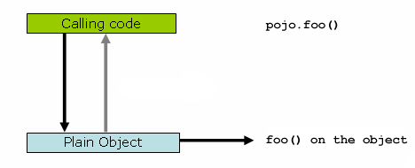
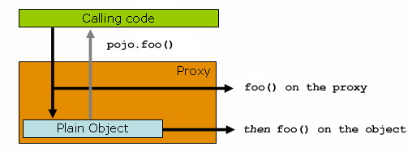

## 5. Aspect Oriented Programming with Spring

## 5.使用 Spring 进行面向切面编程

Aspect-oriented Programming (AOP) complements Object-oriented Programming (OOP) by providing another way of thinking about program structure. The key unit of modularity in OOP is the class, whereas in AOP the unit of modularity is the aspect. Aspects enable the modularization of concerns (such as transaction management) that cut across multiple types and objects. (Such concerns are often termed “crosscutting” concerns in AOP literature.)

One of the key components of Spring is the AOP framework. While the Spring IoC container does not depend on AOP (meaning you do not need to use AOP if you don’t want to), AOP complements Spring IoC to provide a very capable middleware solution.

面向切面编程（AOP）通过提供另一种思考程序结构的方式来**补充**面向对象编程（OOP）。在 OOP 中，模块化的关键单元是类，而在 AOP 中，模块化的单元是切面。切面支持跨多个类型和对象的关注点（如事务管理）的模块化。（在 AOP 文献中，此类关注点通常被称为「横切」关注点。）

Spring 的关键组件之一是 AOP 框架。虽然 Spring IoC 容器不依赖于 AOP（这意味着如果不想使用 AOP，就不需要使用 AOP），但AOP 补充了 Spring IoC，提供了一个功能强大的中间件解决方案。

> ​                                                                       Spring AOP with AspectJ pointcuts
>
> Spring provides simple and powerful ways of writing custom aspects by using either a [schema-based approach](https://docs.spring.io/spring-framework/docs/current/reference/html/core.html#aop-schema) or the [@AspectJ annotation style](https://docs.spring.io/spring-framework/docs/current/reference/html/core.html#aop-ataspectj). Both of these styles offer fully typed advice and use of the AspectJ pointcut language while still using Spring AOP for weaving.
>
> This chapter discusses the schema- and @AspectJ-based AOP support. The lower-level AOP support is discussed in [the following chapter](https://docs.spring.io/spring-framework/docs/current/reference/html/core.html#aop-api).
>
> ​                                                                    带有 AspectJ 切入点的 Spring AOP
> Spring 通过使用 [schema-based approach](https://docs.spring.io/spring-framework/docs/current/reference/html/core.html#aop-schema) 或 [@AspectJ注解样式](https://docs.spring.io/spring-framework/docs/current/reference/html/core.html#aop-ataspectj) 提供了编写自定义切面的简单而强大的方法。这两种风格都提供了完整类型的通知和 AspectJ 切入点语言的使用，同时仍然使用 Spring AOP 进行编织。
>
> 本章讨论基于模式（schema）和 @AspectJ 的 AOP 支持。较低级别的 AOP 支持将在[下一章](https://docs.spring.io/spring-framework/docs/current/reference/html/core.html#aop-api) 中讨论。

AOP is used in the Spring Framework to:

- Provide declarative enterprise services. The most important such service is [declarative transaction management](https://docs.spring.io/spring-framework/docs/current/reference/html/data-access.html#transaction-declarative).
- Let users implement custom aspects, complementing their use of OOP with AOP.

AOP 在 Spring 框架中用于：

- 提供声明性企业服务。最重要的此类服务是[声明式事务管理](https://docs.spring.io/spring-framework/docs/current/reference/html/data-access.html#transaction-declarative)。
- 让用户实现自定义切面，用 AOP 补充 OOP 的使用。

> If you are interested only in generic declarative services or other pre-packaged declarative middleware services such as pooling, you do not need to work directly with Spring AOP, and can skip most of this chapter.
>
> 如果您只对通用声明性服务或其他预打包的声明性中间件服务（如池）感兴趣，则不需要直接使用 Spring AOP，可以跳过本章的大部分内容。

### 5.1. AOP Concepts

### 5.1. AOP 概念

Let us begin by defining some central AOP concepts and terminology. These terms are not Spring-specific. Unfortunately, AOP terminology is not particularly intuitive. However, it would be even more confusing if Spring used its own terminology.

- Aspect: A modularization of a concern that cuts across multiple classes. Transaction management is a good example of a crosscutting concern in enterprise Java applications. In Spring AOP, aspects are implemented by using regular classes (the [schema-based approach](https://docs.spring.io/spring-framework/docs/current/reference/html/core.html#aop-schema)) or regular classes annotated with the `@Aspect` annotation (the [@AspectJ style](https://docs.spring.io/spring-framework/docs/current/reference/html/core.html#aop-ataspectj)).
- Join point: A point during the execution of a program, such as the execution of a method or the handling of an exception. In Spring AOP, a join point always represents a method execution.
- Advice: Action taken by an aspect at a particular join point. Different types of advice include “around”, “before” and “after” advice. (Advice types are discussed later.) Many AOP frameworks, including Spring, model an advice as an interceptor and maintain a chain of interceptors around the join point.
- Pointcut: A predicate that matches join points. Advice is associated with a pointcut expression and runs at any join point matched by the pointcut (for example, the execution of a method with a certain name). The concept of join points as matched by pointcut expressions is central to AOP, and Spring uses the AspectJ pointcut expression language by default.
- Introduction: Declaring additional methods or fields on behalf of a type. Spring AOP lets you introduce new interfaces (and a corresponding implementation) to any advised object. For example, you could use an introduction to make a bean implement an `IsModified` interface, to simplify caching. (An introduction is known as an inter-type declaration in the AspectJ community.)
- Target object: An object being advised by one or more aspects. Also referred to as the “advised object”. Since Spring AOP is implemented by using runtime proxies, this object is always a proxied object.
- AOP proxy: An object created by the AOP framework in order to implement the aspect contracts (advise method executions and so on). In the Spring Framework, an AOP proxy is a JDK dynamic proxy or a CGLIB proxy.
- Weaving: linking aspects with other application types or objects to create an advised object. This can be done at compile time (using the AspectJ compiler, for example), load time, or at runtime. Spring AOP, like other pure Java AOP frameworks, performs weaving at runtime.

让我们首先定义一些核心 AOP 概念和术语。这些术语不是特定于 Spring 的。不幸的是，AOP 术语并不是特别直观。然而，如果Spring 使用自己的术语，它将更加令人困惑。

- 切面（Aspect）：跨多个类的关注点的模块化。事务管理是企业 Java 应用程序中横切关注点的一个很好的例子。在 Spring AOP 中，切面是通过使用常规类[基于模式（schema）的方式](https://docs.spring.io/spring-framework/docs/current/reference/html/core.html#aop-schema)或用 `@Aspect`注解（[@AspectJ样式](https://docs.spring.io/spring-framework/docs/current/reference/html/core.html#aop-ataspectj)）注解的常规类来实现的。
- 连接点（Join point）：程序执行过程中的一个点，如方法的执行或异常的处理。在 Spring AOP 中，连接点总是表示方法执行。
- 通知（Advice）：切面在特定连接点采取的操作。不同类型的通知包括 `around`、`before` 和 `after` 通知。（通知类型将在后面讨论。）包括 Spring 在内的许多 AOP 框架都将通知建模为拦截器，并在连接点周围维护拦截器链。
- 切入点（Pointcut）：匹配连接点的谓词。Advice 与切入点表达式关联，并在与切入点匹配的任何连接点上运行（例如，使用特定名称执行方法）。由切入点表达式匹配的连接点概念是AOP的核心，Spring 默认使用 AspectJ 切入点表达式语言。
- 简介（Introduction）：代表类型声明其他方法或字段。Spring AOP 允许您向任何通知的对象引入新接口（以及相应的实现）。例如，您可以使用介绍让 bean 实现一个 `IsModified` 接口，以简化缓存。（介绍在 AspectJ 社区中称为类型间声明。）
- 目标对象（Target object）：一个或多个切面通知的对象。也称为“通知对象”。由于 Spring AOP 是通过使用运行时代理来实现的，所以该对象始终是一个代理对象。
- AOP 代理（AOP proxy）：AOP 框架创建的一个对象，用于实现切面契约（通知方法执行等）。在 Spring 框架中，AOP 代理是JDK 动态代理或 CGLIB 代理。
- 编织（Weaving）：将切面与其他应用程序类型或对象链接，以创建通知对象。这可以在编译时（例如使用 AspectJ 编译器）、加载时或运行时完成。Spring AOP 和其他纯 Java AOP 框架一样，在运行时执行编织。

Spring AOP includes the following types of advice:

- Before advice: Advice that runs before a join point but that does not have the ability to prevent execution flow proceeding to the join point (unless it throws an exception).
- After returning advice: Advice to be run after a join point completes normally (for example, if a method returns without throwing an exception).
- After throwing advice: Advice to be run if a method exits by throwing an exception.
- After (finally) advice: Advice to be run regardless of the means by which a join point exits (normal or exceptional return).
- Around advice: Advice that surrounds a join point such as a method invocation. This is the most powerful kind of advice. Around advice can perform custom behavior before and after the method invocation. It is also responsible for choosing whether to proceed to the join point or to shortcut the advised method execution by returning its own return value or throwing an exception.

Around advice is the most general kind of advice. Since Spring AOP, like AspectJ, provides a full range of advice types, we recommend that you use the least powerful advice type that can implement the required behavior. For example, if you need only to update a cache with the return value of a method, you are better off implementing an after returning advice than an around advice, although an around advice can accomplish the same thing. Using the most specific advice type provides a simpler programming model with less potential for errors. For example, you do not need to invoke the `proceed()` method on the `JoinPoint` used for around advice, and, hence, you cannot fail to invoke it.

All advice parameters are statically typed so that you work with advice parameters of the appropriate type (e.g. the type of the return value from a method execution) rather than `Object` arrays.

The concept of join points matched by pointcuts is the key to AOP, which distinguishes it from older technologies offering only interception. Pointcuts enable advice to be targeted independently of the object-oriented hierarchy. For example, you can apply an around advice providing declarative transaction management to a set of methods that span multiple objects (such as all business operations in the service layer).

Spring AOP 包括以下类型的通知：

- Before advice：在连接点之前运行的通知，但不能阻止执行流继续流向连接点（除非它引发异常）。
- After returning advice：在连接点正常完成后运行的通知（例如，如果方法返回时没有引发异常）。
- After throwing advice：如果方法通过抛出异常退出，则要运行的通知。
- After (finally) advice：无论连接点以何种方式退出（正常或异常返回），都要运行的通知。
- Around advice：围绕连接点（如方法调用）的通知。这是最有力的通知。Around advice可以在方法调用前后执行自定义行为。它还负责选择是继续连接点，还是通过返回自己的返回值或引发异常来缩短通知的方法执行。

环绕通知是最普遍的通知。因为 Spring AOP 和 AspectJ 一样，提供了全套的通知类型，所以我们通知您使用功能最差的通知类型来实现所需的行为。例如，如果只需要使用方法的返回值更新缓存，那么最好实现返回后的通知，而不是环绕通知，尽管环绕通知可以实现同样的功能。使用最具体的通知类型提供了一个更简单的编程模型，错误的可能性更小。例如，您不需要在用于around 通知的 `JoinPoint` 上调用 `proceed()` 方法，因此，您不能不调用它。

所有通知参数都是静态类型的，因此您可以使用适当类型的通知参数（例如，方法执行返回值的类型），而不是 `Object` 数组。

连接点与切入点匹配的概念是 AOP 的关键，AOP 将其与只提供拦截的旧技术区分开来。切入点使通知成为独立于面向对象层次结构的目标。例如，您可以将提供声明性事务管理的 around 通知应用于跨多个对象的一组方法（例如服务层中的所有业务操作）。

### 5.2. Spring AOP Capabilities and Goals

### 5.2. Spring AOP 能力和目标

Spring AOP is implemented in pure Java. There is no need for a special compilation process. Spring AOP does not need to control the class loader hierarchy and is thus suitable for use in a servlet container or application server.

Spring AOP currently supports only method execution join points (advising the execution of methods on Spring beans). Field interception is not implemented, although support for field interception could be added without breaking the core Spring AOP APIs. If you need to advise field access and update join points, consider a language such as AspectJ.

Spring AOP’s approach to AOP differs from that of most other AOP frameworks. The aim is not to provide the most complete AOP implementation (although Spring AOP is quite capable). Rather, the aim is to provide a close integration between AOP implementation and Spring IoC, to help solve common problems in enterprise applications.

Thus, for example, the Spring Framework’s AOP functionality is normally used in conjunction with the Spring IoC container. Aspects are configured by using normal bean definition syntax (although this allows powerful “auto-proxying” capabilities). This is a crucial difference from other AOP implementations. You cannot do some things easily or efficiently with Spring AOP, such as advise very fine-grained objects (typically, domain objects). AspectJ is the best choice in such cases. However, our experience is that Spring AOP provides an excellent solution to most problems in enterprise Java applications that are amenable to AOP.

Spring AOP never strives to compete with AspectJ to provide a comprehensive AOP solution. We believe that both proxy-based frameworks such as Spring AOP and full-blown frameworks such as AspectJ are valuable and that they are complementary, rather than in competition. Spring seamlessly integrates Spring AOP and IoC with AspectJ, to enable all uses of AOP within a consistent Spring-based application architecture. This integration does not affect the Spring AOP API or the AOP Alliance API. Spring AOP remains backward-compatible. See [the following chapter](https://docs.spring.io/spring-framework/docs/current/reference/html/core.html#aop-api) for a discussion of the Spring AOP APIs.

Spring AOP 是用纯 Java 实现的。不需要特殊的编译过程。Spring AOP 不需要控制类加载器层次结构，因此适合在 servlet 容器或应用服务器中使用。

Spring AOP 目前只支持方法执行连接点（通知在 Spring Bean 上执行方法）。虽然可以在不破坏核心 Spring AOP API 的情况下添加对字段拦截的支持，但字段拦截并未实现。如果需要通知字段访问和更新连接点，请考虑诸如 AspectJ 之类的语言。

Spring AOP 的 AOP 方法不同于大多数其他 AOP 框架。其目的不是提供最完整的 AOP 实现（尽管 Spring AOP 功能强大）。相反，其目的是在 AOP 实现和 Spring IoC 之间提供紧密集成，以帮助解决企业应用程序中的常见问题。

因此，例如，Spring 框架的 AOP 功能通常与 Spring IoC 容器一起使用。切面是通过使用普通的 bean 定义语法配置的（尽管这允许强大的「自动代理」功能）。这是与其他 AOP 实现的一个关键区别。使用 Spring AOP 无法轻松高效地完成某些事情，例如通知非常细粒度的对象（通常是域对象）。在这种情况下，AspectJ 是最佳选择。然而，根据我们的经验，Spring AOP 为企业 Java 应用程序中大多数适用于 AOP 的问题提供了极好的解决方案。

Spring AOP 从未努力与 AspectJ 竞争以提供全面的 AOP 解决方案。我们相信基于代理的框架（如 Spring AOP）和成熟的框架（如AspectJ）都是有价值的，**它们是互补的，而不是竞争的**。Spring 将 Spring AOP 和 IoC 与 AspectJ 无缝集成，以便在基于 Spring 的一致应用程序体系结构中实现 AOP 的所有使用。这种集成不会影响 Spring AOP API 或 AOP Alliance API。Spring AOP 保持向后兼容。有关 Spring AOP API 的讨论，请参见[下一章](https://docs.spring.io/spring-framework/docs/current/reference/html/core.html#aop-api)。

> One of the central tenets of the Spring Framework is that of non-invasiveness. This is the idea that you should not be forced to introduce framework-specific classes and interfaces into your business or domain model. However, in some places, the Spring Framework does give you the option to introduce Spring Framework-specific dependencies into your codebase. The rationale in giving you such options is because, in certain scenarios, it might be just plain easier to read or code some specific piece of functionality in such a way. However, the Spring Framework (almost) always offers you the choice: You have the freedom to make an informed decision as to which option best suits your particular use case or scenario.One such choice that is relevant to this chapter is that of which AOP framework (and which AOP style) to choose. You have the choice of AspectJ, Spring AOP, or both. You also have the choice of either the @AspectJ annotation-style approach or the Spring XML configuration-style approach. The fact that this chapter chooses to introduce the @AspectJ-style approach first should not be taken as an indication that the Spring team favors the @AspectJ annotation-style approach over the Spring XML configuration-style.See [Choosing which AOP Declaration Style to Use](https://docs.spring.io/spring-framework/docs/current/reference/html/core.html#aop-choosing) for a more complete discussion of the “whys and wherefores” of each style.
>
> Spring 框架的核心原则之一是非侵入性。这就是不应该强迫您在业务或域模型中引入特定于框架的类和接口的想法。然而，在某些地方，Spring 框架确实为您提供了在代码库中引入 Spring 框架特定依赖项的选项。为您提供这些选项的理由是，在某些情况下，以这种方式阅读或编写某些特定功能可能更容易。然而，Spring 框架（几乎）总是为您提供选择：您可以自由地做出明智的决定，选择最适合您的特定用例或场景的选项。与本章相关的一个选择是选择哪种 AOP 框架（以及哪种 AOP 风格）。您可以选择 AspectJ、Spring AOP 或两者兼有。您还可以选择 @AspectJ 注解风格方法或 Spring XML 配置风格方法。本章选择首先介绍 @AspectJ 风格的方法，这一事实不应被视为 Spring 团队支持 @AspectJ 注解风格的方法，而不是 Spring XML 配置风格。请参阅[选择要使用的AOP声明样式](https://docs.spring.io/spring-framework/docs/current/reference/html/core.html#aop-choosing) ，以更完整地讨论每种样式的“原因”。

### 5.3. AOP Proxies

### 5.3.AOP 代理

Spring AOP defaults to using standard JDK dynamic proxies for AOP proxies. This enables any interface (or set of interfaces) to be proxied.

Spring AOP can also use CGLIB proxies. This is necessary to proxy classes rather than interfaces. By default, CGLIB is used if a business object does not implement an interface. As it is good practice to program to interfaces rather than classes, business classes normally implement one or more business interfaces. It is possible to [force the use of CGLIB](https://docs.spring.io/spring-framework/docs/current/reference/html/core.html#aop-proxying), in those (hopefully rare) cases where you need to advise a method that is not declared on an interface or where you need to pass a proxied object to a method as a concrete type.

It is important to grasp the fact that Spring AOP is proxy-based. See [Understanding AOP Proxies](https://docs.spring.io/spring-framework/docs/current/reference/html/core.html#aop-understanding-aop-proxies) for a thorough examination of exactly what this implementation detail actually means.

Spring AOP 默认使用标准 JDK 动态代理作为 AOP 代理。这允许代理任何接口（或一组接口）。

Spring AOP 也可以使用 CGLIB 代理。这对于代理类而不是接口是必要的。默认情况下，如果业务对象未实现接口，则使用CGLIB。由于编程到接口而不是类是很好的实践，所以业务类通常实现一个或多个业务接口。在需要通知未在接口上声明的方法或需要将代理对象作为具体类型传递给方法的情况下（希望很少），可以[强制使用 CGLIB](https://docs.spring.io/spring-framework/docs/current/reference/html/core.html#aop-proxying)。

掌握 Spring AOP 是基于代理的这一事实很重要。请参阅[了解 AOP 代理](https://docs.spring.io/spring-framework/docs/current/reference/html/core.html#aop-understanding-aop-proxies)以全面了解此实现细节的实际含义。

### 5.4. @AspectJ support

### 5.4. @AspectJ 支持

@AspectJ refers to a style of declaring aspects as regular Java classes annotated with annotations. The @AspectJ style was introduced by the [AspectJ project](https://www.eclipse.org/aspectj) as part of the AspectJ 5 release. Spring interprets the same annotations as AspectJ 5, using a library supplied by AspectJ for pointcut parsing and matching. The AOP runtime is still pure Spring AOP, though, and there is no dependency on the AspectJ compiler or weaver.

@AspectJ 是一种将切面声明为带有注解的常规 Java 类的风格。@AspectJ 样式是由 [AspectJ 项目](https://www.eclipse.org/aspectj)作为 AspectJ 5 版本的一部分引入的。Spring 使用 AspectJ 提供的用于切入点解析和匹配的库来解释与 AspectJ 5 相同的注解。不过，AOP 运行时仍然是纯 Spring AOP，并且不依赖 AspectJ 编译器或 weaver。

> Using the AspectJ compiler and weaver enables use of the full AspectJ language and is discussed in [Using AspectJ with Spring Applications](https://docs.spring.io/spring-framework/docs/current/reference/html/core.html#aop-using-aspectj).
>
> 使用 AspectJ 编译器和 weaver 可以使用完整的 AspectJ 语言，并在[Using AspectJ with Spring Applications](https://docs.spring.io/spring-framework/docs/current/reference/html/core.html#aop-using-aspectj) 中讨论。

#### 5.4.1. Enabling @AspectJ Support

#### 5.4.1. 启用 @AspectJ 支持

To use @AspectJ aspects in a Spring configuration, you need to enable Spring support for configuring Spring AOP based on @AspectJ aspects and auto-proxying beans based on whether or not they are advised by those aspects. By auto-proxying, we mean that, if Spring determines that a bean is advised by one or more aspects, it automatically generates a proxy for that bean to intercept method invocations and ensures that advice is run as needed.

The @AspectJ support can be enabled with XML- or Java-style configuration. In either case, you also need to ensure that AspectJ’s `aspectjweaver.jar` library is on the classpath of your application (version 1.8 or later). This library is available in the `lib` directory of an AspectJ distribution or from the Maven Central repository.

要在 Spring 配置中使用 @AspectJ aspects，您需要启用 Spring 支持，以基于 @AspectJ aspects 配置 Spring AOP，并基于这些切面是否通知它们自动代理 bean。通过自动代理，我们的意思是，如果 Spring 确定一个 bean 由一个或多个切面提供通知，它会自动为该 bean 生成一个代理来拦截方法调用，并确保根据需要运行通知。

@AspectJ 支持可以通过 XML 或 Java 风格的配置启用。在这两种情况下，您还需要确保 AspectJ 的 `aspectjweaver.jar` 库位于应用程序（1.8版或更高版本）的类路径上。该库位于 AspectJ 发行版的 `lib` 目录中，也可以从 Maven 中央存储库获得。

##### Enabling @AspectJ Support with Java Configuration

##### 通过 Java 配置启用 @AspectJ 支持

To enable @AspectJ support with Java `@Configuration`, add the `@EnableAspectJAutoProxy` annotation, as the following example shows:

要使用 Java `@Configuration` 启用 @AspectJ 支持，请添加 `@EnableAspectJAutoProxy` 注解，如下例所示：

```java
@Configuration
@EnableAspectJAutoProxy
public class AppConfig {

}
```

##### Enabling @AspectJ Support with XML Configuration

##### 通过 XML 配置启用 @AspectJ 支持

To enable @AspectJ support with XML-based configuration, use the `aop:aspectj-autoproxy` element, as the following example shows:

要使用基于 XML 的配置启用 @AspectJ 支持，请使用 `aop:aspectj-autoproxy` 元素，如下例所示：

```xml
<aop:aspectj-autoproxy/>
```

This assumes that you use schema support as described in [XML Schema-based configuration](https://docs.spring.io/spring-framework/docs/current/reference/html/core.html#xsd-schemas). See [the AOP schema](https://docs.spring.io/spring-framework/docs/current/reference/html/core.html#xsd-schemas-aop) for how to import the tags in the `aop` namespace.

这假设您使用 [XML基于模式的配置](https://docs.spring.io/spring-framework/docs/current/reference/html/core.html#xsd-schemas) 中描述的模式支持。有关如何在 `aop` 名称空间中导入标记，请参见[AOP模式](https://docs.spring.io/spring-framework/docs/current/reference/html/core.html#xsd-schemas-aop)。

#### 5.4.2. Declaring an Aspect

#### 5.4.2. 声明一个切面

With @AspectJ support enabled, any bean defined in your application context with a class that is an @AspectJ aspect (has the `@Aspect` annotation) is automatically detected by Spring and used to configure Spring AOP. The next two examples show the minimal definition required for a not-very-useful aspect.

The first of the two example shows a regular bean definition in the application context that points to a bean class that has the `@Aspect` annotation:

启用 @AspectJ 支持后，Spring会 自动检测在应用程序上下文中定义的任何 bean，该 bean 的类是 @AspectJ 切面（具有`@Aspect` 注解），并用于配置 Spring AOP。接下来的两个示例显示了一个不太有用的切面所需的最小定义。

两个示例中的第一个示例显示了应用程序上下文中的常规 bean 定义，该定义指向具有 `@Aspect` 注解的 bean 类：

```xml
<bean id="myAspect" class="org.xyz.NotVeryUsefulAspect">
    <!-- configure properties of the aspect here -->
</bean>
```

The second of the two examples shows the `NotVeryUsefulAspect` class definition, which is annotated with the `org.aspectj.lang.annotation.Aspect` annotation;

两个示例中的第二个示例显示了 `NotVeryUsefulAspect` 类定义，该类定义用 ``org.aspectj.lang.annotation.Aspect`` 注解注解；

```java
package org.xyz;
import org.aspectj.lang.annotation.Aspect;

@Aspect
public class NotVeryUsefulAspect {

}
```

Aspects (classes annotated with `@Aspect`) can have methods and fields, the same as any other class. They can also contain pointcut, advice, and introduction (inter-type) declarations.

Aspects（用 `@Aspect`  注解的类）可以有方法和字段，与任何其他类一样。它们还可以包含切入点、通知和介绍（类型间）声明。

>   ​                                                            Autodetecting aspects through component scanning
>
>   You can register aspect classes as regular beans in your Spring XML configuration, via `@Bean` methods in `@Configuration` classes, or have Spring autodetect them through classpath scanning — the same as any other Spring-managed bean. However, note that the `@Aspect` annotation is not sufficient for autodetection in the classpath. For that purpose, you need to add a separate `@Component` annotation (or, alternatively, a custom stereotype annotation that qualifies, as per the rules of Spring’s component scanner).
>
>   ​                                                                    通过组件扫描自动检测切面
>
>   您可以通过`@configuration`类中的`@Bean`方法将切面类注册为 Spring XML 配置中的常规 Bean，或者让 Spring 通过类路径扫描自动检测它们 — 和其他 Spring 管理的 bean 一样。但是，请注意，`@Aspect` 注解不足以在类路径中进行自动检测。为此，您需要添加一个单独的 `@Component` 注解（或者，根据 Spring 组件扫描程序的规则，添加一个符合条件的自定义原型注解）。

> ​                                                                          Advising aspects with other aspects?
>
> In Spring AOP, aspects themselves cannot be the targets of advice from other aspects. The `@Aspect` annotation on a class marks it as an aspect and, hence, excludes it from auto-proxying.
>
> ​                                                                                     通知切面与其他切面？
>
> 在 Spring AOP 中，切面本身不能成为其他切面通知的目标。类上的 `@Aspect` 注解将其标记为切面，因此将其从自动代理中排除。

#### 5.4.3. Declaring a Pointcut

#### 5.4.3. 宣布切入点

Pointcuts determine join points of interest and thus enable us to control when advice runs. Spring AOP only supports method execution join points for Spring beans, so you can think of a pointcut as matching the execution of methods on Spring beans. A pointcut declaration has two parts: a signature comprising a name and any parameters and a pointcut expression that determines exactly which method executions we are interested in. In the @AspectJ annotation-style of AOP, a pointcut signature is provided by a regular method definition, and the pointcut expression is indicated by using the `@Pointcut` annotation (the method serving as the pointcut signature must have a `void` return type).

An example may help make this distinction between a pointcut signature and a pointcut expression clear. The following example defines a pointcut named `anyOldTransfer` that matches the execution of any method named `transfer`:

切入点确定感兴趣的连接点，从而使我们能够控制何时运行通知。Spring AOP 只支持 Spring Bean 的方法执行连接点，因此可以将切入点视为与 Spring Bean 上方法的执行相匹配。切入点声明有两个部分：一个由名称和任何参数组成的签名，以及一个确定我们感兴趣的方法执行的切入点表达式。在 AOP 的 @AspectJ 注解样式中，切入点签名由常规方法定义提供，切入点表达式通过使用 `@Pointcut` 注解来指示（用作切入点签名的方法必须具有 `void` 返回类型）。

一个例子可能有助于明确切入点签名和切入点表达式之间的区别。下面的示例定义了一个名为 `anyOldTransfer` 的切入点，该切入点与任何名为 `transfer` 的方法的执行相匹配：

```java
@Pointcut("execution(* transfer(..))") // the pointcut expression
private void anyOldTransfer() {} // the pointcut signature
```

The pointcut expression that forms the value of the `@Pointcut` annotation is a regular AspectJ pointcut expression. For a full discussion of AspectJ’s pointcut language, see the [AspectJ Programming Guide](https://www.eclipse.org/aspectj/doc/released/progguide/index.html) (and, for extensions, the [AspectJ 5 Developer’s Notebook](https://www.eclipse.org/aspectj/doc/released/adk15notebook/index.html)) or one of the books on AspectJ (such as *Eclipse AspectJ*, by Colyer et al., or *AspectJ in Action*, by Ramnivas Laddad).

构成 `@Pointcut` 注解值的切入点表达式是常规 AspectJ 切入点表达式。有关 AspectJ 切入点语言的完整讨论，请参阅 [AspectJ编程指南](https://www.eclipse.org/aspectj/doc/released/progguide/index.html)（以及[AspectJ 5开发者笔记本](https://www.eclipse.org/aspectj/doc/released/adk15notebook/index.html)）或 AspectJ 相关书籍（如 Colyer 等人的 Eclipse AspectJ，或 Ramnivas Laddad 的 AspectJ in Action）。

##### Supported Pointcut Designators

##### 支持的切入点指示符

Spring AOP supports the following AspectJ pointcut designators (PCD) for use in pointcut expressions:

- `execution`: For matching method execution join points. This is the primary pointcut designator to use when working with Spring AOP.
- `within`: Limits matching to join points within certain types (the execution of a method declared within a matching type when using Spring AOP).
- `this`: Limits matching to join points (the execution of methods when using Spring AOP) where the bean reference (Spring AOP proxy) is an instance of the given type.
- `target`: Limits matching to join points (the execution of methods when using Spring AOP) where the target object (application object being proxied) is an instance of the given type.
- `args`: Limits matching to join points (the execution of methods when using Spring AOP) where the arguments are instances of the given types.
- `@target`: Limits matching to join points (the execution of methods when using Spring AOP) where the class of the executing object has an annotation of the given type.
- `@args`: Limits matching to join points (the execution of methods when using Spring AOP) where the runtime type of the actual arguments passed have annotations of the given types.
- `@within`: Limits matching to join points within types that have the given annotation (the execution of methods declared in types with the given annotation when using Spring AOP).
- `@annotation`: Limits matching to join points where the subject of the join point (the method being run in Spring AOP) has the given annotation.

Spring AOP 支持在切入点表达式中使用以下 AspectJ 切入点指示符（PCD）：

- `execution`：用于匹配方法执行连接点。这是使用 Spring AOP 时要使用的主要切入点指示符。
- `within`：限制匹配到特定类型内的连接点（使用 Spring AOP 时在匹配类型内声明的方法的执行）。
- `this`：将匹配限制为连接点（使用 Spring AOP 时方法的执行），其中 bean 引用（Spring AOP 代理）是给定类型的实例。
- `target`：限制匹配到连接点（使用 Spring AOP 时方法的执行），其中目标对象（被代理的应用程序对象）是给定类型的实例。
- `args`：限制匹配到连接点（使用 Spring AOP 时方法的执行），其中参数是给定类型的实例。
- `@target`：限制匹配到连接点（使用 Spring AOP 时方法的执行），其中执行对象的类具有给定类型的注解。
- `@args`：限制匹配到连接点（使用 Spring AOP 时方法的执行），其中传递的实际参数的运行时类型具有给定类型的注解。
- `@within`：限制匹配到具有给定注解的类型内的连接点（使用 Spring AOP 时在具有给定注解的类型中声明的方法的执行）。
- `@annotation`：限制匹配到连接点的主题（在 Spring AOP 中运行的方法）具有给定注解的连接点。

> ​                                                                                        Other pointcut types
>
> The full AspectJ pointcut language supports additional pointcut designators that are not supported in Spring: `call`, `get`, `set`, `preinitialization`, `staticinitialization`, `initialization`, `handler`, `adviceexecution`, `withincode`, `cflow`, `cflowbelow`, `if`, `@this`, and `@withincode`. Use of these pointcut designators in pointcut expressions interpreted by Spring AOP results in an `IllegalArgumentException` being thrown.
>
> The set of pointcut designators supported by Spring AOP may be extended in future releases to support more of the AspectJ pointcut designators.
>
> ​                                                                                              其他切入点类型
> 完整的 AspectJ 切入点语言支持 Spring 中不支持的其他切入点指示符：`call`、`get`、`set`、`preinitialization`、`staticinitialization`、`initialization`、`handler`、`adviceexecution`、`withincode`、`cflow`、`CflowDown`、`if`、`this`、以及`withincode`。在 Spring AOP 解释的切入点表达式中使用这些切入点指示符会导致抛出`IllegalArgumentException`。
>
> Spring AOP 支持的切入点指示符集可能会在未来的版本中进行扩展，以支持更多的 AspectJ 切入点指示符。

Because Spring AOP limits matching to only method execution join points, the preceding discussion of the pointcut designators gives a narrower definition than you can find in the AspectJ programming guide. In addition, AspectJ itself has type-based semantics and, at an execution join point, both `this` and `target` refer to the same object: the object executing the method. Spring AOP is a proxy-based system and differentiates between the proxy object itself (which is bound to `this`) and the target object behind the proxy (which is bound to `target`).

因为 Spring AOP 将匹配限制为只匹配方法执行连接点，所以前面对切入点指示符的讨论给出了比 AspectJ 编程指南中更窄的定义。此外，AspectJ 本身具有基于类型的语义，在执行连接点，`this` 和 `target` 都指同一个对象：执行方法的对象。Spring AOP 是一个基于代理的系统，它区分代理对象本身（绑定到 `this`）和代理后面的目标对象（绑定到 `target`）。

> Due to the proxy-based nature of Spring’s AOP framework, calls within the target object are, by definition, not intercepted. For JDK proxies, only public interface method calls on the proxy can be intercepted. With CGLIB, public and protected method calls on the proxy are intercepted (and even package-visible methods, if necessary). However, common interactions through proxies should always be designed through public signatures.
>
> Note that pointcut definitions are generally matched against any intercepted method. If a pointcut is strictly meant to be public-only, even in a CGLIB proxy scenario with potential non-public interactions through proxies, it needs to be defined accordingly.
>
> If your interception needs include method calls or even constructors within the target class, consider the use of Spring-driven [native AspectJ weaving](https://docs.spring.io/spring-framework/docs/current/reference/html/core.html#aop-aj-ltw) instead of Spring’s proxy-based AOP framework. This constitutes a different mode of AOP usage with different characteristics, so be sure to make yourself familiar with weaving before making a decision.
>
> 由于 Spring 的 AOP 框架基于代理的特性，根据定义，目标对象内的调用不会被拦截。对于 JDK 代理，只能拦截代理上的公共接口方法调用。使用 CGLIB，可以拦截代理上的公共和受保护的方法调用（如果需要，甚至可以打包可见的方法）。然而，通过代理进行的公共交互应始终通过公共签名进行设计。
>
> 请注意，切入点定义通常与任何截取的方法相匹配。如果切入点严格意义上是仅公开的，即使在 CGLIB 代理场景中，通过代理进行潜在的非公开交互，也需要相应地定义它。
>
> 如果您的拦截需要包括目标类中的方法调用或甚至构造函数，请考虑使用 Spring 驱动的 [原生 AspectJ 编织](https://docs.spring.io/spring-framework/docs/current/reference/html/core.html#aop-aj-ltw)，而不是 Spring基于代理的 AOP 框架。这构成了一种不同的 AOP 使用模式，具有不同的特点，因此在做出决定之前，一定要熟悉编织。

Spring AOP also supports an additional PCD named `bean`. This PCD lets you limit the matching of join points to a particular named Spring bean or to a set of named Spring beans (when using wildcards). The `bean` PCD has the following form:

Spring AOP 还支持一个名为 `bean` 的附加 PCD。此 PCD 允许您将连接点的匹配限制为特定的命名 Spring Bean 或一组命名Spring Bean（使用通配符时）。 `bean` PCD 的形式如下：

```java
bean(idOrNameOfBean)
```

The `idOrNameOfBean` token can be the name of any Spring bean. Limited wildcard support that uses the `*` character is provided, so, if you establish some naming conventions for your Spring beans, you can write a `bean` PCD expression to select them. As is the case with other pointcut designators, the `bean` PCD can be used with the `&&` (and), `||` (or), and `!` (negation) operators, too.

`idOrNameOfBean` 标记可以是任何 Spring Bean 的名称。提供了使用 `*` 字符的有限通配符支持，因此，如果您为 Spring Bean 建立了一些命名约定，您可以编写一个 `bean`  PCD 表达式来选择它们。与其他切入点指示符一样，`bean` PCD 可以与 `&&`（and）、`||`（or）和`!`一起使用（否定）运算符也是。

>   The `bean` PCD is supported only in Spring AOP and not in native AspectJ weaving. It is a Spring-specific extension to the standard PCDs that AspectJ defines and is, therefore, not available for aspects declared in the `@Aspect` model.
>
>   The `bean` PCD operates at the instance level (building on the Spring bean name concept) rather than at the type level only (to which weaving-based AOP is limited). Instance-based pointcut designators are a special capability of Spring’s proxy-based AOP framework and its close integration with the Spring bean factory, where it is natural and straightforward to identify specific beans by name.
>
>   `bean` PCD 仅在 Spring AOP 中受支持，在本机 AspectJ 中不受支持。它是 AspectJ 定义的标准 PCD 的特定于 Spring 的扩展，因此不适用于在 `@Aspect` 模型中声明的切面。
>
>   `bean` PCD 在实例级别（基于 Spring Bean 名称概念）运行，而不仅仅是在类型级别（基于编织的 AOP 受到限制）。基于实例的切入点指示符是 Spring 基于代理的 AOP 框架及其与 Spring bean 工厂的紧密集成的一种特殊功能，在 Spring bean 工厂中，按名称识别特定的 bean 是自然而直接的。

##### Combining Pointcut Expressions

##### 组合切入点表达式

You can combine pointcut expressions by using `&&`， `||` and `!`. You can also refer to pointcut expressions by name. The following example shows three pointcut expressions:

您可以使用`&&`，`|`  和 `!` 组合切入点表达式。您还可以按名称引用切入点表达式。以下示例显示了三个切入点表达式：

```java
@Pointcut("execution(public * *(..))")
private void anyPublicOperation() {}    // 注释一

@Pointcut("within(com.xyz.myapp.trading..*)")
private void inTrading() {}   // 注释二

@Pointcut("anyPublicOperation() && inTrading()")
private void tradingOperation() {}    // 注释三
```

| 1    | `anyPublicOperation` matches if a method execution join point represents the execution of any public method.<br />`anyPublicOperation`匹配方法执行连接点是否代表任何公共方法的执行 |
| ---- | ------------------------------------------------------------ |
| 2    | `inTrading` matches if a method execution is in the trading module.<br />如果交易模块中有方法执行，则 `inTrading` 匹配。 |
| 3    | `tradingOperation` matches if a method execution represents any public method in the trading module.<br />`tradingOperation` 如果方法执行代表交易模块中的任何公共方法，则匹配。 |

It is a best practice to build more complex pointcut expressions out of smaller named components, as shown earlier. When referring to pointcuts by name, normal Java visibility rules apply (you can see private pointcuts in the same type, protected pointcuts in the hierarchy, public pointcuts anywhere, and so on). Visibility does not affect pointcut matching.

如前所示，用较小的命名组件构建更复杂的切入点表达式是最佳实践。当按名称引用切入点时，通常的 Java 可见性规则适用（您可以看到相同类型的私有切入点、层次结构中的受保护切入点、任何地方的公共切入点，等等）。可见性不影响切入点匹配。

##### Sharing Common Pointcut Definitions

##### 共享公共切入点定义

When working with enterprise applications, developers often want to refer to modules of the application and particular sets of operations from within several aspects. We recommend defining a `CommonPointcuts` aspect that captures common pointcut expressions for this purpose. Such an aspect typically resembles the following example:

在使用企业应用程序时，开发人员通常希望从几个切面介绍应用程序的模块和特定的操作集。我们推荐定义一个 `CommonPointcuts` 特性，用于捕获用于此目的的常见切入点表达式。这一切面通常类似于以下示例：

```java
package com.xyz.myapp;

import org.aspectj.lang.annotation.Aspect;
import org.aspectj.lang.annotation.Pointcut;

@Aspect
public class CommonPointcuts {

    /**
     * A join point is in the web layer if the method is defined
     * in a type in the com.xyz.myapp.web package or any sub-package
     * under that.
     */
    @Pointcut("within(com.xyz.myapp.web..*)")
    public void inWebLayer() {}

    /**
     * A join point is in the service layer if the method is defined
     * in a type in the com.xyz.myapp.service package or any sub-package
     * under that.
     */
    @Pointcut("within(com.xyz.myapp.service..*)")
    public void inServiceLayer() {}

    /**
     * A join point is in the data access layer if the method is defined
     * in a type in the com.xyz.myapp.dao package or any sub-package
     * under that.
     */
    @Pointcut("within(com.xyz.myapp.dao..*)")
    public void inDataAccessLayer() {}

    /**
     * A business service is the execution of any method defined on a service
     * interface. This definition assumes that interfaces are placed in the
     * "service" package, and that implementation types are in sub-packages.
     *
     * If you group service interfaces by functional area (for example,
     * in packages com.xyz.myapp.abc.service and com.xyz.myapp.def.service) then
     * the pointcut expression "execution(* com.xyz.myapp..service.*.*(..))"
     * could be used instead.
     *
     * Alternatively, you can write the expression using the 'bean'
     * PCD, like so "bean(*Service)". (This assumes that you have
     * named your Spring service beans in a consistent fashion.)
     */
    @Pointcut("execution(* com.xyz.myapp..service.*.*(..))")
    public void businessService() {}

    /**
     * A data access operation is the execution of any method defined on a
     * dao interface. This definition assumes that interfaces are placed in the
     * "dao" package, and that implementation types are in sub-packages.
     */
    @Pointcut("execution(* com.xyz.myapp.dao.*.*(..))")
    public void dataAccessOperation() {}

}
```

You can refer to the pointcuts defined in such an aspect anywhere you need a pointcut expression. For example, to make the service layer transactional, you could write the following:

您可以在任何需要切入点表达式的地方引用在这样一个切面中定义的切入点。例如，要使服务层具有事务性，可以编写以下代码：

```xml
<aop:config>
    <aop:advisor
        pointcut="com.xyz.myapp.CommonPointcuts.businessService()"
        advice-ref="tx-advice"/>
</aop:config>

<tx:advice id="tx-advice">
    <tx:attributes>
        <tx:method name="*" propagation="REQUIRED"/>
    </tx:attributes>
</tx:advice>
```

The `<aop:config>` and `<aop:advisor>` elements are discussed in [Schema-based AOP Support](https://docs.spring.io/spring-framework/docs/current/reference/html/core.html#aop-schema). The transaction elements are discussed in [Transaction Management](https://docs.spring.io/spring-framework/docs/current/reference/html/data-access.html#transaction).

`<aop:config>` 和 `<aop:advisor>` 元素在[Schema-based aop Support](https://docs.spring.io/spring-framework/docs/current/reference/html/core.html#aop-schema)中讨论。事务要素在[事务管理](https://docs.spring.io/spring-framework/docs/current/reference/html/data-access.html#transaction)中讨论。

##### Examples

##### 示例

Spring AOP users are likely to use the `execution` pointcut designator the most often. The format of an execution expression follows:

Spring AOP 用户可能最常使用 `execution` 切入点指示符。执行表达式的格式如下：

```
    execution(modifiers-pattern? ret-type-pattern declaring-type-pattern?name-pattern(param-pattern)
                throws-pattern?)
```

All parts except the returning type pattern (`ret-type-pattern` in the preceding snippet), the name pattern, and the parameters pattern are optional. The returning type pattern determines what the return type of the method must be in order for a join point to be matched. `*` is most frequently used as the returning type pattern. It matches any return type. A fully-qualified type name matches only when the method returns the given type. The name pattern matches the method name. You can use the `*` wildcard as all or part of a name pattern. If you specify a declaring type pattern, include a trailing `.` to join it to the name pattern component. The parameters pattern is slightly more complex: `()` matches a method that takes no parameters, whereas `(..)` matches any number (zero or more) of parameters. The `(*)` pattern matches a method that takes one parameter of any type. `(*,String)` matches a method that takes two parameters. The first can be of any type, while the second must be a `String`. Consult the [Language Semantics](https://www.eclipse.org/aspectj/doc/released/progguide/semantics-pointcuts.html) section of the AspectJ Programming Guide for more information.

除了返回类型模式（前面代码段中的 `ret-type-pattern` ）、名称模式和参数模式之外的所有部分都是可选的。返回类型模式决定了为了匹配连接点，方法的返回类型必须是什么最常用作返回类型模式。它匹配任何返回类型。完全限定类型名仅在方法返回给定类型时匹配。名称模式与方法名称匹配。您可以使用`*` 通配符作为名称模式的全部或部分。如果指定一个声明类型模式，请包含一个尾随的 `.` 将其连接到名称模式组件。参数模式稍微复杂一些：`()` 匹配一个不带参数的方法，而 `(..)` 匹配任意数量（零个或多个）的参数。`(*)` 模式匹配接受任何类型参数的方法`(*,String)` 匹配接受两个参数的方法。第一个可以是任何类型，而第二个必须是 `String`。有关更多信息，请参阅 AspectJ 编程指南的 [语言语义](https://www.eclipse.org/aspectj/doc/released/progguide/semantics-pointcuts.html) 部分。

The following examples show some common pointcut expressions:

以下示例显示了一些常见的切入点表达式：

- The execution of any public method:

    任何公开方法的执行：

    ```java
        execution(public * *(..))
    ```

- The execution of any method with a name that begins with `set`:

    任何名称以 `set` 开头的方法的执行：

    ```java
        execution(* set*(..))
    ```

- The execution of any method defined by the `AccountService` interface:

    执行 `AccountService` 接口定义的任何方法：

    ```java
        execution(* com.xyz.service.AccountService.*(..))
    ```

- The execution of any method defined in the `service` package:

    执行 `service` 包中定义的任何方法：

    ```java
        execution(* com.xyz.service.*.*(..))
    ```

- The execution of any method defined in the service package or one of its sub-packages:

    执行 service 包或其子包中定义的任何方法：

    ```java
        execution(* com.xyz.service..*.*(..))
    ```

- Any join point (method execution only in Spring AOP) within the service package:

    服务包中的任何连接点（仅在 Spring AOP 中执行方法）：

    ```java
        within(com.xyz.service.*)
    ```

- Any join point (method execution only in Spring AOP) within the service package or one of its sub-packages:

    服务包或其子包中的任何连接点（仅在 Spring AOP 中执行方法）：

    ```java
        within(com.xyz.service..*)
    ```

- Any join point (method execution only in Spring AOP) where the proxy implements the `AccountService` interface:

    代理实现 `AccountService` 接口的任何连接点（仅在 Spring AOP 中执行方法）：

    ```java
        this(com.xyz.service.AccountService)
    ```

    >'this' is more commonly used in a binding form. See the section on [Declaring Advice](https://docs.spring.io/spring-framework/docs/current/reference/html/core.html#aop-advice) for how to make the proxy object available in the advice body.
    >
    >`this` 更常用于绑定形式。有关如何使代理对象在通知正文中可用的信息，请参阅 [声明通知](https://docs.spring.io/spring-framework/docs/current/reference/html/core.html#aop-advice) 部分。

- Any join point (method execution only in Spring AOP) where the target object implements the `AccountService` interface:

    目标对象实现 `AccountService` 接口的任何连接点（仅在 Spring AOP 中执行方法）：

    ```
        target(com.xyz.service.AccountService)
    ```

    > 'target' is more commonly used in a binding form. See the [Declaring Advice](https://docs.spring.io/spring-framework/docs/current/reference/html/core.html#aop-advice) section for how to make the target object available in the advice body.
    >
    > `target` 更常用于绑定形式。有关如何使目标对象在通知正文中可用的信息，请参阅 [声明通知](https://docs.spring.io/spring-framework/docs/current/reference/html/core.html#aop-advice) 部分。

- Any join point (method execution only in Spring AOP) that takes a single parameter and where the argument passed at runtime is `Serializable`:

    任何连接点（仅在 Spring AOP 中执行方法），它接受一个参数，并且在运行时传递的参数是 `Serializable`：

    ```java
        args(java.io.Serializable)
    ```

    > 'args' is more commonly used in a binding form. See the [Declaring Advice](https://docs.spring.io/spring-framework/docs/current/reference/html/core.html#aop-advice) section for how to make the method arguments available in the advice body.
    >
    > `args` 更常用于绑定形式。有关如何使方法参数在通知正文中可用的信息，请参阅[声明通知](https://docs.spring.io/spring-framework/docs/current/reference/html/core.html#aop-advice)部分。

    Note that the pointcut given in this example is different from `execution(* *(java.io.Serializable))`. The args version matches if the argument passed at runtime is `Serializable`, and the execution version matches if the method signature declares a single parameter of type `Serializable`.

    请注意，本例中给出的切入点与 `execution(* *(java.io.Serializable))` 不同。如果在运行时传递的参数为 `Serializable`，则 args 版本匹配；如果方法签名声明了 `Serializable` 类型的单个参数，则执行版本匹配。

- Any join point (method execution only in Spring AOP) where the target object has a `@Transactional` annotation:

    目标对象具有 `@Transactional` 注解的任何连接点（仅在 Spring AOP 中执行方法）：

    ```java
        @target(org.springframework.transaction.annotation.Transactional)
    ```

    > You can also use '@target' in a binding form. See the [Declaring Advice](https://docs.spring.io/spring-framework/docs/current/reference/html/core.html#aop-advice) section for how to make the annotation object available in the advice body.
    >
    > 您还可以在绑定形式中使用 `@target`。有关如何使注解对象在通知正文中可用的信息，请参见 [声明通知](https://docs.spring.io/spring-framework/docs/current/reference/html/core.html#aop-advice) 部分。

- Any join point (method execution only in Spring AOP) where the declared type of the target object has an `@Transactional` annotation:

    任何连接点（仅在 Spring AOP 中执行方法），其中目标对象的声明类型具有 `@Transactional` 注解：

    ```java
        @within(org.springframework.transaction.annotation.Transactional)
    ```

    > You can also use '@within' in a binding form. See the [Declaring Advice](https://docs.spring.io/spring-framework/docs/current/reference/html/core.html#aop-advice) section for how to make the annotation object available in the advice body.
    >
    > 您也可以在绑定形式中使用 `@within`。有关如何使注解对象在通知正文中可用的信息，请参见 [声明通知](https://docs.spring.io/spring-framework/docs/current/reference/html/core.html#aop-advice) 部分。

- Any join point (method execution only in Spring AOP) where the executing method has an `@Transactional` annotation:

    执行方法具有 `@Transactional` 注解的任何连接点（仅在 Spring AOP 中执行方法）：

    ```
        @annotation(org.springframework.transaction.annotation.Transactional)
    ```

    > You can also use '@annotation' in a binding form. See the [Declaring Advice](https://docs.spring.io/spring-framework/docs/current/reference/html/core.html#aop-advice) section for how to make the annotation object available in the advice body.
    >
    > 您还可以在绑定形式中使用 `@annotation`。有关如何使注解对象在通知正文中可用的信息，请参见[声明通知](https://docs.spring.io/spring-framework/docs/current/reference/html/core.html#aop-advice)部分。

- Any join point (method execution only in Spring AOP) which takes a single parameter, and where the runtime type of the argument passed has the `@Classified` annotation:

    采用单个参数的任何连接点（仅在 Spring AOP 中执行方法），并且传递的参数的运行时类型具有 `@Classified` 注解：

    ```
        @args(com.xyz.security.Classified)
    ```

    > You can also use '@args' in a binding form. See the [Declaring Advice](https://docs.spring.io/spring-framework/docs/current/reference/html/core.html#aop-advice) section how to make the annotation object(s) available in the advice body.
    >
    > 您还可以在绑定形式中使用 `@args`。请参阅 [Declaration Advice](https://docs.spring.io/spring-framework/docs/current/reference/html/core.html#aop-advice) 一节，了解如何使注解对象在通知正文中可用。

- Any join point (method execution only in Spring AOP) on a Spring bean named `tradeService`:

    名为 `tradeService` 的 Spring bean 上的任何连接点（仅在 Spring AOP 中执行方法）：

    ```
        bean(tradeService)
    ```

- Any join point (method execution only in Spring AOP) on Spring beans having names that match the wildcard expression `*Service`:

    Spring Bean 上名称与通配符表达式 `*Service` 匹配的任何连接点（仅在 Spring AOP 中执行方法）：
    
    ```
        bean(*Service)
    ```

##### Writing Good Pointcuts

##### 写好切入点

During compilation, AspectJ processes pointcuts in order to optimize matching performance. Examining code and determining if each join point matches (statically or dynamically) a given pointcut is a costly process. (A dynamic match means the match cannot be fully determined from static analysis and that a test is placed in the code to determine if there is an actual match when the code is running). On first encountering a pointcut declaration, AspectJ rewrites it into an optimal form for the matching process. What does this mean? Basically, pointcuts are rewritten in DNF (Disjunctive Normal Form) and the components of the pointcut are sorted such that those components that are cheaper to evaluate are checked first. This means you do not have to worry about understanding the performance of various pointcut designators and may supply them in any order in a pointcut declaration.

在编译期间，AspectJ 处理切入点以优化匹配性能。检查代码并确定每个连接点是否匹配（静态或动态）给定的切入点是一个代价高昂的过程。（动态匹配意味着无法通过静态分析完全确定匹配，并且在代码中进行测试，以确定代码运行时是否存在实际匹配）。在第一次遇到切入点声明时，AspectJ 会将其重写为匹配过程的最佳形式。这是什么意思？基本上，切入点是用 DNF（析取范式）重写的，切入点的组件被排序，以便首先检查那些更便宜的组件。这意味着您不必担心理解各种切入点指示符的性能，并且可以在切入点声明中以任何顺序提供它们。

However, AspectJ can work only with what it is told. For optimal performance of matching, you should think about what they are trying to achieve and narrow the search space for matches as much as possible in the definition. The existing designators naturally fall into one of three groups: kinded, scoping, and contextual:

- Kinded designators select a particular kind of join point: `execution`, `get`, `set`, `call`, and `handler`.
- Scoping designators select a group of join points of interest (probably of many kinds): `within` and `withincode`
- Contextual designators match (and optionally bind) based on context: `this`, `target`, and `@annotation`

A well written pointcut should include at least the first two types (kinded and scoping). You can include the contextual designators to match based on join point context or bind that context for use in the advice. Supplying only a kinded designator or only a contextual designator works but could affect weaving performance (time and memory used), due to extra processing and analysis. Scoping designators are very fast to match, and using them means AspectJ can very quickly dismiss groups of join points that should not be further processed. A good pointcut should always include one if possible.

然而，AspectJ 只能使用它被告知的内容。为了获得最佳匹配性能，您应该考虑他们试图实现的目标，并在定义中尽可能缩小匹配的搜索空间。现有的指示符自然分为三类：同类、范围和上下文：

- 同类指示符选择特定类型的连接点：`execution`, `get`, `set`, `call` 和 `handler`。
- 作用域指示符选择一组感兴趣的连接点（可能有多种类型）：`within` 和`withincode`
- 上下文指示符根据上下文匹配（并可选绑定）：`this`、`target` 和 `@annotation`

一个写得好的切入点至少应该包括前两种类型（kinded 和 scoping）。可以基于连接点上下文包含要匹配的上下文指示符，也可以绑定该上下文以在通知中使用。只提供类似的指示符或仅提供上下文指示符是有效的，但由于额外的处理和分析，可能会影响编织性能（使用的时间和内存）。范围指示符的匹配速度非常快，使用它们意味着 AspectJ 可以非常快地消除不应该进一步处理的连接点组。如果可能的话，一个好的切入点应该包括一个切入点。

#### 5.4.4. Declaring Advice

#### 5.4.4. 声明通知

Advice is associated with a pointcut expression and runs before, after, or around method executions matched by the pointcut. The pointcut expression may be either a simple reference to a named pointcut or a pointcut expression declared in place.

Advice 与切入点表达式相关联，并在与切入点匹配的方法执行之前、之后或前后运行。切入点表达式可以是对命名切入点的简单引用，也可以是就地声明的切入点表达式。

##### Before Advice

You can declare before advice in an aspect by using the `@Before` annotation:

可以使用 `@before` 注解在切面中声明 before 通知：

```java
import org.aspectj.lang.annotation.Aspect;
import org.aspectj.lang.annotation.Before;

@Aspect
public class BeforeExample {

    @Before("com.xyz.myapp.CommonPointcuts.dataAccessOperation()")
    public void doAccessCheck() {
        // ...
    }
}
```

If we use an in-place pointcut expression, we could rewrite the preceding example as the following example:

如果我们使用就地切入点表达式，我们可以将前面的示例重写为以下示例：

```java
import org.aspectj.lang.annotation.Aspect;
import org.aspectj.lang.annotation.Before;

@Aspect
public class BeforeExample {

    @Before("execution(* com.xyz.myapp.dao.*.*(..))")
    public void doAccessCheck() {
        // ...
    }
}
```

##### After Returning Advice

After returning advice runs when a matched method execution returns normally. You can declare it by using the `@AfterReturning` annotation:

返回后，在匹配的方法正常返回时运行通知。您可以使用 `@AfterReturning` 注解进行声明：

```java
import org.aspectj.lang.annotation.Aspect;
import org.aspectj.lang.annotation.AfterReturning;

@Aspect
public class AfterReturningExample {

    @AfterReturning("com.xyz.myapp.CommonPointcuts.dataAccessOperation()")
    public void doAccessCheck() {
        // ...
    }
}
```

> You can have multiple advice declarations (and other members as well), all inside the same aspect. We show only a single advice declaration in these examples to focus the effect of each one.
>
> 可以在同一个切面中有多个通知声明（以及其他成员）。在这些示例中，我们只显示一个通知声明，以集中每个通知声明的效果。

Sometimes, you need access in the advice body to the actual value that was returned. You can use the form of `@AfterReturning` that binds the return value to get that access, as the following example shows:

有时，您需要在通知正文中访问返回的实际值。您可以使用绑定返回值的 `@AfterReturning` 形式来获取访问权限，如下例所示：

```java
import org.aspectj.lang.annotation.Aspect;
import org.aspectj.lang.annotation.AfterReturning;

@Aspect
public class AfterReturningExample {

    @AfterReturning(
        pointcut="com.xyz.myapp.CommonPointcuts.dataAccessOperation()",
        returning="retVal")
    public void doAccessCheck(Object retVal) {
        // ...
    }
}
```

The name used in the `returning` attribute must correspond to the name of a parameter in the advice method. When a method execution returns, the return value is passed to the advice method as the corresponding argument value. A `returning` clause also restricts matching to only those method executions that return a value of the specified type (in this case, `Object`, which matches any return value).

Please note that it is not possible to return a totally different reference when using after returning advice.

`returning` 属性中使用的名称必须与 advice 方法中的参数名称相对应。当方法执行返回时，返回值作为相应的参数值传递给 advice 方法。`returning` 子句还将匹配限制为仅限于那些返回指定类型的值的方法执行（在本例中为 `Object`，它匹配任何返回值）。

请注意，在返回通知后使用时，不可能返回完全不同的参考。

##### After Throwing Advice

After throwing advice runs when a matched method execution exits by throwing an exception. You can declare it by using the `@AfterThrowing` annotation, as the following example shows:

抛出后，当匹配的方法执行通过抛出异常退出时，将运行通知。您可以使用 `@AfterThrowing` 注解来声明它，如下例所示：

```java
import org.aspectj.lang.annotation.Aspect;
import org.aspectj.lang.annotation.AfterThrowing;

@Aspect
public class AfterThrowingExample {

    @AfterThrowing("com.xyz.myapp.CommonPointcuts.dataAccessOperation()")
    public void doRecoveryActions() {
        // ...
    }
}
```

Often, you want the advice to run only when exceptions of a given type are thrown, and you also often need access to the thrown exception in the advice body. You can use the `throwing` attribute to both restrict matching (if desired — use `Throwable` as the exception type otherwise) and bind the thrown exception to an advice parameter. The following example shows how to do so:

通常，您希望仅当抛出给定类型的异常时才运行通知，并且通常还需要访问通知正文中抛出的异常。您可以使用 `throwing` 属性来限制两者的匹配（如果需要） — 将 `Throwable` 用作异常类型（否则为），并将抛出的异常绑定到 advice 参数。以下示例显示了如何执行此操作：

```java
import org.aspectj.lang.annotation.Aspect;
import org.aspectj.lang.annotation.AfterThrowing;

@Aspect
public class AfterThrowingExample {

    @AfterThrowing(
        pointcut="com.xyz.myapp.CommonPointcuts.dataAccessOperation()",
        throwing="ex")
    public void doRecoveryActions(DataAccessException ex) {
        // ...
    }
}
```

The name used in the `throwing` attribute must correspond to the name of a parameter in the advice method. When a method execution exits by throwing an exception, the exception is passed to the advice method as the corresponding argument value. A `throwing` clause also restricts matching to only those method executions that throw an exception of the specified type (`DataAccessException`, in this case).

`throwing` 属性中使用的名称必须与 advice 方法中的参数名称相对应。当方法执行通过抛出异常而退出时，异常将作为相应的参数值传递给 advice 方法。`throwing` 子句还将匹配限制为仅对引发指定类型异常的那些方法执行（在本例中为 `DataAccessException`）。

>  Note that `@AfterThrowing` does not indicate a general exception handling callback. Specifically, an `@AfterThrowing` advice method is only supposed to receive exceptions from the join point (user-declared target method) itself but not from an accompanying `@After`/`@AfterReturning` method.
>
> 请注意，`@AfterThrowing` 并不表示常规异常处理回调。具体地说，`@AfterThrowing` 通知方法只能从连接点（用户声明的目标方法）本身接收异常，而不能从伴随的 `@After/@AfterReturning` 方法接收异常。

##### After (Finally) Advice

After (finally) advice runs when a matched method execution exits. It is declared by using the `@After` annotation. After advice must be prepared to handle both normal and exception return conditions. It is typically used for releasing resources and similar purposes. The following example shows how to use after finally advice:

After（finally）通知在匹配的方法执行退出时运行。它是通过使用  `@After` 注解声明的。事后通知必须准备好处理正常和异常返回条件。它通常用于释放资源和类似目的。以下示例显示了如何使用 after finally advice：

```java
import org.aspectj.lang.annotation.Aspect;
import org.aspectj.lang.annotation.After;

@Aspect
public class AfterFinallyExample {

    @After("com.xyz.myapp.CommonPointcuts.dataAccessOperation()")
    public void doReleaseLock() {
        // ...
    }
}
```

> Note that `@After` advice in AspectJ is defined as "after finally advice", analogous to a finally block in a try-catch statement. It will be invoked for any outcome, normal return or exception thrown from the join point (user-declared target method), in contrast to `@AfterReturning` which only applies to successful normal returns.
>
> 注意，AspectJ 中的 `@After` advice 定义为 「After finally advice」，类似于 try-catch 语句中的 finally 块。它将被调用用于任何结果、正常返回或从连接点（用户声明的目标方法）引发的异常，而 `@AfterReturning` 只适用于成功的正常返回。

##### Around Advice

The last kind of advice is around advice. Around advice runs “around” a matched method’s execution. It has the opportunity to do work both before and after the method runs and to determine when, how, and even if the method actually gets to run at all. Around advice is often used if you need to share state before and after a method execution in a thread-safe manner (starting and stopping a timer, for example). Always use the least powerful form of advice that meets your requirements (that is, do not use around advice if before advice would do).

Around advice is declared by using the `@Around` annotation. The first parameter of the advice method must be of type `ProceedingJoinPoint`. Within the body of the advice, calling `proceed()` on the `ProceedingJoinPoint` causes the underlying method to run. The `proceed` method can also pass in an `Object[]`. The values in the array are used as the arguments to the method execution when it proceeds.

最后一种通知是关于通知的。Around advice “环绕” 匹配方法的执行。它有机会在方法运行之前和之后进行工作，并确定该方法何时、如何、甚至是否真正开始运行。如果您需要以线程安全的方式（例如启动和停止计时器）共享方法执行前后的状态，则通常会使用 Around advice。始终使用最不有力的通知形式来满足你的需求（也就是说，如果在通知之前，不要使用环绕通知）。

Around 通知是通过使用 `@Around` 注解声明的。advice 方法的第一个参数必须是 `ProceedingJoinPoint` 类型。在通知体中，对 `ProceedingJoinPoint` 调用 `proceeding()` 会导致底层方法运行。`proceed` 方法还可以传入 `Object[]`。数组中的值在方法执行时用作参数。

>   The behavior of `proceed` when called with an `Object[]` is a little different than the behavior of `proceed` for around advice compiled by th e AspectJ compiler. For around advice written using the traditional AspectJ language, the number of arguments passed to `proceed` must match the number of arguments passed to the around advice (not the number of arguments taken by the underlying join point), and the value passed to proceed in a given argument position supplants the original value at the join point for the entity the value was bound to (do not worry if this does not make sense right now). The approach taken by Spring is simpler and a better match to its proxy-based, execution-only semantics. You only need to be aware of this difference if you compile @AspectJ aspects written for Spring and use `proceed` with arguments with the AspectJ compiler and weaver. There is a way to write such aspects that is 100% compatible across both Spring AOP and AspectJ, and this is discussed in the [following section on advice parameters](https://docs.spring.io/spring-framework/docs/current/reference/html/core.html#aop-ataspectj-advice-params).
>
>   当使用 `Object[]` 调用 `proceed` 时，它的行为与 AspectJ 编译器编译的 around advice 的 `proceed` 行为略有不同。对于使用传统 AspectJ 语言编写的 around 通知，传递给 `proceed` 的参数数量必须与传递给 around 通知的参数数量相匹配（而不是底层连接点采用的参数数量），并且在给定参数位置传递的值将替换该值绑定到的实体的连接点处的原始值（如果现在没有意义，请不要担心）。Spring 采用的方法更简单，更符合其基于代理、仅执行的语义。如果编译为 Spring 编写的 @AspectJ aspects，并在 AspectJ 编译器和 weaver 的参数中使用 `proceed`，则只需要注意这种差异。有一种方法可以编写这样的切面，它在 Spring AOP 和 AspectJ 中都是 100% 兼容的，这将在[下面关于通知参数的部分](https://docs.spring.io/spring-framework/docs/current/reference/html/core.html#aop-ataspectj-advice-params)中讨论。

The following example shows how to use around advice:

以下示例显示了如何使用 around advice：

```java
import org.aspectj.lang.annotation.Aspect;
import org.aspectj.lang.annotation.Around;
import org.aspectj.lang.ProceedingJoinPoint;

@Aspect
public class AroundExample {

    @Around("com.xyz.myapp.CommonPointcuts.businessService()")
    public Object doBasicProfiling(ProceedingJoinPoint pjp) throws Throwable {
        // start stopwatch
        Object retVal = pjp.proceed();
        // stop stopwatch
        return retVal;
    }
}
```

The value returned by the around advice is the return value seen by the caller of the method. For example, a simple caching aspect could return a value from a cache if it has one and invoke `proceed()` if it does not. Note that `proceed` may be invoked once, many times, or not at all within the body of the around advice. All of these are legal.

around 通知返回的值是方法调用方看到的返回值。例如，一个简单的缓存特性可以从缓存中返回一个值（如果有），如果没有，则调用 `proceed()`。请注意，`proceed` 可能会被调用一次、多次，或者根本不会在 around 通知的主体中被调用。所有这些都是合法的。

##### Advice Parameters

Spring offers fully typed advice, meaning that you declare the parameters you need in the advice signature (as we saw earlier for the returning and throwing examples) rather than work with `Object[]` arrays all the time. We see how to make argument and other contextual values available to the advice body later in this section. First, we take a look at how to write generic advice that can find out about the method the advice is currently advising.

Spring 提供了全类型的通知，这意味着您可以在通知签名中声明所需的参数（正如我们在前面的返回和抛出示例中所看到的），而不是一直使用 `Object[]` 数组。我们将在本节后面看到如何使参数和其他上下文值可供通知机构使用。首先，我们看一下如何编写通用通知，以了解通知当前通知的方法。

###### Access to the Current `JoinPoint`

###### 访问当前“连接点”`

Any advice method may declare, as its first parameter, a parameter of type `org.aspectj.lang.JoinPoint` (note that around advice is required to declare a first parameter of type `ProceedingJoinPoint`, which is a subclass of `JoinPoint`. The `JoinPoint` interface provides a number of useful methods:

- `getArgs()`: Returns the method arguments.
- `getThis()`: Returns the proxy object.
- `getTarget()`: Returns the target object.
- `getSignature()`: Returns a description of the method that is being advised.
- `toString()`: Prints a useful description of the method being advised.

See the [javadoc](https://www.eclipse.org/aspectj/doc/released/runtime-api/org/aspectj/lang/JoinPoint.html) for more detail.

任何 advice 方法都可以声明 `org.aspectj.lang.JoinPoint` 类型的参数作为其第一个参数（请注意，around advice 需要声明`ProceedingJoinPoint` 类型的第一个参数，它是 `JoinPoint` 的子类。`JoinPoint` 接口提供了许多有用的方法：

- `getArgs()`：返回方法参数。
- `getThis()`：返回代理对象。
- `getTarget()`：返回目标对象。
- `getSignature()`：返回所通知方法的描述。
- `toString()`：打印所通知方法的有用描述。

有关更多详细信息，请参阅 [javadoc](https://www.eclipse.org/aspectj/doc/released/runtime-api/org/aspectj/lang/JoinPoint.html) 。

###### Passing Parameters to Advice

###### 将参数传递给通知

We have already seen how to bind the returned value or exception value (using after returning and after throwing advice). To make argument values available to the advice body, you can use the binding form of `args`. If you use a parameter name in place of a type name in an args expression, the value of the corresponding argument is passed as the parameter value when the advice is invoked. An example should make this clearer. Suppose you want to advise the execution of DAO operations that take an `Account` object as the first parameter, and you need access to the account in the advice body. You could write the following:

我们已经看到了如何绑定返回值或异常值（使用 after returning 和 after throwing 通知）。要使参数值可用于通知正文，可以使用绑定形式“`args`。如果在 args 表达式中使用参数名代替类型名，则在调用通知时，会将相应参数的值作为参数值传递。举个例子可以让这一点更清楚。假设您希望通知执行以 `Account` 对象作为第一个参数的 DAO 操作，并且需要访问通知正文中的帐户。您可以编写以下内容：

```java
@Before("com.xyz.myapp.CommonPointcuts.dataAccessOperation() && args(account,..)")
public void validateAccount(Account account) {
    // ...
}
```

The `args(account,..)` part of the pointcut expression serves two purposes. First, it restricts matching to only those method executions where the method takes at least one parameter, and the argument passed to that parameter is an instance of `Account`. Second, it makes the actual `Account` object available to the advice through the `account` parameter.

Another way of writing this is to declare a pointcut that “provides” the `Account` object value when it matches a join point, and then refer to the named pointcut from the advice. This would look as follows:

`args(account,...)` 切入点表达式的一部分有两个目的。首先，它将匹配限制为仅限于那些方法执行时，该方法至少需要一个参数，并且传递给该参数的参数是 `Account` 的实例。其次，它通过 `account`参数使实际的 `Account` 对象可供通知使用。

另一种编写方法是声明一个切入点，当它与连接点匹配时，“提供” `Account` 对象值，然后从通知中引用命名的切入点。这将如下所示：

```java
@Pointcut("com.xyz.myapp.CommonPointcuts.dataAccessOperation() && args(account,..)")
private void accountDataAccessOperation(Account account) {}

@Before("accountDataAccessOperation(account)")
public void validateAccount(Account account) {
    // ...
}
```

See the AspectJ programming guide for more details.

The proxy object ( `this`), target object ( `target`), and annotations ( `@within`, `@target`, `@annotation`, and `@args`) can all be bound in a similar fashion. The next two examples show how to match the execution of methods annotated with an `@Auditable` annotation and extract the audit code:

The first of the two examples shows the definition of the `@Auditable` annotation:

有关更多详细信息，请参阅 AspectJ 编程指南。

代理对象（`this`）、目标对象（`target`）和注解（`@within`、`@target`、`@annotation`和`@args`）都可以以类似的方式绑定。接下来的两个示例展示了如何匹配带有 `@Auditable` 注解的方法的执行，并提取审计代码：

两个示例中的第一个示例显示了 `@Auditable` 注解的定义：

```java
@Retention(RetentionPolicy.RUNTIME)
@Target(ElementType.METHOD)
public @interface Auditable {
    AuditCode value();
}
```

The second of the two examples shows the advice that matches the execution of `@Auditable` methods:

两个示例中的第二个示例显示了与 `@Auditable` 方法的执行相匹配的通知：

```java
@Before("com.xyz.lib.Pointcuts.anyPublicMethod() && @annotation(auditable)")
public void audit(Auditable auditable) {
    AuditCode code = auditable.value();
    // ...
}
```

###### Advice Parameters and Generics

###### 通知参数和泛型

Spring AOP can handle generics used in class declarations and method parameters. Suppose you have a generic type like the following:

Spring AOP 可以处理类声明和方法参数中使用的泛型。假设您有一个如下所示的泛型类型：

```java
public interface Sample<T> {
    void sampleGenericMethod(T param);
    void sampleGenericCollectionMethod(Collection<T> param);
}
```

You can restrict interception of method types to certain parameter types by typing the advice parameter to the parameter type for which you want to intercept the method:

通过将 advice 参数键入要拦截方法的参数类型，可以将方法类型的拦截限制为某些参数类型：

```java
@Before("execution(* ..Sample+.sampleGenericMethod(*)) && args(param)")
public void beforeSampleMethod(MyType param) {
    // Advice implementation
}
```

This approach does not work for generic collections. So you cannot define a pointcut as follows:

这种方法不适用于泛型集合。因此，不能按如下方式定义切入点：

```java
@Before("execution(* ..Sample+.sampleGenericCollectionMethod(*)) && args(param)")
public void beforeSampleMethod(Collection<MyType> param) {
    // Advice implementation
}
```

To make this work, we would have to inspect every element of the collection, which is not reasonable, as we also cannot decide how to treat `null` values in general. To achieve something similar to this, you have to type the parameter to `Collection<?>` and manually check the type of the elements.

为了实现这一点，我们必须检查集合中的每一个元素，这是不合理的，因为我们也无法决定如何处理 `null` 值。要实现类似的功能，必须将参数键入 `Collection<?>` 并手动检查元素的类型。

###### Determining Argument Names

###### 确定参数名

The parameter binding in advice invocations relies on matching names used in pointcut expressions to declared parameter names in advice and pointcut method signatures. Parameter names are not available through Java reflection, so Spring AOP uses the following strategy to determine parameter names:

通知调用中的参数绑定依赖于将切入点表达式中使用的名称与通知和切入点方法签名中声明的参数名称进行匹配。通过Java 反射无法获得参数名，因此 Spring AOP 使用以下策略来确定参数名：

- If the parameter names have been explicitly specified by the user, the specified parameter names are used. Both the advice and the pointcut annotations have an optional `argNames` attribute that you can use to specify the argument names of the annotated method. These argument names are available at runtime. The following example shows how to use the `argNames` attribute:

    如果用户明确指定了参数名称，则使用指定的参数名称。advice 和切入点注解都有一个可选的 `argNames` 属性，可用于指定带注解方法的参数名称。这些参数名在运行时可用。以下示例显示了如何使用 `argNames` 属性：

    ```java
    @Before(value="com.xyz.lib.Pointcuts.anyPublicMethod() && target(bean) && @annotation(auditable)",
            argNames="bean,auditable")
    public void audit(Object bean, Auditable auditable) {
        AuditCode code = auditable.value();
        // ... use code and bean
    }
    ```

    If the first parameter is of the `JoinPoint`, `ProceedingJoinPoint`, or `JoinPoint.StaticPart` type, you can leave out the name of the parameter from the value of the `argNames` attribute. For example, if you modify the preceding advice to receive the join point object, the `argNames` attribute need not include it:

    如果第一个参数是 `JoinPoint`、`ProceedingJoinPoint` 或 `JoinPoint.StaticPart` 类型，则可以在 `argNames` 属性的值中省略参数的名称。例如，如果修改前面的通知以接收连接点对象，`argNames` 属性不需要包含它：

    ```java
    @Before(value="com.xyz.lib.Pointcuts.anyPublicMethod() && target(bean) && @annotation(auditable)",
            argNames="bean,auditable")
    public void audit(JoinPoint jp, Object bean, Auditable auditable) {
        AuditCode code = auditable.value();
        // ... use code, bean, and jp
    }
    ```

    The special treatment given to the first parameter of the `JoinPoint`, `ProceedingJoinPoint`, and `JoinPoint.StaticPart` types is particularly convenient for advice instances that do not collect any other join point context. In such situations, you may omit the `argNames` attribute. For example, the following advice need not declare the `argNames` attribute:

    对 `JoinPoint`、`ProceedingJoinPoint` 和`JoinPoint.StaticPart` 类型的第一个参数的特殊处理对于不收集任何其他连接点上下文的通知实例来说特别方便。在这种情况下，可以省略 `argNames` 属性。例如，以下通知不需要声明 `argNames` 属性：

    ```java
    @Before("com.xyz.lib.Pointcuts.anyPublicMethod()")
    public void audit(JoinPoint jp) {
        // ... use jp
    }
    ```

- Using the `'argNames'` attribute is a little clumsy, so if the `'argNames'` attribute has not been specified, Spring AOP looks at the debug information for the class and tries to determine the parameter names from the local variable table. This information is present as long as the classes have been compiled with debug information ( `'-g:vars'` at a minimum). The consequences of compiling with this flag on are: (1) your code is slightly easier to understand (reverse engineer), (2) the class file sizes are very slightly bigger (typically inconsequential), (3) the optimization to remove unused local variables is not applied by your compiler. In other words, you should encounter no difficulties by building with this flag on.

    使用 `argNames` 属性有点笨拙，因此如果尚未指定 `argNames` 属性，Spring AOP 将查看类的调试信息，并尝试从局部变量表中确定参数名称。只要类是用调试信息编译的（至少是 `-g:vars`），这些信息就存在。使用此标志编译的结果是：（1）代码稍微容易理解（逆向工程），（2）类文件大小稍微大一点（通常无关紧要），（3）编译器没有应用删除未使用局部变量的优化。换言之，你应该不会遇到任何困难，通过建设这面旗帜上。

    >   If an @AspectJ aspect has been compiled by the AspectJ compiler (ajc) even without the debug information, you need not add the `argNames` attribute, as the compiler retain the needed information.
    >
    >   如果 AspectJ 编译器（ajc）在没有调试信息的情况下编译了 @AspectJ aspect，则无需添加 `argNames` 属性，因为编译器会保留所需的信息。

- If the code has been compiled without the necessary debug information, Spring AOP tries to deduce the pairing of binding variables to parameters (for example, if only one variable is bound in the pointcut expression, and the advice method takes only one parameter, the pairing is obvious). If the binding of variables is ambiguous given the available information, an `AmbiguousBindingException` is thrown.

    如果代码在编译时没有必要的调试信息，Spring AOP 会尝试推断绑定变量与参数的配对（例如，如果切入点表达式中只绑定了一个变量，而 advice 方法只接受一个参数，则配对是明显的）。如果给定可用的信息，变量的绑定是不明确的，则会抛出 `AmbiguousBindingException`。

- If all of the above strategies fail, an `IllegalArgumentException` is thrown.

    如果上述所有策略都失败，则抛出 `IllegalArgumentException`。

###### Proceeding with Arguments

We remarked earlier that we would describe how to write a `proceed` call with arguments that works consistently across Spring AOP and AspectJ. The solution is to ensure that the advice signature binds each of the method parameters in order. The following example shows how to do so:

我们之前说过，我们将描述如何使用在 Spring AOP 和 AspectJ 中一致工作的参数编写 `proceed` 调用。解决方案是确保通知签名按顺序绑定每个方法参数。以下示例显示了如何执行此操作：

```java
@Around("execution(List<Account> find*(..)) && " +
        "com.xyz.myapp.CommonPointcuts.inDataAccessLayer() && " +
        "args(accountHolderNamePattern)")
public Object preProcessQueryPattern(ProceedingJoinPoint pjp,
        String accountHolderNamePattern) throws Throwable {
    String newPattern = preProcess(accountHolderNamePattern);
    return pjp.proceed(new Object[] {newPattern});
}
```

In many cases, you do this binding anyway (as in the preceding example).

在许多情况下，无论如何都要进行这种绑定（如前一个示例所示）。

##### Advice Ordering

What happens when multiple pieces of advice all want to run at the same join point? Spring AOP follows the same precedence rules as AspectJ to determine the order of advice execution. The highest precedence advice runs first "on the way in" (so, given two pieces of before advice, the one with highest precedence runs first). "On the way out" from a join point, the highest precedence advice runs last (so, given two pieces of after advice, the one with the highest precedence will run second).

When two pieces of advice defined in different aspects both need to run at the same join point, unless you specify otherwise, the order of execution is undefined. You can control the order of execution by specifying precedence. This is done in the normal Spring way by either implementing the `org.springframework.core.Ordered` interface in the aspect class or annotating it with the `@Order` annotation. Given two aspects, the aspect returning the lower value from `Ordered.getOrder()` (or the annotation value) has the higher precedence.

当多条通知都希望在同一个连接点上运行时，会发生什么情况？Spring AOP 遵循与 AspectJ 相同的优先级规则来确定通知的执行顺序。优先级最高的通知在“进入”过程中首先运行（因此，给定两条 before 通知，优先级最高的通知将首先运行）。从连接点“在退出时”，优先级最高的通知最后运行（因此，给定两条 after 通知，优先级最高的通知将第二次运行）。

当在不同切面定义的两条通知都需要在同一连接点上运行时，除非您另有指定，否则执行顺序是未定义的。可以通过指定优先级来控制执行顺序。这是通过在 aspect 类中实现 `org.springframework.core.Ordered` 接口，或者用`@Order`注解对其进行注解，以正常的 Spring 方式实现的。给定两个切面，从 `Ordered.getOrder()`（或注解值）返回较低值的切面具有较高的优先级。

> Each of the distinct advice types of a particular aspect is conceptually meant to apply to the join point directly. As a consequence, an `@AfterThrowing` advice method is not supposed to receive an exception from an accompanying `@After`/`@AfterReturning` method.
>
> As of Spring Framework 5.2.7, advice methods defined in the same `@Aspect` class that need to run at the same join point are assigned precedence based on their advice type in the following order, from highest to lowest precedence: `@Around`, `@Before`, `@After`, `@AfterReturning`, `@AfterThrowing`. Note, however, that an `@After` advice method will effectively be invoked after any `@AfterReturning` or `@AfterThrowing` advice methods in the same aspect, following AspectJ’s "after finally advice" semantics for `@After`.
>
> When two pieces of the same type of advice (for example, two `@After` advice methods) defined in the same `@Aspect` class both need to run at the same join point, the ordering is undefined (since there is no way to retrieve the source code declaration order through reflection for javac-compiled classes). Consider collapsing such advice methods into one advice method per join point in each `@Aspect` class or refactor the pieces of advice into separate `@Aspect` classes that you can order at the aspect level via `Ordered` or `@Order`.
>
> 一个特定切面的每一种不同的通知类型在概念上都意味着直接应用于连接点。因此，`@AfterThrowing` 通知方法不应该从伴随的 `@After`/`@AfterReturning` 方法接收异常。
>
> 从 Spring Framework 5.2.7 开始，在同一个 `@Aspect` 类中定义的、需要在同一连接点上运行的通知方法根据其通知类型按以下顺序分配优先级：从最高优先级到最低优先级： `@Abround`、`@Before`、`@After`、`@AfterReturning`、`@AfterThrowing`”。但是，请注意，在同一切面的任何 `@AfterReturning`或 `@AfterThrowing` 通知方法之后，将有效地调用 `@After` 通知方法，遵循 AspectJ 的 `after finally advice`语义。
>
> 当在同一个 `@Aspect` 类中定义的两条相同类型的通知（例如，两个 `@After` 通知方法）都需要在同一个连接点上运行时，顺序是未定义的（因为无法通过对 javac 编译类的反射来检索源代码声明顺序）。考虑将这样的通知方法折叠成每个 `@Aspect` 类中的每个连接点的一个通知方法，或者将这些通知重构为单独的 `@Aspect` 类，您可以通过 `Ordered`或 `@Order` 在切面级别上进行排序。

#### 5.4.5. Introductions

Introductions (known as inter-type declarations in AspectJ) enable an aspect to declare that advised objects implement a given interface, and to provide an implementation of that interface on behalf of those objects.

You can make an introduction by using the `@DeclareParents` annotation. This annotation is used to declare that matching types have a new parent (hence the name). For example, given an interface named `UsageTracked` and an implementation of that interface named `DefaultUsageTracked`, the following aspect declares that all implementors of service interfaces also implement the `UsageTracked` interface (e.g. for statistics via JMX):

引入（在 AspectJ 中称为类型间声明）使切面能够声明通知的对象实现给定的接口，并代表这些对象提供该接口的实现。
你可以使用 `@DeclareParents` 注解进行介绍。此注解用于声明匹配类型有一个新的父级（因此而得名）。例如，给定一个名为 `UsageTracked` 的接口和该接口的一个名为 `DefaultUsageTracked` 的实现，以下切面声明服务接口的所有实现者也实现了 `UsageTracked` 接口（例如，通过 JMX 进行统计）：

```java
@Aspect
public class UsageTracking {

    @DeclareParents(value="com.xzy.myapp.service.*+", defaultImpl=DefaultUsageTracked.class)
    public static UsageTracked mixin;

    @Before("com.xyz.myapp.CommonPointcuts.businessService() && this(usageTracked)")
    public void recordUsage(UsageTracked usageTracked) {
        usageTracked.incrementUseCount();
    }

}
```

The interface to be implemented is determined by the type of the annotated field. The `value` attribute of the `@DeclareParents` annotation is an AspectJ type pattern. Any bean of a matching type implements the `UsageTracked` interface. Note that, in the before advice of the preceding example, service beans can be directly used as implementations of the `UsageTracked` interface. If accessing a bean programmatically, you would write the following:

要实现的接口由注解字段的类型决定。`@DeclareParents` 注解的 `value` 属性是 AspectJ 类型的模式。任何匹配类型的 bean 都实现 `UsageTracked` 接口。注意，在前面示例的 before 通知中，服务 bean 可以直接用作 `UsageTracked` 接口的实现。如果以编程方式访问 bean，您将编写以下代码：

```java
UsageTracked usageTracked = (UsageTracked) context.getBean("myService");
```

#### 5.4.6. Aspect Instantiation Models

> This is an advanced topic. If you are just starting out with AOP, you can safely skip it until later.
>
> 这是一个高级话题。如果你刚开始使用 AOP，你可以安全地跳过它，直到以后。

By default, there is a single instance of each aspect within the application context. AspectJ calls this the singleton instantiation model. It is possible to define aspects with alternate lifecycles. Spring supports AspectJ’s `perthis` and `pertarget` instantiation models; `percflow`, `percflowbelow`, and `pertypewithin` are not currently supported.

You can declare a `perthis` aspect by specifying a `perthis` clause in the `@Aspect` annotation. Consider the following example:

默认情况下，应用程序上下文中每个切面都有一个实例。AspectJ 将其称为单例实例化模型。可以定义具有替代生命周期的切面。Spring 支持 AspectJ  `perthis` 和 `pertarget` 实例化模型，`percflow`、`percflowbelow` 和 `pertypewithin` 目前不受支持。

可以通过在 `@Aspect` 注解中指定一个 ` perthis` 子句来声明一个 ` perthis` 切面。考虑下面的例子：

```java
@Aspect("perthis(com.xyz.myapp.CommonPointcuts.businessService())")
public class MyAspect {

    private int someState;

    @Before("com.xyz.myapp.CommonPointcuts.businessService()")
    public void recordServiceUsage() {
        // ...
    }
}
```

In the preceding example, the effect of the `perthis` clause is that one aspect instance is created for each unique service object that performs a business service (each unique object bound to `this` at join points matched by the pointcut expression). The aspect instance is created the first time that a method is invoked on the service object. The aspect goes out of scope when the service object goes out of scope. Before the aspect instance is created, none of the advice within it runs. As soon as the aspect instance has been created, the advice declared within it runs at matched join points, but only when the service object is the one with which this aspect is associated. See the AspectJ Programming Guide for more information on `per` clauses.

The `pertarget` instantiation model works in exactly the same way as `perthis`, but it creates one aspect instance for each unique target object at matched join points.

在前面的示例中，`perthis` 子句的作用是，为执行业务服务的每个唯一服务对象（每个在切入点表达式匹配的连接点处绑定到`this` 的唯一对象）创建一个切面实例。第一次在服务对象上调用方法时创建切面实例。当服务对象超出范围时，切面超出范围。在创建切面实例之前，其中的任何通知都不会运行。一旦创建了切面实例，其中声明的通知就会在匹配的连接点上运行，但仅当服务对象是与此切面关联的对象时才会运行。有关 `per` 子句的更多信息，请参阅 AspectJ 编程指南。

 `pertarget` 实例化模型的工作方式与 `perthis` 完全相同，但它在匹配的连接点处为每个唯一的目标对象创建一个切面实例。

#### 5.4.7. An AOP Example

#### 5.4.7. AOP示例

Now that you have seen how all the constituent parts work, we can put them together to do something useful.

The execution of business services can sometimes fail due to concurrency issues (for example, a deadlock loser). If the operation is retried, it is likely to succeed on the next try. For business services where it is appropriate to retry in such conditions (idempotent operations that do not need to go back to the user for conflict resolution), we want to transparently retry the operation to avoid the client seeing a `PessimisticLockingFailureException`. This is a requirement that clearly cuts across multiple services in the service layer and, hence, is ideal for implementing through an aspect.

Because we want to retry the operation, we need to use around advice so that we can call `proceed` multiple times. The following listing shows the basic aspect implementation:

既然您已经了解了所有组成部分的工作原理，我们可以将它们组合在一起做一些有用的事情。

业务服务的执行有时可能由于并发问题而失败（例如，死锁失败）。如果重试该操作，则下次尝试可能会成功。对于适合在这种情况下重试的业务服务（不需要返回用户以解决冲突的幂等操作），我们希望透明地重试该操作，以避免客户端看到 `PessimisticLockingFailureException`。这是一个明确跨越服务层中多个服务的需求，因此，非常适合通过切面实现。

因为我们想重试这个操作，所以我们需要使用 around advice，这样我们就可以多次调用  `proceed`。下面的列表显示了基本切面的实现：

```java
@Aspect
public class ConcurrentOperationExecutor implements Ordered {

    private static final int DEFAULT_MAX_RETRIES = 2;

    private int maxRetries = DEFAULT_MAX_RETRIES;
    private int order = 1;

    public void setMaxRetries(int maxRetries) {
        this.maxRetries = maxRetries;
    }

    public int getOrder() {
        return this.order;
    }

    public void setOrder(int order) {
        this.order = order;
    }

    @Around("com.xyz.myapp.CommonPointcuts.businessService()")
    public Object doConcurrentOperation(ProceedingJoinPoint pjp) throws Throwable {
        int numAttempts = 0;
        PessimisticLockingFailureException lockFailureException;
        do {
            numAttempts++;
            try {
                return pjp.proceed();
            }
            catch(PessimisticLockingFailureException ex) {
                lockFailureException = ex;
            }
        } while(numAttempts <= this.maxRetries);
        throw lockFailureException;
    }
}
```

Note that the aspect implements the `Ordered` interface so that we can set the precedence of the aspect higher than the transaction advice (we want a fresh transaction each time we retry). The `maxRetries` and `order` properties are both configured by Spring. The main action happens in the `doConcurrentOperation` around advice. Notice that, for the moment, we apply the retry logic to each `businessService()`. We try to proceed, and if we fail with a `PessimisticLockingFailureException`, we try again, unless we have exhausted all of our retry attempts.

The corresponding Spring configuration follows:

请注意，aspect 实现了 `Ordered` 接口，因此我们可以将 aspect 的优先级设置为高于事务通知的优先级（我们希望每次重试时都有一个新的事务）。`maxRetries` 和 `order` 属性都是由 Spring 配置的。主要动作发生在围绕通知的 `doConcurrentOperation` 中。请注意，目前，我们将重试逻辑应用于每个 `businessService()`。我们试图继续，如果我们以 `PessimisticLockingFailureException` 失败，我们会再试一次，除非我们已经用尽了所有的重试尝试。

相应的 Spring 配置如下：

```xml
<aop:aspectj-autoproxy/>

<bean id="concurrentOperationExecutor" class="com.xyz.myapp.service.impl.ConcurrentOperationExecutor">
    <property name="maxRetries" value="3"/>
    <property name="order" value="100"/>
</bean>
```

To refine the aspect so that it retries only idempotent operations, we might define the following `Idempotent` annotation:

为了优化切面，使其仅重试幂等运算，我们可以定义以下`Idempotent` （幂等）注解：

```java
@Retention(RetentionPolicy.RUNTIME)
public @interface Idempotent {
    // marker annotation
}
```

We can then use the annotation to annotate the implementation of service operations. The change to the aspect to retry only idempotent operations involves refining the pointcut expression so that only `@Idempotent` operations match, as follows:

然后，我们可以使用注解来注解服务操作的实现。将 aspect 更改为仅重试幂等操作涉及到优化切入点表达式，以便只有`@Idempotent` 操作匹配，如下所示：

```java
@Around("com.xyz.myapp.CommonPointcuts.businessService() && " +
        "@annotation(com.xyz.myapp.service.Idempotent)")
public Object doConcurrentOperation(ProceedingJoinPoint pjp) throws Throwable {
    // ...
}
```

### 5.5. Schema-based AOP Support

### 5.5. 基于模式的 AOP 支持

If you prefer an XML-based format, Spring also offers support for defining aspects using the `aop` namespace tags. The exact same pointcut expressions and advice kinds as when using the @AspectJ style are supported. Hence, in this section we focus on that syntax and refer the reader to the discussion in the previous section ([@AspectJ support](https://docs.spring.io/spring-framework/docs/current/reference/html/core.html#aop-ataspectj)) for an understanding of writing pointcut expressions and the binding of advice parameters.

To use the aop namespace tags described in this section, you need to import the `spring-aop` schema, as described in [XML Schema-based configuration](https://docs.spring.io/spring-framework/docs/current/reference/html/core.html#xsd-schemas). See [the AOP schema](https://docs.spring.io/spring-framework/docs/current/reference/html/core.html#xsd-schemas-aop) for how to import the tags in the `aop` namespace.

Within your Spring configurations, all aspect and advisor elements must be placed within an `<aop:config>` element (you can have more than one `<aop:config>` element in an application context configuration). An `<aop:config>` element can contain pointcut, advisor, and aspect elements (note that these must be declared in that order).

如果您更喜欢基于 XML 的格式，Spring 还支持使用 `aop` 名称空间标记定义切面。支持与使用 @AspectJ 样式时完全相同的切入点表达式和通知类型。因此，在本节中，我们将重点介绍该语法，并让读者参考上一节（[@AspectJ support](https://docs.spring.io/spring-framework/docs/current/reference/html/core.html#aop-ataspectj)）中的讨论，了解如何编写切入点表达式和通知参数的绑定。

要使用本节中描述的 aop 名称空间标记，需要导入 `spring-aop` 模式，如 [XMLSchema-based configuration](https://docs.spring.io/spring-framework/docs/current/reference/html/core.html#xsd-schemas) 中所述。有关如何在 `aop` 名称空间中导入标记，请参见 [AOP模式](https://docs.spring.io/spring-framework/docs/current/reference/html/core.html#xsd-schemas-aop)。

在 Spring 配置中，所有 aspect 和 advisor 元素都必须放在一个 `<aop:config>` 元素中（在应用程序上下文配置中可以有多个`<aop:config>`元素）。`<aop:config>` 元素可以包含切入点、通知和切面元素（请注意，这些元素必须按顺序声明）。

> The `<aop:config>` style of configuration makes heavy use of Spring’s [auto-proxying](https://docs.spring.io/spring-framework/docs/current/reference/html/core.html#aop-autoproxy) mechanism. This can cause issues (such as advice not being woven) if you already use explicit auto-proxying through the use of `BeanNameAutoProxyCreator` or something similar. The recommended usage pattern is to use either only the `<aop:config>` style or only the `AutoProxyCreator` style and never mix them.
>
> `<aop:config>` 风格的配置大量使用了 Spring 的[自动代理](https://docs.spring.io/spring-framework/docs/current/reference/html/core.html#aop-autoproxy)机制。如果您已经通过使用`BeanNameAutoProxyCreator` 或类似的方式使用了显式自动代理，这可能会导致问题（例如通知未被编织）。通知的使用模式是只使用 `<aop:config>` 样式，或者只使用 `AutoProxyCreator` 样式，并且永远不要混合使用它们。

#### 5.5.1. Declaring an Aspect

#### 5.5.1. 声明一个切面

When you use the schema support, an aspect is a regular Java object defined as a bean in your Spring application context. The state and behavior are captured in the fields and methods of the object, and the pointcut and advice information are captured in the XML.

You can declare an aspect by using the `<aop:aspect>` element, and reference the backing bean by using the `ref` attribute, as the following example shows:

当您使用模式支持时，aspect 是在 Spring 应用程序上下文中定义为 bean 的常规 Java 对象。状态和行为在对象的字段和方法中捕获，切入点和通知信息在 XML 中捕获。

您可以使用 `<aop:aspect>` 元素声明一个切面，并使用 `ref` 属性引用支持 bean，如下例所示：

```xml
<aop:config>
    <aop:aspect id="myAspect" ref="aBean">
        ...
    </aop:aspect>
</aop:config>

<bean id="aBean" class="...">
    ...
</bean>
```

The bean that backs the aspect (`aBean` in this case) can of course be configured and dependency injected just like any other Spring bean.

支持切面的 bean（本例中为 `aBean`）当然可以像其他 Spring bean 一样进行配置和依赖注入。

#### 5.5.2. Declaring a Pointcut

#### 5.5.2. 声明切入点

You can declare a named pointcut inside an `<aop:config>` element, letting the pointcut definition be shared across several aspects and advisors.

A pointcut that represents the execution of any business service in the service layer can be defined as follows:

您可以在 `<aop:config>` 元素中声明一个命名切入点，让切入点定义在多个切面和顾问之间共享。

表示服务层中任何业务服务的执行的切入点可以定义如下：

```xml
<aop:config>

    <aop:pointcut id="businessService"
        expression="execution(* com.xyz.myapp.service.*.*(..))"/>

</aop:config>
```

Note that the pointcut expression itself is using the same AspectJ pointcut expression language as described in [@AspectJ support](https://docs.spring.io/spring-framework/docs/current/reference/html/core.html#aop-ataspectj). If you use the schema based declaration style, you can refer to named pointcuts defined in types (@Aspects) within the pointcut expression. Another way of defining the above pointcut would be as follows:

请注意，切入点表达式本身使用的是与 [@AspectJ support](https://docs.spring.io/spring-framework/docs/current/reference/html/core.html#aop-ataspectj) 中描述的相同的 AspectJ 切入点表达式语言。如果使用基于模式的声明样式，则可以在切入点表达式中引用在类型（@Aspects）中定义的命名切入点。定义上述切入点的另一种方法如下：

```xml
<aop:config>

    <aop:pointcut id="businessService"
        expression="com.xyz.myapp.CommonPointcuts.businessService()"/>

</aop:config>
```

Assume that you have a `CommonPointcuts` aspect as described in [Sharing Common Pointcut Definitions](https://docs.spring.io/spring-framework/docs/current/reference/html/core.html#aop-common-pointcuts).

Then declaring a pointcut inside an aspect is very similar to declaring a top-level pointcut, as the following example shows:

假设您有[Shareing Common Pointcut Definitions](https://docs.spring.io/spring-framework/docs/current/reference/html/core.html#aop-common-pointcuts) 中描述的 `CommonPointcuts` 特性。

然后在切面内声明切入点与声明顶级切入点非常相似，如下例所示：

```xml
<aop:config>

    <aop:aspect id="myAspect" ref="aBean">

        <aop:pointcut id="businessService"
            expression="execution(* com.xyz.myapp.service.*.*(..))"/>

        ...
    </aop:aspect>

</aop:config>
```

In much the same way as an @AspectJ aspect, pointcuts declared by using the schema based definition style can collect join point context. For example, the following pointcut collects the `this` object as the join point context and passes it to the advice:

与 @AspectJ aspect 一样，使用基于模式的定义样式声明的切入点可以收集连接点上下文。例如，以下切入点收集 `this` 对象作为连接点上下文，并将其传递给通知：

```xml
<aop:config>

    <aop:aspect id="myAspect" ref="aBean">

        <aop:pointcut id="businessService"
            expression="execution(* com.xyz.myapp.service.*.*(..)) &amp;&amp; this(service)"/>

        <aop:before pointcut-ref="businessService" method="monitor"/>

        ...
    </aop:aspect>

</aop:config>
```

The advice must be declared to receive the collected join point context by including parameters of the matching names, as follows:

通知必须声明为接收收集的连接点上下文，方法是包含匹配名称的参数，如下所示：

```java
public void monitor(Object service) {
    // ...
}
```

When combining pointcut sub-expressions, `&&` is awkward within an XML document, so you can use the `and`, `or`, and `not` keywords in place of `&&`, `||`, and `!`, respectively. For example, the previous pointcut can be better written as follows:

在组合切入点子表达式时，XML 文档中的 `&&` 很难使用，因此可以使用 `and`、`or` 和 `not` 关键字来代替 `&&`、`||` 和`!`，分别地例如，前面的切入点可以更好地编写如下：

```xml
<aop:config>

    <aop:aspect id="myAspect" ref="aBean">

        <aop:pointcut id="businessService"
            expression="execution(* com.xyz.myapp.service.*.*(..)) and this(service)"/>

        <aop:before pointcut-ref="businessService" method="monitor"/>

        ...
    </aop:aspect>
</aop:config>
```

Note that pointcuts defined in this way are referred to by their XML `id` and cannot be used as named pointcuts to form composite pointcuts. The named pointcut support in the schema-based definition style is thus more limited than that offered by the @AspectJ style.

请注意，以这种方式定义的切入点由其 XML `id` 引用，不能用作命名切入点以形成复合切入点。因此，基于模式的定义样式中的命名切入点支持比 @AspectJ 样式提供的更有限。

#### 5.5.3. Declaring Advice

#### 5.5.3. 声明通知

The schema-based AOP support uses the same five kinds of advice as the @AspectJ style, and they have exactly the same semantics.

基于模式的 AOP 支持使用与 @AspectJ 风格相同的五种通知，它们的语义完全相同。

##### Before Advice

Before advice runs before a matched method execution. It is declared inside an `<aop:aspect>` by using the `<aop:before>` element, as the following example shows:

通知在匹配的方法执行之前运行。它通过使用 `<aop:before>` 元素在 `<aop:aspect>` 内声明，如下例所示：

```xml
<aop:aspect id="beforeExample" ref="aBean">

    <aop:before
        pointcut-ref="dataAccessOperation"
        method="doAccessCheck"/>

    ...

</aop:aspect>
```

Here, `dataAccessOperation` is the `id` of a pointcut defined at the top (`<aop:config>`) level. To define the pointcut inline instead, replace the `pointcut-ref` attribute with a `pointcut` attribute, as follows:

这里，`dataAccessOperation`是在顶部（`<aop:config>`）级别定义的切入点的`id`。要以内联方式定义切入点，请用 `pointcut` 属性替换 `pointcut-ref` 属性，如下所示：

```xml
<aop:aspect id="beforeExample" ref="aBean">

    <aop:before
        pointcut="execution(* com.xyz.myapp.dao.*.*(..))"
        method="doAccessCheck"/>

    ...
</aop:aspect>
```

As we noted in the discussion of the @AspectJ style, using named pointcuts can significantly improve the readability of your code.

The `method` attribute identifies a method (`doAccessCheck`) that provides the body of the advice. This method must be defined for the bean referenced by the aspect element that contains the advice. Before a data access operation is performed (a method execution join point matched by the pointcut expression), the `doAccessCheck` method on the aspect bean is invoked.

正如我们在 @AspectJ 风格的讨论中所指出的，使用命名切入点可以显著提高代码的可读性。

`method` 属性标识提供通知主体的方法（`doAccessCheck`）。必须为包含通知的切面元素引用的 bean 定义此方法。在执行数据访问操作（与切入点表达式匹配的方法执行连接点）之前，将调用 aspect bean 上的 `doAccessCheck` 方法。

##### After Returning Advice

After returning advice runs when a matched method execution completes normally. It is declared inside an `<aop:aspect>` in the same way as before advice. The following example shows how to declare it:

返回通知后，当匹配的方法执行正常完成时运行。它是在一个 `<aop:aspect>` 中声明的，声明方式与通知之前相同。以下示例显示了如何声明它：

```xml
<aop:aspect id="afterReturningExample" ref="aBean">

    <aop:after-returning
        pointcut-ref="dataAccessOperation"
        method="doAccessCheck"/>

    ...
</aop:aspect>
```

As in the @AspectJ style, you can get the return value within the advice body. To do so, use the `returning` attribute to specify the name of the parameter to which the return value should be passed, as the following example shows:

与 @AspectJ 样式一样，可以在通知正文中获取返回值。为此，请使用 `returning` 属性指定返回值应传递到的参数的名称，如下例所示：

```xml
<aop:aspect id="afterReturningExample" ref="aBean">

    <aop:after-returning
        pointcut-ref="dataAccessOperation"
        returning="retVal"
        method="doAccessCheck"/>

    ...
</aop:aspect>
```

The `doAccessCheck` method must declare a parameter named `retVal`. The type of this parameter constrains matching in the same way as described for `@AfterReturning`. For example, you can declare the method signature as follows:

`doAccessCheck` 方法必须声明一个名为 `retVal` 的参数。此参数的类型以与 `@AfterReturning` 相同的方式约束匹配。例如，可以按如下方式声明方法签名：

```java
public void doAccessCheck(Object retVal) {...
```

##### After Throwing Advice

After throwing advice runs when a matched method execution exits by throwing an exception. It is declared inside an `<aop:aspect>` by using the `after-throwing` element, as the following example shows:

抛出后，当匹配的方法执行通过抛出异常退出时，将运行通知。它是在一个`<aop:aspect>` 中通过使用 `after-throwing` 元素声明的，如下例所示：

```xml
<aop:aspect id="afterThrowingExample" ref="aBean">

    <aop:after-throwing
        pointcut-ref="dataAccessOperation"
        method="doRecoveryActions"/>

    ...
</aop:aspect>
```

As in the @AspectJ style, you can get the thrown exception within the advice body. To do so, use the `throwing` attribute to specify the name of the parameter to which the exception should be passed as the following example shows:

与 @AspectJ 样式一样，您可以在通知正文中获得抛出的异常。为此，请使用 `throwing` 属性指定异常应传递到的参数的名称，如下例所示：

```xml
<aop:aspect id="afterThrowingExample" ref="aBean">

    <aop:after-throwing
        pointcut-ref="dataAccessOperation"
        throwing="dataAccessEx"
        method="doRecoveryActions"/>

    ...
</aop:aspect>
```

The `doRecoveryActions` method must declare a parameter named `dataAccessEx`. The type of this parameter constrains matching in the same way as described for `@AfterThrowing`. For example, the method signature may be declared as follows:

`doRecoveryActions` 方法必须声明一个名为 `dataAccessEx` 的参数。此参数的类型以与 `@AfterThrowing` 相同的方式约束匹配。例如，方法签名可以声明如下：

```java
public void doRecoveryActions(DataAccessException dataAccessEx) {...
```

##### After (Finally) Advice

After (finally) advice runs no matter how a matched method execution exits. You can declare it by using the `after` element, as the following example shows:

无论匹配的方法执行如何退出，After（finally）advice 都会运行。您可以使用 `after` 元素声明它，如下例所示：

```xml
<aop:aspect id="afterFinallyExample" ref="aBean">

    <aop:after
        pointcut-ref="dataAccessOperation"
        method="doReleaseLock"/>

    ...
</aop:aspect>
```

##### Around Advice

The last kind of advice is around advice. Around advice runs "around" a matched method execution. It has the opportunity to do work both before and after the method runs and to determine when, how, and even if the method actually gets to run at all. Around advice is often used to share state before and after a method execution in a thread-safe manner (starting and stopping a timer, for example). Always use the least powerful form of advice that meets your requirements. Do not use around advice if before advice can do the job.

You can declare around advice by using the `aop:around` element. The first parameter of the advice method must be of type `ProceedingJoinPoint`. Within the body of the advice, calling `proceed()` on the `ProceedingJoinPoint` causes the underlying method to run. The `proceed` method may also be called with an `Object[]`. The values in the array are used as the arguments to the method execution when it proceeds. See [Around Advice](https://docs.spring.io/spring-framework/docs/current/reference/html/core.html#aop-ataspectj-around-advice) for notes on calling `proceed` with an `Object[]`. The following example shows how to declare around advice in XML:

最后一种通知是关于 around advice 的。Around advice 「around」匹配的方法执行。它有机会在方法运行之前和之后进行工作，并确定该方法何时、如何、甚至是否真正开始运行。Around advice 通常用于以线程安全的方式（例如启动和停止计时器）共享方法执行前后的状态。总是使用最不有力的通知形式来满足你的要求。如果在通知可以完成任务之前，不要使用周围的通知。

您可以使用 `aop:around` 元素声明 around 通知。advice 方法的第一个参数必须是 `ProceedingJoinPoint` 类型。在通知体中，对 `ProceedingJoinPoint` 调用 `proceed()` 会导致底层方法运行。`proceed()` 方法也可以用 `Object[]` 调用。数组中的值在方法执行时用作参数。请参阅 [Around Advice](https://docs.spring.io/spring-framework/docs/current/reference/html/core.html#aop-ataspectj-around-advice)，了解使用 `Object[]` 调用 `proceed` 的注意事项。以下示例显示了如何在 XML 中声明通知：

```xml
<aop:aspect id="aroundExample" ref="aBean">

    <aop:around
        pointcut-ref="businessService"
        method="doBasicProfiling"/>

    ...
</aop:aspect>
```

The implementation of the `doBasicProfiling` advice can be exactly the same as in the @AspectJ example (minus the annotation, of course), as the following example shows:

`doBasicProfiling` 通知的实现可以与 @AspectJ 示例中的完全相同（当然，不包括注解），如下例所示：

```java
public Object doBasicProfiling(ProceedingJoinPoint pjp) throws Throwable {
    // start stopwatch
    Object retVal = pjp.proceed();
    // stop stopwatch
    return retVal;
}
```

##### Advice Parameters

The schema-based declaration style supports fully typed advice in the same way as described for the @AspectJ support — by matching pointcut parameters by name against advice method parameters. See [Advice Parameters](https://docs.spring.io/spring-framework/docs/current/reference/html/core.html#aop-ataspectj-advice-params) for details. If you wish to explicitly specify argument names for the advice methods (not relying on the detection strategies previously described), you can do so by using the `arg-names` attribute of the advice element, which is treated in the same manner as the `argNames` attribute in an advice annotation (as described in [Determining Argument Names](https://docs.spring.io/spring-framework/docs/current/reference/html/core.html#aop-ataspectj-advice-params-names)). The following example shows how to specify an argument name in XML:

基于模式的声明样式以与 @AspectJ 支持相同的方式支持全类型通知 — 通过将切入点参数按名称与通知方法参数进行匹配。有关详细信息，请参见[通知参数](https://docs.spring.io/spring-framework/docs/current/reference/html/core.html#aop-ataspectj-advice-params)。如果希望显式地为 advice 方法指定参数名称（不依赖前面描述的检测策略），可以通过使用 advice 元素的 `arg-names` 属性来实现，该属性的处理方式与 advice 注解中的 `argNames` 属性相同（如[确定参数名称](https://docs.spring.io/spring-framework/docs/current/reference/html/core.html#aop-ataspectj-advice-params-names)中所述）。以下示例显示了如何在 XML 中指定参数名称：

```xml
<aop:before
    pointcut="com.xyz.lib.Pointcuts.anyPublicMethod() and @annotation(auditable)"
    method="audit"
    arg-names="auditable"/>
```

The `arg-names` attribute accepts a comma-delimited list of parameter names.

The following slightly more involved example of the XSD-based approach shows some around advice used in conjunction with a number of strongly typed parameters:

 `arg-names`  属性接受以逗号分隔的参数名列表。

下面这个基于 XSD 的方法稍微复杂一点的例子展示了一些与一些强类型参数结合使用的环绕通知：

```java
package x.y.service;

public interface PersonService {

    Person getPerson(String personName, int age);
}

public class DefaultPersonService implements PersonService {

    public Person getPerson(String name, int age) {
        return new Person(name, age);
    }
}
```

Next up is the aspect. Notice the fact that the `profile(..)` method accepts a number of strongly-typed parameters, the first of which happens to be the join point used to proceed with the method call. The presence of this parameter is an indication that the `profile(..)` is to be used as `around` advice, as the following example shows:

接下来是切面。请注意，`profile(..)` 方法接受许多强类型参数，其中第一个恰好是用于继续方法调用的连接点。此参数的存在表示 `profile(..)` 将用作 `around` 通知，如下例所示：

```java
package x.y;

import org.aspectj.lang.ProceedingJoinPoint;
import org.springframework.util.StopWatch;

public class SimpleProfiler {

    public Object profile(ProceedingJoinPoint call, String name, int age) throws Throwable {
        StopWatch clock = new StopWatch("Profiling for '" + name + "' and '" + age + "'");
        try {
            clock.start(call.toShortString());
            return call.proceed();
        } finally {
            clock.stop();
            System.out.println(clock.prettyPrint());
        }
    }
}
```

Finally, the following example XML configuration effects the execution of the preceding advice for a particular join point:

最后，以下示例 XML 配置会影响对特定连接点执行上述通知：

```xml
<beans xmlns="http://www.springframework.org/schema/beans"
    xmlns:xsi="http://www.w3.org/2001/XMLSchema-instance"
    xmlns:aop="http://www.springframework.org/schema/aop"
    xsi:schemaLocation="
        http://www.springframework.org/schema/beans https://www.springframework.org/schema/beans/spring-beans.xsd
        http://www.springframework.org/schema/aop https://www.springframework.org/schema/aop/spring-aop.xsd">

    <!-- this is the object that will be proxied by Spring's AOP infrastructure -->
    <bean id="personService" class="x.y.service.DefaultPersonService"/>

    <!-- this is the actual advice itself -->
    <bean id="profiler" class="x.y.SimpleProfiler"/>

    <aop:config>
        <aop:aspect ref="profiler">

            <aop:pointcut id="theExecutionOfSomePersonServiceMethod"
                expression="execution(* x.y.service.PersonService.getPerson(String,int))
                and args(name, age)"/>

            <aop:around pointcut-ref="theExecutionOfSomePersonServiceMethod"
                method="profile"/>

        </aop:aspect>
    </aop:config>

</beans>
```

Consider the following driver script:

考虑下面的驱动程序脚本：

```java
import org.springframework.beans.factory.BeanFactory;
import org.springframework.context.support.ClassPathXmlApplicationContext;
import x.y.service.PersonService;

public final class Boot {

    public static void main(final String[] args) throws Exception {
        BeanFactory ctx = new ClassPathXmlApplicationContext("x/y/plain.xml");
        PersonService person = (PersonService) ctx.getBean("personService");
        person.getPerson("Pengo", 12);
    }
}
```

With such a Boot class, we would get output similar to the following on standard output:

有了这样一个引导类，我们将在标准输出上获得类似于以下内容的输出：

```
StopWatch 'Profiling for 'Pengo' and '12'': running time (millis) = 0
-----------------------------------------
ms     %     Task name
-----------------------------------------
00000  ?  execution(getFoo)
```

##### Advice Ordering

When multiple pieces of advice need to run at the same join point (executing method) the ordering rules are as described in [Advice Ordering](https://docs.spring.io/spring-framework/docs/current/reference/html/core.html#aop-ataspectj-advice-ordering). The precedence between aspects is determined via the `order` attribute in the `<aop:aspect>` element or by either adding the `@Order` annotation to the bean that backs the aspect or by having the bean implement the `Ordered` interface.

当多条通知需要在同一连接点（执行方法）运行时，排序规则如 [advice ordering](https://docs.spring.io/spring-framework/docs/current/reference/html/core.html#aop-ataspectj-advice-ordering) 所述。切面之间的优先级是通过 `<aop:aspect>` 元素中的 `order` 属性确定的，或者通过向支持切面的 bean 添加 `@Order` 注解，或者通过让 bean 实现 `Ordered` 接口来确定的。

> In contrast to the precedence rules for advice methods defined in the same `@Aspect` class, when two pieces of advice defined in the same `<aop:aspect>` element both need to run at the same join point, the precedence is determined by the order in which the advice elements are declared within the enclosing `<aop:aspect>` element, from highest to lowest precedence.For example, given an `around` advice and a `before` advice defined in the same `<aop:aspect>` element that apply to the same join point, to ensure that the `around` advice has higher precedence than the `before` advice, the `<aop:around>` element must be declared before the `<aop:before>` element.As a general rule of thumb, if you find that you have multiple pieces of advice defined in the same `<aop:aspect>` element that apply to the same join point, consider collapsing such advice methods into one advice method per join point in each `<aop:aspect>` element or refactor the pieces of advice into separate `<aop:aspect>` elements that you can order at the aspect level.
>
> 与同一个 `@Aspect` 类中定义的 advice 方法的优先级规则不同，当同一个`<aop:Aspect>`元素中定义的两条 advice 都需要在同一个连接点上运行时，优先级由 advice 元素在封闭的 `<aop:Aspect>` 元素中声明的顺序决定，从最高到最低的优先级。例如，给定应用于同一连接点的同一`<aop:aspect>`元素中定义的 `around` 通知和 `before` 通知，为了确保 `around` 通知的优先级高于 `before` 通知，`<aop:around>` 元素必须在 `<aop:before>` 元素之前声明。一般来说，如果您发现在同一个`<aop:aspect>`元素中定义了多条适用于同一连接点的通知，考虑将这样的通知方法折叠成每个 `<aop:aspect>` 中的每个连接点的一个通知方法，或者将这些通知重构为单独的 `<aop:aspect>` 元素，这些元素可以在切面级别排序。

#### 5.5.4. Introductions

#### 5.5.4. 介绍

Introductions (known as inter-type declarations in AspectJ) let an aspect declare that advised objects implement a given interface and provide an implementation of that interface on behalf of those objects.

You can make an introduction by using the `aop:declare-parents` element inside an `aop:aspect`. You can use the `aop:declare-parents` element to declare that matching types have a new parent (hence the name). For example, given an interface named `UsageTracked` and an implementation of that interface named `DefaultUsageTracked`, the following aspect declares that all implementors of service interfaces also implement the `UsageTracked` interface. (In order to expose statistics through JMX for example.)

介绍（AspectJ 中称为类型间声明）允许切面声明通知对象实现给定接口，并代表这些对象提供该接口的实现。

您可以在 `aop:aspect` 中使用 `aop:declare-parents` 元素进行介绍。您可以使用 `aop:declare-parents` 元素来声明匹配类型有一个新的父级（因此得名）。例如，给定一个名为 `UsageTracked` 的接口和该接口的一个名为 `DefaultUsageTracked` 的实现，以下切面声明服务接口的所有实现者也实现了 `UsageTracked` 接口。（例如，为了通过 JMX 公开统计信息。）

```xml
<aop:aspect id="usageTrackerAspect" ref="usageTracking">

    <aop:declare-parents
        types-matching="com.xzy.myapp.service.*+"
        implement-interface="com.xyz.myapp.service.tracking.UsageTracked"
        default-impl="com.xyz.myapp.service.tracking.DefaultUsageTracked"/>

    <aop:before
        pointcut="com.xyz.myapp.CommonPointcuts.businessService()
            and this(usageTracked)"
            method="recordUsage"/>

</aop:aspect>
```

The class that backs the `usageTracking` bean would then contain the following method:

然后，支持 `usageTracking` bean 的类将包含以下方法：

```java
public void recordUsage(UsageTracked usageTracked) {
    usageTracked.incrementUseCount();
}
```

The interface to be implemented is determined by the `implement-interface` attribute. The value of the `types-matching` attribute is an AspectJ type pattern. Any bean of a matching type implements the `UsageTracked` interface. Note that, in the before advice of the preceding example, service beans can be directly used as implementations of the `UsageTracked` interface. To access a bean programmatically, you could write the following:

要实现的接口由  `implement-interface` 属性确定。`types-matching` 属性的值是 AspectJ 类型模式。任何匹配类型的 bean 都实现 `UsageTracked` 接口。注意，在前面示例的 before 通知中，服务 bean 可以直接用作  `UsageTracked` 接口的实现。要以编程方式访问 bean，可以编写以下代码：

```java
UsageTracked usageTracked = (UsageTracked) context.getBean("myService");
```

#### 5.5.5. Aspect Instantiation Models

#### 5.5.5. 切面实例化模型

The only supported instantiation model for schema-defined aspects is the singleton model. Other instantiation models may be supported in future releases.

对于模式定义的切面，唯一受支持的实例化模型是单例模型。在未来的版本中可能支持其他实例化模型。

#### 5.5.6. Advisors

The concept of “advisors” comes from the AOP support defined in Spring and does not have a direct equivalent in AspectJ. An advisor is like a small self-contained aspect that has a single piece of advice. The advice itself is represented by a bean and must implement one of the advice interfaces described in [Advice Types in Spring](https://docs.spring.io/spring-framework/docs/current/reference/html/core.html#aop-api-advice-types). Advisors can take advantage of AspectJ pointcut expressions.

Spring supports the advisor concept with the `<aop:advisor>` element. You most commonly see it used in conjunction with transactional advice, which also has its own namespace support in Spring. The following example shows an advisor:

「通知」的概念来自 Spring 中定义的 AOP 支持，在 AspectJ 中没有直接的等价物。顾问就像一个独立的小切面，只有一条通知。通知本身由 bean 表示，必须实现 [advice Types in Spring](https://docs.spring.io/spring-framework/docs/current/reference/html/core.html#aop-api-advice-types) 中描述的通知接口之一。顾问可以利用 AspectJ 切入点表达式。

Spring 通过  `<aop:advisor>` 元素支持 advisor 概念。您最常看到它与事务性通知结合使用，后者在 Spring 中也有自己的名称空间支持。以下示例显示了一个 advisor：

```xml
<aop:config>
    <aop:pointcut id="businessService"
        expression="execution(* com.xyz.myapp.service.*.*(..))"/>

    <aop:advisor
        pointcut-ref="businessService"
        advice-ref="tx-advice"/>
</aop:config>

<tx:advice id="tx-advice">
    <tx:attributes>
        <tx:method name="*" propagation="REQUIRED"/>
    </tx:attributes>
</tx:advice>
```

As well as the `pointcut-ref` attribute used in the preceding example, you can also use the `pointcut` attribute to define a pointcut expression inline.

To define the precedence of an advisor so that the advice can participate in ordering, use the `order` attribute to define the `Ordered` value of the advisor.

除了上例中使用的 `pointcut-ref` 属性外，还可以使用 `pointcut` 属性内联定义切入点表达式。

要定义 advisor 的优先级，以便 advisor 可以参与排序，请使用 `order` 属性定义 advisor 的 `Ordered` 值。

#### 5.5.7. An AOP Schema Example

#### 5.5.7. 一个 AOP 模式示例

This section shows how the concurrent locking failure retry example from [An AOP Example](https://docs.spring.io/spring-framework/docs/current/reference/html/core.html#aop-ataspectj-example) looks when rewritten with the schema support.

The execution of business services can sometimes fail due to concurrency issues (for example, a deadlock loser). If the operation is retried, it is likely to succeed on the next try. For business services where it is appropriate to retry in such conditions (idempotent operations that do not need to go back to the user for conflict resolution), we want to transparently retry the operation to avoid the client seeing a `PessimisticLockingFailureException`. This is a requirement that clearly cuts across multiple services in the service layer and, hence, is ideal for implementing through an aspect.

Because we want to retry the operation, we need to use around advice so that we can call `proceed` multiple times. The following listing shows the basic aspect implementation (which is a regular Java class that uses the schema support):

本节展示了 [AOP 示例](https://docs.spring.io/spring-framework/docs/current/reference/html/core.html#aop-ataspectj-example) 中的并发锁定失败重试示例在使用模式支持重写时的外观。

业务服务的执行有时可能由于并发问题而失败（例如，死锁失败）。如果重试该操作，则下次尝试可能会成功。对于适合在这种情况下重试的业务服务（不需要返回用户以解决冲突的幂等操作），我们希望透明地重试该操作，以避免客户端看到`PessimisticLockingFailureException`。这是一个明确跨越服务层中多个服务的需求，因此，非常适合通过切面实现。

因为我们想重试这个操作，所以我们需要使用 around advice，这样我们就可以多次调用  `proceed`。下面的列表显示了基本切面实现（这是一个使用模式支持的常规 Java 类）：

```java
public class ConcurrentOperationExecutor implements Ordered {

    private static final int DEFAULT_MAX_RETRIES = 2;

    private int maxRetries = DEFAULT_MAX_RETRIES;
    private int order = 1;

    public void setMaxRetries(int maxRetries) {
        this.maxRetries = maxRetries;
    }

    public int getOrder() {
        return this.order;
    }

    public void setOrder(int order) {
        this.order = order;
    }

    public Object doConcurrentOperation(ProceedingJoinPoint pjp) throws Throwable {
        int numAttempts = 0;
        PessimisticLockingFailureException lockFailureException;
        do {
            numAttempts++;
            try {
                return pjp.proceed();
            }
            catch(PessimisticLockingFailureException ex) {
                lockFailureException = ex;
            }
        } while(numAttempts <= this.maxRetries);
        throw lockFailureException;
    }
}
```

Note that the aspect implements the `Ordered` interface so that we can set the precedence of the aspect higher than the transaction advice (we want a fresh transaction each time we retry). The `maxRetries` and `order` properties are both configured by Spring. The main action happens in the `doConcurrentOperation` around advice method. We try to proceed. If we fail with a `PessimisticLockingFailureException`, we try again, unless we have exhausted all of our retry attempts.

请注意，aspect 实现了 `Ordered` 接口，因此我们可以将 aspect 的优先级设置为高于事务通知的优先级（我们希望每次重试时都有一个新的事务）。`maxRetries` 和 `order` 属性都是由 Spring 配置的。主要操作发生在 `doConcurrentOperation` around advice方法中。我们试着继续。如果我们因 `PessimisticLockingFailureException` 而失败，我们会再试一次，除非我们已经用尽了所有的重试尝试。

> This class is identical to the one used in the @AspectJ example, but with the annotations removed.
>
> 该类与 @AspectJ 示例中使用的类相同，但注解已被删除。

The corresponding Spring configuration is as follows:

```xml
<aop:config>

    <aop:aspect id="concurrentOperationRetry" ref="concurrentOperationExecutor">

        <aop:pointcut id="idempotentOperation"
            expression="execution(* com.xyz.myapp.service.*.*(..))"/>

        <aop:around
            pointcut-ref="idempotentOperation"
            method="doConcurrentOperation"/>

    </aop:aspect>

</aop:config>

<bean id="concurrentOperationExecutor"
    class="com.xyz.myapp.service.impl.ConcurrentOperationExecutor">
        <property name="maxRetries" value="3"/>
        <property name="order" value="100"/>
</bean>
```

Notice that, for the time being, we assume that all business services are idempotent. If this is not the case, we can refine the aspect so that it retries only genuinely idempotent operations, by introducing an `Idempotent` annotation and using the annotation to annotate the implementation of service operations, as the following example shows:

请注意，目前我们假设所有业务服务都是幂等的。如果不是这样，我们可以通过引入 `Idempotent`  注解并使用注解来注释服务操作的实现，对切面进行优化，使其只重试真正的幂等操作，如下例所示：

```java
@Retention(RetentionPolicy.RUNTIME)
public @interface Idempotent {
    // marker annotation
}
```

The change to the aspect to retry only idempotent operations involves refining the pointcut expression so that only `@Idempotent` operations match, as follows:

将 aspect 更改为仅重试幂等操作涉及到优化切入点表达式，以便只有`@Idempotent`操作匹配，如下所示：

```xml
<aop:pointcut id="idempotentOperation"
        expression="execution(* com.xyz.myapp.service.*.*(..)) and
        @annotation(com.xyz.myapp.service.Idempotent)"/>
```

### 5.6. Choosing which AOP Declaration Style to Use

### 5.6. 选择要使用的 AOP 声明样式

Once you have decided that an aspect is the best approach for implementing a given requirement, how do you decide between using Spring AOP or AspectJ and between the Aspect language (code) style, the @AspectJ annotation style, or the Spring XML style? These decisions are influenced by a number of factors including application requirements, development tools, and team familiarity with AOP.

一旦确定切面是实现给定需求的最佳方法，那么如何在使用 Spring AOP 或 AspectJ 与切面语言（代码）样式、@AspectJ 注解样式或 Spring XML 样式之间做出选择？这些决策受许多因素的影响，包括应用程序需求、开发工具和团队对 AOP 的熟悉程度。

#### 5.6.1. Spring AOP or Full AspectJ?

#### 5.6.1. Spring AOP 还是完整 AspectJ？

Use the simplest thing that can work. Spring AOP is simpler than using full AspectJ, as there is no requirement to introduce the AspectJ compiler / weaver into your development and build processes. If you only need to advise the execution of operations on Spring beans, Spring AOP is the right choice. If you need to advise objects not managed by the Spring container (such as domain objects, typically), you need to use AspectJ. You also need to use AspectJ if you wish to advise join points other than simple method executions (for example, field get or set join points and so on).

When you use AspectJ, you have the choice of the AspectJ language syntax (also known as the “code style”) or the @AspectJ annotation style. Clearly, if you do not use Java 5+, the choice has been made for you: Use the code style. If aspects play a large role in your design, and you are able to use the [AspectJ Development Tools (AJDT)](https://www.eclipse.org/ajdt/) plugin for Eclipse, the AspectJ language syntax is the preferred option. It is cleaner and simpler because the language was purposefully designed for writing aspects. If you do not use Eclipse or have only a few aspects that do not play a major role in your application, you may want to consider using the @AspectJ style, sticking with regular Java compilation in your IDE, and adding an aspect weaving phase to your build script.

使用最简单的方法。Spring AOP 比使用完整的 AspectJ 更简单，因为不需要在开发和构建过程中引入 AspectJ 编译器 /weaver。如果只需要通知在 Spring Bean 上执行操作，Spring AOP 是正确的选择。如果需要通知不是由 Spring 容器管理的对象（例如域对象），则需要使用 AspectJ。如果希望通知连接点而不是简单的方法执行（例如，字段 get 或 set 连接点等），还需要使用 AspectJ。

使用 AspectJ 时，可以选择 AspectJ 语言语法（也称为“代码样式”）或 @AspectJ 注解样式。显然，如果您不使用 Java 5+，那么您可以选择：使用代码样式。如果切面在您的设计中扮演着重要角色，并且您能够使用 Eclipse 的 [AspectJ开发工具（AJDT）](https://www.eclipse.org/ajdt/) 插件，那么 AspectJ 语言语法是首选选项。它更干净、更简单，因为这种语言是专门为写作而设计的。如果不使用 Eclipse 或仅在您的应用程序中不起主要作用的几个切面，您可能需要考虑使用 @AspectJ 样式，在 IDE 中坚持常规 java 编译，并向生成脚本添加切面编织阶段。

#### 5.6.2. @AspectJ or XML for Spring AOP?

#### 5.6.2. @AspectJ 还是 Spring AOP 的 XML？

If you have chosen to use Spring AOP, you have a choice of @AspectJ or XML style. There are various tradeoffs to consider.

The XML style may be most familiar to existing Spring users, and it is backed by genuine POJOs. When using AOP as a tool to configure enterprise services, XML can be a good choice (a good test is whether you consider the pointcut expression to be a part of your configuration that you might want to change independently). With the XML style, it is arguably clearer from your configuration which aspects are present in the system.

The XML style has two disadvantages. First, it does not fully encapsulate the implementation of the requirement it addresses in a single place. The DRY principle says that there should be a single, unambiguous, authoritative representation of any piece of knowledge within a system. When using the XML style, the knowledge of how a requirement is implemented is split across the declaration of the backing bean class and the XML in the configuration file. When you use the @AspectJ style, this information is encapsulated in a single module: the aspect. Secondly, the XML style is slightly more limited in what it can express than the @AspectJ style: Only the “singleton” aspect instantiation model is supported, and it is not possible to combine named pointcuts declared in XML. For example, in the @AspectJ style you can write something like the following:

如果您选择使用 Spring AOP，那么您可以选择 @AspectJ 或 XML 样式。有各种各样的权衡需要考虑。

XML 风格可能是现有 Spring 用户最熟悉的，它有真正的 POJO 支持。当使用 AOP 作为配置企业服务的工具时，XML 可以是一个很好的选择（一个好的测试是，您是否认为切入点表达式是您的配置的一部分，您可能需要独立地进行更改）。使用 XML 样式，可以从您的配置中更清楚地看到系统中存在哪些切面。

XML 样式有两个缺点。首先，它没有在一个地方完全封装它所解决的需求的实现。DRY 原则说，系统中的任何知识都应该有一个单一的、明确的、权威的表示。当使用 XML 样式时，关于如何实现需求的知识会在支持 bean 类的声明和配置文件中的 XML 之间进行分割。当您使用 @AspectJ 样式时，这些信息被封装在一个模块中：切面。其次，与 @AspectJ 样式相比，XML 样式在表达内容上稍有限制：只支持「单例」切面实例化模型，并且不可能组合XML中声明的命名切入点。例如，在 @AspectJ 样式中，可以编写如下内容：

```java
@Pointcut("execution(* get*())")
public void propertyAccess() {}

@Pointcut("execution(org.xyz.Account+ *(..))")
public void operationReturningAnAccount() {}

@Pointcut("propertyAccess() && operationReturningAnAccount()")
public void accountPropertyAccess() {}
```

In the XML style you can declare the first two pointcuts:

在 XML 样式中，可以声明前两个切入点：

```xml
<aop:pointcut id="propertyAccess"
        expression="execution(* get*())"/>

<aop:pointcut id="operationReturningAnAccount"
        expression="execution(org.xyz.Account+ *(..))"/>
```

The downside of the XML approach is that you cannot define the `accountPropertyAccess` pointcut by combining these definitions.

The @AspectJ style supports additional instantiation models and richer pointcut composition. It has the advantage of keeping the aspect as a modular unit. It also has the advantage that the @AspectJ aspects can be understood (and thus consumed) both by Spring AOP and by AspectJ. So, if you later decide you need the capabilities of AspectJ to implement additional requirements, you can easily migrate to a classic AspectJ setup. On balance, the Spring team prefers the @AspectJ style for custom aspects beyond simple configuration of enterprise services.

XML 方法的缺点是，不能通过组合这些定义来定义  `accountPropertyAccess` 切入点。

@AspectJ 样式支持额外的实例化模型和更丰富的切入点组合。它的优点是将切面保持为一个模块化单元。它还有一个优点，@AspectJ 切面可以被 Spring AOP 和 AspectJ 理解（从而使用）。因此，如果您以后决定需要 AspectJ 的功能来实现其他需求，您可以轻松地迁移到经典的 AspectJ 设置。总的来说，Spring 团队在定制切面更喜欢 @AspectJ 样式，而不是简单的企业服务配置。

### 5.7. Mixing Aspect Types

### 5.7. 混合切面类型

It is perfectly possible to mix @AspectJ style aspects by using the auto-proxying support, schema-defined `<aop:aspect>` aspects, `<aop:advisor>` declared advisors, and even proxies and interceptors in other styles in the same configuration. All of these are implemented by using the same underlying support mechanism and can co-exist without any difficulty.

通过使用自动代理支持、模式定义的 `<aop:aspect>` aspects、`<aop:advisor>` 声明的 advisor，甚至在相同配置中使用其他样式的代理和拦截器，完全可以混合使用 @AspectJ 样式的 aspects。所有这些都是通过使用相同的底层支持机制实现的，并且可以毫无困难地共存。

### 5.8. Proxying Mechanisms

### 5.8. 代理机制

Spring AOP uses either JDK dynamic proxies or CGLIB to create the proxy for a given target object. JDK dynamic proxies are built into the JDK, whereas CGLIB is a common open-source class definition library (repackaged into `spring-core`).

If the target object to be proxied implements at least one interface, a JDK dynamic proxy is used. All of the interfaces implemented by the target type are proxied. If the target object does not implement any interfaces, a CGLIB proxy is created.

If you want to force the use of CGLIB proxying (for example, to proxy every method defined for the target object, not only those implemented by its interfaces), you can do so. However, you should consider the following issues:

- With CGLIB, `final` methods cannot be advised, as they cannot be overridden in runtime-generated subclasses.
- As of Spring 4.0, the constructor of your proxied object is NOT called twice anymore, since the CGLIB proxy instance is created through Objenesis. Only if your JVM does not allow for constructor bypassing, you might see double invocations and corresponding debug log entries from Spring’s AOP support.

Spring AOP 使用 JDK 动态代理或 CGLIB 为给定的目标对象创建代理。JDK 动态代理内置在 JDK 中，而 CGLIB 是一个常见的开源类定义库（重新打包到 `spring-core` 中）。

如果要代理的目标对象实现了至少一个接口，则使用 JDK 动态代理。目标类型实现的所有接口都是代理的。如果目标对象未实现任何接口，则会创建 CGLIB 代理。

如果要强制使用 CGLIB 代理（例如，代理为目标对象定义的每个方法，而不仅仅是由其接口实现的方法），可以这样做。但是，你应该考虑以下问题：

- 对于CGLIB，不能通知使用 `final` 方法，因为它们不能在运行时生成的子类中被重写。
- 从 Spring 4.0 开始，代理对象的构造函数不再被调用两次，因为 CGLIB 代理实例是通过 Objensis 创建的。只有当 JVM 不允许绕过构造函数时，您可能会看到 Spring 的 AOP 支持中的双重调用和相应的调试日志条目。

To force the use of CGLIB proxies, set the value of the `proxy-target-class` attribute of the `<aop:config>` element to true, as follows:

要强制使用 CGLIB 代理，请将  `<aop:config>` 元素的  `proxy-target-class` 属性的值设置为 true，如下所示：

```xml
<aop:config proxy-target-class="true">
    <!-- other beans defined here... -->
</aop:config>
```

To force CGLIB proxying when you use the @AspectJ auto-proxy support, set the `proxy-target-class` attribute of the `<aop:aspectj-autoproxy>` element to `true`, as follows:

要在使用 @AspectJ 自动代理支持时强制 CGLIB 代理，请将 `<aop:aspectj-autoproxy>` 元素的  `proxy-target-class`  属性设置为  `true`，如下所示：

```xml
<aop:aspectj-autoproxy proxy-target-class="true"/>
```

>   Multiple `<aop:config/>` sections are collapsed into a single unified auto-proxy creator at runtime, which applies the *strongest* proxy settings that any of the `<aop:config/>` sections (typically from different XML bean definition files) specified. This also applies to the `<tx:annotation-driven/>` and `<aop:aspectj-autoproxy/>` elements.
>
>   To be clear, using `proxy-target-class="true"` on `<tx:annotation-driven/>`, `<aop:aspectj-autoproxy/>`, or `<aop:config/>` elements forces the use of CGLIB proxies *for all three of them*.
>
>   在运行时，多个 `<aop:config/>` 部分被折叠成一个统一的自动代理创建者，该生成器将应用任何 `<aop:config/>` 部分（通常来自不同的 XML bean 定义文件）指定的*最强*代理设置。这也适用于 `<tx:annotation-driven/>` 和  `<aop:aspectj-autoproxy/>` 元素。
>   需要明确的是，在`<tx:annotation-driven/>`、`<aop:aspectj-autoproxy/>` 或 `<aop:config/>`元素上使用`proxy-target-class="true"`会强制对这三个元素使用CGLIB代理*。

#### 5.8.1. Understanding AOP Proxies

#### 5.8.1. 理解 AOP 代理

Spring AOP is proxy-based. It is vitally important that you grasp the semantics of what that last statement actually means before you write your own aspects or use any of the Spring AOP-based aspects supplied with the Spring Framework.

Consider first the scenario where you have a plain-vanilla, un-proxied, nothing-special-about-it, straight object reference, as the following code snippet shows:

Spring AOP 是基于代理的。在编写自己的切面或使用 Spring 框架提供的任何基于 Spring AOP 的切面之前，掌握最后一条语句的实际含义至关重要。

首先考虑一个场景，你有一个普通的香草，没有代理，没有什么特别的，直的对象引用，如下代码片段显示：

```java
public class SimplePojo implements Pojo {

    public void foo() {
        // this next method invocation is a direct call on the 'this' reference
        this.bar();
    }

    public void bar() {
        // some logic...
    }
}
```

If you invoke a method on an object reference, the method is invoked directly on that object reference, as the following image and listing show:

如果在对象引用上调用方法，则该方法将直接在该对象引用上调用，如下图和清单所示：



```java
public class Main {

    public static void main(String[] args) {
        Pojo pojo = new SimplePojo();
        // this is a direct method call on the 'pojo' reference
        pojo.foo();
    }
}
```

Things change slightly when the reference that client code has is a proxy. Consider the following diagram and code snippet:

当客户机代码的引用是代理时，情况会发生轻微的变化。请考虑下面的图表和代码片段：



```java
public class Main {

    public static void main(String[] args) {
        ProxyFactory factory = new ProxyFactory(new SimplePojo());
        factory.addInterface(Pojo.class);
        factory.addAdvice(new RetryAdvice());

        Pojo pojo = (Pojo) factory.getProxy();
        // this is a method call on the proxy!
        pojo.foo();
    }
}
```

The key thing to understand here is that the client code inside the `main(..)` method of the `Main` class has a reference to the proxy. This means that method calls on that object reference are calls on the proxy. As a result, the proxy can delegate to all of the interceptors (advice) that are relevant to that particular method call. However, once the call has finally reached the target object (the `SimplePojo` reference in this case), any method calls that it may make on itself, such as `this.bar()` or `this.foo()`, are going to be invoked against the `this` reference, and not the proxy. This has important implications. It means that self-invocation is not going to result in the advice associated with a method invocation getting a chance to run.

Okay, so what is to be done about this? The best approach (the term "best" is used loosely here) is to refactor your code such that the self-invocation does not happen. This does entail some work on your part, but it is the best, least-invasive approach. The next approach is absolutely horrendous, and we hesitate to point it out, precisely because it is so horrendous. You can (painful as it is to us) totally tie the logic within your class to Spring AOP, as the following example shows:

这里要理解的关键是，`Main` 类中的 `main(..)`  方法具有对代理的引用。这意味着对该对象引用的方法调用是对代理的调用。因此，代理可以委托给与该特定方法调用相关的所有拦截器（通知）。然而，一旦调用最终到达目标对象（在本例中是 `SimplePojo` 引用），它可能对自身进行的任何方法调用，例如`this.bar()` 或者 `this.foo()`，都将针对 `this` 引用而不是代理进行调用。这具有重要意义。这意味着自调用不会导致与方法调用关联的通知有机会运行。

好吧，那该怎么办呢？最好的方法（这里宽松地使用术语“best”）是重构代码，这样就不会发生自调用。这确实需要你做一些工作，但这是最好的、侵入性最小的方法。下一个方法绝对可怕，我们犹豫着指出它，正是因为它太可怕了。您可以（尽管对我们来说很痛苦）将类中的逻辑完全绑定到 Spring AOP，如下例所示：

```java
public class SimplePojo implements Pojo {

    public void foo() {
        // this works, but... gah!
        ((Pojo) AopContext.currentProxy()).bar();
    }

    public void bar() {
        // some logic...
    }
}
```

This totally couples your code to Spring AOP, and it makes the class itself aware of the fact that it is being used in an AOP context, which flies in the face of AOP. It also requires some additional configuration when the proxy is being created, as the following example shows:

这会将您的代码完全耦合到 Spring AOP，并使类本身意识到，它正在 AOP 上下文中使用，这与 AOP 背道而驰。在创建代理时，它还需要一些额外的配置，如下例所示：

```java
public class Main {

    public static void main(String[] args) {
        ProxyFactory factory = new ProxyFactory(new SimplePojo());
        factory.addInterface(Pojo.class);
        factory.addAdvice(new RetryAdvice());
        factory.setExposeProxy(true);

        Pojo pojo = (Pojo) factory.getProxy();
        // this is a method call on the proxy!
        pojo.foo();
    }
}
```

Finally, it must be noted that AspectJ does not have this self-invocation issue because it is not a proxy-based AOP framework.

最后，必须注意的是，AspectJ 没有这种自调用问题，因为它不是一个基于代理的 AOP 框架。

### 5.9. Programmatic Creation of @AspectJ Proxies

### 5.9. 通过编程创建 @AspectJ 代理

In addition to declaring aspects in your configuration by using either `<aop:config>` or `<aop:aspectj-autoproxy>`, it is also possible to programmatically create proxies that advise target objects. For the full details of Spring’s AOP API, see the [next chapter](https://docs.spring.io/spring-framework/docs/current/reference/html/core.html#aop-api). Here, we want to focus on the ability to automatically create proxies by using @AspectJ aspects.

You can use the `org.springframework.aop.aspectj.annotation.AspectJProxyFactory` class to create a proxy for a target object that is advised by one or more @AspectJ aspects. The basic usage for this class is very simple, as the following example shows:

除了通过使用 `<aop:config>`  或  `<aop:aspectj-autoproxy>` 在配置中声明切面之外，还可以通过编程方式创建通知目标对象的代理。有关 Spring 的 AOP API 的完整细节，请参阅 [下一章](https://docs.spring.io/spring-framework/docs/current/reference/html/core.html#aop-api)。在这里，我们希望关注通过使用 @AspectJ aspects 自动创建代理的能力。

你可以使用  `org.springframework.aop.aspectj.annotation.AspectJProxyFactory` 类为一个或多个 @AspectJ 切面通知的目标对象创建代理。这个类的基本用法非常简单，如下例所示：

```java
// create a factory that can generate a proxy for the given target object
AspectJProxyFactory factory = new AspectJProxyFactory(targetObject);

// add an aspect, the class must be an @AspectJ aspect
// you can call this as many times as you need with different aspects
factory.addAspect(SecurityManager.class);

// you can also add existing aspect instances, the type of the object supplied must be an @AspectJ aspect
factory.addAspect(usageTracker);

// now get the proxy object...
MyInterfaceType proxy = factory.getProxy();
```

See the [javadoc](https://docs.spring.io/spring-framework/docs/5.3.13/javadoc-api/org/springframework/aop/aspectj/annotation/AspectJProxyFactory.html) for more information.

有关更多信息，请参阅 [javadoc](https://docs.spring.io/spring-framework/docs/5.3.13/javadoc-api/org/springframework/aop/aspectj/annotation/AspectJProxyFactory.html)。

### 5.10. Using AspectJ with Spring Applications

### 5.10. 在 Spring 应用程序中使用 AspectJ

Everything we have covered so far in this chapter is pure Spring AOP. In this section, we look at how you can use the AspectJ compiler or weaver instead of or in addition to Spring AOP if your needs go beyond the facilities offered by Spring AOP alone.

Spring ships with a small AspectJ aspect library, which is available stand-alone in your distribution as `spring-aspects.jar`. You need to add this to your classpath in order to use the aspects in it. [Using AspectJ to Dependency Inject Domain Objects with Spring](https://docs.spring.io/spring-framework/docs/current/reference/html/core.html#aop-atconfigurable) and [Other Spring aspects for AspectJ](https://docs.spring.io/spring-framework/docs/current/reference/html/core.html#aop-ajlib-other) discuss the content of this library and how you can use it. [Configuring AspectJ Aspects by Using Spring IoC](https://docs.spring.io/spring-framework/docs/current/reference/html/core.html#aop-aj-configure) discusses how to dependency inject AspectJ aspects that are woven using the AspectJ compiler. Finally, [Load-time Weaving with AspectJ in the Spring Framework](https://docs.spring.io/spring-framework/docs/current/reference/html/core.html#aop-aj-ltw) provides an introduction to load-time weaving for Spring applications that use AspectJ.

到目前为止，我们在本章中介绍的所有内容都是纯 Spring AOP。在本节中，我们将介绍如果您的需求超出了 Spring AOP 单独提供的功能范围，如何使用 AspectJ 编译器或 weaver 来代替 Spring AOP 或将其添加到 Spring AOP 中。

Spring 附带了一个小的 AspectJ aspect 库，在您的发行版中作为 `spring-aspects.jar` 单独提供。为了使用类路径中的切面，需要将其添加到类路径中。[Using AspectJ to Dependency Injection Domain Objects with Spring](https://docs.spring.io/spring-framework/docs/current/reference/html/core.html#aop-atconfigurable) 和[Other Spring aspects for AspectJ](https://docs.spring.io/spring-framework/docs/current/reference/html/core.html#aop-aj-configure) 讨论了这个库的内容以及如何使用它。[使用 Spring IoC 配置 AspectJ 切面](https://docs.spring.io/spring-framework/docs/current/reference/html/core.html#aop-aj-configure)讨论了如何依赖注入使用 AspectJ 编译器编织的 AspectJ 切面。最后，[Spring 框架中使用 AspectJ 的加载时编织](https://docs.spring.io/spring-framework/docs/current/reference/html/core.html#aop-aj-ltw) 介绍了使用 AspectJ 的 Spring 应用程序的加载时编织。

#### 5.10.1. Using AspectJ to Dependency Inject Domain Objects with Spring

#### 5.10.1. 使用 AspectJ 向 Spring 注入依赖项域对象

The Spring container instantiates and configures beans defined in your application context. It is also possible to ask a bean factory to configure a pre-existing object, given the name of a bean definition that contains the configuration to be applied. `spring-aspects.jar` contains an annotation-driven aspect that exploits this capability to allow dependency injection of any object. The support is intended to be used for objects created outside of the control of any container. Domain objects often fall into this category because they are often created programmatically with the `new` operator or by an ORM tool as a result of a database query.

The `@Configurable` annotation marks a class as being eligible for Spring-driven configuration. In the simplest case, you can use purely it as a marker annotation, as the following example shows:

Spring 容器实例化并配置在应用程序上下文中定义的 bean。考虑到包含要应用的配置的 bean 定义的名称，也可以要求 bean 工厂配置预先存在的对象 `spring-aspects.jar` 包含一个注解驱动的切面，它利用这个功能允许任何对象的依赖注入。该支持旨在用于在任何容器控制之外创建的对象。域对象通常属于这一类，因为它们通常是通过 `new` 操作符以编程方式创建的，或者是通过 ORM 工具作为数据库查询的结果创建的。

 `@Configurable` 注解将类标记为符合 Spring 驱动配置的条件。在最简单的情况下，可以将其纯粹用作标记注解，如下例所示：

```java
package com.xyz.myapp.domain;

import org.springframework.beans.factory.annotation.Configurable;

@Configurable
public class Account {
    // ...
}
```

When used as a marker interface in this way, Spring configures new instances of the annotated type (`Account`, in this case) by using a bean definition (typically prototype-scoped) with the same name as the fully-qualified type name (`com.xyz.myapp.domain.Account`). Since the default name for a bean is the fully-qualified name of its type, a convenient way to declare the prototype definition is to omit the `id` attribute, as the following example shows:

当以这种方式用作标记接口时，Spring 通过使用与完全限定类型名（`com.xyz.myapp.domain.Account`）同名的 bean 定义（通常是原型范围）来配置带注解类型（`Account`，在本例中）的新实例。由于 bean 的默认名称是其类型的完全限定名，因此声明原型定义的一种方便方法是省略 `id` 属性，如下例所示：

```xml
<bean class="com.xyz.myapp.domain.Account" scope="prototype">
    <property name="fundsTransferService" ref="fundsTransferService"/>
</bean>
```

If you want to explicitly specify the name of the prototype bean definition to use, you can do so directly in the annotation, as the following example shows:

如果要显式指定要使用的原型 bean 定义的名称，可以直接在注解中指定，如下例所示：

```java
package com.xyz.myapp.domain;

import org.springframework.beans.factory.annotation.Configurable;

@Configurable("account")
public class Account {
    // ...
}
```

Spring now looks for a bean definition named `account` and uses that as the definition to configure new `Account` instances.

You can also use autowiring to avoid having to specify a dedicated bean definition at all. To have Spring apply autowiring, use the `autowire` property of the `@Configurable` annotation. You can specify either `@Configurable(autowire=Autowire.BY_TYPE)` or `@Configurable(autowire=Autowire.BY_NAME)` for autowiring by type or by name, respectively. As an alternative, it is preferable to specify explicit, annotation-driven dependency injection for your `@Configurable` beans through `@Autowired` or `@Inject` at the field or method level (see [Annotation-based Container Configuration](https://docs.spring.io/spring-framework/docs/current/reference/html/core.html#beans-annotation-config) for further details).

Finally, you can enable Spring dependency checking for the object references in the newly created and configured object by using the `dependencyCheck` attribute (for example, `@Configurable(autowire=Autowire.BY_NAME,dependencyCheck=true)`). If this attribute is set to `true`, Spring validates after configuration that all properties (which are not primitives or collections) have been set.

Note that using the annotation on its own does nothing. It is the `AnnotationBeanConfigurerAspect` in `spring-aspects.jar` that acts on the presence of the annotation. In essence, the aspect says, “after returning from the initialization of a new object of a type annotated with `@Configurable`, configure the newly created object using Spring in accordance with the properties of the annotation”. In this context, “initialization” refers to newly instantiated objects (for example, objects instantiated with the `new` operator) as well as to `Serializable` objects that are undergoing deserialization (for example, through [readResolve()](https://docs.oracle.com/javase/8/docs/api/java/io/Serializable.html)).

Spring 现在寻找名为 `account` 的 bean 定义，并将其用作配置新的  `Account` 实例的定义。

您还可以使用自动连接来避免指定专用的 bean 定义。要让 Spring 应用自动连线，请使用 `@Configurable`注解的 `autowire` 属性。您可以分别为按类型或名称自动布线指定 `@Configurable(autowire=Autowire.BY_TYPE)`  或`@Configurable(autowire=Autowire.BY_NAME)` 。作为替代方案，最好在字段或方法级别通过 `@Autowired` 或 `@Inject` 为`@Configurable` bean 指定显式的、注解驱动的依赖项注入（请参见[基于注解的容器配置](https://docs.spring.io/spring-framework/docs/current/reference/html/core.html#beans-annotation-config)）。

最后，您可以通过使用 `dependencyCheck` 属性（例如，`@Configurable(autowire=Autowire.BY_NAME,dependencyCheck=true)`），为新创建和配置的对象中的对象引用启用Spring 依赖项检查。如果该属性设置为 `true`，则 Spring 会在配置后验证所有属性（不是原语或集合）是否已设置。

请注意，单独使用注解不会产生任何效果。是  `spring-aspects.jar` 中的 `AnnotationBeanConfigurerAspect` 作用于注解的存在。本质上，aspect 表示，“在初始化了一个带有“ `@Configurable`”注解的类型的新对象之后，使用 Spring 根据注解的属性配置新创建的对象”。在这种情况下，`Serializable` 指的是新实例化的对象（例如，使用 `new` 运算符实例化的对象）以及正在进行反序列化的 `Serializable` 对象（例如，通过[readResolve()](https://docs.oracle.com/javase/8/docs/api/java/io/Serializable.html)）。

>One of the key phrases in the above paragraph is “in essence”. For most cases, the exact semantics of “after returning from the initialization of a new object” are fine. In this context, “after initialization” means that the dependencies are injected after the object has been constructed. This means that the dependencies are not available for use in the constructor bodies of the class. If you want the dependencies to be injected before the constructor bodies run and thus be available for use in the body of the constructors, you need to define this on the `@Configurable` declaration, as follows:
>
>```java
>@Configurable(preConstruction = true)
>```
>
>You can find more information about the language semantics of the various pointcut types in AspectJ [in this appendix](https://www.eclipse.org/aspectj/doc/next/progguide/semantics-joinPoints.html) of the [AspectJ Programming Guide](https://www.eclipse.org/aspectj/doc/next/progguide/index.html).
>
>上段中的一个关键短语是「本质」。在大多数情况下，「从新对象的初始化返回后」的确切语义是正确的。在这种情况下，「初始化后」意味着依赖关系是在对象构造之后注入的。这意味着依赖项在类的构造函数体中不可用。如果希望在构造函数体运行之前注入依赖项，从而在构造函数体中可用，则需要在  `@Configurable` 声明中定义它，如下所示：
>
>```java
>@Configurable(preConstruction = true)
>```
>
>您可以在[AspectJ 编程指南](https://www.eclipse.org/aspectj/doc/next/progguide/index.html)的AspectJ[本附录](https://www.eclipse.org/aspectj/doc/next/progguide/semantics-joinPoints.html) 中找到有关各种切入点类型的语言语义的更多信息。

For this to work, the annotated types must be woven with the AspectJ weaver. You can either use a build-time Ant or Maven task to do this (see, for example, the [AspectJ Development Environment Guide](https://www.eclipse.org/aspectj/doc/released/devguide/antTasks.html)) or load-time weaving (see [Load-time Weaving with AspectJ in the Spring Framework](https://docs.spring.io/spring-framework/docs/current/reference/html/core.html#aop-aj-ltw)). The `AnnotationBeanConfigurerAspect` itself needs to be configured by Spring (in order to obtain a reference to the bean factory that is to be used to configure new objects). If you use Java-based configuration, you can add `@EnableSpringConfigured` to any `@Configuration` class, as follows:

为了实现这一点，带注解的类型必须使用 AspectJ weaver 进行编织。可以使用构建时 Ant 或 Maven 任务（例如，请参阅[AspectJ开发环境指南](https://www.eclipse.org/aspectj/doc/released/devguide/antTasks.html)）或加载时编织（请参阅[Spring 框架中的 AspectJ 加载时编织](https://docs.spring.io/spring-framework/docs/current/reference/html/core.html#aop-aj-ltw)）。`AnnotationBeanConfigurerAspect` 本身需要由 Spring 配置（以便获得对用于配置新对象的 bean 工厂的引用）。如果使用基于 Java 的配置，可以将`@EnableSpringConfigured` 添加到任何 `@Configuration` 类中，如下所示：

```java
@Configuration
@EnableSpringConfigured
public class AppConfig {
}
```

If you prefer XML based configuration, the Spring [`context` namespace](https://docs.spring.io/spring-framework/docs/current/reference/html/core.html#xsd-schemas-context) defines a convenient `context:spring-configured` element, which you can use as follows:

如果您更喜欢基于XML的配置，Spring [`context`namespace ](https://docs.spring.io/spring-framework/docs/current/reference/html/core.html#xsd-schemas-context)定义了一个方便的 `context:spring-configured`  元素，您可以按如下方式使用它：

```xml
<context:spring-configured/>
```

Instances of `@Configurable` objects created before the aspect has been configured result in a message being issued to the debug log and no configuration of the object taking place. An example might be a bean in the Spring configuration that creates domain objects when it is initialized by Spring. In this case, you can use the `depends-on` bean attribute to manually specify that the bean depends on the configuration aspect. The following example shows how to use the `depends-on` attribute:

在配置切面之前创建的  `@Configurable` 对象的实例会导致向调试日志发出消息，并且不会对该对象进行配置。例如，Spring 配置中的一个 bean 在 Spring 初始化时创建域对象。在这种情况下，可以使用 `depends-on` bean 属性手动指定 bean 依赖于配置切面。下面的示例显示了如何使用 `depends-on` 属性：

```xml
<bean id="myService"
        class="com.xzy.myapp.service.MyService"
        depends-on="org.springframework.beans.factory.aspectj.AnnotationBeanConfigurerAspect">

    <!-- ... -->

</bean>
```

> Do not activate `@Configurable` processing through the bean configurer aspect unless you really mean to rely on its semantics at runtime. In particular, make sure that you do not use `@Configurable` on bean classes that are registered as regular Spring beans with the container. Doing so results in double initialization, once through the container and once through the aspect.
>
> 不要通过 bean configurer 切面激活  `@Configurable` 处理，除非你真的想在运行时依赖它的语义。特别是，确保不要在容器中注册为常规 Spring bean 的 bean 类上使用 `@Configurable`。这样做会导致双重初始化，一次通过容器，一次通过切面。

##### Unit Testing `@Configurable` Objects

##### 单元测试  `@Configurable`  对象

One of the goals of the `@Configurable` support is to enable independent unit testing of domain objects without the difficulties associated with hard-coded lookups. If `@Configurable` types have not been woven by AspectJ, the annotation has no affect during unit testing. You can set mock or stub property references in the object under test and proceed as normal. If `@Configurable` types have been woven by AspectJ, you can still unit test outside of the container as normal, but you see a warning message each time that you construct a `@Configurable` object indicating that it has not been configured by Spring.

`@Configurable` 支持的目标之一是支持对域对象进行独立的单元测试，而不需要与硬编码查找相关的困难。如果 AspectJ 没有编织 `@Configurable` 类型，那么注解在单元测试期间没有影响。您可以在测试对象中设置模拟或存根属性引用，并按正常方式继续。如果 AspectJ 已经编织了 `@Configurable` 类型，您仍然可以像往常一样在容器外进行单元测试，但是每次构造`@Configurable` 对象时，您都会看到一条警告消息，指示 Spring 尚未配置它。

##### Working with Multiple Application Contexts

##### 使用多个应用程序上下文

The `AnnotationBeanConfigurerAspect` that is used to implement the `@Configurable` support is an AspectJ singleton aspect. The scope of a singleton aspect is the same as the scope of `static` members: There is one aspect instance per classloader that defines the type. This means that, if you define multiple application contexts within the same classloader hierarchy, you need to consider where to define the `@EnableSpringConfigured` bean and where to place `spring-aspects.jar` on the classpath.

Consider a typical Spring web application configuration that has a shared parent application context that defines common business services, everything needed to support those services, and one child application context for each servlet (which contains definitions particular to that servlet). All of these contexts co-exist within the same classloader hierarchy, and so the `AnnotationBeanConfigurerAspect` can hold a reference to only one of them. In this case, we recommend defining the `@EnableSpringConfigured` bean in the shared (parent) application context. This defines the services that you are likely to want to inject into domain objects. A consequence is that you cannot configure domain objects with references to beans defined in the child (servlet-specific) contexts by using the @Configurable mechanism (which is probably not something you want to do anyway).

When deploying multiple web applications within the same container, ensure that each web application loads the types in `spring-aspects.jar` by using its own classloader (for example, by placing `spring-aspects.jar` in `'WEB-INF/lib'`). If `spring-aspects.jar` is added only to the container-wide classpath (and hence loaded by the shared parent classloader), all web applications share the same aspect instance (which is probably not what you want).

用于实现 `@Configurable` 支持的 `AnnotationBeanConfigurerAspect` 是 AspectJ 单例切面。单例切面的作用域与 `static` 成员的作用域相同：每个类加载器有一个切面实例来定义类型。这意味着，如果在同一个类加载器层次结构中定义多个应用程序上下文，则需要考虑在何处定义  `@EnableSpringConfigured`  bean 以及在何处在类路径上放置 `spring-aspects.jar`。

考虑一个典型的 Spring Web 应用程序配置，它具有共享父业务应用上下文，定义公共业务服务、支持这些服务所需的一切以及每个 servlet（包含特定于该 servlet 的定义）的一个子应用程序上下文。所有这些上下文都存在于同一个类加载器层次结构中，因此 `AnnotationBeanConfigurerAspect` 只能引用其中一个上下文。在这种情况下，我们通知在共享（父）应用程序上下文中定义 `@EnableSpringConfigured` bean。这定义了您可能希望注入域对象的服务。结果是，您无法使用 @Configurable 机制（这可能不是您想要做的事情）来配置域对象，该机制引用子（特定于 servlet）上下文中定义的 bean。

在同一容器中部署多个 web 应用程序时，请确保每个 web 应用程序都使用自己的类加载器（例如，将  `spring-aspects.jar` 放在 `'WEB-INF/lib'` 中）在  `spring-aspects.jar`  中加载类型。如果只将  `spring-aspects.jar`  添加到容器范围的类路径中（因此由共享父类加载器加载），那么所有 web 应用程序都共享同一个切面实例（这可能不是您想要的）。

#### 5.10.2. Other Spring aspects for AspectJ

#### 5.10.2. AspectJ 的其他 Spring 特性

In addition to the `@Configurable` aspect, `spring-aspects.jar` contains an AspectJ aspect that you can use to drive Spring’s transaction management for types and methods annotated with the `@Transactional` annotation. This is primarily intended for users who want to use the Spring Framework’s transaction support outside of the Spring container.

The aspect that interprets `@Transactional` annotations is the `AnnotationTransactionAspect`. When you use this aspect, you must annotate the implementation class (or methods within that class or both), not the interface (if any) that the class implements. AspectJ follows Java’s rule that annotations on interfaces are not inherited.

A `@Transactional` annotation on a class specifies the default transaction semantics for the execution of any public operation in the class.

A `@Transactional` annotation on a method within the class overrides the default transaction semantics given by the class annotation (if present). Methods of any visibility may be annotated, including private methods. Annotating non-public methods directly is the only way to get transaction demarcation for the execution of such methods.

除了  `@Configurable` 切面之外， `spring-aspects.jar` 还包含一个 AspectJ 切面，您可以使用它来驱动 spring 对使用 `@Transactional` 注解的类型和方法的事务管理。这主要针对那些希望在 Spring 容器之外使用 Spring 框架事务支持的用户。

解释 `@Transactional` 注解的切面是 `AnnotationTransactionAspect`。使用此切面时，必须注解实现类（或该类中的方法或两者），而不是该类实现的接口（如果有的话）。AspectJ 遵循 Java 的规则，即不继承接口上的注解。

类上的 `@Transactional` 注解指定了执行该类中任何公共操作的默认事务语义。

类中某个方法上的 `@Transactional` 注解会覆盖类注解（如果存在）给出的默认事务语义。任何可见性的方法都可以被注解，包括私有方法。直接注解非公共方法是为此类方法的执行获得事务划分的唯一方法。

>   Since Spring Framework 4.2, `spring-aspects` provides a similar aspect that offers the exact same features for the standard `javax.transaction.Transactional` annotation. Check `JtaAnnotationTransactionAspect` for more details.
>
> 自 Spring Framework 4.2 以来，`spring-aspects` 提供了一个类似的切面，为标准的 `javax.transaction.Transactional` 注解提供了完全相同的特性。有关更多详细信息，请查看 `JtaAnnotationTransactionAspect`。

For AspectJ programmers who want to use the Spring configuration and transaction management support but do not want to (or cannot) use annotations, `spring-aspects.jar` also contains `abstract` aspects you can extend to provide your own pointcut definitions. See the sources for the `AbstractBeanConfigurerAspect` and `AbstractTransactionAspect` aspects for more information. As an example, the following excerpt shows how you could write an aspect to configure all instances of objects defined in the domain model by using prototype bean definitions that match the fully qualified class names:

对于想要使用 Spring 配置和事务管理支持但不想（或不能）使用注解的 AspectJ 程序员来说，`spring-aspects.jar` 还包含`abstract` 切面，您可以扩展这些切面来提供自己的切入点定义。有关更多信息，请参阅 `AbstractBeanConfigurerAspect` 和 `AbstractTransactionAspect` 切面的源代码。例如，下面的摘录展示了如何编写一个切面，通过使用与完全限定类名匹配的原型 bean 定义来配置域模型中定义的对象的所有实例：

```java
public aspect DomainObjectConfiguration extends AbstractBeanConfigurerAspect {

    public DomainObjectConfiguration() {
        setBeanWiringInfoResolver(new ClassNameBeanWiringInfoResolver());
    }

    // the creation of a new bean (any object in the domain model)
    protected pointcut beanCreation(Object beanInstance) :
        initialization(new(..)) &&
        CommonPointcuts.inDomainModel() &&
        this(beanInstance);
}
```

#### 5.10.3. Configuring AspectJ Aspects by Using Spring IoC

#### 5.10.3. 使用 Spring IoC 配置 AspectJ 切面

When you use AspectJ aspects with Spring applications, it is natural to both want and expect to be able to configure such aspects with Spring. The AspectJ runtime itself is responsible for aspect creation, and the means of configuring the AspectJ-created aspects through Spring depends on the AspectJ instantiation model (the `per-xxx` clause) used by the aspect.

The majority of AspectJ aspects are singleton aspects. Configuration of these aspects is easy. You can create a bean definition that references the aspect type as normal and include the `factory-method="aspectOf"` bean attribute. This ensures that Spring obtains the aspect instance by asking AspectJ for it rather than trying to create an instance itself. The following example shows how to use the `factory-method="aspectOf"` attribute:

当您在 Spring 应用程序中使用 AspectJ 切面时，很自然地希望和期望能够使用 Spring 配置这些切面。AspectJ 运行时本身负责切面的创建，通过 Spring 配置 AspectJ 创建的切面的方法取决于切面使用的 AspectJ 实例化模型（`per-xxx` 子句）。

AspectJ 切面的大多数都是单例切面。这些切面的配置很容易。您可以创建一个 bean 定义，该定义将切面类型引用为普通类型，并包含 `factory-method="aspectOf"` bean属性。这确保了 Spring 通过向 AspectJ 请求 aspect 实例而不是试图自己创建实例来获得 aspect 实例。以下示例显示了如何使用  `factory-method="aspectOf"` 属性：

```xml
<bean id="profiler" class="com.xyz.profiler.Profiler"
        factory-method="aspectOf"> <!--注释一-->

    <property name="profilingStrategy" ref="jamonProfilingStrategy"/>
</bean>
```

> Note the `factory-method="aspectOf"` attribute

Non-singleton aspects are harder to configure. However, it is possible to do so by creating prototype bean definitions and using the `@Configurable` support from `spring-aspects.jar` to configure the aspect instances once they have bean created by the AspectJ runtime.

If you have some @AspectJ aspects that you want to weave with AspectJ (for example, using load-time weaving for domain model types) and other @AspectJ aspects that you want to use with Spring AOP, and these aspects are all configured in Spring, you need to tell the Spring AOP @AspectJ auto-proxying support which exact subset of the @AspectJ aspects defined in the configuration should be used for auto-proxying. You can do this by using one or more `<include/>` elements inside the `<aop:aspectj-autoproxy/>` declaration. Each `<include/>` element specifies a name pattern, and only beans with names matched by at least one of the patterns are used for Spring AOP auto-proxy configuration. The following example shows how to use `<include/>` elements:

非单例切面更难配置。但是，可以通过创建原型 bean 定义，并在 AspectJ 运行时创建 bean 后，使用 `spring-aspects.jar` 提供的 `@Configurable` 支持来配置切面实例来实现。

如果您有一些 @AspectJ 切面想与 AspectJ 一起编织（例如，对域模型类型使用加载时编织）和其他 @AspectJ 切面想与 Spring AOP 一起使用，并且这些切面都是在 Spring 中配置的，您需要告诉 Spring AOP @AspectJ 自动代理支持配置中定义的 @AspectJ 切面的哪个确切子集应该用于自动代理。可以通过在 `<aop:aspectj-autoproxy/>` 声明中使用一个或多个 `<include/>` 元素来实现这一点。每个 `<include/>` 元素指定一个名称模式，只有名称与至少一个模式匹配的 bean 才会用于 Spring AOP 自动代理配置。以下示例显示了如何使用 `<include/>` 元素：

```xml
<aop:aspectj-autoproxy>
    <aop:include name="thisBean"/>
    <aop:include name="thatBean"/>
</aop:aspectj-autoproxy>
```

> Do not be misled by the name of the `<aop:aspectj-autoproxy/>` element. Using it results in the creation of Spring AOP proxies. The @AspectJ style of aspect declaration is being used here, but the AspectJ runtime is not involved.
>
> 不要被 `<aop:aspectj-autoproxy/>` 元素的名称所误导。使用它可以创建 Spring AOP 代理。这里使用 @AspectJ 风格的切面声明，但不涉及 AspectJ 运行时。

#### 5.10.4. Load-time Weaving with AspectJ in the Spring Framework

#### 5.10.4. 在 Spring 框架中使用 AspectJ 进行加载时编织

Load-time weaving (LTW) refers to the process of weaving AspectJ aspects into an application’s class files as they are being loaded into the Java virtual machine (JVM). The focus of this section is on configuring and using LTW in the specific context of the Spring Framework. This section is not a general introduction to LTW. For full details on the specifics of LTW and configuring LTW with only AspectJ (with Spring not being involved at all), see the [LTW section of the AspectJ Development Environment Guide](https://www.eclipse.org/aspectj/doc/released/devguide/ltw.html).

The value that the Spring Framework brings to AspectJ LTW is in enabling much finer-grained control over the weaving process. 'Vanilla' AspectJ LTW is effected by using a Java (5+) agent, which is switched on by specifying a VM argument when starting up a JVM. It is, thus, a JVM-wide setting, which may be fine in some situations but is often a little too coarse. Spring-enabled LTW lets you switch on LTW on a per-`ClassLoader` basis, which is more fine-grained and which can make more sense in a 'single-JVM-multiple-application' environment (such as is found in a typical application server environment).

Further, [in certain environments](https://docs.spring.io/spring-framework/docs/current/reference/html/core.html#aop-aj-ltw-environments), this support enables load-time weaving without making any modifications to the application server’s launch script that is needed to add `-javaagent:path/to/aspectjweaver.jar` or (as we describe later in this section) `-javaagent:path/to/spring-instrument.jar`. Developers configure the application context to enable load-time weaving instead of relying on administrators who typically are in charge of the deployment configuration, such as the launch script.

Now that the sales pitch is over, let us first walk through a quick example of AspectJ LTW that uses Spring, followed by detailed specifics about elements introduced in the example. For a complete example, see the [Petclinic sample application](https://github.com/spring-projects/spring-petclinic).

加载时编织（LTW）是指当 AspectJ 切面加载到 Java 虚拟机（JVM）中时，将其编织到应用程序类文件中的过程。本节的重点是在 Spring 框架的特定上下文中配置和使用 LTW。本节不是 LTW 的一般介绍。有关 LTW 的详细信息以及仅使用 AspectJ 配置 LTW（Spring 完全不参与），请参阅[AspectJ 开发环境指南的 LTW 部分](https://www.eclipse.org/aspectj/doc/released/devguide/ltw.html)。

Spring 框架给 AspectJ LTW 带来的价值在于对编织过程进行更细粒度的控制。”Vanilla 的 AspectJ LTW 是通过使用 Java（5+）代理来实现的，在启动 JVM 时通过指定 VM 参数来打开该代理。因此，它是一个 JVM 范围的设置，在某些情况下可能很好，但通常有点过于粗糙。支持 Spring 的 LTW 允许您在每个 `ClassLoader` 的基础上切换 LTW，这更细粒度，在“单 JVM 多应用程序”环境中（例如在典型的应用程序服务器环境中）更有意义。

此外，[在某些环境中](https://docs.spring.io/spring-framework/docs/current/reference/html/core.html#aop-aj-ltw-environments)，这种支持支持支持加载时编织，而无需对应用程序服务器的启动脚本进行任何修改，这些脚本是添加 `-javaagent:path/to/aspectjweaver.jar` 或 `-javaagent:path/to/spring-instrument.jar` 所需的（我们将在本节后面介绍）。开发人员将应用程序上下文配置为启用加载时编织，而不是依赖通常负责部署配置（如启动脚本）的管理员。
现在销售宣传已经结束，让我们首先浏览一个使用 Spring 的 AspectJ LTW 的快速示例，然后是关于示例中介绍的元素的详细细节。有关完整示例，请参阅[Petclinic 示例应用程序](https://github.com/spring-projects/spring-petclinic)。

##### A First Example

##### 第一个例子

Assume that you are an application developer who has been tasked with diagnosing the cause of some performance problems in a system. Rather than break out a profiling tool, we are going to switch on a simple profiling aspect that lets us quickly get some performance metrics. We can then apply a finer-grained profiling tool to that specific area immediately afterwards.

假设您是一名应用程序开发人员，负责诊断系统中某些性能问题的原因。我们不需要开发一个分析工具，而是要打开一个简单的分析切面，让我们能够快速获得一些性能指标。然后，我们可以立即在该特定区域应用更细粒度的分析工具。

> The example presented here uses XML configuration. You can also configure and use @AspectJ with [Java configuration](https://docs.spring.io/spring-framework/docs/current/reference/html/core.html#beans-java). Specifically, you can use the `@EnableLoadTimeWeaving` annotation as an alternative to `<context:load-time-weaver/>` (see [below](https://docs.spring.io/spring-framework/docs/current/reference/html/core.html#aop-aj-ltw-spring) for details).
>
> 这里给出的示例使用 XML 配置。您还可以将 @AspectJ 与 [Java 配置](https://docs.spring.io/spring-framework/docs/current/reference/html/core.html#beans-java) 一起配置和使用。具体来说，您可以使用 `@EnableLoadTimeWeaving` 注解作为 `<context:load-time-weaver/>` 的替代方法（有关详细信息，请参见[下文](https://docs.spring.io/spring-framework/docs/current/reference/html/core.html#aop-aj-ltw-spring)）。

The following example shows the profiling aspect, which is not fancy. It is a time-based profiler that uses the @AspectJ-style of aspect declaration:

下面的示例显示了分析切面，这并不奇怪。它是一个基于时间的分析器，使用 @AspectJ 风格的切面声明：

```java
package foo;

import org.aspectj.lang.ProceedingJoinPoint;
import org.aspectj.lang.annotation.Aspect;
import org.aspectj.lang.annotation.Around;
import org.aspectj.lang.annotation.Pointcut;
import org.springframework.util.StopWatch;
import org.springframework.core.annotation.Order;

@Aspect
public class ProfilingAspect {

    @Around("methodsToBeProfiled()")
    public Object profile(ProceedingJoinPoint pjp) throws Throwable {
        StopWatch sw = new StopWatch(getClass().getSimpleName());
        try {
            sw.start(pjp.getSignature().getName());
            return pjp.proceed();
        } finally {
            sw.stop();
            System.out.println(sw.prettyPrint());
        }
    }

    @Pointcut("execution(public * foo..*.*(..))")
    public void methodsToBeProfiled(){}
}
```

We also need to create an `META-INF/aop.xml` file, to inform the AspectJ weaver that we want to weave our `ProfilingAspect` into our classes. This file convention, namely the presence of a file (or files) on the Java classpath called `META-INF/aop.xml` is standard AspectJ. The following example shows the `aop.xml` file:

我们还需要创建一个 `META-INF/aop.xml` 文件，通知 AspectJ weaver 我们想要将 `ProfilingAspect`  编织到我们的类中。这种文件约定，即 Java 类路径上名为 `META-INF/aop.xml` 的文件的存在是标准的 AspectJ。以下示例显示了 `aop.xml` 文件：

```xml
<!DOCTYPE aspectj PUBLIC "-//AspectJ//DTD//EN" "https://www.eclipse.org/aspectj/dtd/aspectj.dtd">
<aspectj>

    <weaver>
        <!-- only weave classes in our application-specific packages -->
        <include within="foo.*"/>
    </weaver>

    <aspects>
        <!-- weave in just this aspect -->
        <aspect name="foo.ProfilingAspect"/>
    </aspects>

</aspectj>
```

Now we can move on to the Spring-specific portion of the configuration. We need to configure a `LoadTimeWeaver` (explained later). This load-time weaver is the essential component responsible for weaving the aspect configuration in one or more `META-INF/aop.xml` files into the classes in your application. The good thing is that it does not require a lot of configuration (there are some more options that you can specify, but these are detailed later), as can be seen in the following example:

现在我们可以继续讨论配置中特定于 Spring 的部分。我们需要配置一个  `LoadTimeWeaver`（稍后解释）。这个加载时编织器是负责将一个或多个 `META-INF/aop.xml` 文件中的切面配置编织到应用程序中的类中的基本组件。好的是，它不需要很多配置（您可以指定更多选项，但稍后会详细介绍），如以下示例所示：

```xml
<?xml version="1.0" encoding="UTF-8"?>
<beans xmlns="http://www.springframework.org/schema/beans"
    xmlns:xsi="http://www.w3.org/2001/XMLSchema-instance"
    xmlns:context="http://www.springframework.org/schema/context"
    xsi:schemaLocation="
        http://www.springframework.org/schema/beans
        https://www.springframework.org/schema/beans/spring-beans.xsd
        http://www.springframework.org/schema/context
        https://www.springframework.org/schema/context/spring-context.xsd">

    <!-- a service object; we will be profiling its methods -->
    <bean id="entitlementCalculationService"
            class="foo.StubEntitlementCalculationService"/>

    <!-- this switches on the load-time weaving -->
    <context:load-time-weaver/>
</beans>
```

Now that all the required artifacts (the aspect, the `META-INF/aop.xml` file, and the Spring configuration) are in place, we can create the following driver class with a `main(..)` method to demonstrate the LTW in action:

现在，所有必需的工件（切面、 `META-INF/aop.xml` 文件和 Spring 配置）都准备好了，我们可以用 `main(..)` 创建以下驱动程序类证明 LTW 有效的方法：

```java
package foo;

import org.springframework.context.support.ClassPathXmlApplicationContext;

public final class Main {

    public static void main(String[] args) {
        ApplicationContext ctx = new ClassPathXmlApplicationContext("beans.xml", Main.class);

        EntitlementCalculationService entitlementCalculationService =
                (EntitlementCalculationService) ctx.getBean("entitlementCalculationService");

        // the profiling aspect is 'woven' around this method execution
        entitlementCalculationService.calculateEntitlement();
    }
}
```

We have one last thing to do. The introduction to this section did say that one could switch on LTW selectively on a per-`ClassLoader` basis with Spring, and this is true. However, for this example, we use a Java agent (supplied with Spring) to switch on LTW. We use the following command to run the `Main` class shown earlier:

我们还有最后一件事要做。本节的导言确实提到，可以使用 Spring 在每个 `ClassLoader`的基础上有选择地打开 LTW，这是事实。然而，在本例中，我们使用 Java 代理（随 Spring 提供）来打开 LTW。我们使用以下命令运行前面显示的 `Main` 类：

```
java -javaagent:C:/projects/foo/lib/global/spring-instrument.jar foo.Main
```

The `-javaagent` is a flag for specifying and enabling [agents to instrument programs that run on the JVM](https://docs.oracle.com/javase/8/docs/api/java/lang/instrument/package-summary.html). The Spring Framework ships with such an agent, the `InstrumentationSavingAgent`, which is packaged in the `spring-instrument.jar` that was supplied as the value of the `-javaagent` argument in the preceding example.

The output from the execution of the `Main` program looks something like the next example. (I have introduced a `Thread.sleep(..)` statement into the `calculateEntitlement()` implementation so that the profiler actually captures something other than 0 milliseconds (the `01234` milliseconds is not an overhead introduced by the AOP). The following listing shows the output we got when we ran our profiler:

 `-javaagent`  是一个标志，用于指定和启用[代理为在 JVM 上运行的程序插入指令](https://docs.oracle.com/javase/8/docs/api/java/lang/instrument/package-summary.html)。Spring 框架附带了这样一个代理 `InstrumentationSavingAgent`，它被打包在 `spring-instrument.jar` 中，该  `spring-instrument.jar` 在前面的示例中作为 `-javaagent` 参数的值提供。

`Main`  程序执行的输出类似于下一个示例。（我在 `calculateEntitlement()` 实现中引入了 `Thread.sleep(..)` 语句，以便探查器实际捕获的不是 0 毫秒（`01234` 毫秒不是 AOP 引入的开销）。下面的列表显示了运行探查器时得到的输出：

```
Calculating entitlement 

StopWatch 'ProfilingAspect': running time (millis) = 1234
------ ----- ----------------------------
ms     %     Task name
------ ----- ----------------------------
01234  100%  calculateEntitlement
```

Since this LTW is effected by using full-blown AspectJ, we are not limited only to advising Spring beans. The following slight variation on the `Main` program yields the same result:

由于此 LTW 是通过使用成熟的 AspectJ 实现的，因此我们不仅限于为 Spring beans 提供通知。`Main` 程序的以下细微变化产生了相同的结果：

```java
package foo;

import org.springframework.context.support.ClassPathXmlApplicationContext;

public final class Main {

    public static void main(String[] args) {
        new ClassPathXmlApplicationContext("beans.xml", Main.class);

        EntitlementCalculationService entitlementCalculationService =
                new StubEntitlementCalculationService();

        // the profiling aspect will be 'woven' around this method execution
        entitlementCalculationService.calculateEntitlement();
    }
}
```

Notice how, in the preceding program, we bootstrap the Spring container and then create a new instance of the `StubEntitlementCalculationService` totally outside the context of Spring. The profiling advice still gets woven in.

Admittedly, the example is simplistic. However, the basics of the LTW support in Spring have all been introduced in the earlier example, and the rest of this section explains the “why” behind each bit of configuration and usage in detail.

请注意，在前面的程序中，我们如何引导 Spring 容器，然后在 Spring 的上下文之外创建一个新的 `StubEntitlementCalculationService` 实例。分析通知仍然被广泛接受。

诚然，这个例子过于简单。然而，Spring 中 LTW 支持的基础都在前面的示例中介绍过，本节的其余部分详细解释了每一位配置和使用背后的“原因”。

> The `ProfilingAspect` used in this example may be basic, but it is quite useful. It is a nice example of a development-time aspect that developers can use during development and then easily exclude from builds of the application being deployed into UAT or production.
>
> 本例中使用的 `ProfilingAspect` 可能是基本的，但它非常有用。这是一个很好的开发时间切面的例子，开发人员可以在开发期间使用它，然后很容易从部署到 UAT 或生产中的应用程序的构建中排除它。

##### Aspects

##### 切面

The aspects that you use in LTW have to be AspectJ aspects. You can write them in either the AspectJ language itself, or you can write your aspects in the @AspectJ-style. Your aspects are then both valid AspectJ and Spring AOP aspects. Furthermore, the compiled aspect classes need to be available on the classpath.

在 LTW 中使用的切面必须是 AspectJ 切面。您可以用 AspectJ 语言本身编写它们，也可以用 @AspectJ 风格编写切面。你的切面就是有效的 AspectJ 和 Spring AOP 切面。此外，编译的切面类需要在类路径上可用。

##### 'META-INF/aop.xml'

The AspectJ LTW infrastructure is configured by using one or more `META-INF/aop.xml` files that are on the Java classpath (either directly or, more typically, in jar files).

The structure and contents of this file is detailed in the LTW part of the [AspectJ reference documentation](https://www.eclipse.org/aspectj/doc/released/devguide/ltw-configuration.html). Because the `aop.xml` file is 100% AspectJ, we do not describe it further here.

AspectJ LTW 基础设施是通过使用 Java 类路径上的一个或多个 `META-INF/aop.xml` 文件（直接或更典型地，在 jar 文件中）来配置的。

[AspectJ 参考文档](https://www.eclipse.org/aspectj/doc/released/devguide/ltw-configuration.html) 的 LTW 部分详细介绍了该文件的结构和内容。因为 `aop.xml`  文件是 100% AspectJ，所以我们在这里不再进一步描述它。

##### Required libraries (JARS)

At minimum, you need the following libraries to use the Spring Framework’s support for AspectJ LTW:

- `spring-aop.jar`
- `aspectjweaver.jar`

If you use the [Spring-provided agent to enable instrumentation](https://docs.spring.io/spring-framework/docs/current/reference/html/core.html#aop-aj-ltw-environments-generic), you also need:

- `spring-instrument.jar`

至少，使用 Spring 框架对 AspectJ LTW 的支持需要以下库：

- `spring-aop.jar`
- `aspectjweaver.jar`

如果使用[Spring 提供的代理来启用检测](https://docs.spring.io/spring-framework/docs/current/reference/html/core.html#aop-aj-ltw-environments-generic)，您还需要：

`spring-instrument.jar`

##### Spring Configuration

The key component in Spring’s LTW support is the `LoadTimeWeaver` interface (in the `org.springframework.instrument.classloading` package), and the numerous implementations of it that ship with the Spring distribution. A `LoadTimeWeaver` is responsible for adding one or more `java.lang.instrument.ClassFileTransformers` to a `ClassLoader` at runtime, which opens the door to all manner of interesting applications, one of which happens to be the LTW of aspects.

Spring 的 LTW 支持的关键组件是 `LoadTimeWeaver` 接口（在 `org.springframework.instrument.classloading` 包中），以及 Spring 发行版附带的众多实现。`LoadTimeWeaver` 负责在运行时向 `ClassLoader` 添加一个或多个 `java.lang.instrument.ClassFileTransformers`，这为各种有趣的应用程序打开了大门，其中一个恰好是切面的 LTW。

> If you are unfamiliar with the idea of runtime class file transformation, see the javadoc API documentation for the `java.lang.instrument` package before continuing. While that documentation is not comprehensive, at least you can see the key interfaces and classes (for reference as you read through this section).
>
> 如果您不熟悉运行时类文件转换的概念，请在继续之前参阅 `java.lang.instrument` 包的 javadoc API 文档。虽然这些文档并不全面，但至少您可以看到关键接口和类（供阅读本节时参考）。

Configuring a `LoadTimeWeaver` for a particular `ApplicationContext` can be as easy as adding one line. (Note that you almost certainly need to use an `ApplicationContext` as your Spring container — typically, a `BeanFactory` is not enough because the LTW support uses `BeanFactoryPostProcessors`.)

To enable the Spring Framework’s LTW support, you need to configure a `LoadTimeWeaver`, which typically is done by using the `@EnableLoadTimeWeaving` annotation, as follows:

为特定的 `ApplicationContext` 配置 `LoadTimeWeaver` 只需添加一行即可。（请注意，几乎肯定需要使用 `ApplicationContext` 作为 Spring 容器。） — 通常，`BeanFactory` 是不够的，因为 LTW 支持使用 `BeanFactoryPostProcessors`。）

要启用 Spring 框架的 LTW 支持，需要配置 `LoadTimeWeaver`，这通常是通过使用 `@EnableLoadTimeWeaving` 注解完成的，如下所示：

```java
@Configuration
@EnableLoadTimeWeaving
public class AppConfig {
}
```

Alternatively, if you prefer XML-based configuration, use the `<context:load-time-weaver/>` element. Note that the element is defined in the `context` namespace. The following example shows how to use `<context:load-time-weaver/>`:

或者，如果您更喜欢基于 XML 的配置，请使用 `<context:load-time-weaver/>` 元素。注意，元素是在 `context` 名称空间中定义的。以下示例显示了如何使用`<context:load-time-weaver/>`：

```xml
<?xml version="1.0" encoding="UTF-8"?>
<beans xmlns="http://www.springframework.org/schema/beans"
    xmlns:xsi="http://www.w3.org/2001/XMLSchema-instance"
    xmlns:context="http://www.springframework.org/schema/context"
    xsi:schemaLocation="
        http://www.springframework.org/schema/beans
        https://www.springframework.org/schema/beans/spring-beans.xsd
        http://www.springframework.org/schema/context
        https://www.springframework.org/schema/context/spring-context.xsd">

    <context:load-time-weaver/>

</beans>
```

The preceding configuration automatically defines and registers a number of LTW-specific infrastructure beans, such as a `LoadTimeWeaver` and an `AspectJWeavingEnabler`, for you. The default `LoadTimeWeaver` is the `DefaultContextLoadTimeWeaver` class, which attempts to decorate an automatically detected `LoadTimeWeaver`. The exact type of `LoadTimeWeaver` that is “automatically detected” is dependent upon your runtime environment. The following table summarizes various `LoadTimeWeaver` implementations:

前面的配置会自动为您定义并注册一些特定于 LTW 的基础结构 bean，例如 `LoadTimeWeaver` 和 `AspectJWeavingEnabler`。默认的 `LoadTimeWeaver` 是 `DefaultContextLoadTimeWeaver` 类，它试图修饰自动检测到的 `LoadTimeWeaver`。「自动检测」的 `LoadTimeWeaver` 的确切类型取决于您的运行时环境。下表总结了各种 `LoadTimeWeaver` 实现：

| Runtime Environment                                          | `LoadTimeWeaver` implementation |
| :----------------------------------------------------------- | :------------------------------ |
| Running in [Apache Tomcat](https://tomcat.apache.org/)       | `TomcatLoadTimeWeaver`          |
| Running in [GlassFish](https://eclipse-ee4j.github.io/glassfish/) (limited to EAR deployments) | `GlassFishLoadTimeWeaver`       |
| Running in Red Hat’s [JBoss AS](https://www.jboss.org/jbossas/) or [WildFly](https://www.wildfly.org/) | `JBossLoadTimeWeaver`           |
| Running in IBM’s [WebSphere](https://www-01.ibm.com/software/webservers/appserv/was/) | `WebSphereLoadTimeWeaver`       |
| Running in Oracle’s [WebLogic](https://www.oracle.com/technetwork/middleware/weblogic/overview/index-085209.html) | `WebLogicLoadTimeWeaver`        |
| JVM started with Spring `InstrumentationSavingAgent` (`java -javaagent:path/to/spring-instrument.jar`) | `InstrumentationLoadTimeWeaver` |
| Fallback, expecting the underlying ClassLoader to follow common conventions (namely `addTransformer` and optionally a `getThrowawayClassLoader` method) | `ReflectiveLoadTimeWeaver`      |

Note that the table lists only the `LoadTimeWeavers` that are autodetected when you use the `DefaultContextLoadTimeWeaver`. You can specify exactly which `LoadTimeWeaver` implementation to use.

To specify a specific `LoadTimeWeaver` with Java configuration, implement the `LoadTimeWeavingConfigurer` interface and override the `getLoadTimeWeaver()` method. The following example specifies a `ReflectiveLoadTimeWeaver`:

请注意，该表仅列出了使用 `DefaultContextLoadTimeWeaver` 时自动检测到的 `LoadTimeWeavers`。您可以指定要使用的  `LoadTimeWeaver` 实现。

要使用 Java 配置指定特定的 `LoadTimeWeaver`，请实现 `LoadTimeWeavingConfigurer` 接口并重写`getLoadTimeWeaver()`  方法。以下示例指定了 `ReflectiveLoadTimeWeaver`：

```java
@Configuration
@EnableLoadTimeWeaving
public class AppConfig implements LoadTimeWeavingConfigurer {

    @Override
    public LoadTimeWeaver getLoadTimeWeaver() {
        return new ReflectiveLoadTimeWeaver();
    }
}
```

If you use XML-based configuration, you can specify the fully qualified classname as the value of the `weaver-class` attribute on the `<context:load-time-weaver/>` element. Again, the following example specifies a `ReflectiveLoadTimeWeaver`:

如果使用基于 XML 的配置，可以将完全限定的类名指定为 `<context:load-time-weaver/>`元素上的  `weaver-class`  属性的值。下面的示例再次指定了 `ReflectiveLoadTimeWeaver`：

```xml
<?xml version="1.0" encoding="UTF-8"?>
<beans xmlns="http://www.springframework.org/schema/beans"
    xmlns:xsi="http://www.w3.org/2001/XMLSchema-instance"
    xmlns:context="http://www.springframework.org/schema/context"
    xsi:schemaLocation="
        http://www.springframework.org/schema/beans
        https://www.springframework.org/schema/beans/spring-beans.xsd
        http://www.springframework.org/schema/context
        https://www.springframework.org/schema/context/spring-context.xsd">

    <context:load-time-weaver
            weaver-class="org.springframework.instrument.classloading.ReflectiveLoadTimeWeaver"/>

</beans>
```

The `LoadTimeWeaver` that is defined and registered by the configuration can be later retrieved from the Spring container by using the well known name, `loadTimeWeaver`. Remember that the `LoadTimeWeaver` exists only as a mechanism for Spring’s LTW infrastructure to add one or more `ClassFileTransformers`. The actual `ClassFileTransformer` that does the LTW is the `ClassPreProcessorAgentAdapter` (from the `org.aspectj.weaver.loadtime` package) class. See the class-level javadoc of the `ClassPreProcessorAgentAdapter` class for further details, because the specifics of how the weaving is actually effected is beyond the scope of this document.

There is one final attribute of the configuration left to discuss: the `aspectjWeaving` attribute (or `aspectj-weaving` if you use XML). This attribute controls whether LTW is enabled or not. It accepts one of three possible values, with the default value being `autodetect` if the attribute is not present. The following table summarizes the three possible values:

由配置定义和注册的 `LoadTimeWeaver` 稍后可以使用众所周知的名称 `LoadTimeWeaver` 从 Spring 容器中检索。记住，`LoadTimeWeaver`仅作为 Spring 的 LTW 基础设施添加一个或多个 `ClassFileTransformers` 的机制存在。执行 LTW 的实际  `ClassFileTransformer` 是 `ClassPreProcessorAgentAdapter`（来自 `org.aspectj.weaver.loadtime` 包）类。有关更多详细信息，请参阅 `ClassPreProcessorAgentAdapter` 类的类级 javadoc，因为编织实际如何影响的细节超出了本文档的范围。
配置还有最后一个属性需要讨论： `aspectjWeaving` 属性（如果使用 XML，则为 `aspectj-weaving`）。此属性控制是否启用LTW。它接受三个可能的值之一，如果属性不存在，默认值为 `autodetect`。下表总结了三个可能的值：

| Annotation Value | XML Value    | Explanation                                                  |
| :--------------- | :----------- | :----------------------------------------------------------- |
| `ENABLED`        | `on`         | AspectJ weaving is on, and aspects are woven at load-time as appropriate.<br />AspectJ weaving 处于启用状态，并且根据需要在加载时编织切面。 |
| `DISABLED`       | `off`        | LTW is off. No aspect is woven at load-time.<br />LTW 关闭。加载时不编织任何切面。 |
| `AUTODETECT`     | `autodetect` | If the Spring LTW infrastructure can find at least one `META-INF/aop.xml` file, then AspectJ weaving is on. Otherwise, it is off. This is the default value.<br />如果 Spring LTW 基础设施至少可以找到一个 `META-INF/aop.xml` 文件，那么 AspectJ 编织就开启了。否则，它将关闭。这是默认值。 |

##### Environment-specific Configuration

##### 特定于环境的配置

This last section contains any additional settings and configuration that you need when you use Spring’s LTW support in environments such as application servers and web containers.

最后一节包含在应用服务器和 web 容器等环境中使用 Spring 的 LTW 支持时所需的任何其他设置和配置。

###### Tomcat, JBoss, WebSphere, WebLogic

Tomcat, JBoss/WildFly, IBM WebSphere Application Server and Oracle WebLogic Server all provide a general app `ClassLoader` that is capable of local instrumentation. Spring’s native LTW may leverage those ClassLoader implementations to provide AspectJ weaving. You can simply enable load-time weaving, as [described earlier](https://docs.spring.io/spring-framework/docs/current/reference/html/core.html#aop-using-aspectj). Specifically, you do not need to modify the JVM launch script to add `-javaagent:path/to/spring-instrument.jar`.

Note that on JBoss, you may need to disable the app server scanning to prevent it from loading the classes before the application actually starts. A quick workaround is to add to your artifact a file named `WEB-INF/jboss-scanning.xml` with the following content:

Tomcat、JBoss/WildFly、IBM WebSphere Application Server 和 Oracle WebLogic Server 都提供了一个通用的应用程序 `ClassLoader`，能够进行本地检测。Spring 的原生 LTW 可以利用这些类加载器实现来提供 AspectJ 编织。您可以简单地启用加载时编织（[如前所述](https://docs.spring.io/spring-framework/docs/current/reference/html/core.html#aop-using-aspectj)）。具体来说，不需要修改 JVM 启动脚本来添加 `-javaagent:path/to/spring-instrument.jar`。

请注意，在 JBoss 上，您可能需要禁用应用程序服务器扫描，以防止它在应用程序实际启动之前加载类。一种快速解决方法是向工件中添加一个名为  `WEB-INF/jboss-scanning.xml`  的文件，其中包含以下内容：

```xml
<scanning xmlns="urn:jboss:scanning:1.0"/>
```

###### Generic Java Applications

###### 通用 Java 应用程序

When class instrumentation is required in environments that are not supported by specific `LoadTimeWeaver` implementations, a JVM agent is the general solution. For such cases, Spring provides `InstrumentationLoadTimeWeaver` which requires a Spring-specific (but very general) JVM agent, `spring-instrument.jar`, autodetected by common `@EnableLoadTimeWeaving` and `<context:load-time-weaver/>` setups.

To use it, you must start the virtual machine with the Spring agent by supplying the following JVM options:

当特定的 `LoadTimeWeaver` 实现不支持的环境中需要类插装时，JVM 代理是通用的解决方案。对于这种情况，Spring 提供了 `InstrumentationLoadTimeWeaver` ，它需要一个特定于 Spring（但非常通用）的 JVM 代理  `spring-instrument.jar`，由常见的 `@EnableLoadTimeWeaving` 和 `<context:load-time-weaver/>`  设置自动检测。

要使用它，必须通过提供以下 JVM 选项，使用 Spring 代理启动虚拟机：

```
-javaagent:/path/to/spring-instrument.jar
```

Note that this requires modification of the JVM launch script, which may prevent you from using this in application server environments (depending on your server and your operation policies). That said, for one-app-per-JVM deployments such as standalone Spring Boot applications, you typically control the entire JVM setup in any case.

请注意，这需要修改 JVM 启动脚本，这可能会阻止您在应用程序服务器环境中使用它（取决于您的服务器和操作策略）。也就是说，对于每个 JVM 部署一个应用程序，例如独立的 Spring Boot 应用程序，在任何情况下，您通常都可以控制整个 JVM 设置。

### 5.11. Further Resources

### 5.11. 进一步资源

More information on AspectJ can be found on the [AspectJ website](https://www.eclipse.org/aspectj).

*Eclipse AspectJ* by Adrian Colyer et. al. (Addison-Wesley, 2005) provides a comprehensive introduction and reference for the AspectJ language.

*AspectJ in Action*, Second Edition by Ramnivas Laddad (Manning, 2009) comes highly recommended. The focus of the book is on AspectJ, but a lot of general AOP themes are explored (in some depth).

有关 AspectJ 的更多信息，请访问 [AspectJ 网站](https://www.eclipse.org/aspectj).

Adrian Colyer 等人（Addison Wesley，2005）的 Eclipse AspectJ 为 AspectJ 语言提供了全面的介绍和参考。

强烈推荐 Ramnivas Laddad（曼宁，2009）的 AspectJ in Action，第二版。本书的重点是 AspectJ，但探讨了很多一般的 AOP 主题（在一定程度上）。