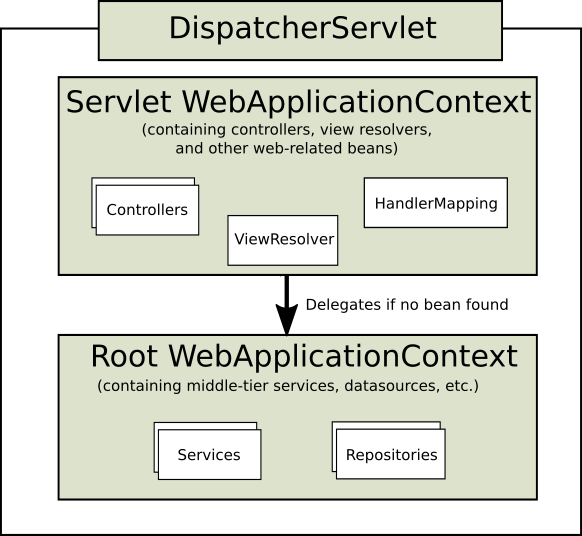

## 1. Spring Web MVC

Spring Web MVC is the original web framework built on the Servlet API and has been included in the Spring Framework from the very beginning. The formal name, “Spring Web MVC,” comes from the name of its source module ([`spring-webmvc`](https://github.com/spring-projects/spring-framework/tree/main/spring-webmvc)), but it is more commonly known as “Spring MVC”.

Parallel to Spring Web MVC, Spring Framework 5.0 introduced a reactive-stack web framework whose name, “Spring WebFlux,” is also based on its source module ([`spring-webflux`](https://github.com/spring-projects/spring-framework/tree/main/spring-webflux)). This section covers Spring Web MVC. The [next section](https://docs.spring.io/spring-framework/docs/current/reference/html/web-reactive.html#spring-web-reactive) covers Spring WebFlux.

For baseline information and compatibility with Servlet container and Java EE version ranges, see the Spring Framework [Wiki](https://github.com/spring-projects/spring-framework/wiki/Spring-Framework-Versions).

Spring Web MVC 是基于 Servlet API 构建的原始 Web 框架，从一开始就包含在 Spring 框架中。正式名称 `Spring Web MVC`来自其源模块的名称（[`spring-webmvc`](https://github.com/spring-projects/spring-framework/tree/main/spring-webmvc))，但它通常被称为 `Spring MVC`。

与 Spring Web MVC 并行，Spring Framework 5.0 引入了一个反应式堆栈 Web 框架，其名称 `Spring Web Flux`，也是基于其源模块（[`spring-webflux`](https://github.com/spring-projects/spring-framework/tree/main/spring-webflux))。本节介绍 Spring Web MVC。[下一节](https://docs.spring.io/spring-framework/docs/current/reference/html/web-reactive.html#spring-web-reactive) 介绍 Spring WebFlux。

有关基线信息以及与 Servlet 容器和 Java EE 版本范围的兼容性，请参阅 Spring 框架 [Wiki](https://github.com/spring-projects/spring-framework/wiki/Spring-Framework-Versions).

### 1.1. DispatcherServlet

[WebFlux](https://docs.spring.io/spring-framework/docs/current/reference/html/web-reactive.html#webflux-dispatcher-handler)

Spring MVC, as many other web frameworks, is designed around the front controller pattern where a central `Servlet`, the `DispatcherServlet`, provides a shared algorithm for request processing, while actual work is performed by configurable delegate components. This model is flexible and supports diverse workflows.

The `DispatcherServlet`, as any `Servlet`, needs to be declared and mapped according to the Servlet specification by using Java configuration or in `web.xml`. In turn, the `DispatcherServlet` uses Spring configuration to discover the delegate components it needs for request mapping, view resolution, exception handling, [and more](https://docs.spring.io/spring-framework/docs/current/reference/html/web.html#mvc-servlet-special-bean-types).

The following example of the Java configuration registers and initializes the `DispatcherServlet`, which is auto-detected by the Servlet container (see [Servlet Config](https://docs.spring.io/spring-framework/docs/current/reference/html/web.html#mvc-container-config)):

**Spring MVC 和许多其他 web 框架一样，是围绕前端控制器模式设计的，其中一个中央 `Servlet`（DispatcherServlet）为请求处理提供了一个共享算法，而实际工作是由可配置的委托组件执行的。**该模型灵活，支持多种工作流。

与任何 `Servlet` 一样，`DispatcherServlet` 需要使用 Java 配置或在 `web.xml` 中根据 Servlet 规范声明和映射。反过来，`DispatcherServlet` 使用 Spring 配置来发现请求映射、视图解析、异常处理等所需的委托组件[等](https://docs.spring.io/spring-framework/docs/current/reference/html/web.html#mvc-servlet-special-bean-types)。

下面的 Java 配置示例注册并初始化 `DispatcherServlet`，它由 Servlet 容器自动检测（请参见[Servlet Config](https://docs.spring.io/spring-framework/docs/current/reference/html/web.html#mvc-container-config)）：

```java
public class MyWebApplicationInitializer implements WebApplicationInitializer {

    @Override
    public void onStartup(ServletContext servletContext) {

        // Load Spring web application configuration
        // 加载 spring web 应用配置
        AnnotationConfigWebApplicationContext context = new AnnotationConfigWebApplicationContext();
        context.register(AppConfig.class);

        // Create and register the DispatcherServlet
        // 创建并注册 DispatcherServlet
        DispatcherServlet servlet = new DispatcherServlet(context);
        ServletRegistration.Dynamic registration = servletContext.addServlet("app", servlet);
        registration.setLoadOnStartup(1);
        registration.addMapping("/app/*");
    }
}
```

> In addition to using the ServletContext API directly, you can also extend `AbstractAnnotationConfigDispatcherServletInitializer` and override specific methods (see the example under [Context Hierarchy](https://docs.spring.io/spring-framework/docs/current/reference/html/web.html#mvc-servlet-context-hierarchy)).
>
> 除了直接使用 ServletContext API 之外，您还可以扩展 `AbstractAnnotationConfigDispatchersServletInitializer`并覆盖特定的方法（参见[Context Hierarchy](https://docs.spring.io/spring-framework/docs/current/reference/html/web.html#mvc-servlet-context-hierarchy)下的示例）。

The following example of `web.xml` configuration registers and initializes the `DispatcherServlet`:

下面的 `web.xml` 配置示例注册并初始化 `DispatcherServlet`：

```xml
<web-app>

    <listener>
        <listener-class>org.springframework.web.context.ContextLoaderListener</listener-class>
    </listener>

    <context-param>
        <param-name>contextConfigLocation</param-name>
        <param-value>/WEB-INF/app-context.xml</param-value>
    </context-param>

    <servlet>
        <servlet-name>app</servlet-name>
        <servlet-class>org.springframework.web.servlet.DispatcherServlet</servlet-class>
        <init-param>
            <param-name>contextConfigLocation</param-name>
            <param-value></param-value>
        </init-param>
        <load-on-startup>1</load-on-startup>
    </servlet>

    <servlet-mapping>
        <servlet-name>app</servlet-name>
        <url-pattern>/app/*</url-pattern>
    </servlet-mapping>

</web-app>
```

> Spring Boot follows a different initialization sequence. Rather than hooking into the lifecycle of the Servlet container, Spring Boot uses Spring configuration to bootstrap itself and the embedded Servlet container. `Filter` and `Servlet` declarations are detected in Spring configuration and registered with the Servlet container. For more details, see the [Spring Boot documentation](https://docs.spring.io/spring-boot/docs/current/reference/htmlsingle/#boot-features-embedded-container).
>
> Spring Boot 遵循不同的初始化顺序。Spring Boot 使用 Spring 配置来引导自身和嵌入式 Servle t容器，而不是与 Servlet 容器的生命周期挂钩，在 Spring 配置中检测到 `Filter` 和 `Servlet` 声明，并在 Servlet 容器中注册。有关更多详细信息，请参阅[Spring Boot 文档](https://docs.spring.io/spring-boot/docs/current/reference/htmlsingle/#boot-features-embedded-container)。

#### 1.1.1. Context Hierarchy

#### 1.1.1.上下文层次结构

`DispatcherServlet` expects a `WebApplicationContext` (an extension of a plain `ApplicationContext`) for its own configuration. `WebApplicationContext` has a link to the `ServletContext` and the `Servlet` with which it is associated. It is also bound to the `ServletContext` such that applications can use static methods on `RequestContextUtils` to look up the `WebApplicationContext` if they need access to it.

For many applications, having a single `WebApplicationContext` is simple and suffices. It is also possible to have a context hierarchy where one root `WebApplicationContext` is shared across multiple `DispatcherServlet` (or other `Servlet`) instances, each with its own child `WebApplicationContext` configuration. See [Additional Capabilities of the `ApplicationContext`](https://docs.spring.io/spring-framework/docs/current/reference/html/core.html#context-introduction) for more on the context hierarchy feature.

The root `WebApplicationContext` typically contains infrastructure beans, such as data repositories and business services that need to be shared across multiple `Servlet` instances. Those beans are effectively inherited and can be overridden (that is, re-declared) in the Servlet-specific child `WebApplicationContext`, which typically contains beans local to the given `Servlet`. The following image shows this relationship:

`DispatcherServlet` 需要一个`WebApplicationContext`（普通 `ApplicationContext` 的扩展）作为其自身的配置。`WebApplicationContext` 有一个指向与之关联的`ServletContext`和`Servlet`的链接。它还绑定到 `ServletContext`，这样应用程序可以在 `RequestContextUtils` 上使用静态方法来查找 `WebApplicationContext`，如果它们需要访问它的话。

对于许多应用程序来说，拥有一个 `WebApplicationContext` 是简单且足够的。还可以有一个上下文层次结构，其中一个根 `WebApplicationContext` 在多个 `DispatcherServlet`（或其他 `Servlet` ）实例之间共享，每个实例都有自己的子 `WebApplicationContext`配置。请参阅[ApplicationContext 的其他功能](https://docs.spring.io/spring-framework/docs/current/reference/html/core.html#context-introduction) 了解有关上下文层次结构功能的更多信息。

**根 `WebApplicationContext` 通常包含基础结构 bean，例如需要在多个 `Servlet` 实例之间共享的数据存储库和业务服务。这些 bean 是有效继承的，可以在特定于 `Servlet` 的子 `WebApplicationContext` 中重写（即重新声明）**，该子项通常包含给定 `Servlet` 的本地 bean。下图显示了这种关系：



The following example configures a `WebApplicationContext` hierarchy:

以下示例配置 `WebApplicationContext` 层次结构：

```java
public class MyWebAppInitializer extends AbstractAnnotationConfigDispatcherServletInitializer {

    @Override
    protected Class<?>[] getRootConfigClasses() {
        return new Class<?>[] { RootConfig.class };
    }

    @Override
    protected Class<?>[] getServletConfigClasses() {
        return new Class<?>[] { App1Config.class };
    }

    @Override
    protected String[] getServletMappings() {
        return new String[] { "/app1/*" };
    }
}
```

> If an application context hierarchy is not required, applications can return all configuration through `getRootConfigClasses()` and `null` from `getServletConfigClasses()`.
>
> 如果不需要应用程序上下文层次结构，应用程序可以通过 `getRootConfigClass()`和 `getServletConfigClass()` 返回所有配置。

The following example shows the `web.xml` equivalent:

下面的示例显示了 `web.xml` 等效项：

```xml
<web-app>

    <listener>
        <listener-class>org.springframework.web.context.ContextLoaderListener</listener-class>
    </listener>

    <context-param>
        <param-name>contextConfigLocation</param-name>
        <param-value>/WEB-INF/root-context.xml</param-value>
    </context-param>

    <servlet>
        <servlet-name>app1</servlet-name>
        <servlet-class>org.springframework.web.servlet.DispatcherServlet</servlet-class>
        <init-param>
            <param-name>contextConfigLocation</param-name>
            <param-value>/WEB-INF/app1-context.xml</param-value>
        </init-param>
        <load-on-startup>1</load-on-startup>
    </servlet>

    <servlet-mapping>
        <servlet-name>app1</servlet-name>
        <url-pattern>/app1/*</url-pattern>
    </servlet-mapping>

</web-app>
```

> If an application context hierarchy is not required, applications may configure a “root” context only and leave the `contextConfigLocation` Servlet parameter empty.
>
> 如果不需要应用程序上下文层次结构，应用程序可以仅配置“根”上下文，并将`contextConfigLocation` Servlet参数保留为空。

> 辅助说明：
>
> Spring 的启动过程：
>
> 首先，对于一个web应用，其部署在web容器中，web容器提供其一个全局的上下文环境，这个上下文就是ServletContext，其为后面的spring IoC容器提供宿主环境；
>
>    其次，在web.xml中会提供有contextLoaderListener。在web容器启动时，会触发容器初始化事件，此时contextLoaderListener会监听到这个事件，其contextInitialized方法会被调用，在这个方法中，spring会初始化一个启动上下文，这个上下文被称为根上下文，即WebApplicationContext，这是一个接口类，确切的说，其实际的实现类是XmlWebApplicationContext。这个就是spring的IoC容器，其对应的Bean定义的配置由web.xml中的context-param标签指定。在这个IoC容器初始化完毕后，spring以WebApplicationContext.ROOTWEBAPPLICATIONCONTEXTATTRIBUTE为属性Key，将其存储到ServletContext中，便于获取；
>
>    再次，contextLoaderListener监听器初始化完毕后，开始初始化web.xml中配置的Servlet，这个servlet可以配置多个，以最常见的DispatcherServlet为例，这个servlet实际上是一个标准的前端控制器，用以转发、匹配、处理每个servlet请求。DispatcherServlet上下文在初始化的时候会建立自己的IoC上下文，用以持有spring mvc相关的bean。在建立DispatcherServlet自己的IoC上下文时，会利用WebApplicationContext.ROOTWEBAPPLICATIONCONTEXTATTRIBUTE先从ServletContext中获取之前的根上下文(即WebApplicationContext)作为自己上下文的parent上下文。有了这个parent上下文之后，再初始化自己持有的上下文。这个DispatcherServlet初始化自己上下文的工作在其initStrategies方法中可以看到，大概的工作就是初始化处理器映射、视图解析等。这个servlet自己持有的上下文默认实现类也是xmlWebApplicationContext。初始化完毕后，spring以与servlet的名字相关(此处不是简单的以servlet名为Key，而是通过一些转换，具体可自行查看源码)的属性为属性Key，也将其存到ServletContext中，以便后续使用。这样每个servlet就持有自己的上下文，即拥有自己独立的bean空间，同时各个servlet共享相同的bean，即根上下文(第2步中初始化的上下文)定义的那些bean。
>
> 总结：
>
> ServletContext:  tomcat 启动会创建一个 ServletContext，作为全局上下文以及 spring 容器的宿主环境，可以理解为web容器（Servlet容器）
> WebApplicationContext：即初始化根上下文（即IOC容器）
> DispatcherServlet：WebApplicationContext设置为当前DispatcherServlet的父上下文。并且也把DispatcherServlet上下文存在ServletContext中
> 
> 通过init方法创建的dispatcherServlet上下文可以访问通过ServletContextListener中创建的WebApplicationContext上下文中的bean，反之则不行。因为WebApplicationContext是dispatcherServlet上下文的父容器。

#### 1.1.2. Special Bean Types

[WebFlux](https://docs.spring.io/spring-framework/docs/current/reference/html/web-reactive.html#webflux-special-bean-types)

The `DispatcherServlet` delegates to special beans to process requests and render the appropriate responses. By “special beans” we mean Spring-managed `Object` instances that implement framework contracts. Those usually come with built-in contracts, but you can customize their properties and extend or replace them.

The following table lists the special beans detected by the `DispatcherServlet`:

`DispatcherServlet` 将委托给特殊 bean 来处理请求并提供适当的响应。所谓「特殊 bean」，我们指的是 Spring 管理的实现框架契约的 `Object` 实例。这些通常带有内置的契约，但是您可以自定义它们的属性并扩展或替换它们。
下表列出了 `DispatcherServlet` 检测到的特殊 bean：

| Bean type                                                    | Explanation                                                  |
| :----------------------------------------------------------- | :----------------------------------------------------------- |
| `HandlerMapping`                                             | Map a request to a handler along with a list of [interceptors](https://docs.spring.io/spring-framework/docs/current/reference/html/web.html#mvc-handlermapping-interceptor) for pre- and post-processing. The mapping is based on some criteria, the details of which vary by `HandlerMapping` implementation.The two main `HandlerMapping` implementations are `RequestMappingHandlerMapping` (which supports `@RequestMapping` annotated methods) and `SimpleUrlHandlerMapping` (which maintains explicit registrations of URI path patterns to handlers).<br />将请求与[拦截器](https://docs.spring.io/spring-framework/docs/current/reference/html/web.html#mvc-handlermapping-interceptor) 列表一起映射到处理程序，以进行预处理和后处理。映射基于一些标准，这些标准的细节因 `HandlerMapping` 的实现而异。两个主要的 `HandlerMapping`实现是 `RequestMappingHandlerMapping`（支持`@RequestMapping` 注释方法）和 `SimpleUrlHandlerMapping`（维护 URI 路径模式到处理程序的显式注册）。 |
| `HandlerAdapter`                                             | Help the `DispatcherServlet` to invoke a handler mapped to a request, regardless of how the handler is actually invoked. For example, invoking an annotated controller requires resolving annotations. The main purpose of a `HandlerAdapter` is to shield the `DispatcherServlet` from such details.<br />帮助 `DispatcherServlet` 调用映射到请求的处理程序，而不管实际如何调用该处理程序。例如，调用带注释的控制器需要解析注释。`HandlerAdapter`的主要目的是保护 `DispatcherServlet`不受此类细节的影响。 |
| [`HandlerExceptionResolver`](https://docs.spring.io/spring-framework/docs/current/reference/html/web.html#mvc-exceptionhandlers) | Strategy to resolve exceptions, possibly mapping them to handlers, to HTML error views, or other targets. See [Exceptions](https://docs.spring.io/spring-framework/docs/current/reference/html/web.html#mvc-exceptionhandlers).<br />解决异常的策略，可能将异常映射到处理程序、HTML 错误视图或其他目标。见[例外情况](https://docs.spring.io/spring-framework/docs/current/reference/html/web.html#mvc-exceptionhandlers)。 |
| [`ViewResolver`](https://docs.spring.io/spring-framework/docs/current/reference/html/web.html#mvc-viewresolver) | Resolve logical `String`-based view names returned from a handler to an actual `View` with which to render to the response. See [View Resolution](https://docs.spring.io/spring-framework/docs/current/reference/html/web.html#mvc-viewresolver) and [View Technologies](https://docs.spring.io/spring-framework/docs/current/reference/html/web.html#mvc-view).<br />将处理程序返回的基于逻辑 `String` 的视图名称解析为实际的 `View`，并使用该视图向响应呈现。见[视图解析](https://docs.spring.io/spring-framework/docs/current/reference/html/web.html#mvc-viewresolver) 和[视图技术](https://docs.spring.io/spring-framework/docs/current/reference/html/web.html#mvc-view)。 |
| [`LocaleResolver`](https://docs.spring.io/spring-framework/docs/current/reference/html/web.html#mvc-localeresolver), [LocaleContextResolver](https://docs.spring.io/spring-framework/docs/current/reference/html/web.html#mvc-timezone) | Resolve the `Locale` a client is using and possibly their time zone, in order to be able to offer internationalized views. See [Locale](https://docs.spring.io/spring-framework/docs/current/reference/html/web.html#mvc-localeresolver).<br />解析客户端正在使用的 `Locale` 以及可能的时区，以便能够提供国际化视图。详见  [Locale](https://docs.spring.io/spring-framework/docs/current/reference/html/web.html#mvc-localeresolver)。 |
| [`ThemeResolver`](https://docs.spring.io/spring-framework/docs/current/reference/html/web.html#mvc-themeresolver) | Resolve themes your web application can use — for example, to offer personalized layouts. See [Themes](https://docs.spring.io/spring-framework/docs/current/reference/html/web.html#mvc-themeresolver).<br />解析 web 应用程序可以使用的主题 — 例如，提供个性化布局。见[主题](https://docs.spring.io/spring-framework/docs/current/reference/html/web.html#mvc-themeresolver)。 |
| [`MultipartResolver`](https://docs.spring.io/spring-framework/docs/current/reference/html/web.html#mvc-multipart) | Abstraction for parsing a multi-part request (for example, browser form file upload) with the help of some multipart parsing library. See [Multipart Resolver](https://docs.spring.io/spring-framework/docs/current/reference/html/web.html#mvc-multipart).<br />在多部分解析库的帮助下解析多部分请求（例如，浏览器表单文件上载）的抽象。请参阅 [Multipart Resolver](https://docs.spring.io/spring-framework/docs/current/reference/html/web.html#mvc-multipart)。 |
| [`FlashMapManager`](https://docs.spring.io/spring-framework/docs/current/reference/html/web.html#mvc-flash-attributes) | Store and retrieve the “input” and the “output” `FlashMap` that can be used to pass attributes from one request to another, usually across a redirect. See [Flash Attributes](https://docs.spring.io/spring-framework/docs/current/reference/html/web.html#mvc-flash-attributes).<br />存储和检索「输入」和「输出」`FlashMap`，它们可以用来将属性从一个请求传递到另一个请求，通常是通过重定向。请参阅[Flash Attributes](https://docs.spring.io/spring-framework/docs/current/reference/html/web.html#mvc-flash-attributes)。 |

#### 1.1.3. Web MVC Config

#### 1.1.4 Web MVC 配置

[WebFlux](https://docs.spring.io/spring-framework/docs/current/reference/html/web-reactive.html#webflux-framework-config)

Applications can declare the infrastructure beans listed in [Special Bean Types](https://docs.spring.io/spring-framework/docs/current/reference/html/web.html#mvc-servlet-special-bean-types) that are required to process requests. The `DispatcherServlet` checks the `WebApplicationContext` for each special bean. If there are no matching bean types, it falls back on the default types listed in [`DispatcherServlet.properties`](https://github.com/spring-projects/spring-framework/tree/main/spring-webmvc/src/main/resources/org/springframework/web/servlet/DispatcherServlet.properties).

In most cases, the [MVC Config](https://docs.spring.io/spring-framework/docs/current/reference/html/web.html#mvc-config) is the best starting point. It declares the required beans in either Java or XML and provides a higher-level configuration callback API to customize it.

应用程序可以声明 [Special Bean Types](https://docs.spring.io/spring-framework/docs/current/reference/html/web.html#mvc-servlet-special-bean-types) 中列出的处理请求所需的基础结构 Bean。`DispatcherServlet` 检查每个特殊 bean 的 `WebApplicationContext`。如果没有匹配的 bean 类型，它将使用 [`DispatcherServlet.properties`](https://github.com/spring-projects/spring-framework/tree/main/spring-webmvc/src/main/resources/org/springframework/web/servlet/DispatcherServlet.properties)中列出的默认类型。
在大多数情况下，[MVC配置](https://docs.spring.io/spring-framework/docs/current/reference/html/web.html#mvc-config) 是最佳的起点。它用 Java 或 XML 声明所需的 bean，并提供更高级别的配置回调 API 对其进行自定义。

> Spring Boot relies on the MVC Java configuration to configure Spring MVC and provides many extra convenient options. 
> Spring Boot 依赖于 MVC Java 配置来配置 Spring MVC，并提供了许多额外的方便选项。

#### 1.1.4. Servlet Config

#### 1.1.4. Servlet 配置

In a Servlet 3.0+ environment, you have the option of configuring the Servlet container programmatically as an alternative or in combination with a `web.xml` file. The following example registers a `DispatcherServlet`:

在 Servlet 3.0+ 环境中，您可以选择以编程方式配置 Servlet 容器作为替代方案，或者与 `web.xml` 文件组合使用。以下示例注册 `DispatcherServlet`：

```java
import org.springframework.web.WebApplicationInitializer;

public class MyWebApplicationInitializer implements WebApplicationInitializer {

    @Override
    public void onStartup(ServletContext container) {
        XmlWebApplicationContext appContext = new XmlWebApplicationContext();
        appContext.setConfigLocation("/WEB-INF/spring/dispatcher-config.xml");

        ServletRegistration.Dynamic registration = container.addServlet("dispatcher", new DispatcherServlet(appContext));
        registration.setLoadOnStartup(1);
        registration.addMapping("/");
    }
}
```

`WebApplicationInitializer` is an interface provided by Spring MVC that ensures your implementation is detected and automatically used to initialize any Servlet 3 container. An abstract base class implementation of `WebApplicationInitializer` named `AbstractDispatcherServletInitializer` makes it even easier to register the `DispatcherServlet` by overriding methods to specify the servlet mapping and the location of the `DispatcherServlet` configuration.

This is recommended for applications that use Java-based Spring configuration, as the following example shows:

`WebApplicationInitializer`是 SpringMVC 提供的一个接口，它确保检测到您的实现并自动用于初始化任何 Servlet 3 容器。名为 `AbstractDispatcherServletInitializer` 的 `WebApplicationInitializer` 的抽象基类实现通过重写方法来指定servlet 映射和 `DispatcherServlet` 配置的位置，使得注册 `DispatcherServlet` 更加容易。

对于使用基于 Java 的 Spring 配置的应用程序，建议这样做，如下例所示：

```java
public class MyWebAppInitializer extends AbstractAnnotationConfigDispatcherServletInitializer {

    @Override
    protected Class<?>[] getRootConfigClasses() {
        return null;
    }

    @Override
    protected Class<?>[] getServletConfigClasses() {
        return new Class<?>[] { MyWebConfig.class };
    }

    @Override
    protected String[] getServletMappings() {
        return new String[] { "/" };
    }
}
```

If you use XML-based Spring configuration, you should extend directly from `AbstractDispatcherServletInitializer`, as the following example shows:

如果使用基于 XML 的 Spring 配置，则应直接从 `AbstractDispatcherServletInitializer` 扩展，如下例所示：

```java
public class MyWebAppInitializer extends AbstractDispatcherServletInitializer {

    @Override
    protected WebApplicationContext createRootApplicationContext() {
        return null;
    }

    @Override
    protected WebApplicationContext createServletApplicationContext() {
        XmlWebApplicationContext cxt = new XmlWebApplicationContext();
        cxt.setConfigLocation("/WEB-INF/spring/dispatcher-config.xml");
        return cxt;
    }

    @Override
    protected String[] getServletMappings() {
        return new String[] { "/" };
    }
}
```

`AbstractDispatcherServletInitializer` also provides a convenient way to add `Filter` instances and have them be automatically mapped to the `DispatcherServlet`, as the following example shows:

`AbstractDispatcherServletInitializer`还提供了一种方便的方法来添加 `Filter` 实例，并将它们自动映射到 `DispatcherServlet`，如下示例所示：

```java
public class MyWebAppInitializer extends AbstractDispatcherServletInitializer {

    // ...

    @Override
    protected Filter[] getServletFilters() {
        return new Filter[] {
            new HiddenHttpMethodFilter(), new CharacterEncodingFilter() };
    }
}
```

Each filter is added with a default name based on its concrete type and automatically mapped to the `DispatcherServlet`.

The `isAsyncSupported` protected method of `AbstractDispatcherServletInitializer` provides a single place to enable async support on the `DispatcherServlet` and all filters mapped to it. By default, this flag is set to `true`.

Finally, if you need to further customize the `DispatcherServlet` itself, you can override the `createDispatcherServlet` method.

每个过滤器都会根据其具体类型添加一个默认名称，并自动映射到 `DispatcherServlet`。

`AbstractDispatcherServletInitializer` 的 `isAsyncSupported`受保护的方法提供了一个单一位置来启用对 `DispatcherServlet` 和映射到它的所有筛选器的异步支持。默认情况下，此标志设置为 `true`。

最后，如果需要进一步自定义 `DispatcherServlet` 本身，可以重写 `createDispatcherServlet` 方法。

#### 1.1.5. Processing

#### 1.1.5. 处理

[WebFlux](https://docs.spring.io/spring-framework/docs/current/reference/html/web-reactive.html#webflux-dispatcher-handler-sequence)

The `DispatcherServlet` processes requests as follows:

- The `WebApplicationContext` is searched for and bound in the request as an attribute that the controller and other elements in the process can use. It is bound by default under the `DispatcherServlet.WEB_APPLICATION_CONTEXT_ATTRIBUTE` key.
- The locale resolver is bound to the request to let elements in the process resolve the locale to use when processing the request (rendering the view, preparing data, and so on). If you do not need locale resolving, you do not need the locale resolver.
- The theme resolver is bound to the request to let elements such as views determine which theme to use. If you do not use themes, you can ignore it.
- If you specify a multipart file resolver, the request is inspected for multiparts. If multiparts are found, the request is wrapped in a `MultipartHttpServletRequest` for further processing by other elements in the process. See [Multipart Resolver](https://docs.spring.io/spring-framework/docs/current/reference/html/web.html#mvc-multipart) for further information about multipart handling.
- An appropriate handler is searched for. If a handler is found, the execution chain associated with the handler (preprocessors, postprocessors, and controllers) is run to prepare a model for rendering. Alternatively, for annotated controllers, the response can be rendered (within the `HandlerAdapter`) instead of returning a view.
- If a model is returned, the view is rendered. If no model is returned (maybe due to a preprocessor or postprocessor intercepting the request, perhaps for security reasons), no view is rendered, because the request could already have been fulfilled.

`DispatcherServlet` 按如下方式处理请求：

- `WebApplicationContext` 作为控制器和流程中的其他元素可以使用的属性在请求中进行搜索和绑定。默认情况下，它在  `DispatcherServlet.WEB_APPLICATION_CONTEXT_ATTRIBUTE` 键下绑定。
- 区域（locale）设置解析器绑定到请求，以使流程中的元素在处理请求（呈现视图、准备数据等）时解析要使用的区域设置。如果不需要区域设置解析，则不需要区域设置解析程序。
- 主题（theme）解析器绑定到请求，以让视图等元素确定要使用的主题。如果不使用主题，可以忽略它。
- 如果指定多部分文件解析器，则会检查请求的多部分。如果找到多部分，请求将被包装在 `MultipartHttpServletRequest` 中，以供流程中的其他元素进一步处理。请参阅 [Multipart Resolver](https://docs.spring.io/spring-framework/docs/current/reference/html/web.html#mvc-multipart) 有关多部分处理的更多信息。
- 将搜索适当的处理程序。如果找到处理程序，将运行与该处理程序（预处理器、后处理器和控制器）关联的执行链，以准备用于渲染的模型。或者，对于带注释的控制器，可以呈现响应（在 `HandlerAdapter`中），而不是返回视图。
- 如果返回模型，则渲染视图。如果没有返回任何模型（可能是由于预处理器或后处理器拦截了请求，可能是出于安全原因），则不会呈现任何视图，因为请求可能已经完成。

The `HandlerExceptionResolver` beans declared in the `WebApplicationContext` are used to resolve exceptions thrown during request processing. Those exception resolvers allow customizing the logic to address exceptions. See [Exceptions](https://docs.spring.io/spring-framework/docs/current/reference/html/web.html#mvc-exceptionhandlers) for more details.

For HTTP caching support, handlers can use the `checkNotModified` methods of `WebRequest`, along with further options for annoated controllers as described in [HTTP Caching for Controllers](https://docs.spring.io/spring-framework/docs/current/reference/html/web.html#mvc-caching-etag-lastmodified).

You can customize individual `DispatcherServlet` instances by adding Servlet initialization parameters (`init-param` elements) to the Servlet declaration in the `web.xml` file. The following table lists the supported parameters:

 `WebApplicationContext`中声明的 `HandlerExceptionResolver` bean 用于解决请求处理期间引发的异常。这些异常解析器允许自定义逻辑来处理异常。见 [Exceptions](https://docs.spring.io/spring-framework/docs/current/reference/html/web.html#mvc-exceptionhandlers) 获取更多详细信息。

对于 HTTP 缓存支持，处理程序可以使用 `WebRequest` 的 `checkNotModified` 方法，以及[HTTP caching For Controller](https://docs.spring.io/spring-framework/docs/current/reference/html/web.html#mvc-caching-etag-lastmodified) 中所述的注释控制器的其他选项。

通过将 Servlet 初始化参数（`init-param`元素）添加到 `web.xml` 文件中的 Servlet 声明中，可以自定义单个`DispatcherServlet` 实例。下表列出了支持的参数：

| Parameter                        | Explanation                                                  |
| :------------------------------- | :----------------------------------------------------------- |
| `contextClass`                   | Class that implements `ConfigurableWebApplicationContext`, to be instantiated and locally configured by this Servlet. By default, `XmlWebApplicationContext` is used.<br />实现 `ConfigurableWebApplicationContext` 的类，该类将由此 Servlet 实例化和本地配置。默认情况下，使用 `XmlWebApplicationContext`。 |
| `contextConfigLocation`          | String that is passed to the context instance (specified by `contextClass`) to indicate where contexts can be found. The string consists potentially of multiple strings (using a comma as a delimiter) to support multiple contexts. In the case of multiple context locations with beans that are defined twice, the latest location takes precedence.<br />传递给上下文实例（由 `contextClass` 指定）以指示可以在何处找到上下文的字符串。该字符串可能由多个字符串（使用逗号作为分隔符）组成，以支持多个上下文。如果多个上下文位置包含定义了两次的 bean，则以最新位置为准。 |
| `namespace`                      | Namespace of the `WebApplicationContext`. Defaults to `[servlet-name]-servlet`.<br />`WebApplicationContext` 的命名空间。默认为`[servlet-name]-servlet`。 |
| `throwExceptionIfNoHandlerFound` | Whether to throw a `NoHandlerFoundException` when no handler was found for a request. The exception can then be caught with a `HandlerExceptionResolver` (for example, by using an `@ExceptionHandler` controller method) and handled as any others.By default, this is set to `false`, in which case the `DispatcherServlet` sets the response status to 404 (NOT_FOUND) without raising an exception.Note that, if [default servlet handling](https://docs.spring.io/spring-framework/docs/current/reference/html/web.html#mvc-default-servlet-handler) is also configured, unresolved requests are always forwarded to the default servlet and a 404 is never raised.<br />当找不到请求的处理程序时，是否引发 `NoHandlerFoundException`。然后可以使用 `HandlerExceptionResolver`（例如，通过使用 `@ExceptionHandler`控制器方法）捕获异常，并将其作为任何其他方法处理。默认情况下，这设置为 `false`，在这种情况下，`DispatcherServlet`将响应状态设置为 404（未找到），而不会引发异常。请注意，**如果还配置了[default servlet handling](https://docs.spring.io/spring-framework/docs/current/reference/html/web.html#mvc-default-servlet-handler) ，则未解析的请求总是转发到默认 servlet，并且从不引发 404**。 |

#### 1.1.6. Path Matching

#### 1.1.6. 路径映射

The Servlet API exposes the full request path as `requestURI` and further sub-divides it into `contextPath`, `servletPath`, and `pathInfo` whose values vary depending on how a Servlet is mapped. From these inputs, Spring MVC needs to determine the lookup path to use for handler mapping, which is the path within the mapping of the `DispatcherServlet` itself, excluding the `contextPath` and any `servletMapping` prefix, if present.

The `servletPath` and `pathInfo` are decoded and that makes them impossible to compare directly to the full `requestURI` in order to derive the lookupPath and that makes it necessary to decode the `requestURI`. However this introduces its own issues because the path may contain encoded reserved characters such as `"/"` or `";"` that can in turn alter the structure of the path after they are decoded which can also lead to security issues. In addition, Servlet containers may normalize the `servletPath` to varying degrees which makes it further impossible to perform `startsWith` comparisons against the `requestURI`.

This is why it is best to avoid reliance on the `servletPath` which comes with the prefix-based `servletPath` mapping type. If the `DispatcherServlet` is mapped as the default Servlet with `"/"` or otherwise without a prefix with `"/*"` and the Servlet container is 4.0+ then Spring MVC is able to detect the Servlet mapping type and avoid use of the `servletPath` and `pathInfo` altogether. On a 3.1 Servlet container, assuming the same Servlet mapping types, the equivalent can be achieved by providing a `UrlPathHelper` with `alwaysUseFullPath=true` via [Path Matching](https://docs.spring.io/spring-framework/docs/current/reference/html/web.html#mvc-config-path-matching) in the MVC config.

Servlet API 将完整的请求路径公开为 `requestURI`，并进一步将其细分为 `contextPath`、`servletPath` 和 `pathInfo`，其值根据 Servlet 的映射方式而不同。根据这些输入，Spring MVC 需要确定用于处理程序映射的查找路径，该路径是 `DispatcherServlet` 自身映射中的路径，不包括 `contextPath` 和任何 `servletMapping` 前缀（如果存在）。

`servletPath`和 `pathInfo` 被解码，这使得它们无法直接与完整的 `requestURI` 进行比较，以便派生 lookupPath，因此有必要对 `requestURI` 进行解码。但是，这也带来了它自己的问题，因为路径可能包含编码的保留字符，例如 `/` 或 `;` 这反过来会在解码后改变路径的结构，这也会导致安全问题。此外，Servlet 容器可能会在不同程度上规范化 `servletPath`，这使得无法对 `requestURI` 执行 `startsWith` 比较。

这就是为什么最好避免依赖基于前缀的 `servletPath` 映射类型附带的 `servletPath` 。如果将 `DispatcherServlet`映射为带 `/` 的默认 Servlet，或者不带前缀带 `/*`，并且 Servlet 容器为 4.0+，则 Spring MVC 能够检测 Servlet 映射类型并避免使用 `servletPath` 和 `pathInfo` 。在 3.1 Servlet 容器上，假设相同的 Servlet 映射类型，可以通过 MVC 配置中的[Path Matching](https://docs.spring.io/spring-framework/docs/current/reference/html/web.html#mvc-config-path-matching) 提供一个带有 `AlwaySuseFilPath=true` 的 `UrlPathHelper`，实现等效。

Fortunately the default Servlet mapping `"/"` is a good choice. However, there is still an issue in that the `requestURI` needs to be decoded to make it possible to compare to controller mappings. This is again undesirable because of the potential to decode reserved characters that alter the path structure. If such characters are not expected, then you can reject them (like the Spring Security HTTP firewall), or you can configure `UrlPathHelper` with `urlDecode=false` but controller mappings will need to match to the encoded path which may not always work well. Furthermore, sometimes the `DispatcherServlet` needs to share the URL space with another Servlet and may need to be mapped by prefix.

The above issues can be addressed more comprehensively by switching from `PathMatcher` to the parsed `PathPattern` available in 5.3 or higher, see [Pattern Comparison](https://docs.spring.io/spring-framework/docs/current/reference/html/web.html#mvc-ann-requestmapping-pattern-comparison). Unlike `AntPathMatcher` which needs either the lookup path decoded or the controller mapping encoded, a parsed `PathPattern` matches to a parsed representation of the path called `RequestPath`, one path segment at a time. This allows decoding and sanitizing path segment values individually without the risk of altering the structure of the path. Parsed `PathPattern` also supports the use of `servletPath` prefix mapping as long as the prefix is kept simple and does not have any characters that need to be encoded.

幸运的是，默认的 Servlet 映射`/` 是一个不错的选择。但是，仍然存在一个问题，即需要对 `requestURI` 进行解码，以便能够与控制器映射进行比较。这也是不可取的，因为可能会对改变路径结构的保留字符进行解码。如果不需要这些字符，则可以拒绝它们（如Spring Security HTTP防火墙），或者可以使用 `urlDecode=false` 配置 `UrlPathHelper`，但控制器映射需要与编码路径匹配，这可能并不总是很好地工作。此外，有时 `DispatcherServlet` 需要与另一个 Servlet 共享 URL 空间，并且可能需要通过前缀进行映射。

通过从 `PathMatcher` 切换到 5.3 或更高版本中提供的解析 `PathPattern`，可以更全面地解决上述问题，请参见[模式比较](https://docs.spring.io/spring-framework/docs/current/reference/html/web.html#mvc-ann-requestmapping-pattern-comparison)。与需要解码查找路径或编码控制器映射的 `AntPathMatcher` 不同，解析的 `PathPattern` 与名为 `RequestPath` 的路径的解析表示匹配，一次一个路径段。这允许单独解码和清理路径段值，而不存在改变路径结构的风险。只要前缀保持简单且不包含任何需要编码的字符，解析的 `PathPattern` 还支持使用 `servletPath` 前缀映射。

#### 1.1.7. Interception

#### 1.1.7. 拦截

All `HandlerMapping` implementations support handler interceptors that are useful when you want to apply specific functionality to certain requests — for example, checking for a principal. Interceptors must implement `HandlerInterceptor` from the `org.springframework.web.servlet` package with three methods that should provide enough flexibility to do all kinds of pre-processing and post-processing:

- `preHandle(..)`: Before the actual handler is run
- `postHandle(..)`: After the handler is run
- `afterCompletion(..)`: After the complete request has finished

所有 `HandlerMapping` 实现都支持处理程序拦截器，当您希望将特定功能应用于某些请求时，这些拦截器非常有用 — 例如，检查主体。拦截器必须使用三种方法实现 `org.springframework.web.servlet` 包中的 `HandlerInterceptor`，这三种方法应提供足够的灵活性，以进行各种预处理和后处理：

- `preHandle(...)`：在实际处理程序运行之前
- `postHandle(...)`：在处理程序运行之后
- `afterCompletion(...)`：在完成请求之后

The `preHandle(...)` method returns a boolean value. You can use this method to break or continue the processing of the execution chain. When this method returns `true`, the handler execution chain continues. When it returns false, the `DispatcherServlet` assumes the interceptor itself has taken care of requests (and, for example, rendered an appropriate view) and does not continue executing the other interceptors and the actual handler in the execution chain.

See [Interceptors](https://docs.spring.io/spring-framework/docs/current/reference/html/web.html#mvc-config-interceptors) in the section on MVC configuration for examples of how to configure interceptors. You can also register them directly by using setters on individual `HandlerMapping` implementations.

Note that `postHandle` is less useful with `@ResponseBody` and `ResponseEntity` methods for which the response is written and committed within the `HandlerAdapter` and before `postHandle`. That means it is too late to make any changes to the response, such as adding an extra header. For such scenarios, you can implement `ResponseBodyAdvice` and either declare it as an [Controller Advice](https://docs.spring.io/spring-framework/docs/current/reference/html/web.html#mvc-ann-controller-advice) bean or configure it directly on `RequestMappingHandlerAdapter`.

 `preHandle(..)` 方法返回一个布尔值。您可以使用此方法中断或继续执行链的处理。当此方法返回 `true` 时，处理程序执行链将继续。当返回 `false` 时， `DispatcherServlet` 假定拦截器本身已经处理了请求（例如，提供了适当的视图），并且不会继续执行其他拦截器和执行链中的实际处理程序。

有关如何配置拦截器的示例，请参阅 MVC 配置部分中的[Interceptors](https://docs.spring.io/spring-framework/docs/current/reference/html/web.html#mvc-config-interceptors) 。您还可以在单个 `HandlerMapping` 实现上使用 setter 直接注册它们。

请注意，`postHandle`对于在 `HandlerAdapter` 内和 `postHandle`之前写入和提交响应的 `@ResponseBody` 和 ` ResponseEntity` 方法不太有用。这意味着对响应进行任何更改（例如添加额外的头）为时已晚。对于这样的场景，您可以实现 `ResponseBodyAdvice`，并将其声明为[Controller Advice](https://docs.spring.io/spring-framework/docs/current/reference/html/web.html#mvc-ann-controller-advice) bean，或者直接在 `RequestMappingHandlerAdapter` 上配置它。

#### 1.1.8. Exceptions

#### 1.1.8. 异常

[WebFlux](https://docs.spring.io/spring-framework/docs/current/reference/html/web-reactive.html#webflux-dispatcher-exceptions)

If an exception occurs during request mapping or is thrown from a request handler (such as a `@Controller`), the `DispatcherServlet` delegates to a chain of `HandlerExceptionResolver` beans to resolve the exception and provide alternative handling, which is typically an error response.

The following table lists the available `HandlerExceptionResolver` implementations:

如果在请求映射期间发生异常或从请求处理程序（如`@Controller`）抛出异常，`DispatcherServlet` 将委托给一系列`HandlerExceptionResolver` bean 来解决异常并提供替代处理，这通常是错误响应。

下表列出了可用的 `HandlerExceptionResolver` 实现：

| `HandlerExceptionResolver`                                   | Description                                                  |
| :----------------------------------------------------------- | :----------------------------------------------------------- |
| `SimpleMappingExceptionResolver`                             | A mapping between exception class names and error view names. Useful for rendering error pages in a browser application.<br />异常类名称和错误视图名称之间的映射。用于在浏览器应用程序中呈现错误页面。 |
| [`DefaultHandlerExceptionResolver`](https://docs.spring.io/spring-framework/docs/5.3.13/javadoc-api/org/springframework/web/servlet/mvc/support/DefaultHandlerExceptionResolver.html) | Resolves exceptions raised by Spring MVC and maps them to HTTP status codes. See also alternative `ResponseEntityExceptionHandler` and [REST API exceptions](https://docs.spring.io/spring-framework/docs/current/reference/html/web.html#mvc-ann-rest-exceptions).<br />解决 Spring MVC 引发的异常，并将其映射到 HTTP 状态代码。另请参见备选方案 `ResponseEntityExceptionHandler` 和 [REST API exceptions](https://docs.spring.io/spring-framework/docs/current/reference/html/web.html#mvc-ann-rest-exceptions)。 |
| `ResponseStatusExceptionResolver`                            | Resolves exceptions with the `@ResponseStatus` annotation and maps them to HTTP status codes based on the value in the annotation.<br />使用 `@ResponseStatus`  注释解析异常，并根据注释中的值将其映射到 HTTP 状态代码。 |
| `ExceptionHandlerExceptionResolver`                          | Resolves exceptions by invoking an `@ExceptionHandler` method in a `@Controller` or a `@ControllerAdvice` class. See [@ExceptionHandler methods](https://docs.spring.io/spring-framework/docs/current/reference/html/web.html#mvc-ann-exceptionhandler).<br />通过调用 `@Controller`或 `@ControllerAdvice` 类中的 `@ExceptionHandler` 方法来解决异常。请参阅 [@ExceptionHandler方法](https://docs.spring.io/spring-framework/docs/current/reference/html/web.html#mvc-ann-exceptionhandler)。 |

##### Chain of Resolvers

##### Resolver 链

You can form an exception resolver chain by declaring multiple `HandlerExceptionResolver` beans in your Spring configuration and setting their `order` properties as needed. The higher the order property, the later the exception resolver is positioned.

The contract of `HandlerExceptionResolver` specifies that it can return:

通过在 Spring 配置中声明多个`HandlerExceptionResolver` bean 并根据需要设置它们的`order`属性，可以形成一个异常解析器链。order 属性越高，异常解析程序的定位就越晚。

`HandlerExceptionResolver` 的合同规定它可以返回：

- a `ModelAndView` that points to an error view.
- An empty `ModelAndView` if the exception was handled within the resolver.
- `null` if the exception remains unresolved, for subsequent resolvers to try, and, if the exception remains at the end, it is allowed to bubble up to the Servlet container.

- 指向错误视图的 `ModelAndView`。
- 如果在冲突解决程序中处理了异常，则返回空的 `ModelAndView`。
- `null` 如果异常仍然未解决，则供后续的解析程序尝试；如果异常仍然在末尾，则允许它冒泡到 Servlet 容器。

The [MVC Config](https://docs.spring.io/spring-framework/docs/current/reference/html/web.html#mvc-config) automatically declares built-in resolvers for default Spring MVC exceptions, for `@ResponseStatus` annotated exceptions, and for support of `@ExceptionHandler` methods. You can customize that list or replace it.

[MVC Config](https://docs.spring.io/spring-framework/docs/current/reference/html/web.html#mvc-config) 会自动为默认的 Spring MVC 异常、带 `@ResponseStatus` 注释的异常和支持 `@ExceptionHandler` 方法声明内置解析器。您可以自定义或替换该列表。

##### Container Error Page

##### 容器错误页

If an exception remains unresolved by any `HandlerExceptionResolver` and is, therefore, left to propagate or if the response status is set to an error status (that is, 4xx, 5xx), Servlet containers can render a default error page in HTML. To customize the default error page of the container, you can declare an error page mapping in `web.xml`. The following example shows how to do so:

如果任何 `HandlerExceptionResolver` 都无法解决异常，因此只能传播该异常，或者如果响应状态设置为错误状态（即 4xx、5xx），Servlet 容器可以在 HTML 中呈现默认错误页面。要自定义容器的默认错误页，可以在 `web.xml`中声明错误页映射。以下示例显示了如何执行此操作：

```xml
<error-page>
    <location>/error</location>
</error-page>
```

Given the preceding example, when an exception bubbles up or the response has an error status, the Servlet container makes an ERROR dispatch within the container to the configured URL (for example, `/error`). This is then processed by the `DispatcherServlet`, possibly mapping it to a `@Controller`, which could be implemented to return an error view name with a model or to render a JSON response, as the following example shows:

在前面的示例中，当出现异常或响应具有错误状态时，Servlet 容器会在容器中向配置的 URL（例如，`/error`）发送错误。然后由 `DispatcherServlet` 处理，可能会将其映射到一个 `@Controller`，这可以实现为使用模型返回错误视图名称或呈现 JSON 响应，如下例所示：

```java
@RestController
public class ErrorController {

    @RequestMapping(path = "/error")
    public Map<String, Object> handle(HttpServletRequest request) {
        Map<String, Object> map = new HashMap<String, Object>();
        map.put("status", request.getAttribute("javax.servlet.error.status_code"));
        map.put("reason", request.getAttribute("javax.servlet.error.message"));
        return map;
    }
}
```

> The Servlet API does not provide a way to create error page mappings in Java. You can, however, use both a `WebApplicationInitializer` and a minimal `web.xml`.
>
> Servlet API 不提供在 Java 中创建错误页面映射的方法。但是，您可以同时使用 `WebApplicationInitializer` 和迷你版的 `web.xml`。

#### 1.1.9. View Resolution

#### 1.1.9. 视图分辨率

[WebFlux](https://docs.spring.io/spring-framework/docs/current/reference/html/web-reactive.html#webflux-viewresolution)

Spring MVC defines the `ViewResolver` and `View` interfaces that let you render models in a browser without tying you to a specific view technology. `ViewResolver` provides a mapping between view names and actual views. `View` addresses the preparation of data before handing over to a specific view technology.

The following table provides more details on the `ViewResolver` hierarchy:

Spring MVC 定义了 `ViewResolver` 和 `View` 接口，允许您在浏览器中渲染模型，而无需使用特定的视图技术 `ViewResolver` 提供视图名称和实际视图之间的映射 `View` 解决了在将数据移交给特定 View 技术之前的准备工作。

下表提供了有关 `ViewResolver` 层次结构的更多详细信息：

| ViewResolver                     | Description                                                  |
| :------------------------------- | :----------------------------------------------------------- |
| `AbstractCachingViewResolver`    | Subclasses of `AbstractCachingViewResolver` cache view instances that they resolve. Caching improves performance of certain view technologies. You can turn off the cache by setting the `cache` property to `false`. Furthermore, if you must refresh a certain view at runtime (for example, when a FreeMarker template is modified), you can use the `removeFromCache(String viewName, Locale loc)` method.<br /> `AbstractCachingViewResolver` 的子类缓存它们解析的视图实例。缓存可以提高某些视图技术的性能。通过将 `cache` 属性设置为 `false`，可以关闭缓存。此外，如果必须在运行时刷新某个视图（例如，修改 FreeMarker 模板时），可以使用`removeFromCache(String viewName, Locale loc)`方法。 |
| `UrlBasedViewResolver`           | Simple implementation of the `ViewResolver` interface that effects the direct resolution of logical view names to URLs without an explicit mapping definition. This is appropriate if your logical names match the names of your view resources in a straightforward manner, without the need for arbitrary mappings.<br /> `ViewResolver` 接口的简单实现，可以直接将逻辑视图名称解析为 URL，而无需显式的映射定义。如果您的逻辑名称与视图资源的名称以简单的方式匹配，而不需要任意映射，那么这是合适的。 |
| `InternalResourceViewResolver`   | Convenient subclass of `UrlBasedViewResolver` that supports `InternalResourceView` (in effect, Servlets and JSPs) and subclasses such as `JstlView` and `TilesView`. You can specify the view class for all views generated by this resolver by using `setViewClass(..)`. See the [`UrlBasedViewResolver`](https://docs.spring.io/spring-framework/docs/5.3.13/javadoc-api/org/springframework/web/reactive/result/view/UrlBasedViewResolver.html) javadoc for details.<br />方便的 `UrlBasedViewResolver` 子类，支持 `InternalResourceView`（实际上是 Servlets 和 JSPs）以及 `JstlView` 和 `TilesView` 等子类。可以使用`setViewClass(..)`，为该解析器生成的所有视图指定视图类。有关详细信息，请参阅  [`UrlBasedViewResolver`](https://docs.spring.io/spring-framework/docs/5.3.13/javadoc-api/org/springframework/web/reactive/result/view/UrlBasedViewResolver.html) javadoc。 |
| `FreeMarkerViewResolver`         | Convenient subclass of `UrlBasedViewResolver` that supports `FreeMarkerView` and custom subclasses of them.<br />方便的`UrlBasedViewResolver`子类，支持 `FreeMarkerView` 及其自定义子类。 |
| `ContentNegotiatingViewResolver` | Implementation of the `ViewResolver` interface that resolves a view based on the request file name or `Accept` header. See [Content Negotiation](https://docs.spring.io/spring-framework/docs/current/reference/html/web.html#mvc-multiple-representations).<br /> `ViewResolver` 接口的实现，该接口基于请求文件名或 `Accept` 头解析视图。参见[内容协商](https://docs.spring.io/spring-framework/docs/current/reference/html/web.html#mvc-multiple-representations)。 |
| `BeanNameViewResolver`           | Implementation of the `ViewResolver` interface that interprets a view name as a bean name in the current application context. This is a very flexible variant which allows for mixing and matching different view types based on distinct view names. Each such `View` can be defined as a bean e.g. in XML or in configuration classes.<br />`ViewResolver` 接口的实现，该接口将视图名称解释为当前应用程序上下文中的 bean 名称。这是一个非常灵活的变体，允许根据不同的视图名称混合和匹配不同的视图类型。每个这样的 `View` 都可以定义为一个 bean，例如在 XML 或配置类中。 |

##### Handling

[WebFlux](https://docs.spring.io/spring-framework/docs/current/reference/html/web-reactive.html#webflux-viewresolution-handling)

You can chain view resolvers by declaring more than one resolver bean and, if necessary, by setting the `order` property to specify ordering. Remember, the higher the order property, the later the view resolver is positioned in the chain.

The contract of a `ViewResolver` specifies that it can return null to indicate that the view could not be found. However, in the case of JSPs and `InternalResourceViewResolver`, the only way to figure out if a JSP exists is to perform a dispatch through `RequestDispatcher`. Therefore, you must always configure an `InternalResourceViewResolver` to be last in the overall order of view resolvers.

Configuring view resolution is as simple as adding `ViewResolver` beans to your Spring configuration. The [MVC Config](https://docs.spring.io/spring-framework/docs/current/reference/html/web.html#mvc-config) provides a dedicated configuration API for [View Resolvers](https://docs.spring.io/spring-framework/docs/current/reference/html/web.html#mvc-config-view-resolvers) and for adding logic-less [View Controllers](https://docs.spring.io/spring-framework/docs/current/reference/html/web.html#mvc-config-view-controller) which are useful for HTML template rendering without controller logic.

可以通过声明多个解析器 bean 来链接视图解析器，如果需要，还可以通过设置 `order` 属性来指定顺序。请记住，order 属性越高，视图解析器在链中的位置就越晚。

`ViewResolver` 的约定指定它可以返回 null，以指示找不到该视图。然而，对于 JSP 和 `InternalResourceViewResolver`，确定 JSP 是否存在的唯一方法是通过`RequestDispatcher` 执行调度。因此，必须始终将 `InternalResourceViewResolver` 配置为视图解析程序整体顺序中的最后一个。

配置视图分辨率就像在 Spring 配置中添加 `ViewResolver` bean 一样简单。[MVC Config](https://docs.spring.io/spring-framework/docs/current/reference/html/web.html#mvc-config) 为 [View Resolvers](https://docs.spring.io/spring-framework/docs/current/reference/html/web.html#mvc-config-view-resolvers) 和添加无逻辑的 [View Controllers](https://docs.spring.io/spring-framework/docs/current/reference/html/web.html#mvc-config-view-controller) 提供了专用的配置 API，这对于无控制器逻辑的 HTML 模板呈现非常有用。

##### Redirecting

[WebFlux](https://docs.spring.io/spring-framework/docs/current/reference/html/web-reactive.html#webflux-redirecting-redirect-prefix)

The special `redirect:` prefix in a view name lets you perform a redirect. The `UrlBasedViewResolver` (and its subclasses) recognize this as an instruction that a redirect is needed. The rest of the view name is the redirect URL.

The net effect is the same as if the controller had returned a `RedirectView`, but now the controller itself can operate in terms of logical view names. A logical view name (such as `redirect:/myapp/some/resource`) redirects relative to the current Servlet context, while a name such as `redirect:https://myhost.com/some/arbitrary/path` redirects to an absolute URL.

Note that, if a controller method is annotated with the `@ResponseStatus`, the annotation value takes precedence over the response status set by `RedirectView`.

视图名称中的特殊 `redirect:` 前缀允许执行重定向。 `UrlBasedViewResolver`（及其子类）将其视为需要重定向的指令。视图名称的其余部分是重定向 URL。

其净效果与控制器返回的 `RedirectView` 相同，但现在控制器本身可以根据逻辑视图名称进行操作。逻辑视图名称（例如 `redirect:/myapp/some/resource`）相对于当前Servlet上下文重定向，而名称（例如`redirect:https://myhost.com/some/arbitrary/path`）重定向到绝对 URL。

请注意，如果控制器方法使用 `@ResponseStatus` 进行注释，则注释值优先于 `RedirectView` 设置的响应状态。

##### Forwarding

You can also use a special `forward:` prefix for view names that are ultimately resolved by `UrlBasedViewResolver` and subclasses. This creates an `InternalResourceView`, which does a `RequestDispatcher.forward()`. Therefore, this prefix is not useful with `InternalResourceViewResolver` and `InternalResourceView` (for JSPs), but it can be helpful if you use another view technology but still want to force a forward of a resource to be handled by the Servlet/JSP engine. Note that you may also chain multiple view resolvers, instead.

对于最终由 `UrlBasedViewResolver` 和子类解析的视图名称，还可以使用一个特殊的 `forward:` 前缀。这将创建一个 `InternalResourceView`，它执行一个 `RequestDispatcher.forward()`。因此，这个前缀对于 `InternalResourceViewResolver` 和 `InternalResourceView` （对于JSPs）没有用处，但是如果您使用另一种视图技术，但仍然希望强制 Servlet/JSP 引擎处理资源的转发，它可能会很有帮助。请注意，也可以链接多个视图解析程序。

##### Content Negotiation

[WebFlux](https://docs.spring.io/spring-framework/docs/current/reference/html/web-reactive.html#webflux-multiple-representations)

[`ContentNegotiatingViewResolver`](https://docs.spring.io/spring-framework/docs/5.3.13/javadoc-api/org/springframework/web/servlet/view/ContentNegotiatingViewResolver.html) does not resolve views itself but rather delegates to other view resolvers and selects the view that resembles the representation requested by the client. The representation can be determined from the `Accept` header or from a query parameter (for example, `"/path?format=pdf"`).

The `ContentNegotiatingViewResolver` selects an appropriate `View` to handle the request by comparing the request media types with the media type (also known as `Content-Type`) supported by the `View` associated with each of its `ViewResolvers`. The first `View` in the list that has a compatible `Content-Type` returns the representation to the client. If a compatible view cannot be supplied by the `ViewResolver` chain, the list of views specified through the `DefaultViews` property is consulted. This latter option is appropriate for singleton `Views` that can render an appropriate representation of the current resource regardless of the logical view name. The `Accept` header can include wildcards (for example `text/*`), in which case a `View` whose `Content-Type` is `text/xml` is a compatible match.

See [View Resolvers](https://docs.spring.io/spring-framework/docs/current/reference/html/web.html#mvc-config-view-resolvers) under [MVC Config](https://docs.spring.io/spring-framework/docs/current/reference/html/web.html#mvc-config) for configuration details.

[`ContentNegotingViewResolver`](https://docs.spring.io/spring-framework/docs/5.3.13/javadoc-api/org/springframework/web/servlet/view/ContentNegotiatingViewResolver.html) 不解析视图本身，而是委托给其他视图解析程序，并选择与客户端请求的表示类似的视图。可以通过 `Accept` 标题或查询参数（例如，`"/path?format=pdf"`）来确定表示形式。

 `ContentNegotiatingViewResolver`  通过将请求媒体类型与 `View` 支持的媒体类型（也称为 `Content-Type`）进行比较，选择适当的 `View` 来处理请求，该视图与每个 `ViewResolvers` 关联。列表中具有兼容 `Content-Type` 的第一个 `View` 会将表示返回给客户端。如果 `ViewResolver` 链无法提供兼容的视图，请查阅通过 `DefaultViews` 属性指定的视图列表。后一个选项适用于单例 `Views`，它可以呈现当前资源的适当表示，而不管逻辑视图名称如何。 `Accept` 标题可以包含通配符（例如 `text/*`），在这种情况下，`Content-Type` 为 `text/xml` 的 `View` 是兼容的匹配项。

有关配置详细信息，请参见 [MVC 配置](https://docs.spring.io/spring-framework/docs/current/reference/html/web.html#mvc-config) 下的[View Resolver](https://docs.spring.io/spring-framework/docs/current/reference/html/web.html#mvc-config-view-resolvers)。

#### 1.1.10. Locale

Most parts of Spring’s architecture support internationalization, as the Spring web MVC framework does. `DispatcherServlet` lets you automatically resolve messages by using the client’s locale. This is done with `LocaleResolver` objects.

When a request comes in, the `DispatcherServlet` looks for a locale resolver and, if it finds one, it tries to use it to set the locale. By using the `RequestContext.getLocale()` method, you can always retrieve the locale that was resolved by the locale resolver.

In addition to automatic locale resolution, you can also attach an interceptor to the handler mapping (see [Interception](https://docs.spring.io/spring-framework/docs/current/reference/html/web.html#mvc-handlermapping-interceptor) for more information on handler mapping interceptors) to change the locale under specific circumstances (for example, based on a parameter in the request).

Locale resolvers and interceptors are defined in the `org.springframework.web.servlet.i18n` package and are configured in your application context in the normal way. The following selection of locale resolvers is included in Spring.

Spring 架构的大多数部分都支持国际化，就像 Spring Web MVC 框架一样 `DispatcherServlet` 允许您使用客户端的区域设置自动解析消息。这是通过 `LocaleResolver` 对象完成的。

当请求传入时， `DispatcherServlet`  会查找区域设置解析程序，如果找到了，它会尝试使用它来设置区域设置。通过使用 `RequestContext.getLocale()`方法，您始终可以检索由区域设置解析程序解析的区域设置。

除了自动区域设置解析之外，您还可以将拦截器附加到处理程序映射（有关处理程序映射拦截器的更多信息，请参阅[Interception](https://docs.spring.io/spring-framework/docs/current/reference/html/web.html#mvc-handlermapping-interceptor)），以便在特定情况下（例如，基于请求中的参数）更改区域设置。

语言环境解析器和拦截器在 `org.springframework.web.servlet.i18n` 包中定义，并在应用程序上下文中以正常方式配置。Spring 中包含以下区域设置解析程序选择。

- [Time Zone](https://docs.spring.io/spring-framework/docs/current/reference/html/web.html#mvc-timezone)
- [Header Resolver](https://docs.spring.io/spring-framework/docs/current/reference/html/web.html#mvc-localeresolver-acceptheader)
- [Cookie Resolver](https://docs.spring.io/spring-framework/docs/current/reference/html/web.html#mvc-localeresolver-cookie)
- [Session Resolver](https://docs.spring.io/spring-framework/docs/current/reference/html/web.html#mvc-localeresolver-session)
- [Locale Interceptor](https://docs.spring.io/spring-framework/docs/current/reference/html/web.html#mvc-localeresolver-interceptor)

##### Time Zone

In addition to obtaining the client’s locale, it is often useful to know its time zone. The `LocaleContextResolver` interface offers an extension to `LocaleResolver` that lets resolvers provide a richer `LocaleContext`, which may include time zone information.

When available, the user’s `TimeZone` can be obtained by using the `RequestContext.getTimeZone()` method. Time zone information is automatically used by any Date/Time `Converter` and `Formatter` objects that are registered with Spring’s `ConversionService`.

除了获取客户的区域设置外，了解其时区通常也很有用。`LocaleContextResolver` 接口提供了对 `LocaleResolver`的扩展，允许解析器提供更丰富的 `LocaleContext`，其中可能包括时区信息。

如果可用，可以使用 `RequestContext.getTimeZone()` 方法获取用户的 `TimeZone`。在 Spring 的 `ConversionService` 中注册的任何日期/时间 `Converter` 和 `Formatter` 对象都会自动使用时区信息。

##### Header Resolver

This locale resolver inspects the `accept-language` header in the request that was sent by the client (for example, a web browser). Usually, this header field contains the locale of the client’s operating system. Note that this resolver does not support time zone information.

此区域设置解析器检查客户端（例如，web浏览器）发送的请求中的 `accept-language` 头。通常，此标题字段包含客户端操作系统的区域设置。请注意，此解析器不支持时区信息。

##### Cookie Resolver

This locale resolver inspects a `Cookie` that might exist on the client to see if a `Locale` or `TimeZone` is specified. If so, it uses the specified details. By using the properties of this locale resolver, you can specify the name of the cookie as well as the maximum age. The following example defines a `CookieLocaleResolver`:

此区域设置解析器检查客户端上可能存在的 `Cookie`，以查看是否指定了 `Locale` 或 `TimeZone`。如果是，则使用指定的详细信息。通过使用此区域设置解析程序的属性，可以指定 cookie 的名称以及最长期限。以下示例定义了一个 `CookieLocaleResolver`：

```xml
<bean id="localeResolver" class="org.springframework.web.servlet.i18n.CookieLocaleResolver">

    <property name="cookieName" value="clientlanguage"/>

    <!-- in seconds. If set to -1, the cookie is not persisted (deleted when browser shuts down) -->
    <property name="cookieMaxAge" value="100000"/>

</bean>
```

The following table describes the properties `CookieLocaleResolver`:

下表介绍了属性 `CookieLocaleResolver`：

| Property       | Default                   | Description                                                  |
| :------------- | :------------------------ | :----------------------------------------------------------- |
| `cookieName`   | classname + LOCALE        | The name of the cookie<br />cookie 的名称                    |
| `cookieMaxAge` | Servlet container default | The maximum time a cookie persists on the client. If `-1` is specified, the cookie will not be persisted. It is available only until the client shuts down the browser.<br />cookie 在客户端上持续的最长时间。如果指定了 `-1`，cookie 将不会被持久化。它只有在客户端关闭浏览器后才可用。 |
| `cookiePath`   | /                         | Limits the visibility of the cookie to a certain part of your site. When `cookiePath` is specified, the cookie is visible only to that path and the paths below it.<br />将 cookie 的可见性限制在站点的特定部分。当指定 `cookiePath` 时，cookie 仅对该路径及其下方的路径可见。 |

##### Session Resolver

The `SessionLocaleResolver` lets you retrieve `Locale` and `TimeZone` from the session that might be associated with the user’s request. In contrast to `CookieLocaleResolver`, this strategy stores locally chosen locale settings in the Servlet container’s `HttpSession`. As a consequence, those settings are temporary for each session and are, therefore, lost when each session ends.

Note that there is no direct relationship with external session management mechanisms, such as the Spring Session project. This `SessionLocaleResolver` evaluates and modifies the corresponding `HttpSession` attributes against the current `HttpServletRequest`.

 `SessionLocaleResolver` 允许您从可能与用户请求关联的会话中检索 `Locale` 和 `TimeZone`。与 `CookieLocaleResolver` 不同，该策略将本地选择的语言环境设置存储在 Servlet 容器的 `HttpSession` 中。因此，这些设置对于每个会话都是临时的，因此在每个会话结束时都会丢失。

请注意，与外部会话管理机制（如 Spring 会话项目）没有直接关系。此`SessionLocaleResolver` 根据当前的`HttpServletRequest` 计算并修改相应的 `HttpSession` 属性。

##### Locale Interceptor

You can enable changing of locales by adding the `LocaleChangeInterceptor` to one of the `HandlerMapping` definitions. It detects a parameter in the request and changes the locale accordingly, calling the `setLocale` method on the `LocaleResolver` in the dispatcher’s application context. The next example shows that calls to all `*.view` resources that contain a parameter named `siteLanguage` now changes the locale. So, for example, a request for the URL, `https://www.sf.net/home.view?siteLanguage=nl`, changes the site language to Dutch. The following example shows how to intercept the locale:

您可以通过将 `LocaleChangeInterceptor` 添加到其中一个 `HandlerMapping` 定义中来启用区域设置的更改。它检测到请求中的一个参数，并相应地更改区域设置，在 dispatcher 的应用程序上下文中调用`LocaleResolver`上的 `setLocale` 方法。下一个示例显示，对包含名为`siteLanguage`的参数的所有 `*.view` 资源的调用现在会更改区域设置。因此，例如，对 URL `https://www.sf.net/home.view?siteLanguage=nl` 的请求会将站点语言更改为荷兰语。以下示例显示了如何拦截区域设置：

```xml
<bean id="localeChangeInterceptor"
        class="org.springframework.web.servlet.i18n.LocaleChangeInterceptor">
    <property name="paramName" value="siteLanguage"/>
</bean>

<bean id="localeResolver"
        class="org.springframework.web.servlet.i18n.CookieLocaleResolver"/>

<bean id="urlMapping"
        class="org.springframework.web.servlet.handler.SimpleUrlHandlerMapping">
    <property name="interceptors">
        <list>
            <ref bean="localeChangeInterceptor"/>
        </list>
    </property>
    <property name="mappings">
        <value>/**/*.view=someController</value>
    </property>
</bean>
```

#### 1.1.11. Themes

You can apply Spring Web MVC framework themes to set the overall look-and-feel of your application, thereby enhancing user experience. A theme is a collection of static resources, typically style sheets and images, that affect the visual style of the application.

您可以应用 Spring Web MVC 框架主题来设置应用程序的整体外观，从而增强用户体验。主题是影响应用程序视觉风格的静态资源的集合，通常是样式表和图像。

##### Defining a theme

To use themes in your web application, you must set up an implementation of the `org.springframework.ui.context.ThemeSource` interface. The `WebApplicationContext` interface extends `ThemeSource` but delegates its responsibilities to a dedicated implementation. By default, the delegate is an `org.springframework.ui.context.support.ResourceBundleThemeSource` implementation that loads properties files from the root of the classpath. To use a custom `ThemeSource` implementation or to configure the base name prefix of the `ResourceBundleThemeSource`, you can register a bean in the application context with the reserved name, `themeSource`. The web application context automatically detects a bean with that name and uses it.

When you use the `ResourceBundleThemeSource`, a theme is defined in a simple properties file. The properties file lists the resources that make up the theme, as the following example shows:

要在 web 应用程序中使用主题，必须设置`org.springframework.ui.context.ThemeSource` 接口的实现。`WebApplicationContext` 接口扩展了 `ThemeSource`，但将其职责委托给专门的实现。默认情况下，委托是一个`org.springframework.ui.context.support.ResourceBundleThemeSource` 实现，它从类路径的根加载属性文件。要使用自定义的 `ThemeSource` 实现或配置 `ResourceBundleThemeSource` 的基名称前缀，可以在应用程序上下文中使用保留名称 `ThemeSource` 注册 bean。web 应用程序上下文自动检测并使用具有该名称的 bean。

当您使用  `ResourceBundleThemeSource` 时，一个主题会在一个简单的属性文件中定义。属性文件列出了组成主题的资源，如下例所示：

```
styleSheet=/themes/cool/style.css
background=/themes/cool/img/coolBg.jpg
```

The keys of the properties are the names that refer to the themed elements from view code. For a JSP, you typically do this using the `spring:theme` custom tag, which is very similar to the `spring:message` tag. The following JSP fragment uses the theme defined in the previous example to customize the look and feel:

属性的键是指视图代码中主题元素的名称。对于 JSP，您通常使用 `spring:theme` 自定义标记来实现这一点，该标记与 `spring:message` 标记非常相似。下面的 JSP 片段使用上一个示例中定义的主题来定制外观：

```xml
<%@ taglib prefix="spring" uri="http://www.springframework.org/tags"%>
<html>
    <head>
        <link rel="stylesheet" href="<spring:theme code='styleSheet'/>" type="text/css"/>
    </head>
    <body style="background=<spring:theme code='background'/>">
        ...
    </body>
</html>
```

By default, the `ResourceBundleThemeSource` uses an empty base name prefix. As a result, the properties files are loaded from the root of the classpath. Thus, you would put the `cool.properties` theme definition in a directory at the root of the classpath (for example, in `/WEB-INF/classes`). The `ResourceBundleThemeSource` uses the standard Java resource bundle loading mechanism, allowing for full internationalization of themes. For example, we could have a `/WEB-INF/classes/cool_nl.properties` that references a special background image with Dutch text on it.

默认情况下，`ResourceBundleThemeSource` 使用空的基本名称前缀。因此，属性文件从类路径的根加载。因此，您可以将 `cool.properties` 主题定义放在类路径根目录中（例如，在`/WEB-INF/classes`中）。 `ResourceBundleThemeSource`  使用标准的 Java 资源包加载机制，允许主题的完全国际化。例如，我们可以有一个 `/WEB-INF/classes/cool_nl.properties`，它引用一个特殊的背景图像，上面有荷兰语文本。

##### Resolving Themes

After you define themes, as described in the [preceding section](https://docs.spring.io/spring-framework/docs/current/reference/html/web.html#mvc-themeresolver-defining), you decide which theme to use. The `DispatcherServlet` looks for a bean named `themeResolver` to find out which `ThemeResolver` implementation to use. A theme resolver works in much the same way as a `LocaleResolver`. It detects the theme to use for a particular request and can also alter the request’s theme. The following table describes the theme resolvers provided by Spring:

定义主题后，如[上一节](https://docs.spring.io/spring-framework/docs/current/reference/html/web.html#mvc-themeresolver-defining) 所述，您可以决定使用哪个主题。`DispatcherServlet` 查找名为 `themeResolver`的 bean，以确定要使用哪个 `ThemeResolver` 实现。主题分解器的工作方式与 `LocaleResolver`大致相同。它检测用于特定请求的主题，还可以更改请求的主题。下表介绍了 Spring 提供的主题解析程序：

| Class                  | Description                                                  |
| :--------------------- | :----------------------------------------------------------- |
| `FixedThemeResolver`   | Selects a fixed theme, set by using the `defaultThemeName` property.<br />选择使用 `defaultThemeName` 属性设置的固定主题。 |
| `SessionThemeResolver` | The theme is maintained in the user’s HTTP session. It needs to be set only once for each session but is not persisted between sessions.<br />主题在用户的 HTTP 会话中维护。它只需要为每个会话设置一次，但不会在会话之间持久化。 |
| `CookieThemeResolver`  | The selected theme is stored in a cookie on the client.<br />选定的主题存储在客户端的 cookie 中。 |

Spring also provides a `ThemeChangeInterceptor` that lets theme changes on every request with a simple request parameter.

Spring 还提供了一个 `ThemeChangeInterceptor` ，通过一个简单的请求参数，可以在每个请求上更改主题。

#### 1.1.12. Multipart Resolver

[WebFlux](https://docs.spring.io/spring-framework/docs/current/reference/html/web-reactive.html#webflux-multipart)

`MultipartResolver` from the `org.springframework.web.multipart` package is a strategy for parsing multipart requests including file uploads. There is one implementation based on [Commons FileUpload](https://commons.apache.org/proper/commons-fileupload) and another based on Servlet 3.0 multipart request parsing.

To enable multipart handling, you need to declare a `MultipartResolver` bean in your `DispatcherServlet` Spring configuration with a name of `multipartResolver`. The `DispatcherServlet` detects it and applies it to the incoming request. When a POST with a content type of `multipart/form-data` is received, the resolver parses the content wraps the current `HttpServletRequest` as a `MultipartHttpServletRequest` to provide access to resolved files in addition to exposing parts as request parameters.

`org.springframework.web.multipart` 包中的 `MultipartResolver` 是一种解析多部分请求（包括文件上传）的策略。有一个基于 [Commons FileUpload](https://commons.apache.org/proper/commons-fileupload) 的实现，另一个基于 Servlet 3.0 多部分请求解析。

要启用多部分处理，需要在 `DispatcherServlet` Spring 配置中声明一个名为`multipartResolver`的`MultipartResolver` bean。`DispatcherServlet`  检测到它并将其应用于传入的请求。当收到内容类型为 `multipart/form-data` 的帖子时，解析程序会解析内容，并将当前的`HttpServletRequest` 包装为 `MultipartHttpServletRequest` ，以提供对解析文件的访问，以及将部分作为请求参数公开。

##### Apache Commons `FileUpload`

To use Apache Commons `FileUpload`, you can configure a bean of type `CommonsMultipartResolver` with a name of `multipartResolver`. You also need to have the `commons-fileupload` jar as a dependency on your classpath.

This resolver variant delegates to a local library within the application, providing maximum portability across Servlet containers. As an alternative, consider standard Servlet multipart resolution through the container’s own parser as discussed below.

要使用 Apache Commons `FileUpload`，可以将 `CommonsMultipartResolver` 类型的 bean 配置为`multipartResolver`。您还需要将 `commons-fileupload` jar 作为类路径的依赖项。

这个解析器变体将委托给应用程序中的本地库，提供了跨 Servlet 容器的最大可移植性。作为另一种选择，通过下面讨论的容器自己的解析器来考虑标准 servlet 多分部分辨率。

> Commons FileUpload traditionally applies to POST requests only but accepts any `multipart/` content type. See the [`CommonsMultipartResolver`](https://docs.spring.io/spring-framework/docs/5.3.13/javadoc-api/org/springframework/web/multipart/commons/CommonsMultipartResolver.html) javadoc for details and configuration options.
>
> Commons FileUpload 传统上仅适用于 POST 请求，但接受任何 `multipart/` 内容类型。有关详细信息和配置选项，请参阅[`CommonsMultipartResolver`](https://docs.spring.io/spring-framework/docs/5.3.13/javadoc-api/org/springframework/web/multipart/commons/CommonsMultipartResolver.html) javadoc。

##### Servlet 3.0

Servlet 3.0 multipart parsing needs to be enabled through Servlet container configuration. To do so:

- In Java, set a `MultipartConfigElement` on the Servlet registration.
- In `web.xml`, add a `"<multipart-config>"` section to the servlet declaration.

The following example shows how to set a `MultipartConfigElement` on the Servlet registration:

Servlet 3.0 多部分解析需要通过 Servlet 容器配置启用。为此：

- 在 Java 中，在 Servlet 注册上设置 `MultipartConfigElement` 。
- 在 `web.xml`，在 servlet 声明中添加一个 `"<multipart-config>"`  部分。

以下示例显示了如何在 Servlet 注册上设置 `MultipartConfigElement` ：

```java
public class AppInitializer extends AbstractAnnotationConfigDispatcherServletInitializer {
    // ...
    
    @Override
    protected void customizeRegistration(ServletRegistration.Dynamic registration) {
        // Optionally also set maxFileSize, maxRequestSize, fileSizeThreshold
        registration.setMultipartConfig(new MultipartConfigElement("/tmp"));
    }
}
```

Once the Servlet 3.0 configuration is in place, you can add a bean of type `StandardServletMultipartResolver` with a name of `multipartResolver`.

一旦 Servlet 3.0 配置就绪，就可以添加一个名为 `multipartResolver` 的类型为 `StandardServletMultipartResolver` 的 bean。

> This resolver variant uses your Servlet container’s multipart parser as-is, potentially exposing the application to container implementation differences. By default, it will try to parse any `multipart/` content type with any HTTP method but this may not be supported across all Servlet containers. See the [`StandardServletMultipartResolver`](https://docs.spring.io/spring-framework/docs/5.3.13/javadoc-api/org/springframework/web/multipart/support/StandardServletMultipartResolver.html) javadoc for details and configuration options.
>
> 此解析器变体按原样使用 Servlet 容器的多部分解析器，可能会使应用程序暴露于容器实现的差异。默认情况下，它将尝试用任何 HTTP 方法解析任何 `multipart/`内容类型，但这可能不受所有 Servlet 容器的支持。有关详细信息和配置选项，请参阅[`StandardServletMultipartResolver`](https://docs.spring.io/spring-framework/docs/5.3.13/javadoc-api/org/springframework/web/multipart/support/StandardServletMultipartResolver.html) javadoc。

#### 1.1.13. Logging

[WebFlux](https://docs.spring.io/spring-framework/docs/current/reference/html/web-reactive.html#webflux-logging)

DEBUG-level logging in Spring MVC is designed to be compact, minimal, and human-friendly. It focuses on high-value bits of information that are useful over and over again versus others that are useful only when debugging a specific issue.

TRACE-level logging generally follows the same principles as DEBUG (and, for example, also should not be a fire hose) but can be used for debugging any issue. In addition, some log messages may show a different level of detail at TRACE versus DEBUG.

Good logging comes from the experience of using the logs. If you spot anything that does not meet the stated goals, please let us know.

Spring MVC 中的调试级日志记录被设计为紧凑、最少且人性化。它关注的是反复使用的高价值信息，而不是只有在调试特定问题时才有用的其他信息。

跟踪级别日志记录通常遵循与调试相同的原则（例如，也不应该是消防软管），但可以用于调试任何问题。此外，一些日志消息在跟踪和调试时可能会显示不同级别的详细信息。

良好的日志记录源于使用日志的经验。如果您发现任何不符合规定目标的情况，请告知我们。

##### Sensitive Data

##### 敏感数据

[WebFlux](https://docs.spring.io/spring-framework/docs/current/reference/html/web-reactive.html#webflux-logging-sensitive-data)

DEBUG and TRACE logging may log sensitive information. This is why request parameters and headers are masked by default and their logging in full must be enabled explicitly through the `enableLoggingRequestDetails` property on `DispatcherServlet`.

The following example shows how to do so by using Java configuration:

调试和跟踪日志记录可能会记录敏感信息。这就是为什么请求参数和头在默认情况下被屏蔽，并且必须通过`DispatcherServlet`上的 `enableLoggingRequestDetails` 属性显式启用它们的完整登录。

下面的示例显示了如何使用 Java 配置来实现这一点：

```java
public class MyInitializer
        extends AbstractAnnotationConfigDispatcherServletInitializer {

    @Override
    protected Class<?>[] getRootConfigClasses() {
        return ... ;
    }

    @Override
    protected Class<?>[] getServletConfigClasses() {
        return ... ;
    }

    @Override
    protected String[] getServletMappings() {
        return ... ;
    }

    @Override
    protected void customizeRegistration(ServletRegistration.Dynamic registration) {
        registration.setInitParameter("enableLoggingRequestDetails", "true");
    }

}
```

### 1.2. Filters

[WebFlux](https://docs.spring.io/spring-framework/docs/current/reference/html/web-reactive.html#webflux-filters)

The `spring-web` module provides some useful filters:

 `spring-web` 模块提供了一些有用的过滤器：

- [Form Data](https://docs.spring.io/spring-framework/docs/current/reference/html/web.html#filters-http-put)
- [Forwarded Headers](https://docs.spring.io/spring-framework/docs/current/reference/html/web.html#filters-forwarded-headers)
- [Shallow ETag](https://docs.spring.io/spring-framework/docs/current/reference/html/web.html#filters-shallow-etag)
- [CORS](https://docs.spring.io/spring-framework/docs/current/reference/html/web.html#filters-cors)

#### 1.2.1. Form Data

Browsers can submit form data only through HTTP GET or HTTP POST but non-browser clients can also use HTTP PUT, PATCH, and DELETE. The Servlet API requires `ServletRequest.getParameter*()` methods to support form field access only for HTTP POST.

The `spring-web` module provides `FormContentFilter` to intercept HTTP PUT, PATCH, and DELETE requests with a content type of `application/x-www-form-urlencoded`, read the form data from the body of the request, and wrap the `ServletRequest` to make the form data available through the `ServletRequest.getParameter*()` family of methods.

浏览器只能通过 HTTP GET 或 HTTP POST 提交表单数据，但非浏览器客户端也可以使用 HTTP PUT、PATCH 和 DELETE。Servlet API 需要`ServletRequest.getParameter*()` 方法来支持仅对 HTTP POST 的表单字段访问。

`spring-web` 模块提供了 `FormContentFilter`，用于拦截内容类型为 `application/x-www-form-urlencoded` 的 HTTP PUT、PATCH 和 DELETE 请求，从请求正文中读取表单数据，并包装`ServletRequest` ，使表单数据通过 `ServletRequest.getParameter*()` 方法族可用。

#### 1.2.2. Forwarded Headers

[WebFlux](https://docs.spring.io/spring-framework/docs/current/reference/html/web-reactive.html#webflux-forwarded-headers)

As a request goes through proxies (such as load balancers) the host, port, and scheme may change, and that makes it a challenge to create links that point to the correct host, port, and scheme from a client perspective.

[RFC 7239](https://tools.ietf.org/html/rfc7239) defines the `Forwarded` HTTP header that proxies can use to provide information about the original request. There are other non-standard headers, too, including `X-Forwarded-Host`, `X-Forwarded-Port`, `X-Forwarded-Proto`, `X-Forwarded-Ssl`, and `X-Forwarded-Prefix`.

`ForwardedHeaderFilter` is a Servlet filter that modifies the request in order to a) change the host, port, and scheme based on `Forwarded` headers, and b) to remove those headers to eliminate further impact. The filter relies on wrapping the request, and therefore it must be ordered ahead of other filters, such as `RequestContextFilter`, that should work with the modified and not the original request.

There are security considerations for forwarded headers since an application cannot know if the headers were added by a proxy, as intended, or by a malicious client. This is why a proxy at the boundary of trust should be configured to remove untrusted `Forwarded` headers that come from the outside. You can also configure the `ForwardedHeaderFilter` with `removeOnly=true`, in which case it removes but does not use the headers.

In order to support [asynchronous requests](https://docs.spring.io/spring-framework/docs/current/reference/html/web.html#mvc-ann-async) and error dispatches this filter should be mapped with `DispatcherType.ASYNC` and also `DispatcherType.ERROR`. If using Spring Framework’s `AbstractAnnotationConfigDispatcherServletInitializer` (see [Servlet Config](https://docs.spring.io/spring-framework/docs/current/reference/html/web.html#mvc-container-config)) all filters are automatically registered for all dispatch types. However if registering the filter via `web.xml` or in Spring Boot via a `FilterRegistrationBean` be sure to include `DispatcherType.ASYNC` and `DispatcherType.ERROR` in addition to `DispatcherType.REQUEST`.

当请求通过代理（如负载平衡器）时，主机、端口和方案可能会发生变化，这使得从客户端角度创建指向正确主机、端口和方案的链接成为一项挑战。

[RFC 7239](https://tools.ietf.org/html/rfc7239) 定义代理可以用来提供原始请求信息的 `Forwarded`  HTTP 头。还有其他非标准头，包括`X-Forwarded-Host`, `X-Forwarded-Port`, `X-Forwarded-Proto`, `X-Forwarded-Ssl`, 和`X-Forwarded-Prefix`。

`ForwardedHeaderFilter`是一个 Servlet 过滤器，它修改请求，以便 a）根据 `Forwarded` 头更改主机、端口和方案，b）删除这些头以消除进一步的影响。筛选器依赖于包装请求，因此它必须优先于其他筛选器，例如`RequestContextFilter`，这些筛选器应与修改后的请求而不是原始请求一起使用。

对于转发的头，有一些安全注意事项，因为应用程序无法知道这些头是由代理添加的，还是由恶意客户端添加的。这就是为什么信任边界处的代理应该配置为删除来自外部的不受信任的 `Forwarded` 头。您还可以将 `ForwardedHeaderFilter` 配置为`removeOnly=true`，在这种情况下，它会删除但不使用标题。

为了支持 [asynchronous requests](https://docs.spring.io/spring-framework/docs/current/reference/html/web.html#mvc-ann-async) 和错误分发，这个过滤器应该映射为 `DispatcherType.ASYNC` 和`DispatcherType.ERROR`。如果使用 Spring Framework 的 `AbstractAnnotationConfigDispatcherServletInitializer` （请参见[Servlet Config](https://docs.spring.io/spring-framework/docs/current/reference/html/web.html#mvc-container-config)），所有筛选器都会自动注册为所有分派类型。但是，如果通过 `web.xml`或在 Spring Boot 中通过 `FilterRegistrationBean` 注册筛选器，请确保除了 `DispatcherType.REQUEST`之外还包括 `DispatcherType.ASYNC` 和 `DispatcherType.ERROR` 。

#### 1.2.3. Shallow ETag

The `ShallowEtagHeaderFilter` filter creates a “shallow” ETag by caching the content written to the response and computing an MD5 hash from it. The next time a client sends, it does the same, but it also compares the computed value against the `If-None-Match` request header and, if the two are equal, returns a 304 (NOT_MODIFIED).

This strategy saves network bandwidth but not CPU, as the full response must be computed for each request. Other strategies at the controller level, described earlier, can avoid the computation. See [HTTP Caching](https://docs.spring.io/spring-framework/docs/current/reference/html/web.html#mvc-caching).

This filter has a `writeWeakETag` parameter that configures the filter to write weak ETags similar to the following: `W/"02a2d595e6ed9a0b24f027f2b63b134d6"` (as defined in [RFC 7232 Section 2.3](https://tools.ietf.org/html/rfc7232#section-2.3)).

In order to support [asynchronous requests](https://docs.spring.io/spring-framework/docs/current/reference/html/web.html#mvc-ann-async) this filter must be mapped with `DispatcherType.ASYNC` so that the filter can delay and successfully generate an ETag to the end of the last async dispatch. If using Spring Framework’s `AbstractAnnotationConfigDispatcherServletInitializer` (see [Servlet Config](https://docs.spring.io/spring-framework/docs/current/reference/html/web.html#mvc-container-config)) all filters are automatically registered for all dispatch types. However if registering the filter via `web.xml` or in Spring Boot via a `FilterRegistrationBean` be sure to include `DispatcherType.ASYNC`.

`ShallowEtagHeaderFilter` 过滤器通过缓存写入响应的内容并从中计算 MD5 哈希来创建 “shallow” ETag。下次客户端发送时，它会执行相同的操作，但它还会将计算出的值与 `If-None-Match` 请求头进行比较，如果两者相等，则返回 304（NOT_MODIFIED）。

这种策略可以节省网络带宽，但不能节省 CPU，因为必须计算每个请求的完整响应。如前所述，控制器级别的其他策略可以避免计算。请参阅[HTTP 缓存](https://docs.spring.io/spring-framework/docs/current/reference/html/web.html#mvc-caching)。

此筛选器有一个 `writeWeakETag` 参数，该参数将筛选器配置为写入 weak ETag，类似于以下内容：`W/“02a2d595e6ed9a0b24f027f2b63b134d6”`（定义见[RFC 7232第2.3节](https://tools.ietf.org/html/rfc7232#section-2.3)）。

为了支持 [asynchronous requests](https://docs.spring.io/spring-framework/docs/current/reference/html/web.html#mvc-ann-async) ，此筛选器必须映射为 `DispatcherType.ASYNC` ，以便筛选器可以延迟并成功生成 ETag，直到最后一次异步调度结束。如果使用 Spring Framework 的`AbstractAnnotationConfigDispatcherServletInitializer`（请参见 [Servlet Config](https://docs.spring.io/spring-framework/docs/current/reference/html/web.html#mvc-container-config)），所有筛选器都会自动注册为所有分派类型。但是，如果通过 `web.xml` 或在 Spring Boot 中通过 `FilterRegistrationBean` 注册过滤器，请确保包含 `DispatcherType.ASYNC`。

#### 1.2.4. CORS

[WebFlux](https://docs.spring.io/spring-framework/docs/current/reference/html/web-reactive.html#webflux-filters-cors)

Spring MVC provides fine-grained support for CORS configuration through annotations on controllers. However, when used with Spring Security, we advise relying on the built-in `CorsFilter` that must be ordered ahead of Spring Security’s chain of filters.

See the sections on [CORS](https://docs.spring.io/spring-framework/docs/current/reference/html/web.html#mvc-cors) and the [CORS Filter](https://docs.spring.io/spring-framework/docs/current/reference/html/web.html#mvc-cors-filter) for more details.

Spring MVC 通过控制器上的注释为 CORS 配置提供细粒度支持。然而，当与 Spring Security 一起使用时，我们建议依赖内置的 `CorsFilter`，它必须在 Spring Security 的过滤器链之前订购。

有关更多详细信息，请参阅[CORS](https://docs.spring.io/spring-framework/docs/current/reference/html/web.html#mvc-cors)和[CORS Filter](https://docs.spring.io/spring-framework/docs/current/reference/html/web.html#mvc-cors-filter) 部分。

### 1.3. Annotated Controllers

### 1.3. 带注释的控制器

[WebFlux](https://docs.spring.io/spring-framework/docs/current/reference/html/web-reactive.html#webflux-controller)

Spring MVC provides an annotation-based programming model where `@Controller` and `@RestController` components use annotations to express request mappings, request input, exception handling, and more. Annotated controllers have flexible method signatures and do not have to extend base classes nor implement specific interfaces. The following example shows a controller defined by annotations:

Spring MVC 提供了一个基于注释的编程模型，`@Controller`和`@RestController`组件使用注释来表示请求映射、请求输入、异常处理等。带注释的控制器具有灵活的方法签名，不必扩展基类，也不必实现特定的接口。以下示例显示了由注释定义的控制器：

```java
@Controller
public class HelloController {

    @GetMapping("/hello")
    public String handle(Model model) {
        model.addAttribute("message", "Hello World!");
        return "index";
    }
}
```

In the preceding example, the method accepts a `Model` and returns a view name as a `String`, but many other options exist and are explained later in this chapter.

在前面的示例中，该方法接受 `Model` 并以 `String` 形式返回视图名称，但还有许多其他选项，本章稍后将对此进行解释。

> Guides and tutorials on [spring.io](https://spring.io/guides) use the annotation-based programming model described in this section.
>
> [spring.io](https://spring.io/guides)上的指南和教程使用本节介绍的基于注释的编程模型。

#### 1.3.1. Declaration

#### 1.3.1 声明

[WebFlux](https://docs.spring.io/spring-framework/docs/current/reference/html/web-reactive.html#webflux-ann-controller)

You can define controller beans by using a standard Spring bean definition in the Servlet’s `WebApplicationContext`. The `@Controller` stereotype allows for auto-detection, aligned with Spring general support for detecting `@Component` classes in the classpath and auto-registering bean definitions for them. It also acts as a stereotype for the annotated class, indicating its role as a web component.

To enable auto-detection of such `@Controller` beans, you can add component scanning to your Java configuration, as the following example shows:

您可以使用 Servlet 的 `WebApplicationContext` 中的标准 spring bean 定义来定义控制器 bean。 `@Controller` 构造型允许自动检测，与 Spring 对检测类路径中的 `@Component` 类以及为它们自动注册 bean 定义的一般支持一致。它还充当带注释类的原型，指示其作为 web 组件的角色。

要启用对此类 `@Controller` bean 的自动检测，可以将组件扫描添加到 Java 配置中，如下例所示：

```java
@Configuration
@ComponentScan("org.example.web")
public class WebConfig {

    // ...
}
```

The following example shows the XML configuration equivalent of the preceding example:

以下示例显示了与前一示例等效的 XML 配置：

```xml
<?xml version="1.0" encoding="UTF-8"?>
<beans xmlns="http://www.springframework.org/schema/beans"
    xmlns:xsi="http://www.w3.org/2001/XMLSchema-instance"
    xmlns:p="http://www.springframework.org/schema/p"
    xmlns:context="http://www.springframework.org/schema/context"
    xsi:schemaLocation="
        http://www.springframework.org/schema/beans
        https://www.springframework.org/schema/beans/spring-beans.xsd
        http://www.springframework.org/schema/context
        https://www.springframework.org/schema/context/spring-context.xsd">

    <context:component-scan base-package="org.example.web"/>

    <!-- ... -->

</beans>
```

`@RestController` is a [composed annotation](https://docs.spring.io/spring-framework/docs/current/reference/html/core.html#beans-meta-annotations) that is itself meta-annotated with `@Controller` and `@ResponseBody` to indicate a controller whose every method inherits the type-level `@ResponseBody` annotation and, therefore, writes directly to the response body versus view resolution and rendering with an HTML template.

`@RestController`是一个[组合注解](https://docs.spring.io/spring-framework/docs/current/reference/html/core.html#beans-meta-annotations)，它本身用`@Controller`和`@ResponseBody`进行元注释，以指示其每个方法都继承类型级别`@ResponseBody`注释的控制器，**因此直接写入响应体而不是使用 HTML 模板进行视图解析和呈现**。

##### AOP Proxies

##### AOP 代理

In some cases, you may need to decorate a controller with an AOP proxy at runtime. One example is if you choose to have `@Transactional` annotations directly on the controller. When this is the case, for controllers specifically, we recommend using class-based proxying. This is typically the default choice with controllers. However, if a controller must implement an interface that is not a Spring Context callback (such as `InitializingBean`, `*Aware`, and others), you may need to explicitly configure class-based proxying. For example, with `<tx:annotation-driven/>` you can change to `<tx:annotation-driven proxy-target-class="true"/>`, and with `@EnableTransactionManagement` you can change to `@EnableTransactionManagement(proxyTargetClass = true)`.

在某些情况下，您可能需要在运行时用 AOP 代理修饰控制器。一个例子是，如果您选择在控制器上直接添加 `@Transactional` 注释。在这种情况下，特别是对于控制器，我们建议使用基于类的代理。这通常是控制器的默认选择。但是，如果控制器必须实现一个不是 Spring 上下文回调的接口（如 `InitializingBean`、`*Aware` 等），则可能需要显式配置基于类的代理。例如，使用 `<tx:annotation-driven/>` 可以更改为  `<tx:annotation-driven proxy-target-class=“true”/>`，使用 `@EnableTransactionManagement` 可以更改为 `@EnableTransactionManagement(proxyTargetClass=true)` 。

#### 1.3.2. Request Mapping

#### 1.3.2 请求映射

[WebFlux](https://docs.spring.io/spring-framework/docs/current/reference/html/web-reactive.html#webflux-ann-requestmapping)

You can use the `@RequestMapping` annotation to map requests to controllers methods. It has various attributes to match by URL, HTTP method, request parameters, headers, and media types. You can use it at the class level to express shared mappings or at the method level to narrow down to a specific endpoint mapping.

There are also HTTP method specific shortcut variants of `@RequestMapping`:

- `@GetMapping`
- `@PostMapping`
- `@PutMapping`
- `@DeleteMapping`
- `@PatchMapping`

您可以使用 `@RequestMapping` 注释将请求映射到控制器方法。它具有各种属性，可以通过 URL、HTTP 方法、请求参数、头和媒体类型进行匹配。您可以在类级别使用它来表示共享映射，或者在方法级别使用它来缩小到特定的端点映射。

也有特定于 HTTP 方法的 `@RequestMapping` 快捷方式变体：

- `@GetMapping`
- `@PostMapping`
- `@PutMapping`
- `@DeleteMapping`
- `@PatchMapping`

The shortcuts are [Custom Annotations](https://docs.spring.io/spring-framework/docs/current/reference/html/web.html#mvc-ann-requestmapping-composed) that are provided because, arguably, most controller methods should be mapped to a specific HTTP method versus using `@RequestMapping`, which, by default, matches to all HTTP methods. A `@RequestMapping` is still needed at the class level to express shared mappings.

The following example has type and method level mappings:

快捷方式是提供的[Custom Annotations](https://docs.spring.io/spring-framework/docs/current/reference/html/web.html#mvc-ann-requestmapping-composed)，因为大多数控制器方法都应该映射到特定的 HTTP 方法，而不是使用默认情况下与所有HTTP 方法匹配的 `@RequestMapping` 。**仍然需要在类级别使用 `@RequestMapping` 来表示共享映射。**

以下示例具有类型和方法级别的映射：

```java
@RestController
@RequestMapping("/persons")
class PersonController {

    @GetMapping("/{id}")
    public Person getPerson(@PathVariable Long id) {
        // ...
    }

    @PostMapping
    @ResponseStatus(HttpStatus.CREATED)
    public void add(@RequestBody Person person) {
        // ...
    }
}
```

##### URI patterns

[WebFlux](https://docs.spring.io/spring-framework/docs/current/reference/html/web-reactive.html#webflux-ann-requestmapping-uri-templates)

`@RequestMapping` methods can be mapped using URL patterns. There are two alternatives:

- `PathPattern` — a pre-parsed pattern matched against the URL path also pre-parsed as `PathContainer`. Designed for web use, this solution deals effectively with encoding and path parameters, and matches efficiently.
- `AntPathMatcher` — match String patterns against a String path. This is the original solution also used in Spring configuration to select resources on the classpath, on the filesystem, and other locations. It is less efficient and the String path input is a challenge for dealing effectively with encoding and other issues with URLs.

`@RequestMapping`方法可以使用 URL 模式进行映射。有两种选择：

- `PathPattern` — 与 UR L路径匹配的预解析模式也预解析为 `PathContainer`。此解决方案专为 web 使用而设计，可有效处理编码和路径参数，并进行高效匹配。
- `AntPathMatcher` — 根据字符串路径匹配字符串模式。这是最初的解决方案，也在 Spring 配置中用于选择类路径、文件系统和其他位置上的资源。它的效率较低，而且字符串路径输入对于有效处理 URL 的编码和其他问题是一个挑战。

`PathPattern` is the recommended solution for web applications and it is the only choice in Spring WebFlux. Prior to version 5.3, `AntPathMatcher` was the only choice in Spring MVC and continues to be the default. However `PathPattern` can be enabled in the [MVC config](https://docs.spring.io/spring-framework/docs/current/reference/html/web.html#mvc-config-path-matching).

`PathPattern` supports the same pattern syntax as `AntPathMatcher`. In addition it also supports the capturing pattern, e.g. `{*spring}`, for matching 0 or more path segments at the end of a path. `PathPattern` also restricts the use of `**` for matching multiple path segments such that it’s only allowed at the end of a pattern. This eliminates many cases of ambiguity when choosing the best matching pattern for a given request. For full pattern syntax please refer to [PathPattern](https://docs.spring.io/spring-framework/docs/5.3.13/javadoc-api/org/springframework/web/util/pattern/PathPattern.html) and [AntPathMatcher](https://docs.spring.io/spring-framework/docs/5.3.13/javadoc-api/org/springframework/util/AntPathMatcher.html).

**`PathPattern` 是 web 应用程序的推荐解决方案**，也是 Spring Web Flux 中的唯一选择。在 5.3 版之前， `AntPathMatcher` 是Spring MVC 中的唯一选择，并且仍然是默认设置。但是，可以在[MVC 配置](https://docs.spring.io/spring-framework/docs/current/reference/html/web.html#mvc-config-path-matching)中启用 `PathPattern`。

`PathPattern` 支持与 `AntPathMatcher` 相同的模式语法。此外，它还支持捕获模式，例如 `{*spring}`，用于在路径末尾匹配0 个或多个路径段 `PathPattern` 还限制使用 `**` 来匹配多个路径段，因此只允许在模式的末尾使用。这消除了为给定请求选择最佳匹配模式时出现的许多模糊情况。有关完整的模式语法，请参阅[PathPattern](https://docs.spring.io/spring-framework/docs/5.3.13/javadoc-api/org/springframework/web/util/pattern/PathPattern.html) 和 [AntPathMatcher](https://docs.spring.io/spring-framework/docs/5.3.13/javadoc-api/org/springframework/util/AntPathMatcher.html)。

Some example patterns:

- `"/resources/ima?e.png"` - match one character in a path segment
- `"/resources/*.png"` - match zero or more characters in a path segment
- `"/resources/**"` - match multiple path segments
- `"/projects/{project}/versions"` - match a path segment and capture it as a variable
- `"/projects/{project:[a-z]+}/versions"` - match and capture a variable with a regex

Captured URI variables can be accessed with `@PathVariable`. For example:

一些示例模式：

- `“/resources/ima?e.png`-匹配路径段中的一个字符
- `/resources/*.png`-匹配路径段中的零个或多个字符
- `/resources/**`-匹配多个路径段
- `“/projects/{project}/versions`-匹配路径段并将其作为变量捕获
- `“/projects/{project:[a-z]+}/versions`-使用正则表达式匹配并捕获变量

**捕获的 URI 变量可以通过 `@PathVariable` 访问。例如：**

```java
@GetMapping("/owners/{ownerId}/pets/{petId}")
public Pet findPet(@PathVariable Long ownerId, @PathVariable Long petId) {
    // ...
}
```

You can declare URI variables at the class and method levels, as the following example shows:

您可以在类和方法级别声明 URI 变量，如下例所示：

```java
@Controller
@RequestMapping("/owners/{ownerId}")
public class OwnerController {

    @GetMapping("/pets/{petId}")
    public Pet findPet(@PathVariable Long ownerId, @PathVariable Long petId) {
        // ...
    }
}
```

URI variables are automatically converted to the appropriate type, or `TypeMismatchException` is raised. Simple types (`int`, `long`, `Date`, and so on) are supported by default and you can register support for any other data type. See [Type Conversion](https://docs.spring.io/spring-framework/docs/current/reference/html/web.html#mvc-ann-typeconversion) and [`DataBinder`](https://docs.spring.io/spring-framework/docs/current/reference/html/web.html#mvc-ann-initbinder).

You can explicitly name URI variables (for example, `@PathVariable("customId")`), but you can leave that detail out if the names are the same and your code is compiled with debugging information or with the `-parameters` compiler flag on Java 8.

The syntax `{varName:regex}` declares a URI variable with a regular expression that has syntax of `{varName:regex}`. For example, given URL `"/spring-web-3.0.5.jar"`, the following method extracts the name, version, and file extension:

URI 变量会自动转换为适当的类型，或者引发 `TypeMismatchException`。默认情况下支持简单类型（`int`、`long`、`Date`，等等），您可以注册对任何其他数据类型的支持。请参阅[Type Conversion](https://docs.spring.io/spring-framework/docs/current/reference/html/web.html#mvc-ann-typeconversion) 和[`DataBinder`](https://docs.spring.io/spring-framework/docs/current/reference/html/web.html#mvc-ann-initbinder)。

您可以显式地命名 URI 变量（例如，`@PathVariable(“customId”)`），但如果名称相同，并且您的代码是使用调试信息或 Java 8 上的 `-parameters` 编译器标志编译的，则可以省略该细节。

`{varName:regex}`语法声明了一个 URI 变量，其正则表达式的语法为`{varName:regex}`。例如，给定URL`“/spring-web-3.0.5.jar”`，以下方法提取名称、版本和文件扩展名：

```java
@GetMapping("/{name:[a-z-]+}-{version:\\d\\.\\d\\.\\d}{ext:\\.[a-z]+}")
public void handle(@PathVariable String name, @PathVariable String version, @PathVariable String ext) {
    // ...
}
```

URI path patterns can also have embedded `${…}` placeholders that are resolved on startup by using `PropertyPlaceHolderConfigurer` against local, system, environment, and other property sources. You can use this, for example, to parameterize a base URL based on some external configuration.

URI 路径模式还可以具有嵌入的 `${…}` 占位符，这些占位符在启动时通过对本地、系统、环境和其他属性源使用 `PropertyPlaceHolderConfigurer`进行解析。例如，您可以使用它根据一些外部配置参数化基本 URL。

##### Pattern Comparison

##### 模式比较

[WebFlux](https://docs.spring.io/spring-framework/docs/current/reference/html/web-reactive.html#webflux-ann-requestmapping-pattern-comparison)

When multiple patterns match a URL, the best match must be selected. This is done with one of the following depending on whether use of parsed `PathPattern` is enabled for use or not:

- [`PathPattern.SPECIFICITY_COMPARATOR`](https://docs.spring.io/spring-framework/docs/5.3.13/javadoc-api/org/springframework/web/util/pattern/PathPattern.html#SPECIFICITY_COMPARATOR)
- [`AntPathMatcher.getPatternComparator(String path)`](https://docs.spring.io/spring-framework/docs/5.3.13/javadoc-api/org/springframework/util/AntPathMatcher.html#getPatternComparator-java.lang.String-)

当多个模式匹配一个 URL 时，必须选择最佳匹配。根据是否启用了已解析的 `PathPattern`的使用，可以使用以下选项之一完成此操作：

- [`PathPattern.SPECIFICITY_COMPARATOR`](https://docs.spring.io/spring-framework/docs/5.3.13/javadoc-api/org/springframework/web/util/pattern/PathPattern.html#SPECIFICITY_COMPARATOR)
- [`AntPathMatcher.getPatternComparator(String path)`](https://docs.spring.io/spring-framework/docs/5.3.13/javadoc-api/org/springframework/util/AntPathMatcher.html#getPatternComparator-java.lang.String-)

Both help to sort patterns with more specific ones on top. A pattern is less specific if it has a lower count of URI variables (counted as 1), single wildcards (counted as 1), and double wildcards (counted as 2). Given an equal score, the longer pattern is chosen. Given the same score and length, the pattern with more URI variables than wildcards is chosen.

The default mapping pattern (`/**`) is excluded from scoring and always sorted last. Also, prefix patterns (such as `/public/**`) are considered less specific than other pattern that do not have double wildcards.

For the full details, follow the above links to the pattern Comparators.

两者都有助于对模式进行排序，更具体的模式位于顶部。如果一个模式的 URI 变量（计为1）、单通配符（计为1）和双通配符（计为2）的计数较低，那么它就不那么具体。如果分数相等，则选择较长的图案。给定相同的分数和长度，将选择URI变量多于通配符的模式。

默认映射模式（`/**`）被排除在评分之外，并且总是最后排序。此外，前缀模式（如 `/public/**`）被认为比其他没有双通配符的模式更不具体。

有关完整的详细信息，请按照上面的模式比较器链接进行操作。

##### Suffix Match

##### 后缀匹配

Starting in 5.3, by default Spring MVC no longer performs `.*` suffix pattern matching where a controller mapped to `/person` is also implicitly mapped to `/person.*`. As a consequence path extensions are no longer used to interpret the requested content type for the response — for example, `/person.pdf`, `/person.xml`, and so on.

Using file extensions in this way was necessary when browsers used to send `Accept` headers that were hard to interpret consistently. At present, that is no longer a necessity and using the `Accept` header should be the preferred choice.

Over time, the use of file name extensions has proven problematic in a variety of ways. It can cause ambiguity when overlain with the use of URI variables, path parameters, and URI encoding. Reasoning about URL-based authorization and security (see next section for more details) also becomes more difficult.

**从 5.3 版开始，默认情况下 Spring MVC 不再执行`.*`后缀模式匹配**，其中映射 `/person` 的控制器也隐式映射到 `/perso.*`。因此，路径扩展不再用于解释请求的响应内容类型 — 例如，`/person.pdf`、`/person.xml`，等等。

当浏览器用来发送难以一致解释的 `Accept` 标题时，以这种方式使用文件扩展名是必要的。目前，这已不再是必要的，使用 `Accept` 标题应该是首选。

随着时间的推移，文件扩展名的使用在许多方面被证明是有问题的。当覆盖使用 URI 变量、路径参数和 URI 编码时，可能会导致歧义。关于基于 URL 的授权和安全性的推理（有关更多详细信息，请参阅下一节）也变得更加困难。

To completely disable the use of path extensions in versions prior to 5.3, set the following:

- `useSuffixPatternMatching(false)`, see [PathMatchConfigurer](https://docs.spring.io/spring-framework/docs/current/reference/html/web.html#mvc-config-path-matching)
- `favorPathExtension(false)`, see [ContentNegotiationConfigurer](https://docs.spring.io/spring-framework/docs/current/reference/html/web.html#mvc-config-content-negotiation)

Having a way to request content types other than through the `"Accept"` header can still be useful, e.g. when typing a URL in a browser. A safe alternative to path extensions is to use the query parameter strategy. If you must use file extensions, consider restricting them to a list of explicitly registered extensions through the `mediaTypes` property of [ContentNegotiationConfigurer](https://docs.spring.io/spring-framework/docs/current/reference/html/web.html#mvc-config-content-negotiation).

**要在 5.3 之前的版本中完全禁用路径扩展的使用，请设置以下选项**：

- `useSuffixPatternMatching(false)`, see [PathMatchConfigurer](https://docs.spring.io/spring-framework/docs/current/reference/html/web.html#mvc-config-path-matching)
- `favorPathExtension(false)`, see [ContentNegotiationConfigurer](https://docs.spring.io/spring-framework/docs/current/reference/html/web.html#mvc-config-content-negotiation)

使用 `Accept` 标题以外的方式请求内容类型仍然很有用，例如在浏览器中键入 URL 时。路径扩展的安全替代方法是使用查询参数策略。如果必须使用文件扩展名，请考虑通过  [ContentNegotiationConfigurer](https://docs.spring.io/spring-framework/docs/current/reference/html/web.html#mvc-config-content-negotiation) 的 `mediaTypes` 属性将它们限制为显式注册的扩展列表。

##### Suffix Match and RFD

##### 后缀匹配与 RFD

A reflected file download (RFD) attack is similar to XSS in that it relies on request input (for example, a query parameter and a URI variable) being reflected in the response. However, instead of inserting JavaScript into HTML, an RFD attack relies on the browser switching to perform a download and treating the response as an executable script when double-clicked later.

In Spring MVC, `@ResponseBody` and `ResponseEntity` methods are at risk, because they can render different content types, which clients can request through URL path extensions. Disabling suffix pattern matching and using path extensions for content negotiation lower the risk but are not sufficient to prevent RFD attacks.

To prevent RFD attacks, prior to rendering the response body, Spring MVC adds a `Content-Disposition:inline;filename=f.txt` header to suggest a fixed and safe download file. This is done only if the URL path contains a file extension that is neither allowed as safe nor explicitly registered for content negotiation. However, it can potentially have side effects when URLs are typed directly into a browser.

Many common path extensions are allowed as safe by default. Applications with custom `HttpMessageConverter` implementations can explicitly register file extensions for content negotiation to avoid having a `Content-Disposition` header added for those extensions. See [Content Types](https://docs.spring.io/spring-framework/docs/current/reference/html/web.html#mvc-config-content-negotiation).

See [CVE-2015-5211](https://pivotal.io/security/cve-2015-5211) for additional recommendations related to RFD.

反射文件下载（RFD）攻击与 XSS 类似，因为它依赖于响应中反映的请求输入（例如，查询参数和 URI 变量）。但是，RFD 攻击不是将 JavaScript 插入 HTML，而是依赖浏览器切换来执行下载，并在稍后双击时将响应视为可执行脚本。

在 Spring MVC 中，`@ResponseBody`和`ResponseEntity`方法存在风险，因为它们可以呈现不同的内容类型，客户端可以通过URL路 径扩展请求这些内容类型。禁用后缀模式匹配和使用路径扩展进行内容协商可以降低风险，但不足以防止 RFD 攻击。

为了防止 RFD 攻击，在呈现响应主体之前，Spring MVC 添加了一个 `Content-Disposition:inline;filename=f.txt` 头，以建议一个固定的安全下载文件。仅当 URL 路径包含既不允许安全也不明确注册用于内容协商的文件扩展名时，才能执行此操作。但是，当 URL 直接输入到浏览器中时，它可能会有潜在的副作用。

默认情况下，许多公共路径扩展都是安全的。具有自定义 `HttpMessageConverter` 实现的应用程序可以显式注册用于内容协商的文件扩展名，以避免为这些扩展名添加 `Content-Disposition` 头。请参阅[内容类型](https://docs.spring.io/spring-framework/docs/current/reference/html/web.html#mvc-config-content-negotiation)。

有关 RFD 的其他建议，请参见[CVE-2015-5211](https://pivotal.io/security/cve-2015-5211)。

##### Consumable Media Types

##### 可消耗媒体类型

[WebFlux](https://docs.spring.io/spring-framework/docs/current/reference/html/web-reactive.html#webflux-ann-requestmapping-consumes)

You can narrow the request mapping based on the `Content-Type` of the request, as the following example shows:

您可以根据请求的  `Content-Type` 缩小请求映射范围，如下例所示：

```java
@PostMapping(path = "/pets", consumes = "application/json") 
public void addPet(@RequestBody Pet pet) {
    // ...
}
```

> Using a `consumes` attribute to narrow the mapping by the content type.
>
> 使用 `consumes` 属性按内容类型缩小映射范围。

The `consumes` attribute also supports negation expressions — for example, `!text/plain` means any content type other than `text/plain`.

You can declare a shared `consumes` attribute at the class level. Unlike most other request-mapping attributes, however, when used at the class level, a method-level `consumes` attribute overrides rather than extends the class-level declaration.

`consumes` 属性还支持否定表达式 — 例如，`!text/plain` 指除 `text/plain` 以外的任何内容类型。

您可以在类级别声明共享的 `consumes` 属性。但是，与大多数其他请求映射属性不同，当在类级别使用时，方法级别的 `consumes` 属性**重写而不是扩展类**级别的声明。

> `MediaType` provides constants for commonly used media types, such as `APPLICATION_JSON_VALUE` and `APPLICATION_XML_VALUE`.
>
> `MediaType`为常用的媒体类型提供常量，如 `APPLICATION_JSON_VALUE` 和 `APPLICATION_XML_VALUE`。

##### Producible Media Types

##### 可生产媒体类型

[WebFlux](https://docs.spring.io/spring-framework/docs/current/reference/html/web-reactive.html#webflux-ann-requestmapping-produces)

You can narrow the request mapping based on the `Accept` request header and the list of content types that a controller method produces, as the following example shows:

您可以根据 `Accept` 请求头和控制器方法生成的内容类型列表缩小请求映射范围，如下例所示：

```java
@GetMapping(path = "/pets/{petId}", produces = "application/json") 
@ResponseBody
public Pet getPet(@PathVariable String petId) {
    // ...
}
```

> Using a `produces` attribute to narrow the mapping by the content type.
>
> 使用  `produces`  属性按内容类型缩小映射范围。

The media type can specify a character set. Negated expressions are supported — for example, `!text/plain` means any content type other than "text/plain".

You can declare a shared `produces` attribute at the class level. Unlike most other request-mapping attributes, however, when used at the class level, a method-level `produces` attribute overrides rather than extends the class-level declaration.

媒体类型可以指定字符集。支持否定表达式 — 例如，`!text/plain`指除 `text/plain` 以外的任何内容类型。

可以在类级别声明共享的 `products` 属性。但是，与大多数其他请求映射属性不同，当在类级别使用时，方法级别 `produces` 属性重写而不是扩展类级别声明。

> `MediaType` provides constants for commonly used media types, such as `APPLICATION_JSON_VALUE` and `APPLICATION_XML_VALUE`.
>
> `MediaType`为常用的媒体类型提供常量，如 `APPLICATION_JSON_VALUE` 和 `APPLICATION_XML_VALUE`。

##### Parameters, headers

##### 参数和请求头

[WebFlux](https://docs.spring.io/spring-framework/docs/current/reference/html/web-reactive.html#webflux-ann-requestmapping-params-and-headers)

You can narrow request mappings based on request parameter conditions. You can test for the presence of a request parameter (`myParam`), for the absence of one (`!myParam`), or for a specific value (`myParam=myValue`). The following example shows how to test for a specific value:

您可以根据请求参数条件缩小请求映射范围。您可以测试是否存在请求参数（`myParam`），是否没有（`myParam`），或者是否存在特定值（`myParam=myValue`）。以下示例显示了如何测试特定值：

```java
@GetMapping(path = "/pets/{petId}", params = "myParam=myValue") 
public void findPet(@PathVariable String petId) {
    // ...
}
```

> Testing whether `myParam` equals `myValue`.
>
> 测试  `myParam` 是否等于 `myValue`。

You can also use the same with request header conditions, as the following example shows:

您还可以将其用于请求头条件，如下例所示：

```java
@GetMapping(path = "/pets", headers = "myHeader=myValue") 
public void findPet(@PathVariable String petId) {
    // ...
}
```

> Testing whether `myHeader` equals `myValue`.
>
> You can match `Content-Type` and `Accept` with the headers condition, but it is better to use [consumes](https://docs.spring.io/spring-framework/docs/current/reference/html/web.html#mvc-ann-requestmapping-consumes) and [produces](https://docs.spring.io/spring-framework/docs/current/reference/html/web.html#mvc-ann-requestmapping-produces) instead.
>
> 测试  `myHeader` 是否等于 `myValue`。
>
> 您可以将 `Content-Type`  和  `Accept` 与 headers 条件匹配，但最好使用 [consumes](https://docs.spring.io/spring-framework/docs/current/reference/html/web.html#mvc-ann-requestmapping-consumes) 和 [produces](https://docs.spring.io/spring-framework/docs/current/reference/html/web.html#mvc-ann-requestmapping-produces)。

##### HTTP HEAD, OPTIONS

##### HTTP 头、可选项

[WebFlux](https://docs.spring.io/spring-framework/docs/current/reference/html/web-reactive.html#webflux-ann-requestmapping-head-options)

`@GetMapping` (and `@RequestMapping(method=HttpMethod.GET)`) support HTTP HEAD transparently for request mapping. Controller methods do not need to change. A response wrapper, applied in `javax.servlet.http.HttpServlet`, ensures a `Content-Length` header is set to the number of bytes written (without actually writing to the response).

`@GetMapping` (and `@RequestMapping(method=HttpMethod.GET)`) are implicitly mapped to and support HTTP HEAD. An HTTP HEAD request is processed as if it were HTTP GET except that, instead of writing the body, the number of bytes are counted and the `Content-Length` header is set.

By default, HTTP OPTIONS is handled by setting the `Allow` response header to the list of HTTP methods listed in all `@RequestMapping` methods that have matching URL patterns.

For a `@RequestMapping` without HTTP method declarations, the `Allow` header is set to `GET,HEAD,POST,PUT,PATCH,DELETE,OPTIONS`. Controller methods should always declare the supported HTTP methods (for example, by using the HTTP method specific variants: `@GetMapping`, `@PostMapping`, and others).

You can explicitly map the `@RequestMapping` method to HTTP HEAD and HTTP OPTIONS, but that is not necessary in the common case.

`@GetMapping`（和`@RequestMapping(method=HttpMethod.GET)`）透明地支持 HTTP 头进行请求映射。控制器方法不需要更改。`javax.servlet.http.HttpServlet` 中应用的响应包装器确保将 `Content-Length` 头设置为写入的字节数（而不是实际写入响应）。

`@GetMapping`（和`@RequestMapping(method=HttpMethod.GET)`）隐式映射到并支持 HTTP 头。HTTP 头请求的处理方式与HTTP GET 的处理方式相同，只是不写入正文，而是计算字节数并设置 `Content-Length` 头。

默认情况下，通过将`Allow` 响应头设置为所有具有匹配 URL 模式的 `@RequestMapping` 方法中列出的 HTTP 方法列表来处理HTTP 选项。

对于没有 HTTP 方法声明的 `@RequestMapping`，将 `Allow` 头设置为 `GET、HEAD、POST、PUT、PATCH、DELETE、OPTIONS`。控制器方法应始终声明支持的 HTTP 方法（例如，通过使用 HTTP 方法特定的变量：`@GetMapping`、`@PostMapping`，以及其他变量）。

您可以显式地将 `@RequestMapping` 方法映射到 HTTP 头和 HTTP 选项，但在常见情况下不需要这样做。

##### Custom Annotations

##### 自定义注解

[WebFlux](https://docs.spring.io/spring-framework/docs/current/reference/html/web-reactive.html#mvc-ann-requestmapping-head-options)

Spring MVC supports the use of [composed annotations](https://docs.spring.io/spring-framework/docs/current/reference/html/core.html#beans-meta-annotations) for request mapping. Those are annotations that are themselves meta-annotated with `@RequestMapping` and composed to redeclare a subset (or all) of the `@RequestMapping` attributes with a narrower, more specific purpose.

`@GetMapping`, `@PostMapping`, `@PutMapping`, `@DeleteMapping`, and `@PatchMapping` are examples of composed annotations. They are provided because, arguably, most controller methods should be mapped to a specific HTTP method versus using `@RequestMapping`, which, by default, matches to all HTTP methods. If you need an example of composed annotations, look at how those are declared.

Spring MVC also supports custom request-mapping attributes with custom request-matching logic. This is a more advanced option that requires subclassing `RequestMappingHandlerMapping` and overriding the `getCustomMethodCondition` method, where you can check the custom attribute and return your own `RequestCondition`.

Spring MVC 支持使用[组合注解](https://docs.spring.io/spring-framework/docs/current/reference/html/core.html#beans-meta-annotations)进行请求映射。这些注释本身是用`@RequestMapping`进行元注释的，它们的组合目的是重新声明`@RequestMapping`属性的一个子集（或全部），并具有更窄、更具体的用途。

`@GetMapping`、`@PostMapping`、`@PutMapping`、`@DeleteMapping`、和`@PatchMapping`是组合注释的示例。之所以提供它们，是**因为大多数控制器方法都应该映射到特定的 HTTP 方法，而不是使用默认情况下与所有 HTTP 方法匹配的 `@RequestMapping` 。**如果需要组合注释的示例，请查看这些注释是如何声明的。

Spring MVC 还支持具有自定义请求匹配逻辑的自定义请求映射属性。这是一个更高级的选项，需要子类化 `RequestMappingHandlerMapping` ，并重写 `getCustomMethodCondition`方法，在该方法中，您可以检查自定义属性并返回自己的 `RequestCondition` 。

##### Explicit Registrations

##### 明确注册

[WebFlux](https://docs.spring.io/spring-framework/docs/current/reference/html/web-reactive.html#webflux-ann-requestmapping-registration)

You can programmatically register handler methods, which you can use for dynamic registrations or for advanced cases, such as different instances of the same handler under different URLs. The following example registers a handler method:

您可以通过编程方式注册处理程序方法，这些方法可用于动态注册或高级情况，例如同一处理程序在不同 URL 下的不同实例。以下示例注册处理程序方法：

```java
@Configuration
public class MyConfig {

    @Autowired
    public void setHandlerMapping(RequestMappingHandlerMapping mapping, UserHandler handler) // 1
            throws NoSuchMethodException {

        RequestMappingInfo info = RequestMappingInfo
                .paths("/user/{id}").methods(RequestMethod.GET).build(); // 2

        Method method = UserHandler.class.getMethod("getUser", Long.class); // 3

        mapping.registerMapping(info, handler, method); // 4
    }
}
```

- 1：Inject the target handler and the handler mapping for controllers.
- 2：Prepare the request mapping meta data.
- 3：Get the handler method.
- 4：Add the registration.

- 1：为控制器注入目标处理程序和处理程序映射。
- 2：准备请求映射元数据。
- 3：获取处理程序方法。
- 4：添加注册。

#### 1.3.3. Handler Methods

#### 1.3.3. 处理程序方法

[WebFlux](https://docs.spring.io/spring-framework/docs/current/reference/html/web-reactive.html#webflux-ann-methods)

`@RequestMapping` handler methods have a flexible signature and can choose from a range of supported controller method arguments and return values.

`@RequestMapping` 处理程序方法具有灵活的签名，可以从一系列受支持的控制器方法参数和返回值中进行选择。

##### Method Arguments

##### 方法参数

[WebFlux](https://docs.spring.io/spring-framework/docs/current/reference/html/web-reactive.html#webflux-ann-arguments)

The next table describes the supported controller method arguments. Reactive types are not supported for any arguments.

JDK 8’s `java.util.Optional` is supported as a method argument in combination with annotations that have a `required` attribute (for example, `@RequestParam`, `@RequestHeader`, and others) and is equivalent to `required=false`.

下表描述了支持的控制器方法参数。任何参数都不支持被动类型。

JDK 8 的`java.util.Optional` 作为方法参数与具有 `required` 属性（例如，`@RequestParam`、`@RequestHeader`，以及其他属性）的注释相结合，并等效于 `required=false`。

| Controller method argument                                   | Description                                                  |
| :----------------------------------------------------------- | :----------------------------------------------------------- |
| `WebRequest`, `NativeWebRequest`                             | Generic access to request parameters and request and session attributes, without direct use of the Servlet API.<br />对请求参数、请求和会话属性的通用访问，无需直接使用Servlet API。 |
| `javax.servlet.ServletRequest`, `javax.servlet.ServletResponse` | Choose any specific request or response type — for example, `ServletRequest`, `HttpServletRequest`, or Spring’s `MultipartRequest`, `MultipartHttpServletRequest`.<br />选择任何特定的请求或响应类型 — 例如，`ServletRequest`、`HttpServletRequest`，或Spring的`MultipartRequest`、`MultipartTTpServletRequest`。 |
| `javax.servlet.http.HttpSession`                             | Enforces the presence of a session. As a consequence, such an argument is never `null`. Note that session access is not thread-safe. Consider setting the `RequestMappingHandlerAdapter` instance’s `synchronizeOnSession` flag to `true` if multiple requests are allowed to concurrently access a session.<br />强制会话的存在。因此，这样的参数永远不会为 null。请注意，**会话访问不是线程安全的**。如果允许多个请求同时访问会话，请考虑将 `RequestMappingHandlerAdapter` 实例的  `synchronizeOnSession`标志设置为 `true`。 |
| `javax.servlet.http.PushBuilder`                             | Servlet 4.0 push builder API for programmatic HTTP/2 resource pushes. Note that, per the Servlet specification, the injected `PushBuilder` instance can be null if the client does not support that HTTP/2 feature.<br />用于编程HTTP/2资源推送的Servlet 4.0推送生成器API。请注意，根据Servlet规范，如果客户端不支持该HTTP/2功能，则注入的 `PushBuilder`实例可以为null。 |
| `java.security.Principal`                                    | Currently authenticated user — possibly a specific `Principal` implementation class if known.Note that this argument is not resolved eagerly, if it is annotated in order to allow a custom resolver to resolve it before falling back on default resolution via `HttpServletRequest#getUserPrincipal`. For example, the Spring Security `Authentication` implements `Principal` and would be injected as such via `HttpServletRequest#getUserPrincipal`, unless it is also annotated with `@AuthenticationPrincipal` in which case it is resolved by a custom Spring Security resolver through `Authentication#getPrincipal`. |
| `HttpMethod`                                                 | The HTTP method of the request.                              |
| `java.util.Locale`                                           | The current request locale, determined by the most specific `LocaleResolver` available (in effect, the configured `LocaleResolver` or `LocaleContextResolver`). |
| `java.util.TimeZone` + `java.time.ZoneId`                    | The time zone associated with the current request, as determined by a `LocaleContextResolver`. |
| `java.io.InputStream`, `java.io.Reader`                      | For access to the raw request body as exposed by the Servlet API. |
| `java.io.OutputStream`, `java.io.Writer`                     | For access to the raw response body as exposed by the Servlet API. |
| `@PathVariable`                                              | For access to URI template variables. See [URI patterns](https://docs.spring.io/spring-framework/docs/current/reference/html/web.html#mvc-ann-requestmapping-uri-templates). |
| `@MatrixVariable`                                            | For access to name-value pairs in URI path segments. See [Matrix Variables](https://docs.spring.io/spring-framework/docs/current/reference/html/web.html#mvc-ann-matrix-variables). |
| `@RequestParam`                                              | For access to the Servlet request parameters, including multipart files. Parameter values are converted to the declared method argument type. See [`@RequestParam`](https://docs.spring.io/spring-framework/docs/current/reference/html/web.html#mvc-ann-requestparam) as well as [Multipart](https://docs.spring.io/spring-framework/docs/current/reference/html/web.html#mvc-multipart-forms).Note that use of `@RequestParam` is optional for simple parameter values. See “Any other argument”, at the end of this table. |
| `@RequestHeader`                                             | For access to request headers. Header values are converted to the declared method argument type. See [`@RequestHeader`](https://docs.spring.io/spring-framework/docs/current/reference/html/web.html#mvc-ann-requestheader). |
| `@CookieValue`                                               | For access to cookies. Cookies values are converted to the declared method argument type. See [`@CookieValue`](https://docs.spring.io/spring-framework/docs/current/reference/html/web.html#mvc-ann-cookievalue). |
| `@RequestBody`                                               | For access to the HTTP request body. Body content is converted to the declared method argument type by using `HttpMessageConverter` implementations. See [`@RequestBody`](https://docs.spring.io/spring-framework/docs/current/reference/html/web.html#mvc-ann-requestbody). |
| `HttpEntity<B>`                                              | For access to request headers and body. The body is converted with an `HttpMessageConverter`. See [HttpEntity](https://docs.spring.io/spring-framework/docs/current/reference/html/web.html#mvc-ann-httpentity). |
| `@RequestPart`                                               | For access to a part in a `multipart/form-data` request, converting the part’s body with an `HttpMessageConverter`. See [Multipart](https://docs.spring.io/spring-framework/docs/current/reference/html/web.html#mvc-multipart-forms). |
| `java.util.Map`, `org.springframework.ui.Model`, `org.springframework.ui.ModelMap` | For access to the model that is used in HTML controllers and exposed to templates as part of view rendering. |
| `RedirectAttributes`                                         | Specify attributes to use in case of a redirect (that is, to be appended to the query string) and flash attributes to be stored temporarily until the request after redirect. See [Redirect Attributes](https://docs.spring.io/spring-framework/docs/current/reference/html/web.html#mvc-redirecting-passing-data) and [Flash Attributes](https://docs.spring.io/spring-framework/docs/current/reference/html/web.html#mvc-flash-attributes). |
| `@ModelAttribute`                                            | For access to an existing attribute in the model (instantiated if not present) with data binding and validation applied. See [`@ModelAttribute`](https://docs.spring.io/spring-framework/docs/current/reference/html/web.html#mvc-ann-modelattrib-method-args) as well as [Model](https://docs.spring.io/spring-framework/docs/current/reference/html/web.html#mvc-ann-modelattrib-methods) and [`DataBinder`](https://docs.spring.io/spring-framework/docs/current/reference/html/web.html#mvc-ann-initbinder).Note that use of `@ModelAttribute` is optional (for example, to set its attributes). See “Any other argument” at the end of this table. |
| `Errors`, `BindingResult`                                    | For access to errors from validation and data binding for a command object (that is, a `@ModelAttribute` argument) or errors from the validation of a `@RequestBody` or `@RequestPart` arguments. You must declare an `Errors`, or `BindingResult` argument immediately after the validated method argument. |
| `SessionStatus` + class-level `@SessionAttributes`           | For marking form processing complete, which triggers cleanup of session attributes declared through a class-level `@SessionAttributes` annotation. See [`@SessionAttributes`](https://docs.spring.io/spring-framework/docs/current/reference/html/web.html#mvc-ann-sessionattributes) for more details. |
| `UriComponentsBuilder`                                       | For preparing a URL relative to the current request’s host, port, scheme, context path, and the literal part of the servlet mapping. See [URI Links](https://docs.spring.io/spring-framework/docs/current/reference/html/web.html#mvc-uri-building). |
| `@SessionAttribute`                                          | For access to any session attribute, in contrast to model attributes stored in the session as a result of a class-level `@SessionAttributes` declaration. See [`@SessionAttribute`](https://docs.spring.io/spring-framework/docs/current/reference/html/web.html#mvc-ann-sessionattribute) for more details. |
| `@RequestAttribute`                                          | For access to request attributes. See [`@RequestAttribute`](https://docs.spring.io/spring-framework/docs/current/reference/html/web.html#mvc-ann-requestattrib) for more details. |
| Any other argument                                           | If a method argument is not matched to any of the earlier values in this table and it is a simple type (as determined by [BeanUtils#isSimpleProperty](https://docs.spring.io/spring-framework/docs/5.3.13/javadoc-api/org/springframework/beans/BeanUtils.html#isSimpleProperty-java.lang.Class-), it is resolved as a `@RequestParam`. Otherwise, it is resolved as a `@ModelAttribute`. |

##### Return Values

##### 返回值

[WebFlux](https://docs.spring.io/spring-framework/docs/current/reference/html/web-reactive.html#webflux-ann-return-types)

The next table describes the supported controller method return values. Reactive types are supported for all return values.

下表描述了支持的控制器方法返回值。所有返回值都支持被动类型。

| Controller method return value                               | Description                                                  |
| :----------------------------------------------------------- | :----------------------------------------------------------- |
| `@ResponseBody`                                              | The return value is converted through `HttpMessageConverter` implementations and written to the response. See [`@ResponseBody`](https://docs.spring.io/spring-framework/docs/current/reference/html/web.html#mvc-ann-responsebody). |
| `HttpEntity<B>`, `ResponseEntity<B>`                         | The return value that specifies the full response (including HTTP headers and body) is to be converted through `HttpMessageConverter` implementations and written to the response. See [ResponseEntity](https://docs.spring.io/spring-framework/docs/current/reference/html/web.html#mvc-ann-responseentity). |
| `HttpHeaders`                                                | For returning a response with headers and no body.           |
| `String`                                                     | A view name to be resolved with `ViewResolver` implementations and used together with the implicit model — determined through command objects and `@ModelAttribute` methods. The handler method can also programmatically enrich the model by declaring a `Model` argument (see [Explicit Registrations](https://docs.spring.io/spring-framework/docs/current/reference/html/web.html#mvc-ann-requestmapping-registration)). |
| `View`                                                       | A `View` instance to use for rendering together with the implicit model — determined through command objects and `@ModelAttribute` methods. The handler method can also programmatically enrich the model by declaring a `Model` argument (see [Explicit Registrations](https://docs.spring.io/spring-framework/docs/current/reference/html/web.html#mvc-ann-requestmapping-registration)). |
| `java.util.Map`, `org.springframework.ui.Model`              | Attributes to be added to the implicit model, with the view name implicitly determined through a `RequestToViewNameTranslator`. |
| `@ModelAttribute`                                            | An attribute to be added to the model, with the view name implicitly determined through a `RequestToViewNameTranslator`.Note that `@ModelAttribute` is optional. See "Any other return value" at the end of this table. |
| `ModelAndView` object                                        | The view and model attributes to use and, optionally, a response status. |
| `void`                                                       | A method with a `void` return type (or `null` return value) is considered to have fully handled the response if it also has a `ServletResponse`, an `OutputStream` argument, or an `@ResponseStatus` annotation. The same is also true if the controller has made a positive `ETag` or `lastModified` timestamp check (see [Controllers](https://docs.spring.io/spring-framework/docs/current/reference/html/web.html#mvc-caching-etag-lastmodified) for details).If none of the above is true, a `void` return type can also indicate “no response body” for REST controllers or a default view name selection for HTML controllers. |
| `DeferredResult<V>`                                          | Produce any of the preceding return values asynchronously from any thread — for example, as a result of some event or callback. See [Asynchronous Requests](https://docs.spring.io/spring-framework/docs/current/reference/html/web.html#mvc-ann-async) and [`DeferredResult`](https://docs.spring.io/spring-framework/docs/current/reference/html/web.html#mvc-ann-async-deferredresult). |
| `Callable<V>`                                                | Produce any of the above return values asynchronously in a Spring MVC-managed thread. See [Asynchronous Requests](https://docs.spring.io/spring-framework/docs/current/reference/html/web.html#mvc-ann-async) and [`Callable`](https://docs.spring.io/spring-framework/docs/current/reference/html/web.html#mvc-ann-async-callable). |
| `ListenableFuture<V>`, `java.util.concurrent.CompletionStage<V>`, `java.util.concurrent.CompletableFuture<V>` | Alternative to `DeferredResult`, as a convenience (for example, when an underlying service returns one of those). |
| `ResponseBodyEmitter`, `SseEmitter`                          | Emit a stream of objects asynchronously to be written to the response with `HttpMessageConverter` implementations. Also supported as the body of a `ResponseEntity`. See [Asynchronous Requests](https://docs.spring.io/spring-framework/docs/current/reference/html/web.html#mvc-ann-async) and [HTTP Streaming](https://docs.spring.io/spring-framework/docs/current/reference/html/web.html#mvc-ann-async-http-streaming). |
| `StreamingResponseBody`                                      | Write to the response `OutputStream` asynchronously. Also supported as the body of a `ResponseEntity`. See [Asynchronous Requests](https://docs.spring.io/spring-framework/docs/current/reference/html/web.html#mvc-ann-async) and [HTTP Streaming](https://docs.spring.io/spring-framework/docs/current/reference/html/web.html#mvc-ann-async-http-streaming). |
| Reactive types — Reactor, RxJava, or others through `ReactiveAdapterRegistry` | Alternative to `DeferredResult` with multi-value streams (for example, `Flux`, `Observable`) collected to a `List`.For streaming scenarios (for example, `text/event-stream`, `application/json+stream`), `SseEmitter` and `ResponseBodyEmitter` are used instead, where `ServletOutputStream` blocking I/O is performed on a Spring MVC-managed thread and back pressure is applied against the completion of each write.See [Asynchronous Requests](https://docs.spring.io/spring-framework/docs/current/reference/html/web.html#mvc-ann-async) and [Reactive Types](https://docs.spring.io/spring-framework/docs/current/reference/html/web.html#mvc-ann-async-reactive-types). |
| Any other return value                                       | Any return value that does not match any of the earlier values in this table and that is a `String` or `void` is treated as a view name (default view name selection through `RequestToViewNameTranslator` applies), provided it is not a simple type, as determined by [BeanUtils#isSimpleProperty](https://docs.spring.io/spring-framework/docs/5.3.13/javadoc-api/org/springframework/beans/BeanUtils.html#isSimpleProperty-java.lang.Class-). Values that are simple types remain unresolved. |

##### Type Conversion

##### 类型转换

[WebFlux](https://docs.spring.io/spring-framework/docs/current/reference/html/web-reactive.html#webflux-ann-typeconversion)

Some annotated controller method arguments that represent `String`-based request input (such as `@RequestParam`, `@RequestHeader`, `@PathVariable`, `@MatrixVariable`, and `@CookieValue`) can require type conversion if the argument is declared as something other than `String`.

For such cases, type conversion is automatically applied based on the configured converters. By default, simple types (`int`, `long`, `Date`, and others) are supported. You can customize type conversion through a `WebDataBinder` (see [`DataBinder`](https://docs.spring.io/spring-framework/docs/current/reference/html/web.html#mvc-ann-initbinder)) or by registering `Formatters` with the `FormattingConversionService`. See [Spring Field Formatting](https://docs.spring.io/spring-framework/docs/current/reference/html/core.html#format).

A practical issue in type conversion is the treatment of an empty String source value. Such a value is treated as missing if it becomes `null` as a result of type conversion. This can be the case for `Long`, `UUID`, and other target types. If you want to allow `null` to be injected, either use the `required` flag on the argument annotation, or declare the argument as `@Nullable`.

如果参数声明为`String`以外的内容，则表示基于`String`的请求输入的某些带注释的控制器方法参数（如`@RequestParam`、`@RequestHeader`、`@PathVariable`、`@MatrixVariable` 和 `@CookieValue`）可能需要进行类型转换。

对于这种情况，类型转换将根据配置的转换器自动应用。默认情况下，支持简单类型（`int`、`long`、`Date`等）。您可以通过 `WebDataBinder`（请参见[`DataBinder`](https://docs.spring.io/spring-framework/docs/current/reference/html/web.html#mvc-ann-initbinder)）或通过向 `FormattingConversionService` 注册 `Formatters`来自定义类型转换。请参见[Spring Field Formatting](https://docs.spring.io/spring-framework/docs/current/reference/html/core.html#format)。

类型转换中的一个实际问题是空字符串源值的处理。如果由于类型转换而变为 `null`，则此类值将被视为丢失。对于`Long`、`UUID` 和其他目标类型，情况可能就是这样。如果要允许注入 `null`，请在参数批注上使用 `required` 标志，或将参数声明为`@Nullable`。

> As of 5.3, non-null arguments will be enforced even after type conversion. If your handler method intends to accept a null value as well, either declare your argument as `@Nullable` or mark it as `required=false` in the corresponding `@RequestParam`, etc. annotation. This is a best practice and the recommended solution for regressions encountered in a 5.3 upgrade.Alternatively, you may specifically handle e.g. the resulting `MissingPathVariableException` in the case of a required `@PathVariable`. A null value after conversion will be treated like an empty original value, so the corresponding `Missing…Exception` variants will be thrown.
>
> 从5.3开始，即使在类型转换之后，也将强制执行非空参数。如果处理程序方法也要接受null值，请在相应的 `@RequestParam` 等注释中将参数声明为 `@Nullable` ，或将其标记为 `required=false`。这是一个最佳实践，也是5.3升级中遇到的回归的推荐解决方案。或者，您也可以在需要 `@PathVariable`的情况下专门处理例如结果`MissingPathVariableException`。转换后的null值将被视为空的原始值，因此将抛出相应的 `Missing…Exception`变体。

##### Matrix Variables

##### 矩阵变量

[WebFlux](https://docs.spring.io/spring-framework/docs/current/reference/html/web-reactive.html#webflux-ann-matrix-variables)

[RFC 3986](https://tools.ietf.org/html/rfc3986#section-3.3) discusses name-value pairs in path segments. In Spring MVC, we refer to those as “matrix variables” based on an [“old post”](https://www.w3.org/DesignIssues/MatrixURIs.html) by Tim Berners-Lee, but they can be also be referred to as URI path parameters.

Matrix variables can appear in any path segment, with each variable separated by a semicolon and multiple values separated by comma (for example, `/cars;color=red,green;year=2012`). Multiple values can also be specified through repeated variable names (for example, `color=red;color=green;color=blue`).

If a URL is expected to contain matrix variables, the request mapping for a controller method must use a URI variable to mask that variable content and ensure the request can be matched successfully independent of matrix variable order and presence. The following example uses a matrix variable:

[RFC 3986](https://tools.ietf.org/html/rfc3986#section-3.3) 讨论路径段中的名称-值对。在 Spring MVC 中，我们根据 Tim Berners-Lee 的 [“old post”](https://www.w3.org/DesignIssues/MatrixURIs.html) 将它们称为「矩阵变量」，但它们也可以称为 URI 路径参数。

矩阵变量可以出现在任何路径段中，每个变量用分号分隔，多个值用逗号分隔（例如，`/cars；color=red，green；year=2012`）。还可以通过重复的变量名指定多个值（例如，`color=red；color=green；color=blue`）。

如果URL预期包含矩阵变量，则控制器方法的请求映射必须使用URI变量来屏蔽该变量内容，并确保能够成功匹配请求，而不依赖于矩阵变量的顺序和存在。以下示例使用矩阵变量：

```java
// GET /pets/42;q=11;r=22

@GetMapping("/pets/{petId}")
public void findPet(@PathVariable String petId, @MatrixVariable int q) {

    // petId == 42
    // q == 11
}
```

Given that all path segments may contain matrix variables, you may sometimes need to disambiguate which path variable the matrix variable is expected to be in. The following example shows how to do so:

考虑到所有路径段都可能包含矩阵变量，您有时可能需要消除矩阵变量预期位于哪个路径变量中的歧义。以下示例显示了如何执行此操作：

```java
// GET /owners/42;q=11/pets/21;q=22

@GetMapping("/owners/{ownerId}/pets/{petId}")
public void findPet(
        @MatrixVariable(name="q", pathVar="ownerId") int q1,
        @MatrixVariable(name="q", pathVar="petId") int q2) {

    // q1 == 11
    // q2 == 22
}
```

A matrix variable may be defined as optional and a default value specified, as the following example shows:

矩阵变量可定义为可选，并指定默认值，如下例所示：

```java
// GET /pets/42

@GetMapping("/pets/{petId}")
public void findPet(@MatrixVariable(required=false, defaultValue="1") int q) {

    // q == 1
}
```

To get all matrix variables, you can use a `MultiValueMap`, as the following example shows:

要获取所有矩阵变量，可以使用 `MultiValueMap`，如下例所示：

```java
// GET /owners/42;q=11;r=12/pets/21;q=22;s=23

@GetMapping("/owners/{ownerId}/pets/{petId}")
public void findPet(
        @MatrixVariable MultiValueMap<String, String> matrixVars,
        @MatrixVariable(pathVar="petId") MultiValueMap<String, String> petMatrixVars) {

    // matrixVars: ["q" : [11,22], "r" : 12, "s" : 23]
    // petMatrixVars: ["q" : 22, "s" : 23]
}
```

Note that you need to enable the use of matrix variables. In the MVC Java configuration, you need to set a `UrlPathHelper` with `removeSemicolonContent=false` through [Path Matching](https://docs.spring.io/spring-framework/docs/current/reference/html/web.html#mvc-config-path-matching). In the MVC XML namespace, you can set `<mvc:annotation-driven enable-matrix-variables="true"/>`.

请注意，您需要启用矩阵变量的使用。在 MVC Java 配置中，您需要通过  [Path Matching](https://docs.spring.io/spring-framework/docs/current/reference/html/web.html#mvc-config-path-matching) 将  `UrlPathHelper`  设置为 `removeSemicolonContent=false`。在 MVC XML 命名空间中，可以设置  `<mvc:annotation-driven enable-matrix-variables="true"/>`。

##### `@RequestParam`

[WebFlux](https://docs.spring.io/spring-framework/docs/current/reference/html/web-reactive.html#webflux-ann-requestparam)

You can use the `@RequestParam` annotation to bind Servlet request parameters (that is, query parameters or form data) to a method argument in a controller.

The following example shows how to do so:

您可以使用`@RequestParam`注释将 Servlet 请求参数（即查询参数或表单数据）绑定到控制器中的方法参数。

以下示例显示了如何执行此操作：

```java
@Controller
@RequestMapping("/pets")
public class EditPetForm {

    // ...

    @GetMapping
    public String setupForm(@RequestParam("petId") int petId, Model model) { // 1
        Pet pet = this.clinic.loadPet(petId);
        model.addAttribute("pet", pet);
        return "petForm";
    }

    // ...

}
```

> 1：Using `@RequestParam` to bind `petId`.
>
> 1：使用 `@RequestParam` 绑定 `petId`。

By default, method parameters that use this annotation are required, but you can specify that a method parameter is optional by setting the `@RequestParam` annotation’s `required` flag to `false` or by declaring the argument with an `java.util.Optional` wrapper.

Type conversion is automatically applied if the target method parameter type is not `String`. See [Type Conversion](https://docs.spring.io/spring-framework/docs/current/reference/html/web.html#mvc-ann-typeconversion).

Declaring the argument type as an array or list allows for resolving multiple parameter values for the same parameter name.

When an `@RequestParam` annotation is declared as a `Map<String, String>` or `MultiValueMap<String, String>`, without a parameter name specified in the annotation, then the map is populated with the request parameter values for each given parameter name.

Note that use of `@RequestParam` is optional (for example, to set its attributes). By default, any argument that is a simple value type (as determined by [BeanUtils#isSimpleProperty](https://docs.spring.io/spring-framework/docs/5.3.13/javadoc-api/org/springframework/beans/BeanUtils.html#isSimpleProperty-java.lang.Class-)) and is not resolved by any other argument resolver, is treated as if it were annotated with `@RequestParam`.

默认情况下，**使用此批注的方法参数是必需的**，但您可以通过将 `@RequestParam` 注解的 `required` 标志设置为 `false` 或使用 `java.util.Optional` 包装器声明参数来指定方法参数是可选的。

如果目标方法参数类型不是 `String`，则会自动应用类型转换。请参阅  [Type Conversion](https://docs.spring.io/spring-framework/docs/current/reference/html/web.html#mvc-ann-typeconversion)。

将参数类型声明为数组或列表允许解析同一参数名的多个参数值。

如果将 `@RequestParam` 注释声明为 `Map<String，String>` 或 `MultiValueMap<String,String>`，且未在注释中指定参数名，则将使用每个给定参数名的请求参数值填充该映射。

**请注意，`@RequestParam`的使用是可选的**（例如，设置其属性）。默认情况下，任何简单值类型（由[BeanUtils#isSimpleProperty](https://docs.spring.io/spring-framework/docs/5.3.13/javadoc-api/org/springframework/beans/BeanUtils.html#isSimpleProperty-java.lang.Class-) 确定）且未由任何其他参数解析程序解析的参数都将被视为使用 `@RequestParam` 注释。

##### `@RequestHeader`

[WebFlux](https://docs.spring.io/spring-framework/docs/current/reference/html/web-reactive.html#webflux-ann-requestheader)

You can use the `@RequestHeader` annotation to bind a request header to a method argument in a controller.

Consider the following request, with headers:

您可以使用 `@RequestHeader` 注释将请求头绑定到控制器中的方法参数。

考虑以下请求，请求头为：

```
Host                    localhost:8080
Accept                  text/html,application/xhtml+xml,application/xml;q=0.9
Accept-Language         fr,en-gb;q=0.7,en;q=0.3
Accept-Encoding         gzip,deflate
Accept-Charset          ISO-8859-1,utf-8;q=0.7,*;q=0.7
Keep-Alive              300
```

The following example gets the value of the `Accept-Encoding` and `Keep-Alive` headers:

以下示例获取  `Accept-Encoding` 和 `Keep-Alive` 头的值：

```java
@GetMapping("/demo")
public void handle(
        @RequestHeader("Accept-Encoding") String encoding, // 1
        @RequestHeader("Keep-Alive") long keepAlive) { // 2
    //...
}
```

- 1: Get the value of the `Accept-Encoding` header.
- 2: Get the value of the `Keep-Alive` header.

If the target method parameter type is not `String`, type conversion is automatically applied. See [Type Conversion](https://docs.spring.io/spring-framework/docs/current/reference/html/web.html#mvc-ann-typeconversion).

When an `@RequestHeader` annotation is used on a `Map<String, String>`, `MultiValueMap<String, String>`, or `HttpHeaders` argument, the map is populated with all header values.

如果目标方法参数类型不是 `String`，则会自动应用类型转换。请参阅  [Type Conversion](https://docs.spring.io/spring-framework/docs/current/reference/html/web.html#mvc-ann-typeconversion)。

当在`Map<String，String>`、`MultiValueMap<String，String>`或`HttpHeaders`参数上使用  `@RequestHeader`  注释时，将使用所有头值填充映射。

> Built-in support is available for converting a comma-separated string into an array or collection of strings or other types known to the type conversion system. For example, a method parameter annotated with `@RequestHeader("Accept")` can be of type `String` but also `String[]` or `List<String>`.
>
> 内置支持可用于将逗号分隔的字符串转换为数组或字符串集合或类型转换系统已知的其他类型。例如，用`@RequestHeader(“Accept”)`注释的方法参数可以是`String`类型，也可以是`String[]`或`List<String>`。

##### `@CookieValue`

[WebFlux](https://docs.spring.io/spring-framework/docs/current/reference/html/web-reactive.html#webflux-ann-cookievalue)

You can use the `@CookieValue` annotation to bind the value of an HTTP cookie to a method argument in a controller.

Consider a request with the following cookie:

您可以使用 `@CookieValue` 注释将 HTTP cookie 的值绑定到控制器中的方法参数。

考虑以下 cookie 的请求：

```
JSESSIONID=415A4AC178C59DACE0B2C9CA727CDD84
```

The following example shows how to get the cookie value:

以下示例显示如何获取 cookie 值：

```java
@GetMapping("/demo")
public void handle(@CookieValue("JSESSIONID") String cookie) { // 1
    //...
}
```

> Get the value of the `JSESSIONID` cookie.
>
> 获取 cookie 中的 `JSESSIONID` 的值。

If the target method parameter type is not `String`, type conversion is applied automatically. See [Type Conversion](https://docs.spring.io/spring-framework/docs/current/reference/html/web.html#mvc-ann-typeconversion).

如果目标方法参数类型不是  `String`，则会自动应用类型转换。参见[类型转换](https://docs.spring.io/spring-framework/docs/current/reference/html/web.html#mvc-ann-typeconversion)。

##### `@ModelAttribute`

[WebFlux](https://docs.spring.io/spring-framework/docs/current/reference/html/web-reactive.html#webflux-ann-modelattrib-method-args)

You can use the `@ModelAttribute` annotation on a method argument to access an attribute from the model or have it be instantiated if not present. The model attribute is also overlain with values from HTTP Servlet request parameters whose names match to field names. This is referred to as data binding, and it saves you from having to deal with parsing and converting individual query parameters and form fields. The following example shows how to do so:

**您可以在方法参数上使用 `@ModelAttribute` 注释来访问模型中的属性，或者如果不存在属性，则将其实例化**。model 属性还覆盖了 HTTP Servlet 请求参数的值，这些参数的名称与字段名称匹配。这称为数据绑定，它使您不必解析和转换单个查询参数和表单字段。以下示例显示了如何执行此操作：

```java
@PostMapping("/owners/{ownerId}/pets/{petId}/edit")
public String processSubmit(@ModelAttribute Pet pet) {
    // method logic...
}
```

The `Pet` instance above is sourced in one of the following ways:

- Retrieved from the model where it may have been added by a [@ModelAttribute method](https://docs.spring.io/spring-framework/docs/current/reference/html/web.html#mvc-ann-modelattrib-methods).
- Retrieved from the HTTP session if the model attribute was listed in the class-level [`@SessionAttributes`](https://docs.spring.io/spring-framework/docs/current/reference/html/web.html#mvc-ann-sessionattributes) annotation.
- Obtained through a `Converter` where the model attribute name matches the name of a request value such as a path variable or a request parameter (see next example).
- Instantiated using its default constructor.
- Instantiated through a “primary constructor” with arguments that match to Servlet request parameters. Argument names are determined through JavaBeans `@ConstructorProperties` or through runtime-retained parameter names in the bytecode.

上面的 `Pet` 实例是通过以下方式之一获得的：

- 从可能已由  [@ModelAttribute method](https://docs.spring.io/spring-framework/docs/current/reference/html/web.html#mvc-ann-modelattrib-methods) 添加的模型中检索。

- 如果模型属性列在类级别 [`@SessionAttributes`](https://docs.spring.io/spring-framework/docs/current/reference/html/web.html#mvc-ann-sessionattributes) 注释中，则从 HTTP 会话检索。

- 通过 `Converter` 获取，其中模型属性名称与请求值（如路径变量或请求参数）的名称匹配（请参见下一个示例）。
- 使用其默认构造函数实例化。
- 通过「主构造函数」实例化，参数与 Servlet 请求参数匹配。参数名通过 JavaBeans `@ConstructorProperties` 或字节码中运行时保留的参数名确定。

One alternative to using a [@ModelAttribute method](https://docs.spring.io/spring-framework/docs/current/reference/html/web.html#mvc-ann-modelattrib-methods) to supply it or relying on the framework to create the model attribute, is to have a `Converter<String, T>` to provide the instance. This is applied when the model attribute name matches to the name of a request value such as a path variable or a request parameter, and there is a `Converter` from `String` to the model attribute type. In the following example, the model attribute name is `account` which matches the URI path variable `account`, and there is a registered `Converter<String, Account>` which could load the `Account` from a data store:

除了使用  [@ModelAttribute method](https://docs.spring.io/spring-framework/docs/current/reference/html/web.html#mvc-ann-modelattrib-methods) 来提供它或依赖框架来创建模型属性之外，还有一种替代方法，即使用 `Converter<String,T>` 来提供实例。当模型属性名称与请求值（如路径变量或请求参数）的名称匹配，并且存在从 `String` 到模型属性类型的 `Converter` 时，将应用此方法。在下面的示例中，模型属性名称为 `account`，它与 URI 路径变量 `account` 匹配，并且有一个注册的 `Converter<String，account>`可以从数据存储中加载 `account` 。

```java
@PutMapping("/accounts/{account}")
public String save(@ModelAttribute("account") Account account) {
    // ...
}
```

After the model attribute instance is obtained, data binding is applied. The `WebDataBinder` class matches Servlet request parameter names (query parameters and form fields) to field names on the target `Object`. Matching fields are populated after type conversion is applied, where necessary. For more on data binding (and validation), see [Validation](https://docs.spring.io/spring-framework/docs/current/reference/html/core.html#validation). For more on customizing data binding, see [`DataBinder`](https://docs.spring.io/spring-framework/docs/current/reference/html/web.html#mvc-ann-initbinder).

Data binding can result in errors. By default, a `BindException` is raised. However, to check for such errors in the controller method, you can add a `BindingResult` argument immediately next to the `@ModelAttribute`, as the following example shows:

获取模型属性实例后，应用数据绑定。`WebDataBinder` 类将 Servlet 请求参数名称（查询参数和表单字段）与目标 `Object` 上的字段名称相匹配。必要时，在应用类型转换后填充匹配字段。有关数据绑定（和验证）的更多信息，请参阅 [Validation](https://docs.spring.io/spring-framework/docs/current/reference/html/core.html#validation)。有关自定义数据绑定的详细信息，请参见 [`DataBinder`](https://docs.spring.io/spring-framework/docs/current/reference/html/web.html#mvc-ann-initbinder)。

数据绑定可能会导致错误。默认情况下，会引发 `BindException`。但是，要检查控制器方法中是否存在此类错误，可以在  `@ModelAttribute` 旁边添加一个 `BindingResult` 参数，如下例所示：

```java
@PostMapping("/owners/{ownerId}/pets/{petId}/edit")
public String processSubmit(@ModelAttribute("pet") Pet pet, BindingResult result) { // 1
    if (result.hasErrors()) {
        return "petForm";
    }
    // ...
}
```

> 1:Adding a `BindingResult` next to the `@ModelAttribute`.

In some cases, you may want access to a model attribute without data binding. For such cases, you can inject the `Model` into the controller and access it directly or, alternatively, set `@ModelAttribute(binding=false)`, as the following example shows:

在某些情况下，您可能希望在不进行数据绑定的情况下访问模型属性。对于这种情况，您可以将`Model`注入控制器并直接访问它，或者设置`modeldattribute(binding=false)`，如下例所示：

```java
@ModelAttribute
public AccountForm setUpForm() {
    return new AccountForm();
}

@ModelAttribute
public Account findAccount(@PathVariable String accountId) {
    return accountRepository.findOne(accountId);
}

@PostMapping("update")
public String update(@Valid AccountForm form, BindingResult result,
        @ModelAttribute(binding=false) Account account) { 
    // ...
}
```

> 更多操作Setting `@ModelAttribute(binding=false)`.

You can automatically apply validation after data binding by adding the `javax.validation.Valid` annotation or Spring’s `@Validated` annotation ([Bean Validation](https://docs.spring.io/spring-framework/docs/current/reference/html/core.html#validation-beanvalidation) and [Spring validation](https://docs.spring.io/spring-framework/docs/current/reference/html/core.html#validation)). The following example shows how to do so:

通过添加 `javax.validation.Valid` 注解或 Spring 的 `@Validated`  注释([Bean Validation](https://docs.spring.io/spring-framework/docs/current/reference/html/core.html#validation-beanvalidation) and [Spring validation](https://docs.spring.io/spring-framework/docs/current/reference/html/core.html#validation))，可以在数据绑定后自动应用验证。以下示例显示了如何执行此操作：

```java
@PostMapping("/owners/{ownerId}/pets/{petId}/edit")
public String processSubmit(@Valid @ModelAttribute("pet") Pet pet, BindingResult result) { 
    if (result.hasErrors()) {
        return "petForm";
    }
    // ...
}
```

> Validate the `Pet` instance.

Note that using `@ModelAttribute` is optional (for example, to set its attributes). By default, any argument that is not a simple value type (as determined by [BeanUtils#isSimpleProperty](https://docs.spring.io/spring-framework/docs/5.3.13/javadoc-api/org/springframework/beans/BeanUtils.html#isSimpleProperty-java.lang.Class-)) and is not resolved by any other argument resolver is treated as if it were annotated with `@ModelAttribute`.

请注意，使用`@ModelAttribute`是可选的（例如，设置其属性）。默认情况下，任何不是简单值类型（由 [BeanUtils#isSimpleProperty](https://docs.spring.io/spring-framework/docs/5.3.13/javadoc-api/org/springframework/beans/BeanUtils.html#isSimpleProperty-java.lang.Class-) 确定）且未由任何其他参数解析程序解析的参数都将被视为使用 `@ModelAttribute`注释。

##### `@SessionAttributes`

[WebFlux](https://docs.spring.io/spring-framework/docs/current/reference/html/web-reactive.html#webflux-ann-sessionattributes)

`@SessionAttributes` is used to store model attributes in the HTTP Servlet session between requests. It is a type-level annotation that declares the session attributes used by a specific controller. This typically lists the names of model attributes or types of model attributes that should be transparently stored in the session for subsequent requests to access.

The following example uses the `@SessionAttributes` annotation:

`@SessionAttributes`用于在请求之间的 HTTP Servlet 会话中存储模型属性。**它是一个类级注释**，用于声明特定控制器使用的会话属性。这通常会列出模型属性的名称或模型属性的类型，这些属性应透明地存储在会话中，以供后续请求访问。

以下示例使用了 `@SessionAttributes` 注释：

```java
@Controller
@SessionAttributes("pet") 
public class EditPetForm {
    // ...
}
```

>   Using the `@SessionAttributes` annotation.

On the first request, when a model attribute with the name, `pet`, is added to the model, it is automatically promoted to and saved in the HTTP Servlet session. It remains there until another controller method uses a `SessionStatus` method argument to clear the storage, as the following example shows:

在第一个请求中，当一个名为 `pet` 的模型属性被添加到模型中时，它会自动升级到 HTTP Servlet 会话并保存在该会话中。在另一个控制器方法使用 `SessionStatus` 方法参数清除存储之前，它将一直保留，如下例所示：

```java
@Controller
@SessionAttributes("pet") // 1
public class EditPetForm {

    // ...

    @PostMapping("/pets/{id}")
    public String handle(Pet pet, BindingResult errors, SessionStatus status) {
        if (errors.hasErrors) {
            // ...
        }
        status.setComplete(); // 2
        // ...
    }
}
```

-   1:Storing the `Pet` value in the Servlet session.
-   2:Clearing the `Pet` value from the Servlet session.

- 1：在 Servlet 会话中存储 `Pet` 值。
- 2：从 Servlet 会话中清除 `Pet` 值。

##### `@SessionAttribute`

[WebFlux](https://docs.spring.io/spring-framework/docs/current/reference/html/web-reactive.html#webflux-ann-sessionattribute)

If you need access to pre-existing session attributes that are managed globally (that is, outside the controller — for example, by a filter) and may or may not be present, you can use the `@SessionAttribute` annotation on a method parameter, as the following example shows:

如果您需要访问全局管理的预先存在的会话属性（即控制器外部） — 例如，通过筛选器），并且可能存在也可能不存在，您可以对方法参数使用 `@SessionAttribute` 注释，如下例所示：

```java
@RequestMapping("/")
public String handle(@SessionAttribute User user) { 
    // ...
}
```

> Using a `@SessionAttribute` annotation.

For use cases that require adding or removing session attributes, consider injecting `org.springframework.web.context.request.WebRequest` or `javax.servlet.http.HttpSession` into the controller method.

For temporary storage of model attributes in the session as part of a controller workflow, consider using `@SessionAttributes` as described in [`@SessionAttributes`](https://docs.spring.io/spring-framework/docs/current/reference/html/web.html#mvc-ann-sessionattributes).

对于需要添加或删除会话属性的用例，考虑将 `org.springframework.web.context.request.WebRequest` or `javax.servlet.http.HttpSession`  注入到控制器方法中。

为了将会话中的模型属性临时存储为控制器工作流的一部分，考虑使用  `@SessionAttributes`  中所描述的  [`@SessionAttributes`](https://docs.spring.io/spring-framework/docs/current/reference/html/web.html#mvc-ann-sessionattributes)。

##### `@RequestAttribute`

[WebFlux](https://docs.spring.io/spring-framework/docs/current/reference/html/web-reactive.html#webflux-ann-requestattrib)

Similar to `@SessionAttribute`, you can use the `@RequestAttribute` annotations to access pre-existing request attributes created earlier (for example, by a Servlet `Filter` or `HandlerInterceptor`):

与`@SessionAttribute`类似，您可以使用`@RequestAttribute`注释访问先前创建的已有请求属性（例如，通过 Servlet `Filter`或`HandlerInterceptor`）：

```java
@GetMapping("/")
public String handle(@RequestAttribute Client client) { 
    // ...
}
```

> Using the `@RequestAttribute` annotation.

##### Redirect Attributes

##### 重定向属性

By default, all model attributes are considered to be exposed as URI template variables in the redirect URL. Of the remaining attributes, those that are primitive types or collections or arrays of primitive types are automatically appended as query parameters.

Appending primitive type attributes as query parameters can be the desired result if a model instance was prepared specifically for the redirect. However, in annotated controllers, the model can contain additional attributes added for rendering purposes (for example, drop-down field values). To avoid the possibility of having such attributes appear in the URL, a `@RequestMapping` method can declare an argument of type `RedirectAttributes` and use it to specify the exact attributes to make available to `RedirectView`. If the method does redirect, the content of `RedirectAttributes` is used. Otherwise, the content of the model is used.

The `RequestMappingHandlerAdapter` provides a flag called `ignoreDefaultModelOnRedirect`, which you can use to indicate that the content of the default `Model` should never be used if a controller method redirects. Instead, the controller method should declare an attribute of type `RedirectAttributes` or, if it does not do so, no attributes should be passed on to `RedirectView`. Both the MVC namespace and the MVC Java configuration keep this flag set to `false`, to maintain backwards compatibility. However, for new applications, we recommend setting it to `true`.

Note that URI template variables from the present request are automatically made available when expanding a redirect URL, and you don’t need to explicitly add them through `Model` or `RedirectAttributes`. The following example shows how to define a redirect:

默认情况下，所有模型属性都被视为在重定向 URL 中作为 URI 模板变量公开。在其余的属性中，作为基元类型或基元类型的集合或数组的属性将自动附加为查询参数。

如果专门为重定向准备了一个模型实例，那么将基元类型属性作为查询参数附加可能是理想的结果。但是，在带注释的控制器中，模型可以包含为渲染目的添加的其他属性（例如，下拉字段值）。为了避免此类属性出现在URL中，一个 `@RequestMapping` 方法可以声明一个 `RedirectAttributes` 类型的参数，并使用它来指定 `RedirectView` 可用的确切属性。如果方法确实重定向，则使用 `RedirectAttributes` 的内容。否则，将使用模型的内容。

`RequestMappingHandlerAdapter` 提供了一个名为 `ignoreDefaultModelOnRedirect` 的标志，您可以使用该标志指示如果控制器方法重定向，则不应使用默认 `Model` 的内容。相反，控制器方法应该声明 `RedirectAttributes` 类型的属性，或者，如果不这样做，则不应该将任何属性传递给 `RedirectView`。MVC 命名空间和 MVC Java 配置都将此标志设置为 `false`，以保持向后兼容性。但是，对于新应用程序，我们建议将其设置为 `true`。

请注意，当前请求中的 URI 模板变量在扩展重定向 URL 时自动可用，您不需要通过 `Model` 或 `RedirectAttributes` 显式添加它们。以下示例显示如何定义重定向：

```java
@PostMapping("/files/{path}")
public String upload(...) {
    // ...
    return "redirect:files/{path}";
}
```

Another way of passing data to the redirect target is by using flash attributes. Unlike other redirect attributes, flash attributes are saved in the HTTP session (and, hence, do not appear in the URL). See [Flash Attributes](https://docs.spring.io/spring-framework/docs/current/reference/html/web.html#mvc-flash-attributes) for more information.

向重定向目标传递数据的另一种方法是使用 flash 属性。与其他重定向属性不同，flash 属性保存在 HTTP 会话中（因此不会出现在 URL中）。有关更多信息，请参阅 [Flash Attributes](https://docs.spring.io/spring-framework/docs/current/reference/html/web.html#mvc-flash-attributes)。

##### Flash Attributes

Flash attributes provide a way for one request to store attributes that are intended for use in another. This is most commonly needed when redirecting — for example, the Post-Redirect-Get pattern. Flash attributes are saved temporarily before the redirect (typically in the session) to be made available to the request after the redirect and are removed immediately.

Spring MVC has two main abstractions in support of flash attributes. `FlashMap` is used to hold flash attributes, while `FlashMapManager` is used to store, retrieve, and manage `FlashMap` instances.

Flash attribute support is always “on” and does not need to be enabled explicitly. However, if not used, it never causes HTTP session creation. On each request, there is an “input” `FlashMap` with attributes passed from a previous request (if any) and an “output” `FlashMap` with attributes to save for a subsequent request. Both `FlashMap` instances are accessible from anywhere in Spring MVC through static methods in `RequestContextUtils`.

Annotated controllers typically do not need to work with `FlashMap` directly. Instead, a `@RequestMapping` method can accept an argument of type `RedirectAttributes` and use it to add flash attributes for a redirect scenario. Flash attributes added through `RedirectAttributes` are automatically propagated to the “output” FlashMap. Similarly, after the redirect, attributes from the “input” `FlashMap` are automatically added to the `Model` of the controller that serves the target URL.

Flash 属性为一个请求提供了一种方法来存储打算在另一个请求中使用的属性。这是重定向时最常用的 — 例如，Post-Redirect-Get模式。Flash 属性在重定向之前（通常在会话中）临时保存，以便在重定向后可用于请求，并立即删除。

Spring MVC 有两个主要的抽象来支持 flash 属性 `FlashMap` 用于保存 flash 属性，`FlashMapManager` 用于存储、检索和管理 `FlashMap` 实例。

Flash 属性支持始终处于「打开」状态，不需要显式启用。然而，如果不使用，它永远不会导致 HTTP 会话的创建。在每个请求上，都有一个「输入」`FlashMap` 和一个「输出」`FlashMap`，其中包含从上一个请求（如果有）传递的属性，还有一个「输出」 `FlashMap` 和为后续请求保存的属性。这两个 `FlashMap` 实例都可以通过 `RequestContextUtils` 中的静态方法从 Spring MVC 中的任何地方访问。

带注释的控制器通常不需要直接使用 `FlashMap`。相反，`@RequestMapping` 方法可以接受 `RedirectAttributes` 类型的参数，并使用它为重定向场景添加 flash 属性。通过`RedirectAttributes` 添加的 Flash 属性会自动传播到「输出」FlashMap。同样，在重定向之后，「输入」`FlashMap` 中的属性会自动添加到为目标 URL 提供服务的控制器的 `Model` 中。

> ​                                                              Matching requests to flash attributes
>
> The concept of flash attributes exists in many other web frameworks and has proven to sometimes be exposed to concurrency issues. This is because, by definition, flash attributes are to be stored until the next request. However the very “next” request may not be the intended recipient but another asynchronous request (for example, polling or resource requests), in which case the flash attributes are removed too early.
>
> To reduce the possibility of such issues, `RedirectView` automatically “stamps” `FlashMap` instances with the path and query parameters of the target redirect URL. In turn, the default `FlashMapManager` matches that information to incoming requests when it looks up the “input” `FlashMap`.
>
> This does not entirely eliminate the possibility of a concurrency issue but reduces it greatly with information that is already available in the redirect URL. Therefore, we recommend that you use flash attributes mainly for redirect scenarios.
>
> ​                                                                        将请求与 flash 属性匹配
> flash 属性的概念存在于许多其他 web 框架中，并已被证明有时会遇到并发问题。这是因为，根据定义，闪存属性要存储到下一个请求。然而，“下一个”请求可能不是预期的接收者，而是另一个异步请求（例如，轮询或资源请求），在这种情况下，flash 属性被过早删除。
>
> 为了减少出现此类问题的可能性，`RedirectView` 会自动在 `FlashMap` 实例上标记目标重定向 URL 的路径和查询参数。反过来，默认的 `FlashMapManager` 在查找 「input」 `FlashMap`时将该信息与传入的请求相匹配。
>
> 这并不能完全消除并发问题的可能性，但可以通过重定向 URL 中已有的信息大大减少并发问题。因此，我们建议您主要在重定向场景中使用 flash 属性。

##### Multipart

[WebFlux](https://docs.spring.io/spring-framework/docs/current/reference/html/web-reactive.html#webflux-multipart-forms)

After a `MultipartResolver` has been [enabled](https://docs.spring.io/spring-framework/docs/current/reference/html/web.html#mvc-multipart), the content of POST requests with `multipart/form-data` is parsed and accessible as regular request parameters. The following example accesses one regular form field and one uploaded file:

在 `MultipartResolver`被  [enabled](https://docs.spring.io/spring-framework/docs/current/reference/html/web.html#mvc-multipart) 之后，带有 `multipart/form-data` 的 POST 请求的内容将被解析并作为常规请求参数进行访问。以下示例访问一个常规表单字段和一个上载的文件：

```java
@Controller
public class FileUploadController {

    @PostMapping("/form")
    public String handleFormUpload(@RequestParam("name") String name,
            @RequestParam("file") MultipartFile file) {

        if (!file.isEmpty()) {
            byte[] bytes = file.getBytes();
            // store the bytes somewhere
            return "redirect:uploadSuccess";
        }
        return "redirect:uploadFailure";
    }
}
```

Declaring the argument type as a `List<MultipartFile>` allows for resolving multiple files for the same parameter name.

When the `@RequestParam` annotation is declared as a `Map<String, MultipartFile>` or `MultiValueMap<String, MultipartFile>`, without a parameter name specified in the annotation, then the map is populated with the multipart files for each given parameter name.

将参数类型声明为 `List<MultipartFile>`允许为同一参数名解析多个文件。

如果将 `@RequestParam` 注释声明为 `Map<String，MultipartFile>` 或 `MultiValueMap<String，MultipartFile>`，且未在注释中指定参数名，则将使用每个给定参数名的多部分文件填充该映射。

> With Servlet 3.0 multipart parsing, you may also declare `javax.servlet.http.Part` instead of Spring’s `MultipartFile`, as a method argument or collection value type.

You can also use multipart content as part of data binding to a [command object](https://docs.spring.io/spring-framework/docs/current/reference/html/web.html#mvc-ann-modelattrib-method-args). For example, the form field and file from the preceding example could be fields on a form object, as the following example shows:

您还可以使用多部分内容作为 [command object](https://docs.spring.io/spring-framework/docs/current/reference/html/web.html#mvc-ann-modelattrib-method-args) 数据绑定的一部分。例如，前面示例中的表单字段和文件可以是表单对象上的字段，如下例所示：

```java
class MyForm {

    private String name;

    private MultipartFile file;

    // ...
}

@Controller
public class FileUploadController {

    @PostMapping("/form")
    public String handleFormUpload(MyForm form, BindingResult errors) {
        if (!form.getFile().isEmpty()) {
            byte[] bytes = form.getFile().getBytes();
            // store the bytes somewhere
            return "redirect:uploadSuccess";
        }
        return "redirect:uploadFailure";
    }
}
```

Multipart requests can also be submitted from non-browser clients in a RESTful service scenario. The following example shows a file with JSON:

在 RESTful 服务场景中，也可以从非浏览器客户端提交多部分请求。以下示例显示了一个包含 JSON 的文件：

```
POST /someUrl
Content-Type: multipart/mixed

--edt7Tfrdusa7r3lNQc79vXuhIIMlatb7PQg7Vp
Content-Disposition: form-data; name="meta-data"
Content-Type: application/json; charset=UTF-8
Content-Transfer-Encoding: 8bit

{
    "name": "value"
}
--edt7Tfrdusa7r3lNQc79vXuhIIMlatb7PQg7Vp
Content-Disposition: form-data; name="file-data"; filename="file.properties"
Content-Type: text/xml
Content-Transfer-Encoding: 8bit
... File Data ...
```

You can access the "meta-data" part with `@RequestParam` as a `String` but you’ll probably want it deserialized from JSON (similar to `@RequestBody`). Use the `@RequestPart` annotation to access a multipart after converting it with an [HttpMessageConverter](https://docs.spring.io/spring-framework/docs/current/reference/html/integration.html#rest-message-conversion):

您可以使用`@RequestParam`作为`String`访问 「meta-data」部分，但您可能希望它从 JSON 反序列化（类似于`@RequestBody`）。使用 [HttpMessageConverter](https://docs.spring.io/spring-framework/docs/current/reference/html/integration.html#rest-message-conversion) 转换多部分后，使 `@RequestPart` 注释访问 multipart ：

```java
@PostMapping("/")
public String handle(@RequestPart("meta-data") MetaData metadata,
        @RequestPart("file-data") MultipartFile file) {
    // ...
}
```

You can use `@RequestPart` in combination with `javax.validation.Valid` or use Spring’s `@Validated` annotation, both of which cause Standard Bean Validation to be applied. By default, validation errors cause a `MethodArgumentNotValidException`, which is turned into a 400 (BAD_REQUEST) response. Alternatively, you can handle validation errors locally within the controller through an `Errors` or `BindingResult` argument, as the following example shows:

您可以将 `@RequestPart` 与 `javax.validation.Valid` 结合使用，也可以使用 Spring 的 `@Validated` 注释，这两种注释都会应用标准 Bean 验证。默认情况下，验证错误会导致 `MethodArgumentNotValidException`，该异常会转换为 400（BAD_REQUEST）响应。或者，您可以通过 `Errors` 或 `BindingResult` 参数在控制器内本地处理验证错误，如下例所示：

```java
@PostMapping("/")
public String handle(@Valid @RequestPart("meta-data") MetaData metadata,
        BindingResult result) {
    // ...
}
```

##### `@RequestBody`

[WebFlux](https://docs.spring.io/spring-framework/docs/current/reference/html/web-reactive.html#webflux-ann-requestbody)

You can use the `@RequestBody` annotation to have the request body read and deserialized into an `Object` through an [`HttpMessageConverter`](https://docs.spring.io/spring-framework/docs/current/reference/html/integration.html#rest-message-conversion). The following example uses a `@RequestBody` argument:

您可以使用`@RequestBody`注释，通过 [`HttpMessageConverter`](https://docs.spring.io/spring-framework/docs/current/reference/html/integration.html#rest-message-conversion) 将请求正文读取并**反序列化**为`Object`。以下示例使用了一个 `@RequestBody` 参数：

```java
@PostMapping("/accounts")
public void handle(@RequestBody Account account) {
    // ...
}
```

You can use the [Message Converters](https://docs.spring.io/spring-framework/docs/current/reference/html/web.html#mvc-config-message-converters) option of the [MVC Config](https://docs.spring.io/spring-framework/docs/current/reference/html/web.html#mvc-config) to configure or customize message conversion.

You can use `@RequestBody` in combination with `javax.validation.Valid` or Spring’s `@Validated` annotation, both of which cause Standard Bean Validation to be applied. By default, validation errors cause a `MethodArgumentNotValidException`, which is turned into a 400 (BAD_REQUEST) response. Alternatively, you can handle validation errors locally within the controller through an `Errors` or `BindingResult` argument, as the following example shows:

您可以使用  [MVC Config](https://docs.spring.io/spring-framework/docs/current/reference/html/web.html#mvc-config) 的  [Message Converters](https://docs.spring.io/spring-framework/docs/current/reference/html/web.html#mvc-config-message-converters)  选项来配置或自定义消息转换。

您可以将 `@RequestBody` 与 `javax.validation.Valid` 或 Spring 的`Validated` 注解结合使用，这两种注解都会导致应用标准 Bean 验证。默认情况下，验证错误会导致 `MethodArgumentNotValidException`，该异常会转换为 400（错误请求）响应。或者，您可以通过 `Errors` 或 `BindingResult` 参数在控制器内本地处理验证错误，如下例所示：

```java
@PostMapping("/accounts")
public void handle(@Valid @RequestBody Account account, BindingResult result) {
    // ...
}
```

##### HttpEntity

[WebFlux](https://docs.spring.io/spring-framework/docs/current/reference/html/web-reactive.html#webflux-ann-httpentity)

`HttpEntity` is more or less identical to using [`@RequestBody`](https://docs.spring.io/spring-framework/docs/current/reference/html/web.html#mvc-ann-requestbody) but is based on a container object that exposes request headers and body. The following listing shows an example:

`HttpEntity`与使用 [`@RequestBody`](https://docs.spring.io/spring-framework/docs/current/reference/html/web.html#mvc-ann-requestbody) 大致相同，但基于公开请求头和请求体的容器对象。下面的列表显示了一个示例：

```java
@PostMapping("/accounts")
public void handle(HttpEntity<Account> entity) {
    // ...
}
```

##### `@ResponseBody`

[WebFlux](https://docs.spring.io/spring-framework/docs/current/reference/html/web-reactive.html#webflux-ann-responsebody)

You can use the `@ResponseBody` annotation on a method to have the return serialized to the response body through an [HttpMessageConverter](https://docs.spring.io/spring-framework/docs/current/reference/html/integration.html#rest-message-conversion). The following listing shows an example:

您可以在方法上使用`@ResponseBody`注释，通过 [HttpMessageConverter](https://docs.spring.io/spring-framework/docs/current/reference/html/integration.html#rest-message-conversion) 将**返回序列化到响应体**。下面的列表显示了一个示例：

```java
@GetMapping("/accounts/{id}")
@ResponseBody
public Account handle() {
    // ...
}
```

`@ResponseBody` is also supported at the class level, in which case it is inherited by all controller methods. This is the effect of `@RestController`, which is nothing more than a meta-annotation marked with `@Controller` and `@ResponseBody`.

You can use `@ResponseBody` with reactive types. See [Asynchronous Requests](https://docs.spring.io/spring-framework/docs/current/reference/html/web.html#mvc-ann-async) and [Reactive Types](https://docs.spring.io/spring-framework/docs/current/reference/html/web.html#mvc-ann-async-reactive-types) for more details.

You can use the [Message Converters](https://docs.spring.io/spring-framework/docs/current/reference/html/web.html#mvc-config-message-converters) option of the [MVC Config](https://docs.spring.io/spring-framework/docs/current/reference/html/web.html#mvc-config) to configure or customize message conversion.

You can combine `@ResponseBody` methods with JSON serialization views. See [Jackson JSON](https://docs.spring.io/spring-framework/docs/current/reference/html/web.html#mvc-ann-jackson) for details.

**`@ResponseBody`在类级别也受支持，在这种情况下，它由所有控制器方法继承。这就是 `@RestController`的效果，它只不过是一个用 `@Controller` 和 `@ResponseBody` 标记的元注释。**

您可以将 `@ResponseBody` 与被动类型一起使用。有关更多详细信息，请参阅 [Asynchronous Requests](https://docs.spring.io/spring-framework/docs/current/reference/html/web.html#mvc-ann-async) and [Reactive Types](https://docs.spring.io/spring-framework/docs/current/reference/html/web.html#mvc-ann-async-reactive-types)。

您可以使用 [MVC Config](https://docs.spring.io/spring-framework/docs/current/reference/html/web.html#mvc-config) 的 [Message Converters](https://docs.spring.io/spring-framework/docs/current/reference/html/web.html#mvc-config-message-converters) 选项来配置或自定义消息转换。

您可以将 `@ResponseBody` 方法与 JSON 序列化视图相结合。有关详细信息，请参见 [Jackson JSON](https://docs.spring.io/spring-framework/docs/current/reference/html/web.html#mvc-ann-jackson)。

##### ResponseEntity

[WebFlux](https://docs.spring.io/spring-framework/docs/current/reference/html/web-reactive.html#webflux-ann-responseentity)

`ResponseEntity` is like [`@ResponseBody`](https://docs.spring.io/spring-framework/docs/current/reference/html/web.html#mvc-ann-responsebody) but with status and headers. For example:

`ResponseEntity` 类似于  [`@ResponseBody`](https://docs.spring.io/spring-framework/docs/current/reference/html/web.html#mvc-ann-responsebody)，但有状态和标题。例如：

```java
@GetMapping("/something")
public ResponseEntity<String> handle() {
    String body = ... ;
    String etag = ... ;
    return ResponseEntity.ok().eTag(etag).build(body);
}
```

Spring MVC supports using a single value [reactive type](https://docs.spring.io/spring-framework/docs/current/reference/html/web.html#mvc-ann-async-reactive-types) to produce the `ResponseEntity` asynchronously, and/or single and multi-value reactive types for the body. This allows the following types of async responses:

- `ResponseEntity<Mono<T>>` or `ResponseEntity<Flux<T>>` make the response status and headers known immediately while the body is provided asynchronously at a later point. Use `Mono` if the body consists of 0..1 values or `Flux` if it can produce multiple values.
- `Mono<ResponseEntity<T>>` provides all three — response status, headers, and body, asynchronously at a later point. This allows the response status and headers to vary depending on the outcome of asynchronous request handling.

Spring MVC 支持使用单值 [reactive type](https://docs.spring.io/spring-framework/docs/current/reference/html/web.html#mvc-ann-async-reactive-types) 异步生成 `ResponseEntity`，和/或为主体生成单值和多值 reactive 类型。这允许以下类型的异步响应：

- `ResponseEntity<Mono<T>`或`ResponseEntity<Flux<T>>`在稍后异步提供主体时，立即知道响应状态和标题。如果主体由  1个值组成，则使用 `Mono`，如果主体可以生成多个值，则使用 `Flux`。
- `Mono<ResponseEntity<T>>` 提供了这三种功能 — 响应状态、标题和正文，在以后异步。这允许响应状态和头根据异步请求处理的结果而变化。

##### Jackson JSON

Spring offers support for the Jackson JSON library.

Spring 提供了对 Jackson JSON 库的支持。

###### JSON Views

[WebFlux](https://docs.spring.io/spring-framework/docs/current/reference/html/web-reactive.html#webflux-ann-jsonview)

Spring MVC provides built-in support for [Jackson’s Serialization Views](https://www.baeldung.com/jackson-json-view-annotation), which allow rendering only a subset of all fields in an `Object`. To use it with `@ResponseBody` or `ResponseEntity` controller methods, you can use Jackson’s `@JsonView` annotation to activate a serialization view class, as the following example shows:

Spring MVC 为 [Jackson 的序列化视图](https://www.baeldung.com/jackson-json-view-annotation) 提供了内置支持，它只允许呈现 `Object` 中所有字段的子集。要将其与`@ResponseBody`或` ResponseEntity`控制器方法一起使用，可以使用 Jackson 的`@JsonView`注释来激活序列化视图类，如下例所示：

```java
@RestController
public class UserController {

    @GetMapping("/user")
    @JsonView(User.WithoutPasswordView.class)
    public User getUser() {
        return new User("eric", "7!jd#h23");
    }
}

public class User {

    public interface WithoutPasswordView {};
    public interface WithPasswordView extends WithoutPasswordView {};

    private String username;
    private String password;

    public User() {
    }

    public User(String username, String password) {
        this.username = username;
        this.password = password;
    }

    @JsonView(WithoutPasswordView.class)
    public String getUsername() {
        return this.username;
    }

    @JsonView(WithPasswordView.class)
    public String getPassword() {
        return this.password;
    }
}
```

> `@JsonView` allows an array of view classes, but you can specify only one per controller method. If you need to activate multiple views, you can use a composite interface.
> `@JsonView`允许一个视图类数组，但每个控制器方法只能指定一个。如果需要激活多个视图，可以使用复合接口。

If you want to do the above programmatically, instead of declaring an `@JsonView` annotation, wrap the return value with `MappingJacksonValue` and use it to supply the serialization view:

如果要以编程方式执行上述操作，而不是声明 `@JsonView` 注解，请使用 `MappingJacksonValue` 包装返回值，并使用它提供序列化视图：

```java
@RestController
public class UserController {

    @GetMapping("/user")
    public MappingJacksonValue getUser() {
        User user = new User("eric", "7!jd#h23");
        MappingJacksonValue value = new MappingJacksonValue(user);
        value.setSerializationView(User.WithoutPasswordView.class);
        return value;
    }
}
```

For controllers that rely on view resolution, you can add the serialization view class to the model, as the following example shows:

对于依赖视图分辨率的控制器，可以将序列化视图类添加到模型中，如下例所示：

```java
@Controller
public class UserController extends AbstractController {

    @GetMapping("/user")
    public String getUser(Model model) {
        model.addAttribute("user", new User("eric", "7!jd#h23"));
        model.addAttribute(JsonView.class.getName(), User.WithoutPasswordView.class);
        return "userView";
    }
}
```

#### 1.3.4. Model

[WebFlux](https://docs.spring.io/spring-framework/docs/current/reference/html/web-reactive.html#webflux-ann-modelattrib-methods)

You can use the `@ModelAttribute` annotation:

- On a [method argument](https://docs.spring.io/spring-framework/docs/current/reference/html/web.html#mvc-ann-modelattrib-method-args) in `@RequestMapping` methods to create or access an `Object` from the model and to bind it to the request through a `WebDataBinder`.
- As a method-level annotation in `@Controller` or `@ControllerAdvice` classes that help to initialize the model prior to any `@RequestMapping` method invocation.
- On a `@RequestMapping` method to mark its return value is a model attribute.

This section discusses `@ModelAttribute` methods — the second item in the preceding list. A controller can have any number of `@ModelAttribute` methods. All such methods are invoked before `@RequestMapping` methods in the same controller. A `@ModelAttribute` method can also be shared across controllers through `@ControllerAdvice`. See the section on [Controller Advice](https://docs.spring.io/spring-framework/docs/current/reference/html/web.html#mvc-ann-controller-advice) for more details.

`@ModelAttribute` methods have flexible method signatures. They support many of the same arguments as `@RequestMapping` methods, except for `@ModelAttribute` itself or anything related to the request body.

The following example shows a `@ModelAttribute` method:

您可以使用`@modeldattribute`注释：

- 在 `@RequestMapping` 中的 [方法参数](https://docs.spring.io/spring-framework/docs/current/reference/html/web.html#mvc-ann-modelattrib-method-args)上，使用方法从模型创建或访问 `Object` ，并通过 `WebDataBinder` 将其绑定到请求。
- 作为 `@Controller` 或 `@ControllerAdvice` 类中的方法级注释，有助于在任何`@RequestMapping`方法调用之前初始化模型。
- 在 `@RequestMapping` 方法上，标记其返回值的是模型属性。

本节讨论 `@ModelAttribute` 方法 — 前面列表中的第二项。每个控制器可以有任意数量的`@ModelAttribute`方法。所有这些方法都在同一控制器中的 `@RequestMapping` 方法之前调用。`@ModelAttribute` 方法也可以通过 `@ControllerAdvice` 在控制器之间共享。有关更多详细信息，请参阅 [Controller Advice](https://docs.spring.io/spring-framework/docs/current/reference/html/web.html#mvc-ann-controller-advice) 部分。

`@ModelAttribute`方法具有灵活的方法签名。它们支持许多与`@RequestMapping`方法相同的参数，除了`@ModelAttribute` 本身或任何与请求体相关的参数。

以下示例显示了一个 `@ModelAttribute` 方法：

```java
@ModelAttribute
public void populateModel(@RequestParam String number, Model model) {
    model.addAttribute(accountRepository.findAccount(number));
    // add more ...
}
```

The following example adds only one attribute:

以下示例仅添加一个属性：

```java
@ModelAttribute
public Account addAccount(@RequestParam String number) {
    return accountRepository.findAccount(number);
}
```

> When a name is not explicitly specified, a default name is chosen based on the `Object` type, as explained in the javadoc for [`Conventions`](https://docs.spring.io/spring-framework/docs/5.3.13/javadoc-api/org/springframework/core/Conventions.html). You can always assign an explicit name by using the overloaded `addAttribute` method or through the `name` attribute on `@ModelAttribute` (for a return value).
>
> 如果没有显式指定名称，则会根据`Object`类型选择默认名称，如 javadoc 中对 [`Conventions`](https://docs.spring.io/spring-framework/docs/5.3.13/javadoc-api/org/springframework/core/Conventions.html) 的解释。您始终可以使用重载的`addAttribute` 方法或通过 `@ModelAttribute`（用于返回值）上的 `name` 属性来指定显式名称。

You can also use `@ModelAttribute` as a method-level annotation on `@RequestMapping` methods, in which case the return value of the `@RequestMapping` method is interpreted as a model attribute. This is typically not required, as it is the default behavior in HTML controllers, unless the return value is a `String` that would otherwise be interpreted as a view name. `@ModelAttribute` can also customize the model attribute name, as the following example shows:

您还可以使用 `@ModelAttribute` 作为 `@RequestMapping` 方法的方法级注释，在这种情况下，`@RequestMapping`方法的返回值被解释为模型属性。这通常不是必需的，因为这是 HTML 控制器中的默认行为，除非返回值是 `String`，否则将被解释为视图名称 `@ModelAttribute` 还可以自定义模型属性名称，如下例所示：

```java
@GetMapping("/accounts/{id}")
@ModelAttribute("myAccount")
public Account handle() {
    // ...
    return account;
}
```

#### 1.3.5. `DataBinder`

[WebFlux](https://docs.spring.io/spring-framework/docs/current/reference/html/web-reactive.html#webflux-ann-initbinder)

`@Controller` or `@ControllerAdvice` classes can have `@InitBinder` methods that initialize instances of `WebDataBinder`, and those, in turn, can:

- Bind request parameters (that is, form or query data) to a model object.
- Convert String-based request values (such as request parameters, path variables, headers, cookies, and others) to the target type of controller method arguments.
- Format model object values as `String` values when rendering HTML forms.

`@InitBinder` methods can register controller-specific `java.beans.PropertyEditor` or Spring `Converter` and `Formatter` components. In addition, you can use the [MVC config](https://docs.spring.io/spring-framework/docs/current/reference/html/web.html#mvc-config-conversion) to register `Converter` and `Formatter` types in a globally shared `FormattingConversionService`.

`@InitBinder` methods support many of the same arguments that `@RequestMapping` methods do, except for `@ModelAttribute` (command object) arguments. Typically, they are declared with a `WebDataBinder` argument (for registrations) and a `void` return value. The following listing shows an example:

`@Controller`或 `@ControllerAdvice` 类可以有 `@InitBinder` 方法来初始化 ` WebDataBinder` 的实例，而这些方法又可以：

- 将请求参数（即表单或查询数据）绑定到模型对象。
- 将基于字符串的请求值（例如请求参数、路径变量、头、cookie和其他）转换为控制器方法参数的目标类型。
- 在呈现 HTM L表单时，将模型对象值格式化为 `String` 值。

`@InitBinder` 方法可以注册特定于控制器的 `java.beans.PropertyEditor`或 Spring `Converter` 和 `Formatter` 组件。此外，您可以使用 [MVC config](https://docs.spring.io/spring-framework/docs/current/reference/html/web.html#mvc-config-conversion) 在全局共享的`FormattingConversionService`中注册 `Converter` 和 `Formatter` 类型。

`@InitBinder`方法支持许多与 `@RequestMapping` 方法相同的参数，除了 `@ModelAttribute`（命令对象）参数。通常，它们是用 `WebDataBinder` 参数（用于注册）和 `void` 返回值声明的。下面的列表显示了一个示例：

```java
@Controller
public class FormController {

    @InitBinder 
    public void initBinder(WebDataBinder binder) {
        SimpleDateFormat dateFormat = new SimpleDateFormat("yyyy-MM-dd");
        dateFormat.setLenient(false);
        binder.registerCustomEditor(Date.class, new CustomDateEditor(dateFormat, false));
    }

    // ...
}
```

> Defining an `@InitBinder` method.
>
> 定义 `@InitBinder` 方法。

Alternatively, when you use a `Formatter`-based setup through a shared `FormattingConversionService`, you can re-use the same approach and register controller-specific `Formatter` implementations, as the following example shows:

或者，当您通过共享的 `FormattingConversionService` 使用基于 `Formatter`的设置时，您可以重复使用相同的方法并注册特定于控制器的 `Formatter`实现，如下例所示：

```java
@Controller
public class FormController {

    @InitBinder 
    protected void initBinder(WebDataBinder binder) {
        binder.addCustomFormatter(new DateFormatter("yyyy-MM-dd"));
    }

    // ...
}
```

> Defining an `@InitBinder` method on a custom formatter.
>
> 在自定义格式化程序上定义 `@InitBinder` 方法。

#### 1.3.6. Exceptions

[WebFlux](https://docs.spring.io/spring-framework/docs/current/reference/html/web-reactive.html#webflux-ann-controller-exceptions)

`@Controller` and [@ControllerAdvice](https://docs.spring.io/spring-framework/docs/current/reference/html/web.html#mvc-ann-controller-advice) classes can have `@ExceptionHandler` methods to handle exceptions from controller methods, as the following example shows:

`@Controller`和 [@ControllerAdvice](https://docs.spring.io/spring-framework/docs/current/reference/html/web.html#mvc-ann-controller-advice) 类可以有 `@ExceptionHandler` 方法来处理来自 Controller 方法的异常，如下例所示：

```java
@Controller
public class SimpleController {

    // ...

    @ExceptionHandler
    public ResponseEntity<String> handle(IOException ex) {
        // ...
    }
}
```

The exception may match against a top-level exception being propagated (e.g. a direct `IOException` being thrown) or against a nested cause within a wrapper exception (e.g. an `IOException` wrapped inside an `IllegalStateException`). As of 5.3, this can match at arbitrary cause levels, whereas previously only an immediate cause was considered.

For matching exception types, preferably declare the target exception as a method argument, as the preceding example shows. When multiple exception methods match, a root exception match is generally preferred to a cause exception match. More specifically, the `ExceptionDepthComparator` is used to sort exceptions based on their depth from the thrown exception type.

Alternatively, the annotation declaration may narrow the exception types to match, as the following example shows:

该异常可能与正在传播的顶级异常（例如，抛出的直接 `IOException`）或包装异常中的嵌套原因（例如，包装在 `IllegalStateException` 中的 `IOException`）匹配。从 5.3 开始，这可以在任意原因水平上匹配，而之前只考虑直接原因。

对于匹配的异常类型，最好将目标异常声明为方法参数，如前面的示例所示。当多个异常方法匹配时，根异常匹配通常优先于原因异常匹配。更具体地说，`ExceptionDepthComparator`  用于根据抛出异常类型的深度对异常进行排序。

或者，注释声明可以缩小异常类型的范围以匹配，如下例所示：

```java
@ExceptionHandler({FileSystemException.class, RemoteException.class})
public ResponseEntity<String> handle(IOException ex) {
    // ...
}
```

You can even use a list of specific exception types with a very generic argument signature, as the following example shows:

您甚至可以使用具有非常通用的参数签名的特定异常类型列表，如下例所示：

```java
@ExceptionHandler({FileSystemException.class, RemoteException.class})
public ResponseEntity<String> handle(Exception ex) {
    // ...
}
```

>   ​                                       The distinction between root and cause exception matching can be surprising.
>
>   In the `IOException` variant shown earlier, the method is typically called with the actual `FileSystemException` or `RemoteException` instance as the argument, since both of them extend from `IOException`. However, if any such matching exception is propagated within a wrapper exception which is itself an `IOException`, the passed-in exception instance is that wrapper exception.
>
>   The behavior is even simpler in the `handle(Exception)` variant. This is always invoked with the wrapper exception in a wrapping scenario, with the actually matching exception to be found through `ex.getCause()` in that case. The passed-in exception is the actual `FileSystemException` or `RemoteException` instance only when these are thrown as top-level exceptions.
>
>   ​                                                          根异常匹配和原因异常匹配之间的区别可能令人惊讶
>
>   在前面显示的 `IOException` 变量中，调用该方法时通常使用实际的 `FileSystemException` 或 `RemoteException` 实例作为参数，因为它们都是从 `IOException` 扩展而来的。但是，如果任何这样的匹配异常在包装异常中传播，而包装异常本身就是 `IOException`，那么传入的异常实例就是该包装异常。
>
>   在 `handle(Exception)` 变体中，行为更简单。在包装场景中，这总是与包装异常一起调用，在这种情况下，通过 `ex.getCause()` 可以找到实际匹配的异常。只有当这些异常作为顶级异常抛出时，传入的异常才是实际的 `FileSystemException` 或 `RemoteException` 实例。

We generally recommend that you be as specific as possible in the argument signature, reducing the potential for mismatches between root and cause exception types. Consider breaking a multi-matching method into individual `@ExceptionHandler` methods, each matching a single specific exception type through its signature.

In a multi-`@ControllerAdvice` arrangement, we recommend declaring your primary root exception mappings on a `@ControllerAdvice` prioritized with a corresponding order. While a root exception match is preferred to a cause, this is defined among the methods of a given controller or `@ControllerAdvice` class. This means a cause match on a higher-priority `@ControllerAdvice` bean is preferred to any match (for example, root) on a lower-priority `@ControllerAdvice` bean.

Last but not least, an `@ExceptionHandler` method implementation can choose to back out of dealing with a given exception instance by rethrowing it in its original form. This is useful in scenarios where you are interested only in root-level matches or in matches within a specific context that cannot be statically determined. A rethrown exception is propagated through the remaining resolution chain, as though the given `@ExceptionHandler` method would not have matched in the first place.

Support for `@ExceptionHandler` methods in Spring MVC is built on the `DispatcherServlet` level, [HandlerExceptionResolver](https://docs.spring.io/spring-framework/docs/current/reference/html/web.html#mvc-exceptionhandlers) mechanism.

我们通常建议您在参数签名中尽可能具体，以减少根异常类型和原因异常类型之间不匹配的可能性。考虑将多个匹配方法分割为单独的 `@ExceptionHandler` 方法，每个方法通过其签名匹配单个特定的异常类型。

在多 `@ControllerAdvice` 安排中，我们建议在 `@ControllerAdvice` 上声明主根异常映射，并按相应的顺序排列优先级。虽然根异常匹配优先于原因，但这是在给定控制器或 `@ControllerAdvice` 类的方法中定义的。这意味着优先级较高的 `@ControllerAdvice` bean 上的原因匹配比优先级较低的 `@ControllerAdvice` bean 上的任何匹配（例如，根）都更可取。

最后但并非最不重要的一点是，`@ExceptionHandler` 方法实现可以选择通过以原始形式重新引用给定的异常实例来退出处理。在您只对根级别的匹配或无法静态确定的特定上下文中的匹配感兴趣的情况下，这非常有用。rethrown 异常会通过剩余的解析链传播，就像给定的 `@ExceptionHandler` 方法一开始就不匹配一样。

Spring MVC 中对 `@ExceptionHandler` 方法的支持建立在 `DispatcherServlet` 级别的 [HandlerExceptionResolver](https://docs.spring.io/spring-framework/docs/current/reference/html/web.html#mvc-exceptionhandlers) 机制上。

##### Method Arguments

`@ExceptionHandler` methods support the following arguments:

`@ExceptionHandler` 方法支持以下参数：

| Method argument                                              | Description                                                  |
| :----------------------------------------------------------- | :----------------------------------------------------------- |
| Exception type                                               | For access to the raised exception.<br />用于访问引发的异常。 |
| `HandlerMethod`                                              | For access to the controller method that raised the exception.<br />用于访问引发异常的控制器方法。 |
| `WebRequest`, `NativeWebRequest`                             | Generic access to request parameters and request and session attributes without direct use of the Servlet API.<br />对请求参数、请求和会话属性的通用访问，无需直接使用 Servlet API。 |
| `javax.servlet.ServletRequest`, `javax.servlet.ServletResponse` | Choose any specific request or response type (for example, `ServletRequest` or `HttpServletRequest` or Spring’s `MultipartRequest` or `MultipartHttpServletRequest`).<br />选择任何特定的请求或响应类型（例如，`ServletRequest`或`HttpServletRequest` 或 Spring 的`MultipartRequest`或`MultipartHttpServletRequest`）。 |
| `javax.servlet.http.HttpSession`                             | Enforces the presence of a session. As a consequence, such an argument is never `null`. Note that session access is not thread-safe. Consider setting the `RequestMappingHandlerAdapter` instance’s `synchronizeOnSession` flag to `true` if multiple requests are allowed to access a session concurrently.<br />强制会话的存在。因此，这样的参数永远不会为 `null`。请注意，会话访问不是线程安全的。如果允许多个请求同时访问一个会话，请考虑将`RequestMappingHandlerAdapter` 实例的`synchronizeOnSession` 标志设置为`true`。 |
| `java.security.Principal`                                    | Currently authenticated user — possibly a specific `Principal` implementation class if known.<br />当前经过身份验证的用户 — 如果已知，可能是特定的 `Principal` 实现类。 |
| `HttpMethod`                                                 | The HTTP method of the request.<br />请求的 HTTP 方法。      |
| `java.util.Locale`                                           | The current request locale, determined by the most specific `LocaleResolver` available — in effect, the configured `LocaleResolver` or `LocaleContextResolver`.<br />当前请求区域设置，由可用的最具体的 `LocaleResolver` 确定 — 实际上，已配置的 `LocaleResolver`或`LocaleContextResolver`。 |
| `java.util.TimeZone`, `java.time.ZoneId`                     | The time zone associated with the current request, as determined by a `LocaleContextResolver`.<br />与当前请求关联的时区，由`LocaleContextResolver`确定。 |
| `java.io.OutputStream`, `java.io.Writer`                     | For access to the raw response body, as exposed by the Servlet API.<br />用于访问 Servlet API 公开的原始响应主体。 |
| `java.util.Map`, `org.springframework.ui.Model`, `org.springframework.ui.ModelMap` | For access to the model for an error response. Always empty.<br />用于访问错误响应的模型。总是空的。 |
| `RedirectAttributes`                                         | Specify attributes to use in case of a redirect — (that is to be appended to the query string) and flash attributes to be stored temporarily until the request after the redirect. See [Redirect Attributes](https://docs.spring.io/spring-framework/docs/current/reference/html/web.html#mvc-redirecting-passing-data) and [Flash Attributes](https://docs.spring.io/spring-framework/docs/current/reference/html/web.html#mvc-flash-attributes).<br />指定重定向时使用的属性 — （这将被附加到查询字符串中）和 flash 属性，这些属性将被临时存储，直到请求重定向之后。请参阅 [Redirect Attributes](https://docs.spring.io/spring-framework/docs/current/reference/html/web.html#mvc-redirecting-passing-data) 和 [Flash Attributes](https://docs.spring.io/spring-framework/docs/current/reference/html/web.html#mvc-flash-attributes)。 |
| `@SessionAttribute`                                          | For access to any session attribute, in contrast to model attributes stored in the session as a result of a class-level `@SessionAttributes` declaration. See [`@SessionAttribute`](https://docs.spring.io/spring-framework/docs/current/reference/html/web.html#mvc-ann-sessionattribute) for more details.<br />用于访问任何会话属性，而不是由于类级别的 `@SessionAttributes` 声明而存储在会话中的模型属性。有关更多详细信息，请参见[`@SessionAttribute`](https://docs.spring.io/spring-framework/docs/current/reference/html/web.html#mvc-ann-sessionattribute) 。 |
| `@RequestAttribute`                                          | For access to request attributes. See [`@RequestAttribute`](https://docs.spring.io/spring-framework/docs/current/reference/html/web.html#mvc-ann-requestattrib) for more details.<br />用于访问请求属性。有关详细信息，请参见 [`@RequestAttribute`](https://docs.spring.io/spring-framework/docs/current/reference/html/web.html#mvc-ann-requestattrib)。 |

##### Return Values

`@ExceptionHandler` methods support the following return values:

`@ExceptionHandler`方法支持以下返回值：

| Return value                                    | Description                                                  |
| :---------------------------------------------- | :----------------------------------------------------------- |
| `@ResponseBody`                                 | The return value is converted through `HttpMessageConverter` instances and written to the response. See [`@ResponseBody`](https://docs.spring.io/spring-framework/docs/current/reference/html/web.html#mvc-ann-responsebody).<br />返回值通过`HttpMessageConverter` 实例转换并写入响应。请参见[`@ResponseBody`](https://docs.spring.io/spring-framework/docs/current/reference/html/web.html#mvc-ann-responsebody)。 |
| `HttpEntity<B>`, `ResponseEntity<B>`            | The return value specifies that the full response (including the HTTP headers and the body) be converted through `HttpMessageConverter` instances and written to the response. See [ResponseEntity](https://docs.spring.io/spring-framework/docs/current/reference/html/web.html#mvc-ann-responseentity). |
| `String`                                        | A view name to be resolved with `ViewResolver` implementations and used together with the implicit model — determined through command objects and `@ModelAttribute` methods. The handler method can also programmatically enrich the model by declaring a `Model` argument (described earlier). |
| `View`                                          | A `View` instance to use for rendering together with the implicit model — determined through command objects and `@ModelAttribute` methods. The handler method may also programmatically enrich the model by declaring a `Model` argument (descried earlier). |
| `java.util.Map`, `org.springframework.ui.Model` | Attributes to be added to the implicit model with the view name implicitly determined through a `RequestToViewNameTranslator`. |
| `@ModelAttribute`                               | An attribute to be added to the model with the view name implicitly determined through a `RequestToViewNameTranslator`.Note that `@ModelAttribute` is optional. See “Any other return value” at the end of this table. |
| `ModelAndView` object                           | The view and model attributes to use and, optionally, a response status. |
| `void`                                          | A method with a `void` return type (or `null` return value) is considered to have fully handled the response if it also has a `ServletResponse` an `OutputStream` argument, or a `@ResponseStatus` annotation. The same is also true if the controller has made a positive `ETag` or `lastModified` timestamp check (see [Controllers](https://docs.spring.io/spring-framework/docs/current/reference/html/web.html#mvc-caching-etag-lastmodified) for details).If none of the above is true, a `void` return type can also indicate “no response body” for REST controllers or default view name selection for HTML controllers. |
| Any other return value                          | If a return value is not matched to any of the above and is not a simple type (as determined by [BeanUtils#isSimpleProperty](https://docs.spring.io/spring-framework/docs/5.3.13/javadoc-api/org/springframework/beans/BeanUtils.html#isSimpleProperty-java.lang.Class-)), by default, it is treated as a model attribute to be added to the model. If it is a simple type, it remains unresolved. |

##### REST API exceptions

[WebFlux](https://docs.spring.io/spring-framework/docs/current/reference/html/web-reactive.html#webflux-ann-rest-exceptions)

A common requirement for REST services is to include error details in the body of the response. The Spring Framework does not automatically do this because the representation of error details in the response body is application-specific. However, a `@RestController` may use `@ExceptionHandler` methods with a `ResponseEntity` return value to set the status and the body of the response. Such methods can also be declared in `@ControllerAdvice` classes to apply them globally.

Applications that implement global exception handling with error details in the response body should consider extending [`ResponseEntityExceptionHandler`](https://docs.spring.io/spring-framework/docs/5.3.13/javadoc-api/org/springframework/web/servlet/mvc/method/annotation/ResponseEntityExceptionHandler.html), which provides handling for exceptions that Spring MVC raises and provides hooks to customize the response body. To make use of this, create a subclass of `ResponseEntityExceptionHandler`, annotate it with `@ControllerAdvice`, override the necessary methods, and declare it as a Spring bean.

REST 服务的一个常见要求是在响应主体中包含错误细节。Spring 框架不会自动做到这一点，因为响应体中错误细节的表示是特定于应用程序的。但是，`@RestController` 可以使用带有`ResponseEntity` 返回值的 `@ExceptionHandler` 方法来设置响应的状态和主体。这些方法也可以在 `@ControllerAdvice` 类中声明，以全局应用它们。

在响应体中实现具有错误细节的全局异常处理的应用程序应考虑扩展[`ResponseEntityExceptionHandler`](https://docs.spring.io/spring-framework/docs/5.3.13/javadoc-api/org/springframework/web/servlet/mvc/method/annotation/ResponseEntityExceptionHandler.html)，它为 Spring MVC 提出的异常提供处理，并提供钩子来定制响应体。要利用它，请创建 `ResponseEntityExceptionHandler` 的子类，用`@ControllerAdvice` 对其进行注释，重写必要的方法，并将其声明为 Spring bean。

#### 1.3.7. Controller Advice

[WebFlux](https://docs.spring.io/spring-framework/docs/current/reference/html/web-reactive.html#webflux-ann-controller-advice)

`@ExceptionHandler`, `@InitBinder`, and `@ModelAttribute` methods apply only to the `@Controller` class, or class hierarchy, in which they are declared. If, instead, they are declared in an `@ControllerAdvice` or `@RestControllerAdvice` class, then they apply to any controller. Moreover, as of 5.3, `@ExceptionHandler` methods in `@ControllerAdvice` can be used to handle exceptions from any `@Controller` or any other handler.

`@ControllerAdvice` is meta-annotated with `@Component` and therefore can be registered as a Spring bean through [component scanning](https://docs.spring.io/spring-framework/docs/current/reference/html/core.html#beans-java-instantiating-container-scan). `@RestControllerAdvice` is meta-annotated with `@ControllerAdvice` and `@ResponseBody`, and that means `@ExceptionHandler` methods will have their return value rendered via response body message conversion, rather than via HTML views.

On startup, `RequestMappingHandlerMapping` and `ExceptionHandlerExceptionResolver` detect controller advice beans and apply them at runtime. Global `@ExceptionHandler` methods, from an `@ControllerAdvice`, are applied *after* local ones, from the `@Controller`. By contrast, global `@ModelAttribute` and `@InitBinder` methods are applied *before* local ones.

The `@ControllerAdvice` annotation has attributes that let you narrow the set of controllers and handlers that they apply to. For example:

`@ExceptionHandler`、`@InitBinder`和 `@ModelAttribute` 方法仅适用于声明它们的 `@Controller` 类或类层次结构。相反，如果它们是在 `@ControllerAdvice` 或 `@RestControllerAdvice` 类中声明的，则它们适用于任何控制器。此外，从 5.3 开始，`@ControllerAdvice` 中的 `@ExceptionHandler` 方法可用于处理来自任何 `@Controller` 或任何其他处理程序的异常。

`@ControllerAdvice` 用 `@Component` 进行元注释，因此可以通过 [component scanning](https://docs.spring.io/spring-framework/docs/current/reference/html/core.html#beans-java-instantiating-container-scan) 注册为 Spring bean `@RestControllerAdvice` 用 `@ControllerAdvice` 和 `@ResponseBody` 进行元注释，这意味着 `@ExceptionHandler` 方法的返回值将通过响应正文消息转换呈现，而不是通过 HTML 视图呈现。

启动时，`RequestMappingHandlerMapping`和`ExceptionHandlerExceptionResolver`检测控制器通知 bean，并在运行时应用它们。`@ControllerAdvice` 中的全局 `@ExceptionHandler` 方法在 `@Controller` 中的本地方法之后应用。相比之下，全局的 `@ModelAttribute` 和 `@InitBinder` 方法是在本地方法之前应用的。

`@ControllerAdvice` 注释具有一些属性，可用于缩小控制器和处理程序的范围。例如：

```java
// Target all Controllers annotated with @RestController
@ControllerAdvice(annotations = RestController.class)
public class ExampleAdvice1 {}

// Target all Controllers within specific packages
@ControllerAdvice("org.example.controllers")
public class ExampleAdvice2 {}

// Target all Controllers assignable to specific classes
@ControllerAdvice(assignableTypes = {ControllerInterface.class, AbstractController.class})
public class ExampleAdvice3 {}
```

The selectors in the preceding example are evaluated at runtime and may negatively impact performance if used extensively. See the [`@ControllerAdvice`](https://docs.spring.io/spring-framework/docs/5.3.13/javadoc-api/org/springframework/web/bind/annotation/ControllerAdvice.html) javadoc for more details.

上例中的选择器在运行时进行评估，如果广泛使用，可能会对性能产生负面影响。有关更多详细信息，请参阅[`@ControllerAdvice`](https://docs.spring.io/spring-framework/docs/5.3.13/javadoc-api/org/springframework/web/bind/annotation/ControllerAdvice.html) javadoc。

### 1.4. Functional Endpoints

### 1.4. 功能端点

[WebFlux](https://docs.spring.io/spring-framework/docs/current/reference/html/web-reactive.html#webflux-fn)

Spring Web MVC includes WebMvc.fn, a lightweight functional programming model in which functions are used to route and handle requests and contracts are designed for immutability. It is an alternative to the annotation-based programming model but otherwise runs on the same [DispatcherServlet](https://docs.spring.io/spring-framework/docs/current/reference/html/web.html#mvc-servlet).

Spring Web MVC 包括 WebMvc.fn 是一种轻量级函数式编程模型，其中函数用于路由和处理请求，而契约的设计是为了实现不变性。它是基于注释的编程模型的替代方案，但在其他方面运行于同一个 [DispatcherServlet](https://docs.spring.io/spring-framework/docs/current/reference/html/web.html#mvc-servlet)。

#### 1.4.1. Overview

[WebFlux](https://docs.spring.io/spring-framework/docs/current/reference/html/web-reactive.html#webflux-fn-overview)

In WebMvc.fn, an HTTP request is handled with a `HandlerFunction`: a function that takes `ServerRequest` and returns a `ServerResponse`. Both the request and the response object have immutable contracts that offer JDK 8-friendly access to the HTTP request and response. `HandlerFunction` is the equivalent of the body of a `@RequestMapping` method in the annotation-based programming model.

Incoming requests are routed to a handler function with a `RouterFunction`: a function that takes `ServerRequest` and returns an optional `HandlerFunction` (i.e. `Optional<HandlerFunction>`). When the router function matches, a handler function is returned; otherwise an empty Optional. `RouterFunction` is the equivalent of a `@RequestMapping` annotation, but with the major difference that router functions provide not just data, but also behavior.

`RouterFunctions.route()` provides a router builder that facilitates the creation of routers, as the following example shows:

在 WebMvc.fn 中，HTTP 请求由一个 `HandlerFunction` 处理：一个接受 `ServerRequest` 并返回`ServerResponse`的函数。请求和响应对象都有不可变的契约，提供对 HTTP 请求和响应的 JDK 8 友好访问 `HandlerFunction` 相当于基于注释的编程模型中的 `@RequestMapping` 方法体。

传入的请求被路由到带有 `RouterFunction`的处理函数：一个接受 `ServerRequest` 并返回可选 `HandlerFunction` 的函数（即`Optional<HandlerFunction>`）。当路由器函数匹配时，返回一个处理函数；否则为空可选 `RouterFunction` 相当于`@RequestMapping` 注释，但主要区别在于路由器函数不仅提供数据，还提供行为。

`RouterFunctions.route()` 提供了一个路由器生成器，可以帮助创建路由器，如下例所示：

```java
import static org.springframework.http.MediaType.APPLICATION_JSON;
import static org.springframework.web.servlet.function.RequestPredicates.*;
import static org.springframework.web.servlet.function.RouterFunctions.route;

PersonRepository repository = ...
PersonHandler handler = new PersonHandler(repository);

RouterFunction<ServerResponse> route = route()
    .GET("/person/{id}", accept(APPLICATION_JSON), handler::getPerson)
    .GET("/person", accept(APPLICATION_JSON), handler::listPeople)
    .POST("/person", handler::createPerson)
    .build();


public class PersonHandler {

    // ...

    public ServerResponse listPeople(ServerRequest request) {
        // ...
    }

    public ServerResponse createPerson(ServerRequest request) {
        // ...
    }

    public ServerResponse getPerson(ServerRequest request) {
        // ...
    }
}
```

If you register the `RouterFunction` as a bean, for instance by exposing it in a `@Configuration` class, it will be auto-detected by the servlet, as explained in [Running a Server](https://docs.spring.io/spring-framework/docs/current/reference/html/web.html#webmvc-fn-running).

如果将 `RouterFunction` 注册为 bean，例如通过在 `@Configuration` 类中公开它，servlet 将自动检测到它，如[运行服务器](https://docs.spring.io/spring-framework/docs/current/reference/html/web.html#webmvc-fn-running)中所述。

#### 1.4.2. HandlerFunction

[WebFlux](https://docs.spring.io/spring-framework/docs/current/reference/html/web-reactive.html#webflux-fn-handler-functions)

`ServerRequest` and `ServerResponse` are immutable interfaces that offer JDK 8-friendly access to the HTTP request and response, including headers, body, method, and status code.

`ServerRequest` 和`ServerResponse` 是不可变的接口，提供对 HTTP 请求和响应的 JDK 8 友好访问，包括头、正文、方法和状态代码。

##### ServerRequest

`ServerRequest` provides access to the HTTP method, URI, headers, and query parameters, while access to the body is provided through the `body` methods.

The following example extracts the request body to a `String`:

`ServerRequest` 提供对 HTTP 方法、URI、头和查询参数的访问，而对正文的访问则通过 `body` 方法提供。

以下示例将请求正文提取为 `String`：

```java
String string = request.body(String.class);
```

The following example extracts the body to a `List<Person>`, where `Person` objects are decoded from a serialized form, such as JSON or XML:

下面的示例将主体提取到 `List<Person>`中，其中 `Person` 对象是从序列化形式（如 JSON 或 XML）解码的：

```java
List<Person> people = request.body(new ParameterizedTypeReference<List<Person>>() {});
```

The following example shows how to access parameters:

以下示例显示了如何访问参数：

```java
MultiValueMap<String, String> params = request.params();
```

##### ServerResponse

`ServerResponse` provides access to the HTTP response and, since it is immutable, you can use a `build` method to create it. You can use the builder to set the response status, to add response headers, or to provide a body. The following example creates a 200 (OK) response with JSON content:

`ServerResponse` 提供对 HTTP 响应的访问，由于它是不可变的，因此可以使用 `build` 方法来创建它。可以使用生成器设置响应状态、添加响应标题或提供正文。以下示例使用 JSON 内容创建 200（OK）响应：

```java
Person person = ...
ServerResponse.ok().contentType(MediaType.APPLICATION_JSON).body(person);
```

The following example shows how to build a 201 (CREATED) response with a `Location` header and no body:

下面的示例显示了如何构建一个 201（已创建）响应，其中包含一个 `Location` 头，而没有正文：

```java
URI location = ...
ServerResponse.created(location).build();
```

You can also use an asynchronous result as the body, in the form of a `CompletableFuture`, `Publisher`, or any other type supported by the `ReactiveAdapterRegistry`. For instance:

还可以使用异步结果作为正文，形式为 `CompletableFuture`、 `Publisher` 或 `ReactiveAdapterRegistry`支持的任何其他类型。例如：

```java
Mono<Person> person = webClient.get().retrieve().bodyToMono(Person.class);
ServerResponse.ok().contentType(MediaType.APPLICATION_JSON).body(person);
```

If not just the body, but also the status or headers are based on an asynchronous type, you can use the static `async` method on `ServerResponse`, which accepts `CompletableFuture<ServerResponse>`, `Publisher<ServerResponse>`, or any other asynchronous type supported by the `ReactiveAdapterRegistry`. For instance:

如果不仅正文，而且状态或标题都基于异步类型，则可以在 `ServerResponse` 上使用静态 `async` 方法，该方法接受 `CompletableFuture<ServerResponse>`、`Publisher<ServerResponse>`，或 `ReactiveAdapterRegistry` 支持的任何其他异步类型。例如：

```java
Mono<ServerResponse> asyncResponse = webClient.get().retrieve().bodyToMono(Person.class)
  .map(p -> ServerResponse.ok().header("Name", p.name()).body(p));
ServerResponse.async(asyncResponse);
```

[Server-Sent Events](https://www.w3.org/TR/eventsource/) can be provided via the static `sse` method on `ServerResponse`. The builder provided by that method allows you to send Strings, or other objects as JSON. For example:

[服务器发送的事件](https://www.w3.org/TR/eventsource/)可以通过  `ServerResponse` 上的静态 `sse` 方法提供。该方法提供的生成器允许您将字符串或其他对象作为JSON 发送。例如：

```java
public RouterFunction<ServerResponse> sse() {
    return route(GET("/sse"), request -> ServerResponse.sse(sseBuilder -> {
                // Save the sseBuilder object somewhere..
            }));
}

// In some other thread, sending a String
sseBuilder.send("Hello world");

// Or an object, which will be transformed into JSON
Person person = ...
sseBuilder.send(person);

// Customize the event by using the other methods
sseBuilder.id("42")
        .event("sse event")
        .data(person);

// and done at some point
sseBuilder.complete();
```

##### Handler Classes

We can write a handler function as a lambda, as the following example shows:

我们可以将处理函数编写为 lambda，如下例所示：

```java
HandlerFunction<ServerResponse> helloWorld =
  request -> ServerResponse.ok().body("Hello World");
```

That is convenient, but in an application we need multiple functions, and multiple inline lambda’s can get messy. Therefore, it is useful to group related handler functions together into a handler class, which has a similar role as `@Controller` in an annotation-based application. For example, the following class exposes a reactive `Person` repository:

这很方便，但在应用程序中，我们需要多个函数，而多个内联 lambda 可能会变得混乱。因此，将相关的处理程序函数组合到一个处理程序类中是很有用的，该类在基于注释的应用程序中具有与 `@Controller` 类似的角色。例如，下面的类公开了一个被动的 `Person` 存储库：

```java
import static org.springframework.http.MediaType.APPLICATION_JSON;
import static org.springframework.web.reactive.function.server.ServerResponse.ok;

public class PersonHandler {

    private final PersonRepository repository;

    public PersonHandler(PersonRepository repository) {
        this.repository = repository;
    }

    public ServerResponse listPeople(ServerRequest request) { 
        List<Person> people = repository.allPeople();
        return ok().contentType(APPLICATION_JSON).body(people);
    }

    public ServerResponse createPerson(ServerRequest request) throws Exception { 
        Person person = request.body(Person.class);
        repository.savePerson(person);
        return ok().build();
    }

    public ServerResponse getPerson(ServerRequest request) { 
        int personId = Integer.parseInt(request.pathVariable("id"));
        Person person = repository.getPerson(personId);
        if (person != null) {
            return ok().contentType(APPLICATION_JSON).body(person);
        }
        else {
            return ServerResponse.notFound().build();
        }
    }

}
```

- `listPeople` is a handler function that returns all `Person` objects found in the repository as JSON.
- `createPerson` is a handler function that stores a new `Person` contained in the request body.
-   `getPerson` is a handler function that returns a single person, identified by the `id` path variable. We retrieve that `Person` from the repository and create a JSON response, if it is found. If it is not found, we return a 404 Not Found response.

- `listPeople` 是一个处理函数，它将存储库中找到的所有 `Person` 对象作为 JSON 返回。
- `createPerson` 是一个处理函数，用于存储请求正文中包含的新 `Person`。
- `getPerson` 是一个处理函数，它返回由 `id` 路径变量标识的单个 person。我们从存储库中检索 `Person`，并创建一个 JSON 响应（如果找到）。如果未找到，我们将返回 404 not found 响应。

##### Validation

A functional endpoint can use Spring’s [validation facilities](https://docs.spring.io/spring-framework/docs/current/reference/html/core.html#validation) to apply validation to the request body. For example, given a custom Spring [Validator](https://docs.spring.io/spring-framework/docs/current/reference/html/core.html#validation) implementation for a `Person`:

功能端点可以使用 Spring 的 [validation facilities](https://docs.spring.io/spring-framework/docs/current/reference/html/core.html#validation) 将验证应用于请求体。例如，给定一个 `Person` 的自定义 Spring [Validator](https://docs.spring.io/spring-framework/docs/current/reference/html/core.html#validation) 实现：

```java
public class PersonHandler {

    private final Validator validator = new PersonValidator(); 

    // ...

    public ServerResponse createPerson(ServerRequest request) {
        Person person = request.body(Person.class);
        validate(person); 
        repository.savePerson(person);
        return ok().build();
    }

    private void validate(Person person) {
        Errors errors = new BeanPropertyBindingResult(person, "person");
        validator.validate(person, errors);
        if (errors.hasErrors()) {
            throw new ServerWebInputException(errors.toString()); 
        }
    }
}
```

- Create `Validator` instance. 【创建  `Validator`  实例】
- Apply validation.【应用验证】
- Raise exception for a 400 response.【引发400响应的异常】

Handlers can also use the standard bean validation API (JSR-303) by creating and injecting a global `Validator` instance based on `LocalValidatorFactoryBean`. See [Spring Validation](https://docs.spring.io/spring-framework/docs/current/reference/html/core.html#validation-beanvalidation).

处理程序还可以通过基于`LocalValidatorFactoryBean`创建并注入一个全局 `Validator` 实例来使用标准的 bean 验证 API（JSR-303）。参见[Spring 验证](https://docs.spring.io/spring-framework/docs/current/reference/html/core.html#validation-beanvalidation)。

#### 1.4.3. `RouterFunction`

[WebFlux](https://docs.spring.io/spring-framework/docs/current/reference/html/web-reactive.html#webflux-fn-router-functions)

Router functions are used to route the requests to the corresponding `HandlerFunction`. Typically, you do not write router functions yourself, but rather use a method on the `RouterFunctions` utility class to create one. `RouterFunctions.route()` (no parameters) provides you with a fluent builder for creating a router function, whereas `RouterFunctions.route(RequestPredicate, HandlerFunction)` offers a direct way to create a router.

Generally, it is recommended to use the `route()` builder, as it provides convenient short-cuts for typical mapping scenarios without requiring hard-to-discover static imports. For instance, the router function builder offers the method `GET(String, HandlerFunction)` to create a mapping for GET requests; and `POST(String, HandlerFunction)` for POSTs.

Besides HTTP method-based mapping, the route builder offers a way to introduce additional predicates when mapping to requests. For each HTTP method there is an overloaded variant that takes a `RequestPredicate` as a parameter, through which additional constraints can be expressed.

路由器功能用于将请求路由到相应的 `HandlerFunction`。通常，您不会自己编写路由器函数，而是使用 `RouterFunctions` 实用程序类上的方法来创建一个``RouterFunctions.route()`为您提供了创建路由器函数的流畅生成器，而 `RouterFunctions.route(RequestPredicate, HandlerFunction)`  提供了创建路由器的直接方法。

通常，建议使用 `route()` 生成器，因为它为典型的映射场景提供了方便的捷径，而不需要难以发现的静态导入。例如，router function builder 提供了`GET(String, HandlerFunction)` 方法来创建 GET 请求的映射；和 `POST(String, HandlerFunction)` 表示 POSTs。

除了基于 HTTP 方法的映射之外，route builder 还提供了一种在映射到请求时引入额外谓词的方法。对于每个 HTTP 方法，都有一个重载变量，该变量将 `RequestPredicate` 作为参数，通过它可以表达额外的约束。

##### Predicates

You can write your own `RequestPredicate`, but the `RequestPredicates` utility class offers commonly used implementations, based on the request path, HTTP method, content-type, and so on. The following example uses a request predicate to create a constraint based on the `Accept` header:

您可以编写自己的`RequestPredicate`，但是 `RequestPredicates` 实用程序类提供了基于请求路径、HTTP 方法、内容类型等的常用实现。以下示例使用请求谓词基于 `Accept` 头创建约束：

```java
RouterFunction<ServerResponse> route = RouterFunctions.route()
    .GET("/hello-world", accept(MediaType.TEXT_PLAIN),
        request -> ServerResponse.ok().body("Hello World")).build();
```

You can compose multiple request predicates together by using:

- `RequestPredicate.and(RequestPredicate)` — both must match.
- `RequestPredicate.or(RequestPredicate)` — either can match.

Many of the predicates from `RequestPredicates` are composed. For example, `RequestPredicates.GET(String)` is composed from `RequestPredicates.method(HttpMethod)` and `RequestPredicates.path(String)`. The example shown above also uses two request predicates, as the builder uses `RequestPredicates.GET` internally, and composes that with the `accept` predicate.

您可以使用以下命令将多个请求谓词组合在一起：

- `RequestPredicate.and(RequestPredicate)` — 两者必须匹配。
- `RequestPredicate.or(RequestPredicate)`— 两者都可以匹配。

 `RequestPredicates` 中的许多谓词都是由。例如， `RequestPredicates.GET(String)` 由 `RequestPredicates.method(HttpMethod)` 和 `RequestPredicates.path(String)`组成。上面显示的示例还使用了两个请求谓词，因为构建器在内部使用 `RequestPredicates.GET`，并将其与 `accept` 谓词组合。

##### Routes

Router functions are evaluated in order: if the first route does not match, the second is evaluated, and so on. Therefore, it makes sense to declare more specific routes before general ones. This is also important when registering router functions as Spring beans, as will be described later. Note that this behavior is different from the annotation-based programming model, where the "most specific" controller method is picked automatically.

When using the router function builder, all defined routes are composed into one `RouterFunction` that is returned from `build()`. There are also other ways to compose multiple router functions together:

- `add(RouterFunction)` on the `RouterFunctions.route()` builder
- `RouterFunction.and(RouterFunction)`
- `RouterFunction.andRoute(RequestPredicate, HandlerFunction)` — shortcut for `RouterFunction.and()` with nested `RouterFunctions.route()`.

The following example shows the composition of four routes:

路由器功能按顺序评估：如果第一条路由不匹配，则评估第二条路由，依此类推。因此，在宣布一般路线之前，宣布更具体的路线是有意义的。这在将路由器功能注册为 Spring Bean 时也很重要，稍后将对此进行描述。请注意，这种行为与基于注释的编程模型不同，后者会自动选择“最具体”的控制器方法。

使用 router function builder 时，所有已定义的路由都被组合成一个 `RouterFunction` ，该函数从`build()`返回。还有其他方法可以将多个路由器功能组合在一起：

- 在 `RouterFunctions.route()` 构建器上添加 `add(RouterFunction)`
- `RouterFunction.and(RouterFunction)`
- `RouterFunction.andRoute(RequestPredicate, HandlerFunction)` — shortcut for `RouterFunction.and()` with nested `RouterFunctions.route()`.

以下示例显示了四条路线的组成：

```java
import static org.springframework.http.MediaType.APPLICATION_JSON;
import static org.springframework.web.servlet.function.RequestPredicates.*;

PersonRepository repository = ...
PersonHandler handler = new PersonHandler(repository);

RouterFunction<ServerResponse> otherRoute = ...

RouterFunction<ServerResponse> route = route()
    .GET("/person/{id}", accept(APPLICATION_JSON), handler::getPerson) 
    .GET("/person", accept(APPLICATION_JSON), handler::listPeople) 
    .POST("/person", handler::createPerson) 
    .add(otherRoute) 
    .build();
```

- `GET /person/{id}` with an `Accept` header that matches JSON is routed to `PersonHandler.getPerson`
- `GET /person` with an `Accept` header that matches JSON is routed to `PersonHandler.listPeople`
- `POST /person` with no additional predicates is mapped to `PersonHandler.createPerson`, and
- `otherRoute` is a router function that is created elsewhere, and added to the route built.

##### Nested Routes

It is common for a group of router functions to have a shared predicate, for instance a shared path. In the example above, the shared predicate would be a path predicate that matches `/person`, used by three of the routes. When using annotations, you would remove this duplication by using a type-level `@RequestMapping` annotation that maps to `/person`. In WebMvc.fn, path predicates can be shared through the `path` method on the router function builder. For instance, the last few lines of the example above can be improved in the following way by using nested routes:

一组路由器函数通常有一个共享谓词，例如共享路径。在上面的示例中，共享谓词将是一个路径谓词，它与其中三条路由使用的 `/person` 匹配。使用注释时，可以通过使用映射到 `/person` 的类型级别 `@RequestMapping` 注释来删除这种重复。在 WebMvc.fn 中，路径谓词可以通过路由器函数生成器上的 `path` 方法共享。例如，上述示例的最后几行可以通过使用嵌套路由通过以下方式进行改进：

```java
RouterFunction<ServerResponse> route = route()
    .path("/person", builder -> builder 
        .GET("/{id}", accept(APPLICATION_JSON), handler::getPerson)
        .GET(accept(APPLICATION_JSON), handler::listPeople)
        .POST("/person", handler::createPerson))
    .build();
```

- Note that second parameter of `path` is a consumer that takes the router builder.
- 注意，`path` 的第二个参数是一个消费者，它接受路由器生成器。

Though path-based nesting is the most common, you can nest on any kind of predicate by using the `nest` method on the builder. The above still contains some duplication in the form of the shared `Accept`-header predicate. We can further improve by using the `nest` method together with `accept`:

尽管基于路径的嵌套是最常见的，但通过在生成器上使用 `nest` 方法，可以在任何类型的谓词上嵌套。上面仍然以共享的 `Accept`-头谓词的形式包含一些重复。我们可以使用 `nest` 方法和 `accept` 来进一步改进：

```java
RouterFunction<ServerResponse> route = route()
    .path("/person", b1 -> b1
        .nest(accept(APPLICATION_JSON), b2 -> b2
            .GET("/{id}", handler::getPerson)
            .GET(handler::listPeople))
        .POST("/person", handler::createPerson))
    .build();
```

#### 1.4.4. Running a Server

[WebFlux](https://docs.spring.io/spring-framework/docs/current/reference/html/web-reactive.html#webflux-fn-running)

You typically run router functions in a [`DispatcherHandler`](https://docs.spring.io/spring-framework/docs/current/reference/html/web.html#mvc-servlet)-based setup through the [MVC Config](https://docs.spring.io/spring-framework/docs/current/reference/html/web.html#mvc-config), which uses Spring configuration to declare the components required to process requests. The MVC Java configuration declares the following infrastructure components to support functional endpoints:

- `RouterFunctionMapping`: Detects one or more `RouterFunction<?>` beans in the Spring configuration, [orders them](https://docs.spring.io/spring-framework/docs/current/reference/html/core.html#beans-factory-ordered), combines them through `RouterFunction.andOther`, and routes requests to the resulting composed `RouterFunction`.
- `HandlerFunctionAdapter`: Simple adapter that lets `DispatcherHandler` invoke a `HandlerFunction` that was mapped to a request.

The preceding components let functional endpoints fit within the `DispatcherServlet` request processing lifecycle and also (potentially) run side by side with annotated controllers, if any are declared. It is also how functional endpoints are enabled by the Spring Boot Web starter.

The following example shows a WebFlux Java configuration:

通常通过 [MVC Config](https://docs.spring.io/spring-framework/docs/current/reference/html/web.html#mvc-config) 在基于[`DispatcherHandler`](https://docs.spring.io/spring-framework/docs/current/reference/html/web.html#mvc-servlet) 的设置中运行路由器功能，该设置使用 Spring 配置来声明处理请求所需的组件。MVC Java 配置声明了以下基础设施组件，以支持功能端点：

- `RouterFunctionMapping`：检测一个或多个`RouterFunction<?>` Spring 配置中的 bean，[对它们进行排序](https://docs.spring.io/spring-framework/docs/current/reference/html/core.html#beans-factory-ordered)，通过  `RouterFunction.andOther` 组合它们，并将请求路由到生成的组合 `RouterFunction`。
- `HandlerFunctionAdapter`：简单的适配器，让 `DispatcherHandler` 调用映射到请求的 `HandlerFunction` 。

前面的组件使功能端点适合 `DispatcherServlet` 请求处理生命周期，并且（可能）与声明了注释的控制器（如果有的话）并行运行。这也是 Spring Boot Web starter 启用功能端点的方式。

以下示例显示了 WebFlux Java 配置：

```java
@Configuration
@EnableMvc
public class WebConfig implements WebMvcConfigurer {

    @Bean
    public RouterFunction<?> routerFunctionA() {
        // ...
    }

    @Bean
    public RouterFunction<?> routerFunctionB() {
        // ...
    }

    // ...

    @Override
    public void configureMessageConverters(List<HttpMessageConverter<?>> converters) {
        // configure message conversion...
    }

    @Override
    public void addCorsMappings(CorsRegistry registry) {
        // configure CORS...
    }

    @Override
    public void configureViewResolvers(ViewResolverRegistry registry) {
        // configure view resolution for HTML rendering...
    }
}
```

#### 1.4.5. Filtering Handler Functions

[WebFlux](https://docs.spring.io/spring-framework/docs/current/reference/html/web-reactive.html#webflux-fn-handler-filter-function)

You can filter handler functions by using the `before`, `after`, or `filter` methods on the routing function builder. With annotations, you can achieve similar functionality by using `@ControllerAdvice`, a `ServletFilter`, or both. The filter will apply to all routes that are built by the builder. This means that filters defined in nested routes do not apply to "top-level" routes. For instance, consider the following example:

可以使用路由函数生成器上的 `before`, `after`, 或 `filter` 方法筛选处理程序函数。有了注释，您可以通过使用`@ControllerAdvice`、`ServletFilter`，或同时使用这两种方法来实现类似的功能。该过滤器将应用于生成器生成的所有管线。这意味着嵌套管线中定义的过滤器不适用于「顶级」管线。例如，考虑下面的例子：

```java
RouterFunction<ServerResponse> route = route()
    .path("/person", b1 -> b1
        .nest(accept(APPLICATION_JSON), b2 -> b2
            .GET("/{id}", handler::getPerson)
            .GET(handler::listPeople)
            .before(request -> ServerRequest.from(request) // 1
                .header("X-RequestHeader", "Value")
                .build()))
        .POST("/person", handler::createPerson))
    .after((request, response) -> logResponse(response)) // 2
    .build();
```

- 1：The `before` filter that adds a custom request header is only applied to the two GET routes.
- 2：The `after` filter that logs the response is applied to all routes, including the nested ones.
- 1：添加自定义请求头的 `before` 过滤器仅应用于两个 GET 路由。
- 2：记录响应的 `after` 过滤器应用于所有路由，包括嵌套路由。

The `filter` method on the router builder takes a `HandlerFilterFunction`: a function that takes a `ServerRequest` and `HandlerFunction` and returns a `ServerResponse`. The handler function parameter represents the next element in the chain. This is typically the handler that is routed to, but it can also be another filter if multiple are applied.

Now we can add a simple security filter to our route, assuming that we have a `SecurityManager` that can determine whether a particular path is allowed. The following example shows how to do so:

路由器生成器上的 `filter` 方法采用 `HandlerFilterFunction`：采用 `ServerRequest` 和 `HandlerFunction` 并返回 `ServerResponse` 的函数。handler 函数参数表示链中的下一个元素。这通常是路由到的处理程序，但如果应用了多个过滤器，它也可以是另一个过滤器。

现在，我们可以在路由中添加一个简单的安全过滤器，假设我们有一个 `SecurityManager`，可以确定是否允许特定路径。以下示例显示了如何执行此操作：

```java
SecurityManager securityManager = ...

RouterFunction<ServerResponse> route = route()
    .path("/person", b1 -> b1
        .nest(accept(APPLICATION_JSON), b2 -> b2
            .GET("/{id}", handler::getPerson)
            .GET(handler::listPeople))
        .POST("/person", handler::createPerson))
    .filter((request, next) -> {
        if (securityManager.allowAccessTo(request.path())) {
            return next.handle(request);
        }
        else {
            return ServerResponse.status(UNAUTHORIZED).build();
        }
    })
    .build();
```

The preceding example demonstrates that invoking the `next.handle(ServerRequest)` is optional. We only let the handler function be run when access is allowed.

Besides using the `filter` method on the router function builder, it is possible to apply a filter to an existing router function via `RouterFunction.filter(HandlerFilterFunction)`.

前面的例子演示了调用 `next.handle(ServerRequest)` 是可选的。我们只允许在允许访问时运行 handler 函数。

除了在 router function builder 上使用 `filter` 方法外，还可以通过`RouterFunction.filter(HandlerFilterFunction)`将筛选器应用于现有的路由器功能。

> CORS support for functional endpoints is provided through a dedicated [`CorsFilter`](https://docs.spring.io/spring-framework/docs/current/reference/html/webmvc-cors.html#mvc-cors-filter).
>
> CORS对功能端点的支持是通过专用的[`CorsFilter`](https://docs.spring.io/spring-framework/docs/current/reference/html/webmvc-cors.html#mvc-cors-filter) 提供的。

### 1.5. URI Links

[WebFlux](https://docs.spring.io/spring-framework/docs/current/reference/html/web-reactive.html#webflux-uri-building)

This section describes various options available in the Spring Framework to work with URI’s.

本节描述了 Spring 框架中用于处理 URI 的各种选项。

#### 1.5.1. UriComponents

Spring MVC and Spring WebFlux

`UriComponentsBuilder` helps to build URI’s from URI templates with variables, as the following example shows:

`UriComponentsBuilder` 帮助从带有变量的 URI 模板构建 URI，如下例所示：

```java
UriComponents uriComponents = UriComponentsBuilder             // 1
        .fromUriString("https://example.com/hotels/{hotel}")  // 2
        .queryParam("q", "{q}")  // 3
        .encode()  // 4
        .build();  // 5

URI uri = uriComponents.expand("Westin", "123").toUri();  
```

-  1：Static factory method with a URI template.
- 2：Add or replace URI components.
- 3：Request to have the URI template and URI variables encoded.
- 4：Build a `UriComponents`.
- 5：Expand variables and obtain the `URI`.

The preceding example can be consolidated into one chain and shortened with `buildAndExpand`, as the following example shows:

- 1：带有 URI 模板的静态工厂方法。
- 2：添加或替换 URI 组件。
- 3：请求对 URI 模板和 URI 变量进行编码。
- 4：构建一个 `UriComponents`。
- 5：展开变量并获取 `URI`。

前面的示例可以合并为一个链，并用 `buildAndExpand`缩短，如下例所示：

```java
URI uri = UriComponentsBuilder
        .fromUriString("https://example.com/hotels/{hotel}")
        .queryParam("q", "{q}")
        .encode()
        .buildAndExpand("Westin", "123")
        .toUri();
```

You can shorten it further by going directly to a URI (which implies encoding), as the following example shows:

您可以通过直接转到 URI（这意味着编码）来进一步缩短它，如下例所示：

```java
URI uri = UriComponentsBuilder
        .fromUriString("https://example.com/hotels/{hotel}")
        .queryParam("q", "{q}")
        .build("Westin", "123");
```

You can shorten it further still with a full URI template, as the following example shows:

您可以使用完整的 URI 模板进一步缩短它，如下例所示：

```java
URI uri = UriComponentsBuilder
        .fromUriString("https://example.com/hotels/{hotel}?q={q}")
        .build("Westin", "123");
```

#### 1.5.2. UriBuilder

Spring MVC and Spring WebFlux

[`UriComponentsBuilder`](https://docs.spring.io/spring-framework/docs/current/reference/html/web.html#web-uricomponents) implements `UriBuilder`. You can create a `UriBuilder`, in turn, with a `UriBuilderFactory`. Together, `UriBuilderFactory` and `UriBuilder` provide a pluggable mechanism to build URIs from URI templates, based on shared configuration, such as a base URL, encoding preferences, and other details.

You can configure `RestTemplate` and `WebClient` with a `UriBuilderFactory` to customize the preparation of URIs. `DefaultUriBuilderFactory` is a default implementation of `UriBuilderFactory` that uses `UriComponentsBuilder` internally and exposes shared configuration options.

The following example shows how to configure a `RestTemplate`:

[`UriComponentsBuilder`](https://docs.spring.io/spring-framework/docs/current/reference/html/web.html#web-uricomponents) 实现了`UriBuilder`。您可以依次使用 `UriBuilderFactory`创建 `UriBuilder`。 `UriBuilderFactory` 和 `UriBuilder` 共同提供了一种可插入机制，可以基于共享配置（例如基本 URL、编码首选项和其他详细信息）从 URI 模板构建 URI。

您可以使用 `UriBuilderFactory` 配置 `RestTemplate` 和 `WebClient`，以自定义 URI 的准备 `DefaultUriBuilderFactory` 是 `UriBuilderFactory` 的默认实现，它在内部使用 `UriComponentsBuilder`，并公开共享配置选项。

以下示例显示了如何配置 `RestTemplate`：

```java
// import org.springframework.web.util.DefaultUriBuilderFactory.EncodingMode;

String baseUrl = "https://example.org";
DefaultUriBuilderFactory factory = new DefaultUriBuilderFactory(baseUrl);
factory.setEncodingMode(EncodingMode.TEMPLATE_AND_VALUES);

RestTemplate restTemplate = new RestTemplate();
restTemplate.setUriTemplateHandler(factory);
```

The following example configures a `WebClient`:

以下示例配置 `WebClient`：

```java
// import org.springframework.web.util.DefaultUriBuilderFactory.EncodingMode;

String baseUrl = "https://example.org";
DefaultUriBuilderFactory factory = new DefaultUriBuilderFactory(baseUrl);
factory.setEncodingMode(EncodingMode.TEMPLATE_AND_VALUES);

WebClient client = WebClient.builder().uriBuilderFactory(factory).build();
```

In addition, you can also use `DefaultUriBuilderFactory` directly. It is similar to using `UriComponentsBuilder` but, instead of static factory methods, it is an actual instance that holds configuration and preferences, as the following example shows:

此外，您还可以直接使用`DefaultUriBuilderFactory`。它与使用 `UriComponentsBuilder` 类似，但它不是静态工厂方法，而是保存配置和首选项的实际实例，如下例所示：

```java
String baseUrl = "https://example.com";
DefaultUriBuilderFactory uriBuilderFactory = new DefaultUriBuilderFactory(baseUrl);

URI uri = uriBuilderFactory.uriString("/hotels/{hotel}")
        .queryParam("q", "{q}")
        .build("Westin", "123");
```

#### 1.5.3. URI Encoding

Spring MVC and Spring WebFlux

`UriComponentsBuilder` exposes encoding options at two levels:

- [UriComponentsBuilder#encode()](https://docs.spring.io/spring-framework/docs/5.3.13/javadoc-api/org/springframework/web/util/UriComponentsBuilder.html#encode--): Pre-encodes the URI template first and then strictly encodes URI variables when expanded.
- [UriComponents#encode()](https://docs.spring.io/spring-framework/docs/5.3.13/javadoc-api/org/springframework/web/util/UriComponents.html#encode--): Encodes URI components *after* URI variables are expanded.

Both options replace non-ASCII and illegal characters with escaped octets. However, the first option also replaces characters with reserved meaning that appear in URI variables.

`UriComponentsBuilder` 在两个级别公开编码选项：

- [UriComponentsBuilder#encode()](https://docs.spring.io/spring-framework/docs/5.3.13/javadoc-api/org/springframework/web/util/UriComponentsBuilder.html#encode--)：首先对 URI 模板进行预编码，然后在展开时对URI变量进行严格编码。
- [UriComponents#encode()](https://docs.spring.io/spring-framework/docs/5.3.13/javadoc-api/org/springframework/web/util/UriComponents.html#encode--)：在 URI 变量展开后对 URI 组件进行编码。

这两个选项都用转义的八位字节替换非 ASCII 和非法字符。然而，第一个选项也用 URI 变量中出现的保留含义替换字符。

> Consider ";", which is legal in a path but has reserved meaning. The first option replaces ";" with "%3B" in URI variables but not in the URI template. By contrast, the second option never replaces ";", since it is a legal character in a path.
>
> 考虑「;」这在路径中是合法的，但有保留的含义。第一个选项替换「;」在 URI 变量中使用 “%3B”，但在 URI 模板中不使用。相比之下，第二个选项永远不会取代「;」，因为这是一条法律性质的道路。

For most cases, the first option is likely to give the expected result, because it treats URI variables as opaque data to be fully encoded, while the second option is useful if URI variables do intentionally contain reserved characters. The second option is also useful when not expanding URI variables at all since that will also encode anything that incidentally looks like a URI variable.

The following example uses the first option:

在大多数情况下，第一个选项可能会给出预期的结果，因为它将 URI 变量视为不透明的数据进行完全编码，而第二个选项在 URI 变量确实有意包含保留字符时很有用。第二个选项在完全不扩展 URI 变量时也很有用，因为这也会对任何看起来像 URI 变量的内容进行编码。

以下示例使用第一个选项：

```java
URI uri = UriComponentsBuilder.fromPath("/hotel list/{city}")
        .queryParam("q", "{q}")
        .encode()
        .buildAndExpand("New York", "foo+bar")
        .toUri();

// Result is "/hotel%20list/New%20York?q=foo%2Bbar"
```

You can shorten the preceding example by going directly to the URI (which implies encoding), as the following example shows:

您可以通过直接转到 URI（这意味着编码）来缩短前面的示例，如下例所示：

```java
URI uri = UriComponentsBuilder.fromPath("/hotel list/{city}")
        .queryParam("q", "{q}")
        .build("New York", "foo+bar");
```

You can shorten it further still with a full URI template, as the following example shows:

您可以使用完整的 URI 模板进一步缩短它，如下例所示：

```java
URI uri = UriComponentsBuilder.fromUriString("/hotel list/{city}?q={q}")
        .build("New York", "foo+bar");
```

The `WebClient` and the `RestTemplate` expand and encode URI templates internally through the `UriBuilderFactory` strategy. Both can be configured with a custom strategy, as the following example shows:

`WebClient` 和 `RestTemplate` 通过 `UriBuilderFactory` 策略在内部扩展和编码 URI 模板。两者都可以通过自定义策略进行配置，如下例所示：

```java
String baseUrl = "https://example.com";
DefaultUriBuilderFactory factory = new DefaultUriBuilderFactory(baseUrl)
factory.setEncodingMode(EncodingMode.TEMPLATE_AND_VALUES);

// Customize the RestTemplate..
RestTemplate restTemplate = new RestTemplate();
restTemplate.setUriTemplateHandler(factory);

// Customize the WebClient..
WebClient client = WebClient.builder().uriBuilderFactory(factory).build();
```

The `DefaultUriBuilderFactory` implementation uses `UriComponentsBuilder` internally to expand and encode URI templates. As a factory, it provides a single place to configure the approach to encoding, based on one of the below encoding modes:

- `TEMPLATE_AND_VALUES`: Uses `UriComponentsBuilder#encode()`, corresponding to the first option in the earlier list, to pre-encode the URI template and strictly encode URI variables when expanded.
- `VALUES_ONLY`: Does not encode the URI template and, instead, applies strict encoding to URI variables through `UriUtils#encodeUriVariables` prior to expanding them into the template.
- `URI_COMPONENT`: Uses `UriComponents#encode()`, corresponding to the second option in the earlier list, to encode URI component value *after* URI variables are expanded.
- `NONE`: No encoding is applied.

The `RestTemplate` is set to `EncodingMode.URI_COMPONENT` for historic reasons and for backwards compatibility. The `WebClient` relies on the default value in `DefaultUriBuilderFactory`, which was changed from `EncodingMode.URI_COMPONENT` in 5.0.x to `EncodingMode.TEMPLATE_AND_VALUES` in 5.1.

`DefaultUriBuilderFactory` 实现在内部使用 `UriComponentsBuilder` 来扩展和编码 URI 模板。作为一个工厂，它提供了一个单一的位置来配置基于以下编码模式之一的编码方法：

- `TEMPLATE_AND_VALUES`：使用 `UriComponentsBuilder#encode()`（对应于前面列表中的第一个选项）对 URI 模板进行预编码，并在展开时对 URI 变量进行严格编码。
- `VALUES_ONLY`：不编码 URI 模板，而是在将 URI 变量扩展到模板之前，通过 `UriUtils#encodeUriVariables` 对其应用严格编码。
- `URI_COMPONENT`：使用 `UriComponents#encode()`（与前面列表中的第二个选项相对应）在 URI 变量展开后对 URI 组件值进行编码。
- `NONE`：不应用任何编码。

出于历史原因和向后兼容性，`RestTemplate` 被设置为`EncodingMode.URI_COMPONENT`。`WebClient` 依赖于 `DefaultUriBuilderFactory` 中的默认值，该值在 5.0.x 中由 `EncodingMode.URI_COMPONENT`  更改而来。到 5.1 中的`EncodingMode.TEMPLATE_AND_VALUES` 。

#### 1.5.4. Relative Servlet Requests

You can use `ServletUriComponentsBuilder` to create URIs relative to the current request, as the following example shows:

可以使用 `ServletUriComponentsBuilder` 创建与当前请求相关的 URI，如下例所示：

```java
HttpServletRequest request = ...

// Re-uses host, scheme, port, path and query string...

ServletUriComponentsBuilder ucb = ServletUriComponentsBuilder.fromRequest(request)
        .replaceQueryParam("accountId", "{id}").build()
        .expand("123")
        .encode();
```

You can create URIs relative to the context path, as the following example shows:

可以相对于上下文路径创建 URI，如下例所示：

```java
// Re-uses host, port and context path...

ServletUriComponentsBuilder ucb = ServletUriComponentsBuilder.fromContextPath(request)
        .path("/accounts").build()
```

You can create URIs relative to a Servlet (for example, `/main/*`), as the following example shows:

您可以创建与 Servlet 相关的 URI（例如，`/main/*`），如下例所示：

```java
// Re-uses host, port, context path, and Servlet prefix...

ServletUriComponentsBuilder ucb = ServletUriComponentsBuilder.fromServletMapping(request)
        .path("/accounts").build()
```

> As of 5.1, `ServletUriComponentsBuilder` ignores information from the `Forwarded` and `X-Forwarded-*` headers, which specify the client-originated address. Consider using the [`ForwardedHeaderFilter`](https://docs.spring.io/spring-framework/docs/current/reference/html/web.html#filters-forwarded-headers) to extract and use or to discard such headers.
>
> 从 5.1 开始，`ServletUriComponentsBuilder` 忽略来自 `Forwarded` 和 `X-Forwarded-*` 头的信息，这两个头指定了源于客户端的地址。考虑使用 [`ForwardedHeaderFilter`](https://docs.spring.io/spring-framework/docs/current/reference/html/web.html#filters-forwarded-headers)来提取和使用或丢弃这些标头。

#### 1.5.5. Links to Controllers

Spring MVC provides a mechanism to prepare links to controller methods. For example, the following MVC controller allows for link creation:

Spring MVC 提供了一种机制来准备指向控制器方法的链接。例如，以下 MVC 控制器允许创建链接：

```java
@Controller
@RequestMapping("/hotels/{hotel}")
public class BookingController {

    @GetMapping("/bookings/{booking}")
    public ModelAndView getBooking(@PathVariable Long booking) {
        // ...
    }
}
```

You can prepare a link by referring to the method by name, as the following example shows:

您可以通过按名称引用方法来准备链接，如下例所示：

```java
UriComponents uriComponents = MvcUriComponentsBuilder
    .fromMethodName(BookingController.class, "getBooking", 21).buildAndExpand(42);

URI uri = uriComponents.encode().toUri();
```

In the preceding example, we provide actual method argument values (in this case, the long value: `21`) to be used as a path variable and inserted into the URL. Furthermore, we provide the value, `42`, to fill in any remaining URI variables, such as the `hotel` variable inherited from the type-level request mapping. If the method had more arguments, we could supply null for arguments not needed for the URL. In general, only `@PathVariable` and `@RequestParam` arguments are relevant for constructing the URL.

There are additional ways to use `MvcUriComponentsBuilder`. For example, you can use a technique akin to mock testing through proxies to avoid referring to the controller method by name, as the following example shows (the example assumes static import of `MvcUriComponentsBuilder.on`):

在前面的示例中，我们提供了实际的方法参数值（在本例中是 long 值：`21`），将其用作路径变量并插入到 URL 中。此外，我们还提供了值 `42`，以填充任何剩余的 URI 变量，例如从类型级请求映射继承的 `hotel` 变量。如果该方法有更多参数，我们可以为 URL 不需要的参数提供 null。通常，只有 `@PathVariable` 和 `@RequestParam` 参数与构造 URL 相关。

使用 `MvcUriComponentsBuilder` 还有其他方法。例如，您可以使用类似于通过代理进行模拟测试的技术，以避免按名称引用控制器方法，如以下示例所示（该示例假定静态导入`MvcUriComponentsBuilder.on`）：

```java
UriComponents uriComponents = MvcUriComponentsBuilder
    .fromMethodCall(on(BookingController.class).getBooking(21)).buildAndExpand(42);

URI uri = uriComponents.encode().toUri();
```

> Controller method signatures are limited in their design when they are supposed to be usable for link creation with `fromMethodCall`. Aside from needing a proper parameter signature, there is a technical limitation on the return type (namely, generating a runtime proxy for link builder invocations), so the return type must not be `final`. In particular, the common `String` return type for view names does not work here. You should use `ModelAndView` or even plain `Object` (with a `String` return value) instead.
>
> 当控制器方法签名被认为可用于`fromMethodCall`的链接创建时，其设计受到限制。除了需要正确的参数签名外，返回类型还有技术限制（即为链接生成器调用生成运行时代理），因此返回类型不能是 `final`。尤其是，视图名称的常见 `String` 返回类型在这里不起作用。您应该使用 `ModelAndView` 甚至是普通的 `Object`（带有 `String` 返回值）。

The earlier examples use static methods in `MvcUriComponentsBuilder`. Internally, they rely on `ServletUriComponentsBuilder` to prepare a base URL from the scheme, host, port, context path, and servlet path of the current request. This works well in most cases. However, sometimes, it can be insufficient. For example, you may be outside the context of a request (such as a batch process that prepares links) or perhaps you need to insert a path prefix (such as a locale prefix that was removed from the request path and needs to be re-inserted into links).

For such cases, you can use the static `fromXxx` overloaded methods that accept a `UriComponentsBuilder` to use a base URL. Alternatively, you can create an instance of `MvcUriComponentsBuilder` with a base URL and then use the instance-based `withXxx` methods. For example, the following listing uses `withMethodCall`:

前面的示例使用 `MvcUriComponentsBuilder` 中的静态方法。在内部，它们依赖 `ServletUriComponentsBuilder` 从当前请求的方案、主机、端口、上下文路径和 servlet 路径中准备一个基本 URL。这在大多数情况下都很有效。然而，有时，这可能是不够的。例如，您可能不在请求的上下文中（例如准备链接的批处理），或者可能需要插入路径前缀（例如从请求路径中删除的区域设置前缀，需要重新插入到链接中）。

对于这种情况，您可以使用接受 `UriComponentsBuilder` 的静态 `fromXxx` 重载方法来使用基本 URL。或者，您可以使用基本 URL 创建 `MvcUriComponentsBuilder` 的实例，然后使用基于实例的 `withXxx` 方法。例如，下面的清单使用了 `withMethodCall`：

```java
UriComponentsBuilder base = ServletUriComponentsBuilder.fromCurrentContextPath().path("/en");
MvcUriComponentsBuilder builder = MvcUriComponentsBuilder.relativeTo(base);
builder.withMethodCall(on(BookingController.class).getBooking(21)).buildAndExpand(42);

URI uri = uriComponents.encode().toUri();
```

> As of 5.1, `MvcUriComponentsBuilder` ignores information from the `Forwarded` and `X-Forwarded-*` headers, which specify the client-originated address. Consider using the [ForwardedHeaderFilter](https://docs.spring.io/spring-framework/docs/current/reference/html/web.html#filters-forwarded-headers) to extract and use or to discard such headers.
>
> 从 5.1 开始，`MvcUriComponentsBuilder` 忽略来自 `Forwarded` 和 `X-Forwarded-*` 头的信息，这两个头指定了源于客户端的地址。考虑使用 [ForwardedHeaderFilter](https://docs.spring.io/spring-framework/docs/current/reference/html/web.html#filters-forwarded-headers) 提取和使用或丢弃此类头。

#### 1.5.6. Links in Views

In views such as Thymeleaf, FreeMarker, or JSP, you can build links to annotated controllers by referring to the implicitly or explicitly assigned name for each request mapping.

Consider the following example:

在 Thymeleaf、FreeMarker 或 JSP 等视图中，可以通过引用每个请求映射的隐式或显式分配的名称来构建到带注释控制器的链接。

考虑下面的例子：

```java
@RequestMapping("/people/{id}/addresses")
public class PersonAddressController {

    @RequestMapping("/{country}")
    public HttpEntity<PersonAddress> getAddress(@PathVariable String country) { ... }
}
```

Given the preceding controller, you can prepare a link from a JSP, as follows:

给定前面的控制器，您可以从 JSP 准备一个链接，如下所示：

```jsp
<%@ taglib uri="http://www.springframework.org/tags" prefix="s" %>
...
<a href="${s:mvcUrl('PAC#getAddress').arg(0,'US').buildAndExpand('123')}">Get Address</a>
```

The preceding example relies on the `mvcUrl` function declared in the Spring tag library (that is, META-INF/spring.tld), but it is easy to define your own function or prepare a similar one for other templating technologies.

Here is how this works. On startup, every `@RequestMapping` is assigned a default name through `HandlerMethodMappingNamingStrategy`, whose default implementation uses the capital letters of the class and the method name (for example, the `getThing` method in `ThingController` becomes "TC#getThing"). If there is a name clash, you can use `@RequestMapping(name="..")` to assign an explicit name or implement your own `HandlerMethodMappingNamingStrategy`.

前面的示例依赖于 Spring 标记库中声明的 `mvcUrl` 函数（即 META-INF/Spring.tld），但定义自己的函数或为其他模板技术准备类似的函数很容易。

这就是它的工作原理。启动时，通过 `HandlerMethodMappingNamingStrategy` 为每个 `@RequestMapping` 分配一个默认名称，其默认实现使用类和方法名称的大写字母（例如，`ThingController`中的`getThing`方法变为「TC#getThing」）。如果存在名称冲突，可以使用 `@RequestMapping(name=“…”)` 指定一个明确的名称或实现自己的 `HandlerMethodMappingNamingStrategy`。

### 1.6. Asynchronous Requests

### 1.6. 异步请求

[Compared to WebFlux](https://docs.spring.io/spring-framework/docs/current/reference/html/web.html#mvc-ann-async-vs-webflux)

Spring MVC has an extensive integration with Servlet 3.0 asynchronous request [processing](https://docs.spring.io/spring-framework/docs/current/reference/html/web.html#mvc-ann-async-processing):

- [`DeferredResult`](https://docs.spring.io/spring-framework/docs/current/reference/html/web.html#mvc-ann-async-deferredresult) and [`Callable`](https://docs.spring.io/spring-framework/docs/current/reference/html/web.html#mvc-ann-async-callable) return values in controller methods provide basic support for a single asynchronous return value.
- Controllers can [stream](https://docs.spring.io/spring-framework/docs/current/reference/html/web.html#mvc-ann-async-http-streaming) multiple values, including [SSE](https://docs.spring.io/spring-framework/docs/current/reference/html/web.html#mvc-ann-async-sse) and [raw data](https://docs.spring.io/spring-framework/docs/current/reference/html/web.html#mvc-ann-async-output-stream).
- Controllers can use reactive clients and return [reactive types](https://docs.spring.io/spring-framework/docs/current/reference/html/web.html#mvc-ann-async-reactive-types) for response handling.

Spring MVC 与 Servlet 3.0 异步请求[处理](https://docs.spring.io/spring-framework/docs/current/reference/html/web.html#mvc-ann-async-processing)进行了广泛集成：

- 控制器方法中的[`DeferredResult`](https://docs.spring.io/spring-framework/docs/current/reference/html/web.html#mvc-ann-async-deferredresult) 和[`Callable`](https://docs.spring.io/spring-framework/docs/current/reference/html/web.html#mvc-ann-async-callable) 返回值为单个异步返回值提供了基本支持。
- 控制器可以[传输](https://docs.spring.io/spring-framework/docs/current/reference/html/web.html#mvc-ann-async-http-streaming) 多个值，包括 [SSE](https://docs.spring.io/spring-framework/docs/current/reference/html/web.html#mvc-ann-async-sse) 和 [raw data](https://docs.spring.io/spring-framework/docs/current/reference/html/web.html#mvc-ann-async-output-stream)。
- 控制器可以使用反应式客户端并返回[反应式类型](https://docs.spring.io/spring-framework/docs/current/reference/html/web.html#mvc-ann-async-reactive-types) 进行响应处理。

#### 1.6.1. `DeferredResult`

[Compared to WebFlux](https://docs.spring.io/spring-framework/docs/current/reference/html/web.html#mvc-ann-async-vs-webflux)

Once the asynchronous request processing feature is [enabled](https://docs.spring.io/spring-framework/docs/current/reference/html/web.html#mvc-ann-async-configuration) in the Servlet container, controller methods can wrap any supported controller method return value with `DeferredResult`, as the following example shows:

在Servlet容器中[启用](https://docs.spring.io/spring-framework/docs/current/reference/html/web.html#mvc-ann-async-configuration) 异步请求处理功能后，控制器方法可以将任何受支持的控制器方法返回值包装为 `DeferredResult`，如下例所示：

```java
@GetMapping("/quotes")
@ResponseBody
public DeferredResult<String> quotes() {
    DeferredResult<String> deferredResult = new DeferredResult<String>();
    // Save the deferredResult somewhere..
    return deferredResult;
}

// From some other thread...
deferredResult.setResult(result);
```

The controller can produce the return value asynchronously, from a different thread — for example, in response to an external event (JMS message), a scheduled task, or other event.

控制器可以从不同的线程异步生成返回值 — 例如，响应外部事件（JMS 消息）、计划任务或其他事件。

#### 1.6.2. `Callable`

[Compared to WebFlux](https://docs.spring.io/spring-framework/docs/current/reference/html/web.html#mvc-ann-async-vs-webflux)

A controller can wrap any supported return value with `java.util.concurrent.Callable`, as the following example shows:

控制器可以用 `java.util.concurrent.Callable`包装任何受支持的返回值，如下例所示：

```java
@PostMapping
public Callable<String> processUpload(final MultipartFile file) {

    return new Callable<String>() {
        public String call() throws Exception {
            // ...
            return "someView";
        }
    };
}
```

The return value can then be obtained by running the given task through the [configured](https://docs.spring.io/spring-framework/docs/current/reference/html/web.html#mvc-ann-async-configuration-spring-mvc) `TaskExecutor`.

然后，可以通过[configured](https://docs.spring.io/spring-framework/docs/current/reference/html/web.html#mvc-ann-async-configuration-spring-mvc)`TaskExecutor` 运行给定的任务来获得返回值。

#### 1.6.3. Processing

[Compared to WebFlux](https://docs.spring.io/spring-framework/docs/current/reference/html/web.html#mvc-ann-async-vs-webflux)

Here is a very concise overview of Servlet asynchronous request processing:

- A `ServletRequest` can be put in asynchronous mode by calling `request.startAsync()`. The main effect of doing so is that the Servlet (as well as any filters) can exit, but the response remains open to let processing complete later.
- The call to `request.startAsync()` returns `AsyncContext`, which you can use for further control over asynchronous processing. For example, it provides the `dispatch` method, which is similar to a forward from the Servlet API, except that it lets an application resume request processing on a Servlet container thread.
- The `ServletRequest` provides access to the current `DispatcherType`, which you can use to distinguish between processing the initial request, an asynchronous dispatch, a forward, and other dispatcher types.

`DeferredResult` processing works as follows:

- The controller returns a `DeferredResult` and saves it in some in-memory queue or list where it can be accessed.
- Spring MVC calls `request.startAsync()`.
- Meanwhile, the `DispatcherServlet` and all configured filters exit the request processing thread, but the response remains open.
- The application sets the `DeferredResult` from some thread, and Spring MVC dispatches the request back to the Servlet container.
- The `DispatcherServlet` is invoked again, and processing resumes with the asynchronously produced return value.

`Callable` processing works as follows:

- The controller returns a `Callable`.
- Spring MVC calls `request.startAsync()` and submits the `Callable` to a `TaskExecutor` for processing in a separate thread.
- Meanwhile, the `DispatcherServlet` and all filters exit the Servlet container thread, but the response remains open.
- Eventually the `Callable` produces a result, and Spring MVC dispatches the request back to the Servlet container to complete processing.
- The `DispatcherServlet` is invoked again, and processing resumes with the asynchronously produced return value from the `Callable`.

For further background and context, you can also read [the blog posts](https://spring.io/blog/2012/05/07/spring-mvc-3-2-preview-introducing-servlet-3-async-support) that introduced asynchronous request processing support in Spring MVC 3.2.

下面是 Servlet 异步请求处理的简要概述：

- 通过调用`request.startAsync()`，可以将 `ServletRequest` 置于异步模式。这样做的主要效果是 Servlet（以及任何过滤器）可以退出，但响应仍然是开放的，以便稍后完成处理。
- 对`request.startAsync()` 的调用返回 `AsyncContext`，您可以使用它来进一步控制异步处理。例如，它提供了 `dispatch` 方法，与 Servlet API 的转发类似，只是它允许应用程序在 Servlet 容器线程上恢复请求处理。
- `ServletRequest` 提供对当前 `DispatcherType` 的访问，您可以使用它来区分处理初始请求、异步调度、转发和其他调度程序类型。

`DeferredResult`处理工作如下：

- 控制器返回一个 `DeferredResult`，并将其保存在一些内存队列或列表中，以便访问。
- Spring MVC 调用 `request.startAsync()`。
- 同时，`DispatcherServlet` 和所有配置的过滤器退出请求处理线程，但响应仍然打开。
- 应用程序从某个线程设置 `DeferredResult`，Spring MVC 将请求发回 Servlet 容器。
- 再次调用 `DispatcherServlet`，并使用异步生成的返回值继续处理。

`Callable`处理工作如下：

- 控制器返回一个 `Callable`。
- Spring MVC 调用 `request.startAsync()`，并将 `Callable` 提交给 `TaskExecutor`，以便在单独的线程中进行处理。
- 同时，`DispatcherServlet` 和所有过滤器退出 Servlet 容器线程，但响应保持打开状态。
- 最终，`Callable` 生成一个结果，Spring MVC 将请求发回 Servlet 容器以完成处理。
- 再次调用 `DispatcherServlet`，并使用从 `Callable` 异步生成的返回值继续处理。

关于进一步的背景和背景，您还可以阅读在 Spring MVC 3.2 中引入异步请求处理支持的[博文](https://spring.io/blog/2012/05/07/spring-mvc-3-2-preview-introducing-servlet-3-async-support) 。

##### Exception Handling

##### 异常处理

When you use a `DeferredResult`, you can choose whether to call `setResult` or `setErrorResult` with an exception. In both cases, Spring MVC dispatches the request back to the Servlet container to complete processing. It is then treated either as if the controller method returned the given value or as if it produced the given exception. The exception then goes through the regular exception handling mechanism (for example, invoking `@ExceptionHandler` methods).

When you use `Callable`, similar processing logic occurs, the main difference being that the result is returned from the `Callable` or an exception is raised by it.

使用 `DeferredResult` 时，可以选择是调用 `setResult` 还是 `setErrorResult`，但有一个例外。在这两种情况下，Spring MVC 将请求发回 Servlet 容器以完成处理。然后将其视为控制器方法返回给定值，或者视为它生成给定异常。然后，异常会通过常规异常处理机制（例如，调用 `@ExceptionHandler` 方法）处理。

当使用 `Callable` 时，会出现类似的处理逻辑，主要区别在于结果是从 `Callable` 返回的，或者它引发了异常。

##### Interception

##### 拦截

`HandlerInterceptor` instances can be of type `AsyncHandlerInterceptor`, to receive the `afterConcurrentHandlingStarted` callback on the initial request that starts asynchronous processing (instead of `postHandle` and `afterCompletion`).

`HandlerInterceptor` implementations can also register a `CallableProcessingInterceptor` or a `DeferredResultProcessingInterceptor`, to integrate more deeply with the lifecycle of an asynchronous request (for example, to handle a timeout event). See [`AsyncHandlerInterceptor`](https://docs.spring.io/spring-framework/docs/5.3.13/javadoc-api/org/springframework/web/servlet/AsyncHandlerInterceptor.html) for more details.

`DeferredResult` provides `onTimeout(Runnable)` and `onCompletion(Runnable)` callbacks. See the [javadoc of `DeferredResult`](https://docs.spring.io/spring-framework/docs/5.3.13/javadoc-api/org/springframework/web/context/request/async/DeferredResult.html) for more details. `Callable` can be substituted for `WebAsyncTask` that exposes additional methods for timeout and completion callbacks.

##### Compared to WebFlux

The Servlet API was originally built for making a single pass through the Filter-Servlet chain. Asynchronous request processing, added in Servlet 3.0, lets applications exit the Filter-Servlet chain but leave the response open for further processing. The Spring MVC asynchronous support is built around that mechanism. When a controller returns a `DeferredResult`, the Filter-Servlet chain is exited, and the Servlet container thread is released. Later, when the `DeferredResult` is set, an `ASYNC` dispatch (to the same URL) is made, during which the controller is mapped again but, rather than invoking it, the `DeferredResult` value is used (as if the controller returned it) to resume processing.

By contrast, Spring WebFlux is neither built on the Servlet API, nor does it need such an asynchronous request processing feature, because it is asynchronous by design. Asynchronous handling is built into all framework contracts and is intrinsically supported through all stages of request processing.

From a programming model perspective, both Spring MVC and Spring WebFlux support asynchronous and [Reactive Types](https://docs.spring.io/spring-framework/docs/current/reference/html/web.html#mvc-ann-async-reactive-types) as return values in controller methods. Spring MVC even supports streaming, including reactive back pressure. However, individual writes to the response remain blocking (and are performed on a separate thread), unlike WebFlux, which relies on non-blocking I/O and does not need an extra thread for each write.

Another fundamental difference is that Spring MVC does not support asynchronous or reactive types in controller method arguments (for example, `@RequestBody`, `@RequestPart`, and others), nor does it have any explicit support for asynchronous and reactive types as model attributes. Spring WebFlux does support all that.

#### 1.6.4. HTTP Streaming

[WebFlux](https://docs.spring.io/spring-framework/docs/current/reference/html/web-reactive.html#webflux-codecs-streaming)

You can use `DeferredResult` and `Callable` for a single asynchronous return value. What if you want to produce multiple asynchronous values and have those written to the response? This section describes how to do so.

##### Objects

You can use the `ResponseBodyEmitter` return value to produce a stream of objects, where each object is serialized with an [`HttpMessageConverter`](https://docs.spring.io/spring-framework/docs/current/reference/html/integration.html#rest-message-conversion) and written to the response, as the following example shows:


```java
@GetMapping("/events")
public ResponseBodyEmitter handle() {
    ResponseBodyEmitter emitter = new ResponseBodyEmitter();
    // Save the emitter somewhere..
    return emitter;
}

// In some other thread
emitter.send("Hello once");

// and again later on
emitter.send("Hello again");

// and done at some point
emitter.complete();
```

You can also use `ResponseBodyEmitter` as the body in a `ResponseEntity`, letting you customize the status and headers of the response.

When an `emitter` throws an `IOException` (for example, if the remote client went away), applications are not responsible for cleaning up the connection and should not invoke `emitter.complete` or `emitter.completeWithError`. Instead, the servlet container automatically initiates an `AsyncListener` error notification, in which Spring MVC makes a `completeWithError` call. This call, in turn, performs one final `ASYNC` dispatch to the application, during which Spring MVC invokes the configured exception resolvers and completes the request.

##### SSE

`SseEmitter` (a subclass of `ResponseBodyEmitter`) provides support for [Server-Sent Events](https://www.w3.org/TR/eventsource/), where events sent from the server are formatted according to the W3C SSE specification. To produce an SSE stream from a controller, return `SseEmitter`, as the following example shows:


```java
@GetMapping(path="/events", produces=MediaType.TEXT_EVENT_STREAM_VALUE)
public SseEmitter handle() {
    SseEmitter emitter = new SseEmitter();
    // Save the emitter somewhere..
    return emitter;
}

// In some other thread
emitter.send("Hello once");

// and again later on
emitter.send("Hello again");

// and done at some point
emitter.complete();
```

While SSE is the main option for streaming into browsers, note that Internet Explorer does not support Server-Sent Events. Consider using Spring’s [WebSocket messaging](https://docs.spring.io/spring-framework/docs/current/reference/html/web.html#websocket) with [SockJS fallback](https://docs.spring.io/spring-framework/docs/current/reference/html/web.html#websocket-fallback) transports (including SSE) that target a wide range of browsers.

See also [previous section](https://docs.spring.io/spring-framework/docs/current/reference/html/web.html#mvc-ann-async-objects) for notes on exception handling.

##### Raw Data

Sometimes, it is useful to bypass message conversion and stream directly to the response `OutputStream` (for example, for a file download). You can use the `StreamingResponseBody` return value type to do so, as the following example shows:


```java
@GetMapping("/download")
public StreamingResponseBody handle() {
    return new StreamingResponseBody() {
        @Override
        public void writeTo(OutputStream outputStream) throws IOException {
            // write...
        }
    };
}
```

You can use `StreamingResponseBody` as the body in a `ResponseEntity` to customize the status and headers of the response.

#### 1.6.5. Reactive Types

[WebFlux](https://docs.spring.io/spring-framework/docs/current/reference/html/web-reactive.html#webflux-codecs-streaming)

Spring MVC supports use of reactive client libraries in a controller (also read [Reactive Libraries](https://docs.spring.io/spring-framework/docs/current/reference/html/web-reactive.html#webflux-reactive-libraries) in the WebFlux section). This includes the `WebClient` from `spring-webflux` and others, such as Spring Data reactive data repositories. In such scenarios, it is convenient to be able to return reactive types from the controller method.

Reactive return values are handled as follows:

- A single-value promise is adapted to, similar to using `DeferredResult`. Examples include `Mono` (Reactor) or `Single` (RxJava).
- A multi-value stream with a streaming media type (such as `application/x-ndjson` or `text/event-stream`) is adapted to, similar to using `ResponseBodyEmitter` or `SseEmitter`. Examples include `Flux` (Reactor) or `Observable` (RxJava). Applications can also return `Flux<ServerSentEvent>` or `Observable<ServerSentEvent>`.
- A multi-value stream with any other media type (such as `application/json`) is adapted to, similar to using `DeferredResult<List<?>>`.

> Spring MVC supports Reactor and RxJava through the [`ReactiveAdapterRegistry`](https://docs.spring.io/spring-framework/docs/5.3.13/javadoc-api/org/springframework/core/ReactiveAdapterRegistry.html) from `spring-core`, which lets it adapt from multiple reactive libraries.

For streaming to the response, reactive back pressure is supported, but writes to the response are still blocking and are run on a separate thread through the [configured](https://docs.spring.io/spring-framework/docs/current/reference/html/web.html#mvc-ann-async-configuration-spring-mvc) `TaskExecutor`, to avoid blocking the upstream source (such as a `Flux` returned from `WebClient`). By default, `SimpleAsyncTaskExecutor` is used for the blocking writes, but that is not suitable under load. If you plan to stream with a reactive type, you should use the [MVC configuration](https://docs.spring.io/spring-framework/docs/current/reference/html/web.html#mvc-ann-async-configuration-spring-mvc) to configure a task executor.

#### 1.6.6. Disconnects

[WebFlux](https://docs.spring.io/spring-framework/docs/current/reference/html/web-reactive.html#webflux-codecs-streaming)

The Servlet API does not provide any notification when a remote client goes away. Therefore, while streaming to the response, whether through [SseEmitter](https://docs.spring.io/spring-framework/docs/current/reference/html/web.html#mvc-ann-async-sse) or [reactive types](https://docs.spring.io/spring-framework/docs/current/reference/html/web.html#mvc-ann-async-reactive-types), it is important to send data periodically, since the write fails if the client has disconnected. The send could take the form of an empty (comment-only) SSE event or any other data that the other side would have to interpret as a heartbeat and ignore.

Alternatively, consider using web messaging solutions (such as [STOMP over WebSocket](https://docs.spring.io/spring-framework/docs/current/reference/html/web.html#websocket-stomp) or WebSocket with [SockJS](https://docs.spring.io/spring-framework/docs/current/reference/html/web.html#websocket-fallback)) that have a built-in heartbeat mechanism.

#### 1.6.7. Configuration

[Compared to WebFlux](https://docs.spring.io/spring-framework/docs/current/reference/html/web.html#mvc-ann-async-vs-webflux)

The asynchronous request processing feature must be enabled at the Servlet container level. The MVC configuration also exposes several options for asynchronous requests.

##### Servlet Container

Filter and Servlet declarations have an `asyncSupported` flag that needs to be set to `true` to enable asynchronous request processing. In addition, Filter mappings should be declared to handle the `ASYNC` `javax.servlet.DispatchType`.

In Java configuration, when you use `AbstractAnnotationConfigDispatcherServletInitializer` to initialize the Servlet container, this is done automatically.

In `web.xml` configuration, you can add `<async-supported>true</async-supported>` to the `DispatcherServlet` and to `Filter` declarations and add `<dispatcher>ASYNC</dispatcher>` to filter mappings.

##### Spring MVC

The MVC configuration exposes the following options related to asynchronous request processing:

- Java configuration: Use the `configureAsyncSupport` callback on `WebMvcConfigurer`.
- XML namespace: Use the `<async-support>` element under `<mvc:annotation-driven>`.

You can configure the following:

- Default timeout value for async requests, which if not set, depends on the underlying Servlet container.
- `AsyncTaskExecutor` to use for blocking writes when streaming with [Reactive Types](https://docs.spring.io/spring-framework/docs/current/reference/html/web.html#mvc-ann-async-reactive-types) and for executing `Callable` instances returned from controller methods. We highly recommended configuring this property if you stream with reactive types or have controller methods that return `Callable`, since by default, it is a `SimpleAsyncTaskExecutor`.
- `DeferredResultProcessingInterceptor` implementations and `CallableProcessingInterceptor` implementations.

Note that you can also set the default timeout value on a `DeferredResult`, a `ResponseBodyEmitter`, and an `SseEmitter`. For a `Callable`, you can use `WebAsyncTask` to provide a timeout value.

### 1.7. CORS

[WebFlux](https://docs.spring.io/spring-framework/docs/current/reference/html/web-reactive.html#webflux-cors)

Spring MVC lets you handle CORS (Cross-Origin Resource Sharing). This section describes how to do so.

#### 1.7.1. Introduction

[WebFlux](https://docs.spring.io/spring-framework/docs/current/reference/html/web-reactive.html#webflux-cors-intro)

For security reasons, browsers prohibit AJAX calls to resources outside the current origin. For example, you could have your bank account in one tab and evil.com in another. Scripts from evil.com should not be able to make AJAX requests to your bank API with your credentials — for example withdrawing money from your account!

Cross-Origin Resource Sharing (CORS) is a [W3C specification](https://www.w3.org/TR/cors/) implemented by [most browsers](https://caniuse.com/#feat=cors) that lets you specify what kind of cross-domain requests are authorized, rather than using less secure and less powerful workarounds based on IFRAME or JSONP.

#### 1.7.2. Processing

[WebFlux](https://docs.spring.io/spring-framework/docs/current/reference/html/web-reactive.html#webflux-cors-processing)

The CORS specification distinguishes between preflight, simple, and actual requests. To learn how CORS works, you can read [this article](https://developer.mozilla.org/en-US/docs/Web/HTTP/CORS), among many others, or see the specification for more details.

Spring MVC `HandlerMapping` implementations provide built-in support for CORS. After successfully mapping a request to a handler, `HandlerMapping` implementations check the CORS configuration for the given request and handler and take further actions. Preflight requests are handled directly, while simple and actual CORS requests are intercepted, validated, and have required CORS response headers set.

In order to enable cross-origin requests (that is, the `Origin` header is present and differs from the host of the request), you need to have some explicitly declared CORS configuration. If no matching CORS configuration is found, preflight requests are rejected. No CORS headers are added to the responses of simple and actual CORS requests and, consequently, browsers reject them.

Each `HandlerMapping` can be [configured](https://docs.spring.io/spring-framework/docs/5.3.13/javadoc-api/org/springframework/web/servlet/handler/AbstractHandlerMapping.html#setCorsConfigurations-java.util.Map-) individually with URL pattern-based `CorsConfiguration` mappings. In most cases, applications use the MVC Java configuration or the XML namespace to declare such mappings, which results in a single global map being passed to all `HandlerMapping` instances.

You can combine global CORS configuration at the `HandlerMapping` level with more fine-grained, handler-level CORS configuration. For example, annotated controllers can use class- or method-level `@CrossOrigin` annotations (other handlers can implement `CorsConfigurationSource`).

The rules for combining global and local configuration are generally additive — for example, all global and all local origins. For those attributes where only a single value can be accepted, e.g. `allowCredentials` and `maxAge`, the local overrides the global value. See [`CorsConfiguration#combine(CorsConfiguration)`](https://docs.spring.io/spring-framework/docs/5.3.13/javadoc-api/org/springframework/web/cors/CorsConfiguration.html#combine-org.springframework.web.cors.CorsConfiguration-) for more details.

> To learn more from the source or make advanced customizations, check the code behind:`CorsConfiguration``CorsProcessor`, `DefaultCorsProcessor``AbstractHandlerMapping`

#### 1.7.3. `@CrossOrigin`

[WebFlux](https://docs.spring.io/spring-framework/docs/current/reference/html/web-reactive.html#webflux-cors-controller)

The [`@CrossOrigin`](https://docs.spring.io/spring-framework/docs/5.3.13/javadoc-api/org/springframework/web/bind/annotation/CrossOrigin.html) annotation enables cross-origin requests on annotated controller methods, as the following example shows:


```java
@RestController
@RequestMapping("/account")
public class AccountController {

    @CrossOrigin
    @GetMapping("/{id}")
    public Account retrieve(@PathVariable Long id) {
        // ...
    }

    @DeleteMapping("/{id}")
    public void remove(@PathVariable Long id) {
        // ...
    }
}
```

By default, `@CrossOrigin` allows:

- All origins.
- All headers.
- All HTTP methods to which the controller method is mapped.

`allowCredentials` is not enabled by default, since that establishes a trust level that exposes sensitive user-specific information (such as cookies and CSRF tokens) and should only be used where appropriate. When it is enabled either `allowOrigins` must be set to one or more specific domain (but not the special value `"*"`) or alternatively the `allowOriginPatterns` property may be used to match to a dynamic set of origins.

`maxAge` is set to 30 minutes.

`@CrossOrigin` is supported at the class level, too, and is inherited by all methods, as the following example shows:


```java
@CrossOrigin(origins = "https://domain2.com", maxAge = 3600)
@RestController
@RequestMapping("/account")
public class AccountController {

    @GetMapping("/{id}")
    public Account retrieve(@PathVariable Long id) {
        // ...
    }

    @DeleteMapping("/{id}")
    public void remove(@PathVariable Long id) {
        // ...
    }
}
```

You can use `@CrossOrigin` at both the class level and the method level, as the following example shows:


```java
@CrossOrigin(maxAge = 3600)
@RestController
@RequestMapping("/account")
public class AccountController {

    @CrossOrigin("https://domain2.com")
    @GetMapping("/{id}")
    public Account retrieve(@PathVariable Long id) {
        // ...
    }

    @DeleteMapping("/{id}")
    public void remove(@PathVariable Long id) {
        // ...
    }
}
```

#### 1.7.4. Global Configuration

[WebFlux](https://docs.spring.io/spring-framework/docs/current/reference/html/web-reactive.html#webflux-cors-global)

In addition to fine-grained, controller method level configuration, you probably want to define some global CORS configuration, too. You can set URL-based `CorsConfiguration` mappings individually on any `HandlerMapping`. Most applications, however, use the MVC Java configuration or the MVC XML namespace to do that.

By default, global configuration enables the following:

- All origins.
- All headers.
- `GET`, `HEAD`, and `POST` methods.

`allowCredentials` is not enabled by default, since that establishes a trust level that exposes sensitive user-specific information (such as cookies and CSRF tokens) and should only be used where appropriate. When it is enabled either `allowOrigins` must be set to one or more specific domain (but not the special value `"*"`) or alternatively the `allowOriginPatterns` property may be used to match to a dynamic set of origins.

`maxAge` is set to 30 minutes.

##### Java Configuration

[WebFlux](https://docs.spring.io/spring-framework/docs/current/reference/html/web-reactive.html#webflux-cors-global)

To enable CORS in the MVC Java config, you can use the `CorsRegistry` callback, as the following example shows:


```java
@Configuration
@EnableWebMvc
public class WebConfig implements WebMvcConfigurer {

    @Override
    public void addCorsMappings(CorsRegistry registry) {

        registry.addMapping("/api/**")
            .allowedOrigins("https://domain2.com")
            .allowedMethods("PUT", "DELETE")
            .allowedHeaders("header1", "header2", "header3")
            .exposedHeaders("header1", "header2")
            .allowCredentials(true).maxAge(3600);

        // Add more mappings...
    }
}
```

##### XML Configuration

To enable CORS in the XML namespace, you can use the `<mvc:cors>` element, as the following example shows:

```xml
<mvc:cors>

    <mvc:mapping path="/api/**"
        allowed-origins="https://domain1.com, https://domain2.com"
        allowed-methods="GET, PUT"
        allowed-headers="header1, header2, header3"
        exposed-headers="header1, header2" allow-credentials="true"
        max-age="123" />

    <mvc:mapping path="/resources/**"
        allowed-origins="https://domain1.com" />

</mvc:cors>
```

#### 1.7.5. CORS Filter

[WebFlux](https://docs.spring.io/spring-framework/docs/current/reference/html/webflux-cors.html#webflux-cors-webfilter)

You can apply CORS support through the built-in [`CorsFilter`](https://docs.spring.io/spring-framework/docs/5.3.13/javadoc-api/org/springframework/web/filter/CorsFilter.html).

> If you try to use the `CorsFilter` with Spring Security, keep in mind that Spring Security has [built-in support](https://docs.spring.io/spring-security/site/docs/current/reference/htmlsingle/#cors) for CORS.

To configure the filter, pass a `CorsConfigurationSource` to its constructor, as the following example shows:


```java
CorsConfiguration config = new CorsConfiguration();

// Possibly...
// config.applyPermitDefaultValues()

config.setAllowCredentials(true);
config.addAllowedOrigin("https://domain1.com");
config.addAllowedHeader("*");
config.addAllowedMethod("*");

UrlBasedCorsConfigurationSource source = new UrlBasedCorsConfigurationSource();
source.registerCorsConfiguration("/**", config);

CorsFilter filter = new CorsFilter(source);
```

### 1.8. Web Security

[WebFlux](https://docs.spring.io/spring-framework/docs/current/reference/html/web-reactive.html#webflux-web-security)

The [Spring Security](https://projects.spring.io/spring-security/) project provides support for protecting web applications from malicious exploits. See the Spring Security reference documentation, including:

- [Spring MVC Security](https://docs.spring.io/spring-security/site/docs/current/reference/html5/#mvc)
- [Spring MVC Test Support](https://docs.spring.io/spring-security/site/docs/current/reference/html5/#test-mockmvc)
- [CSRF protection](https://docs.spring.io/spring-security/site/docs/current/reference/html5/#csrf)
- [Security Response Headers](https://docs.spring.io/spring-security/site/docs/current/reference/html5/#headers)

[HDIV](https://hdiv.org/) is another web security framework that integrates with Spring MVC.

### 1.9. HTTP Caching

[WebFlux](https://docs.spring.io/spring-framework/docs/current/reference/html/web-reactive.html#webflux-caching)

HTTP caching can significantly improve the performance of a web application. HTTP caching revolves around the `Cache-Control` response header and, subsequently, conditional request headers (such as `Last-Modified` and `ETag`). `Cache-Control` advises private (for example, browser) and public (for example, proxy) caches on how to cache and re-use responses. An `ETag` header is used to make a conditional request that may result in a 304 (NOT_MODIFIED) without a body, if the content has not changed. `ETag` can be seen as a more sophisticated successor to the `Last-Modified` header.

This section describes the HTTP caching-related options that are available in Spring Web MVC.

#### 1.9.1. `CacheControl`

[WebFlux](https://docs.spring.io/spring-framework/docs/current/reference/html/web-reactive.html#webflux-caching-cachecontrol)

[`CacheControl`](https://docs.spring.io/spring-framework/docs/5.3.13/javadoc-api/org/springframework/http/CacheControl.html) provides support for configuring settings related to the `Cache-Control` header and is accepted as an argument in a number of places:

- [`WebContentInterceptor`](https://docs.spring.io/spring-framework/docs/5.3.13/javadoc-api/org/springframework/web/servlet/mvc/WebContentInterceptor.html)
- [`WebContentGenerator`](https://docs.spring.io/spring-framework/docs/5.3.13/javadoc-api/org/springframework/web/servlet/support/WebContentGenerator.html)
- [Controllers](https://docs.spring.io/spring-framework/docs/current/reference/html/web.html#mvc-caching-etag-lastmodified)
- [Static Resources](https://docs.spring.io/spring-framework/docs/current/reference/html/web.html#mvc-caching-static-resources)

While [RFC 7234](https://tools.ietf.org/html/rfc7234#section-5.2.2) describes all possible directives for the `Cache-Control` response header, the `CacheControl` type takes a use case-oriented approach that focuses on the common scenarios:


```java
// Cache for an hour - "Cache-Control: max-age=3600"
CacheControl ccCacheOneHour = CacheControl.maxAge(1, TimeUnit.HOURS);

// Prevent caching - "Cache-Control: no-store"
CacheControl ccNoStore = CacheControl.noStore();

// Cache for ten days in public and private caches,
// public caches should not transform the response
// "Cache-Control: max-age=864000, public, no-transform"
CacheControl ccCustom = CacheControl.maxAge(10, TimeUnit.DAYS).noTransform().cachePublic();
```

`WebContentGenerator` also accepts a simpler `cachePeriod` property (defined in seconds) that works as follows:

- A `-1` value does not generate a `Cache-Control` response header.
- A `0` value prevents caching by using the `'Cache-Control: no-store'` directive.
- An `n > 0` value caches the given response for `n` seconds by using the `'Cache-Control: max-age=n'` directive.

#### 1.9.2. Controllers

[WebFlux](https://docs.spring.io/spring-framework/docs/current/reference/html/web-reactive.html#webflux-caching-etag-lastmodified)

Controllers can add explicit support for HTTP caching. We recommended doing so, since the `lastModified` or `ETag` value for a resource needs to be calculated before it can be compared against conditional request headers. A controller can add an `ETag` header and `Cache-Control` settings to a `ResponseEntity`, as the following example shows:


```java
@GetMapping("/book/{id}")
public ResponseEntity<Book> showBook(@PathVariable Long id) {

    Book book = findBook(id);
    String version = book.getVersion();

    return ResponseEntity
            .ok()
            .cacheControl(CacheControl.maxAge(30, TimeUnit.DAYS))
            .eTag(version) // lastModified is also available
            .body(book);
}
```

The preceding example sends a 304 (NOT_MODIFIED) response with an empty body if the comparison to the conditional request headers indicates that the content has not changed. Otherwise, the `ETag` and `Cache-Control` headers are added to the response.

You can also make the check against conditional request headers in the controller, as the following example shows:


```java
@RequestMapping
public String myHandleMethod(WebRequest request, Model model) {

    long eTag = ...   // 1

    if (request.checkNotModified(eTag)) {
        return null;    // 2
    }

    model.addAttribute(...);  // 3
    return "myViewName";
}
```

- 1：Application-specific calculation.
- 2：The response has been set to 304 (NOT_MODIFIED) — no further processing.
- 3：Continue with the request processing.

There are three variants for checking conditional requests against `eTag` values, `lastModified` values, or both. For conditional `GET` and `HEAD` requests, you can set the response to 304 (NOT_MODIFIED). For conditional `POST`, `PUT`, and `DELETE`, you can instead set the response to 412 (PRECONDITION_FAILED), to prevent concurrent modification.

#### 1.9.3. Static Resources

[WebFlux](https://docs.spring.io/spring-framework/docs/current/reference/html/web-reactive.html#webflux-caching-static-resources)

You should serve static resources with a `Cache-Control` and conditional response headers for optimal performance. See the section on configuring [Static Resources](https://docs.spring.io/spring-framework/docs/current/reference/html/web.html#mvc-config-static-resources).

#### 1.9.4. `ETag` Filter

You can use the `ShallowEtagHeaderFilter` to add “shallow” `eTag` values that are computed from the response content and, thus, save bandwidth but not CPU time. See [Shallow ETag](https://docs.spring.io/spring-framework/docs/current/reference/html/web.html#filters-shallow-etag).

### 1.10. View Technologies

[WebFlux](https://docs.spring.io/spring-framework/docs/current/reference/html/web-reactive.html#webflux-view)

The use of view technologies in Spring MVC is pluggable. Whether you decide to use Thymeleaf, Groovy Markup Templates, JSPs, or other technologies is primarily a matter of a configuration change. This chapter covers view technologies integrated with Spring MVC. We assume you are already familiar with [View Resolution](https://docs.spring.io/spring-framework/docs/current/reference/html/web.html#mvc-viewresolver).

> The views of a Spring MVC application live within the internal trust boundaries of that application. Views have access to all the beans of your application context. As such, it is not recommended to use Spring MVC’s template support in applications where the templates are editable by external sources, since this can have security implications.

#### 1.10.1. Thymeleaf

[WebFlux](https://docs.spring.io/spring-framework/docs/current/reference/html/web-reactive.html#webflux-view-thymeleaf)

Thymeleaf is a modern server-side Java template engine that emphasizes natural HTML templates that can be previewed in a browser by double-clicking, which is very helpful for independent work on UI templates (for example, by a designer) without the need for a running server. If you want to replace JSPs, Thymeleaf offers one of the most extensive sets of features to make such a transition easier. Thymeleaf is actively developed and maintained. For a more complete introduction, see the [Thymeleaf](https://www.thymeleaf.org/) project home page.

The Thymeleaf integration with Spring MVC is managed by the Thymeleaf project. The configuration involves a few bean declarations, such as `ServletContextTemplateResolver`, `SpringTemplateEngine`, and `ThymeleafViewResolver`. See [Thymeleaf+Spring](https://www.thymeleaf.org/documentation.html) for more details.

#### 1.10.2. FreeMarker

[WebFlux](https://docs.spring.io/spring-framework/docs/current/reference/html/web-reactive.html#webflux-view-freemarker)

[Apache FreeMarker](https://freemarker.apache.org/) is a template engine for generating any kind of text output from HTML to email and others. The Spring Framework has built-in integration for using Spring MVC with FreeMarker templates.

##### View Configuration

[WebFlux](https://docs.spring.io/spring-framework/docs/current/reference/html/web-reactive.html#webflux-view-freemarker-contextconfig)

The following example shows how to configure FreeMarker as a view technology:


```java
@Configuration
@EnableWebMvc
public class WebConfig implements WebMvcConfigurer {

    @Override
    public void configureViewResolvers(ViewResolverRegistry registry) {
        registry.freeMarker();
    }

    // Configure FreeMarker...

    @Bean
    public FreeMarkerConfigurer freeMarkerConfigurer() {
        FreeMarkerConfigurer configurer = new FreeMarkerConfigurer();
        configurer.setTemplateLoaderPath("/WEB-INF/freemarker");
        return configurer;
    }
}
```

The following example shows how to configure the same in XML:

```xml
<mvc:annotation-driven/>

<mvc:view-resolvers>
    <mvc:freemarker/>
</mvc:view-resolvers>

<!-- Configure FreeMarker... -->
<mvc:freemarker-configurer>
    <mvc:template-loader-path location="/WEB-INF/freemarker"/>
</mvc:freemarker-configurer>
```

Alternatively, you can also declare the `FreeMarkerConfigurer` bean for full control over all properties, as the following example shows:

```xml
<bean id="freemarkerConfig" class="org.springframework.web.servlet.view.freemarker.FreeMarkerConfigurer">
    <property name="templateLoaderPath" value="/WEB-INF/freemarker/"/>
</bean>
```

Your templates need to be stored in the directory specified by the `FreeMarkerConfigurer` shown in the preceding example. Given the preceding configuration, if your controller returns a view name of `welcome`, the resolver looks for the `/WEB-INF/freemarker/welcome.ftl` template.

##### FreeMarker Configuration

[WebFlux](https://docs.spring.io/spring-framework/docs/current/reference/html/web-reactive.html#webflux-views-freemarker)

You can pass FreeMarker 'Settings' and 'SharedVariables' directly to the FreeMarker `Configuration` object (which is managed by Spring) by setting the appropriate bean properties on the `FreeMarkerConfigurer` bean. The `freemarkerSettings` property requires a `java.util.Properties` object, and the `freemarkerVariables` property requires a `java.util.Map`. The following example shows how to use a `FreeMarkerConfigurer`:

```xml
<bean id="freemarkerConfig" class="org.springframework.web.servlet.view.freemarker.FreeMarkerConfigurer">
    <property name="templateLoaderPath" value="/WEB-INF/freemarker/"/>
    <property name="freemarkerVariables">
        <map>
            <entry key="xml_escape" value-ref="fmXmlEscape"/>
        </map>
    </property>
</bean>

<bean id="fmXmlEscape" class="freemarker.template.utility.XmlEscape"/>
```

See the FreeMarker documentation for details of settings and variables as they apply to the `Configuration` object.

##### Form Handling

Spring provides a tag library for use in JSPs that contains, among others, a `<spring:bind/>` element. This element primarily lets forms display values from form-backing objects and show the results of failed validations from a `Validator` in the web or business tier. Spring also has support for the same functionality in FreeMarker, with additional convenience macros for generating form input elements themselves.

###### The Bind Macros

[WebFlux](https://docs.spring.io/spring-framework/docs/current/reference/html/web-reactive.html#webflux-view-bind-macros)

A standard set of macros are maintained within the `spring-webmvc.jar` file for FreeMarker, so they are always available to a suitably configured application.

Some of the macros defined in the Spring templating libraries are considered internal (private), but no such scoping exists in the macro definitions, making all macros visible to calling code and user templates. The following sections concentrate only on the macros you need to directly call from within your templates. If you wish to view the macro code directly, the file is called `spring.ftl` and is in the `org.springframework.web.servlet.view.freemarker` package.

###### Simple Binding

In your HTML forms based on FreeMarker templates that act as a form view for a Spring MVC controller, you can use code similar to the next example to bind to field values and display error messages for each input field in similar fashion to the JSP equivalent. The following example shows a `personForm` view:

```xml
<!-- FreeMarker macros have to be imported into a namespace.
    We strongly recommend sticking to 'spring'. -->
<#import "/spring.ftl" as spring/>
<html>
    ...
    <form action="" method="POST">
        Name:
        <@spring.bind "personForm.name"/>
        <input type="text"
            name="${spring.status.expression}"
            value="${spring.status.value?html}"/><br />
        <#list spring.status.errorMessages as error> <b>${error}</b> <br /> </#list>
        <br />
        ...
        <input type="submit" value="submit"/>
    </form>
    ...
</html>
```

`<@spring.bind>` requires a 'path' argument, which consists of the name of your command object (it is 'command', unless you changed it in your controller configuration) followed by a period and the name of the field on the command object to which you wish to bind. You can also use nested fields, such as `command.address.street`. The `bind` macro assumes the default HTML escaping behavior specified by the `ServletContext` parameter `defaultHtmlEscape` in `web.xml`.

An alternative form of the macro called `<@spring.bindEscaped>` takes a second argument that explicitly specifies whether HTML escaping should be used in the status error messages or values. You can set it to `true` or `false` as required. Additional form handling macros simplify the use of HTML escaping, and you should use these macros wherever possible. They are explained in the next section.

###### Input Macros

Additional convenience macros for FreeMarker simplify both binding and form generation (including validation error display). It is never necessary to use these macros to generate form input fields, and you can mix and match them with simple HTML or direct calls to the Spring bind macros that we highlighted previously.

The following table of available macros shows the FreeMarker Template (FTL) definitions and the parameter list that each takes:

| macro                                                        | FTL definition                                               |
| :----------------------------------------------------------- | :----------------------------------------------------------- |
| `message` (output a string from a resource bundle based on the code parameter) | <@spring.message code/>                                      |
| `messageText` (output a string from a resource bundle based on the code parameter, falling back to the value of the default parameter) | <@spring.messageText code, text/>                            |
| `url` (prefix a relative URL with the application’s context root) | <@spring.url relativeUrl/>                                   |
| `formInput` (standard input field for gathering user input)  | <@spring.formInput path, attributes, fieldType/>             |
| `formHiddenInput` (hidden input field for submitting non-user input) | <@spring.formHiddenInput path, attributes/>                  |
| `formPasswordInput` (standard input field for gathering passwords. Note that no value is ever populated in fields of this type.) | <@spring.formPasswordInput path, attributes/>                |
| `formTextarea` (large text field for gathering long, freeform text input) | <@spring.formTextarea path, attributes/>                     |
| `formSingleSelect` (drop down box of options that let a single required value be selected) | <@spring.formSingleSelect path, options, attributes/>        |
| `formMultiSelect` (a list box of options that let the user select 0 or more values) | <@spring.formMultiSelect path, options, attributes/>         |
| `formRadioButtons` (a set of radio buttons that let a single selection be made from the available choices) | <@spring.formRadioButtons path, options separator, attributes/> |
| `formCheckboxes` (a set of checkboxes that let 0 or more values be selected) | <@spring.formCheckboxes path, options, separator, attributes/> |
| `formCheckbox` (a single checkbox)                           | <@spring.formCheckbox path, attributes/>                     |
| `showErrors` (simplify display of validation errors for the bound field) | <@spring.showErrors separator, classOrStyle/>                |

> In FreeMarker templates, `formHiddenInput` and `formPasswordInput` are not actually required, as you can use the normal `formInput` macro, specifying `hidden` or `password` as the value for the `fieldType` parameter.

The parameters to any of the above macros have consistent meanings:

- `path`: The name of the field to bind to (ie "command.name")
- `options`: A `Map` of all the available values that can be selected from in the input field. The keys to the map represent the values that are POSTed back from the form and bound to the command object. Map objects stored against the keys are the labels displayed on the form to the user and may be different from the corresponding values posted back by the form. Usually, such a map is supplied as reference data by the controller. You can use any `Map` implementation, depending on required behavior. For strictly sorted maps, you can use a `SortedMap` (such as a `TreeMap`) with a suitable `Comparator` and, for arbitrary Maps that should return values in insertion order, use a `LinkedHashMap` or a `LinkedMap` from `commons-collections`.
- `separator`: Where multiple options are available as discreet elements (radio buttons or checkboxes), the sequence of characters used to separate each one in the list (such as `<br>`).
- `attributes`: An additional string of arbitrary tags or text to be included within the HTML tag itself. This string is echoed literally by the macro. For example, in a `textarea` field, you may supply attributes (such as 'rows="5" cols="60"'), or you could pass style information such as 'style="border:1px solid silver"'.
- `classOrStyle`: For the `showErrors` macro, the name of the CSS class that the `span` element that wraps each error uses. If no information is supplied (or the value is empty), the errors are wrapped in `<b></b>` tags.

The following sections outline examples of the macros.

Input Fields

The `formInput` macro takes the `path` parameter (`command.name`) and an additional `attributes` parameter (which is empty in the upcoming example). The macro, along with all other form generation macros, performs an implicit Spring bind on the path parameter. The binding remains valid until a new bind occurs, so the `showErrors` macro does not need to pass the path parameter again — it operates on the field for which a binding was last created.

The `showErrors` macro takes a separator parameter (the characters that are used to separate multiple errors on a given field) and also accepts a second parameter — this time, a class name or style attribute. Note that FreeMarker can specify default values for the attributes parameter. The following example shows how to use the `formInput` and `showErrors` macros:

```xml
<@spring.formInput "command.name"/>
<@spring.showErrors "<br>"/>
```

The next example shows the output of the form fragment, generating the name field and displaying a validation error after the form was submitted with no value in the field. Validation occurs through Spring’s Validation framework.

The generated HTML resembles the following example:

```jsp
Name:
<input type="text" name="name" value="">
<br>
    <b>required</b>
<br>
<br>
```

The `formTextarea` macro works the same way as the `formInput` macro and accepts the same parameter list. Commonly, the second parameter (`attributes`) is used to pass style information or `rows` and `cols` attributes for the `textarea`.

Selection Fields

You can use four selection field macros to generate common UI value selection inputs in your HTML forms:

- `formSingleSelect`
- `formMultiSelect`
- `formRadioButtons`
- `formCheckboxes`

Each of the four macros accepts a `Map` of options that contains the value for the form field and the label that corresponds to that value. The value and the label can be the same.

The next example is for radio buttons in FTL. The form-backing object specifies a default value of 'London' for this field, so no validation is necessary. When the form is rendered, the entire list of cities to choose from is supplied as reference data in the model under the name 'cityMap'. The following listing shows the example:

```jsp
...
Town:
<@spring.formRadioButtons "command.address.town", cityMap, ""/><br><br>
```

The preceding listing renders a line of radio buttons, one for each value in `cityMap`, and uses a separator of `""`. No additional attributes are supplied (the last parameter to the macro is missing). The `cityMap` uses the same `String` for each key-value pair in the map. The map’s keys are what the form actually submits as `POST` request parameters. The map values are the labels that the user sees. In the preceding example, given a list of three well known cities and a default value in the form backing object, the HTML resembles the following:

```jsp
Town:
<input type="radio" name="address.town" value="London">London</input>
<input type="radio" name="address.town" value="Paris" checked="checked">Paris</input>
<input type="radio" name="address.town" value="New York">New York</input>
```

If your application expects to handle cities by internal codes (for example), you can create the map of codes with suitable keys, as the following example shows:


```java
protected Map<String, ?> referenceData(HttpServletRequest request) throws Exception {
    Map<String, String> cityMap = new LinkedHashMap<>();
    cityMap.put("LDN", "London");
    cityMap.put("PRS", "Paris");
    cityMap.put("NYC", "New York");

    Map<String, Object> model = new HashMap<>();
    model.put("cityMap", cityMap);
    return model;
}
```

The code now produces output where the radio values are the relevant codes, but the user still sees the more user-friendly city names, as follows:

```jsp
Town:
<input type="radio" name="address.town" value="LDN">London</input>
<input type="radio" name="address.town" value="PRS" checked="checked">Paris</input>
<input type="radio" name="address.town" value="NYC">New York</input>
```

###### HTML Escaping

Default usage of the form macros described earlier results in HTML elements that are HTML 4.01 compliant and that use the default value for HTML escaping defined in your `web.xml` file, as used by Spring’s bind support. To make the elements be XHTML compliant or to override the default HTML escaping value, you can specify two variables in your template (or in your model, where they are visible to your templates). The advantage of specifying them in the templates is that they can be changed to different values later in the template processing to provide different behavior for different fields in your form.

To switch to XHTML compliance for your tags, specify a value of `true` for a model or context variable named `xhtmlCompliant`, as the following example shows:

```jsp
<#-- for FreeMarker -->
<#assign xhtmlCompliant = true>
```

After processing this directive, any elements generated by the Spring macros are now XHTML compliant.

In similar fashion, you can specify HTML escaping per field, as the following example shows:

```jsp
<#-- until this point, default HTML escaping is used -->

<#assign htmlEscape = true>
<#-- next field will use HTML escaping -->
<@spring.formInput "command.name"/>

<#assign htmlEscape = false in spring>
<#-- all future fields will be bound with HTML escaping off -->
```

#### 1.10.3. Groovy Markup

The [Groovy Markup Template Engine](http://groovy-lang.org/templating.html#_the_markuptemplateengine) is primarily aimed at generating XML-like markup (XML, XHTML, HTML5, and others), but you can use it to generate any text-based content. The Spring Framework has a built-in integration for using Spring MVC with Groovy Markup.

> The Groovy Markup Template engine requires Groovy 2.3.1+.

##### Configuration

The following example shows how to configure the Groovy Markup Template Engine:


```java
@Configuration
@EnableWebMvc
public class WebConfig implements WebMvcConfigurer {

    @Override
    public void configureViewResolvers(ViewResolverRegistry registry) {
        registry.groovy();
    }

    // Configure the Groovy Markup Template Engine...

    @Bean
    public GroovyMarkupConfigurer groovyMarkupConfigurer() {
        GroovyMarkupConfigurer configurer = new GroovyMarkupConfigurer();
        configurer.setResourceLoaderPath("/WEB-INF/");
        return configurer;
    }
}
```

The following example shows how to configure the same in XML:

```xml
<mvc:annotation-driven/>

<mvc:view-resolvers>
    <mvc:groovy/>
</mvc:view-resolvers>

<!-- Configure the Groovy Markup Template Engine... -->
<mvc:groovy-configurer resource-loader-path="/WEB-INF/"/>
```

##### Example

Unlike traditional template engines, Groovy Markup relies on a DSL that uses a builder syntax. The following example shows a sample template for an HTML page:

```groovy
yieldUnescaped '<!DOCTYPE html>'
html(lang:'en') {
    head {
        meta('http-equiv':'"Content-Type" content="text/html; charset=utf-8"')
        title('My page')
    }
    body {
        p('This is an example of HTML contents')
    }
}
```

#### 1.10.4. Script Views

[WebFlux](https://docs.spring.io/spring-framework/docs/current/reference/html/web-reactive.html#webflux-view-script)

The Spring Framework has a built-in integration for using Spring MVC with any templating library that can run on top of the [JSR-223](https://www.jcp.org/en/jsr/detail?id=223) Java scripting engine. We have tested the following templating libraries on different script engines:

| Scripting Library                                            | Scripting Engine                                      |
| :----------------------------------------------------------- | :---------------------------------------------------- |
| [Handlebars](https://handlebarsjs.com/)                      | [Nashorn](https://openjdk.java.net/projects/nashorn/) |
| [Mustache](https://mustache.github.io/)                      | [Nashorn](https://openjdk.java.net/projects/nashorn/) |
| [React](https://facebook.github.io/react/)                   | [Nashorn](https://openjdk.java.net/projects/nashorn/) |
| [EJS](https://www.embeddedjs.com/)                           | [Nashorn](https://openjdk.java.net/projects/nashorn/) |
| [ERB](https://www.stuartellis.name/articles/erb/)            | [JRuby](https://www.jruby.org/)                       |
| [String templates](https://docs.python.org/2/library/string.html#template-strings) | [Jython](https://www.jython.org/)                     |
| [Kotlin Script templating](https://github.com/sdeleuze/kotlin-script-templating) | [Kotlin](https://kotlinlang.org/)                     |

> The basic rule for integrating any other script engine is that it must implement the `ScriptEngine` and `Invocable` interfaces.

##### Requirements

[WebFlux](https://docs.spring.io/spring-framework/docs/current/reference/html/web-reactive.html#webflux-view-script-dependencies)

You need to have the script engine on your classpath, the details of which vary by script engine:

- The [Nashorn](https://openjdk.java.net/projects/nashorn/) JavaScript engine is provided with Java 8+. Using the latest update release available is highly recommended.
- [JRuby](https://www.jruby.org/) should be added as a dependency for Ruby support.
- [Jython](https://www.jython.org/) should be added as a dependency for Python support.
- `org.jetbrains.kotlin:kotlin-script-util` dependency and a `META-INF/services/javax.script.ScriptEngineFactory` file containing a `org.jetbrains.kotlin.script.jsr223.KotlinJsr223JvmLocalScriptEngineFactory` line should be added for Kotlin script support. See [this example](https://github.com/sdeleuze/kotlin-script-templating) for more details.

You need to have the script templating library. One way to do that for JavaScript is through [WebJars](https://www.webjars.org/).

##### Script Templates

[WebFlux](https://docs.spring.io/spring-framework/docs/current/reference/html/web-reactive.html#webflux-script-integrate)

You can declare a `ScriptTemplateConfigurer` bean to specify the script engine to use, the script files to load, what function to call to render templates, and so on. The following example uses Mustache templates and the Nashorn JavaScript engine:


```java
@Configuration
@EnableWebMvc
public class WebConfig implements WebMvcConfigurer {

    @Override
    public void configureViewResolvers(ViewResolverRegistry registry) {
        registry.scriptTemplate();
    }

    @Bean
    public ScriptTemplateConfigurer configurer() {
        ScriptTemplateConfigurer configurer = new ScriptTemplateConfigurer();
        configurer.setEngineName("nashorn");
        configurer.setScripts("mustache.js");
        configurer.setRenderObject("Mustache");
        configurer.setRenderFunction("render");
        return configurer;
    }
}
```

The following example shows the same arrangement in XML:

```xml
<mvc:annotation-driven/>

<mvc:view-resolvers>
    <mvc:script-template/>
</mvc:view-resolvers>

<mvc:script-template-configurer engine-name="nashorn" render-object="Mustache" render-function="render">
    <mvc:script location="mustache.js"/>
</mvc:script-template-configurer>
```

The controller would look no different for the Java and XML configurations, as the following example shows:


```java
@Controller
public class SampleController {

    @GetMapping("/sample")
    public String test(Model model) {
        model.addAttribute("title", "Sample title");
        model.addAttribute("body", "Sample body");
        return "template";
    }
}
```

The following example shows the Mustache template:

```html
<html>
    <head>
        <title>{{title}}</title>
    </head>
    <body>
        <p>{{body}}</p>
    </body>
</html>
```

The render function is called with the following parameters:

- `String template`: The template content
- `Map model`: The view model
- `RenderingContext renderingContext`: The [`RenderingContext`](https://docs.spring.io/spring-framework/docs/5.3.13/javadoc-api/org/springframework/web/servlet/view/script/RenderingContext.html) that gives access to the application context, the locale, the template loader, and the URL (since 5.0)

`Mustache.render()` is natively compatible with this signature, so you can call it directly.

If your templating technology requires some customization, you can provide a script that implements a custom render function. For example, [Handlerbars](https://handlebarsjs.com/) needs to compile templates before using them and requires a [polyfill](https://en.wikipedia.org/wiki/Polyfill) to emulate some browser facilities that are not available in the server-side script engine.

The following example shows how to do so:

```java
@Configuration
@EnableWebMvc
public class WebConfig implements WebMvcConfigurer {

    @Override
    public void configureViewResolvers(ViewResolverRegistry registry) {
        registry.scriptTemplate();
    }

    @Bean
    public ScriptTemplateConfigurer configurer() {
        ScriptTemplateConfigurer configurer = new ScriptTemplateConfigurer();
        configurer.setEngineName("nashorn");
        configurer.setScripts("polyfill.js", "handlebars.js", "render.js");
        configurer.setRenderFunction("render");
        configurer.setSharedEngine(false);
        return configurer;
    }
}
```

> Setting the `sharedEngine` property to `false` is required when using non-thread-safe script engines with templating libraries not designed for concurrency, such as Handlebars or React running on Nashorn. In that case, Java SE 8 update 60 is required, due to [this bug](https://bugs.openjdk.java.net/browse/JDK-8076099), but it is generally recommended to use a recent Java SE patch release in any case.

`polyfill.js` defines only the `window` object needed by Handlebars to run properly, as follows:

```javascript
var window = {};
```

This basic `render.js` implementation compiles the template before using it. A production-ready implementation should also store any reused cached templates or pre-compiled templates. You can do so on the script side (and handle any customization you need — managing template engine configuration, for example). The following example shows how to do so:

```javascript
function render(template, model) {
    var compiledTemplate = Handlebars.compile(template);
    return compiledTemplate(model);
}
```

Check out the Spring Framework unit tests, [Java](https://github.com/spring-projects/spring-framework/tree/main/spring-webmvc/src/test/java/org/springframework/web/servlet/view/script), and [resources](https://github.com/spring-projects/spring-framework/tree/main/spring-webmvc/src/test/resources/org/springframework/web/servlet/view/script), for more configuration examples.

#### 1.10.5. JSP and JSTL

The Spring Framework has a built-in integration for using Spring MVC with JSP and JSTL.

##### View Resolvers

When developing with JSPs, you typically declare an `InternalResourceViewResolver` bean.

`InternalResourceViewResolver` can be used for dispatching to any Servlet resource but in particular for JSPs. As a best practice, we strongly encourage placing your JSP files in a directory under the `'WEB-INF'` directory so there can be no direct access by clients.

```xml
<bean id="viewResolver" class="org.springframework.web.servlet.view.InternalResourceViewResolver">
    <property name="viewClass" value="org.springframework.web.servlet.view.JstlView"/>
    <property name="prefix" value="/WEB-INF/jsp/"/>
    <property name="suffix" value=".jsp"/>
</bean>
```

##### JSPs versus JSTL

When using the JSP Standard Tag Library (JSTL) you must use a special view class, the `JstlView`, as JSTL needs some preparation before things such as the I18N features can work.

##### Spring’s JSP Tag Library

Spring provides data binding of request parameters to command objects, as described in earlier chapters. To facilitate the development of JSP pages in combination with those data binding features, Spring provides a few tags that make things even easier. All Spring tags have HTML escaping features to enable or disable escaping of characters.

The `spring.tld` tag library descriptor (TLD) is included in the `spring-webmvc.jar`. For a comprehensive reference on individual tags, browse the [API reference](https://docs.spring.io/spring-framework/docs/5.3.13/javadoc-api/org/springframework/web/servlet/tags/package-summary.html#package.description) or see the tag library description.

##### Spring’s form tag library

As of version 2.0, Spring provides a comprehensive set of data binding-aware tags for handling form elements when using JSP and Spring Web MVC. Each tag provides support for the set of attributes of its corresponding HTML tag counterpart, making the tags familiar and intuitive to use. The tag-generated HTML is HTML 4.01/XHTML 1.0 compliant.

Unlike other form/input tag libraries, Spring’s form tag library is integrated with Spring Web MVC, giving the tags access to the command object and reference data your controller deals with. As we show in the following examples, the form tags make JSPs easier to develop, read, and maintain.

We go through the form tags and look at an example of how each tag is used. We have included generated HTML snippets where certain tags require further commentary.

###### Configuration

The form tag library comes bundled in `spring-webmvc.jar`. The library descriptor is called `spring-form.tld`.

To use the tags from this library, add the following directive to the top of your JSP page:

```xml
<%@ taglib prefix="form" uri="http://www.springframework.org/tags/form" %>
```

where `form` is the tag name prefix you want to use for the tags from this library.

###### The Form Tag

This tag renders an HTML 'form' element and exposes a binding path to inner tags for binding. It puts the command object in the `PageContext` so that the command object can be accessed by inner tags. All the other tags in this library are nested tags of the `form` tag.

Assume that we have a domain object called `User`. It is a JavaBean with properties such as `firstName` and `lastName`. We can use it as the form-backing object of our form controller, which returns `form.jsp`. The following example shows what `form.jsp` could look like:

```xml
<form:form>
    <table>
        <tr>
            <td>First Name:</td>
            <td><form:input path="firstName"/></td>
        </tr>
        <tr>
            <td>Last Name:</td>
            <td><form:input path="lastName"/></td>
        </tr>
        <tr>
            <td colspan="2">
                <input type="submit" value="Save Changes"/>
            </td>
        </tr>
    </table>
</form:form>
```

The `firstName` and `lastName` values are retrieved from the command object placed in the `PageContext` by the page controller. Keep reading to see more complex examples of how inner tags are used with the `form` tag.

The following listing shows the generated HTML, which looks like a standard form:

```xml
<form method="POST">
    <table>
        <tr>
            <td>First Name:</td>
            <td><input name="firstName" type="text" value="Harry"/></td>
        </tr>
        <tr>
            <td>Last Name:</td>
            <td><input name="lastName" type="text" value="Potter"/></td>
        </tr>
        <tr>
            <td colspan="2">
                <input type="submit" value="Save Changes"/>
            </td>
        </tr>
    </table>
</form>
```

The preceding JSP assumes that the variable name of the form-backing object is `command`. If you have put the form-backing object into the model under another name (definitely a best practice), you can bind the form to the named variable, as the following example shows:

```xml
<form:form modelAttribute="user">
    <table>
        <tr>
            <td>First Name:</td>
            <td><form:input path="firstName"/></td>
        </tr>
        <tr>
            <td>Last Name:</td>
            <td><form:input path="lastName"/></td>
        </tr>
        <tr>
            <td colspan="2">
                <input type="submit" value="Save Changes"/>
            </td>
        </tr>
    </table>
</form:form>
```

###### The `input` Tag

This tag renders an HTML `input` element with the bound value and `type='text'` by default. For an example of this tag, see [The Form Tag](https://docs.spring.io/spring-framework/docs/current/reference/html/web.html#mvc-view-jsp-formtaglib-formtag). You can also use HTML5-specific types, such as `email`, `tel`, `date`, and others.

###### The `checkbox` Tag

This tag renders an HTML `input` tag with the `type` set to `checkbox`.

Assume that our `User` has preferences such as newsletter subscription and a list of hobbies. The following example shows the `Preferences` class:


```java
public class Preferences {

    private boolean receiveNewsletter;
    private String[] interests;
    private String favouriteWord;

    public boolean isReceiveNewsletter() {
        return receiveNewsletter;
    }

    public void setReceiveNewsletter(boolean receiveNewsletter) {
        this.receiveNewsletter = receiveNewsletter;
    }

    public String[] getInterests() {
        return interests;
    }

    public void setInterests(String[] interests) {
        this.interests = interests;
    }

    public String getFavouriteWord() {
        return favouriteWord;
    }

    public void setFavouriteWord(String favouriteWord) {
        this.favouriteWord = favouriteWord;
    }
}
```

The corresponding `form.jsp` could then resemble the following:

```xml
<form:form>
    <table>
        <tr>
            <td>Subscribe to newsletter?:</td>
            <%-- Approach 1: Property is of type java.lang.Boolean --%>
            <td><form:checkbox path="preferences.receiveNewsletter"/></td>
        </tr>

        <tr>
            <td>Interests:</td>
            <%-- Approach 2: Property is of an array or of type java.util.Collection --%>
            <td>
                Quidditch: <form:checkbox path="preferences.interests" value="Quidditch"/>
                Herbology: <form:checkbox path="preferences.interests" value="Herbology"/>
                Defence Against the Dark Arts: <form:checkbox path="preferences.interests" value="Defence Against the Dark Arts"/>
            </td>
        </tr>

        <tr>
            <td>Favourite Word:</td>
            <%-- Approach 3: Property is of type java.lang.Object --%>
            <td>
                Magic: <form:checkbox path="preferences.favouriteWord" value="Magic"/>
            </td>
        </tr>
    </table>
</form:form>
```

There are three approaches to the `checkbox` tag, which should meet all your checkbox needs.

- Approach One: When the bound value is of type `java.lang.Boolean`, the `input(checkbox)` is marked as `checked` if the bound value is `true`. The `value` attribute corresponds to the resolved value of the `setValue(Object)` value property.
- Approach Two: When the bound value is of type `array` or `java.util.Collection`, the `input(checkbox)` is marked as `checked` if the configured `setValue(Object)` value is present in the bound `Collection`.
- Approach Three: For any other bound value type, the `input(checkbox)` is marked as `checked` if the configured `setValue(Object)` is equal to the bound value.

Note that, regardless of the approach, the same HTML structure is generated. The following HTML snippet defines some checkboxes:

```xml
<tr>
    <td>Interests:</td>
    <td>
        Quidditch: <input name="preferences.interests" type="checkbox" value="Quidditch"/>
        <input type="hidden" value="1" name="_preferences.interests"/>
        Herbology: <input name="preferences.interests" type="checkbox" value="Herbology"/>
        <input type="hidden" value="1" name="_preferences.interests"/>
        Defence Against the Dark Arts: <input name="preferences.interests" type="checkbox" value="Defence Against the Dark Arts"/>
        <input type="hidden" value="1" name="_preferences.interests"/>
    </td>
</tr>
```

You might not expect to see the additional hidden field after each checkbox. When a checkbox in an HTML page is not checked, its value is not sent to the server as part of the HTTP request parameters once the form is submitted, so we need a workaround for this quirk in HTML for Spring form data binding to work. The `checkbox` tag follows the existing Spring convention of including a hidden parameter prefixed by an underscore (`_`) for each checkbox. By doing this, you are effectively telling Spring that “the checkbox was visible in the form, and I want my object to which the form data binds to reflect the state of the checkbox, no matter what.”

###### The `checkboxes` Tag

This tag renders multiple HTML `input` tags with the `type` set to `checkbox`.

This section build on the example from the previous `checkbox` tag section. Sometimes, you prefer not to have to list all the possible hobbies in your JSP page. You would rather provide a list at runtime of the available options and pass that in to the tag. That is the purpose of the `checkboxes` tag. You can pass in an `Array`, a `List`, or a `Map` that contains the available options in the `items` property. Typically, the bound property is a collection so that it can hold multiple values selected by the user. The following example shows a JSP that uses this tag:

```xml
<form:form>
    <table>
        <tr>
            <td>Interests:</td>
            <td>
                <%-- Property is of an array or of type java.util.Collection --%>
                <form:checkboxes path="preferences.interests" items="${interestList}"/>
            </td>
        </tr>
    </table>
</form:form>
```

This example assumes that the `interestList` is a `List` available as a model attribute that contains strings of the values to be selected from. If you use a `Map`, the map entry key is used as the value, and the map entry’s value is used as the label to be displayed. You can also use a custom object where you can provide the property names for the value by using `itemValue` and the label by using `itemLabel`.

###### The `radiobutton` Tag

This tag renders an HTML `input` element with the `type` set to `radio`.

A typical usage pattern involves multiple tag instances bound to the same property but with different values, as the following example shows:

```xml
<tr>
    <td>Sex:</td>
    <td>
        Male: <form:radiobutton path="sex" value="M"/> <br/>
        Female: <form:radiobutton path="sex" value="F"/>
    </td>
</tr>
```

###### The `radiobuttons` Tag

This tag renders multiple HTML `input` elements with the `type` set to `radio`.

As with the [`checkboxes` tag](https://docs.spring.io/spring-framework/docs/current/reference/html/web.html#mvc-view-jsp-formtaglib-checkboxestag), you might want to pass in the available options as a runtime variable. For this usage, you can use the `radiobuttons` tag. You pass in an `Array`, a `List`, or a `Map` that contains the available options in the `items` property. If you use a `Map`, the map entry key is used as the value and the map entry’s value are used as the label to be displayed. You can also use a custom object where you can provide the property names for the value by using `itemValue` and the label by using `itemLabel`, as the following example shows:

```xml
<tr>
    <td>Sex:</td>
    <td><form:radiobuttons path="sex" items="${sexOptions}"/></td>
</tr>
```

###### The `password` Tag

This tag renders an HTML `input` tag with the type set to `password` with the bound value.

```xml
<tr>
    <td>Password:</td>
    <td>
        <form:password path="password"/>
    </td>
</tr>
```

Note that, by default, the password value is not shown. If you do want the password value to be shown, you can set the value of the `showPassword` attribute to `true`, as the following example shows:

```xml
<tr>
    <td>Password:</td>
    <td>
        <form:password path="password" value="^76525bvHGq" showPassword="true"/>
    </td>
</tr>
```

###### The `select` Tag

This tag renders an HTML 'select' element. It supports data binding to the selected option as well as the use of nested `option` and `options` tags.

Assume that a `User` has a list of skills. The corresponding HTML could be as follows:

```xml
<tr>
    <td>Skills:</td>
    <td><form:select path="skills" items="${skills}"/></td>
</tr>
```

If the `User’s` skill are in Herbology, the HTML source of the 'Skills' row could be as follows:

```xml
<tr>
    <td>Skills:</td>
    <td>
        <select name="skills" multiple="true">
            <option value="Potions">Potions</option>
            <option value="Herbology" selected="selected">Herbology</option>
            <option value="Quidditch">Quidditch</option>
        </select>
    </td>
</tr>
```

###### The `option` Tag

This tag renders an HTML `option` element. It sets `selected`, based on the bound value. The following HTML shows typical output for it:

```xml
<tr>
    <td>House:</td>
    <td>
        <form:select path="house">
            <form:option value="Gryffindor"/>
            <form:option value="Hufflepuff"/>
            <form:option value="Ravenclaw"/>
            <form:option value="Slytherin"/>
        </form:select>
    </td>
</tr>
```

If the `User’s` house was in Gryffindor, the HTML source of the 'House' row would be as follows:

```xml
<tr>
    <td>House:</td>
    <td>
        <select name="house">
            <option value="Gryffindor" selected="selected">Gryffindor</option> 
            <option value="Hufflepuff">Hufflepuff</option>
            <option value="Ravenclaw">Ravenclaw</option>
            <option value="Slytherin">Slytherin</option>
        </select>
    </td>
</tr>
```

>   Note the addition of a `selected` attribute.

###### The `options` Tag

This tag renders a list of HTML `option` elements. It sets the `selected` attribute, based on the bound value. The following HTML shows typical output for it:

```xml
<tr>
    <td>Country:</td>
    <td>
        <form:select path="country">
            <form:option value="-" label="--Please Select"/>
            <form:options items="${countryList}" itemValue="code" itemLabel="name"/>
        </form:select>
    </td>
</tr>
```

If the `User` lived in the UK, the HTML source of the 'Country' row would be as follows:

```xml
<tr>
    <td>Country:</td>
    <td>
        <select name="country">
            <option value="-">--Please Select</option>
            <option value="AT">Austria</option>
            <option value="UK" selected="selected">United Kingdom</option> 
            <option value="US">United States</option>
        </select>
    </td>
</tr>
```

> Note the addition of a `selected` attribute.

As the preceding example shows, the combined usage of an `option` tag with the `options` tag generates the same standard HTML but lets you explicitly specify a value in the JSP that is for display only (where it belongs), such as the default string in the example: "-- Please Select".

The `items` attribute is typically populated with a collection or array of item objects. `itemValue` and `itemLabel` refer to bean properties of those item objects, if specified. Otherwise, the item objects themselves are turned into strings. Alternatively, you can specify a `Map` of items, in which case the map keys are interpreted as option values and the map values correspond to option labels. If `itemValue` or `itemLabel` (or both) happen to be specified as well, the item value property applies to the map key, and the item label property applies to the map value.

###### The `textarea` Tag

This tag renders an HTML `textarea` element. The following HTML shows typical output for it:

```xml
<tr>
    <td>Notes:</td>
    <td><form:textarea path="notes" rows="3" cols="20"/></td>
    <td><form:errors path="notes"/></td>
</tr>
```

###### The `hidden` Tag

This tag renders an HTML `input` tag with the `type` set to `hidden` with the bound value. To submit an unbound hidden value, use the HTML `input` tag with the `type` set to `hidden`. The following HTML shows typical output for it:

```xml
<form:hidden path="house"/>
```

If we choose to submit the `house` value as a hidden one, the HTML would be as follows:

```xml
<input name="house" type="hidden" value="Gryffindor"/>
```

###### The `errors` Tag

This tag renders field errors in an HTML `span` element. It provides access to the errors created in your controller or those that were created by any validators associated with your controller.

Assume that we want to display all error messages for the `firstName` and `lastName` fields once we submit the form. We have a validator for instances of the `User` class called `UserValidator`, as the following example shows:


```java
public class UserValidator implements Validator {

    public boolean supports(Class candidate) {
        return User.class.isAssignableFrom(candidate);
    }

    public void validate(Object obj, Errors errors) {
        ValidationUtils.rejectIfEmptyOrWhitespace(errors, "firstName", "required", "Field is required.");
        ValidationUtils.rejectIfEmptyOrWhitespace(errors, "lastName", "required", "Field is required.");
    }
}
```

The `form.jsp` could be as follows:

```xml
<form:form>
    <table>
        <tr>
            <td>First Name:</td>
            <td><form:input path="firstName"/></td>
            <%-- Show errors for firstName field --%>
            <td><form:errors path="firstName"/></td>
        </tr>

        <tr>
            <td>Last Name:</td>
            <td><form:input path="lastName"/></td>
            <%-- Show errors for lastName field --%>
            <td><form:errors path="lastName"/></td>
        </tr>
        <tr>
            <td colspan="3">
                <input type="submit" value="Save Changes"/>
            </td>
        </tr>
    </table>
</form:form>
```

If we submit a form with empty values in the `firstName` and `lastName` fields, the HTML would be as follows:

```xml
<form method="POST">
    <table>
        <tr>
            <td>First Name:</td>
            <td><input name="firstName" type="text" value=""/></td>
            <%-- Associated errors to firstName field displayed --%>
            <td><span name="firstName.errors">Field is required.</span></td>
        </tr>

        <tr>
            <td>Last Name:</td>
            <td><input name="lastName" type="text" value=""/></td>
            <%-- Associated errors to lastName field displayed --%>
            <td><span name="lastName.errors">Field is required.</span></td>
        </tr>
        <tr>
            <td colspan="3">
                <input type="submit" value="Save Changes"/>
            </td>
        </tr>
    </table>
</form>
```

What if we want to display the entire list of errors for a given page? The next example shows that the `errors` tag also supports some basic wildcarding functionality.

- `path="*"`: Displays all errors.
- `path="lastName"`: Displays all errors associated with the `lastName` field.
- If `path` is omitted, only object errors are displayed.

The following example displays a list of errors at the top of the page, followed by field-specific errors next to the fields:

```xml
<form:form>
    <form:errors path="*" cssClass="errorBox"/>
    <table>
        <tr>
            <td>First Name:</td>
            <td><form:input path="firstName"/></td>
            <td><form:errors path="firstName"/></td>
        </tr>
        <tr>
            <td>Last Name:</td>
            <td><form:input path="lastName"/></td>
            <td><form:errors path="lastName"/></td>
        </tr>
        <tr>
            <td colspan="3">
                <input type="submit" value="Save Changes"/>
            </td>
        </tr>
    </table>
</form:form>
```

The HTML would be as follows:

```xml
<form method="POST">
    <span name="*.errors" class="errorBox">Field is required.<br/>Field is required.</span>
    <table>
        <tr>
            <td>First Name:</td>
            <td><input name="firstName" type="text" value=""/></td>
            <td><span name="firstName.errors">Field is required.</span></td>
        </tr>

        <tr>
            <td>Last Name:</td>
            <td><input name="lastName" type="text" value=""/></td>
            <td><span name="lastName.errors">Field is required.</span></td>
        </tr>
        <tr>
            <td colspan="3">
                <input type="submit" value="Save Changes"/>
            </td>
        </tr>
    </table>
</form>
```

The `spring-form.tld` tag library descriptor (TLD) is included in the `spring-webmvc.jar`. For a comprehensive reference on individual tags, browse the [API reference](https://docs.spring.io/spring-framework/docs/5.3.13/javadoc-api/org/springframework/web/servlet/tags/form/package-summary.html#package.description) or see the tag library description.

###### HTTP Method Conversion

A key principle of REST is the use of the “Uniform Interface”. This means that all resources (URLs) can be manipulated by using the same four HTTP methods: GET, PUT, POST, and DELETE. For each method, the HTTP specification defines the exact semantics. For instance, a GET should always be a safe operation, meaning that it has no side effects, and a PUT or DELETE should be idempotent, meaning that you can repeat these operations over and over again, but the end result should be the same. While HTTP defines these four methods, HTML only supports two: GET and POST. Fortunately, there are two possible workarounds: you can either use JavaScript to do your PUT or DELETE, or you can do a POST with the “real” method as an additional parameter (modeled as a hidden input field in an HTML form). Spring’s `HiddenHttpMethodFilter` uses this latter trick. This filter is a plain Servlet filter and, therefore, it can be used in combination with any web framework (not just Spring MVC). Add this filter to your web.xml, and a POST with a hidden `method` parameter is converted into the corresponding HTTP method request.

To support HTTP method conversion, the Spring MVC form tag was updated to support setting the HTTP method. For example, the following snippet comes from the Pet Clinic sample:

```xml
<form:form method="delete">
    <p class="submit"><input type="submit" value="Delete Pet"/></p>
</form:form>
```

The preceding example performs an HTTP POST, with the “real” DELETE method hidden behind a request parameter. It is picked up by the `HiddenHttpMethodFilter`, which is defined in web.xml, as the following example shows:

```xml
<filter>
    <filter-name>httpMethodFilter</filter-name>
    <filter-class>org.springframework.web.filter.HiddenHttpMethodFilter</filter-class>
</filter>

<filter-mapping>
    <filter-name>httpMethodFilter</filter-name>
    <servlet-name>petclinic</servlet-name>
</filter-mapping>
```

The following example shows the corresponding `@Controller` method:


```java
@RequestMapping(method = RequestMethod.DELETE)
public String deletePet(@PathVariable int ownerId, @PathVariable int petId) {
    this.clinic.deletePet(petId);
    return "redirect:/owners/" + ownerId;
}
```

###### HTML5 Tags

The Spring form tag library allows entering dynamic attributes, which means you can enter any HTML5 specific attributes.

The form `input` tag supports entering a type attribute other than `text`. This is intended to allow rendering new HTML5 specific input types, such as `email`, `date`, `range`, and others. Note that entering `type='text'` is not required, since `text` is the default type.

#### 1.10.6. Tiles

You can integrate Tiles - just as any other view technology - in web applications that use Spring. This section describes, in a broad way, how to do so.

> This section focuses on Spring’s support for Tiles version 3 in the `org.springframework.web.servlet.view.tiles3` package.

##### Dependencies

To be able to use Tiles, you have to add a dependency on Tiles version 3.0.1 or higher and [its transitive dependencies](https://tiles.apache.org/framework/dependency-management.html) to your project.

##### Configuration

To be able to use Tiles, you have to configure it by using files that contain definitions (for basic information on definitions and other Tiles concepts, see [https://tiles.apache.org](https://tiles.apache.org/)). In Spring, this is done by using the `TilesConfigurer`. The following example `ApplicationContext` configuration shows how to do so:

```xml
<bean id="tilesConfigurer" class="org.springframework.web.servlet.view.tiles3.TilesConfigurer">
    <property name="definitions">
        <list>
            <value>/WEB-INF/defs/general.xml</value>
            <value>/WEB-INF/defs/widgets.xml</value>
            <value>/WEB-INF/defs/administrator.xml</value>
            <value>/WEB-INF/defs/customer.xml</value>
            <value>/WEB-INF/defs/templates.xml</value>
        </list>
    </property>
</bean>
```

The preceding example defines five files that contain definitions. The files are all located in the `WEB-INF/defs` directory. At initialization of the `WebApplicationContext`, the files are loaded, and the definitions factory are initialized. After that has been done, the Tiles included in the definition files can be used as views within your Spring web application. To be able to use the views, you have to have a `ViewResolver` as with any other view technology in Spring: typically a convenient `TilesViewResolver`.

You can specify locale-specific Tiles definitions by adding an underscore and then the locale, as the following example shows:

```xml
<bean id="tilesConfigurer" class="org.springframework.web.servlet.view.tiles3.TilesConfigurer">
    <property name="definitions">
        <list>
            <value>/WEB-INF/defs/tiles.xml</value>
            <value>/WEB-INF/defs/tiles_fr_FR.xml</value>
        </list>
    </property>
</bean>
```

With the preceding configuration, `tiles_fr_FR.xml` is used for requests with the `fr_FR` locale, and `tiles.xml` is used by default.

> Since underscores are used to indicate locales, we recommended not using them otherwise in the file names for Tiles definitions.

###### `UrlBasedViewResolver`

The `UrlBasedViewResolver` instantiates the given `viewClass` for each view it has to resolve. The following bean defines a `UrlBasedViewResolver`:

```xml
<bean id="viewResolver" class="org.springframework.web.servlet.view.UrlBasedViewResolver">
    <property name="viewClass" value="org.springframework.web.servlet.view.tiles3.TilesView"/>
</bean>
```

###### `SimpleSpringPreparerFactory` and `SpringBeanPreparerFactory`

As an advanced feature, Spring also supports two special Tiles `PreparerFactory` implementations. See the Tiles documentation for details on how to use `ViewPreparer` references in your Tiles definition files.

You can specify `SimpleSpringPreparerFactory` to autowire `ViewPreparer` instances based on specified preparer classes, applying Spring’s container callbacks as well as applying configured Spring BeanPostProcessors. If Spring’s context-wide annotation configuration has been activated, annotations in `ViewPreparer` classes are automatically detected and applied. Note that this expects preparer classes in the Tiles definition files, as the default `PreparerFactory` does.

You can specify `SpringBeanPreparerFactory` to operate on specified preparer names (instead of classes), obtaining the corresponding Spring bean from the DispatcherServlet’s application context. The full bean creation process is in the control of the Spring application context in this case, allowing for the use of explicit dependency injection configuration, scoped beans, and so on. Note that you need to define one Spring bean definition for each preparer name (as used in your Tiles definitions). The following example shows how to define a `SpringBeanPreparerFactory` property on a `TilesConfigurer` bean:

```xml
<bean id="tilesConfigurer" class="org.springframework.web.servlet.view.tiles3.TilesConfigurer">
    <property name="definitions">
        <list>
            <value>/WEB-INF/defs/general.xml</value>
            <value>/WEB-INF/defs/widgets.xml</value>
            <value>/WEB-INF/defs/administrator.xml</value>
            <value>/WEB-INF/defs/customer.xml</value>
            <value>/WEB-INF/defs/templates.xml</value>
        </list>
    </property>

    <!-- resolving preparer names as Spring bean definition names -->
    <property name="preparerFactoryClass"
            value="org.springframework.web.servlet.view.tiles3.SpringBeanPreparerFactory"/>

</bean>
```

#### 1.10.7. RSS and Atom

Both `AbstractAtomFeedView` and `AbstractRssFeedView` inherit from the `AbstractFeedView` base class and are used to provide Atom and RSS Feed views, respectively. They are based on [ROME](https://rometools.github.io/rome/) project and are located in the package `org.springframework.web.servlet.view.feed`.

`AbstractAtomFeedView` requires you to implement the `buildFeedEntries()` method and optionally override the `buildFeedMetadata()` method (the default implementation is empty). The following example shows how to do so:


```java
public class SampleContentAtomView extends AbstractAtomFeedView {

    @Override
    protected void buildFeedMetadata(Map<String, Object> model,
            Feed feed, HttpServletRequest request) {
        // implementation omitted
    }

    @Override
    protected List<Entry> buildFeedEntries(Map<String, Object> model,
            HttpServletRequest request, HttpServletResponse response) throws Exception {
        // implementation omitted
    }
}
```

Similar requirements apply for implementing `AbstractRssFeedView`, as the following example shows:


```java
public class SampleContentRssView extends AbstractRssFeedView {

    @Override
    protected void buildFeedMetadata(Map<String, Object> model,
            Channel feed, HttpServletRequest request) {
        // implementation omitted
    }

    @Override
    protected List<Item> buildFeedItems(Map<String, Object> model,
            HttpServletRequest request, HttpServletResponse response) throws Exception {
        // implementation omitted
    }
}
```

The `buildFeedItems()` and `buildFeedEntries()` methods pass in the HTTP request, in case you need to access the Locale. The HTTP response is passed in only for the setting of cookies or other HTTP headers. The feed is automatically written to the response object after the method returns.

For an example of creating an Atom view, see Alef Arendsen’s Spring Team Blog [entry](https://spring.io/blog/2009/03/16/adding-an-atom-view-to-an-application-using-spring-s-rest-support).

#### 1.10.8. PDF and Excel

Spring offers ways to return output other than HTML, including PDF and Excel spreadsheets. This section describes how to use those features.

##### Introduction to Document Views

An HTML page is not always the best way for the user to view the model output, and Spring makes it simple to generate a PDF document or an Excel spreadsheet dynamically from the model data. The document is the view and is streamed from the server with the correct content type, to (hopefully) enable the client PC to run their spreadsheet or PDF viewer application in response.

In order to use Excel views, you need to add the Apache POI library to your classpath. For PDF generation, you need to add (preferably) the OpenPDF library.

> You should use the latest versions of the underlying document-generation libraries, if possible. In particular, we strongly recommend OpenPDF (for example, OpenPDF 1.2.12) instead of the outdated original iText 2.1.7, since OpenPDF is actively maintained and fixes an important vulnerability for untrusted PDF content.

##### PDF Views

A simple PDF view for a word list could extend `org.springframework.web.servlet.view.document.AbstractPdfView` and implement the `buildPdfDocument()` method, as the following example shows:


```java
public class PdfWordList extends AbstractPdfView {

    protected void buildPdfDocument(Map<String, Object> model, Document doc, PdfWriter writer,
            HttpServletRequest request, HttpServletResponse response) throws Exception {

        List<String> words = (List<String>) model.get("wordList");
        for (String word : words) {
            doc.add(new Paragraph(word));
        }
    }
}
```

A controller can return such a view either from an external view definition (referencing it by name) or as a `View` instance from the handler method.

##### Excel Views

Since Spring Framework 4.2, `org.springframework.web.servlet.view.document.AbstractXlsView` is provided as a base class for Excel views. It is based on Apache POI, with specialized subclasses (`AbstractXlsxView` and `AbstractXlsxStreamingView`) that supersede the outdated `AbstractExcelView` class.

The programming model is similar to `AbstractPdfView`, with `buildExcelDocument()` as the central template method and controllers being able to return such a view from an external definition (by name) or as a `View` instance from the handler method.

#### 1.10.9. Jackson

[WebFlux](https://docs.spring.io/spring-framework/docs/current/reference/html/web-reactive.html#webflux-view-httpmessagewriter)

Spring offers support for the Jackson JSON library.

##### Jackson-based JSON MVC Views

[WebFlux](https://docs.spring.io/spring-framework/docs/current/reference/html/web-reactive.html#webflux-view-httpmessagewriter)

The `MappingJackson2JsonView` uses the Jackson library’s `ObjectMapper` to render the response content as JSON. By default, the entire contents of the model map (with the exception of framework-specific classes) are encoded as JSON. For cases where the contents of the map need to be filtered, you can specify a specific set of model attributes to encode by using the `modelKeys` property. You can also use the `extractValueFromSingleKeyModel` property to have the value in single-key models extracted and serialized directly rather than as a map of model attributes.

You can customize JSON mapping as needed by using Jackson’s provided annotations. When you need further control, you can inject a custom `ObjectMapper` through the `ObjectMapper` property, for cases where you need to provide custom JSON serializers and deserializers for specific types.

##### Jackson-based XML Views

[WebFlux](https://docs.spring.io/spring-framework/docs/current/reference/html/web-reactive.html#webflux-view-httpmessagewriter)

`MappingJackson2XmlView` uses the [Jackson XML extension’s](https://github.com/FasterXML/jackson-dataformat-xml) `XmlMapper` to render the response content as XML. If the model contains multiple entries, you should explicitly set the object to be serialized by using the `modelKey` bean property. If the model contains a single entry, it is serialized automatically.

You can customized XML mapping as needed by using JAXB or Jackson’s provided annotations. When you need further control, you can inject a custom `XmlMapper` through the `ObjectMapper` property, for cases where custom XML you need to provide serializers and deserializers for specific types.

#### 1.10.10. XML Marshalling

The `MarshallingView` uses an XML `Marshaller` (defined in the `org.springframework.oxm` package) to render the response content as XML. You can explicitly set the object to be marshalled by using a `MarshallingView` instance’s `modelKey` bean property. Alternatively, the view iterates over all model properties and marshals the first type that is supported by the `Marshaller`. For more information on the functionality in the `org.springframework.oxm` package, see [Marshalling XML using O/X Mappers](https://docs.spring.io/spring-framework/docs/current/reference/html/data-access.html#oxm).

#### 1.10.11. XSLT Views

XSLT is a transformation language for XML and is popular as a view technology within web applications. XSLT can be a good choice as a view technology if your application naturally deals with XML or if your model can easily be converted to XML. The following section shows how to produce an XML document as model data and have it transformed with XSLT in a Spring Web MVC application.

This example is a trivial Spring application that creates a list of words in the `Controller` and adds them to the model map. The map is returned, along with the view name of our XSLT view. See [Annotated Controllers](https://docs.spring.io/spring-framework/docs/current/reference/html/web.html#mvc-controller) for details of Spring Web MVC’s `Controller` interface. The XSLT controller turns the list of words into a simple XML document ready for transformation.

##### Beans

Configuration is standard for a simple Spring web application: The MVC configuration has to define an `XsltViewResolver` bean and regular MVC annotation configuration. The following example shows how to do so:


```java
@EnableWebMvc
@ComponentScan
@Configuration
public class WebConfig implements WebMvcConfigurer {

    @Bean
    public XsltViewResolver xsltViewResolver() {
        XsltViewResolver viewResolver = new XsltViewResolver();
        viewResolver.setPrefix("/WEB-INF/xsl/");
        viewResolver.setSuffix(".xslt");
        return viewResolver;
    }
}
```

##### Controller

We also need a Controller that encapsulates our word-generation logic.

The controller logic is encapsulated in a `@Controller` class, with the handler method being defined as follows:


```java
@Controller
public class XsltController {

    @RequestMapping("/")
    public String home(Model model) throws Exception {
        Document document = DocumentBuilderFactory.newInstance().newDocumentBuilder().newDocument();
        Element root = document.createElement("wordList");

        List<String> words = Arrays.asList("Hello", "Spring", "Framework");
        for (String word : words) {
            Element wordNode = document.createElement("word");
            Text textNode = document.createTextNode(word);
            wordNode.appendChild(textNode);
            root.appendChild(wordNode);
        }

        model.addAttribute("wordList", root);
        return "home";
    }
}
```

So far, we have only created a DOM document and added it to the Model map. Note that you can also load an XML file as a `Resource` and use it instead of a custom DOM document.

There are software packages available that automatically 'domify' an object graph, but, within Spring, you have complete flexibility to create the DOM from your model in any way you choose. This prevents the transformation of XML playing too great a part in the structure of your model data, which is a danger when using tools to manage the DOMification process.

##### Transformation

Finally, the `XsltViewResolver` resolves the “home” XSLT template file and merges the DOM document into it to generate our view. As shown in the `XsltViewResolver` configuration, XSLT templates live in the `war` file in the `WEB-INF/xsl` directory and end with an `xslt` file extension.

The following example shows an XSLT transform:

```xml
<?xml version="1.0" encoding="utf-8"?>
<xsl:stylesheet version="1.0" xmlns:xsl="http://www.w3.org/1999/XSL/Transform">

    <xsl:output method="html" omit-xml-declaration="yes"/>

    <xsl:template match="/">
        <html>
            <head><title>Hello!</title></head>
            <body>
                <h1>My First Words</h1>
                <ul>
                    <xsl:apply-templates/>
                </ul>
            </body>
        </html>
    </xsl:template>

    <xsl:template match="word">
        <li><xsl:value-of select="."/></li>
    </xsl:template>

</xsl:stylesheet>
```

The preceding transform is rendered as the following HTML:

```html
<html>
    <head>
        <META http-equiv="Content-Type" content="text/html; charset=UTF-8">
        <title>Hello!</title>
    </head>
    <body>
        <h1>My First Words</h1>
        <ul>
            <li>Hello</li>
            <li>Spring</li>
            <li>Framework</li>
        </ul>
    </body>
</html>
```

### 1.11. MVC Config

[WebFlux](https://docs.spring.io/spring-framework/docs/current/reference/html/web-reactive.html#webflux-config)

The MVC Java configuration and the MVC XML namespace provide default configuration suitable for most applications and a configuration API to customize it.

For more advanced customizations, which are not available in the configuration API, see [Advanced Java Config](https://docs.spring.io/spring-framework/docs/current/reference/html/web.html#mvc-config-advanced-java) and [Advanced XML Config](https://docs.spring.io/spring-framework/docs/current/reference/html/web.html#mvc-config-advanced-xml).

You do not need to understand the underlying beans created by the MVC Java configuration and the MVC namespace. If you want to learn more, see [Special Bean Types](https://docs.spring.io/spring-framework/docs/current/reference/html/web.html#mvc-servlet-special-bean-types) and [Web MVC Config](https://docs.spring.io/spring-framework/docs/current/reference/html/web.html#mvc-servlet-config).

#### 1.11.1. Enable MVC Configuration

[WebFlux](https://docs.spring.io/spring-framework/docs/current/reference/html/web-reactive.html#webflux-config-enable)

In Java configuration, you can use the `@EnableWebMvc` annotation to enable MVC configuration, as the following example shows:


```java
@Configuration
@EnableWebMvc
public class WebConfig {
}
```

In XML configuration, you can use the `<mvc:annotation-driven>` element to enable MVC configuration, as the following example shows:

```xml
<?xml version="1.0" encoding="UTF-8"?>
<beans xmlns="http://www.springframework.org/schema/beans"
    xmlns:mvc="http://www.springframework.org/schema/mvc"
    xmlns:xsi="http://www.w3.org/2001/XMLSchema-instance"
    xsi:schemaLocation="
        http://www.springframework.org/schema/beans
        https://www.springframework.org/schema/beans/spring-beans.xsd
        http://www.springframework.org/schema/mvc
        https://www.springframework.org/schema/mvc/spring-mvc.xsd">

    <mvc:annotation-driven/>

</beans>
```

The preceding example registers a number of Spring MVC [infrastructure beans](https://docs.spring.io/spring-framework/docs/current/reference/html/web.html#mvc-servlet-special-bean-types) and adapts to dependencies available on the classpath (for example, payload converters for JSON, XML, and others).

#### 1.11.2. MVC Config API

[WebFlux](https://docs.spring.io/spring-framework/docs/current/reference/html/web-reactive.html#webflux-config-customize)

In Java configuration, you can implement the `WebMvcConfigurer` interface, as the following example shows:


```java
@Configuration
@EnableWebMvc
public class WebConfig implements WebMvcConfigurer {

    // Implement configuration methods...
}
```

In XML, you can check attributes and sub-elements of `<mvc:annotation-driven/>`. You can view the [Spring MVC XML schema](https://schema.spring.io/mvc/spring-mvc.xsd) or use the code completion feature of your IDE to discover what attributes and sub-elements are available.

#### 1.11.3. Type Conversion

[WebFlux](https://docs.spring.io/spring-framework/docs/current/reference/html/web-reactive.html#webflux-config-conversion)

By default, formatters for various number and date types are installed, along with support for customization via `@NumberFormat` and `@DateTimeFormat` on fields.

To register custom formatters and converters in Java config, use the following:


```java
@Configuration
@EnableWebMvc
public class WebConfig implements WebMvcConfigurer {

    @Override
    public void addFormatters(FormatterRegistry registry) {
        // ...
    }
}
```

To do the same in XML config, use the following:

```xml
<?xml version="1.0" encoding="UTF-8"?>
<beans xmlns="http://www.springframework.org/schema/beans"
    xmlns:mvc="http://www.springframework.org/schema/mvc"
    xmlns:xsi="http://www.w3.org/2001/XMLSchema-instance"
    xsi:schemaLocation="
        http://www.springframework.org/schema/beans
        https://www.springframework.org/schema/beans/spring-beans.xsd
        http://www.springframework.org/schema/mvc
        https://www.springframework.org/schema/mvc/spring-mvc.xsd">

    <mvc:annotation-driven conversion-service="conversionService"/>

    <bean id="conversionService"
            class="org.springframework.format.support.FormattingConversionServiceFactoryBean">
        <property name="converters">
            <set>
                <bean class="org.example.MyConverter"/>
            </set>
        </property>
        <property name="formatters">
            <set>
                <bean class="org.example.MyFormatter"/>
                <bean class="org.example.MyAnnotationFormatterFactory"/>
            </set>
        </property>
        <property name="formatterRegistrars">
            <set>
                <bean class="org.example.MyFormatterRegistrar"/>
            </set>
        </property>
    </bean>

</beans>
```

By default Spring MVC considers the request Locale when parsing and formatting date values. This works for forms where dates are represented as Strings with "input" form fields. For "date" and "time" form fields, however, browsers use a fixed format defined in the HTML spec. For such cases date and time formatting can be customized as follows:


```java
@Configuration
@EnableWebMvc
public class WebConfig implements WebMvcConfigurer {

    @Override
    public void addFormatters(FormatterRegistry registry) {
        DateTimeFormatterRegistrar registrar = new DateTimeFormatterRegistrar();
        registrar.setUseIsoFormat(true);
        registrar.registerFormatters(registry);
    }
}
```

> See [the `FormatterRegistrar` SPI](https://docs.spring.io/spring-framework/docs/current/reference/html/core.html#format-FormatterRegistrar-SPI) and the `FormattingConversionServiceFactoryBean` for more information on when to use FormatterRegistrar implementations.

#### 1.11.4. Validation

[WebFlux](https://docs.spring.io/spring-framework/docs/current/reference/html/web-reactive.html#webflux-config-validation)

By default, if [Bean Validation](https://docs.spring.io/spring-framework/docs/current/reference/html/core.html#validation-beanvalidation-overview) is present on the classpath (for example, Hibernate Validator), the `LocalValidatorFactoryBean` is registered as a global [Validator](https://docs.spring.io/spring-framework/docs/current/reference/html/core.html#validator) for use with `@Valid` and `Validated` on controller method arguments.

In Java configuration, you can customize the global `Validator` instance, as the following example shows:

```java
@Configuration
@EnableWebMvc
public class WebConfig implements WebMvcConfigurer {

    @Override
    public Validator getValidator() {
        // ...
    }
}
```

The following example shows how to achieve the same configuration in XML:

```xml
<?xml version="1.0" encoding="UTF-8"?>
<beans xmlns="http://www.springframework.org/schema/beans"
    xmlns:mvc="http://www.springframework.org/schema/mvc"
    xmlns:xsi="http://www.w3.org/2001/XMLSchema-instance"
    xsi:schemaLocation="
        http://www.springframework.org/schema/beans
        https://www.springframework.org/schema/beans/spring-beans.xsd
        http://www.springframework.org/schema/mvc
        https://www.springframework.org/schema/mvc/spring-mvc.xsd">

    <mvc:annotation-driven validator="globalValidator"/>

</beans>
```

Note that you can also register `Validator` implementations locally, as the following example shows:


```java
@Controller
public class MyController {

    @InitBinder
    protected void initBinder(WebDataBinder binder) {
        binder.addValidators(new FooValidator());
    }
}
```

> If you need to have a `LocalValidatorFactoryBean` injected somewhere, create a bean and mark it with `@Primary` in order to avoid conflict with the one declared in the MVC configuration.

#### 1.11.5. Interceptors

In Java configuration, you can register interceptors to apply to incoming requests, as the following example shows:


```java
@Configuration
@EnableWebMvc
public class WebConfig implements WebMvcConfigurer {

    @Override
    public void addInterceptors(InterceptorRegistry registry) {
        registry.addInterceptor(new LocaleChangeInterceptor());
        registry.addInterceptor(new ThemeChangeInterceptor()).addPathPatterns("/**").excludePathPatterns("/admin/**");
        registry.addInterceptor(new SecurityInterceptor()).addPathPatterns("/secure/*");
    }
}
```

The following example shows how to achieve the same configuration in XML:

```xml
<mvc:interceptors>
    <bean class="org.springframework.web.servlet.i18n.LocaleChangeInterceptor"/>
    <mvc:interceptor>
        <mvc:mapping path="/**"/>
        <mvc:exclude-mapping path="/admin/**"/>
        <bean class="org.springframework.web.servlet.theme.ThemeChangeInterceptor"/>
    </mvc:interceptor>
    <mvc:interceptor>
        <mvc:mapping path="/secure/*"/>
        <bean class="org.example.SecurityInterceptor"/>
    </mvc:interceptor>
</mvc:interceptors>
```

#### 1.11.6. Content Types

[WebFlux](https://docs.spring.io/spring-framework/docs/current/reference/html/web-reactive.html#webflux-config-content-negotiation)

You can configure how Spring MVC determines the requested media types from the request (for example, `Accept` header, URL path extension, query parameter, and others).

By default, only the `Accept` header is checked.

If you must use URL-based content type resolution, consider using the query parameter strategy over path extensions. See [Suffix Match](https://docs.spring.io/spring-framework/docs/current/reference/html/web.html#mvc-ann-requestmapping-suffix-pattern-match) and [Suffix Match and RFD](https://docs.spring.io/spring-framework/docs/current/reference/html/web.html#mvc-ann-requestmapping-rfd) for more details.

In Java configuration, you can customize requested content type resolution, as the following example shows:

Java

Kotlin

```java
@Configuration
@EnableWebMvc
public class WebConfig implements WebMvcConfigurer {

    @Override
    public void configureContentNegotiation(ContentNegotiationConfigurer configurer) {
        configurer.mediaType("json", MediaType.APPLICATION_JSON);
        configurer.mediaType("xml", MediaType.APPLICATION_XML);
    }
}
```

The following example shows how to achieve the same configuration in XML:

```xml
<mvc:annotation-driven content-negotiation-manager="contentNegotiationManager"/>

<bean id="contentNegotiationManager" class="org.springframework.web.accept.ContentNegotiationManagerFactoryBean">
    <property name="mediaTypes">
        <value>
            json=application/json
            xml=application/xml
        </value>
    </property>
</bean>
```

#### 1.11.7. Message Converters

[WebFlux](https://docs.spring.io/spring-framework/docs/current/reference/html/web-reactive.html#webflux-config-message-codecs)

You can customize `HttpMessageConverter` in Java configuration by overriding [`configureMessageConverters()`](https://docs.spring.io/spring-framework/docs/5.3.13/javadoc-api/org/springframework/web/servlet/config/annotation/WebMvcConfigurer.html#configureMessageConverters-java.util.List-) (to replace the default converters created by Spring MVC) or by overriding [`extendMessageConverters()`](https://docs.spring.io/spring-framework/docs/5.3.13/javadoc-api/org/springframework/web/servlet/config/annotation/WebMvcConfigurer.html#extendMessageConverters-java.util.List-) (to customize the default converters or add additional converters to the default ones).

The following example adds XML and Jackson JSON converters with a customized `ObjectMapper` instead of the default ones:

Java

Kotlin

```java
@Configuration
@EnableWebMvc
public class WebConfiguration implements WebMvcConfigurer {

    @Override
    public void configureMessageConverters(List<HttpMessageConverter<?>> converters) {
        Jackson2ObjectMapperBuilder builder = new Jackson2ObjectMapperBuilder()
                .indentOutput(true)
                .dateFormat(new SimpleDateFormat("yyyy-MM-dd"))
                .modulesToInstall(new ParameterNamesModule());
        converters.add(new MappingJackson2HttpMessageConverter(builder.build()));
        converters.add(new MappingJackson2XmlHttpMessageConverter(builder.createXmlMapper(true).build()));
    }
}
```

In the preceding example, [`Jackson2ObjectMapperBuilder`](https://docs.spring.io/spring-framework/docs/5.3.13/javadoc-api/org/springframework/http/converter/json/Jackson2ObjectMapperBuilder.html) is used to create a common configuration for both `MappingJackson2HttpMessageConverter` and `MappingJackson2XmlHttpMessageConverter` with indentation enabled, a customized date format, and the registration of [`jackson-module-parameter-names`](https://github.com/FasterXML/jackson-module-parameter-names), Which adds support for accessing parameter names (a feature added in Java 8).

This builder customizes Jackson’s default properties as follows:

- [`DeserializationFeature.FAIL_ON_UNKNOWN_PROPERTIES`](https://fasterxml.github.io/jackson-databind/javadoc/2.6/com/fasterxml/jackson/databind/DeserializationFeature.html#FAIL_ON_UNKNOWN_PROPERTIES) is disabled.
- [`MapperFeature.DEFAULT_VIEW_INCLUSION`](https://fasterxml.github.io/jackson-databind/javadoc/2.6/com/fasterxml/jackson/databind/MapperFeature.html#DEFAULT_VIEW_INCLUSION) is disabled.

It also automatically registers the following well-known modules if they are detected on the classpath:

- [jackson-datatype-joda](https://github.com/FasterXML/jackson-datatype-joda): Support for Joda-Time types.
- [jackson-datatype-jsr310](https://github.com/FasterXML/jackson-datatype-jsr310): Support for Java 8 Date and Time API types.
- [jackson-datatype-jdk8](https://github.com/FasterXML/jackson-datatype-jdk8): Support for other Java 8 types, such as `Optional`.
- [`jackson-module-kotlin`](https://github.com/FasterXML/jackson-module-kotlin): Support for Kotlin classes and data classes.

|      | Enabling indentation with Jackson XML support requires [`woodstox-core-asl`](https://search.maven.org/#search|gav|1|g%3A"org.codehaus.woodstox" AND a%3A"woodstox-core-asl") dependency in addition to [`jackson-dataformat-xml`](https://search.maven.org/#search\|ga\|1\|a%3A"jackson-dataformat-xml") one. |
| ---- | ------------------------------------------------------------ |
|      |                                                              |

Other interesting Jackson modules are available:

- [jackson-datatype-money](https://github.com/zalando/jackson-datatype-money): Support for `javax.money` types (unofficial module).
- [jackson-datatype-hibernate](https://github.com/FasterXML/jackson-datatype-hibernate): Support for Hibernate-specific types and properties (including lazy-loading aspects).

The following example shows how to achieve the same configuration in XML:

```xml
<mvc:annotation-driven>
    <mvc:message-converters>
        <bean class="org.springframework.http.converter.json.MappingJackson2HttpMessageConverter">
            <property name="objectMapper" ref="objectMapper"/>
        </bean>
        <bean class="org.springframework.http.converter.xml.MappingJackson2XmlHttpMessageConverter">
            <property name="objectMapper" ref="xmlMapper"/>
        </bean>
    </mvc:message-converters>
</mvc:annotation-driven>

<bean id="objectMapper" class="org.springframework.http.converter.json.Jackson2ObjectMapperFactoryBean"
      p:indentOutput="true"
      p:simpleDateFormat="yyyy-MM-dd"
      p:modulesToInstall="com.fasterxml.jackson.module.paramnames.ParameterNamesModule"/>

<bean id="xmlMapper" parent="objectMapper" p:createXmlMapper="true"/>
```

#### 1.11.8. View Controllers

This is a shortcut for defining a `ParameterizableViewController` that immediately forwards to a view when invoked. You can use it in static cases when there is no Java controller logic to run before the view generates the response.

The following example of Java configuration forwards a request for `/` to a view called `home`:

Java

Kotlin

```java
@Configuration
@EnableWebMvc
public class WebConfig implements WebMvcConfigurer {

    @Override
    public void addViewControllers(ViewControllerRegistry registry) {
        registry.addViewController("/").setViewName("home");
    }
}
```

The following example achieves the same thing as the preceding example, but with XML, by using the `<mvc:view-controller>` element:

```xml
<mvc:view-controller path="/" view-name="home"/>
```

If an `@RequestMapping` method is mapped to a URL for any HTTP method then a view controller cannot be used to handle the same URL. This is because a match by URL to an annotated controller is considered a strong enough indication of endpoint ownership so that a 405 (METHOD_NOT_ALLOWED), a 415 (UNSUPPORTED_MEDIA_TYPE), or similar response can be sent to the client to help with debugging. For this reason it is recommended to avoid splitting URL handling across an annotated controller and a view controller.

#### 1.11.9. View Resolvers

[WebFlux](https://docs.spring.io/spring-framework/docs/current/reference/html/web-reactive.html#webflux-config-view-resolvers)

The MVC configuration simplifies the registration of view resolvers.

The following Java configuration example configures content negotiation view resolution by using JSP and Jackson as a default `View` for JSON rendering:

Java

Kotlin

```java
@Configuration
@EnableWebMvc
public class WebConfig implements WebMvcConfigurer {

    @Override
    public void configureViewResolvers(ViewResolverRegistry registry) {
        registry.enableContentNegotiation(new MappingJackson2JsonView());
        registry.jsp();
    }
}
```

The following example shows how to achieve the same configuration in XML:

```xml
<mvc:view-resolvers>
    <mvc:content-negotiation>
        <mvc:default-views>
            <bean class="org.springframework.web.servlet.view.json.MappingJackson2JsonView"/>
        </mvc:default-views>
    </mvc:content-negotiation>
    <mvc:jsp/>
</mvc:view-resolvers>
```

Note, however, that FreeMarker, Tiles, Groovy Markup, and script templates also require configuration of the underlying view technology.

The MVC namespace provides dedicated elements. The following example works with FreeMarker:

```xml
<mvc:view-resolvers>
    <mvc:content-negotiation>
        <mvc:default-views>
            <bean class="org.springframework.web.servlet.view.json.MappingJackson2JsonView"/>
        </mvc:default-views>
    </mvc:content-negotiation>
    <mvc:freemarker cache="false"/>
</mvc:view-resolvers>

<mvc:freemarker-configurer>
    <mvc:template-loader-path location="/freemarker"/>
</mvc:freemarker-configurer>
```

In Java configuration, you can add the respective `Configurer` bean, as the following example shows:

Java

Kotlin

```java
@Configuration
@EnableWebMvc
public class WebConfig implements WebMvcConfigurer {

    @Override
    public void configureViewResolvers(ViewResolverRegistry registry) {
        registry.enableContentNegotiation(new MappingJackson2JsonView());
        registry.freeMarker().cache(false);
    }

    @Bean
    public FreeMarkerConfigurer freeMarkerConfigurer() {
        FreeMarkerConfigurer configurer = new FreeMarkerConfigurer();
        configurer.setTemplateLoaderPath("/freemarker");
        return configurer;
    }
}
```

#### 1.11.10. Static Resources

[WebFlux](https://docs.spring.io/spring-framework/docs/current/reference/html/web-reactive.html#webflux-config-static-resources)

This option provides a convenient way to serve static resources from a list of [`Resource`](https://docs.spring.io/spring-framework/docs/5.3.13/javadoc-api/org/springframework/core/io/Resource.html)-based locations.

In the next example, given a request that starts with `/resources`, the relative path is used to find and serve static resources relative to `/public` under the web application root or on the classpath under `/static`. The resources are served with a one-year future expiration to ensure maximum use of the browser cache and a reduction in HTTP requests made by the browser. The `Last-Modified` information is deduced from `Resource#lastModified` so that HTTP conditional requests are supported with `"Last-Modified"` headers.

The following listing shows how to do so with Java configuration:

Java

Kotlin

```java
@Configuration
@EnableWebMvc
public class WebConfig implements WebMvcConfigurer {

    @Override
    public void addResourceHandlers(ResourceHandlerRegistry registry) {
        registry.addResourceHandler("/resources/**")
                .addResourceLocations("/public", "classpath:/static/")
                .setCacheControl(CacheControl.maxAge(Duration.ofDays(365)));
    }
}
```

The following example shows how to achieve the same configuration in XML:

```xml
<mvc:resources mapping="/resources/**"
    location="/public, classpath:/static/"
    cache-period="31556926" />
```

See also [HTTP caching support for static resources](https://docs.spring.io/spring-framework/docs/current/reference/html/web.html#mvc-caching-static-resources).

The resource handler also supports a chain of [`ResourceResolver`](https://docs.spring.io/spring-framework/docs/5.3.13/javadoc-api/org/springframework/web/servlet/resource/ResourceResolver.html) implementations and [`ResourceTransformer`](https://docs.spring.io/spring-framework/docs/5.3.13/javadoc-api/org/springframework/web/servlet/resource/ResourceTransformer.html) implementations, which you can use to create a toolchain for working with optimized resources.

You can use the `VersionResourceResolver` for versioned resource URLs based on an MD5 hash computed from the content, a fixed application version, or other. A `ContentVersionStrategy` (MD5 hash) is a good choice — with some notable exceptions, such as JavaScript resources used with a module loader.

The following example shows how to use `VersionResourceResolver` in Java configuration:

Java

Kotlin

```java
@Configuration
@EnableWebMvc
public class WebConfig implements WebMvcConfigurer {

    @Override
    public void addResourceHandlers(ResourceHandlerRegistry registry) {
        registry.addResourceHandler("/resources/**")
                .addResourceLocations("/public/")
                .resourceChain(true)
                .addResolver(new VersionResourceResolver().addContentVersionStrategy("/**"));
    }
}
```

The following example shows how to achieve the same configuration in XML:

```xml
<mvc:resources mapping="/resources/**" location="/public/">
    <mvc:resource-chain resource-cache="true">
        <mvc:resolvers>
            <mvc:version-resolver>
                <mvc:content-version-strategy patterns="/**"/>
            </mvc:version-resolver>
        </mvc:resolvers>
    </mvc:resource-chain>
</mvc:resources>
```

You can then use `ResourceUrlProvider` to rewrite URLs and apply the full chain of resolvers and transformers — for example, to insert versions. The MVC configuration provides a `ResourceUrlProvider` bean so that it can be injected into others. You can also make the rewrite transparent with the `ResourceUrlEncodingFilter` for Thymeleaf, JSPs, FreeMarker, and others with URL tags that rely on `HttpServletResponse#encodeURL`.

Note that, when using both `EncodedResourceResolver` (for example, for serving gzipped or brotli-encoded resources) and `VersionResourceResolver`, you must register them in this order. That ensures content-based versions are always computed reliably, based on the unencoded file.

[WebJars](https://www.webjars.org/documentation) are also supported through the `WebJarsResourceResolver` which is automatically registered when the `org.webjars:webjars-locator-core` library is present on the classpath. The resolver can re-write URLs to include the version of the jar and can also match against incoming URLs without versions — for example, from `/jquery/jquery.min.js` to `/jquery/1.2.0/jquery.min.js`.

|      | The Java configuration based on `ResourceHandlerRegistry` provides further options for fine-grained control, e.g. last-modified behavior and optimized resource resolution. |
| ---- | ------------------------------------------------------------ |
|      |                                                              |

#### 1.11.11. Default Servlet

Spring MVC allows for mapping the `DispatcherServlet` to `/` (thus overriding the mapping of the container’s default Servlet), while still allowing static resource requests to be handled by the container’s default Servlet. It configures a `DefaultServletHttpRequestHandler` with a URL mapping of `/**` and the lowest priority relative to other URL mappings.

This handler forwards all requests to the default Servlet. Therefore, it must remain last in the order of all other URL `HandlerMappings`. That is the case if you use `<mvc:annotation-driven>`. Alternatively, if you set up your own customized `HandlerMapping` instance, be sure to set its `order` property to a value lower than that of the `DefaultServletHttpRequestHandler`, which is `Integer.MAX_VALUE`.

The following example shows how to enable the feature by using the default setup:

Java

Kotlin

```java
@Configuration
@EnableWebMvc
public class WebConfig implements WebMvcConfigurer {

    @Override
    public void configureDefaultServletHandling(DefaultServletHandlerConfigurer configurer) {
        configurer.enable();
    }
}
```

The following example shows how to achieve the same configuration in XML:

```xml
<mvc:default-servlet-handler/>
```

The caveat to overriding the `/` Servlet mapping is that the `RequestDispatcher` for the default Servlet must be retrieved by name rather than by path. The `DefaultServletHttpRequestHandler` tries to auto-detect the default Servlet for the container at startup time, using a list of known names for most of the major Servlet containers (including Tomcat, Jetty, GlassFish, JBoss, Resin, WebLogic, and WebSphere). If the default Servlet has been custom-configured with a different name, or if a different Servlet container is being used where the default Servlet name is unknown, then you must explicitly provide the default Servlet’s name, as the following example shows:

Java

Kotlin

```java
@Configuration
@EnableWebMvc
public class WebConfig implements WebMvcConfigurer {

    @Override
    public void configureDefaultServletHandling(DefaultServletHandlerConfigurer configurer) {
        configurer.enable("myCustomDefaultServlet");
    }
}
```

The following example shows how to achieve the same configuration in XML:

```xml
<mvc:default-servlet-handler default-servlet-name="myCustomDefaultServlet"/>
```

#### 1.11.12. Path Matching

[WebFlux](https://docs.spring.io/spring-framework/docs/current/reference/html/web-reactive.html#webflux-config-path-matching)

You can customize options related to path matching and treatment of the URL. For details on the individual options, see the [`PathMatchConfigurer`](https://docs.spring.io/spring-framework/docs/5.3.13/javadoc-api/org/springframework/web/servlet/config/annotation/PathMatchConfigurer.html) javadoc.

The following example shows how to customize path matching in Java configuration:

Java

Kotlin

```java
@Configuration
@EnableWebMvc
public class WebConfig implements WebMvcConfigurer {

    @Override
    public void configurePathMatch(PathMatchConfigurer configurer) {
        configurer
            .setPatternParser(new PathPatternParser())
            .addPathPrefix("/api", HandlerTypePredicate.forAnnotation(RestController.class));
    }

    private PathPatternParser patternParser() {
        // ...
    }
}
```

The following example shows how to achieve the same configuration in XML:

```xml
<mvc:annotation-driven>
    <mvc:path-matching
        trailing-slash="false"
        path-helper="pathHelper"
        path-matcher="pathMatcher"/>
</mvc:annotation-driven>

<bean id="pathHelper" class="org.example.app.MyPathHelper"/>
<bean id="pathMatcher" class="org.example.app.MyPathMatcher"/>
```

#### 1.11.13. Advanced Java Config

[WebFlux](https://docs.spring.io/spring-framework/docs/current/reference/html/web-reactive.html#webflux-config-advanced-java)

`@EnableWebMvc` imports `DelegatingWebMvcConfiguration`, which:

- Provides default Spring configuration for Spring MVC applications
- Detects and delegates to `WebMvcConfigurer` implementations to customize that configuration.

For advanced mode, you can remove `@EnableWebMvc` and extend directly from `DelegatingWebMvcConfiguration` instead of implementing `WebMvcConfigurer`, as the following example shows:

Java

Kotlin

```java
@Configuration
public class WebConfig extends DelegatingWebMvcConfiguration {

    // ...
}
```

You can keep existing methods in `WebConfig`, but you can now also override bean declarations from the base class, and you can still have any number of other `WebMvcConfigurer` implementations on the classpath.

#### 1.11.14. Advanced XML Config

The MVC namespace does not have an advanced mode. If you need to customize a property on a bean that you cannot change otherwise, you can use the `BeanPostProcessor` lifecycle hook of the Spring `ApplicationContext`, as the following example shows:

Java

Kotlin

```java
@Component
public class MyPostProcessor implements BeanPostProcessor {

    public Object postProcessBeforeInitialization(Object bean, String name) throws BeansException {
        // ...
    }
}
```

Note that you need to declare `MyPostProcessor` as a bean, either explicitly in XML or by letting it be detected through a `<component-scan/>` declaration.

### 1.12. HTTP/2

[WebFlux](https://docs.spring.io/spring-framework/docs/current/reference/html/web-reactive.html#webflux-http2)

Servlet 4 containers are required to support HTTP/2, and Spring Framework 5 is compatible with Servlet API 4. From a programming model perspective, there is nothing specific that applications need to do. However, there are considerations related to server configuration. For more details, see the [HTTP/2 wiki page](https://github.com/spring-projects/spring-framework/wiki/HTTP-2-support).

The Servlet API does expose one construct related to HTTP/2. You can use the `javax.servlet.http.PushBuilder` to proactively push resources to clients, and it is supported as a [method argument](https://docs.spring.io/spring-framework/docs/current/reference/html/web.html#mvc-ann-arguments) to `@RequestMapping` methods.