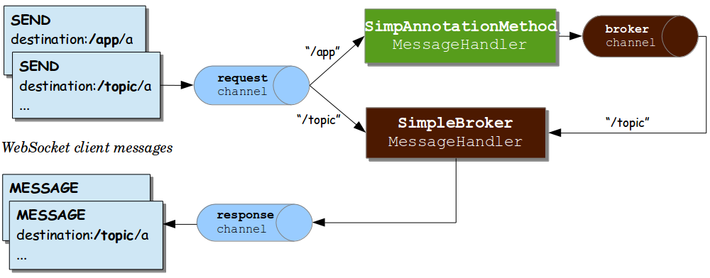
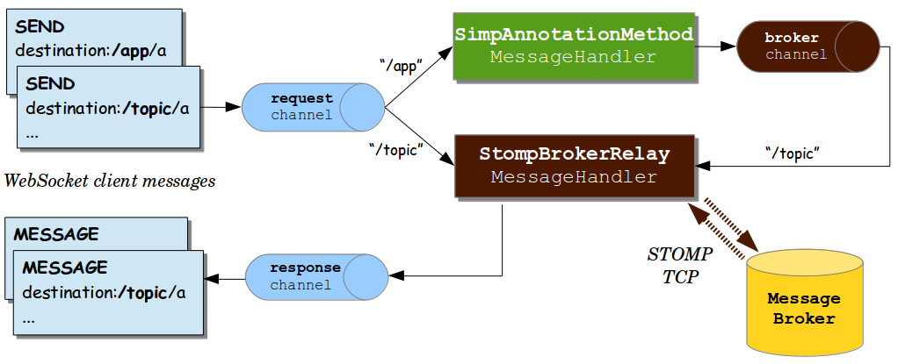

## 4. WebSockets

[WebFlux](https://docs.spring.io/spring-framework/docs/current/reference/html/web-reactive.html#webflux-websocket)

This part of the reference documentation covers support for Servlet stack, WebSocket messaging that includes raw WebSocket interactions, WebSocket emulation through SockJS, and publish-subscribe messaging through STOMP as a sub-protocol over WebSocket.

参考文档的这一部分包括对 Servlet 堆栈、WebSocket 消息传递（包括原始 WebSocket 交互）、通过 SockJS 的 WebSocket 仿真以及通过 STOMP 作为 WebSocket 上的子协议发布-订阅消息传递的支持。

### 4.1. Introduction to WebSocket

The WebSocket protocol, [RFC 6455](https://tools.ietf.org/html/rfc6455), provides a standardized way to establish a full-duplex, two-way communication channel between client and server over a single TCP connection. It is a different TCP protocol from HTTP but is designed to work over HTTP, using ports 80 and 443 and allowing re-use of existing firewall rules.

A WebSocket interaction begins with an HTTP request that uses the HTTP `Upgrade` header to upgrade or, in this case, to switch to the WebSocket protocol. The following example shows such an interaction:

**WebSocket 协议[RFC6455](https://tools.ietf.org/html/rfc6455)，提供了通过单个 TCP 连接在客户端和服务器之间建立全双工双向通信通道的标准化方法。它是一种不同于 HTTP 的 TCP 协议，但设计用于在 HTTP 上工作，使用端口 80 和 443，并允许重复使用现有的防火墙规则。**

WebSocket 交互从一个 HTTP 请求开始，该请求使用 HTTP `Upgrade` 头进行升级，或者在本例中切换到 WebSocket 协议。以下示例显示了这种交互：

```yaml
GET /spring-websocket-portfolio/portfolio HTTP/1.1
Host: localhost:8080
Upgrade: websocket  // 1
Connection: Upgrade // 2
Sec-WebSocket-Key: Uc9l9TMkWGbHFD2qnFHltg==
Sec-WebSocket-Protocol: v10.stomp, v11.stomp
Sec-WebSocket-Version: 13
Origin: http://localhost:8080
```

- 1：The `Upgrade` header.
- 2：Using the `Upgrade` connection.

Instead of the usual 200 status code, a server with WebSocket support returns output similar to the following:

**具有 WebSocket 支持的服务器返回类似以下内容的输出，而不是通常的 200 状态代码：**

```yaml
HTTP/1.1 101 Switching Protocols  // 1
Upgrade: websocket
Connection: Upgrade
Sec-WebSocket-Accept: 1qVdfYHU9hPOl4JYYNXF623Gzn0=
Sec-WebSocket-Protocol: v10.stomp
```

- 1：Protocol switch

After a successful handshake, the TCP socket underlying the HTTP upgrade request remains open for both the client and the server to continue to send and receive messages.

A complete introduction of how WebSockets work is beyond the scope of this document. See RFC 6455, the WebSocket chapter of HTML5, or any of the many introductions and tutorials on the Web.

Note that, if a WebSocket server is running behind a web server (e.g. nginx), you likely need to configure it to pass WebSocket upgrade requests on to the WebSocket server. Likewise, if the application runs in a cloud environment, check the instructions of the cloud provider related to WebSocket support.

成功握手后，HTTP 升级请求背后的 TCP socket 保持打开状态，以便客户端和服务器继续发送和接收消息。

关于 WebSocket 如何工作的完整介绍超出了本文档的范围。请参阅 RFC6455、HTML5 的 WebSocket 一章或 Web 上的任何介绍和教程。

请注意，如果 WebSocket 服务器在 web 服务器（例如 nginx）后面运行，则可能需要将其配置为将 WebSocket 升级请求传递到WebSocket 服务器。同样，如果应用程序在云环境中运行，请查看云提供商有关 WebSocket 支持的说明。

#### 4.1.1. HTTP Versus WebSocket

#### 4.1.1. HTTP 与 WebSocket

Even though WebSocket is designed to be HTTP-compatible and starts with an HTTP request, it is important to understand that the two protocols lead to very different architectures and application programming models.

In HTTP and REST, an application is modeled as many URLs. To interact with the application, clients access those URLs, request-response style. Servers route requests to the appropriate handler based on the HTTP URL, method, and headers.

By contrast, in WebSockets, there is usually only one URL for the initial connect. Subsequently, all application messages flow on that same TCP connection. This points to an entirely different asynchronous, event-driven, messaging architecture.

WebSocket is also a low-level transport protocol, which, unlike HTTP, does not prescribe any semantics to the content of messages. That means that there is no way to route or process a message unless the client and the server agree on message semantics.

WebSocket clients and servers can negotiate the use of a higher-level, messaging protocol (for example, STOMP), through the `Sec-WebSocket-Protocol` header on the HTTP handshake request. In the absence of that, they need to come up with their own conventions.

尽管 WebSocket 被设计为 HTTP 兼容并从 HTTP 请求开始，但重要的是要理解这两种协议导致了非常不同的体系结构和应用程序编程模型。

在 HTTP 和 REST 中，一个应用程序被建模为多个 URL。为了与应用程序交互，客户端访问这些 URL，请求-响应方式。服务器根据 HTTP URL、方法和头将请求路由到相应的处理程序。

相比之下，在 WebSocket 中，初始连接通常只有一个 URL。随后，所有应用程序消息在同一 TCP 连接上流动。这指向一个完全不同的异步、事件驱动的消息传递体系结构。

WebSocket 也是一种低级传输协议，与 HTTP 不同，它不对消息内容规定任何语义。这意味着除非客户机和服务器在消息语义上达成一致，否则无法路由或处理消息。

WebSocket 客户端和服务器可以通过 HTTP 握手请求上的 “Sec WebSocket protocol” 头协商使用更高级别的消息传递协议（例如STOMP）。如果没有这一点，他们需要制定自己的惯例。

#### 4.1.2. When to Use WebSockets

WebSockets can make a web page be dynamic and interactive. However, in many cases, a combination of Ajax and HTTP streaming or long polling can provide a simple and effective solution.

For example, news, mail, and social feeds need to update dynamically, but it may be perfectly okay to do so every few minutes. Collaboration, games, and financial apps, on the other hand, need to be much closer to real-time.

Latency alone is not a deciding factor. If the volume of messages is relatively low (for example, monitoring network failures) HTTP streaming or polling can provide an effective solution. It is the combination of low latency, high frequency, and high volume that make the best case for the use of WebSocket.

Keep in mind also that over the Internet, restrictive proxies that are outside of your control may preclude WebSocket interactions, either because they are not configured to pass on the `Upgrade` header or because they close long-lived connections that appear idle. This means that the use of WebSocket for internal applications within the firewall is a more straightforward decision than it is for public facing applications.

WebSocket 可以使网页具有动态性和交互性。然而，在许多情况下，Ajax 和 HTTP 流或长轮询的组合可以提供简单有效的解决方案。

例如，新闻、邮件和社交提要需要动态更新，但每隔几分钟更新一次可能完全可以。另一方面，协作、游戏和金融应用程序需要更加接近实时。

延迟本身并不是决定因素。如果消息量相对较低（例如，监视网络故障），HTTP 流或轮询可以提供有效的解决方案。正是低延迟、高频率和高容量的组合才是使用 WebSocket 的最佳方案。

还请记住，在 Internet 上，超出您控制范围的限制性代理可能会阻止 WebSocket 交互，这可能是因为它们未配置为传递“升级”标头，也可能是因为它们关闭了看似空闲的长期连接。这意味着，与面向公众的应用程序相比，在防火墙内部应用程序中使用WebSocket 是一个更直接的决定。

### 4.2. WebSocket API

[WebFlux](https://docs.spring.io/spring-framework/docs/current/reference/html/web-reactive.html#webflux-websocket-server)

The Spring Framework provides a WebSocket API that you can use to write client- and server-side applications that handle WebSocket messages.

Spring 框架提供了一个 WebSocket API，可用于编写处理 WebSocket 消息的客户端和服务器端应用程序。

#### 4.2.1. `WebSocketHandler`

[WebFlux](https://docs.spring.io/spring-framework/docs/current/reference/html/web-reactive.html#webflux-websocket-server-handler)

Creating a WebSocket server is as simple as implementing `WebSocketHandler` or, more likely, extending either `TextWebSocketHandler` or `BinaryWebSocketHandler`. The following example uses `TextWebSocketHandler`:

创建 WebSocket 服务器与实现 `WebSocketHandler` 一样简单，或者更可能是扩展 `TextWebSocketHandler` 或 `BinaryWebSocketHandler`。以下示例使用 `TextWebSocketHandler`：

```java
import org.springframework.web.socket.WebSocketHandler;
import org.springframework.web.socket.WebSocketSession;
import org.springframework.web.socket.TextMessage;

public class MyHandler extends TextWebSocketHandler {

    @Override
    public void handleTextMessage(WebSocketSession session, TextMessage message) {
        // ...
    }

}
```

There is dedicated WebSocket Java configuration and XML namespace support for mapping the preceding WebSocket handler to a specific URL, as the following example shows:

有专门的 WebSocket Java 配置和 XML 命名空间支持，用于将前面的 WebSocket 处理程序映射到特定 URL，如下例所示：

```java
import org.springframework.web.socket.config.annotation.EnableWebSocket;
import org.springframework.web.socket.config.annotation.WebSocketConfigurer;
import org.springframework.web.socket.config.annotation.WebSocketHandlerRegistry;

@Configuration
@EnableWebSocket
public class WebSocketConfig implements WebSocketConfigurer {

    @Override
    public void registerWebSocketHandlers(WebSocketHandlerRegistry registry) {
        registry.addHandler(myHandler(), "/myHandler");
    }

    @Bean
    public WebSocketHandler myHandler() {
        return new MyHandler();
    }

}
```

The following example shows the XML configuration equivalent of the preceding example:

以下示例显示了与前一示例等效的 XML 配置：

```xml
<beans xmlns="http://www.springframework.org/schema/beans"
    xmlns:xsi="http://www.w3.org/2001/XMLSchema-instance"
    xmlns:websocket="http://www.springframework.org/schema/websocket"
    xsi:schemaLocation="
        http://www.springframework.org/schema/beans
        https://www.springframework.org/schema/beans/spring-beans.xsd
        http://www.springframework.org/schema/websocket
        https://www.springframework.org/schema/websocket/spring-websocket.xsd">

    <websocket:handlers>
        <websocket:mapping path="/myHandler" handler="myHandler"/>
    </websocket:handlers>

    <bean id="myHandler" class="org.springframework.samples.MyHandler"/>

</beans>
```

The preceding example is for use in Spring MVC applications and should be included in the configuration of a [`DispatcherServlet`](https://docs.spring.io/spring-framework/docs/current/reference/html/web.html#mvc-servlet). However, Spring’s WebSocket support does not depend on Spring MVC. It is relatively simple to integrate a `WebSocketHandler` into other HTTP-serving environments with the help of [`WebSocketHttpRequestHandler`](https://docs.spring.io/spring-framework/docs/5.3.13/javadoc-api/org/springframework/web/socket/server/support/WebSocketHttpRequestHandler.html).

When using the `WebSocketHandler` API directly vs indirectly, e.g. through the [STOMP](https://docs.spring.io/spring-framework/docs/current/reference/html/web.html#websocket-stomp) messaging, the application must synchronize the sending of messages since the underlying standard WebSocket session (JSR-356) does not allow concurrent sending. One option is to wrap the `WebSocketSession` with [`ConcurrentWebSocketSessionDecorator`](https://docs.spring.io/spring-framework/docs/5.3.13/javadoc-api/org/springframework/web/socket/handler/ConcurrentWebSocketSessionDecorator.html).

前面的示例用于 Spring MVC 应用程序，应该包含在 [`DispatcherServlet`](https://docs.spring.io/spring-framework/docs/current/reference/html/web.html#mvc-servlet) 的配置中。然而，Spring 的 WebSocket 支持并不依赖于 SpringMVC。在[`WebSocketHttpRequestHandler`](https://docs.spring.io/spring-framework/docs/5.3.13/javadoc-api/org/springframework/web/socket/server/support/WebSocketHttpRequestHandler.html) 的帮助下，将`WebSocketHttler`集成到其他 HTTP 服务环境中相对简单。

当直接或间接使用 `WebSocketHandler` API 时，例如通过[STOMP](https://docs.spring.io/spring-framework/docs/current/reference/html/web.html#websocket-stomp) 消息传递，应用程序必须同步消息的发送，因为基础标准WebSocket 会话（JSR-356）不允许并发发送。一个选项是用[`ConcurrentWebSocketSessionDecorator`](https://docs.spring.io/spring-framework/docs/5.3.13/javadoc-api/org/springframework/web/socket/handler/ConcurrentWebSocketSessionDecorator.html)包装 `WebSocketSession`。

#### 4.2.2. WebSocket Handshake

#### 4.2.2.WebSocket握手

[WebFlux](https://docs.spring.io/spring-framework/docs/current/reference/html/web-reactive.html#webflux-websocket-server-handshake)

The easiest way to customize the initial HTTP WebSocket handshake request is through a `HandshakeInterceptor`, which exposes methods for “before” and “after” the handshake. You can use such an interceptor to preclude the handshake or to make any attributes available to the `WebSocketSession`. The following example uses a built-in interceptor to pass HTTP session attributes to the WebSocket session:

定制初始 HTTP WebSocket 握手请求的最简单方法是通过 `HandshakeInterceptor`，它公开了握手“之前”和“之后”的方法。您可以使用这样的拦截器来阻止握手或使任何属性都可用于 `WebSocketSession`”。以下示例使用内置拦截器将 HTTP 会话属性传递给 WebSocket 会话：

```java
@Configuration
@EnableWebSocket
public class WebSocketConfig implements WebSocketConfigurer {

    @Override
    public void registerWebSocketHandlers(WebSocketHandlerRegistry registry) {
        registry.addHandler(new MyHandler(), "/myHandler")
            .addInterceptors(new HttpSessionHandshakeInterceptor());
    }

}
```

The following example shows the XML configuration equivalent of the preceding example:

以下示例显示了与前一示例等效的 XML 配置：

```xml
<beans xmlns="http://www.springframework.org/schema/beans"
    xmlns:xsi="http://www.w3.org/2001/XMLSchema-instance"
    xmlns:websocket="http://www.springframework.org/schema/websocket"
    xsi:schemaLocation="
        http://www.springframework.org/schema/beans
        https://www.springframework.org/schema/beans/spring-beans.xsd
        http://www.springframework.org/schema/websocket
        https://www.springframework.org/schema/websocket/spring-websocket.xsd">

    <websocket:handlers>
        <websocket:mapping path="/myHandler" handler="myHandler"/>
        <websocket:handshake-interceptors>
            <bean class="org.springframework.web.socket.server.support.HttpSessionHandshakeInterceptor"/>
        </websocket:handshake-interceptors>
    </websocket:handlers>

    <bean id="myHandler" class="org.springframework.samples.MyHandler"/>

</beans>
```

A more advanced option is to extend the `DefaultHandshakeHandler` that performs the steps of the WebSocket handshake, including validating the client origin, negotiating a sub-protocol, and other details. An application may also need to use this option if it needs to configure a custom `RequestUpgradeStrategy` in order to adapt to a WebSocket server engine and version that is not yet supported (see [Deployment](https://docs.spring.io/spring-framework/docs/current/reference/html/web.html#websocket-server-deployment) for more on this subject). Both the Java configuration and XML namespace make it possible to configure a custom `HandshakeHandler`.

更高级的选项是扩展 `DefaultHandshakeHandler`，它执行 WebSocket 握手的步骤，包括验证客户端来源、协商子协议和其他细节。如果应用程序需要配置自定义的 `RequestUpgradeStrategy`，以适应尚未受支持的 WebSocket 服务器引擎和版本，则可能还需要使用此选项（有关此主题的更多信息，请参阅[Deployment](https://docs.spring.io/spring-framework/docs/current/reference/html/web.html#websocket-server-deployment) ）。Java 配置和 XML 名称空间都可以配置自定义的“握手器”。

> Spring provides a `WebSocketHandlerDecorator` base class that you can use to decorate a `WebSocketHandler` with additional behavior. Logging and exception handling implementations are provided and added by default when using the WebSocket Java configuration or XML namespace. The `ExceptionWebSocketHandlerDecorator` catches all uncaught exceptions that arise from any `WebSocketHandler` method and closes the WebSocket session with status `1011`, which indicates a server error.
>
> Spring 提供了一个 `WebSocketHandlerDecorator` 基类，您可以使用它来用其他行为装饰 `WebSocketHandler`。在使用WebSocket Java 配置或 XML 命名空间时，默认情况下会提供并添加日志记录和异常处理实现。`ExceptionWebSocketHandler` 捕获由任何 `WebSocketHandler` 方法产生的所有未捕获异常，并关闭状态为 `1011` 的WebSocket 会话，这表示服务器错误。

#### 4.2.3. Deployment

The Spring WebSocket API is easy to integrate into a Spring MVC application where the `DispatcherServlet` serves both HTTP WebSocket handshake and other HTTP requests. It is also easy to integrate into other HTTP processing scenarios by invoking `WebSocketHttpRequestHandler`. This is convenient and easy to understand. However, special considerations apply with regards to JSR-356 runtimes.

The Java WebSocket API (JSR-356) provides two deployment mechanisms. The first involves a Servlet container classpath scan (a Servlet 3 feature) at startup. The other is a registration API to use at Servlet container initialization. Neither of these mechanism makes it possible to use a single “front controller” for all HTTP processing — including WebSocket handshake and all other HTTP requests — such as Spring MVC’s `DispatcherServlet`.

This is a significant limitation of JSR-356 that Spring’s WebSocket support addresses with server-specific `RequestUpgradeStrategy` implementations even when running in a JSR-356 runtime. Such strategies currently exist for Tomcat, Jetty, GlassFish, WebLogic, WebSphere, and Undertow (and WildFly).

SpringWebSocket API 很容易集成到 SpringMVC 应用程序中，`DispatcherServlet`同时提供 HTTP WebSocket 握手和其他 HTTP 请求。通过调用 `WebSocketHttpRequestHandler`，还可以很容易地集成到其他 HTTP 处理场景中。这既方便又容易理解。但是，特别注意事项适用于JSR-356 运行时。

JavaWebSocket API（JSR-356）提供了两种部署机制。第一个涉及启动时的 Servlet 容器类路径扫描（Servlet 3 特性）。另一个是用于 Servlet 容器初始化的注册 API。这两种机制都不允许对所有 HTTP 处理使用单个“前端控制器” — 包括 WebSocket 握手和所有其他 HTTP 请求 — 比如 SpringMVC 的 `DispatcherServlet`。

这是 JSR-356 的一个显著限制，即 Spring 的 WebSocket 支持使用特定于服务器的 `RequestUpgradeStrategy` 实现来解决问题，即使在 JSR-356 运行时也是如此。此类策略目前适用于 Tomcat、Jetty、GlassFish、WebLogic、WebSphere 和 Undertow（以及WildFly）。

>   A request to overcome the preceding limitation in the Java WebSocket API has been created and can be followed at [eclipse-ee4j/websocket-api#211](https://github.com/eclipse-ee4j/websocket-api/issues/211). Tomcat, Undertow, and WebSphere provide their own API alternatives that make it possible to do this, and it is also possible with Jetty. We are hopeful that more servers will do the same.
>
>   已经创建了一个请求，以克服 Java WebSocket API 中的上述限制，可以在[eclipse-ee4j/WebSocket API#211](https://github.com/eclipse-ee4j/websocket-api/issues/211) 中找到。Tomcat、Undertow 和 WebSphere 提供了它们自己的API替代方案，这使得实现这一点成为可能，Jetty 也可以做到这一点。我们希望更多的服务器也能做到这一点。

A secondary consideration is that Servlet containers with JSR-356 support are expected to perform a `ServletContainerInitializer` (SCI) scan that can slow down application startup — in some cases, dramatically. If a significant impact is observed after an upgrade to a Servlet container version with JSR-356 support, it should be possible to selectively enable or disable web fragments (and SCI scanning) through the use of the `<absolute-ordering />` element in `web.xml`, as the following example shows:

第二个需要考虑的问题是，支持 JSR-356 的 Servlet 容器需要执行 `ServletContainerInitializer`（SCI）扫描，这可能会减慢应用程序的启动速度 — 在某些情况下，这是戏剧性的。如果在升级到支持 JSR-356 的 Servlet 容器版本后观察到重大影响，则应该可以通过使用 `web.xml` 中的 `<absolute ordering/>`元素有选择地启用或禁用 web 片段（和 SCI 扫描），如下例所示：

```xml
<web-app xmlns="http://java.sun.com/xml/ns/javaee"
    xmlns:xsi="http://www.w3.org/2001/XMLSchema-instance"
    xsi:schemaLocation="
        http://java.sun.com/xml/ns/javaee
        https://java.sun.com/xml/ns/javaee/web-app_3_0.xsd"
    version="3.0">

    <absolute-ordering/>

</web-app>
```

You can then selectively enable web fragments by name, such as Spring’s own `SpringServletContainerInitializer` that provides support for the Servlet 3 Java initialization API. The following example shows how to do so:

然后，您可以按名称有选择地启用 web 片段，例如 Spring 自己的 `SpringServletContainerInitializer`，它提供对Servlet 3 Java 初始化 API 的支持。以下示例显示了如何执行此操作：

```xml
<web-app xmlns="http://java.sun.com/xml/ns/javaee"
    xmlns:xsi="http://www.w3.org/2001/XMLSchema-instance"
    xsi:schemaLocation="
        http://java.sun.com/xml/ns/javaee
        https://java.sun.com/xml/ns/javaee/web-app_3_0.xsd"
    version="3.0">

    <absolute-ordering>
        <name>spring_web</name>
    </absolute-ordering>

</web-app>
```

#### 4.2.4. Server Configuration

[WebFlux](https://docs.spring.io/spring-framework/docs/current/reference/html/web-reactive.html#webflux-websocket-server-config)

Each underlying WebSocket engine exposes configuration properties that control runtime characteristics, such as the size of message buffer sizes, idle timeout, and others.

For Tomcat, WildFly, and GlassFish, you can add a `ServletServerContainerFactoryBean` to your WebSocket Java config, as the following example shows:

每个底层 WebSocket 引擎都公开控制运行时特征的配置属性，如消息缓冲区大小、空闲超时等。

对于 Tomcat、WildFly 和 GlassFish，您可以将 `ServletServerContainerFactoryBean` 添加到 WebSocket Java 配置中，如下例所示：

```java
@Configuration
@EnableWebSocket
public class WebSocketConfig implements WebSocketConfigurer {

    @Bean
    public ServletServerContainerFactoryBean createWebSocketContainer() {
        ServletServerContainerFactoryBean container = new ServletServerContainerFactoryBean();
        container.setMaxTextMessageBufferSize(8192);
        container.setMaxBinaryMessageBufferSize(8192);
        return container;
    }

}
```

The following example shows the XML configuration equivalent of the preceding example:

以下示例显示了与前一示例等效的 XML 配置：

```xml
<beans xmlns="http://www.springframework.org/schema/beans"
    xmlns:xsi="http://www.w3.org/2001/XMLSchema-instance"
    xmlns:websocket="http://www.springframework.org/schema/websocket"
    xsi:schemaLocation="
        http://www.springframework.org/schema/beans
        https://www.springframework.org/schema/beans/spring-beans.xsd
        http://www.springframework.org/schema/websocket
        https://www.springframework.org/schema/websocket/spring-websocket.xsd">

    <bean class="org.springframework...ServletServerContainerFactoryBean">
        <property name="maxTextMessageBufferSize" value="8192"/>
        <property name="maxBinaryMessageBufferSize" value="8192"/>
    </bean>

</beans>
```

> For client-side WebSocket configuration, you should use `WebSocketContainerFactoryBean` (XML) or `ContainerProvider.getWebSocketContainer()` (Java configuration).
>
> 对于客户端 WebSocket 配置，应该使用 `WebSocketContainerFactoryBean`（XML）或 `ContainerProvider.getWebSocketContainer()`（Java 配置）。

For Jetty, you need to supply a pre-configured Jetty `WebSocketServerFactory` and plug that into Spring’s `DefaultHandshakeHandler` through your WebSocket Java config. The following example shows how to do so:

对于 Jetty，您需要提供一个预配置的 Jetty`WebSocketServerFactory`，并通过 WebSocket Java 配置将其插入 Spring 的`DefaultHandshakeHandler`中。以下示例显示了如何执行此操作：

```java
@Configuration
@EnableWebSocket
public class WebSocketConfig implements WebSocketConfigurer {

    @Override
    public void registerWebSocketHandlers(WebSocketHandlerRegistry registry) {
        registry.addHandler(echoWebSocketHandler(),
            "/echo").setHandshakeHandler(handshakeHandler());
    }

    @Bean
    public DefaultHandshakeHandler handshakeHandler() {

        WebSocketPolicy policy = new WebSocketPolicy(WebSocketBehavior.SERVER);
        policy.setInputBufferSize(8192);
        policy.setIdleTimeout(600000);

        return new DefaultHandshakeHandler(
                new JettyRequestUpgradeStrategy(new WebSocketServerFactory(policy)));
    }

}
```

The following example shows the XML configuration equivalent of the preceding example:

以下示例显示了与前一示例等效的 XML 配置：

```xml
<beans xmlns="http://www.springframework.org/schema/beans"
    xmlns:xsi="http://www.w3.org/2001/XMLSchema-instance"
    xmlns:websocket="http://www.springframework.org/schema/websocket"
    xsi:schemaLocation="
        http://www.springframework.org/schema/beans
        https://www.springframework.org/schema/beans/spring-beans.xsd
        http://www.springframework.org/schema/websocket
        https://www.springframework.org/schema/websocket/spring-websocket.xsd">

    <websocket:handlers>
        <websocket:mapping path="/echo" handler="echoHandler"/>
        <websocket:handshake-handler ref="handshakeHandler"/>
    </websocket:handlers>

    <bean id="handshakeHandler" class="org.springframework...DefaultHandshakeHandler">
        <constructor-arg ref="upgradeStrategy"/>
    </bean>

    <bean id="upgradeStrategy" class="org.springframework...JettyRequestUpgradeStrategy">
        <constructor-arg ref="serverFactory"/>
    </bean>

    <bean id="serverFactory" class="org.eclipse.jetty...WebSocketServerFactory">
        <constructor-arg>
            <bean class="org.eclipse.jetty...WebSocketPolicy">
                <constructor-arg value="SERVER"/>
                <property name="inputBufferSize" value="8092"/>
                <property name="idleTimeout" value="600000"/>
            </bean>
        </constructor-arg>
    </bean>

</beans>
```

#### 4.2.5. Allowed Origins

[WebFlux](https://docs.spring.io/spring-framework/docs/current/reference/html/web-reactive.html#webflux-websocket-server-cors)

As of Spring Framework 4.1.5, the default behavior for WebSocket and SockJS is to accept only same-origin requests. It is also possible to allow all or a specified list of origins. This check is mostly designed for browser clients. Nothing prevents other types of clients from modifying the `Origin` header value (see [RFC 6454: The Web Origin Concept](https://tools.ietf.org/html/rfc6454) for more details).

The three possible behaviors are:

- Allow only same-origin requests (default): In this mode, when SockJS is enabled, the Iframe HTTP response header `X-Frame-Options` is set to `SAMEORIGIN`, and JSONP transport is disabled, since it does not allow checking the origin of a request. As a consequence, IE6 and IE7 are not supported when this mode is enabled.
- Allow a specified list of origins: Each allowed origin must start with `http://` or `https://`. In this mode, when SockJS is enabled, IFrame transport is disabled. As a consequence, IE6 through IE9 are not supported when this mode is enabled.
- Allow all origins: To enable this mode, you should provide `*` as the allowed origin value. In this mode, all transports are available.

You can configure WebSocket and SockJS allowed origins, as the following example shows:

从 SpringFramework 4.1.5 开始，WebSocket 和 SockJS 的默认行为是只接受相同的原始请求。也可以允许所有或指定的源列表。此检查主要是为浏览器客户端设计的。没有任何东西可以阻止其他类型的客户端修改`Origin`头值（有关更多详细信息，请参见[RFC 6454:Web Origin Concept](https://tools.ietf.org/html/rfc6454)）。

三种可能的行为是：

- 仅允许相同的原始请求（默认）：在此模式下，当启用 SockJS 时，Iframe HTTP 响应头 `X-Frame-Options` 设置为 `SAMEORIGIN`，并且 JSONP 传输被禁用，因为它不允许检查请求的原始。因此，启用此模式时不支持 IE6 和 IE7。
- 允许指定的源代码列表：每个允许的源代码必须以 `http://` 或 `https://` 开头。在此模式下，当启用 SockJS 时，IFrame 传输被禁用。因此，启用此模式时不支持 IE6 到 IE9。
- 允许所有原点：要启用此模式，应提供`*`作为允许的原点值。在此模式下，所有传输都可用。

您可以配置 WebSocket 和 SockJS 允许的源，如下例所示：

```java
import org.springframework.web.socket.config.annotation.EnableWebSocket;
import org.springframework.web.socket.config.annotation.WebSocketConfigurer;
import org.springframework.web.socket.config.annotation.WebSocketHandlerRegistry;

@Configuration
@EnableWebSocket
public class WebSocketConfig implements WebSocketConfigurer {

    @Override
    public void registerWebSocketHandlers(WebSocketHandlerRegistry registry) {
        registry.addHandler(myHandler(), "/myHandler").setAllowedOrigins("https://mydomain.com");
    }

    @Bean
    public WebSocketHandler myHandler() {
        return new MyHandler();
    }

}
```

The following example shows the XML configuration equivalent of the preceding example:

以下示例显示了与前一示例等效的 XML 配置：

```xml
<beans xmlns="http://www.springframework.org/schema/beans"
    xmlns:xsi="http://www.w3.org/2001/XMLSchema-instance"
    xmlns:websocket="http://www.springframework.org/schema/websocket"
    xsi:schemaLocation="
        http://www.springframework.org/schema/beans
        https://www.springframework.org/schema/beans/spring-beans.xsd
        http://www.springframework.org/schema/websocket
        https://www.springframework.org/schema/websocket/spring-websocket.xsd">

    <websocket:handlers allowed-origins="https://mydomain.com">
        <websocket:mapping path="/myHandler" handler="myHandler" />
    </websocket:handlers>

    <bean id="myHandler" class="org.springframework.samples.MyHandler"/>

</beans>
```

### 4.3. SockJS Fallback

Over the public Internet, restrictive proxies outside your control may preclude WebSocket interactions, either because they are not configured to pass on the `Upgrade` header or because they close long-lived connections that appear to be idle.

The solution to this problem is WebSocket emulation — that is, attempting to use WebSocket first and then falling back on HTTP-based techniques that emulate a WebSocket interaction and expose the same application-level API.

On the Servlet stack, the Spring Framework provides both server (and also client) support for the SockJS protocol.

在公共 Internet 上，您无法控制的限制性代理可能会阻止 WebSocket 交互，这可能是因为它们未配置为传递“升级”标头，也可能是因为它们关闭了看似空闲的长期连接。

这个问题的解决方案是 WebSocket 仿真 — 也就是说，尝试先使用 WebSocket，然后再使用基于 HTTP 的技术来模拟 WebSocket 交互并公开相同的应用程序级 API。

在 Servlet 堆栈上，Spring 框架为 SockJS 协议提供了服务器（以及客户端）支持。

#### 4.3.1. Overview

The goal of SockJS is to let applications use a WebSocket API but fall back to non-WebSocket alternatives when necessary at runtime, without the need to change application code.

SockJS consists of:

- The [SockJS protocol](https://github.com/sockjs/sockjs-protocol) defined in the form of executable [narrated tests](https://sockjs.github.io/sockjs-protocol/sockjs-protocol-0.3.3.html).
- The [SockJS JavaScript client](https://github.com/sockjs/sockjs-client/) — a client library for use in browsers.
- SockJS server implementations, including one in the Spring Framework `spring-websocket` module.
- A SockJS Java client in the `spring-websocket` module (since version 4.1).

SockJS 的目标是让应用程序使用 WebSocket API，但在运行时需要时，可以退回到非 WebSocket 替代方案，而无需更改应用程序代码。
SockJS 包括：

- 以可执行文件[叙述测试](https://sockjs.github.io/sockjs-protocol/sockjs-protocol-0.3.3.html) 的形式定义的[SockJS 协议](https://github.com/sockjs/sockjs-protocol)。
- [SockJS JavaScript客户端](https://github.com/sockjs/sockjs-client/)- 在浏览器中使用的客户端库。
- SockJS 服务器实现，包括 Spring 框架 `spring-websocket` 模块中的一个。
- `spring-websocket` 模块中的 SockJS Java 客户端（自版本4.1起）。

SockJS is designed for use in browsers. It uses a variety of techniques to support a wide range of browser versions. For the full list of SockJS transport types and browsers, see the [SockJS client](https://github.com/sockjs/sockjs-client/) page. Transports fall in three general categories: WebSocket, HTTP Streaming, and HTTP Long Polling. For an overview of these categories, see [this blog post](https://spring.io/blog/2012/05/08/spring-mvc-3-2-preview-techniques-for-real-time-updates/).

The SockJS client begins by sending `GET /info` to obtain basic information from the server. After that, it must decide what transport to use. If possible, WebSocket is used. If not, in most browsers, there is at least one HTTP streaming option. If not, then HTTP (long) polling is used.

All transport requests have the following URL structure:

```
https://host:port/myApp/myEndpoint/{server-id}/{session-id}/{transport}
```

where:

- `{server-id}` is useful for routing requests in a cluster but is not used otherwise.
- `{session-id}` correlates HTTP requests belonging to a SockJS session.
- `{transport}` indicates the transport type (for example, `websocket`, `xhr-streaming`, and others).

SockJS 是为在浏览器中使用而设计的。它使用多种技术来支持多种浏览器版本。有关 SockJS 传输类型和浏览器的完整列表，请参阅[SockJS client](https://github.com/sockjs/sockjs-client/) 页面。传输分为三大类：WebSocket、HTTP 流和 HTTP 长轮询。有关这些类别的概述，请参阅[本博客文章](https://spring.io/blog/2012/05/08/spring-mvc-3-2-preview-techniques-for-real-time-updates/)。

SockJS 客户端首先发 `GET /info`，从服务器获取基本信息。之后，它必须决定使用哪种交通工具。如果可能，请使用WebSocket。如果不是，在大多数浏览器中，至少有一个 HTTP 流选项。如果不是，则使用 HTTP（长）轮询。

所有传输请求都具有以下 URL 结构：

```
https://host:port/myApp/myEndpoint/{server id}/{session id}/{transport}
```
其中：

- `{server id}`对于在集群中路由请求很有用，但不能在其他情况下使用。
- `{session id}`关联属于 SockJS 会话的 HTTP 请求。
- `{transport}`表示传输类型（例如，`websocket`、`xhr streaming`，等等）。

The WebSocket transport needs only a single HTTP request to do the WebSocket handshake. All messages thereafter are exchanged on that socket.

HTTP transports require more requests. Ajax/XHR streaming, for example, relies on one long-running request for server-to-client messages and additional HTTP POST requests for client-to-server messages. Long polling is similar, except that it ends the current request after each server-to-client send.

SockJS adds minimal message framing. For example, the server sends the letter `o` (“open” frame) initially, messages are sent as `a["message1","message2"]` (JSON-encoded array), the letter `h` (“heartbeat” frame) if no messages flow for 25 seconds (by default), and the letter `c` (“close” frame) to close the session.

To learn more, run an example in a browser and watch the HTTP requests. The SockJS client allows fixing the list of transports, so it is possible to see each transport one at a time. The SockJS client also provides a debug flag, which enables helpful messages in the browser console. On the server side, you can enable `TRACE` logging for `org.springframework.web.socket`. For even more detail, see the SockJS protocol [narrated test](https://sockjs.github.io/sockjs-protocol/sockjs-protocol-0.3.3.html).

WebSocket 传输只需要一个 HTTP 请求就可以进行 WebSocket 握手。此后，所有消息都在该套接字上交换。

HTTP 传输需要更多的请求。例如，Ajax/XHR 流依赖于一个长时间运行的服务器到客户端消息请求和额外的客户端到服务器消息HTTP POST 请求。长轮询与此类似，只是它在每个服务器发送到客户端之后结束当前请求。

SockJS 添加了最小的消息框架。例如，服务器最初发送字 `o`（“打开”帧），消息作为 `a[“message1”，“message2”]`（JSON 编码数组）发送，如果 25 秒内没有消息流动，则发送字母 `h`（“心跳”帧）（默认情况下），并发送字母 `c`（“关闭”帧）以关闭会话。

要了解更多信息，请在浏览器中运行一个示例并查看 HTTP 请求。SockJS 客户端允许修复传输列表，因此可以一次查看一个传输。SockJS 客户机还提供了一个调试标志，用于在浏览器控制台中启用有用的消息。在服务器端，您可以为 `org.springframework.web.socket` 启用 `TRACE` 日志记录。有关更多详细信息，请参阅 SockJS 协议[叙述测试](https://sockjs.github.io/sockjs-protocol/sockjs-protocol-0.3.3.html)。

#### 4.3.2. Enabling SockJS

You can enable SockJS through Java configuration, as the following example shows:

您可以通过 Java 配置启用 SockJS，如下例所示：

```java
@Configuration
@EnableWebSocket
public class WebSocketConfig implements WebSocketConfigurer {

    @Override
    public void registerWebSocketHandlers(WebSocketHandlerRegistry registry) {
        registry.addHandler(myHandler(), "/myHandler").withSockJS();
    }

    @Bean
    public WebSocketHandler myHandler() {
        return new MyHandler();
    }

}
```

The following example shows the XML configuration equivalent of the preceding example:

以下示例显示了与前一示例等效的 XML 配置：

```xml
<beans xmlns="http://www.springframework.org/schema/beans"
    xmlns:xsi="http://www.w3.org/2001/XMLSchema-instance"
    xmlns:websocket="http://www.springframework.org/schema/websocket"
    xsi:schemaLocation="
        http://www.springframework.org/schema/beans
        https://www.springframework.org/schema/beans/spring-beans.xsd
        http://www.springframework.org/schema/websocket
        https://www.springframework.org/schema/websocket/spring-websocket.xsd">

    <websocket:handlers>
        <websocket:mapping path="/myHandler" handler="myHandler"/>
        <websocket:sockjs/>
    </websocket:handlers>

    <bean id="myHandler" class="org.springframework.samples.MyHandler"/>

</beans>
```

The preceding example is for use in Spring MVC applications and should be included in the configuration of a [`DispatcherServlet`](https://docs.spring.io/spring-framework/docs/current/reference/html/web.html#mvc-servlet). However, Spring’s WebSocket and SockJS support does not depend on Spring MVC. It is relatively simple to integrate into other HTTP serving environments with the help of [`SockJsHttpRequestHandler`](https://docs.spring.io/spring-framework/docs/5.3.13/javadoc-api/org/springframework/web/socket/sockjs/support/SockJsHttpRequestHandler.html).

On the browser side, applications can use the [`sockjs-client`](https://github.com/sockjs/sockjs-client/) (version 1.0.x). It emulates the W3C WebSocket API and communicates with the server to select the best transport option, depending on the browser in which it runs. See the [sockjs-client](https://github.com/sockjs/sockjs-client/) page and the list of transport types supported by browser. The client also provides several configuration options — for example, to specify which transports to include.

前面的示例用于 Spring MVC 应用程序，应该包含在[`DispatcherServlet`](https://docs.spring.io/spring-framework/docs/current/reference/html/web.html#mvc-servlet) 的配置中。然而，Spring 的 WebSocket 和 SockJS 支持并不依赖于 SpringMVC。借助[`SockJsHttpRequestHandler`](https://docs.spring.io/spring-framework/docs/5.3.13/javadoc-api/org/springframework/web/socket/sockjs/support/SockJsHttpRequestHandler.html)，集成到其他HTTP服务环境相对简单。
在浏览器端，应用程序可以使用 [`sockjs client`](https://github.com/sockjs/sockjs-client/)（1.0.x版）。它模拟 W3C WebSocket API，并与服务器通信以选择最佳传输选项，具体取决于运行它的浏览器。请参阅 [sockjs client](https://github.com/sockjs/sockjs-client/) 页面和浏览器支持的传输类型列表。客户端还提供了几个配置选项 — 例如，指定要包括的传输。

#### 4.3.3. IE 8 and 9

Internet Explorer 8 and 9 remain in use. They are a key reason for having SockJS. This section covers important considerations about running in those browsers.

The SockJS client supports Ajax/XHR streaming in IE 8 and 9 by using Microsoft’s [`XDomainRequest`](https://blogs.msdn.com/b/ieinternals/archive/2010/05/13/xdomainrequest-restrictions-limitations-and-workarounds.aspx). That works across domains but does not support sending cookies. Cookies are often essential for Java applications. However, since the SockJS client can be used with many server types (not just Java ones), it needs to know whether cookies matter. If so, the SockJS client prefers Ajax/XHR for streaming. Otherwise, it relies on an iframe-based technique.

The first `/info` request from the SockJS client is a request for information that can influence the client’s choice of transports. One of those details is whether the server application relies on cookies (for example, for authentication purposes or clustering with sticky sessions). Spring’s SockJS support includes a property called `sessionCookieNeeded`. It is enabled by default, since most Java applications rely on the `JSESSIONID` cookie. If your application does not need it, you can turn off this option, and SockJS client should then choose `xdr-streaming` in IE 8 and 9.

If you do use an iframe-based transport, keep in mind that browsers can be instructed to block the use of IFrames on a given page by setting the HTTP response header `X-Frame-Options` to `DENY`, `SAMEORIGIN`, or `ALLOW-FROM <origin>`. This is used to prevent [clickjacking](https://www.owasp.org/index.php/Clickjacking).

Internet Explorer 8 和 9 仍在使用中。它们是拥有 SockJS 的关键原因。本节介绍有关在这些浏览器中运行的重要注意事项。

SockJS 客户端通过使用 Microsoft 的[`XDomainRequest`](https://blogs.msdn.com/b/ieinternals/archive/2010/05/13/xdomainrequest-restrictions-limitations-and-workarounds.aspx)，支持 IE8 和 IE9 中的 Ajax/XHR 流媒体。跨域工作，但不支持发送 cookie。Cookie 对于Java 应用程序来说通常是必不可少的。但是，由于 SockJS 客户机可以用于多种服务器类型（不仅仅是 Java服务器），因此它需要知道 cookie 是否重要。如果是这样，SockJS 客户端更喜欢 Ajax/XHR 流媒体。否则，它依赖于基于 iframe的技术。

来自 SockJS 客户端的第一个`/info`请求是对可能影响客户端选择传输的信息的请求。其中一个细节是服务器应用程序是否依赖cookie（例如，出于身份验证目的或使用粘性会话进行集群）。Spring 的 SockJS 支持包括一个名为 `SessionOkieneeded` 的属性。它在默认情况下是启用的，因为大多数 Java 应用程序都依赖于`JSESSIONID` cookie。如果您的应用程序不需要它，您可以关闭此选项，然后 SockJS 客户端应该在 IE8 和 IE9 中选择  `xdr-streaming` 。

如果确实使用基于 iframe 的传输，请记住，可以通过将 HTTP 响应头 `X-Frame-Options` 设置为 `DENY`、`SAMEORIGIN` 或 `ALLOW-FROM<origin>` ，指示浏览器阻止在给定页面上使用 iframe。这用于防止[点击劫持](https://www.owasp.org/index.php/Clickjacking)。

> Spring Security 3.2+ provides support for setting `X-Frame-Options` on every response. By default, the Spring Security Java configuration sets it to `DENY`. In 3.2, the Spring Security XML namespace does not set that header by default but can be configured to do so. In the future, it may set it by default.See [Default Security Headers](https://docs.spring.io/spring-security/site/docs/current/reference/htmlsingle/#headers) of the Spring Security documentation for details on how to configure the setting of the `X-Frame-Options` header. You can also see [SEC-2501](https://jira.spring.io/browse/SEC-2501) for additional background.

If your application adds the `X-Frame-Options` response header (as it should!) and relies on an iframe-based transport, you need to set the header value to `SAMEORIGIN` or `ALLOW-FROM <origin>`. The Spring SockJS support also needs to know the location of the SockJS client, because it is loaded from the iframe. By default, the iframe is set to download the SockJS client from a CDN location. It is a good idea to configure this option to use a URL from the same origin as the application.

The following example shows how to do so in Java configuration:

如果您的应用程序添加了 `X-Frame-Options` 响应头（应该如此！）并且依赖于基于 iframe 的传输，您需要将标头值设置为 `SAMEORIGIN` 或 `ALLOW-FROM<origin>`。spring sockjs 支持还需要知道 SockJS 客户端的位置，因为它是从 iframe 加载的。默认情况下，iframe 设置为从 CDN 位置下载 SockJS 客户端。将此选项配置为使用与应用程序来源相同的 URL 是一个好主意。

以下示例显示了如何在 Java 配置中执行此操作：

```java
@Configuration
@EnableWebSocketMessageBroker
public class WebSocketConfig implements WebSocketMessageBrokerConfigurer {

    @Override
    public void registerStompEndpoints(StompEndpointRegistry registry) {
        registry.addEndpoint("/portfolio").withSockJS()
                .setClientLibraryUrl("http://localhost:8080/myapp/js/sockjs-client.js");
    }

    // ...

}
```

The XML namespace provides a similar option through the `<websocket:sockjs>` element.

XML名称空间通过`<websocket:sockjs>`元素提供了类似的选项。

> During initial development, do enable the SockJS client `devel` mode that prevents the browser from caching SockJS requests (like the iframe) that would otherwise be cached. For details on how to enable it see the [SockJS client](https://github.com/sockjs/sockjs-client/) page.

#### 4.3.4. Heartbeats

#### 4.3.4. 心跳

The SockJS protocol requires servers to send heartbeat messages to preclude proxies from concluding that a connection is hung. The Spring SockJS configuration has a property called `heartbeatTime` that you can use to customize the frequency. By default, a heartbeat is sent after 25 seconds, assuming no other messages were sent on that connection. This 25-second value is in line with the following [IETF recommendation](https://tools.ietf.org/html/rfc6202) for public Internet applications.

SockJS 协议要求服务器发送心跳消息，以防止代理断定连接已挂起。Spring SockJS 配置有一个名为 `heartbeatTime` 的属性，您可以使用该属性自定义频率。默认情况下，心跳在 25 秒后发送，前提是在该连接上没有发送其他消息。该 25 秒值符合以下[IETF建议](https://tools.ietf.org/html/rfc6202)用于公共互联网应用。

> When using STOMP over WebSocket and SockJS, if the STOMP client and server negotiate heartbeats to be exchanged, the SockJS heartbeats are disabled.
>
> 在 WebSocket 和 SockJS 上使用 STOMP 时，如果 STOMP 客户端和服务器协商要交换的心跳，则会禁用 SockJS 心跳。

The Spring SockJS support also lets you configure the `TaskScheduler` to schedule heartbeats tasks. The task scheduler is backed by a thread pool, with default settings based on the number of available processors. Your should consider customizing the settings according to your specific needs.

SpringSockJS 支持还允许您配置 `TaskScheduler` 来调度心跳任务。任务计划程序由线程池支持，其默认设置基于可用处理器的数量。您应该考虑根据您的具体需求定制设置。

#### 4.3.5. Client Disconnects

#### 4.3.5. 客户端断开连接

HTTP streaming and HTTP long polling SockJS transports require a connection to remain open longer than usual. For an overview of these techniques, see [this blog post](https://spring.io/blog/2012/05/08/spring-mvc-3-2-preview-techniques-for-real-time-updates/).

In Servlet containers, this is done through Servlet 3 asynchronous support that allows exiting the Servlet container thread, processing a request, and continuing to write to the response from another thread.

A specific issue is that the Servlet API does not provide notifications for a client that has gone away. See [eclipse-ee4j/servlet-api#44](https://github.com/eclipse-ee4j/servlet-api/issues/44). However, Servlet containers raise an exception on subsequent attempts to write to the response. Since Spring’s SockJS Service supports server-sent heartbeats (every 25 seconds by default), that means a client disconnect is usually detected within that time period (or earlier, if messages are sent more frequently).

HTTP 流式传输和 HTTP 长轮询 SockJS 传输需要一个连接保持比平时更长的开放时间。有关这些技术的概述，请参阅[本博客文章](https://spring.io/blog/2012/05/08/spring-mvc-3-2-preview-techniques-for-real-time-updates/).

在 Servlet 容器中，这是通过 Servlet 3 异步支持完成的，该支持允许退出 Servlet 容器线程、处理请求并继续从另一个线程写入响应。

一个具体的问题是 Servlet API 不为已经离开的客户机提供通知。参见[eclipse-ee4j/servlet api#44](https://github.com/eclipse-ee4j/servlet-api/issues/44)。但是，Servlet 容器在后续尝试写入响应时引发异常。由于 Spring 的 SockJS 服务支持服务器发送的心跳（默认情况下每 25 秒一次），这意味着通常会在该时间段内检测到客户端断开连接（或者更早，如果消息发送更频繁）。

>   As a result, network I/O failures can occur because a client has disconnected, which can fill the log with unnecessary stack traces. Spring makes a best effort to identify such network failures that represent client disconnects (specific to each server) and log a minimal message by using the dedicated log category, `DISCONNECTED_CLIENT_LOG_CATEGORY` (defined in `AbstractSockJsSession`). If you need to see the stack traces, you can set that log category to TRACE.
>
> 因此，由于客户端已断开连接，可能会发生网络 I/O 故障，这可能会用不必要的堆栈跟踪填充日志。Spring 尽最大努力识别这些表示客户端断开连接（特定于每个服务器）的网络故障，并使用专用的日志类别`DISCONNECTED_CLIENT_LOG_CATEGORY`（在 `AbstractSockJsSession` 中定义）记录最小的消息。如果需要查看堆栈跟踪，可以将该日志类别设置为跟踪。

#### 4.3.6. SockJS and CORS

If you allow cross-origin requests (see [Allowed Origins](https://docs.spring.io/spring-framework/docs/current/reference/html/web.html#websocket-server-allowed-origins)), the SockJS protocol uses CORS for cross-domain support in the XHR streaming and polling transports. Therefore, CORS headers are added automatically, unless the presence of CORS headers in the response is detected. So, if an application is already configured to provide CORS support (for example, through a Servlet Filter), Spring’s `SockJsService` skips this part.

It is also possible to disable the addition of these CORS headers by setting the `suppressCors` property in Spring’s SockJsService.

SockJS expects the following headers and values:

- `Access-Control-Allow-Origin`: Initialized from the value of the `Origin` request header.
- `Access-Control-Allow-Credentials`: Always set to `true`.
- `Access-Control-Request-Headers`: Initialized from values from the equivalent request header.
- `Access-Control-Allow-Methods`: The HTTP methods a transport supports (see `TransportType` enum).
- `Access-Control-Max-Age`: Set to 31536000 (1 year).

For the exact implementation, see `addCorsHeaders` in `AbstractSockJsService` and the `TransportType` enum in the source code.

Alternatively, if the CORS configuration allows it, consider excluding URLs with the SockJS endpoint prefix, thus letting Spring’s `SockJsService` handle it.

如果您允许跨源请求（请参阅 [Allowed Origins](https://docs.spring.io/spring-framework/docs/current/reference/html/web.html#websocket-server-allowed-origins)），SockJS 协议将在 XHR 流式传输和轮询传输中使用 CORS 实现跨域支持。因此，除非检测到响应中存在 CORS 标头，否则会自动添加 CORS 标头。因此，如果应用程序已经配置为提供 CORS 支持（例如，通过 Servlet 过滤器），Spring 的 `SockJsService` 将跳过这一部分。

通过在 Spring 的 SockJsService 中设置 `suppressCors` 属性，还可以禁用添加这些 CORS 头。

SockJS 需要以下标题和值：

- `Access Control Allow Origin`：根据`Origin`请求头的值初始化。
- `Access-Control-Allow-Credentials`：始终设置 `true`。
- `Access-Control-Request-Headers`：根据等效请求头中的值初始化。
- `Access-Control-Allow-Methods`：传输支持的 HTTP 方法（请参阅 `TransportType` 枚举）。
- `Access-Control-Max-Age`：设置为 31536000（1年）。

有关确切的实现，请参见源代码中的 `AbstractSockJsService` 中的 `addCorsHeaders` 和 `TransportType` 枚举。
或者，如果 CORS 配置允许，考虑使用 SOCKJS 端点前缀排除 URL，从而让 Spring 的 `SokJsService` 处理它。

#### 4.3.7. `SockJsClient`

Spring provides a SockJS Java client to connect to remote SockJS endpoints without using a browser. This can be especially useful when there is a need for bidirectional communication between two servers over a public network (that is, where network proxies can preclude the use of the WebSocket protocol). A SockJS Java client is also very useful for testing purposes (for example, to simulate a large number of concurrent users).

The SockJS Java client supports the `websocket`, `xhr-streaming`, and `xhr-polling` transports. The remaining ones only make sense for use in a browser.

You can configure the `WebSocketTransport` with:

- `StandardWebSocketClient` in a JSR-356 runtime.
- `JettyWebSocketClient` by using the Jetty 9+ native WebSocket API.
- Any implementation of Spring’s `WebSocketClient`.

An `XhrTransport`, by definition, supports both `xhr-streaming` and `xhr-polling`, since, from a client perspective, there is no difference other than in the URL used to connect to the server. At present there are two implementations:

- `RestTemplateXhrTransport` uses Spring’s `RestTemplate` for HTTP requests.
- `JettyXhrTransport` uses Jetty’s `HttpClient` for HTTP requests.

The following example shows how to create a SockJS client and connect to a SockJS endpoint:

Spring 提供了一个 SockJS Java 客户端，无需使用浏览器即可连接到远程 SockJS 端点。当需要在公共网络上的两台服务器之间进行双向通信时（也就是说，网络代理可以排除 WebSocket 协议的使用），这一点尤其有用。SockJS Java 客户端对于测试目的（例如，模拟大量并发用户）也非常有用。

SockJS Java 客户端支持 `websocket`、`xhr-streaming` 和 `xhr-polling` 传输。剩下的只有在浏览器中使用才有意义。

您可以使用以下配置 `WebSocketTransport`：

- JSR-356 运行时中的 `StandardWebSocketClient`。
- 通过使用 Jetty 9+ 原生 WebSocket API，`JettyWebSocketClient`。
- Spring 的 `WebSocketClient` 的任何实现。

根据定义，`XhrTransport` 支持 `xhr-streaming` 和 `xhr-polling`，因为从客户端的角度来看，除了用于连接服务器的 URL 之外，没有其他区别。目前有两种实现方式：

- `RestTemplateXhrTransport` 将 Spring 的 `RestTemplate` 用于 HTTP 请求。
- `JettyXhrTransport` 使用 Jetty 的 `HttpClient` 进行 HTTP 请求。

以下示例显示如何创建 SockJS 客户端并连接到 SockJS 端点：

```java
List<Transport> transports = new ArrayList<>(2);
transports.add(new WebSocketTransport(new StandardWebSocketClient()));
transports.add(new RestTemplateXhrTransport());

SockJsClient sockJsClient = new SockJsClient(transports);
sockJsClient.doHandshake(new MyWebSocketHandler(), "ws://example.com:8080/sockjs");
```

> SockJS uses JSON formatted arrays for messages. By default, Jackson 2 is used and needs to be on the classpath. Alternatively, you can configure a custom implementation of `SockJsMessageCodec` and configure it on the `SockJsClient`.
>
> SockJS 对消息使用 JSON 格式的数组。默认情况下，使用 Jackson 2，并且需要在类路径上。或者，您可以配置 `SockJsMessageCodec` 的自定义实现，并在 `SockJsClient` 上进行配置。

To use `SockJsClient` to simulate a large number of concurrent users, you need to configure the underlying HTTP client (for XHR transports) to allow a sufficient number of connections and threads. The following example shows how to do so with Jetty:

要使用 `SockJsClient` 模拟大量并发用户，需要配置底层 HTTP 客户端（用于 XHR 传输），以允许足够数量的连接和线程。以下示例显示了如何使用 Jetty 执行此操作：

```java
HttpClient jettyHttpClient = new HttpClient();
jettyHttpClient.setMaxConnectionsPerDestination(1000);
jettyHttpClient.setExecutor(new QueuedThreadPool(1000));
```

The following example shows the server-side SockJS-related properties (see javadoc for details) that you should also consider customizing:

下面的示例显示了服务器端 SoCKJS 相关属性（参见 JavaDoc 的详细信息），您还应该考虑定制：

```java
@Configuration
public class WebSocketConfig extends WebSocketMessageBrokerConfigurationSupport {

    @Override
    public void registerStompEndpoints(StompEndpointRegistry registry) {
        registry.addEndpoint("/sockjs").withSockJS()
            .setStreamBytesLimit(512 * 1024) 
            .setHttpMessageCacheSize(1000) 
            .setDisconnectDelay(30 * 1000); 
    }

    // ...
}
```

|      | Set the `streamBytesLimit` property to 512KB (the default is 128KB — `128 * 1024`). |
| ---- | ------------------------------------------------------------ |
|      | Set the `httpMessageCacheSize` property to 1,000 (the default is `100`). |
|      | Set the `disconnectDelay` property to 30 property seconds (the default is five seconds — `5 * 1000`). |

### 4.4. STOMP

The WebSocket protocol defines two types of messages (text and binary), but their content is undefined. The protocol defines a mechanism for client and server to negotiate a sub-protocol (that is, a higher-level messaging protocol) to use on top of WebSocket to define what kind of messages each can send, what the format is, the content of each message, and so on. The use of a sub-protocol is optional but, either way, the client and the server need to agree on some protocol that defines message content.

WebSocket 协议定义了两种类型的消息（文本和二进制），但它们的内容尚未定义。该协议定义了一种机制，供客户机和服务器协商子协议（即更高级别的消息传递协议），以便在 WebSocket 之上使用该子协议来定义各自可以发送的消息类型、格式、消息内容等。子协议的使用是可选的，但无论如何，客户端和服务器都需要在定义消息内容的协议上达成一致。

#### 4.4.1. Overview

[STOMP](https://stomp.github.io/stomp-specification-1.2.html#Abstract) (Simple Text Oriented Messaging Protocol) was originally created for scripting languages (such as Ruby, Python, and Perl) to connect to enterprise message brokers. It is designed to address a minimal subset of commonly used messaging patterns. STOMP can be used over any reliable two-way streaming network protocol, such as TCP and WebSocket. Although STOMP is a text-oriented protocol, message payloads can be either text or binary.

STOMP is a frame-based protocol whose frames are modeled on HTTP. The following listing shows the structure of a STOMP frame:

[STOMP](https://stomp.github.io/stomp-specification-1.2.html#Abstract) （简单的面向文本的消息传递协议）最初是为脚本语言（如 Ruby、Python 和 Perl）创建的，用于连接到企业消息代理。它旨在解决常用消息传递模式的最小子集。STOMP 可以在任何可靠的双向流媒体网络协议上使用，如 TCP 和 WebSocket。尽管STOMP 是一种面向文本的协议，但消息有效负载可以是文本或二进制。

STOMP 是一种基于帧的协议，其帧以 HTTP 为模型。下表显示了STOMP Broker框架的结构：

```http
COMMAND
header1:value1
header2:value2

Body^@
```

Clients can use the `SEND` or `SUBSCRIBE` commands to send or subscribe for messages, along with a `destination` header that describes what the message is about and who should receive it. This enables a simple publish-subscribe mechanism that you can use to send messages through the broker to other connected clients or to send messages to the server to request that some work be performed.

When you use Spring’s STOMP support, the Spring WebSocket application acts as the STOMP broker to clients. Messages are routed to `@Controller` message-handling methods or to a simple in-memory broker that keeps track of subscriptions and broadcasts messages to subscribed users. You can also configure Spring to work with a dedicated STOMP broker (such as RabbitMQ, ActiveMQ, and others) for the actual broadcasting of messages. In that case, Spring maintains TCP connections to the broker, relays messages to it, and passes messages from it down to connected WebSocket clients. Thus, Spring web applications can rely on unified HTTP-based security, common validation, and a familiar programming model for message handling.

The following example shows a client subscribing to receive stock quotes, which the server may emit periodically (for example, via a scheduled task that sends messages through a `SimpMessagingTemplate` to the broker):

客户端可以使用 `SEND` 或 `SUBSCRIBE` 命令来发送或订阅消息，还可以使用一个 `destination` 头来描述消息的内容以及应该接收消息的人。这启用了一个简单的发布-订阅机制，您可以使用该机制通过代理向其他连接的客户端发送消息，或向服务器发送消息以请求执行某些工作。

使用 Spring 的 STOMP 支持时，Spring WebSocket 应用程序充当客户端的 STOMP 代理。消息被路由到 `@Controller` 消息处理方法或一个简单的内存代理，该代理跟踪订阅并向订阅的用户广播消息。您还可以将 Spring 配置为与专用 STOMP 代理（如RabbitMQ、ActiveMQ 等）一起工作，以实际广播消息。在这种情况下，Spring 维护到代理的 TCP 连接，向代理转发消息，并将消息从代理向下传递到连接的 WebSocket 客户端。因此，Spring Web 应用程序可以依赖统一的基于 HTTP 的安全性、通用验证和熟悉的消息处理编程模型。

以下示例显示了订阅接收股票报价的客户机，服务器可能会定期发送股票报价（例如，通过一个调度任务，通过 `SimpMessageTemplate` 向经纪人发送消息）：

```http
SUBSCRIBE
id:sub-1
destination:/topic/price.stock.*

^@
```

The following example shows a client that sends a trade request, which the server can handle through an `@MessageMapping` method:

以下示例显示了发送交易请求的客户端，服务器可以通过 `@MessageMapping` 方法处理该请求：

```http
SEND
destination:/queue/trade
content-type:application/json
content-length:44

{"action":"BUY","ticker":"MMM","shares",44}^@
```

After the execution, the server can broadcast a trade confirmation message and details down to the client.

The meaning of a destination is intentionally left opaque in the STOMP spec. It can be any string, and it is entirely up to STOMP servers to define the semantics and the syntax of the destinations that they support. It is very common, however, for destinations to be path-like strings where `/topic/..` implies publish-subscribe (one-to-many) and `/queue/` implies point-to-point (one-to-one) message exchanges.

STOMP servers can use the `MESSAGE` command to broadcast messages to all subscribers. The following example shows a server sending a stock quote to a subscribed client:

执行后，服务器可以向客户端广播交易确认消息和详细信息。

在 STOMP 规范中，目的地的含义故意不明确。它可以是任何字符串，并且完全由 STOMP 服务器定义它们支持的目的地的语义和语法。然而，目的地通常是类似路径的字符串，其中 `/topic/..` 表示发布-订阅（一对多）和 `/queue/` 表示点对点（一对一）消息交换。

STOMP 服务器可以使用 `MESSAGE` 命令向所有订阅者广播消息。以下示例显示了服务器向订阅的客户端发送股票报价：

```http
MESSAGE
message-id:nxahklf6-1
subscription:sub-1
destination:/topic/price.stock.MMM

{"ticker":"MMM","price":129.45}^@
```

A server cannot send unsolicited messages. All messages from a server must be in response to a specific client subscription, and the `subscription-id` header of the server message must match the `id` header of the client subscription.

The preceding overview is intended to provide the most basic understanding of the STOMP protocol. We recommended reviewing the protocol [specification](https://stomp.github.io/stomp-specification-1.2.html) in full.

服务器不能发送未经请求的消息。来自服务器的所有消息都必须响应特定的客户端订阅，并且服务器消息的`subscription-id` 头必须与客户端订阅的 `id` 头匹配。

上述概述旨在提供对 STOMP 协议的最基本理解。我们建议全面审查协议 [规范](https://stomp.github.io/stomp-specification-1.2.html) 。

#### 4.4.2. Benefits

Using STOMP as a sub-protocol lets the Spring Framework and Spring Security provide a richer programming model versus using raw WebSockets. The same point can be made about HTTP versus raw TCP and how it lets Spring MVC and other web frameworks provide rich functionality. The following is a list of benefits:

- No need to invent a custom messaging protocol and message format.
- STOMP clients, including a [Java client](https://docs.spring.io/spring-framework/docs/current/reference/html/web.html#websocket-stomp-client) in the Spring Framework, are available.
- You can (optionally) use message brokers (such as RabbitMQ, ActiveMQ, and others) to manage subscriptions and broadcast messages.
- Application logic can be organized in any number of `@Controller` instances and messages can be routed to them based on the STOMP destination header versus handling raw WebSocket messages with a single `WebSocketHandler` for a given connection.
- You can use Spring Security to secure messages based on STOMP destinations and message types.

与使用原始 WebSocket 相比，使用 STOMP 作为子协议可以让 Spring 框架和 Spring 安全性提供更丰富的编程模型。关于 HTTP 和原始 TCP，以及它如何让 Spring MVC 和其他 web 框架提供丰富的功能，也可以提出同样的观点。以下是一系列好处：

- 无需发明自定义消息传递协议和消息格式。
- STOMP 客户机，包括 Spring 框架中的 [Java client](https://docs.spring.io/spring-framework/docs/current/reference/html/web.html#websocket-stomp-client)，是可用的。
- 您可以（可选）使用消息代理（如 RabbitMQ、ActiveMQ 和其他）来管理订阅和广播消息。
- 应用程序逻辑可以组织在任意数量的 `@Controller` 实例中，消息可以根据 STOMP destination 头路由到它们，而不是为给定连接使用单个 ` WebSocketHandler` 处理原始 WebSocket 消息。
- 您可以使用 Spring Security 根据 STOMP 目的地和消息类型保护消息。

#### 4.4.3. Enable STOMP

STOMP over WebSocket support is available in the `spring-messaging` and `spring-websocket` modules. Once you have those dependencies, you can expose a STOMP endpoints, over WebSocket with [SockJS Fallback](https://docs.spring.io/spring-framework/docs/current/reference/html/web.html#websocket-fallback), as the following example shows:

`spring-messaging` 和 `spring-websocket` 模块中提供了对 STOMP over WebSocket 的支持。一旦有了这些依赖项，就可以通过[SockJS Fallback](https://docs.spring.io/spring-framework/docs/current/reference/html/web.html#websocket-fallback) 在 WebSocket 上公开 STOMP 端点，如下例所示：

```java
import org.springframework.web.socket.config.annotation.EnableWebSocketMessageBroker;
import org.springframework.web.socket.config.annotation.StompEndpointRegistry;

@Configuration
@EnableWebSocketMessageBroker
public class WebSocketConfig implements WebSocketMessageBrokerConfigurer {

    @Override
    public void registerStompEndpoints(StompEndpointRegistry registry) {
        registry.addEndpoint("/portfolio").withSockJS();  
    }

    @Override
    public void configureMessageBroker(MessageBrokerRegistry config) {
        config.setApplicationDestinationPrefixes("/app"); 
        config.enableSimpleBroker("/topic", "/queue"); 
    }
}
```

|      | `/portfolio` is the HTTP URL for the endpoint to which a WebSocket (or SockJS) client needs to connect for the WebSocket handshake. |
| ---- | ------------------------------------------------------------ |
|      | STOMP messages whose destination header begins with `/app` are routed to `@MessageMapping` methods in `@Controller` classes. |
|      | Use the built-in message broker for subscriptions and broadcasting and route messages whose destination header begins with `/topic `or `/queue` to the broker. |

The following example shows the XML configuration equivalent of the preceding example:

以下示例显示了与前一示例等效的 XML 配置：

```xml
<beans xmlns="http://www.springframework.org/schema/beans"
    xmlns:xsi="http://www.w3.org/2001/XMLSchema-instance"
    xmlns:websocket="http://www.springframework.org/schema/websocket"
    xsi:schemaLocation="
        http://www.springframework.org/schema/beans
        https://www.springframework.org/schema/beans/spring-beans.xsd
        http://www.springframework.org/schema/websocket
        https://www.springframework.org/schema/websocket/spring-websocket.xsd">

    <websocket:message-broker application-destination-prefix="/app">
        <websocket:stomp-endpoint path="/portfolio">
            <websocket:sockjs/>
        </websocket:stomp-endpoint>
        <websocket:simple-broker prefix="/topic, /queue"/>
    </websocket:message-broker>

</beans>
```

> For the built-in simple broker, the `/topic` and `/queue` prefixes do not have any special meaning. They are merely a convention to differentiate between pub-sub versus point-to-point messaging (that is, many subscribers versus one consumer). When you use an external broker, check the STOMP page of the broker to understand what kind of STOMP destinations and prefixes it supports.
>
> 对于内置的简单代理，`/topic` 和 `/queue` 前缀没有任何特殊意义。它们只是一种惯例，用来区分酒吧订阅和点对点消息传递（即多个订阅者和一个消费者）。使用外部代理时，请查看代理的 STOMP 页面，了解它支持哪种 STOMP 目的地和前缀。

To connect from a browser, for SockJS, you can use the [`sockjs-client`](https://github.com/sockjs/sockjs-client). For STOMP, many applications have used the [jmesnil/stomp-websocket](https://github.com/jmesnil/stomp-websocket) library (also known as stomp.js), which is feature-complete and has been used in production for years but is no longer maintained. At present the [JSteunou/webstomp-client](https://github.com/JSteunou/webstomp-client) is the most actively maintained and evolving successor of that library. The following example code is based on it:

要从浏览器连接，对于 SockJS，可以使用 [`sockjs-client`](https://github.com/sockjs/sockjs-client)。对于 STOMP，许多应用程序都使用了[jmesnil/stomp-websocket](https://github.com/jmesnil/stomp-websocket) 库（也称为 stomp.js），该库功能完整，已在生产中使用多年，但不再维护。目前， [JSteunou/webstomp-client](https://github.com/JSteunou/webstomp-client) 是该库最活跃的维护和发展的继承者。以下示例代码基于此：

```javascript
var socket = new SockJS("/spring-websocket-portfolio/portfolio");
var stompClient = webstomp.over(socket);

stompClient.connect({}, function(frame) {
}
```

Alternatively, if you connect through WebSocket (without SockJS), you can use the following code:

或者，如果您通过 WebSocket（无 SockJS）连接，则可以使用以下代码：

```javascript
var socket = new WebSocket("/spring-websocket-portfolio/portfolio");
var stompClient = Stomp.over(socket);

stompClient.connect({}, function(frame) {
}
```

Note that `stompClient` in the preceding example does not need to specify `login` and `passcode` headers. Even if it did, they would be ignored (or, rather, overridden) on the server side. See [Connecting to a Broker](https://docs.spring.io/spring-framework/docs/current/reference/html/web.html#websocket-stomp-handle-broker-relay-configure) and [Authentication](https://docs.spring.io/spring-framework/docs/current/reference/html/web.html#websocket-stomp-authentication) for more information on authentication.

For more example code see:

- [Using WebSocket to build an interactive web application](https://spring.io/guides/gs/messaging-stomp-websocket/) — a getting started guide.
- [Stock Portfolio](https://github.com/rstoyanchev/spring-websocket-portfolio) — a sample application.

请注意，上例中的 `stompClient`不需要指定 `login` 和 `passcode` 头。即使是这样，它们也会在服务器端被忽略（或者说被覆盖）。有关身份验证的更多信息，请参阅[Connecting to a Broker](https://docs.spring.io/spring-framework/docs/current/reference/html/web.html#websocket-stomp-handle-broker-relay-configure) 和 [Authentication](https://docs.spring.io/spring-framework/docs/current/reference/html/web.html#websocket-stomp-authentication) 。

有关更多示例代码，请参阅：

- [Using WebSocket to build an interactive web application](https://spring.io/guides/gs/messaging-stomp-websocket/) — 入门指南。
- [Stock Portfolio](https://github.com/rstoyanchev/spring-websocket-portfolio)一个示例应用程序。

#### 4.4.4. WebSocket Server

To configure the underlying WebSocket server, the information in [Server Configuration](https://docs.spring.io/spring-framework/docs/current/reference/html/web.html#websocket-server-runtime-configuration) applies. For Jetty, however you need to set the `HandshakeHandler` and `WebSocketPolicy` through the `StompEndpointRegistry`:

要配置底层 WebSocket 服务器， [Server Configuration](https://docs.spring.io/spring-framework/docs/current/reference/html/web.html#websocket-server-runtime-configuration) 中的信息适用。但是，对于 Jetty，您需要通过 `StompEndpointRegistry` 设置 `HandshakeHandler` 和 `WebSocketPolicy`：

```java
@Configuration
@EnableWebSocketMessageBroker
public class WebSocketConfig implements WebSocketMessageBrokerConfigurer {

    @Override
    public void registerStompEndpoints(StompEndpointRegistry registry) {
        registry.addEndpoint("/portfolio").setHandshakeHandler(handshakeHandler());
    }

    @Bean
    public DefaultHandshakeHandler handshakeHandler() {

        WebSocketPolicy policy = new WebSocketPolicy(WebSocketBehavior.SERVER);
        policy.setInputBufferSize(8192);
        policy.setIdleTimeout(600000);

        return new DefaultHandshakeHandler(
                new JettyRequestUpgradeStrategy(new WebSocketServerFactory(policy)));
    }
}
```

#### 4.4.5. Flow of Messages

#### 4.4.5. 信息流

Once a STOMP endpoint is exposed, the Spring application becomes a STOMP broker for connected clients. This section describes the flow of messages on the server side.

The `spring-messaging` module contains foundational support for messaging applications that originated in [Spring Integration](https://spring.io/spring-integration) and was later extracted and incorporated into the Spring Framework for broader use across many [Spring projects](https://spring.io/projects) and application scenarios. The following list briefly describes a few of the available messaging abstractions:

- [Message](https://docs.spring.io/spring-framework/docs/5.3.13/javadoc-api/org/springframework/messaging/Message.html): Simple representation for a message, including headers and payload.
- [MessageHandler](https://docs.spring.io/spring-framework/docs/5.3.13/javadoc-api/org/springframework/messaging/MessageHandler.html): Contract for handling a message.
- [MessageChannel](https://docs.spring.io/spring-framework/docs/5.3.13/javadoc-api/org/springframework/messaging/MessageChannel.html): Contract for sending a message that enables loose coupling between producers and consumers.
- [SubscribableChannel](https://docs.spring.io/spring-framework/docs/5.3.13/javadoc-api/org/springframework/messaging/SubscribableChannel.html): `MessageChannel` with `MessageHandler` subscribers.
- [ExecutorSubscribableChannel](https://docs.spring.io/spring-framework/docs/5.3.13/javadoc-api/org/springframework/messaging/support/ExecutorSubscribableChannel.html): `SubscribableChannel` that uses an `Executor` for delivering messages.

Both the Java configuration (that is, `@EnableWebSocketMessageBroker`) and the XML namespace configuration (that is, `<websocket:message-broker>`) use the preceding components to assemble a message workflow. The following diagram shows the components used when the simple built-in message broker is enabled:

一旦 STOMP 端点公开，Spring 应用程序将成为连接客户端的 STOMP 代理。本节介绍服务器端的消息流。

`spring-messaging` 模块包含对消息传递应用程序的基本支持，这些应用程序起源于 [Spring Integration](https://spring.io/spring-integration)，后来被提取并整合到Spring 框架中，以便在许多[Spring projects](https://spring.io/projects) 和应用场景中更广泛地使用。以下列表简要介绍了一些可用的消息摘要：

- [Message](https://docs.spring.io/spring-framework/docs/5.3.13/javadoc-api/org/springframework/messaging/Message.html)：消息的简单表示，包括头和负载。
- [MessageHandler](https://docs.spring.io/spring-framework/docs/5.3.13/javadoc-api/org/springframework/messaging/MessageHandler.html)：处理消息的契约。
- [MessageChannel](https://docs.spring.io/spring-framework/docs/5.3.13/javadoc-api/org/springframework/messaging/MessageChannel.html)：用于发送消息的合同，该消息支持生产者和消费者之间的松散耦合。
- [SubscribableChannel](https://docs.spring.io/spring-framework/docs/5.3.13/javadoc-api/org/springframework/messaging/SubscribableChannel.html)：`MessageChannel`和`MessageHandler`订阅者。
- [ExecutorSubscribableChannel](https://docs.spring.io/spring-framework/docs/5.3.13/javadoc-api/org/springframework/messaging/support/ExecutorSubscribableChannel.html)：`SubscribableChannel`使用`Executor`传递消息。

Java 配置（即`@EnableWebSocketMessageBroker`）和 XML 命名空间配置（即`<websocket:message-broker>`）都使用前面的组件来组装消息工作流。下图显示了启用简单内置 message broker 时使用的组件：



The preceding diagram shows three message channels:

- `clientInboundChannel`: For passing messages received from WebSocket clients.
- `clientOutboundChannel`: For sending server messages to WebSocket clients.
- `brokerChannel`: For sending messages to the message broker from within server-side application code.

The next diagram shows the components used when an external broker (such as RabbitMQ) is configured for managing subscriptions and broadcasting messages:

上图显示了三个消息通道：

- `clientInboundChannel`：用于传递从 WebSocket 客户端接收的消息。
- `clientOutboundChannel`：用于向 WebSocket 客户端发送服务器消息。
- `brokerChannel`：用于从服务器端应用程序代码中向消息代理发送消息。

下一个图表显示了配置外部代理（如 RabbitMQ）以管理订阅和广播消息时使用的组件：



The main difference between the two preceding diagrams is the use of the “broker relay” for passing messages up to the external STOMP broker over TCP and for passing messages down from the broker to subscribed clients.

When messages are received from a WebSocket connection, they are decoded to STOMP frames, turned into a Spring `Message` representation, and sent to the `clientInboundChannel` for further processing. For example, STOMP messages whose destination headers start with `/app` may be routed to `@MessageMapping` methods in annotated controllers, while `/topic` and `/queue` messages may be routed directly to the message broker.

An annotated `@Controller` that handles a STOMP message from a client may send a message to the message broker through the `brokerChannel`, and the broker broadcasts the message to matching subscribers through the `clientOutboundChannel`. The same controller can also do the same in response to HTTP requests, so a client can perform an HTTP POST, and then a `@PostMapping` method can send a message to the message broker to broadcast to subscribed clients.

We can trace the flow through a simple example. Consider the following example, which sets up a server:

前面两个图之间的主要区别是使用 “broker relay” 通过 TCP 向上传递消息到外部 STOMP 代理，并将消息从代理向下传递到订阅的客户端。

当从 WebSocket 连接接收到消息时，它们会被解码为 STOMP 帧，转换为 Spring 的 `Message` 表示，并发送到 `clientInboundChannel` 进行进一步处理。例如，目标头以 `/app` 开头的 STOMP 消息可以路由到带注解的控制器中的 `@MessageMapping` 方法，而 `/topic` 和 `/queue` 消息可以直接路由到 message broker。

处理来自客户端的 STOMP 消息的带注释的 `@Controller` 可以通过 `brokerChannel` 向消息代理发送消息，代理通过 `clientOutboundChannel` 将消息广播给匹配的订阅者。同一个控制器也可以对 HTTP 请求做出同样的响应，因此客户端可以执行 HTTP POST，然后，`@PostMapping` 方法可以向 message broker 发送消息，以向订阅的客户端广播。

我们可以通过一个简单的例子来追踪流程。考虑下面的例子，它设置了一个服务器：

```java
@Configuration
@EnableWebSocketMessageBroker
public class WebSocketConfig implements WebSocketMessageBrokerConfigurer {

    @Override
    public void registerStompEndpoints(StompEndpointRegistry registry) {
        registry.addEndpoint("/portfolio");
    }

    @Override
    public void configureMessageBroker(MessageBrokerRegistry registry) {
        registry.setApplicationDestinationPrefixes("/app");
        registry.enableSimpleBroker("/topic");
    }
}

@Controller
public class GreetingController {

    @MessageMapping("/greeting")
    public String handle(String greeting) {
        return "[" + getTimestamp() + ": " + greeting;
    }
}
```

The preceding example supports the following flow:

1. The client connects to `http://localhost:8080/portfolio` and, once a WebSocket connection is established, STOMP frames begin to flow on it.
2. The client sends a SUBSCRIBE frame with a destination header of `/topic/greeting`. Once received and decoded, the message is sent to the `clientInboundChannel` and is then routed to the message broker, which stores the client subscription.
3. The client sends a SEND frame to `/app/greeting`. The `/app` prefix helps to route it to annotated controllers. After the `/app` prefix is stripped, the remaining `/greeting` part of the destination is mapped to the `@MessageMapping` method in `GreetingController`.
4. The value returned from `GreetingController` is turned into a Spring `Message` with a payload based on the return value and a default destination header of `/topic/greeting` (derived from the input destination with `/app` replaced by `/topic`). The resulting message is sent to the `brokerChannel` and handled by the message broker.
5. The message broker finds all matching subscribers and sends a MESSAGE frame to each one through the `clientOutboundChannel`, from where messages are encoded as STOMP frames and sent on the WebSocket connection.

The next section provides more details on annotated methods, including the kinds of arguments and return values that are supported.

前面的示例支持以下流程：

1.客户端连接到 `http://localhost:8080/portfolio` 一旦建立了 WebSocket 连接，STOMP 帧就开始在其上流动。

2.客户端发送一个目标标题为 `/topic/greeting` 的订阅帧。收到并解码后，消息将被发送到 `clientInboundChannel`，然后被路由到存储客户端订阅的 message broker。

3.客户端向 `/app/greeting` 发送发送帧。`/app` 前缀有助于将其路由到带注释的控制器。去掉 `/app` 前缀后，目标的剩余 `/greeting` 部分将映射到 `GreetingController` 中的 `@MessageMapping` 方法。

4.从 `GreetingController` 返回的值被转换为 Spring `Message`，其有效载荷基于返回值和默认的目的地标题 `/topic/greeting`（从输入目的地派生，用 `/app` 替换为 `/topic`）。生成的消息被发送到 `brokerChannel` 并由消息代理处理。

5.message broker 会找到所有匹配的订阅者，并通过 `clientOutboundChannel` 向每个订阅者发送一个消息帧，从中消息被编码为 STOMP 帧，并通过 WebSocket 连接发送。

下一节将提供有关带注释方法的更多详细信息，包括支持的参数和返回值的类型。

#### 4.4.6. Annotated Controllers

Applications can use annotated `@Controller` classes to handle messages from clients. Such classes can declare `@MessageMapping`, `@SubscribeMapping`, and `@ExceptionHandler` methods, as described in the following topics:

- [`@MessageMapping`](https://docs.spring.io/spring-framework/docs/current/reference/html/web.html#websocket-stomp-message-mapping)
- [`@SubscribeMapping`](https://docs.spring.io/spring-framework/docs/current/reference/html/web.html#websocket-stomp-subscribe-mapping)
- [`@MessageExceptionHandler`](https://docs.spring.io/spring-framework/docs/current/reference/html/web.html#websocket-stomp-exception-handler)

应用程序可以使用带注释的 `@Controller` 类来处理来自客户端的消息。此类类可以声明 `@MessageMapping`、`@SubscribeMapping` 和 `@ExceptionHandler` 方法，如以下主题所述：

- [`@MessageMapping`](https://docs.spring.io/spring-framework/docs/current/reference/html/web.html#websocket-stomp-message-mapping)
- [`@SubscribeMapping`](https://docs.spring.io/spring-framework/docs/current/reference/html/web.html#websocket-stomp-subscribe-mapping)
- [`@MessageExceptionHandler`](https://docs.spring.io/spring-framework/docs/current/reference/html/web.html#websocket-stomp-exception-handler)

##### `@MessageMapping`

You can use `@MessageMapping` to annotate methods that route messages based on their destination. It is supported at the method level as well as at the type level. At the type level, `@MessageMapping` is used to express shared mappings across all methods in a controller.

By default, the mapping values are Ant-style path patterns (for example `/thing*`, `/thing/**`), including support for template variables (for example, `/thing/{id}`). The values can be referenced through `@DestinationVariable` method arguments. Applications can also switch to a dot-separated destination convention for mappings, as explained in [Dots as Separators](https://docs.spring.io/spring-framework/docs/current/reference/html/web.html#websocket-stomp-destination-separator).

您可以使用 `@MessageMapping` 注释根据消息目的地路由消息的方法。它在方法级别和类型级别都受支持。在类型级别，`@MessageMapping` 用于表示控制器中所有方法之间的共享映射。

默认情况下，映射值是 Ant 风格的路径模式（例如 `/thing*`、`/thing/**`，包括对模板变量的支持（例如 `/thing/{id}`）。这些值可以通过 `@DestinationVariable` 方法参数引用。应用程序还可以切换到点分隔的目标约定进行映射，如 [Dots as Separators](https://docs.spring.io/spring-framework/docs/current/reference/html/web.html#websocket-stomp-destination-separator)中所述。

###### Supported Method Arguments

The following table describes the method arguments:

下表介绍了方法参数：

| Method argument                                              | Description                                                  |
| :----------------------------------------------------------- | :----------------------------------------------------------- |
| `Message`                                                    | For access to the complete message.                          |
| `MessageHeaders`                                             | For access to the headers within the `Message`.              |
| `MessageHeaderAccessor`, `SimpMessageHeaderAccessor`, and `StompHeaderAccessor` | For access to the headers through typed accessor methods.    |
| `@Payload`                                                   | For access to the payload of the message, converted (for example, from JSON) by a configured `MessageConverter`.The presence of this annotation is not required since it is, by default, assumed if no other argument is matched.You can annotate payload arguments with `@javax.validation.Valid` or Spring’s `@Validated`, to have the payload arguments be automatically validated. |
| `@Header`                                                    | For access to a specific header value — along with type conversion using an `org.springframework.core.convert.converter.Converter`, if necessary. |
| `@Headers`                                                   | For access to all headers in the message. This argument must be assignable to `java.util.Map`. |
| `@DestinationVariable`                                       | For access to template variables extracted from the message destination. Values are converted to the declared method argument type as necessary. |
| `java.security.Principal`                                    | Reflects the user logged in at the time of the WebSocket HTTP handshake. |

###### Return Values

By default, the return value from a `@MessageMapping` method is serialized to a payload through a matching `MessageConverter` and sent as a `Message` to the `brokerChannel`, from where it is broadcast to subscribers. The destination of the outbound message is the same as that of the inbound message but prefixed with `/topic`.

You can use the `@SendTo` and `@SendToUser` annotations to customize the destination of the output message. `@SendTo` is used to customize the target destination or to specify multiple destinations. `@SendToUser` is used to direct the output message to only the user associated with the input message. See [User Destinations](https://docs.spring.io/spring-framework/docs/current/reference/html/web.html#websocket-stomp-user-destination).

You can use both `@SendTo` and `@SendToUser` at the same time on the same method, and both are supported at the class level, in which case they act as a default for methods in the class. However, keep in mind that any method-level `@SendTo` or `@SendToUser` annotations override any such annotations at the class level.

Messages can be handled asynchronously and a `@MessageMapping` method can return `ListenableFuture`, `CompletableFuture`, or `CompletionStage`.

Note that `@SendTo` and `@SendToUser` are merely a convenience that amounts to using the `SimpMessagingTemplate` to send messages. If necessary, for more advanced scenarios, `@MessageMapping` methods can fall back on using the `SimpMessagingTemplate` directly. This can be done instead of, or possibly in addition to, returning a value. See [Sending Messages](https://docs.spring.io/spring-framework/docs/current/reference/html/web.html#websocket-stomp-handle-send).

默认情况下，`@MessageMapping` 方法的返回值通过匹配的 `MessageConverter` 序列化为有效负载，并作为 `Message` 发送到 `brokerChannel`，从那里向订阅者广播。出站消息的目的地与入站消息的目的地相同，但前缀为 `/topic`。

您可以使用 `@SendTo` 和 `@SendToUser` 注释自定义输出消息的目标 `@SendTo` 用于自定义目标目的地或指定多个目的地 `@SendToUser` 用于将输出消息仅指向与输入消息关联的用户。请参阅 [User Destinations](https://docs.spring.io/spring-framework/docs/current/reference/html/web.html#websocket-stomp-user-destination)。

您可以在同一个方法上同时使用 `@SendTo` 和 `@SendToUser`，这两种方法在类级别都受支持，在这种情况下，它们充当类中方法的默认值。但是，请记住，任何方法级别的 `@SendTo` 或 `@SendToUser` 注释都会覆盖类级别的任何此类注释。

消息可以异步处理，`@MessageMapping` 方法可以返回 `ListenableFuture`、`CompletableFuture` 或 `CompletionStage`。

请注意，`@SendTo` 和 `@SendToUser` 只是一种方便，相当于使用 `SimpMessagingTemplate` 发送消息。如果需要，对于更高级的场景， `@MessageMapping` 方法可以直接使用 `SimpMessagingTemplate`。这可以代替返回一个值，也可以作为返回值的补充。请参阅[Sending Messages](https://docs.spring.io/spring-framework/docs/current/reference/html/web.html#websocket-stomp-handle-send)。

##### `@SubscribeMapping`

`@SubscribeMapping` is similar to `@MessageMapping` but narrows the mapping to subscription messages only. It supports the same [method arguments](https://docs.spring.io/spring-framework/docs/current/reference/html/web.html#websocket-stomp-message-mapping) as `@MessageMapping`. However for the return value, by default, a message is sent directly to the client (through `clientOutboundChannel`, in response to the subscription) and not to the broker (through `brokerChannel`, as a broadcast to matching subscriptions). Adding `@SendTo` or `@SendToUser` overrides this behavior and sends to the broker instead.

When is this useful? Assume that the broker is mapped to `/topic` and `/queue`, while application controllers are mapped to `/app`. In this setup, the broker stores all subscriptions to `/topic` and `/queue` that are intended for repeated broadcasts, and there is no need for the application to get involved. A client could also subscribe to some `/app` destination, and a controller could return a value in response to that subscription without involving the broker without storing or using the subscription again (effectively a one-time request-reply exchange). One use case for this is populating a UI with initial data on startup.

When is this not useful? Do not try to map broker and controllers to the same destination prefix unless you want both to independently process messages, including subscriptions, for some reason. Inbound messages are handled in parallel. There are no guarantees whether a broker or a controller processes a given message first. If the goal is to be notified when a subscription is stored and ready for broadcasts, a client should ask for a receipt if the server supports it (simple broker does not). For example, with the Java [STOMP client](https://docs.spring.io/spring-framework/docs/current/reference/html/web.html#websocket-stomp-client), you could do the following to add a receipt:

`@SubscribeMapping`与 `@MessageMapping` 类似，但仅将映射范围缩小到订阅消息。它支持与 `@MessageMapping` 相同的 [method arguments](https://docs.spring.io/spring-framework/docs/current/reference/html/web.html#websocket-stomp-message-mapping)。但是，对于返回值，默认情况下，消息直接发送到客户端（通过 `clientOutboundChannel` 响应订阅），而不是发送到代理（通过 `brokerChannel`，作为对匹配订阅的广播）。添加 `@SendTo` 或 `@SendToUser` 会覆盖此行为，并改为发送到代理。

这什么时候有用？假设代理映射到 `/topic` 和 `/queue`，而应用程序控制器映射到 `/app`。在这个设置中，代理存储所有对 `/topic` 和 `/queue` 的订阅，这些订阅是为了重复广播，应用程序不需要参与。客户端还可以订阅某个 `/app` 目的地，控制器可以返回一个值来响应该订阅，而无需涉及代理，无需再次存储或使用该订阅（实际上是一次请求-应答交换）。其中一个用例是在启动时用初始数据填充 UI。

这什么时候没用？不要尝试将代理和控制器映射到同一个目标前缀，除非出于某种原因希望两者都独立处理消息，包括订阅。入站消息是并行处理的。无法保证代理或控制器是否首先处理给定的消息。如果目标是在订阅被存储并准备好进行广播时收到通知，那么如果服务器支持，客户端应该请求接收（simple broker 不支持）。例如，使用Java [STOMP client](https://docs.spring.io/spring-framework/docs/current/reference/html/web.html#websocket-stomp-client)，您可以执行以下操作来添加收据：

```java
@Autowired
private TaskScheduler messageBrokerTaskScheduler;

// During initialization..
stompClient.setTaskScheduler(this.messageBrokerTaskScheduler);

// When subscribing..
StompHeaders headers = new StompHeaders();
headers.setDestination("/topic/...");
headers.setReceipt("r1");
FrameHandler handler = ...;
stompSession.subscribe(headers, handler).addReceiptTask(() -> {
    // Subscription ready...
});
```

A server side option is [to register](https://docs.spring.io/spring-framework/docs/current/reference/html/web.html#websocket-stomp-interceptors) an `ExecutorChannelInterceptor` on the `brokerChannel` and implement the `afterMessageHandled` method that is invoked after messages, including subscriptions, have been handled.

服务器端选项是在 `brokerChannel` 上 [to register](https://docs.spring.io/spring-framework/docs/current/reference/html/web.html#websocket-stomp-interceptors)一个 `ExecutorChannelInterceptor`，并实现 `afterMessageHandled` 方法，该方法在处理消息（包括订阅）后调用。

##### `@MessageExceptionHandler`

An application can use `@MessageExceptionHandler` methods to handle exceptions from `@MessageMapping` methods. You can declare exceptions in the annotation itself or through a method argument if you want to get access to the exception instance. The following example declares an exception through a method argument:

应用程序可以使用 `@MessageExceptionHandler`方法来处理来自 `@MessageMapping` 方法的异常。如果希望访问异常实例，可以在注释本身中或通过方法参数声明异常。以下示例通过方法参数声明异常：

```java
@Controller
public class MyController {

    // ...

    @MessageExceptionHandler
    public ApplicationError handleException(MyException exception) {
        // ...
        return appError;
    }
}
```

`@MessageExceptionHandler` methods support flexible method signatures and support the same method argument types and return values as [`@MessageMapping`](https://docs.spring.io/spring-framework/docs/current/reference/html/web.html#websocket-stomp-message-mapping) methods.

Typically, `@MessageExceptionHandler` methods apply within the `@Controller` class (or class hierarchy) in which they are declared. If you want such methods to apply more globally (across controllers), you can declare them in a class marked with `@ControllerAdvice`. This is comparable to the [similar support](https://docs.spring.io/spring-framework/docs/current/reference/html/web.html#mvc-ann-controller-advice) available in Spring MVC.

`@MessageExceptionHandler` 方法支持灵活的方法签名，并支持与 [`@MessageMapping`](https://docs.spring.io/spring-framework/docs/current/reference/html/web.html#websocket-stomp-message-mapping) 方法相同的方法参数类型和返回值。

通常，`@MessageExceptionHandler` 方法在声明它们的 `@Controller` 类（或类层次结构）中应用。如果希望这些方法更全局地（跨控制器）应用，可以在标记为 `@ControllerAdvice` 的类中声明它们。这与 Spring MVC 中提供的[类似支持](https://docs.spring.io/spring-framework/docs/current/reference/html/web.html#mvc-ann-controller-advice) 相当。

#### 4.4.7. Sending Messages

What if you want to send messages to connected clients from any part of the application? Any application component can send messages to the `brokerChannel`. The easiest way to do so is to inject a `SimpMessagingTemplate` and use it to send messages. Typically, you would inject it by type, as the following example shows:

如果要从应用程序的任何部分向连接的客户端发送消息，该怎么办？任何应用程序组件都可以向 `brokerChannel` 发送消息。最简单的方法是注入一个 `SimpMessageTemplate`，并使用它发送消息。通常，您会按类型注入它，如下例所示：

```java
@Controller
public class GreetingController {

    private SimpMessagingTemplate template;

    @Autowired
    public GreetingController(SimpMessagingTemplate template) {
        this.template = template;
    }

    @RequestMapping(path="/greetings", method=POST)
    public void greet(String greeting) {
        String text = "[" + getTimestamp() + "]:" + greeting;
        this.template.convertAndSend("/topic/greetings", text);
    }

}
```

However, you can also qualify it by its name (`brokerMessagingTemplate`), if another bean of the same type exists.

但是，如果存在相同类型的另一个 bean，也可以通过其名称（`brokerMessageTemplate`）对其进行限定。

#### 4.4.8. Simple Broker

The built-in simple message broker handles subscription requests from clients, stores them in memory, and broadcasts messages to connected clients that have matching destinations. The broker supports path-like destinations, including subscriptions to Ant-style destination patterns.

内置的简单消息代理处理来自客户端的订阅请求，将它们存储在内存中，并将消息广播到具有匹配目的地的连接客户端。代理支持类似路径的目的地，包括对 Ant 风格的目的地模式的订阅。

> Applications can also use dot-separated (rather than slash-separated) destinations. See [Dots as Separators](https://docs.spring.io/spring-framework/docs/current/reference/html/web.html#websocket-stomp-destination-separator).
>
> 应用程序还可以使用点分隔（而不是斜杠分隔）的目的地。参见 [点作为分隔符](https://docs.spring.io/spring-framework/docs/current/reference/html/web.html#websocket-stomp-destination-separator)。

If configured with a task scheduler, the simple broker supports [STOMP heartbeats](https://stomp.github.io/stomp-specification-1.2.html#Heart-beating). For that, you can declare your own scheduler or use the one that is automatically declared and used internally. The following example shows how to declare your own scheduler:

如果配置了任务调度器，简单代理将支持[STOMP heartbeats](https://stomp.github.io/stomp-specification-1.2.html#Heart-beating)。为此，您可以声明自己的调度程序，或者使用自动声明并在内部使用的调度程序。以下示例显示了如何声明自己的计划程序：

```java
@Configuration
@EnableWebSocketMessageBroker
public class WebSocketConfig implements WebSocketMessageBrokerConfigurer {

    private TaskScheduler messageBrokerTaskScheduler;

    @Autowired
    public void setMessageBrokerTaskScheduler(TaskScheduler taskScheduler) {
        this.messageBrokerTaskScheduler = taskScheduler;
    }

    @Override
    public void configureMessageBroker(MessageBrokerRegistry registry) {

        registry.enableSimpleBroker("/queue/", "/topic/")
                .setHeartbeatValue(new long[] {10000, 20000})
                .setTaskScheduler(this.messageBrokerTaskScheduler);

        // ...
    }
}
```

#### 4.4.9. External Broker

The simple broker is great for getting started but supports only a subset of STOMP commands (it does not support acks, receipts, and some other features), relies on a simple message-sending loop, and is not suitable for clustering. As an alternative, you can upgrade your applications to use a full-featured message broker.

See the STOMP documentation for your message broker of choice (such as [RabbitMQ](https://www.rabbitmq.com/stomp.html), [ActiveMQ](https://activemq.apache.org/stomp.html), and others), install the broker, and run it with STOMP support enabled. Then you can enable the STOMP broker relay (instead of the simple broker) in the Spring configuration.

The following example configuration enables a full-featured broker:

简单代理非常适合入门，但只支持 STOMP 命令的子集（不支持 acks、receipts 和其他一些功能），依赖于简单的消息发送循环，不适合集群。作为替代方案，您可以升级应用程序以使用功能齐全的 message broker。

请参阅所选 message broker（例如[RabbitMQ](https://www.rabbitmq.com/stomp.html)、[ActiveMQ](https://activemq.apache.org/stomp.html)和其他）的 STOMP 文档，安装代理，并在启用 STOMP 支持的情况下运行它。然后可以在 Spring 配置中启用 STOMP 代理中继（而不是简单的代理）。

以下示例配置启用了功能齐全的代理：

```java
@Configuration
@EnableWebSocketMessageBroker
public class WebSocketConfig implements WebSocketMessageBrokerConfigurer {

    @Override
    public void registerStompEndpoints(StompEndpointRegistry registry) {
        registry.addEndpoint("/portfolio").withSockJS();
    }

    @Override
    public void configureMessageBroker(MessageBrokerRegistry registry) {
        registry.enableStompBrokerRelay("/topic", "/queue");
        registry.setApplicationDestinationPrefixes("/app");
    }

}
```

The following example shows the XML configuration equivalent of the preceding example:

以下示例显示了与前一示例等效的 XML 配置：

```xml
<beans xmlns="http://www.springframework.org/schema/beans"
    xmlns:xsi="http://www.w3.org/2001/XMLSchema-instance"
    xmlns:websocket="http://www.springframework.org/schema/websocket"
    xsi:schemaLocation="
        http://www.springframework.org/schema/beans
        https://www.springframework.org/schema/beans/spring-beans.xsd
        http://www.springframework.org/schema/websocket
        https://www.springframework.org/schema/websocket/spring-websocket.xsd">

    <websocket:message-broker application-destination-prefix="/app">
        <websocket:stomp-endpoint path="/portfolio" />
            <websocket:sockjs/>
        </websocket:stomp-endpoint>
        <websocket:stomp-broker-relay prefix="/topic,/queue" />
    </websocket:message-broker>

</beans>
```

The STOMP broker relay in the preceding configuration is a Spring [`MessageHandler`](https://docs.spring.io/spring-framework/docs/5.3.13/javadoc-api/org/springframework/messaging/MessageHandler.html) that handles messages by forwarding them to an external message broker. To do so, it establishes TCP connections to the broker, forwards all messages to it, and then forwards all messages received from the broker to clients through their WebSocket sessions. Essentially, it acts as a “relay” that forwards messages in both directions.

前面配置中的 STOMP broker 中继是一个 Spring [`MessageHandler`](https://docs.spring.io/spring-framework/docs/5.3.13/javadoc-api/org/springframework/messaging/MessageHandler.html)，它通过将消息转发到外部消息代理来处理消息。为此，它建立到代理的 TCP 连接，将所有消息转发给代理，然后通过客户端的 WebSocket 会话将从代理接收到的所有消息转发给客户端。本质上，它是一个 “relay”，在两个方向上转发消息。

> Add `io.projectreactor.netty:reactor-netty` and `io.netty:netty-all` dependencies to your project for TCP connection management.
>
> 将 `io.projectreactor.netty:reactor-netty` 和 `io.netty:netty-all` 依赖项添加到项目中以进行 TCP 连接管理。

Furthermore, application components (such as HTTP request handling methods, business services, and others) can also send messages to the broker relay, as described in [Sending Messages](https://docs.spring.io/spring-framework/docs/current/reference/html/web.html#websocket-stomp-handle-send), to broadcast messages to subscribed WebSocket clients.

In effect, the broker relay enables robust and scalable message broadcasting.

此外，应用程序组件（如 HTTP 请求处理方法、业务服务等）还可以向代理中继发送消息，如[Sending Messages](https://docs.spring.io/spring-framework/docs/current/reference/html/web.html#websocket-stomp-handle-send) 中所述，将消息广播到订阅的 WebSocket 客户端。

实际上，代理中继支持健壮且可伸缩的消息广播。

#### 4.4.10. Connecting to a Broker

A STOMP broker relay maintains a single “system” TCP connection to the broker. This connection is used for messages originating from the server-side application only, not for receiving messages. You can configure the STOMP credentials (that is, the STOMP frame `login` and `passcode` headers) for this connection. This is exposed in both the XML namespace and Java configuration as the `systemLogin` and `systemPasscode` properties with default values of `guest` and `guest`.

The STOMP broker relay also creates a separate TCP connection for every connected WebSocket client. You can configure the STOMP credentials that are used for all TCP connections created on behalf of clients. This is exposed in both the XML namespace and Java configuration as the `clientLogin` and `clientPasscode` properties with default values of `guest` and `guest`.

STOMP 代理中继维护到代理的单个 “系统” TCP 连接。此连接仅用于来自服务器端应用程序的消息，不用于接收消息。您可以为此连接配置 STOMP 凭据（即 STOMP 框架 `login` 和 `passcode` 头）。这在 XML 名称空间和 Java 配置中都作为默认值为 `guest` 和 `guest` 的 `systemLogin` 和 `systemPasscode` 属性公开。

STOMP broker 中继还为每个连接的 WebSocket 客户端创建单独的 TCP 连接。您可以配置用于代表客户端创建的所有 TCP 连接的STOMP 凭据。这在 XML 名称空间和 Java 配置中都作为默认值为 `guest` 和 `guest` 的 `clientLogin` 和 `clientPasscode` 属性公开。

> The STOMP broker relay always sets the `login` and `passcode` headers on every `CONNECT` frame that it forwards to the broker on behalf of clients. Therefore, WebSocket clients need not set those headers. They are ignored. As the [Authentication](https://docs.spring.io/spring-framework/docs/current/reference/html/web.html#websocket-stomp-authentication) section explains, WebSocket clients should instead rely on HTTP authentication to protect the WebSocket endpoint and establish the client identity.
>
> STOMP broker 中继始终在代表客户端转发给代理的每个 `CONNECT` 帧上设置 `login` 和 `passcode` 头。因此，WebSocket 客户端不需要设置这些头。他们被忽视了。正如[Authentication](https://docs.spring.io/spring-framework/docs/current/reference/html/web.html#websocket-stomp-authentication) 一节所解释的，WebSocket 客户端应该依赖 HTTP 身份验证来保护 WebSocket 端点并建立客户端身份。

The STOMP broker relay also sends and receives heartbeats to and from the message broker over the “system” TCP connection. You can configure the intervals for sending and receiving heartbeats (10 seconds each by default). If connectivity to the broker is lost, the broker relay continues to try to reconnect, every 5 seconds, until it succeeds.

Any Spring bean can implement `ApplicationListener<BrokerAvailabilityEvent>` to receive notifications when the “system” connection to the broker is lost and re-established. For example, a Stock Quote service that broadcasts stock quotes can stop trying to send messages when there is no active “system” connection.

By default, the STOMP broker relay always connects, and reconnects as needed if connectivity is lost, to the same host and port. If you wish to supply multiple addresses, on each attempt to connect, you can configure a supplier of addresses, instead of a fixed host and port. The following example shows how to do that:

STOMP broker 中继还通过“系统” TCP 连接向 message broker 发送和接收心跳信号。您可以配置发送和接收心跳的间隔（默认情况下每个间隔 10 秒）。如果与代理的连接丢失，代理中继将继续尝试每5秒重新连接一次，直到成功。

任何 Spring bean 都可以实现 `ApplicationListener<BrokerAvailabilityEvent>`，以便在与代理的“系统”连接丢失并重新建立时接收通知。例如，当没有活动的“系统”连接时，广播股票报价的股票报价服务可以停止尝试发送消息。

默认情况下，STOMP broker 中继始终连接到同一主机和端口，如果连接丢失，则根据需要重新连接。如果希望在每次尝试连接时提供多个地址，可以配置地址供应商，而不是固定主机和端口。以下示例显示了如何执行此操作：

```java
@Configuration
@EnableWebSocketMessageBroker
public class WebSocketConfig extends AbstractWebSocketMessageBrokerConfigurer {

    // ...

    @Override
    public void configureMessageBroker(MessageBrokerRegistry registry) {
        registry.enableStompBrokerRelay("/queue/", "/topic/").setTcpClient(createTcpClient());
        registry.setApplicationDestinationPrefixes("/app");
    }

    private ReactorNettyTcpClient<byte[]> createTcpClient() {
        return new ReactorNettyTcpClient<>(
                client -> client.addressSupplier(() -> ... ),
                new StompReactorNettyCodec());
    }
}
```

You can also configure the STOMP broker relay with a `virtualHost` property. The value of this property is set as the `host` header of every `CONNECT` frame and can be useful (for example, in a cloud environment where the actual host to which the TCP connection is established differs from the host that provides the cloud-based STOMP service).

还可以使用 `virtualHost` 属性配置 STOMP broker 中继。此属性的值被设置为每个 `CONNECT` 帧的 `host` 头，可能很有用（例如，在建立 TCP 连接的实际主机与提供基于云的 STOMP 服务的主机不同的云环境中）。

#### 4.4.11. Dots as Separators

When messages are routed to `@MessageMapping` methods, they are matched with `AntPathMatcher`. By default, patterns are expected to use slash (`/`) as the separator. This is a good convention in web applications and similar to HTTP URLs. However, if you are more used to messaging conventions, you can switch to using dot (`.`) as the separator.

The following example shows how to do so in Java configuration:

当消息被路由到 `@MessageMapping` 方法时，它们与 `AntPathMatcher` 匹配。默认情况下，模式应该使用斜杠（`/`）作为分隔符。这在 web 应用程序中是一个很好的约定，类似于 HTTP URL。但是，如果您更习惯于消息传递约定，可以切换到使用点（`.`）作为分隔符。

以下示例显示了如何在 Java 配置中执行此操作：

```java
@Configuration
@EnableWebSocketMessageBroker
public class WebSocketConfig implements WebSocketMessageBrokerConfigurer {

    // ...

    @Override
    public void configureMessageBroker(MessageBrokerRegistry registry) {
        registry.setPathMatcher(new AntPathMatcher("."));
        registry.enableStompBrokerRelay("/queue", "/topic");
        registry.setApplicationDestinationPrefixes("/app");
    }
}
```

The following example shows the XML configuration equivalent of the preceding example:

以下示例显示了与前一示例等效的 XML 配置：

```xml
<beans xmlns="http://www.springframework.org/schema/beans"
        xmlns:xsi="http://www.w3.org/2001/XMLSchema-instance"
        xmlns:websocket="http://www.springframework.org/schema/websocket"
        xsi:schemaLocation="
                http://www.springframework.org/schema/beans
                https://www.springframework.org/schema/beans/spring-beans.xsd
                http://www.springframework.org/schema/websocket
                https://www.springframework.org/schema/websocket/spring-websocket.xsd">

    <websocket:message-broker application-destination-prefix="/app" path-matcher="pathMatcher">
        <websocket:stomp-endpoint path="/stomp"/>
        <websocket:stomp-broker-relay prefix="/topic,/queue" />
    </websocket:message-broker>

    <bean id="pathMatcher" class="org.springframework.util.AntPathMatcher">
        <constructor-arg index="0" value="."/>
    </bean>

</beans>
```

After that, a controller can use a dot (`.`) as the separator in `@MessageMapping` methods, as the following example shows:

之后，控制器可以在 `@MessageMapping` 方法中使用点（`.`）作为分隔符，如下例所示：

```java
@Controller
@MessageMapping("red")
public class RedController {

    @MessageMapping("blue.{green}")
    public void handleGreen(@DestinationVariable String green) {
        // ...
    }
}
```

The client can now send a message to `/app/red.blue.green123`.

In the preceding example, we did not change the prefixes on the “broker relay”, because those depend entirely on the external message broker. See the STOMP documentation pages for the broker you use to see what conventions it supports for the destination header.

The “simple broker”, on the other hand, does rely on the configured `PathMatcher`, so, if you switch the separator, that change also applies to the broker and the way the broker matches destinations from a message to patterns in subscriptions.

客户端现在可以向 `/app/red.blue.green123`。

在前面的示例中，我们没有更改“代理中继”上的前缀，因为这些前缀完全依赖于外部消息代理。请参阅您使用的代理的 STOMP 文档页面，以了解它对目标标头支持哪些约定。

另一方面，“简单代理”确实依赖于配置的 `PathMatcher`，因此，如果切换分隔符，该更改也适用于代理，以及代理将消息中的目标与订阅中的模式匹配的方式。

#### 4.4.12. Authentication

Every STOMP over WebSocket messaging session begins with an HTTP request. That can be a request to upgrade to WebSockets (that is, a WebSocket handshake) or, in the case of SockJS fallbacks, a series of SockJS HTTP transport requests.

Many web applications already have authentication and authorization in place to secure HTTP requests. Typically, a user is authenticated through Spring Security by using some mechanism such as a login page, HTTP basic authentication, or another way. The security context for the authenticated user is saved in the HTTP session and is associated with subsequent requests in the same cookie-based session.

Therefore, for a WebSocket handshake or for SockJS HTTP transport requests, typically, there is already an authenticated user accessible through `HttpServletRequest#getUserPrincipal()`. Spring automatically associates that user with a WebSocket or SockJS session created for them and, subsequently, with all STOMP messages transported over that session through a user header.

In short, a typical web application needs to do nothing beyond what it already does for security. The user is authenticated at the HTTP request level with a security context that is maintained through a cookie-based HTTP session (which is then associated with WebSocket or SockJS sessions created for that user) and results in a user header being stamped on every `Message` flowing through the application.

Note that the STOMP protocol does have `login` and `passcode` headers on the `CONNECT` frame. Those were originally designed for and are still needed, for example, for STOMP over TCP. However, for STOMP over WebSocket, by default, Spring ignores authorization headers at the STOMP protocol level, assumes that the user is already authenticated at the HTTP transport level, and expects that the WebSocket or SockJS session contain the authenticated user.

WebSocket 消息传递会话的每个 STOMP over 都以 HTTP 请求开始。这可以是升级到 WebSocket 的请求（即 WebSocket 握手），或者在 SockJS 回退的情况下，一系列 SockJS HTTP 传输请求。

许多 web 应用程序已经有了身份验证和授权来保护 HTTP 请求。通常，用户通过 Spring 安全性通过一些机制进行身份验证，例如登录页面、HTTP 基本身份验证或其他方式。已验证用户的安全上下文保存在 HTTP 会话中，并与同一基于 cookie 的会话中的后续请求相关联。

因此，对于 WebSocket 握手或 SockJS HTTP 传输请求，通常已经有经过身份验证的用户可以通过 `HttpServletRequest#getUserPrincipal()` 访问。Spring 会自动将该用户与为其创建的 WebSocket 或 SockJS 会话相关联，并随后与通过该会话通过用户头传输的所有 STOMP 消息相关联。

简言之，一个典型的 web 应用程序除了已经为安全性所做的事情之外，什么都不需要做。用户通过基于 cookie 的 HTTP 会话（然后与为该用户创建的 WebSocket 或 SockJS 会话相关联）维护的安全上下文在 HTTP 请求级别进行身份验证，并在流经应用程序的每个 `Message` 上标记用户头。

注意，STOMP 协议在 `CONNECT` 框架上有 `login` 和 `passcode` 头。这些最初是为 TCP 上的 STOMP 而设计的，现在仍然需要。然而，对于 STOMP over WebSocket，默认情况下，Spring 会忽略 STOMP 协议级别的授权头，假设用户已经在 HTTP 传输级别进行了身份验证，并期望 WebSocket 或 SockJS 会话包含经过身份验证的用户。

> Spring Security provides [WebSocket sub-protocol authorization](https://docs.spring.io/spring-security/site/docs/current/reference/htmlsingle/#websocket) that uses a `ChannelInterceptor` to authorize messages based on the user header in them. Also, Spring Session provides a [WebSocket integration](https://docs.spring.io/spring-session/docs/current/reference/html5/#websocket) that ensures the user HTTP session does not expire when the WebSocket session is still active.
>
> Spring Security 提供了 [WebSocket sub-protocol authorization](https://docs.spring.io/spring-security/site/docs/current/reference/htmlsingle/#websocket) ，它使用 `ChannelInterceptor` 根据消息中的用户头对消息进行授权。此外，Spring 会话提供了 [WebSocket integration](https://docs.spring.io/spring-session/docs/current/reference/html5/#websocket) ，确保用户 HTTP 会话在 WebSocket 会话仍处于活动状态时不会过期。

#### 4.4.13. Token Authentication

[Spring Security OAuth](https://github.com/spring-projects/spring-security-oauth) provides support for token based security, including JSON Web Token (JWT). You can use this as the authentication mechanism in Web applications, including STOMP over WebSocket interactions, as described in the previous section (that is, to maintain identity through a cookie-based session).

At the same time, cookie-based sessions are not always the best fit (for example, in applications that do not maintain a server-side session or in mobile applications where it is common to use headers for authentication).

The [WebSocket protocol, RFC 6455](https://tools.ietf.org/html/rfc6455#section-10.5) "doesn’t prescribe any particular way that servers can authenticate clients during the WebSocket handshake." In practice, however, browser clients can use only standard authentication headers (that is, basic HTTP authentication) or cookies and cannot (for example) provide custom headers. Likewise, the SockJS JavaScript client does not provide a way to send HTTP headers with SockJS transport requests. See [sockjs-client issue 196](https://github.com/sockjs/sockjs-client/issues/196). Instead, it does allow sending query parameters that you can use to send a token, but that has its own drawbacks (for example, the token may be inadvertently logged with the URL in server logs).

[Spring Security OAuth](https://github.com/spring-projects/spring-security-oauth) 支持基于令牌的安全性，包括 JSON Web 令牌（JWT）。您可以将其用作 Web 应用程序中的身份验证机制，包括在 WebSocket 交互上STOMP Broker，如前一节所述（即，通过基于 cookie 的会话维护身份）。

同时，基于 cookie 的会话并不总是最合适的（例如，在不维护服务器端会话的应用程序中，或者在通常使用头进行身份验证的移动应用程序中）。

 [WebSocket protocol, RFC 6455](https://tools.ietf.org/html/rfc6455#section-10.5) “没有规定服务器在 WebSocket 握手期间对客户端进行身份验证的任何特定方式。”然而，在实践中，浏览器客户端只能使用标准身份验证头（即基本 HTTP 身份验证）或 cookie，而不能（例如）提供自定义头。同样，SockJS JavaScript 客户端也不提供通过 SockJS 传输请求发送 HTTP 头的方法。参见 [sockjs-client issue 196](https://github.com/sockjs/sockjs-client/issues/196)。相反，它确实允许发送查询参数，您可以使用这些参数来发送令牌，但这有其自身的缺点（例如，令牌可能会无意中与服务器日志中的 URL 一起记录）。

> The preceding limitations are for browser-based clients and do not apply to the Spring Java-based STOMP client, which does support sending headers with both WebSocket and SockJS requests.
>
> 上述限制适用于基于浏览器的客户端，不适用于基于 Spring Java 的 STOMP 客户端，该客户端确实支持通过 WebSocket 和SockJS 请求发送头。

Therefore, applications that wish to avoid the use of cookies may not have any good alternatives for authentication at the HTTP protocol level. Instead of using cookies, they may prefer to authenticate with headers at the STOMP messaging protocol level. Doing so requires two simple steps:

1. Use the STOMP client to pass authentication headers at connect time.
2. Process the authentication headers with a `ChannelInterceptor`.

The next example uses server-side configuration to register a custom authentication interceptor. Note that an interceptor needs only to authenticate and set the user header on the CONNECT `Message`. Spring notes and saves the authenticated user and associate it with subsequent STOMP messages on the same session. The following example shows how register a custom authentication interceptor:

因此，希望避免使用 cookie 的应用程序可能没有在 HTTP 协议级别进行身份验证的好方法。与其使用 cookie，他们可能更喜欢在STOMP 消息传递协议级别使用头进行身份验证。这样做需要两个简单的步骤：

1.使用 STOMP 客户端在连接时传递身份验证头。

2.使用 `ChannelInterceptor` 处理身份验证标头。

下一个示例使用服务器端配置注册自定义身份验证拦截器。请注意，拦截器只需在 CONNECT `Message` 上进行身份验证并设置用户头。Spring 记录并保存经过身份验证的用户，并将其与同一会话上的后续 STOMP 消息相关联。以下示例显示如何注册自定义身份验证侦听器：

```java
@Configuration
@EnableWebSocketMessageBroker
public class MyConfig implements WebSocketMessageBrokerConfigurer {

    @Override
    public void configureClientInboundChannel(ChannelRegistration registration) {
        registration.interceptors(new ChannelInterceptor() {
            @Override
            public Message<?> preSend(Message<?> message, MessageChannel channel) {
                StompHeaderAccessor accessor =
                        MessageHeaderAccessor.getAccessor(message, StompHeaderAccessor.class);
                if (StompCommand.CONNECT.equals(accessor.getCommand())) {
                    Authentication user = ... ; // access authentication header(s)
                    accessor.setUser(user);
                }
                return message;
            }
        });
    }
}
```

Also, note that, when you use Spring Security’s authorization for messages, at present, you need to ensure that the authentication `ChannelInterceptor` config is ordered ahead of Spring Security’s. This is best done by declaring the custom interceptor in its own implementation of `WebSocketMessageBrokerConfigurer` that is marked with `@Order(Ordered.HIGHEST_PRECEDENCE + 99)`.

另外，请注意，当您使用 Spring Security 的消息授权时，您需要确保身份验证 `ChannelInterceptor` 配置的顺序早于 Spring Security。这最好是通过在自己的 `WebSocketMessageBrokerConfigurer` 实现中声明自定义拦截器来实现，该实现标记为 `@Order(Ordered.HIGHEST_PRECEDENCE + 99)`。

#### 4.4.14. User Destinations

An application can send messages that target a specific user, and Spring’s STOMP support recognizes destinations prefixed with `/user/` for this purpose. For example, a client might subscribe to the `/user/queue/position-updates` destination. `UserDestinationMessageHandler` handles this destination and transforms it into a destination unique to the user session (such as `/queue/position-updates-user123`). This provides the convenience of subscribing to a generically named destination while, at the same time, ensuring no collisions with other users who subscribe to the same destination so that each user can receive unique stock position updates.

应用程序可以发送针对特定用户的消息，Spring 的 STOMP 支持可以识别以 `/user/` 为前缀的目的地。例如，客户机可能会订阅`/user/queue/position-updates` 目的地 `UserDestinationMessageHandler` 处理此目的地，并将其转换为用户会话特有的目的地（例如`/queue/position-updates-user123`）。这提供了订阅通用名称目的地的便利，同时确保与订阅同一目的地的其他用户不发生冲突，以便每个用户都可以接收唯一的股票头寸更新。

>When working with user destinations, it is important to configure broker and application destination prefixes as shown in [Enable STOMP](https://docs.spring.io/spring-framework/docs/current/reference/html/web.html#websocket-stomp-enable), or otherwise the broker would handle "/user" prefixed messages that should only be handled by `UserDestinationMessageHandler`.
>
>在使用用户目的地时，必须按照[Enable STOMP](https://docs.spring.io/spring-framework/docs/current/reference/html/web.html#websocket-stomp-enable) 中所示配置代理和应用程序目的地前缀，否则代理将处理 “/user” 前缀的消息，这些消息只应由`UserDestinationMessageHandler`处理。

On the sending side, messages can be sent to a destination such as `/user/{username}/queue/position-updates`, which in turn is translated by the `UserDestinationMessageHandler` into one or more destinations, one for each session associated with the user. This lets any component within the application send messages that target a specific user without necessarily knowing anything more than their name and the generic destination. This is also supported through an annotation and a messaging template.

A message-handling method can send messages to the user associated with the message being handled through the `@SendToUser` annotation (also supported on the class-level to share a common destination), as the following example shows:

在发送端，可以将消息发送到诸如 `/user/{username}/queue/position-updates` 之类的目的地，然后由 `UserDestinationMessageHandler` 将其转换为一个或多个目的地，每个与用户关联的会话对应一个目的地。这使得应用程序中的任何组件都可以发送针对特定用户的消息，而不必知道他们的名字和通用目的地以外的任何信息。注释和消息传递模板也支持这一点。

消息处理方法可以通过 `@SendToUser` 注释向与正在处理的消息相关联的用户发送消息（在类级别上也支持共享公共目的地），如下例所示：

```java
@Controller
public class PortfolioController {

    @MessageMapping("/trade")
    @SendToUser("/queue/position-updates")
    public TradeResult executeTrade(Trade trade, Principal principal) {
        // ...
        return tradeResult;
    }
}
```

If the user has more than one session, by default, all of the sessions subscribed to the given destination are targeted. However, sometimes, it may be necessary to target only the session that sent the message being handled. You can do so by setting the `broadcast` attribute to false, as the following example shows:

如果用户有多个会话，默认情况下，订阅给给定目标的所有会话都是目标会话。但是，有时可能需要只针对发送正在处理的消息的会话。可以通过将 `broadcast` 属性设置为 false 来实现，如下例所示：

```java
@Controller
public class MyController {

    @MessageMapping("/action")
    public void handleAction() throws Exception{
        // raise MyBusinessException here
    }

    @MessageExceptionHandler
    @SendToUser(destinations="/queue/errors", broadcast=false)
    public ApplicationError handleException(MyBusinessException exception) {
        // ...
        return appError;
    }
}
```

> While user destinations generally imply an authenticated user, it is not strictly required. A WebSocket session that is not associated with an authenticated user can subscribe to a user destination. In such cases, the `@SendToUser` annotation behaves exactly the same as with `broadcast=false` (that is, targeting only the session that sent the message being handled).
>
> 虽然用户目的地通常意味着经过身份验证的用户，但这并不是严格要求的。未与经过身份验证的用户关联的 WebSocket 会话可以订阅用户目标。在这种情况下，`@SendToUser` 注释的行为与 `broadcast=false` 的行为完全相同（也就是说，只针对发送正在处理的消息的会话）。

You can send a message to user destinations from any application component by, for example, injecting the `SimpMessagingTemplate` created by the Java configuration or the XML namespace. (The bean name is `brokerMessagingTemplate` if required for qualification with `@Qualifier`.) The following example shows how to do so:

您可以从任何应用程序组件向用户目的地发送消息，例如，通过注入由 Java 配置或 XML 命名空间创建的 `SimpMessagingTemplate`。（如果需要使用 `@Qualifier` 进行限定，则 bean 名称为 `brokerMessagingTemplate`。）以下示例显示了如何执行此操作：

```java
@Service
public class TradeServiceImpl implements TradeService {

    private final SimpMessagingTemplate messagingTemplate;

    @Autowired
    public TradeServiceImpl(SimpMessagingTemplate messagingTemplate) {
        this.messagingTemplate = messagingTemplate;
    }

    // ...

    public void afterTradeExecuted(Trade trade) {
        this.messagingTemplate.convertAndSendToUser(
                trade.getUserName(), "/queue/position-updates", trade.getResult());
    }
}
```

> When you use user destinations with an external message broker, you should check the broker documentation on how to manage inactive queues, so that, when the user session is over, all unique user queues are removed. For example, RabbitMQ creates auto-delete queues when you use destinations such as `/exchange/amq.direct/position-updates`. So, in that case, the client could subscribe to `/user/exchange/amq.direct/position-updates`. Similarly, ActiveMQ has [configuration options](https://activemq.apache.org/delete-inactive-destinations.html) for purging inactive destinations.
>
> 当您将用户目的地与外部消息代理一起使用时，您应该查看代理文档，了解如何管理非活动队列，以便在用户会话结束时，删除所有唯一的用户队列。例如，当您使用诸如`/exchange/amq.direct/position-updates`之类的目标时，RabbitMQ 会创建自动删除队列。因此，在这种情况下，客户端可以订阅`/user/exchange/amq.direct/position-updates`。类似地，ActiveMQ 具有用于清除非活动目标的[配置选项](https://activemq.apache.org/delete-inactive-destinations.html)。

In a multi-application server scenario, a user destination may remain unresolved because the user is connected to a different server. In such cases, you can configure a destination to broadcast unresolved messages so that other servers have a chance to try. This can be done through the `userDestinationBroadcast` property of the `MessageBrokerRegistry` in Java configuration and the `user-destination-broadcast` attribute of the `message-broker` element in XML.

在多应用程序服务器场景中，由于用户连接到不同的服务器，因此可能无法解析用户目标。在这种情况下，可以将目标配置为广播未解析的消息，以便其他服务器有机会尝试。这可以通过 Java 配置中 `MessageBrokerRegistry` 的 `userDestinationBroadcast` 属性和XML中 `message-broker` 元素的`user-destination-broadcast` 属性来实现。

#### 4.4.15. Order of Messages

Messages from the broker are published to the `clientOutboundChannel`, from where they are written to WebSocket sessions. As the channel is backed by a `ThreadPoolExecutor`, messages are processed in different threads, and the resulting sequence received by the client may not match the exact order of publication.

If this is an issue, enable the `setPreservePublishOrder` flag, as the following example shows:

来自代理的消息被发布到 `clientOutboundChannel`，并从那里写入 WebSocket 会话。由于通道由 `ThreadPoolExecutor`支持，消息在不同的线程中处理，客户端接收到的结果序列可能与发布的确切顺序不匹配。

如果这是一个问题，请启用 `setPreservePublishOrder` 标志，如下例所示：

```java
@Configuration
@EnableWebSocketMessageBroker
public class MyConfig implements WebSocketMessageBrokerConfigurer {

    @Override
    protected void configureMessageBroker(MessageBrokerRegistry registry) {
        // ...
        registry.setPreservePublishOrder(true);
    }

}
```

The following example shows the XML configuration equivalent of the preceding example:

以下示例显示了与前一示例等效的 XML 配置：

```xml
<beans xmlns="http://www.springframework.org/schema/beans"
    xmlns:xsi="http://www.w3.org/2001/XMLSchema-instance"
    xmlns:websocket="http://www.springframework.org/schema/websocket"
    xsi:schemaLocation="
        http://www.springframework.org/schema/beans
        https://www.springframework.org/schema/beans/spring-beans.xsd
        http://www.springframework.org/schema/websocket
        https://www.springframework.org/schema/websocket/spring-websocket.xsd">

    <websocket:message-broker preserve-publish-order="true">
        <!-- ... -->
    </websocket:message-broker>

</beans>
```

When the flag is set, messages within the same client session are published to the `clientOutboundChannel` one at a time, so that the order of publication is guaranteed. Note that this incurs a small performance overhead, so you should enable it only if it is required.

设置该标志后，同一客户机会话中的消息将一次发布到 `clientOutboundChannel` ，以便保证发布顺序。请注意，这会带来很小的性能开销，因此只有在需要时才应该启用它。

#### 4.4.16. Events

Several `ApplicationContext` events are published and can be received by implementing Spring’s `ApplicationListener` interface:

- `BrokerAvailabilityEvent`: Indicates when the broker becomes available or unavailable. While the “simple” broker becomes available immediately on startup and remains so while the application is running, the STOMP “broker relay” can lose its connection to the full featured broker (for example, if the broker is restarted). The broker relay has reconnect logic and re-establishes the “system” connection to the broker when it comes back. As a result, this event is published whenever the state changes from connected to disconnected and vice-versa. Components that use the `SimpMessagingTemplate` should subscribe to this event and avoid sending messages at times when the broker is not available. In any case, they should be prepared to handle `MessageDeliveryException` when sending a message.
- `SessionConnectEvent`: Published when a new STOMP CONNECT is received to indicate the start of a new client session. The event contains the message that represents the connect, including the session ID, user information (if any), and any custom headers the client sent. This is useful for tracking client sessions. Components subscribed to this event can wrap the contained message with `SimpMessageHeaderAccessor` or `StompMessageHeaderAccessor`.
- `SessionConnectedEvent`: Published shortly after a `SessionConnectEvent` when the broker has sent a STOMP CONNECTED frame in response to the CONNECT. At this point, the STOMP session can be considered fully established.
- `SessionSubscribeEvent`: Published when a new STOMP SUBSCRIBE is received.
- `SessionUnsubscribeEvent`: Published when a new STOMP UNSUBSCRIBE is received.
- `SessionDisconnectEvent`: Published when a STOMP session ends. The DISCONNECT may have been sent from the client or it may be automatically generated when the WebSocket session is closed. In some cases, this event is published more than once per session. Components should be idempotent with regard to multiple disconnect events.

发布了几个 `ApplicationContext` 事件，可以通过实现 Spring 的 `ApplicationListener` 接口来接收这些事件：

- `BrokerAvailabilityEvent`：指示代理何时可用或不可用。虽然 “简单” 代理在启动时立即可用，并在应用程序运行时保持可用状态，但 STOMP “代理中继”可能会失去与全功能代理的连接（例如，如果代理重新启动）。代理中继具有重新连接逻辑，并在返回时重新建立与代理的“系统”连接。因此，每当状态从“已连接”更改为“已断开”时，就会发布此事件，反之亦然。使用`SimpMessagingTemplate` 的组件应订阅此事件，并避免在代理不可用时发送消息。在任何情况下，他们都应该准备好在发送消息时处理 `MessageDeliveryException`。
- `SessionConnectEvent`：在收到新的 STOMP 连接时发布，以指示新客户端会话的开始。事件包含表示连接的消息，包括会话 ID、用户信息（如果有）和客户端发送的任何自定义头。这对于跟踪客户端会话很有用。订阅此事件的组件可以使用`SimpMessageHeaderAccessor` 或`StompMessageHeaderAccessor`包装包含的消息。
- `SessionConnectedEvent`：在 `SessionConnectEvent` 之后不久发布，此时代理已发送 STOMP 连接帧以响应连接。此时，可以认为 STOMP 会话已完全建立。
- `SessionSubscribeEvent`：在收到新的 STOMP 订阅时发布。
- `SessionUnsubscribeEvent`：在收到新的 STOMP UNSUBSCRIBE 时发布。
- `SessionDisconnectEvent`：在 STOMP 会话结束时发布。断开连接可能是从客户端发送的，也可能是在 WebSocket 会话关闭时自动生成的。在某些情况下，此事件会在每个会话中发布多次。对于多个断开连接事件，组件应该是幂等的。

>When you use a full-featured broker, the STOMP “broker relay” automatically reconnects the “system” connection if broker becomes temporarily unavailable. Client connections, however, are not automatically reconnected. Assuming heartbeats are enabled, the client typically notices the broker is not responding within 10 seconds. Clients need to implement their own reconnecting logic.
>
>当您使用功能齐全的代理时，如果代理暂时不可用，STOMP “代理中继” 会自动重新连接“系统”连接。但是，客户端连接不会自动重新连接。假设启用了心跳，客户端通常会注意到代理在 10 秒内没有响应。客户机需要实现自己的重新连接逻辑。

#### 4.4.17. Interception

[Events](https://docs.spring.io/spring-framework/docs/current/reference/html/web.html#websocket-stomp-appplication-context-events) provide notifications for the lifecycle of a STOMP connection but not for every client message. Applications can also register a `ChannelInterceptor` to intercept any message and in any part of the processing chain. The following example shows how to intercept inbound messages from clients:

[Events](https://docs.spring.io/spring-framework/docs/current/reference/html/web.html#websocket-stomp-appplication-context-events) 为 STOMP 连接的生命周期提供通知，但不是为每个客户端消息提供通知。应用程序还可以注册 `ChannelInterceptor`来拦截任何消息和处理链的任何部分。以下示例显示了如何拦截来自客户端的入站消息：

```java
@Configuration
@EnableWebSocketMessageBroker
public class WebSocketConfig implements WebSocketMessageBrokerConfigurer {

    @Override
    public void configureClientInboundChannel(ChannelRegistration registration) {
        registration.interceptors(new MyChannelInterceptor());
    }
}
```

A custom `ChannelInterceptor` can use `StompHeaderAccessor` or `SimpMessageHeaderAccessor` to access information about the message, as the following example shows:

自定义的 `ChannelInterceptor` 可以使用 `StompHeaderAccessor` 或 `SimpMessageHeaderAccessor` 来访问有关消息的信息，如下例所示：

```java
public class MyChannelInterceptor implements ChannelInterceptor {

    @Override
    public Message<?> preSend(Message<?> message, MessageChannel channel) {
        StompHeaderAccessor accessor = StompHeaderAccessor.wrap(message);
        StompCommand command = accessor.getStompCommand();
        // ...
        return message;
    }
}
```

Applications can also implement `ExecutorChannelInterceptor`, which is a sub-interface of `ChannelInterceptor` with callbacks in the thread in which the messages are handled. While a `ChannelInterceptor` is invoked once for each message sent to a channel, the `ExecutorChannelInterceptor` provides hooks in the thread of each `MessageHandler` subscribed to messages from the channel.

Note that, as with the `SessionDisconnectEvent` described earlier, a DISCONNECT message can be from the client or it can also be automatically generated when the WebSocket session is closed. In some cases, an interceptor may intercept this message more than once for each session. Components should be idempotent with regard to multiple disconnect events.

应用程序还可以实现 `ExecutorChannelInterceptor`，它是 `ChannelInterceptor` 的子接口，在处理消息的线程中具有回调功能。虽然 `ChannelInterceptor` 对发送到通道的每条消息调用一次，`ExecutorChannelInterceptor` 在订阅来自通道的消息的每个 `MessageHandler` 的线程中提供钩子。

请注意，与前面描述的 `SessionDisconnectEvent` 一样，断开连接消息可以来自客户端，也可以在 WebSocket 会话关闭时自动生成。在某些情况下，拦截器可能会在每个会话中多次拦截此消息。对于多个断开连接事件，组件应该是幂等的。

#### 4.4.18. STOMP Client

Spring provides a STOMP over WebSocket client and a STOMP over TCP client.

To begin, you can create and configure `WebSocketStompClient`, as the following example shows:

Spring 提供了 STOMP-over-WebSocket 客户端和 STOMP-over-TCP 客户端。

首先，您可以创建并配置 `WebSocketStompClient`，如下例所示：

```java
WebSocketClient webSocketClient = new StandardWebSocketClient();
WebSocketStompClient stompClient = new WebSocketStompClient(webSocketClient);
stompClient.setMessageConverter(new StringMessageConverter());
stompClient.setTaskScheduler(taskScheduler); // for heartbeats
```

In the preceding example, you could replace `StandardWebSocketClient` with `SockJsClient`, since that is also an implementation of `WebSocketClient`. The `SockJsClient` can use WebSocket or HTTP-based transport as a fallback. For more details, see [`SockJsClient`](https://docs.spring.io/spring-framework/docs/current/reference/html/web.html#websocket-fallback-sockjs-client).

Next, you can establish a connection and provide a handler for the STOMP session, as the following example shows:

在前面的示例中，可以将 `StandardWebSocketClient` 替换为 `SockJsClient`，因为这也是 `WebSocketClient` 的一个实现。 `SockJsClient` 可以使用 WebSocket 或基于 HTTP 的传输作为备用。有关更多详细信息，请参见 [`SockJsClient`](https://docs.spring.io/spring-framework/docs/current/reference/html/web.html#websocket-fallback-sockjs-client)。

接下来，您可以建立连接并为 STOMP 会话提供处理程序，如下例所示：

```java
String url = "ws://127.0.0.1:8080/endpoint";
StompSessionHandler sessionHandler = new MyStompSessionHandler();
stompClient.connect(url, sessionHandler);
```

When the session is ready for use, the handler is notified, as the following example shows:

当会话准备好使用时，会通知处理程序，如下例所示：

```java
public class MyStompSessionHandler extends StompSessionHandlerAdapter {

    @Override
    public void afterConnected(StompSession session, StompHeaders connectedHeaders) {
        // ...
    }
}
```

Once the session is established, any payload can be sent and is serialized with the configured `MessageConverter`, as the following example shows:

一旦建立了会话，就可以发送任何有效负载，并使用配置的 `MessageConverter` 进行序列化，如下例所示：

```java
session.send("/topic/something", "payload");
```

You can also subscribe to destinations. The `subscribe` methods require a handler for messages on the subscription and returns a `Subscription` handle that you can use to unsubscribe. For each received message, the handler can specify the target `Object` type to which the payload should be deserialized, as the following example shows:

你也可以订阅目的地。`subscribe` 方法需要订阅消息的处理程序，并返回可用于取消订阅的 `Subscription` 句柄。对于每个接收到的消息，处理程序都可以指定负载应反序列化到的目标 `Object` 类型，如下例所示：

```java
session.subscribe("/topic/something", new StompFrameHandler() {

    @Override
    public Type getPayloadType(StompHeaders headers) {
        return String.class;
    }

    @Override
    public void handleFrame(StompHeaders headers, Object payload) {
        // ...
    }

});
```

To enable STOMP heartbeat, you can configure `WebSocketStompClient` with a `TaskScheduler` and optionally customize the heartbeat intervals (10 seconds for write inactivity, which causes a heartbeat to be sent, and 10 seconds for read inactivity, which closes the connection).

`WebSocketStompClient` sends a heartbeat only in case of inactivity, i.e. when no other messages are sent. This can present a challenge when using an external broker since messages with a non-broker destination represent activity but aren’t actually forwarded to the broker. In that case you can configure a `TaskScheduler` when initializing the [External Broker](https://docs.spring.io/spring-framework/docs/current/reference/html/web.html#websocket-stomp-handle-broker-relay) which ensures a heartbeat is forwarded to the broker also when only messages with a non-broker destination are sent.

要启用 STOMP heartbeat，可以使用 `TaskScheduler` 配置 `WebSocketStompClient`，并可选地自定义心跳间隔（10秒用于写入非活动，这会导致发送心跳，10 秒用于读取非活动，这会关闭连接）。

`WebSocketStompClient` 仅在不活动的情况下，即不发送其他消息时，才会发送心跳信号。在使用外部代理时，这可能会带来挑战，因为具有非代理目标的消息代表活动，但实际上并不转发给代理。在这种情况下，您可以在初始化[External Broker](https://docs.spring.io/spring-framework/docs/current/reference/html/web.html#websocket-stomp-handle-broker-relay)时配置 `TaskScheduler`，以确保在仅发送具有非代理目标的消息时，心跳也会转发到代理。

> When you use `WebSocketStompClient` for performance tests to simulate thousands of clients from the same machine, consider turning off heartbeats, since each connection schedules its own heartbeat tasks and that is not optimized for a large number of clients running on the same machine.
>
> 当使用 `WebSocketStompClient`进行性能测试来模拟来自同一台机器的数千个客户端时，考虑关闭心跳，因为每个连接调度自己的心跳任务，而对于在同一台机器上运行的大量客户端来说，这不是优化的。

The STOMP protocol also supports receipts, where the client must add a `receipt` header to which the server responds with a RECEIPT frame after the send or subscribe are processed. To support this, the `StompSession` offers `setAutoReceipt(boolean)` that causes a `receipt` header to be added on every subsequent send or subscribe event. Alternatively, you can also manually add a receipt header to the `StompHeaders`. Both send and subscribe return an instance of `Receiptable` that you can use to register for receipt success and failure callbacks. For this feature, you must configure the client with a `TaskScheduler` and the amount of time before a receipt expires (15 seconds by default).

Note that `StompSessionHandler` itself is a `StompFrameHandler`, which lets it handle ERROR frames in addition to the `handleException` callback for exceptions from the handling of messages and `handleTransportError` for transport-level errors including `ConnectionLostException`.

STOMP 协议还支持收据，在这种情况下，客户端必须添加一个 `receipt`头，服务器在处理发送或订阅后用收据帧对其进行响应。为了支持这一点，`StompSession` 提供了 `setAutoReceipt(boolean)` 这会导致在每个后续发送或订阅事件上添加`receipt` 头。或者，您也可以手动将收据标题添加到 `StompHeaders` 中。send 和 subscribe 都返回 `Receiptable` 的实例，您可以使用该实例注册接收成功和失败回调。对于此功能，必须使用 `TaskScheduler`和收据过期前的时间（默认为 15 秒）配置客户端。

请注意，`StompSessionHandler` 本身是一个 `StompFrameHandler`，除了处理消息异常的 `handleException` 回调和处理传输级错误的 `handletTransportError`（包括 `ConnectionLostException`）之外，它还可以处理错误帧。

#### 4.4.19. WebSocket Scope

Each WebSocket session has a map of attributes. The map is attached as a header to inbound client messages and may be accessed from a controller method, as the following example shows:

每个 WebSocket 会话都有一个属性映射。该映射作为入站客户端消息的头附加，可以从控制器方法访问，如下例所示：

```java
@Controller
public class MyController {

    @MessageMapping("/action")
    public void handle(SimpMessageHeaderAccessor headerAccessor) {
        Map<String, Object> attrs = headerAccessor.getSessionAttributes();
        // ...
    }
}
```

You can declare a Spring-managed bean in the `websocket` scope. You can inject WebSocket-scoped beans into controllers and any channel interceptors registered on the `clientInboundChannel`. Those are typically singletons and live longer than any individual WebSocket session. Therefore, you need to use a scope proxy mode for WebSocket-scoped beans, as the following example shows:

您可以在 `websocket` 范围内声明 Spring 管理的 bean。您可以将 WebSocket 范围的 bean 注入控制器和在 `clientInboundChannel` 上注册的任何通道拦截器。这些人通常是单身，比任何单独的 WebSocket 会话都要长寿。因此，您需要为 WebSocket 范围的 bean 使用范围代理模式，如下例所示：

```java
@Component
@Scope(scopeName = "websocket", proxyMode = ScopedProxyMode.TARGET_CLASS)
public class MyBean {

    @PostConstruct
    public void init() {
        // Invoked after dependencies injected
    }

    // ...

    @PreDestroy
    public void destroy() {
        // Invoked when the WebSocket session ends
    }
}

@Controller
public class MyController {

    private final MyBean myBean;

    @Autowired
    public MyController(MyBean myBean) {
        this.myBean = myBean;
    }

    @MessageMapping("/action")
    public void handle() {
        // this.myBean from the current WebSocket session
    }
}
```

As with any custom scope, Spring initializes a new `MyBean` instance the first time it is accessed from the controller and stores the instance in the WebSocket session attributes. The same instance is subsequently returned until the session ends. WebSocket-scoped beans have all Spring lifecycle methods invoked, as shown in the preceding examples.

与任何自定义作用域一样，Spring 在第一次从控制器访问新的 `MyBean` 实例时初始化该实例，并将该实例存储在 WebSocket 会话属性中。随后返回相同的实例，直到会话结束。WebSocket 范围的 bean 调用了所有 Spring 生命周期方法，如前面的示例所示。

#### 4.4.20. Performance

There is no silver bullet when it comes to performance. Many factors affect it, including the size and volume of messages, whether application methods perform work that requires blocking, and external factors (such as network speed and other issues). The goal of this section is to provide an overview of the available configuration options along with some thoughts on how to reason about scaling.

In a messaging application, messages are passed through channels for asynchronous executions that are backed by thread pools. Configuring such an application requires good knowledge of the channels and the flow of messages. Therefore, it is recommended to review [Flow of Messages](https://docs.spring.io/spring-framework/docs/current/reference/html/web.html#websocket-stomp-message-flow).

The obvious place to start is to configure the thread pools that back the `clientInboundChannel` and the `clientOutboundChannel`. By default, both are configured at twice the number of available processors.

If the handling of messages in annotated methods is mainly CPU-bound, the number of threads for the `clientInboundChannel` should remain close to the number of processors. If the work they do is more IO-bound and requires blocking or waiting on a database or other external system, the thread pool size probably needs to be increased.

说到性能，没有什么灵丹妙药。影响它的因素很多，包括消息的大小和数量、应用程序方法是否执行需要阻塞的工作，以及外部因素（如网络速度和其他问题）。本节的目标是提供可用配置选项的概述，以及关于如何推理缩放的一些想法。

在消息传递应用程序中，消息通过线程池支持的异步执行通道传递。配置这样的应用程序需要对通道和消息流有很好的了解。因此，建议查看[消息流](https://docs.spring.io/spring-framework/docs/current/reference/html/web.html#websocket-stomp-message-flow)。

显而易见，首先要配置支持 `clientInboundChannel` 和 `clientOutboundChannel` 的线程池。默认情况下，这两种处理器的配置数量都是可用处理器数量的两倍。

如果带注释方法中的消息处理主要受 CPU 限制，`clientInboundChannel` 的线程数应保持接近处理器数。如果他们所做的工作更受 IO 限制，并且需要阻塞或等待数据库或其他外部系统，那么线程池的大小可能需要增加。

> `ThreadPoolExecutor` has three important properties: the core thread pool size, the max thread pool size, and the capacity for the queue to store tasks for which there are no available threads.A common point of confusion is that configuring the core pool size (for example, 10) and max pool size (for example, 20) results in a thread pool with 10 to 20 threads. In fact, if the capacity is left at its default value of Integer.MAX_VALUE, the thread pool never increases beyond the core pool size, since all additional tasks are queued.See the javadoc of `ThreadPoolExecutor` to learn how these properties work and understand the various queuing strategies.
>
> `ThreadPoolExecutor`有三个重要属性：核心线程池大小、最大线程池大小，以及队列存储没有可用线程的任务的容量。一个常见的混淆点是，配置核心池大小（例如，10）和最大池大小（例如，20）会导致线程池包含 10 到 20 个线程。事实上，如果将容量保留为默认值 Integer。最大值时，线程池的大小不会超过核心池的大小，因为所有其他任务都已排队。请参阅 `ThreadPoolExecutor` 的 javadoc，了解这些属性是如何工作的，并了解各种排队策略。

On the `clientOutboundChannel` side, it is all about sending messages to WebSocket clients. If clients are on a fast network, the number of threads should remain close to the number of available processors. If they are slow or on low bandwidth, they take longer to consume messages and put a burden on the thread pool. Therefore, increasing the thread pool size becomes necessary.

While the workload for the `clientInboundChannel` is possible to predict — after all, it is based on what the application does — how to configure the "clientOutboundChannel" is harder, as it is based on factors beyond the control of the application. For this reason, two additional properties relate to the sending of messages: `sendTimeLimit` and `sendBufferSizeLimit`. You can use those methods to configure how long a send is allowed to take and how much data can be buffered when sending messages to a client.

The general idea is that, at any given time, only a single thread can be used to send to a client. All additional messages, meanwhile, get buffered, and you can use these properties to decide how long sending a message is allowed to take and how much data can be buffered in the meantime. See the javadoc and documentation of the XML schema for important additional details.

The following example shows a possible configuration:

在 `clientOutboundChannel` 端，它是关于向 WebSocket 客户端发送消息的。如果客户端位于快速网络上，线程的数量应保持接近可用处理器的数量。如果它们速度较慢或带宽较低，则消耗消息的时间较长，并给线程池带来负担。因此，增加线程池大小是必要的。

虽然 `clientInboundChannel` 的工作量是可以预测的 — 毕竟，这是基于应用程序的功能 — 如何配置 `clientOutboundChannel` 更难，因为它基于应用程序无法控制的因素。因此，有两个附加属性与消息的发送有关：`sendTimeLimit` 和 `sendBufferSizeLimit`。您可以使用这些方法来配置向客户端发送消息时允许发送的时间以及可以缓冲的数据量。

一般的想法是，在任何给定的时间，只有一个线程可以用来发送到客户端。同时，所有额外的消息都会得到缓冲，您可以使用这些属性来决定允许发送消息需要多长时间，以及同时可以缓冲多少数据。有关重要的其他详细信息，请参阅 javadoc 和 XML 模式文档。

以下示例显示了一种可能的配置：

```java
@Configuration
@EnableWebSocketMessageBroker
public class WebSocketConfig implements WebSocketMessageBrokerConfigurer {

    @Override
    public void configureWebSocketTransport(WebSocketTransportRegistration registration) {
        registration.setSendTimeLimit(15 * 1000).setSendBufferSizeLimit(512 * 1024);
    }

    // ...

}
```

The following example shows the XML configuration equivalent of the preceding example:

以下示例显示了与前一示例等效的 XML 配置：

```xml
<beans xmlns="http://www.springframework.org/schema/beans"
    xmlns:xsi="http://www.w3.org/2001/XMLSchema-instance"
    xmlns:websocket="http://www.springframework.org/schema/websocket"
    xsi:schemaLocation="
        http://www.springframework.org/schema/beans
        https://www.springframework.org/schema/beans/spring-beans.xsd
        http://www.springframework.org/schema/websocket
        https://www.springframework.org/schema/websocket/spring-websocket.xsd">

    <websocket:message-broker>
        <websocket:transport send-timeout="15000" send-buffer-size="524288" />
        <!-- ... -->
    </websocket:message-broker>

</beans>
```

You can also use the WebSocket transport configuration shown earlier to configure the maximum allowed size for incoming STOMP messages. In theory, a WebSocket message can be almost unlimited in size. In practice, WebSocket servers impose limits — for example, 8K on Tomcat and 64K on Jetty. For this reason, STOMP clients (such as the JavaScript [webstomp-client](https://github.com/JSteunou/webstomp-client) and others) split larger STOMP messages at 16K boundaries and send them as multiple WebSocket messages, which requires the server to buffer and re-assemble.

Spring’s STOMP-over-WebSocket support does this ,so applications can configure the maximum size for STOMP messages irrespective of WebSocket server-specific message sizes. Keep in mind that the WebSocket message size is automatically adjusted, if necessary, to ensure they can carry 16K WebSocket messages at a minimum.

The following example shows one possible configuration:

您还可以使用前面显示的 WebSocket 传输配置来配置传入 STOMP 消息的最大允许大小。理论上，WebSocket 消息的大小几乎是无限的。实际上，WebSocket 服务器会施加限制 — 例如，Tomcat 上的 8K 和 Jetty 上的 64K。因此，STOMP 客户端（如JavaScript  [webstomp-client](https://github.com/JSteunou/webstomp-client)  和其他）在 16K 边界上拆分更大的 STOMP 消息，并将其作为多个 WebSocket 消息发送，这需要服务器缓冲和重新组装。

Spring 的 STOMP over WebSocket 支持做到了这一点，因此应用程序可以配置 STOMP 消息的最大大小，而不考虑 WebSocket 服务器特定的消息大小。请记住，如有必要，WebSocket 消息大小会自动调整，以确保它们至少可以承载 16K 的 WebSocket 消息。

以下示例显示了一种可能的配置：

```java
@Configuration
@EnableWebSocketMessageBroker
public class WebSocketConfig implements WebSocketMessageBrokerConfigurer {

    @Override
    public void configureWebSocketTransport(WebSocketTransportRegistration registration) {
        registration.setMessageSizeLimit(128 * 1024);
    }

    // ...

}
```

The following example shows the XML configuration equivalent of the preceding example:

以下示例显示了与前一示例等效的 XML 配置：

```xml
<beans xmlns="http://www.springframework.org/schema/beans"
    xmlns:xsi="http://www.w3.org/2001/XMLSchema-instance"
    xmlns:websocket="http://www.springframework.org/schema/websocket"
    xsi:schemaLocation="
        http://www.springframework.org/schema/beans
        https://www.springframework.org/schema/beans/spring-beans.xsd
        http://www.springframework.org/schema/websocket
        https://www.springframework.org/schema/websocket/spring-websocket.xsd">

    <websocket:message-broker>
        <websocket:transport message-size="131072" />
        <!-- ... -->
    </websocket:message-broker>

</beans>
```

An important point about scaling involves using multiple application instances. Currently, you cannot do that with the simple broker. However, when you use a full-featured broker (such as RabbitMQ), each application instance connects to the broker, and messages broadcast from one application instance can be broadcast through the broker to WebSocket clients connected through any other application instances.

关于扩展的一个重要问题是使用多个应用程序实例。目前，使用简单的代理无法实现这一点。但是，当您使用功能齐全的代理（如 RabbitMQ）时，每个应用程序实例都会连接到代理，从一个应用程序实例广播的消息可以通过代理广播到通过任何其他应用程序实例连接的 WebSocket 客户端。

#### 4.4.21. Monitoring

When you use `@EnableWebSocketMessageBroker` or `<websocket:message-broker>`, key infrastructure components automatically gather statisticss and counters that provide important insight into the internal state of the application. The configuration also declares a bean of type `WebSocketMessageBrokerStats` that gathers all available information in one place and by default logs it at the `INFO` level once every 30 minutes. This bean can be exported to JMX through Spring’s `MBeanExporter` for viewing at runtime (for example, through JDK’s `jconsole`). The following list summarizes the available information:

- Client WebSocket Sessions

    CurrentIndicates how many client sessions there are currently, with the count further broken down by WebSocket versus HTTP streaming and polling SockJS sessions.TotalIndicates how many total sessions have been established.Abnormally ClosedConnect FailuresSessions that got established but were closed after not having received any messages within 60 seconds. This is usually an indication of proxy or network issues.Send Limit ExceededSessions closed after exceeding the configured send timeout or the send buffer limits, which can occur with slow clients (see previous section).Transport ErrorsSessions closed after a transport error, such as failure to read or write to a WebSocket connection or HTTP request or response.STOMP FramesThe total number of CONNECT, CONNECTED, and DISCONNECT frames processed, indicating how many clients connected on the STOMP level. Note that the DISCONNECT count may be lower when sessions get closed abnormally or when clients close without sending a DISCONNECT frame.

- STOMP Broker Relay

    TCP ConnectionsIndicates how many TCP connections on behalf of client WebSocket sessions are established to the broker. This should be equal to the number of client WebSocket sessions + 1 additional shared “system” connection for sending messages from within the application.STOMP FramesThe total number of CONNECT, CONNECTED, and DISCONNECT frames forwarded to or received from the broker on behalf of clients. Note that a DISCONNECT frame is sent to the broker regardless of how the client WebSocket session was closed. Therefore, a lower DISCONNECT frame count is an indication that the broker is pro-actively closing connections (maybe because of a heartbeat that did not arrive in time, an invalid input frame, or other issue).

- Client Inbound Channel

    Statistics from the thread pool that backs the `clientInboundChannel` that provide insight into the health of incoming message processing. Tasks queueing up here is an indication that the application may be too slow to handle messages. If there I/O bound tasks (for example, slow database queries, HTTP requests to third party REST API, and so on), consider increasing the thread pool size.

- Client Outbound Channel

    Statistics from the thread pool that backs the `clientOutboundChannel` that provides insight into the health of broadcasting messages to clients. Tasks queueing up here is an indication clients are too slow to consume messages. One way to address this is to increase the thread pool size to accommodate the expected number of concurrent slow clients. Another option is to reduce the send timeout and send buffer size limits (see the previous section).

- SockJS Task Scheduler

    Statistics from the thread pool of the SockJS task scheduler that is used to send heartbeats. Note that, when heartbeats are negotiated on the STOMP level, the SockJS heartbeats are disabled.

当您使用 `@EnableWebSocketMessageBroker` 或 `<websocket:message-broker>` 时，关键的基础结构组件会自动收集统计数据和计数器，从而对应用程序的内部状态提供重要的了解。该配置还声明了一个 `WebSocketMessageBrokerStats` 类型的bean，该 bean 在一个位置收集所有可用信息，默认情况下每 30 分钟在 `INFO` 级别记录一次。这个 bean 可以通过 Spring 的 `MBeanExporter` 导出到 JMX，以便在运行时查看（例如，通过 JDK 的 `jconsole`）。以下列表总结了可用信息：

- 客户端 WebSocket 会话
    Current 表示当前有多少个客户端会话，并按 WebSocket 与 HTTP 流式传输和轮询 SockJS 会话进一步细分计数。Totals 表示已建立的会话总数。异常关闭连接故障已建立但在 60 秒内未收到任何消息后关闭的会话。这通常表示代理或网络问题。Send Limit ExceedSessions 在超过配置的发送超时或发送缓冲区限制后关闭，这可能发生在速度较慢的客户端上（请参阅上一节）。传输错误传输错误后关闭的会话，例如无法读取或写入 WebSocket 连接或 HTTP 请求或响应。STOMP frames 处理的连接、连接和断开连接帧的总数，指示在 STOMP 级别连接的客户端数量。请注意，当会话异常关闭或客户端关闭而不发送断开连接帧时，断开连接计数可能较低。

- STOMP Broker 重试
    TCP Connections 表示代表客户端 WebSocket 会话建立到代理的 TCP 连接数。这应该等于客户端 WebSocket 会话的数量 +1 个用于从应用程序内部发送消息的额外共享“系统”连接。STOMP frames 代表客户端转发到代理或从代理接收到的连接、连接和断开连接帧的总数。请注意，无论客户端 WebSocket 会话是如何关闭的，断开连接帧都会发送到代理。因此，较低的断开连接帧计数表示代理正在主动关闭连接（可能是因为心跳未及时到达、输入帧无效或其他问题）。

- 客户端入站通道
    来自支持 `clientInboundChannel` 的线程池的统计信息，可以深入了解传入消息处理的运行状况。在这里排队的任务表明应用程序可能太慢，无法处理消息。如果有 I/O 绑定任务（例如，慢速数据库查询、HTTP 请求到第三方 REST API 等），请考虑增加线程池大小。

- 客户端出站通道
    来自支持 `clientOutboundChannel` 的线程池的统计信息，该线程池提供对向客户端广播消息的运行状况的深入了解。在这里排队的任务表明客户端速度太慢，无法使用消息。解决这个问题的一种方法是增加线程池的大小，以容纳预期数量的并发慢速客户端。另一个选项是减少发送超时和发送缓冲区大小限制（参见上一节）。

- SockJS 任务调度器

    用于发送心跳的 SockJS 任务调度器线程池中的统计信息。请注意，当在STOMP Broker级别协商心跳时，SockJS 心跳将被禁用。

#### 4.4.22. Testing

There are two main approaches to testing applications when you use Spring’s STOMP-over-WebSocket support. The first is to write server-side tests to verify the functionality of controllers and their annotated message-handling methods. The second is to write full end-to-end tests that involve running a client and a server.

The two approaches are not mutually exclusive. On the contrary, each has a place in an overall test strategy. Server-side tests are more focused and easier to write and maintain. End-to-end integration tests, on the other hand, are more complete and test much more, but they are also more involved to write and maintain.

The simplest form of server-side tests is to write controller unit tests. However, this is not useful enough, since much of what a controller does depends on its annotations. Pure unit tests simply cannot test that.

Ideally, controllers under test should be invoked as they are at runtime, much like the approach to testing controllers that handle HTTP requests by using the Spring MVC Test framework — that is, without running a Servlet container but relying on the Spring Framework to invoke the annotated controllers. As with Spring MVC Test, you have two possible alternatives here, either use a “context-based” or use a “standalone” setup:

- Load the actual Spring configuration with the help of the Spring TestContext framework, inject `clientInboundChannel` as a test field, and use it to send messages to be handled by controller methods.
- Manually set up the minimum Spring framework infrastructure required to invoke controllers (namely the `SimpAnnotationMethodMessageHandler`) and pass messages for controllers directly to it.

Both of these setup scenarios are demonstrated in the [tests for the stock portfolio](https://github.com/rstoyanchev/spring-websocket-portfolio/tree/master/src/test/java/org/springframework/samples/portfolio/web) sample application.

The second approach is to create end-to-end integration tests. For that, you need to run a WebSocket server in embedded mode and connect to it as a WebSocket client that sends WebSocket messages containing STOMP frames. The [tests for the stock portfolio](https://github.com/rstoyanchev/spring-websocket-portfolio/tree/master/src/test/java/org/springframework/samples/portfolio/web) sample application also demonstrate this approach by using Tomcat as the embedded WebSocket server and a simple STOMP client for test purposes.

当您使用 Spring 的 STOMP-over-WebSocket 支持时，有两种主要的方法来测试应用程序。第一个是编写服务器端测试，以验证控制器的功能及其带注释的消息处理方法。第二种方法是编写完整的端到端测试，包括运行客户端和服务器。

这两种方法并不相互排斥。相反，每一项都在整体测试策略中占有一席之地。服务器端测试更集中，更易于编写和维护。另一方面，端到端集成测试更完整，测试也更多，但它们的编写和维护也更复杂。

服务器端测试的最简单形式是编写控制器单元测试。然而，这还不够有用，因为控制器的大部分功能都取决于其注释。纯粹的单元测试根本无法测试这一点。

理想情况下，被测试的控制器应该在运行时被调用，就像使用 Spring MVC 测试框架测试处理 HTTP 请求的控制器一样 — 也就是说，不运行 Servlet 容器，而是依赖 Spring 框架来调用带注释的控制器。与 Spring MVC 测试一样，这里有两种可能的选择，要么使用 “context-based” 的设置，要么使用 “standalone”（独立）的设置：

- 在 Spring TestContext 框架的帮助下加载实际的 Spring 配置，将 `clientInboundChannel` 作为测试字段注入，并使用它发送要由控制器方法处理的消息。
- 手动设置调用控制器（即 `SimpAnnotationMethodMessageHandler`）并将控制器的消息直接传递给它所需的最小 Spring 框架基础结构。

[tests for the stock portfolio](https://github.com/rstoyanchev/spring-websocket-portfolio/tree/master/src/test/java/org/springframework/samples/portfolio/web) 示例应用程序演示了这两种设置场景。

第二种方法是创建端到端集成测试。为此，您需要在嵌入式模式下运行 WebSocket 服务器，并将其作为 WebSocket 客户端连接，该客户端发送包含 STOMP 帧的 WebSocket 消息。[tests for the stock portfolio](https://github.com/rstoyanchev/spring-websocket-portfolio/tree/master/src/test/java/org/springframework/samples/portfolio/web) 示例应用程序还通过使用 Tomcat 作为嵌入式WebSocket 服务器和一个简单的 STOMP 客户端进行测试来演示这种方法。