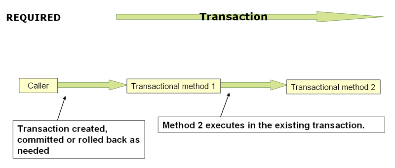
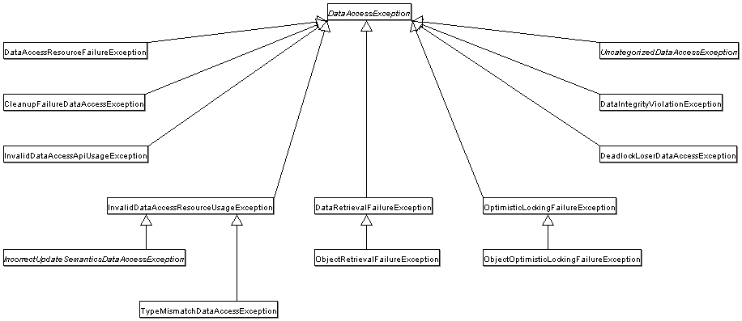
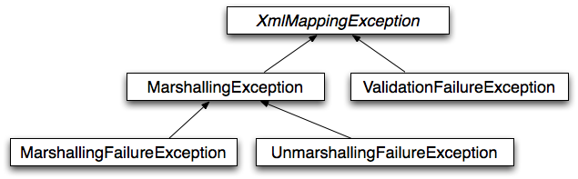

# Data Access

Version 5.3.13

This part of the reference documentation is concerned with data access and the interaction between the data access layer and the business or service layer.

Spring’s comprehensive transaction management support is covered in some detail, followed by thorough coverage of the various data access frameworks and technologies with which the Spring Framework integrates.

参考文档的这一部分涉及数据访问以及数据访问层和业务或服务层之间的交互。

本文将详细介绍 Spring 的全面事务管理支持，然后全面介绍 Spring 框架集成的各种数据访问框架和技术。

## 1. Transaction Management

## 1.事务管理

Comprehensive transaction support is among the most compelling reasons to use the Spring Framework. The Spring Framework provides a consistent abstraction for transaction management that delivers the following benefits:

- A consistent programming model across different transaction APIs, such as Java Transaction API (JTA), JDBC, Hibernate, and the Java Persistence API (JPA).
- Support for [declarative transaction management](https://docs.spring.io/spring-framework/docs/current/reference/html/data-access.html#transaction-declarative).
- A simpler API for [programmatic](https://docs.spring.io/spring-framework/docs/current/reference/html/data-access.html#transaction-programmatic) transaction management than complex transaction APIs, such as JTA.
- Excellent integration with Spring’s data access abstractions.

The following sections describe the Spring Framework’s transaction features and technologies:

- [Advantages of the Spring Framework’s transaction support model](https://docs.spring.io/spring-framework/docs/current/reference/html/data-access.html#transaction-motivation) describes why you would use the Spring Framework’s transaction abstraction instead of EJB Container-Managed Transactions (CMT) or choosing to drive local transactions through a proprietary API, such as Hibernate.
- [Understanding the Spring Framework transaction abstraction](https://docs.spring.io/spring-framework/docs/current/reference/html/data-access.html#transaction-strategies) outlines the core classes and describes how to configure and obtain `DataSource` instances from a variety of sources.
- [Synchronizing resources with transactions](https://docs.spring.io/spring-framework/docs/current/reference/html/data-access.html#tx-resource-synchronization) describes how the application code ensures that resources are created, reused, and cleaned up properly.
- [Declarative transaction management](https://docs.spring.io/spring-framework/docs/current/reference/html/data-access.html#transaction-declarative) describes support for declarative transaction management.
- [Programmatic transaction management](https://docs.spring.io/spring-framework/docs/current/reference/html/data-access.html#transaction-programmatic) covers support for programmatic (that is, explicitly coded) transaction management.
- [Transaction bound event](https://docs.spring.io/spring-framework/docs/current/reference/html/data-access.html#transaction-event) describes how you could use application events within a transaction.

The chapter also includes discussions of best practices, [application server integration](https://docs.spring.io/spring-framework/docs/current/reference/html/data-access.html#transaction-application-server-integration), and [solutions to common problems](https://docs.spring.io/spring-framework/docs/current/reference/html/data-access.html#transaction-solutions-to-common-problems).

全面的事务支持是使用 Spring 框架最引人入胜的原因之一。Spring  框架为事务管理提供了一致的抽象，提供了以下好处：

- 跨不同事务 API（如 Java Transaction API（JTA）、JDBC、Hibernate 和Java Persistence  API（JPA））的一致编程模型。
- 支持[声明性事务管理](https://docs.spring.io/spring-framework/docs/current/reference/html/data-access.html#transaction-declarative)。
- 与复杂的事务 API（如 JTA）相比，[编程事务管理](https://docs.spring.io/spring-framework/docs/current/reference/html/data-access.html#transaction-programmatic) 的 API 更简单。
- 与 Spring 的数据访问抽象完美集成。

以下几节描述了 Spring 框架的事务特性和技术：

- [Spring 框架的事务支持模型的优点](https://docs.spring.io/spring-framework/docs/current/reference/html/data-access.html#transaction-motivation) 描述了为什么要使用 Spring 框架的事务抽象，而不是 EJB 容器管理的事务（CMT, Container-Managed Transactions），或者选择通过专有 API（如 Hibernate）驱动本地事务。
- [理解 Spring 框架事务抽象](https://docs.spring.io/spring-framework/docs/current/reference/html/data-access.html#transaction-strategies) 概述了核心类，并描述了如何从各种源配置和获取 `DataSource` 实例。
- [将资源与事务同步](https://docs.spring.io/spring-framework/docs/current/reference/html/data-access.html#tx-resource-synchronization) 描述应用程序代码如何确保正确创建、重用和清理资源。
- [声明性事务管理](https://docs.spring.io/spring-framework/docs/current/reference/html/data-access.html#transaction-declarative) 描述对声明性事务管理的支持。
- [编程式事务管理](https://docs.spring.io/spring-framework/docs/current/reference/html/data-access.html#transaction-programmatic) 包括对编程（即显式编码）事务管理的支持。
- [事务绑定事件](https://docs.spring.io/spring-framework/docs/current/reference/html/data-access.html#transaction-event) 描述如何在事务中使用应用程序事件。

本章还讨论了最佳实践，[应用服务器集成](https://docs.spring.io/spring-framework/docs/current/reference/html/data-access.html#transaction-application-server-integration) 和[常见问题的解决方案](https://docs.spring.io/spring-framework/docs/current/reference/html/data-access.html#transaction-solutions-to-common-problems)。

### 1.1. Advantages of the Spring Framework’s Transaction Support Model

### 1.1. Spring 框架的事务支持模型的优点

Traditionally, Java EE developers have had two choices for transaction management: global or local transactions, both of which have profound limitations. Global and local transaction management is reviewed in the next two sections, followed by a discussion of how the Spring Framework’s transaction management support addresses the limitations of the global and local transaction models.

传统上，Java EE 开发人员有两种事务管理选择：全局事务或本地事务，这两种事务都有很大的局限性。在接下来的两部分中，将回顾全局和本地事务管理，然后讨论 Spring 框架的事务管理支持如何解决全局和本地事务模型的局限性。

#### 1.1.1. Global Transactions

#### 1.1.1.全局事务

Global transactions let you work with multiple transactional resources, typically relational databases and message queues. The application server manages global transactions through the JTA, which is a cumbersome API (partly due to its exception model). Furthermore, a JTA `UserTransaction` normally needs to be sourced from JNDI, meaning that you also need to use JNDI in order to use JTA. The use of global transactions limits any potential reuse of application code, as JTA is normally only available in an application server environment.

Previously, the preferred way to use global transactions was through EJB CMT (Container Managed Transaction). CMT is a form of declarative transaction management (as distinguished from programmatic transaction management). EJB CMT removes the need for transaction-related JNDI lookups, although the use of EJB itself necessitates the use of JNDI. It removes most but not all of the need to write Java code to control transactions. The significant downside is that CMT is tied to JTA and an application server environment. Also, it is only available if one chooses to implement business logic in EJBs (or at least behind a transactional EJB facade). The negatives of EJB in general are so great that this is not an attractive proposition, especially in the face of compelling alternatives for declarative transaction management.

全局事务允许您处理多个事务资源，通常是关系数据库和消息队列。应用服务器通过 JTA 管理全局事务，JTA 是一个繁琐的 API（部分原因是它的异常模型）。此外，JTA  `UserTransaction` 通常需要来自 JNDI，这意味着您还需要使用 JNDI 才能使用 JTA。全局事务的使用限制了应用程序代码的任何潜在重用，因为 JTA 通常仅在应用程序服务器环境中可用。

以前，使用全局事务的首选方式是通过 EJB CMT（Container Managed Transaction，容器管理事务）。CMT 是声明式事务管理的一种形式（与编程式事务管理不同）。EJB CMT 不再需要与事务相关的 JNDI 查找，尽管使用 EJB 本身就需要使用 JNDI。它消除了编写 Java 代码来控制事务的大部分（但不是全部）需求。显著的**缺点是 CMT 与 JTA 和应用服务器环境相关联**。此外，只有选择在 EJB 中实现业务逻辑（或者至少在事务 EJB 外观后面）时，它才可用。EJB 总体上的缺点是如此之大，以至于这不是一个有吸引力的提议，尤其是在面对声明性事务管理的令人信服的替代方案时。

#### 1.1.2. Local Transactions

#### 1.1.2.本地事务

Local transactions are resource-specific, such as a transaction associated with a JDBC connection. Local transactions may be easier to use but have a significant disadvantage: They cannot work across multiple transactional resources. For example, code that manages transactions by using a JDBC connection cannot run within a global JTA transaction. Because the application server is not involved in transaction management, it cannot help ensure correctness across multiple resources. (It is worth noting that most applications use a single transaction resource.) Another downside is that local transactions are invasive to the programming model.

本地事务是特定于资源的，例如与 JDBC 连接关联的事务。本地事务可能更易于使用，但有一个显著的**缺点：它们无法跨多个事务资源工作**。例如，使用 JDBC 连接管理事务的代码不能在全局 JTA 事务中运行。因为应用服务器不参与事务管理，所以它无法帮助确保跨多个资源的正确性。（值得注意的是，大多数应用程序使用单一事务资源。）另一个缺点是，本地事务会侵入编程模型。

#### 1.1.3. Spring Framework’s Consistent Programming Model

#### 1.1.3. Spring 框架的一致性编程模型

Spring resolves the disadvantages of global and local transactions. It lets application developers use a consistent programming model in any environment. You write your code once, and it can benefit from different transaction management strategies in different environments. The Spring Framework provides both declarative and programmatic transaction management. Most users prefer declarative transaction management, which we recommend in most cases.

With programmatic transaction management, developers work with the Spring Framework transaction abstraction, which can run over any underlying transaction infrastructure. With the preferred declarative model, developers typically write little or no code related to transaction management and, hence, do not depend on the Spring Framework transaction API or any other transaction API.

Spring 解决了全局和本地事务的缺点。它允许应用程序开发人员在任何环境中使用一致的编程模型。您只需编写一次代码，就可以从不同环境中的不同事务管理策略中获益。Spring 框架提供声明式和编程式事务管理。**大多数用户更喜欢声明式事务管理，我们也建议在大多数情况下使用。**

通过编程事务管理，开发人员可以使用 Spring 框架事务抽象，它可以运行在任何底层事务基础设施上。使用首选的声明性模型，开发人员通常很少编写或不编写与事务管理相关的代码，因此不依赖 Spring 框架事务 API 或任何其他事务 API。

> ​                                                      Do you need an application server for transaction management?
>
> ​                                                               您需要一个应用服务器来进行事务管理吗？
>
> The Spring Framework’s transaction management support changes traditional rules as to when an enterprise Java application requires an application server.
>
> In particular, you do not need an application server purely for declarative transactions through EJBs. In fact, even if your application server has powerful JTA capabilities, you may decide that the Spring Framework’s declarative transactions offer more power and a more productive programming model than EJB CMT.
>
> Typically, you need an application server’s JTA capability only if your application needs to handle transactions across multiple resources, which is not a requirement for many applications. Many high-end applications use a single, highly scalable database (such as Oracle RAC) instead. Stand-alone transaction managers (such as [Atomikos Transactions](https://www.atomikos.com/) and [JOTM](http://jotm.objectweb.org/)) are other options. Of course, you may need other application server capabilities, such as Java Message Service (JMS) and Java EE Connector Architecture (JCA).
>
> The Spring Framework gives you the choice of when to scale your application to a fully loaded application server. Gone are the days when the only alternative to using EJB CMT or JTA was to write code with local transactions (such as those on JDBC connections) and face a hefty rework if you need that code to run within global, container-managed transactions. With the Spring Framework, only some of the bean definitions in your configuration file need to change (rather than your code).
>
> Spring 框架的事务管理支持改变了企业 Java 应用程序何时需要应用服务器的传统规则。
>
> 特别是，通过 EJB 进行声明性事务不需要应用服务器。事实上，即使您的应用服务器具有强大的 JTA 功能，您也可能会认为Spring 框架的声明性事务提供了比 EJB CMT 更强大的功能和更高效的编程模型。
>
> 通常，只有当应用程序需要处理跨多个资源的事务时，才需要应用程序服务器的 JTA 功能，这不是许多应用程序的要求。许多高端应用程序使用单一的、高度可扩展的数据库（如 Oracle RAC）。独立事务管理器（例如  [Atomikos Transactions](https://www.atomikos.com/) 和 [JOTM](http://jotm.objectweb.org/)）是其他选项。当然，您可能需要其他应用服务器功能，例如 Java 消息服务（JMS）和 Java EE 连接器体系结构（JCA）。
>
> Spring 框架让您可以选择何时将应用程序扩展到完全加载的应用程序服务器。使用 EJB CMT 或 JTA 的唯一替代方法是使用本地事务（如 JDBC 连接上的事务）编写代码的日子已经一去不复返了，如果您需要在全局容器管理的事务中运行代码，那么代码将面临大量返工。使用 Spring 框架，只有配置文件中的一些 bean 定义需要更改（而不是代码）。

### 1.2. Understanding the Spring Framework Transaction Abstraction

### 1.2. 理解 Spring 框架事务抽象

The key to the Spring transaction abstraction is the notion of a transaction strategy. A transaction strategy is defined by a `TransactionManager`, specifically the `org.springframework.transaction.PlatformTransactionManager` interface for imperative transaction management and the `org.springframework.transaction.ReactiveTransactionManager` interface for reactive transaction management. The following listing shows the definition of the `PlatformTransactionManager` API:

**Spring 事务抽象的关键是事务策略的概念**。事务策略由 `TransactionManager` 定义，特别是用于强制事务管理的  `org.springframework.transaction.PlatformTransactionManager` 接口和用于被动事务管理的 `org.springframework.transaction.ReactiveTransactionManager` 接口。下面的列表显示了 `PlatformTransactionManager` API 的定义：

```java
public interface PlatformTransactionManager extends TransactionManager {

    TransactionStatus getTransaction(TransactionDefinition definition) throws TransactionException;

    void commit(TransactionStatus status) throws TransactionException;

    void rollback(TransactionStatus status) throws TransactionException;
}
```

This is primarily a service provider interface (SPI), although you can use it [programmatically](https://docs.spring.io/spring-framework/docs/current/reference/html/data-access.html#transaction-programmatic-ptm) from your application code. Because `PlatformTransactionManager` is an interface, it can be easily mocked or stubbed as necessary. It is not tied to a lookup strategy, such as JNDI. `PlatformTransactionManager` implementations are defined like any other object (or bean) in the Spring Framework IoC container. This benefit alone makes Spring Framework transactions a worthwhile abstraction, even when you work with JTA. You can test transactional code much more easily than if it used JTA directly.

Again, in keeping with Spring’s philosophy, the `TransactionException` that can be thrown by any of the `PlatformTransactionManager` interface’s methods is unchecked (that is, it extends the `java.lang.RuntimeException` class). Transaction infrastructure failures are almost invariably fatal. In rare cases where application code can actually recover from a transaction failure, the application developer can still choose to catch and handle `TransactionException`. The salient point is that developers are not *forced* to do so.

The `getTransaction(..)` method returns a `TransactionStatus` object, depending on a `TransactionDefinition` parameter. The returned `TransactionStatus` might represent a new transaction or can represent an existing transaction, if a matching transaction exists in the current call stack. The implication in this latter case is that, as with Java EE transaction contexts, a `TransactionStatus` is associated with a thread of execution.

As of Spring Framework 5.2, Spring also provides a transaction management abstraction for reactive applications that make use of reactive types or Kotlin Coroutines. The following listing shows the transaction strategy defined by `org.springframework.transaction.ReactiveTransactionManager`:

这主要是一个服务提供者接口（Service Provider interface，SPI），尽管您可以从应用程序代码中 [以编程方式](https://docs.spring.io/spring-framework/docs/current/reference/html/data-access.html#transaction-programmatic-ptm) 使用它。由于`PlatformTransactionManager` 是一个接口，因此可以根据需要轻松地对其进行模拟（Mock）或存根（Stub）。它与查找策略无关，比如 JNDI。`PlatformTransactionManager`  的实现与 Spring Framework IoC 容器中的任何其他对象（或 bean）一样定义。单凭这一优势就可以让 Spring 框架事务成为一个有价值的抽象，即使在使用 JTA 时也是如此。与直接使用 JTA 相比，测试事务性代码要容易得多。

同样，与 Spring 的理念一致，`PlatformTransactionManager` 接口的任何方法都可以抛出的未受检查（unchecked）的 `TransactionException`（也就是说，它扩展了 `java.lang.RuntimeException` 类）。事务基础设施故障几乎总是致命的。在应用程序代码实际上可以从事务失败中恢复的罕见情况下，应用程序开发人员仍然可以选择捕获并处理 `TransactionException`。突出的一点是，开发人员并不是被迫这么做的。

`getTransaction(..)`  方法返回一个 `TransactionStatus` 对象，具体取决于 `TransactionDefinition` 参数。如果当前调用堆栈中存在匹配的事务，则返回的 `TransactionStatus` 可能代表新事务，也可能代表现有事务。后一种情况的含义是，与Java EE 事务上下文一样，`TransactionStatus` 与执行线程相关联。

从 Spring Framework 5.2 开始，Spring 还为使用被动类型或 Kotlin 协同路由的被动应用程序提供事务管理抽象。下表显示了 `org.springframework.transaction.ReactiveTransactionManager` 定义的事务策略：

```java
public interface ReactiveTransactionManager extends TransactionManager {

    Mono<ReactiveTransaction> getReactiveTransaction(TransactionDefinition definition) throws TransactionException;

    Mono<Void> commit(ReactiveTransaction status) throws TransactionException;

    Mono<Void> rollback(ReactiveTransaction status) throws TransactionException;
}
```

The reactive transaction manager is primarily a service provider interface (SPI), although you can use it [programmatically](https://docs.spring.io/spring-framework/docs/current/reference/html/data-access.html#transaction-programmatic-rtm) from your application code. Because `ReactiveTransactionManager` is an interface, it can be easily mocked or stubbed as necessary.

The `TransactionDefinition` interface specifies:

- Propagation: Typically, all code within a transaction scope runs in that transaction. However, you can specify the behavior if a transactional method is run when a transaction context already exists. For example, code can continue running in the existing transaction (the common case), or the existing transaction can be suspended and a new transaction created. Spring offers all of the transaction propagation options familiar from EJB CMT. To read about the semantics of transaction propagation in Spring, see [Transaction Propagation](https://docs.spring.io/spring-framework/docs/current/reference/html/data-access.html#tx-propagation).
- Isolation: The degree to which this transaction is isolated from the work of other transactions. For example, can this transaction see uncommitted writes from other transactions?
- Timeout: How long this transaction runs before timing out and being automatically rolled back by the underlying transaction infrastructure.
- Read-only status: You can use a read-only transaction when your code reads but does not modify data. Read-only transactions can be a useful optimization in some cases, such as when you use Hibernate.

These settings reflect standard transactional concepts. If necessary, refer to resources that discuss transaction isolation levels and other core transaction concepts. Understanding these concepts is essential to using the Spring Framework or any transaction management solution.

The `TransactionStatus` interface provides a simple way for transactional code to control transaction execution and query transaction status. The concepts should be familiar, as they are common to all transaction APIs. The following listing shows the `TransactionStatus` interface:

声明式事务管理器主要是一个服务提供者接口（SPI，service provider interface），尽管您可以从应用程序代码中[以编程方式](https://docs.spring.io/spring-framework/docs/current/reference/html/data-access.html#transaction-programmatic-rtm) 使用它。因为 `ReactiveTransactionManager` 是一个接口，所以可以根据需要轻松地对其进行模拟（mock）或存根（stub）。

**`TransactionDefinition`  接口指定：**

- 传播：通常，事务范围内的所有代码都在该事务中运行。但是，如果在事务上下文已经存在的情况下运行事务方法，则可以指定行为。例如，代码可以在现有事务中继续运行（常见情况），或者可以暂停现有事务并创建新事务。Spring 提供了 EJB CMT 中熟悉的所有事务传播选项。要了解 Spring 中事务传播的语义，请参阅 [Transaction Propagation](https://docs.spring.io/spring-framework/docs/current/reference/html/data-access.html#tx-propagation)。
- 隔离：此事务与其他事务的工作隔离的程度。例如，此事务能否看到其他事务中未提交的写入？
- 超时：此事务在超时并被底层事务基础结构自动回滚之前运行的时间。
- 只读状态：当代码读取但不修改数据时，可以使用只读事务。在某些情况下，只读事务可能是一种有用的优化，例如在使用 Hibernate 时。

这些设置反映了标准的事务概念。如有必要，请参阅讨论事务隔离级别和其他核心事务概念的参考资料。理解这些概念对于使用 Spring 框架或任何事务管理解决方案至关重要。

**`TransactionStatus` 接口为事务代码提供了控制事务执行和查询事务状态的简单方法**。这些概念应该很熟悉，因为它们对所有事务 API 都是通用的。下面的列表显示了`TransactionStatus`  接口：

```java
public interface TransactionStatus extends TransactionExecution, SavepointManager, Flushable {

    @Override
    boolean isNewTransaction();

    boolean hasSavepoint();

    @Override
    void setRollbackOnly();

    @Override
    boolean isRollbackOnly();

    void flush();

    @Override
    boolean isCompleted();
}
```

Regardless of whether you opt for declarative or programmatic transaction management in Spring, defining the correct `TransactionManager` implementation is absolutely essential. You typically define this implementation through dependency injection.

`TransactionManager` implementations normally require knowledge of the environment in which they work: JDBC, JTA, Hibernate, and so on. The following examples show how you can define a local `PlatformTransactionManager` implementation (in this case, with plain JDBC.)

You can define a JDBC `DataSource` by creating a bean similar to the following:

无论您在 Spring 中选择声明式还是编程式事务管理，定义正确的 `TransactionManager` 实现都是绝对必要的。您通常通过依赖项注入来定义这个实现。

 `TransactionManager` 的实现通常需要了解它们工作的环境：JDBC、JTA、Hibernate 等等。以下示例显示了如何定义本地 `PlatformTransactionManager` 实现（在本例中，使用普通 JDBC）。

您可以通过创建类似于以下内容的 bean 来定义 JDBC `DataSource` ：

```xml
<bean id="dataSource" class="org.apache.commons.dbcp.BasicDataSource" destroy-method="close">
    <property name="driverClassName" value="${jdbc.driverClassName}" />
    <property name="url" value="${jdbc.url}" />
    <property name="username" value="${jdbc.username}" />
    <property name="password" value="${jdbc.password}" />
</bean>
```

The related `PlatformTransactionManager` bean definition then has a reference to the `DataSource` definition. It should resemble the following example:

然后，相关的 `PlatformTransactionManager` bean 定义引用了 `DataSource` 定义。它应该类似于以下示例：

```xml
<bean id="txManager" class="org.springframework.jdbc.datasource.DataSourceTransactionManager">
    <property name="dataSource" ref="dataSource"/>
</bean>
```

If you use JTA in a Java EE container, then you use a container `DataSource`, obtained through JNDI, in conjunction with Spring’s `JtaTransactionManager`. The following example shows what the JTA and JNDI lookup version would look like:

如果您在 JavaEE 容器中使用 JTA，那么您将使用通过 JNDI 获得的容器 `DataSource`，以及 Spring 的 `JtaTransactionManager`。以下示例显示了 JTA 和 JNDI 查找版本的样式：

```xml
<?xml version="1.0" encoding="UTF-8"?>
<beans xmlns="http://www.springframework.org/schema/beans"
    xmlns:xsi="http://www.w3.org/2001/XMLSchema-instance"
    xmlns:jee="http://www.springframework.org/schema/jee"
    xsi:schemaLocation="
        http://www.springframework.org/schema/beans
        https://www.springframework.org/schema/beans/spring-beans.xsd
        http://www.springframework.org/schema/jee
        https://www.springframework.org/schema/jee/spring-jee.xsd">

    <jee:jndi-lookup id="dataSource" jndi-name="jdbc/jpetstore"/>

    <bean id="txManager" class="org.springframework.transaction.jta.JtaTransactionManager" />

    <!-- other <bean/> definitions here -->

</beans>
```

The `JtaTransactionManager` does not need to know about the `DataSource` (or any other specific resources) because it uses the container’s global transaction management infrastructure.

`JtaTransactionManager` 不需要知道 `DataSource`（或任何其他特定资源），因为它使用容器的全局事务管理基础设施。

> The preceding definition of the `dataSource` bean uses the `<jndi-lookup/>` tag from the `jee` namespace. For more information see [The JEE Schema](https://docs.spring.io/spring-framework/docs/current/reference/html/integration.html#xsd-schemas-jee).
>
> 前面的 `dataSource` bean 定义使用了来自 `jee` 命名空间的 `<jndi-lookup/>` 标记。有关更多信息，请参见 [The JEE Schema](https://docs.spring.io/spring-framework/docs/current/reference/html/integration.html#xsd-schemas-jee)。

> If you use JTA, your transaction manager definition should look the same, regardless of what data access technology you use, be it JDBC, Hibernate JPA, or any other supported technology. This is due to the fact that JTA transactions are global transactions, which can enlist any transactional resource.
>
> 如果您使用 JTA，那么无论您使用的是什么数据访问技术，无论是 JDBC、Hibernate JPA 还是任何其他受支持的技术，事务管理器的定义都应该是相同的。这是因为 JTA 事务是全局事务，可以使用任何事务资源。

In all Spring transaction setups, application code does not need to change. You can change how transactions are managed merely by changing configuration, even if that change means moving from local to global transactions or vice versa.

在所有 Spring 事务设置中，应用程序代码都不需要更改。您可以仅通过更改配置来更改事务的管理方式，即使这种更改意味着从本地事务转移到全局事务，反之亦然。

#### 1.2.1. Hibernate Transaction Setup

#### 1.2.1. Hibernate 事务设置

You can also easily use Hibernate local transactions, as shown in the following examples. In this case, you need to define a Hibernate `LocalSessionFactoryBean`, which your application code can use to obtain Hibernate `Session` instances.

The `DataSource` bean definition is similar to the local JDBC example shown previously and, thus, is not shown in the following example.

您还可以轻松地使用 Hibernate 本地事务，如下例所示。在本例中，您需要定义一个 Hibernate `LocalSessionFactoryBean`，您的应用程序代码可以使用它来获取 Hibernate `Session` 实例。

`DataSource` bean 定义类似于前面显示的本地 JDBC 示例，因此在下面的示例中没有显示。

> If the `DataSource` (used by any non-JTA transaction manager) is looked up through JNDI and managed by a Java EE container, it should be non-transactional, because the Spring Framework (rather than the Java EE container) manages the transactions.
>
> 如果通过 JNDI 查找 `DataSource`（由任何非 JTA 事务管理器使用），并由 JavaEE 容器管理，那么它应该是非事务性的，因为 Spring 框架（而不是 JavaEE 容器）管理事务。

The `txManager` bean in this case is of the `HibernateTransactionManager` type. In the same way as the `DataSourceTransactionManager` needs a reference to the `DataSource`, the `HibernateTransactionManager` needs a reference to the `SessionFactory`. The following example declares `sessionFactory` and `txManager` beans:

本例中的 `txManager` bean 属于 `HibernateTransactionManager` 类型。与 `DataSourceTransactionManager` 需要引用 `DataSource` 一样，`HibernateTransactionManager` 也需要引用 `SessionFactory`。以下示例声明了 `sessionFactory` 和 `txManager` bean：

```xml
<bean id="sessionFactory" class="org.springframework.orm.hibernate5.LocalSessionFactoryBean">
    <property name="dataSource" ref="dataSource"/>
    <property name="mappingResources">
        <list>
            <value>org/springframework/samples/petclinic/hibernate/petclinic.hbm.xml</value>
        </list>
    </property>
    <property name="hibernateProperties">
        <value>
            hibernate.dialect=${hibernate.dialect}
        </value>
    </property>
</bean>

<bean id="txManager" class="org.springframework.orm.hibernate5.HibernateTransactionManager">
    <property name="sessionFactory" ref="sessionFactory"/>
</bean>
```

If you use Hibernate and Java EE container-managed JTA transactions, you should use the same `JtaTransactionManager` as in the previous JTA example for JDBC, as the following example shows. Also, it is recommended to make Hibernate aware of JTA through its transaction coordinator and possibly also its connection release mode configuration:

如果您使用 Hibernate 和 Java EE 容器管理的 JTA 事务，那么应该使用与前一个 JDBC JTA 示例相同的 `JtaTransactionManager`，如下例所示。此外，建议 Hibernate 通过其事务协调器以及可能的连接释放模式配置了解 JTA：

```xml
<bean id="sessionFactory" class="org.springframework.orm.hibernate5.LocalSessionFactoryBean">
    <property name="dataSource" ref="dataSource"/>
    <property name="mappingResources">
        <list>
            <value>org/springframework/samples/petclinic/hibernate/petclinic.hbm.xml</value>
        </list>
    </property>
    <property name="hibernateProperties">
        <value>
            hibernate.dialect=${hibernate.dialect}
            hibernate.transaction.coordinator_class=jta
            hibernate.connection.handling_mode=DELAYED_ACQUISITION_AND_RELEASE_AFTER_STATEMENT
        </value>
    </property>
</bean>

<bean id="txManager" class="org.springframework.transaction.jta.JtaTransactionManager"/>
```

Or alternatively, you may pass the `JtaTransactionManager` into your `LocalSessionFactoryBean` for enforcing the same defaults:

或者，您也可以将 `JtaTransactionManager` 传递到 `LocalSessionFactoryBean` 中，以强制执行相同的默认值：

```xml
<bean id="sessionFactory" class="org.springframework.orm.hibernate5.LocalSessionFactoryBean">
    <property name="dataSource" ref="dataSource"/>
    <property name="mappingResources">
        <list>
            <value>org/springframework/samples/petclinic/hibernate/petclinic.hbm.xml</value>
        </list>
    </property>
    <property name="hibernateProperties">
        <value>
            hibernate.dialect=${hibernate.dialect}
        </value>
    </property>
    <property name="jtaTransactionManager" ref="txManager"/>
</bean>

<bean id="txManager" class="org.springframework.transaction.jta.JtaTransactionManager"/>
```

### 1.3. Synchronizing Resources with Transactions

How to create different transaction managers and how they are linked to related resources that need to be synchronized to transactions (for example `DataSourceTransactionManager` to a JDBC `DataSource`, `HibernateTransactionManager` to a Hibernate `SessionFactory`, and so forth) should now be clear. This section describes how the application code (directly or indirectly, by using a persistence API such as JDBC, Hibernate, or JPA) ensures that these resources are created, reused, and cleaned up properly. The section also discusses how transaction synchronization is (optionally) triggered through the relevant `TransactionManager`.

**现在应该清楚地知道如何创建不同的事务管理器，以及它们如何链接到需要与事务同步的相关资源**（例如，`DataSourceTransactionManager` 到 JDBC `DataSource`，以及 `HibernateTransactionManager` 到 Hibernate  `SessionFactory`，等等）。本节描述应用程序代码（通过使用持久性 API（如 JDBC、Hibernate 或 JPA）直接或间接地）如何确保这些资源的创建、重用和正确清理。本节还讨论了如何（可选地）通过相关的 `TransactionManager` 触发事务同步。

#### 1.3.1. High-level Synchronization Approach

#### 1.3.1 高级同步方法

The preferred approach is to use Spring’s highest-level template-based persistence integration APIs or to use native ORM APIs with transaction-aware factory beans or proxies for managing the native resource factories. These transaction-aware solutions internally handle resource creation and reuse, cleanup, optional transaction synchronization of the resources, and exception mapping. Thus, user data access code does not have to address these tasks but can focus purely on non-boilerplate persistence logic. Generally, you use the native ORM API or take a template approach for JDBC access by using the `JdbcTemplate`. These solutions are detailed in subsequent sections of this reference documentation.

首选的方法是使用 Spring 最高级别的基于模板的持久性集成 API，或者使用带有事务感知工厂 bean 或代理的本机 ORM API 来管理本机资源工厂。这些事务感知解决方案在内部处理资源创建和重用、清理、可选的资源事务同步以及异常映射。因此，用户数据访问代码不必处理这些任务，而可以纯粹关注非样板文件的持久性逻辑。通常，您使用本机 ORM API，或者通过使用 `JdbcTemplate` 采用模板方法来访问 JDBC。这些解决方案将在本参考文档的后续章节中详细介绍。

#### 1.3.2. Low-level Synchronization Approach

#### 1.3.2. 低级同步方法

Classes such as `DataSourceUtils` (for JDBC), `EntityManagerFactoryUtils` (for JPA), `SessionFactoryUtils` (for Hibernate), and so on exist at a lower level. When you want the application code to deal directly with the resource types of the native persistence APIs, you use these classes to ensure that proper Spring Framework-managed instances are obtained, transactions are (optionally) synchronized, and exceptions that occur in the process are properly mapped to a consistent API.

For example, in the case of JDBC, instead of the traditional JDBC approach of calling the `getConnection()` method on the `DataSource`, you can instead use Spring’s `org.springframework.jdbc.datasource.DataSourceUtils` class, as follows:

诸如 `DataSourceUtils`（用于 JDBC）、`EntityManagerFactoryUtils`（用于 JPA）、`SessionFactoryUtils`（用于 Hibernate）等类存在于较低级别。当您希望应用程序代码直接处理本机持久性 API 的资源类型时，可以使用这些类来确保获得正确的 Spring Framework 托管实例，同步事务（可选），并将过程中发生的异常正确映射到一致的 API。

例如，在 JDBC 的情况下，可以使用 Spring 的 `org.springframework.jdbc.datasource.DataSourceUtils` 类，而不是传统的 JDBC 方法调用`DataSource` 上的 `getConnection()` 方法，如下所示：

```java
Connection conn = DataSourceUtils.getConnection(dataSource);
```

If an existing transaction already has a connection synchronized (linked) to it, that instance is returned. Otherwise, the method call triggers the creation of a new connection, which is (optionally) synchronized to any existing transaction and made available for subsequent reuse in that same transaction. As mentioned earlier, any `SQLException` is wrapped in a Spring Framework `CannotGetJdbcConnectionException`, one of the Spring Framework’s hierarchy of unchecked `DataAccessException` types. This approach gives you more information than can be obtained easily from the `SQLException` and ensures portability across databases and even across different persistence technologies.

This approach also works without Spring transaction management (transaction synchronization is optional), so you can use it whether or not you use Spring for transaction management.

Of course, once you have used Spring’s JDBC support, JPA support, or Hibernate support, you generally prefer not to use `DataSourceUtils` or the other helper classes, because you are much happier working through the Spring abstraction than directly with the relevant APIs. For example, if you use the Spring `JdbcTemplate` or `jdbc.object` package to simplify your use of JDBC, correct connection retrieval occurs behind the scenes and you need not write any special code.

如果现有事务已经有一个与之同步（链接）的连接，则返回该实例。否则，该方法调用将触发新连接的创建，该连接（可选）与任何现有事务同步，并可用于该事务中的后续重用。如前所述，任何 `SQLException` 都封装在 Spring 框架 `CannotGetJdbcConnectionException` 中，这是Spring 框架中未经检查的 `DataAccessException` 类型的层次结构之一。这种方法为您提供了比 `SQLException` 更容易获得的信息，并确保了跨数据库甚至跨不同持久性技术的可移植性。

这种方法也可以在没有 Spring 事务管理的情况下工作（事务同步是可选的），因此无论是否使用 Spring 进行事务管理，都可以使用它。

当然，一旦您使用了 Spring 的 JDBC 支持、JPA 支持或 Hibernate 支持，您通常不喜欢使用 `DataSourceUtils` 或其他助手类，因为与直接使用相关API 相比，您更喜欢使用 Spring 抽象。例如，如果您使用 Spring `JdbcTemplate` 或 `jdbc.object` 包来简化 jdbc 的使用，正确的连接检索会在后台进行，您无需编写任何特殊代码。

#### 1.3.3. `TransactionAwareDataSourceProxy`

At the very lowest level exists the `TransactionAwareDataSourceProxy` class. This is a proxy for a target `DataSource`, which wraps the target `DataSource` to add awareness of Spring-managed transactions. In this respect, it is similar to a transactional JNDI `DataSource`, as provided by a Java EE server.

You should almost never need or want to use this class, except when existing code must be called and passed a standard JDBC `DataSource` interface implementation. In that case, it is possible that this code is usable but is participating in Spring-managed transactions. You can write your new code by using the higher-level abstractions mentioned earlier.

在最底层存在  `TransactionAwareDataSourceProxy` 类。这是目标 `DataSource` 的代理，它包装了目标 `DataSource`，以增加对 Spring 管理的事务的感知。在这方面，它类似于 Java EE 服务器提供的事务性 JNDI `DataSource`。

除了必须调用并传递标准JDBC`DataSource`接口实现的现有代码外，您几乎不需要或不想使用此类。在这种情况下，这段代码可能是可用的，但正在参与Spring管理的事务。您可以使用前面提到的高级抽象来编写新代码。

### 1.4. Declarative Transaction Management

### 1.4.声明式事务管理

> Most Spring Framework users choose declarative transaction management. This option has the least impact on application code and, hence, is most consistent with the ideals of a non-invasive lightweight container.
>
> 大多数 Spring 框架用户选择声明式事务管理。此选项对应用程序代码的影响最小，因此最符合非侵入性轻量级容器的理想。

The Spring Framework’s declarative transaction management is made possible with Spring aspect-oriented programming (AOP). However, as the transactional aspects code comes with the Spring Framework distribution and may be used in a boilerplate fashion, AOP concepts do not generally have to be understood to make effective use of this code.

The Spring Framework’s declarative transaction management is similar to EJB CMT, in that you can specify transaction behavior (or lack of it) down to the individual method level. You can make a `setRollbackOnly()` call within a transaction context, if necessary. The differences between the two types of transaction management are:

- Unlike EJB CMT, which is tied to JTA, the Spring Framework’s declarative transaction management works in any environment. It can work with JTA transactions or local transactions by using JDBC, JPA, or Hibernate by adjusting the configuration files.
- You can apply the Spring Framework declarative transaction management to any class, not merely special classes such as EJBs.
- The Spring Framework offers declarative [rollback rules](https://docs.spring.io/spring-framework/docs/current/reference/html/data-access.html#transaction-declarative-rolling-back), a feature with no EJB equivalent. Both programmatic and declarative support for rollback rules is provided.
- The Spring Framework lets you customize transactional behavior by using AOP. For example, you can insert custom behavior in the case of transaction rollback. You can also add arbitrary advice, along with transactional advice. With EJB CMT, you cannot influence the container’s transaction management, except with `setRollbackOnly()`.
- The Spring Framework does not support propagation of transaction contexts across remote calls, as high-end application servers do. If you need this feature, we recommend that you use EJB. However, consider carefully before using such a feature, because, normally, one does not want transactions to span remote calls.

The concept of rollback rules is important. They let you specify which exceptions (and throwables) should cause automatic rollback. You can specify this declaratively, in configuration, not in Java code. So, although you can still call `setRollbackOnly()` on the `TransactionStatus` object to roll back the current transaction back, most often you can specify a rule that `MyApplicationException` must always result in rollback. The significant advantage to this option is that business objects do not depend on the transaction infrastructure. For example, they typically do not need to import Spring transaction APIs or other Spring APIs.

Although EJB container default behavior automatically rolls back the transaction on a system exception (usually a runtime exception), EJB CMT does not roll back the transaction automatically on an application exception (that is, a checked exception other than `java.rmi.RemoteException`). While the Spring default behavior for declarative transaction management follows EJB convention (roll back is automatic only on unchecked exceptions), it is often useful to customize this behavior.

Spring 框架的声明式事务管理是通过 Spring 面向方面编程（AOP）实现的。然而，由于事务方面代码是 Spring 框架发行版附带的，并且可能以样板形式使用，所以通常不必理解 AOP 概念，就可以有效地使用该代码。

Spring 框架的声明性事务管理类似于 EJB CMT，因为您可以**将事务行为（或缺少事务行为）指定到单个方法级别**。如有必要，可以在事务上下文中进行 `setRollbackOnly()` 调用。这两种事务管理之间的区别是：

- 与绑定到 JTA 的 EJB CMT 不同，**Spring 框架的声明式事务管理可以在任何环境中工作**。它可以通过使用 JDBC、JPA 处理 JTA 事务或本地事务，或者通过调整配置文件来使用 Hibernate。
- 您可以将 Spring 框架声明式事务管理应用于任何类，而不仅仅是像 EJB 这样的特殊类。
- Spring 框架提供声明性[回滚规则](https://docs.spring.io/spring-framework/docs/current/reference/html/data-access.html#transaction-declarative-rolling-back)，这是一个没有 EJB 等价物的特性。提供了对回滚规则的编程和声明支持。
- **Spring 框架允许您使用 AOP 定制事务行为。例如，在事务回滚的情况下，可以插入自定义行为。您还可以添加任意通知以及事务性通知**。但是如果使用 EJB CMT，除了通过 `setRollbackOnly()` 之外，您无法影响容器的事务管理。
- **Spring 框架不支持事务上下文跨远程调用的传播**，就像高端应用服务器那样。如果您需要此功能，我们建议您使用 EJB。但是，在使用这样的特性之前要仔细考虑，因为通常情况下，不希望事务跨越远程调用。

回滚规则的概念很重要。它们允许您指定哪些异常（和 throwables）应该导致自动回滚。您可以在配置中，而不是在 Java 代码中，以声明的方式指定这一点。因此，尽管您仍然可以在 `TransactionStatus` 对象上调用 `setRollbackOnly()`，以回滚当前事务，但大多数情况下，您可以指定 `MyApplicationException` 必须始终导致回滚的规则。此选项的显著优点是业务对象不依赖于事务基础架构。例如，他们通常不需要导入 Spring 事务 API 或其他 Spring  API。

尽管 EJB 容器默认行为会在系统异常（通常是运行时异常）时自动回滚事务，但 EJB CMT不 会在应用程序异常（即除 `java.rmi.RemoteException` 之外的已检查异常）时自动回滚事务。虽然声明性事务管理的 Spring 默认行为遵循 EJB 约定（只有在未检查的异常情况下才会自动回滚），但定制这种行为通常很有用。

#### 1.4.1. Understanding the Spring Framework’s Declarative Transaction Implementation

#### 1.4.1. 理解 Spring 框架的声明式事务实现

It is not sufficient merely to tell you to annotate your classes with the `@Transactional` annotation, add `@EnableTransactionManagement` to your configuration, and expect you to understand how it all works. To provide a deeper understanding, this section explains the inner workings of the Spring Framework’s declarative transaction infrastructure in the context of transaction-related issues.

The most important concepts to grasp with regard to the Spring Framework’s declarative transaction support are that this support is enabled [via AOP proxies](https://docs.spring.io/spring-framework/docs/current/reference/html/core.html#aop-understanding-aop-proxies) and that the transactional advice is driven by metadata (currently XML- or annotation-based). The combination of AOP with transactional metadata yields an AOP proxy that uses a `TransactionInterceptor` in conjunction with an appropriate `TransactionManager` implementation to drive transactions around method invocations.

仅仅告诉您使用 `@Transactional` 注解对类进行注解，将 `@EnableTransactionManagement` 添加到您的配置中，并期望您了解它是如何工作的，这是不够的。为了提供更深入的理解，本节将在事务相关问题的上下文中解释 Spring 框架的声明性事务基础结构的内部工作原理。

关于 Spring 框架的声明式事务支持，需要掌握的最重要的概念是 [通过 AOP 代理](https://docs.spring.io/spring-framework/docs/current/reference/html/core.html#aop-understanding-aop-proxies) 启用这种支持，并且事务通知由元数据（目前基于 XML 或注解）驱动。AOP 与事务元数据的结合产生了一个 AOP 代理，该代理使用`TransactionInterceptor` 和适当的 `TransactionManager` 实现来环绕方法调用驱动事务。

> Spring AOP is covered in [the AOP section](https://docs.spring.io/spring-framework/docs/current/reference/html/core.html#aop).

Spring Framework’s `TransactionInterceptor` provides transaction management for imperative and reactive programming models. The interceptor detects the desired flavor of transaction management by inspecting the method return type. Methods returning a reactive type such as `Publisher` or Kotlin `Flow` (or a subtype of those) qualify for reactive transaction management. All other return types including `void` use the code path for imperative transaction management.

Transaction management flavors impact which transaction manager is required. Imperative transactions require a `PlatformTransactionManager`, while reactive transactions use `ReactiveTransactionManager` implementations.

Spring 框架的 `TransactionInterceptor` 为命令式和反应式编程模型提供事务管理。拦截器通过检查方法返回类型来检测所需的事务管理风格。返回 `Publisher` 或 Kotlin `Flow` 等被动类型（或其子类型）的方法符合被动事务管理的条件。包括 `void` 在内的所有其他返回类型都使用代码路径进行强制事务管理。

事务管理影响需要哪个事务管理器。命令式事务需要 `PlatformTransactionManager`，而反应式事务使用 `ReactiveTransactionManager` 实现。

> `@Transactional` commonly works with thread-bound transactions managed by `PlatformTransactionManager`, exposing a transaction to all data access operations within the current execution thread. Note: This does *not* propagate to newly started threads within the method.A reactive transaction managed by `ReactiveTransactionManager` uses the Reactor context instead of thread-local attributes. As a consequence, all participating data access operations need to execute within the same Reactor context in the same reactive pipeline.
>
> `@Transactional` 通常用于由 `PlatformTransactionManager` 管理的线程绑定事务，将事务公开给当前执行线程内的所有数据访问操作。注意：这不会传播到方法中新启动的线程。由 `ReactiveTransactionManager` 管理的反应式事务使用反应器上下文而不是线程本地属性。因此，所有参与的数据访问操作都需要在同一反应管道中的同一反应器上下文中执行。

The following image shows a conceptual view of calling a method on a transactional proxy:

下图显示了在事务代理上调用方法的概念视图：


#### 1.4.2. Example of Declarative Transaction Implementation

#### 1.4.2.声明式事务实现示例

Consider the following interface and its attendant implementation. This example uses `Foo` and `Bar` classes as placeholders so that you can concentrate on the transaction usage without focusing on a particular domain model. For the purposes of this example, the fact that the `DefaultFooService` class throws `UnsupportedOperationException` instances in the body of each implemented method is good. That behavior lets you see transactions being created and then rolled back in response to the `UnsupportedOperationException` instance. The following listing shows the `FooService` interface:

考虑下面的接口及其随之而来的实现。本例使用 `Foo` 和 `Bar` 类作为占位符，这样您就可以专注于事务的使用，而不必关注特定的域模型。在本例中，`DefaultFooService` 类在每个实现的方法体中抛出 `UnsupportedOperationException` 实例这一事实是好的。该行为允许您查看正在创建的事务，然后回滚以响应 `UnsupportedOperationException` 实例。下面的列表显示了 `FooService` 接口：

```java
// the service interface that we want to make transactional

package x.y.service;

public interface FooService {

    Foo getFoo(String fooName);

    Foo getFoo(String fooName, String barName);

    void insertFoo(Foo foo);

    void updateFoo(Foo foo);

}
```

The following example shows an implementation of the preceding interface:

以下示例显示了前面接口的实现：

```java
package x.y.service;

public class DefaultFooService implements FooService {

    @Override
    public Foo getFoo(String fooName) {
        // ...
    }

    @Override
    public Foo getFoo(String fooName, String barName) {
        // ...
    }

    @Override
    public void insertFoo(Foo foo) {
        // ...
    }

    @Override
    public void updateFoo(Foo foo) {
        // ...
    }
}
```

Assume that the first two methods of the `FooService` interface, `getFoo(String)` and `getFoo(String, String)`, must run in the context of a transaction with read-only semantics and that the other methods, `insertFoo(Foo)` and `updateFoo(Foo)`, must run in the context of a transaction with read-write semantics. The following configuration is explained in detail in the next few paragraphs:

假设 `FooService` 接口的前两个方法 `getFoo(String)` 和 `getFoo(String,String)` 必须在具有只读语义的事务上下文中运行，而其他方法 `insertFoo(Foo)` 和 `updateFoo(Foo)` 必须在具有读写语义的事务上下文中运行。下面几段将详细解释以下配置：

```xml
<!-- from the file 'context.xml' -->
<?xml version="1.0" encoding="UTF-8"?>
<beans xmlns="http://www.springframework.org/schema/beans"
    xmlns:xsi="http://www.w3.org/2001/XMLSchema-instance"
    xmlns:aop="http://www.springframework.org/schema/aop"
    xmlns:tx="http://www.springframework.org/schema/tx"
    xsi:schemaLocation="
        http://www.springframework.org/schema/beans
        https://www.springframework.org/schema/beans/spring-beans.xsd
        http://www.springframework.org/schema/tx
        https://www.springframework.org/schema/tx/spring-tx.xsd
        http://www.springframework.org/schema/aop
        https://www.springframework.org/schema/aop/spring-aop.xsd">

    <!-- this is the service object that we want to make transactional -->
    <bean id="fooService" class="x.y.service.DefaultFooService"/>

    <!-- the transactional advice (what 'happens'; see the <aop:advisor/> bean below) -->
    <tx:advice id="txAdvice" transaction-manager="txManager">
        <!-- the transactional semantics... -->
        <tx:attributes>
            <!-- all methods starting with 'get' are read-only -->
            <tx:method name="get*" read-only="true"/>
            <!-- other methods use the default transaction settings (see below) -->
            <tx:method name="*"/>
        </tx:attributes>
    </tx:advice>

    <!-- ensure that the above transactional advice runs for any execution
        of an operation defined by the FooService interface -->
    <aop:config>
        <aop:pointcut id="fooServiceOperation" expression="execution(* x.y.service.FooService.*(..))"/>
        <aop:advisor advice-ref="txAdvice" pointcut-ref="fooServiceOperation"/>
    </aop:config>

    <!-- don't forget the DataSource -->
    <bean id="dataSource" class="org.apache.commons.dbcp.BasicDataSource" destroy-method="close">
        <property name="driverClassName" value="oracle.jdbc.driver.OracleDriver"/>
        <property name="url" value="jdbc:oracle:thin:@rj-t42:1521:elvis"/>
        <property name="username" value="scott"/>
        <property name="password" value="tiger"/>
    </bean>

    <!-- similarly, don't forget the TransactionManager -->
    <bean id="txManager" class="org.springframework.jdbc.datasource.DataSourceTransactionManager">
        <property name="dataSource" ref="dataSource"/>
    </bean>

    <!-- other <bean/> definitions here -->

</beans>
```

Examine the preceding configuration. It assumes that you want to make a service object, the `fooService` bean, transactional. The transaction semantics to apply are encapsulated in the `<tx:advice/>` definition. The `<tx:advice/>` definition reads as "all methods starting with `get` are to run in the context of a read-only transaction, and all other methods are to run with the default transaction semantics". The `transaction-manager` attribute of the `<tx:advice/>` tag is set to the name of the `TransactionManager` bean that is going to drive the transactions (in this case, the `txManager` bean).

检查前面的配置。它假设您希望使服务对象 `fooService` bean 具有事务性。要应用的事务语义封装在 `<tx:advice/>` 定义中。`<tx:advice/>` 的定义是「所有以 `get` 开头的方法都将在只读事务的上下文中运行，所有其他方法都将使用默认事务语义运行」。`<tx:advice/>` 标记的 `transaction-manager` 属性被设置为将驱动事务的 `TransactionManager` bean的名称（在本例中是 `txManager` bean）。

> You can omit the `transaction-manager` attribute in the transactional advice (`<tx:advice/>`) if the bean name of the `TransactionManager` that you want to wire in has the name `transactionManager`. If the `TransactionManager` bean that you want to wire in has any other name, you must use the `transaction-manager` attribute explicitly, as in the preceding example.
>
> 如果要连接的 `TransactionManager`  的 bean 名称为 `transactionManager`，则可以在事务性通知（`<tx:advice/>`）中省略 `transaction-manager` 属性。如果要连接的`TransactionManager` bean 有任何其他名称，则必须显式使用 `transaction-manager` 属性，如前一示例所示。

The `<aop:config/>` definition ensures that the transactional advice defined by the `txAdvice` bean runs at the appropriate points in the program. First, you define a pointcut that matches the execution of any operation defined in the `FooService` interface (`fooServiceOperation`). Then you associate the pointcut with the `txAdvice` by using an advisor. The result indicates that, at the execution of a `fooServiceOperation`, the advice defined by `txAdvice` is run.

The expression defined within the `<aop:pointcut/>` element is an AspectJ pointcut expression. See [the AOP section](https://docs.spring.io/spring-framework/docs/current/reference/html/core.html#aop) for more details on pointcut expressions in Spring.

A common requirement is to make an entire service layer transactional. The best way to do this is to change the pointcut expression to match any operation in your service layer. The following example shows how to do so:

`<aop:config/>` 定义确保由 `txAdvice` bean 定义的事务性通知在程序中的适当点运行。首先，定义一个切入点，该切入点与 `FooService` 接口（`fooServiceOperation`）中定义的任何操作的执行相匹配。然后使用 advisor 将切入点与 `txAdvice` 关联起来。结果表明，在执行`fooServiceOperation` 时，运行由 `txAdvice` 定义的通知。

`<aop:pointcut/>` 元素中定义的表达式是 AspectJ 切入点表达式。参见 [AOP 部分](https://docs.spring.io/spring-framework/docs/current/reference/html/core.html#aop) 有关 Spring 中切入点表达式的更多详细信息。

一个常见的需求是使整个服务层具有事务性。最好的方法是更改切入点表达式以匹配服务层中的任何操作。以下示例显示了如何执行此操作：

```xml
<aop:config>
    <aop:pointcut id="fooServiceMethods" expression="execution(* x.y.service.*.*(..))"/>
    <aop:advisor advice-ref="txAdvice" pointcut-ref="fooServiceMethods"/>
</aop:config>
```

> In the preceding example, it is assumed that all your service interfaces are defined in the `x.y.service` package. See [the AOP section](https://docs.spring.io/spring-framework/docs/current/reference/html/core.html#aop) for more details.
>
> 在前面的示例中，假设您的所有服务接口都是在 `x.y.service` 包中定义的。参见[AOP部分](https://docs.spring.io/spring-framework/docs/current/reference/html/core.html#aop)更多细节。

Now that we have analyzed the configuration, you may be asking yourself, "What does all this configuration actually do?"

The configuration shown earlier is used to create a transactional proxy around the object that is created from the `fooService` bean definition. The proxy is configured with the transactional advice so that, when an appropriate method is invoked on the proxy, a transaction is started, suspended, marked as read-only, and so on, depending on the transaction configuration associated with that method. Consider the following program that test drives the configuration shown earlier:

现在，我们已经分析了配置，您可能会问自己，「所有这些配置实际上是做什么的？」

前面显示的配置用于围绕从 `fooService` bean 定义创建的对象创建事务代理。代理配置了事务性通知，以便在代理上调用适当的方法时，根据与该方法关联的事务配置，启动、暂停、标记为只读等事务。考虑下面的程序，测试驱动前面显示的配置：

```java
public final class Boot {

    public static void main(final String[] args) throws Exception {
        ApplicationContext ctx = new ClassPathXmlApplicationContext("context.xml");
        FooService fooService = ctx.getBean(FooService.class);
        fooService.insertFoo(new Foo());
    }
}
```

The output from running the preceding program should resemble the following (the Log4J output and the stack trace from the `UnsupportedOperationException` thrown by the `insertFoo(..)` method of the `DefaultFooService` class have been truncated for clarity):

运行前面程序的输出应该类似于以下内容（Log4J 输出和由 `insertFoo(..)` 引发的 `UnsupportedOperationException` 的堆栈跟踪）为清晰起见，`DefaultFooService` 类的方法已被截断）：

```xml
<!-- the Spring container is starting up... -->
[AspectJInvocationContextExposingAdvisorAutoProxyCreator] - Creating implicit proxy for bean 'fooService' with 0 common interceptors and 1 specific interceptors

<!-- the DefaultFooService is actually proxied -->
[JdkDynamicAopProxy] - Creating JDK dynamic proxy for [x.y.service.DefaultFooService]

<!-- ... the insertFoo(..) method is now being invoked on the proxy -->
[TransactionInterceptor] - Getting transaction for x.y.service.FooService.insertFoo

<!-- the transactional advice kicks in here... -->
[DataSourceTransactionManager] - Creating new transaction with name [x.y.service.FooService.insertFoo]
[DataSourceTransactionManager] - Acquired Connection [org.apache.commons.dbcp.PoolableConnection@a53de4] for JDBC transaction

<!-- the insertFoo(..) method from DefaultFooService throws an exception... -->
[RuleBasedTransactionAttribute] - Applying rules to determine whether transaction should rollback on java.lang.UnsupportedOperationException
[TransactionInterceptor] - Invoking rollback for transaction on x.y.service.FooService.insertFoo due to throwable [java.lang.UnsupportedOperationException]

<!-- and the transaction is rolled back (by default, RuntimeException instances cause rollback) -->
[DataSourceTransactionManager] - Rolling back JDBC transaction on Connection [org.apache.commons.dbcp.PoolableConnection@a53de4]
[DataSourceTransactionManager] - Releasing JDBC Connection after transaction
[DataSourceUtils] - Returning JDBC Connection to DataSource

Exception in thread "main" java.lang.UnsupportedOperationException at x.y.service.DefaultFooService.insertFoo(DefaultFooService.java:14)
<!-- AOP infrastructure stack trace elements removed for clarity -->
at $Proxy0.insertFoo(Unknown Source)
at Boot.main(Boot.java:11)
```

To use reactive transaction management the code has to use reactive types.

要使用被动事务管理，代码必须使用被动类型。

> Spring Framework uses the `ReactiveAdapterRegistry` to determine whether a method return type is reactive.
>
> Spring 框架使用 `ReactiveAdapterRegistry` 来确定方法返回类型是否为 reactive。

The following listing shows a modified version of the previously used `FooService`, but this time the code uses reactive types:

下面的列表显示了以前使用的 `FooService` 的修改版本，但这次代码使用了被动类型：

```java
// the reactive service interface that we want to make transactional

package x.y.service;

public interface FooService {

    Flux<Foo> getFoo(String fooName);

    Publisher<Foo> getFoo(String fooName, String barName);

    Mono<Void> insertFoo(Foo foo);

    Mono<Void> updateFoo(Foo foo);

}
```

The following example shows an implementation of the preceding interface:

以下示例显示了上述接口的实现：

```java
package x.y.service;

public class DefaultFooService implements FooService {

    @Override
    public Flux<Foo> getFoo(String fooName) {
        // ...
    }

    @Override
    public Publisher<Foo> getFoo(String fooName, String barName) {
        // ...
    }

    @Override
    public Mono<Void> insertFoo(Foo foo) {
        // ...
    }

    @Override
    public Mono<Void> updateFoo(Foo foo) {
        // ...
    }
}
```

Imperative and reactive transaction management share the same semantics for transaction boundary and transaction attribute definitions. The main difference between imperative and reactive transactions is the deferred nature of the latter. `TransactionInterceptor` decorates the returned reactive type with a transactional operator to begin and clean up the transaction. Therefore, calling a transactional reactive method defers the actual transaction management to a subscription type that activates processing of the reactive type.

Another aspect of reactive transaction management relates to data escaping which is a natural consequence of the programming model.

Method return values of imperative transactions are returned from transactional methods upon successful termination of a method so that partially computed results do not escape the method closure.

Reactive transaction methods return a reactive wrapper type which represents a computation sequence along with a promise to begin and complete the computation.

A `Publisher` can emit data while a transaction is ongoing but not necessarily completed. Therefore, methods that depend upon successful completion of an entire transaction need to ensure completion and buffer results in the calling code.

命令式和反应式事务管理在事务边界和事务属性定义方面具有相同的语义。命令式和反应式事务之间的主要区别在于后者的延迟性质 `TransactionInterceptor` 使用事务运算符装饰返回的被动类型，以开始和清理事务。因此，调用事务性被动方法会将实际的事务管理推迟到激活被动类型处理的订阅类型。

反应式事务管理的另一个方面与数据转义有关，这是编程模型的自然结果。

命令式事务的方法返回值在方法成功终止时从事务方法返回，这样部分计算的结果就不会逃过方法闭包。

反应式事务处理方法返回一个反应式包装器类型，它表示一个计算序列以及开始和完成计算的承诺。

`Publisher` 可以在事务正在进行但不一定完成时发出数据。因此，依赖于整个事务成功完成的方法需要确保调用代码中的完成和缓冲结果。

#### 1.4.3. Rolling Back a Declarative Transaction

#### 1.4.3. 回滚声明性事务

The previous section outlined the basics of how to specify transactional settings for classes, typically service layer classes, declaratively in your application. This section describes how you can control the rollback of transactions in a simple, declarative fashion.

The recommended way to indicate to the Spring Framework’s transaction infrastructure that a transaction’s work is to be rolled back is to throw an `Exception` from code that is currently executing in the context of a transaction. The Spring Framework’s transaction infrastructure code catches any unhandled `Exception` as it bubbles up the call stack and makes a determination whether to mark the transaction for rollback.

In its default configuration, the Spring Framework’s transaction infrastructure code marks a transaction for rollback only in the case of runtime, unchecked exceptions. That is, when the thrown exception is an instance or subclass of `RuntimeException`. ( `Error` instances also, by default, result in a rollback). Checked exceptions that are thrown from a transactional method do not result in rollback in the default configuration.

You can configure exactly which `Exception` types mark a transaction for rollback, including checked exceptions. The following XML snippet demonstrates how you configure rollback for a checked, application-specific `Exception` type:

上一节概述了如何在应用程序中以声明方式为类（通常是服务层类）指定事务设置的基础知识。本节介绍如何以简单的声明方式控制事务回滚。

向 Spring 框架的事务基础结构表明事务的工作将被回滚的建议方法是，从当前在事务上下文中执行的代码中抛出一个 `Exception`。Spring 框架的事务基础结构代码捕获任何未处理的 `Exception`，因为它会在调用堆栈中冒泡，并确定是否将事务标记为回滚。

在默认配置中，Spring 框架的事务基础结构代码仅在运行时未经检查的异常情况下将事务标记为回滚。也就是说，当抛出的异常是 `RuntimeException` 的实例或子类时。（`Error` 实例在默认情况下也会导致回滚）。从事务性方法引发的已检查异常不会导致默认配置中的回滚。

您可以准确配置哪些 `Exception` 类型标记要回滚的事务，包括选中的异常。以下 XML 片段演示了如何为已检查的、特定于应用程序的 `Exception` 类型配置回滚：

```xml
<tx:advice id="txAdvice" transaction-manager="txManager">
    <tx:attributes>
    <tx:method name="get*" read-only="true" rollback-for="NoProductInStockException"/>
    <tx:method name="*"/>
    </tx:attributes>
</tx:advice>
```

If you do not want a transaction rolled back when an exception is thrown, you can also specify 'no rollback rules'. The following example tells the Spring Framework’s transaction infrastructure to commit the attendant transaction even in the face of an unhandled `InstrumentNotFoundException`:

如果不希望在引发异常时回滚事务，还可以指定「无回滚规则」。下面的示例告诉 Spring 框架的事务基础结构，即使遇到未经处理的 `InstrumentNotFoundException`，也要提交助理事务：

```xml
<tx:advice id="txAdvice">
    <tx:attributes>
    <tx:method name="updateStock" no-rollback-for="InstrumentNotFoundException"/>
    <tx:method name="*"/>
    </tx:attributes>
</tx:advice>
```

When the Spring Framework’s transaction infrastructure catches an exception and it consults the configured rollback rules to determine whether to mark the transaction for rollback, the strongest matching rule wins. So, in the case of the following configuration, any exception other than an `InstrumentNotFoundException` results in a rollback of the attendant transaction:

当 Spring 框架的事务基础设施捕捉到异常并参考配置的回滚规则以确定是否将事务标记为回滚时，最强的匹配规则获胜。因此，在以下配置的情况下， `InstrumentNotFoundException` 以外的任何异常都会导致助理事务回滚：

```xml
<tx:advice id="txAdvice">
    <tx:attributes>
    <tx:method name="*" rollback-for="Throwable" no-rollback-for="InstrumentNotFoundException"/>
    </tx:attributes>
</tx:advice>
```

You can also indicate a required rollback programmatically. Although simple, this process is quite invasive and tightly couples your code to the Spring Framework’s transaction infrastructure. The following example shows how to programmatically indicate a required rollback:

还可以通过编程方式指示所需的回滚。尽管这个过程很简单，但它非常具有侵入性，并且将您的代码与 Spring 框架的事务基础架构紧密地结合在一起。以下示例显示了如何以编程方式指示所需的回滚：

```java
public void resolvePosition() {
    try {
        // some business logic...
    } catch (NoProductInStockException ex) {
        // trigger rollback programmatically
        TransactionAspectSupport.currentTransactionStatus().setRollbackOnly();
    }
}
```

You are strongly encouraged to use the declarative approach to rollback, if at all possible. Programmatic rollback is available should you absolutely need it, but its usage flies in the face of achieving a clean POJO-based architecture.

强烈建议您尽可能使用声明式方法进行回滚。如果您绝对需要，可以使用编程回滚，但它的使用与实现干净的基于 POJO 的体系结构背道而驰。

#### 1.4.4. Configuring Different Transactional Semantics for Different Beans

#### 1.4.4. 为不同的 bean 配置不同的事务语义

Consider the scenario where you have a number of service layer objects, and you want to apply a totally different transactional configuration to each of them. You can do so by defining distinct `<aop:advisor/>` elements with differing `pointcut` and `advice-ref` attribute values.

As a point of comparison, first assume that all of your service layer classes are defined in a root `x.y.service` package. To make all beans that are instances of classes defined in that package (or in subpackages) and that have names ending in `Service` have the default transactional configuration, you could write the following:

考虑一个场景，在这个场景中，您有许多服务层对象，并且希望对它们中的每一个应用完全不同的事务配置。可以通过使用不同的 `pointcut` 和 `advice-ref` 属性值定义不同的 `<aop:advisor/>` 元素来实现。

作为比较，首先假设所有服务层类都是在根 `x.y.service` 包中定义的。要使该包（或子包）中定义的类的实例以及名称以 `Service` 结尾的所有 bean 都具有默认事务配置，可以编写以下代码：

```xml
<?xml version="1.0" encoding="UTF-8"?>
<beans xmlns="http://www.springframework.org/schema/beans"
    xmlns:xsi="http://www.w3.org/2001/XMLSchema-instance"
    xmlns:aop="http://www.springframework.org/schema/aop"
    xmlns:tx="http://www.springframework.org/schema/tx"
    xsi:schemaLocation="
        http://www.springframework.org/schema/beans
        https://www.springframework.org/schema/beans/spring-beans.xsd
        http://www.springframework.org/schema/tx
        https://www.springframework.org/schema/tx/spring-tx.xsd
        http://www.springframework.org/schema/aop
        https://www.springframework.org/schema/aop/spring-aop.xsd">

    <aop:config>

        <aop:pointcut id="serviceOperation"
                expression="execution(* x.y.service..*Service.*(..))"/>

        <aop:advisor pointcut-ref="serviceOperation" advice-ref="txAdvice"/>

    </aop:config>

    <!-- these two beans will be transactional... -->
    <bean id="fooService" class="x.y.service.DefaultFooService"/>
    <bean id="barService" class="x.y.service.extras.SimpleBarService"/>

    <!-- ... and these two beans won't -->
    <bean id="anotherService" class="org.xyz.SomeService"/> <!-- (not in the right package) -->
    <bean id="barManager" class="x.y.service.SimpleBarManager"/> <!-- (doesn't end in 'Service') -->

    <tx:advice id="txAdvice">
        <tx:attributes>
            <tx:method name="get*" read-only="true"/>
            <tx:method name="*"/>
        </tx:attributes>
    </tx:advice>

    <!-- other transaction infrastructure beans such as a TransactionManager omitted... -->

</beans>
```

The following example shows how to configure two distinct beans with totally different transactional settings:

以下示例显示了如何使用完全不同的事务设置配置两个不同的 bean：

```xml
<?xml version="1.0" encoding="UTF-8"?>
<beans xmlns="http://www.springframework.org/schema/beans"
    xmlns:xsi="http://www.w3.org/2001/XMLSchema-instance"
    xmlns:aop="http://www.springframework.org/schema/aop"
    xmlns:tx="http://www.springframework.org/schema/tx"
    xsi:schemaLocation="
        http://www.springframework.org/schema/beans
        https://www.springframework.org/schema/beans/spring-beans.xsd
        http://www.springframework.org/schema/tx
        https://www.springframework.org/schema/tx/spring-tx.xsd
        http://www.springframework.org/schema/aop
        https://www.springframework.org/schema/aop/spring-aop.xsd">

    <aop:config>

        <aop:pointcut id="defaultServiceOperation"
                expression="execution(* x.y.service.*Service.*(..))"/>

        <aop:pointcut id="noTxServiceOperation"
                expression="execution(* x.y.service.ddl.DefaultDdlManager.*(..))"/>

        <aop:advisor pointcut-ref="defaultServiceOperation" advice-ref="defaultTxAdvice"/>

        <aop:advisor pointcut-ref="noTxServiceOperation" advice-ref="noTxAdvice"/>

    </aop:config>

    <!-- this bean will be transactional (see the 'defaultServiceOperation' pointcut) -->
    <bean id="fooService" class="x.y.service.DefaultFooService"/>

    <!-- this bean will also be transactional, but with totally different transactional settings -->
    <bean id="anotherFooService" class="x.y.service.ddl.DefaultDdlManager"/>

    <tx:advice id="defaultTxAdvice">
        <tx:attributes>
            <tx:method name="get*" read-only="true"/>
            <tx:method name="*"/>
        </tx:attributes>
    </tx:advice>

    <tx:advice id="noTxAdvice">
        <tx:attributes>
            <tx:method name="*" propagation="NEVER"/>
        </tx:attributes>
    </tx:advice>

    <!-- other transaction infrastructure beans such as a TransactionManager omitted... -->

</beans>
```

#### 1.4.5. `<tx:advice/>` Settings

This section summarizes the various transactional settings that you can specify by using the `<tx:advice/>` tag. The default `<tx:advice/>` settings are:

- The [propagation setting](https://docs.spring.io/spring-framework/docs/current/reference/html/data-access.html#tx-propagation) is `REQUIRED.`
- The isolation level is `DEFAULT.`
- The transaction is read-write.
- The transaction timeout defaults to the default timeout of the underlying transaction system or none if timeouts are not supported.
- Any `RuntimeException` triggers rollback, and any checked `Exception` does not.

You can change these default settings. The following table summarizes the various attributes of the `<tx:method/>` tags that are nested within `<tx:advice/>` and `<tx:attributes/>` tags:

本节总结了可以使用 `<tx:advice/>` 标记指定的各种事务设置。默认的 `<tx:advice/>` 设置是：

-  [propagation setting](https://docs.spring.io/spring-framework/docs/current/reference/html/data-access.html#tx-propagation) 是必需的（ `REQUIRED`）。
- 隔离级别为 `DEFAULT`。
- 事务是读写的。
- 事务超时默认为基础事务系统的默认超时，如果不支持超时，则为无。
- 任何 `RuntimeException` 都会触发回滚，而任何受检查的 `Exception` 都不会。

您可以更改这些默认设置。下表总结了嵌套在 `<tx:advice/>` 和 `<tx:attributes/>` 标记中的 `<tx:method/>` 标记的各种属性：

| Attribute         | Required? | Default    | Description                                                  |
| :---------------- | :-------- | :--------- | :----------------------------------------------------------- |
| `name`            | Yes       |            | Method names with which the transaction attributes are to be associated. The wildcard (*) character can be used to associate the same transaction attribute settings with a number of methods (for example, `get*`, `handle*`, `on*Event`, and so forth).<br />与事务属性关联的方法名称。通配符（`*`）可以用于将相同的事务属性设置与许多方法（例如，`get*`、`handle*`、`on*Event` 等）相关联。 |
| `propagation`     | No        | `REQUIRED` | Transaction propagation behavior.<br />事务传播行为。        |
| `isolation`       | No        | `DEFAULT`  | Transaction isolation level. Only applicable to propagation settings of `REQUIRED` or `REQUIRES_NEW`.<br />事务隔离级别。仅适用于 `REQUIRED` 或 `REQUIRES_NEW` 的传播设置。 |
| `timeout`         | No        | -1         | Transaction timeout (seconds). Only applicable to propagation `REQUIRED` or `REQUIRES_NEW`.<br />事务超时（秒）。仅适用于 `REQUIRED` 或“ `REQUIRES_NEW` 传播。 |
| `read-only`       | No        | false      | Read-write versus read-only transaction. Applies only to `REQUIRED` or `REQUIRES_NEW`.<br />读写与只读事务。仅适用于 `REQUIRED` 或 `REQUIRES_NEW`。 |
| `rollback-for`    | No        |            | Comma-delimited list of `Exception` instances that trigger rollback. For example, `com.foo.MyBusinessException,ServletException`.<br />触发回滚的 `Exception` 实例的逗号分隔列表。例如， `com.foo.MyBusinessException,ServletException`。 |
| `no-rollback-for` | No        |            | Comma-delimited list of `Exception` instances that do not trigger rollback. For example, `com.foo.MyBusinessException,ServletException`.<br />不触发回滚的 `Exception` 实例的逗号分隔列表。例如，`com.foo.MyBusinessException,ServletException`。 |

#### 1.4.6. Using `@Transactional`

In addition to the XML-based declarative approach to transaction configuration, you can use an annotation-based approach. Declaring transaction semantics directly in the Java source code puts the declarations much closer to the affected code. There is not much danger of undue coupling, because code that is meant to be used transactionally is almost always deployed that way anyway.

除了基于 XML 的声明性事务配置方法外，还可以使用基于注解的方法。直接在 Java 源代码中声明事务语义会使声明更接近受影响的代码。不存在过度耦合的危险，因为本应以事务方式使用的代码几乎总是以这种方式部署的。

> The standard `javax.transaction.Transactional` annotation is also supported as a drop-in replacement to Spring’s own annotation. Please refer to JTA 1.2 documentation for more details.
>
> 标准的 `javax.transaction.Transactional` 注解也被支持作为 Spring 自己注释的替代品。请参考 JTA 1.2 文档了解更多详细信息。 

The ease-of-use afforded by the use of the `@Transactional` annotation is best illustrated with an example, which is explained in the text that follows. Consider the following class definition:

使用 `@Transactional` 注解所提供的易用性最好用一个例子来说明，下面的文本对此进行了解释。考虑下面的类定义：

```java
// the service class that we want to make transactional
@Transactional
public class DefaultFooService implements FooService {

    @Override
    public Foo getFoo(String fooName) {
        // ...
    }

    @Override
    public Foo getFoo(String fooName, String barName) {
        // ...
    }

    @Override
    public void insertFoo(Foo foo) {
        // ...
    }

    @Override
    public void updateFoo(Foo foo) {
        // ...
    }
}
```

Used at the class level as above, the annotation indicates a default for all methods of the declaring class (as well as its subclasses). Alternatively, each method can be annotated individually. See [Method visibility and `@Transactional`](https://docs.spring.io/spring-framework/docs/current/reference/html/data-access.html#transaction-declarative-annotations-method-visibility) for further details on which methods Spring considers transactional. Note that a class-level annotation does not apply to ancestor classes up the class hierarchy; in such a scenario, inherited methods need to be locally redeclared in order to participate in a subclass-level annotation.

When a POJO class such as the one above is defined as a bean in a Spring context, you can make the bean instance transactional through an `@EnableTransactionManagement` annotation in a `@Configuration` class. See the [javadoc](https://docs.spring.io/spring-framework/docs/5.3.13/javadoc-api/org/springframework/transaction/annotation/EnableTransactionManagement.html) for full details.

In XML configuration, the `<tx:annotation-driven/>` tag provides similar convenience:

在如上所述的类级别上使用，注释指示声明类（及其子类）的所有方法的默认值。或者，每个方法都可以单独注释。有关 Spring 认为哪些方法是事务性的，请参阅 [Method visibility and`@Transactional`](https://docs.spring.io/spring-framework/docs/current/reference/html/data-access.html#transaction-declarative-annotations-method-visibility)。请注意，类级别的注释不适用于类层次结构上的祖先类；在这种情况下，继承的方法需要在本地重新声明，以便参与子类级别的注释。

当上面这样的 POJO 类在 Spring 上下文中定义为 bean 时，可以通过 `@Configuration` 类中的`@EnableTransactionManagement` 注释使 bean 实例具有事务性。有关详细信息，请参阅 [javadoc](https://docs.spring.io/spring-framework/docs/5.3.13/javadoc-api/org/springframework/transaction/annotation/EnableTransactionManagement.html)。

在 XML 配置中， `<tx:annotation-driven/>` 标记提供了类似的便利：

```xml
<!-- from the file 'context.xml' -->
<?xml version="1.0" encoding="UTF-8"?>
<beans xmlns="http://www.springframework.org/schema/beans"
    xmlns:xsi="http://www.w3.org/2001/XMLSchema-instance"
    xmlns:aop="http://www.springframework.org/schema/aop"
    xmlns:tx="http://www.springframework.org/schema/tx"
    xsi:schemaLocation="
        http://www.springframework.org/schema/beans
        https://www.springframework.org/schema/beans/spring-beans.xsd
        http://www.springframework.org/schema/tx
        https://www.springframework.org/schema/tx/spring-tx.xsd
        http://www.springframework.org/schema/aop
        https://www.springframework.org/schema/aop/spring-aop.xsd">

    <!-- this is the service object that we want to make transactional -->
    <bean id="fooService" class="x.y.service.DefaultFooService"/>

    <!-- enable the configuration of transactional behavior based on annotations -->
    <!-- a TransactionManager is still required -->
    <tx:annotation-driven transaction-manager="txManager"/> 

    <bean id="txManager" class="org.springframework.jdbc.datasource.DataSourceTransactionManager">
        <!-- (this dependency is defined somewhere else) -->
        <property name="dataSource" ref="dataSource"/>
    </bean>

    <!-- other <bean/> definitions here -->

</beans>
```

> The line that makes the bean instance transactional.
>
> You can omit the `transaction-manager` attribute in the `<tx:annotation-driven/>` tag if the bean name of the `TransactionManager` that you want to wire in has the name `transactionManager`. If the `TransactionManager` bean that you want to dependency-inject has any other name, you have to use the `transaction-manager` attribute, as in the preceding example.
>
> 使 bean 实例具有事务性的行。
>
> 如果要连接的 `TransactionManager` 的 bean 名称为 `TransactionManager`，则可以省略 `<tx:annotation-driven/>` 标记中的 `transaction-manager` 属性。如果要依赖项注入的 `TransactionManager` bean 有任何其他名称，则必须使用 `transaction-manager` 属性，如上例所示。

Reactive transactional methods use reactive return types in contrast to imperative programming arrangements as the following listing shows:

反应式事务方法使用反应式返回类型，而不是命令式编程安排，如下所示：

```java
// the reactive service class that we want to make transactional
@Transactional
public class DefaultFooService implements FooService {

    @Override
    public Publisher<Foo> getFoo(String fooName) {
        // ...
    }

    @Override
    public Mono<Foo> getFoo(String fooName, String barName) {
        // ...
    }

    @Override
    public Mono<Void> insertFoo(Foo foo) {
        // ...
    }

    @Override
    public Mono<Void> updateFoo(Foo foo) {
        // ...
    }
}
```

Note that there are special considerations for the returned `Publisher` with regards to Reactive Streams cancellation signals. See the [Cancel Signals](https://docs.spring.io/spring-framework/docs/current/reference/html/data-access.html#tx-prog-operator-cancel) section under "Using the TransactionOperator" for more details.

请注意，对于返回的 `Publisher`，在反应流取消信号方面有特殊考虑。有关更多详细信息，请参阅「使用 TransactionOperator」下的 [Cancel Signals](https://docs.spring.io/spring-framework/docs/current/reference/html/data-access.html#tx-prog-operator-cancel) 部分。

> Method visibility and `@Transactional`When you use transactional proxies with Spring’s standard configuration, you should apply the `@Transactional` annotation only to methods with `public` visibility. If you do annotate `protected`, `private`, or package-visible methods with the `@Transactional` annotation, no error is raised, but the annotated method does not exhibit the configured transactional settings. If you need to annotate non-public methods, consider the tip in the following paragraph for class-based proxies or consider using AspectJ compile-time or load-time weaving (described later).When using `@EnableTransactionManagement` in a `@Configuration` class, `protected` or package-visible methods can also be made transactional for class-based proxies by registering a custom `transactionAttributeSource` bean like in the following example. Note, however, that transactional methods in interface-based proxies must always be `public` and defined in the proxied interface.
>
> 方法可见性和 `@Transactional` 当您在 Spring 的标准配置中使用事务代理时，应该只将 `@Transactional` 注释应用于具有 ` public` 可见性的方法。如果使用 `@Transactional` 注释对 `protected`、`private` 或“package visible”方法进行注释，则不会引发错误，但注释的方法不会显示已配置的事务设置。如果需要注释非公开方法，请考虑下面段落中的提示，用于基于类的代理，或者考虑使用 AspectJ 编译时间或加载时间编织（稍后描述）。在 `@Configuration` 类中使用 `@EnableTransactionManagement` 时，还可以通过注册自定义的 `transactionAttributeSource` bean，使基于类的代理的 `protected` 或包可见方法具有事务性，如下例所示。但是，请注意，基于接口的代理中的事务方法必须始终为 `public`，并在代理接口中定义。
>
> ```java
> /** 
> * Register a custom AnnotationTransactionAttributeSource with the 
> * publicMethodsOnly flag set to false to enable support for 
> * protected and package-private @Transactional methods in 
> * class-based proxies. 
> * * @see ProxyTransactionManagementConfiguration#transactionAttributeSource() 
> */ 
> @Bean 
> TransactionAttributeSource transactionAttributeSource() {    
>     return new AnnotationTransactionAttributeSource(false); 
> }
> ```
>
> The *Spring TestContext Framework* supports non-private `@Transactional` test methods by default. See [Transaction Management](https://docs.spring.io/spring-framework/docs/current/reference/html/testing.html#testcontext-tx) in the testing chapter for examples.
>
> 默认情况下，Spring TestContext Framework 支持非私有的 `@Transactional` 测试方法。有关示例，请参见测试一章中的 [Transaction Management](https://docs.spring.io/spring-framework/docs/current/reference/html/testing.html#testcontext-tx)）。

You can apply the `@Transactional` annotation to an interface definition, a method on an interface, a class definition, or a method on a class. However, the mere presence of the `@Transactional` annotation is not enough to activate the transactional behavior. The `@Transactional` annotation is merely metadata that can be consumed by some runtime infrastructure that is `@Transactional`-aware and that can use the metadata to configure the appropriate beans with transactional behavior. In the preceding example, the `<tx:annotation-driven/>` element switches on the transactional behavior.

可以将 `@Transactional` 注释应用于接口定义、接口上的方法、类定义或类上的方法。然而，仅仅存在 `@Transactional` 注释并不足以激活事务行为。 `@Transactional` 注释仅仅是一些运行时基础设施可以使用的元数据，这些运行时基础设施具有 `@Transactional` 意识，并且可以使用元数据来配置具有事务行为的适当 bean。在前面的示例中，`<tx:annotation-driven/>` 元素打开事务行为。

> The Spring team recommends that you annotate only concrete classes (and methods of concrete classes) with the `@Transactional` annotation, as opposed to annotating interfaces. You certainly can place the `@Transactional` annotation on an interface (or an interface method), but this works only as you would expect it to if you use interface-based proxies. The fact that Java annotations are not inherited from interfaces means that, if you use class-based proxies (`proxy-target-class="true"`) or the weaving-based aspect (`mode="aspectj"`), the transaction settings are not recognized by the proxying and weaving infrastructure, and the object is not wrapped in a transactional proxy.
>
> Spring 团队建议您只使用  `@Transactional` 注释具体类（以及具体类的方法），而不是注释接口。当然，您可以将  `@Transactional` 注释放在接口（或接口方法）上，但这只有在使用基于接口的代理时才起作用。Java 注释不是从接口继承的这一事实意味着，如果使用基于类的代理（`proxy-target-class=“true”`）或基于编织的方面（`mode=“aspectj”`），代理和编织基础结构将无法识别事务设置，并且对象不会包装在事务代理中。

> In proxy mode (which is the default), only external method calls coming in through the proxy are intercepted. This means that self-invocation (in effect, a method within the target object calling another method of the target object) does not lead to an actual transaction at runtime even if the invoked method is marked with `@Transactional`. Also, the proxy must be fully initialized to provide the expected behavior, so you should not rely on this feature in your initialization code — for example, in a `@PostConstruct` method.
>
> 在代理模式下（默认情况下），只截获通过代理传入的外部方法调用。这意味着自调用（实际上，目标对象中的一个方法调用目标对象的另一个方法）在运行时不会导致实际的事务，即使被调用的方法被标记为 `@Transactional`。此外，必须完全初始化代理才能提供预期的行为，因此在初始化代码中不应依赖此功能 — 例如，在 `@PostConstruct` 方法中。

Consider using AspectJ mode (see the `mode` attribute in the following table) if you expect self-invocations to be wrapped with transactions as well. In this case, there is no proxy in the first place. Instead, the target class is woven (that is, its byte code is modified) to support `@Transactional` runtime behavior on any kind of method.

考虑使用 AspectJ 模式（见下表中的 `mode` 属性），如果您希望自身调用也被事务包括起来。在这种情况下，首先没有代理。相反，目标类被编织（也就是说，它的字节码被修改）以支持任何类型的方法上的 `@Transactional` 运行时行为。

| XML Attribute         | Annotation Attribute                                         | Default                     | Description                                                  |
| :-------------------- | :----------------------------------------------------------- | :-------------------------- | :----------------------------------------------------------- |
| `transaction-manager` | N/A (see [`TransactionManagementConfigurer`](https://docs.spring.io/spring-framework/docs/5.3.13/javadoc-api/org/springframework/transaction/annotation/TransactionManagementConfigurer.html) javadoc) | `transactionManager`        | Name of the transaction manager to use. Required only if the name of the transaction manager is not `transactionManager`, as in the preceding example. |
| `mode`                | `mode`                                                       | `proxy`                     | The default mode (`proxy`) processes annotated beans to be proxied by using Spring’s AOP framework (following proxy semantics, as discussed earlier, applying to method calls coming in through the proxy only). The alternative mode (`aspectj`) instead weaves the affected classes with Spring’s AspectJ transaction aspect, modifying the target class byte code to apply to any kind of method call. AspectJ weaving requires `spring-aspects.jar` in the classpath as well as having load-time weaving (or compile-time weaving) enabled. (See [Spring configuration](https://docs.spring.io/spring-framework/docs/current/reference/html/core.html#aop-aj-ltw-spring) for details on how to set up load-time weaving.) |
| `proxy-target-class`  | `proxyTargetClass`                                           | `false`                     | Applies to `proxy` mode only. Controls what type of transactional proxies are created for classes annotated with the `@Transactional` annotation. If the `proxy-target-class` attribute is set to `true`, class-based proxies are created. If `proxy-target-class` is `false` or if the attribute is omitted, then standard JDK interface-based proxies are created. (See [Proxying Mechanisms](https://docs.spring.io/spring-framework/docs/current/reference/html/core.html#aop-proxying) for a detailed examination of the different proxy types.) |
| `order`               | `order`                                                      | `Ordered.LOWEST_PRECEDENCE` | Defines the order of the transaction advice that is applied to beans annotated with `@Transactional`. (For more information about the rules related to ordering of AOP advice, see [Advice Ordering](https://docs.spring.io/spring-framework/docs/current/reference/html/core.html#aop-ataspectj-advice-ordering).) No specified ordering means that the AOP subsystem determines the order of the advice. |

> The default advice mode for processing `@Transactional` annotations is `proxy`, which allows for interception of calls through the proxy only. Local calls within the same class cannot get intercepted that way. For a more advanced mode of interception, consider switching to `aspectj` mode in combination with compile-time or load-time weaving.
>
> The `proxy-target-class` attribute controls what type of transactional proxies are created for classes annotated with the `@Transactional` annotation. If `proxy-target-class` is set to `true`, class-based proxies are created. If `proxy-target-class` is `false` or if the attribute is omitted, standard JDK interface-based proxies are created. (See [Proxying Mechanisms](https://docs.spring.io/spring-framework/docs/current/reference/html/core.html#aop-proxying) for a discussion of the different proxy types.)
>
> `@EnableTransactionManagement` and `<tx:annotation-driven/>` look for `@Transactional` only on beans in the same application context in which they are defined. This means that, if you put annotation-driven configuration in a `WebApplicationContext` for a `DispatcherServlet`, it checks for `@Transactional` beans only in your controllers and not in your services. See [MVC](https://docs.spring.io/spring-framework/docs/current/reference/html/web.html#mvc-servlet) for more information.
>
> 处理 `@Transactional` 注释的默认建议模式是 `proxy`，它只允许通过代理拦截调用。同一类中的本地调用不能通过这种方式被拦截。对于更先进的拦截模式，考虑切换到 `aspectj` 模式，结合编译时间或加载时间编织。
>
> `proxy-target-class` 属性控制为使用 `@Transactional` 注释的类创建何种类型的事务代理。如果 `proxy-target-class` 设置为 `true`，则会创建基于类的代理。如果 `proxy-target-class` 为 `false`，或者省略了该属性，则会创建基于 JDK 接口的标准代理。（有关不同代理类型的讨论，请参见 [Proxying Mechanisms](https://docs.spring.io/spring-framework/docs/current/reference/html/core.html#aop-proxying)。）
>
> `@EnableTransactionManagement` 和 `<tx:annotation-driven/>` 仅在定义它们的同一应用程序上下文中的 bean 上查找 `@Transactional`。这意味着，如果在 `DispatcherServlet` 的 `WebApplicationContext` 中放入注释驱动的配置，它将只在控制器中检查 `@Transactional` bean，而不在服务中检查。有关更多信息，请参见 [MVC](https://docs.spring.io/spring-framework/docs/current/reference/html/web.html#mvc-servlet)。

The most derived location takes precedence when evaluating the transactional settings for a method. In the case of the following example, the `DefaultFooService` class is annotated at the class level with the settings for a read-only transaction, but the `@Transactional` annotation on the `updateFoo(Foo)` method in the same class takes precedence over the transactional settings defined at the class level.

在评估方法的事务设置时，最派生的位置优先。在以下示例中，`DefaultFooService` 类在类级别上使用只读事务的设置进行注释，但同一类中 `updateFoo(Foo)` 方法上的 `@Transactional` 注释优先于在类级别上定义的事务设置。

```java
@Transactional(readOnly = true)
public class DefaultFooService implements FooService {

    public Foo getFoo(String fooName) {
        // ...
    }

    // these settings have precedence for this method
    @Transactional(readOnly = false, propagation = Propagation.REQUIRES_NEW)
    public void updateFoo(Foo foo) {
        // ...
    }
}
```

##### `@Transactional` Settings

The `@Transactional` annotation is metadata that specifies that an interface, class, or method must have transactional semantics (for example, "start a brand new read-only transaction when this method is invoked, suspending any existing transaction"). The default `@Transactional` settings are as follows:

- The propagation setting is `PROPAGATION_REQUIRED.`
- The isolation level is `ISOLATION_DEFAULT.`
- The transaction is read-write.
- The transaction timeout defaults to the default timeout of the underlying transaction system, or to none if timeouts are not supported.
- Any `RuntimeException` triggers rollback, and any checked `Exception` does not.

You can change these default settings. The following table summarizes the various properties of the `@Transactional` annotation:

`@Transactional` 注释是元数据，指定接口、类或方法必须具有事务语义（例如，「调用此方法时启动一个全新的只读事务，挂起任何现有事务」）。默认的 `@Transactional` 设置如下所示：

- 传播设置为 `PROPAGATION_REQUIRED`
- 隔离级别为 `ISOLATION_DEFAULT`
- 事务是读写的。
- 事务超时默认为基础事务系统的默认超时，如果不支持超时，则默认为无。
- 任何 `RuntimeException` 都会触发回滚，而任何受检查的 `Exception` 都不会。

您可以更改这些默认设置。下表总结了 `@Transactional` 注解的各种属性：

| Property                                                     | Type                                                         | Description                                                  |
| :----------------------------------------------------------- | :----------------------------------------------------------- | :----------------------------------------------------------- |
| [value](https://docs.spring.io/spring-framework/docs/current/reference/html/data-access.html#tx-multiple-tx-mgrs-with-attransactional) | `String`                                                     | Optional qualifier that specifies the transaction manager to be used.<br />可选限定符，指定要使用的事务管理器。 |
| [propagation](https://docs.spring.io/spring-framework/docs/current/reference/html/data-access.html#tx-propagation) | `enum`: `Propagation`                                        | Optional propagation setting.<br />可选的传播设置。          |
| `isolation`                                                  | `enum`: `Isolation`                                          | Optional isolation level. Applies only to propagation values of `REQUIRED` or `REQUIRES_NEW`.<br />可选的隔离级别。仅适用于 `REQUIRED` 或 `REQUIRES_NEW` 的传播值。 |
| `timeout`                                                    | `int` (in seconds of granularity)                            | Optional transaction timeout. Applies only to propagation values of `REQUIRED` or `REQUIRES_NEW`.<br />可选事务超时。仅适用于 `REQUIRED` 或 `REQUIRES_NEW` 的传播值。 |
| `readOnly`                                                   | `boolean`                                                    | Read-write versus read-only transaction. Only applicable to values of `REQUIRED` or `REQUIRES_NEW`.<br />读写与只读事务。仅适用于 `REQUIRED` 或 `REQUIRES_NEW` 的值。 |
| `rollbackFor`                                                | Array of `Class` objects, which must be derived from `Throwable.` | Optional array of exception classes that must cause rollback.<br />必须导致回滚的可选异常类数组。 |
| `rollbackForClassName`                                       | Array of class names. The classes must be derived from `Throwable.` | Optional array of names of exception classes that must cause rollback.<br />必须导致回滚的异常类名称的可选数组。 |
| `noRollbackFor`                                              | Array of `Class` objects, which must be derived from `Throwable.` | Optional array of exception classes that must not cause rollback.<br />不能导致回滚的可选异常类数组。 |
| `noRollbackForClassName`                                     | Array of `String` class names, which must be derived from `Throwable.`<br />`String` 类名的数组，必须从 `Throwable` 派生 | Optional array of names of exception classes that must not cause rollback.<br />不能导致回滚的异常类名称的可选数组。 |
| `label`                                                      | Array of `String` labels to add an expressive description to the transaction.<br />`String` 标签数组，用于向事务添加表达性描述。 | Labels may be evaluated by transaction managers to associate implementation-specific behavior with the actual transaction.<br />事务管理器可以对标签进行评估，以将特定于实现的行为与实际事务相关联。 |

Currently, you cannot have explicit control over the name of a transaction, where 'name' means the transaction name that appears in a transaction monitor, if applicable (for example, WebLogic’s transaction monitor), and in logging output. For declarative transactions, the transaction name is always the fully-qualified class name + `.` + the method name of the transactionally advised class. For example, if the `handlePayment(..)` method of the `BusinessService` class started a transaction, the name of the transaction would be: `com.example.BusinessService.handlePayment`.

目前，您无法对事务的名称进行显式控制，其中 `name` 指出现在事务监视器中的事务名称（如果适用）（例如 WebLogic 的事务监视器）和日志输出中。对于声明性事务，事务名称始终是完全限定的类名+ `.` +事务建议类的方法名称。例如，如果`BusinessService` 类的 `handlePayment(..)` 方法启动了一个事务，那么该事务的名称将是：`com.example.BusinessService.handlePayment`。

##### Multiple Transaction Managers with `@Transactional`

##### 具有 `@Transactional` 的多个事务管理器

Most Spring applications need only a single transaction manager, but there may be situations where you want multiple independent transaction managers in a single application. You can use the `value` or `transactionManager` attribute of the `@Transactional` annotation to optionally specify the identity of the `TransactionManager` to be used. This can either be the bean name or the qualifier value of the transaction manager bean. For example, using the qualifier notation, you can combine the following Java code with the following transaction manager bean declarations in the application context:

大多数 Spring 应用程序只需要一个事务管理器，但在某些情况下，您可能希望在一个应用程序中有多个独立的事务管理器。您可以使用 `@Transactional` 注释的 `value` 或 `transactionManager` 属性来选择性地指定要使用的 `TransactionManager` 的标识。这可以是事务管理器 bean 的 bean 名称或限定符值。例如，使用限定符表示法，可以在应用程序上下文中将以下 Java 代码与以下事务管理器 bean 声明结合起来：

```java
public class TransactionalService {

    @Transactional("order")
    public void setSomething(String name) { ... }

    @Transactional("account")
    public void doSomething() { ... }

    @Transactional("reactive-account")
    public Mono<Void> doSomethingReactive() { ... }
}
```

The following listing shows the bean declarations:

下面的清单显示了 bean 声明：

```xml
<tx:annotation-driven/>

    <bean id="transactionManager1" class="org.springframework.jdbc.datasource.DataSourceTransactionManager">
        ...
        <qualifier value="order"/>
    </bean>

    <bean id="transactionManager2" class="org.springframework.jdbc.datasource.DataSourceTransactionManager">
        ...
        <qualifier value="account"/>
    </bean>

    <bean id="transactionManager3" class="org.springframework.data.r2dbc.connectionfactory.R2dbcTransactionManager">
        ...
        <qualifier value="reactive-account"/>
    </bean>
```

In this case, the individual methods on `TransactionalService` run under separate transaction managers, differentiated by the `order`, `account`, and `reactive-account` qualifiers. The default `<tx:annotation-driven>` target bean name, `transactionManager`, is still used if no specifically qualified `TransactionManager` bean is found.

在本例中，`TransactionalService` 上的各个方法在单独的事务管理器下运行，由 `order`、`account` 和 `reactive-account` 限定符区分。如果没有找到专门限定的 `transactionManager` bean，则仍将使用默认的 `<tx:annotation-driven>` 目标 bean 名称 `transactionManager`。

##### Custom Composed Annotations

##### 自定义组合注释

If you find you repeatedly use the same attributes with `@Transactional` on many different methods, [Spring’s meta-annotation support](https://docs.spring.io/spring-framework/docs/current/reference/html/core.html#beans-meta-annotations) lets you define custom composed annotations for your specific use cases. For example, consider the following annotation definitions:

如果您发现在许多不同的方法上重复使用相同的属性和 `@Transactional`，那么 [Spring 的元注释支持](https://docs.spring.io/spring-framework/docs/current/reference/html/core.html#beans-meta-annotations) 允许您为特定用例定义自定义的组合注释。例如，考虑下面的注释定义：

```java
@Target({ElementType.METHOD, ElementType.TYPE})
@Retention(RetentionPolicy.RUNTIME)
@Transactional(transactionManager = "order", label = "causal-consistency")
public @interface OrderTx {
}

@Target({ElementType.METHOD, ElementType.TYPE})
@Retention(RetentionPolicy.RUNTIME)
@Transactional(transactionManager = "account", label = "retryable")
public @interface AccountTx {
}
```

The preceding annotations let us write the example from the previous section as follows:

在前面的注释中，我们可以按照以下方式编写上一节中的示例：

```java
public class TransactionalService {

    @OrderTx
    public void setSomething(String name) {
        // ...
    }

    @AccountTx
    public void doSomething() {
        // ...
    }
}
```

In the preceding example, we used the syntax to define the transaction manager qualifier and transactional labels, but we could also have included propagation behavior, rollback rules, timeouts, and other features.

在前面的示例中，我们使用了语法来定义事务管理器限定符和事务标签，但我们也可以包括传播行为、回滚规则、超时和其他特性。

#### 1.4.7. Transaction Propagation

#### 1.4.7. 事务传播

This section describes some semantics of transaction propagation in Spring. Note that this section is not a proper introduction to transaction propagation. Rather, it details some of the semantics regarding transaction propagation in Spring.

In Spring-managed transactions, be aware of the difference between physical and logical transactions, and how the propagation setting applies to this difference.

本节描述了 Spring 中事务传播的一些语义。请注意，本节不是对事务传播的适当介绍。相反，它详细介绍了 Spring 中有关事务传播的一些语义。

在 Spring 管理的事务中，请注意物理事务和逻辑事务之间的差异，以及传播设置如何应用于这种差异。

##### Understanding `PROPAGATION_REQUIRED`



`PROPAGATION_REQUIRED` enforces a physical transaction, either locally for the current scope if no transaction exists yet or participating in an existing 'outer' transaction defined for a larger scope. This is a fine default in common call stack arrangements within the same thread (for example, a service facade that delegates to several repository methods where all the underlying resources have to participate in the service-level transaction).

`PROPAGATION_REQUIRED ` 强制执行物理事务，如果还不存在事务，则在本地为当前范围执行，或者参与为更大范围定义的现有「外部」事务。在同一线程内的常见调用堆栈安排中，这是一个很好的默认设置（例如，一个服务 facade，它委托给多个存储库方法，其中所有底层资源都必须参与服务级别事务）。

> By default, a participating transaction joins the characteristics of the outer scope, silently ignoring the local isolation level, timeout value, or read-only flag (if any). Consider switching the `validateExistingTransactions` flag to `true` on your transaction manager if you want isolation level declarations to be rejected when participating in an existing transaction with a different isolation level. This non-lenient mode also rejects read-only mismatches (that is, an inner read-write transaction that tries to participate in a read-only outer scope).
>
> 默认情况下，参与的事务加入外部作用域的特征，默默地忽略本地隔离级别、超时值或只读标志（如果有）。如果您想在参与具有不同隔离级别的现有事务时拒绝隔离级别声明，请考虑将  `validateExistingTransactions`  标志切换到事务管理器上的 `true`。这种非宽容模式还拒绝只读不匹配（即，试图参与只读外部作用域的内部读写事务）。

When the propagation setting is `PROPAGATION_REQUIRED`, a logical transaction scope is created for each method upon which the setting is applied. Each such logical transaction scope can determine rollback-only status individually, with an outer transaction scope being logically independent from the inner transaction scope. In the case of standard `PROPAGATION_REQUIRED` behavior, all these scopes are mapped to the same physical transaction. So a rollback-only marker set in the inner transaction scope does affect the outer transaction’s chance to actually commit.

However, in the case where an inner transaction scope sets the rollback-only marker, the outer transaction has not decided on the rollback itself, so the rollback (silently triggered by the inner transaction scope) is unexpected. A corresponding `UnexpectedRollbackException` is thrown at that point. This is expected behavior so that the caller of a transaction can never be misled to assume that a commit was performed when it really was not. So, if an inner transaction (of which the outer caller is not aware) silently marks a transaction as rollback-only, the outer caller still calls commit. The outer caller needs to receive an `UnexpectedRollbackException` to indicate clearly that a rollback was performed instead.

当传播设置为 `PROPAGATION_REQUIRED` 时，将为应用该设置的每个方法创建一个逻辑事务范围。每个这样的逻辑事务作用域都可以单独确定仅回滚状态，外部事务作用域在逻辑上独立于内部事务作用域。对于标准的 `PROPAGATION_REQUIRED` 行为，所有这些作用域都映射到同一个物理事务。因此，在内部事务作用域中设置的仅回滚标记确实会影响外部事务实际提交的机会。

但是，在内部事务作用域设置仅回滚标记的情况下，外部事务尚未决定回滚本身，因此回滚（由内部事务作用域无声触发）是意外的。此时会抛出相应的 `UnexpectedRollbackException`。这是预期的行为，因此事务的调用方永远不会被误导，以为提交是在实际上没有执行的情况下执行的。因此，如果内部事务（外部调用方不知道该事务）以静默方式将事务标记为仅回滚，则外部调用方仍会调用提交。外部调用方需要接收一个 `UnexpectedRollbackException`，以明确指示执行了回滚。

##### Understanding `PROPAGATION_REQUIRES_NEW`


`PROPAGATION_REQUIRES_NEW`, in contrast to `PROPAGATION_REQUIRED`, always uses an independent physical transaction for each affected transaction scope, never participating in an existing transaction for an outer scope. In such an arrangement, the underlying resource transactions are different and, hence, can commit or roll back independently, with an outer transaction not affected by an inner transaction’s rollback status and with an inner transaction’s locks released immediately after its completion. Such an independent inner transaction can also declare its own isolation level, timeout, and read-only settings and not inherit an outer transaction’s characteristics.

`PROPAGATION_REQUIRES_NEW`，与 `PROPAGATION_REQUIRED` 不同，总是对每个受影响的事务作用域使用独立的物理事务，从不参与外部作用域的现有事务。在这种安排中，底层资源事务是不同的，因此可以独立提交或回滚，外部事务不受内部事务回滚状态的影响，内部事务的锁在完成后立即释放。这样一个独立的内部事务还可以声明自己的隔离级别、超时和只读设置，而不继承外部事务的特征。

##### Understanding `PROPAGATION_NESTED`

`PROPAGATION_NESTED` uses a single physical transaction with multiple savepoints that it can roll back to. Such partial rollbacks let an inner transaction scope trigger a rollback for its scope, with the outer transaction being able to continue the physical transaction despite some operations having been rolled back. This setting is typically mapped onto JDBC savepoints, so it works only with JDBC resource transactions. See Spring’s [`DataSourceTransactionManager`](https://docs.spring.io/spring-framework/docs/5.3.13/javadoc-api/org/springframework/jdbc/datasource/DataSourceTransactionManager.html).

`PROPAGATION_NESTED` 使用具有多个保存点的单个物理事务，可以回滚到多个保存点。这种部分回滚允许内部事务作用域触发其作用域的回滚，而外部事务能够继续物理事务，尽管某些操作已回滚。此设置通常映射到 JDBC 保存点，因此它仅适用于JDBC资源事务。请参阅 Spring 的 [`DataSourceTransactionManager`](https://docs.spring.io/spring-framework/docs/5.3.13/javadoc-api/org/springframework/jdbc/datasource/DataSourceTransactionManager.html)。

#### 1.4.8. Advising Transactional Operations

Suppose you want to run both transactional operations and some basic profiling advice. How do you effect this in the context of `<tx:annotation-driven/>`?

When you invoke the `updateFoo(Foo)` method, you want to see the following actions:

- The configured profiling aspect starts.
- The transactional advice runs.
- The method on the advised object runs.
- The transaction commits.
- The profiling aspect reports the exact duration of the whole transactional method invocation.

假设您希望同时运行事务性操作和一些基本的分析建议。在 `<tx:annotation-driven/>` 的上下文中，如何实现这一点？
调用 `updateFoo(Foo)` 方法时，您希望看到以下操作：

- 配置的分析特性将启动。
- 事务性通知运行。
- 建议对象上的方法将运行。
- 事务提交。
- 分析方面报告整个事务方法调用的确切持续时间。

> This chapter is not concerned with explaining AOP in any great detail (except as it applies to transactions). See [AOP](https://docs.spring.io/spring-framework/docs/current/reference/html/core.html#aop) for detailed coverage of the AOP configuration and AOP in general.
>
> 本章不涉及对 AOP 的详细解释（适用于交易的除外）。有关 AOP 配置和 AOP 的详细介绍，请参见 [AOP](https://docs.spring.io/spring-framework/docs/current/reference/html/core.html#aop)。

The following code shows the simple profiling aspect discussed earlier:

以下代码显示了前面讨论的简单评测方面：

```java
package x.y;

import org.aspectj.lang.ProceedingJoinPoint;
import org.springframework.util.StopWatch;
import org.springframework.core.Ordered;

public class SimpleProfiler implements Ordered {

    private int order;

    // allows us to control the ordering of advice
    public int getOrder() {
        return this.order;
    }

    public void setOrder(int order) {
        this.order = order;
    }

    // this method is the around advice
    public Object profile(ProceedingJoinPoint call) throws Throwable {
        Object returnValue;
        StopWatch clock = new StopWatch(getClass().getName());
        try {
            clock.start(call.toShortString());
            returnValue = call.proceed();
        } finally {
            clock.stop();
            System.out.println(clock.prettyPrint());
        }
        return returnValue;
    }
}
```

The ordering of advice is controlled through the `Ordered` interface. For full details on advice ordering, see [Advice ordering](https://docs.spring.io/spring-framework/docs/current/reference/html/core.html#aop-ataspectj-advice-ordering).

The following configuration creates a `fooService` bean that has profiling and transactional aspects applied to it in the desired order:

通知的排序通过 `Ordered` 界面进行控制。有关建议排序的详细信息，请参阅 [通知排序](https://docs.spring.io/spring-framework/docs/current/reference/html/core.html#aop-ataspectj-advice-ordering)。

以下配置创建了一个 `fooService` bean，该 bean 按所需顺序应用了分析和事务方面：

```xml
<?xml version="1.0" encoding="UTF-8"?>
<beans xmlns="http://www.springframework.org/schema/beans"
    xmlns:xsi="http://www.w3.org/2001/XMLSchema-instance"
    xmlns:aop="http://www.springframework.org/schema/aop"
    xmlns:tx="http://www.springframework.org/schema/tx"
    xsi:schemaLocation="
        http://www.springframework.org/schema/beans
        https://www.springframework.org/schema/beans/spring-beans.xsd
        http://www.springframework.org/schema/tx
        https://www.springframework.org/schema/tx/spring-tx.xsd
        http://www.springframework.org/schema/aop
        https://www.springframework.org/schema/aop/spring-aop.xsd">

    <bean id="fooService" class="x.y.service.DefaultFooService"/>

    <!-- this is the aspect -->
    <bean id="profiler" class="x.y.SimpleProfiler">
        <!-- run before the transactional advice (hence the lower order number) -->
        <property name="order" value="1"/>
    </bean>

    <tx:annotation-driven transaction-manager="txManager" order="200"/>

    <aop:config>
            <!-- this advice runs around the transactional advice -->
            <aop:aspect id="profilingAspect" ref="profiler">
                <aop:pointcut id="serviceMethodWithReturnValue"
                        expression="execution(!void x.y..*Service.*(..))"/>
                <aop:around method="profile" pointcut-ref="serviceMethodWithReturnValue"/>
            </aop:aspect>
    </aop:config>

    <bean id="dataSource" class="org.apache.commons.dbcp.BasicDataSource" destroy-method="close">
        <property name="driverClassName" value="oracle.jdbc.driver.OracleDriver"/>
        <property name="url" value="jdbc:oracle:thin:@rj-t42:1521:elvis"/>
        <property name="username" value="scott"/>
        <property name="password" value="tiger"/>
    </bean>

    <bean id="txManager" class="org.springframework.jdbc.datasource.DataSourceTransactionManager">
        <property name="dataSource" ref="dataSource"/>
    </bean>

</beans>
```

You can configure any number of additional aspects in similar fashion.

The following example creates the same setup as the previous two examples but uses the purely XML declarative approach:

您可以以类似的方式配置任意数量的附加切面。

以下示例创建与前两个示例相同的设置，但使用纯 XML 声明性方法：

```xml
<?xml version="1.0" encoding="UTF-8"?>
<beans xmlns="http://www.springframework.org/schema/beans"
    xmlns:xsi="http://www.w3.org/2001/XMLSchema-instance"
    xmlns:aop="http://www.springframework.org/schema/aop"
    xmlns:tx="http://www.springframework.org/schema/tx"
    xsi:schemaLocation="
        http://www.springframework.org/schema/beans
        https://www.springframework.org/schema/beans/spring-beans.xsd
        http://www.springframework.org/schema/tx
        https://www.springframework.org/schema/tx/spring-tx.xsd
        http://www.springframework.org/schema/aop
        https://www.springframework.org/schema/aop/spring-aop.xsd">

    <bean id="fooService" class="x.y.service.DefaultFooService"/>

    <!-- the profiling advice -->
    <bean id="profiler" class="x.y.SimpleProfiler">
        <!-- run before the transactional advice (hence the lower order number) -->
        <property name="order" value="1"/>
    </bean>

    <aop:config>
        <aop:pointcut id="entryPointMethod" expression="execution(* x.y..*Service.*(..))"/>
        <!-- runs after the profiling advice (cf. the order attribute) -->

        <aop:advisor advice-ref="txAdvice" pointcut-ref="entryPointMethod" order="2"/>
        <!-- order value is higher than the profiling aspect -->

        <aop:aspect id="profilingAspect" ref="profiler">
            <aop:pointcut id="serviceMethodWithReturnValue"
                    expression="execution(!void x.y..*Service.*(..))"/>
            <aop:around method="profile" pointcut-ref="serviceMethodWithReturnValue"/>
        </aop:aspect>

    </aop:config>

    <tx:advice id="txAdvice" transaction-manager="txManager">
        <tx:attributes>
            <tx:method name="get*" read-only="true"/>
            <tx:method name="*"/>
        </tx:attributes>
    </tx:advice>

    <!-- other <bean/> definitions such as a DataSource and a TransactionManager here -->

</beans>
```

The result of the preceding configuration is a `fooService` bean that has profiling and transactional aspects applied to it in that order. If you want the profiling advice to run after the transactional advice on the way in and before the transactional advice on the way out, you can swap the value of the profiling aspect bean’s `order` property so that it is higher than the transactional advice’s order value.

You can configure additional aspects in similar fashion.

前面配置的结果是一个 `fooService` bean，它按顺序应用了分析和事务方面。如果希望分析建议在传入的事务性建议之后和传出的事务性建议之前运行，可以交换分析方面 bean 的 `order` 属性的值，使其高于事务性建议的 order 值。

您可以以类似的方式配置其他方面。

#### 1.4.9. Using `@Transactional` with AspectJ

You can also use the Spring Framework’s `@Transactional` support outside of a Spring container by means of an AspectJ aspect. To do so, first annotate your classes (and optionally your classes' methods) with the `@Transactional` annotation, and then link (weave) your application with the `org.springframework.transaction.aspectj.AnnotationTransactionAspect` defined in the `spring-aspects.jar` file. You must also configure the aspect with a transaction manager. You can use the Spring Framework’s IoC container to take care of dependency-injecting the aspect. The simplest way to configure the transaction management aspect is to use the `<tx:annotation-driven/>` element and specify the `mode` attribute to `aspectj` as described in [Using `@Transactional`](https://docs.spring.io/spring-framework/docs/current/reference/html/data-access.html#transaction-declarative-annotations). Because we focus here on applications that run outside of a Spring container, we show you how to do it programmatically.

您还可以通过 AspectJ 方面在 Spring 容器之外使用 Spring 框架的 `@Transactional` 支持。为此，首先用 `@Transactional` 注释注释类（以及可选的类方法），然后用 `spring-aspects.jar` 文件中定义的 `org.springframework.transaction.aspectj.AnnotationTransactionAspect` 链接（编织）应用程序。还必须使用事务管理器配置特性。您可以使用 Spring 框架的 IoC 容器来处理方面的依赖注入。配置事务管理特性的最简单方法是使用 `<tx:annotation-driven/>` 元素，并将 `mode` 属性指定给 `aspectj`，如 [Using`@Transactional`](https://docs.spring.io/spring-framework/docs/current/reference/html/data-access.html#transaction-declarative-annotations) 中所述。因为我们在这里关注的是在 Spring 容器之外运行的应用程序，所以我们将向您展示如何以编程的方式执行它。

> Prior to continuing, you may want to read [Using `@Transactional`](https://docs.spring.io/spring-framework/docs/current/reference/html/data-access.html#transaction-declarative-annotations) and [AOP](https://docs.spring.io/spring-framework/docs/current/reference/html/core.html#aop) respectively.
>
> 在继续之前，您可能需要分别阅读 [Using`@Transactional`](https://docs.spring.io/spring-framework/docs/current/reference/html/data-access.html#transaction-declarative-annotations) 和 [AOP](https://docs.spring.io/spring-framework/docs/current/reference/html/core.html#aop)。

The following example shows how to create a transaction manager and configure the `AnnotationTransactionAspect` to use it:

以下示例显示如何创建事务管理器，并配置 `AnnotationTransactionSpect` 以使用它：

```java
// construct an appropriate transaction manager
DataSourceTransactionManager txManager = new DataSourceTransactionManager(getDataSource());

// configure the AnnotationTransactionAspect to use it; this must be done before executing any transactional methods
AnnotationTransactionAspect.aspectOf().setTransactionManager(txManager);
```

>   When you use this aspect, you must annotate the implementation class (or the methods within that class or both), not the interface (if any) that the class implements. AspectJ follows Java’s rule that annotations on interfaces are not inherited.
>
> 使用此方面时，必须注释实现类（或该类中的方法或两者），而不是该类实现的接口（如果有的话）。AspectJ 遵循 Java 的规则，即不继承接口上的注释。

The `@Transactional` annotation on a class specifies the default transaction semantics for the execution of any public method in the class.

The `@Transactional` annotation on a method within the class overrides the default transaction semantics given by the class annotation (if present). You can annotate any method, regardless of visibility.

To weave your applications with the `AnnotationTransactionAspect`, you must either build your application with AspectJ (see the [AspectJ Development Guide](https://www.eclipse.org/aspectj/doc/released/devguide/index.html)) or use load-time weaving. See [Load-time weaving with AspectJ in the Spring Framework](https://docs.spring.io/spring-framework/docs/current/reference/html/core.html#aop-aj-ltw) for a discussion of load-time weaving with AspectJ.

类上的 `@Transactional` 注释指定了执行该类中任何公共方法的默认事务语义。

类中某个方法上的 `@Transactional` 注释会覆盖类注释（如果存在）给出的默认事务语义。无论可见性如何，都可以对任何方法进行注释。

要使用 `AnnotationTransactionAspect` 编制应用程序，必须使用 AspectJ（请参阅 [AspectJ 开发指南](https://www.eclipse.org/aspectj/doc/released/devguide/index.html)）或使用加载时编制。有关使用 AspectJ 进行加载时编织的讨论，请参见 [Spring 框架中使用 AspectJ 进行加载时编织](https://docs.spring.io/spring-framework/docs/current/reference/html/core.html#aop-aj-ltw)。

### 1.5. Programmatic Transaction Management

### 1.5. 程序化事务管理

The Spring Framework provides two means of programmatic transaction management, by using:

- The `TransactionTemplate` or `TransactionalOperator`.
- A `TransactionManager` implementation directly.

The Spring team generally recommends the `TransactionTemplate` for programmatic transaction management in imperative flows and `TransactionalOperator` for reactive code. The second approach is similar to using the JTA `UserTransaction` API, although exception handling is less cumbersome.

Spring 框架提供了两种编程事务管理方法，使用：

- `TransactionTemplate` 或 `TransactionalOperator`。
- 直接使用 `TransactionManager` 实现。

Spring 团队通常建议将 `TransactionTemplate` 用于命令流中的编程事务管理，将 `TransactionalOperator` 用于被动代码。第二种方法类似于使用 JTA `UserTransaction` API，尽管异常处理不那么麻烦。

#### 1.5.1. Using the `TransactionTemplate`

The `TransactionTemplate` adopts the same approach as other Spring templates, such as the `JdbcTemplate`. It uses a callback approach (to free application code from having to do the boilerplate acquisition and release transactional resources) and results in code that is intention driven, in that your code focuses solely on what you want to do.

`TransactionTemplate` 采用与其他 Spring 模板相同的方法，例如 `JdbcTemplate`。它使用回调方法（将应用程序代码从样板文件获取和发布事务资源中解放出来），并生成意图驱动的代码，因为您的代码只关注您想要做的事情。

> As the examples that follow show, using the `TransactionTemplate` absolutely couples you to Spring’s transaction infrastructure and APIs. Whether or not programmatic transaction management is suitable for your development needs is a decision that you have to make yourself.
>
> 正如下面的示例所示，使用 `TransactionTemplate` 绝对可以将您与 Spring 的事务基础架构和 API 结合起来。编程事务管理是否适合您的开发需求是您必须自己做出的决定。

Application code that must run in a transactional context and that explicitly uses the `TransactionTemplate` resembles the next example. You, as an application developer, can write a `TransactionCallback` implementation (typically expressed as an anonymous inner class) that contains the code that you need to run in the context of a transaction. You can then pass an instance of your custom `TransactionCallback` to the `execute(..)` method exposed on the `TransactionTemplate`. The following example shows how to do so:

必须在事务上下文中运行且显式使用 `TransactionTemplate` 的应用程序代码类似于下一个示例。作为应用程序开发人员，您可以编写一个 `TransactionCallback` 实现（通常表示为匿名内部类），其中包含需要在事务上下文中运行的代码。然后，您可以将自定义 `TransactionCallback` 的实例传递给 `execute(..)` 方法在 `TransactionTemplate`上公开。以下示例显示了如何执行此操作：

```java
public class SimpleService implements Service {

    // single TransactionTemplate shared amongst all methods in this instance
    private final TransactionTemplate transactionTemplate;

    // use constructor-injection to supply the PlatformTransactionManager
    public SimpleService(PlatformTransactionManager transactionManager) {
        this.transactionTemplate = new TransactionTemplate(transactionManager);
    }

    public Object someServiceMethod() {
        return transactionTemplate.execute(new TransactionCallback() {
            // the code in this method runs in a transactional context
            public Object doInTransaction(TransactionStatus status) {
                updateOperation1();
                return resultOfUpdateOperation2();
            }
        });
    }
}
```

If there is no return value, you can use the convenient `TransactionCallbackWithoutResult` class with an anonymous class, as follows:

如果没有返回值，可以将方便的 `TransactionCallbackWithoutResult` 类与匿名类一起使用，如下所示：

```java
transactionTemplate.execute(new TransactionCallbackWithoutResult() {
    protected void doInTransactionWithoutResult(TransactionStatus status) {
        updateOperation1();
        updateOperation2();
    }
});
```

Code within the callback can roll the transaction back by calling the `setRollbackOnly()` method on the supplied `TransactionStatus` object, as follows:

回调中的代码可以通过对提供的 `TransactionStatus` 对象调用 `setRollbackOnly()` 方法回滚事务，如下所示：

```java
transactionTemplate.execute(new TransactionCallbackWithoutResult() {

    protected void doInTransactionWithoutResult(TransactionStatus status) {
        try {
            updateOperation1();
            updateOperation2();
        } catch (SomeBusinessException ex) {
            status.setRollbackOnly();
        }
    }
});
```

##### Specifying Transaction Settings

##### 指定事务设置

You can specify transaction settings (such as the propagation mode, the isolation level, the timeout, and so forth) on the `TransactionTemplate` either programmatically or in configuration. By default, `TransactionTemplate` instances have the [default transactional settings](https://docs.spring.io/spring-framework/docs/current/reference/html/data-access.html#transaction-declarative-txadvice-settings). The following example shows the programmatic customization of the transactional settings for a specific `TransactionTemplate:`

可以通过编程或配置方式在 `TransactionTemplate` 上指定事务设置（例如传播模式、隔离级别、超时等）。默认情况下，`TransactionTemplate` 实例具有[默认事务设置](https://docs.spring.io/spring-framework/docs/current/reference/html/data-access.html#transaction-declarative-txadvice-settings)。以下示例显示了特定 `TransactionTemplate` 的事务设置的编程自定义：

```java
public class SimpleService implements Service {

    private final TransactionTemplate transactionTemplate;

    public SimpleService(PlatformTransactionManager transactionManager) {
        this.transactionTemplate = new TransactionTemplate(transactionManager);

        // the transaction settings can be set here explicitly if so desired
        this.transactionTemplate.setIsolationLevel(TransactionDefinition.ISOLATION_READ_UNCOMMITTED);
        this.transactionTemplate.setTimeout(30); // 30 seconds
        // and so forth...
    }
}
```

The following example defines a `TransactionTemplate` with some custom transactional settings by using Spring XML configuration:
下面的示例使用 Spring XML 配置定义了带有一些自定义事务设置的 `TransactionTemplate`：

```xml
<bean id="sharedTransactionTemplate"
        class="org.springframework.transaction.support.TransactionTemplate">
    <property name="isolationLevelName" value="ISOLATION_READ_UNCOMMITTED"/>
    <property name="timeout" value="30"/>
</bean>
```

You can then inject the `sharedTransactionTemplate` into as many services as are required.

Finally, instances of the `TransactionTemplate` class are thread-safe, in that instances do not maintain any conversational state. `TransactionTemplate` instances do, however, maintain configuration state. So, while a number of classes may share a single instance of a `TransactionTemplate`, if a class needs to use a `TransactionTemplate` with different settings (for example, a different isolation level), you need to create two distinct `TransactionTemplate` instances.

然后，您可以将 `sharedTransactionTemplate` 注入所需的任意多个服务中。

最后，`TransactionTemplate` 类的实例是线程安全的，因为这些实例不维护任何会话状态不过，`TransactionTemplate` 实例会维护配置状态。因此，虽然许多类可能共享一个 `TransactionTemplate` 实例，但如果一个类需要使用具有不同设置（例如，不同的隔离级别）的 `TransactionTemplate`，则需要创建两个不同的 `TransactionTemplate` 实例。

#### 1.5.2. Using the `TransactionOperator`

The `TransactionOperator` follows an operator design that is similar to other reactive operators. It uses a callback approach (to free application code from having to do the boilerplate acquisition and release transactional resources) and results in code that is intention driven, in that your code focuses solely on what you want to do.

`TransactionOperator` 遵循与其他反应式操作符类似的操作符设计。它使用回调方法（将应用程序代码从样板文件获取和发布事务资源中解放出来），并生成意图驱动的代码，因为您的代码只关注您想要做的事情。

> As the examples that follow show, using the `TransactionOperator` absolutely couples you to Spring’s transaction infrastructure and APIs. Whether or not programmatic transaction management is suitable for your development needs is a decision that you have to make yourself.
>
> 正如下面的示例所示，使用 `TransactionOperator` 绝对可以将您与 Spring 的事务基础架构和 API 结合起来。编程事务管理是否适合您的开发需求是您必须自己做出的决定。

Application code that must run in a transactional context and that explicitly uses the `TransactionOperator` resembles the next example:

必须在事务上下文中运行且显式使用 `TransactionOperator` 的应用程序代码类似于下一个示例：

```java
public class SimpleService implements Service {

    // single TransactionOperator shared amongst all methods in this instance
    private final TransactionalOperator transactionalOperator;

    // use constructor-injection to supply the ReactiveTransactionManager
    public SimpleService(ReactiveTransactionManager transactionManager) {
        this.transactionOperator = TransactionalOperator.create(transactionManager);
    }

    public Mono<Object> someServiceMethod() {

        // the code in this method runs in a transactional context

        Mono<Object> update = updateOperation1();

        return update.then(resultOfUpdateOperation2).as(transactionalOperator::transactional);
    }
}
```

`TransactionalOperator` can be used in two ways:

- Operator-style using Project Reactor types (`mono.as(transactionalOperator::transactional)`)
- Callback-style for every other case (`transactionalOperator.execute(TransactionCallback<T>)`)

Code within the callback can roll the transaction back by calling the `setRollbackOnly()` method on the supplied `ReactiveTransaction` object, as follows:

`TransactionalOperator` 有两种用法：

- 使用项目反应器类型的操作符样式（`mono.as(transactionalOperator::transactional)`）
- 每隔一个案例的回调样式（`transactionalOperator.execute(TransactionCallback<T>)`）

回调中的代码可以通过调用提供的 `ReactiveTransaction` 对象上的 `setRollbackOnly()` 方法回滚事务，如下所示：

```java
transactionalOperator.execute(new TransactionCallback<>() {

    public Mono<Object> doInTransaction(ReactiveTransaction status) {
        return updateOperation1().then(updateOperation2)
                    .doOnError(SomeBusinessException.class, e -> status.setRollbackOnly());
        }
    }
});
```

##### Cancel Signals

In Reactive Streams, a `Subscriber` can cancel its `Subscription` and stop its `Publisher`. Operators in Project Reactor, as well as in other libraries, such as `next()`, `take(long)`, `timeout(Duration)`, and others can issue cancellations. There is no way to know the reason for the cancellation, whether it is due to an error or a simply lack of interest to consume further. Since version 5.3 cancel signals lead to a roll back. As a result it is important to consider the operators used downstream from a transaction `Publisher`. In particular in the case of a `Flux` or other multi-value `Publisher`, the full output must be consumed to allow the transaction to complete.

在反应流中，`Subscriber` 可以取消其 `Subscription` 并停止其 `Publisher`。Project Reactor 中的操作符，以及其他库中的操作符，例如 `next()`, `take(long)`, `timeout(Duration)`，以及其他库中的操作符可以发出取消命令。没有办法知道取消的原因，无论是由于错误还是仅仅是缺乏进一步消费的兴趣。由于版本 5.3 取消信号导致回滚。因此，考虑从事务 `Publisher` 中使用的下游操作符是很重要的。特别是在 `Flux` 或其他多值 `Publisher` 的情况下，必须使用完整的输出才能完成事务。

##### Specifying Transaction Settings

##### 指定事务设置

You can specify transaction settings (such as the propagation mode, the isolation level, the timeout, and so forth) for the `TransactionalOperator`. By default, `TransactionalOperator` instances have [default transactional settings](https://docs.spring.io/spring-framework/docs/current/reference/html/data-access.html#transaction-declarative-txadvice-settings). The following example shows customization of the transactional settings for a specific `TransactionalOperator:`

您可以为 `TransactionalOperator` 指定事务设置（例如传播模式、隔离级别、超时等）。默认情况下，`TransactionalOperator` 实例具有[默认事务设置](https://docs.spring.io/spring-framework/docs/current/reference/html/data-access.html#transaction-declarative-txadvice-settings)。以下示例显示了特定 `TransactionalOperator` 的事务设置定制：

```java
public class SimpleService implements Service {

    private final TransactionalOperator transactionalOperator;

    public SimpleService(ReactiveTransactionManager transactionManager) {
        DefaultTransactionDefinition definition = new DefaultTransactionDefinition();

        // the transaction settings can be set here explicitly if so desired
        definition.setIsolationLevel(TransactionDefinition.ISOLATION_READ_UNCOMMITTED);
        definition.setTimeout(30); // 30 seconds
        // and so forth...

        this.transactionalOperator = TransactionalOperator.create(transactionManager, definition);
    }
}
```

#### 1.5.3. Using the `TransactionManager`

The following sections explain programmatic usage of imperative and reactive transaction managers.

以下部分解释命令式和反应式事务管理器的编程用法。

##### Using the `PlatformTransactionManager`

For imperative transactions, you can use a `org.springframework.transaction.PlatformTransactionManager` directly to manage your transaction. To do so, pass the implementation of the `PlatformTransactionManager` you use to your bean through a bean reference. Then, by using the `TransactionDefinition` and `TransactionStatus` objects, you can initiate transactions, roll back, and commit. The following example shows how to do so:

对于强制交易，您可以直接使用 `org.springframework.transaction.PlatformTransactionManager` 来管理您的交易。为此，通过 bean 引用将您使用的 `PlatformTransactionManager` 的实现传递给 bean。然后，通过使用 `TransactionDefinition` 和 `TransactionStatus` 对象，可以启动事务、回滚和提交。以下示例显示了如何执行此操作：

```java
DefaultTransactionDefinition def = new DefaultTransactionDefinition();
// explicitly setting the transaction name is something that can be done only programmatically
def.setName("SomeTxName");
def.setPropagationBehavior(TransactionDefinition.PROPAGATION_REQUIRED);

TransactionStatus status = txManager.getTransaction(def);
try {
    // put your business logic here
} catch (MyException ex) {
    txManager.rollback(status);
    throw ex;
}
txManager.commit(status);
```

##### Using the `ReactiveTransactionManager`

When working with reactive transactions, you can use a `org.springframework.transaction.ReactiveTransactionManager` directly to manage your transaction. To do so, pass the implementation of the `ReactiveTransactionManager` you use to your bean through a bean reference. Then, by using the `TransactionDefinition` and `ReactiveTransaction` objects, you can initiate transactions, roll back, and commit. The following example shows how to do so:

在处理反应式事务时，可以直接使用 `org.springframework.transaction.ReactiveTransactionManager` 来管理事务。为此，通过 bean 引用将您使用的 `ReactiveTransactionManager` 的实现传递给 bean。然后，通过使用 `TransactionDefinition` 和 `ReactiveTransaction` 对象，可以启动事务、回滚和提交。以下示例显示了如何执行此操作：

```java
DefaultTransactionDefinition def = new DefaultTransactionDefinition();
// explicitly setting the transaction name is something that can be done only programmatically
def.setName("SomeTxName");
def.setPropagationBehavior(TransactionDefinition.PROPAGATION_REQUIRED);

Mono<ReactiveTransaction> reactiveTx = txManager.getReactiveTransaction(def);

reactiveTx.flatMap(status -> {

    Mono<Object> tx = ...; // put your business logic here

    return tx.then(txManager.commit(status))
            .onErrorResume(ex -> txManager.rollback(status).then(Mono.error(ex)));
});
```

### 1.6. Choosing Between Programmatic and Declarative Transaction Management

### 1.6. 在编程式和声明式事务管理之间进行选择

Programmatic transaction management is usually a good idea only if you have a small number of transactional operations. For example, if you have a web application that requires transactions only for certain update operations, you may not want to set up transactional proxies by using Spring or any other technology. In this case, using the `TransactionTemplate` may be a good approach. Being able to set the transaction name explicitly is also something that can be done only by using the programmatic approach to transaction management.

On the other hand, if your application has numerous transactional operations, declarative transaction management is usually worthwhile. It keeps transaction management out of business logic and is not difficult to configure. When using the Spring Framework, rather than EJB CMT, the configuration cost of declarative transaction management is greatly reduced.

只有当您有少量事务操作时，编程事务管理通常才是一个好主意。例如，如果您的 web 应用程序只需要为某些更新操作设置事务，则可能不希望使用 Spring 或任何其他技术设置事务代理。在这种情况下，使用 `TransactionTemplate` 可能是一个好方法。能够显式地设置事务名称也是只有通过使用编程方法进行事务管理才能做到的。

另一方面，如果应用程序有许多事务操作，那么声明性事务管理通常是值得的。它将事务管理排除在业务逻辑之外，并且不难配置。当使用 Spring 框架而不是 EJB CMT 时，声明性事务管理的配置成本会大大降低。

### 1.7. Transaction-bound Events

### 1.7. 事务绑定事件

As of Spring 4.2, the listener of an event can be bound to a phase of the transaction. The typical example is to handle the event when the transaction has completed successfully. Doing so lets events be used with more flexibility when the outcome of the current transaction actually matters to the listener.

You can register a regular event listener by using the `@EventListener` annotation. If you need to bind it to the transaction, use `@TransactionalEventListener`. When you do so, the listener is bound to the commit phase of the transaction by default.

The next example shows this concept. Assume that a component publishes an order-created event and that we want to define a listener that should only handle that event once the transaction in which it has been published has committed successfully. The following example sets up such an event listener:

从 Spring 4.2 开始，事件的侦听器可以绑定到事务的某个阶段。典型的例子是在事务成功完成时处理事件。这样，当当前事务的结果实际上对侦听器很重要时，可以更灵活地使用事件。

可以使用 `@EventListener` 注释注册常规事件侦听器。如果需要将其绑定到事务，请使用 `@TransactionalEventListener`。当您这样做时，默认情况下，侦听器被绑定到事务的提交阶段。

下一个例子展示了这个概念。假设一个组件发布一个 order created 事件，并且我们希望定义一个侦听器，该侦听器只应在发布它的事务成功提交后处理该事件。以下示例设置了这样的事件侦听器：

```java
@Component
public class MyComponent {

    @TransactionalEventListener
    public void handleOrderCreatedEvent(CreationEvent<Order> creationEvent) {
        // ...
    }
}
```

The `@TransactionalEventListener` annotation exposes a `phase` attribute that lets you customize the phase of the transaction to which the listener should be bound. The valid phases are `BEFORE_COMMIT`, `AFTER_COMMIT` (default), `AFTER_ROLLBACK`, as well as `AFTER_COMPLETION` which aggregates the transaction completion (be it a commit or a rollback).

If no transaction is running, the listener is not invoked at all, since we cannot honor the required semantics. You can, however, override that behavior by setting the `fallbackExecution` attribute of the annotation to `true`.

`@TransactionalEventListener` 注释公开了一个 `phase` 属性，该属性允许您自定义侦听器应该绑定到的事务的阶段。有效的阶段包括 `BEFORE_COMMIT`, `AFTER_COMMIT` （默认）、`AFTER_ROLLBACK` 以及 `AFTER_COMPLETION` ，它们聚合了事务完成（无论是提交还是回滚）。

如果没有运行任何事务，则根本不会调用侦听器，因为我们无法遵守所需的语义。但是，您可以通过将注释的 `fallbackExecution` 属性设置为 `true` 来覆盖该行为。

> `@TransactionalEventListener` only works with thread-bound transactions managed by `PlatformTransactionManager`. A reactive transaction managed by `ReactiveTransactionManager` uses the Reactor context instead of thread-local attributes, so from the perspective of an event listener, there is no compatible active transaction that it can participate in.
>
> `@TransactionalEventListener ` 仅适用于由 `PlatformTransactionManager` 管理的线程绑定事务。`ReactiveTransactionManager` 管理的反应式事务使用反应器上下文而不是线程本地属性，因此从事件侦听器的角度来看，它无法参与兼容的活动事务。

### 1.8. Application server-specific integration

### 1.8. 特定于应用服务器的集成

Spring’s transaction abstraction is generally application server-agnostic. Additionally, Spring’s `JtaTransactionManager` class (which can optionally perform a JNDI lookup for the JTA `UserTransaction` and `TransactionManager` objects) autodetects the location for the latter object, which varies by application server. Having access to the JTA `TransactionManager` allows for enhanced transaction semantics — in particular, supporting transaction suspension. See the [`JtaTransactionManager`](https://docs.spring.io/spring-framework/docs/5.3.13/javadoc-api/org/springframework/transaction/jta/JtaTransactionManager.html) javadoc for details.

Spring’s `JtaTransactionManager` is the standard choice to run on Java EE application servers and is known to work on all common servers. Advanced functionality, such as transaction suspension, works on many servers as well (including GlassFish, JBoss and Geronimo) without any special configuration required. However, for fully supported transaction suspension and further advanced integration, Spring includes special adapters for WebLogic Server and WebSphere. These adapters are discussed in the following sections.

For standard scenarios, including WebLogic Server and WebSphere, consider using the convenient `<tx:jta-transaction-manager/>` configuration element. When configured, this element automatically detects the underlying server and chooses the best transaction manager available for the platform. This means that you need not explicitly configure server-specific adapter classes (as discussed in the following sections). Rather, they are chosen automatically, with the standard `JtaTransactionManager` as the default fallback.

Spring 的事务抽象通常与应用服务器无关。此外，Spring 的 `JtaTransactionManager` 类（可以选择对JTA `UserTransaction` 和 `TransactionManager` 对象执行 JNDI 查找）自动检测后一个对象的位置，该位置因应用服务器而异。访问JTA `TransactionManager` 可以增强事务语义 — 特别是支持事务暂停。有关详细信息，请参阅 [`JtaTransactionManager`](https://docs.spring.io/spring-framework/docs/5.3.13/javadoc-api/org/springframework/transaction/jta/JtaTransactionManager.html)  javadoc。

Spring 的 `JtaTransactionManager` 是在 Java EE 应用服务器上运行的标准选择，众所周知，它可以在所有通用服务器上运行。事务暂停等高级功能也可以在许多服务器（包括 GlassFish、JBoss 和 Geronimo）上运行，无需任何特殊配置。然而，为了完全支持事务暂停和进一步的高级集成，Spring 为 WebLogic Server 和 WebSphere 提供了特殊的适配器。下面几节将讨论这些适配器。

对于标准场景，包括 WebLogic Server 和 WebSphere，请考虑使用方便的 `<tx:jta-transaction-manager/>` 配置元素。配置后，该元素会自动检测底层服务器，并选择平台可用的最佳事务管理器。这意味着您无需显式配置特定于服务器的适配器类（如以下部分所述）。相反，它们是自动选择的，标准的 `JtaTransactionManager` 是默认的后备选项。

#### 1.8.1. IBM WebSphere

On WebSphere 6.1.0.9 and above, the recommended Spring JTA transaction manager to use is `WebSphereUowTransactionManager`. This special adapter uses IBM’s `UOWManager` API, which is available in WebSphere Application Server 6.1.0.9 and later. With this adapter, Spring-driven transaction suspension (suspend and resume as initiated by `PROPAGATION_REQUIRES_NEW`) is officially supported by IBM.

在 WebSphere 6.1.0.9 及更高版本上，建议使用的 Spring JTA 事务管理器是 `WebSphereUowTransactionManager`。这个特殊的适配器使用 IBM 的 `UOWManager` API，该 API 可在 WebSphere Application Server 6.1.0.9 及更高版本中获得。有了这个适配器，Spring 驱动的事务暂停（由 `PROPAGATION_REQUIRES_NEW` 启动的暂停和恢复）得到了 IBM 的正式支持。

#### 1.8.2. Oracle WebLogic Server

On WebLogic Server 9.0 or above, you would typically use the `WebLogicJtaTransactionManager` instead of the stock `JtaTransactionManager` class. This special WebLogic-specific subclass of the normal `JtaTransactionManager` supports the full power of Spring’s transaction definitions in a WebLogic-managed transaction environment, beyond standard JTA semantics. Features include transaction names, per-transaction isolation levels, and proper resuming of transactions in all cases.

在 WebLogic Server 9.0 或更高版本上，您通常会使用 `WebLogicJtaTransactionManager` 而不是 `JtaTransactionManager` 类。正常的 `JtaTransactionManager` 的这个特定于 WebLogic 的特殊子类在 WebLogic 管理的事务环境中支持 Spring 事务定义的全部功能，超出了标准的 JTA 语义。功能包括事务名称、每事务隔离级别，以及在所有情况下正确恢复事务。

### 1.9. Solutions to Common Problems

This section describes solutions to some common problems.

本节介绍一些常见问题的解决方案。

#### 1.9.1. Using the Wrong Transaction Manager for a Specific `DataSource`

#### 1.9.1. 对特定的 `DataSource` 使用错误的事务管理器

Use the correct `PlatformTransactionManager` implementation based on your choice of transactional technologies and requirements. Used properly, the Spring Framework merely provides a straightforward and portable abstraction. If you use global transactions, you must use the `org.springframework.transaction.jta.JtaTransactionManager` class (or an [application server-specific subclass](https://docs.spring.io/spring-framework/docs/current/reference/html/data-access.html#transaction-application-server-integration) of it) for all your transactional operations. Otherwise, the transaction infrastructure tries to perform local transactions on such resources as container `DataSource` instances. Such local transactions do not make sense, and a good application server treats them as errors.

根据您对事务技术和需求的选择，使用正确的 `PlatformTransactionManager` 实现。如果使用得当，Spring 框架只提供了一个简单且可移植的抽象。如果使用全局事务，则必须对所有事务操作使用 `org.springframework.transaction.jta.JtaTransactionManager` 类（或其[application server specific subclass](https://docs.spring.io/spring-framework/docs/current/reference/html/data-access.html#transaction-application-server-integration)）。否则，事务基础设施将尝试在容器 `DataSource` 实例等资源上执行本地事务。这样的本地事务没有意义，好的应用服务器会将它们视为错误。

### 1.10. Further Resources

For more information about the Spring Framework’s transaction support, see:

- [Distributed transactions in Spring, with and without XA](https://www.javaworld.com/javaworld/jw-01-2009/jw-01-spring-transactions.html) is a JavaWorld presentation in which Spring’s David Syer guides you through seven patterns for distributed transactions in Spring applications, three of them with XA and four without.
- [*Java Transaction Design Strategies*](https://www.infoq.com/minibooks/JTDS) is a book available from [InfoQ](https://www.infoq.com/) that provides a well-paced introduction to transactions in Java. It also includes side-by-side examples of how to configure and use transactions with both the Spring Framework and EJB3.

有关 Spring 框架事务支持的更多信息，请参阅：

- [Spring 中的分布式事务，有 XA 和没有 XA](https://www.javaworld.com/javaworld/jw-01-2009/jw-01-spring-transactions.html)是一个Java World 演示，Spring 的 David Syer 在其中指导您了解 Spring 应用程序中分布式事务的七种模式，其中三种使用 XA，四种不使用 XA。
- [Java Transaction Design Strategies](https://www.infoq.com/minibooks/JTDS) 是一本可从[InfoQ](https://www.infoq.com/) 获得的书，它对 Java 中的事务进行了节奏良好的介绍。它还包括如何配置和使用 Spring 框架和 EJB3 的事务的并排示例。

## 2. DAO Support

The Data Access Object (DAO) support in Spring is aimed at making it easy to work with data access technologies (such as JDBC, Hibernate, or JPA) in a consistent way. This lets you switch between the aforementioned persistence technologies fairly easily, and it also lets you code without worrying about catching exceptions that are specific to each technology.

Spring 中的数据访问对象（DAO）支持旨在使数据访问技术（如 JDBC、Hibernate 或 JPA）易于以一致的方式使用。这让您可以相当轻松地在上述持久性技术之间切换，还可以让您编写代码，而不用担心捕获每种技术特有的异常。

### 2.1. Consistent Exception Hierarchy

### 2.1. 一致异常层次结构

Spring provides a convenient translation from technology-specific exceptions, such as `SQLException` to its own exception class hierarchy, which has `DataAccessException` as the root exception. These exceptions wrap the original exception so that there is never any risk that you might lose any information about what might have gone wrong.

In addition to JDBC exceptions, Spring can also wrap JPA- and Hibernate-specific exceptions, converting them to a set of focused runtime exceptions. This lets you handle most non-recoverable persistence exceptions in only the appropriate layers, without having annoying boilerplate catch-and-throw blocks and exception declarations in your DAOs. (You can still trap and handle exceptions anywhere you need to though.) As mentioned above, JDBC exceptions (including database-specific dialects) are also converted to the same hierarchy, meaning that you can perform some operations with JDBC within a consistent programming model.

The preceding discussion holds true for the various template classes in Spring’s support for various ORM frameworks. If you use the interceptor-based classes, the application must care about handling `HibernateExceptions` and `PersistenceExceptions` itself, preferably by delegating to the `convertHibernateAccessException(..)` or `convertJpaAccessException(..)` methods, respectively, of `SessionFactoryUtils`. These methods convert the exceptions to exceptions that are compatible with the exceptions in the `org.springframework.dao` exception hierarchy. As `PersistenceExceptions` are unchecked, they can get thrown, too (sacrificing generic DAO abstraction in terms of exceptions, though).

The following image shows the exception hierarchy that Spring provides. (Note that the class hierarchy detailed in the image shows only a subset of the entire `DataAccessException` hierarchy.)

Spring 提供了从特定于技术的异常（如 `SQLException`）到自己的异常类层次结构的方便转换，该异常类层次结构将 `DataAccessException` 作为根异常。这些异常将原始异常包装起来，这样就永远不会有丢失任何可能出错信息的风险。

除了 JDBC 异常，Spring 还可以包装特定于 JPA 和 Hibernate 的异常，将它们转换为一组集中的运行时异常。这使您可以仅在适当的层中处理大多数不可恢复的持久性异常，而不会在 DAO 中有烦人的样板文件捕获和抛出块以及异常声明。（不过，您仍然可以在需要的任何地方捕获和处理异常。）如上所述，JDBC 异常（包括特定于数据库的方言）也被转换为相同的层次结构，这意味着您可以在一致的编程模型中使用 JDBC 执行一些操作。

前面的讨论适用于 Spring 对各种 ORM 框架的支持中的各种模板类。如果使用基于拦截器的类，应用程序必须关心如何处理 `HibernateExceptions` 和 `PersistenceExceptions`，最好是通过将其委托给 `SessionFactoryUtils` 的 `convertHibernateAccessException(..)` 或 `convertJpaAccessException(..)` 方法来处理。这些方法将异常转换为与 `org.springframework.dao` 异常层次结构中的异常兼容的异常。由于 `PersistenceExceptions` 未经检查，它们也可能被抛出（不过，牺牲了异常方面的泛型 DAO 抽象）。

下图显示了 Spring 提供的异常层次结构。（请注意，图中详细说明的类层次结构仅显示整个 `DataAccessException` 层次结构的一个子集。）



### 2.2. Annotations Used to Configure DAO or Repository Classes

### 2.2. 用于配置 DAO 或 Repository 类的注释

The best way to guarantee that your Data Access Objects (DAOs) or repositories provide exception translation is to use the `@Repository` annotation. This annotation also lets the component scanning support find and configure your DAOs and repositories without having to provide XML configuration entries for them. The following example shows how to use the `@Repository` annotation:

确保数据访问对象（DAO）或存储库提供异常转换的最佳方法是使用 `@Repository` 注释。此注释还允许组件扫描支持查找和配置 DAO 和存储库（repositories），而无需为它们提供 XML 配置条目。以下示例显示了如何使用 `@Repository` 注释：

```java
@Repository 
public class SomeMovieFinder implements MovieFinder {
    // ...
}
```

Any DAO or repository implementation needs access to a persistence resource, depending on the persistence technology used. For example, a JDBC-based repository needs access to a JDBC `DataSource`, and a JPA-based repository needs access to an `EntityManager`. The easiest way to accomplish this is to have this resource dependency injected by using one of the `@Autowired`, `@Inject`, `@Resource` or `@PersistenceContext` annotations. The following example works for a JPA repository:

任何 DAO 或存储库实现都需要访问持久性资源，具体取决于所使用的持久性技术。例如，基于 JDBC 的存储库需要访问 JDBC `DataSource`，而基于 JPA 的存储库需要访问 `EntityManager`。实现这一点的最简单方法是使用 `@Autowired`、`@Inject`、`@Resource` 或 `@PersistenceContext` 注释之一注入此资源依赖关系。以下示例适用于 JPA 存储库：

```java
@Repository
public class JpaMovieFinder implements MovieFinder {

    @PersistenceContext
    private EntityManager entityManager;

    // ...
}
```

If you use the classic Hibernate APIs, you can inject `SessionFactory`, as the following example shows:

如果使用经典的 Hibernate API，可以注入 `SessionFactory`，如下例所示：

```java
@Repository
public class HibernateMovieFinder implements MovieFinder {

    private SessionFactory sessionFactory;

    @Autowired
    public void setSessionFactory(SessionFactory sessionFactory) {
        this.sessionFactory = sessionFactory;
    }

    // ...
}
```

The last example we show here is for typical JDBC support. You could have the `DataSource` injected into an initialization method or a constructor, where you would create a `JdbcTemplate` and other data access support classes (such as `SimpleJdbcCall` and others) by using this `DataSource`. The following example autowires a `DataSource`:

我们在这里展示的最后一个示例是典型的 JDBC 支持。您可以将 `DataSource` 注入到初始化方法或构造函数中，通过使用该 `DataSource` 创建 `JdbcTemplate` 和其他数据访问支持类（例如 `SimpleJDBCall` 和其他）。以下示例自动连接 `DataSource`：

```java
@Repository
public class JdbcMovieFinder implements MovieFinder {

    private JdbcTemplate jdbcTemplate;

    @Autowired
    public void init(DataSource dataSource) {
        this.jdbcTemplate = new JdbcTemplate(dataSource);
    }

    // ...
}
```

> See the specific coverage of each persistence technology for details on how to configure the application context to take advantage of these annotations.
>
> 有关如何配置应用程序上下文以利用这些注释的详细信息，请参阅每种持久性技术的具体内容。

## 3. Data Access with JDBC

The value provided by the Spring Framework JDBC abstraction is perhaps best shown by the sequence of actions outlined in the following table below. The table shows which actions Spring takes care of and which actions are your responsibility.

Spring 框架 JDBC 抽象提供的价值可能最好通过下表中概述的操作序列来体现。该表显示了 Spring 负责哪些操作，哪些操作是您的责任。

| Action                                                   | Spring | You  |
| :------------------------------------------------------- | :----- | :--- |
| Define connection parameters.                            |        | X    |
| Open the connection.                                     | X      |      |
| Specify the SQL statement.                               |        | X    |
| Declare parameters and provide parameter values          |        | X    |
| Prepare and run the statement.                           | X      |      |
| Set up the loop to iterate through the results (if any). | X      |      |
| Do the work for each iteration.                          |        | X    |
| Process any exception.                                   | X      |      |
| Handle transactions.                                     | X      |      |
| Close the connection, the statement, and the resultset.  | X      |      |

The Spring Framework takes care of all the low-level details that can make JDBC such a tedious API.

Spring 框架处理了可能使 JDBC 成为如此乏味的 API 的所有底层细节。

### 3.1. Choosing an Approach for JDBC Database Access

### 3.1. 选择 JDBC 数据库访问方法

You can choose among several approaches to form the basis for your JDBC database access. In addition to three flavors of `JdbcTemplate`, a new `SimpleJdbcInsert` and `SimpleJdbcCall` approach optimizes database metadata, and the RDBMS Object style takes a more object-oriented approach similar to that of JDO Query design. Once you start using one of these approaches, you can still mix and match to include a feature from a different approach. All approaches require a JDBC 2.0-compliant driver, and some advanced features require a JDBC 3.0 driver.

- `JdbcTemplate` is the classic and most popular Spring JDBC approach. This “lowest-level” approach and all others use a JdbcTemplate under the covers.
- `NamedParameterJdbcTemplate` wraps a `JdbcTemplate` to provide named parameters instead of the traditional JDBC `?` placeholders. This approach provides better documentation and ease of use when you have multiple parameters for an SQL statement.
- `SimpleJdbcInsert` and `SimpleJdbcCall` optimize database metadata to limit the amount of necessary configuration. This approach simplifies coding so that you need to provide only the name of the table or procedure and provide a map of parameters matching the column names. This works only if the database provides adequate metadata. If the database does not provide this metadata, you have to provide explicit configuration of the parameters.
- RDBMS objects — including `MappingSqlQuery`, `SqlUpdate`, and `StoredProcedure` — require you to create reusable and thread-safe objects during initialization of your data-access layer. This approach is modeled after JDO Query, wherein you define your query string, declare parameters, and compile the query. Once you do that, `execute(…)`, `update(…)`, and `findObject(…)` methods can be called multiple times with various parameter values.

您可以从几种方法中进行选择，以形成 JDBC 数据库访问的基础。除了三种风格的 `JdbcTemplate` 之外，一种新的 `SimpleJdbcInsert` 和 `SimpleJdbcCall` 方法优化了数据库元数据，RDBMS 对象样式采用了一种更面向对象的方法，类似于JDO 查询设计。一旦您开始使用其中一种方法，您仍然可以混合和匹配以包含来自不同方法的功能。所有方法都需要兼容 JDBC 2.0 的驱动程序，一些高级功能需要 JDBC 3.0 驱动程序。

- `JdbcTemplate` 是经典且最流行的 Spring JDBC 方法。这种「最低级别」的方法和所有其他方法都在幕后使用 JDBC 模板。
- `NamedParameterJdbcTemplate` 包装了一个 `JdbcTemplate` 来提供命名参数，而不是传统的 JDBC `?` 占位符。当一条 SQL 语句有多个参数时，这种方法提供了更好的文档和易用性。
- `SimpleJdbcInsert` 和 `SimpleJdbcCall` 优化数据库元数据以限制必要的配置量。这种方法简化了编码，因此只需提供表或过程的名称，并提供与列名匹配的参数映射。只有当数据库提供足够的元数据时，这才有效。如果数据库不提供此元数据，则必须提供参数的显式配置。
- RDBMS 对象——包括 `MappingSqlQuery`、`SqlUpdate` 和 `StoredProcedure`——要求您在数据访问层初始化期间创建可重用且线程安全的对象。这种方法以 JDO 查询为模型，在 JDO 查询中定义查询字符串、声明参数并编译查询。一旦这样做，就可以使用各种参数值多次调用 `execute(…)`, `update(…)` 和 `findObject(…)` 方法。

### 3.2. Package Hierarchy

### 3.2. 包层次结构

The Spring Framework’s JDBC abstraction framework consists of four different packages:

- `core`: The `org.springframework.jdbc.core` package contains the `JdbcTemplate` class and its various callback interfaces, plus a variety of related classes. A subpackage named `org.springframework.jdbc.core.simple` contains the `SimpleJdbcInsert` and `SimpleJdbcCall` classes. Another subpackage named `org.springframework.jdbc.core.namedparam` contains the `NamedParameterJdbcTemplate` class and the related support classes. See [Using the JDBC Core Classes to Control Basic JDBC Processing and Error Handling](https://docs.spring.io/spring-framework/docs/current/reference/html/data-access.html#jdbc-core), [JDBC Batch Operations](https://docs.spring.io/spring-framework/docs/current/reference/html/data-access.html#jdbc-advanced-jdbc), and [Simplifying JDBC Operations with the `SimpleJdbc` Classes](https://docs.spring.io/spring-framework/docs/current/reference/html/data-access.html#jdbc-simple-jdbc).
- `datasource`: The `org.springframework.jdbc.datasource` package contains a utility class for easy `DataSource` access and various simple `DataSource` implementations that you can use for testing and running unmodified JDBC code outside of a Java EE container. A subpackage named `org.springfamework.jdbc.datasource.embedded` provides support for creating embedded databases by using Java database engines, such as HSQL, H2, and Derby. See [Controlling Database Connections](https://docs.spring.io/spring-framework/docs/current/reference/html/data-access.html#jdbc-connections) and [Embedded Database Support](https://docs.spring.io/spring-framework/docs/current/reference/html/data-access.html#jdbc-embedded-database-support).
- `object`: The `org.springframework.jdbc.object` package contains classes that represent RDBMS queries, updates, and stored procedures as thread-safe, reusable objects. See [Modeling JDBC Operations as Java Objects](https://docs.spring.io/spring-framework/docs/current/reference/html/data-access.html#jdbc-object). This approach is modeled by JDO, although objects returned by queries are naturally disconnected from the database. This higher-level of JDBC abstraction depends on the lower-level abstraction in the `org.springframework.jdbc.core` package.
- `support`: The `org.springframework.jdbc.support` package provides `SQLException` translation functionality and some utility classes. Exceptions thrown during JDBC processing are translated to exceptions defined in the `org.springframework.dao` package. This means that code using the Spring JDBC abstraction layer does not need to implement JDBC or RDBMS-specific error handling. All translated exceptions are unchecked, which gives you the option of catching the exceptions from which you can recover while letting other exceptions be propagated to the caller. See [Using `SQLExceptionTranslator`](https://docs.spring.io/spring-framework/docs/current/reference/html/data-access.html#jdbc-SQLExceptionTranslator).

Spring 框架的 JDBC 抽象框架由四个不同的包组成：

- `core`: `org.springframework.jdbc.core` 包包含 `JdbcTemplate` 类及其各种回调接口，以及各种相关类。名为 `org.springframework.jdbc.core.simple` 的子包包含 `SimpleJdbcInsert`和 `SimpleJDBCall` 类。另一个名为`org.springframework.jdbc.core.namedparam` 的子包包含 `NamedParameterJdbcTemplate` 类和相关支持类。请参阅[使用JDBC核心类控制基本的JDBC处理和错误处理](https://docs.spring.io/spring-framework/docs/current/reference/html/data-access.html#jdbc-core)，[JDBC批处理操作](https://docs.spring.io/spring-framework/docs/current/reference/html/data-access.html#jdbc-advanced-jdbc) 和[使用 `SimpleJdbc` 类简化 JDBC 操作](https://docs.spring.io/spring-framework/docs/current/reference/html/data-access.html#jdbc-simple-jdbc)。
- `datasource`: `org.springframework.jdbc.datasource` 包包含一个实用程序类，用于轻松访问 `DataSource` 和各种简单的 `DataSource` 实现，您可以使用这些实现在 Java EE 容器外测试和运行未经修改的 JDBC 代码。名为 `org.springfamework.jdbc.datasource.embedded` 的子包支持使用 Java 数据库引擎（如 HSQL、H2 和 Derby）创建嵌入式数据库。请参阅[控制数据库连接](https://docs.spring.io/spring-framework/docs/current/reference/html/data-access.html#jdbc-connections) 和[嵌入式数据库支持](https://docs.spring.io/spring-framework/docs/current/reference/html/data-access.html#jdbc-embedded-database-support)。
- `object`: `org.springframework.jdbc.object` 包包含的类将 RDBMS 查询、更新和存储过程表示为线程安全的可重用对象。请参阅[将 JDBC 操作建模为  Java 对象](https://docs.spring.io/spring-framework/docs/current/reference/html/data-access.html#jdbc-object)。这种方法由 JDO 建模，尽管查询返回的对象自然与数据库断开连接。JDBC 的高级抽象依赖于 `org.springframework.jdbc.core` 包中的低级抽象。
- `support`: `org.springframework.jdbc.support` 包提供 `SQLException` 翻译功能和一些实用程序类。JDBC 处理期间抛出的异常被转换为 `org.springframework.jdbc.support` 包中定义的异常。这意味着使用 Spring JDBC 抽象层的代码不需要实现 JDBC 或 RDBMS 特定的错误处理。所有已翻译的异常都未选中，这使您可以选择捕获可从中恢复的异常，同时允许将其他异常传播到调用方。请参阅[使用 SQLExceptionTranslator](https://docs.spring.io/spring-framework/docs/current/reference/html/data-access.html#jdbc-SQLExceptionTranslator)。

### 3.3. Using the JDBC Core Classes to Control Basic JDBC Processing and Error Handling

### 3.3. 使用 JDBC 核心类控制基本的 JDBC 处理和错误处理

This section covers how to use the JDBC core classes to control basic JDBC processing, including error handling. It includes the following topics:

本节介绍如何使用 JDBC 核心类来控制基本的 JDBC 处理，包括错误处理。它包括以下主题：

- [Using `JdbcTemplate`](https://docs.spring.io/spring-framework/docs/current/reference/html/data-access.html#jdbc-JdbcTemplate)
- [Using `NamedParameterJdbcTemplate`](https://docs.spring.io/spring-framework/docs/current/reference/html/data-access.html#jdbc-NamedParameterJdbcTemplate)
- [Using `SQLExceptionTranslator`](https://docs.spring.io/spring-framework/docs/current/reference/html/data-access.html#jdbc-SQLExceptionTranslator)
- [Running Statements](https://docs.spring.io/spring-framework/docs/current/reference/html/data-access.html#jdbc-statements-executing)
- [Running Queries](https://docs.spring.io/spring-framework/docs/current/reference/html/data-access.html#jdbc-statements-querying)
- [Updating the Database](https://docs.spring.io/spring-framework/docs/current/reference/html/data-access.html#jdbc-updates)
- [Retrieving Auto-generated Keys](https://docs.spring.io/spring-framework/docs/current/reference/html/data-access.html#jdbc-auto-generated-keys)

#### 3.3.1. Using `JdbcTemplate`

`JdbcTemplate` is the central class in the JDBC core package. It handles the creation and release of resources, which helps you avoid common errors, such as forgetting to close the connection. It performs the basic tasks of the core JDBC workflow (such as statement creation and execution), leaving application code to provide SQL and extract results. The `JdbcTemplate` class:

- Runs SQL queries
- Updates statements and stored procedure calls
- Performs iteration over `ResultSet` instances and extraction of returned parameter values.
- Catches JDBC exceptions and translates them to the generic, more informative, exception hierarchy defined in the `org.springframework.dao` package. (See [Consistent Exception Hierarchy](https://docs.spring.io/spring-framework/docs/current/reference/html/data-access.html#dao-exceptions).)

When you use the `JdbcTemplate` for your code, you need only to implement callback interfaces, giving them a clearly defined contract. Given a `Connection` provided by the `JdbcTemplate` class, the `PreparedStatementCreator` callback interface creates a prepared statement, providing SQL and any necessary parameters. The same is true for the `CallableStatementCreator` interface, which creates callable statements. The `RowCallbackHandler` interface extracts values from each row of a `ResultSet`.

You can use `JdbcTemplate` within a DAO implementation through direct instantiation with a `DataSource` reference, or you can configure it in a Spring IoC container and give it to DAOs as a bean reference.

`JdbcTemplate` 是 JDBC 核心包中的中心类。它处理资源的创建和释放，这有助于避免常见错误，例如忘记关闭连接。它执行核心 JDBC 工作流的基本任务（如语句创建和执行），让应用程序代码提供 SQL 和提取结果。`JdbcTemplate` 类：

- 运行SQL查询
- 更新语句和存储过程调用
- 对 `ResultSet` 实例执行迭代，并提取返回的参数值。
- 捕获 JDBC 异常，并将其转换为 `org.springframework.dao` 包中定义的通用、信息更丰富的异常层次结构。（参见[一致异常层次结构](https://docs.spring.io/spring-framework/docs/current/reference/html/data-access.html#dao-exceptions)）。

在代码中使用 `JdbcTemplate` 时，只需实现回调接口，给它们一个明确定义的约定。给定 `JdbcTemplate` 类提供的 `Connection`，`PreparedStatementCreator` 回调接口将创建一个 prepared 语句，提供 SQL 和任何必要的参数。`CallableStatementCreator` 接口也是如此，它创建可调用语句。`RowCallbackHandler` 接口从 `ResultSet` 的每一行提取值。

您可以通过直接实例化 `DataSource` 引用在 DAO 实现中使用 `JdbcTemplate`，也可以在 Spring IoC 容器中配置它，并将其作为bean 引用提供给 DAO。

> The `DataSource` should always be configured as a bean in the Spring IoC container. In the first case the bean is given to the service directly; in the second case it is given to the prepared template.
>
> `DataSource` 应该始终配置为 Spring IoC 容器中的 bean。在第一种情况下，bean 直接提供给服务；在第二种情况下，它被赋予准备好的模板。

All SQL issued by this class is logged at the `DEBUG` level under the category corresponding to the fully qualified class name of the template instance (typically `JdbcTemplate`, but it may be different if you use a custom subclass of the `JdbcTemplate` class).

The following sections provide some examples of `JdbcTemplate` usage. These examples are not an exhaustive list of all of the functionality exposed by the `JdbcTemplate`. See the attendant [javadoc](https://docs.spring.io/spring-framework/docs/5.3.13/javadoc-api/org/springframework/jdbc/core/JdbcTemplate.html) for that.

此类发出的所有 SQL 都在 `DEBUG` 级别记录在与模板实例的完全限定类名对应的类别下（通常为 `JdbcTemplate`，但如果使用 `JdbcTemplate` 类的自定义子类，则可能会有所不同）。

以下各节提供了一些 `JdbcTemplate` 用法的示例。这些示例并不是 `JdbcTemplate` 公开的所有功能的详尽列表。请看服务员[javadoc](https://docs.spring.io/spring-framework/docs/5.3.13/javadoc-api/org/springframework/jdbc/core/JdbcTemplate.html) 了解。

##### Querying (`SELECT`)

The following query gets the number of rows in a relation:

以下查询获取关系中的行数：

```java
int rowCount = this.jdbcTemplate.queryForObject("select count(*) from t_actor", Integer.class);
```

The following query uses a bind variable:

以下查询使用绑定变量：

```java
int countOfActorsNamedJoe = this.jdbcTemplate.queryForObject(
        "select count(*) from t_actor where first_name = ?", Integer.class, "Joe");
```

The following query looks for a `String`:

以下查询查找 `String`：

```java
String lastName = this.jdbcTemplate.queryForObject(
        "select last_name from t_actor where id = ?",
        String.class, 1212L);
```

The following query finds and populates a single domain object:

以下查询查找并填充单个域对象：

```java
Actor actor = jdbcTemplate.queryForObject(
        "select first_name, last_name from t_actor where id = ?",
        (resultSet, rowNum) -> {
            Actor newActor = new Actor();
            newActor.setFirstName(resultSet.getString("first_name"));
            newActor.setLastName(resultSet.getString("last_name"));
            return newActor;
        },
        1212L);
```

The following query finds and populates a list of domain objects:

以下查询查找并填充域对象列表：

```java
List<Actor> actors = this.jdbcTemplate.query(
        "select first_name, last_name from t_actor",
        (resultSet, rowNum) -> {
            Actor actor = new Actor();
            actor.setFirstName(resultSet.getString("first_name"));
            actor.setLastName(resultSet.getString("last_name"));
            return actor;
        });
```

If the last two snippets of code actually existed in the same application, it would make sense to remove the duplication present in the two `RowMapper` lambda expressions and extract them out into a single field that could then be referenced by DAO methods as needed. For example, it may be better to write the preceding code snippet as follows:

如果最后两段代码实际上存在于同一个应用程序中，那么删除两个 `RowMapper` lambda 表达式中的重复项并将其提取到单个字段中是有意义的，然后 DAO 方法可以根据需要引用该字段。例如，最好按照以下方式编写前面的代码段：

```java
private final RowMapper<Actor> actorRowMapper = (resultSet, rowNum) -> {
    Actor actor = new Actor();
    actor.setFirstName(resultSet.getString("first_name"));
    actor.setLastName(resultSet.getString("last_name"));
    return actor;
};

public List<Actor> findAllActors() {
    return this.jdbcTemplate.query("select first_name, last_name from t_actor", actorRowMapper);
}
```

##### Updating (`INSERT`, `UPDATE`, and `DELETE`) with `JdbcTemplate`

You can use the `update(..)` method to perform insert, update, and delete operations. Parameter values are usually provided as variable arguments or, alternatively, as an object array.

The following example inserts a new entry:

你可以使用 `update(..)` 方法来执行插入、更新和删除操作。参数值通常作为变量参数提供，或者作为对象数组提供。

以下示例插入一个新条目：

```java
this.jdbcTemplate.update(
        "insert into t_actor (first_name, last_name) values (?, ?)",
        "Leonor", "Watling");
```

The following example updates an existing entry:

以下示例更新现有条目：

```java
this.jdbcTemplate.update(
        "update t_actor set last_name = ? where id = ?",
        "Banjo", 5276L);
```

The following example deletes an entry:

以下示例删除一个条目：

```java
this.jdbcTemplate.update(
        "delete from t_actor where id = ?",
        Long.valueOf(actorId));
```

##### Other `JdbcTemplate` Operations

You can use the `execute(..)` method to run any arbitrary SQL. Consequently, the method is often used for DDL statements. It is heavily overloaded with variants that take callback interfaces, binding variable arrays, and so on. The following example creates a table:

你可以使用 `execute(..)` 方法来运行任意 SQL。因此，该方法通常用于 DDL 语句。它有大量变量，这些变量采用回调接口、绑定变量数组等。以下示例创建了一个表：

```java
this.jdbcTemplate.execute("create table mytable (id integer, name varchar(100))");
```

The following example invokes a stored procedure:

以下示例调用存储过程：

```java
this.jdbcTemplate.update(
        "call SUPPORT.REFRESH_ACTORS_SUMMARY(?)",
        Long.valueOf(unionId));
```

More sophisticated stored procedure support is [covered later](https://docs.spring.io/spring-framework/docs/current/reference/html/data-access.html#jdbc-StoredProcedure).

更复杂的存储过程支持 [稍后讨论](https://docs.spring.io/spring-framework/docs/current/reference/html/data-access.html#jdbc-StoredProcedure)。

##### `JdbcTemplate` Best Practices

Instances of the `JdbcTemplate` class are thread-safe, once configured. This is important because it means that you can configure a single instance of a `JdbcTemplate` and then safely inject this shared reference into multiple DAOs (or repositories). The `JdbcTemplate` is stateful, in that it maintains a reference to a `DataSource`, but this state is not conversational state.

A common practice when using the `JdbcTemplate` class (and the associated [`NamedParameterJdbcTemplate`](https://docs.spring.io/spring-framework/docs/current/reference/html/data-access.html#jdbc-NamedParameterJdbcTemplate) class) is to configure a `DataSource` in your Spring configuration file and then dependency-inject that shared `DataSource` bean into your DAO classes. The `JdbcTemplate` is created in the setter for the `DataSource`. This leads to DAOs that resemble the following:

一旦配置，`JdbcTemplate` 类的实例是线程安全的。这一点很重要，因为这意味着您可以配置 `JdbcTemplate` 的单个实例，然后将此共享引用安全地注入多个 DAO（或存储库）。`JdbcTemplate` 是有状态的，因为它维护对 `DataSource` 的引用，但这种状态不是会话状态。

在使用 `JdbcTemplate` 类（以及相关的[`NamedParameterJdbcTemplate`](https://docs.spring.io/spring-framework/docs/current/reference/html/data-access.html#jdbc-NamedParameterJdbcTemplate) 类）时，一种常见的做法是在 Spring 配置文件中配置一个 `DataSource`，然后依赖项将共享的 `DataSource` bean 注入到 DAO 类中。`JdbcTemplate` 是在 `DataSource` 的 setter 中创建的。这导致 DAO 类似于以下内容：

```java
public class JdbcCorporateEventDao implements CorporateEventDao {

    private JdbcTemplate jdbcTemplate;

    public void setDataSource(DataSource dataSource) {
        this.jdbcTemplate = new JdbcTemplate(dataSource);
    }

    // JDBC-backed implementations of the methods on the CorporateEventDao follow...
}
```

The following example shows the corresponding XML configuration:

以下示例显示了相应的 XML 配置：

```xml
<?xml version="1.0" encoding="UTF-8"?>
<beans xmlns="http://www.springframework.org/schema/beans"
    xmlns:xsi="http://www.w3.org/2001/XMLSchema-instance"
    xmlns:context="http://www.springframework.org/schema/context"
    xsi:schemaLocation="
        http://www.springframework.org/schema/beans
        https://www.springframework.org/schema/beans/spring-beans.xsd
        http://www.springframework.org/schema/context
        https://www.springframework.org/schema/context/spring-context.xsd">

    <bean id="corporateEventDao" class="com.example.JdbcCorporateEventDao">
        <property name="dataSource" ref="dataSource"/>
    </bean>

    <bean id="dataSource" class="org.apache.commons.dbcp.BasicDataSource" destroy-method="close">
        <property name="driverClassName" value="${jdbc.driverClassName}"/>
        <property name="url" value="${jdbc.url}"/>
        <property name="username" value="${jdbc.username}"/>
        <property name="password" value="${jdbc.password}"/>
    </bean>

    <context:property-placeholder location="jdbc.properties"/>

</beans>
```

An alternative to explicit configuration is to use component-scanning and annotation support for dependency injection. In this case, you can annotate the class with `@Repository` (which makes it a candidate for component-scanning) and annotate the `DataSource` setter method with `@Autowired`. The following example shows how to do so:

显式配置的另一种选择是使用组件扫描和注释支持进行依赖项注入。在本例中，您可以使用 `@Repository` 注释该类（这使其成为组件扫描的候选对象），并使用 `@Autowired` 注释 `DataSource` setter 方法。以下示例显示了如何执行此操作：

```java
@Repository 
public class JdbcCorporateEventDao implements CorporateEventDao {

    private JdbcTemplate jdbcTemplate;

    @Autowired 
    public void setDataSource(DataSource dataSource) {
        this.jdbcTemplate = new JdbcTemplate(dataSource); 
    }

    // JDBC-backed implementations of the methods on the CorporateEventDao follow...
}
```

- Annotate the class with `@Repository`.
- Annotate the `DataSource` setter method with `@Autowired`. 
- Create a new `JdbcTemplate` with the `DataSource`.

The following example shows the corresponding XML configuration:

以下示例显示了相应的 XML 配置：

```xml
<?xml version="1.0" encoding="UTF-8"?>
<beans xmlns="http://www.springframework.org/schema/beans"
    xmlns:xsi="http://www.w3.org/2001/XMLSchema-instance"
    xmlns:context="http://www.springframework.org/schema/context"
    xsi:schemaLocation="
        http://www.springframework.org/schema/beans
        https://www.springframework.org/schema/beans/spring-beans.xsd
        http://www.springframework.org/schema/context
        https://www.springframework.org/schema/context/spring-context.xsd">

    <!-- Scans within the base package of the application for @Component classes to configure as beans -->
    <context:component-scan base-package="org.springframework.docs.test" />

    <bean id="dataSource" class="org.apache.commons.dbcp.BasicDataSource" destroy-method="close">
        <property name="driverClassName" value="${jdbc.driverClassName}"/>
        <property name="url" value="${jdbc.url}"/>
        <property name="username" value="${jdbc.username}"/>
        <property name="password" value="${jdbc.password}"/>
    </bean>

    <context:property-placeholder location="jdbc.properties"/>

</beans>
```

If you use Spring’s `JdbcDaoSupport` class and your various JDBC-backed DAO classes extend from it, your sub-class inherits a `setDataSource(..)` method from the `JdbcDaoSupport` class. You can choose whether to inherit from this class. The `JdbcDaoSupport` class is provided as a convenience only.

Regardless of which of the above template initialization styles you choose to use (or not), it is seldom necessary to create a new instance of a `JdbcTemplate` class each time you want to run SQL. Once configured, a `JdbcTemplate` instance is thread-safe. If your application accesses multiple databases, you may want multiple `JdbcTemplate` instances, which requires multiple `DataSources` and, subsequently, multiple differently configured `JdbcTemplate` instances.

如果您使用 Spring 的 `JdbcDaoSupport` 类，并且您的各种 JDBC 支持的 DAO 类都是从该类扩展而来的，那么您的子类将继承一个 `setDataSource(…)` 来自 `JdbcDaoSupport` 类的方法。您可以选择是否从此类继承。提供 `JdbcDaoSupport` 类只是为了方便。

无论您选择使用（或不使用）上述哪种模板初始化样式，每次运行 SQL 时都很少需要创建 `JdbcTemplate` 类的新实例。一旦配置好，`JdbcTemplate` 实例就是线程安全的。如果应用程序访问多个数据库，则可能需要多个 `JdbcTemplate` 实例，这需要多个 `DataSources`，然后需要多个不同配置的 `JdbcTemplate` 实例。

#### 3.3.2. Using `NamedParameterJdbcTemplate`

The `NamedParameterJdbcTemplate` class adds support for programming JDBC statements by using named parameters, as opposed to programming JDBC statements using only classic placeholder ( `'?'`) arguments. The `NamedParameterJdbcTemplate` class wraps a `JdbcTemplate` and delegates to the wrapped `JdbcTemplate` to do much of its work. This section describes only those areas of the `NamedParameterJdbcTemplate` class that differ from the `JdbcTemplate` itself — namely, programming JDBC statements by using named parameters. The following example shows how to use `NamedParameterJdbcTemplate`:

`NamedParameterJdbcTemplate` 类通过使用命名参数添加对编程 JDBC 语句的支持，而不是仅使用经典占位符（`?` 参数）编程 JDBC 语句。`NamedParameterJdbcTemplate` 类包装了一个 `JdbcTemplate`，并委托包装的 `JdbcTemplate` 完成大部分工作。本节仅描述 `NamedParameterJdbcTemplate` 类中与 `JdbcTemplate` 本身不同的区域 — 也就是说，使用命名参数编程 JDBC 语句。以下示例显示了如何使用 `NamedParameterJdbcTemplate`：

```java
// some JDBC-backed DAO class...
private NamedParameterJdbcTemplate namedParameterJdbcTemplate;

public void setDataSource(DataSource dataSource) {
    this.namedParameterJdbcTemplate = new NamedParameterJdbcTemplate(dataSource);
}

public int countOfActorsByFirstName(String firstName) {

    String sql = "select count(*) from T_ACTOR where first_name = :first_name";

    SqlParameterSource namedParameters = new MapSqlParameterSource("first_name", firstName);

    return this.namedParameterJdbcTemplate.queryForObject(sql, namedParameters, Integer.class);
}
```

Notice the use of the named parameter notation in the value assigned to the `sql` variable and the corresponding value that is plugged into the `namedParameters` variable (of type `MapSqlParameterSource`).

Alternatively, you can pass along named parameters and their corresponding values to a `NamedParameterJdbcTemplate` instance by using the `Map`-based style. The remaining methods exposed by the `NamedParameterJdbcOperations` and implemented by the `NamedParameterJdbcTemplate` class follow a similar pattern and are not covered here.

The following example shows the use of the `Map`-based style:

请注意，在分配给 `sql` 变量的值和插入 `namedParameters` 变量（类型为 `MapSqlParameterSource`）的相应值中使用了命名参数表示法。

或者，可以使用基于 `Map` 的样式将命名参数及其对应的值传递给 `NamedParameterJdbcTemplate` 实例。由`NamedParameterJdbcOperations` 公开并由 `NamedParameterJdbcTemplate` 类实现的其余方法遵循类似的模式，此处不作介绍。

以下示例显示了基于 `Map` 的样式的使用：

```java
// some JDBC-backed DAO class...
private NamedParameterJdbcTemplate namedParameterJdbcTemplate;

public void setDataSource(DataSource dataSource) {
    this.namedParameterJdbcTemplate = new NamedParameterJdbcTemplate(dataSource);
}

public int countOfActorsByFirstName(String firstName) {

    String sql = "select count(*) from T_ACTOR where first_name = :first_name";

    Map<String, String> namedParameters = Collections.singletonMap("first_name", firstName);

    return this.namedParameterJdbcTemplate.queryForObject(sql, namedParameters,  Integer.class);
}
```

One nice feature related to the `NamedParameterJdbcTemplate` (and existing in the same Java package) is the `SqlParameterSource` interface. You have already seen an example of an implementation of this interface in one of the previous code snippets (the `MapSqlParameterSource` class). An `SqlParameterSource` is a source of named parameter values to a `NamedParameterJdbcTemplate`. The `MapSqlParameterSource` class is a simple implementation that is an adapter around a `java.util.Map`, where the keys are the parameter names and the values are the parameter values.

Another `SqlParameterSource` implementation is the `BeanPropertySqlParameterSource` class. This class wraps an arbitrary JavaBean (that is, an instance of a class that adheres to [the JavaBean conventions](https://www.oracle.com/technetwork/java/javase/documentation/spec-136004.html)) and uses the properties of the wrapped JavaBean as the source of named parameter values.

The following example shows a typical JavaBean:

与 `NamedParameterJdbcTemplate`（存在于同一 Java 包中）相关的一个不错的特性是 `SqlParameterSource` 接口。您已经在前面的一个代码段（`MapSqlParameterSource` 类）中看到了该接口的实现示例。`SqlParameterSource` 是 `NamedParameterJdbcTemplate` 的命名参数值的来源。`MapSqlParameterSource` 类是一个简单的实现，它是一个围绕 `java.util.Map` 的适配器，其中键是参数名，值是参数值。

另一个 `SqlParameterSource` 实现是 `BeanPropertySqlParameterSource` 类。这个类包装了一个任意的 JavaBean（即遵守[JavaBean 约定](https://www.oracle.com/technetwork/java/javase/documentation/spec-136004.html) 的类的实例），并使用包装的 JavaBean 的属性作为命名参数值的源。

以下示例显示了一个典型的 JavaBean：

```java
public class Actor {

    private Long id;
    private String firstName;
    private String lastName;

    public String getFirstName() {
        return this.firstName;
    }

    public String getLastName() {
        return this.lastName;
    }

    public Long getId() {
        return this.id;
    }

    // setters omitted...

}
```

The following example uses a `NamedParameterJdbcTemplate` to return the count of the members of the class shown in the preceding example:

以下示例使用 `NamedParameterJdbcTemplate` 返回上一示例中所示的类的成员计数：

```java
// some JDBC-backed DAO class...
private NamedParameterJdbcTemplate namedParameterJdbcTemplate;

public void setDataSource(DataSource dataSource) {
    this.namedParameterJdbcTemplate = new NamedParameterJdbcTemplate(dataSource);
}

public int countOfActors(Actor exampleActor) {

    // notice how the named parameters match the properties of the above 'Actor' class
    String sql = "select count(*) from T_ACTOR where first_name = :firstName and last_name = :lastName";

    SqlParameterSource namedParameters = new BeanPropertySqlParameterSource(exampleActor);

    return this.namedParameterJdbcTemplate.queryForObject(sql, namedParameters, Integer.class);
}
```

Remember that the `NamedParameterJdbcTemplate` class wraps a classic `JdbcTemplate` template. If you need access to the wrapped `JdbcTemplate` instance to access functionality that is present only in the `JdbcTemplate` class, you can use the `getJdbcOperations()` method to access the wrapped `JdbcTemplate` through the `JdbcOperations` interface.

See also [`JdbcTemplate` Best Practices](https://docs.spring.io/spring-framework/docs/current/reference/html/data-access.html#jdbc-JdbcTemplate-idioms) for guidelines on using the `NamedParameterJdbcTemplate` class in the context of an application.

记住，`NamedParameterJdbcTemplate` 类包装了一个经典的 `JdbcTemplate` 模板。如果需要访问包装的 `JdbcTemplate` 实例以访问仅在 `JdbcTemplate` 类中存在的功能，可以使用 `getJdbcOperations()` 方法通过 `JdbcOperations` 接口访问包装的 `JdbcTemplate`。

另请参见 [`JdbcTemplate` 最佳实践](https://docs.spring.io/spring-framework/docs/current/reference/html/data-access.html#jdbc-JdbcTemplate-idioms)，了解在应用程序上下文中使用 `NamedParameterJdbcTemplate` 类的指导原则。

#### 3.3.3. Using `SQLExceptionTranslator`

`SQLExceptionTranslator` is an interface to be implemented by classes that can translate between `SQLException`s and Spring’s own `org.springframework.dao.DataAccessException`, which is agnostic in regard to data access strategy. Implementations can be generic (for example, using SQLState codes for JDBC) or proprietary (for example, using Oracle error codes) for greater precision.

`SQLErrorCodeSQLExceptionTranslator` is the implementation of `SQLExceptionTranslator` that is used by default. This implementation uses specific vendor codes. It is more precise than the `SQLState` implementation. The error code translations are based on codes held in a JavaBean type class called `SQLErrorCodes`. This class is created and populated by an `SQLErrorCodesFactory`, which (as the name suggests) is a factory for creating `SQLErrorCodes` based on the contents of a configuration file named `sql-error-codes.xml`. This file is populated with vendor codes and based on the `DatabaseProductName` taken from `DatabaseMetaData`. The codes for the actual database you are using are used.

The `SQLErrorCodeSQLExceptionTranslator` applies matching rules in the following sequence:

1. Any custom translation implemented by a subclass. Normally, the provided concrete `SQLErrorCodeSQLExceptionTranslator` is used, so this rule does not apply. It applies only if you have actually provided a subclass implementation.
2. Any custom implementation of the `SQLExceptionTranslator` interface that is provided as the `customSqlExceptionTranslator` property of the `SQLErrorCodes` class.
3. The list of instances of the `CustomSQLErrorCodesTranslation` class (provided for the `customTranslations` property of the `SQLErrorCodes` class) are searched for a match.
4. Error code matching is applied.
5. Use the fallback translator. `SQLExceptionSubclassTranslator` is the default fallback translator. If this translation is not available, the next fallback translator is the `SQLStateSQLExceptionTranslator`.

`SQLExceptionTranslator` 是一个由类实现的接口，这些类可以在 `SQLException` 和 Spring 自己的 `org.springframework.dao.DataAccessException` 之间进行转换，后者在数据访问策略方面是不可知的。为了获得更高的精度，实现可以是通用的（例如，使用用于 JDBC 的 SQLState 代码）或专有的（例如，使用 Oracle 错误代码）。

`SQLErrorCodeSQLExceptionTranslator` 是默认使用的 `SQLExceptionTranslator` 的实现。此实现使用特定的供应商代码。它比 `SQLState` 实现更精确。错误代码翻译基于名为 `SQLErrorCodes` 的 JavaBean 类型类中的代码。这个类由一个 `SQLErrorCodesFactory` 创建和填充，它（顾名思义）是一个工厂，用于根据名为 `sql-error-codes.xml` 的配置文件的内容创建 `SQLErrorCodes`。此文件由供应商代码填充，并基于取自 `DatabaseMetaData` 的 `DatabaseProductName`。将使用您正在使用的实际数据库的代码。

`SQLErrorCodeSQLExceptionTranslator` 按以下顺序应用匹配规则：
1.由子类实现的任何自定义翻译。通常，会使用提供的具体 `SQLErrorCodeSQLExceptionTranslator`，因此此规则不适用。仅当您实际提供了子类实现时，它才适用。

2.`SQLErrorCodes` 类的 `customSqlExceptionTranslator` 属性提供的 `SQLExceptionTranslator` 接口的任何自定义实现。

3.在 `CustomSQLErrorCodesTranslation` 类的实例列表（为 `SQLErrorCodes` 类的 `customTranslations` 属性提供）中搜索匹配项。

4.应用了错误代码匹配。

5.使用后备翻译 `SQLExceptionSubclassTranslator` 是默认的回退转换器。如果此翻译不可用，下一个后备翻译程序是 `SQLStateSQLExceptionTranslator`。

>   The `SQLErrorCodesFactory` is used by default to define `Error` codes and custom exception translations. They are looked up in a file named `sql-error-codes.xml` from the classpath, and the matching `SQLErrorCodes` instance is located based on the database name from the database metadata of the database in use.
>
> 默认情况下，`SQLErrorCodesFactory` 用于定义 `Error` 代码和自定义异常翻译。它们在类路径中的一个名为 `sql-error-codes.xml` 的文件中查找，匹配的 `SQLErrorCodes` 实例是基于所用数据库的数据库元数据中的数据库名称定位的。

You can extend `SQLErrorCodeSQLExceptionTranslator`, as the following example shows:

您可以扩展 `SQLErrorCodeSQLExceptionTranslator`，如下例所示：

```java
public class CustomSQLErrorCodesTranslator extends SQLErrorCodeSQLExceptionTranslator {

    protected DataAccessException customTranslate(String task, String sql, SQLException sqlEx) {
        if (sqlEx.getErrorCode() == -12345) {
            return new DeadlockLoserDataAccessException(task, sqlEx);
        }
        return null;
    }
}
```

In the preceding example, the specific error code (`-12345`) is translated, while other errors are left to be translated by the default translator implementation. To use this custom translator, you must pass it to the `JdbcTemplate` through the method `setExceptionTranslator`, and you must use this `JdbcTemplate` for all of the data access processing where this translator is needed. The following example shows how you can use this custom translator:

在前面的示例中，特定的错误代码（ `-12345`）被翻译，而其他错误则由默认的转换器实现翻译。要使用此自定义转换器，必须通过方法 `setExceptionTranslator` 将其传递给 `JdbcTemplate`，并且必须在需要此转换器的所有数据访问处理中使用此 `JdbcTemplate`。以下示例显示了如何使用此自定义转换器：

```java
private JdbcTemplate jdbcTemplate;

public void setDataSource(DataSource dataSource) {

    // create a JdbcTemplate and set data source
    this.jdbcTemplate = new JdbcTemplate();
    this.jdbcTemplate.setDataSource(dataSource);

    // create a custom translator and set the DataSource for the default translation lookup
    CustomSQLErrorCodesTranslator tr = new CustomSQLErrorCodesTranslator();
    tr.setDataSource(dataSource);
    this.jdbcTemplate.setExceptionTranslator(tr);

}

public void updateShippingCharge(long orderId, long pct) {
    // use the prepared JdbcTemplate for this update
    this.jdbcTemplate.update("update orders" +
        " set shipping_charge = shipping_charge * ? / 100" +
        " where id = ?", pct, orderId);
}
```

The custom translator is passed a data source in order to look up the error codes in `sql-error-codes.xml`.

自定义转换器被传递一个数据源，以便在 `sql-error-codes.xml` 中查找错误代码。

#### 3.3.4. Running Statements

#### 3.3.4. 运行语句

Running an SQL statement requires very little code. You need a `DataSource` and a `JdbcTemplate`, including the convenience methods that are provided with the `JdbcTemplate`. The following example shows what you need to include for a minimal but fully functional class that creates a new table:

运行 SQL 语句只需要很少的代码。您需要一个 `DataSource` 和 `JdbcTemplate`，包括 `JdbcTemplate` 提供的方便方法。下面的示例显示了创建新表的最小但功能齐全的类需要包含的内容：

```java
import javax.sql.DataSource;
import org.springframework.jdbc.core.JdbcTemplate;

public class ExecuteAStatement {

    private JdbcTemplate jdbcTemplate;

    public void setDataSource(DataSource dataSource) {
        this.jdbcTemplate = new JdbcTemplate(dataSource);
    }

    public void doExecute() {
        this.jdbcTemplate.execute("create table mytable (id integer, name varchar(100))");
    }
}
```

#### 3.3.5. Running Queries

#### 3.3.5. 运行查询

Some query methods return a single value. To retrieve a count or a specific value from one row, use `queryForObject(..)`. The latter converts the returned JDBC `Type` to the Java class that is passed in as an argument. If the type conversion is invalid, an `InvalidDataAccessApiUsageException` is thrown. The following example contains two query methods, one for an `int` and one that queries for a `String`:

有些查询方法只返回一个值。要从一行中检索计数或特定值，请使用 `queryForObject(..)`。后者将返回的 JDBC `Type` 转换为作为参数传入的 Java 类。如果类型转换无效，则会引发 `InvalidDataAccessApiUsageException`。以下示例包含两个查询方法，一个用于 `int`，另一个用于查询 `String`：

```java
import javax.sql.DataSource;
import org.springframework.jdbc.core.JdbcTemplate;

public class RunAQuery {

    private JdbcTemplate jdbcTemplate;

    public void setDataSource(DataSource dataSource) {
        this.jdbcTemplate = new JdbcTemplate(dataSource);
    }

    public int getCount() {
        return this.jdbcTemplate.queryForObject("select count(*) from mytable", Integer.class);
    }

    public String getName() {
        return this.jdbcTemplate.queryForObject("select name from mytable", String.class);
    }
}
```

In addition to the single result query methods, several methods return a list with an entry for each row that the query returned. The most generic method is `queryForList(..)`, which returns a `List` where each element is a `Map` containing one entry for each column, using the column name as the key. If you add a method to the preceding example to retrieve a list of all the rows, it might be as follows:

除了单个结果查询方法外，还有几个方法返回一个列表，其中包含查询返回的每一行的条目。最通用的方法是`queryForList(..)`，它返回一个 `List`，其中每个元素都是一个 `Map`，每个列包含一个条目，使用列名作为键。如果在前面的示例中添加一个方法来检索所有行的列表，则可能如下所示：

```java
private JdbcTemplate jdbcTemplate;

public void setDataSource(DataSource dataSource) {
    this.jdbcTemplate = new JdbcTemplate(dataSource);
}

public List<Map<String, Object>> getList() {
    return this.jdbcTemplate.queryForList("select * from mytable");
}
```

The returned list would resemble the following:

返回的列表类似于以下内容：

```
[{name=Bob, id=1}, {name=Mary, id=2}]
```

#### 3.3.6. Updating the Database

The following example updates a column for a certain primary key:

以下示例更新某个主键的列：

```java
import javax.sql.DataSource;
import org.springframework.jdbc.core.JdbcTemplate;

public class ExecuteAnUpdate {

    private JdbcTemplate jdbcTemplate;

    public void setDataSource(DataSource dataSource) {
        this.jdbcTemplate = new JdbcTemplate(dataSource);
    }

    public void setName(int id, String name) {
        this.jdbcTemplate.update("update mytable set name = ? where id = ?", name, id);
    }
}
```

In the preceding example, an SQL statement has placeholders for row parameters. You can pass the parameter values in as varargs or, alternatively, as an array of objects. Thus, you should explicitly wrap primitives in the primitive wrapper classes, or you should use auto-boxing.

在前面的示例中，SQL 语句具有行参数的占位符。可以将参数值作为 varargs 或对象数组传入。因此，应该在原语包装器类中显式包装原语，或者应该使用自动装箱。

#### 3.3.7. Retrieving Auto-generated Keys

#### 3.3.7. 检索自动生成的密钥

An `update()` convenience method supports the retrieval of primary keys generated by the database. This support is part of the JDBC 3.0 standard. See Chapter 13.6 of the specification for details. The method takes a `PreparedStatementCreator` as its first argument, and this is the way the required insert statement is specified. The other argument is a `KeyHolder`, which contains the generated key on successful return from the update. There is no standard single way to create an appropriate `PreparedStatement` (which explains why the method signature is the way it is). The following example works on Oracle but may not work on other platforms:

`update()` 便利方法支持检索数据库生成的主键。这种支持是 JDBC 3.0 标准的一部分。详见本规范第 13.6 章。该方法将 `PreparedStatementCreator` 作为第一个参数，这是指定所需 insert 语句的方式。另一个参数是 `KeyHolder`，它包含更新成功返回时生成的密钥。没有标准的单一方法来创建适当的 `PreparedStatement`（这解释了为什么方法签名是这样）。以下示例适用于 Oracle，但可能不适用于其他平台：

```java
final String INSERT_SQL = "insert into my_test (name) values(?)";
final String name = "Rob";

KeyHolder keyHolder = new GeneratedKeyHolder();
jdbcTemplate.update(connection -> {
    PreparedStatement ps = connection.prepareStatement(INSERT_SQL, new String[] { "id" });
    ps.setString(1, name);
    return ps;
}, keyHolder);

// keyHolder.getKey() now contains the generated key
```

### 3.4. Controlling Database Connections

This section covers:

本节包括：

- [Using `DataSource`](https://docs.spring.io/spring-framework/docs/current/reference/html/data-access.html#jdbc-datasource)
- [Using `DataSourceUtils`](https://docs.spring.io/spring-framework/docs/current/reference/html/data-access.html#jdbc-DataSourceUtils)
- [Implementing `SmartDataSource`](https://docs.spring.io/spring-framework/docs/current/reference/html/data-access.html#jdbc-SmartDataSource)
- [Extending `AbstractDataSource`](https://docs.spring.io/spring-framework/docs/current/reference/html/data-access.html#jdbc-AbstractDataSource)
- [Using `SingleConnectionDataSource`](https://docs.spring.io/spring-framework/docs/current/reference/html/data-access.html#jdbc-SingleConnectionDataSource)
- [Using `DriverManagerDataSource`](https://docs.spring.io/spring-framework/docs/current/reference/html/data-access.html#jdbc-DriverManagerDataSource)
- [Using `TransactionAwareDataSourceProxy`](https://docs.spring.io/spring-framework/docs/current/reference/html/data-access.html#jdbc-TransactionAwareDataSourceProxy)
- [Using `DataSourceTransactionManager`](https://docs.spring.io/spring-framework/docs/current/reference/html/data-access.html#jdbc-DataSourceTransactionManager)

#### 3.4.1. Using `DataSource`

Spring obtains a connection to the database through a `DataSource`. A `DataSource` is part of the JDBC specification and is a generalized connection factory. It lets a container or a framework hide connection pooling and transaction management issues from the application code. As a developer, you need not know details about how to connect to the database. That is the responsibility of the administrator who sets up the datasource. You most likely fill both roles as you develop and test code, but you do not necessarily have to know how the production data source is configured.

When you use Spring’s JDBC layer, you can obtain a data source from JNDI, or you can configure your own with a connection pool implementation provided by a third party. Traditional choices are Apache Commons DBCP and C3P0 with bean-style `DataSource` classes; for a modern JDBC connection pool, consider HikariCP with its builder-style API instead.

Spring 通过 `DataSource` 获得与数据库的连接。`DataSource` 是 JDBC 规范的一部分，是一个通用的连接工厂。它允许容器或框架从应用程序代码中隐藏连接池和事务管理问题。作为开发人员，您不需要知道如何连接到数据库的细节。这是设置数据源的管理员的责任。在开发和测试代码时，您很可能同时担任这两个角色，但不一定要知道生产数据源是如何配置的。

使用 Spring 的 JDBC 层时，可以从 JNDI 获取数据源，也可以使用第三方提供的连接池实现配置自己的数据源。传统的选择是ApacheCommons DBCP 和 C3P0，带有 bean 风格的 `DataSource` 类；对于一个现代 JDBC 连接池，可以考虑用它的生成器风格 API 来代替 HIKARICP。

> You should use the `DriverManagerDataSource` and `SimpleDriverDataSource` classes (as included in the Spring distribution) only for testing purposes! Those variants do not provide pooling and perform poorly when multiple requests for a connection are made.
>
> 您应该使用 `DriverManagerDataSource` 和 `SimpleDriverDataSource` 类（包括在 Spring 发行版中）仅用于测试目的！这些变体不提供池，并且在多次请求连接时表现不佳。

The following section uses Spring’s `DriverManagerDataSource` implementation. Several other `DataSource` variants are covered later.

To configure a `DriverManagerDataSource`:

1. Obtain a connection with `DriverManagerDataSource` as you typically obtain a JDBC connection.
2. Specify the fully qualified classname of the JDBC driver so that the `DriverManager` can load the driver class.
3. Provide a URL that varies between JDBC drivers. (See the documentation for your driver for the correct value.)
4. Provide a username and a password to connect to the database.

The following example shows how to configure a `DriverManagerDataSource` in Java:

以下部分使用 Spring 的 `DriverManagerDataSource` 实现。后面将介绍其他几个 `DataSource` 变体。

要配置  `DriverManagerDataSource`：

1.像通常获得 JDBC 连接一样，获得与 `DriverManagerDataSource` 的连接。

2.指定 JDBC 驱动程序的完全限定类名，以便 `DriverManager` 可以加载驱动程序类。

3.提供不同 JDBC 驱动程序的 URL。（有关正确的值，请参阅驱动程序的文档。）

4.提供用户名和密码以连接到数据库。

以下示例显示了如何在 Java 中配置 `DriverManagerDataSource`：

```java
DriverManagerDataSource dataSource = new DriverManagerDataSource();
dataSource.setDriverClassName("org.hsqldb.jdbcDriver");
dataSource.setUrl("jdbc:hsqldb:hsql://localhost:");
dataSource.setUsername("sa");
dataSource.setPassword("");
```

The following example shows the corresponding XML configuration:

以下示例显示了相应的 XML 配置：

```xml
<bean id="dataSource" class="org.springframework.jdbc.datasource.DriverManagerDataSource">
    <property name="driverClassName" value="${jdbc.driverClassName}"/>
    <property name="url" value="${jdbc.url}"/>
    <property name="username" value="${jdbc.username}"/>
    <property name="password" value="${jdbc.password}"/>
</bean>

<context:property-placeholder location="jdbc.properties"/>
```

The next two examples show the basic connectivity and configuration for DBCP and C3P0. To learn about more options that help control the pooling features, see the product documentation for the respective connection pooling implementations.

The following example shows DBCP configuration:

接下来的两个示例显示了 DBCP 和 C3P0 的基本连接和配置。要了解更多有助于控制连接池功能的选项，请参阅相应连接池实现的产品文档。

以下示例显示了 DBCP 配置：

```xml
<bean id="dataSource" class="org.apache.commons.dbcp.BasicDataSource" destroy-method="close">
    <property name="driverClassName" value="${jdbc.driverClassName}"/>
    <property name="url" value="${jdbc.url}"/>
    <property name="username" value="${jdbc.username}"/>
    <property name="password" value="${jdbc.password}"/>
</bean>

<context:property-placeholder location="jdbc.properties"/>
```

The following example shows C3P0 configuration:

以下示例显示了 C3P0 配置：

```xml
<bean id="dataSource" class="com.mchange.v2.c3p0.ComboPooledDataSource" destroy-method="close">
    <property name="driverClass" value="${jdbc.driverClassName}"/>
    <property name="jdbcUrl" value="${jdbc.url}"/>
    <property name="user" value="${jdbc.username}"/>
    <property name="password" value="${jdbc.password}"/>
</bean>

<context:property-placeholder location="jdbc.properties"/>
```

#### 3.4.2. Using `DataSourceUtils`

The `DataSourceUtils` class is a convenient and powerful helper class that provides `static` methods to obtain connections from JNDI and close connections if necessary. It supports thread-bound connections with, for example, `DataSourceTransactionManager`.

`DataSourceUtils` 类是一个方便且功能强大的助手类，它提供了 `static` 方法来从 JNDI 获取连接，并在必要时关闭连接。它支持线程绑定的连接，例如 `DataSourceTransactionManager`。

#### 3.4.3. Implementing `SmartDataSource`

The `SmartDataSource` interface should be implemented by classes that can provide a connection to a relational database. It extends the `DataSource` interface to let classes that use it query whether the connection should be closed after a given operation. This usage is efficient when you know that you need to reuse a connection.

`SmartDataSource` 接口应该由能够提供到关系数据库的连接的类实现。它扩展了 `DataSource` 接口，让使用它的类查询在给定操作后是否应该关闭连接。当您知道需要重用连接时，这种用法是有效的。

#### 3.4.4. Extending `AbstractDataSource`

`AbstractDataSource` is an `abstract` base class for Spring’s `DataSource` implementations. It implements code that is common to all `DataSource` implementations. You should extend the `AbstractDataSource` class if you write your own `DataSource` implementation.

`AbstractDataSource` 是 Spring `DataSource` 实现的 `abstract` 基类。它实现了所有 `DataSource` 实现所共有的代码。如果编写自己的 `DataSource` 实现，那么应该扩展 `AbstractDataSource` 类。

#### 3.4.5. Using `SingleConnectionDataSource`

The `SingleConnectionDataSource` class is an implementation of the `SmartDataSource` interface that wraps a single `Connection` that is not closed after each use. This is not multi-threading capable.

If any client code calls `close` on the assumption of a pooled connection (as when using persistence tools), you should set the `suppressClose` property to `true`. This setting returns a close-suppressing proxy that wraps the physical connection. Note that you can no longer cast this to a native Oracle `Connection` or a similar object.

`SingleConnectionDataSource` is primarily a test class. It typically enables easy testing of code outside an application server, in conjunction with a simple JNDI environment. In contrast to `DriverManagerDataSource`, it reuses the same connection all the time, avoiding excessive creation of physical connections.

`SingleConnectionDataSource` 类是 `SmartDataSource` 接口的一个实现，它封装了一个在每次使用后都不会关闭的 `Connection`。这不是多线程功能。

如果任何客户端代码在假定池连接的情况下调用 `close`（就像使用持久性工具时），则应将 `suppressClose` 属性设置为 `true`。此设置返回一个封装物理连接的关闭代理。请注意，您不能再将其强制转换为本机 Oracle `Connection` 或类似对象。

`SingleConnectionDataSource` 主要是一个测试类。它通常与简单的 JNDI 环境一起，支持在应用服务器之外轻松测试代码。与 `DriverManagerDataSource` 不同，它始终重复使用同一个连接，避免过度创建物理连接。

#### 3.4.6. Using `DriverManagerDataSource`

The `DriverManagerDataSource` class is an implementation of the standard `DataSource` interface that configures a plain JDBC driver through bean properties and returns a new `Connection` every time.

This implementation is useful for test and stand-alone environments outside of a Java EE container, either as a `DataSource` bean in a Spring IoC container or in conjunction with a simple JNDI environment. Pool-assuming `Connection.close()` calls close the connection, so any `DataSource`-aware persistence code should work. However, using JavaBean-style connection pools (such as `commons-dbcp`) is so easy, even in a test environment, that it is almost always preferable to use such a connection pool over `DriverManagerDataSource`.

`DriverManagerDataSource` 类是标准 `DataSource` 接口的实现，该接口通过 bean 属性配置普通 JDBC 驱动程序，并每次返回一个新的 `Connection`。

这个实现对于 Java EE 容器之外的测试和独立环境非常有用，可以作为 Spring IoC 容器中的 `DataSource` bean，也可以与简单的 JNDI 环境结合使用。池假设 `Connection.close()` 调用关闭连接，因此任何具有 `DataSource` 意识的持久性代码都应该可以工作。然而，即使在测试环境中，使用 JavaBean 风格的连接池（例如 `commons-dbcp`）也非常容易，因此在 `DriverManagerDataSource` 上使用这样的连接池几乎总是更可取的。

#### 3.4.7. Using `TransactionAwareDataSourceProxy`

`TransactionAwareDataSourceProxy` is a proxy for a target `DataSource`. The proxy wraps that target `DataSource` to add awareness of Spring-managed transactions. In this respect, it is similar to a transactional JNDI `DataSource`, as provided by a Java EE server.

`TransactionAwareDataSourceProxy` 是目标 `DataSource` 的代理。代理将目标 `DataSource` 包装起来，以增加对 Spring 管理的事务的感知。在这方面，它类似于 Java EE 服务器提供的事务性 JNDI `DataSource`。

> It is rarely desirable to use this class, except when already existing code must be called and passed a standard JDBC `DataSource` interface implementation. In this case, you can still have this code be usable and, at the same time, have this code participating in Spring managed transactions. It is generally preferable to write your own new code by using the higher level abstractions for resource management, such as `JdbcTemplate` or `DataSourceUtils`.
>
> 很少需要使用这个类，除非已经存在的代码必须被调用并传递给标准的 JDBC `DataSource` 接口实现。在这种情况下，您仍然可以使用该代码，同时让该代码参与 Spring 管理的事务。通常，最好使用更高级别的资源管理抽象来编写自己的新代码，例如 `JdbcTemplate` 或 `DataSourceUtils`。

See the [`TransactionAwareDataSourceProxy`](https://docs.spring.io/spring-framework/docs/5.3.13/javadoc-api/org/springframework/jdbc/datasource/TransactionAwareDataSourceProxy.html) javadoc for more details.

参见 [`TransactionWaredatasourceProxy`](https://docs.spring.io/spring-framework/docs/5.3.13/javadoc-api/org/springframework/jdbc/datasource/TransactionAwareDataSourceProxy.html) javadoc 获取更多详细信息。

#### 3.4.8. Using `DataSourceTransactionManager`

The `DataSourceTransactionManager` class is a `PlatformTransactionManager` implementation for single JDBC datasources. It binds a JDBC connection from the specified data source to the currently executing thread, potentially allowing for one thread connection per data source.

Application code is required to retrieve the JDBC connection through `DataSourceUtils.getConnection(DataSource)` instead of Java EE’s standard `DataSource.getConnection`. It throws unchecked `org.springframework.dao` exceptions instead of checked `SQLExceptions`. All framework classes (such as `JdbcTemplate`) use this strategy implicitly. If not used with this transaction manager, the lookup strategy behaves exactly like the common one. Thus, it can be used in any case.

The `DataSourceTransactionManager` class supports custom isolation levels and timeouts that get applied as appropriate JDBC statement query timeouts. To support the latter, application code must either use `JdbcTemplate` or call the `DataSourceUtils.applyTransactionTimeout(..)` method for each created statement.

You can use this implementation instead of `JtaTransactionManager` in the single-resource case, as it does not require the container to support JTA. Switching between both is just a matter of configuration, provided you stick to the required connection lookup pattern. JTA does not support custom isolation levels.

`DataSourceTransactionManager` 类是针对单个 JDBC 数据源的 `PlatformTransactionManager` 实现。它将指定数据源的 JDBC 连接绑定到当前执行的线程，可能允许每个数据源有一个线程连接。

通过 `DataSourceUtils.getConnection(DataSource)` 而不是 Java EE 的标准 `DataSource.getConnection` 检索 JDBC 连接需要应用程序代码。它抛出未经检查的 `org.springframework.dao` 异常，而不是已检查的 `SQLExceptions`。所有框架类（比如 `JdbcTemplate`）都隐式地使用这种策略。如果不与此事务管理器一起使用，查找策略的行为与普通策略完全相同。因此，它可以在任何情况下使用。

`DataSourceTransactionManager` 类支持自定义隔离级别和超时，这些级别和超时会在适当的 JDBC 语句查询超时时应用。为了支持后者，应用程序代码必须为每个创建的语句使用 `JdbcTemplate` 或调用 `DataSourceUtils.applyTransactionTimeout(..)` 方法。

在单资源情况下，您可以使用此实现而不是 `JtaTransactionManager`，因为它不需要容器支持 JTA。在两者之间切换只是一个配置问题，只要您坚持所需的连接查找模式。JTA 不支持自定义隔离级别。

### 3.5. JDBC Batch Operations

### 3.5. JDBC 批处理操作

Most JDBC drivers provide improved performance if you batch multiple calls to the same prepared statement. By grouping updates into batches, you limit the number of round trips to the database.

如果对同一条语句进行多个批处理调用，大多数 JDBC 驱动程序都可以提高性能。通过将更新分组为批，可以限制到数据库的往返次数。

#### 3.5.1. Basic Batch Operations with `JdbcTemplate`

#### 3.5.1. 使用 `JdbcTemplate` 的基本批处理操作

You accomplish `JdbcTemplate` batch processing by implementing two methods of a special interface, `BatchPreparedStatementSetter`, and passing that implementation in as the second parameter in your `batchUpdate` method call. You can use the `getBatchSize` method to provide the size of the current batch. You can use the `setValues` method to set the values for the parameters of the prepared statement. This method is called the number of times that you specified in the `getBatchSize` call. The following example updates the `t_actor` table based on entries in a list, and the entire list is used as the batch:

通过实现特殊接口的两个方法 `BatchPreparedStatementSetter`，并将该实现作为 `batchUpdate` 方法调用中的第二个参数传入，可以完成 `JdbcTemplate` 批处理。可以使用 `getBatchSize` 方法提供当前批的大小。您可以使用 `setValues` 方法为准备好的语句的参数设置值。调用此方法的次数是您在 `getBatchSize` 调用中指定的次数。以下示例根据列表中的条目更新 `t_actor` 表，并将整个列表用作批处理：

```java
public class JdbcActorDao implements ActorDao {

    private JdbcTemplate jdbcTemplate;

    public void setDataSource(DataSource dataSource) {
        this.jdbcTemplate = new JdbcTemplate(dataSource);
    }

    public int[] batchUpdate(final List<Actor> actors) {
        return this.jdbcTemplate.batchUpdate(
                "update t_actor set first_name = ?, last_name = ? where id = ?",
                new BatchPreparedStatementSetter() {
                    public void setValues(PreparedStatement ps, int i) throws SQLException {
                        Actor actor = actors.get(i);
                        ps.setString(1, actor.getFirstName());
                        ps.setString(2, actor.getLastName());
                        ps.setLong(3, actor.getId().longValue());
                    }
                    public int getBatchSize() {
                        return actors.size();
                    }
                });
    }

    // ... additional methods
}
```

If you process a stream of updates or reading from a file, you might have a preferred batch size, but the last batch might not have that number of entries. In this case, you can use the `InterruptibleBatchPreparedStatementSetter` interface, which lets you interrupt a batch once the input source is exhausted. The `isBatchExhausted` method lets you signal the end of the batch.

如果处理更新流或读取文件，可能会有首选的批大小，但最后一批可能没有那么多条目。在这种情况下，您可以使用 `InterruptibleBatchPreparedStatementSetter` 接口，该接口允许您在输入源耗尽后中断批处理。`isBatchExhausted` 方法允许您发出批次结束的信号。

#### 3.5.2. Batch Operations with a List of Objects

#### 3.5.2. 具有对象列表的批处理操作

Both the `JdbcTemplate` and the `NamedParameterJdbcTemplate` provides an alternate way of providing the batch update. Instead of implementing a special batch interface, you provide all parameter values in the call as a list. The framework loops over these values and uses an internal prepared statement setter. The API varies, depending on whether you use named parameters. For the named parameters, you provide an array of `SqlParameterSource`, one entry for each member of the batch. You can use the `SqlParameterSourceUtils.createBatch` convenience methods to create this array, passing in an array of bean-style objects (with getter methods corresponding to parameters), `String`-keyed `Map` instances (containing the corresponding parameters as values), or a mix of both.

The following example shows a batch update using named parameters:

`JdbcTemplate` 和 `NamedParameterJdbcTemplate` 都提供了一种提供批量更新的替代方法。您没有实现特殊的批处理接口，而是将调用中的所有参数值作为列表提供。框架对这些值进行循环，并使用内部准备好的语句设置器。根据是否使用命名参数，API 会有所不同。对于命名参数，您提供了一个 `SqlParameterSource` 数组，该数组为批处理的每个成员提供一个条目。您可以使用 `SqlParameterSourceUtils.createBatch` 便利方法来创建这个数组，传入一个 bean 样式的对象数组（带有与参数对应的 getter 方法）、`String`-keyed `Map` 实例（包含作为值的相应参数），或者两者的混合。

以下示例显示了使用命名参数的批量更新：

```java
public class JdbcActorDao implements ActorDao {

    private NamedParameterTemplate namedParameterJdbcTemplate;

    public void setDataSource(DataSource dataSource) {
        this.namedParameterJdbcTemplate = new NamedParameterJdbcTemplate(dataSource);
    }

    public int[] batchUpdate(List<Actor> actors) {
        return this.namedParameterJdbcTemplate.batchUpdate(
                "update t_actor set first_name = :firstName, last_name = :lastName where id = :id",
                SqlParameterSourceUtils.createBatch(actors));
    }

    // ... additional methods
}
```

For an SQL statement that uses the classic `?` placeholders, you pass in a list containing an object array with the update values. This object array must have one entry for each placeholder in the SQL statement, and they must be in the same order as they are defined in the SQL statement.

The following example is the same as the preceding example, except that it uses classic JDBC `?` placeholders:

对于使用经典 `?` 的 SQL 语句占位符，则传入一个包含更新值的对象数组的列表。对于 SQL 语句中的每个占位符，此对象数组必须有一个条目，并且它们的顺序必须与 SQL 语句中定义的顺序相同。

下面的示例与前面的示例相同，只是它使用了经典的 JDBC `?` 占位符：

```java
public class JdbcActorDao implements ActorDao {

    private JdbcTemplate jdbcTemplate;

    public void setDataSource(DataSource dataSource) {
        this.jdbcTemplate = new JdbcTemplate(dataSource);
    }

    public int[] batchUpdate(final List<Actor> actors) {
        List<Object[]> batch = new ArrayList<Object[]>();
        for (Actor actor : actors) {
            Object[] values = new Object[] {
                    actor.getFirstName(), actor.getLastName(), actor.getId()};
            batch.add(values);
        }
        return this.jdbcTemplate.batchUpdate(
                "update t_actor set first_name = ?, last_name = ? where id = ?",
                batch);
    }

    // ... additional methods
}
```

All of the batch update methods that we described earlier return an `int` array containing the number of affected rows for each batch entry. This count is reported by the JDBC driver. If the count is not available, the JDBC driver returns a value of `-2`.

我们前面描述的所有批处理更新方法都返回一个 `int` 数组，其中包含每个批处理条目受影响的行数。此计数由 JDBC 驱动程序报告。如果计数不可用，JDBC 驱动程序将返回值 `-2`。

> In such a scenario, with automatic setting of values on an underlying `PreparedStatement`, the corresponding JDBC type for each value needs to be derived from the given Java type. While this usually works well, there is a potential for issues (for example, with Map-contained `null` values). Spring, by default, calls `ParameterMetaData.getParameterType` in such a case, which can be expensive with your JDBC driver. You should use a recent driver version and consider setting the `spring.jdbc.getParameterType.ignore` property to `true` (as a JVM system property or via the [`SpringProperties`](https://docs.spring.io/spring-framework/docs/current/reference/html/appendix.html#appendix-spring-properties) mechanism) if you encounter a performance issue (as reported on Oracle 12c, JBoss, and PostgreSQL).Alternatively, you might consider specifying the corresponding JDBC types explicitly, either through a `BatchPreparedStatementSetter` (as shown earlier), through an explicit type array given to a `List<Object[]>` based call, through `registerSqlType` calls on a custom `MapSqlParameterSource` instance, or through a `BeanPropertySqlParameterSource` that derives the SQL type from the Java-declared property type even for a null value.
>
> 在这种情况下，通过在底层 `PreparedStatement` 上自动设置值，每个值对应的 JDBC 类型需要从给定的 Java 类型派生。虽然这通常效果很好，但也有可能出现问题（例如，Map 包含 `null` 值）。在这种情况下，Spring 默认调用`ParameterMetaData.getParameterType`，使用 JDBC 驱动程序可能会很昂贵。您应该使用最近的驱动程序版本，并考虑如果遇到性能问题（如在 Oracle 12C、JBOSS 和 PostgreSQL 上报告），将 `spring.jdbc.getParameterType.ignore` 属性设置为 `true`（作为 JVM 系统属性或通过 [`SpringProperties`](https://docs.spring.io/spring-framework/docs/current/reference/html/appendix.html#appendix-spring-properties) 机制）。或者，您可以考虑显式地指定相应的 JDBC 类型，或者通过 `BatchPreparedStatementSetter`（如前面所示），通过一个显式的类型数组，通过一个自定义的 `MapSqlParameterSource` 实例，通过 `registerSqlType` 调用，给出一个  `List<Object[]>`  调用，或者通过`BeanPropertySqlParameterSource` 从 Java 声明的属性类型派生 SQL 类型，即使对于空值也是如此。

#### 3.5.3. Batch Operations with Multiple Batches

#### 3.5.3. 多批次的批处理操作

The preceding example of a batch update deals with batches that are so large that you want to break them up into several smaller batches. You can do this with the methods mentioned earlier by making multiple calls to the `batchUpdate` method, but there is now a more convenient method. This method takes, in addition to the SQL statement, a `Collection` of objects that contain the parameters, the number of updates to make for each batch, and a `ParameterizedPreparedStatementSetter` to set the values for the parameters of the prepared statement. The framework loops over the provided values and breaks the update calls into batches of the size specified.

The following example shows a batch update that uses a batch size of 100:

前面的批更新示例处理的批非常大，以至于您希望将它们拆分为几个较小的批。通过多次调用 `batchUpdate` 方法，可以使用前面提到的方法实现这一点，但现在有了一个更方便的方法。除了SQL语句外，该方法还需要一个对象的  `Collection`，其中包含参数、每个批处理的更新次数，以及一个 `ParameterizedPreparedStatementSetter` 来设置已准备语句的参数值。框架在提供的值上循环，并将更新调用分成指定大小的批。

以下示例显示了使用批量大小为 100 的批量更新：

```java
public class JdbcActorDao implements ActorDao {

    private JdbcTemplate jdbcTemplate;

    public void setDataSource(DataSource dataSource) {
        this.jdbcTemplate = new JdbcTemplate(dataSource);
    }

    public int[][] batchUpdate(final Collection<Actor> actors) {
        int[][] updateCounts = jdbcTemplate.batchUpdate(
                "update t_actor set first_name = ?, last_name = ? where id = ?",
                actors,
                100,
                (PreparedStatement ps, Actor actor) -> {
                    ps.setString(1, actor.getFirstName());
                    ps.setString(2, actor.getLastName());
                    ps.setLong(3, actor.getId().longValue());
                });
        return updateCounts;
    }

    // ... additional methods
}
```

The batch update method for this call returns an array of `int` arrays that contains an array entry for each batch with an array of the number of affected rows for each update. The top-level array’s length indicates the number of batches run, and the second level array’s length indicates the number of updates in that batch. The number of updates in each batch should be the batch size provided for all batches (except that the last one that might be less), depending on the total number of update objects provided. The update count for each update statement is the one reported by the JDBC driver. If the count is not available, the JDBC driver returns a value of `-2`.

此调用的 batch update 方法返回一个 `int` 数组数组，该数组包含每个批次的一个数组条目，以及每个更新受影响行数的数组。顶级数组的长度表示运行的批数，第二级数组的长度表示该批中的更新数。根据提供的更新对象总数，每个批中的更新数量应为所有批提供的批大小（最后一个可能更小的批除外）。每个 update 语句的 update 计数都是 JDBC 驱动程序报告的计数。如果计数不可用，JDBC 驱动程序将返回值 `-2`。

### 3.6. Simplifying JDBC Operations with the `SimpleJdbc` Classes

### 3.6. 使用 `SimpleJdbc` 类简化 JDBC 操作

The `SimpleJdbcInsert` and `SimpleJdbcCall` classes provide a simplified configuration by taking advantage of database metadata that can be retrieved through the JDBC driver. This means that you have less to configure up front, although you can override or turn off the metadata processing if you prefer to provide all the details in your code.

通过利用可通过 JDBC 驱动程序检索的数据库元数据，`SimpleJdbcInsert` 和 `SimpleJdbcCall` 类提供了一种简化的配置。这意味着，虽然如果希望在代码中提供所有详细信息，可以覆盖或关闭元数据处理，但需要提前配置的资源更少。

#### 3.6.1. Inserting Data by Using `SimpleJdbcInsert`

#### 3.6.1. 使用 `SimpleJdbcInsert` 插入数据

We start by looking at the `SimpleJdbcInsert` class with the minimal amount of configuration options. You should instantiate the `SimpleJdbcInsert` in the data access layer’s initialization method. For this example, the initializing method is the `setDataSource` method. You do not need to subclass the `SimpleJdbcInsert` class. Instead, you can create a new instance and set the table name by using the `withTableName` method. Configuration methods for this class follow the `fluid` style that returns the instance of the `SimpleJdbcInsert`, which lets you chain all configuration methods. The following example uses only one configuration method (we show examples of multiple methods later):

我们首先看一下 `SimpleJdbcInsert` 类，它具有最少的配置选项。您应该在数据访问层的初始化方法中实例化 `SimpleJdbcInsert`。对于本例，初始化方法是 `setDataSource` 方法。您不需要对 `SimpleJdbcInsert` 类进行子类化。相反，您可以创建一个新实例，并使用 `withTableName` 方法设置表名。此类的配置方法遵循 `fluid` 样式，该样式返回 `SimpleJdbcInsert` 的实例，它允许链接所有配置方法。以下示例仅使用一种配置方法（稍后我们将展示多种方法的示例）：

```java
public class JdbcActorDao implements ActorDao {

    private SimpleJdbcInsert insertActor;

    public void setDataSource(DataSource dataSource) {
        this.insertActor = new SimpleJdbcInsert(dataSource).withTableName("t_actor");
    }

    public void add(Actor actor) {
        Map<String, Object> parameters = new HashMap<String, Object>(3);
        parameters.put("id", actor.getId());
        parameters.put("first_name", actor.getFirstName());
        parameters.put("last_name", actor.getLastName());
        insertActor.execute(parameters);
    }

    // ... additional methods
}
```

The `execute` method used here takes a plain `java.util.Map` as its only parameter. The important thing to note here is that the keys used for the `Map` must match the column names of the table, as defined in the database. This is because we read the metadata to construct the actual insert statement.

这里使用的 `execute` 方法将普通的 `java.util.Map`  作为其唯一参数。这里需要注意的重要一点是，用于 `Map` 的键必须与数据库中定义的表的列名相匹配。这是因为我们读取元数据来构造实际的 insert 语句。

#### 3.6.2. Retrieving Auto-generated Keys by Using `SimpleJdbcInsert`

#### 3.6.2. 使用 `SimpleJdbcInsert` 检索自动生成的密钥

The next example uses the same insert as the preceding example, but, instead of passing in the `id`, it retrieves the auto-generated key and sets it on the new `Actor` object. When it creates the `SimpleJdbcInsert`, in addition to specifying the table name, it specifies the name of the generated key column with the `usingGeneratedKeyColumns` method. The following listing shows how it works:

下一个示例使用与上一个示例相同的 insert，但它没有传入 `id`，而是检索自动生成的密钥，并将其设置在新的 `Actor` 对象上。当它创建 `SimpleJdbcInsert` 时，除了指定表名外，还使用 `usingGeneratedKeyColumns` 方法指定生成的键列的名称。下面的列表显示了它的工作原理：

```java
public class JdbcActorDao implements ActorDao {

    private SimpleJdbcInsert insertActor;

    public void setDataSource(DataSource dataSource) {
        this.insertActor = new SimpleJdbcInsert(dataSource)
                .withTableName("t_actor")
                .usingGeneratedKeyColumns("id");
    }

    public void add(Actor actor) {
        Map<String, Object> parameters = new HashMap<String, Object>(2);
        parameters.put("first_name", actor.getFirstName());
        parameters.put("last_name", actor.getLastName());
        Number newId = insertActor.executeAndReturnKey(parameters);
        actor.setId(newId.longValue());
    }

    // ... additional methods
}
```

The main difference when you run the insert by using this second approach is that you do not add the `id` to the `Map`, and you call the `executeAndReturnKey` method. This returns a `java.lang.Number` object with which you can create an instance of the numerical type that is used in your domain class. You cannot rely on all databases to return a specific Java class here. `java.lang.Number` is the base class that you can rely on. If you have multiple auto-generated columns or the generated values are non-numeric, you can use a `KeyHolder` that is returned from the `executeAndReturnKeyHolder` method.

使用第二种方法运行 insert 时的主要区别在于，没有将 `id` 添加到 `Map` 中，而是调用 `executeAndReturnKey` 方法。这将返回一个 `java.lang.Number` 对象，您可以使用它创建域类中使用的数值类型的实例。在这里，不能依赖所有数据库返回特定的 Java 类。`java.lang.Number` 是你可以依赖的基类。如果有多个自动生成的列，或者生成的值不是数字，则可以使用从 `executeAndReturnKeyHolder` 方法返回的 `KeyHolder`。

#### 3.6.3. Specifying Columns for a `SimpleJdbcInsert`

#### 3.6.3. 为 `SimpleJdbcInsert` 指定列

You can limit the columns for an insert by specifying a list of column names with the `usingColumns` method, as the following example shows:

通过使用 `usingColumns` 方法指定列名列表，可以限制插入的列，如下例所示：

```java
public class JdbcActorDao implements ActorDao {

    private SimpleJdbcInsert insertActor;

    public void setDataSource(DataSource dataSource) {
        this.insertActor = new SimpleJdbcInsert(dataSource)
                .withTableName("t_actor")
                .usingColumns("first_name", "last_name")
                .usingGeneratedKeyColumns("id");
    }

    public void add(Actor actor) {
        Map<String, Object> parameters = new HashMap<String, Object>(2);
        parameters.put("first_name", actor.getFirstName());
        parameters.put("last_name", actor.getLastName());
        Number newId = insertActor.executeAndReturnKey(parameters);
        actor.setId(newId.longValue());
    }

    // ... additional methods
}
```

The execution of the insert is the same as if you had relied on the metadata to determine which columns to use.

insert 的执行与您依赖元数据来确定要使用哪些列的情况相同。

#### 3.6.4. Using `SqlParameterSource` to Provide Parameter Values

#### 3.6.4. 使用 `SqlParameterSource` 提供参数值

Using a `Map` to provide parameter values works fine, but it is not the most convenient class to use. Spring provides a couple of implementations of the `SqlParameterSource` interface that you can use instead. The first one is `BeanPropertySqlParameterSource`, which is a very convenient class if you have a JavaBean-compliant class that contains your values. It uses the corresponding getter method to extract the parameter values. The following example shows how to use `BeanPropertySqlParameterSource`:

使用 `Map` 来提供参数值效果很好，但它不是最方便使用的类。Spring 提供了几个 `SqlParameterSource` 接口的实现，您可以使用它们。第一个是 `BeanPropertySqlParameterSource`，如果您有一个包含您的值的JavaBean 兼容类，那么它是一个非常方便的类。它使用相应的 getter 方法来提取参数值。以下示例显示了如何使用 `BeanPropertySqlParameterSource`：

```java
public class JdbcActorDao implements ActorDao {

    private SimpleJdbcInsert insertActor;

    public void setDataSource(DataSource dataSource) {
        this.insertActor = new SimpleJdbcInsert(dataSource)
                .withTableName("t_actor")
                .usingGeneratedKeyColumns("id");
    }

    public void add(Actor actor) {
        SqlParameterSource parameters = new BeanPropertySqlParameterSource(actor);
        Number newId = insertActor.executeAndReturnKey(parameters);
        actor.setId(newId.longValue());
    }

    // ... additional methods
}
```

Another option is the `MapSqlParameterSource` that resembles a `Map` but provides a more convenient `addValue` method that can be chained. The following example shows how to use it:

另一个选项是 `MapSqlParameterSource`，它类似于 `Map`，但提供了一个更方便的 `addValue` 方法，可以链接。以下示例显示了如何使用它：

```java
public class JdbcActorDao implements ActorDao {

    private SimpleJdbcInsert insertActor;

    public void setDataSource(DataSource dataSource) {
        this.insertActor = new SimpleJdbcInsert(dataSource)
                .withTableName("t_actor")
                .usingGeneratedKeyColumns("id");
    }

    public void add(Actor actor) {
        SqlParameterSource parameters = new MapSqlParameterSource()
                .addValue("first_name", actor.getFirstName())
                .addValue("last_name", actor.getLastName());
        Number newId = insertActor.executeAndReturnKey(parameters);
        actor.setId(newId.longValue());
    }

    // ... additional methods
}
```

As you can see, the configuration is the same. Only the executing code has to change to use these alternative input classes.

如您所见，配置是相同的。只有执行代码需要更改才能使用这些可选的输入类。

#### 3.6.5. Calling a Stored Procedure with `SimpleJdbcCall`

#### 3.6.5. 使用 `SimpleJdbcCall` 调用存储过程

The `SimpleJdbcCall` class uses metadata in the database to look up names of `in` and `out` parameters so that you do not have to explicitly declare them. You can declare parameters if you prefer to do that or if you have parameters (such as `ARRAY` or `STRUCT`) that do not have an automatic mapping to a Java class. The first example shows a simple procedure that returns only scalar values in `VARCHAR` and `DATE` format from a MySQL database. The example procedure reads a specified actor entry and returns `first_name`, `last_name`, and `birth_date` columns in the form of `out` parameters. The following listing shows the first example:

`SimpleJdbcCall` 类使用数据库中的元数据来查找 `in` 和 `out` 参数的名称，这样就不必显式声明它们。如果您愿意声明参数，或者如果您的参数（如 `ARRAY` 或 `STRUCT`）没有到 Java 类的自动映射，则可以声明参数。第一个示例显示了一个简单的过程，该过程仅从 MySQL 数据库返回 `VARCHAR` 和 `DATE` 格式的标量值。示例过程读取指定的参与者条目，并以 `out` 参数的形式返回 `first_name`、`last_name` 和 `birth_date` 列。下面的列表显示了第一个示例：

```sql
CREATE PROCEDURE read_actor (
    IN in_id INTEGER,
    OUT out_first_name VARCHAR(100),
    OUT out_last_name VARCHAR(100),
    OUT out_birth_date DATE)
BEGIN
    SELECT first_name, last_name, birth_date
    INTO out_first_name, out_last_name, out_birth_date
    FROM t_actor where id = in_id;
END;
```

The `in_id` parameter contains the `id` of the actor that you are looking up. The `out` parameters return the data read from the table.

You can declare `SimpleJdbcCall` in a manner similar to declaring `SimpleJdbcInsert`. You should instantiate and configure the class in the initialization method of your data-access layer. Compared to the `StoredProcedure` class, you need not create a subclass and you need not to declare parameters that can be looked up in the database metadata. The following example of a `SimpleJdbcCall` configuration uses the preceding stored procedure (the only configuration option, in addition to the `DataSource`, is the name of the stored procedure):

`in_id` 参数包含您正在查找的 actor 的 `id`。`out` 参数返回从表中读取的数据。

可以用类似于声明 `SimpleJdbcInsert` 的方式声明 `SimpleJdbcCall`。您应该在数据访问层的初始化方法中实例化和配置该类。与 `StoredProcedure` 类相比，您不需要创建子类，也不需要声明可以在数据库元数据中查找的参数。下面的 `SimpleJdbcCall` 配置示例使用前面的存储过程（除了 `DataSource` 之外，唯一的配置选项是存储过程的名称）：

```java
public class JdbcActorDao implements ActorDao {

    private SimpleJdbcCall procReadActor;

    public void setDataSource(DataSource dataSource) {
        this.procReadActor = new SimpleJdbcCall(dataSource)
                .withProcedureName("read_actor");
    }

    public Actor readActor(Long id) {
        SqlParameterSource in = new MapSqlParameterSource()
                .addValue("in_id", id);
        Map out = procReadActor.execute(in);
        Actor actor = new Actor();
        actor.setId(id);
        actor.setFirstName((String) out.get("out_first_name"));
        actor.setLastName((String) out.get("out_last_name"));
        actor.setBirthDate((Date) out.get("out_birth_date"));
        return actor;
    }

    // ... additional methods
}
```

The code you write for the execution of the call involves creating an `SqlParameterSource` containing the IN parameter. You must match the name provided for the input value with that of the parameter name declared in the stored procedure. The case does not have to match because you use metadata to determine how database objects should be referred to in a stored procedure. What is specified in the source for the stored procedure is not necessarily the way it is stored in the database. Some databases transform names to all upper case, while others use lower case or use the case as specified.

The `execute` method takes the IN parameters and returns a `Map` that contains any `out` parameters keyed by the name, as specified in the stored procedure. In this case, they are `out_first_name`, `out_last_name`, and `out_birth_date`.

The last part of the `execute` method creates an `Actor` instance to use to return the data retrieved. Again, it is important to use the names of the `out` parameters as they are declared in the stored procedure. Also, the case in the names of the `out` parameters stored in the results map matches that of the `out` parameter names in the database, which could vary between databases. To make your code more portable, you should do a case-insensitive lookup or instruct Spring to use a `LinkedCaseInsensitiveMap`. To do the latter, you can create your own `JdbcTemplate` and set the `setResultsMapCaseInsensitive` property to `true`. Then you can pass this customized `JdbcTemplate` instance into the constructor of your `SimpleJdbcCall`. The following example shows this configuration:

为执行调用而编写的代码涉及创建一个包含 IN 参数的 `SqlParameterSource`。必须将为输入值提供的名称与存储过程中声明的参数名称相匹配。这种情况不必匹配，因为您使用元数据来确定存储过程中应该如何引用数据库对象。源中为存储过程指定的内容不一定是存储在数据库中的方式。一些数据库将名称转换为所有大写，而另一些数据库使用小写或指定的大小写。

`execute` 方法接受 IN 参数并返回一个 `Map`，其中包含由存储过程中指定的名称键入的任何 `out`参数。在本例中，它们是 `out_first_name`、`out_last_name` 和 `out_birth_date`。

`execute` 方法的最后一部分创建一个 `Actor` 实例，用于返回检索到的数据。同样，使用存储过程中声明的 `out` 参数的名称也很重要。此外，存储在结果映射中的 `out` 参数名称的大小写与数据库中的 `out` 参数名称的大小写匹配，这可能因数据库而异。为了提高代码的可移植性，应该进行不区分大小写的查找，或者指示 Spring 使用 `LinkedCaseInsensitiveMap`。要实现后者，您可以创建自己的 `JdbcTemplate`，并将 `setResultsMapCaseInsensitive` 属性设置为 `true`。然后，您可以将这个定制的 `JdbcTemplate` 实例传递到 `SimpleJdbcCall` 的构造函数中。以下示例显示了此配置：

```java
public class JdbcActorDao implements ActorDao {

    private SimpleJdbcCall procReadActor;

    public void setDataSource(DataSource dataSource) {
        JdbcTemplate jdbcTemplate = new JdbcTemplate(dataSource);
        jdbcTemplate.setResultsMapCaseInsensitive(true);
        this.procReadActor = new SimpleJdbcCall(jdbcTemplate)
                .withProcedureName("read_actor");
    }

    // ... additional methods
}
```

By taking this action, you avoid conflicts in the case used for the names of your returned `out` parameters.

通过执行此操作，可以避免在用于返回的 `out` 参数名称的情况下发生冲突。

#### 3.6.6. Explicitly Declaring Parameters to Use for a `SimpleJdbcCall`

#### 3.6.6. 显式声明用于 `SimpleJdbcCall` 的参数

Earlier in this chapter, we described how parameters are deduced from metadata, but you can declare them explicitly if you wish. You can do so by creating and configuring `SimpleJdbcCall` with the `declareParameters` method, which takes a variable number of `SqlParameter` objects as input. See the [next section](https://docs.spring.io/spring-framework/docs/current/reference/html/data-access.html#jdbc-params) for details on how to define an `SqlParameter`.

在本章前面，我们描述了如何从元数据推导参数，但如果愿意，可以显式地声明它们。可以通过使用 `declareParameters` 方法创建和配置 `SimpleJdbcCall` 来实现这一点，`declareParameters` 方法接受数量可变的 `SqlParameter` 对象作为输入。有关如何定义 `SqlParameter` 的详细信息，请参见 [下一节](https://docs.spring.io/spring-framework/docs/current/reference/html/data-access.html#jdbc-params)。

> Explicit declarations are necessary if the database you use is not a Spring-supported database. Currently, Spring supports metadata lookup of stored procedure calls for the following databases: Apache Derby, DB2, MySQL, Microsoft SQL Server, Oracle, and Sybase. We also support metadata lookup of stored functions for MySQL, Microsoft SQL Server, and Oracle.
>
> 如果使用的数据库不是 Spring 支持的数据库，则需要显式声明。目前，Spring 支持对以下数据库的存储过程调用进行元数据查找：Apache Derby、DB2、MySQL、Microsoft SQL Server、Oracle 和 Sybase。我们还支持 MySQL、Microsoft SQL Server 和Oracle 存储函数的元数据查找。

You can opt to explicitly declare one, some, or all of the parameters. The parameter metadata is still used where you do not explicitly declare parameters. To bypass all processing of metadata lookups for potential parameters and use only the declared parameters, you can call the method `withoutProcedureColumnMetaDataAccess` as part of the declaration. Suppose that you have two or more different call signatures declared for a database function. In this case, you call `useInParameterNames` to specify the list of IN parameter names to include for a given signature.

The following example shows a fully declared procedure call and uses the information from the preceding example:

可以选择显式声明一个、部分或所有参数。在未显式声明参数的情况下，仍将使用参数元数据。要绕过对潜在参数的元数据查找的所有处理，并仅使用声明的参数，可以在声明中调用 `withoutProcedureColumnMetaDataAccess` 方法。假设为一个数据库函数声明了两个或多个不同的调用签名。在本例中，您可以调用 `useInParameterNames` 来指定给定签名要包含的 In 参数名列表。

以下示例显示完全声明的过程调用，并使用上一示例中的信息：

```java
public class JdbcActorDao implements ActorDao {

    private SimpleJdbcCall procReadActor;

    public void setDataSource(DataSource dataSource) {
        JdbcTemplate jdbcTemplate = new JdbcTemplate(dataSource);
        jdbcTemplate.setResultsMapCaseInsensitive(true);
        this.procReadActor = new SimpleJdbcCall(jdbcTemplate)
                .withProcedureName("read_actor")
                .withoutProcedureColumnMetaDataAccess()
                .useInParameterNames("in_id")
                .declareParameters(
                        new SqlParameter("in_id", Types.NUMERIC),
                        new SqlOutParameter("out_first_name", Types.VARCHAR),
                        new SqlOutParameter("out_last_name", Types.VARCHAR),
                        new SqlOutParameter("out_birth_date", Types.DATE)
                );
    }

    // ... additional methods
}
```

The execution and end results of the two examples are the same. The second example specifies all details explicitly rather than relying on metadata.

这两个示例的执行和最终结果是相同的。第二个示例明确指定了所有细节，而不是依赖元数据。

#### 3.6.7. How to Define `SqlParameters`

To define a parameter for the `SimpleJdbc` classes and also for the RDBMS operations classes (covered in [Modeling JDBC Operations as Java Objects](https://docs.spring.io/spring-framework/docs/current/reference/html/data-access.html#jdbc-object)) you can use `SqlParameter` or one of its subclasses. To do so, you typically specify the parameter name and SQL type in the constructor. The SQL type is specified by using the `java.sql.Types` constants. Earlier in this chapter, we saw declarations similar to the following:

要为 `SimpleJdbc` 类以及 RDBMS 操作类（在[Modeling JDBC operations as Java Objects](https://docs.spring.io/spring-framework/docs/current/reference/html/data-access.html#jdbc-object) 中介绍）定义参数，可以使用 `SqlParameter` 或其子类之一。为此，通常需要在构造函数中指定参数名和 SQL 类型。SQL 类型是通过使用 `java.sql.Types` 常量指定的。在本章前面，我们看到了类似于以下内容的声明：

```java
new SqlParameter("in_id", Types.NUMERIC),
new SqlOutParameter("out_first_name", Types.VARCHAR),
```

The first line with the `SqlParameter` declares an IN parameter. You can use IN parameters for both stored procedure calls and for queries by using the `SqlQuery` and its subclasses (covered in [Understanding `SqlQuery`](https://docs.spring.io/spring-framework/docs/current/reference/html/data-access.html#jdbc-SqlQuery)).

The second line (with the `SqlOutParameter`) declares an `out` parameter to be used in a stored procedure call. There is also an `SqlInOutParameter` for `InOut` parameters (parameters that provide an IN value to the procedure and that also return a value).

带有 `SqlParameter` 的第一行声明了一个 IN 参数。您可以通过使用 `SqlQuery` 及其子类（在[Understanding `SqlQuery`](https://docs.spring.io/spring-framework/docs/current/reference/html/data-access.html#jdbc-SqlQuery) 中介绍）将 IN 参数用于存储过程调用和查询。

第二行（带有 `SqlOutParameter`）声明了一个 `out` 参数，用于存储过程调用。对于 `InOut` 参数（为过程提供 IN 值并返回值的参数），还有一个 `SqlInOutParameter`。

> Only parameters declared as `SqlParameter` and `SqlInOutParameter` are used to provide input values. This is different from the `StoredProcedure` class, which (for backwards compatibility reasons) lets input values be provided for parameters declared as `SqlOutParameter`.
>
> 只有声明为 `SqlParameter` 和 `SqlInOutParameter` 的参数用于提供输入值。这与 `StoredProcedure` 类不同，后者（出于向后兼容性原因）允许为声明为 `SqlOutParameter` 的参数提供输入值。

For IN parameters, in addition to the name and the SQL type, you can specify a scale for numeric data or a type name for custom database types. For `out` parameters, you can provide a `RowMapper` to handle mapping of rows returned from a `REF` cursor. Another option is to specify an `SqlReturnType` that provides an opportunity to define customized handling of the return values.

对于 IN 参数，除了名称和 SQL 类型之外，还可以为数字数据指定比例，或为自定义数据库类型指定类型名称。对于 `out` 参数，可以提供一个 `RowMapper` 来处理从 `REF` 游标返回的行的映射。另一个选项是指定 `SqlReturnType`，它提供了定义返回值的自定义处理的机会。

#### 3.6.8. Calling a Stored Function by Using `SimpleJdbcCall`

#### 3.6.8. 使用 `SimpleJdbcCall` 调用存储函数

You can call a stored function in almost the same way as you call a stored procedure, except that you provide a function name rather than a procedure name. You use the `withFunctionName` method as part of the configuration to indicate that you want to make a call to a function, and the corresponding string for a function call is generated. A specialized call (`executeFunction`) is used to run the function, and it returns the function return value as an object of a specified type, which means you do not have to retrieve the return value from the results map. A similar convenience method (named `executeObject`) is also available for stored procedures that have only one `out` parameter. The following example (for MySQL) is based on a stored function named `get_actor_name` that returns an actor’s full name:

调用存储函数的方式与调用存储过程的方式几乎相同，只是提供了函数名而不是过程名。将 `withFunctionName` 方法用作配置的一部分，以指示要调用函数，并生成函数调用的相应字符串。专门的调用（`executeFunction`）用于运行函数，它将函数返回值作为指定类型的对象返回，这意味着您不必从结果映射中检索返回值。对于只有一个 `out` 参数的存储过程，也可以使用类似的方便方法（名为 `executeObject`）。以下示例（对于 MySQL）基于一个名为 `get_actor_name` 的存储函数，该函数返回参与者的全名：

```sql
CREATE FUNCTION get_actor_name (in_id INTEGER)
RETURNS VARCHAR(200) READS SQL DATA
BEGIN
    DECLARE out_name VARCHAR(200);
    SELECT concat(first_name, ' ', last_name)
        INTO out_name
        FROM t_actor where id = in_id;
    RETURN out_name;
END;
```

To call this function, we again create a `SimpleJdbcCall` in the initialization method, as the following example shows:

要调用此函数，我们再次在初始化方法中创建一个 `SimpleJdbcCall`，如下例所示：

```java
public class JdbcActorDao implements ActorDao {

    private SimpleJdbcCall funcGetActorName;

    public void setDataSource(DataSource dataSource) {
        JdbcTemplate jdbcTemplate = new JdbcTemplate(dataSource);
        jdbcTemplate.setResultsMapCaseInsensitive(true);
        this.funcGetActorName = new SimpleJdbcCall(jdbcTemplate)
                .withFunctionName("get_actor_name");
    }

    public String getActorName(Long id) {
        SqlParameterSource in = new MapSqlParameterSource()
                .addValue("in_id", id);
        String name = funcGetActorName.executeFunction(String.class, in);
        return name;
    }

    // ... additional methods
}
```

The `executeFunction` method used returns a `String` that contains the return value from the function call.

使用的 `executeFunction` 方法返回一个 `String`，其中包含函数调用的返回值。

#### 3.6.9. Returning a `ResultSet` or REF Cursor from a `SimpleJdbcCall`

#### 3.6.9. 从 `SimpleJdbcCall` 返回 `ResultSet` 或 REF 游标

Calling a stored procedure or function that returns a result set is a bit tricky. Some databases return result sets during the JDBC results processing, while others require an explicitly registered `out` parameter of a specific type. Both approaches need additional processing to loop over the result set and process the returned rows. With the `SimpleJdbcCall`, you can use the `returningResultSet` method and declare a `RowMapper` implementation to be used for a specific parameter. If the result set is returned during the results processing, there are no names defined, so the returned results must match the order in which you declare the `RowMapper` implementations. The name specified is still used to store the processed list of results in the results map that is returned from the `execute` statement.

The next example (for MySQL) uses a stored procedure that takes no IN parameters and returns all rows from the `t_actor` table:

调用返回结果集的存储过程或函数有点棘手。一些数据库在 JDBC 结果处理期间返回结果集，而另一些数据库则需要显式注册的特定类型的 `out` 参数。这两种方法都需要额外的处理来循环结果集并处理返回的行。使用 `SimpleJdbcCall`，您可以使用 `returningResultSet` 方法，并声明一个 `RowMapper` 实现用于特定参数。如果在结果处理期间返回结果集，则没有定义名称，因此返回的结果必须与声明 `RowMapper` 实现的顺序匹配。指定的名称仍然用于将已处理的结果列表存储在从`execute` 语句返回的结果映射中。

下一个示例（对于 MySQL）使用了一个存储过程，它不接受任何 IN 参数，并返回 `t_actor` 表中的所有行：

```sql
CREATE PROCEDURE read_all_actors()
BEGIN
 SELECT a.id, a.first_name, a.last_name, a.birth_date FROM t_actor a;
END;
```

To call this procedure, you can declare the `RowMapper`. Because the class to which you want to map follows the JavaBean rules, you can use a `BeanPropertyRowMapper` that is created by passing in the required class to map to in the `newInstance` method. The following example shows how to do so:

要调用此过程，可以声明 `RowMapper`。因为要映射到的类遵循 JavaBean 规则，所以可以使用 `BeanPropertyRowMapper`，它是通过在 `newInstance` 方法中传入要映射到的所需类而创建的。以下示例显示了如何执行此操作：

```java
public class JdbcActorDao implements ActorDao {

    private SimpleJdbcCall procReadAllActors;

    public void setDataSource(DataSource dataSource) {
        JdbcTemplate jdbcTemplate = new JdbcTemplate(dataSource);
        jdbcTemplate.setResultsMapCaseInsensitive(true);
        this.procReadAllActors = new SimpleJdbcCall(jdbcTemplate)
                .withProcedureName("read_all_actors")
                .returningResultSet("actors",
                BeanPropertyRowMapper.newInstance(Actor.class));
    }

    public List getActorsList() {
        Map m = procReadAllActors.execute(new HashMap<String, Object>(0));
        return (List) m.get("actors");
    }

    // ... additional methods
}
```

The `execute` call passes in an empty `Map`, because this call does not take any parameters. The list of actors is then retrieved from the results map and returned to the caller.

`execute` 调用在空的 `Map` 中传递，因为此调用不接受任何参数。然后从结果映射中检索参与者列表，并将其返回给调用者。

### 3.7. Modeling JDBC Operations as Java Objects

### 3.7. 将 JDBC 操作建模为 Java 对象

The `org.springframework.jdbc.object` package contains classes that let you access the database in a more object-oriented manner. As an example, you can run queries and get the results back as a list that contains business objects with the relational column data mapped to the properties of the business object. You can also run stored procedures and run update, delete, and insert statements.

`org.springframework.jdbc.object` 包包含的类可以让您以更面向对象的方式访问数据库。例如，您可以运行查询，并将结果作为包含业务对象的列表返回，其中的关系列数据映射到业务对象的属性。您还可以运行存储过程和 update、delete 和 insert 语句。

>   Many Spring developers believe that the various RDBMS operation classes described below (with the exception of the [`StoredProcedure`](https://docs.spring.io/spring-framework/docs/current/reference/html/data-access.html#jdbc-StoredProcedure) class) can often be replaced with straight `JdbcTemplate` calls. Often, it is simpler to write a DAO method that calls a method on a `JdbcTemplate` directly (as opposed to encapsulating a query as a full-blown class).However, if you are getting measurable value from using the RDBMS operation classes, you should continue to use these classes.
>
> 许多 Spring 开发人员相信下面描述的各种 RDBMS 操作类（除了[`StoredProcedure`](https://docs.spring.io/spring-framework/docs/current/reference/html/data-access.html#jdbc-StoredProcedure) 类）通常可以替换为直接的 `JdbcTemplate` 调用。通常，编写直接在 `JdbcTemplate` 上调用方法的 DAO 方法更简单（而不是将查询封装为完整的类）。然而，如果您通过使用 RDBMS 操作类获得了可测量的值，那么您应该继续使用这些类。

#### 3.7.1. Understanding `SqlQuery`

`SqlQuery` is a reusable, thread-safe class that encapsulates an SQL query. Subclasses must implement the `newRowMapper(..)` method to provide a `RowMapper` instance that can create one object per row obtained from iterating over the `ResultSet` that is created during the execution of the query. The `SqlQuery` class is rarely used directly, because the `MappingSqlQuery` subclass provides a much more convenient implementation for mapping rows to Java classes. Other implementations that extend `SqlQuery` are `MappingSqlQueryWithParameters` and `UpdatableSqlQuery`.

`SqlQuery` 是一个可重用的线程安全类，它封装了 SQL 查询。子类必须实现 `newRowMapper(..)` 方法提供一个 `RowMapper` 实例，该实例可以在执行查询期间创建的 `ResultSet` 上迭代获得的每行创建一个对象。`SqlQuery` 类很少直接使用，因为 `MappingSqlQuery` 子类为将行映射到 Java 类提供了更方便的实现。扩展 `SqlQuery` 的其他实现有 `MappingSqlQueryWithParameters` 和 `UpdatableSqlQuery`。

#### 3.7.2. Using `MappingSqlQuery`

`MappingSqlQuery` is a reusable query in which concrete subclasses must implement the abstract `mapRow(..)` method to convert each row of the supplied `ResultSet` into an object of the type specified. The following example shows a custom query that maps the data from the `t_actor` relation to an instance of the `Actor` class:

`MappingSqlQuery` 是一个可重用的查询，其中具体的子类必须实现抽象的 `mapRow(..)` 方法将提供的 `ResultSet` 的每一行转换为指定类型的对象。以下示例显示了一个自定义查询，该查询将 `t_actor` 关系中的数据映射到 `Actor` 类的实例：

```java
public class ActorMappingQuery extends MappingSqlQuery<Actor> {

    public ActorMappingQuery(DataSource ds) {
        super(ds, "select id, first_name, last_name from t_actor where id = ?");
        declareParameter(new SqlParameter("id", Types.INTEGER));
        compile();
    }

    @Override
    protected Actor mapRow(ResultSet rs, int rowNumber) throws SQLException {
        Actor actor = new Actor();
        actor.setId(rs.getLong("id"));
        actor.setFirstName(rs.getString("first_name"));
        actor.setLastName(rs.getString("last_name"));
        return actor;
    }
}
```

The class extends `MappingSqlQuery` parameterized with the `Actor` type. The constructor for this customer query takes a `DataSource` as the only parameter. In this constructor, you can call the constructor on the superclass with the `DataSource` and the SQL that should be run to retrieve the rows for this query. This SQL is used to create a `PreparedStatement`, so it may contain placeholders for any parameters to be passed in during execution. You must declare each parameter by using the `declareParameter` method passing in an `SqlParameter`. The `SqlParameter` takes a name, and the JDBC type as defined in `java.sql.Types`. After you define all parameters, you can call the `compile()` method so that the statement can be prepared and later run. This class is thread-safe after it is compiled, so, as long as these instances are created when the DAO is initialized, they can be kept as instance variables and be reused. The following example shows how to define such a class:

该类扩展了参数化为 `Actor` 类型的 `MappingSqlQuery`。此客户查询的构造函数将 `DataSource` 作为唯一参数。在这个构造函数中，您可以使用 `DataSource` 和 SQL 调用超类上的构造函数，该 SQL 应该运行以检索此查询的行。此 SQL 用于创建 `PreparedStatement`，因此它可能包含在执行期间传递的任何参数的占位符。必须通过使用 `declareParameter` 方法来声明每个参数，方法是传入 `SqlParameter`。SqlParameter 接受一个名称，以及 `java.sql.Types` 中定义的 JDBC 类型。定义所有参数后，可以调用 `compile()` 方法，以便准备语句并在以后运行。这个类在编译后是线程安全的，因此，只要这些实例是在DAO 初始化时创建的，它们就可以作为实例变量保存并重用。下面的示例显示了如何定义这样的类：

```java
private ActorMappingQuery actorMappingQuery;

@Autowired
public void setDataSource(DataSource dataSource) {
    this.actorMappingQuery = new ActorMappingQuery(dataSource);
}

public Customer getCustomer(Long id) {
    return actorMappingQuery.findObject(id);
}
```

The method in the preceding example retrieves the customer with the `id` that is passed in as the only parameter. Since we want only one object to be returned, we call the `findObject` convenience method with the `id` as the parameter. If we had instead a query that returned a list of objects and took additional parameters, we would use one of the `execute` methods that takes an array of parameter values passed in as varargs. The following example shows such a method:

上例中的方法检索作为唯一参数传入的 `id` 客户。因为我们只希望返回一个对象，所以我们调用 `findObject` 便利方法，并将 `id` 作为参数。如果我们有一个返回对象列表并获取额外参数的查询，那么我们将使用一个 `execute` 方法，该方法接受作为 varargs 传入的参数值数组。以下示例显示了这种方法：

```java
public List<Actor> searchForActors(int age, String namePattern) {
    List<Actor> actors = actorSearchMappingQuery.execute(age, namePattern);
    return actors;
}
```

#### 3.7.3. Using `SqlUpdate`

The `SqlUpdate` class encapsulates an SQL update. As with a query, an update object is reusable, and, as with all `RdbmsOperation` classes, an update can have parameters and is defined in SQL. This class provides a number of `update(..)` methods analogous to the `execute(..)` methods of query objects. The `SqlUpdate` class is concrete. It can be subclassed — for example, to add a custom update method. However, you do not have to subclass the `SqlUpdate` class, since it can easily be parameterized by setting SQL and declaring parameters. The following example creates a custom update method named `execute`:

`SqlUpdate` 类封装了一个 SQL 更新。与查询一样，更新对象是可重用的，与所有 `RdbmsOperation` 类一样，更新可以有参数，并在 SQL 中定义。此类提供了许多 `update(..)` 类似于 `execute(..)` 的方法查询对象的方法。`SqlUpdate` 类是具体的。它可以分为子类 — 例如，添加自定义更新方法。但是，您不必对 `SqlUpdate` 类进行子类化，因为可以通过设置 SQL 和声明参数轻松地对其进行参数化。下面的示例创建了一个名为 `execute` 的自定义更新方法：

```java
import java.sql.Types;
import javax.sql.DataSource;
import org.springframework.jdbc.core.SqlParameter;
import org.springframework.jdbc.object.SqlUpdate;

public class UpdateCreditRating extends SqlUpdate {

    public UpdateCreditRating(DataSource ds) {
        setDataSource(ds);
        setSql("update customer set credit_rating = ? where id = ?");
        declareParameter(new SqlParameter("creditRating", Types.NUMERIC));
        declareParameter(new SqlParameter("id", Types.NUMERIC));
        compile();
    }

    /**
     * @param id for the Customer to be updated
     * @param rating the new value for credit rating
     * @return number of rows updated
     */
    public int execute(int id, int rating) {
        return update(rating, id);
    }
}
```

#### 3.7.4. Using `StoredProcedure`

The `StoredProcedure` class is an `abstract` superclass for object abstractions of RDBMS stored procedures.

The inherited `sql` property is the name of the stored procedure in the RDBMS.

To define a parameter for the `StoredProcedure` class, you can use an `SqlParameter` or one of its subclasses. You must specify the parameter name and SQL type in the constructor, as the following code snippet shows:

`StoredProcedure` 类是用于 RDBMS 存储过程的对象抽象的 `abstract` 超类。

继承的 `sql` 属性是 RDBMS 中存储过程的名称。

要为 `StoredProcedure` 类定义参数，可以使用 `SqlParameter` 或其子类之一。必须在构造函数中指定参数名和 SQL 类型，如下代码段所示：

```java
new SqlParameter("in_id", Types.NUMERIC),
new SqlOutParameter("out_first_name", Types.VARCHAR),
```

The SQL type is specified using the `java.sql.Types` constants.

The first line (with the `SqlParameter`) declares an IN parameter. You can use IN parameters both for stored procedure calls and for queries using the `SqlQuery` and its subclasses (covered in [Understanding `SqlQuery`](https://docs.spring.io/spring-framework/docs/current/reference/html/data-access.html#jdbc-SqlQuery)).

The second line (with the `SqlOutParameter`) declares an `out` parameter to be used in the stored procedure call. There is also an `SqlInOutParameter` for `InOut` parameters (parameters that provide an `in` value to the procedure and that also return a value).

For `in` parameters, in addition to the name and the SQL type, you can specify a scale for numeric data or a type name for custom database types. For `out` parameters, you can provide a `RowMapper` to handle mapping of rows returned from a `REF` cursor. Another option is to specify an `SqlReturnType` that lets you define customized handling of the return values.

The next example of a simple DAO uses a `StoredProcedure` to call a function (`sysdate()`), which comes with any Oracle database. To use the stored procedure functionality, you have to create a class that extends `StoredProcedure`. In this example, the `StoredProcedure` class is an inner class. However, if you need to reuse the `StoredProcedure`, you can declare it as a top-level class. This example has no input parameters, but an output parameter is declared as a date type by using the `SqlOutParameter` class. The `execute()` method runs the procedure and extracts the returned date from the results `Map`. The results `Map` has an entry for each declared output parameter (in this case, only one) by using the parameter name as the key. The following listing shows our custom StoredProcedure class:

SQL 类型是使用 `java.sql.Types` 常量指定的。

第一行（带有 `SqlParameter`）声明了一个 IN 参数。您可以在存储过程调用和使用 `SqlQuery` 及其子类的查询中使用 IN 参数（参见[Understanding`SqlQuery`](https://docs.spring.io/spring-framework/docs/current/reference/html/data-access.html#jdbc-SqlQuery)）。

第二行（带有 `SqlOutParameter`）声明了一个 `out` 参数，用于存储过程调用。对于 `InOut` 参数（为过程提供 `in` 值并返回值的参数），还有一个 `SqlInOutParameter`。

对于 `in` 参数，除了名称和 SQL 类型之外，还可以为数字数据指定比例，或为自定义数据库类型指定类型名称。对于 `out` 参数，可以提供一个 `RowMapper` 来处理从 `REF` 游标返回的行的映射。另一个选项是指定 `SqlReturnType`，它允许您定义对返回值的自定义处理。

下一个简单 DAO 示例使用 `StoredProcedure` 调用函数（`sysdate()`），该函数随任何 Oracle 数据库一起提供。要使用存储过程功能，必须创建一个扩展 `StoredProcedure` 的类。在本例中，`StoredProcedure` 类是一个内部类。但是，如果需要重用 `StoredProcedure`，可以将其声明为顶级类。本例没有输入参数，但通过使用 `SqlOutParameter` 类将输出参数声明为日期类型。`execute()`方法运行该过程，并从结果 `Map` 中提取返回的日期。结果 `Map` 使用参数名作为键，为每个已声明的输出参数（在本例中，只有一个）提供一个条目。下面的列表显示了我们的自定义 StoredProcedure 类：

```java
import java.sql.Types;
import java.util.Date;
import java.util.HashMap;
import java.util.Map;
import javax.sql.DataSource;
import org.springframework.beans.factory.annotation.Autowired;
import org.springframework.jdbc.core.SqlOutParameter;
import org.springframework.jdbc.object.StoredProcedure;

public class StoredProcedureDao {

    private GetSysdateProcedure getSysdate;

    @Autowired
    public void init(DataSource dataSource) {
        this.getSysdate = new GetSysdateProcedure(dataSource);
    }

    public Date getSysdate() {
        return getSysdate.execute();
    }

    private class GetSysdateProcedure extends StoredProcedure {

        private static final String SQL = "sysdate";

        public GetSysdateProcedure(DataSource dataSource) {
            setDataSource(dataSource);
            setFunction(true);
            setSql(SQL);
            declareParameter(new SqlOutParameter("date", Types.DATE));
            compile();
        }

        public Date execute() {
            // the 'sysdate' sproc has no input parameters, so an empty Map is supplied...
            Map<String, Object> results = execute(new HashMap<String, Object>());
            Date sysdate = (Date) results.get("date");
            return sysdate;
        }
    }

}
```

The following example of a `StoredProcedure` has two output parameters (in this case, Oracle REF cursors):

下面的 `StoredProcedure` 示例有两个输出参数（在本例中为 Oracle REF 游标）：

```java
import java.util.HashMap;
import java.util.Map;
import javax.sql.DataSource;
import oracle.jdbc.OracleTypes;
import org.springframework.jdbc.core.SqlOutParameter;
import org.springframework.jdbc.object.StoredProcedure;

public class TitlesAndGenresStoredProcedure extends StoredProcedure {

    private static final String SPROC_NAME = "AllTitlesAndGenres";

    public TitlesAndGenresStoredProcedure(DataSource dataSource) {
        super(dataSource, SPROC_NAME);
        declareParameter(new SqlOutParameter("titles", OracleTypes.CURSOR, new TitleMapper()));
        declareParameter(new SqlOutParameter("genres", OracleTypes.CURSOR, new GenreMapper()));
        compile();
    }

    public Map<String, Object> execute() {
        // again, this sproc has no input parameters, so an empty Map is supplied
        return super.execute(new HashMap<String, Object>());
    }
}
```

Notice how the overloaded variants of the `declareParameter(..)` method that have been used in the `TitlesAndGenresStoredProcedure` constructor are passed `RowMapper` implementation instances. This is a very convenient and powerful way to reuse existing functionality. The next two examples provide code for the two `RowMapper` implementations.

The `TitleMapper` class maps a `ResultSet` to a `Title` domain object for each row in the supplied `ResultSet`, as follows:

注意 `declareParameter(..)` 的重载变体是如何已在 `TitlesAndGenresStoredProcedure` 构造函数中使用的方法被传递给 `RowMapper` 实现实例。这是一种非常方便且功能强大的重用现有功能的方法。接下来的两个示例提供了两个 `RowMapper` 实现的代码。

对于所提供的 `ResultSet` 中的每一行，`TitleMapper` 类将 `ResultSet` 映射到 `Title` 域对象，如下所示：

```java
import java.sql.ResultSet;
import java.sql.SQLException;
import com.foo.domain.Title;
import org.springframework.jdbc.core.RowMapper;

public final class TitleMapper implements RowMapper<Title> {

    public Title mapRow(ResultSet rs, int rowNum) throws SQLException {
        Title title = new Title();
        title.setId(rs.getLong("id"));
        title.setName(rs.getString("name"));
        return title;
    }
}
```

The `GenreMapper` class maps a `ResultSet` to a `Genre` domain object for each row in the supplied `ResultSet`, as follows:

`GenreMapper` 类为提供的 `ResultSet` 中的每一行将 `ResultSet` 映射到 `Genre` 域对象，如下所示：

```java
import java.sql.ResultSet;
import java.sql.SQLException;
import com.foo.domain.Genre;
import org.springframework.jdbc.core.RowMapper;

public final class GenreMapper implements RowMapper<Genre> {

    public Genre mapRow(ResultSet rs, int rowNum) throws SQLException {
        return new Genre(rs.getString("name"));
    }
}
```

To pass parameters to a stored procedure that has one or more input parameters in its definition in the RDBMS, you can code a strongly typed `execute(..)` method that would delegate to the untyped `execute(Map)` method in the superclass, as the following example shows:

要将参数传递给 RDBMS 中定义有一个或多个输入参数的存储过程，可以编写强类型的 `execute(..)` 方法，该方法将委托给超类中的非类型化 `execute(Map)` 方法，如下例所示：

```java
import java.sql.Types;
import java.util.Date;
import java.util.HashMap;
import java.util.Map;
import javax.sql.DataSource;
import oracle.jdbc.OracleTypes;
import org.springframework.jdbc.core.SqlOutParameter;
import org.springframework.jdbc.core.SqlParameter;
import org.springframework.jdbc.object.StoredProcedure;

public class TitlesAfterDateStoredProcedure extends StoredProcedure {

    private static final String SPROC_NAME = "TitlesAfterDate";
    private static final String CUTOFF_DATE_PARAM = "cutoffDate";

    public TitlesAfterDateStoredProcedure(DataSource dataSource) {
        super(dataSource, SPROC_NAME);
        declareParameter(new SqlParameter(CUTOFF_DATE_PARAM, Types.DATE);
        declareParameter(new SqlOutParameter("titles", OracleTypes.CURSOR, new TitleMapper()));
        compile();
    }

    public Map<String, Object> execute(Date cutoffDate) {
        Map<String, Object> inputs = new HashMap<String, Object>();
        inputs.put(CUTOFF_DATE_PARAM, cutoffDate);
        return super.execute(inputs);
    }
}
```

### 3.8. Common Problems with Parameter and Data Value Handling

### 3.8. 参数和数据值处理的常见问题

Common problems with parameters and data values exist in the different approaches provided by Spring Framework’s JDBC support. This section covers how to address them.

Spring Framework 的 JDBC 支持提供的不同方法中存在参数和数据值方面的常见问题。本节介绍如何解决这些问题。

#### 3.8.1. Providing SQL Type Information for Parameters

#### 3.8.1. 为参数提供 SQL 类型信息

Usually, Spring determines the SQL type of the parameters based on the type of parameter passed in. It is possible to explicitly provide the SQL type to be used when setting parameter values. This is sometimes necessary to correctly set `NULL` values.

You can provide SQL type information in several ways:

- Many update and query methods of the `JdbcTemplate` take an additional parameter in the form of an `int` array. This array is used to indicate the SQL type of the corresponding parameter by using constant values from the `java.sql.Types` class. Provide one entry for each parameter.
- You can use the `SqlParameterValue` class to wrap the parameter value that needs this additional information. To do so, create a new instance for each value and pass in the SQL type and the parameter value in the constructor. You can also provide an optional scale parameter for numeric values.
- For methods that work with named parameters, you can use the `SqlParameterSource` classes, `BeanPropertySqlParameterSource` or `MapSqlParameterSource`. They both have methods for registering the SQL type for any of the named parameter values.

通常，Spring 根据传入的参数类型确定参数的 SQL 类型。可以显式提供设置参数值时要使用的 SQL 类型。这有时是正确设置 `NULL` 值所必需的。

您可以通过以下几种方式提供 SQL 类型信息：

- `JdbcTemplate` 的许多更新和查询方法都以 `int` 数组的形式接受额外的参数。该数组通过使用 `java.sql.Types` 类中的常量值来指示相应参数的 SQL 类型。为每个参数提供一个条目。
- 您可以使用 `SqlParameterValue` 类包装需要此附加信息的参数值。为此，为每个值创建一个新实例，并在构造函数中传入 SQL 类型和参数值。还可以为数值提供可选的比例参数。
- 对于使用命名参数的方法，可以使用 `SqlParameterSource` 类、`BeanPropertySqlParameterSource` 或 `MapSqlParameterSource`。它们都有为任何命名参数值注册 SQL 类型的方法。

#### 3.8.2. Handling BLOB and CLOB objects

#### 3.8.2. 处理 BLOB 和 CLOB 对象

You can store images, other binary data, and large chunks of text in the database. These large objects are called BLOBs (Binary Large OBject) for binary data and CLOBs (Character Large OBject) for character data. In Spring, you can handle these large objects by using the `JdbcTemplate` directly and also when using the higher abstractions provided by RDBMS Objects and the `SimpleJdbc` classes. All of these approaches use an implementation of the `LobHandler` interface for the actual management of the LOB (Large OBject) data. `LobHandler` provides access to a `LobCreator` class, through the `getLobCreator` method, that is used for creating new LOB objects to be inserted.

`LobCreator` and `LobHandler` provide the following support for LOB input and output:

您可以在数据库中存储图像、其他二进制数据和大块文本。这些大对象对于二进制数据称为 BLOB（二进制大对象），对于字符数据称为 CLOB（字符大对象）。在 Spring中 ，您可以直接使用 `JdbcTemplate` 处理这些大型对象，也可以使用 RDBMS 对象和 `SimpleJdbc` 类提供的更高抽象。所有这些方法都使用 `LobHandler` 接口的实现来实际管理 LOB（大型对象）数据`LobHandler` 通过 `getLobCreator` 方法提供对 `LobCreator` 类的访问，该类用于创建要插入的新 LOB 对象。

`LobCreator` 和 `LobHandler` 为 LOB 输入和输出提供以下支持：

- BLOB
    - `byte[]`: `getBlobAsBytes` and `setBlobAsBytes`
    - `InputStream`: `getBlobAsBinaryStream` and `setBlobAsBinaryStream`
- CLOB
    - `String`: `getClobAsString` and `setClobAsString`
    - `InputStream`: `getClobAsAsciiStream` and `setClobAsAsciiStream`
    - `Reader`: `getClobAsCharacterStream` and `setClobAsCharacterStream`

The next example shows how to create and insert a BLOB. Later we show how to read it back from the database.

This example uses a `JdbcTemplate` and an implementation of the `AbstractLobCreatingPreparedStatementCallback`. It implements one method, `setValues`. This method provides a `LobCreator` that we use to set the values for the LOB columns in your SQL insert statement.

For this example, we assume that there is a variable, `lobHandler`, that is already set to an instance of a `DefaultLobHandler`. You typically set this value through dependency injection.

The following example shows how to create and insert a BLOB:

下一个示例演示如何创建和插入 BLOB。稍后，我们将展示如何从数据库中读取它。

本例使用了 `JdbcTemplate` 和 `AbstractLobCreatingPreparedStatementCallback` 的实现。它实现了一个方法 `setValues`。此方法提供了一个 `LobCreator`，我们使用它来设置 SQL insert 语句中 LOB 列的值。

在这个例子中，我们假设有一个变量 `lobHandler`，它已经被设置为 `DefaultLobHandler` 的一个实例。通常通过依赖项注入来设置该值。

以下示例显示了如何创建和插入 BLOB：

```java
final File blobIn = new File("spring2004.jpg");
final InputStream blobIs = new FileInputStream(blobIn);
final File clobIn = new File("large.txt");
final InputStream clobIs = new FileInputStream(clobIn);
final InputStreamReader clobReader = new InputStreamReader(clobIs);

jdbcTemplate.execute(
    "INSERT INTO lob_table (id, a_clob, a_blob) VALUES (?, ?, ?)",
    new AbstractLobCreatingPreparedStatementCallback(lobHandler) {  
        protected void setValues(PreparedStatement ps, LobCreator lobCreator) throws SQLException {
            ps.setLong(1, 1L);
            lobCreator.setClobAsCharacterStream(ps, 2, clobReader, (int)clobIn.length());  
            lobCreator.setBlobAsBinaryStream(ps, 3, blobIs, (int)blobIn.length());  
        }
    }
);

blobIs.close();
clobReader.close();
```

|      | Pass in the `lobHandler` that (in this example) is a plain `DefaultLobHandler`. |
| ---- | ------------------------------------------------------------ |
|      | Using the method `setClobAsCharacterStream` to pass in the contents of the CLOB. |
|      | Using the method `setBlobAsBinaryStream` to pass in the contents of the BLOB. |

> If you invoke the `setBlobAsBinaryStream`, `setClobAsAsciiStream`, or `setClobAsCharacterStream` method on the `LobCreator` returned from `DefaultLobHandler.getLobCreator()`, you can optionally specify a negative value for the `contentLength` argument. If the specified content length is negative, the `DefaultLobHandler` uses the JDBC 4.0 variants of the set-stream methods without a length parameter. Otherwise, it passes the specified length on to the driver.See the documentation for the JDBC driver you use to verify that it supports streaming a LOB without providing the content length.
>
> 如果在从 `DefaultLobHandler.getLobCreator()` 返回的 `LobCreator` 上调用`setBlobAsBinaryStream`、`setClobAsAsciiStream` 或 `setClobAsCharacterStream` 方法，可以选择为 `contentLength` 参数指定负值。如果指定的内容长度为负，`DefaultLobHandler` 将使用不带长度参数的 set-stream 方法的 JDBC 4.0 变体。否则，它会将指定的长度传递给驱动程序。请参阅 JDBC 驱动程序的文档，您可以使用该驱动程序来验证它是否支持在不提供内容长度的情况下流式传输 LOB。

Now it is time to read the LOB data from the database. Again, you use a `JdbcTemplate` with the same instance variable `lobHandler` and a reference to a `DefaultLobHandler`. The following example shows how to do so:

现在是从数据库读取 LOB 数据的时候了。同样，可以使用带有相同实例变量 `lobHandler` 的 `JdbcTemplate` 和对 `DefaultLobHandler` 的引用。以下示例显示了如何执行此操作：

```java
List<Map<String, Object>> l = jdbcTemplate.query("select id, a_clob, a_blob from lob_table",
    new RowMapper<Map<String, Object>>() {
        public Map<String, Object> mapRow(ResultSet rs, int i) throws SQLException {
            Map<String, Object> results = new HashMap<String, Object>();
            String clobText = lobHandler.getClobAsString(rs, "a_clob");  
            results.put("CLOB", clobText);
            byte[] blobBytes = lobHandler.getBlobAsBytes(rs, "a_blob");  
            results.put("BLOB", blobBytes);
            return results;
        }
    });
```

|      | Using the method `getClobAsString` to retrieve the contents of the CLOB. |
| ---- | ------------------------------------------------------------ |
|      | Using the method `getBlobAsBytes` to retrieve the contents of the BLOB. |

#### 3.8.3. Passing in Lists of Values for IN Clause

#### 3.8.3. 传入 in 子句的值列表

The SQL standard allows for selecting rows based on an expression that includes a variable list of values. A typical example would be `select * from T_ACTOR where id in (1, 2, 3)`. This variable list is not directly supported for prepared statements by the JDBC standard. You cannot declare a variable number of placeholders. You need a number of variations with the desired number of placeholders prepared, or you need to generate the SQL string dynamically once you know how many placeholders are required. The named parameter support provided in the `NamedParameterJdbcTemplate` and `JdbcTemplate` takes the latter approach. You can pass in the values as a `java.util.List` of primitive objects. This list is used to insert the required placeholders and pass in the values during statement execution.

SQL 标准允许基于包含变量值列表的表达式选择行。一个典型的例子是 `select * from T_ACTOR where id in (1, 2, 3)`。JDBC 标准不直接支持预先准备好的语句使用此变量列表。不能声明数量可变的占位符。您需要准备好所需占位符数量的多种变体，或者一旦知道需要多少占位符，就需要动态生成 SQL字 符串。`NamedParameterJdbcTemplate` 和 `JdbcTemplate` 中提供的命名参数支持采用后一种方法。可以将值作为基本体对象的 `java.util.List` 传入。此列表用于在语句执行期间插入所需的占位符并传入值。

> Be careful when passing in many values. The JDBC standard does not guarantee that you can use more than 100 values for an `in` expression list. Various databases exceed this number, but they usually have a hard limit for how many values are allowed. For example, Oracle’s limit is 1000.
>
> 在传递许多值时要小心。JDBC 标准并不保证可以为 `in` 表达式列表使用 100 个以上的值。各种数据库都超过了这个数字，但它们通常对允许的值有一个硬限制。例如，Oracle 的上限是 1000。

In addition to the primitive values in the value list, you can create a `java.util.List` of object arrays. This list can support multiple expressions being defined for the `in` clause, such as `select * from T_ACTOR where (id, last_name) in ((1, 'Johnson'), (2, 'Harrop'))`. This, of course, requires that your database supports this syntax.

除了值列表中的基本值之外，还可以创建对象数组的 `java.util.List`。此列表可以支持为 `in` 子句定义多个表达式，例如 `select * from T_ACTOR where (id, last_name) in ((1, 'Johnson'), (2, 'Harrop'))`。当然，这需要数据库支持这种语法。

#### 3.8.4. Handling Complex Types for Stored Procedure Calls

#### 3.8.4. 处理存储过程调用的复杂类型

When you call stored procedures, you can sometimes use complex types specific to the database. To accommodate these types, Spring provides a `SqlReturnType` for handling them when they are returned from the stored procedure call and `SqlTypeValue` when they are passed in as a parameter to the stored procedure.

The `SqlReturnType` interface has a single method (named `getTypeValue`) that must be implemented. This interface is used as part of the declaration of an `SqlOutParameter`. The following example shows returning the value of an Oracle `STRUCT` object of the user declared type `ITEM_TYPE`:

调用存储过程时，有时可以使用特定于数据库的复杂类型。为了适应这些类型，Spring 提供了一个 `SqlReturnType`，用于在从存储过程调用返回时处理它们，以及在将它们作为参数传递给存储过程时提供 `SqlTypeValue`。

`SqlReturnType` 接口有一个必须实现的方法（名为 `getTypeValue`）。此接口用作 `SqlOutParameter` 声明的一部分。下面的示例显示如何返回用户声明类型为 `ITEM_TYPE` 的 Oracle `STRUCT` 对象的值：

```java
public class TestItemStoredProcedure extends StoredProcedure {

    public TestItemStoredProcedure(DataSource dataSource) {
        // ...
        declareParameter(new SqlOutParameter("item", OracleTypes.STRUCT, "ITEM_TYPE",
            (CallableStatement cs, int colIndx, int sqlType, String typeName) -> {
                STRUCT struct = (STRUCT) cs.getObject(colIndx);
                Object[] attr = struct.getAttributes();
                TestItem item = new TestItem();
                item.setId(((Number) attr[0]).longValue());
                item.setDescription((String) attr[1]);
                item.setExpirationDate((java.util.Date) attr[2]);
                return item;
            }));
        // ...
    }
```

You can use `SqlTypeValue` to pass the value of a Java object (such as `TestItem`) to a stored procedure. The `SqlTypeValue` interface has a single method (named `createTypeValue`) that you must implement. The active connection is passed in, and you can use it to create database-specific objects, such as `StructDescriptor` instances or `ArrayDescriptor` instances. The following example creates a `StructDescriptor` instance:

可以使用 `SqlTypeValue` 将 Java 对象（例如 `TestItem`）的值传递给存储过程。`SqlTypeValue` 接口只有一个方法（名为 `createTypeValue`），您必须实现它。活动连接被传入，您可以使用它创建特定于数据库的对象，例如 `StructDescriptor` 实例或 `ArrayDescriptor` 实例。以下示例创建了一个 `StructDescriptor` 实例：

```java
final TestItem testItem = new TestItem(123L, "A test item",
        new SimpleDateFormat("yyyy-M-d").parse("2010-12-31"));

SqlTypeValue value = new AbstractSqlTypeValue() {
    protected Object createTypeValue(Connection conn, int sqlType, String typeName) throws SQLException {
        StructDescriptor itemDescriptor = new StructDescriptor(typeName, conn);
        Struct item = new STRUCT(itemDescriptor, conn,
        new Object[] {
            testItem.getId(),
            testItem.getDescription(),
            new java.sql.Date(testItem.getExpirationDate().getTime())
        });
        return item;
    }
};
```

You can now add this `SqlTypeValue` to the `Map` that contains the input parameters for the `execute` call of the stored procedure.

Another use for the `SqlTypeValue` is passing in an array of values to an Oracle stored procedure. Oracle has its own internal `ARRAY` class that must be used in this case, and you can use the `SqlTypeValue` to create an instance of the Oracle `ARRAY` and populate it with values from the Java `ARRAY`, as the following example shows:

现在，您可以将这个 `SqlTypeValue` 添加到包含存储过程 `execute` 调用的输入参数的 `Map` 中。

`SqlTypeValue` 的另一个用途是将一个值数组传递给 Oracle 存储过程。Oracle 有自己的内部 `ARRAY` 类，在本例中必须使用该类，您可以使用 `SqlTypeValue` 创建 Oracle `ARRAY` 的实例，并使用 Java `ARRAY` 中的值填充它，如下例所示：

```java
final Long[] ids = new Long[] {1L, 2L};

SqlTypeValue value = new AbstractSqlTypeValue() {
    protected Object createTypeValue(Connection conn, int sqlType, String typeName) throws SQLException {
        ArrayDescriptor arrayDescriptor = new ArrayDescriptor(typeName, conn);
        ARRAY idArray = new ARRAY(arrayDescriptor, conn, ids);
        return idArray;
    }
};
```

### 3.9. Embedded Database Support

### 3.9. 嵌入式数据库支持

The `org.springframework.jdbc.datasource.embedded` package provides support for embedded Java database engines. Support for [HSQL](http://www.hsqldb.org/), [H2](https://www.h2database.com/), and [Derby](https://db.apache.org/derby) is provided natively. You can also use an extensible API to plug in new embedded database types and `DataSource` implementations.

`org.springframework.jdbc.datasource.embedded` 包为嵌入式 Java 数据库引擎提供支持。对 [HSQL](http://www.hsqldb.org/), [H2](https://www.h2database.com/), 和 [Derby](https://db.apache.org/derby) 的支持是本地提供的。您还可以使用可扩展的 API 插入新的嵌入式数据库类型和 `DataSource` 实现。

#### 3.9.1. Why Use an Embedded Database?

#### 3.9.1. 为什么要使用嵌入式数据库？

An embedded database can be useful during the development phase of a project because of its lightweight nature. Benefits include ease of configuration, quick startup time, testability, and the ability to rapidly evolve your SQL during development.

嵌入式数据库在项目的开发阶段非常有用，因为它具有轻量级的特性。好处包括易于配置、快速启动时间、可测试性，以及在开发过程中快速发展 SQL 的能力。

#### 3.9.2. Creating an Embedded Database by Using Spring XML

#### 3.9.2. 使用 Spring XML 创建嵌入式数据库

If you want to expose an embedded database instance as a bean in a Spring `ApplicationContext`, you can use the `embedded-database` tag in the `spring-jdbc` namespace:

如果要将嵌入式数据库实例作为 Spring `ApplicationContext` 中的 bean 公开，可以使用 `spring-jdbc` 命名空间中的 `embedded-database` 标记：

```xml
<jdbc:embedded-database id="dataSource" generate-name="true">
    <jdbc:script location="classpath:schema.sql"/>
    <jdbc:script location="classpath:test-data.sql"/>
</jdbc:embedded-database>
```

The preceding configuration creates an embedded HSQL database that is populated with SQL from the `schema.sql` and `test-data.sql` resources in the root of the classpath. In addition, as a best practice, the embedded database is assigned a uniquely generated name. The embedded database is made available to the Spring container as a bean of type `javax.sql.DataSource` that can then be injected into data access objects as needed.

前面的配置创建了一个嵌入式 HSQL 数据库，该数据库由类路径根目录中的 `schema.sql` 和 `test-data.sql` 资源中的 SQL 填充。此外，作为最佳实践，嵌入式数据库被分配一个唯一生成的名称。嵌入式数据库作为 `test-data.sql` 类型的 bean 提供给 Spring 容器，然后可以根据需要将其注入数据访问对象。

#### 3.9.3. Creating an Embedded Database Programmatically

#### 3.9.3. 以编程方式创建嵌入式数据库

The `EmbeddedDatabaseBuilder` class provides a fluent API for constructing an embedded database programmatically. You can use this when you need to create an embedded database in a stand-alone environment or in a stand-alone integration test, as in the following example:

`EmbeddedDatabaseBuilder` 类为以编程方式构建嵌入式数据库提供了一个流畅的 API。当需要在独立环境或独立集成测试中创建嵌入式数据库时，可以使用此选项，如下例所示：

```java
EmbeddedDatabase db = new EmbeddedDatabaseBuilder()
        .generateUniqueName(true)
        .setType(H2)
        .setScriptEncoding("UTF-8")
        .ignoreFailedDrops(true)
        .addScript("schema.sql")
        .addScripts("user_data.sql", "country_data.sql")
        .build();

// perform actions against the db (EmbeddedDatabase extends javax.sql.DataSource)

db.shutdown()
```

See the [javadoc for `EmbeddedDatabaseBuilder`](https://docs.spring.io/spring-framework/docs/5.3.13/javadoc-api/org/springframework/jdbc/datasource/embedded/EmbeddedDatabaseBuilder.html) for further details on all supported options.

You can also use the `EmbeddedDatabaseBuilder` to create an embedded database by using Java configuration, as the following example shows:

有关所有受支持选项的详细信息，请参阅 [javadoc for`EmbeddedDatabaseBuilder`](https://docs.spring.io/spring-framework/docs/5.3.13/javadoc-api/org/springframework/jdbc/datasource/embedded/EmbeddedDatabaseBuilder.html)。

您还可以使用 `EmbeddedDatabaseBuilder` 通过 Java 配置创建嵌入式数据库，如下例所示：

```java
@Configuration
public class DataSourceConfig {

    @Bean
    public DataSource dataSource() {
        return new EmbeddedDatabaseBuilder()
                .generateUniqueName(true)
                .setType(H2)
                .setScriptEncoding("UTF-8")
                .ignoreFailedDrops(true)
                .addScript("schema.sql")
                .addScripts("user_data.sql", "country_data.sql")
                .build();
    }
}
```

#### 3.9.4. Selecting the Embedded Database Type

This section covers how to select one of the three embedded databases that Spring supports. It includes the following topics:

本节介绍如何从 Spring 支持的三个嵌入式数据库中选择一个。它包括以下主题：

- [Using HSQL](https://docs.spring.io/spring-framework/docs/current/reference/html/data-access.html#jdbc-embedded-database-using-HSQL)
- [Using H2](https://docs.spring.io/spring-framework/docs/current/reference/html/data-access.html#jdbc-embedded-database-using-H2)
- [Using Derby](https://docs.spring.io/spring-framework/docs/current/reference/html/data-access.html#jdbc-embedded-database-using-Derby)

##### Using HSQL

Spring supports HSQL 1.8.0 and above. HSQL is the default embedded database if no type is explicitly specified. To specify HSQL explicitly, set the `type` attribute of the `embedded-database` tag to `HSQL`. If you use the builder API, call the `setType(EmbeddedDatabaseType)` method with `EmbeddedDatabaseType.HSQL`.

Spring 支持 HSQL 1.8.0 及以上版本。如果没有明确指定类型，则 HSQL 是默认的嵌入式数据库。要显式指定 HSQL，请将 `embedded-database` 标记的 `type` 属性设置为 `HSQL`。如果使用 builder API，请使用 `EmbeddedDatabaseType.HSQL` 调用`setType(EmbeddedDatabaseType)` 方法。

##### Using H2

Spring supports the H2 database. To enable H2, set the `type` attribute of the `embedded-database` tag to `H2`. If you use the builder API, call the `setType(EmbeddedDatabaseType)` method with `EmbeddedDatabaseType.H2`.

Spring 支持 H2 数据库。要启用 H2，请将 `embedded-database` 标记的 `type` 属性设置为 `H2`。如果使用 builder API，请使用 `EmbeddedDatabaseType.H2` 调用 `setType(EmbeddedDatabaseType)` 方法。

##### Using Derby

Spring supports Apache Derby 10.5 and above. To enable Derby, set the `type` attribute of the `embedded-database` tag to `DERBY`. If you use the builder API, call the `setType(EmbeddedDatabaseType)` method with `EmbeddedDatabaseType.DERBY`.

Spring 支持 Apache Derby 10.5 及以上版本。要启用 Derby，请将 `embedded-database` 标记的 `type` 属性设置为 `DERBY`。如果使用 builder API，请使用 `EmbeddedDatabaseType.DERBY` 调用 `setType(EmbeddedDatabaseType)` 方法。

#### 3.9.5. Testing Data Access Logic with an Embedded Database

#### 3.9.5. 用嵌入式数据库测试数据访问逻辑

Embedded databases provide a lightweight way to test data access code. The next example is a data access integration test template that uses an embedded database. Using such a template can be useful for one-offs when the embedded database does not need to be reused across test classes. However, if you wish to create an embedded database that is shared within a test suite, consider using the [Spring TestContext Framework](https://docs.spring.io/spring-framework/docs/current/reference/html/testing.html#testcontext-framework) and configuring the embedded database as a bean in the Spring `ApplicationContext` as described in [Creating an Embedded Database by Using Spring XML](https://docs.spring.io/spring-framework/docs/current/reference/html/data-access.html#jdbc-embedded-database-xml) and [Creating an Embedded Database Programmatically](https://docs.spring.io/spring-framework/docs/current/reference/html/data-access.html#jdbc-embedded-database-java). The following listing shows the test template:

嵌入式数据库提供了一种轻量级的方法来测试数据访问代码。下一个示例是使用嵌入式数据库的数据访问集成测试模板。当嵌入式数据库不需要跨测试类重用时，使用这样的模板可以一次性使用。但是，如果希望创建一个在测试套件中共享的嵌入式数据库，请考虑使用 [Spring TestContext Framework](https://docs.spring.io/spring-framework/docs/current/reference/html/testing.html#testcontext-framework) 并将 Spring 数据库配置为 Spring `ApplicationContext`，如 [使用 Spring XML创建一个嵌入式数据库](https://docs.spring.io/spring-framework/docs/current/reference/html/data-access.html#jdbc-embedded-database-xml) 和 [以编程方式创建一个嵌入式数据库](https://docs.spring.io/spring-framework/docs/current/reference/html/data-access.html#jdbc-embedded-database-java)中所描述的。下面的列表显示了测试模板：

```java
public class DataAccessIntegrationTestTemplate {

    private EmbeddedDatabase db;

    @BeforeEach
    public void setUp() {
        // creates an HSQL in-memory database populated from default scripts
        // classpath:schema.sql and classpath:data.sql
        db = new EmbeddedDatabaseBuilder()
                .generateUniqueName(true)
                .addDefaultScripts()
                .build();
    }

    @Test
    public void testDataAccess() {
        JdbcTemplate template = new JdbcTemplate(db);
        template.query( /* ... */ );
    }

    @AfterEach
    public void tearDown() {
        db.shutdown();
    }

}
```

#### 3.9.6. Generating Unique Names for Embedded Databases

#### 3.9.6. 为嵌入式数据库生成唯一名称

Development teams often encounter errors with embedded databases if their test suite inadvertently attempts to recreate additional instances of the same database. This can happen quite easily if an XML configuration file or `@Configuration` class is responsible for creating an embedded database and the corresponding configuration is then reused across multiple testing scenarios within the same test suite (that is, within the same JVM process) — for example, integration tests against embedded databases whose `ApplicationContext` configuration differs only with regard to which bean definition profiles are active.

The root cause of such errors is the fact that Spring’s `EmbeddedDatabaseFactory` (used internally by both the `<jdbc:embedded-database>` XML namespace element and the `EmbeddedDatabaseBuilder` for Java configuration) sets the name of the embedded database to `testdb` if not otherwise specified. For the case of `<jdbc:embedded-database>`, the embedded database is typically assigned a name equal to the bean’s `id` (often, something like `dataSource`). Thus, subsequent attempts to create an embedded database do not result in a new database. Instead, the same JDBC connection URL is reused, and attempts to create a new embedded database actually point to an existing embedded database created from the same configuration.

To address this common issue, Spring Framework 4.2 provides support for generating unique names for embedded databases. To enable the use of generated names, use one of the following options.

如果开发团队的测试套件无意中尝试重新创建同一数据库的其他实例，那么他们在使用嵌入式数据库时经常会遇到错误。如果一个 XML 配置文件或 `@Configuration` 类负责创建一个嵌入式数据库，并且相应的配置随后在同一测试套件（即同一 JVM 进程）内的多个测试场景中重用，那么这种情况很容易发生 — 例如，针对 `ApplicationContext` 配置不同的嵌入式数据库的集成测试只针对哪些 bean 定义配置文件处于活动状态。

此类错误的根本原因是 Spring 的 `EmbeddedDatabaseFactory`（由 `<jdbc:embedded-database>` XML 名称空间元素和用于Java 配置的 `EmbeddedDatabaseBuilder` 在内部使用）将嵌入式数据库的名称设置为 `testdb`（如果没有另行指定）。对于 `<jdbc:embedded-database>` 的情况，嵌入式数据库通常被分配一个与 bean 的 `id` 相等的名称（通常类似于 `dataSource`）。因此，创建嵌入式数据库的后续尝试不会产生新的数据库。相反，重复使用相同的 JDBC 连接 URL，并且尝试创建一个新的嵌入式数据库实际上指向一个从相同配置创建的现有嵌入式数据库。

为了解决这个常见问题，Spring Framework 4.2 提供了为嵌入式数据库生成唯一名称的支持。要启用生成名称的使用，请使用以下选项之一。

- `EmbeddedDatabaseFactory.setGenerateUniqueDatabaseName()`
- `EmbeddedDatabaseBuilder.generateUniqueName()`
- `<jdbc:embedded-database generate-name="true" … >`

#### 3.9.7. Extending the Embedded Database Support

#### 3.9.7. 扩展嵌入式数据库支持

You can extend Spring JDBC embedded database support in two ways:

- Implement `EmbeddedDatabaseConfigurer` to support a new embedded database type.
- Implement `DataSourceFactory` to support a new `DataSource` implementation, such as a connection pool to manage embedded database connections.

We encourage you to contribute extensions to the Spring community at [GitHub Issues](https://github.com/spring-projects/spring-framework/issues).

您可以通过两种方式扩展 Spring JDBC 嵌入式数据库支持：

- 实现 `EmbeddedDatabaseConfigurer` 以支持新的嵌入式数据库类型。
- 实现 `DataSourceFactory` 以支持新的 `DataSource` 实现，例如用于管理嵌入式数据库连接的连接池。

我们鼓励您在 [GitHub Issues](https://github.com/spring-projects/spring-framework/issues) 为 Spring 社区提供扩展服务。

### 3.10. Initializing a `DataSource`

### 3.10. 初始化 `DataSource`

The `org.springframework.jdbc.datasource.init` package provides support for initializing an existing `DataSource`. The embedded database support provides one option for creating and initializing a `DataSource` for an application. However, you may sometimes need to initialize an instance that runs on a server somewhere.

`org.springframework.jdbc.datasource.init` 包支持初始化现有的 `DataSource`。嵌入式数据库支持为应用程序创建和初始化 `DataSource` 提供了一个选项。但是，有时可能需要初始化在某个服务器上运行的实例。

#### 3.10.1. Initializing a Database by Using Spring XML

#### 3.10.1. 使用 Spring XML 初始化数据库

If you want to initialize a database and you can provide a reference to a `DataSource` bean, you can use the `initialize-database` tag in the `spring-jdbc` namespace:

如果要初始化数据库，并且可以提供对 `DataSource` bean 的引用，可以在 `spring-jdbc` 命名空间中使用 `initialize-database` 标记：

```xml
<jdbc:initialize-database data-source="dataSource">
    <jdbc:script location="classpath:com/foo/sql/db-schema.sql"/>
    <jdbc:script location="classpath:com/foo/sql/db-test-data.sql"/>
</jdbc:initialize-database>
```

The preceding example runs the two specified scripts against the database. The first script creates a schema, and the second populates tables with a test data set. The script locations can also be patterns with wildcards in the usual Ant style used for resources in Spring (for example, `classpath*:/com/foo/**/sql/*-data.sql`). If you use a pattern, the scripts are run in the lexical order of their URL or filename.

The default behavior of the database initializer is to unconditionally run the provided scripts. This may not always be what you want — for instance, if you run the scripts against a database that already has test data in it. The likelihood of accidentally deleting data is reduced by following the common pattern (shown earlier) of creating the tables first and then inserting the data. The first step fails if the tables already exist.

However, to gain more control over the creation and deletion of existing data, the XML namespace provides a few additional options. The first is a flag to switch the initialization on and off. You can set this according to the environment (such as pulling a boolean value from system properties or from an environment bean). The following example gets a value from a system property:

前面的示例针对数据库运行两个指定的脚本。第一个脚本创建一个模式，第二个脚本用测试数据集填充表。脚本位置也可以是带有通配符的模式，这种通配符是 Spring 中用于资源的常用 Ant 样式（例如， `classpath*:/com/foo/**/sql/*-data.sql`）。如果使用模式，脚本将按照 URL 或文件名的词法顺序运行。

数据库初始值设定项的默认行为是无条件运行提供的脚本。这可能并不总是你想要的 — 例如，如果您针对已经包含测试数据的数据库运行脚本。通过遵循先创建表，然后插入数据的常见模式（如前所示），可以降低意外删除数据的可能性。如果表已经存在，则第一步失败。

然而，为了更好地控制现有数据的创建和删除，XML 名称空间提供了一些额外的选项。第一个是打开和关闭初始化的标志。可以根据环境进行设置（例如从系统属性或环境 bean 中提取布尔值）。以下示例从系统属性获取值：

```xml
<jdbc:initialize-database data-source="dataSource"
    enabled="#{systemProperties.INITIALIZE_DATABASE}"> 
    <jdbc:script location="..."/>
</jdbc:initialize-database>
```

> Get the value for `enabled` from a system property called `INITIALIZE_DATABASE`.
>
> 从名为 `INITIALIZE_DATABASE` 的系统属性中获取 `enabled` 的值。

The second option to control what happens with existing data is to be more tolerant of failures. To this end, you can control the ability of the initializer to ignore certain errors in the SQL it runs from the scripts, as the following example shows:

控制现有数据的第二种选择是更能容忍故障。为此，您可以控制初始值设定项忽略脚本中运行的 SQL 中某些错误的能力，如下例所示：

```xml
<jdbc:initialize-database data-source="dataSource" ignore-failures="DROPS">
    <jdbc:script location="..."/>
</jdbc:initialize-database>
```

In the preceding example, we are saying that we expect that, sometimes, the scripts are run against an empty database, and there are some `DROP` statements in the scripts that would, therefore, fail. So failed SQL `DROP` statements will be ignored, but other failures will cause an exception. This is useful if your SQL dialect doesn’t support `DROP … IF EXISTS` (or similar) but you want to unconditionally remove all test data before re-creating it. In that case the first script is usually a set of `DROP` statements, followed by a set of `CREATE` statements.

The `ignore-failures` option can be set to `NONE` (the default), `DROPS` (ignore failed drops), or `ALL` (ignore all failures).

Each statement should be separated by `;` or a new line if the `;` character is not present at all in the script. You can control that globally or script by script, as the following example shows:

在前面的例子中，我们是说，我们期望脚本有时会在空数据库上运行，并且脚本中有一些 `DROP` 语句会因此失败。因此，失败的SQL `DROP` 语句将被忽略，但其他失败将导致异常。如果您的 SQL 方言不支持 `DROP … IF EXISTS`（或类似）但希望在重新创建测试数据之前无条件删除所有测试数据，这将非常有用。在这种情况下，第一个脚本通常是一组 `DROP` 语句，然后是一组 `CREATE` 语句。

`ignore-failures` 选项可以设置为 `NONE`（默认）、`DROPS`（忽略失败的删除）或 `ALL`（忽略所有失败）。

每条语句都应该用 `;` 隔开或者一个新行，如果 `;` 剧本中根本没有人物。您可以全局或逐个脚本控制该脚本，如下例所示：

```xml
<jdbc:initialize-database data-source="dataSource" separator="@@"> 
    <jdbc:script location="classpath:com/myapp/sql/db-schema.sql" separator=";"/> 
    <jdbc:script location="classpath:com/myapp/sql/db-test-data-1.sql"/>
    <jdbc:script location="classpath:com/myapp/sql/db-test-data-2.sql"/>
</jdbc:initialize-database>
```

> Set the separator scripts to `@@`.
>
> Set the separator for `db-schema.sql` to `;`.

In this example, the two `test-data` scripts use `@@` as statement separator and only the `db-schema.sql` uses `;`. This configuration specifies that the default separator is `@@` and overrides that default for the `db-schema` script.

If you need more control than you get from the XML namespace, you can use the `DataSourceInitializer` directly and define it as a component in your application.

在本例中，两个 `test-data` 脚本使用 `@@` 作为语句分隔符，只有 `db-schema.sql` 使用 `;`。此配置指定默认分隔符为 `@@`，并覆盖 `db-schema` 脚本的默认分隔符。

如果需要比从 XML 名称空间获得更多的控制，可以直接使用 `DataSourceInitializer`，并将其定义为应用程序中的一个组件。

##### Initialization of Other Components that Depend on the Database

##### 依赖于数据库的其他组件的初始化

A large class of applications (those that do not use the database until after the Spring context has started) can use the database initializer with no further complications. If your application is not one of those, you might need to read the rest of this section.

The database initializer depends on a `DataSource` instance and runs the scripts provided in its initialization callback (analogous to an `init-method` in an XML bean definition, a `@PostConstruct` method in a component, or the `afterPropertiesSet()` method in a component that implements `InitializingBean`). If other beans depend on the same data source and use the data source in an initialization callback, there might be a problem because the data has not yet been initialized. A common example of this is a cache that initializes eagerly and loads data from the database on application startup.

To get around this issue, you have two options: change your cache initialization strategy to a later phase or ensure that the database initializer is initialized first.

Changing your cache initialization strategy might be easy if the application is in your control and not otherwise. Some suggestions for how to implement this include:

- Make the cache initialize lazily on first usage, which improves application startup time.
- Have your cache or a separate component that initializes the cache implement `Lifecycle` or `SmartLifecycle`. When the application context starts, you can automatically start a `SmartLifecycle` by setting its `autoStartup` flag, and you can manually start a `Lifecycle` by calling `ConfigurableApplicationContext.start()` on the enclosing context.
- Use a Spring `ApplicationEvent` or similar custom observer mechanism to trigger the cache initialization. `ContextRefreshedEvent` is always published by the context when it is ready for use (after all beans have been initialized), so that is often a useful hook (this is how the `SmartLifecycle` works by default).

Ensuring that the database initializer is initialized first can also be easy. Some suggestions on how to implement this include:

- Rely on the default behavior of the Spring `BeanFactory`, which is that beans are initialized in registration order. You can easily arrange that by adopting the common practice of a set of `<import/>` elements in XML configuration that order your application modules and ensuring that the database and database initialization are listed first.
- Separate the `DataSource` and the business components that use it and control their startup order by putting them in separate `ApplicationContext` instances (for example, the parent context contains the `DataSource`, and the child context contains the business components). This structure is common in Spring web applications but can be more generally applied.

一大类应用程序（那些在 Spring 上下文启动之前不使用数据库的应用程序）可以使用数据库初始值设定项，而无需进一步复杂化。如果您的应用程序不是其中之一，您可能需要阅读本节的其余部分。

数据库初始值设定项依赖于 `DataSource` 实例，并运行其初始化回调中提供的脚本（类似于 XML bean 定义中的 `init-method`、组件中的 `@PostConstruct` 方法，或实现 `InitializingBean` 的组件中的 `afterPropertiesSet()` 方法）。如果其他 bean 依赖于同一数据源，并在初始化回调中使用该数据源，则可能会出现问题，因为数据尚未初始化。一个常见的例子是一个缓存，它在应用程序启动时急切地初始化并从数据库加载数据。

为了解决这个问题，您有两个选择：将缓存初始化策略更改为稍后的阶段，或者确保首先初始化数据库初始值设定项。

如果应用程序在您的控制之下，那么更改缓存初始化策略可能很容易。关于如何实施这一点的一些建议包括：

- 让缓存在第一次使用时延迟初始化，这样可以缩短应用程序启动时间。
- 让缓存或初始化缓存的单独组件实现 `Lifecycle` 或 `SmartLifecycle`。当应用程序上下文启动时，可以通过设置其 `AutoStart` 标志自动启动 `SmartLifecycle`，也可以通过在封闭上下文上调用  `ConfigurableApplicationContext.start()` 手动启动 `Lifecycle`。
- 使用 Spring `ApplicationEvent` 或类似的自定义观察者机制来触发缓存初始化 `ContextRefreshedEvent` 总是在它准备好使用时（在所有 bean 初始化之后）由上下文发布，因此这通常是一个有用的钩子（默认情况下，`SmartLifecycle` 就是这样工作的）。

确保首先初始化数据库初始值设定项也很容易。关于如何实施这一点的一些建议包括：

- 依赖 Spring `BeanFactory` 的默认行为，即按照注册顺序初始化 bean。通过采用 XML 配置中的一组 `<import/>` 元素的常规做法，可以轻松地安排这一点，这些元素对应用程序模块进行排序，并确保首先列出数据库和数据库初始化。
- 将 `DataSource` 和使用它的业务组件分开，并通过将它们放在单独的 `ApplicationContext` 实例中来控制它们的启动顺序（例如，父上下文包含 `DataSource`，子上下文包含业务组件）。这种结构在 Spring Web 应用程序中很常见，但可以更普遍地应用。

## 4. Data Access with R2DBC

[R2DBC](https://r2dbc.io/) ("Reactive Relational Database Connectivity") is a community-driven specification effort to standardize access to SQL databases using reactive patterns.

[R2DBC](https://r2dbc.io/)（「反应式关系数据库连接」，Reactive Relational Database Connectivity）是一种社区驱动的规范，旨在使用反应式模式标准化对 SQL 数据库的访问。

### 4.1. Package Hierarchy

### 4.1. 包层次结构

The Spring Framework’s R2DBC abstraction framework consists of two different packages:

Spring 框架的 R2DBC 抽象框架由两个不同的包组成：

- `core`: The `org.springframework.r2dbc.core` package contains the `DatabaseClient` class plus a variety of related classes. See [Using the R2DBC Core Classes to Control Basic R2DBC Processing and Error Handling](https://docs.spring.io/spring-framework/docs/current/reference/html/data-access.html#r2dbc-core).
- `connection`: The `org.springframework.r2dbc.connection` package contains a utility class for easy `ConnectionFactory` access and various simple `ConnectionFactory` implementations that you can use for testing and running unmodified R2DBC. See [Controlling Database Connections](https://docs.spring.io/spring-framework/docs/current/reference/html/data-access.html#r2dbc-connections).

### 4.2. Using the R2DBC Core Classes to Control Basic R2DBC Processing and Error Handling

This section covers how to use the R2DBC core classes to control basic R2DBC processing, including error handling. It includes the following topics:

- [Using `DatabaseClient`](https://docs.spring.io/spring-framework/docs/current/reference/html/data-access.html#r2dbc-DatabaseClient)
- [Executing Statements](https://docs.spring.io/spring-framework/docs/current/reference/html/data-access.html#r2dbc-DatabaseClient-examples-statement)
- [Querying (`SELECT`)](https://docs.spring.io/spring-framework/docs/current/reference/html/data-access.html#r2dbc-DatabaseClient-examples-query)
- [Updating (`INSERT`, `UPDATE`, and `DELETE`) with `DatabaseClient`](https://docs.spring.io/spring-framework/docs/current/reference/html/data-access.html#r2dbc-DatabaseClient-examples-update)
- [Statement Filters](https://docs.spring.io/spring-framework/docs/current/reference/html/data-access.html#r2dbc-DatabaseClient-filter)
- [Retrieving Auto-generated Keys](https://docs.spring.io/spring-framework/docs/current/reference/html/data-access.html#r2dbc-auto-generated-keys)

#### 4.2.1. Using `DatabaseClient`

`DatabaseClient` is the central class in the R2DBC core package. It handles the creation and release of resources, which helps to avoid common errors, such as forgetting to close the connection. It performs the basic tasks of the core R2DBC workflow (such as statement creation and execution), leaving application code to provide SQL and extract results. The `DatabaseClient` class:

- Runs SQL queries
- Update statements and stored procedure calls
- Performs iteration over `Result` instances
- Catches R2DBC exceptions and translates them to the generic, more informative, exception hierarchy defined in the `org.springframework.dao` package. (See [Consistent Exception Hierarchy](https://docs.spring.io/spring-framework/docs/current/reference/html/data-access.html#dao-exceptions).)

The client has a functional, fluent API using reactive types for declarative composition.

When you use the `DatabaseClient` for your code, you need only to implement `java.util.function` interfaces, giving them a clearly defined contract. Given a `Connection` provided by the `DatabaseClient` class, a `Function` callback creates a `Publisher`. The same is true for mapping functions that extract a `Row` result.

You can use `DatabaseClient` within a DAO implementation through direct instantiation with a `ConnectionFactory` reference, or you can configure it in a Spring IoC container and give it to DAOs as a bean reference.

The simplest way to create a `DatabaseClient` object is through a static factory method, as follows:


```java
DatabaseClient client = DatabaseClient.create(connectionFactory);
```

> The `ConnectionFactory` should always be configured as a bean in the Spring IoC container.

The preceding method creates a `DatabaseClient` with default settings.

You can also obtain a `Builder` instance from `DatabaseClient.builder()`. You can customize the client by calling the following methods:

- `….bindMarkers(…)`: Supply a specific `BindMarkersFactory` to configure named parameter to database bind marker translation.
- `….executeFunction(…)`: Set the `ExecuteFunction` how `Statement` objects get run.
- `….namedParameters(false)`: Disable named parameter expansion. Enabled by default.

> Dialects are resolved by [`BindMarkersFactoryResolver`](https://docs.spring.io/spring-framework/docs/5.3.13/javadoc-api/org/springframework/r2dbc/core/binding/BindMarkersFactoryResolver.html) from a `ConnectionFactory`, typically by inspecting `ConnectionFactoryMetadata`. You can let Spring auto-discover your `BindMarkersFactory` by registering a class that implements `org.springframework.r2dbc.core.binding.BindMarkersFactoryResolver$BindMarkerFactoryProvider` through `META-INF/spring.factories`. `BindMarkersFactoryResolver` discovers bind marker provider implementations from the class path using Spring’s `SpringFactoriesLoader`.

Currently supported databases are:

- H2
- MariaDB
- Microsoft SQL Server
- MySQL
- Postgres

All SQL issued by this class is logged at the `DEBUG` level under the category corresponding to the fully qualified class name of the client instance (typically `DefaultDatabaseClient`). Additionally, each execution registers a checkpoint in the reactive sequence to aid debugging.

The following sections provide some examples of `DatabaseClient` usage. These examples are not an exhaustive list of all of the functionality exposed by the `DatabaseClient`. See the attendant [javadoc](https://docs.spring.io/spring-framework/docs/5.3.13/javadoc-api/org/springframework/r2dbc/core/DatabaseClient.html) for that.

##### Executing Statements

`DatabaseClient` provides the basic functionality of running a statement. The following example shows what you need to include for minimal but fully functional code that creates a new table:

```java
Mono<Void> completion = client.sql("CREATE TABLE person (id VARCHAR(255) PRIMARY KEY, name VARCHAR(255), age INTEGER);")
        .then();
```

`DatabaseClient` is designed for convenient, fluent usage. It exposes intermediate, continuation, and terminal methods at each stage of the execution specification. The preceding example above uses `then()` to return a completion `Publisher` that completes as soon as the query (or queries, if the SQL query contains multiple statements) completes.

> `execute(…)` accepts either the SQL query string or a query `Supplier<String>` to defer the actual query creation until execution.

##### Querying (`SELECT`)

SQL queries can return values through `Row` objects or the number of affected rows. `DatabaseClient` can return the number of updated rows or the rows themselves, depending on the issued query.

The following query gets the `id` and `name` columns from a table:


```java
Mono<Map<String, Object>> first = client.sql("SELECT id, name FROM person")
        .fetch().first();
```

The following query uses a bind variable:


```java
Mono<Map<String, Object>> first = client.sql("SELECT id, name FROM person WHERE first_name = :fn")
        .bind("fn", "Joe")
        .fetch().first();
```

You might have noticed the use of `fetch()` in the example above. `fetch()` is a continuation operator that lets you specify how much data you want to consume.

Calling `first()` returns the first row from the result and discards remaining rows. You can consume data with the following operators:

- `first()` return the first row of the entire result. Its Kotlin Coroutine variant is named `awaitSingle()` for non-nullable return values and `awaitSingleOrNull()` if the value is optional.
- `one()` returns exactly one result and fails if the result contains more rows. Using Kotlin Coroutines, `awaitOne()` for exactly one value or `awaitOneOrNull()` if the value may be `null`.
- `all()` returns all rows of the result. When using Kotlin Coroutines, use `flow()`.
- `rowsUpdated()` returns the number of affected rows (`INSERT`/`UPDATE`/`DELETE` count). Its Kotlin Coroutine variant is named `awaitRowsUpdated()`.

Without specifying further mapping details, queries return tabular results as `Map` whose keys are case-insensitive column names that map to their column value.

You can take control over result mapping by supplying a `Function<Row, T>` that gets called for each `Row` so it can can return arbitrary values (singular values, collections and maps, and objects).

The following example extracts the `id` column and emits its value:


```java
Flux<String> names = client.sql("SELECT name FROM person")
        .map(row -> row.get("id", String.class))
        .all();
```

What about `null`?

Relational database results can contain `null` values. The Reactive Streams specification forbids the emission of `null` values. That requirement mandates proper `null` handling in the extractor function. While you can obtain `null` values from a `Row`, you must not emit a `null` value. You must wrap any `null` values in an object (for example, `Optional` for singular values) to make sure a `null` value is never returned directly by your extractor function.

##### Updating (`INSERT`, `UPDATE`, and `DELETE`) with `DatabaseClient`

The only difference of modifying statements is that these statements typically do not return tabular data so you use `rowsUpdated()` to consume results.

The following example shows an `UPDATE` statement that returns the number of updated rows:


```java
Mono<Integer> affectedRows = client.sql("UPDATE person SET first_name = :fn")
        .bind("fn", "Joe")
        .fetch().rowsUpdated();
```

##### Binding Values to Queries

A typical application requires parameterized SQL statements to select or update rows according to some input. These are typically `SELECT` statements constrained by a `WHERE` clause or `INSERT` and `UPDATE` statements that accept input parameters. Parameterized statements bear the risk of SQL injection if parameters are not escaped properly. `DatabaseClient` leverages R2DBC’s `bind` API to eliminate the risk of SQL injection for query parameters. You can provide a parameterized SQL statement with the `execute(…)` operator and bind parameters to the actual `Statement`. Your R2DBC driver then runs the statement by using prepared statements and parameter substitution.

Parameter binding supports two binding strategies:

- By Index, using zero-based parameter indexes.
- By Name, using the placeholder name.

The following example shows parameter binding for a query:

```java
db.sql("INSERT INTO person (id, name, age) VALUES(:id, :name, :age)")
    .bind("id", "joe")
    .bind("name", "Joe")
    .bind("age", 34);
```

R2DBC Native Bind Markers

R2DBC uses database-native bind markers that depend on the actual database vendor. As an example, Postgres uses indexed markers, such as `$1`, `$2`, `$n`. Another example is SQL Server, which uses named bind markers prefixed with `@`.

This is different from JDBC, which requires `?` as bind markers. In JDBC, the actual drivers translate `?` bind markers to database-native markers as part of their statement execution.

Spring Framework’s R2DBC support lets you use native bind markers or named bind markers with the `:name` syntax.

Named parameter support leverages a `BindMarkersFactory` instance to expand named parameters to native bind markers at the time of query execution, which gives you a certain degree of query portability across various database vendors.

The query-preprocessor unrolls named `Collection` parameters into a series of bind markers to remove the need of dynamic query creation based on the number of arguments. Nested object arrays are expanded to allow usage of (for example) select lists.

Consider the following query:

```sql
SELECT id, name, state FROM table WHERE (name, age) IN (('John', 35), ('Ann', 50))
```

The preceding query can be parametrized and run as follows:


```java
List<Object[]> tuples = new ArrayList<>();
tuples.add(new Object[] {"John", 35});
tuples.add(new Object[] {"Ann",  50});

client.sql("SELECT id, name, state FROM table WHERE (name, age) IN (:tuples)")
    .bind("tuples", tuples);
```

> Usage of select lists is vendor-dependent.

The following example shows a simpler variant using `IN` predicates:


```java
client.sql("SELECT id, name, state FROM table WHERE age IN (:ages)")
    .bind("ages", Arrays.asList(35, 50));
```

> R2DBC itself does not support Collection-like values. Nevertheless, expanding a given `List` in the example above works for named parameters in Spring’s R2DBC support, e.g. for use in `IN` clauses as shown above. However, inserting or updating array-typed columns (e.g. in Postgres) requires an array type that is supported by the underlying R2DBC driver: typically a Java array, e.g. `String[]` to update a `text[]` column. Do not pass `Collection<String>` or the like as an array parameter.

##### Statement Filters

Sometimes it you need to fine-tune options on the actual `Statement` before it gets run. Register a `Statement` filter (`StatementFilterFunction`) through `DatabaseClient` to intercept and modify statements in their execution, as the following example shows:


```java
client.sql("INSERT INTO table (name, state) VALUES(:name, :state)")
    .filter((s, next) -> next.execute(s.returnGeneratedValues("id")))
    .bind("name", …)
    .bind("state", …);
```

`DatabaseClient` exposes also simplified `filter(…)` overload accepting `Function<Statement, Statement>`:


```java
client.sql("INSERT INTO table (name, state) VALUES(:name, :state)")
    .filter(statement -> s.returnGeneratedValues("id"));

client.sql("SELECT id, name, state FROM table")
    .filter(statement -> s.fetchSize(25));
```

`StatementFilterFunction` implementations allow filtering of the `Statement` and filtering of `Result` objects.

##### `DatabaseClient` Best Practices

Instances of the `DatabaseClient` class are thread-safe, once configured. This is important because it means that you can configure a single instance of a `DatabaseClient` and then safely inject this shared reference into multiple DAOs (or repositories). The `DatabaseClient` is stateful, in that it maintains a reference to a `ConnectionFactory`, but this state is not conversational state.

A common practice when using the `DatabaseClient` class is to configure a `ConnectionFactory` in your Spring configuration file and then dependency-inject that shared `ConnectionFactory` bean into your DAO classes. The `DatabaseClient` is created in the setter for the `ConnectionFactory`. This leads to DAOs that resemble the following:


```java
public class R2dbcCorporateEventDao implements CorporateEventDao {

    private DatabaseClient databaseClient;

    public void setConnectionFactory(ConnectionFactory connectionFactory) {
        this.databaseClient = DatabaseClient.create(connectionFactory);
    }

    // R2DBC-backed implementations of the methods on the CorporateEventDao follow...
}
```

An alternative to explicit configuration is to use component-scanning and annotation support for dependency injection. In this case, you can annotate the class with `@Component` (which makes it a candidate for component-scanning) and annotate the `ConnectionFactory` setter method with `@Autowired`. The following example shows how to do so:


```java
@Component 
public class R2dbcCorporateEventDao implements CorporateEventDao {

    private DatabaseClient databaseClient;

    @Autowired 
    public void setConnectionFactory(ConnectionFactory connectionFactory) {
        this.databaseClient = DatabaseClient.create(connectionFactory); 
    }

    // R2DBC-backed implementations of the methods on the CorporateEventDao follow...
}
```

> Annotate the class with `@Component`.
>
> Annotate the `ConnectionFactory` setter method with `@Autowired`.
>
> Create a new `DatabaseClient` with the `ConnectionFactory`.

Regardless of which of the above template initialization styles you choose to use (or not), it is seldom necessary to create a new instance of a `DatabaseClient` class each time you want to run SQL. Once configured, a `DatabaseClient` instance is thread-safe. If your application accesses multiple databases, you may want multiple `DatabaseClient` instances, which requires multiple `ConnectionFactory` and, subsequently, multiple differently configured `DatabaseClient` instances.

### 4.3. Retrieving Auto-generated Keys

`INSERT` statements may generate keys when inserting rows into a table that defines an auto-increment or identity column. To get full control over the column name to generate, simply register a `StatementFilterFunction` that requests the generated key for the desired column.


```java
Mono<Integer> generatedId = client.sql("INSERT INTO table (name, state) VALUES(:name, :state)")
    .filter(statement -> s.returnGeneratedValues("id"))
        .map(row -> row.get("id", Integer.class))
        .first();

// generatedId emits the generated key once the INSERT statement has finished
```

### 4.4. Controlling Database Connections

This section covers:

- [Using `ConnectionFactory`](https://docs.spring.io/spring-framework/docs/current/reference/html/data-access.html#r2dbc-ConnectionFactory)
- [Using `ConnectionFactoryUtils`](https://docs.spring.io/spring-framework/docs/current/reference/html/data-access.html#r2dbc-ConnectionFactoryUtils)
- [Using `SingleConnectionFactory`](https://docs.spring.io/spring-framework/docs/current/reference/html/data-access.html#r2dbc-SingleConnectionFactory)
- [Using `TransactionAwareConnectionFactoryProxy`](https://docs.spring.io/spring-framework/docs/current/reference/html/data-access.html#r2dbc-TransactionAwareConnectionFactoryProxy)
- [Using `R2dbcTransactionManager`](https://docs.spring.io/spring-framework/docs/current/reference/html/data-access.html#r2dbc-R2dbcTransactionManager)

#### 4.4.1. Using `ConnectionFactory`

Spring obtains an R2DBC connection to the database through a `ConnectionFactory`. A `ConnectionFactory` is part of the R2DBC specification and is a common entry-point for drivers. It lets a container or a framework hide connection pooling and transaction management issues from the application code. As a developer, you need not know details about how to connect to the database. That is the responsibility of the administrator who sets up the `ConnectionFactory`. You most likely fill both roles as you develop and test code, but you do not necessarily have to know how the production data source is configured.

When you use Spring’s R2DBC layer, you can can configure your own with a connection pool implementation provided by a third party. A popular implementation is R2DBC Pool (`r2dbc-pool`). Implementations in the Spring distribution are meant only for testing purposes and do not provide pooling.

To configure a `ConnectionFactory`:

1. Obtain a connection with `ConnectionFactory` as you typically obtain an R2DBC `ConnectionFactory`.
2. Provide an R2DBC URL (See the documentation for your driver for the correct value).

The following example shows how to configure a `ConnectionFactory`:


```java
ConnectionFactory factory = ConnectionFactories.get("r2dbc:h2:mem:///test?options=DB_CLOSE_DELAY=-1;DB_CLOSE_ON_EXIT=FALSE");
```

#### 4.4.2. Using `ConnectionFactoryUtils`

The `ConnectionFactoryUtils` class is a convenient and powerful helper class that provides `static` methods to obtain connections from `ConnectionFactory` and close connections (if necessary).

It supports subscriber `Context`-bound connections with, for example `R2dbcTransactionManager`.

#### 4.4.3. Using `SingleConnectionFactory`

The `SingleConnectionFactory` class is an implementation of `DelegatingConnectionFactory` interface that wraps a single `Connection` that is not closed after each use.

If any client code calls `close` on the assumption of a pooled connection (as when using persistence tools), you should set the `suppressClose` property to `true`. This setting returns a close-suppressing proxy that wraps the physical connection. Note that you can no longer cast this to a native `Connection` or a similar object.

`SingleConnectionFactory` is primarily a test class and may be used for specific requirements such as pipelining if your R2DBC driver permits for such use. In contrast to a pooled `ConnectionFactory`, it reuses the same connection all the time, avoiding excessive creation of physical connections.

#### 4.4.4. Using `TransactionAwareConnectionFactoryProxy`

`TransactionAwareConnectionFactoryProxy` is a proxy for a target `ConnectionFactory`. The proxy wraps that target `ConnectionFactory` to add awareness of Spring-managed transactions.

> Using this class is required if you use a R2DBC client that is not integrated otherwise with Spring’s R2DBC support. In this case, you can still use this client and, at the same time, have this client participating in Spring managed transactions. It is generally preferable to integrate a R2DBC client with proper access to `ConnectionFactoryUtils` for resource management.

See the [`TransactionAwareConnectionFactoryProxy`](https://docs.spring.io/spring-framework/docs/5.3.13/javadoc-api/org/springframework/r2dbc/connection/TransactionAwareConnectionFactoryProxy.html) javadoc for more details.

#### 4.4.5. Using `R2dbcTransactionManager`

The `R2dbcTransactionManager` class is a `ReactiveTransactionManager` implementation for single R2DBC datasources. It binds an R2DBC connection from the specified connection factory to the subscriber `Context`, potentially allowing for one subscriber connection for each connection factory.

Application code is required to retrieve the R2DBC connection through `ConnectionFactoryUtils.getConnection(ConnectionFactory)`, instead of R2DBC’s standard `ConnectionFactory.create()`.

All framework classes (such as `DatabaseClient`) use this strategy implicitly. If not used with this transaction manager, the lookup strategy behaves exactly like the common one. Thus, it can be used in any case.

The `R2dbcTransactionManager` class supports custom isolation levels that get applied to the connection.

## 5. Object Relational Mapping (ORM) Data Access

## 5.对象关系映射（ORM）数据访问

This section covers data access when you use Object Relational Mapping (ORM).

本节介绍使用对象关系映射（ORM）时的数据访问。

### 5.1. Introduction to ORM with Spring

### 5.1. Spring 的 ORM 简介

The Spring Framework supports integration with the Java Persistence API (JPA) and supports native Hibernate for resource management, data access object (DAO) implementations, and transaction strategies. For example, for Hibernate, there is first-class support with several convenient IoC features that address many typical Hibernate integration issues. You can configure all of the supported features for OR (object relational) mapping tools through Dependency Injection. They can participate in Spring’s resource and transaction management, and they comply with Spring’s generic transaction and DAO exception hierarchies. The recommended integration style is to code DAOs against plain Hibernate or JPA APIs.

Spring adds significant enhancements to the ORM layer of your choice when you create data access applications. You can leverage as much of the integration support as you wish, and you should compare this integration effort with the cost and risk of building a similar infrastructure in-house. You can use much of the ORM support as you would a library, regardless of technology, because everything is designed as a set of reusable JavaBeans. ORM in a Spring IoC container facilitates configuration and deployment. Thus, most examples in this section show configuration inside a Spring container.

The benefits of using the Spring Framework to create your ORM DAOs include:

Spring 框架支持与 Java 持久性 API（JPA）的集成，并支持用于资源管理、数据访问对象（DAO）实现和事务策略的本机Hibernate。例如，对于 Hibernate，它提供了一流的支持，提供了几个方便的 IoC 功能，可以解决许多典型的 Hibernate 集成问题。您可以通过依赖项注入为 OR（对象关系）映射工具配置所有受支持的功能。它们可以参与 Spring 的资源和事务管理，并且遵守 Spring 的通用事务和 DAO 异常层次结构。推荐的集成风格是针对普通 Hibernate 或 JPA API 编写 DAO 代码。

在创建数据访问应用程序时，Spring 为您选择的 ORM 层添加了显著的增强功能。您可以随心所欲地利用集成支持，并且应该将这种集成工作与内部构建类似基础设施的成本和风险进行比较。无论采用何种技术，您都可以像使用库一样使用 ORM 支持，因为一切都设计为一组可重用的 Java Bean。Spring IoC 容器中的 ORM 有助于配置和部署。因此，本节中的大多数示例显示了 Spring 容器中的配置。

使用 Spring 框架创建 ORM DAO 的好处包括：

- **Easier testing.** Spring’s IoC approach makes it easy to swap the implementations and configuration locations of Hibernate `SessionFactory` instances, JDBC `DataSource` instances, transaction managers, and mapped object implementations (if needed). This in turn makes it much easier to test each piece of persistence-related code in isolation.
- **Common data access exceptions.** Spring can wrap exceptions from your ORM tool, converting them from proprietary (potentially checked) exceptions to a common runtime `DataAccessException` hierarchy. This feature lets you handle most persistence exceptions, which are non-recoverable, only in the appropriate layers, without annoying boilerplate catches, throws, and exception declarations. You can still trap and handle exceptions as necessary. Remember that JDBC exceptions (including DB-specific dialects) are also converted to the same hierarchy, meaning that you can perform some operations with JDBC within a consistent programming model.
- **General resource management.** Spring application contexts can handle the location and configuration of Hibernate `SessionFactory` instances, JPA `EntityManagerFactory` instances, JDBC `DataSource` instances, and other related resources. This makes these values easy to manage and change. Spring offers efficient, easy, and safe handling of persistence resources. For example, related code that uses Hibernate generally needs to use the same Hibernate `Session` to ensure efficiency and proper transaction handling. Spring makes it easy to create and bind a `Session` to the current thread transparently, by exposing a current `Session` through the Hibernate `SessionFactory`. Thus, Spring solves many chronic problems of typical Hibernate usage, for any local or JTA transaction environment.
- **Integrated transaction management.** You can wrap your ORM code with a declarative, aspect-oriented programming (AOP) style method interceptor either through the `@Transactional` annotation or by explicitly configuring the transaction AOP advice in an XML configuration file. In both cases, transaction semantics and exception handling (rollback and so on) are handled for you. As discussed in [Resource and Transaction Management](https://docs.spring.io/spring-framework/docs/current/reference/html/data-access.html#orm-resource-mngmnt), you can also swap various transaction managers, without affecting your ORM-related code. For example, you can swap between local transactions and JTA, with the same full services (such as declarative transactions) available in both scenarios. Additionally, JDBC-related code can fully integrate transactionally with the code you use to do ORM. This is useful for data access that is not suitable for ORM (such as batch processing and BLOB streaming) but that still needs to share common transactions with ORM operations.

- **更容易测试。** Spring 的 IoC 方法可以轻松地交换 Hibernate `SessionFactory` 实例、JDBC `DataSource` 实例、事务管理器和映射对象实现（如果需要）的实现和配置位置。这反过来使孤立地测试每一段与持久性相关的代码变得更加容易。
- **常见数据访问例外情况。** Spring 可以包装来自 ORM 工具的异常，将它们从专有（可能已检查）异常转换为公共运行时 `DataAccessException` 层次结构。此功能允许您处理大多数持久性异常，这些异常是不可恢复的，只能在适当的层中处理，而无需烦人的模板捕获、抛出和异常声明。您仍然可以根据需要捕获和处理异常。请记住，JDBC 异常（包括特定于 DB 的方言）也会转换为相同的层次结构，这意味着您可以在一致的编程模型中使用 JDBC 执行一些操作。
- **一般资源管理。** Spring 应用程序上下文可以处理 Hibernate `SessionFactory` 实例、JPA `EntityManagerFactory` 实例、JDBC `DataSource` 实例和其他相关资源的位置和配置。这使得这些值易于管理和更改。Spring 提供了对持久性资源的高效、简单和安全的处理。例如，使用 Hibernate 的相关代码通常需要使用相同的 Hibernate `Session`，以确保效率和正确的事务处理。Spring 通过 Hibernate `SessionFactory` 公开当前的 `Session`，使创建 `Session` 并将其透明地绑定到当前线程变得很容易。因此，对于任何本地或 JTA 事务环境，Spring 都解决了典型 Hibernate 使用中的许多长期问题。
- **综合事务管理。** 您可以通过 `@Transactional` 注释或在 XM L配置文件中显式配置事务 AOP 建议，使用声明式、面向方面编程（AOP）风格的方法拦截器包装 ORM 代码。在这两种情况下，事务语义和异常处理（回滚等）都是为您处理的。正如[Resource and Transaction Management](https://docs.spring.io/spring-framework/docs/current/reference/html/data-access.html#orm-resource-mngmnt) 中所讨论的，您还可以交换各种事务管理器，而不会影响与 ORM 相关的代码。例如，您可以在本地事务和 JTA 之间进行交换，在这两种场景中使用相同的完整服务（例如声明性事务）。此外，与 JDBC 相关的代码可以在事务上与用于执行 ORM 的代码完全集成。这对于不适合 ORM（例如批处理和 BLOB 流）但仍需要与 ORM 操作共享公共事务的数据访问非常有用。

> For more comprehensive ORM support, including support for alternative database technologies such as MongoDB, you might want to check out the [Spring Data](https://projects.spring.io/spring-data/) suite of projects. If you are a JPA user, the [Getting Started Accessing Data with JPA](https://spring.io/guides/gs/accessing-data-jpa/) guide from [https://spring.io](https://spring.io/) provides a great introduction.
>
> 要获得更全面的 ORM 支持，包括对 MongoDB 等替代数据库技术的支持，您可能需要查看[Spring Data](https://projects.spring.io/spring-data/)一套项目。如果您是JPA用户，[开始使用JPA访问数据](https://spring.io/guides/gs/accessing-data-jpa/)引自[https://spring.io](https://spring.io/)提供了一个很好的介绍。

### 5.2. General ORM Integration Considerations

### 5.2. ORM 集成的一般注意事项

This section highlights considerations that apply to all ORM technologies. The [Hibernate](https://docs.spring.io/spring-framework/docs/current/reference/html/data-access.html#orm-hibernate) section provides more details and also show these features and configurations in a concrete context.

The major goal of Spring’s ORM integration is clear application layering (with any data access and transaction technology) and for loose coupling of application objects — no more business service dependencies on the data access or transaction strategy, no more hard-coded resource lookups, no more hard-to-replace singletons, no more custom service registries. The goal is to have one simple and consistent approach to wiring up application objects, keeping them as reusable and free from container dependencies as possible. All the individual data access features are usable on their own but integrate nicely with Spring’s application context concept, providing XML-based configuration and cross-referencing of plain JavaBean instances that need not be Spring-aware. In a typical Spring application, many important objects are JavaBeans: data access templates, data access objects, transaction managers, business services that use the data access objects and transaction managers, web view resolvers, web controllers that use the business services, and so on.

本节重点介绍适用于所有 ORM 技术的注意事项。[Hibernate](https://docs.spring.io/spring-framework/docs/current/reference/html/data-access.html#orm-hibernate) 部分提供了更多细节，并在具体环境中展示了这些特性和配置。

Spring 的 ORM 集成的主要目标是清晰的应用程序分层（使用任何数据访问和事务技术），以及应用程序对象的松散耦合 — 不再有业务服务依赖于数据访问或事务策略，不再有硬编码的资源查找，不再有难以替换的单例，不再有自定义服务注册。我们的目标是使用一种简单且一致的方法来连接应用程序对象，使它们尽可能可重用，并且不受容器依赖性的影响。所有单独的数据访问功能都可以单独使用，但与 Spring 的应用程序上下文概念很好地集成，提供了基于 XML 的配置和无需 Spring 感知的普通 JavaBean 实例的交叉引用。在典型的 Spring 应用程序中，许多重要的对象是 JavaBean：数据访问模板、数据访问对象、事务管理器、使用数据访问对象和事务管理器的业务服务、web 视图解析器、使用业务服务的 web 控制器，等等。

#### 5.2.1. Resource and Transaction Management

#### 5.2.1. 资源和事务管理

Typical business applications are cluttered with repetitive resource management code. Many projects try to invent their own solutions, sometimes sacrificing proper handling of failures for programming convenience. Spring advocates simple solutions for proper resource handling, namely IoC through templating in the case of JDBC and applying AOP interceptors for the ORM technologies.

The infrastructure provides proper resource handling and appropriate conversion of specific API exceptions to an unchecked infrastructure exception hierarchy. Spring introduces a DAO exception hierarchy, applicable to any data access strategy. For direct JDBC, the `JdbcTemplate` class mentioned in a [previous section](https://docs.spring.io/spring-framework/docs/current/reference/html/data-access.html#jdbc-JdbcTemplate) provides connection handling and proper conversion of `SQLException` to the `DataAccessException` hierarchy, including translation of database-specific SQL error codes to meaningful exception classes. For ORM technologies, see the [next section](https://docs.spring.io/spring-framework/docs/current/reference/html/data-access.html#orm-exception-translation) for how to get the same exception translation benefits.

When it comes to transaction management, the `JdbcTemplate` class hooks in to the Spring transaction support and supports both JTA and JDBC transactions, through respective Spring transaction managers. For the supported ORM technologies, Spring offers Hibernate and JPA support through the Hibernate and JPA transaction managers as well as JTA support. For details on transaction support, see the [Transaction Management](https://docs.spring.io/spring-framework/docs/current/reference/html/data-access.html#transaction) chapter.

典型的业务应用程序充斥着重复的资源管理代码。许多项目试图发明自己的解决方案，有时为了编程方便而牺牲对故障的正确处理。Spring 提倡使用简单的解决方案来正确处理资源，即在 JDBC 中通过模板化实现 IoC，并在 ORM 技术中应用 AOP 拦截器。

基础设施提供了适当的资源处理，并将特定的 API 异常适当转换为未经检查的基础设施异常层次结构。Spring 引入了 DAO 异常层次结构，适用于任何数据访问策略。对于直接 JDBC，[上一节](https://docs.spring.io/spring-framework/docs/current/reference/html/data-access.html#jdbc-JdbcTemplate) 中提到的 `JdbcTemplate` 类提供连接处理，并将 `SQLException` 正确转换为 `DataAccessException` 层次结构，包括将特定于数据库的 SQL 错误代码转换为有意义的异常类。对于 ORM 技术，请参阅 [下一节](https://docs.spring.io/spring-framework/docs/current/reference/html/data-access.html#orm-exception-translation) 了解如何获得相同的异常转换好处。

在事务管理方面，`JdbcTemplate` 类与 Spring 事务支持挂钩，并通过各自的 Spring 事务管理器支持 JTA 和 JDBC 事务。对于受支持的 ORM 技术，Spring 通过 Hibernate 和 JPA 事务管理器以及 JTA 支持提供了 Hibernate 和 JPA 支持。有关事务支持的详细信息，请参阅 [事务管理](https://docs.spring.io/spring-framework/docs/current/reference/html/data-access.html#transaction) 一章。

#### 5.2.2. Exception Translation

When you use Hibernate or JPA in a DAO, you must decide how to handle the persistence technology’s native exception classes. The DAO throws a subclass of a `HibernateException` or `PersistenceException`, depending on the technology. These exceptions are all runtime exceptions and do not have to be declared or caught. You may also have to deal with `IllegalArgumentException` and `IllegalStateException`. This means that callers can only treat exceptions as being generally fatal, unless they want to depend on the persistence technology’s own exception structure. Catching specific causes (such as an optimistic locking failure) is not possible without tying the caller to the implementation strategy. This trade-off might be acceptable to applications that are strongly ORM-based or do not need any special exception treatment (or both). However, Spring lets exception translation be applied transparently through the `@Repository` annotation. The following examples (one for Java configuration and one for XML configuration) show how to do so:

在 DAO 中使用 Hibernate 或 JPA 时，必须决定如何处理持久性技术的本机异常类。DAO 会抛出 `HibernateException` 或 `PersistenceException` 的子类，具体取决于技术。这些异常都是运行时异常，不必声明或捕获。您可能还需要处理 `IllegalArgumentException` 和 `IllegalStateException`。这意味着调用方只能将异常视为通常是致命的，除非他们希望依赖持久性技术自身的异常结构。如果不将调用者与实现策略联系起来，就不可能捕获特定原因（例如乐观锁定失败）。对于基于 ORM 的应用程序或者不需要任何特殊的异常处理（或者两者都需要）的应用程序来说，这种权衡是可以接受的。然而，Spring 允许通过 `@Repository` 注释透明地应用异常转换。下面的示例（一个用于 Java 配置，一个用于 XML 配置）展示了如何执行此操作：

```java
@Repository
public class ProductDaoImpl implements ProductDao {

    // class body here...

}
<beans>

    <!-- Exception translation bean post processor -->
    <bean class="org.springframework.dao.annotation.PersistenceExceptionTranslationPostProcessor"/>

    <bean id="myProductDao" class="product.ProductDaoImpl"/>

</beans>
```

The postprocessor automatically looks for all exception translators (implementations of the `PersistenceExceptionTranslator` interface) and advises all beans marked with the `@Repository` annotation so that the discovered translators can intercept and apply the appropriate translation on the thrown exceptions.

In summary, you can implement DAOs based on the plain persistence technology’s API and annotations while still benefiting from Spring-managed transactions, dependency injection, and transparent exception conversion (if desired) to Spring’s custom exception hierarchies.

后处理器会自动查找所有异常转换器（`PersistenceExceptionTranslator` 接口的实现），并通知标记有 `@Repository` 注释的所有 bean，以便发现的转换器可以拦截并对抛出的异常应用适当的翻译。

总之，您可以基于纯持久性技术的 API 和注释实现 DAO，同时仍然受益于 Spring 管理的事务、依赖项注入和到 Spring 自定义异常层次结构的透明异常转换（如果需要）。

### 5.3. Hibernate

We start with a coverage of [Hibernate 5](https://hibernate.org/) in a Spring environment, using it to demonstrate the approach that Spring takes towards integrating OR mappers. This section covers many issues in detail and shows different variations of DAO implementations and transaction demarcation. Most of these patterns can be directly translated to all other supported ORM tools. The later sections in this chapter then cover the other ORM technologies and show brief examples.

我们从 Spring 环境中的 [Hibernate 5](https://hibernate.org/) 开始，用它来演示 Spring 对集成或映射器所采取的方法。本节详细介绍了许多问题，并展示了 DAO 实现和事务划分的不同变体。这些模式中的大多数可以直接转换为所有其他受支持的 ORM 工具。本章后面的章节将介绍其他 ORM 技术，并给出简短的示例。

> As of Spring Framework 5.3, Spring requires Hibernate ORM 5.2+ for Spring’s `HibernateJpaVendorAdapter` as well as for a native Hibernate `SessionFactory` setup. It is strongly recommended to go with Hibernate ORM 5.4 for a newly started application. For use with `HibernateJpaVendorAdapter`, Hibernate Search needs to be upgraded to 5.11.6.
>
> 从 Spring Framework 5.3 开始，Spring 需要 Hibernate ORM 5.2+ 来实现 Spring 的 `HibernateJpaVendorAdapter` 以及本机的 Hibernate `SessionFactory` 设置。强烈建议新启动的应用程序使用 Hibernate ORM 5.4。要与 `HibernateJpaVendorAdapter` 一起使用，Hibernate Search 需要升级到 5.11.6。

#### 5.3.1. `SessionFactory` Setup in a Spring Container

#### 5.3.1. `SessionFactory ` 在 Spring 容器中设置

To avoid tying application objects to hard-coded resource lookups, you can define resources (such as a JDBC `DataSource` or a Hibernate `SessionFactory`) as beans in the Spring container. Application objects that need to access resources receive references to such predefined instances through bean references, as illustrated in the DAO definition in the [next section](https://docs.spring.io/spring-framework/docs/current/reference/html/data-access.html#orm-hibernate-straight).

The following excerpt from an XML application context definition shows how to set up a JDBC `DataSource` and a Hibernate `SessionFactory` on top of it:

为了避免将应用程序对象与硬编码的资源查找绑定，可以将资源（如 JDBC `DataSource` 或 Hibernate `SessionFactory`）定义为 Spring 容器中的 bean。需要访问资源的应用程序对象通过 bean 引用接收对此类预定义实例的引用，如 [下一节](https://docs.spring.io/spring-framework/docs/current/reference/html/data-access.html#orm-hibernate-straight) 中的 DAO 定义所示。

以下摘自 XML 应用程序上下文定义的内容显示了如何在其上设置 JDBC `DataSource` 和 Hibernate `SessionFactory`：

```xml
<beans>

    <bean id="myDataSource" class="org.apache.commons.dbcp.BasicDataSource" destroy-method="close">
        <property name="driverClassName" value="org.hsqldb.jdbcDriver"/>
        <property name="url" value="jdbc:hsqldb:hsql://localhost:9001"/>
        <property name="username" value="sa"/>
        <property name="password" value=""/>
    </bean>

    <bean id="mySessionFactory" class="org.springframework.orm.hibernate5.LocalSessionFactoryBean">
        <property name="dataSource" ref="myDataSource"/>
        <property name="mappingResources">
            <list>
                <value>product.hbm.xml</value>
            </list>
        </property>
        <property name="hibernateProperties">
            <value>
                hibernate.dialect=org.hibernate.dialect.HSQLDialect
            </value>
        </property>
    </bean>

</beans>
```

Switching from a local Jakarta Commons DBCP `BasicDataSource` to a JNDI-located `DataSource` (usually managed by an application server) is only a matter of configuration, as the following example shows:

从本地 Jakarta Commons DBCP `BasicDataSource` 切换到位于 `DataSource`（通常由应用服务器管理）的 JNDI 只是一个配置问题，如下例所示：

```xml
<beans>
    <jee:jndi-lookup id="myDataSource" jndi-name="java:comp/env/jdbc/myds"/>
</beans>
```

You can also access a JNDI-located `SessionFactory`, using Spring’s `JndiObjectFactoryBean` / `<jee:jndi-lookup>` to retrieve and expose it. However, that is typically not common outside of an EJB context.

您还可以访问位于 `SessionFactory` 的 JNDI，使用 Spring 的 `JndiObjectFactoryBean` / `<jee:jndi-lookup>` 检索并公开它。然而，这在 EJB 上下文之外通常并不常见。

> Spring also provides a `LocalSessionFactoryBuilder` variant, seamlessly integrating with `@Bean` style configuration and programmatic setup (no `FactoryBean` involved).Both `LocalSessionFactoryBean` and `LocalSessionFactoryBuilder` support background bootstrapping, with Hibernate initialization running in parallel to the application bootstrap thread on a given bootstrap executor (such as a `SimpleAsyncTaskExecutor`). On `LocalSessionFactoryBean`, this is available through the `bootstrapExecutor` property. On the programmatic `LocalSessionFactoryBuilder`, there is an overloaded `buildSessionFactory` method that takes a bootstrap executor argument.As of Spring Framework 5.1, such a native Hibernate setup can also expose a JPA `EntityManagerFactory` for standard JPA interaction next to native Hibernate access. See [Native Hibernate Setup for JPA](https://docs.spring.io/spring-framework/docs/current/reference/html/data-access.html#orm-jpa-hibernate) for details.
>
> Spring 还提供了一个 `LocalSessionFactoryBuilder` 变体，与 `@Bean` 风格的配置和编程设置无缝集成（不涉及 `FactoryBean`）。`LocalSessionFactoryBean` 和 `LocalSessionFactoryBuilder` 都支持后台引导，Hibernate 初始化与给定引导执行器（例如 `SimpleAsyncTaskExecutor`）上的应用程序引导线程并行运行。在 `LocalSessionFactoryBean` 上，可以通过 `bootstrapExecutor` 属性获得这一点。在编程的 `LocalSessionFactoryBuilder` 上，有一个重载的 `buildSessionFactory` 方法，它接受一个引导执行器参数。从Spring Framework 5.1 开始，这种本机 Hibernate 设置还可以在本机 Hibernate 访问旁边为标准 JPA 交互公开JPA `EntityManagerFactory`。有关详细信息，请参阅[JPA 的本机 Hibernate 设置](https://docs.spring.io/spring-framework/docs/current/reference/html/data-access.html#orm-jpa-hibernate) 。

#### 5.3.2. Implementing DAOs Based on the Plain Hibernate API

#### 5.3.2. 基于普通 Hibernate API 实现 DAOs

Hibernate has a feature called contextual sessions, wherein Hibernate itself manages one current `Session` per transaction. This is roughly equivalent to Spring’s synchronization of one Hibernate `Session` per transaction. A corresponding DAO implementation resembles the following example, based on the plain Hibernate API:

Hibernate 有一个称为上下文会话的功能，其中 Hibernate 本身管理每个事务的一个当前 `Session`。这大致相当于 Spring 对每个事务同步一个 Hibernate `Session`。相应的 DAO 实现类似于以下基于普通 Hibernate API 的示例：

```java
public class ProductDaoImpl implements ProductDao {

    private SessionFactory sessionFactory;

    public void setSessionFactory(SessionFactory sessionFactory) {
        this.sessionFactory = sessionFactory;
    }

    public Collection loadProductsByCategory(String category) {
        return this.sessionFactory.getCurrentSession()
                .createQuery("from test.Product product where product.category=?")
                .setParameter(0, category)
                .list();
    }
}
```

This style is similar to that of the Hibernate reference documentation and examples, except for holding the `SessionFactory` in an instance variable. We strongly recommend such an instance-based setup over the old-school `static` `HibernateUtil` class from Hibernate’s CaveatEmptor sample application. (In general, do not keep any resources in `static` variables unless absolutely necessary.)

The preceding DAO example follows the dependency injection pattern. It fits nicely into a Spring IoC container, as it would if coded against Spring’s `HibernateTemplate`. You can also set up such a DAO in plain Java (for example, in unit tests). To do so, instantiate it and call `setSessionFactory(..)` with the desired factory reference. As a Spring bean definition, the DAO would resemble the following:

此样式与 Hibernate 参考文档和示例的样式类似，只是在实例变量中保留了 `SessionFactory`。我们强烈建议使用这种基于实例的设置，而不是 Hibernate 的 CaveTemptor 示例应用程序中的 `static` `HibernateUtil` 类。（一般来说，除非绝对必要，否则不要将任何资源保存在 `static` 变量中。）

前面的 DAO 示例遵循依赖项注入模式。它非常适合 Spring 的 IoC 容器，就像根据 Spring 的 `HibernateTemplate` 编码一样。您还可以在普通 Java 中设置这样的 DAO（例如，在单元测试中）。为此，实例化它并调用 `setSessionFactory(..)` 与所需的工厂参考。作为 Spring Bean 的定义，DAO 类似于以下内容：

```xml
<beans>

    <bean id="myProductDao" class="product.ProductDaoImpl">
        <property name="sessionFactory" ref="mySessionFactory"/>
    </bean>

</beans>
```

The main advantage of this DAO style is that it depends on Hibernate API only. No import of any Spring class is required. This is appealing from a non-invasiveness perspective and may feel more natural to Hibernate developers.

However, the DAO throws plain `HibernateException` (which is unchecked, so it does not have to be declared or caught), which means that callers can treat exceptions only as being generally fatal — unless they want to depend on Hibernate’s own exception hierarchy. Catching specific causes (such as an optimistic locking failure) is not possible without tying the caller to the implementation strategy. This trade off might be acceptable to applications that are strongly Hibernate-based, do not need any special exception treatment, or both.

Fortunately, Spring’s `LocalSessionFactoryBean` supports Hibernate’s `SessionFactory.getCurrentSession()` method for any Spring transaction strategy, returning the current Spring-managed transactional `Session`, even with `HibernateTransactionManager`. The standard behavior of that method remains to return the current `Session` associated with the ongoing JTA transaction, if any. This behavior applies regardless of whether you use Spring’s `JtaTransactionManager`, EJB container managed transactions (CMTs), or JTA.

In summary, you can implement DAOs based on the plain Hibernate API, while still being able to participate in Spring-managed transactions.

这种 DAO 风格的主要优点是它只依赖于 Hibernate API。不需要导入任何 Spring 类。从非侵入性的角度来看，这很有吸引力，对于 Hibernate 开发人员来说可能会感觉更自然。

然而，DAO 抛出了简单的 `HibernateException`（未选中该选项，因此不必声明或捕获它），这意味着调用方只能将异常视为通常是致命的 — 除非他们想依赖 Hibernate 自己的异常层次结构。如果不将调用者与实现策略联系起来，就不可能捕获特定原因（例如乐观锁定失败）。这种折衷对于基于 Hibernate 的应用程序来说是可以接受的，不需要任何特殊的异常处理，或者两者兼而有之。

幸运的是，Spring 的 `LocalSessionFactoryBean` 对任何 Spring 事务策略都支持 Hibernate 的 `SessionFactory.getCurrentSession()` 方法，返回当前由 Spring 管理的事务性 `Session`，即使使用 `HibernateTransactionManager`。该方法的标准行为仍然是返回与正在进行的 JTA 事务（如果有）关联的当前 `Session`。无论您是使用 Spring 的 `JtaTransactionManager`、EJB 容器管理事务（CMT）还是 JTA，这种行为都适用。

总之，您可以基于普通的 Hibernate API 实现 DAO，同时仍然能够参与 Spring 管理的事务。

#### 5.3.3. Declarative Transaction Demarcation

#### 5.3.3. 声明性事务划分

We recommend that you use Spring’s declarative transaction support, which lets you replace explicit transaction demarcation API calls in your Java code with an AOP transaction interceptor. You can configure this transaction interceptor in a Spring container by using either Java annotations or XML. This declarative transaction capability lets you keep business services free of repetitive transaction demarcation code and focus on adding business logic, which is the real value of your application.

我们建议您使用 Spring 的声明性事务支持，它允许您用 AOP 事务拦截器替换 Java 代码中的显式事务划分 API 调用。您可以使用Java 注释或 XML 在 Spring 容器中配置此事务拦截器。这种声明性事务功能使您能够让业务服务免于重复的事务划分代码，并专注于添加业务逻辑，这是应用程序的真正价值。

> Before you continue, we are strongly encourage you to read [Declarative Transaction Management](https://docs.spring.io/spring-framework/docs/current/reference/html/data-access.html#transaction-declarative) if you have not already done so.
>
> 在继续之前，如果您尚未阅读 [声明性事务管理](https://docs.spring.io/spring-framework/docs/current/reference/html/data-access.html#transaction-declarative)，我们强烈建议您阅读。

You can annotate the service layer with `@Transactional` annotations and instruct the Spring container to find these annotations and provide transactional semantics for these annotated methods. The following example shows how to do so:

您可以使用 `@Transactional` 注释对服务层进行注释，并指示 Spring 容器查找这些注释，并为这些注释方法提供事务语义。以下示例显示了如何执行此操作：

```java
public class ProductServiceImpl implements ProductService {

    private ProductDao productDao;

    public void setProductDao(ProductDao productDao) {
        this.productDao = productDao;
    }

    @Transactional
    public void increasePriceOfAllProductsInCategory(final String category) {
        List productsToChange = this.productDao.loadProductsByCategory(category);
        // ...
    }

    @Transactional(readOnly = true)
    public List<Product> findAllProducts() {
        return this.productDao.findAllProducts();
    }
}
```

In the container, you need to set up the `PlatformTransactionManager` implementation (as a bean) and a `<tx:annotation-driven/>` entry, opting into `@Transactional` processing at runtime. The following example shows how to do so:

在容器中，您需要设置 `PlatformTransactionManager` 实现（作为 bean）和一个 `<tx:annotation-driven/>` 条目，选择在运行时进行 `@Transactional` 处理。以下示例显示了如何执行此操作：

```xml
<?xml version="1.0" encoding="UTF-8"?>
<beans xmlns="http://www.springframework.org/schema/beans"
    xmlns:xsi="http://www.w3.org/2001/XMLSchema-instance"
    xmlns:aop="http://www.springframework.org/schema/aop"
    xmlns:tx="http://www.springframework.org/schema/tx"
    xsi:schemaLocation="
        http://www.springframework.org/schema/beans
        https://www.springframework.org/schema/beans/spring-beans.xsd
        http://www.springframework.org/schema/tx
        https://www.springframework.org/schema/tx/spring-tx.xsd
        http://www.springframework.org/schema/aop
        https://www.springframework.org/schema/aop/spring-aop.xsd">

    <!-- SessionFactory, DataSource, etc. omitted -->

    <bean id="transactionManager"
            class="org.springframework.orm.hibernate5.HibernateTransactionManager">
        <property name="sessionFactory" ref="sessionFactory"/>
    </bean>

    <tx:annotation-driven/>

    <bean id="myProductService" class="product.SimpleProductService">
        <property name="productDao" ref="myProductDao"/>
    </bean>

</beans>
```

#### 5.3.4. Programmatic Transaction Demarcation

#### 5.3.4. 编程事务划分

You can demarcate transactions in a higher level of the application, on top of lower-level data access services that span any number of operations. Nor do restrictions exist on the implementation of the surrounding business service. It needs only a Spring `PlatformTransactionManager`. Again, the latter can come from anywhere, but preferably as a bean reference through a `setTransactionManager(..)` method. Also, the `productDAO` should be set by a `setProductDao(..)` method. The following pair of snippets show a transaction manager and a business service definition in a Spring application context and an example for a business method implementation:

您可以在应用程序的更高级别上，在跨任意数量操作的较低级别数据访问服务之上，划分事务。周边业务服务的实施也不存在限制。它只需要一个 Spring `PlatformTransactionManager`。同样，后者可以来自任何地方，但最好是通过`setTransactionManager(..)` 作为 bean 引用方法另外，`productDAO` 应该由 `setProductDao(…)` 方法以下两个片段显示了Spring 应用程序上下文中的事务管理器和业务服务定义，以及业务方法实现的示例：

```xml
<beans>

    <bean id="myTxManager" class="org.springframework.orm.hibernate5.HibernateTransactionManager">
        <property name="sessionFactory" ref="mySessionFactory"/>
    </bean>

    <bean id="myProductService" class="product.ProductServiceImpl">
        <property name="transactionManager" ref="myTxManager"/>
        <property name="productDao" ref="myProductDao"/>
    </bean>

</beans>
```

```java
public class ProductServiceImpl implements ProductService {

    private TransactionTemplate transactionTemplate;
    private ProductDao productDao;

    public void setTransactionManager(PlatformTransactionManager transactionManager) {
        this.transactionTemplate = new TransactionTemplate(transactionManager);
    }

    public void setProductDao(ProductDao productDao) {
        this.productDao = productDao;
    }

    public void increasePriceOfAllProductsInCategory(final String category) {
        this.transactionTemplate.execute(new TransactionCallbackWithoutResult() {
            public void doInTransactionWithoutResult(TransactionStatus status) {
                List productsToChange = this.productDao.loadProductsByCategory(category);
                // do the price increase...
            }
        });
    }
}
```

Spring’s `TransactionInterceptor` lets any checked application exception be thrown with the callback code, while `TransactionTemplate` is restricted to unchecked exceptions within the callback. `TransactionTemplate` triggers a rollback in case of an unchecked application exception or if the transaction is marked rollback-only by the application (by setting `TransactionStatus`). By default, `TransactionInterceptor` behaves the same way but allows configurable rollback policies per method.

Spring 的 `TransactionInterceptor` 允许在回调代码中抛出任何已检查的应用程序异常，而 `TransactionTemplate` 仅限于回调中未检查的异常 `TransactionTemplate` 在出现未检查的应用程序异常或事务仅由应用程序标记为 rollback（通过设置 `TransactionStatus`）时触发回滚。默认情况下，`TransactionInterceptor `的行为方式相同，但允许每个方法使用可配置的回滚策略。

#### 5.3.5. Transaction Management Strategies

#### 5.3.5. 事务管理策略

Both `TransactionTemplate` and `TransactionInterceptor` delegate the actual transaction handling to a `PlatformTransactionManager` instance (which can be a `HibernateTransactionManager` (for a single Hibernate `SessionFactory`) by using a `ThreadLocal` `Session` under the hood) or a `JtaTransactionManager` (delegating to the JTA subsystem of the container) for Hibernate applications. You can even use a custom `PlatformTransactionManager` implementation. Switching from native Hibernate transaction management to JTA (such as when facing distributed transaction requirements for certain deployments of your application) is only a matter of configuration. You can replace the Hibernate transaction manager with Spring’s JTA transaction implementation. Both transaction demarcation and data access code work without changes, because they use the generic transaction management APIs.

For distributed transactions across multiple Hibernate session factories, you can combine `JtaTransactionManager` as a transaction strategy with multiple `LocalSessionFactoryBean` definitions. Each DAO then gets one specific `SessionFactory` reference passed into its corresponding bean property. If all underlying JDBC data sources are transactional container ones, a business service can demarcate transactions across any number of DAOs and any number of session factories without special regard, as long as it uses `JtaTransactionManager` as the strategy.

Both `HibernateTransactionManager` and `JtaTransactionManager` allow for proper JVM-level cache handling with Hibernate, without container-specific transaction manager lookup or a JCA connector (if you do not use EJB to initiate transactions).

`HibernateTransactionManager` can export the Hibernate JDBC `Connection` to plain JDBC access code for a specific `DataSource`. This ability allows for high-level transaction demarcation with mixed Hibernate and JDBC data access completely without JTA, provided you access only one database. `HibernateTransactionManager` automatically exposes the Hibernate transaction as a JDBC transaction if you have set up the passed-in `SessionFactory` with a `DataSource` through the `dataSource` property of the `LocalSessionFactoryBean` class. Alternatively, you can specify explicitly the `DataSource` for which the transactions are supposed to be exposed through the `dataSource` property of the `HibernateTransactionManager` class.

对于 Hibernate 应用程序，`TransactionTemplate` 和 `TransactionInterceptor` 都将实际的事务处理委托给`PlatformTransactionManager` 实例（可以是一个 `HibernateTransactionManager`（对于单个Hibernate `SessionFactory`），方法是在引擎盖下使用 `ThreadLocal Session` ），或 `JtaTransactionManager`（委托给容器的 JTA 子系统）。您甚至可以使用自定义的 `PlatformTransactionManager` 实现。从本机 Hibernate 事务管理切换到 JTA（例如在应用程序的某些部署面临分布式事务需求时）只是一个配置问题。您可以用 Spring 的 JTA 事务实现替换 Hibernate 事务管理器。事务划分和数据访问代码都可以不加更改地工作，因为它们使用通用事务管理 API。

对于跨多个 Hibernate 会话工厂的分布式事务，可以将 `JtaTransactionManager` 作为一种事务策略与多个 `LocalSessionFactoryBean` 定义相结合。然后，每个 DAO 都会将一个特定的 `SessionFactory` 引用传递到其相应的 bean 属性中。如果所有底层 JDBC 数据源都是事务容器数据源，那么业务服务可以在任意数量的 DAO 和任意数量的会话工厂之间划分事务，而无需特别考虑，只要它使用 `JtaTransactionManager` 作为策略即可。

`HibernateTransactionManager` 和 `JtaTransactionManager` 都允许使用 Hibernate 进行适当的 JVM 级缓存处理，而无需特定于容器的事务管理器查找或 JCA 连接器（如果不使用 EJB 启动事务）。

`HibernateTransactionManager` 可以将 Hibernate JDBC `Connection` 导出为特定 `DataSource` 的普通 JDBC 访问代码。如果您只访问一个数据库，那么这种能力允许在完全不使用 JTA 的情况下使用混合的 Hibernate 和 JDBC 数据访问进行高级事务划分`HibernateTransactionManager` 如果通过 `LocalSessionFactoryBean` 类的 `DataSource` 属性将传入的`SessionFactory` 设置为 `DataSource`，则会自动将 Hibernate 事务公开为 JDBC 事务。或者，您可以通过 `HibernateTransactionManager` 类的 `DataSource` 属性显式指定要为其公开事务的 `DataSource`。

#### 5.3.6. Comparing Container-managed and Locally Defined Resources

#### 5.3.6. 比较容器管理的资源和本地定义的资源

You can switch between a container-managed JNDI `SessionFactory` and a locally defined one without having to change a single line of application code. Whether to keep resource definitions in the container or locally within the application is mainly a matter of the transaction strategy that you use. Compared to a Spring-defined local `SessionFactory`, a manually registered JNDI `SessionFactory` does not provide any benefits. Deploying a `SessionFactory` through Hibernate’s JCA connector provides the added value of participating in the Java EE server’s management infrastructure, but does not add actual value beyond that.

Spring’s transaction support is not bound to a container. When configured with any strategy other than JTA, transaction support also works in a stand-alone or test environment. Especially in the typical case of single-database transactions, Spring’s single-resource local transaction support is a lightweight and powerful alternative to JTA. When you use local EJB stateless session beans to drive transactions, you depend both on an EJB container and on JTA, even if you access only a single database and use only stateless session beans to provide declarative transactions through container-managed transactions. Direct use of JTA programmatically also requires a Java EE environment. JTA does not involve only container dependencies in terms of JTA itself and of JNDI `DataSource` instances. For non-Spring, JTA-driven Hibernate transactions, you have to use the Hibernate JCA connector or extra Hibernate transaction code with the `TransactionManagerLookup` configured for proper JVM-level caching.

Spring-driven transactions can work as well with a locally defined Hibernate `SessionFactory` as they do with a local JDBC `DataSource`, provided they access a single database. Thus, you need only use Spring’s JTA transaction strategy when you have distributed transaction requirements. A JCA connector requires container-specific deployment steps, and (obviously) JCA support in the first place. This configuration requires more work than deploying a simple web application with local resource definitions and Spring-driven transactions. Also, you often need the Enterprise Edition of your container if you use, for example, WebLogic Express, which does not provide JCA. A Spring application with local resources and transactions that span one single database works in any Java EE web container (without JTA, JCA, or EJB), such as Tomcat, Resin, or even plain Jetty. Additionally, you can easily reuse such a middle tier in desktop applications or test suites.

All things considered, if you do not use EJBs, stick with local `SessionFactory` setup and Spring’s `HibernateTransactionManager` or `JtaTransactionManager`. You get all of the benefits, including proper transactional JVM-level caching and distributed transactions, without the inconvenience of container deployment. JNDI registration of a Hibernate `SessionFactory` through the JCA connector adds value only when used in conjunction with EJBs.

您可以在容器管理的 JNDI `SessionFactory` 和本地定义的 JNDI `SessionFactory` 之间切换，而无需更改一行应用程序代码。是将资源定义保存在容器中还是在应用程序中本地，主要取决于您使用的事务策略。与 Spring 定义的本地 `SessionFactory` 相比，手动注册的 JNDI `SessionFactory` 没有任何好处。通过 Hibernate 的 JCA 连接器部署 `SessionFactory` 提供了参与 JavaEE 服务器管理基础设施的附加值，但不会增加实际价值。

Spring 的事务支持不绑定到容器。当配置 JTA 以外的任何策略时，事务支持也可以在独立或测试环境中工作。特别是在单数据库事务的典型情况下，Spring 的单资源本地事务支持是 JTA 的一个轻量级和强大的替代方案。当您使用本地 EJB 无状态会话 bean 来驱动事务时，您既依赖于 EJB 容器，也依赖于 JTA，即使您只访问单个数据库，并且只使用无状态会话 bean 通过容器管理的事务来提供声明性事务。以编程方式直接使用 JTA 还需要一个 JavaEE 环境。就 JTA 本身和 JNDI `DataSource` 实例而言，JTA 不仅涉及容器依赖性。对于非 Spring、JTA 驱动的 Hibernate 事务，必须使用 Hibernate JCA 连接器或额外的 Hibernate 事务代码，并配置 `TransactionManagerLookup` 以进行适当的 JVM 级缓存。

Spring 驱动的事务可以与本地定义的 Hibernate `SessionFactory` 一起工作，就像它们与本地 JDBC `DataSource` 一起工作一样，只要它们访问单个数据库。因此，当您有分布式事务需求时，只需要使用 Spring 的 JTA 事务策略。JCA 连接器首先需要特定于容器的部署步骤和（显然）JCA 支持。这种配置需要比部署具有本地资源定义和 Spring 驱动事务的简单 web 应用程序更多的工作。此外，如果使用 WebLogic Express（不提供 JCA），则通常需要容器的企业版。Spring 应用程序具有本地资源和跨单个数据库的事务，可以在任何 JavaEE Web容器（没有 JTA、JCA 或 EJB）中工作，比如 Tomcat、Resin，甚至是普通 Jetty。此外，您可以轻松地在桌面应用程序或测试套件中重用这样的中间层。

综合考虑，如果不使用 EJB，请坚持使用本地的 `SessionFactory` 设置和 Spring 的 `HibernateTransactionManager` 或 `JtaTransactionManager`。您可以获得所有好处，包括适当的事务性 JVM 级别缓存和分布式事务，而不必担心容器部署带来的不便。JNDI 通过 JCA 连接器注册 Hibernate `SessionFactory`，只有在与 EJB 结合使用时才会增加价值。

#### 5.3.7. Spurious Application Server Warnings with Hibernate

#### 5.3.7. 使用 Hibernate 发出虚假的应用程序服务器警告

In some JTA environments with very strict `XADataSource` implementations (currently some WebLogic Server and WebSphere versions), when Hibernate is configured without regard to the JTA transaction manager for that environment, spurious warnings or exceptions can show up in the application server log. These warnings or exceptions indicate that the connection being accessed is no longer valid or JDBC access is no longer valid, possibly because the transaction is no longer active. As an example, here is an actual exception from WebLogic:

在一些具有非常严格的 `XADataSource` 实现的 JTA 环境中（目前是一些 WebLogic 服务器和 WebSphere 版本），当配置 Hibernate 而不考虑该环境的 JTA 事务管理器时，应用程序服务器日志中可能会出现虚假警告或异常。这些警告或异常表示正在访问的连接不再有效，或者 JDBC 访问不再有效，这可能是因为事务不再处于活动状态。举个例子，下面是 WebLogic 的一个实际例外：

```
java.sql.SQLException: The transaction is no longer active - status: 'Committed'. No
further JDBC access is allowed within this transaction.
```

Another common problem is a connection leak after JTA transactions, with Hibernate sessions (and potentially underlying JDBC connections) not getting closed properly.

You can resolve such issues by making Hibernate aware of the JTA transaction manager, to which it synchronizes (along with Spring). You have two options for doing this:

- Pass your Spring `JtaTransactionManager` bean to your Hibernate setup. The easiest way is a bean reference into the `jtaTransactionManager` property for your `LocalSessionFactoryBean` bean (see [Hibernate Transaction Setup](https://docs.spring.io/spring-framework/docs/current/reference/html/data-access.html#transaction-strategies-hibernate)). Spring then makes the corresponding JTA strategies available to Hibernate.
- You may also configure Hibernate’s JTA-related properties explicitly, in particular "hibernate.transaction.coordinator_class", "hibernate.connection.handling_mode" and potentially "hibernate.transaction.jta.platform" in your "hibernateProperties" on `LocalSessionFactoryBean` (see Hibernate’s manual for details on those properties).

The remainder of this section describes the sequence of events that occur with and without Hibernate’s awareness of the JTA `PlatformTransactionManager`.

When Hibernate is not configured with any awareness of the JTA transaction manager, the following events occur when a JTA transaction commits:

- The JTA transaction commits.
- Spring’s `JtaTransactionManager` is synchronized to the JTA transaction, so it is called back through an `afterCompletion` callback by the JTA transaction manager.
- Among other activities, this synchronization can trigger a callback by Spring to Hibernate, through Hibernate’s `afterTransactionCompletion` callback (used to clear the Hibernate cache), followed by an explicit `close()` call on the Hibernate session, which causes Hibernate to attempt to `close()` the JDBC Connection.
- In some environments, this `Connection.close()` call then triggers the warning or error, as the application server no longer considers the `Connection` to be usable, because the transaction has already been committed.

When Hibernate is configured with awareness of the JTA transaction manager, the following events occur when a JTA transaction commits:

- The JTA transaction is ready to commit.
- Spring’s `JtaTransactionManager` is synchronized to the JTA transaction, so the transaction is called back through a `beforeCompletion` callback by the JTA transaction manager.
- Spring is aware that Hibernate itself is synchronized to the JTA transaction and behaves differently than in the previous scenario. In particular, it aligns with Hibernate’s transactional resource management.
- The JTA transaction commits.
- Hibernate is synchronized to the JTA transaction, so the transaction is called back through an `afterCompletion` callback by the JTA transaction manager and can properly clear its cache.

另一个常见问题是 JTA 事务后的连接泄漏，Hibernate 会话（以及潜在的 JDBC 连接）没有正确关闭。

您可以通过让 Hibernate 意识到 JTA 事务管理器来解决这些问题，JTA 事务管理器与 Spring 同步。您有两种选择：

- 将 Spring `JtaTransactionManager` bean 传递给 Hibernate 设置。最简单的方法是对 `LocalSessionFactoryBean` bean 的`jtaTransactionManager` 属性进行 bean 引用（请参见[Hibernate Transaction Setup](https://docs.spring.io/spring-framework/docs/current/reference/html/data-access.html#transaction-strategies-hibernate)）。然后，Spring 将相应的 JTA 策略提供给 Hibernate。
- 您还可以显式地配置 Hibernate 的 JTA 相关属性，特别是 `hibernate.transaction.coordinator_class`、`Hibernate.connection.handling_mode` 以及 `LocalSessionFactoryBean` 上的 `Hibernate.transaction.JTA.platform`（有关这些属性的详细信息，请参阅 Hibernate 手册）。

本节的其余部分描述了 Hibernate 是否意识到 JTA `PlatformTransactionManager` 时发生的事件序列。

当 Hibernate 未配置任何 JTA 事务管理器感知时，JTA 事务提交时会发生以下事件：

- JTA 事务提交。
- Spring 的 `JtaTransactionManager` 与 JTA 事务同步，因此 JTA 事务管理器通过 `afterCompletion` 回调将其回调。
- 在其他活动中，这种同步可以通过 Hibernate 的 `afterTransactionCompletion` 回调（用于清除 Hibernate 缓存）触发Spring 对 Hibernate 的回调，然后对 Hibernate 会话进行显式的 `close()` 调用，从而使 Hibernate 尝试 `close()` JDBC 连接。

- 在某些环境中，这种 `Connection.close()` 调用然后会触发警告或错误，因为应用程序服务器不再认为 `Connection` 可用，因为事务已经提交。

当 Hibernate 配置了 JTA 事务管理器的感知时，JTA 事务提交时会发生以下事件：

- JTA 事务已准备好提交。
- Spring 的 `JtaTransactionManager` 与 JTA 事务同步，因此 JTA 事务管理器通过 `beforeCompletion` 回调回调回调用该事务。
- Spring 知道 Hibernate 本身与 JTA 事务同步，其行为与前一个场景不同。特别是，它与 Hibernate 的事务性资源管理保持一致。
- JTA 事务提交。
- Hibernate 与 JTA 事务同步，因此 JTA 事务管理器通过 `afterCompletion` 回调回调回调用该事务，并可以正确地清除其缓存。

### 5.4. JPA

The Spring JPA, available under the `org.springframework.orm.jpa` package, offers comprehensive support for the [Java Persistence API](https://www.oracle.com/technetwork/articles/javaee/jpa-137156.html) in a manner similar to the integration with Hibernate while being aware of the underlying implementation in order to provide additional features.

Spring JPA 在 `org.springframework.orm.jpa` 包下提供，它以类似于与 Hibernate 集成的方式为 [Java Persistence API](https://www.oracle.com/technetwork/articles/javaee/jpa-137156.html) 提供全面支持，同时了解底层实现，以便提供附加功能。

#### 5.4.1. Three Options for JPA Setup in a Spring Environment

#### 5.4.1. Spring 环境中 JPA 设置的三个选项

The Spring JPA support offers three ways of setting up the JPA `EntityManagerFactory` that is used by the application to obtain an entity manager.

Spring JPA 支持提供了三种设置 JPA `EntityManagerFactory` 的方法，应用程序使用它来获取实体管理器。

- [Using `LocalEntityManagerFactoryBean`](https://docs.spring.io/spring-framework/docs/current/reference/html/data-access.html#orm-jpa-setup-lemfb)
- [Obtaining an EntityManagerFactory from JNDI](https://docs.spring.io/spring-framework/docs/current/reference/html/data-access.html#orm-jpa-setup-jndi)
- [Using `LocalContainerEntityManagerFactoryBean`](https://docs.spring.io/spring-framework/docs/current/reference/html/data-access.html#orm-jpa-setup-lcemfb)

##### Using `LocalEntityManagerFactoryBean`

You can use this option only in simple deployment environments such as stand-alone applications and integration tests.

The `LocalEntityManagerFactoryBean` creates an `EntityManagerFactory` suitable for simple deployment environments where the application uses only JPA for data access. The factory bean uses the JPA `PersistenceProvider` auto-detection mechanism (according to JPA’s Java SE bootstrapping) and, in most cases, requires you to specify only the persistence unit name. The following XML example configures such a bean:

您只能在简单的部署环境（如独立应用程序和集成测试）中使用此选项。

`LocalEntityManagerFactoryBean` 创建了一个 `EntityManagerFactory`，适用于应用程序仅使用 JPA 进行数据访问的简单部署环境。factory bean 使用 JPA `PersistenceProvider` 自动检测机制（根据 JPA 的 Java SE 引导），并且在大多数情况下，只需要指定持久性单元名称。下面的 XML 示例配置了这样一个 bean：

```xml
<beans>
    <bean id="myEmf" class="org.springframework.orm.jpa.LocalEntityManagerFactoryBean">
        <property name="persistenceUnitName" value="myPersistenceUnit"/>
    </bean>
</beans>
```

This form of JPA deployment is the simplest and the most limited. You cannot refer to an existing JDBC `DataSource` bean definition, and no support for global transactions exists. Furthermore, weaving (byte-code transformation) of persistent classes is provider-specific, often requiring a specific JVM agent to be specified on startup. This option is sufficient only for stand-alone applications and test environments, for which the JPA specification is designed.

这种形式的 JPA 部署是最简单也是最有限的。不能引用现有的 JDBC `DataSource` bean 定义，也不支持全局事务。此外，持久类的编织（字节码转换）是特定于提供者的，通常需要在启动时指定特定的 JVM 代理。此选项仅适用于独立应用程序和测试环境，JPA 规范就是针对这些环境设计的。

##### Obtaining an EntityManagerFactory from JNDI

##### 从 JNDI 获得 EntityManagerFactory

You can use this option when deploying to a Java EE server. Check your server’s documentation on how to deploy a custom JPA provider into your server, allowing for a different provider than the server’s default.

Obtaining an `EntityManagerFactory` from JNDI (for example in a Java EE environment), is a matter of changing the XML configuration, as the following example shows:

在部署到 JavaEE 服务器时，可以使用此选项。查看服务器的文档，了解如何将自定义 JPA 提供程序部署到服务器中，允许使用不同于服务器默认提供程序的提供程序。

从 JNDI（例如在 Java EE 环境中）获取 `EntityManagerFactory` 需要更改 XML 配置，如下例所示：

```xml
<beans>
    <jee:jndi-lookup id="myEmf" jndi-name="persistence/myPersistenceUnit"/>
</beans>
```

This action assumes standard Java EE bootstrapping. The Java EE server auto-detects persistence units (in effect, `META-INF/persistence.xml` files in application jars) and `persistence-unit-ref` entries in the Java EE deployment descriptor (for example, `web.xml`) and defines environment naming context locations for those persistence units.

In such a scenario, the entire persistence unit deployment, including the weaving (byte-code transformation) of persistent classes, is up to the Java EE server. The JDBC `DataSource` is defined through a JNDI location in the `META-INF/persistence.xml` file. `EntityManager` transactions are integrated with the server’s JTA subsystem. Spring merely uses the obtained `EntityManagerFactory`, passing it on to application objects through dependency injection and managing transactions for the persistence unit (typically through `JtaTransactionManager`).

If you use multiple persistence units in the same application, the bean names of such JNDI-retrieved persistence units should match the persistence unit names that the application uses to refer to them (for example, in `@PersistenceUnit` and `@PersistenceContext` annotations).

此操作假定标准的 Java EE 引导。Java EE 服务器自动检测 Java EE 部署描述符中的持久性单元（实际上是应用程序 JAR 中的`META-INF/persistence.xml` 文件）和 `persistence-unit-ref` 条目（例如，`web.xml`），并为这些持久性单元定义环境命名上下文位置。

在这种情况下，整个持久性单元的部署，包括持久性类的编织（字节码转换），由 JavaEE 服务器决定。JDBC `DataSource` 是通过 `META-INF/persistence.xml` 文件中的 JNDI 位置定义的 `EntityManager` 的事务与服务器的 JTA 子系统集成。Spring 只使用获得的 `EntityManagerFactory`，通过依赖项注入将其传递给应用程序对象，并管理持久化单元的事务（通常通过 `JtaTransactionManager`）。

如果在同一个应用程序中使用多个持久性单元，那么这些 JNDI 检索到的持久性单元的 bean 名称应该与应用程序用来引用它们的持久性单元名称相匹配（例如，在 `@PersistenceUnit` 和 `@PersistenceContext` 注释中）。

##### Using `LocalContainerEntityManagerFactoryBean`

You can use this option for full JPA capabilities in a Spring-based application environment. This includes web containers such as Tomcat, stand-alone applications, and integration tests with sophisticated persistence requirements.

您可以在基于 Spring 的应用程序环境中使用此选项来实现完整的 JPA 功能。这包括 Tomcat 等 web 容器、独立应用程序，以及具有复杂持久性需求的集成测试。

> If you want to specifically configure a Hibernate setup, an immediate alternative is to set up a native Hibernate `LocalSessionFactoryBean` instead of a plain JPA `LocalContainerEntityManagerFactoryBean`, letting it interact with JPA access code as well as native Hibernate access code. See [Native Hibernate setup for JPA interaction](https://docs.spring.io/spring-framework/docs/current/reference/html/data-access.html#orm-jpa-hibernate) for details.
>
> 如果您想专门配置 Hibernate 设置，一个直接的替代方法是设置本机 Hibernate `LocalSessionFactoryBean` 而不是普通的JPA `LocalContainerEntityManagerFactoryBean`，让它与 JPA 访问代码以及本机 Hibernate 访问代码交互。有关详细信息，请参阅 [JPA 交互的本机 Hibernate 设置](https://docs.spring.io/spring-framework/docs/current/reference/html/data-access.html#orm-jpa-hibernate)。

The `LocalContainerEntityManagerFactoryBean` gives full control over `EntityManagerFactory` configuration and is appropriate for environments where fine-grained customization is required. The `LocalContainerEntityManagerFactoryBean` creates a `PersistenceUnitInfo` instance based on the `persistence.xml` file, the supplied `dataSourceLookup` strategy, and the specified `loadTimeWeaver`. It is, thus, possible to work with custom data sources outside of JNDI and to control the weaving process. The following example shows a typical bean definition for a `LocalContainerEntityManagerFactoryBean`:

`LocalContainerEntityManagerFactoryBean`可以完全控制 `EntityManagerFactory` 配置，适用于需要细粒度定制的环境。`LocalContainerEntityManagerFactoryBean` 基于 `persistence.xml` 文件、提供的 `dataSourceLookup` 策略和指定的 `loadTimeWeaver` 创建一个 `PersistenceUnitInfo` 实例。因此，可以使用 JNDI 之外的自定义数据源并控制编织过程。以下示例显示了 `LocalContainerEntityManagerFactoryBean` 的典型 bean 定义：

```xml
<beans>
    <bean id="myEmf" class="org.springframework.orm.jpa.LocalContainerEntityManagerFactoryBean">
        <property name="dataSource" ref="someDataSource"/>
        <property name="loadTimeWeaver">
            <bean class="org.springframework.instrument.classloading.InstrumentationLoadTimeWeaver"/>
        </property>
    </bean>
</beans>
```

The following example shows a typical `persistence.xml` file:

以下示例显示了一个典型的 `persistence.xml` 文件：

```xml
<persistence xmlns="http://java.sun.com/xml/ns/persistence" version="1.0">
    <persistence-unit name="myUnit" transaction-type="RESOURCE_LOCAL">
        <mapping-file>META-INF/orm.xml</mapping-file>
        <exclude-unlisted-classes/>
    </persistence-unit>
</persistence>
```

> The `<exclude-unlisted-classes/>` shortcut indicates that no scanning for annotated entity classes is supposed to occur. An explicit 'true' value (`<exclude-unlisted-classes>true</exclude-unlisted-classes/>`) also means no scan. `<exclude-unlisted-classes>false</exclude-unlisted-classes/>` does trigger a scan. However, we recommend omitting the `exclude-unlisted-classes` element if you want entity class scanning to occur.
>
>  `<exclude-unlisted-classes/>` 快捷方式表示不应扫描带注释的实体类。显式的 `true` 值（`<exclude-unlisted-classes>true</exclude-unlisted-classes/>`）也意味着没有扫描 `<exclude-unlisted-classes>true</exclude-unlisted-classes/>` 会触发扫描。但是，如果希望进行实体类扫描，建议省略 `exclude-unlisted-classes` 元素。

Using the `LocalContainerEntityManagerFactoryBean` is the most powerful JPA setup option, allowing for flexible local configuration within the application. It supports links to an existing JDBC `DataSource`, supports both local and global transactions, and so on. However, it also imposes requirements on the runtime environment, such as the availability of a weaving-capable class loader if the persistence provider demands byte-code transformation.

This option may conflict with the built-in JPA capabilities of a Java EE server. In a full Java EE environment, consider obtaining your `EntityManagerFactory` from JNDI. Alternatively, specify a custom `persistenceXmlLocation` on your `LocalContainerEntityManagerFactoryBean` definition (for example, META-INF/my-persistence.xml) and include only a descriptor with that name in your application jar files. Because the Java EE server looks only for default `META-INF/persistence.xml` files, it ignores such custom persistence units and, hence, avoids conflicts with a Spring-driven JPA setup upfront. (This applies to Resin 3.1, for example.)

When is load-time weaving required?

Not all JPA providers require a JVM agent. Hibernate is an example of one that does not. If your provider does not require an agent or you have other alternatives, such as applying enhancements at build time through a custom compiler or an Ant task, you should not use the load-time weaver.

The `LoadTimeWeaver` interface is a Spring-provided class that lets JPA `ClassTransformer` instances be plugged in a specific manner, depending on whether the environment is a web container or application server. Hooking `ClassTransformers` through an [agent](https://docs.oracle.com/javase/6/docs/api/java/lang/instrument/package-summary.html) is typically not efficient. The agents work against the entire virtual machine and inspect every class that is loaded, which is usually undesirable in a production server environment.

Spring provides a number of `LoadTimeWeaver` implementations for various environments, letting `ClassTransformer` instances be applied only for each class loader and not for each VM.

See the [Spring configuration](https://docs.spring.io/spring-framework/docs/current/reference/html/core.html#aop-aj-ltw-spring) in the AOP chapter for more insight regarding the `LoadTimeWeaver` implementations and their setup, either generic or customized to various platforms (such as Tomcat, JBoss and WebSphere).

As described in [Spring configuration](https://docs.spring.io/spring-framework/docs/current/reference/html/core.html#aop-aj-ltw-spring), you can configure a context-wide `LoadTimeWeaver` by using the `@EnableLoadTimeWeaving` annotation or the `context:load-time-weaver` XML element. Such a global weaver is automatically picked up by all JPA `LocalContainerEntityManagerFactoryBean` instances. The following example shows the preferred way of setting up a load-time weaver, delivering auto-detection of the platform (e.g. Tomcat’s weaving-capable class loader or Spring’s JVM agent) and automatic propagation of the weaver to all weaver-aware beans:

使用 `LocalContainerEntityManagerFactoryBean` 是最强大的 JPA 设置选项，允许在应用程序中进行灵活的本地配置。它支持指向现有 JDBC `DataSource` 的链接，支持本地和全局事务，等等。然而，它也对运行时环境提出了要求，例如，如果持久性提供程序需要字节码转换，那么可以使用具有编织功能的类加载器。

此选项可能与 Java EE 服务器的内置 JPA 功能冲突。在一个完整的 Java EE 环境中，考虑从 JNDI 获取 `EntityManagerFactory`。或者，在 `LocalContainerEntityManagerFactoryBean` 定义（例如 META-INF/my-persistence.xml）上指定一个自定义的 `persistenceXmlLocation`，并在应用程序 jar 文件中只包含一个具有该名称的描述符。因为 JavaEE 服务器只查找默认的 `META-INF/persistence.xml` 文件，所以它会忽略这些定制的持久化单元，从而避免与Spring 驱动的 JPA 设置发生冲突。（例如，这适用于Resin 3.1。）

什么时候需要 wearing 时间？

并非所有 JPA 提供商都需要 JVM 代理。Hibernate 就是一个没有的例子。如果您的提供程序不需要代理，或者您有其他选择，例如通过自定义编译器或 Ant 任务在构建时应用增强功能，则不应使用加载时 weaver。

`LoadTimeWeaver` 接口是 Spring 提供的类，它允许 JPA `ClassTransformer` 实例以特定方式插入，具体取决于环境是 web 容器还是应用服务器。通过[代理](https://docs.oracle.com/javase/6/docs/api/java/lang/instrument/package-summary.html) 挂接 `ClassTransformers` 通常效率不高。代理针对整个虚拟机工作，并检查加载的每个类，这在生产服务器环境中通常是不可取的。

Spring 为各种环境提供了许多 `LoadTimeWeaver` 实现，允许 `ClassTransformer` 实例只应用于每个类装入器，而不是每个 VM。

有关 `LoadTimeWeaver` 实现及其设置的更多信息，请参见 AOP 一章中的 [Spring configuration](https://docs.spring.io/spring-framework/docs/current/reference/html/core.html#aop-aj-ltw-spring)，这些实现可以是通用的，也可以是针对各种平台（如 Tomcat、JBoss 和 WebSphere）定制的。

如 [Spring configuration](https://docs.spring.io/spring-framework/docs/current/reference/html/core.html#aop-aj-ltw-spring) 中所述，您可以通过使用 `@EnableLoadTimeWeaving` 注释或 `context:load-time-weaver` XML元素来配置上下文范围的 `LoadTimeWeaver`。这样的全局编织器由所有 JPA `LocalContainerEntityManagerFactoryBean` 实例自动拾取。下面的示例显示了设置加载时 weaver 的首选方法，提供对平台的自动检测（例如 Tomcat 的可编织类加载器或 Spring 的 JVM 代理），并将 weaver 自动传播到所有支持 weaver 的 bean：

```xml
<context:load-time-weaver/>
<bean id="emf" class="org.springframework.orm.jpa.LocalContainerEntityManagerFactoryBean">
    ...
</bean>
```

However, you can, if needed, manually specify a dedicated weaver through the `loadTimeWeaver` property, as the following example shows:

但是，如果需要，可以通过 `loadTimeWeaver` 属性手动指定专用的 weaver，如下例所示：

```xml
<bean id="emf" class="org.springframework.orm.jpa.LocalContainerEntityManagerFactoryBean">
    <property name="loadTimeWeaver">
        <bean class="org.springframework.instrument.classloading.ReflectiveLoadTimeWeaver"/>
    </property>
</bean>
```

No matter how the LTW is configured, by using this technique, JPA applications relying on instrumentation can run in the target platform (for example, Tomcat) without needing an agent. This is especially important when the hosting applications rely on different JPA implementations, because the JPA transformers are applied only at the class-loader level and are, thus, isolated from each other.

无论 LTW 是如何配置的，通过使用这种技术，依赖检测的 JPA 应用程序都可以在目标平台（例如 Tomcat）上运行，而不需要代理。当宿主应用程序依赖于不同的 JPA 实现时，这一点尤其重要，因为 JPA 转换器仅在类装入器级别应用，因此彼此隔离。

##### Dealing with Multiple Persistence Units

##### 处理多个持久性单元

For applications that rely on multiple persistence units locations (stored in various JARS in the classpath, for example), Spring offers the `PersistenceUnitManager` to act as a central repository and to avoid the persistence units discovery process, which can be expensive. The default implementation lets multiple locations be specified. These locations are parsed and later retrieved through the persistence unit name. (By default, the classpath is searched for `META-INF/persistence.xml` files.) The following example configures multiple locations:

对于依赖多个持久性单元位置（例如存储在类路径中的各种 JAR 中）的应用程序，Spring 提供了 `PersistenceUnitManager` 作为中央存储库，避免了持久性单元发现过程，这可能会很昂贵。默认实现允许指定多个位置。这些位置将被解析，然后通过持久化单元名称进行检索。（默认情况下，在类路径中搜索 `META-INF/persistence.xml` 文件。）以下示例配置了多个位置：

```xml
<bean id="pum" class="org.springframework.orm.jpa.persistenceunit.DefaultPersistenceUnitManager">
    <property name="persistenceXmlLocations">
        <list>
            <value>org/springframework/orm/jpa/domain/persistence-multi.xml</value>
            <value>classpath:/my/package/**/custom-persistence.xml</value>
            <value>classpath*:META-INF/persistence.xml</value>
        </list>
    </property>
    <property name="dataSources">
        <map>
            <entry key="localDataSource" value-ref="local-db"/>
            <entry key="remoteDataSource" value-ref="remote-db"/>
        </map>
    </property>
    <!-- if no datasource is specified, use this one -->
    <property name="defaultDataSource" ref="remoteDataSource"/>
</bean>

<bean id="emf" class="org.springframework.orm.jpa.LocalContainerEntityManagerFactoryBean">
    <property name="persistenceUnitManager" ref="pum"/>
    <property name="persistenceUnitName" value="myCustomUnit"/>
</bean>
```

The default implementation allows customization of the `PersistenceUnitInfo` instances (before they are fed to the JPA provider) either declaratively (through its properties, which affect all hosted units) or programmatically (through the `PersistenceUnitPostProcessor`, which allows persistence unit selection). If no `PersistenceUnitManager` is specified, one is created and used internally by `LocalContainerEntityManagerFactoryBean`.

默认实现允许以声明方式（通过影响所有托管单元的属性）或编程方式（通过允许持久单元选择的 `PersistenceUnitPostProcessor`）定制 `PersistenceUnitInfo` 实例（在将其提供给 JPA 提供程序之前）。如果未指定 `PersistenceUnitManager`，则 `LocalContainerEntityManagerFactoryBean` 会在内部创建并使用一个。

##### Background Bootstrapping

`LocalContainerEntityManagerFactoryBean` supports background bootstrapping through the `bootstrapExecutor` property, as the following example shows:

`LocalContainerEntityManagerFactoryBean` 支持通过 `bootstrapExecutor` 属性进行后台引导，如下例所示：

```xml
<bean id="emf" class="org.springframework.orm.jpa.LocalContainerEntityManagerFactoryBean">
    <property name="bootstrapExecutor">
        <bean class="org.springframework.core.task.SimpleAsyncTaskExecutor"/>
    </property>
</bean>
```

The actual JPA provider bootstrapping is handed off to the specified executor and then, running in parallel, to the application bootstrap thread. The exposed `EntityManagerFactory` proxy can be injected into other application components and is even able to respond to `EntityManagerFactoryInfo` configuration inspection. However, once the actual JPA provider is being accessed by other components (for example, calling `createEntityManager`), those calls block until the background bootstrapping has completed. In particular, when you use Spring Data JPA, make sure to set up deferred bootstrapping for its repositories as well.

实际的 JPA 提供程序引导被传递给指定的执行器，然后并行运行到应用程序引导线程。公开的 `EntityManagerFactory` 代理可以注入其他应用程序组件，甚至可以响应 `EntityManagerFactoryInfo` 配置检查。但是，一旦实际的 JPA 提供程序被其他组件访问（例如，调用 `createEntityManager`），这些调用就会阻塞，直到后台引导完成。特别是，当您使用 Spring Data JPA 时，也要确保为其存储库设置延迟引导。

#### 5.4.2. Implementing DAOs Based on JPA: `EntityManagerFactory` and `EntityManager`

> Although `EntityManagerFactory` instances are thread-safe, `EntityManager` instances are not. The injected JPA `EntityManager` behaves like an `EntityManager` fetched from an application server’s JNDI environment, as defined by the JPA specification. It delegates all calls to the current transactional `EntityManager`, if any. Otherwise, it falls back to a newly created `EntityManager` per operation, in effect making its usage thread-safe.
>
> 尽管 `EntityManagerFactory` 实例是线程安全的，但 `EntityManager` 实例不是。根据 JPA 规范的定义，注入的JPA `EntityManager` 的行为类似于从应用服务器的 JNDI 环境中获取的 `EntityManager`。它会将所有调用委托给当前的事务性 `EntityManager`（如果有）。否则，每个操作都会返回到一个新创建的 `EntityManager`，这实际上使其使用线程安全。

It is possible to write code against the plain JPA without any Spring dependencies, by using an injected `EntityManagerFactory` or `EntityManager`. Spring can understand the `@PersistenceUnit` and `@PersistenceContext` annotations both at the field and the method level if a `PersistenceAnnotationBeanPostProcessor` is enabled. The following example shows a plain JPA DAO implementation that uses the `@PersistenceUnit` annotation:

通过使用注入的 `EntityManagerFactory` 或 `EntityManager`，可以在没有任何 Spring 依赖项的情况下针对普通 JPA 编写代码。如果启用了 `PersistenceAnnotationBeanPostProcessor`，Spring 可以在字段和方法级别理解 `@PersistenceUnit` 和 `@PersistenceContext` 注释。以下示例显示了一个使用 `@PersistenceUnit` 注释的普通 JPA DAO 实现：

```java
public class ProductDaoImpl implements ProductDao {

    private EntityManagerFactory emf;

    @PersistenceUnit
    public void setEntityManagerFactory(EntityManagerFactory emf) {
        this.emf = emf;
    }

    public Collection loadProductsByCategory(String category) {
        try (EntityManager em = this.emf.createEntityManager()) {
            Query query = em.createQuery("from Product as p where p.category = ?1");
            query.setParameter(1, category);
            return query.getResultList();
        }
    }
}
```

The preceding DAO has no dependency on Spring and still fits nicely into a Spring application context. Moreover, the DAO takes advantage of annotations to require the injection of the default `EntityManagerFactory`, as the following example bean definition shows:

前面的 DAO 对 Spring 没有依赖性，并且仍然非常适合 Spring 应用程序上下文。此外，DAO 利用注释要求注入默认的 `EntityManagerFactory`，如下例 bean 定义所示：

```xml
<beans>

    <!-- bean post-processor for JPA annotations -->
    <bean class="org.springframework.orm.jpa.support.PersistenceAnnotationBeanPostProcessor"/>

    <bean id="myProductDao" class="product.ProductDaoImpl"/>

</beans>
```

As an alternative to explicitly defining a `PersistenceAnnotationBeanPostProcessor`, consider using the Spring `context:annotation-config` XML element in your application context configuration. Doing so automatically registers all Spring standard post-processors for annotation-based configuration, including `CommonAnnotationBeanPostProcessor` and so on.

Consider the following example:

作为显式定义 `PersistenceAnnotationBeanPostProcessor` 后置处理器的替代方案，考虑在应用程序上下文配置中使用Spring `context:annotation-config`  元素。这样做会自动为基于注释的配置注册所有 Spring 标准后处理器，包括  `CommonAnnotationBeanPostProcessor` 等。

考虑下面的例子：

```xml
<beans>

    <!-- post-processors for all standard config annotations -->
    <context:annotation-config/>

    <bean id="myProductDao" class="product.ProductDaoImpl"/>

</beans>
```

The main problem with such a DAO is that it always creates a new `EntityManager` through the factory. You can avoid this by requesting a transactional `EntityManager` (also called a “shared EntityManager” because it is a shared, thread-safe proxy for the actual transactional EntityManager) to be injected instead of the factory. The following example shows how to do so:

这种 DAO 的主要问题是，它总是通过工厂创建一个新的 `EntityManager`。通过请求注入事务性的 `EntityManager`（也称「shared EntityManager」，因为它是实际事务性 EntityManager 的共享、线程安全代理），而不是工厂，可以避免这种情况。以下示例显示了如何执行此操作：

```java
public class ProductDaoImpl implements ProductDao {

    @PersistenceContext
    private EntityManager em;

    public Collection loadProductsByCategory(String category) {
        Query query = em.createQuery("from Product as p where p.category = :category");
        query.setParameter("category", category);
        return query.getResultList();
    }
}
```

The `@PersistenceContext` annotation has an optional attribute called `type`, which defaults to `PersistenceContextType.TRANSACTION`. You can use this default to receive a shared `EntityManager` proxy. The alternative, `PersistenceContextType.EXTENDED`, is a completely different affair. This results in a so-called extended `EntityManager`, which is not thread-safe and, hence, must not be used in a concurrently accessed component, such as a Spring-managed singleton bean. Extended `EntityManager` instances are only supposed to be used in stateful components that, for example, reside in a session, with the lifecycle of the `EntityManager` not tied to a current transaction but rather being completely up to the application.

Method- and field-level Injection

You can apply annotations that indicate dependency injections (such as `@PersistenceUnit` and `@PersistenceContext`) on field or methods inside a class — hence the expressions “method-level injection” and “field-level injection”. Field-level annotations are concise and easier to use while method-level annotations allow for further processing of the injected dependency. In both cases, the member visibility (public, protected, or private) does not matter.

What about class-level annotations?

On the Java EE platform, they are used for dependency declaration and not for resource injection.

The injected `EntityManager` is Spring-managed (aware of the ongoing transaction). Even though the new DAO implementation uses method-level injection of an `EntityManager` instead of an `EntityManagerFactory`, no change is required in the application context XML, due to annotation usage.

The main advantage of this DAO style is that it depends only on the Java Persistence API. No import of any Spring class is required. Moreover, as the JPA annotations are understood, the injections are applied automatically by the Spring container. This is appealing from a non-invasiveness perspective and can feel more natural to JPA developers.

 `@PersistenceContext` 注释有一个名为 `type` 的可选属性，默认为 `PersistenceContextType.TRANSACTION`。您可以使用此默认值接收共享的 `EntityManager` 代理。另一个选项 `PersistenceContextType.EXTENDED` 则完全不同。这导致了所谓的扩展 `EntityManager`，它不是线程安全的，因此不能用于并发访问的组件，例如 Spring 管理的单例 bean。扩展的 `EntityManager` 实例只应在有状态组件中使用，例如，这些组件位于会话中，`EntityManager` 的生命周期与当前事务无关，而是完全取决于应用程序。

方法和字段级别注入

您可以在类内的字段或方法上应用指示依赖注入的注释（例如 `@PersistenceUnit` 和 `@PersistenceContext`） — 因此出现了「方法级注入」和「字段级注入」两种表达方式。字段级注释简洁且易于使用，而方法级注释允许进一步处理注入的依赖项。在这两种情况下，成员可见性（公共、受保护或私有）并不重要。

那么类级注释呢？

在 JavaEE 平台上，它们用于依赖项声明，而不是资源注入。
注入的 `EntityManager` 是 Spring 管理的（知道正在进行的事务）。尽管新的 DAO 实现使用了 `EntityManager` 而不是`EntityManagerFactory` 的方法级注入，但由于注释的使用，不需要在应用程序上下文 XML 中进行任何更改。

这种 DAO 风格的主要优点是，它只依赖于 Java 持久性 API。不需要导入任何 Spring 类。此外，正如 JPA 注释所理解的，注入是由 Spring 容器自动应用的。从非侵入性的角度来看，这很有吸引力，对 JPA 开发人员来说更自然。

#### 5.4.3. Spring-driven JPA transactions

#### 5.4.3. Spring 驱动的 JPA 事务

> We strongly encourage you to read [Declarative Transaction Management](https://docs.spring.io/spring-framework/docs/current/reference/html/data-access.html#transaction-declarative), if you have not already done so, to get more detailed coverage of Spring’s declarative transaction support.
>
> 如果您还没有阅读 [Declarative Transaction Management](https://docs.spring.io/spring-framework/docs/current/reference/html/data-access.html#transaction-declarative)，我们强烈建议您阅读，以便更详细地了解 Spring 的声明性事务支持。

The recommended strategy for JPA is local transactions through JPA’s native transaction support. Spring’s `JpaTransactionManager` provides many capabilities known from local JDBC transactions (such as transaction-specific isolation levels and resource-level read-only optimizations) against any regular JDBC connection pool (no XA requirement).

Spring JPA also lets a configured `JpaTransactionManager` expose a JPA transaction to JDBC access code that accesses the same `DataSource`, provided that the registered `JpaDialect` supports retrieval of the underlying JDBC `Connection`. Spring provides dialects for the EclipseLink and Hibernate JPA implementations. See the [next section](https://docs.spring.io/spring-framework/docs/current/reference/html/data-access.html#orm-jpa-dialect) for details on the `JpaDialect` mechanism.

JPA 推荐的策略是通过 JPA 的本地事务支持进行本地事务。Spring 的 `JpaTransactionManager` 针对任何常规 JDBC 连接池（无 XA 要求）提供了许多本地 JDBC 事务已知的功能（例如特定于事务的隔离级别和资源级别的只读优化）。

Spring JPA 还允许配置的 `JpaTransactionManager` 将 JPA 事务公开给访问同一 `DataSource` 的 JDBC 访问代码，前提是注册的 `JpaDialect` 支持检索底层 JDBC  `Connection`。Spring 为 EclipseLink 和 Hibernate JPA 实现提供了方言。参见 [下一节](https://docs.spring.io/spring-framework/docs/current/reference/html/data-access.html#orm-jpa-dialect) 了解有关 `JpaDialect` 机制的详细信息。

> As an immediate alternative, Spring’s native `HibernateTransactionManager` is capable of interacting with JPA access code, adapting to several Hibernate specifics and providing JDBC interaction. This makes particular sense in combination with `LocalSessionFactoryBean` setup. See [Native Hibernate Setup for JPA Interaction](https://docs.spring.io/spring-framework/docs/current/reference/html/data-access.html#orm-jpa-hibernate) for details.
>
> 作为一种直接的替代方案，Spring 的原生 `HibernateTransactionManager` 能够与 JPA 访问代码进行交互，适应几种 Hibernate 规范，并提供 JDBC 交互。这在与 `LocalSessionFactoryBean` 设置结合使用时特别有意义。有关详细信息，请参阅 [JPA 交互的本机 Hibernate 设置](https://docs.spring.io/spring-framework/docs/current/reference/html/data-access.html#orm-jpa-hibernate)。

#### 5.4.4. Understanding `JpaDialect` and `JpaVendorAdapter`

As an advanced feature, `JpaTransactionManager` and subclasses of `AbstractEntityManagerFactoryBean` allow a custom `JpaDialect` to be passed into the `jpaDialect` bean property. A `JpaDialect` implementation can enable the following advanced features supported by Spring, usually in a vendor-specific manner:

- Applying specific transaction semantics (such as custom isolation level or transaction timeout)
- Retrieving the transactional JDBC `Connection` (for exposure to JDBC-based DAOs)
- Advanced translation of `PersistenceExceptions` to Spring `DataAccessExceptions`

This is particularly valuable for special transaction semantics and for advanced translation of exception. The default implementation (`DefaultJpaDialect`) does not provide any special abilities and, if the features listed earlier are required, you have to specify the appropriate dialect.

作为一项高级功能，`JpaTransactionManager` 和 `AbstractEntityManagerFactoryBean` 的子类允许将自定义的`JpaDialect` 传递到 `jpaDialect` bean 属性中。 `JpaDialect` 实现可以启用 Spring 支持的以下高级功能，通常是以特定于供应商的方式实现的：

- 应用特定的事务语义（例如自定义隔离级别或事务超时）
- 检索事务性 JDBC `Connection`（用于公开基于 JDBC 的 DAO）
- 将 `PersistenceExceptions` 高级翻译为 Spring `DataAccessExceptions`

这对于特殊的事务语义和异常的高级翻译尤其有价值。默认实现（`DefaultJpaDialect`）不提供任何特殊功能，如果前面列出的功能是必需的，则必须指定适当的方言。

>   As an even broader provider adaptation facility primarily for Spring’s full-featured `LocalContainerEntityManagerFactoryBean` setup, `JpaVendorAdapter` combines the capabilities of `JpaDialect` with other provider-specific defaults. Specifying a `HibernateJpaVendorAdapter` or `EclipseLinkJpaVendorAdapter` is the most convenient way of auto-configuring an `EntityManagerFactory` setup for Hibernate or EclipseLink, respectively. Note that those provider adapters are primarily designed for use with Spring-driven transaction management (that is, for use with `JpaTransactionManager`).
>
> 作为一个更广泛的提供商适配工具，主要用于 Spring 的全功能 `LocalContainerEntityManagerFactoryBean` 设置，`JpaVendorAdapter` 将 `JpaDialect` 的功能与其他特定于提供商的默认设置相结合。分别为 Hibernate 或 EclipseLink 自动配置 `EntityManagerFactory` 设置的最方便方法是指定 `HibernateJpaVendorAdapter` 或 `EclipseLinkJpaVendorAdapter`。请注意，这些提供程序适配器主要设计用于 Spring 驱动的事务管理（也就是说，用于 `JpaTransactionManager`）。

See the [`JpaDialect`](https://docs.spring.io/spring-framework/docs/5.3.13/javadoc-api/org/springframework/orm/jpa/JpaDialect.html) and [`JpaVendorAdapter`](https://docs.spring.io/spring-framework/docs/5.3.13/javadoc-api/org/springframework/orm/jpa/JpaVendorAdapter.html) javadoc for more details of its operations and how they are used within Spring’s JPA support.

请参阅 [`JpaDialect`](https://docs.spring.io/spring-framework/docs/5.3.13/javadoc-api/org/springframework/orm/jpa/JpaDialect.html) 和 [`JpaVendorAdapter`](https://docs.spring.io/spring-framework/docs/5.3.13/javadoc-api/org/springframework/orm/jpa/JpaVendorAdapter.html) javadoc，以了解其操作的更多细节，以及如何在 Spring 的 JPA 支持中使用它们。

#### 5.4.5. Setting up JPA with JTA Transaction Management

#### 5.4.5. 使用 JTA 事务管理设置 JPA

As an alternative to `JpaTransactionManager`, Spring also allows for multi-resource transaction coordination through JTA, either in a Java EE environment or with a stand-alone transaction coordinator, such as Atomikos. Aside from choosing Spring’s `JtaTransactionManager` instead of `JpaTransactionManager`, you need to take few further steps:

- The underlying JDBC connection pools need to be XA-capable and be integrated with your transaction coordinator. This is usually straightforward in a Java EE environment, exposing a different kind of `DataSource` through JNDI. See your application server documentation for details. Analogously, a standalone transaction coordinator usually comes with special XA-integrated `DataSource` variants. Again, check its documentation.
- The JPA `EntityManagerFactory` setup needs to be configured for JTA. This is provider-specific, typically through special properties to be specified as `jpaProperties` on `LocalContainerEntityManagerFactoryBean`. In the case of Hibernate, these properties are even version-specific. See your Hibernate documentation for details.
- Spring’s `HibernateJpaVendorAdapter` enforces certain Spring-oriented defaults, such as the connection release mode, `on-close`, which matches Hibernate’s own default in Hibernate 5.0 but not any more in Hibernate 5.1+. For a JTA setup, make sure to declare your persistence unit transaction type as "JTA". Alternatively, set Hibernate 5.2’s `hibernate.connection.handling_mode` property to `DELAYED_ACQUISITION_AND_RELEASE_AFTER_STATEMENT` to restore Hibernate’s own default. See [Spurious Application Server Warnings with Hibernate](https://docs.spring.io/spring-framework/docs/current/reference/html/data-access.html#orm-hibernate-invalid-jdbc-access-error) for related notes.
- Alternatively, consider obtaining the `EntityManagerFactory` from your application server itself (that is, through a JNDI lookup instead of a locally declared `LocalContainerEntityManagerFactoryBean`). A server-provided `EntityManagerFactory` might require special definitions in your server configuration (making the deployment less portable) but is set up for the server’s JTA environment.

作为 `JpaTransactionManager` 的替代方案，Spring 还允许通过 JTA 进行多资源事务协调，无论是在 Java EE 环境中，还是使用独立的事务协调器，如 Atomikos。除了选择 Spring 的 `JtaTransactionManager` 而不是 `JpaTransactionManager`，您还需要采取以下几步：

- 底层 JDBC 连接池需要支持 XA，并与事务协调器集成。在 Java EE 环境中，这通常很简单，通过 JNDI 公开不同类型的 `DataSource`。有关详细信息，请参阅应用程序服务器文档。类似地，独立事务协调器通常带有特殊的 XA 集成 `DataSource` 变体。再次检查它的文档。
- 需要为 JTA 配置 JPA `EntityManagerFactory` 设置。这是特定于提供程序的，通常通过在 `LocalContainerEntityManagerFactoryBean` 上指定为 `JPAPProperties` 的特殊属性来实现。在 Hibernate 的情况下，这些属性甚至是特定于版本的。有关详细信息，请参阅 Hibernate 文档。
- Spring 的 `HibernateJpaVendorAdapter` 强制执行某些面向 Spring 的默认设置，例如连接释放模式 `on-close`，它与Hibernate 5.0 中的 Hibernate 默认设置相匹配，但在 Hibernate 5.1+ 中不再匹配。对于 JTA 设置，请确保将持久性单元事务类型声明为「JTA」。或者，将 Hibernate 5.2 的 `hibernate.connection.handling_mode` 属性设置为 `DELAYED_ACQUISITION_AND_RELEASE_AFTER_STATEMENT`，以恢复 Hibernate 自己的默认值。请参阅 [Hibernate 中的虚假应用程序服务器警告](https://docs.spring.io/spring-framework/docs/current/reference/html/data-access.html#orm-hibernate-invalid-jdbc-access-error) 以了解相关说明。
- 可选地，考虑从应用服务器本身（即，通过 JNDI 查找而不是本地声明的 `LocalContainerEntityManagerFactoryBean`）获得 `EntityManagerFactory`。服务器提供的 `EntityManagerFactory` 可能需要在服务器配置中进行特殊定义（使部署的可移植性降低），但它是为服务器的JTA环境设置的。

#### 5.4.6. Native Hibernate Setup and Native Hibernate Transactions for JPA Interaction

#### 5.4.6. 用于 JPA 交互的本机 Hibernate 设置和本机 Hibernate 事务

A native `LocalSessionFactoryBean` setup in combination with `HibernateTransactionManager` allows for interaction with `@PersistenceContext` and other JPA access code. A Hibernate `SessionFactory` natively implements JPA’s `EntityManagerFactory` interface now and a Hibernate `Session` handle natively is a JPA `EntityManager`. Spring’s JPA support facilities automatically detect native Hibernate sessions.

Such native Hibernate setup can, therefore, serve as a replacement for a standard JPA `LocalContainerEntityManagerFactoryBean` and `JpaTransactionManager` combination in many scenarios, allowing for interaction with `SessionFactory.getCurrentSession()` (and also `HibernateTemplate`) next to `@PersistenceContext EntityManager` within the same local transaction. Such a setup also provides stronger Hibernate integration and more configuration flexibility, because it is not constrained by JPA bootstrap contracts.

You do not need `HibernateJpaVendorAdapter` configuration in such a scenario, since Spring’s native Hibernate setup provides even more features (for example, custom Hibernate Integrator setup, Hibernate 5.3 bean container integration, and stronger optimizations for read-only transactions). Last but not least, you can also express native Hibernate setup through `LocalSessionFactoryBuilder`, seamlessly integrating with `@Bean` style configuration (no `FactoryBean` involved).

本机的 `LocalSessionFactoryBean` 设置与 `HibernateTransactionManager` 相结合，允许与 `@PersistenceContext` 和其他 JPA 访问代码进行交互。Hibernate `SessionFactory` 本机实现了 JPA 的 `EntityManagerFactory`接口，Hibernate `Session` 句柄本机实现了 JPA `EntityManager`。Spring 的 JPA 支持工具会自动检测本机 Hibernate 会话（Session）。

因此，在许多情况下，这种本机 Hibernate 设置可以替代标准的JPA `LocalContainerEntityManagerFactoryBean` 和 `JpaTransactionManager` 组合，允许在同一本地事务中与 `@PersistenceContext EntityManager` 旁边的 `SessionFactory.getCurrentSession()` （以及 `HibernateTemplate`）进行交互。这样的设置还提供了更强的 Hibernate 集成和更大的配置灵活性，因为它不受 JPA 引导协议的限制。

在这种情况下，您不需要配置 `HibernateJpaVendorAdapter`，因为 Spring 的原生 Hibernate 设置提供了更多功能（例如，自定义 Hibernate Integrator 设置、Hibernate 5.3 bean 容器集成，以及针对只读事务的更强优化）。最后但并非最不重要的一点是，您还可以通过 `LocalSessionFactoryBuilder` 表达本机 Hibernate 设置，与 `@Bean` 风格的配置无缝集成（不涉及 `FactoryBean`）。

> `LocalSessionFactoryBean` and `LocalSessionFactoryBuilder` support background bootstrapping, just as the JPA `LocalContainerEntityManagerFactoryBean` does. See [Background Bootstrapping](https://docs.spring.io/spring-framework/docs/current/reference/html/data-access.html#orm-jpa-setup-background) for an introduction.On `LocalSessionFactoryBean`, this is available through the `bootstrapExecutor` property. On the programmatic `LocalSessionFactoryBuilder`, an overloaded `buildSessionFactory` method takes a bootstrap executor argument.
>
> `LocalSessionFactoryBean` 和 `LocalSessionFactoryBuilder` 支持后台引导，就像JPA `LocalContainerEntityManagerFactoryBean` 一样。有关介绍，请参见 [Background Bootstrapping](https://docs.spring.io/spring-framework/docs/current/reference/html/data-access.html#orm-jpa-setup-background)。在 `LocalSessionFactoryBean` 上，可以通过 `bootstrapExecutor`属性获得这一点。在编程的 `LocalSessionFactoryBuilder` 上，重载的 `buildSessionFactory` 方法接受一个引导执行器参数。

## 6. Marshalling XML by Using Object-XML Mappers

## 6.使用对象 XML 映射器编组 XML

### 6.1. Introduction

This chapter, describes Spring’s Object-XML Mapping support. Object-XML Mapping (O-X mapping for short) is the act of converting an XML document to and from an object. This conversion process is also known as XML Marshalling, or XML Serialization. This chapter uses these terms interchangeably.

Within the field of O-X mapping, a marshaller is responsible for serializing an object (graph) to XML. In similar fashion, an unmarshaller deserializes the XML to an object graph. This XML can take the form of a DOM document, an input or output stream, or a SAX handler.

Some of the benefits of using Spring for your O/X mapping needs are:

本章介绍 Spring 的对象 XML 映射支持。对象 XML 映射（简称 O-X 映射）是将 XML 文档与对象进行转换的行为。这种转换过程也称为 XML 编组或 XML 序列化。本章交替使用这些术语。

在 O-X 映射领域，封送员负责将对象（图）序列化为 XML。以类似的方式，解组器将 XML 反序列化为对象图。这种 XML 可以采用 DOM 文档、输入或输出流或 SAX 处理程序的形式。

使用 Spring 满足您的 O/X 映射需求的一些好处是：

- [Ease of configuration](https://docs.spring.io/spring-framework/docs/current/reference/html/data-access.html#oxm-ease-of-configuration)
- [Consistent Interfaces](https://docs.spring.io/spring-framework/docs/current/reference/html/data-access.html#oxm-consistent-interfaces)
- [Consistent Exception Hierarchy](https://docs.spring.io/spring-framework/docs/current/reference/html/data-access.html#oxm-consistent-exception-hierarchy)

#### 6.1.1. Ease of configuration

Spring’s bean factory makes it easy to configure marshallers, without needing to construct JAXB context, JiBX binding factories, and so on. You can configure the marshallers as you would any other bean in your application context. Additionally, XML namespace-based configuration is available for a number of marshallers, making the configuration even simpler.

Spring 的 bean 工厂使配置封送器变得很容易，而无需构建 JAXB 上下文、JiBX 绑定工厂等。您可以像配置应用程序上下文中的任何其他 bean 一样配置封送器。此外，许多封送器都可以使用基于 XML 名称空间的配置，这使得配置更加简单。

#### 6.1.2. Consistent Interfaces

Spring’s O-X mapping operates through two global interfaces: [`Marshaller`](https://docs.spring.io/spring-framework/docs/5.3.13/javadoc-api/org/springframework/oxm/Marshaller.html) and [`Unmarshaller`](https://docs.spring.io/spring-framework/docs/5.3.13/javadoc-api/org/springframework/oxm/Unmarshaller.html). These abstractions let you switch O-X mapping frameworks with relative ease, with little or no change required on the classes that do the marshalling. This approach has the additional benefit of making it possible to do XML marshalling with a mix-and-match approach (for example, some marshalling performed using JAXB and some by XStream) in a non-intrusive fashion, letting you use the strength of each technology.

Spring 的 O-X 映射通过两个全局接口进行操作：[`Marshaller`](https://docs.spring.io/spring-framework/docs/5.3.13/javadoc-api/org/springframework/oxm/Marshaller.html) 和 [`Unmarshaller`](https://docs.spring.io/spring-framework/docs/5.3.13/javadoc-api/org/springframework/oxm/Unmarshaller.html)。这些抽象让您可以相对轻松地切换 O-X 映射框架，只需对进行编组的类进行很少或根本不需要更改。这种方法的另一个好处是，可以以非侵入性的方式使用混合匹配方法（例如，一些编组使用 JAXB 执行，一些由 XStream 执行）进行 XML 编组，从而让您可以利用每种技术的优势。

#### 6.1.3. Consistent Exception Hierarchy

Spring provides a conversion from exceptions from the underlying O-X mapping tool to its own exception hierarchy with the `XmlMappingException` as the root exception. These runtime exceptions wrap the original exception so that no information is lost.

Spring 提供了从底层 O-X 映射工具的异常到自己的异常层次结构的转换，其中`XmlMappingException` 作为根异常。这些运行时异常会包装原始异常，因此不会丢失任何信息。

### 6.2. `Marshaller` and `Unmarshaller`

As stated in the [introduction](https://docs.spring.io/spring-framework/docs/current/reference/html/data-access.html#oxm-introduction), a marshaller serializes an object to XML, and an unmarshaller deserializes XML stream to an object. This section describes the two Spring interfaces used for this purpose.

如 [introduction](https://docs.spring.io/spring-framework/docs/current/reference/html/data-access.html#oxm-introduction)中所述，封送器将对象序列化为 XML，而解组器将 XML 流反序列化为对象。本节介绍了用于此目的的两个 Spring 接口。

#### 6.2.1. Understanding `Marshaller`

Spring abstracts all marshalling operations behind the `org.springframework.oxm.Marshaller` interface, the main method of which follows:

Spring 抽象了 `org.springframework.oxm.Marshaller` 接口后面的所有编组操作，其主要方法如下：

```java
public interface Marshaller {

    /**
     * Marshal the object graph with the given root into the provided Result.
     */
    void marshal(Object graph, Result result) throws XmlMappingException, IOException;
}
```

The `Marshaller` interface has one main method, which marshals the given object to a given `javax.xml.transform.Result`. The result is a tagging interface that basically represents an XML output abstraction. Concrete implementations wrap various XML representations, as the following table indicates:

`Marshaller` 接口有一个主方法，它将给定的对象封送到给定的 `javax.xml.transform.Result`。其结果是一个基本上代表 XML 输出抽象的标记接口。具体实现包含各种 XML 表示，如下表所示：

| Result implementation | Wraps XML representation                                    |
| :-------------------- | :---------------------------------------------------------- |
| `DOMResult`           | `org.w3c.dom.Node`                                          |
| `SAXResult`           | `org.xml.sax.ContentHandler`                                |
| `StreamResult`        | `java.io.File`, `java.io.OutputStream`, or `java.io.Writer` |

> Although the `marshal()` method accepts a plain object as its first parameter, most `Marshaller` implementations cannot handle arbitrary objects. Instead, an object class must be mapped in a mapping file, be marked with an annotation, be registered with the marshaller, or have a common base class. Refer to the later sections in this chapter to determine how your O-X technology manages this.
>
> 虽然 `marshal()` 方法接受普通对象作为其第一个参数，但大多数 `Marshaller` 实现无法处理任意对象。相反，必须在映射文件中映射对象类、使用注释标记对象类、向封送处理程序注册对象类，或者使用公共基类。请参阅本章后面的章节，以确定您的 O-X 技术是如何管理这一点的。

#### 6.2.2. Understanding `Unmarshaller`

Similar to the `Marshaller`, we have the `org.springframework.oxm.Unmarshaller` interface, which the following listing shows:

与 `Marshaller` 类似，我们有 `org.springframework.oxm.Unmarshaller` 接口，如下清单所示：

```java
public interface Unmarshaller {

    /**
     * Unmarshal the given provided Source into an object graph.
     */
    Object unmarshal(Source source) throws XmlMappingException, IOException;
}
```

This interface also has one method, which reads from the given `javax.xml.transform.Source` (an XML input abstraction) and returns the object read. As with `Result`, `Source` is a tagging interface that has three concrete implementations. Each wraps a different XML representation, as the following table indicates:

这个接口还有一个方法，它从给定的 `javax.xml.transform.Source` （一个 XML 输入抽象）中读取，并返回读取的对象。与 `Result` 一样，`Source` 是一个标记接口，有三个具体实现。每个都包装了不同的 XML 表示，如下表所示：

| Source implementation | Wraps XML representation                                   |
| :-------------------- | :--------------------------------------------------------- |
| `DOMSource`           | `org.w3c.dom.Node`                                         |
| `SAXSource`           | `org.xml.sax.InputSource`, and `org.xml.sax.XMLReader`     |
| `StreamSource`        | `java.io.File`, `java.io.InputStream`, or `java.io.Reader` |

Even though there are two separate marshalling interfaces (`Marshaller` and `Unmarshaller`), all implementations in Spring-WS implement both in one class. This means that you can wire up one marshaller class and refer to it both as a marshaller and as an unmarshaller in your `applicationContext.xml`.

尽管有两个单独的封送接口（`Marshaller` 和 `Unmarshaller`），Spring WS 中的所有实现都在一个类中实现。这意味着您可以连接一个 marshaller 类，并在 `applicationContext.xml` 中将其称为 marshaller 和 unmarshaller。

#### 6.2.3. Understanding `XmlMappingException`

Spring converts exceptions from the underlying O-X mapping tool to its own exception hierarchy with the `XmlMappingException` as the root exception. These runtime exceptions wrap the original exception so that no information will be lost.

Additionally, the `MarshallingFailureException` and `UnmarshallingFailureException` provide a distinction between marshalling and unmarshalling operations, even though the underlying O-X mapping tool does not do so.

The O-X Mapping exception hierarchy is shown in the following figure:

Spring 将底层 O-X 映射工具中的异常转换为自己的异常层次结构，并将 `XmlMappingException` 作为根异常。这些运行时异常会包装原始异常，这样就不会丢失任何信息。

此外，`MarshallingFailureException` 和 `UnmarshallingFailureException` 提供了编组和解编组操作之间的区别，即使底层的 O-X 映射工具没有这样做。

O-X 映射异常层次结构如下图所示：



### 6.3. Using `Marshaller` and `Unmarshaller`

You can use Spring’s OXM for a wide variety of situations. In the following example, we use it to marshal the settings of a Spring-managed application as an XML file. In the following example, we use a simple JavaBean to represent the settings:

您可以在各种情况下使用 Spring 的 OXM。在下面的示例中，我们使用它将 Spring 管理的应用程序的设置封送为 XML 文件。在下面的示例中，我们使用一个简单的 JavaBean 来表示设置：

```java
public class Settings {

    private boolean fooEnabled;

    public boolean isFooEnabled() {
        return fooEnabled;
    }

    public void setFooEnabled(boolean fooEnabled) {
        this.fooEnabled = fooEnabled;
    }
}
```

The application class uses this bean to store its settings. Besides a main method, the class has two methods: `saveSettings()` saves the settings bean to a file named `settings.xml`, and `loadSettings()` loads these settings again. The following `main()` method constructs a Spring application context and calls these two methods:

应用程序类使用这个 bean 来存储其设置。除了一个 main 方法外，该类还有两个方法：`saveSettings()` 将设置 bean 保存到名为 `settings.xml` 的文件中，`loadSettings()` 再次加载这些设置。下面的 `main()` 方法构造了一个 Spring 应用程序上下文，并调用这两个方法：

```java
import java.io.FileInputStream;
import java.io.FileOutputStream;
import java.io.IOException;
import javax.xml.transform.stream.StreamResult;
import javax.xml.transform.stream.StreamSource;
import org.springframework.context.ApplicationContext;
import org.springframework.context.support.ClassPathXmlApplicationContext;
import org.springframework.oxm.Marshaller;
import org.springframework.oxm.Unmarshaller;

public class Application {

    private static final String FILE_NAME = "settings.xml";
    private Settings settings = new Settings();
    private Marshaller marshaller;
    private Unmarshaller unmarshaller;

    public void setMarshaller(Marshaller marshaller) {
        this.marshaller = marshaller;
    }

    public void setUnmarshaller(Unmarshaller unmarshaller) {
        this.unmarshaller = unmarshaller;
    }

    public void saveSettings() throws IOException {
        try (FileOutputStream os = new FileOutputStream(FILE_NAME)) {
            this.marshaller.marshal(settings, new StreamResult(os));
        }
    }

    public void loadSettings() throws IOException {
        try (FileInputStream is = new FileInputStream(FILE_NAME)) {
            this.settings = (Settings) this.unmarshaller.unmarshal(new StreamSource(is));
        }
    }

    public static void main(String[] args) throws IOException {
        ApplicationContext appContext =
                new ClassPathXmlApplicationContext("applicationContext.xml");
        Application application = (Application) appContext.getBean("application");
        application.saveSettings();
        application.loadSettings();
    }
}
```

The `Application` requires both a `marshaller` and an `unmarshaller` property to be set. We can do so by using the following `applicationContext.xml`:

`Application` 要求同时设置 `marshaller` 和 `unmarshaller` 属性。我们可以使用以下 `applicationContext.xml` 来实现这一点：

```xml
<beans>
    <bean id="application" class="Application">
        <property name="marshaller" ref="xstreamMarshaller" />
        <property name="unmarshaller" ref="xstreamMarshaller" />
    </bean>
    <bean id="xstreamMarshaller" class="org.springframework.oxm.xstream.XStreamMarshaller"/>
</beans>
```

This application context uses XStream, but we could have used any of the other marshaller instances described later in this chapter. Note that, by default, XStream does not require any further configuration, so the bean definition is rather simple. Also note that the `XStreamMarshaller` implements both `Marshaller` and `Unmarshaller`, so we can refer to the `xstreamMarshaller` bean in both the `marshaller` and `unmarshaller` property of the application.

This sample application produces the following `settings.xml` file:

这个应用程序上下文使用 XStream，但我们可以使用本章后面描述的任何其他 marshaller 实例。请注意，默认情况下，XStream 不需要任何进一步的配置，因此 bean 定义相当简单。还请注意，`XStreamMarshaller` 同时实现了 `Marshaller` 和 `Unmarshaller`，因此我们可以在应用程序的 `Marshaller` 和 `Unmarshaller` 属性中引用 `xstreamMarshaller` bean。

此示例应用程序生成以下 `settings.xml` 文件：

```xml
<?xml version="1.0" encoding="UTF-8"?>
<settings foo-enabled="false"/>
```

### 6.4. XML Configuration Namespace

You can configure marshallers more concisely by using tags from the OXM namespace. To make these tags available, you must first reference the appropriate schema in the preamble of the XML configuration file. The following example shows how to do so:

通过使用 OXM  名称空间中的标记，可以更简洁地配置封送器。要使这些标记可用，必须首先在 XML 配置文件的前言中引用适当的模式。以下示例显示了如何执行此操作：

```xml
<?xml version="1.0" encoding="UTF-8"?>
<beans xmlns="http://www.springframework.org/schema/beans"
    xmlns:xsi="http://www.w3.org/2001/XMLSchema-instance"
    xmlns:oxm="http://www.springframework.org/schema/oxm" 
xsi:schemaLocation="http://www.springframework.org/schema/beans
  https://www.springframework.org/schema/beans/spring-beans.xsd
  http://www.springframework.org/schema/oxm https://www.springframework.org/schema/oxm/spring-oxm.xsd"> 
```

|      | Reference the `oxm` schema.        |
| ---- | ---------------------------------- |
|      | Specify the `oxm` schema location. |

The schema makes the following elements available:

该模式使以下元素可用：

- [`jaxb2-marshaller`](https://docs.spring.io/spring-framework/docs/current/reference/html/data-access.html#oxm-jaxb2-xsd)
- [`jibx-marshaller`](https://docs.spring.io/spring-framework/docs/current/reference/html/data-access.html#oxm-jibx-xsd)

Each tag is explained in its respective marshaller’s section. As an example, though, the configuration of a JAXB2 marshaller might resemble the following:

每个标签在其各自的 marshaller 章节中进行了解释。不过，作为一个示例，JAXB2 封送器的配置可能类似于以下内容：

```xml
<oxm:jaxb2-marshaller id="marshaller" contextPath="org.springframework.ws.samples.airline.schema"/>
```

### 6.5. JAXB

The JAXB binding compiler translates a W3C XML Schema into one or more Java classes, a `jaxb.properties` file, and possibly some resource files. JAXB also offers a way to generate a schema from annotated Java classes.

Spring supports the JAXB 2.0 API as XML marshalling strategies, following the `Marshaller` and `Unmarshaller` interfaces described in [`Marshaller` and `Unmarshaller`](https://docs.spring.io/spring-framework/docs/current/reference/html/data-access.html#oxm-marshaller-unmarshaller). The corresponding integration classes reside in the `org.springframework.oxm.jaxb` package.

#### 6.5.1. Using `Jaxb2Marshaller`

The `Jaxb2Marshaller` class implements both of Spring’s `Marshaller` and `Unmarshaller` interfaces. It requires a context path to operate. You can set the context path by setting the `contextPath` property. The context path is a list of colon-separated Java package names that contain schema derived classes. It also offers a `classesToBeBound` property, which allows you to set an array of classes to be supported by the marshaller. Schema validation is performed by specifying one or more schema resources to the bean, as the following example shows:

```xml
<beans>
    <bean id="jaxb2Marshaller" class="org.springframework.oxm.jaxb.Jaxb2Marshaller">
        <property name="classesToBeBound">
            <list>
                <value>org.springframework.oxm.jaxb.Flight</value>
                <value>org.springframework.oxm.jaxb.Flights</value>
            </list>
        </property>
        <property name="schema" value="classpath:org/springframework/oxm/schema.xsd"/>
    </bean>

    ...

</beans>
```

##### XML Configuration Namespace

The `jaxb2-marshaller` element configures a `org.springframework.oxm.jaxb.Jaxb2Marshaller`, as the following example shows:

```xml
<oxm:jaxb2-marshaller id="marshaller" contextPath="org.springframework.ws.samples.airline.schema"/>
```

Alternatively, you can provide the list of classes to bind to the marshaller by using the `class-to-be-bound` child element:

```xml
<oxm:jaxb2-marshaller id="marshaller">
    <oxm:class-to-be-bound name="org.springframework.ws.samples.airline.schema.Airport"/>
    <oxm:class-to-be-bound name="org.springframework.ws.samples.airline.schema.Flight"/>
    ...
</oxm:jaxb2-marshaller>
```

The following table describes the available attributes:

| Attribute     | Description              | Required |
| :------------ | :----------------------- | :------- |
| `id`          | The ID of the marshaller | No       |
| `contextPath` | The JAXB Context path    | No       |

### 6.6. JiBX

The JiBX framework offers a solution similar to that which Hibernate provides for ORM: A binding definition defines the rules for how your Java objects are converted to or from XML. After preparing the binding and compiling the classes, a JiBX binding compiler enhances the class files and adds code to handle converting instances of the classes from or to XML.

For more information on JiBX, see the [JiBX web site](http://jibx.sourceforge.net/). The Spring integration classes reside in the `org.springframework.oxm.jibx` package.

#### 6.6.1. Using `JibxMarshaller`

The `JibxMarshaller` class implements both the `Marshaller` and `Unmarshaller` interface. To operate, it requires the name of the class to marshal in, which you can set using the `targetClass` property. Optionally, you can set the binding name by setting the `bindingName` property. In the following example, we bind the `Flights` class:

```xml
<beans>
    <bean id="jibxFlightsMarshaller" class="org.springframework.oxm.jibx.JibxMarshaller">
        <property name="targetClass">org.springframework.oxm.jibx.Flights</property>
    </bean>
    ...
</beans>
```

A `JibxMarshaller` is configured for a single class. If you want to marshal multiple classes, you have to configure multiple `JibxMarshaller` instances with different `targetClass` property values.

##### XML Configuration Namespace

The `jibx-marshaller` tag configures a `org.springframework.oxm.jibx.JibxMarshaller`, as the following example shows:

```xml
<oxm:jibx-marshaller id="marshaller" target-class="org.springframework.ws.samples.airline.schema.Flight"/>
```

The following table describes the available attributes:

| Attribute      | Description                              | Required |
| :------------- | :--------------------------------------- | :------- |
| `id`           | The ID of the marshaller                 | No       |
| `target-class` | The target class for this marshaller     | Yes      |
| `bindingName`  | The binding name used by this marshaller | No       |

### 6.7. XStream

XStream is a simple library to serialize objects to XML and back again. It does not require any mapping and generates clean XML.

For more information on XStream, see the [XStream web site](https://x-stream.github.io/). The Spring integration classes reside in the `org.springframework.oxm.xstream` package.

#### 6.7.1. Using `XStreamMarshaller`

The `XStreamMarshaller` does not require any configuration and can be configured in an application context directly. To further customize the XML, you can set an alias map, which consists of string aliases mapped to classes, as the following example shows:

```xml
<beans>
    <bean id="xstreamMarshaller" class="org.springframework.oxm.xstream.XStreamMarshaller">
        <property name="aliases">
            <props>
                <prop key="Flight">org.springframework.oxm.xstream.Flight</prop>
            </props>
        </property>
    </bean>
    ...
</beans>
```

> Note that XStream is an XML serialization library, not a data binding library. Therefore, it has limited namespace support. As a result, it is rather unsuitable for usage within Web Services.
>
> By default, XStream lets arbitrary classes be unmarshalled, which can lead to unsafe Java serialization effects. As such, we do not recommend using the `XStreamMarshaller` to unmarshal XML from external sources (that is, the Web), as this can result in security vulnerabilities.If you choose to use the `XStreamMarshaller` to unmarshal XML from an external source, set the `supportedClasses` property on the `XStreamMarshaller`, as the following example shows:
>
> ```xml
> <bean id="xstreamMarshaller" class="org.springframework.oxm.xstream.XStreamMarshaller">    
>     <property name="supportedClasses" value="org.springframework.oxm.xstream.Flight"/>    
>     ... 
> </bean>
> ```
>
> Doing so ensures that only the registered classes are eligible for unmarshalling.Additionally, you can register [custom converters](https://docs.spring.io/spring-framework/docs/5.3.13/javadoc-api/org/springframework/oxm/xstream/XStreamMarshaller.html#setConverters(com.thoughtworks.xstream.converters.ConverterMatcher…)) to make sure that only your supported classes can be unmarshalled. You might want to add a `CatchAllConverter` as the last converter in the list, in addition to converters that explicitly support the domain classes that should be supported. As a result, default XStream converters with lower priorities and possible security vulnerabilities do not get invoked.

## 7. Appendix

### 7.1. XML Schemas

This part of the appendix lists XML schemas for data access, including the following:

- [The `tx` Schema](https://docs.spring.io/spring-framework/docs/current/reference/html/data-access.html#xsd-schemas-tx)
- [The `jdbc` Schema](https://docs.spring.io/spring-framework/docs/current/reference/html/data-access.html#xsd-schemas-jdbc)

#### 7.1.1. The `tx` Schema

The `tx` tags deal with configuring all of those beans in Spring’s comprehensive support for transactions. These tags are covered in the chapter entitled [Transaction Management](https://docs.spring.io/spring-framework/docs/current/reference/html/data-access.html#transaction).

> We strongly encourage you to look at the `'spring-tx.xsd'` file that ships with the Spring distribution. This file contains the XML Schema for Spring’s transaction configuration and covers all of the various elements in the `tx` namespace, including attribute defaults and similar information. This file is documented inline, and, thus, the information is not repeated here in the interests of adhering to the DRY (Don’t Repeat Yourself) principle.

In the interest of completeness, to use the elements in the `tx` schema, you need to have the following preamble at the top of your Spring XML configuration file. The text in the following snippet references the correct schema so that the tags in the `tx` namespace are available to you:

```xml
<?xml version="1.0" encoding="UTF-8"?>
<beans xmlns="http://www.springframework.org/schema/beans"
    xmlns:xsi="http://www.w3.org/2001/XMLSchema-instance"
    xmlns:aop="http://www.springframework.org/schema/aop"
    xmlns:tx="http://www.springframework.org/schema/tx" 
    xsi:schemaLocation="
        http://www.springframework.org/schema/beans https://www.springframework.org/schema/beans/spring-beans.xsd
        http://www.springframework.org/schema/tx https://www.springframework.org/schema/tx/spring-tx.xsd 
        http://www.springframework.org/schema/aop https://www.springframework.org/schema/aop/spring-aop.xsd">

    <!-- bean definitions here -->

</beans>
```

|      | Declare usage of the `tx` namespace.                |
| ---- | --------------------------------------------------- |
|      | Specify the location (with other schema locations). |

>Often, when you use the elements in the `tx` namespace, you are also using the elements from the `aop` namespace (since the declarative transaction support in Spring is implemented by using AOP). The preceding XML snippet contains the relevant lines needed to reference the `aop` schema so that the elements in the `aop` namespace are available to you.

#### 7.1.2. The `jdbc` Schema

The `jdbc` elements let you quickly configure an embedded database or initialize an existing data source. These elements are documented in [Embedded Database Support](https://docs.spring.io/spring-framework/docs/current/reference/html/data-access.html#jdbc-embedded-database-support) and [Initializing a DataSource](https://docs.spring.io/spring-framework/docs/current/reference/html/data-access.html#jdbc-initializing-datasource), respectively.

To use the elements in the `jdbc` schema, you need to have the following preamble at the top of your Spring XML configuration file. The text in the following snippet references the correct schema so that the elements in the `jdbc` namespace are available to you:

```xml
<?xml version="1.0" encoding="UTF-8"?>
<beans xmlns="http://www.springframework.org/schema/beans"
    xmlns:xsi="http://www.w3.org/2001/XMLSchema-instance"
    xmlns:jdbc="http://www.springframework.org/schema/jdbc" 
    xsi:schemaLocation="
        http://www.springframework.org/schema/beans https://www.springframework.org/schema/beans/spring-beans.xsd
        http://www.springframework.org/schema/jdbc https://www.springframework.org/schema/jdbc/spring-jdbc.xsd"> 

    <!-- bean definitions here -->

</beans>
```

> Declare usage of the `jdbc` namespace.
>
> Specify the location (with other schema locations).

Version 5.3.13
Last updated 2021-11-11 07:31:24 UTC