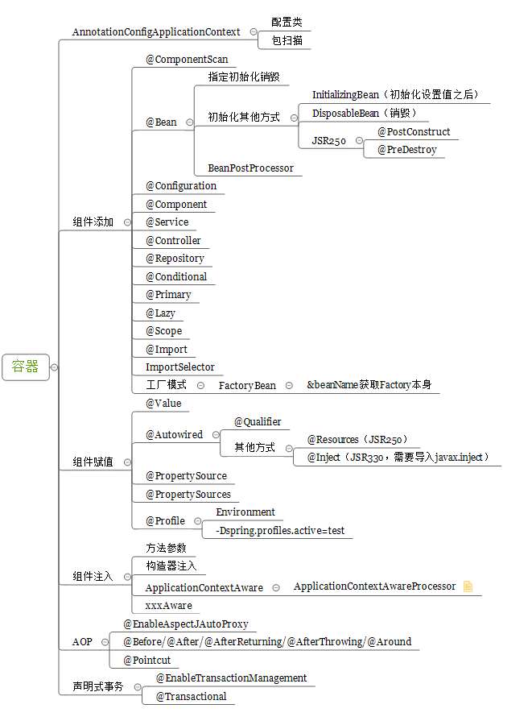
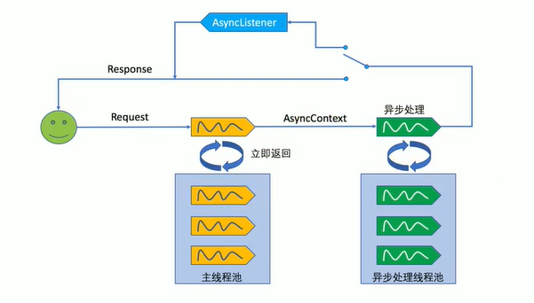

# Spring注解驱动开发（一）-IOC




## 一、组件添加（组成）

对于下面对象，如果需要加入到 Spring 容器中，可以采用 XML 或者注解方式

```java
package com.gjxaiou.bean;

/**
 * @Author GJXAIOU
 * @Date 2020/3/2 9:44
 */
@Data
public class Person {
    private String name;
    private int age;
}
```

### （一）使用 xml 方式

使用 xml 来配置注入一个 Bean，实现注册组件

```xml
<?xml version="1.0" encoding="UTF-8"?>
<beans xmlns="http://www.springframework.org/schema/beans"
       xmlns:xsi="http://www.w3.org/2001/XMLSchema-instance"
       xmlns:context="http://www.springframework.org/schema/context"
       xsi:schemaLocation="http://www.springframework.org/schema/beans http://www.springframework.org/schema/beans/spring-beans.xsd http://www.springframework.org/schema/context http://www.springframework.org/schema/context/spring-context.xsd">

    <bean id="person" class="com.cuzz.bean.Person">
        <property name="name" value="cuzz"></property>
        <property name="age" value="18"></property>
    </bean>
    
</beans>
```

然后可以使用`ClassPathXmlApplicationContext`来获取

```java
public class MainTest {
    public static void main(String[] args) {
        // 返回 IOC 容器 applicationContaxt
        ApplicationContext  applicationContext = new ClassPathXmlApplicationContext("bean.xml");
        // 用id获取
        Person bean = (Person) applicationContext.getBean("person");
        System.out.println(bean);
    }
}
```

输出`Person(name=cuzz, age=18)`

### （二） @Configuration 和 @Bean 的注入

编写一个配置类，等同于之前的配置文件

```java
package com.gjxaiou.config;

import com.gjxaiou.bean.Person;
import org.springframework.context.annotation.Bean;
import org.springframework.context.annotation.Configuration;

// 声明这是一个配置类
@Configuration
public class AddConfig1 {
    // 可以使用 @Bean 给容器中注册一个 Bean，类型为返回值类型，同时方法名作为该 Bean 在容器中的默认 id，如果想指定 id 可以使用 value 属性更改
    @Bean(value = "person1")
    public Person person() {
        return new Person("gjxaiou", 23);
    }
}
```

可以通过`AnnotationConfigApplicationContext`来获取，并且获取id

```java
import com.gjxaiou.bean.Person;
import com.gjxaiou.config.AddConfig1;
import org.springframework.context.annotation.AnnotationConfigApplicationContext;

/**
 * @Author GJXAIOU
 * @Date 2020/3/3 13:33
 */
public class AddConfigTest {
    public static void main(String[] args) {
        AnnotationConfigApplicationContext context =
                new AnnotationConfigApplicationContext(AddConfig1.class);
        Person person = (Person) context.getBean(Person.class);
        System.out.println(person);

        String[] names = context.getBeanNamesForType(Person.class);
        for (String name : names) {
            System.out.println(name);
        }
    }
}
```

输出

```
com.gjxaiou.bean.Person@3c0a50da
person1
```

**上面需要每一个都配置扫描，可以批量扫描**

## （三）组件扫描 

#### 1.使用xml

只要标注了注解就能扫描到如:@Controller @Service @Repository @component

```xml
<context:component-scan base-package="com.gjxaiou"></context:component-scan>
```

### 2.使用注解：@ComponentScan

在配置类中添加

```java
package com.gjxaiou.config;

import org.springframework.context.annotation.ComponentScan;
import org.springframework.context.annotation.Configuration;

/**
 * @Author GJXAIOU
 * @Date 2020/3/3 14:46
 */
@Configuration
// 扫描指定包
@ComponentScan(value = "com.gjxaiou")
public class ScanConfig1 {

}

```

然后添加 dao/service/controller 等供测试

```java
package com.gjxaiou.dao;

import org.springframework.stereotype.Repository;

/**
 * @Author GJXAIOU
 * @Date 2020/3/2 10:19
 */
@Repository
public class BookDao {
}

```

```java
package com.gjxaiou.service;

import org.springframework.stereotype.Service;

/**
 * @Author GJXAIOU
 * @Date 2020/3/2 10:20
 */
@Service
public class BookService {
}

```

```java
package com.gjxaiou.controller;

import org.springframework.stereotype.Controller;

/**
 * @Author GJXAIOU
 * @Date 2020/3/2 10:19
 */
@Controller
public class BookController {
}

```

测试程序

```java
import com.gjxaiou.config.ScanConfig1;
import org.junit.jupiter.api.Test;
import org.springframework.context.annotation.AnnotationConfigApplicationContext;


/**
 * @Author GJXAIOU
 * @Date 2020/3/3 14:47
 */
public class ScanConfigTest {
    @Test
    public void test01() {
        AnnotationConfigApplicationContext applicationContext =
                new AnnotationConfigApplicationContext(ScanConfig1.class);
        // 获取所有 bean 定义的名字
        String[] beanNames = applicationContext.getBeanDefinitionNames();
        for (String name : beanNames) {
            System.out.println(name);
        }
    }
}

```

输出结果：可以看出添加@Controller @Service @Repository @component注解的都可以扫描到

```java
// IOC 自身需要装载的组件
org.springframework.context.annotation.internalConfigurationAnnotationProcessor
org.springframework.context.annotation.internalAutowiredAnnotationProcessor
org.springframework.context.annotation.internalCommonAnnotationProcessor
org.springframework.context.event.internalEventListenerProcessor
org.springframework.context.event.internalEventListenerFactory

// scanConfig1 本身也是一个组件，因为 @Configuration 本身源码上也带有 @Component，所以也是一个组件
scanConfig1
bookDao
bookService
bookController
```


#### 3.配置扫描范围和规则

还可以指定添加某些类，和排除某些类，进入 ComponentScan 注解中有下面两个方法

- ComponentScan.Filter[] includeFilters() default {};：指定扫描的时候只需要包含哪些组件
- ComponentScan.Filter[] excludeFilters() default {};：指定扫描的时候按照什么规则排除那些组件

同时过滤规则为：

- FilterType.ANNOTATION：按照注解

- FilterType.ASSIGNABLE_TYPE：按照给定的类型；无论是该类型还是子类、实现类都会被注入

- FilterType.ASPECTJ：使用ASPECTJ表达式

- FilterType.REGEX：使用正则指定

- FilterType.CUSTOM：使用自定义规则

下面配置中单个规则实现了：排除标了 @Controller 和 @Service 注解的，如果要 配置只包含某些，就要将下面的 excludeFilters 替换为 includeFilters 即可，并且使 `useDefaultFilters = false`  即可，完整为：`@ComponentScan(value = "com.gjxaiou", includeFilters = {
        @ComponentScan.Filter(type = FilterType.ANNOTATION, classes = {Controller.class,Service.class}, useDefaultFilters = false)
})`

**同样可以同时制定多个扫描规则**:这里是包含了 @Controller 注解, BooService 类，排除了标明 @Repository 注解的。

```java
package com.gjxaiou.config;

import com.gjxaiou.service.BookService;
import org.springframework.context.annotation.ComponentScans;
import org.springframework.stereotype.Controller;
import org.springframework.stereotype.Repository;

import org.springframework.context.annotation.ComponentScan;
import org.springframework.context.annotation.Configuration;
import org.springframework.context.annotation.FilterType;

/**
 * @Author GJXAIOU
 * @Date 2020/3/3 18:01
 */
@Configuration
// 可以配置单个规则
//@ComponentScan(value = "com.gjxaiou", excludeFilters = {@ComponentScan.Filter(type =FilterType.ANNOTATION, classes = {Service.class, Controller.class})})

// 也可以配置多个规则
@ComponentScans(value = {
        @ComponentScan(value = "com.gjxaiou", includeFilters = {@ComponentScan.Filter(type = FilterType.ANNOTATION, classes =
                        {Controller.class}), @ComponentScan.Filter(type = FilterType.ASSIGNABLE_TYPE, classes = BookService.class)}, useDefaultFilters = false),
        @ComponentScan(value = "com.gjxaiou", excludeFilters = {@ComponentScan.Filter(type = FilterType.ANNOTATION, classes = {Repository.class})})})
public class ScanConfig2 {
}

```

测试结果为：

```java
org.springframework.context.annotation.internalConfigurationAnnotationProcessor
org.springframework.context.annotation.internalAutowiredAnnotationProcessor
org.springframework.context.annotation.internalCommonAnnotationProcessor
org.springframework.context.event.internalEventListenerProcessor
org.springframework.context.event.internalEventListenerFactory
scanConfig2
bookController
bookService
```


#### 4.自定义 TypeFilter 指定过滤规则

自定义规则示例：新建一个MyTypeFilte 类实现 TypeFilter 接口（该类必须实现该接口）

```java
package com.gjxaiou;

import org.springframework.core.io.Resource;
import org.springframework.core.type.AnnotationMetadata;
import org.springframework.core.type.ClassMetadata;
import org.springframework.core.type.classreading.MetadataReader;
import org.springframework.core.type.classreading.MetadataReaderFactory;
import org.springframework.core.type.filter.TypeFilter;

import java.io.IOException;

/**
 * @Author GJXAIOU
 * @Date 2020/3/3 21:25
 */
public class MyTypeFilter implements TypeFilter {
    /**
     * metadataReader：读取到的当前正在扫描的类的信息
     * metadataReaderFactory:可以获取到其他任何类信息的
     */
    @Override
    public boolean match(MetadataReader metadataReader, MetadataReaderFactory metadataReaderFactory)
            throws IOException {
        // 获取当前类注解的信息
        AnnotationMetadata annotationMetadata = metadataReader.getAnnotationMetadata();
        // 获取当前正在扫描的类的类信息
        ClassMetadata classMetadata = metadataReader.getClassMetadata();
        // 获取当前类资源（类的路径）
        Resource resource = metadataReader.getResource();

        String className = classMetadata.getClassName();
        System.out.println("--->" + className);
        // 这些类名中包含er就返回true，匹配成功就会被包含在容器中
        if (className.contains("er")) {
            return true;
        }
        return false;
    }
}

```

使用自定义注解记得需要关闭默认过滤器`useDefaultFilters = false`

```java
package com.gjxaiou.config;

import com.gjxaiou.MyTypeFilter;
import org.springframework.context.annotation.ComponentScan;
import org.springframework.context.annotation.Configuration;
import org.springframework.context.annotation.FilterType;

/**
 * @Author GJXAIOU
 * @Date 2020/3/3 21:27
 */
@Configuration
@ComponentScan(value = "com.gjxaiou",
        includeFilters = {@ComponentScan.Filter(type = FilterType.CUSTOM,
                classes = MyTypeFilter.class)},
        useDefaultFilters = false)
public class ScanConfig3 {
}

```

测试

```
--->com.gjxaiou.MyTypeFilter
--->com.gjxaiou.controller.BookController
--->com.gjxaiou.dao.BookDao
--->com.gjxaiou.service.BookService
org.springframework.context.annotation.internalConfigurationAnnotationProcessor
org.springframework.context.annotation.internalAutowiredAnnotationProcessor
org.springframework.context.annotation.internalCommonAnnotationProcessor
org.springframework.context.event.internalEventListenerProcessor
org.springframework.context.event.internalEventListenerFactory
scanConfig3
myTypeFilter  // 有er
bookController  // 有er
bookService // 有er

```

### 5. 组件注册 @Scope 设置作用域

首先新建 配置类，

```java
package com.gjxaiou.config;

import com.gjxaiou.bean.Person;
import org.springframework.context.annotation.Bean;

/**
 * @Author GJXAIOU
 * @Date 2020/3/3 21:59
 */
public class ScopeConfig1 {
    // 加入容器中
    @Bean("person")
    public Person person() {
        return new Person("张三", 25);
    }
}
```

- Spring 的 bean 默认是单例的

```java
import com.gjxaiou.config.ScopeConfig1;
import org.junit.jupiter.api.Test;
import org.springframework.context.annotation.AnnotationConfigApplicationContext;

/**
 * @Author GJXAIOU
 * @Date 2020/3/3 22:00
 */
public class ScopeConfig1Test {

    @Test
    public void test() {
        AnnotationConfigApplicationContext applicationContext =
                new AnnotationConfigApplicationContext(ScopeConfig1.class);
        // 获取所有bean定义的名字
        String[] beanNames = applicationContext.getBeanDefinitionNames();
        for (String name : beanNames) {
            System.out.println(name);
        }
        // 因为默认单例，如果两个对象相同
        Object bean = applicationContext.getBean("person");
        Object bean2 = applicationContext.getBean("person");
        System.out.println(bean == bean2);   // 输出true
    }
}
```

测试结果：

```java
org.springframework.context.annotation.internalConfigurationAnnotationProcessor
org.springframework.context.annotation.internalAutowiredAnnotationProcessor
org.springframework.context.annotation.internalCommonAnnotationProcessor
org.springframework.context.event.internalEventListenerProcessor
org.springframework.context.event.internalEventListenerFactory
scopeConfig1
person
true
```

- Scope的四个范围

```
ConfigurableBeanFactory#SCOPE_PROTOTYPE   // 多实例 每次获取时创建对象，不会放在ioc容器中
ConfigurableBeanFactory#SCOPE_SINGLETON   // 单实例 ioc容器启动时创建对象并且放入容器中，以后从容器中获取
WebApplicationContext#SCOPE_REQUEST       // web同一次请求创建一个实例
WebApplicationContext#SCOPE_SESSION       // web同一个session创建一个实例
```


因此如果在上面的 ScopeConfig1 类中的 @Bean 上面在增加一个 `@Scope(value = “prototype”)`，则最终结果为 false

**针对上面创建对象放入 IOC 容器中时机**：

首先是配置类：针对单例：

```java
@Configuration
public class MainConfig2 {

    @Bean
    public Person person() {
        system.out.println("给容器中添加 Person");
        return new Person("vhuj", 25);
    }
}
```

测试类：

```java
import com.gjxaiou.config.MainConfig;
import org.junit.jupiter.api.Test;
import org.springframework.context.annotation.AnnotationConfigApplicationContext;

/**
 * @Author GJXAIOU
 * @Date 2020/3/2 10:25
 */
public class IOCTest {

    @Test
    public void test02() {
        // 只创建 IOC 容器，先不获取 Bean
        AnnotationConfigApplicationContext applicationContext =
                new AnnotationConfigApplicationContext(MainConfig2.class);
    }

}

```

结果说明在 IOC 容器创建的时候，该方法就被调用了，创建了对象然后给容器中添加了 Person，以后每次获取直接从容器中拿，不会再次创建。

`给容器中添加 Person`

**多例模式：**

配置类：

```java
@Configuration
public class MainConfig2 {
	@Scope("prototype")
    @Bean
    public Person person() {
        system.out.println("给容器中添加 Person");
        return new Person("vhuj", 25);
    }
}
```

如果测试类没有变化，发现执行之后是没有任何输出的，只有修改测试类。添加获取 Bean 方法之后：

```java
import com.gjxaiou.config.MainConfig;
import org.junit.jupiter.api.Test;
import org.springframework.context.annotation.AnnotationConfigApplicationContext;

/**
 * @Author GJXAIOU
 * @Date 2020/3/2 10:25
 */
public class IOCTest {

    @Test
    public void test02() {
        AnnotationConfigApplicationContext applicationContext =
                new AnnotationConfigApplicationContext(MainConfig2.class);
      	system.out.println("IOC 容器创建完成");
        Object bean = applicationContext.getBean("person");
    }

}

```

输出结果为：在创建完成，需要获取 Bean 的时候才会创建该 Person 对象

```java
IOC 容器创建完成
给容器中添加 person
```

同时如果多次使用 ` Object bean = applicationContext.getBean("person");` 获取的时候，每次获取的时候都会添加一次。

```java
IOC 容器创建完成
给容器中添加 person
给容器中添加 person
```


## 4. 组件注册@Lazy-bean懒加载

### 1）懒加载

懒加载的是针对单实例Bean，因为单实例 Bean 默认是在容器启动的时创建的，我们可以设置懒加载容器启动是不创建对象，在第一次使用（获取）Bean创建对象，并初始化

### 2 ) 测试

先给添加一个@Lazy注解

```java
@Configuration
public class MainConfig2 {

    @Lazy
    @Bean
    public Person person() {
        System.out.println("给容器中添加Person...");
        return new Person("vhuj", 25);
    }
}
```

编写一个测试方法

```java
    @Test
    public void test03() {
        AnnotationConfigApplicationContext applicationContext = new AnnotationConfigApplicationContext(MainConfig2.class);

        System.out.println("ioc容器创建完成...");
        Object bean = applicationContext.getBean("person");
    }
```

输出如下：如果没有获取 Bean 的语句的话，只会输出：`ioc容器创建完成...`

```
ioc容器创建完成...
给容器中添加Person...
```

添加一个@Lazy是在第一次获取时，创建对象，以后获取就不需要创建了，直接从容器中获取，因为它是单实例

## 5. 组件注册@Conditional按条件注册

按照一定条件进行判断，满足条件才会给容器中注册Bean，不再是使用 @Bean 就直接给容器中注册 Bean了。

这里 @Conditional 标注在每个具体的方法上，也可以标注在 类 上，对整个类进行统一处理。

### 1 ) 编写自己的Condition类

如果系统是windows，给容器中注入"bill"

如果系统是linux，给容器中注入"linus"

编写WindowCondition类并重写matches方法，linux 的同下，这里忽略，如果要测试 Linux，可以将 VM arguments 修改为：`-Dos.name=linux`

  ```java
/**
   * @Author: cuzz
   * @Date: 2018/9/23 20:30
   * @Description: 判断是否是windows
   */
  public class WindowCondition implements Condition{
  
      /**
       * @param context 判断条件能使用的上下文（环境）
       * @param metadata 注释信息
       * @return boolean
       */
      @Override
      public boolean matches(ConditionContext context, AnnotatedTypeMetadata metadata) {
          // 获取 IOC 容器运行环境
          Environment environment = context.getEnvironment();
          String property = environment.getProperty("os.name");
          if (property.contains("Windows")) {
              return true;
          }
          return false;
      }
  }
  ```

context 还有以下方法

  ```java
  // 能获取ioc使用的beanfactory
  ConfigurableListableBeanFactory beanFactory = context.getBeanFactory();
  // 能获取到类加载器
  ClassLoader classLoader = context.getClassLoader();
  // 获取到环境变量
  Environment environment = context.getEnvironment();
  // 获取到Bean定义的注册类
  BeanDefinitionRegistry registry = context.getRegistry();
  ```

 ### 2）配置类

添加Bean添加Condition条件

```java
@Configuration
public class MainConfig2 {

    // （）里面是条件
    @Conditional({WindowCondition.class})
    @Bean("bill")
    public Person person01() {
        return new Person("Bill Gates", 60);
    }
    @Conditional({LinuxCondition.class})
    @Bean("linux")
    public Person person02() {
        return new Person("linus", 45);
    }

}
```


### 3 ) 测试

```java
    @Test
    public void test04() {
        AnnotationConfigApplicationContext applicationContext = new AnnotationConfigApplicationContext(MainConfig2.class);

        // 获取环境变量
        ConfigurableEnvironment environment = applicationContext.getEnvironment();
        String property = environment.getProperty("os.name");
        System.out.println(property);

        // 获取所有bean定义的名字
        String[] beanNames = applicationContext.getBeanDefinitionNames();
        for (String name : beanNames) {
            System.out.println(name);
        }

        // key 是id
        Map<String, Person> map = applicationContext.getBeansOfType(Person.class);
        System.out.println(map);
    }
```

发现只有“bill”这个Bean被注入

```
Windows 7
org.springframework.context.annotation.internalConfigurationAnnotationProcessor
org.springframework.context.annotation.internalAutowiredAnnotationProcessor
org.springframework.context.annotation.internalRequiredAnnotationProcessor
org.springframework.context.annotation.internalCommonAnnotationProcessor
org.springframework.context.event.internalEventListenerProcessor
org.springframework.context.event.internalEventListenerFactory
mainConfig2
bill
{bill=Person(name=Bill Gates, age=60)}
```

### 总结

给容器中注册组件：

- 包扫描 + 组件上标注注解（@Controller/@Service/@Repository/@Component）->只适用于自己写的组件类
- @Bean 方式：（使用构造器新建组件对象，然后在方法上标注 @Bean）可以导入第三方包中的组件
- @Import 方式：快速给容器中导入一个组件
    - @import(要导入到容器中的组件)；容器中就会自动注册这个组件，id 默认为全类名
    - @ImportSelector：返回需要导入的组件的全类名数组
    - @ImportBeanDefinitionRegister：手工注册 Bean 到容器中

- 使用 Spring 提供的 FactoryBean 
    - 默认是获取工厂 Bean 调用 getObject 创建的对象；
    - 如果要获取工厂 Bean 本身，我们需要给 id 前面加上一个 &

## 6. 组件注册@Improt给容器中快速导入一个组件

### 1 ) @Import导入

@Import可以导入第三方包，或则自己写的类，比较方便，Id默认为全类名

比如我们新建一个类

```java
/**
 * @Author: cuzz
 * @Date: 2018/9/23 21:08
 * @Description:
 */
public class Color {
}
```

我们只需要在配置类添加一个@Import把这个类导入

```java
@Import({Color.class})
// @Import 可以同时导入多个组件
@Import({Color.class,Red.class})
@Configuration
public class MainConfig2 {}
```

### 2 ) ImportSelector接口导入的选择器

返回导入组件需要的全类名的数组

```java
public interface ImportSelector {

	/**
	 * Select and return the names of which class(es) should be imported based on
	 * the {@link AnnotationMetadata} of the importing @{@link Configuration} class.
	 */
	String[] selectImports(AnnotationMetadata importingClassMetadata);

}
```

编写一个MyImportSelector类实现ImportSelector接口，在该类中编写逻辑来实现具体导入哪些组件，不是导入该类到 IOC 容器，是将该类中 selectImports 方法返回的全类名导入到容器中。

```java
/**
 * @Author: cuzz
 * @Date: 2018/9/23 21:15
 * @Description:
 */
public class MyImportSelector implements ImportSelector{

    // 返回值就是导入容器组件的全类名
    // AnnotationMetadata:当前类标注的@Import注解类的所有注解信息
    @Override
    public String[] selectImports(AnnotationMetadata importingClassMetadata) {
        return new String[] {"com.cuzz.bean.Car"};
    }
}
```

在配置类中，通过@Import导入

```java
/**
 * @Author: cuzz
 * @Date: 2018/9/23 15:40
 * @Description: 配置类
 */
@Import({Color.class, MyImportSelector.class})
@Configuration
public class MainConfig2 {}
```

测试结果，`com.cuzz.bean.Car`注入了

```
org.springframework.context.annotation.internalConfigurationAnnotationProcessor
org.springframework.context.annotation.internalAutowiredAnnotationProcessor
org.springframework.context.annotation.internalRequiredAnnotationProcessor
org.springframework.context.annotation.internalCommonAnnotationProcessor
org.springframework.context.event.internalEventListenerProcessor
org.springframework.context.event.internalEventListenerFactory
mainConfig2
com.cuzz.bean.Color
com.cuzz.bean.Car
```

### 3 ) ImportBeanDefinitionRegistrar接口选择器

```java
public interface ImportBeanDefinitionRegistrar {

	/**
	 * Register bean definitions as necessary based on the given annotation metadata of
	 * the importing {@code @Configuration} class.
	 * <p>Note that {@link BeanDefinitionRegistryPostProcessor} types may <em>not</em> be
	 * registered here, due to lifecycle constraints related to {@code @Configuration}
	 * class processing.
	 * @param importingClassMetadata annotation metadata of the importing class
	 * @param registry current bean definition registry
	 */
	public void registerBeanDefinitions(
			AnnotationMetadata importingClassMetadata, BeanDefinitionRegistry registry);

}
```

编写一个ImportBeanDefinitionRegistrar实现类，作用是将所有需要添加到容器中的 Bean，通过调用 BeanDefinitionRegistry.registerBeanDefinition 手工注册进来。

```java
/**
 * @Author: cuzz
 * @Date: 2018/9/23 21:29
 * @Description:
 */
public class MyImportBeanDefinitionRegistrar implements ImportBeanDefinitionRegistrar {
    /**
     * @param importingClassMetadata 当前类的注解信息
     * @param registry ： Bean 定义的注册类
     */
    @Override
    public void registerBeanDefinitions(AnnotationMetadata importingClassMetadata, BeanDefinitionRegistry registry) {
        // 查询容器
        boolean b = registry.containsBeanDefinition("com.cuzz.bean.Car");
        // 如果有car, 注册一个汽油类
        if (b == true) {
            // 需要添加一个bean的定义信息，定义信息包括 Bean 的类型和 Bean 的 scope 等等。
            RootBeanDefinition rootBeanDefinition = new RootBeanDefinition(Petrol.class);
            // 注册一个bean, 指定bean名
            registry.registerBeanDefinition("petrol", rootBeanDefinition);
        }

    }
}
```

配置类

```java
/**
 * @Author: cuzz
 * @Date: 2018/9/23 15:40
 * @Description: 配置类
 */
@Import({Color.class, MyImportSelector.class, MyImportBeanDefinitionRegistrar.class})
@Configuration
public class MainConfig2 {}
```

这里创建 petrol 类忽略

测试结果，**出现了petrol**

```
org.springframework.context.annotation.internalConfigurationAnnotationProcessor
org.springframework.context.annotation.internalAutowiredAnnotationProcessor
org.springframework.context.annotation.internalRequiredAnnotationProcessor
org.springframework.context.annotation.internalCommonAnnotationProcessor
org.springframework.context.event.internalEventListenerProcessor
org.springframework.context.event.internalEventListenerFactory
mainConfig2
com.cuzz.bean.Color
com.cuzz.bean.Car 
petrol
```

## 7. 组件注册使用FactoryBean注册组件

编写一个ColorFactoryBean类

```java
// 创建一个 Spring定义的工厂Bean
public class ColorFactoryBean implements FactoryBean<Color> {
    // 返回一个Color对象，该对象会添加到容器中
    @Override
    public Color getObject() throws Exception {
        return new Color();
    }

    @Override
    public Class<?> getObjectType() {
        return Color.class;
    }
    // 是否为单例，true 表示是单例，在容器中就只会保存一份，即多次使用 getObject() 获取到对象是一样的
    @Override
    public boolean isSingleton() {
        return true;
    }
}
```

将工厂类注入到容器中

```java
@Configuration
public class MainConfig2 {
	@Bean
    public ColorFactoryBean colorFactoryBean() {
        return new ColorFactoryBean();
    }

} 

```

测试

```java
    @Test
    public void test05() {
        AnnotationConfigApplicationContext applicationContext = new AnnotationConfigApplicationContext(MainConfig2.class);

        Object bean = applicationContext.getBean("colorFactoryBean");
        // 工厂 bean 获取的是调用getClass()方法创建的对象
        System.out.println("colorFactoryBean的类型是: " + bean.getClass());
    }
```

输出，**发现此时的bean调用的方法是getObjectType方法**，虽然看上去装载的是 ColorFactoryBean，但是工厂 bean 获取的是调用getClass()方法创建的对象

```
colorFactoryBean的类型是: class com.cuzz.bean.Color
```

同时如果多次使用 ` Object bean = applicationContext.getBean("colorFactoryBean");`，结果获取到的多个 Bean 是同一个 Bean。但是如果上面的工厂 Bean 的 isSingleton() 方法返回值为 false，即是多实例，则多次获取 Bean，每次都会调用 工厂 Bean的 getObject() 方法，获取多个不同的 Bean。

**如果需要获取BeanFactory本身，可以在id前面加一个“&”标识**

```java
    @Test
    public void test05() {
        AnnotationConfigApplicationContext applicationContext = new AnnotationConfigApplicationContext(MainConfig2.class);

        Object bean = applicationContext.getBean("colorFactoryBean");
        // 工厂bean调用的是getClass()方法
        System.out.println("colorFactoryBean的类型是: " + bean.getClass());
        Object bean2 = applicationContext.getBean("&colorFactoryBean");
        // 工厂bean调用的是getClass()方法
        System.out.println("colorFactoryBean的类型是: " + bean2.getClass());
    }
```

此时输出

```
colorFactoryBean的类型是: class com.cuzz.bean.Color
colorFactoryBean的类型是: class com.cuzz.bean.ColorFactoryBean
```


## Bean 生命周期

# Spring注解驱动开发（二）

## 1. 声明周期@Bean指定初始化和销毁方法

###  1 ) Bean的生命周期

Bean的创建、初始化和销毁是由容器帮我们管理的

我们可以自定义初始化和销毁方法，容器在 Bean 进行到当前生命周期的时候来调用我们自定义的初始化和销毁方法

构造（对象创建）

​	单实例： 在容器启动的时候创建

​	多实例： 在每次获取的时候创建对象


**具体实现方式**

- 指定初始化方法和销毁方法
    - 通过 @Bean 指定 init–method 和 destory-method
- 通过让 Bean 实现 InitializingBean （定义初始化逻辑）和实现 DisposableBean（定义逻辑销毁）

- 使用 JSR250 中提供的注解（Java 提供）
    - @PostConstruct：在 Bean 创建完成并且属性赋值完成之后，来执行初始化方法；
    - @PreDestory：在容器销毁 Bean 之前通知费我们进行清理工作。
- 使用接口 BeanPostProcessor ：Bean 的后置处理器，**在 Bean 初始化前后**进行一些处理工作
    - postProcessBeforeInitialization：在初始化之前工作
    - postProcessAfterInitialization：在初始化之后工作

### 2 ) 指定初始化方法

**初始化：**对象创建完成后，并赋值化，调用初始化方法

**销毁：**单实例是在容器关闭的时候销毁，多实例容器不会管理这个Bean，容器不会调用销毁方法

编写一个Car类

```java
/**
 * @Author: cuzz
 * @Date: 2018/9/23 21:20
 * @Description:
 */
public class Car {

    public Car () {
        System.out.println("car constructor...");
    }

    public void init() {
        System.out.println("car...init...");
    }

    public void destroy() {
        System.out.println("car...destroy...");
    }
}
```

在xml中我们可以指定`init-method`和`destroy-method`方法，如

```xml
<bean id="car" class="com.cuzz.bean.Car" init-method="init" destroy-method="destroy"></bean>
```

使用注解我们可以

```java
/**
 * @Author: cuzz
 * @Date: 2018/9/24 12:49
 * @Description: 配置类
 */
@Configuration
public class MainConfigOfLifecycle {

    @Bean(initMethod = "init", destroyMethod = "destroy")
    public Car car() {
        return new Car();
    }

}
```

测试

```java
/**
 * @Author: cuzz
 * @Date: 2018/9/24 13:00
 * @Description:
 */
public class IOCTestLifeCycle {

    @Test
    public void test01() {
        // 创建ioc容器
        AnnotationConfigApplicationContext applicationContext =
                new AnnotationConfigApplicationContext(MainConfigOfLifecycle.class);
        System.out.println("容器创建完成...");
        // 关闭容器
        System.out.println("--->开始关闭容器");
        applicationContext.close();
        System.out.println("--->已经关闭容器");
    }
}
```

可以看出先创建car，再调用init方法，在容器关闭时销毁实例

```
car constructor...
car...init...
容器创建完成...
--->开始关闭容器
car...destroy...
--->已经关闭容器
```

在配置数据源的时候，有很多属性赋值，销毁的时候要把连接给断开


**针对多实例**

配置类：

```java
@Configuration
public class MainConfigOfLifecycle {
	@Scope("prototype")
    @Bean(initMethod = "init", destroyMethod = "destroy")
    public Car car() {
        return new Car();
    }
}
```

测试类

```java
/**
 * @Author: cuzz
 * @Date: 2018/9/24 13:00
 * @Description:
 */
public class IOCTestLifeCycle {

    @Test
    public void test01() {
        // 创建ioc容器
        AnnotationConfigApplicationContext applicationContext =
                new AnnotationConfigApplicationContext(MainConfigOfLifecycle.class);
        System.out.println("容器创建完成...");
        applicationContext.getBean("car");
        // 关闭容器
        System.out.println("--->开始关闭容器");
        applicationContext.close();
        System.out.println("--->已经关闭容器");
    }
}
```

只有在 getBean 时候才会初始化。


## 2. 生命周期InitializingBean和DisposableBean

### 1 ) InitializingBean

可以通过Bean实现InitializingBean来定义初始化逻辑，是设置好所有属性会调用`afterPropertiesSet()`方法

```java
public interface InitializingBean {

	/**
	 * Invoked by a BeanFactory after it has set all bean properties supplied
	 * (and satisfied BeanFactoryAware and ApplicationContextAware).
	 * <p>This method allows the bean instance to perform initialization only
	 * possible when all bean properties have been set and to throw an
	 * exception in the event of misconfiguration.
	 * @throws Exception in the event of misconfiguration (such
	 * as failure to set an essential property) or if initialization fails.
	 */
	void afterPropertiesSet() throws Exception;

}
```

### 2）DisposableBean

可以通过Bean实现DisposableBean来定义销毁逻辑，会调用destroy()方法

```java
public interface DisposableBean {

	/**
	 * Invoked by a BeanFactory on destruction of a singleton.
	 * @throws Exception in case of shutdown errors.
	 * Exceptions will get logged but not rethrown to allow
	 * other beans to release their resources too.
	 */
	void destroy() throws Exception;

}
```

### 3）例子

编写一个Cat类

```java
public class Cat implements InitializingBean, DisposableBean{

    public Cat() {
        System.out.println("cat constructor...");
    }


    @Override
    public void afterPropertiesSet() throws Exception {
        System.out.println("cat...init...");
    }

    @Override
    public void destroy() throws Exception {
        System.out.println("cat...destroy...");
    }

}
```

然后将 cat 注入即可，这里忽略

测试

```
cat constructor...
cat...init...
容器创建完成...
--->开始关闭容器
cat...destroy...
--->已经关闭容器
```


## 3. 生命周期@PostContruct和@PreDestroy注解

@PostContruct在Bean创建完成并且属性赋值完成，来执行初始化

@PreDestroy在容器销毁Bean之前通知我们进行清理工作

编写一个Dog类，并把他注入到配置类中

```java
@Component
public class Dog {

    public Dog() {
        System.out.println("dog constructor...");
    }

   // 对象创建并且执行构造器（赋值）之后调用
    @PostConstruct
    public void postConstruct() {
        System.out.println("post construct...");
    }

    @PreDestroy
    public void preDestroy() {
        System.out.println("pre destroy...");
    }
}
```

测试结果

```
dog constructor...
post construct...
容器创建完成...
--->开始关闭容器
pre destroy...
--->已经关闭容器
```

## 4. 生命周期BeanPostProscessor后置处理器

在Bean初始化前后做一些处理

```java
public interface BeanPostProcessor {
	// 在初始化之前工作
	Object postProcessBeforeInitialization(Object bean, String beanName) throws BeansException;
	// 在初始化之后工作
	Object postProcessAfterInitialization(Object bean, String beanName) throws BeansException;

}
```

编写一个MyBeanPostProcessor实现BeanPostProcessor接口

```java
/**
 * @Author: cuzz
 * @Date: 2018/9/24 14:21
 * @Description: 后置处理器，初始化前后进行处理工作
 */
// 将后置处理器加入到容器中
@Component
public class MyBeanPostProcessor implements BeanPostProcessor{
    @Override
    public Object postProcessBeforeInitialization(Object bean, String beanName) throws BeansException {
        System.out.println("--->postProcessBeforeInitialization..." +"bean在容器中的名字" + beanName +"==>" + bean);
        return bean;
    }

    @Override
    public Object postProcessAfterInitialization(Object bean, String beanName) throws BeansException {
        System.out.println("--->postProcessAfterInitialization..." + beanName +"==>" + bean);
        return bean;
    }
}
```

测试

```
--->postProcessBeforeInitialization...org.springframework.context.event.internalEventListenerProcessor==>org.springframework.context.event.EventListenerMethodProcessor@1dc67c2
--->postProcessAfterInitialization...org.springframework.context.event.internalEventListenerProcessor==>org.springframework.context.event.EventListenerMethodProcessor@1dc67c2
--->postProcessBeforeInitialization...org.springframework.context.event.internalEventListenerFactory==>org.springframework.context.event.DefaultEventListenerFactory@2bd765
--->postProcessAfterInitialization...org.springframework.context.event.internalEventListenerFactory==>org.springframework.context.event.DefaultEventListenerFactory@2bd765
cat constructor...
--->postProcessBeforeInitialization...cat==>com.cuzz.bean.Cat@1d3b207
cat...init...
--->postProcessAfterInitialization...cat==>com.cuzz.bean.Cat@1d3b207
容器创建完成...
--->开始关闭容器
cat...destroy...
--->已经关闭容器
```

在实例创建之前后创建之后会被执行

## 5. 生命周期BeanPostProcessor原理

通过debug到populateBean，先给属性赋值在执行initializeBean方法

```java
try {
    // 给 Bean 进行属性赋值
    populateBean(beanName, mbd, instanceWrapper);
    if (exposedObject != null) {
        exposedObject = initializeBean(beanName, exposedObject, mbd);
    }
}
```

initializeBean方法时，

```java
protected Object initializeBean(final String beanName, final Object bean, RootBeanDefinition mbd) {


    Object wrappedBean = bean;
    if (mbd == null || !mbd.isSynthetic()) {
        // 执行before方法
        wrappedBean = applyBeanPostProcessorsBeforeInitialization(wrappedBean, beanName);
    }
	...
    try {
        // 执行初始化
        invokeInitMethods(beanName, wrappedBean, mbd);
    }

    if (mbd == null || !mbd.isSynthetic()) {
        // 执行after方法
        wrappedBean = applyBeanPostProcessorsAfterInitialization(wrappedBean, beanName);
    }
    return wrappedBean;
}
```


**Spring底层对`BeanPostProcessor`的使用**：

Bean赋值、注入其他组件、@Autowired、生命周期注解功能、@Async等等都使用到了BeanPostProcessor这个接口的实现类，很重要


# Spring注解驱动开发（三）

# 1. 属性赋值@value赋值

使用@Value（）赋值，其中括号中可以写以下内容

- 基本数值
- 可以写SPEL表达式 #{}
- 可以 ${} 获取配置文件信息（在运行的环境变量中的值）


使用xml时候导入配置文件是

```XML
<context:property-placeholder location="classpath:person.properties"/>
```

使用注解可以在配置类添加一个@PropertySource注解把配置文件中k/v保存到运行的环境中

使用${key}来获取

**配置文件内容**：person.properties

```properties
person.nickName = 三三
```


**配置类**

```java
/**
 * @Author: cuzz
 * @Date: 2018/9/24 18:43
 * @Description:
 */
// 导入配置文件，使用 @PropertySource 读取配置文件中的 key/value 保存到环境变量中，加载完外部的配置文件以后使用 ${} 取出配置文件的值
@PropertySource(value = {"classpath:/person.properties"})
@Configuration
public class MainConfigOfPropertyValue {

    @Bean
    public Person person() {
        return new Person();
    }
}
```


```java
@Data
public class Person {

    @Value("vhuj")
    private String name;

    @Value("#{20-2}")
    private Integer age;
// 读取配置文件中值
    @Value("${person.nickName}")
    private String nickName;
}
```

测试

```java
public class IOCTestPropertyValue{  
    AnnotationConfigApplicationContext applicationContext = new AnnotationConfigApplicationContext(MainConfigOfPropertyValue.class);
@Test
    public void test01() {
        printBean(applicationContext);
        System.out.println("---------------------------");

        Person person = (Person) applicationContext.getBean("person");
        System.out.println(person);

        System.out.println("---------------------------");
        // 因为配置文件中的 key-value 都加载到了环境变量中，所以可以根据环境变量的 key 直接获取值
        ConfigurableEnvironment environment = applicationContext.getEnvironment();
        String property = environment.getProperty("person.nickName");
        System.out.printlin(property);

    }
}
```

输出

```
---------------------------
Person(name=vhuj, age=18, nickName=三三)
---------------------------
```

# 2. 自动装配@Autowired@Qualifier@Primary

- 自动转配：

​	Spring利用依赖注入（DI），完成对 **IOC 容器中各个组件**的依赖关系赋值

- @Autowired自动注入:

    - 默认优先按照类型去容器中寻找对应的组件，如果找到去赋值

    - 如果找到多个相同类型的组件，再将属性名（`BookDao bookdao`）作为组件的id去容器中查找

        ```java
        // 如果在 MainConfigOfAutowired 再次注入一个 bookDao，所以该类型的组件就有两个了
        @configuration
        @ComponentScan({"com.gjxaiou.dao", "com.gjxaiou.service"})
        public clas MainConfigOfAutowired{
          @Bean("bookDao2")
            public BookDao bookDao(){
            	return bookDao;
            }
        }
        ```

        

    - 还可以在 @Autowird 注解上面添加使用`@Qualifier("bookdao")`明确指定需要装配的 id

- 如果使用自动装配，被装配的组件必须在容器中存在，如果不存在报错，当然们可以指定    `@Autowired(required=false)`，指定非必须

- @Primary 让 Spring 自动装配时首先装配使用该注解的组件（存在多个同类型的组件的时候），与 @Autowired 结合使用。例如将该注解加在 MainConfigOfAutowired 的 bookDao 上，同时没有使用 @Qualifier 注解指定的情况下，自动装配时候就会优先加在该组件，如果指定了就会加在指定的组件。

测试：

```java
public class IOCTestAutowired{

	@Test
    public void test01(){
    
    	AnnotationConfigApplicationContext applicationContext = new AnnotationConfigApplicationContext("MainConfigOfAutowired.class");
        BookService bookService = applicationContext.getBean(BookService.class);
        // 看看 bookService 中有没有 bookDao 对象
        System.out.println(bookService);
        // 看和容器中的 Dao 是不是一样的
        BookDao bookDao = applicationContext.getBean(BookDao.class);
        System.out.println(bookDao);

        applicationContext.close();
    
    }

}
```

配置类：

```java
@configuration
// 这里使用包扫描的方式，将这些组件都加入容器中
@ComponentScan({"com.gjxaiou.dao", "com.gjxaiou.service"})
public clas MainConfigOfAutowired{

}
```

Service 组件中需要使用到 Dao 组件

```java
@Service
@toString
public class BookService{
    @Autowired
	private BookDao bookDao;
   
    public void print(){
    	System.out.println(bookDao);
    }
}
```

Dao 组件为：

```java
// 名字默认为类名首字母小写
@Repoitory
public class BookDao{
	
}
```

# 3. 自动装配@Resource和@Inject

Spring还支持使用@Resource (JSR250) 和@Inject (JSR330) 注解，这两个是java规范注解

- @Resource

    - @Resource和@Autowired一样实现自动装配功能，默认是按组件名称进行装配的：@Resource(name=”bookDao”)

    - 没有支持@Primary和@Autowird(required=false)的功能

- @Inject

    - 需要导入依赖 javax.inject
    - 和 Autowired 功能几乎一致，支持与 @Primary 一起使用，但是没有类似于 @Autowird(required=false)的功能 

本质上是使用 AutowiredAnnotationBeanPostProcessor 解析完成自动装配功能 

# 4. 自动装配其他地方的自动装配

@Autowired：可以在构造器、参数、方法，属性等使用。

除了下面代码示例外最后一种标注到方法位子上@Bean+方法参数，参数从容器中获取

```java
// 如果下面代码中只是,即不使用 @Component 将 Boss 加入到容器中
public class Boss{
 private Car car;
    // 加上一个有参构造方法
}
// 可以直接在配置类中将 Boss 类和其依赖的来加入
public class MainConfigOfAutowired{
    @Bean
    // 当然可以在参数位置加上 @Autowired，也可以不加
	public Boss boss(Car car){
        Boss boss = new Boss();
        boss.setBoss(car);
    return boss;
    }    
}
```


```java
package com.gjxaiou.bean
@Component
public class Boss {
    // 方式一：标注在属性上
    @Autowired
    private Car car;
	
    // 默认情况下，在 IOC 中的组件，容器启动的时候会调用无参构造器创建对象，在进行初始化赋值等操作，这里实现有参构造器。
    // 方法三：标注在有参构造器上，构造器中要用的组件也是从容器中获取（如果组件只有一个有参构造器，则该有参构造器的 @Autowired 可以省略）
    @Autowired
    public Boss( Car car) {
        this.car = car;
       System.out.println("Boss  有参构造器");
    }

    public Car getCar() {
        return car;
    }
	
    // 方式二：标注在 set 方法上
    @Autowired		 // 参数
    // 标注在方法上的时候， Spring 容器创建当前对象的时候，就会调用方法完成赋值，这里的方法使用的参数是自定义类型，所有直接从 IOC 容器中获取
    public void setCar( Car car) {
        this.car = car;
    }
    
    // 方法四：标注在有参构造器或者 set 方法的参数上面：XXX(@Autowired Car car) 
}
```

对应的 car 也使用 @Component 加载到容器中，代码通上。

然后在对应的配置类 MainConfigOfAutowired 上面扫描将 Boss 加入

```java
@configuration
// 这里使用包扫描的方式，将这些组件都加入容器中
@ComponentScan({"com.gjxaiou.dao", "com.gjxaiou.service", "com.gjxaiou.bean"})
public clas MainConfigOfAutowired{

}
```

# 5. 自动装配Aware注入Spring底层注解

自定义组件想要使用 Spring 容器底层的一些组件（如 ApplicationContext，BeanFactory 等等），需要自定义组件实现 xxxAware，在创建对象的时候会调用接口规定的方法注入相关的组件。

```java
/**
 * Marker superinterface indicating that a bean is eligible to be
 * notified by the Spring container of a particular framework object
 * through a callback-style method. Actual method signature is
 * determined by individual subinterfaces, but should typically
 * consist of just one void-returning method that accepts a single
 * argument.
 */
public interface Aware {

}
```

我们实现几个常见的Aware接口

```java
/**
 * @Author: cuzz
 * @Date: 2018/9/25 10:18
 * @Description:
 */
@Component
public class Red implements BeanNameAware ,BeanFactoryAware, ApplicationContextAware {
    private ApplicationContext applicationContext;

    @Override
    public void setBeanName(String name) {
        System.out.println("当前Bean的名字: " + name);
    }

    @Override
    public void setBeanFactory(BeanFactory beanFactory) throws BeansException {
        System.out.println("当前的BeanFactory: " + beanFactory);
    }

    @Override
    public void setApplicationContext(ApplicationContext applicationContext) throws BeansException {
        this.applicationContext = applicationContext;
        System.out.println("传入的ioc: " + applicationContext);
    }
}
```

注入到配置中测试

```java
/**
 * @Author: cuzz
 * @Date: 2018/9/25 10:28
 * @Description:
 */
public class IOCTestAware {

    @Test
    public void test01() {
        AnnotationConfigApplicationContext applicationContext = new AnnotationConfigApplicationContext(MainConfigOfAware.class);

    }
}
```

测试结果

```
当前Bean的名字: red
当前的BeanFactory: org.springframework.beans.factory.support.DefaultListableBeanFactory@159c4b8: defining beans [org.springframework.context.annotation.internalConfigurationAnnotationProcessor,org.springframework.context.annotation.internalAutowiredAnnotationProcessor,org.springframework.context.annotation.internalRequiredAnnotationProcessor,org.springframework.context.annotation.internalCommonAnnotationProcessor,org.springframework.context.event.internalEventListenerProcessor,org.springframework.context.event.internalEventListenerFactory,mainConfigOfAware,red]; root of factory hierarchy
传入的ioc: org.springframework.context.annotation.AnnotationConfigApplicationContext@1e89d68: startup date [Tue Sep 25 10:29:17 CST 2018]; root of context hierarchy

```

**总结**：作用：把Spring自定义组件注入到容器中

**原理：**

```java
public interface ApplicationContextAware extends Aware {}
```

`xxxAware`都是通过`xxxProcessor`来处理的

比如：`ApplicationContextAware`  对应`ApplicationContextAwareProcessor`

# 6. 自动装配@Profile环境搭建

Profile是 Spring 为我们提供可以根据当前环境，动态的激活和切换一系组件的功能，例如开发环境、测试环境、生产环境中的数据库数据源在不改变代码情况下进行改变。

首先通过配置类将数据源加入容器中，然后通过 @Profile 来指定组件在哪个环境的情况下才能被注册到容器中。只有该环境被激活才会被注册到容器中，默认环境为 “Default”。**当然该注解也可以标注在类上**。

注：没有标注环境标识的 Bean 在任何环境下都是加载的。

```java
@Configuration
public class MainConfigOfProfile{
    @Profile("test")
	@Bean("testDataSource")
    public DataSource dataSourceTest() throws Exception{
    	ComboPoolDataSource dataSource = new ComboPoolDataSource();
        dataSource.setUser("root");
        dataSource.setPassword("12345");
        dataSource.setJdbcUrl("jdbc:mysql://localhost:3306/test");
        dataSource.setDriverClass("com.mysql.jdbc.Driver");
        return dataSource;
    }
    
    	@Profile("dev")
    	@Bean("devDataSource")
    public DataSource dataSourceDev() throws Exception{
    	ComboPoolDataSource dataSource = new ComboPoolDataSource();
        dataSource.setUser("root");
        dataSource.setPassword("12345");
        dataSource.setJdbcUrl("jdbc:mysql://localhost:3306/dev");
        dataSource.setDriverClass("com.mysql.jdbc.Driver");
        return dataSource;
    }
}
```

切换环境方式：

- 使用命令动态参数激活：虚拟机参数位子加载 `-Dspring.profiles.active=test`

- 使用代码激活环境，见下：

```java
public class IOCTestProfile {

    @Test
    public void test01() {
        // 1. 使用无参构造器创建一个applicationContext
        AnnotationConfigApplicationContext applicationContext = new AnnotationConfigApplicationContext();
        // 2. 设置要激活的环境
        applicationContext.getEnvironment().setActiveProfiles("test");
        // 3. 注册主配置类
        applicationContext.register(MainConfigOfProfile.class);
        // 4. 启动刷新容器
        applicationContext.refresh();
    }
}
```


# AOP

## AOP 使用简介


指在程序运行期间动态的将某段代码切入到指定方法指定位置进行运行的编程模式，底层就是动态代理。

 * 导入aop模块

    ```xml
    <dependency>
        <groupId>org.springframework</groupId>
        <artifactId>spring-aspects</artifactId>
        <version>5.2.2.RELEASE</version>
    </dependency>
    ```

 * 定义一个业务逻辑类（MathCalculator），在业务逻辑运行的时候将日志进行打印（方法之前，方法运行结束，方法出现异常等）

    ```java
    package com.gjxaiou.aop;
    
    import org.springframework.stereotype.Component;
    
    @Component
    public class MathCalculator {
    
        public int div(int i,int j){
            System.out.println("本方法被调用");
            return i/j;
        }
    
    }
    ```

 * 定义一个日志切面类（LogAspect），切面类里面的方法需要动态感知 MathCalculator.div 运行到哪里，然后执行。

    该类中的方法称为通知方法：

     * 前置通知(@Before)：logStart：在目标方法（div）运行之前运行 参数列表传入joinPoint 可以获取到方法的相关属性,且该参数必须放在第一个参数，否则无法识别
     * 后置通知(@After)：logEnd：在目标方法（div）运行之后运行，无论方法正常结束还是异常结束
     *  返回通知(@AfterReturning(returning可以指定封装返回值的参数）)：logReturn：在目标方法（div）正常返回之后运行
     * 异常通知(@AfterThrowing)：logException：在目标方法（div）出现异常以后运行
     * 环绕通知(@Around)：动态代理，手动推进目标方法运行（joinPoint.proceed())

 * 实现过程：

     * 给切面类的目标方法标注何时何地运行（通知注解）

     * 将切面类和业务逻辑类（目标方法所在类）都加入到容器中；

        ```java
        package com.gjxaiou.config;
        
        import com.gjxaiou.aop.LogAspect;
        import com.gjxaiou.aop.MathCalculator;
        import org.springframework.context.annotation.Bean;
        import org.springframework.context.annotation.Configuration;
        import org.springframework.context.annotation.EnableAspectJAutoProxy;
        
        @EnableAspectJAutoProxy
        @Configuration
        public class MainConfigOfAOP {
        
            //业务逻辑类加入容器中
            @Bean
            public MathCalculator calculator() {
                return new MathCalculator();
            }
        
            //切面类加入容器中
            @Bean
            public LogAspect logAspect() {
                return new LogAspect();
            }
        }
        
        ```

     * 告诉Spring哪个类是切面类（给切面类上加一个注解@Aspect）

     * 需要给配置类加一个 @EnableAspectJAutoProxy【开启基于注解的aop模式】

```java
package com.gjxaiou.aop;

import java.util.Arrays;

/**
 * 切面类
 */
@Aspect
public class LogAspect {

    //抽取公共的切入点表达式
    //1、在同一个类中使用该切点，如果在其他类中使用该切点，则其注解后面的切入点表达式为下面的切点方法全路径。
    // 括号中为切入点表达式（指定从哪个方法切入）
    @Pointcut("execution(public int com.gjxaiou.aop.MathCalculator.*(..))")
    public void pointCut(){}

    // 在目标方法之前切入：切入点表达式（指定在哪个方法切入）
    @Before("pointCut()")
    public void logStart(JoinPoint joinPoint){
        System.out.println(""+joinPoint.getSignature().getName()+"除法运行。。。参数列表是：{"+ Arrays.asList(joinPoint.getArgs())+"}");
    }

    @After("pointCut()")
    public void logEnd(){
        System.out.println("除法运行结束。。。");
    }

    @AfterReturning(value = "pointCut()",returning ="result" )
    public void logReturn(Object result){
        System.out.println("除法正常返回。。运行结果：{"+result+"}");
    }

    @AfterThrowing("pointCut()")
    public void LogException(){
        System.out.println("除法异常。。异常信息：{}");
    }
}
```

测试程序为：

```java

import com.gjxaiou.aop.MathCalculator;
import com.gjxaiou.config.MainConfigOfAOP;
import org.junit.jupiter.api.Test;
import org.springframework.context.annotation.AnnotationConfigApplicationContext;

import java.util.Arrays;
import java.util.Map;

public class IOCTestAOP {

    AnnotationConfigApplicationContext applicationContext =
            new AnnotationConfigApplicationContext(MainConfigOfAOP.class);

    @Test
    public void test01() {
        // 一定要从 Spring 容器中拿出，不能自己直接 new
        MathCalculator bean = applicationContext.getBean(MathCalculator.class);
        bean.div(3, 2);
    }
}
```

步骤总结：

 * 将业务逻辑组件和切面类都加入到容器中，告诉spring哪个是切面类（@Aspect）
 * 在切面类上的每一个通知方法标注通知注解，告诉spring何时何地运行（切入点表达式）
 * 开启基于注解的 aop 模式：使用 @EnableAspectJAutoProxy


==看到了 源代码解析部分==


## AOP的原理

AOP原理：【看给容器中注册了什么组件，这个组件什么时候工作，包括这个组件工作时候的功能】		@EnableAspectJAutoProxy

 * 1、@EnableAspectJAutoProxy是什么？

    该注解对应接口使用了 @Import(AspectJAutoProxyRegistrar.class):给容器导入AspectJAutoProxyRegistrar.class，利用AspectJAutoProxyRegistrar自定义给容器中注册bean

     * 第一步给容器中注册了"internalAutoProxyCreator"=AnnotationAwareAspectJAutoProxyCreator的bean（BeanDefinition），即bean的定义信息

 * 2、AnnotationAwareAspectJAutoProxyCreator extends

 * AnnotationAwareAspectJAutoProxyCreator extends

 * AspectJAwareAdvisorAutoProxyCreator extends

 * AbstractAdvisorAutoProxyCreator  extends

 * AbstractAutoProxyCreator extends ProxyProcessorSupport implements SmartInstantiationAwareBeanPostProcessor, BeanFactoryAware
    关注后置处理器（在bean初始化完成前后做事情）（SmartInstantiationAwareBeanPostProcessor）、自动		装配beanFactory（BeanFactoryAware）

 * 装备beanFactory的逻辑

 * AbstractAutoProxyCreator.setBeanFactory()

 * 后置处理器的逻辑

 * AbstractAutoProxyCreator.postProcessBeforeInstantiation()

 * AbstractAdvisorAutoProxyCreator.setBeanFactory()重写了父类方法，会在方法里调一个initBeanFactory()方法

 * AspectJAwareAdvisorAutoProxyCreator

 * AnnotationAwareAspectJAutoProxyCreator.initBeanFactory(),即调用setBeanFactory时会调用这里的initBeanFactory()方法

 * 流程：

 * 1）传入主配置类，创建ioc容器

 * 2）注册配置类，调用refresh（）刷新容器

 * 3）registerBeanPostProcessors(beanFactory);注册bean的后置处理器来方便拦截bean的创建

 * 1、先获取ioc容器中已经定义了的需要创建对象的所有BeanPostProcessor beanFactory.getBeanNamesForType();

 * 2、给容器中加别的BeanPostProcessor beanFactory.addBeanPostProcessor();

 * 3、对实现了PriorityOrdered接口和Ordered接口以及其它的BeanPostProcessor以进行分类

 * 4、优先注册实现了PriorityOrdered接口的BeanPostProcessor ，其次注册实现了Ordered接口的BeanPostProcessor，最后注册其它的

 * 5、AnnotationAwareAspectJAutoProxyCreator实现了Ordered接口，注册这个BeanPostProcessor，实际上就是创建这个对象，保存在容器中

 * 如何创建名为internalAutoProxyCreator的AnnotationAwareAspectJAutoProxyCreator对象

 * doCreateBean():

 * 1、创建bean的实例

 * 2、populateBean();给bean的各种属性赋值

 * 3、initializeBean();初始化bean

 * 1、invokeAwareMethods()；处理Aware接口的方法回掉（AnnotationAwareAspectJAutoProxyCreator实现了BeanFactoryAware接口，会在这里将beanFactory回调给该bean）

 * 2、applyBeanPostProcessorsBeforeInitialization();执行后置处理器的BeforeInitialization

 * 3、invokeInitMethods()；执行初始化方法

 * 4、applyBeanPostProcessorsAfterInitialization(wrappedBean, beanName);；执行后置处理器的AfterInitialization

 * 4、AnnotationAwareAspectJAutoProxyCreator创建成功，并且通过beanFactory创建了aspectJAdvisorFactory，再用aspectJAdvisorFactory创建了aspectJAdvisorsBuilder

 * 6、把AnnotationAwareAspectJAutoProxyCreator这个bean注册到BeanFactory中，beanFactory.addBeanPostProcessor(postProcessor);

 * 以上是创建和注册AnnotationAwareAspectJAutoProxyCreator的过程

 * AnnotationAwareAspectJAutoProxyCreator是InstantiationAwareBeanPostProcessor类型的后置处理器

 * 4）finishBeanFactoryInitialization(beanFactory);完成beanFactory初始化工作；创建剩余的单实例bean

 * 1、遍历获取容器中所有的Bean，依次创建对象

 * getBean()->doGetBean()->getSingleton()

 * 2、创建bean【AnnotationAwareAspectJAutoProxyCreator会在所有bean创建之前有一个拦截，会调用 postProcessBeforeInstantiation方法】

 * 1、先从缓存中获取当前bean，如果能获取到，说明bean是之前被创建过的，直接使用，否则再创建，只要创建好的bean都会被缓存起来

 * 2、createBean（）；创建bean AnnotationAwareAspectJAutoProxyCreator会在任何bean创建之前先尝试返回bean的实例

 * 【BeanPostProcessor是在Bean对象创建完成初始化前后调用的】

 * 【InstantiationAwareBeanPostProcessor是在创建bean实例之前先尝试用后置处理器返回对象】

 * 1、resolveBeforeInstantiation()；解析BeforeInstantiation，希望后置处理器在此能返回一个代理对象，如果能返回就使用该对象；

 * 1）后置处理器先尝试返回对象 bean = applyBeanPostProcessorsBeforeInstantiation()；

 * applyBeanPostProcessorsBeforeInstantiation（）方法中会拿到所有后置处理器，

 * 判断如果是InstantiationAwareBeanPostProcessor类型的，就执行postProcessBeforeInstantiation方法

 * 1）判断当前bean是否在advisedBeans（保存了所有需要增强的bean）中

 * 2）判断当前bean是否是基础类型的Advice、PointCut、Advisor、AopInfrastructureBean，或者是否是切面（@Aspect）

 * 3）是否需要跳过

 * 1、获取候选的增强器（切面里面的通知方法）【List<Advisor> candidateAdvisors】，

 * 每一个封装的通知方法的增强器是InstantiationModelAwarePointcutAdvisor,

 * 判断每个增强器是否是AspectJPointcutAdvisor类型的，如果是就返回true

 * 2、否则永远返回false

 * 2）if (bean != null) bean = applyBeanPostProcessorsAfterInitialization(bean, beanName);//这里即bean创建出来了需要进行一次后置处理

 * 如果不能就往下走

 * 2、doCreateBean();真正的去创建一个bean实例；和3.5的流程一样
     *
     *

 * 主配置类被拦截时会将切面类的属性的相关拦截器加入到AnnotationAwareAspectJAutoProxyCreator中

 * 1、MathCalculator：

 * 1、 MathCalculator调用postProcessBeforeInstantiation()方法时不会返回bean，即通过doCreateBean创建对象

 * 2、doCreateBean过程中：在applyBeanPostProcessorsAfterInitialization（）方法中调用postProcessAfterInitialization()方法

 * return wrapIfNecessary(bean, beanName, cacheKey);//即如果需要的情况下包装bean

 * 1、获取当前bean的所有增强器（通知方法） Object[] specificInterceptors

 * 1、找到候选的所有增强器（找哪些通知方法是需要切入当前bean方法）

 * 2、获取到能在当前bean使用的增强器

 * 3、给增强器排序

 * 2、保存当前bean在advisedBeans中

 * 3、如果当前bean需要增强，创建当前bean的代理对象

 * 1、获取所有增强器（通知方法）

 * 2、保存到proxyFactory中

 * 3、创建代理对象：Spring自动决定；最后创建出com.npu.aop.MathCalculator@39a8312f

 * JdkDynamicAopProxy(config)；jdk动态代理；

 * ObjenesisCglibAopProxy(config);cglib动态代理

 * 4、给容器中返回当前组件使用cglib增强了的代理对象

 * 5、以后容器中获取到的就是这个组件的代理对象，执行目标方法的时候，代理对象就会执行通知方法的流程

 * 3、目标方法的执行

 * 容器中保存了组件的代理对象（cglib增强后的对象），这个对象里面保存了详细信息（比如增强器，目标对象，xxx）

 * 1、CglibAopProxy.intercept();拦截目标方法的执行

 * 2、根据ProxyFactory对象获取目标方法将要执行的拦截器链getInterceptorsAndDynamicInterceptionAdvice()

 * 1、创建一个List<Object> interceptorList = new ArrayList<>(advisors.length);保存所有拦截器链

 * 有一个默认的ExposeInvocationInterceptor.ADVISOR和自己配置的四个InstantiationModelAwarePointcutAdvisor

 * 2、遍历所有增强器，将其转为MethodInterceptor

 * registry.getInterceptors(advisor)：1、如果是 MethodInterceptor，直接加入到List中返回

 * 2、如果不是，使用AdvisorAdapter将增强器转为MethodInterceptor

 * 三类适配器：1、MethodBeforeAdviceAdapter

 * 2、AfterReturningAdviceAdapter

 * 3、ThrowAdviceAdapter

 * 3、转换完成，返回MethodInterceptor数组,即拦截器链

 * 拦截器链：每一个通知方法又被包装成拦截器链，利用MethodInterceptor机制

 * 3、如果没有拦截器链，直接执行目标方法

 * 4、如果有拦截器链，把需要执行的目标对象，目标方法，拦截器链等信息传入创建一个CglibMethodInvocation对象，并调用proceed()方法获取返回值。

 * 5、拦截器链的触发过程(proceed()的方法中），拦截器链的机制保证通知方法与目标方法的执行顺序

 * 1、如果没有拦截器，或者拦截器的索引和拦截器数组-1大小一样（执行到最后一个拦截器），直接执行目标方法后返回;

 * currentInterceptorIndex=this.interceptorsAndDynamicMethodMatchers.size() - 1

 * 2、获取到当前下标拦截器interceptorOrInterceptionAdvice =this.interceptorsAndDynamicMethodMatchers.get(++this.currentInterceptorIndex)（将当前拦截器的索引+1）

 * 3、调用((MethodInterceptor) interceptorOrInterceptionAdvice）.invoke(this);

 * this为cglib的代理对象，再调用proceed，直到MethodBeforeAdviceInterceptor时会调用前置通知，然后再调用proceed。

 * 4、MethodBeforeAdviceInterceptor方法返回后执行目标方法后到AspectJAfterAdvice的proceed中，执行后置通知

 * 5、AspectJAfterAdvice执行完成后又返回到AfterReturningAdviceInterceptor方法中，

 * 执行afterReturning()方法（方法执行过程中间不出任何异常，如果出了异常会被上层AspectJAfterThrowingAdvice捕获）

 * 6、如果出现异常AspectJAfterThrowingAdvice会捕获到执行invokeAdviceMethod（）方法

 * 7、随后回到最初的proceed方法，返回，过程中一共进行了5次压栈操作、

 * 总结：

 * 1、@EnableAspectJAutoProxy 开启AOP功能

 * 2、@EnableAspectJAutoProxy会注册一个AnnotationAwareAspectJAutoProxyCreator组件

 * 3、AnnotationAwareAspectJAutoProxyCreator是一个后置处理器

 * 4、容器创建流程：

 * 1：registerBeanPostProcessor()注册所有后置处理器，会创建AnnotationAwareAspectJAutoProxyCreator对象

 * 2：finishBeanFactoryInitialize()初始化剩下的单实例bean

 * 1）创建业务逻辑组件和切面组件

 * 2）AnnotationAwareAspectJAutoProxyCreator会拦截组件的创建过程

 * 3）组件创建完成之后，判断组件是否需要增强

 * 是：切面的通知方法包装成增强器（Advisor）；给业务逻辑组件创建一个代理对象（cglib代理）

 * 5、执行目标方法：

 * 1、代理对象执行目标方法

 * 2、CglibProxy.intercept()

 * 1、得到目标方法的拦截器链（增强器包装成拦截器MethodInterceptor）

 * 2、利用拦截器的链式机制，依次进入每一个拦截器进行执行；

 * 3、效果：

 * 正常执行：前置通知->目标方法->后置通知->返回通知

 * 异常执行：前置通知->目标方法->后置通知->异常通知
     

proceed方法的过程

<https://github.com/g908682550/spring-study/blob/master/src/main/resources/img/1579231689471.png>

## 声明式事务

/**
 * 声明式事务：
 *
 * 环境搭建：
 *      1、导入相关依赖
 *          数据源、数据库、SpringJdbc模块
 *      2、配置数据源、JdbcTemplate操作数据
 *      3、给方法上面标注@Transactional 标识当前方法是一个事务方法
 *      4、@EnableTransactionManagement开启基于注解的事务管理功能
 *      5、配置事务管理器来控制事务 public PlatformTransactionManager platformTransactionManager
 *原理：
 *      1、@EnableTransactionManagement利用
 *                  TransactionManagementConfigurationSelector给容器中导入两个组件
 *                  1、AutoProxyRegistrar，它会给容器中注册一个InfrastructureAdvisorAutoProxyCreator组件
 *                                         InfrastructureAdvisorAutoProxyCreator也是一个后置处理器，利用后置处理器机制在对象创建以后包装对象，返回一个代理对象（增强器），
 *                                         代理对象执行方法利用拦截器链进行调用
 *                  2、ProxyTransactionManagementConfiguration
 *                          1、它会给容器中注册事务增强器、
 *                                  1、事务增强器要用事务注解的信息，AnnotationTransactionAttributeSource解析事务注解
 *                                  2、事务增强器需要事务拦截器：TransactionInterceptor保存了事务的属性信息，事务管理器
 *                                      TransactionInterceptor（它是一个MethodIntercepter）在目标方法执行的时候执行拦截器链
 *                                          事务拦截器：
 *                                              1、先获取事务相关的属性
 *                                              2、在获取PlatformTransactionManager，没有事先没有指定，最终会从容器中按照类型获取一个TransactionManager
 *                                              3、执行目标方法，如果异常，获取到事务管理器，利用事务管理器回滚操作，如果正常，利用事务管理器提交事务
 */


## 扩展原理

/**
 * 扩展原理
 * BeanPostProcessor：bean后置处理器，bean创建对象初始化前后进行拦截工作的
 * 1、BeanFactoryPostProcessor：beanFactory的后置处理器，在beanFactory标注初始化后调用，所以bean的定义已经保存加载到beanFactory，但是bean的实例还未创建
 *      1、ioc容器创建对象
 *      2、执行invokeBeanFactoryPostProcessors(beanFactory);执行BeanFactoryPostProcessors
 *          如何找到所有的BeanFactoryPostProcessor并执行它们的方法：
 *              1、String[] postProcessorNames =beanFactory.getBeanNamesForType(BeanFactoryPostProcessor.class, true, false);
 *              2、在初始化创建其它组件前面执行
 *
 * 2、BeanDefinitionRegistryPostProcessor是BeanFactoryPostProcessor的子接口，BeanDefinitionRegistry是Bean定义信息的保存中心，BeanFactory就是按照其中保存的bean的定义信息创建bean实例的
 *      postProcessBeanDefinitionRegistry()方法，在所有bean定义信息将要被加载到，但是bean实例还未创建，优先于BeanFactoryPostProcess执行，可以利用其给容器中再来添加一些组件
 * 原理：
 *      1）、ioc容器创建对象
 *      2）、执行执行invokeBeanFactoryPostProcessors(beanFactory);
 *      3）、从容器中获取到所有的BeanDefinitionRegistryPostProcessor组件beanFactory.getBeanNamesForType(BeanDefinitionRegistryPostProcessor.class, true, false);
 *          1、先触发 postProcessBeanDefinitionRegistry（）方法
 *          2、再触发 postProcessBeanFactory（）方法
 *      4）、再来从容器中执行BeanFactoryPostProcessor类型的组件，然后依次触发postProcessBeanFactory（）方法
 *
 * 3、ApplicationListener:监听容器中发布的事件，事件驱动模型的开发
 *      ApplicationListener<E extends ApplicationEvent>
 *      监听ApplicationEvent及其子类的相关事件
 *   步骤：
 *      1）、写一个监听器来监听某个事件（ApplicationEvent及其子类）
 *          @EventListener(class={})可以在普通的业务逻辑组件上的方法监听事件
 *          原理：使用EventListenerMethodProcessor处理器来解析方法上的@EventListener注解，它实现了EventListenerMethodProcessor接口
 *                  SmartInitializingSingleton接口的原理：单实例bean全部创建完成后
 *                  1）ioc容器创建,refresh（）;
 *                  2）finishBeanFactoryInitialization(beanFactory);初始化剩下的单实例bean；
 *                      1）一顿遍历先创建所有的单实例bean；
 *                      2）获取有创建好的单实例bean，判断是否是实现了 SmartInitializingSingleton接口类型的，
 *                          如果是就调用该接口的afterSingletonsInstantiated()方法
 *      2）、把监听器加入到容器中
 *      3）、只要容器中有相关类型的事件的发布，就能监听到这个事件
 *              ContextRefreshedEvent：容器刷新完成（所有bean都完全创建）会发布这个事件
 *              ContextClosedEvent：关闭容器发布这个事件
 *      4）、自定义发布一个事件 ioc容器.publishEvent(ApplicationEvent);
 *
 *    原理：
 *       ContextRefreshedEvent、IOCTest_Ext$1、ContextClosedEvent
 *       1、ContextRefreshedEvent事件：
 *          1）容器创建对象：refresh（）;
 *          2）finishRefresh（）方法中调用publishEvent(new ContextRefreshedEvent(this));
 *      2、自己发布的事件 publishEvent();
 *      3、ContextClosedEvent:close方法调用doClose方法发布ContextClosedEvent事件
 *
 *       【事件发布流程】即publishEvent方法：
 *           1、获取事件的多播器：getApplicationEventMulticaster();
 *           2、调用multicastEvent(applicationEvent, eventType)派发事件
 *           3、获取到所有的ApplicationListener,即getApplicationListeners()
 *                1、如果有Executor，可以支持使用Executor进行异步派发
 *                2、否则同步的方式直接执行invokeListener(listener, event);
 *               拿到listener回调onApplicationEvent方法
 *        【事件的多播器【派发器】】
 *           1、容器创建对象：refresh（）中
 *           2、initApplicationEventMulticaster();会初始化多播器
 *                  1、先去容器中有没有id="applicationEventMulticaster"的组件
 *                  2、如果没有，new SimpleApplicationEventMulticaster(beanFactory);同时注册到容器中，我们就可以在其它组件要派发事件，自动注入这个派发器
 *        【容器中有哪些监听器】
 *           1、容器创建对象：refresh（）中
 *           2、registerListeners();
 *              从容器中拿到所有的监听器，把他们注册到applicationEventMulticaster中；
 *              String[] listenerBeanNames = getBeanNamesForType(ApplicationListener.class, true, false);
 *              //将listener注册到多播器中
 *              for (String listenerBeanName : listenerBeanNames)
 * 			        getApplicationEventMulticaster().addApplicationListenerBean(listenerBeanName);
 *
 */

## Spring容器的创建过程

Spring容器的refresh()【创建刷新】

### 1、prepareRefresh()刷新前的预处理；

​		1）、initPropertySources();初始化一些属性设置；子类自定义个性化属性设置方法；

​		2）、getEnvironment().validateRequiredProperties();检验属性的合法等

​		3）、this.earlyApplicationEvents = new LinkedHashSet<>();保存容器中的一些早期事件

### 2、obtainFreshBeanFactory();获取BeanFactory;

​		1)、refreshBeanFactory();刷新【创建】beanFactory

​				在GenericApplicationContext对象构造时this.beanFactory=new DefaultListableBeanFactory();

​				设置id

​		2)、getBeanFactory();

​				返回刚才GenericApplicationContext创建的BeanFactory【DefaultListableBeanFactory】对象；

### 3、prepareBeanFactory(beanFactory);BeanFactory的预准备工作（BeanFactory进行一些设置）

​		1）、设置BeanFactory的类加载器、支持表达式解析器

​		2）、添加部分BeanPostProcessor【ApplicationContextAwareProcessor】

​		3）、设置忽略的自动装配的接口EnvironmentAware、EmbeddedValueResolverAware、xxx

​		4）、注册可以解析的自动装配；我们能直接在任何组件中自动注入：BeanFactory、ResourceLoader、ApplicationEventPublisher、ApplicationContext

​		5）、添加BeanPostProcessor【ApplicationListenerDetector】

​		6）、添加编译时的AspectJ；

​		7）、给BeanFactory中注册一些能用的组件：

​						environment【ConfigurableEnvironment】、

​						systemProperties【Map<String,Object>】、

​						systemEnvironment【Map<String,Object>】

### 4、postProcessBeanFactory(beanFactory);BeanFactory准备工作完成后进行的后置处理工作；

​		1）、子类通过重写这方法在BeanFactory创建并预准备完成以后做进一步的设置

===================以上是BeanFactory的创建及预准备工作=====================

### 5、invokeBeanFactoryPostProcessors(beanFactory);执行BeanFactoryPostProcessor的方法

​		BeanFactoryPostProcessor：BeanFactory的后置处理器，在BeanFactory标注初始化之后执行

​		两个接口：BeanFactoryPostProcessor、BeanDefinitionRegistryPostProcessor接口

​		1）、执行BeanFactoryPostProcessor的方法：

​				1）、获取所有BeanDefinitionRegistryPostProcessor

​				2）、先执行实现了PriorityOrdered优先级接口的、再执行实现了Ordered的接口的、最后执行其它的

​				3）、获取所有BeanFactoryPostProcessor

​				2）、先执行实现了PriorityOrdered优先级接口的、再执行实现了Ordered的接口的、最后执行其它的

### 6、registerBeanPostProcessors(beanFactory);注册BeanPostProcessor

​			BeanPostProcessor（Bean的后置处理器）【拦截Bean的创建过程】

​			不同类型的BeanPostProcessor，在Bean创建前后的执行时机是不一样的

​			有如下几类：	BeanPostProcessor、

​										DestructionAwareBeanPostProcessor、

​								   	 InstantiationAwareBeanPostProcessor、

​										SmartInstantiationAwareBeanPostProcessor、

​										MergedBeanDefinitionPostProcessor【internalPostProcessors】

​			1）、获取所有的BeanPostProcessor；

​					 后置处理器都默认可以通过PriorityOrdered、Ordered来指定优先级	

​			2）、先注册PriorityOrdered优先级接口的BeanPostProcessor

​					 把每一个BeanPostProcessor添加到BeanFactory中，

​						beanFactory.addBeanPostProcessor(postProcessor);		

​			3）、再注册了实现Ordered接口的

​			4）、最后注册其它的

​			5）、最终注册MergedBeanDefinitionPostProcessor类型的

​			6）、注册一个ApplicationListenerDetector；来在Bean创建完成后检查是否是ApplicationListener

​						addApplicationListener((ApplicationListener<?>) bean);		

### 7、initMessageSource();初始化MessageSource组件（做国际化功能；消息绑定；消息解析等功能）

​			1）、获取BeanFactory

​			2）、看容器中是否有id为messageSource，类型是MessageSource的组件

​					如果有赋值给messageSource，如果没有自己创建一个DelegatingMessageSource；

​					MessageSource：取出国际化配置文件中的某个key的值；能按照区域信息获取；

​			3）、把创建好的MessageSource注册在容器中，以后获取国际化配置文件的值的时候，可以自动注入MessageSource；调用其方法可以获得相关配置属性

​		          beanFactory.registerSingleton(MESSAGE_SOURCE_BEAN_NAME, this.messageSource);					

### 8、initApplicationEventMulticaster();初始化事件派发器【多播器】

​			1）、获取BeanFactory

​			2）、从BeanFactory获取applicationEventMulticaster的组件

​			3）、如果上一步没有配置；创建一个SimpleApplicationEventMulticaster

​			4）、将创建的ApplicationEventMulticaster添加到BeanFactory中，以后其他组件直接自动注入

### 9、onRefresh();留给子容器（子类）

​			1）、子类重写这个方法，在容器刷新的时候可以自定义逻辑；

### 10、registerListeners();给容器中将所有项目里面的ApplicationListener注册进来

​			1）、从容器中拿到所有ApplicationListener组件

​			2）、将每个监听器添加到事件派发器中

​					getApplicationEventMulticaster().addApplicationListenerBean(listenerBeanName);

​			3）、派发之前步骤产生的事件；

### 11、finishBeanFactoryInitialization(beanFactory);初始化所有剩下的单实例bean

​			1）、beanFactory.preInstantiateSingletons();初始化剩下的单实例bean

​					1）、获取容器中的所有Bean，依次进行初始化和创建对象

​							 List<String> beanNames = new ArrayList<>(this.beanDefinitionNames);

​					2）、遍历beanNames获取bean 的定义信息；

​							RootBanDefinition bd = getMergedLocalBeanDefinition(beanName);								

​					3）、Bean不是抽象的，是单实例的，是懒加载；

​							1）、判断是否是FactoryBean；是否是实现FactoryBean接口的Bean；

​									1）、如果是，利用工厂方法创建对象

​									2）、不是工厂Bean，利用getBean（过程如下）（beanName）；创建对象

​				 	4）、所有Bean都利用getBean创建完成以后；

​								检查所有的Bean是否是SmartInitializingSingleton接口类型的，如果是就执行								afterSingletonsInstantiated()方法;

### 12、finishRefresh();完成BeanFactory初始化创建工作；IOC容器就创建完成

​			1）、initLifecycleProcessor();初始化声明周期有关的后置处理器

​					允许我们写一个LifecycleProcessor的实现类，可以在BeanFactory进行到特定生命周期时进行调用

​					默认从容器中找是否有LifeCycleProcessor的组件，如果没有，默认会创建一个

​					new DefaultLifecycleProcessor();然后加入到容器中

​			2）、getLifecycleProcessor().onRefresh();拿到所有前面定义的生命周期处理器回调onRefresh()方法

​			3）、publishEvent(new ContextRefreshedEvent(this));发布容器刷新完成事件

​			4）、LiveBeansView.registerApplicationContext(this);

### getBean

getBean(beanName);ioc.getBean;
	1、AbstractBeanFactory.doGetBean();
	2、先获取缓存中保存的单实例bean，如果能获取到，说明这Bean之前被创建过（所有创建过的单实例Bean都会被缓存起来）从singletonObjects=new ConcurrentHashMap<String,Object>中获取到
	3、缓存中获取不到，开始Bean的创建对象流程；
	4、标记当前Bean已经被创建，markBeanAsCreated(beanName);
	5、获取Bean的定义信息
	6、获取当前Bean依赖的其它Bean；如果有，按照getBean（）把依赖的Bean先创建出来
	7、启动单实例Bean的创建流程
		1、createBean(beanName,mbd,args);
			/**
			*先让BeanPostProcessor【InstantiationAwareBeanPostProcessor】先拦截返回代理对象
			*先触发所有该接口的postProcessBeforeInstantiation()方法，如果有返回对象，调用					*applyBeanPostProcessorsAfterInitialization()，即会执行所有的BeanPostProcessor的			   *postProcessAfterInitialization()方法，将bean返回
			*/
			1、Object bean = resolveBeforeInstantiation(beanName, mbdToUse);
			2、如果没有返回bean，调用doCreateBean();
				Object beanInstance = doCreateBean(beanName, mbdToUse, args);
				//利用工厂方法或者对象的构造器等创建bean实例
                1、createBeanInstance(beanName, mbd, args);
				//调用MergedBeanDefinitionPostProcessor的postProcessMergedBeanDefinition()
				2、applyMergedBeanDefinitionPostProcessors(mbd, beanType, beanName);
				//为bean的属性赋值
				3、populateBean(beanName, mbd, instanceWrapper);
					1、拿到InstantiationAwareBeanPostProcessor类型的后置处理器
					   执行postProcessAfterInstantiation();
					2、拿到InstantiationAwareBeanPostProcessor类型的后置处理器
						执行postProcessProperties();
					//应用Bean属性的值，为属性利用setter方法等进行赋值
					3、applyPropertyValues(beanName, mbd, bw, pvs);
				//【Bean初始化】
				4、initializeBean(beanName, exposedObject, mbd);
					//执行xxxAware接口的方法
					1、invokeAwareMethods(beanName, bean);
					   BeanNameAware\BeanClassLoaderAware\BeanFactoryAware
					//执行后置处理器在初始化之前
					2、applyBeanPostProcessorsBeforeInitialization();
					   BeanPostProcessor.postProcessBeforeInitialization();
					//执行初始化方法
					3、invokeInitMethods();
						1、判断是否是InitializingBean接口的实现；执行接口规定的初始化
						2、是否自定义初始化方法
					//执行后置处理器在初始化之后
					4、applyBeanPostProcessorsAfterInitialization();
				//注册Bean的销毁方法
				5、registerDisposableBeanIfNecessary(beanName, bean, mbd);
			//Bean的实例创建完成，将bean添加到缓存中
			3、addSingleton(beanName, singletonObject);
			ioc容器就是这些Map;很多Map里面保存了单实例bean，环境信息。。。
                       


### 			Spring容器创建总结

1、Spring容器在启动的时候，先会保存所有注册进来的Bean的定义信息

​		1、xml注册bean

​		2、使用注解；@Service、@Bean、@Component、...

2、Spring容器会在合适的时机创建这些Bean

​		1、用到这个bean的时候，利用getBean方法创建bean，创建好以后保存在容器中

​		2、统一创建剩下所有bean的时候，即finishBeanFactoryInitialize();

3、后置处理器

​		1、每一个bean创建完成，都会使用各种后置处理器进行处理，来增强bean 的功能

​				AutowiredAnnotationBeanPostProcessor会处理自动注入功能

​				AnnotationAwareAspectJAutoProxyCreator来做AOP功能；

​				xxx

4、事件驱动模型：

​		ApplicationListener：事件监听

​		ApplicationEventMulticaster：事件派发：

​											

## Web

### servlet3.0

#### Shared libraries（共享库）/runtimes pluggability（运行时插件能力）

1、Servlet容器启动会扫描，当前应用里面每一个jar包的ServletContainerInitializer的实现

2、提供ServletContainerInitializer的实现类，必须绑定在

META-INF/services/javax.servlet.ServletContainerInitializer

​	文件的内容就是ServletContainerInitializer实现类的全类名

总结：容器在启动应用的时候，会扫描当前应用每一个jar包里面

META-INF/services/javax.servlet.ServletContainerInitializer

指定的实现类。启动并运行这个实现类的方法,可以传入感兴趣的类型

```java
//容器启动的时候会将@HandlesTypes指定的这个类型下面的子类（实现类，子接口）传递过来给Set<Class<?>>参数
@HandlesTypes(WebApplicationInitializer.class)
public class MyServletContainerInitializer implements ServletContainerInitializer {

    /**
     * 应用启动的时候，会运行onStartup方法
     * ServletContext　代表当前web应用的ServletContext，一个Web应用对应一个
     * Set<Class<?>> 感兴趣类型的所有子类型
     *      可使用ServletContext注册Web组件（Servlet、Filter、Listener）
     *      使用编码的方式，再项目启动的时候给ServletContext里面添加组件
     *          必须在项目启动的时候添加
     *          1）ServletContainerInitializer得到的ServletContext
     *          2）ServletContextListener得到的ServletContext
     */
    @Override
    public void onStartup(Set<Class<?>> args0, ServletContext sc){

    }
}
```

#### 异步请求

在Servlet3.0之前，是由一个线程来接受请求，并进行业务处理再返回的。



### SpringMVC与servlet3.0

#### 注解配置

1、web容器启动的时候，会扫描每个jar包下的META-INF/services/javax.servlet.ServletContainerInitializer

2、加载这个文件指定的SpringServletContainerInitializer

3、spring的应用一启动会加载感兴趣的WebApplicationInitializer接口下的所有组件

4、并且为WebApplicationInitializer组件创建对象（组件不是接口和抽象类）

​			1、AbstractContextLoaderInitializer；创建根容器createRootApplicationContext();

​			2、AbstractDispatcherServletInitializer：

​						创建一个web的ioc容器createServletApplicationContext();

​						创建一个DispatcherServlet：createDispatcherServlet(servletAppContext);

​						将创建的DispatcherServlet添加到ServletContext中：

​													servletContext.addServlet(servletName, dispatcherServlet);

​			3、AbstractAnnotationConfigDispatcherServletInitializer：注解方式配置的DispatcherServlet初始化器

​						创建根容器createRootApplicationContext()；

​											getRootConfigClasses();传入一个配置类

​						创建web的ioc容器：createServletApplicationContext()；

​											getServletConfigClasses();获取配置类

总结：以注解方式来启动SpringMVC，继承AbstractAnnotationConfigDispatcherServletInitializer，实现抽象方法指定DispatcherServlet的配置信息 

```java
@HandlesTypes(WebApplicationInitializer.class)
public class SpringServletContainerInitializer implements ServletContainerInitializer {
    @Override
	public void onStartup(@Nullable Set<Class<?>> webAppInitializerClasses, ServletContext servletContext)
			throws ServletException {

		List<WebApplicationInitializer> initializers = new LinkedList<>();

		if (webAppInitializerClasses != null) {
			for (Class<?> waiClass : webAppInitializerClasses) {
				// Be defensive: Some servlet containers provide us with invalid classes,
				// no matter what @HandlesTypes says...
				if (!waiClass.isInterface() && !Modifier.isAbstract(waiClass.getModifiers()) &&
						WebApplicationInitializer.class.isAssignableFrom(waiClass)) {
					try {
						initializers.add((WebApplicationInitializer)
								ReflectionUtils.accessibleConstructor(waiClass).newInstance());
					}
					catch (Throwable ex) {
						throw new ServletException("Failed to instantiate WebApplicationInitializer class", ex);
					}
				}
			}
		}

		if (initializers.isEmpty()) {
			servletContext.log("No Spring WebApplicationInitializer types detected on classpath");
			return;
		}

		servletContext.log(initializers.size() + " Spring WebApplicationInitializers detected on classpath");
		AnnotationAwareOrderComparator.sort(initializers);
		for (WebApplicationInitializer initializer : initializers) {
			initializer.onStartup(servletContext);
		}
	}
```


```java
//在web容器启动的时候创建对象，调用方法来初始化容器以及前端控制器
public class MyWebAppInitializer extends AbstractAnnotationConfigDispatcherServletInitializer {


    //获取根容器的配置类：（Spring的配置文件）父容器
    @Override
    protected Class<?>[] getRootConfigClasses() {
        return new Class<?>[]{RootConfig.class};
    }

    //获取web容器的配置类（SpringMVC配置文件）子容器
    @Override
    protected Class<?>[] getServletConfigClasses() {
        return new Class<?>[]{AppConfig.class};
    }

    //获取DispatcherServlet的映射信息
    // /:拦截所有请求（包括静态资源，不包括.jsp）
    @Override
    protected String[] getServletMappings() {
        return new String[]{"/"};
    }
}
```

定制SpringMVC：

```java
@Configuration
@EnableWebMvc//接管springmvc
public class WebConfig implements WebMvcConfigurer {
	配置组件（视图解析器、视图映射、静态资源映射、拦截器）
    // Implement configuration methods...
}
```

#### 异步请求

Callable

```java
@PostMapping
public Callable<String> processUpload(final MultipartFile file) {

    return new Callable<String>() {
        public String call() throws Exception {
            // ...
            return "someView";
        }
    };
}
```

1、SpringMVC异步处理，将Callable提交到TaskExecutor使用一个隔离的线程进行处理

2、DispatcherServlet和所有的Filter退出web容器线程，response仍保持打开状态

3、最终Callable返回一个结果，SpringMVC将请求返回值派发给Servlet容器，进行处理

4、根据Callable返回的结果。SpringMVC继续进行视图渲染流程等

DeferredResult

```java
@GetMapping("/quotes")
@ResponseBody
public DeferredResult<String> quotes() {
    DeferredResult<String> deferredResult = new DeferredResult<String>();
    // Save the deferredResult somewhere..
    return deferredResult;
}

// From some other thread...
deferredResult.setResult(result)
```

