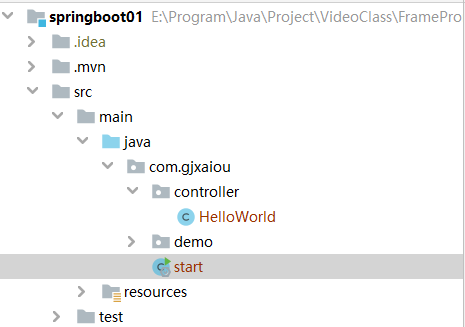

## SpringBoot 第一章

- SpringBoot 介绍
- 构建 SpringBoot 项目及启动器讲解 
- SpringBoot 入门 HelloWorld

## 一，SpringBoot 介绍

- 如果使用 Spring 开发一个"HelloWorld"的 web 应用： 
    - 创建一个 web 项目并且导入相关 jar 包。SpringMVCServlet 
    - 创建一个 web.xml 
    - 编写一个控制类(Controller) 
    - 需要一个部署 web 应用的服务器 如 tomcat

- SpringBoot 特点：
    - SpringBoot 设计目的是用来简化新 Spring 应用的初始搭建以及开发过程。 
    - 嵌入的 Tomcat，无需部署 WAR 文件
    - SpringBoot 并不是对 Spring 功能上的增强，而是提供了一种快速使用 Spring 的方 式。

## 二，构建 SpringBoot 项目及启动器讲解

- 使用 maven 构建 SpringBoot 项目

- 修改 pom 文件 将 jdk 的版本更新为 1.8
- 注入 SpringBoot 启动坐标

```xml
<!-- springBoot的启动器 --> 
<dependency> 
    <groupId>org.springframework.boot</groupId> 
    <artifactId>spring-boot-starter-web</artifactId> 
</dependency>
```

- SpringBoot 启动器。
    所谓的 springBoot 启动器其实就是一些 jar 包的集合。SprigBoot 一共提供 44 启动器。 

    - spring-boot-starter-web 

        支持全栈式的 web 开发，包括了 romcat 和 springMVC 等 jar 

    - spring-boot-starter-jdbc 

        支持 spring 以 jdbc 方式操作数据库的 jar 包的集合 

    - spring-boot-starter-redis 

        支持 redis 键值存储的数据库操作

        

## 三，SpringBoot 入门 HelloWorld

- 编写返回 HelloWorld 的 Controller

```java
package com.gjxaiou.controller;

import org.springframework.stereotype.Controller;
import org.springframework.web.bind.annotation.RequestMapping;
import org.springframework.web.bind.annotation.ResponseBody;

import java.util.HashMap;
import java.util.Map;

/**
 * @Author GJXAIOU
 * @Date 2020/1/6 20:40
 */
@Controller
public class HelloWorld {
    // 处理 controller 的方法
    // 方法和路径进行绑定
    @ResponseBody
    @RequestMapping("/hello")
    public Map<String, Object> showHelloWorld() {
        Map<String, Object> map = new HashMap<>();
        map.put("msg", "HelloWorld");
        return map;
    }
}

```

- 启动 SpringBoot 编写启动类

```java
package com.gjxaiou;

import org.springframework.boot.SpringApplication;
import org.springframework.boot.autoconfigure.SpringBootApplication;

/**
 * @Author GJXAIOU
 * @Date 2020/1/6 20:45
 */
@SpringBootApplication
public class start {
    public static void main(String[] args) {
        SpringApplication.run(start.class, args);
    }
}
// 输入：http://localhost:8080/hello

```


- 关于编写启动器需要注意的问题
    启动器存放的位置。启动器可以和 controller 位于同一个包下，或者位于 controller 的上一级 包中，但是不能放到 controller 的平级以及子包下。

    

