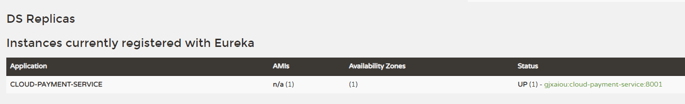
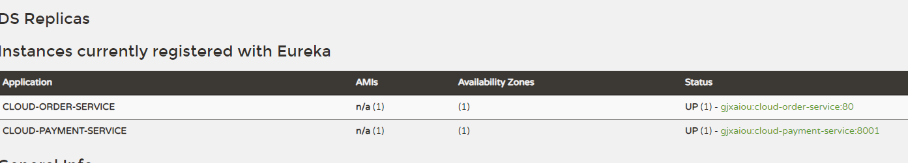
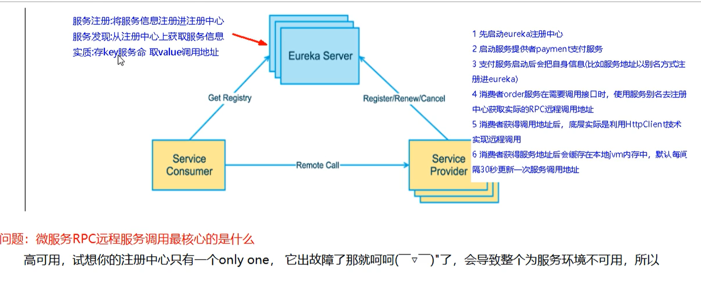

# 服务注册与发现： Rureka

## Eureka 基础知识

### 什么是服务注册
Eureka 采用了 CS 的设计架构，Eureka Server 作为服务注册功能的服务器，它是**服务注册中心**，而系统中其他微服务，使用 Eureka 的客户端连接到 Eureka Server 并**维持心跳连接**，这样系统维护人员就可以通过 Eureka Server来监控各个微服务是否正常运行。

在服务注册与发现中有一个注册中心，服务器启动时，会把当前自己的服务器信息比如服务地址，通信地址等注册到注册中心上，另一方（消费者）以别名的方式在注册中心上获取实际的服务器通讯地址，然后再实现本地RPC调用远程RPC。远程调用框架核心设计思想：在于注册中心，因为使用注册中心管理每个服务于服务之间的一个依赖关系（服务治理概念）。在任何 RPC 远程框架中，都会有一个注册中心（存放服务地址相关信息（接口地址））。


### Eureka的两个组件
- Eureka Server 提供服务注册服务
    各个微服务节点通过配置启动后，会在 EurekaServer 中进行注册，这样 EurekaServer 中的服务注册表中将会存储所有可用服务节点的信息。

- EurekaClient 通过注册中心进行访问
    是一个Java 客户端，用于简化与 Eureka Server 的交互，客户端也同时具备一个内置的，使用轮询负载算法的负载均衡器。在应用启动后，将会向 Eureka Server 发送心跳（默认周期30秒）。如果 Eureka Server 在多个心跳周期内没有接收到某个节点的心跳，EurekaServer 将会从服务注册表中将这个服务节点移除（默认 90 秒）

## 单机 Eureka 构建步骤
### IDEA生成eurekaServer端服务注册中心，类似物业公司
1. 建Module
cloud-eureka-server7001
2. 改pom
```xml
<?xml version="1.0" encoding="UTF-8"?>
<project xmlns="http://maven.apache.org/POM/4.0.0"
         xmlns:xsi="http://www.w3.org/2001/XMLSchema-instance"
         xsi:schemaLocation="http://maven.apache.org/POM/4.0.0 http://maven.apache.org/xsd/maven-4.0.0.xsd">
    <parent>
        <artifactId>SpringCloud2020</artifactId>
        <groupId>com.gjxaiou.springcloud</groupId>
        <version>1.0-SNAPSHOT</version>
    </parent>
    <modelVersion>4.0.0</modelVersion>

    <artifactId>cloud-eureka-server7001</artifactId>
    <dependencies>
        <!-- eureka-server -->
        <dependency>
            <groupId>org.springframework.cloud</groupId>
            <artifactId>spring-cloud-starter-netflix-eureka-server</artifactId>
        </dependency>
        <!-- 引用自己定义的api通用包，可以使用Payment支付Entity -->
        <dependency>
            <groupId>com.gjxaiou.springcloud</groupId>
            <artifactId>cloud-api-commons</artifactId>
            <version>1.0-SNAPSHOT</version>
        </dependency>
        <dependency>
            <groupId>org.springframework.boot</groupId>
            <artifactId>spring-boot-starter-web</artifactId>
        </dependency>
        <!--监控-->
        <dependency>
            <groupId>org.springframework.boot</groupId>
            <artifactId>spring-boot-starter-actuator</artifactId>
        </dependency>
        <!-- 一般通用配置 -->
        <dependency>
            <groupId>org.springframework.boot</groupId>
            <artifactId>spring-boot-devtools</artifactId>
            <scope>runtime</scope>
            <optional>true</optional>
        </dependency>
        <dependency>
            <groupId>org.projectlombok</groupId>
            <artifactId>lombok</artifactId>
            <optional>true</optional>
        </dependency>
        <dependency>
            <groupId>org.springframework.boot</groupId>
            <artifactId>spring-boot-starter-test</artifactId>
            <scope>test</scope>
        </dependency>
    </dependencies>

</project>
```
3. 写YML
```yml
server:
  port: 7001
eureka:
  instance:
    hostname: localhost # eureka服务端实例名称
  client:
    # false表示不向注册中心注册自己
    register-with-eureka: false
    # false表示自己就是注册中心，职责是维护服务实例，并不需要去检索服务
    fetch-registry: false
    service-url:
      # 设置与 eureka server交互的地址查询服务和注册服务都需要依赖这个地址
      defaultZone:  http://${eureka.instance.hostname}:${server.port}/eureka/


```
4. 主启动
```java
package com.gjxaiou.springcloud;

import org.springframework.boot.SpringApplication;
import org.springframework.boot.autoconfigure.SpringBootApplication;
import org.springframework.cloud.netflix.eureka.server.EnableEurekaServer;

@SpringBootApplication
// 声明自己是 eureka 的服务端
@EnableEurekaServer
public class EurekaMain7001 {
    public static void main(String[] args) {
        SpringApplication.run(EurekaMain7001.class, args);
    }
}

```
5. 测试
浏览器进入 http://localhost:7001/ 看能不能看到 eureka 的服务页面
### EurekaClient 端 cloud-provider-payment8001 将注册进 EurekaServer 成为服务提供者 provider ，类似尚硅谷对外提供授课服务
1. 引入坐标依赖
```xml
        <!--eureka-client-->
        <dependency>
            <groupId>org.springframework.cloud</groupId>
            <artifactId>spring-cloud-starter-netflix-eureka-client</artifactId>
        </dependency>
```
2. 更改yml配置
```yml
eureka:
  client:
    #表示是否将自己注册进EurekaServer默认为true
    register-with-eureka: true
    #是否从EurekaServer抓取已有的注册信息，默认为true。单节点无所谓，集群必须设置为true才能配合ribbon使用 负载均衡
    fetch-registry: false
    service-url:
      defaultZone:  http://localhost:7001/eureka
```
3. 添加注解
8001启动类添加 `@EnableEurekaClient`注解
4. 测试
进入http://localhost:7001/可以看到DS Replicas
Instances currently registered with Eureka 下的服务端口




### EurekaClient端 cloud-consumer-order80注册进EurekaServer成为服务注册者consumer，类似来尚硅谷上课的同学

步骤同上




## 集群 Eureka 构建步骤

#### Eureka 集群原理说明



### 集群的目的
高可用，如果注册中心只有一个，出了故障就会导致整个服务环境不可用
解决方法：搭建Eureka注册中心集群，实现负载均衡+故障排错


多个 eureka serve 相互注册，保障信息共享。

### 搭建集群
1. 将7001模块复制
2. 粘贴后修改 pom 文件，yml文件，主启动类
3. 在主 pom 文件中的 moudles 中加入 7002 即可
### 集群与单机的区别
1. 修改映射文件
找到 C:\Windows\System32\drivers\etc 下的 hosts文件添加
127.0.0.1	eureka7001.com
127.0.0.1	eureka7002.com
2. yml 文件
```yml
# 仅写修改的部分
eureka:
  instance:
    hostname: eureka7001.com # eureka服务端实例名称，集群名字要不同有区分
  client:
    service-url:
      # 设置与 eureka server交互的地址查询服务和注册服务都需要依赖这个地址，因为两台集群所以相互注册
      defaultZone:  http://eureka7002.com:7002/eureka/
```
3. 测试
访问
http://eureka7001.com:7001/
http://eureka7002.com:7002/
可以看到两者相互注册
3. 问题
三台集群如何相互守望注册
### 把微服务模块 payment 与 order 发布到 eureka 集群上
1. 修改两个模块的pom文件
  defaultZone:  http://eureka7002.com:7002/eureka/,http://eureka7001.com:7001/eureka/

2. 测试，启动微服务，先启动 EurekaServer（即 7001 和 7002 服务），然后启动服务提供者：8001，然后启动服务消费者：80。

    使用 `http://eureka7001.com:7001/` 和 `http://eureka7002.com:7002/` 查看是否都注入了两个服务，是否都注入了对方。

    4. http://localhost/consumer/payment/get/34
### 支付模块微服务的集群配置

即 支付服务提供者也进行集群配置

1. 复制模块8001，更改端口为8002
2. 修改 8001与8002的controller
    ```java
    // 在各个方法中调用 serverPort 查看端口号，这个取值就是从配置文件中进行取值。
    @Value("${server.port}")
    private String serverPort;
    ```
3. 修改 80 中controller的PAYMENT_URL
    * 在之前单机版中写死为8001，但是集群后有8001与8002，
    * 进入 http://eureka7001.com:7001/ 查看 8001 与 8002 对应的名称 application
    * 将 PAYMENT_URL 改为 http+application 名 :http://CLOUD-PAYMENT-SERVICE
    * 此时未开启负载均衡不能访问页面：将80端口下的配置类ApplicationContextConfig 下生成的 RestTemplate 的bean方法上添加注解 @LoadBalanced
    * http://localhost/consumer/payment/get/34 访问查看端口号，可以看到在8001与8002之间来回切换
# actuator微服务信息完善
修改主机名与暴露ip地址
可在http://eureka7002.com:7002/ 查看自定义主机名的变化
鼠标在主机名上方，浏览器下面会出现ip地址
```yml
eureka
    instance:
      instance-id: payment8002  # 自定义主机名
      prefer-ip-address: true # 设置暴露ip地址
```
# 服务发现Discovery
1. 8001 的 controller添加代码
  ```java
    @Resource
    private DiscoveryClient discoveryClient;

    @GetMapping("/payment/discovery")
    public DiscoveryClient discovery(){
        // 得到所有服务名
        List<String> services = discoveryClient.getServices();
        services.forEach(ele->{
            log.info("***service***"+ele);
        });
        // 得到服务名对应的信息
        List<ServiceInstance> instances = discoveryClient.getInstances("CLOUD-PAYMENT-SERVICE");
        instances.forEach(ele->{
            log.info(ele.getServiceId()+"\t"+ele.getHost()+"\t"+ele.getPort()+"\t"+ele.getUri());
        });

        return discoveryClient;
    }
  ```
2. 8001 主类添加注解 @EnableDiscoveryClient
3. 重启服务，观察日志

# eureka自我保护
### 自我保护理论
1. 为什么会产生自我保护？
为了防止 EurekaClient 可以正常运行，但是在 EurekaServer 网络不通的情况下，EurekaServer 不会立刻将 EurekaClient 服务剔除。
2. 什么是自我保护模式？
默认情况下，EurekaServer在一定时间内没有接收到某个微服务实例的心跳，EurekaServer将会注销该实例（默认90s），但是当网络分区故障发生，微服务与 EurekaServer 之间无法正常通信，以上行为就非常危险。当EurekaServer节点在短时间内丢失过多客户端时，那么这个节点就会进入自我保护模式。
### 禁止自我保护
1. 将 7001 与 8001 改为单机版：修改对应 eureka 地址
2. yml文件
```yml
# 7001
eureka:
  server:
    # 关闭自我保护机制
    enable-self-preservation: false
    # 心跳时间默认90s，改为2000ms，即2s
    eviction-interval-timer-in-ms: 2000

# 8001
eureka:
  instance:
    #eureka客户端发送心跳的时间间隔，默认30s
    lease-renewal-interval-in-seconds: 1
    #eureka服务端在收到最后一次心跳等待的时间上线，默认90s
    lease-expiration-duration-in-seconds: 2
```
3. 测试
  1. 访问 http://eureka7001.com:7001/ 可以看到红字THE SELF PRESERVATION MODE IS TURNED OFF. THIS MAY NOT PROTECT INSTANCE EXPIRY IN CASE OF NETWORK/OTHER PROBLEMS.代表自我保护关闭
  2. 关闭8001服务可以看到在 eureka 页面两秒后 8001 服务消失
