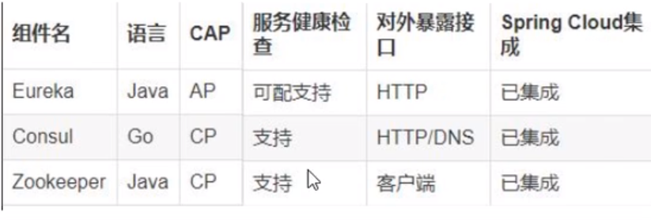
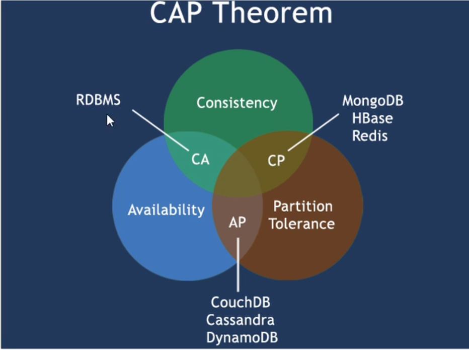

# 简介
### 是什么？
https://www.consul.io/intro
Consul是一种服务网格解决方案，提供具有服务发现，配置和分段功能的全功能控制平面。这些功能中的每一个都可以根据需要单独使用，也可以一起使用以构建完整的服务网格。Consul需要一个数据平面，并支持代理和本机集成模型。Consul附带了一个简单的内置代理，因此一切都可以直接使用，还支持Envoy等第三方代理集成。
### 能做什么？
* 服务发现：Consul的客户端可以注册服务，例如 api或mysql，其他客户端可以使用Consul来发现给定服务的提供者。使用DNS或HTTP，应用程序可以轻松找到它们依赖的服务。

* 运行状况检查：领事客户端可以提供任何数量的运行状况检查，这些检查可以与给定服务（“ Web服务器返回200 OK”）或与本地节点（“内存利用率低于90％”）相关联。操作员可以使用此信息来监视群集的运行状况，服务发现组件可以使用此信息将流量路由到运行状况不佳的主机之外。

* KV商店：应用程序可以将Consul的分层键/值存储用于多种目的，包括动态配置，功能标记，协调，领导者选举等。简单的HTTP API使其易于使用。

* 安全的服务通信：领事可以为服务生成并分发TLS证书，以建立相互TLS连接。 意图 可用于定义允许哪些服务进行通信。可以使用可以实时更改的意图轻松管理服务分段，而不必使用复杂的网络拓扑和静态防火墙规则。

* 多数据中心：Consul开箱即用地支持多个数据中心。这意味着Consul的用户不必担心会构建其他抽象层以扩展到多个区域。
### 去哪下？
https://www.consul.io/downloads
### 怎么玩？
https://www.springcloud.cc/spring-cloud-consul.html
# 安装启动
1. 将下载的exe文件双击即可安装
2. 在 exe ==文件的目录==下打开黑窗口
3. 输入 consul --version 检测是否安装成功
4. 启动服务：consul agent -dev
5. 通过 http://localhost:8500/ 访问web界面
# 服务提供者
1. 改pom
```xml
    <dependency>
        <groupId>org.springframework.cloud</groupId>
        <artifactId>spring-cloud-starter-consul-discovery</artifactId>
    </dependency>
```
2. 建yml
```yml
server:
  port: 8006
spring:
  application:
    name: cloud-provider-payment
  cloud:
    consul:
      host: localhost
      port: 8500
      discovery:
        service-name: ${spring.application.name}
```
3. 建启动类
4. 建controller类
5. 测试
http://localhost:8006/payment/consul
http://localhost:8500/ui/dc1/services
# 服务消费者
1. 改pom
```xml
    <dependency>
        <groupId>org.springframework.cloud</groupId>
        <artifactId>spring-cloud-starter-consul-discovery</artifactId>
    </dependency>
```
2. 建yml
```yml
server:
  port: 80
spring:
  application:
    name: cloud-consumer-order
  cloud:
    consul:
      host: localhost
      port: 8500
      discovery:
        service-name: ${spring.application.name}
```
3. 建启动类
4. 建controller
5. 测试
http://localhost/consumer/payment/cs
http://localhost:8006/payment/consul
# 三个注册中心 eureka zookeeper consul的异同点


### CAP
C:Cosistency（强一致性）
A:Availability（可用性）
P:Partition tolerance（分区容错性）
CAP理论关注粒度是数据，而不是整体系统设计的

