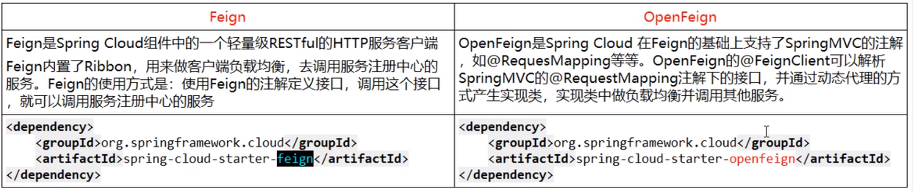

# 是什么
Feign是声明性Web服务客户端。它使编写Web服务客户端更加容易。要使用Feign，请创建一个接口并对其进行注释。它具有可插入的注释支持，包括Feign注释和JAX-RS注释。Feign还支持可插拔编码器和解码器。Spring Cloud添加了对Spring MVC注释的支持，并支持使用HttpMessageConvertersSpring Web中默认使用的注释。Spring Cloud集成了Ribbon和Eureka以及Spring Cloud LoadBalancer，以在使用Feign时提供负载平衡的http客户端。
# 能干什么
* 使编写Java Http客户端更加容易
使用 RestTemplate+Ribbon 时，利用 RestTemplate 对http 请求的封装处理，形成一套模板化的调用方法，但是在实际中，由于对服务的调用可能不止一处，往往一个接口会被多处调用，所以通常都会针对每个微服务自行封装一些客户端类来包装这些依赖服务的调用。所以Feign在此基础上做了进一步封装，由他来帮助我们定义和实现服务接口的定义。在==Feign的实现下我们只需要创建一个接口并使用注解来配置它(以前是Dao接口上标注Mapper注解，现在是一个微服务接口上面标注一个Feign注解即可)==。自动封装服务调用客户端的开发量。
* Feign集成了Ribbon
利用Ribbon维护了Payment的服务列表信息，并且实现了轮询实现客户端的负载均衡。而与Ribbon不同的是，==feign只需要定义服务绑定接口且以声明式的方法==，优雅而简单的实现服务调用。
* Feign与OpenFeign区别


### 官网
https://cloud.spring.io/spring-cloud-openfeign/2.2.x/reference/html/

# 建项目：cloud-consumer-frign-order80
1. 改pom
2. 建yml
3. 写启动类
```java
@SpringBootApplication
@EnableFeignClients
public class OrderFeignMain80 {
    public static void main(String[] args) {
        SpringApplication.run(OrderFeignMain80.class,args);
    }
}
```
4. 写业务类
```java
@Component
// 将业务提供者的名写进去
@FeignClient(value = "CLOUD-PAYMENT-SERVICE")
public interface PaymentFeignService {

// 将业务提供者的controller路径和方法复制粘贴进来
    @GetMapping("/payment/get/{id}")
    public CommonResult getPaymentById(@PathVariable("id")Long id);
}
```
5. controller
```java
    @GetMapping("/consumer/payment/get/{id}")
    public CommonResult<Payment> getPaymentById(@PathVariable Long id){
        return paymentFeignService.getPaymentById(id);
    }
```
# 超时控制
1. 8001 暂停
2. 通过 8001访问
http://localhost:8001/timeout
可以访问
3. 通过80 访问
异常
4. OpenFeign 默认等待时间 1s
5. 设置超时时间
6. 测试
# 日志增强
### 日志级别
1. NONE：默认不显示日志
2. BASIC：仅记录请求方法，URL，响应状态及执行时间
3. HEADERS：除了BASIC中定义的信息之外，还有请求和响应的头信息
4. FULL：除了HEADERS中定义的信息外，还有请求和响应的正文及元数据
### 配置类
```java
import feign.Logger;

@Configuration
public class FeignConfig {
    @Bean
    Logger.Level feignLoggerLevel(){
        return Logger.Level.FULL;
    }
}
```
### 选择日志监听接口
```yml
logging:
  level: 
    # 选择具体接口的日志输出 级别为debug
    com.wxh.springcloud.service.PaymentFeignService: debug
```
