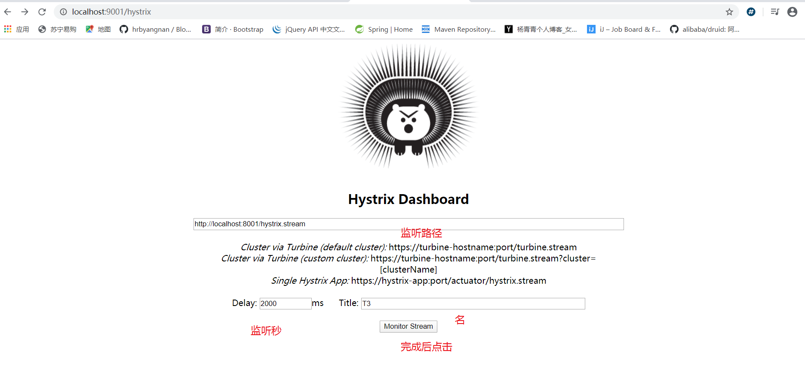

# 简介
### 分布式系统面临的问题
复杂分布式系统中的应用程序有数十个依赖关系，每个依赖关系在某些时候不可避免的失败。

多个微服务之间调用时，假设 A 调B和C，B和C又调其他微服务，就是所谓的扇出。当扇出的链路上某个微服务响应时间过长或不可用对A的调用就会占用越来越多的资源，进而引起系统崩溃 ，所谓的雪崩效应。
### 是什么
Hystrix 是处理分布式系统的延迟和容错的开源库，保证一个依赖出现问题时不会导致整体服务失败，避免级联故障，以提高分布式系统弹性。
断路器本身是一种开关装置，当某个服务单元发生故障后，通过断路器的故障监控，向调用方返回一个符合预期的可处理的备选响应，而不是长时间的等待或抛出调用方法无法处理的异常 。
### 官网资料
https://github.com/Netflix/Hystrix
停更
# Hystrix重要概念
### 服务降级
1. 服务器忙，请稍后重试，不让客户端等待并立即返回一个友好的提示。
2. 哪些情况会导致服务降级
    1. 程序运行异常
    2. 超时
    3. 服务熔断触发服务降级
    4. 线程池/信号量打满
### 服务熔断
1. 类比保险丝达到最大服务访问时，直接拒绝访问，拉闸限电，然后调用服务降级的方法返回友好提示。
2. 服务降级->进而熔断->恢复调用链路
### 服务限流
1. 秒杀高并发等操作，严禁一窝蜂过来拥挤，一秒N个有序进行。
# 案例
### 准备cloud-provider-hystrix-payment8001
将 7001换成单机版
### 构建
1. 新建 
2. pom
```xml
<dependency>
    <groupId>org.springframework.cloud</groupId>
    <artifactId>spring-cloud-starter-netflix-hystrix</artifactId>
</dependency>
```
3. yml
```yml
server:
  port: 8001
spring:
  application:
    name: cloud-provider-hystrix-payment

eureka:
  client:
    register-with-eureka: true
    fetch-registry: true
    service-url:
      defauleZone:  http://eureka7001.com:7001/eureka
```
4. 主启动
5. 业务类
6. 测试
先启动7001，在启动8001测试两个方法，全部正常
### 使用Jmeter模拟高并发
51集
高并发打到http://localhost:8001/timeout/1上
###### 使用后
http://localhost:8001/ok/1 也有延迟
上述还是8001单独测试，如果外部消费者80也来访问，那么消费者只能干等，最终导致消费端80不满意，服务端8001直接被拖死。
###### 加入80
1. 建moudle cloud-consumer-feign-hystrix-order80
2. pom
3. yml
4. 主启动类
5. service
6. controller
7. 测试
    1. 正常情况下
        1. http://localhost:8001/ok/1
        2. http://localhost:8001/timeout/1
        3. http://localhost/ok/1
        4. 通过80 访问的非常快
    2. 高并发打到8001端口时,80端口也会非常慢
###### 如何解决
1. 超时导致服务器变慢（转圈）->超时不再等待
2. 出错（宕机或程序运行时出错）->出错要有兜底
3. 解决
    1. 8001 超时，调用者 80 不能一直等待，必须有服务降级
    2. 服务 8001 宕机，调用者 80 不能一直等待，必须有服务降级
    3. 服务 8001 OK ，调用者自己出故障或有自我要求（自己的等待时间小于服务提供的时间。），自己降级处理
# 服务降级
### 超时：8001
service
```java
@Service
public class PaymentService {
    public String paymentInfo_OK(Integer id){
        return "线程池："+Thread.currentThread().getName()+"ok"+id;
    }

    // 设置超过 3 秒采用服务降级
    @HystrixCommand(fallbackMethod = "paymentInfo_TimeoutHandler",commandProperties = {
            @HystrixProperty(name="execution.isolation.thread.timeoutInMilliseconds",value = "3000")
    })
    public String paymentInfo_Timeout(Integer id){
        try {
            TimeUnit.SECONDS.sleep(5);
        } catch (InterruptedException e) {
            e.printStackTrace();
        }
        return "线程池："+Thread.currentThread().getName()+"Timeout"+id;
    }
    // 异常后调用的方法
    public String paymentInfo_TimeoutHandler(Integer id){
        return "服务超时，调用服务降级成功";
    }
}
```
main
```java
@EnableCircuitBreaker
```
### 运行异常：8001
service
```java
    @HystrixCommand(fallbackMethod = "paymentInfo_TimeoutHandler",commandProperties = {
            @HystrixProperty(name="execution.isolation.thread.timeoutInMilliseconds",value = "3000")
    })
    public String paymentInfo_Timeout(Integer id){
        int a = 10/0;
//        try {
//            TimeUnit.SECONDS.sleep(5);
//        } catch (InterruptedException e) {
//            e.printStackTrace();
//        }
        return "线程池："+Thread.currentThread().getName()+"Timeout"+id;
    }
```
无论是运行异常还是超时都有兜底策略
### 订单侧：80，先去掉8001的超时和异常
==既可以配在客户端也可以配在服务端，一般建议放在客户端==
1. yml
```yml
feign:
  hystrix:
    enabled: true
```
2. controller 
改为同 8001 的 service 一样
3. 主类
添加 @EnableHystrix 注解
4. 注意：降级处理方法参数列表必须跟异常方法一样
### 全面服务降级
###### 存在问题
1. 每一个方法都需要配置一个降级方法
2. 和业务代码在一起
###### 解决
1. 第一个问题
    controller
    ```java
    @RestController
    @Slf4j
    // 1. 添加注解，标注全局服务降级方法
    @DefaultProperties(defaultFallback = "paymentGlobalFallBack")
    public class OrderController {
        @Resource
        private PaymentHystrixService service;

        // 3. 写 @HystrixCommand单不指定具体方法 
        @GetMapping("/ok/{id}")
        @HystrixCommand
        public String paymentInfo_OK(@PathVariable Integer id) {
            int a = 10/0;
            return service.paymentInfo_OK(id);
        }

        public String paymentInfo_TimeoutHandler(Integer id){
            return "80异常，降级处理";
        }

        // 2. 定义全局服务降级方法
        // 下面是全局 fallback
        public String paymentGlobalFallBack(){
            return "80：获取异常，调用方法为全局fallback";
        }
    }

    ```
2. 第二个问题
    1. 找到注解 @FeignClient 对应的接口
    2. 再写一个类实现该接口，对降级方法进行处理
        ```java
        @Component
        @FeignClient(value = "CLOUD-PROVIDER-HYSTRIX-PAYMENT",fallback = PaymentFallBackService.class)
        public interface PaymentHystrixService {}

        @Component
        public class PaymentFallBackService implements PaymentHystrixService {}
        ```
    3. 测试在 8001 内加异常，或使 8001 宕机 ，返回异常处理
# 服务熔断
### 简介
类比保险丝，达到最大访问后直接拒绝访问，拉闸限电，然后调用服务降级。当检测==到该节点微服务调用正常后，恢复调用链路。==
当失败的调用达到一定阈值，缺省是5s内20次调用失败，就会启动熔断机制。熔断机制的注解是，@HystrixCommand
### 是什么
https://martinfowler.com/bliki/CircuitBreaker.html
### 实践：8001
1. service
```java
    // 服务熔断
    @HystrixCommand(fallbackMethod = "paymentInfo_Circuit",commandProperties = {
            @HystrixProperty(name="circuitBreaker.enabled",value = "true"),//是否开启断路器
            @HystrixProperty(name="circuitBreaker.requestVolumeThreshold",value = "10"),// 请求次数
            @HystrixProperty(name="circuitBreaker.sleepWindowInMilliseconds",value = "10000"),// 时间窗口期
            @HystrixProperty(name="circuitBreaker.errorThresholdPercentage",value = "60")// 失败率
            // 加起来就是在10s内的10次请求中如果失败超过6次进入服务熔断
    })
    public String paymentCircuitBreaker(@PathVariable("id") Integer id){
        if (id<0){
            throw new RuntimeException("id 不能为负数");
        }
        String serialNumber = IdUtil.simpleUUID();

        return "调用成功："+serialNumber;
    }

    public String paymentInfo_Circuit(Integer id){
        return "id不能为负数："+id;
    }
```
2. controller
```java
    // 服务熔断
    @GetMapping("/circuit/{id}")
    public String paymentCircuitBreaker(@PathVariable("id") Integer id){
        String result = paymentService.paymentCircuitBreaker(id);
        log.info("************"+result);
        return result;
    }
```
3. 结果
一直输入id为负数，达到失败率后即使输入id为正数也进入错误页面。
# 总结
### 熔断类型
1. 熔断打开
请求不再进行调用当前服务，内部设有时钟一般为 MTTR，当打开时长达时钟则进入半熔断状态
2. 熔断关闭
熔断关闭不会对服务进行熔断
3. 熔断半开
根据规则调用当前服务，符合规则恢复正常，关闭熔断
### 什么时候打开
设计三个参数：时间窗，请求总阈值，错误百分比阈值
1. 快照时间窗：默认为最近的10s
2. 请求总数阈值：必须满足请求总阈值才有资格熔断。默认为20。意味着在10s内，如果命令调用次数不足20次，即使所有请求都超时或其他原因失败断路器都不会打开
3. 错误百分比阈值：在快照时间窗内请求总数超过阈值，且错误次数占总请求次数的比值大于阈值，断路器将会打开

# web界面图形化展示Dashboard
### 搭建
1. 建 moudle
cloud-consumer-hystrix-dashboard9001
2. pom
```xml
<dependency>
    <groupId>org.springframework.cloud</groupId>
    <artifactId>spring-cloud-starter-netflix-hystrix-dashboard</artifactId>
</dependency>
```
3. yml
只需要配置端口号就行
4. 启动类
加注解@EnableHystrixDashboard
5. 测试
http://localhost:9001/hystrix有页面即为成功

### 使用
###### 注意
1. 注意：依赖于actuator，要监控哪个接口，哪个接口必须有这个依赖
2. 业务模块需要添加bean
```java
    @Bean
    public ServletRegistrationBean getServlet(){
        HystrixMetricsStreamServlet streamServlet = new HystrixMetricsStreamServlet();
        ServletRegistrationBean registrationBean = new ServletRegistrationBean(streamServlet);
        registrationBean.setLoadOnStartup(1);
        registrationBean.addUrlMappings("/hystrix.stream");
        registrationBean.setName("HystrixMetricsStreamServlet");
        return registrationBean;
    }
```
###### 使用


1. 进行8001 的访问查看对应页面变化
2. 页面状态
    1. 七色
        对应不同状态
    2. 一圈
        对应访问量
    3. 一线
        访问趋势