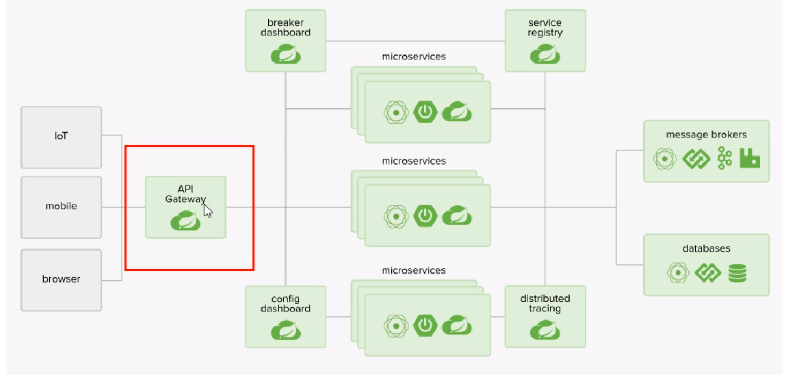
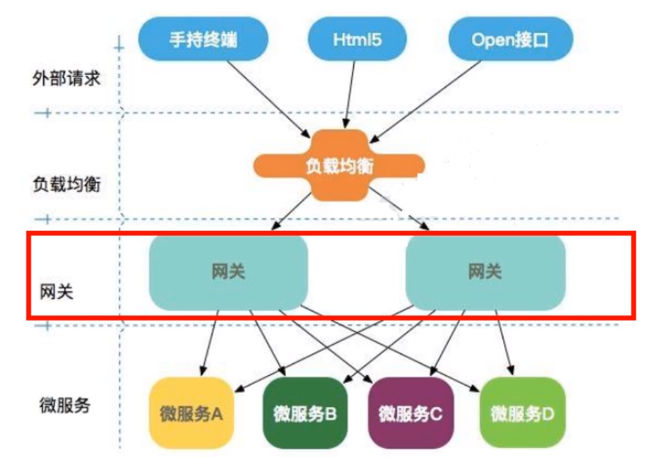

# 概述
### 官网
https://cloud.spring.io/spring-cloud-static/spring-cloud-gateway/2.2.2.RELEASE/reference/html/
### 结构




### 三大核心概念
1. Route（路由）
网关的基本构建块。它由ID，目标URI，谓词集合和过滤器集合定义。如果断言为true，则匹配路由。
2. Predicate（断言）
这是Java 8 Function谓词。输入类型是Spring FrameworkServerWebExchange。这使您可以匹配HTTP请求中的所有内容，例如标头或参数。
3. Filter（过滤器）
这些是使用特定工厂构造的Spring FrameworkGatewayFilter实例。在这里，您可以在发送下游请求之前或之后修改请求和响应。

### 工作流程


客户端向Spring Cloud Gateway发出请求。如果网关处理程序映射确定请求与路由匹配，则将其发送到网关Web处理程序。该处理程序通过特定于请求的过滤器链来运行请求。筛选器由虚线分隔的原因是，筛选器可以在发送代理请求之前和之后运行逻辑。所有“前置”过滤器逻辑均被执行。然后发出代理请求。发出代理请求后，将运行“后”过滤器逻辑。

# 实践
### 建模块:cloud-gateway-gateway9527
1. pom
```xml
<dependency>
    <groupId>org.springframework.cloud</groupId>
    <artifactId>spring-cloud-starter-gateway</artifactId>
</dependency>
<!-- 注意不要添加 web的依赖，与gateway里的web flux冲突 -->
```
2. yml
```yml
server:
  port: 9527
spring:
  application:
    name: cloud-gateway
eureka:
  instance:
    hostname: cloud-gateway-service
  client:
    service-url:
       register-with-eureka:  true
       fetch-registry:  true
       defaultZone: http://eureka7001.com:7001/eureka
```
3. 启动类
```java
@SpringBootApplication
@EnableEurekaClient
@EnableDiscoveryClient
```
### 测试
1. 9527中配置路由
```yml
spring:
  application:
    name: cloud-gateway
  cloud:
    gateway:
      routes: # 可以配置多个路由
        - id: payment_routh # 路由id，没有固定规则但要求唯一
          uri:  http://localhost:8001 # 匹配后提供服务的路由地址
          predicates:
            - Path=/payment/get/** # 路径相匹配的进行路由

        - id: payment_routh2 # 路由id，没有
          uri:  http://localhost:8001 # 匹配后提供服务的路由地址
          predicates:
            - Path=/payment/payment # 路径相匹配的进行路由
```
2. 配置后可以通过以下路径访问8001中的信息
http://localhost:9527/payment/get/31
不再暴露8001的端口
3. 配置路由的另一种方法，9527注入 RouteLocator的Bean
```java
@Configuration
public class GateWayConfig {
    @Bean
    public RouteLocator routeLocator(RouteLocatorBuilder routeLocatorBuilder){
        RouteLocatorBuilder.Builder  routes = routeLocatorBuilder.routes();

        /*
        * 代表访问http://localhost:9527/guonei
        * 跳转到http://news.baidu.com/guonei
        * */
        routes.route("route1",
                r->r.path("/guonei")
                .uri("http://news.baidu.com/guonei")).build();
        return routes.build();
    }
}
```

# 动态路由
1. 9527yml
```yml
server:
  port: 9527
spring:
  application:
    name: cloud-gateway
  cloud:
    gateway:
      discovery:
        locator:
          enabled: true # 1.开启从服务在注册中心动态创建路由的功能
      routes:
        - id: payment_routh
#          uri:  http://localhost:8001 # 匹配后提供服务的路由地址
          uri:  lb://cloud-payment-service # 2.输入服务名，lb代表负载均衡
          predicates:
            - Path=/payment/get/** 

        - id: payment_routh2 
#          uri:  http://localhost:8001 # 匹配后提供服务的路由地址
          uri:  lb://cloud-payment-service # 2.输入服务名，lb代表负载均衡
          predicates:
            - Path=/payment/create 
```
# Predicate的使用
https://cloud.spring.io/spring-cloud-static/spring-cloud-gateway/2.2.2.RELEASE/reference/html/#the-between-route-predicate-factory
全部在 yml的Predicate之下
1. After
```yml
# 在该时间之后可以使用
- After=2020-05-26T17:07:03.043+08:00[Asia/Shanghai]
```
获取当前时区的时间
```java
ZonedDateTime z = ZonedDateTime.now();// 默认时区
```
2. Before
```yml
# 之前
- Before=2017-01-20T17:42:47.789-07:00[America/Denver]
```
3. Between
```yml
# 之间
- Between=2017-01-20T17:42:47.789-07:00[America/Denver], 2017-01-21T17:42:47.789-07:00[America/Denver]
```
4. Cookie
```yml
# 查看有没有指定kv的cookie
- Cookie=username,wxh
```
5. Header
```yml
# 请求头，跟cookie一样指定kv键值对
```
6. Host
```yml
# 
```
7. Method
```yml
# 
```
8. Path
```yml
# 
```
9. Query
```yml
# 
```
10. ReadBodyPredicateFactory
```yml
# 
```
11. RemoteAddr
```yml
# 
```
12. Weight
```yml
# 
```
13. CloudFoundryRouteService
```yml
# 
```


# 过滤器 Filter
### 单一过滤器
https://cloud.spring.io/spring-cloud-static/spring-cloud-gateway/2.2.2.RELEASE/reference/html/#gatewayfilter-factories
### 全局过滤器
### 请求头过滤器
### 自定义过滤器
1. 实现接口GlobalFilter,Ordered
2. 能干嘛
    1. 全局日志记录
    2. 统一网关鉴权
3. 案例
```java
@Component
@Slf4j
public class MyLogFilter implements GlobalFilter, Ordered {
    @Override
    public Mono<Void> filter(ServerWebExchange exchange, GatewayFilterChain chain) {
        // 判断有没有 uname 这个参数
        log.info("自定义全局日志过滤器");
        String uname = exchange.getRequest().getQueryParams().getFirst("uname");
        if (uname==null){
            log.info("用户名非法");
            exchange.getResponse().setStatusCode(HttpStatus.NOT_ACCEPTABLE);
            return exchange.getResponse().setComplete();
        }
        return chain.filter(exchange);
    }
    /*
    *     int HIGHEST_PRECEDENCE = -2147483648;
            int LOWEST_PRECEDENCE = 2147483647;
            * 加载过滤器顺序
            * 数字越小优先级越高
    * */
    @Override
    public int getOrder() {
        return 0;
    }
}
```

